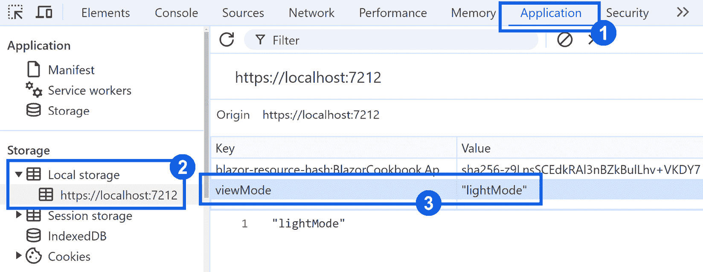

# 5

# 管理应用程序状态

在本章中，我们将探讨维护和操作 Blazor 应用程序状态的关键方面。**应用程序状态**是运行时数据，它决定了应用程序的行为和外观，反映了用户的交互和决策。

我们将介绍各种状态管理策略，从将状态编码到 URL 以实现可书签状态和易于共享，到实现内存中的状态容器以实现快速访问。你将学习如何将应用程序状态作为服务注入，以实现不同组件之间的集中式状态管理，以及如何持久化状态以确保会话间的数据连续性。此外，我们将探讨在应用程序加载时解决持久化状态、从应用程序的任何地方调用状态变化以及使用专用监听组件监控这些变化的技巧。我们将特别关注在不同渲染模式边界之间共享状态。

到本章结束时，你将具备在状态管理实践方面的坚实基础，这将帮助你构建动态、响应和有状态的 Blazor 应用程序。

这里有一些将带我们到达那里的配方：

+   具有可书签状态

+   实现内存中的状态容器

+   将应用程序状态作为服务注入

+   从任何地方调用状态变化

+   持久化状态

+   解决持久化状态

+   在交互渲染模式边界之间共享状态

# 技术要求

那一章节的入门门槛不高。你需要以下工具：

+   一个支持 Blazor 开发的现代 IDE

+   在你的开发机器上安装了 .NET 9

+   一个支持 Web Assembly 和具有 DevTools 的现代网络浏览器

+   一个基本的 Blazor 项目（你将在其中编写代码）

你可以在以下 GitHub 仓库中找到以下配方中引用的所有示例和数据样本：[`github.com/PacktPublishing/Blazor-Web-Development-Cookbook/tree/main/BlazorCookbook.App.Client/Chapters/Chapter05`](https://github.com/PacktPublishing/Blazor-Web-Development-Cookbook/tree/main/BlazorCookbook.App.Client/Chapters/Chapter05)。在需要任何样本的每个配方中，我还会指向你可以找到它们的目录。

# 具有可书签状态

在这个配方中，我们将介绍利用 URL 维护和共享应用程序状态的最简单但功能强大的模式。与更复杂的状态管理策略不同，直接在 URL 中嵌入状态标志不需要内存持久化。静态 URL 允许用户书签特定的应用程序状态，并便于与他人轻松共享该状态。我们将遵循众所周知的**RESTful 路由**模式，并将应用程序状态优雅地映射到可读和可共享的 URL。

让我们创建一个组件，允许我们书签并查看整个事件列表或特定事件信息。

## 准备工作

在开始实现具有可书签状态的组件之前，我们需要做以下事情：

+   创建一个**Chapter05** / **Recipe01**目录——这将是我们的工作目录

+   从 GitHub 仓库中的**Chapter05** / **Data**目录复制**Api**和**Event**文件

## 如何做到这一点…

按照以下步骤在应用程序中实现状态化 URL：

1.  导航到应用程序的**Program**文件并注册**Api**服务，如应用程序的依赖注入容器中定义的：

    ```cs
    builder.Services.AddScoped<Api>();
    ```

1.  创建一个带有两个可导航路由的**Store**组件，以方便用户通过 URL 访问不同的应用程序状态：

    ```cs
    @page "/ch05r01/events"
    @page "/ch05r01/events/{eventId:guid}"
    ```

1.  在**Store**组件的**@code**块内部，注入**Api**服务并声明一个我们将用于获取特定事件详细信息的**EventId**参数：

    ```cs
    [Inject] private Api Api { get; init; }
    [Parameter] public Guid EventId { get; set; }
    ```

1.  仍然在**@code**块中，根据应用程序的当前状态初始化将保存获取数据的**Collection**和**Event**变量：

    ```cs
    protected IList<Event> Collection = [];
    protected Event Event;
    ```

1.  覆盖**OnParametersSetAsync()**生命周期方法并实现基于传递到 URL 中的参数更新组件状态的逻辑：

    ```cs
    protected override async Task OnParametersSetAsync()
    {
        if (EventId != Guid.Empty)
        {
            Event = await Api
                .GetEventAsync(EventId, default);
            return;
        }
        Collection = await Api.GetEventsAsync(default);
    }
    ```

1.  在**Store**组件的标记中，添加一个部分以条件性地渲染**Event**详细信息：

    ```cs
    @if (Event is not null)
    {
        <p>Viewing: @Event.Id</p>
        return;
    }
    ```

1.  在**Store**标记中添加另一个部分以渲染**Collection**元素：

    ```cs
    @foreach (var item in Collection)
    {
        <div class="w-100">
            <a href="/ch05r01/events/@item.Id">
                @item.Id
            </a>
        </div>
    }
    ```

## 它是如何工作的…

在**步骤 1**中，我们导航到应用程序的**Program**并注册 API 服务到应用程序的依赖注入容器中，以便在需要时可以注入它。

在**步骤 2**中，我们创建了一个具有略微增强路由的**Store**组件。我们声明了两个可路由路径——**/ch05r01/events**用于渲染所有可用的活动，以及**/ch05r01/events/{eventId:guid}**用于特定事件的详细信息。通过利用路径参数化和路径约束，我们在大括号内指定了**EventId**参数，将其期望值类型设置为**Guid**。

在**步骤 3**中，我们初始化**@code**块，其中我们声明了路由所期望的**EventId**参数。Blazor 会自动拦截并根据名称匹配分配路径参数值。我们还从提供的示例数据中注入了**Api**服务，使我们能够无缝地获取事件信息。在**步骤 4**中，我们初始化**Collection**和**Event**变量。这些变量对于支持**Store**组件的双重状态至关重要——一个用于展示可用的活动列表，另一个用于展示特定选中活动的详细信息。在**步骤 5**中，我们通过覆盖**OnParametersSetAsync()**生命周期方法来微调渲染逻辑。我们确定**EventId**是否正确解析，并使用注入的**Api**服务获取该特定事件的详细信息。否则，我们检索整个可用的活动集合。

从*步骤 6*开始，我们实现支持两种不同状态的**Store**标记。为了适应这一点，我们包括两个条件标记部分。如果已获取**Event**，表示特定事件的详细信息已准备好显示，我们将渲染其**Id**并快速返回以跳过任何进一步的逻辑。我们通过遍历**Collection**在*步骤 7*中覆盖组件的替代状态。我们渲染指向每个事件详细信息的链接，利用**Store**组件的参数化路径，并在**eventId**参数的位置提供**item.Id**。

## 还有更多...

您会发现参数化路径在**CRUD**（**创建、读取、更新、删除**）场景中非常有用。假设我们将在**Store**组件内实现一个表单，该表单旨在附加到**Event**对象上，我们可以巧妙地将**Guid.Empty**值用作触发创建过程的信号，并初始化一个新的、空的**Event**模型。相反，如果提供了一个有效的**Guid**，我们将从 API 获取现有的**Event**。我们有效地使用相同的表单覆盖了两种场景，避免了代码重复。

在路径中指定值的类型并不是一个严格的要求。默认情况下，Blazor 会将参数映射为字符串，这为您在稍后阶段将它们解析为所需类型提供了灵活性。然而，真正的力量在于有效地利用路由约束。虽然稍后解析参数提供了灵活性，但我强烈建议尽可能利用路由约束。在**Store**组件示例中，通过指定参数类型为**Guid**，如果由于路由约束导致路由不匹配，Blazor 将显示**NotFound**内容——预先过滤掉无效输入，从而增强应用程序的健壮性和安全性。我们将在*第九章*中探讨路由和**NotFound**内容。

# 实现内存状态容器

在现代 Web 开发中，有效地管理与外部 API 的交互至关重要。一个**内存状态容器**允许您在应用程序生命周期内持久化特定对象，除非另有配置。当您在初始调用中从 API 接收到一个完整的数据对象时，而不是在每次页面转换时重新获取这些数据，内存状态容器可以促进整个对象在应用程序的各个阶段和页面之间的平滑传输。此外，在多阶段设置过程中，内存状态容器非常有价值，它允许复杂设置对象的当前状态持久地向前推进，而不会丢失或重复外部调用。

让我们实现一个容器，我们将在此容器中持久化事件信息，并在将用户重定向到事件详情页面后显示这些信息。

## 准备工作

在深入实现内存容器之前，我们需要做以下几步：

+   创建一个**Chapter05**/**Recipe02**目录——这将成为您的工作目录

+   从 GitHub 仓库中**Chapter05**/**Data**目录复制**Api**和**Event**文件

+   将**Api**服务注册为在应用程序的依赖注入容器中作用域内（您可以通过查看*Having a bookmarkable state*菜谱来了解如何操作）

## 如何做到这一点…

按以下步骤实现内存状态容器：

1.  创建一个泛型**StateContainer<T>**类来在内存中持有任何类型的对象：

    ```cs
    public class StateContainer<T> { }
    ```

1.  在**StateContainer<T>**中，初始化一个后端**_container**作为泛型**Dictionary**，您将在其中持久化状态对象：

    ```cs
    private readonly Dictionary<Guid, T> _container = [];
    ```

1.  向**StateContainer<T>**添加**Persist()**和**Resolve()**方法，使用**Guid**键从**_container**存储或检索对象：

    ```cs
    public void Persist(Guid key, T value)
        => _container.TryAdd(key, value);
    public T Resolve(Guid key) => _container[key];
    ```

1.  导航到**Program**应用程序根目录并在依赖注入容器中注册**StateContainer<Event>**：

    ```cs
    builder.Services.AddScoped<StateContainer<Event>>();
    ```

1.  添加一个静态**Config**类并定义一个基于**InteractiveWebAssembly**但禁用了预渲染的定制**PrerenderDisabled**渲染模式：

    ```cs
    internal static class Config
    {
        public static readonly IComponentRenderMode
            PrerenderDisabled = new
                InteractiveWebAssemblyRenderMode(
                    prerender: false);
    }
    ```

1.  创建一个在**PrerenderDisabled**模式下渲染的可路由**Store**组件：

    ```cs
    @page "/ch05r02"
    @rendermode Config.PrerenderDisabled
    ```

1.  在**Store**的**@code**部分，注入**StateContainer<Event>**以持久化**Event**对象，**NavigationManager**以促进导航，以及**Api**从外部源播种数据：

    ```cs
    [Inject]
    private StateContainer<Event> Container { get; init; }
    [Inject]
    private NavigationManager Navigation { get; init; }
    [Inject]
    private Api Api { get; init; }
    ```

1.  仍然在**@code**块内部，初始化一个后端**Data**集合并覆盖**OnInitializedAsync()**生命周期方法以从**Api**获取**Data**对象：

    ```cs
    protected IList<Event> Data = [];
    protected override async Task OnInitializedAsync()
        => Data = await Api.GetEventsAsync(default);
    ```

1.  最后，在**@code**块中，实现一个**ShowDetails()**方法，将请求的**Event**存储在内存中的**StateContainer<Event>**中，并重定向到显示事件详情的页面：

    ```cs
    public void ShowDetails(Event @event)
    {
        Container.Persist(@event.Id, @event);
        Navigation.NavigateTo(
            $"/ch05r02/events/{@event.Id}"
        );
    }
    ```

1.  在**Store**标记中，构建一个循环以渲染来自**Data**集合的所有元素的导航按钮：

    ```cs
    @foreach (var item in Data)
    {
        <div class="row w-50 m-1">
            <button @onclick="@(() => ShowDetails(item))">
                @item.Id
            </button>
        </div>
    }
    ```

1.  创建一个与上一步中指定的路由匹配的**EventDetails**组件，并以**PrerenderDisabled**模式渲染：

    ```cs
    @page "/ch05r02/events/{eventId:guid}"
    @rendermode Config.PrerenderDisabled
    ```

1.  在**EventDetails**的**@code**部分，注入**StateContainer<Event>**并声明一个**EventId**参数以从 URL 捕获事件标识符：

    ```cs
    [Inject]
    private StateContainer<Event> Container { get; init; }
    [Parameter]
    public Guid EventId { get; set; }
    ```

1.  仍然在**@code**块内部，声明一个**Model**变量以维护当前组件状态，并覆盖**OnParametersSet()**生命周期方法以从注入的**Container**解析**Model**：

    ```cs
    protected Event Model;
    protected override void OnParametersSet()
        => Model = Container.Resolve(EventId);
    ```

1.  在**EventDetails**标记中，对**Model**进行空值检查，并在**Model**成功解析时渲染底层事件的当前容量：

    ```cs
    @if (Model is null) return;
    It has @Model.Capacity spots left!
    ```

## 它是如何工作的…

我们通过建立内存状态持久化的基础来开始实施。在*步骤 1*中，我们添加了一个通用类，**StateContainer<T>**。在*步骤 2*中，我们在**StateContainer<T>**内部初始化一个后端集合以持久化状态对象。我们选择**Dictionary<Guid, T>**，因为我们将会利用其直接的键值 API，但任何其他集合类型也同样适用。在*步骤 3*中，我们实现了**Persist()**和**Resolve()**方法。**Persist()**方法接受**key**和**value**，允许我们将对象添加到我们的内存容器中。同时，**Resolve()**方法允许我们使用它们的键检索这些对象。在*步骤 4*中，我们将我们的内存状态容器添加到应用程序的依赖注入容器中。由于我们将与**Event**对象一起工作，我们注册了**StateContainer<Event>**。我们给它一个**Scoped**生命周期，以确保**Event**对象在整个用户会话中可用。

在*步骤 5*中，我们引入了一个自定义渲染模式——**PrerenderDisabled**。我们将**PrerenderDisabled**放置在一个新的静态**Config**类中，以便它易于重用。为什么我们需要一个自定义渲染模式？当你为每个组件声明交互模式时，Blazor 默认通过预渲染内容提供服务，随后再水化组件状态。在我们的情况下，这会引发异常，因为内存状态容器在组件初始渲染期间不可访问。我们的基于**InteractiveWebAssembly**的**PrerenderDisabled**模式解决了这个挑战。

在*步骤 6*中，我们创建了一个可路由的**Store**组件，引用示例数据程序集，并利用**Config**中定义的**PrerenderDisabled**模式。在*步骤 7*中，我们注入了所需的服务——用于对象状态持久化的**StateContainer<Event>**、用于用户导向导航的**Navigation**以及用于从外部数据源获取事件的**Api**。在*步骤 8*中，我们在**Store**组件内初始化**Data**集合，并通过在**OnInitializedAsync()**生命周期方法中调用**Api**来填充它。在*步骤 9*中，我们定义了一个**ShowDetails()**方法，它将选定的**Event**对象添加到内存状态容器中，并将用户重定向到事件详情页面。在*步骤 10*中，我们跳转到**Store**标记并渲染按钮，允许我们从**Data**集合中的任何元素导航到其详情。

现在，我们还需要添加事件详情页面。在*步骤 11*中，我们创建了一个**EventDetails**组件，其路由与*步骤 9*中选择的路由相匹配。我们还将其渲染模式声明为**PrerenderDisabled**——与**Store**组件保持一致。在*步骤 12*中，我们注入了**StateContainer<Event>**并声明了**EventId**，允许 Blazor 直接从页面 URL 拦截事件标识符。在*步骤 13*中，我们为**EventDetails**组件声明了**Model**并重写了**OnParametersSet()**生命周期方法，在那里我们使用拦截的**EventId**解析**Model**值。请注意，我们利用我们的**StateContainer<Event>**来获取**Model**详情，并避免从外部来源进行额外的获取。在我们完成实现时，在*步骤 14*中，我们使用检查**Model**状态的标记来完善**EventDetails**组件，并显示关于事件当前容量的信息。

## 还有更多...

有趣的是，内存状态容器不仅用于保存数据。在管理多步骤表单或复杂配置过程时，它也非常方便，因为您可以有效地保存和检索进度。

我们故意省略的一个关键方面是清理状态容器的机制。根据您应用程序的要求，您可能需要以不同的时长持久化状态。通过遵循我们上面的实现，简单地注册**StateContainer<T>**为**Scoped**确保状态与用户会话保持一致。然而，您可能会遇到需要更多控制状态对象生命周期的情况。如果您需要在用户离开特定组件或完成一系列步骤时清除状态，实现**IDisposable**或利用**OwningComponentBase**进行作用域内销毁是更有效的策略。

在结束这个食谱之前，我要提醒大家——你们必须战略性地评估在您的场景中内存状态容器的可行性。持久化对象复杂性和持久化时长可能会对应用程序内存造成不必要的压力，并导致性能问题。

# 将应用程序状态作为服务注入

在这个食谱中，我们将通过引入应用程序状态服务和利用依赖注入来展示一个设计模式，以简化跨应用程序的状态管理。这种方法简化了组件之间的交互，使它们能够无缝地监听或通信应用程序状态的变化。通过依赖注入，您提高了应用程序的响应性，并通过避免组件之间的紧密耦合来保持清晰的架构。有了应用程序状态服务，您的应用程序保持敏捷、可维护和可扩展，适应着网络开发的不断变化需求。

让我们实现一个可注入的状态服务，以便我们可以发布和接收成功和失败的消息。

## 准备工作

在深入研究可注入的状态服务之前，请执行以下操作：

+   创建一个 **Chapter05** / **Recipe03** 目录——这将是你的工作目录：

+   从 *Implementing an in-memory state container* 菜单或 GitHub 仓库中的 **Chapter05** / **Recipe03** 目录复制 **Config** 类，并使用定制的 **PrerenderDisabled** 渲染模式：

## 如何操作…

按照此指南在您的应用程序中实现可注入的状态服务：

1.  添加一个 **StateArgs** 基础记录，并定义从该基础记录派生的 **SuccessArgs** 和 **FailureArgs** 状态参数：

    ```cs
    public abstract record StateArgs;
    public record SuccessArgs : StateArgs;
    public record FailureArgs : StateArgs;
    ```

1.  引入一个具有 **event** 代理可以订阅的 **StoreState** 类和一个接受 **StateArgs** 并触发 **OnChanged** 事件的 **Notify()** 方法的 **StoreState** 类：

    ```cs
    public sealed class StoreState
    {
        public event Func<StateArgs, Task> OnChanged;
        public Task Notify(StateArgs args)
            => OnChanged?.Invoke(args);
    }
    ```

1.  导航到 **Program** 类并在依赖注入容器中注册 **StoreState**：

    ```cs
    builder.Services.AddScoped<StoreState>();
    ```

1.  创建一个可路由的 **Store** 组件，利用 **PrerenderDisabled** 渲染模式并实现 **IDisposable** 接口：

    ```cs
    @page "/ch05r03"
    @rendermode Config.PrerenderDisabled
    @implements IDisposable
    ```

1.  在 **Store** 组件的 **@code** 块中，注入 **StoreState** 并初始化一个 **Message** 变量：

    ```cs
    [Inject] private StoreState State { get; init; }
    protected string Message = string.Empty;
    ```

1.  仍然在 **@code** 块中，实现一个将 **StateArgs** 转换为用户友好的消息并应用 UI 变化的 **ReactAsync()** 方法：

    ```cs
    private Task ReactAsync(StateArgs args)
    {
        Message = args is SuccessArgs
            ? "Success"
            : "Failure";
        return InvokeAsync(StateHasChanged);
    }
    ```

1.  在 **@code** 块中，覆盖 **OnInitialized()** 生命周期方法，将 **ReactAsync()** 方法订阅到 **StoreState** 事件：

    ```cs
    protected override void OnInitialized()
        => State.OnChanged += ReactAsync;
    ```

1.  最后，在 **@code** 块中，实现 **Dispose()** 方法，以满足 **IDisposable** 的要求，并从 **StoreState** 事件中取消订阅 **ReactAsync()**：

    ```cs
    public void Dispose()
        => State.OnChanged -= ReactAsync;
    ```

1.  在 **Store** 组件的标记中，添加两个按钮，点击后调用带有 **SuccessArgs** 或 **FailureArgs** 的 **Notify()** 方法。同时包含一个段落来显示 **Message** 变量的当前值：

    ```cs
    <button @onclick="@(() =>
            State.Notify(new SuccessArgs()))">
        Buy!
    </button>
    <button @onclick="@(() =>
            State.Notify(new FailureArgs()))">
        Buy!
    </button>
    <p>@Message</p>
    ```

## 它是如何工作的…

在 *步骤 1* 中，我们定义了三种对象类型——**StateArgs**、**SuccessArgs** 和 **FailureArgs**——来表示我们应用程序中的状态。利用继承，并让 **SuccessArgs** 和 **FailureArgs** 从 **StateArgs** 继承，我们可以在状态处理逻辑中保持简单。在 *步骤 2* 中，我们实现了 **StoreState** 类，它充当应用程序状态服务。我们公开了一个事件——封装了一个带有 **StateArgs** 参数的异步方法调用和一个 **Notify()** 方法——允许任何组件通信状态变化。我们有效地将状态转换的复杂性封装在一个简单直观的接口后面。**StoreState** 准备就绪后，在 *步骤 3* 中，我们将它集成到 **Program** 类中应用程序的依赖注入容器中。

在**步骤 4**中，我们创建了一个可路由的**Store**组件来展示我们的应用程序状态服务的实际用途。我们选择自定义**PrerenderDisabled**渲染模式以避免潜在的渲染陷阱；您在*实现内存状态容器*菜谱中了解到这一点。我们还声明**Store**实现**IDisposable**接口，表示将执行自定义清理逻辑。在**步骤 5**中，我们将**StoreState**作为**State**注入，并初始化**Message**变量，我们将捕获应用程序状态的友好快照以供显示。在**步骤 6**中，我们实现了一个**ReactAsync()**方法，它充当**StateArgs**的动态解析器。我们根据**args**类型更新**Message**变量，在成功和失败状态之间转换。之后，我们调用**StateHasChanged()**来通知 UI 状态已更改，但我们将其包装在**InvokeAsync()**方法中，以确保我们的 UI 保持响应和线程安全。

在**步骤 7**中，我们使**Store**组件能够监听由**StoreState**广播的状态变化。我们重写了**OnInitialized()**方法，并将我们的**ReactAsync()**订阅到**State.OnChanged**。在**步骤 8**中，我们实现了由**IDisposable**接口强制执行的**Dispose()**方法。在这里，我们取消订阅**ReactAsync()**从**State.OnChanged**，以防止内存泄漏并确保组件的优雅销毁。

在**步骤 9**中，我们将**Store**标记放入适当的位置。我们添加了两个按钮——一个表示成功，另一个表示失败。两者都使用**State.Notify()**方法来协调状态变化。在这些按钮下方，我们添加了段落标签，并渲染**Message**以可视化按钮交互的影响。为了保持示例简单，我们使用同一组件内的按钮来触发状态变化，该组件监听这些状态变化。然而，您可以将这些按钮放置在应用程序的任何组件中，我们的**Store**仍然能够准确接收并响应状态通知。这正是具有可注入应用程序状态服务的真正强大和敏捷之处。

## 参见

在这个菜谱中，我们触及了.NET 中事件的主题。我们不会深入探讨那本书中的.NET 基础知识，但如果您想了解更多，请查看官方的 Microsoft Learn 资源：[`learn.microsoft.com/en-us/dotnet/csharp/programming-guide/events/`](https://learn.microsoft.com/en-us/dotnet/csharp/programming-guide/events/)。

# 从任何地方调用状态变化

在本食谱中，我们正在探索在您的 Blazor 应用程序中全局注入状态服务。状态服务可以涵盖从用户的应用个性化到用户会话详情或处理指示器等任何内容。在我们的示例中，我们实现了一个在长时间运行的任务期间覆盖我们界面的覆盖层。**Overlay** 作为视觉提示，向用户发出信号，表明他们的请求正在执行，并防止任何可能干扰正在进行的过程的用户交互。

## 准备工作

在我们探索全局注入状态服务和触发覆盖层的策略之前，请执行以下操作：

+   创建一个 **Chapter05** / **Recipe04** 目录——这将成为您的工作目录

+   从 GitHub 仓库中的 **Chapter05** / **Data** 目录复制 **Api** 和 **Event** 文件

+   从 GitHub 仓库中的 **Chapter05** / **Data** 目录复制 **Overlay.css** 文件并将其重命名为 **Overlay.razor.css**；重命名后，您的 IDE 可能会显示编译错误——我们将在本食谱的末尾解释这种行为并修复错误

+   在应用程序的依赖注入容器中将 **Api** 服务注册为作用域内（查看 *Having a bookmarkable state* 食谱了解如何操作）

## 如何做到这一点...

按照以下说明添加全局注入的覆盖状态处理器：

1.  创建一个具有订阅者可以监听的 **OnChanged** 事件和触发 **OnChanged** 的 **ExecuteAsync()** 方法的 **OverlayState** 类，该方法在执行传递给它的任何作业之前和之后都会触发：

    ```cs
    public class OverlayState
    {
        public event Func<bool, Task> OnChanged;
        public async Task ExecuteAsync(Func<Task> job)
        {
            await OnChanged.Invoke(true);
            await job.Invoke();
            await OnChanged.Invoke(false);
        }
    }
    ```

1.  导航到 **Program** 类并在依赖注入容器中注册 **OverlayState**。

    ```cs
    builder.Services.AddScoped<OverlayState>();
    ```

1.  导航到项目级别的 **_Imports.razor** 主文件并注入 **OverlayState**，使其在所有组件中可用。您可能还需要引用缺失的程序集：

    ```cs
    @inject
        BlazorCookbook.App.Client.Chapters.Chapter05
        .Recipe04.OverlayState OverlayState
    ```

1.  创建一个实现 **IDisposable** 接口的 **Overlay** 组件：

    ```cs
    @implements IDisposable
    ```

1.  在 **Overlay** 的 **@code** 块中初始化一个 **IsVisible** 变量并定义一个 **ReactAsync()** 方法来根据状态更改更新 **IsVisible**：

    ```cs
    protected bool IsVisible;
    public Task ReactAsync(bool isVisible)
    {
        IsVisible = isVisible;
        return InvokeAsync(StateHasChanged);
    }
    ```

1.  在 **Overlay** 的 **@code** 块中重写 **OnInitialized()** 生命周期方法，并将 **ReactAsync()** 方法订阅到 **OverlayState.OnChanged** 事件以接收状态变更通知：

    ```cs
    protected override void OnInitialized()
        => OverlayState.OnChanged += ReactAsync;
    ```

1.  仍然在 **@code** 块中，实现一个 **Dispose()** 方法来取消订阅 **ReactAsync()** 从 **OverlayState.OnChanged** 事件：

    ```cs
    public void Dispose()
        => OverlayState.OnChanged -= ReactAsync;
    ```

1.  在 **Overlay** 标记中，包含一个表示覆盖层的 **<overlay>** 部分，并使用 **IsVisible** 变量通过以下方式切换此部分的可见性：

    ```cs
    <overlay class="@(IsVisible ? "visible" : "")">
        Loading...
    </overlay>
    ```

1.  创建一个在 **InteractiveWebAssembly** 模式下渲染的 **Store** 组件：

    ```cs
    @page "/ch05r04"
    @rendermode InteractiveWebAssembly
    ```

1.  在 **Store** 组件的 **@code** 块中注入 **Api** 服务，并实现一个 **SyncAsync()** 方法来在执行 **Api** 服务请求时管理 **OverlayState** 的可见性：

    ```cs
    [Inject] private Api Api { get; init; }
    private Task SyncAsync()
        => OverlayState.ExecuteAsync(()
            => Api.SynchronizeAsync(default));
    ```

1.  在**Store**标记中，嵌入**Overlay**组件，并包含一个按钮来触发**SyncAsync()**方法：

    ```cs
    <Overlay />
    <button @onclick="@SyncAsync">
        Synchronize data
    </button>
    ```

## 它是如何工作的……

在*第 1 步*，我们创建一个**OverlayState**服务。由于我们预计我们的覆盖层将具有二进制性质——可见或隐藏，我们构建了一个基于**bool**的逻辑。我们添加一个可订阅的事件类型**Func<bool, Task>**并实现了一个**ExecuteAsync()**方法，该方法接受一个异步**作业**作为参数。在**ExecuteAsync()**中，我们通过在**作业**执行前后调用**OnChanged**事件来切换覆盖层的可见性，有效地在处理期间显示覆盖层，并在完成后隐藏它。在*第 2 步*，我们将**OverlayState**集成到依赖注入容器中，在*第 3 步*，我们通过将其注入到**_Imports.razor**文件中来实现**OverlayState**的全局可访问性。Blazor 应用程序中的**_Imports.razor**文件充当添加命名空间和指令的封装器，使它们能够在不显式声明的情况下跨兄弟或嵌套 Razor 组件访问。

在*第 4 步*，我们创建一个**Overlay**组件，与**OverlayState**进行交互。由于我们将在**Overlay**中实现事件驱动逻辑，我们将其声明为实现**IDisposable**接口。在*第 5 步*，我们初始化一个**IsVisible**变量来跟踪覆盖层的可见状态，以及一个**ReactAsync()**方法来响应这些状态变化。现在，我们可以利用**ReactAsync()**方法来监听**OverlayState**事件。在*第 6 步*，我们重写**OnInitialized()**生命周期方法，使用**ReactAsync()**订阅**OverlayState.OnChanged**事件。现在，Blazor 将把覆盖层状态的变化通知给**Overlay** UI。在*第 7 步*，我们处理潜在的内存泄漏，并在**Dispose()**方法中取消订阅**OnChanged**事件。在*第 8 步*，我们实现**Overlay**标记。我们引入一个自定义的**<overlay>**标签以避免与其他标准 DOM 元素冲突。我们使用**IsVisible**标志来切换**visible**类，决定覆盖层当前是否可见。Blazor 将自动关联**Overlay.razor.css**同目录样式（您已从示例目录中复制），并将该样式范围限定于我们刚刚实现的**Overlay**组件。

在 *步骤 9* 中，我们转向展示 **OverlayState** 和 **Overlay** 的实际应用。我们创建一个 **Store** 组件，并将其设置为以 **InteractiveWebAssembly** 模式渲染。在 *步骤 10* 中，我们注入 **Api** 服务并实现一个 **SyncAsync()** 方法。在 **SyncAsync()** 方法中，我们利用 **OverlayState.ExecuteAsync()** 封装可能耗时的操作执行，并以覆盖的形式显示视觉提示，确保用户知道他们的请求正在处理。在 *步骤 11* 中，我们通过添加 **Overlay** 组件和 **SyncAsync()** 方法的触发按钮来引入 **Store** 标记。

## 还有更多…

由于我们已经将 **OverlayState** 注入到所有组件中，我们可以将 **Overlay** 的存在与任何组件状态解耦。我们可以通过在应用程序的布局文件中包含 **Overlay** 标签来实现这一点。有了这个，覆盖功能无处不在——您可以从任何应用程序区域轻松利用覆盖功能。

这就是布局可能的样子：

```cs
@inherits LayoutComponentBase
<Overlay />
<main>
    @Body
</main>
```

# 持久化状态

在现代网络开发中，持久化应用程序和会话状态不再是奢侈品，而是必需品。无论是为了增强用户体验、保护用户进度，还是跨会话维护偏好设置，状态持久化在创建无缝和引人入胜的数字体验中发挥着关键作用。考虑在客户端保存本地应用程序配置的便利性，例如用户对深色模式的偏好或他们选择接收推送通知的选择。同样，持久化会话状态的一部分对于确保用户不会因为意外中断而丢失宝贵的进度至关重要——想象一下这会带来多大的挫败感。这些小细节可以显著提高任何应用程序的可用性和个性化。让我们看看如何在您的 Blazor 应用程序中持久化状态。

让我们实现一个选项来在浅色和深色模式之间切换，并在用户的浏览器中持久化一个合适的设置标志。

## 准备工作

在实现状态持久化之前，请执行以下操作：

+   创建一个 **Chapter05** / **Recipe05** 目录——这将成为您的工作目录

## 如何做到这一点…

按照以下步骤实现状态持久化：

1.  在您的客户端应用的 wwwroot 目录中添加一个 **{ASSEMBLY_NAME}.lib.module.js** 文件，并定义一个具有 **set** 函数的 **browserStorage** 对象，该函数能够根据 **type** 参数在会话存储或本地存储中存储一个 **key** - **value** 对：

    ```cs
    window.browserStorage = {
        set: function (type, key, value) {
            if (type === 'sessionStorage') {
                sessionStorage.setItem(key, value);
            }
            if (type == 'localStorage') {
                localStorage.setItem(key, value);
            }
        }
    };
    ```

1.  创建一个具有 **Key** 和 **Value** 属性的通用、抽象 **StorageValue** 类，与 **browserStorage.set** 函数期望的参数相匹配：

    ```cs
    public abstract record StorageValue<T>
    {
        public string Key { get; init; }
        public T Value { get; init; }
    }
    ```

1.  创建 **LocalStorageValue** 和 **SessionStorageValue** 记录——针对不同浏览器存储类型的 **StorageValue** 的特定实现：

    ```cs
    public record LocalStorageValue<T> : StorageValue<T>;
    public record SessionStorageValue<T> :
        StorageValue<T>;
    ```

1.  在您的应用程序中创建一个**BrowserStorage**类，并通过 Blazor 默认提供的**IJSRuntime**服务进行注入：

    ```cs
    public class BrowserStorage
    {
        private readonly IJSRuntime _js;
        public BrowserStorage(IJSRuntime js)
        {
            _js = js;
        }
    }
    ```

1.  在**BrowserStorage**内部，定义**const**值以确保逻辑的一致性：

    +   **_setFunc**用于存储 JavaScript 函数名

    +   **_local**和**_session**用于引用存储类型：

        ```cs
        private const string
            _setFunc = "browserStorage.set",
            _local = "localStorage",
            _session = "sessionStorage";
        ```

1.  仍然在**BrowserStorage**中，实现一个**PersistAsync()**方法，接受一个**StorageValue<T>**参数。利用**JsonSerializer**将值转换为 JSON 并确定适当的存储位置，然后调用**browserStorage.set**函数：

    ```cs
    public ValueTask PersistAsync<T>(
        StorageValue<T> @object)
    {
        var json = JsonSerializer
            .Serialize(@object.Value);
        var storage = @object is LocalStorageValue<T>
            ? _local : _session;
        return _js.InvokeVoidAsync(_setFunc,
            storage, @object.Key, json);
    }
    ```

1.  导航到应用程序的**Program**类并在依赖注入容器中注册**BrowserStorage**服务：

    ```cs
    builder.Services.AddTransient<BrowserStorage>();
    ```

1.  创建一个可路由的**Settings**组件，以**InteractiveWebAssembly**模式渲染：

    ```cs
    @page "/ch05r05"
    @rendermode InteractiveWebAssembly
    ```

1.  在**Settings**的**@code**块中注入**BrowserStorage**并声明用于管理视图模式持久化的专用常量键：

    ```cs
    [Inject] private BrowserStorage Storage { get; init; }
    private const string _key = "viewMode",
                         _light = "lightMode",
                         _dark = "darkMode";
    ```

1.  仍然在**@code**块中，实现一个**SetViewModeAsync()**方法，该方法接受一个**mode**参数，将其封装在一个**LocalStorageValue<string>**对象中，并使用**BrowserStorage.PersistAsync()**方法进行持久化：

    ```cs
    public async Task SetViewModeAsync(string mode)
    {
        var value = new LocalStorageValue<string>
        {
            Key = _key,
            Value = mode
        };
        await Storage.PersistAsync(value);
    }
    ```

1.  在**设置**组件的标记中，引入两个按钮，它们使用**SetViewModeAsync()**方法来调整应用程序的视图模式——一个用于设置浅色模式，另一个用于深色模式：

    ```cs
    <button @onclick="@(() => SetViewModeAsync(_light))">
        Turn the light on!
    </button>
    <button @onclick="@(() => SetViewModeAsync(_dark))">
        Turn the light off!
    </button>
    ```

## 它是如何工作的…

在这个菜谱中，我们需要一段自定义的**JavaScript**来为我们处理过程打下基础。我们使用位于客户端项目**wwwroot**文件夹中的**{ASSEMBLY_NAME}.lib.module.js**文件；如果您还没有，请创建一个。Blazor 将自动嵌入它，因此不需要显式注册。在*步骤 1*中，我们导航到该**.js**文件并定义一个**browserStorage** API。目前，我们只实现了一个**set**函数，它接受**type**、**key**和**value**参数，并根据指定的**type**，调用**sessionStorage**或**localStorage**实例的**setItem**函数。

在*步骤 2*中，我们创建了一个具有**Key**和**Value**属性的**StorageValue**泛型记录。通过将此记录标记为**abstract**，我们表明我们的意图是将其用作更具体存储值的基石。在*步骤 3*中，我们实现了这一点，添加了**LocalStorageValue**和**SessionStorageValue**，它们都继承自**StorageValue**。

在*第 4 步*中，我们初始化**BrowserStorage**服务。由于我们需要从我们的 C#代码中调用 JavaScript 函数，我们将 Blazor 内置的**IJSRuntime**注入到我们的服务中。在*第 5 步*中，我们引入了一些**const**值来锚定我们的持久化逻辑。通过**_setFunc**，我们封装了我们想要调用的 JavaScript 函数的命名，而**_local**和**_session**则标识了两种可用的浏览器存储类型。在*第 6 步*中，我们使用**PersistAsync()**泛型方法最终确定**BrowserStorage**的实现。然而，浏览器存储只允许我们存储**string**类型。我们通过利用**JsonSerializer**将我们的**value**对象转换为**JSON**格式来解决这个问题。然后，使用**is**运算符和我们的常量值，我们解决适当的浏览器存储类型。拥有所有所需的负载后，我们通过委托工作到**browserStorage.set**函数来结束**PersistAsync()**逻辑，借助**IJSRuntime**引用及其**InvokeVoidAsync()**方法。现在，我们需要使我们的**BrowserStorage**对组件可用。在*第 7 步*中，我们导航到**Program**类，并在依赖注入容器中注册**BrowserStorage**。鉴于**BrowserStorage**的无状态特性，我们选择**Transient**生命周期以避免不必要的内存使用。

在*第 8 步*中，我们创建了一个**设置**组件，并将其设置为以**InteractiveWebAssembly**模式渲染，确保组件的交互性。然后，在*第 9 步*中，我们将**BrowserStorage**注入到**设置**组件中，并声明了一些常量变量——**_key**，它存储存储值的键，以及**_light**和**_dark**，它们概述了可用的视图模式。在*第 10 步*中，我们实现了**SetViewModeAsync()**方法，其中我们使用我们的**_key**和**mode**参数初始化**LocalStorageValue**变量，并调用注入的**BrowserStore**服务的**PersistAsync()**方法。为了总结，在*第 11 步*中，我们在**设置**组件的标记中添加了两个按钮。通过这些按钮，用户可以调用**SetViewModeAsync()**方法，并在浏览器的本地存储中设置所选的视图模式。

步骤在不同浏览器之间可能略有不同，但以下是您如何使用 Chrome DevTools 查看**viewMode**键值的方法：



图 5.1：使用 Chrome DevTools 查看浏览器本地存储中持久化的值

## 还有更多...

我们开发了一个自定义 JavaScript 函数，以启用对浏览器存储的访问，因为这个实现可以在服务器端和客户端场景中保持功能，提供广泛的兼容性和灵活性。当将 JavaScript 集成到 Blazor 应用程序中时，你必须记住，依赖于**IJSRuntime**的服务不能注册为单例。**IJSRuntime**需要访问每个用户的浏览器会话，这使得它与单例初始化模式和生命周期模型在架构上不兼容。

然而，对于严格限制在服务器端 Blazor 的项目，你应该考虑利用内置的**ProtectedBrowserStorage** API。**ProtectedBrowserStorage**是 Blazor 原生机制，它通过一个不需要任何自定义 JavaScript 的数据加密层启用浏览器存储访问。

# 解决持久化状态

在上一个菜谱中，你探索了在浏览器存储中持久化应用程序状态。在这个基础上，在这个菜谱中，我们将关注同样重要的一个方面——恢复那个持久化的状态。这个功能在处理用户特定的本地应用程序个性化时非常有价值，例如在暗色或亮色模式之间的偏好或接收推送通知的同意。通过状态持久化和解决，你为用户提供了一种方便的方式，让他们能够从他们离开的地方重新加入会话。这种连续性在构建以用户为中心的应用程序和提供个性化体验方面是基本的。

在上一个菜谱中保持亮色或暗色模式的情况下，让我们实现一个选项，当组件渲染时解决持久化的视图模式值。

## 准备工作

在开始解决持久化状态之前，请执行以下操作：

+   创建一个**Chapter05** / **Recipe06**目录——这将是你的工作目录

+   从*持久化状态*菜谱或 GitHub 仓库的**Chapter05** / **Recipe05**目录中复制**BrowserStorage**、**Settings**和所有**StorageValue**记录

+   如果你不是从整个章节开始，而是从这个菜谱开始，请将 GitHub 仓库中**BlazorCookbook.App.Client**的**wwwroot**目录下的**BlazorCookbook.App.Client.lib.module.js**文件复制到你的项目的**wwwroot**中，并将其重命名为与你的项目程序集匹配

+   在你的应用程序的**Program**类中将**BrowserStorage**注册为瞬态（查看*持久化状态*菜谱了解如何操作）

## 如何操作...

按照以下说明实现持久化状态的解决：

1.  打开**{ASSEMBLY_NAME}.lib.module.js**脚本文件，通过添加一个**get**函数来增强**browserStorage**，该函数从存储中检索由**type**参数指定的持久化值：

    ```cs
    get: function (type, key) {
        if (type === 'sessionStorage') {
            return sessionStorage.getItem(key);
        }
        if (type === 'localStorage') {
            return localStorage.getItem(key);
        }
        return '';
    },
    ```

1.  在**BrowserStorage**类中，引入一个新的**_getFunc**变量来保存新创建的**browserStorage.get**JavaScript 函数的名称：

    ```cs
    private const string _getFunc = "browserStorage.get";
    ```

1.  在**BrowserStorage**中实现一个**ResolveAsync()**通用方法，接受一个**StorageValue**参数，从适当的浏览器存储中获取持久化的值。利用**JsonSerializer**将检索到的字符串转换为预期的对象类型：

    ```cs
    public async ValueTask<T> ResolveAsync<T>(
        StorageValue<T> @object)
    {
        var storage = @object is LocalStorageValue<T>
            ? _local : _session;
        var value = await _js.InvokeAsync<string>(
            _getFunc, storage, @object.Key);
        return JsonSerializer.Deserialize<T>(value);
    }
    ```

1.  转向**Settings**组件。在**@code**部分扩展一个新的**ViewMode**变量，并重写**OnAfterRenderAsync()**生命周期方法，其中包含解析持久化的**viewMode**值到**ViewMode**中的逻辑：

    ```cs
    protected string ViewMode = string.Empty;
    protected override async Task
        OnAfterRenderAsync(bool firstRender)
    {
        if (!firstRender) return;
        var value = new LocalStorageValue<string>
        {
            Key = _key
        };
        ViewMode = await Storage.ResolveAsync(value);
        StateHasChanged();
    }
    ```

1.  通过在按钮下方添加一个段落来增强**Settings**组件的标记，以显示当前的**ViewMode**值：

    ```cs
    <p>@ViewMode</p>
    ```

## 它是如何工作的…

我们首先增强我们的**browserStorage** API。在**步骤 1**中，我们导航到**{ASSEMBLY_NAME}.lib.module.js**脚本文件，并使用**get**函数扩展**browserStorage**功能。我们模仿了**set**函数的实现，利用**type**参数选择适当的存储类型，并获取与指定**key**关联的值。

在**步骤 2**中，我们通过引入一个**_getFunc**变量来存储我们新创建的**browserStorage.get**函数的名称，从而完善我们的**BrowserStorage**服务实现，以防止未来引用中可能出现的拼写错误。随后，在**步骤 3**中，我们实现了一个通用的**ResolveAsync()**方法，该方法与现有的**PersistAsync()**方法的逻辑相匹配。**ResolveAsync()**接受一个**StorageValue**参数，使用**is**运算符识别正确的存储，并调用由**IJSRuntime**提供的**InvokeAsync()**通用方法从浏览器存储中提取**value**。由于此值返回为 JSON 字符串，我们利用**JsonSerializer** API 将此字符串转换回所需的数据类型。

在**步骤 4**中，我们转向**Settings**组件，在其中初始化一个**ViewMode**变量来保存用户持久化视图模式选择的解析值。然后我们重写**OnAfterRenderAsync()**生命周期方法，在其中我们使用注入的**Storage**服务和新引入的**ResolveAsync()**方法在**Settings**组件首次渲染时解析**ViewMode**值。利用**快速返回模式**，我们确保在后续组件状态变化时方法立即退出。由于 Blazor 在渲染后执行我们的解析逻辑，我们必须调用**StateHasChanged()**方法以刷新带有更新值的 UI。最后，在**步骤 5**中，为了简化，我们在**Settings**标记中的操作按钮下方添加一个段落来显示当前的**ViewMode**值。如果您有相应的 CSS，还可以将 CSS 类应用于 DOM 元素，以实现浅色和深色模式。

## 还有更多…

我们使用**OnAfterRenderAsync()**方法根据架构原因解决**ViewMode**值。Blazor 在组件初始化的初始阶段阻止所有**IJSRuntime**交互。在 DOM 创建之前，组件基本上处于设置阶段，初始化和获取所需数据。一旦渲染完成并且 DOM 结构就绪，Blazor 允许我们调用**IJSRuntime** API 并交互加载的 JavaScript 函数。

# 在交互式渲染模式边界之间共享状态

当你从仅在一个渲染模式下运行切换到混合渲染模式或使用**InteractiveAuto**模式时，Blazor 应用中的状态管理变得复杂。由于服务器和客户端环境之间缺乏自动状态共享，每次渲染模式更改都会重新创建作用域状态，这导致了这种碎片化。你可以通过指定一个单一、一致的状态持久化源来解决这个问题。在这个配方中，我们将深入研究一个策略，其中客户端是真相的来源，我们将从浏览器存储中恢复状态。

让我们实现一个通用的组件基类，以便我们可以在交互式渲染模式边界之间共享状态。

## 准备工作

在你深入研究状态共享之前，请执行以下操作：

+   创建一个**Chapter05** / **Recipe07**目录——这将是你的工作目录

+   从“解析持久化状态”配方或从 GitHub 仓库的**Chapters05** / **Recipe06**目录中复制**BrowserStorage**和**StorageValue**对象

+   如果你不是从本章的整个内容开始，而是从这个配方开始，请从 GitHub 仓库中的**BlazorCookbook.App.Client**的**wwwroot**目录中复制**BlazorCookbook.App.Client.lib.module.js**文件到你的项目的**wwwroot**，并将其重命名为与你的项目程序集匹配

+   在你的应用程序的**Program**类中将**BrowserStorage**注册为瞬态（查看*持久化状态*配方了解如何操作）

## 如何操作...

按照以下步骤在交互式渲染模式边界之间实现状态共享：

1.  创建一个具有**UpdateTime**属性和**Add()**方法的**CartState**类，该方法模拟添加到购物车并刷新**UpdateTime**：

    ```cs
    public sealed class CartState
    {
        public DateTime UpdateTime { get; set; }
        public void Add() => UpdateTime = DateTime.UtcNow;
    }
    ```

1.  导航到**Program**类并注册一个全局的**CascadingValue**用于**CartState**：

    ```cs
    builder.Services
        .AddCascadingValue(it => new CartState());
    ```

1.  创建一个实现**IAsyncDisposable**接口的通用**CrossingInteractiveBoundary**组件：

    ```cs
    @implements IAsyncDisposable
    @typeparam T
    ```

1.  在**CrossingInteractiveBoundary**组件的**@code**部分中，定义一个唯一的状态标识符**_key**，注入**BrowserStorage**，并使用**CascadingParameter**来拦截通用的**State**：

    ```cs
    private const string _key = "state";
    [Inject] private BrowserStorage Storage { get; init; }
    [CascadingParameter] public T State { get; set; }
    ```

1.  仍然在**@code**块中，通过覆盖**OnAfterRenderAsync()**生命周期方法，使用**SessionStorageValue**通过**Storage**的**ResolveAsync()**方法获取持久化值来恢复**State**：

    ```cs
    protected override async Task
        OnAfterRenderAsync(bool firstRender)
    {
        if (!firstRender) return;
        var value = new SessionStorageValue<T>
        {
            Key = $"{_key}_{State.GetType()}"
        };
        try
        {
            State = await Storage.ResolveAsync(value);
            StateHasChanged();
        }
        catch { }
    }
    ```

1.  最后，在**@code**块中，为了在销毁时保留状态，实现一个**DisposeAsync()**方法，这是由**IAsyncDisposable**契约要求的，并通过**PersistAsync()**方法将更新后的**State**发送回浏览器存储：

    ```cs
    public ValueTask DisposeAsync()
    {
        var value = new SessionStorageValue<T>
        {
            Key = $"{_key}_{State.GetType()}", 
            Value = State
        };
        return Storage.PersistAsync(value);
    }
    ```

1.  创建一个在**InteractiveAuto**渲染模式下操作的**Cart**组件，并从**CrossingInteractiveBoundary<CartState>**类型继承：

    ```cs
    @page "/ch05r07"
    @rendermode InteractiveAuto
    @inherits CrossingInteractiveBoundary<CartState>
    ```

1.  在**Cart**组件的布局中，添加一个触发**State**的**Add()**方法的按钮和一个用于显示**UpdateTime**属性当前值的段落：

    ```cs
    <button @onclick="@(() => State.Add())">
        Add to cart
    </button>
    <p>Last cart change: @State.UpdateTime</p>
    ```

## 它是如何工作的……

在**步骤 1**中，我们创建了一个具有**UpdateTime**属性和刷新**UpdateTime**为当前 UTC 的**Add()**方法的**CartState**状态类，展示了动态状态交互。在**步骤 2**中，我们导航到**Program**类，并利用 Blazor 的**AddCascadingValue()**扩展方法，将**CartState**声明为全局可访问的**CascadingValue**，确保状态对象在整个应用程序中可用。我们声明购物车的初始状态由**CartState**对象的新实例表示。

在**步骤 3**中，我们引入了我们状态共享机制的核心——**CrossingInteractiveBoundary**组件。通过实现**IAsyncDisposable**接口，我们为**CrossingInteractiveBoundary**准备了一个异步销毁逻辑。在**步骤 4**中，我们定义了一个唯一的**_key**存储标识符，并将**BrowserStorage**注入以在传统的生命周期边界之外持久化状态。通过**CascadingParameter**属性，我们动态捕获**State**值，无论当前期望的类型如何。在**步骤 5**中，我们重写了**CrossingInteractiveBoundary**的**OnAfterRenderAsync()**生命周期方法，使用从浏览器会话存储中持久化的先前值重新激活**State**。我们利用**try**-**catch**结构优雅地处理用户首次初始化状态时没有值可以恢复的情况。在**步骤 6**中，我们通过**DisposeAsync()**方法完成实现，但不是释放资源，而是添加逻辑使用**Storage**的**PersistAsync()**方法持久化**State**值。这样，我们确保状态保持更新并可恢复，无论导航操作或渲染模式转换。

在**步骤 7**中，我们引入了在动态**InteractiveAuto**模式下渲染的**Cart**组件，并从**CrossingInteractiveBoundary**继承，状态由**CartState**对象表示。Blazor 将在服务器端和客户端渲染之间无缝切换，这使得它成为展示**CrossingInteractiveBoundary**自适应状态共享逻辑的完美环境。在**步骤 8**中，我们添加了**Cart**标记——一个调用**CartState**的**Add()**方法的按钮和一个显示当前**UpdateTime**值的段落。

## 还有更多...

在这个配方中我们探索的策略不仅限于级联参数。你还可以利用 **BrowserStorage** 来激活并持久化作为服务注入的状态（你已经在 *将应用状态注入为服务* 配方中学习了如何实现可注入状态）。根据你的架构需求，你可以利用 **REST API** 或 **gRPC** 服务，并在服务器上持久化状态。此外，随着状态对象复杂性和大小的增长，你会发现状态激活可能会在 UI 刷新正确数据之前造成明显的延迟。这就是我们在 *从任何地方调用状态变化* 配方中实现的 **Overlay** 组件派上用场的地方。通过暂时遮挡 UI 直到状态解析完成，我们确保用户体验到无缝且一致的用户界面。
