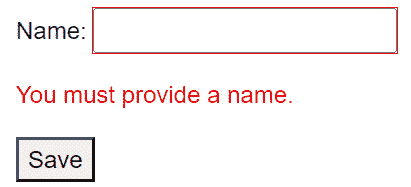
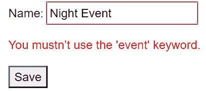
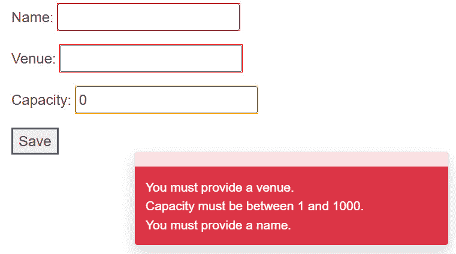

# 7

# 验证用户输入表单

在本章中，我们探讨了确保通过 Blazor 应用程序中的表单提交的数据准确性和完整性的基本方面。通过有效的验证，你可以防止错误的数据输入，并增强用户交互和应用程序安全性。在本章中，我们将探讨你在验证用户输入时可以采用的一系列技术和策略。

我们从向表单添加验证的基本流程开始，为更复杂的验证场景奠定基础。你将学习 Blazor 如何处理基本的验证场景，以及如何扩展它们以满足特定的领域需求。之后，我们将探讨使用数据注释进行表单验证的方法。你将发现如何使用内置注释简化表单验证，以及如何利用它们直接在数据模型上强制执行规则和约束，从而减少样板代码。紧接着，你将看到如何实现自定义验证属性，这些属性提供了处理独特业务需求的灵活性。然后，我们将讨论复杂数据模型的验证，确保即使在复杂场景中也能保持数据完整性。

在本章结束时，我们专注于提高表单的用户体验。我们涵盖了验证消息的风格化和验证摘要的现代化。良好的风格使验证消息清晰并与应用程序的设计更一致，而提示信息提供了一种动态的方式来提醒用户问题，而不会打断他们的工作流程。最后，我们探讨了如何根据验证结果动态控制表单操作，确保用户只能在有效状态下提交表单，从而避免不必要的提交和服务器负载。

到本章结束时，你将了解如何在 Blazor 应用程序中实现有效的验证策略，确保正确的用户输入，并提高应用程序的可用性和可靠性。

在本章中，我们将介绍以下食谱列表：

+   向表单添加验证

+   利用数据注释进行表单验证

+   实现自定义验证属性

+   验证复杂的数据模型

+   风格化验证消息

+   当验证失败时显示提示信息

+   根据表单状态启用提交选项

# 技术要求

本章中的食谱是相互关联的，因此你可以在同一目录中跟随整个旅程。然而，为了清晰和更容易的初始设置，在每个食谱的开始，你将找到有关创建哪个工作目录以及需要哪些文件来执行当前任务的说明。但在深入之前，请确保你拥有所有 Blazor 开发的基本工具：

+   一个支持 Blazor 开发的现代 IDE

+   一个支持 WebAssembly 的现代网络浏览器

+   浏览器开发工具（可能已经是现代浏览器的一部分）

+   一个 Blazor 项目（你将在其中编写代码）

在**Validating complex data models**食谱中，我们使用了**Microsoft.AspNetCore.Components.DataAnnotations.Validation** NuGet 包，该包默认未预安装，因此你现在可以将其添加到项目中。请注意，验证包仍在预览中，因此你必须在 IDE 中的 NuGet 源中包含预发布包。

你可以在 GitHub 上找到本章中编写的所有代码和代码示例：

[`github.com/PacktPublishing/Blazor-Web-Development-Cookbook/tree/main/BlazorCookbook.App.Client/Chapters/Chapter07`](https://github.com/PacktPublishing/Blazor-Web-Development-Cookbook/tree/main/BlazorCookbook.App.Client/Chapters/Chapter07)

# 向表单添加验证

在本食谱中，我们将探讨 Blazor 中用户输入验证的基础。验证对于防止错误和安全漏洞、维护数据一致性以及提升用户体验至关重要。Blazor 社区已经创建了各种 NuGet 包来处理输入验证，提供了一系列功能和配置。然而，Blazor 提供了广泛的内置支持，用于以用户友好的方式验证表单并显示验证结果。原生功能轻量级，并直接与 Blazor 的数据绑定和 UI 功能集成。

让我们实现一个小型事件创建表单，用户必须提供事件名称。我们还将显示当事件名称为空时的验证消息。

## 准备工作

在我们向表单添加第一个、基本的验证之前，创建一个**Chapter07** / **Recipe01**目录——这将是你的工作目录。

## 如何实现...

按照以下步骤向表单添加简单的验证：

1.  创建一个具有**名称**属性的**Event**类——我们将将其用作表单模型：

    ```cs
    public class Event
    {
        public string Name { get; set; }
    }
    ```

1.  创建一个可路由的**EventManager**组件，该组件实现了**IDisposable**接口。你现在将看到编译错误，但我们将在稍后解决它们：

    ```cs
    @page "/ch07r01"
    @implements IDisposable
    ```

1.  在**EventManager**的**@code**块中，声明一个**Event**模型作为表单的后备模型：

    ```cs
    [SupplyParameterFromForm]
    public Event Model { get; set; }
    ```

1.  在**模型**参数声明下方，引入用于表单状态管理的**上下文**和**存储**变量：

    ```cs
    protected EditContext Context;
    protected ValidationMessageStore Store;
    ```

1.  仍然在**@code**块中，实现一个**Save()**占位符方法来模拟表单提交：

    ```cs
    private void Save()
        => Console.WriteLine($"Saved {Model.Name}.");
    ```

1.  在**Save()**旁边，实现一个**ValidateForm()**方法，其签名与**EventHandler**验证的响应相匹配，该验证检查**Model.Name**属性是否有有效的值：

    ```cs
    private void ValidateForm(object sender, ValidationRequestedEventArgs args)
    {
        Store.Clear();
        if (string.IsNullOrWhiteSpace(Model.Name))
            Store.Add(() => Model.Name,
                "You must provide a name.");
    }
    ```

1.  在**@code**块中继续，重写**OnInitialized()**生命周期方法以初始化**Model**实例（如果需要）并设置表单上下文以及验证消息容器：

    ```cs
    protected override void OnInitialized()
    {
        Model ??= new();
        Context = new(Model);
        Context.OnValidationRequested += ValidateForm;
        Store = new(Context);
    }
    ```

1.  通过实现**Dispose()**方法来最终化**@code**块，以符合**IDisposable**要求并取消订阅验证事件处理程序：

    ```cs
    public void Dispose()
    {
        if (Context is not null)
            Context.OnValidationRequested -= ValidateForm;
    }
    ```

1.  在 **EventManager** 标记中，包含一个 **EditForm** 组件，将 **Context** 附加到适当的参数，并将 **Save()** 方法链接到处理表单提交：

    ```cs
    <EditForm EditContext="@Context"
              event-form="forEvent-form"
              OnValidSubmit="@Save">
    </EditForm>
    ```

1.  在 **EditForm** 内部，添加一个 **InputText** 组件并将其绑定到 **Model.Name** 属性。与 **InputText** 一起，添加一个 **ValidationMessage** 组件来显示附加属性的验证错误：

    ```cs
    <p>Name: <InputText @bind-Value="@Model.Name" /></p>
    <p><ValidationMessage For="() => Model.Name" /></p>
    ```

1.  最后，通过在表单字段下方添加提交按钮来**完成 EditForm**：

    ```cs
    <button type="submit">Save</button>
    ```

## 它是如何工作的…

在 *步骤 1* 中，我们创建一个具有单个 **Name** 属性的简单 **Event** 类。我们将使用 **Event** 作为表单的模型。接下来，在 *步骤 2* 中，我们创建一个可路由的 **EventManager** 组件，不指定任何渲染模式，这导致 Blazor 默认使用静态服务器端模式。由于表单验证是事件驱动的，**EventManager** 必须实现 **IDisposable** 接口，我们使用 **@implements** 指令来实现。现在你会看到编译错误，但我们将在稍后解决它们。

转到 *步骤 3*，在 **EventManager** 的 **@code** 块中，我们使用 **Event** 类声明 **Model** 参数，并使用 **SupplyParameterFromForm** 属性标记它，以启用与表单的自动绑定。在 *步骤 4* 中，我们引入两个表单支持变量：**EditContext** 和 **ValidationMessageStore**。**EditContext** 实例跟踪表单输入的更改并管理验证状态，而 **ValidationMessageStore** 存储并显示验证消息，简化了验证过程。

进行到 *步骤 5*，我们实现一个 **Save()** 占位符方法。数据持久性不是本章的重点，所以我们向控制台记录一条简短的消息来模拟保存操作。在 *步骤 6* 中，我们实现一个与 **EditForm** 所需的验证处理程序签名匹配的 **ValidateForm()** 方法。每当 Blazor 调用 **ValidateForm()** 时，我们首先清除 **Store** 中的任何消息，以平滑处理多次验证尝试。然后，我们检查用户是否提供了 **Model.Name** 属性；如果没有，我们向 **Store** 添加一条 **您必须提供一个名称。** 消息，并使用委托 **() => Model.Name** 识别无效属性。在底层，Blazor 将此委托分解为对象（**Model**）和属性路径字符串（**Name**），以有效地跟踪和管理验证和错误关联。

在 *步骤 7* 中，我们重写了 **OnInitialized()** 生命周期方法来设置表单的底层逻辑。我们解析了 **Model** 值，支持带有 **SupplyParameterFromForm** 属性的参数模式。然后，我们使用 **Model** 对象初始化 **Context** 并将 **ValidateForm()** 订阅到 **Context** 提供的 **OnValidationRequested** 事件处理器。这样，Blazor 将会自动在用户提交表单时调用 **ValidateForm()**。最后，我们通过传递 **Context** 来初始化 **Store**，这样验证容器就可以访问 **Model** 的字段。在 *步骤 8* 中，我们通过实现 **Dispose()** 方法来结束 **@code** 块，遵循 **IDisposable** 模式。在 **Dispose()** 中，我们安全地取消订阅 **ValidateForm()** 从 **Context** 的验证触发器，以防止潜在的内存泄漏。

在后端逻辑就绪后，我们继续进行 **EventManager** 标记。在 *步骤 9* 中，我们添加了一个 **EditForm** 组件，但不是直接将后端 **Model** 实例附加到它，而是将 **Context** 附加到 **EditContext** 参数。Blazor 不允许同时附加 **Model** 和 **EditContext**，因为 **Context** 已经包含了一个 **Model** 的实例。我们还使用 **OnValidSubmit** 回调而不是标准的 **OnSubmit**。Blazor 仅在所有验证成功通过时调用 **OnValidSumbit**，这使得它非常适合我们的需求。在 *步骤 10* 中，在 **EditForm** 内部，我们放置了一个 **InputText** 组件并将其绑定到 **Model.Name** 属性，使用户能够提供所需的事件名称。在 **InputText** 旁边，我们放置了一个 **ValidationMessage** 组件，用于显示特定表单字段的验证信息。由于 **ValidationMessage** 需要一个委托来从容器中检索消息，我们利用在 **ValidateForm()** 中使用的同一个委托来将验证信息种子到 **Store** 中。最后，在 *步骤 11* 中，我们通过添加提交按钮来完成表单的实现。

当用户提交表单时，Blazor 首先触发 **OnValidationRequested** 事件处理器。如果验证结果有错误，则不会激活 **Save()** 方法，确保只处理有效数据。

下面是我们在表单中看到的验证错误的样子：



图 7.1：用户提交表单未提供名称时的验证信息

## 还有更多...

使用**ValidationMessage**组件，我们可以控制 Blazor 渲染每个字段的验证消息的位置，提供直接位于单个表单元素旁边的细粒度反馈。然而，你可能希望显示一个综合的验证摘要而不是分散的消息。这就是**ValidationSummary**组件派上用场的地方。**ValidationSummary**组件收集并显示一个容器内的所有验证消息。你可以在表单的顶部或底部看到这样的摘要，甚至可以作为验证弹出窗口的一部分。

在我们的形式中实现摘要，我们只需要将**ValidationMessage**替换为**ValidationSummary**，并在表单内添加一个**DataAnnotationsValidator**组件：

```cs
<EditForm EditContext="@Context" 
          FormName="forEvent-form"
          OnValidSubmit="@Save">
    <DataAnnotationsValidator />
    <p>Name: <InputText @bind-Value="@Model.Name" /></p>
    <p><ValidationSummary /></p>
    <button type="submit">Save</button>
</EditForm>
```

我们必须嵌入**DataAnnotationsValidator**，因为它会触发**ValidationSummary**的填充和重新渲染。如果没有验证器，将会得到红色的输入样式，表示提供的值无效，但没有解释原因的消息。

我们将在下一道菜中进一步探讨**DataAnnotationsValidator**。

# 利用数据注释进行表单验证

在这道菜中，我们探讨了数据注释在简化并增强 Blazor 表单验证过程中的作用。数据注释是直接应用于模型属性的属性，它允许以声明式的方式指定验证规则。通过实现数据注释，你可以显著简化验证逻辑，并将其封装在模型中，而不是将其与任何特定的表单耦合。这种分离确保了验证在应用程序的不同部分中始终如一地强制执行，无论你在什么上下文中使用模型。Blazor 有一个内置的**DataAnnotationsValidator**组件，它无缝地将数据注释集成到表单中。**DataAnnotationsValidator**检查应用于模型的属性的数据注释，并产生验证结果，而无需额外的编码。

让我们将表单中的显式验证逻辑转换为数据注释，并利用 Blazor 的本地支持来高效地处理验证。

## 准备工作

在我们将验证逻辑封装到单独的组件之前：

+   创建**Chapter07** / **Recipe02**目录——这将是你的工作目录

+   从*添加验证到表单*配方或从 GitHub 仓库中的**Chapter07** / **Recipe01**目录复制**EventManager**和**Event**。

## 如何做到这一点…

按照以下步骤利用数据注释进行模型验证：

1.  导航到**Event**类，并使用带有用户友好错误消息的**Required**属性装饰**Name**属性。你必须引用**System.ComponentModel.DataAnnotations**命名空间，但你的 IDE 可能会自动包含它：

    ```cs
    [Required(ErrorMessage = "You must provide a name.")]
    public string Name { get; set; }
    ```

1.  移动到**EventManager**组件，并从文件顶部删除**IDisposable**声明。你应该只剩下一个路由声明。

1.  在 **EventManager** 的标记中，找到 **EditForm** 并将 **DataAnnotationsValidator** 组件嵌入到提交按钮下方：

    ```cs
    <EditForm EditContext="@Context"
              event-form="event-forEvent"
              OnValidSubmit="@Save">
        @* ... existing form body ... *@
        <button type="submit">Save</button>
        <DataAnnotationsValidator />
    </EditForm>
    ```

1.  跳转到 **EventManager** 的 **@code** 块并做一些清理：

    +   从 **OnInitialized()** 方法的实现中移除对 **OnValidationRequested** 事件处理器的订阅

    +   完全移除 **Dispose()** 和 **ValidateForm()** 方法

## 它是如何工作的…

在 *步骤 1* 中，我们通过实现数据注释来增强 **Event** 类，以强制执行输入验证。我们用 **Required** 属性装饰 **Name** 属性，以确保用户始终提供该值。数据注释还接受 **ErrorMessage** 参数，我们可以传递一个用户友好的验证消息，因此我们扩展了 **Required** 属性，并添加了 **您必须提供一个名称** 的错误消息。

在 *步骤 2* 中，我们转向 **EventManager** 组件。由于已经设置了数据注释，我们不再需要显式的事件处理。因此，我们从 **EventManager** 文件的顶部移除 **IDisposable** 声明。在 *步骤 3* 中，我们增强了 **EventManager** 的标记，并在 **EditForm** 的末尾嵌入 **DataAnnotationsValidator** 组件，紧挨着提交按钮。**DataAnnotationsValidator** 在表单中无缝运行，不带任何特定的标记，并依赖于级联的 **EditContext** 进行验证操作。我们将 **DataAnnotationsValidator** 放在表单的末尾，但只要它在 **EditForm** 标签内，您可以将它放在任何位置。在 *步骤 4* 中，我们更新了 **EventManager** 的 **@code** 块。由于数据注释现在管理验证，我们可以通过移除大部分之前必要的验证逻辑来简化组件代码。我们在 **OnInitialized()** 方法中移除了 **OnValidationRequested** 订阅，因为 **DataAnnotationsValidator** 现在自动监控验证状态。随后，我们也消除了 **ValidateForm()** 方法，因为验证消息存储和错误消息的管理也已转移到 **DataAnnotationsValidator**。最后，我们移除了 **Dispose()** 方法，因为 **EventManager** 不再实现 **IDisposable** 接口或监听任何事件。

通过这些少量调整，我们达到了与 *向表单添加验证* 菜谱中相同的验证范围，但代码量显著减少！

## 还有更多...

在 **DataAnnotationsValidator** 的支持下，Blazor 可以执行两种类型的验证：

+   第一种类型是 **全模型验证** – 当用户提交表单时，Blazor 执行。这种验证发生在您点击 **EventManager** 表单上的 **保存** 按钮时。它涉及检查模型中所有字段的每个验证规则，确保在处理表单之前所有数据都符合指定的标准。由于我们正在使用具有固有有限交互性的 SSR 渲染模式，因此只支持全模型验证。

+   然而，如果您选择以交互式模式渲染**EventManager**，**DataAnnotationsValidator**可以执行另一层验证——**字段验证**。当用户将焦点从单个表单字段移开时，Blazor 会触发字段验证，并立即显示该特定字段中提供的输入的反馈。

# 实现自定义验证属性

在这个菜谱中，我们将深入了解自定义验证属性的灵活性。虽然内置的数据注释简化了验证逻辑，但它们仅覆盖了最常用的验证规则。您可能会发现自己缺少针对特定需求的覆盖。幸运的是，您可以使用独特的规则实现自定义数据验证属性，这些规则超出了.NET 提供的标准验证。此外，Blazor 的本地**DataAnnotationsValidator**组件可以无缝集成任何自定义属性。

让我们实现一个事件名称验证属性，该属性检查用户是否提供了事件名称，并扫描任何禁止的关键字。

## 准备工作

在我们实现自定义验证属性之前，请执行以下操作：

+   创建一个**Chapter07** / **Recipe03**目录——这将成为您的工作目录

+   从“利用数据注释进行表单验证”菜谱或从 GitHub 仓库中的**Chapter07** / **Recipe02**目录复制**EventManager**和**Event**。

## 如何实现...

按照以下说明实现自定义验证属性：

1.  创建一个新的**EventNameValidationAttribute**类，该类继承自**ValidationAttribute**类。您必须引用**System.ComponentModel.DataAnnotations**程序集，但您的 IDE 可能自动包含它：

    ```cs
    using System.ComponentModel.DataAnnotations;
    public class EventNameValidationAttribute
        : ValidationAttribute
    {
    }
    ```

1.  在**EventNameValidationAttribute**类内部，声明一个私有变量**_forbidden**，并用**event**值初始化它：

    ```cs
    private const string _forbidden = "event";
    ```

1.  在**_forbidden**变量下方，实现一个**Failure()**方法，该方法接受**message**和**member**参数，并返回一个**ValidationResult**实例：

    ```cs
    private static ValidationResult Failure(
        string message, string member)
        => new(message, [member]);
    ```

1.  通过重写**IsValid()**方法完成**EventNameValidationAttribute**的实现，该方法返回一个**ValidationResult**对象。如果传入的**value**未提供或包含**_forbidden**关键字，则返回**Failure()**调用的结果。否则，返回默认的**ValidationResult.Success**：

    ```cs
    protected override ValidationResult IsValid(
        object value, ValidationContext validationContext)
    {
        var text = value?.ToString();
        if (string.IsNullOrWhiteSpace(text))
            return Failure("You must provide a name.",
                validationContext.MemberName);
        if (text.Contains(_forbidden,
            StringComparison.InvariantCultureIgnoreCase))
            return Failure(
                "You mustn't use the 'event' keyword.",
                    validationContext.MemberName);
        return ValidationResult.Success;
    }
    ```

1.  导航到**Event**类，并通过用新实现的**EventNameValidation**属性替换现有的**Required**属性来更新**Name**属性的装饰：

    ```cs
    [EventNameValidation]
    public string Name { get; set; }
    ```

## 它是如何工作的...

在*步骤 1*中，我们创建了一个**EventNameValidationAttribute**类，继承自**ValidationAttribute**。**ValidationAttribute**类是验证属性的基类，为在.NET 应用程序中实现自定义验证规则提供了一个框架。它允许定义数据在进一步处理之前必须满足的特定条件。在*步骤 2*中，我们在自定义验证属性类中声明了一个**_forbidden**变量，用于存储要检查的禁止关键字。在*步骤 3*中，我们实现了一个接受**message**和**member**参数的**Failure()**方法。**Failure()**创建并返回一个**ValidationResult**实例，表示验证失败。**member**参数允许将错误消息与特定字段关联，从而增强提供给用户的反馈的清晰度。

在*步骤 4*中，我们通过重写来自**ValidationAttribute**类的**IsValid()**方法来实现自定义验证逻辑。当 Blazor 验证表单模型时，它会触发**IsValid()**方法。我们选择重写返回**ValidationResult**对象的重载，而不是简单的**bool**，因为我们希望提供有关验证问题的详细反馈。我们首先将传入的**value**转换为**text**变量。如果**text**不包含有意义的值，我们调用**Failure()**方法返回一个包含消息**您必须提供名称。**的验证错误。但**Failure()**还需要提供**member**名称。**IsValid()**方法接受另一个类型为**ValidationContext**的参数，它提供了有关验证操作的上下文信息，包括**MemberName**标识验证的字段。有了**MemberName**，我们可以符合**Failure()**方法的签名。然后我们检查**text**是否包含**_forbidden**关键字，忽略大小写和文化差异。如果找到禁止的关键字，我们再次调用**Failure()**，并带有消息**您不能使用‘event’关键字。**。最后，如果所有检查都成功通过，我们返回**ValidationResult.Success** - 一个封装在**ValidationResult**类中的成功指示符。

在*步骤 5*中，我们导航到**Event**类，并将**Name**属性上现有的**Required**属性替换为我们新创建的**EventNameValidation**属性。多亏了代码生成器和 C#以及 Blazor 编译器，我们可以使用类名而不是**Attribute**后缀来引用自定义属性。

现在，我们不仅验证用户是否提供了事件名称，还验证他们是否使用了禁止的关键字：



图 7.2：用户提交包含禁止关键字的值时的验证消息

## 还有更多...

在构建多语言应用程序时，你可能需要翻译用户友好的错误消息。此外，随着持续交付趋势的发展，你可能需要根据功能标志或应用程序设置有条件地启用验证规则。你需要访问依赖注入容器以支持这样的高级场景。在基于 **ValidationAttribute** 的类中，你可以通过 **ValidationContext** 参数访问依赖注入，该参数封装了 **IServiceProvider** 的行为，并公开了 .NET 中所有标准依赖注入方法。

例如，假设你在服务容器中注册了一个 **Api** 服务，你可以在以下方式中注入这个依赖项到你的属性中：

```cs
protected override ValidationResult IsValid(object value,
    ValidationContext validationContext)
{
    var api = validationContext.GetRequiredService<Api>();
    //...
}
```

我们重写了从 **ValidationAttribute** 类继承而来的 **IsValid()** 方法，并获取了一个 **ValidationContext** 实例。由于 **ValidationContext** 实现了 **IServiceProvider** 接口，我们利用内置的泛型 **GetRequiredService()** 扩展方法来检索我们的 **Api** 服务实例。

需要注意的是，在 .NET 中自定义验证属性不支持异步验证。在设计验证策略时，考虑这一限制至关重要，以确保性能和用户体验不受负面影响。

# 验证复杂数据模型

在这个菜谱中，我们处理复杂表单和数据模型的验证。拥有结构良好和模块化的代码使得代码库更容易维护，并通过明确定义和隔离每个组件的责任来降低出错的可能性。在表单中，复杂模型将数据分割成可管理的部分，每个部分都有其验证逻辑，这使得维护整个表单的状态更容易，并确保每个部分都遵循特定的业务规则。虽然 **Microsoft.AspNetCore.Components.DataAnnotations.Validation** 包是实验性的，但它公开了 Blazor 原生的验证器，并提供了与复杂模型无缝集成的增强数据注释。

让我们扩展事件创建表单，以包含一个封装事件位置详细信息的嵌套对象。

## 准备工作

在我们设置嵌套的复杂模型验证之前，执行以下操作：

+   创建一个 **Chapter07** / **Recipe04** 目录 – 这将是你的工作目录。

+   从 *实现自定义验证属性* 菜谱或从 GitHub 仓库中的 **Chapter07** / **Recipe03** 目录复制 **EventManager**、**Event** 和 **EventNameValidationAttribute**。

## 如何做到这一点…

按照以下步骤启用嵌套模型的验证：

1.  在你的项目文件中添加对 **Microsoft.AspNetCore.Components.DataAnnotations.Validation** 包的引用：

    ```cs
    <ItemGroup>
      <PackageReference
        Include="Microsoft.AspNetCore.Components
          .DataAnnotations.Validation"
        Version="3.2.0-rc1.20223.4" />
    </ItemGroup>
    ```

1.  创建一个新的 **EventLocation** 类，并在其中定义两个属性 – **Venue** 和 **Capacity** ：

    ```cs
    public class EventLocation
    {
        public string Venue { get; set; }
        public int Capacity { get; set; }
    }
    ```

1.  将**Required**属性应用于**Venue**属性，并在用户留空字段时包含一个有意义的错误信息：

    ```cs
    [Required(ErrorMessage = "You must provide a venue.")]
    public string Venue { get; set; }
    ```

1.  对于**Capacity**属性，使用**Required**和**Range**属性进行装饰，并提供一个有意义的错误信息，以确保用户只输入有效的容量值：

    ```cs
    [Required, Range(1, 1000,
        ErrorMessage =
            "Capacity must be between 1 and 1000.")]
    public int Capacity { get; set; }
    ```

1.  导航到**Event**类，并添加一个新的**Location**属性。使用**ValidateComplexType**属性装饰**Location**：

    ```cs
    [ValidateComplexType]
    public EventLocation Location { get; set; } = new();
    ```

1.  在**EventManager**组件中，在标记中定位**EditForm**。

1.  在**EditForm**中，在**Name**输入字段下方直接添加一个新段落，包含一个绑定到**Model.Location.Venue**属性的**InputText**组件：

    ```cs
    <p>
        Venue:
        <InputText @bind-Value="@Model.Location.Venue" />
    </p>
    ```

1.  在**Venue**输入字段下方，添加另一个包含绑定到**Model.Location.Capacity**属性的**InputNumber**组件的段落：

    ```cs
    <p>
        Capacity:
        <InputNumber
            @bind-Value="@Model.Location.Capacity" />
    </p>
    ```

1.  仍然在**EditForm**中，将现有的**Model.Name**属性的**ValidationMessage**替换为**ValidationSummary**：

    ```cs
    <p><ValidationSummary  /></p>
    ```

1.  最后，将**DataAnnotationsValidator**组件替换为**ObjectGraphDataAnnotationsValidator**：

    ```cs
    <ObjectGraphDataAnnotationsValidator />
    ```

## 它是如何工作的…

在*步骤 1*中，我们打开我们项目的**csproj**文件，并添加对包含所有必需扩展以实现复杂、嵌套数据模型无缝验证的**Microsoft.AspNetCore.Components.DataAnnotations.Validation**包的引用。

接下来，在*步骤 2*中，我们创建一个新的**EventLocation**类，包含**Venue**和**Capacity**属性，表示活动位置详情。在*步骤 3*中，我们使用**Required**属性装饰**Venue**属性，以确保用户在提交表单前必须填写场地描述。如果他们忘记输入**Venue**值，他们将看到一个**您必须提供场地**的验证消息来引导他们。在*步骤 4*中，我们通过应用**Required**和**Range**属性对**Capacity**属性添加验证。我们强制用户填写容量值，并确保它位于指定的范围内（1 到 1,000）。如果用户输入超出声明范围的值，他们将收到**容量必须在 1 到 1000 之间**的错误消息。

对于*步骤 5*，我们转向**Event**类，并扩展它以添加一个新的属性——**Location**，类型为**EventLocation**。为了确保 Blazor 理解这个属性代表一个需要嵌套验证的复杂类型，我们使用**ValidateComplexType**属性进行装饰。**ValidateComplexType**包含在**Microsoft.AspNetCore.Components.DataAnnotations.Validation**包中。

在 *步骤 6* 中，我们进入 **EventManager** 组件，并在标记中找到现有的 **EditForm**。我们将扩展表单以包含输入事件位置详情的字段。在 *步骤 7* 中，我们在 **Name** 字段下方嵌入一个新的段落，在那里插入一个绑定到 **Model.Location.Venue** 的 **InputText** 组件，以允许用户输入场地详情。在 *步骤 8* 中，我们添加另一个段落，这次包含一个绑定到 **Model.Location.Capacity** 的 **InputNumber** 组件，以允许用户指定特定场地的可用位置。在 *步骤 9* 中，为了简化验证消息的显示，我们将之前专门用于 **Name** 属性的 **ValidationMessage** 组件替换为 **ValidationSummary** 实例。**ValidationSummary** 组件将所有表单验证消息合并到一个区域。最后，在 *步骤 10* 中，我们通过将标准的 **DataAnnotationsValidator** 替换为 **ObjectGraphDataAnnotationsValidator** 来增强我们的验证设置。**ObjectGraphDataAnnotationsValidator** 组件是一个高级组件，能够验证嵌套的对象图，允许 Blazor 在我们复杂的 **Event** 模型的每个部分触发验证。

## 还有更多…

当使用 Blazor 的内置输入组件时，你将获得额外的灵活性。任何默认输入组件，如我们在这个菜谱中使用的 **InputNumber** 组件，它继承自 **InputBase** 类，会自动拦截任何不匹配的参数，并将它们直接作为属性附加到底层的 HTML **input** 元素上。有了这个功能，你可以轻松地通过声明 **min** 和 **max** 属性并禁止用户手动增加或减少值超出指定范围来增强用于 **Model.Location.Capacity** 的 **InputNumber** 组件：

```cs
Capacity:
    <InputNumber min="1" max="1000"
        @bind-Value="@Model.Location.Capacity" />
```

通过在表单中的 **InputNumber** 组件上添加 **min** 和 **max** 属性，并将它们的值分别声明为 **1** 和 **1000**，我们确保用户无法将输入值降低到 **1** 以下或增加到 **1000** 以上。他们仍然可以手动输入一个无效的值，但它们会在模型属性上触发验证。按照这个例子，你可以利用你熟悉的任何其他 HTML 输入属性。

# 样式验证消息

在本菜谱中，我们探讨了 Blazor 中表单验证的样式。你可能已经注意到，在之前的菜谱中，Blazor 在验证过程中会自动将验证类应用到表单字段上。默认验证 CSS 类与默认 Bootstrap 样式相匹配，无效字段会得到红色强调，有效字段会得到绿色强调。虽然默认设置提高了交付速度，但在大多数情况下，你仍然需要自定义视觉反馈以适应你的应用程序品牌或功能需求。幸运的是，Blazor 允许自定义在验证字段时附加的样式和类。这种自定义保持了应用程序模块化和松散耦合架构的完整性，确保增强不会损害代码的可维护性。

让我们实现一个自定义验证类提供者，使 Blazor 在红色中标记缺失的标签，在黄色中标记缺失的位置容量。

## 准备工作

在实现自定义验证类提供者之前，请执行以下操作：

+   创建一个 **Chapter07** / **Recipe05** 目录 - 这将是你的工作目录。

+   从 *Validating complex data models* 菜谱或从 GitHub 仓库中的 **Chapter07** / **Recipe04** 目录复制 **Event**、**EventLocation**、**EventManager** 和 **EventNameValidationAttribute**。

## 如何操作...

执行以下步骤以添加自定义验证类提供者：

1.  在工作目录中添加一个新的 **EventManager.razor.css** 文件。你的 IDE 可能会自动将此 CSS 文件嵌套在 **EventManager.razor** 之下。

1.  在 **EventManager.razor.css** 中，定义一个 **invalid-warning** 样式类，为应用此类的任何元素添加橙色轮廓：

    ```cs
    ::deep .invalid-warning {
        outline: 1px solid orange;
    }
    ```

1.  创建一个新的 **TypeValidationClassProvider** 类，从 **Microsoft.AspNetCore.Components.Forms** 命名空间下的 **FieldCssClassProvider** 继承：

    ```cs
    public class TypeValidationClassProvider
        : FieldCssClassProvider { }
    ```

1.  在 **TypeValidationClassProvider** 中，声明一个私有的 **_capacity** 字段，该字段包含来自 **EventLocation** 类的 **Capacity** 属性的名称：

    ```cs
    private static readonly string
        _capacity = nameof(EventLocation.Capacity);
    ```

1.  要最终实现 **TypeValidationClassProvider**，重写 **GetFieldCssClass()** 方法并实现逻辑，当当前字段的值无效且对应于 **_capacity** 属性时返回 **invalid-warning** 类；否则，回退到 **base** 实现：

    ```cs
    public override string GetFieldCssClass(
        EditContext editContext,
        in FieldIdentifier fieldIdentifier)
    {
        var isValid =
            editContext.IsValid(fieldIdentifier);
        var isCapacity =
            fieldIdentifier.FieldName == _capacity;
        if (!isValid && isCapacity)
            return "invalid-warning";
        return base.GetFieldCssClass(
            editContext, fieldIdentifier);
    }
    ```

1.  导航到 **EventManager** 组件，找到 **OnInitialized()** 方法。在现有设置之后，使用 **EditContext** 的 **SetFieldCssClassProvider()** 扩展方法将 **TypeValidationClassProvider** 附加到 **Context**：

    ```cs
    protected override void OnInitialized()
    {
        // ... existing form context building ...
        Context.SetFieldCssClassProvider(
            new TypeValidationClassProvider());
    }
    ```

## 工作原理...

在**步骤 1**中，我们在工作目录中添加一个新的 CSS 文件，具体命名为**EventManager.razor.css**，以符合 CSS 隔离要求，并匹配将要为其添加样式的组件名称。在 Blazor 中，**CSS 隔离**允许在特定组件的 CSS 文件中定义的样式只影响该组件，防止样式泄露。如果你在 IDE 中启用了文件嵌套，你会看到隔离的 CSS 文件被包裹在父组件文件之下。在**步骤 2**中，在**EventManager.razor.css**中，我们引入了一个**.invalid-warning**类，它将橙色轮廓应用于我们附加到其上的字段。我们使用**::deep**组合符来确保样式能够穿透类似 DOM 的封装并影响嵌套组件。

在**步骤 3**中，我们通过创建一个新的**TypeValidationClassProvider**类来初始化我们的自定义验证类提供者，该类继承自**FieldCssClassProvider**。**FieldCssClassProvider**类提供了必要的 API 来自定义 Blazor 根据字段验证状态应用的 CSS 类。在**步骤 4**中，我们在**TypeValidationClassProvider**中持久化**Capacity**字段的名称到一个名为**_capacity**的变量中。通过将其声明为**private**和**static**，我们确保这个值在整个应用程序的生命周期中保持不变，并消耗最少的内存，从而有效地成为一个单例实例。在**步骤 5**中，我们通过重写**GetFieldCssClass()**方法来完成我们的自定义提供者，Blazor 在需要根据字段的验证状态确定适当的 CSS 类时调用此方法。在我们的实现中，我们首先检查字段的当前状态是否有效，并且其名称是否与**_capacity**值匹配。如果字段无效并且引用的是容量，我们返回**invalid-warning**，指示 Blazor 应用橙色轮廓以突出显示错误。否则，我们默认返回基实现，通过返回**base.GetFieldCssClass()**调用的结果，保留其他字段的常规行为。

最后，在**步骤 6**中，我们跳转到**EventManager**组件并定位到重写的**OnInitialized()**生命周期方法，在那里我们初始化**Context**变量。在初始配置之后，我们利用**EditContext**的**SetFieldCssClassProvider()**扩展方法来配置**Context**，使其使用我们的**TypeValidationClassProvider**来根据字段验证解决 CSS 类。我们的自定义样式逻辑现在已经就绪。

## 还有更多……

我们实现了一个自定义 CSS 验证类，并利用了 Blazor 提供的 CSS 隔离功能。然而，如果你已经将 CSS 框架集成到你的应用程序中，你可以简单地使用框架提供的验证类，而不是创建自定义的类。

Bootstrap 作为目前最常用的 CSS 框架，提供了 **border** 和 **border-warning** CSS 类，您可以使用这些类来突出显示无效的输入字段。导航到 **TypeValidationClassProvider** 并更新 **GetFieldCssClass()** 实现如下：

```cs
public override string GetFieldCssClass(
    EditContext editContext,
    in FieldIdentifier fieldIdentifier)
{
    var isValid = editContext.IsValid(fieldIdentifier);
    var isCapacity =
        fieldIdentifier.FieldName == _capacity;
    if (!isValid && isCapacity)
        return "border border-warning";
    return base.GetFieldCssClass(
        editContext, fieldIdentifier);
}
```

自定义验证逻辑保持不变——我们仍然检查验证上下文是否有效以及验证的字段是否引用容量。然而，当自定义验证失败时，我们不是返回自定义警告类，而是利用 **border border-warning** 类的组合，并将样式委托给 Bootstrap。

# 验证失败时显示 toast

在本菜谱中，我们探讨了如何通过自定义显示验证错误来增强表单验证反馈。Blazor 的 **ValidationSummary** 组件提供了一个简单的方法来收集和显示表单中的所有验证消息，通常在一个简单的 **div** 中渲染。虽然功能性强，但这种默认的展示可能并不总是符合期望的用户体验或应用程序的美学标准。您可以用自定义实现替换标准 **ValidationSummary** 组件，使验证消息更具吸引力，并与应用程序更广泛的通知策略无缝结合。

让我们实现一个自定义组件，该组件在默认的 Bootstrap toast 中显示验证错误，从而创建一个更现代版本的 **ValidationSummary**。

## 准备工作

在深入实现自定义验证摘要之前，请执行以下操作：

+   创建一个 **Chapter07** / **Recipe06** 目录——这将是你的工作目录

+   从 *Styling validation messages* 菜单或从 GitHub 仓库中的 **Chapter07** / **Recipe05** 目录复制 **Event**、**EventLocation**、**EventManager**、**EventNameValidationAttribute** 和 **TypeValidationClassProvider**。

## 如何做到这一点...

按以下步骤引入自定义验证摘要：

1.  创建一个实现 **IDisposable** 接口的 **ValidationToast** 组件：

    ```cs
    @implements IDisposable
    ```

1.  在 **ValidationToast** 组件的 **@code** 块内部，声明一个类型为 **EditContext** 的 **CascadingParameter** 参数和一个 **IsDisplayed** 属性：

    ```cs
    [CascadingParameter]
    public EditContext Context { get; set; }
    protected bool IsDisplayed { get; set; }
    ```

1.  仍然在 **@code** 块内部，实现一个 **Rerender()** 方法，该方法与 **EventHandler<ValidationStateChangedEventArgs>** 处理程序的订阅者签名相匹配：

    ```cs
    private void Rerender(object sender,
    ValidationStateChangedEventArgs args) { }
    ```

1.  在 **Rerender()** 内部，根据 **Context** 中是否有任何验证消息来设置 **IsDisplayed** 属性，并调用 **StateHasChanged()** 以触发 UI 刷新：

    ```cs
    IsDisplayed = Context.GetValidationMessages().Any();
    StateHasChanged();
    ```

1.  在 **Rerender()** 下方，重写 **OnInitialized()** 生命周期方法并订阅 **EditContext** 的 **OnValidationStateChanged** 事件：

    ```cs
    protected override void OnInitialized()
        => Context.OnValidationStateChanged += Rerender;
    ```

1.  通过实现 **Dispose()** 方法并在 **OnValidationStateChanged** 事件上取消订阅来完成 **@code** 块：

    ```cs
    public void Dispose()
        => Context.OnValidationStateChanged -= Rerender;
    ```

1.  在**ValidationToast**标记中，在**@implements**指令下方包含一个快速返回语句，以防止根据**IsDisplayed**值进行任何标记渲染：

    ```cs
    @if (!IsDisplayed) return;
    ```

1.  在快速返回语句下方，构建一个默认的 Bootstrap toast 通知的框架：

    ```cs
    <div class="position-fixed bottom-0 end-0 p-3"
        style="z-index: 1">
        <div class="toast text-white bg-danger show">
            @* toast area *@
        </div>
    </div>
    ```

1.  在 toast 区域中，添加一个空标题以增强美观，并在 toast 正文中实现逻辑以动态渲染从**EditContext**检索到的验证消息列表：

    ```cs
    <div class="toast-header" />
    <div class="toast-body">
        @foreach (var message in
            Context.GetValidationMessages())
        {
            <div>@message</div>
        }
    </div>
    ```

1.  导航到表单提交按钮上方的**EventManager**组件，并移除现有的**ValidationSummary**段落。用新的**ValidationToast**组件实例替换它：

    ```cs
    <ValidationToast />
    ```

## 它是如何工作的…

在**步骤 1**中，我们创建了一个新的**ValidationToast**组件，该组件实现了**IDisposable**接口以确保在处理事件处理程序时进行适当的资源清理。

从**步骤 2**开始，我们处理**ValidationToast**组件的**@code**块。我们声明一个类型为**EditContext**的**CascadingParameter**参数，以便访问父表单的上下文。我们还声明了一个**IsDisplayed**属性，这将帮助我们根据验证结果控制 toast 的可见性。在**步骤 3**中，我们初始化一个接受**sender**参数和**args**类型为**ValidationStateChangedEventArgs**的**Rerender**方法，以便我们稍后将其订阅到匹配的**EventHandler**。在**步骤 4**中，我们实现**Rerender**逻辑，其中我们确定**Context**实例中是否有任何验证消息，并设置**IsDisplayed**属性，表示有错误需要显示。然后我们调用**StateHasChanged()**来提示 Blazor 刷新 UI 并反映更新的状态。在**步骤 5**中，我们重写**OnInitialized()**生命周期方法，将**Rerender()**方法订阅到**EditContext**的**OnValidationStateChanged**事件。每当表单的验证状态发生变化时，Blazor 将执行**Rerender()**，允许我们的 toast 通知进行响应式更新。在**步骤 6**中，我们实现**Dispose()**方法，其中我们取消订阅**OnValidationStateChanged**事件，确保在从 UI 中移除**ValidationToast**后，它不会继续对事件做出反应，从而防止内存泄漏。

在*步骤 7*中，我们关注**ValidationToast**的标记。我们从**@implements**指令下方开始，使用基于**IsDisplayed**值的快速返回语句，该语句指示 Blazor 在没有验证信息时立即退出渲染过程。在*步骤 8*中，我们使用默认的 Bootstrap 类构建一个视觉框架，以创建 Toast 通知。由于这是标准的 Bootstrap 代码，我们不会深入分析它。简而言之，我们将框架固定在视口的底部末端，确保其可见但不会干扰。我们还使 Toast 显示为红色，以清楚地表明存在问题。在*步骤 9*中，我们实现了 Toast 区域。我们添加了一个空标题以实现视觉平衡，并在主体中迭代**Context.GetValidationMessages()**调用的结果，动态渲染每个验证信息。

最后，在*步骤 10*中，我们跳转到**EventManager**组件。在这里，我们移除了现有的**ValidationSummary**段落，并用新的**ValidationToast**组件替换它，现在它以更互动和视觉上吸引人的方式处理验证信息的显示。

我们得到了一个仍然简单但更现代的验证摘要，我们的用户会喜欢的：



图 7.3：Toast 通知替换标准验证摘要容器

# 根据表单状态启用提交选项

在这个菜谱中，我们深入探讨了一种通过动态控制表单提交按钮的状态来提升用户体验的策略。我们不仅在创建新对象时使用表单，在修改现有对象时也使用表单。当用户没有做出任何更改或某些输入无效时，阻止表单提交是有意义的。有了这个功能，我们提升了用户体验，节省了内存使用，并减少了不必要的服务器请求。

让我们通过一个机制增强表单，该机制只允许在表单数据发生变化且所有输入都有效时保存表单。

## 准备工作

在使表单提交按钮对表单状态做出反应之前，请执行以下操作：

+   创建一个**Chapter07** / **Recipe07**目录 - 这将是你的工作目录

+   从*显示验证失败时的 Toast*菜谱或从 GitHub 仓库中的**Chapter07** / **Recipe06**目录复制**Event**、**EventLocation**、**EventManager**、**EventNameValidationAttribute**、**TypeValidationClassProvider**和**ValidationToast**。

## 如何实现...

按照以下步骤使表单提交按钮对表单状态做出反应：

1.  导航到**EventManager**组件，并更新它以实现**IDisposable**接口，并在**InteractiveWebAssembly**模式下渲染：

    ```cs
    @rendermode InteractiveWebAssembly
    @implements IDisposable
    ```

1.  在**EventManager**的**@code**块中，引入一个类型为**bool**的**IsSubmittable**变量：

    ```cs
    protected bool IsSubmittable;
    ```

1.  仍然在 **@code** 块中，添加一个符合 **EventHandler<FieldChangedEventArgs>** 响应模式的 **FieldChanged()** 方法，并将表单的当前状态解析到 **IsSubmittable** 变量中：

    ```cs
    private void FieldChanged(
        object sender, FieldChangedEventArgs args)
    {
        IsSubmittable =
            Context.Validate() && Context.IsModified();
        StateHasChanged();
    }
    ```

1.  在 **OnInitialized()** 方法中，为 **Model** 实例初始化一个默认值以模拟数据编辑场景：

    ```cs
    Model ??= new()
    {
        Name = "Packt Party",
        Location = new()
        {
            Venue = "Packt Room",
            Capacity = 150
        }
    };
    ```

1.  在 **OnInitialized()** 方法的末尾，将 **FieldChanged()** 方法订阅到由 **EditContext** API 提供的 **OnFieldChanged** 事件：

    ```cs
    Context.OnFieldChanged += FieldChanged;
    ```

1.  通过在 **@code** 块的末尾添加一个 **Dispose()** 方法来完成 **IDisposable** 的实现，并从 **OnFieldChanged** 处理器中取消订阅 **FieldChanged()**：

    ```cs
    public void Dispose()
        => Context.OnFieldChanged -= FieldChanged;
    ```

1.  切换到 **EventManager** 标记，找到提交按钮。将按钮的 **disabled** 属性设置为 **IsSubmittable** 变量的否定值：

    ```cs
    <button type="submit" disabled="@(!IsSubmittable)">
        Save
    </button>
    ```

## 它是如何工作的…

在 *步骤 1* 中，我们首先增强位于 **EventManager** 中的表单的交互性。我们配置 **EventManager** 以 **InteractiveWebAssembly** 模式渲染，启用组件交互性，并声明它将实现 **IDisposable** 接口，允许自定义清理实现。

在 *步骤 2* 中，我们转向 **EventManager** 的 **@code** 块，并声明一个 **IsSubmittable** 变量，我们将利用它来管理表单提交按钮的状态。在 *步骤 3* 中，我们实现一个 **FieldChanged()** 方法，该方法接受类型为 **FieldChangedEventArgs** 的 **sender** 和 **args** 参数。在 **FieldChanged()** 内部，我们通过 **Context** 实例利用 **EditContext** API 动态评估表单的状态。我们通过检查所有表单字段是否有效，使用 **Context.Validate()** ，以及表单是否已修改，使用 **Context.IsModified()** 来设置 **IsSubmittable** 变量。鉴于此操作可能会影响表单提交按钮的状态，我们调用 **StateHasChanged()** 来通知 Blazor UI 可能需要更新。

在 *步骤 4* 中，我们调整了 **EventManager** 的初始化方式。我们不是将 **Model** 对象重置为新实例，而是通过设置初始属性来模拟编辑现有模型，这反映了典型的数据编辑场景。在 *步骤 5* 中，作为初始化过程的一部分，我们还订阅 **FieldChanged()** 到 **Context.OnFieldChanged** 事件处理器。每当表单字段值发生变化时，Blazor 会触发 **OnFieldChanged**，确保我们的表单对每次编辑做出响应。在 *步骤 6* 中，我们最终完成 **IDisposable** 的实现。我们实现 **Dispose()** 方法，其中我们取消订阅 **FieldChanged()** 从 **OnFieldChanged** 事件处理器，以防止内存泄漏并确保当不再需要时，**EventManager** 组件能够优雅地被销毁。

在*步骤 7*中，我们跳转到**EventManager**标记以在 UI 中反映我们的后端逻辑。我们定位到表单的提交按钮，并附加一个**disabled**属性，将其值设置为**IsSubmittable**的否定。每当用户在表单的字段之间更改焦点时，我们将重新计算**IsSubmittable**的值——由于**IsSubmittable**指示用户是否进行了更改以及表单是否处于有效状态，否定这个值决定了何时应禁用提交按钮，防止在满足有效和修改表单的所有条件之前进行不必要的提交。

## 还有更多...

在 Blazor 中，**EditContext**在管理表单状态和验证方面发挥着至关重要的作用，但有一些限制。一个重要的注意事项是它不跟踪模型属性的初始状态。**EditContext**监视输入字段的更改，当它们的值发生变化时将其标记为已修改。然而，如果用户将字段的值还原到其原始状态，**EditContext**仍然认为它已被修改。这种行为可能导致表单可能错误地允许提交或显示验证状态，因为它们没有认识到字段值已返回到初始状态。

为了解决这个限制并细化表单修改的行为，你必须实现一个等价比较器，从**IEqualityComparer<T>**继承以自定义引用类型如何确定等价性。拥有明确的比较逻辑后，我们可以在**_initialModel**变量中持久化模型的初始值，并将标准的**Context.IsModified()**检查替换为**_initialModel != Model**评估。当用户的输入返回到初始值时，Blazor 将禁用提交按钮，确保表单只有在实际更改的情况下才可提交。
