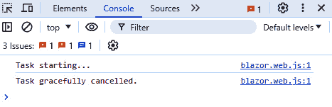

# 探索导航和路由

路由和导航是任何现代 Web 应用程序的基本功能。在 Blazor Web App 中，路由是将 URL 映射到 Razor 组件的过程，使用户能够在不同的视图之间导航。导航指的是涉及从一个路由移动到另一个路由的动作和过程，无论是通过用户交互、程序性命令还是其他方式。Blazor 提供了一个灵活的路由系统，支持静态和交互式路由，具体取决于如何配置应用程序。

**静态路由**在启用预渲染的静态服务器端渲染期间发生。在此模式下，由**Routes.razor**中的**Router**组件定义的 Blazor 路由器根据 HTTP 请求路径执行路由，直接将 URL 映射到组件。相反，当 Blazor 路由器设置为交互式渲染模式时，在服务器上的初始渲染完成后，它会自动从静态路由转换为**交互式路由**。交互式路由使用文档的 URL（浏览器地址栏中的 URL）来确定要动态渲染哪个组件，允许应用程序响应用户交互并导航，而无需执行完整的 HTTP 请求。这种方法使得动态内容更新和应用内的无缝导航成为可能。

当比较 Blazor 中的路由与 ASP.NET Core 中的路由时，需要考虑相似之处和关键差异。ASP.NET Core 主要使用控制器和操作进行路由，其中路由通常以集中化的方式定义，通常使用基于属性的或传统路由。相比之下，Blazor 的路由是基于组件的，直接将 URL 映射到 Razor 组件而不是控制器操作。Blazor 中的这种基于组件的方法允许更模块化和封装的路由体验，其中每个组件可以管理自己的导航逻辑。此外，Blazor 支持客户端浏览器内的导航，无需完整页面刷新，这与 ASP.NET Core 中的传统服务器端路由有显著差异。

在本章中，我们将介绍使用 .NET 9 在 Blazor 网络应用程序中路由和导航的各个方面。我们将从启用来自多个程序集的路由开始，这对于构建模块化应用程序和您将利用外部 NuGet 包的场景至关重要。然后，我们将探讨参数化路由，您将学习如何使用路由参数创建动态和灵活的 URL。接着，我们将讨论实现统一的 **深度链接** 以集中管理路由定义。我们还将涵盖处理错误的导航请求和控制导航历史以增强用户体验。接近尾声时，我们将解释如何在导航期间执行异步操作，并在用户导航离开时取消长时间运行的任务。最后，我们将探讨如何在用户离开表单之前提示用户关于未保存的更改，以防止意外数据丢失。

到本章结束时，您将了解 Blazor 中的路由工作原理以及如何实现各种路由和导航场景。

路由和导航是影响整个应用程序行为的关键组件。然而，本章中的食谱完全独立，互不依赖。这种方法还意味着您可以单独审查和实现每个食谱。食谱开始于关于您应该创建哪个工作目录以及您需要执行以下任务所需的示例文件说明。

在本章中，我们将介绍以下食谱：

+   启用来自多个程序集的路由

+   与参数化路由一起工作

+   与查询参数一起工作

+   实现统一的深度链接

+   处理错误的导航请求

+   在导航时执行异步操作

+   当用户导航离开时取消长时间运行的任务

+   控制导航历史

# 技术要求

在深入研究之前，请确保您有以下条件：

+   安装了 .NET 9 SDK

+   一个支持 Blazor 开发的现代 IDE（Integrated Development Environment）

+   一个支持 WebAssembly 的现代网络浏览器

+   Blazor 项目

我们将在 **BlazorCookbook.App** 项目中构建所有食谱，因此所有引用都将反映该程序集。请确保您调整程序集引用以匹配您的项目。

您可以在 GitHub 上找到本章中编写的所有代码和代码示例：[`github.com/PacktPublishing/Blazor-Web-Development-Cookbook/tree/main/BlazorCookbook.App.Client/Chapters/Chapter09`](https://github.com/PacktPublishing/Blazor-Web-Development-Cookbook/tree/main/BlazorCookbook.App.Client/Chapters/Chapter09) .

# 启用来自多个程序集的路由

您可能希望通过在多个程序集中分散路由来模块化您的 Blazor 应用程序。**模块化**是将应用程序分解成更小、更易于管理和独立的模块的实践，每个模块负责特定的功能。当在大团队或分布式团队中工作时，这是一个理想的开发方法，因为每个团队可以独立交付功能。模块化对大型应用程序也有益，因为您可以将不同的功能封装在单独的程序集中。Blazor 允许您通过 **Router** 组件的 API 发现来自额外程序集的可路由组件，用于交互式路由，以及用于静态路由设置的端点约定构建器。

让我们学习如何允许用户从不同于我们的基础项目的程序集中导航到组件。

## 准备工作

在我们扩展程序集之前，Blazor 扫描可路由组件的位置，将 **BlazorCookbook.Library** 项目从 GitHub 仓库复制到您的解决方案中。

## 如何操作…

按照以下步骤允许 Blazor 从不同的程序集中发现路由：

1.  导航到您解决方案中的 **BlazorCookbook.App** 服务器端项目。

1.  打开 **BlazorCookbook.App.csproj** 并添加对 **BlazorCookbook.Library** 项目的引用：

    ```cs
    <ItemGroup>
      <ProjectReference
        Include="..\BlazorCookbook.App.Client\
        BlazorCookbook.App.Client.csproj" />
      <ProjectReference
        Include="..\BlazorCookbook.Library\
        BlazorCookbook.Library.csproj" />
    </ItemGroup>
    ```

1.  打开 **Program.cs** 并定位到组件映射部分。使用 **AddAdditionalAssemblies()** 方法映射来自 **ExternalEventManager** 程序集的路由：

    ```cs
    using BlazorCookbook.Library.Chapter09.Recipe01;
    //other registrations and pipelines
    app.MapRazorComponents<App>()
        .AddInteractiveServerRenderMode()
        .AddInteractiveWebAssemblyRenderMode()
        .AddAdditionalAssemblies(
            typeof(_Imports).Assembly,
            typeof(ExternalEventManager).Assembly
        );
    ```

1.  打开 **Routes** 组件，并将 **AdditionalAssemblies** 参数附加的数组扩展到包含 **ExternalEventManager** 程序集：

    ```cs
    @using BlazorCookbook.Library.Chapter09.Recipe01
    <Router AppAssembly="@typeof(Program).Assembly"
            AdditionalAssemblies="new[]
            {
                typeof(Client._Imports).Assembly,
                typeof(ExternalEventManager).Assembly
            }">
        @* router configuration *@
    </Router>
    ```

## 它是如何工作的…

在这个菜谱中，我们在解决方案的服务器端项目中添加了所有可路由组件可发现性的配置。在 *第 2 步* 中，我们找到 **BlazorCookbook.App** 项目的配置文件，并引用您从 GitHub 仓库复制的 **BlazorCookbook.Library** 项目。**BlazorCookbook.Library** 包含一个 **ExternalEventManager** 组件，我们希望我们的用户能够导航到它。

在 *第 3 步* 中，我们设置了可能来自 **BlazorCookbook.Library** 的静态路由的可发现性。我们导航到 **BlazorCookbook.App** 项目的 **Program.cs** 文件，并定位到构建应用程序端点约定的位置。端点路由构建器从 **MapRazorComponents()** 方法调用开始。在构建器末尾，我们调用 **AddAdditionalAssemblies()** 方法来映射来自 **BlazorCookbook.App.Client** 项目的所有静态路由。现在，我们将 **ExternalEventManager** 程序集扩展到额外的程序集数组中。为了使注册类型安全，而不是简单的字符串，我们使用 **typeof()** 方法。.NET 中的 **typeof()** 方法允许我们获取给定类型名称的 **Type** 对象，从而在运行时启用反射和元数据访问。此外，它还允许检索包含类型的程序集，这完美地解决了我们的需求。

在 *步骤 4* 中，我们导航到服务器端项目中的 **Routes** 组件，以扩展交互式路由的可发现性。在这里，我们找到了我们的应用程序 **Router** 配置。通过指定具有 **AppAssembly** 和 **AdditionalAssemblies** 参数的程序集，**Router** 可以动态发现并将路由映射到这些程序集中定义的组件。在我们的情况下，我们再次发现客户端项目程序集已经附加到 **Router** 的 **AdditionalAssemblies** 参数。我们通过引用 **ExternalEventManager** 程序集扩展了 **AdditionalAssemblies**。

# 使用参数化路由进行工作

在 Blazor 中，参数化路由允许您通过 URL 传递参数，使您的应用程序更加动态和灵活。通过利用路由参数，您可以创建对特定 URL 段落做出响应的组件，并根据这些参数渲染内容。您还可以使用路由参数来持久化组件状态，并允许用户将其添加到书签（我们在 *第五章* 的开头进行了探索）。

让我们通过参数化路由扩展组件路由，强制参数约束。

## 准备工作

在探索参数化路由之前，执行以下操作：

+   创建一个 **Chapter09** / **Recipe02** 目录 – 这将是你的工作目录

+   从 **BlazorCookbook.Library** 项目中的 **Chapter09** / **Recipe01** 目录或 GitHub 仓库中的对应目录复制 **ExternalEventManager**

## 如何做这件事...

按照以下步骤实现具有参数的路由并拦截它们的值：

1.  导航到 **ExternalEventManager** 组件，并使用参数化选项扩展其路由：

    ```cs
    @page "/ch09r02"
    @page "/ch09r02/{eventId:guid}"
    @page "/ch09r02/{eventId:guid}/venues/{venue?}"
    ```

1.  在 **ExternalEventManager** 中，使用两个参数 – **EventId** 和 **Venue** 初始化 **@code** 块：

    ```cs
    @code {
        [Parameter] public Guid EventId { get; set; }
        [Parameter] public string Venue { get; set; }
    }
    ```

1.  通过构建 **Venue** 和 **EventId** 值的条件显示来扩展 **ExternalEventManager** 标记：

    ```cs
    @if (EventId == default) return;
    <p>Event ID: @EventId</p>
    <p>In @(Venue ?? "all venues")</p>
    ```

## 它是如何工作的...

在 *步骤 1* 中，我们导航到 **ExternalEventManager** 并在那里扩展路由。我们添加了一个新的路由，该路由期望一个 **eventId** 参数，通过将参数名称放在大括号中来放置参数名称。我们还声明它必须是 **guid** 类型。Blazor 还支持路由参数约束，这通过自动拒绝不符合指定约束的参数值来增强应用程序的安全性。提供不兼容值的用户将收到 **404** 错误状态码。虽然路由参数名称不区分大小写，但约束必须遵循配置的大小写。由于约束支持有限，在食谱的 *另请参阅* 部分中有一个链接到所有当前支持的数据类型。在最后添加的路由中，我们通过在末尾添加一个 **?** 符号来声明 **venue?** 可选路由参数。有一个可选参数意味着用户无论是否提供 **venue** 的值都可以导航到该页面，并且我们可以相应地调整显示逻辑。

在**步骤 2**中，我们在**ExternalEventManager**中初始化一个**@code**块，并声明两个参数，**EventId**和**Venue**，与在路由中添加的参数名称匹配，但遵循 Pascal 大小写约定。这就是启用 Blazor 将路由参数绑定到组件属性所需的所有操作。

在**步骤 3**中，我们在**ExternalEventManager**中构建了一个简单的标记。在现有的**h1**元素下方，我们检查路由中是否设置了**EventId**，并在一个段落中渲染其值。最后，我们在**EventId**下方添加另一个段落，以显示**Venue**的当前值或表示用户正在查看所有场地的消息（如果路由中没有提供**Venue**）。通过这种设置，你可以测试不同的路由如何影响组件的行为。

## 还有更多...

或者，你可以实现一个“捕获所有”模式来拦截路由参数。你可以将整个路由段拦截为一个字符串参数：

```cs
@page "/ch09r02/{*path}"
@code {
    [Parameter] public string Path {get; set; }
}
```

我们仍然在花括号中声明路由参数，并在**@code**块中声明一个匹配的**string**参数，类似于其他路由情况。然而，为了表示我们想要拦截整个路由段，我们在参数名称前加上一个*****符号。例如，当用户导航到**/ch09r02/im/definitely/lost**时，Blazor 将**im/definitely/lost**分配给**Path**值。只要捕获所有路由段参数是路由路径中的最后一个，你仍然可以混合标准路由参数和约束。

## 相关内容

要查看 Blazor 支持作为路由参数约束的数据类型的完整列表，请参阅以下 Microsoft 文档链接：[`learn.microsoft.com/en-us/aspnet/core/blazor/fundamentals/routing?view=aspnetcore-9.0#route-constraints`](https://learn.microsoft.com/en-us/aspnet/core/blazor/fundamentals/routing?view=aspnetcore-9.0#route-constraints)。

# 使用查询参数

**查询字符串**和参数是 URL 的一部分，允许你向 Web 应用程序传递可选数据。它们出现在 URL 中的**?**符号之后，由**=**分隔的键值对组成，并由**&**连接。查询参数的使用对于过滤数据、分页以及在不显著改变 URL 结构的情况下传递用户特定信息非常有用。

让我们通过允许条件传递一个将被动态加载的事件日期来增强路由。

## 准备工作

在探索查询参数之前，请执行以下操作：

+   创建一个**Chapter09** / **Recipe03**目录——这将是你的工作目录

+   从*使用参数化路由*配方或 GitHub 仓库中的**Chapter09** / **Recipe02**目录复制**ExternalEventManager**

## 如何操作...

按照以下说明从查询参数中拦截值：

1.  导航到 **ExternalEventManager** 的 **@code** 块并引入一个 **Date** 参数，但使用 **SupplyParameterFromQuery** 属性来指示 Blazor 应从查询字符串中拦截它：

    ```cs
    [SupplyParameterFromQuery]
    public DateTime Date { get; set; }
    ```

1.  在 **ExternalEventManager** 标记的末尾，检查 **Date** 是否可用并渲染另一个包含 **Date** 值的段落：

    ```cs
    @if (Date == DateTime.MinValue) return;
    <p>On @Date</p>
    ```

## 它是如何工作的…

在 *步骤 1* 中，我们导航到 **ExternalEventManager** 并声明一个 **Date** 参数。我们不是使用标准的 **Parameter** 属性，而是利用 **SupplyParameterFromQuery** 变体，指示 Blazor 拦截查询字符串中的参数。无需操作路由；只需使用 **SupplyParameterFromQuery** 注释参数即可启用此功能。

在 *步骤 2* 中，我们扩展了 **ExternalEventManager** 标记。我们检查 **Date** 值是否与 **DateTime** 的默认值匹配，这表示参数不在查询字符串中。如果 Blazor 拦截了 **Date** 参数，我们将渲染一个显示其值的段落。然而，需要注意的是，查询字符串中提供的日期格式需要与应用程序的文化设置相匹配。默认情况下，Blazor 和 .NET 预期日期格式为 **MM-DD-YYYY**，这是 **en-US** 文化的默认格式，反映了美国标准。如果日期以不同的格式提供，例如 **DD-MM-YYYY**，则除非应用程序的文化设置适当，否则可能无法正确解析。这可以通过配置适当的文化设置来调整，无论是在全局范围内还是在特定组件中，以确保 Blazor 以所需格式解释日期。

## 还有更多…

当你的 C# 参数名称与查询字符串中提供的不一致，或者当查询字符串中存在多个相同的参数键并且你需要将所有值拦截到一个数组中时，你必须显式声明 **SupplyParameterFromQuery** 属性的 **Name** 属性：

```cs
[SupplyParameterFromQuery(Name = "seat")]
public string[] Seats { get; set; }
```

使用此代码，Blazor 将拦截附加到 **seat** 键的所有查询参数并将它们存储在 **Seats** 数组中。然后你可以使用该数组来突出显示或预定具有特定编号的座位。

## 参见

如果你想了解更多关于 Blazor 中的全球化和文化设置的详细信息，请查看 Microsoft Learn 资源：[`learn.microsoft.com/en-us/aspnet/core/blazor/globalization-localization#globalization`](https://learn.microsoft.com/en-us/aspnet/core/blazor/globalization-localization#globalization) .

# 实现统一的深度链接

在 Web 应用程序中实现 **深度链接** 是直接链接到特定内容或功能的能力。在应用程序中实现统一的深度链接服务可以集中管理路由，使应用程序更易于维护和扩展。在一个地方管理路由更改并避免所有路由的不一致性要容易得多。

让我们将一些路由移动到静态深度链接容器中，并更新组件路由以利用这些统一的深度链接。

## 准备工作

在我们将路由封装到专用容器之前，请执行以下操作：

+   创建**Chapter03**/**Recipe04**目录——这将是你的工作目录。

+   从“使用查询参数”配方或 GitHub 仓库中的**Chapter09**/**Recipe03**目录复制**ExternalEventManager**。

## 如何做到这一点…

按照以下步骤在你的应用程序中引入路由容器：

1.  这次，创建一个**DeepLinks**静态类，而不是一个组件：

    ```cs
    public static class DeepLinks
    {
        // you will define routes here
    }
    ```

1.  在**DeepLinks**类内部，定义三个与**ExternalEventManager**中相同的**const**路由：

    ```cs
    public const string
        LandingPage = "/ch09r04",
        EventPage = "/ch09r04/{eventId:guid}",
        EventAtVenuePage =
            "/ch09r04/{eventId:guid}/venues/{venue?}";
    ```

1.  导航到**ExternalEventManager**，将**@page**指令替换为**@attribute**和**[Route]**属性。而不是显式提供路由，利用**DeepLinks**常量：

    ```cs
    @attribute [Route(DeepLinks.LandingPage)]
    @attribute [Route(DeepLinks.EventPage)]
    @attribute [Route(DeepLinks.EventAtVenuePage)]
    ```

## 它是如何工作的…

在*步骤 1*中，我们创建一个新的**DeepLinks**类。**DeepLinks**不是一个组件，而是一个**静态**类，因为它代表了一个在整个应用程序中应该易于访问的固定库，并且在整个应用程序的生命周期中不会改变。在*步骤 2*中，我们在**DeepLinks**内部声明了三个**const**路由，用于**LandingPage**、**EventPage**和**EventAtVenuePage**页面。这些路由与我们在**ExternalEventManager**中明确声明的路由相匹配，因此我们在这里复制了那些值。

在*步骤 3*中，我们导航到**ExternalEventManager**并将所有**@page**指令替换为**@attribute**。使用**@attribute**，我们可以利用**[Route]**属性，该属性接受一个路由作为参数。我们使用**DeepLinks**路由仓库来显式构建与**@page**指令相同的路由。尽管我们已经将路由封装在**string**变量中，但 Blazor 仍然尊重路由参数的约束和可选性。

你可以利用**DeepLinks**类在应用程序菜单或任何其他地方安全地设置导航链接。通过将路由作为命名对象，你可以避免输入错误并减少路由配置中的错误风险。

## 还有更多…

你可以通过扩展**DeepLinks**类来添加方法，这些方法允许你生成有状态的链接，并启用一种更灵活和动态的方式来创建带有路由参数的 URL。例如，你可以实现一个接受**EventId**并将其正确放置在**EventPage**路由模板中的方法：

```cs
public const string
    EventPage = "/ch09r04/{eventId:guid}";
public static string GetPage(Guid eventId)
    => EventPage.Replace("{eventId:guid}", $"{eventId}");
```

当渲染包含事件的网格时，你可以利用**GetPage()**方法并安全地生成指向事件详情页面的链接。**GetPage()**接受**eventId**参数，并使用**Replace()**扩展方法将参数插入到**EventPage**路由模板中。

# 处理不正确的导航请求

在现代 Web 开发中，优雅地处理错误的导航请求是强制性的，以确保流畅且用户友好的体验。通过防止用户遇到令人困惑的错误消息或损坏的链接，你让你的应用程序看起来更专业、更可靠。虽然我们已经在 *第八章* 中介绍了未经授权的导航，但其他错误状态可能会意外发生。你如何处理损坏的链接或输入错误的 URL 定义了用户体验的质量。

让我们实现一个全局、安全的重定向，将用户重定向到一个友好的错误页面，当用户遇到意外的导航异常时。

## 准备工作

在实现安全重定向之前，你必须有一个可以重定向到的目标。如果你一直跟随整本书的内容，或者只是搭建了你的项目，你已经有了一个可路由的 **Error** 组件。否则，你可以从 GitHub 仓库中的 **Modules** 目录中获取它。

## 如何做到这一点…

按照以下步骤添加全局安全重定向，当用户导航失败时：

1.  导航到服务器端项目的 **Program** 文件。

1.  在所有现有的中间件注册之后，使用 **WebApplication** 的 **UseStatusCodePagesWithRedirects()** 扩展方法来注册一个错误重定向中间件，并将用户重定向到 **/** **error** 路由：

    ```cs
    //...
    //other middleware registrations
    app.UseAntiforgery();
    app.UseStatusCodePagesWithRedirects("/error");
    //...
    ```

## 它是如何工作的…

在 Blazor 应用程序中，在 Blazor Web 应用程序引入之前，你会使用 **Router** 的 **NotFound** 参数来处理用户导航到不可用的路由。Blazor Web 应用程序仍然支持 **NotFound** 参数以实现向后兼容性，但利用服务器端中间件管道来解析状态码提供了更大的灵活性。

在 *步骤 1* 中，我们导航到服务器端项目的 **Program** 文件，在那里我们配置服务器端中间件管道。在 *步骤 2* 中，我们找到现有中间件注册的结束位置，并使用 **UseStatusCodePagesWithRedirects()** 方法扩展中间件管道。通过 **UseStatusCodePagesWithRedirects()**，我们定义了每当服务器请求导致未处理的错误状态码时，用户将被重定向到 **/error** 页面。通过 **Error** 组件，我们可以自定义用户看到的消息、详细信息以及下一步操作。

**UseStatusCodePagesWithRedirects()** 的附加好处是它涵盖了所有不成功的状态码，而不仅仅是 *找不到路由* 的情况。

## 参见

我们已经介绍了 **UseStatusCodePagesWithRedirects()** 方法，因为它是在基于 UI 的应用程序中最常用的方法。然而，它只是 **UseStatusCodePages()** 方法家族中的一个选项。它可以从简单的文本状态表示处理到完全定制的异常处理逻辑和重试。

你可以在 Microsoft 文档中找到所有可用选项及其使用示例：[`learn.microsoft.com/en-us/aspnet/core/fundamentals/error-handling?view=aspnetcore-9.0#usestatuscodepages`](https://learn.microsoft.com/en-us/aspnet/core/fundamentals/error-handling?view=aspnetcore-9.0#usestatuscodepages) .

# 执行带有导航的异步操作

在现代网络应用中，在导航期间执行常见逻辑对于保持无缝的用户体验和收集有价值的见解至关重要。你可以实现导航事件记录，更好地理解用户行为，识别最常使用的功能，并相应地改进它们。你还可以实现定期的安全检查并无缝刷新用户的访问令牌。

让我们记录应用内所有的导航请求，以便更好地了解用户使用最多的功能，从而可以优先考虑它们。

## 准备工作

我们将在**Routes**组件内部工作，这是 Blazor 应用的一个基本组成部分。在这个菜谱中不需要进行任何准备。

## 如何操作…

按照以下说明在应用内的所有导航上触发操作：

1.  导航到**Routes**组件并注入一个**Logger**实例：

    ```cs
    @inject ILogger<Routes> Logger
    ```

1.  在**Routes**组件中初始化一个**@code**代码块，并实现一个接受**NavigationContext**并记录用户输入路径的**LogNavigation()**方法：

    ```cs
    @code {
        private void LogNavigation(
            NavigationContext context)
            => Logger.LogInformation(
                "User entered: {Path}",
                context.Path);
    }
    ```

1.  在**Routes**标记中，找到**Router**并将**LogNavigation()**方法附加到其**OnNavigateAsync**回调：

    ```cs
    <Router AppAssembly="@typeof(Program).Assembly"
            AdditionalAssemblies="new[]
            {
                typeof(Client._Imports).Assembly,
                typeof(ExternalEventManager).Assembly
            }"
            OnNavigateAsync="@LogNavigation">
        @* here's further router configuration *@
    </Router>
    ```

## 它是如何工作的…

在**步骤 1**中，我们导航到**Routes**组件。你可以在**从多个程序集启用路由**菜谱中了解到**Routes**。首先，我们注入一个**ILogger**实例。**ILogger**接口简化了应用程序中的日志记录，并允许你使用不同的严重级别（如信息、警告或错误）记录消息，而不依赖于特定的日志实现。**ILogger**允许你提供一个日志类别，该类别随后会在日志中反映出来，意味着日志来源。在我们的案例中，我们将**Routes**声明为日志类别。你可以在菜谱末尾的**另请参阅**部分找到更多日志资源。

在**步骤 2**中，我们初始化一个**@code**代码块并实现一个**LogNavigation()**方法。**LogNavigation()**接受**NavigationContext**，它提供了关于导航事件的详细信息。通过访问**NavigationContext**的**Path**属性，我们可以将导航目标路径传递给**Logger**并记录用户导航到的路径。

在*步骤 3*中，我们转向**Routes**标记。在这里，我们找到**Router**构造。**Router**组件公开一个**OnNavigateAsync**回调，因此我们在那里附加了**LogNavigation()**方法。现在，随着每个导航请求，**Router**将调用**OnNavigateAsync**回调并触发**LogNavigation()**方法，有效地记录用户在应用程序中输入的每个路径。

默认情况下，你将注册一个**Console**记录器，但你可以自由扩展日志行为以覆盖你的业务用例。你可以实现自己的记录器或找到多个支持从不同托管模型进行日志记录的 NuGet 包。

## 参见

你可以通过查看 Microsoft 学习资源了解更多关于日志记录的信息：[`learn.microsoft.com/en-us/dotnet/core/extensions/logging`](https://learn.microsoft.com/en-us/dotnet/core/extensions/logging)。

# 当用户离开时取消长时间运行的任务

根据你应用程序的流量，如果你没有正确管理长时间运行的任务，它们可能会对性能和用户体验产生负面影响。在 SSR 模式下渲染的组件中，服务器为你处理取消，类似于在 Web API 项目中发生的情况。但在交互模式下，当用户从一个正在执行长时间运行任务的页面离开时，无论是在服务器端还是客户端持久化状态，优雅地取消任务以释放资源并防止不必要的处理是至关重要的。

让我们借助 Blazor 的**NavigationManager**和**CancellationToken**实现长时间运行任务的优雅取消。

## 准备工作

在我们探索当用户离开时优雅取消长时间运行的任务之前，请执行以下操作：

+   创建一个**Chapter09**/**Recipe07**目录 – 这将是你的工作目录

+   从*实现统一深度链接*食谱或 GitHub 仓库中的**Chapter09**/**Recipe04**目录复制**ExternalEventManager**和**DeepLinks**文件

+   由于**DeepLinks**包含特定于食谱的路由，并且应用程序中的路由必须是唯一的，因此将路径更新为**ch09r07**以反映当前食谱

+   从 GitHub 仓库中的**Chapter09**/**Data**目录复制**Source**文件

## 如何做到这一点…

按照以下步骤触发用户离开时的优雅取消：

1.  导航到**ExternalEventManager**组件，然后增强它以在**InteractiveWebAssembly**模式下渲染并实现**IDisposable**。我们将很快解决由此产生的编译错误：

    ```cs
    @rendermode InteractiveWebAssembly
    @implements IDisposable
    ```

1.  在**ExternalEventManager**的**@code**块顶部，注入**NavigationManager**：

    ```cs
    [Inject] private NavigationManager Nav { get; init; }
    ```

1.  在**Nav**注入下方，声明一个类型为**CancellationTokenSource**的**_cts**变量：

    ```cs
    private CancellationTokenSource _cts;
    ```

1.  在**ExternalEventManager**的**@code**块末尾，实现一个**CancelTask()**方法，匹配返回**LocationChangedEventArgs**的**EventHandler**对象的签名，该对象作为代理来调用**_cts**对象的**Cancel()**方法：

    ```cs
    private void CancelTask(object sender,
        LocationChangedEventArgs args) => _cts?.Cancel();
    ```

1.  在**CancelTask()**方法下方，重写**OnInitialized()**生命周期方法，并将**CancelTask()**方法订阅到注入的**Nav**暴露的**LocationChanged**事件：

    ```cs
    protected override void OnInitialized()
        => Nav.LocationChanged += CancelTask;
    ```

1.  在**OnInitialized()**旁边，实现一个**Dispose()**方法，这是**IDisposable**接口要求的，在该方法中，我们安全地取消订阅**LocationChanged**事件，并优雅地处理**_cts**实例：

    ```cs
    public void Dispose()
    {
        Nav.LocationChanged -= CancelTask;
        _cts?.Dispose();
    }
    ```

1.  为了完成**@code**块，实现一个**GetAsync()**方法，其中从**Source**获取**eventId**，并将用户重定向到事件详情页面：

    ```cs
    private async Task GetAsync()
    {
        _cts = new();
        var eventId = await Source.LoadAsync(_cts.Token);
        if (_cts.IsCancellationRequested) return;
        Nav.NavigateTo($"/ch09r07/{eventId}");
    }
    ```

1.  移动到**ExternalEventManager**的标记区域，在标题下方，用按钮的渲染替换当**EventId**未设置时的快速返回语句，允许用户在事件尚未加载时加载事件：

    ```cs
    @if (EventId == default)
    {
        <button class="btn btn-primary"
                @onclick="@GetAsync">
            Get event
        </button>
        return;
    }
    ```

## 它是如何工作的…

在*步骤 1*中，我们导航到**ExternalEventManager**组件，并声明它以**InteractiveWebAssembly**模式渲染，因为我们想监控长时间运行的任务的执行，以便在需要时取消它。我们还需要**ExternalEventManager**实现**IDisposable**。将组件声明为**IDisposable**会导致编译错误，但我们将在食谱结束前解决它。

在*步骤 2*中，我们在**ExternalEventManager**的**@code**块顶部注入一个**NavigationManager**实例。**NavigationManager**实例允许我们响应导航和位置变化。在*步骤 3*中，我们通过声明一个**CancellationTokenSource**变量来设置优雅任务取消的基础。使用**CancellationTokenSource**，我们可以发出和管理异步操作取消请求。

在 *第 4 步* 中，我们实现了一个签名与 **EventHandler** 对象返回的 **LocationChangedEventArgs** 匹配的 **CancelTask()** 方法。**CancelTask()** 方法的责任是调用 **_cts** 实例的 **Cancel()** 并取消所有基于该实例运行的操作。我们利用 **?** 操作符，称为 **空条件操作符**，因为它允许我们仅在前面对象（在这种情况下为 **_cts**）不是 **null** 时调用方法或访问成员。在 *第 5 步* 中，我们重写 **ExternalEventManager** 的 **OnInitialized()** 生命周期方法，并将 **CancelTask()** 订阅到 **Nav** 暴露的 **LocationChanged** 事件。Blazor 在用户在应用程序内导航到新位置时触发 **LocationChanged** 事件。在 *第 6 步* 中，我们通过构建一个 **Dispose()** 方法来完成 **IDisposable** 的实现。在 **Dispose()** 方法中，我们安全地取消订阅 **LocationChanged** 事件以防止内存泄漏。我们还使用它暴露的 **Dispose()** 方法来处置 **_cts** 实例。在 *第 7 步* 中，我们通过实现一个用于测试长时间运行任务优雅取消的 **GetAsync()** 方法来完成 **@code** 块。作为 **GetAsync()** 的一部分，我们初始化一个新的 **_cts** 实例并调用 **Source** 类的 **LoadAsync()** 方法，传入来自 **_cts** 实例的 **CancellationToken**。**CancellationToken** 允许 **LoadAsync()** 在执行过程中意识到任何取消请求。由于我们期望加载取消，我们添加了一个 **_cts** 状态检查。使用 **IsCancellationRequested** 属性，我们可以验证是否请求了取消并短路代码执行。最后，如果 **LoadAsync()** 完成，我们将用户重定向到适当的事件详情页面。

在 *第 8 步* 中，我们转向 **ExternalEventManager** 标记并添加了一个简单的按钮，允许用户触发 **GetAsync()** 并对实现进行测试。您可以运行应用程序并点击 **获取事件** 按钮。**Source** 中的 **LoadAsync()** 方法有一个硬编码的五秒延迟，并将状态消息记录到您的浏览器控制台。如果您在计时器结束之前离开 **ExternalEventManager** 页面，您将看到您已排队的保存请求被优雅地取消。



图 9.1：浏览器控制台中的消息，指示优雅的任务取消

# 控制导航历史

Blazor 中的**NavigationManager**使用浏览器的**History API**来维护导航历史记录。操作导航历史记录在用外部身份提供者验证用户时特别有用，用户在验证后会被重定向回应用程序。当显示允许用户配置其应用程序的中间页面，但您希望限制他们在此过程中向后导航时，这也很有益。

让我们模拟从浏览器历史记录中删除中间页面，并在用户尝试返回到中间阶段时强制他们导航到最后一个稳定页面。

## 准备工作

在我们探索浏览器导航历史记录操作之前，请执行以下操作：

+   创建一个**Chapter09** / **Recipe08**目录——这将是你的工作目录

+   从“当用户导航离开时取消长时间运行的任务”食谱或 GitHub 仓库中的**Chapter09** / **Recipe07**目录复制**ExternalEventManager**和**DeepLinks**文件

+   由于**DeepLinks**包含特定于食谱的路由，并且应用程序中的路由必须是唯一的，因此使用**ch09r08**更新路径以反映当前食谱

+   从 GitHub 仓库中的**Chapter09** / **Data**目录复制**Source**文件

## 如何操作…

按照以下步骤替换浏览器导航历史记录中的条目：

1.  导航到**ExternalEventManager**的**@code**块并找到**GetAsync()**方法。

1.  在**GetAsync()**内部，在调用注入的**NavigationManager**的**NavigateTo()**方法时，明确设置额外的**replace**参数为**true**：

    ```cs
    private async Task GetAsync()
    {
        //... event getting logic
        Nav.NavigateTo($"/ch09r08/{eventId}",
            replace: true);
    }
    ```

## 它是如何工作的…

在*步骤 1*中，我们导航到**ExternalEventManager**。在这里，在**@code**块中，我们有一个**GetAsync()**方法，用户在从外部源检索事件详情时触发此方法。在*步骤 2*中，通过将**true**作为**replace**参数传递来扩展**GetAsync()**的导航逻辑。在**NavigationManager.NavigateTo()**中的**replace**参数确保浏览器历史记录中的当前条目被新的 URL 替换，而不是添加新的条目。

如果用户尚未加载任何事件，我们将显示一个带有按钮的页面，允许他们加载事件。点击按钮后，他们将被自动重定向到事件详情页面。从那里，当用户尝试导航回时，他们将到达在获取事件之前所在的任何页面。浏览器将不会意识到最初加载事件的中间步骤。
