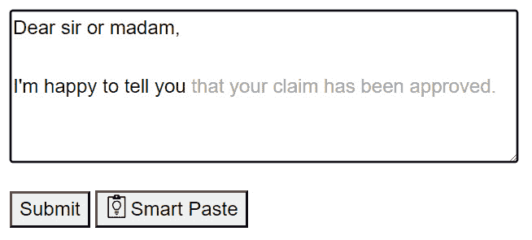

# 第十章：集成 OpenAI

在本章中，我们将探讨如何使用 OpenAI 强大的语言模型将高级 AI 功能集成到您的应用程序中。您将学习如何设置 Azure OpenAI 服务并部署模型，为将 AI 集成到您的应用程序中打下基础。通过在 Web 应用程序中实现 AI 增强功能，如智能粘贴和智能文本区域，您将利用智能数据处理和内容生成来提升用户体验。此外，您还将构建并集成一个类似 ChatGPT 的聊天机器人，用于交互式 AI 驱动对话。最后，您将通过将 Azure OpenAI 服务连接到现有的 Azure Search 服务数据索引，实现无缝数据分析。

在我们深入食谱之前，强调使用 AI 模型，尤其是关于用户数据的道德影响至关重要。在某些情况下，通过使用和部署 AI 模型，您同意在您的应用程序内容上训练这些模型。您必须对用户数据的隐私和安全保持警惕，并在您的应用程序中实施清晰的警告和接受表格，允许用户同意或退出数据共享。通过优先考虑透明度和用户自主权，您保护了用户信任并遵守了负责任的 AI 实践。

下面是本章我们将涵盖的食谱：

+   设置 Azure OpenAI 服务

+   实现智能粘贴

+   实现智能文本区域

+   添加聊天机器人

+   将 Azure OpenAI 服务连接到现有数据索引

# 技术要求

在本章中，我们将大量依赖 Azure 服务和一些可能仍在预览中的 NuGet 包。您将在每个受影响的食谱中找到详细描述的所有细节和警告，因此您无需担心。在您开始之前，请确保您有以下内容：

+   一个活跃的 Azure 账户，可以访问 Azure 门户（如果您还没有，您可以从[`azure.microsoft.com/en-us/free`](https://azure.microsoft.com/en-us/free)提供的限时免费账户开始）

+   Azure 中预创建的资源组

+   预装了 Npm 包管理器，拥有全局可用的**npm**命令

+   一个具有组件/页面渲染模式的 Blazor Web App 项目

您可以在以下食谱中找到所有代码示例（和数据样本），在专门的 GitHub 仓库[`github.com/PacktPublishing/Blazor-Web-Development-Cookbook/tree/main`](https://github.com/PacktPublishing/Blazor-Web-Development-Cookbook/tree/main)中。只需注意，我们将只实现一些食谱在服务器端 – 当您阅读本章时，您将理解为什么。

# 设置 Azure OpenAI 服务

Azure OpenAI 服务是来自 Microsoft Azure 的基于云的服务，提供对 OpenAI 强大语言模型的访问。**大型语言模型**（**LLM**）是一个在人类文本上训练的优化成本函数，可以生成类似人类的文本，使您能够将聊天机器人、内容生成或语言翻译提升到新的水平。通过利用 Azure OpenAI 服务，您可以将高级 AI 功能集成到您的 Blazor 应用程序中，而无需管理底层基础设施。您还将获得对现有 GPT 模型的访问权限。

让我们使用 Azure 门户在 Azure 云中设置一个 Azure OpenAI 服务，部署一个专用的 GPT-4 模型，并在应用端定位所需的集成访问详情。

## 准备工作

在这个菜谱中，我们暂时不会编写任何代码；相反，我们将专注于设置 Azure OpenAI 服务。要开始，以下是一些先决条件：

+   您需要一个 Azure 账户和对 Azure 门户的访问权限

+   您应该事先创建一个资源组；我们将使用一个名为**blazor-cookbook**的资源组，专门用于本章

在撰写本文时，设置 Azure OpenAI 服务的流程包括两个阶段。

1.  在第一阶段，执行以下操作：

    1.  您必须完成一个请求表单才能访问 Azure OpenAI 服务。要找到请求表单，请遵循以下“如何做”部分中概述的前两步。

    1.  提交表单后，您需要等待**Azure 认知服务团队**的批准。一旦您的请求被批准，您将收到一封确认邮件，标志着第一阶段结束。

1.  我们将在“如何做”部分中介绍第二阶段。

## 如何做…

按照以下步骤将 Azure OpenAI 服务添加到您的 Azure 资源中：

1.  在 Azure 门户中打开您的资源组，并点击顶部导航栏中的**创建**按钮，导航到 Azure 市场。


图 10.1：从资源组概览导航到 Azure 市场

1.  在 Azure 市场，使用顶部面板中的搜索栏查找**Azure OpenAI**服务，然后通过点击结果标签页上的**创建**按钮开始创建过程。


图 10.2：导航到 Azure OpenAI 服务创建面板

1.  在**创建 Azure OpenAI**面板中，提供创建 Azure OpenAI 实例所需的必要详细信息：

    1.  在**订阅**字段中选择服务的订阅。

    1.  在**资源****组**字段中选择您想要创建服务的资源组。

    1.  在**区域**字段中选择托管区域。

    1.  在**名称**字段中为服务提供一个唯一的名称。

    1.  在**定价****层级**字段中选择定价计划。


图 10.3：Azure OpenAI 服务创建过程的第一步 - 定义实例详情

审阅条款和条件后，点击**下一步**继续。

1.  在**网络**步骤中，选择最适合您需求的网络可用性并通过点击**下一步**确认。


图 10.4：Azure OpenAI 服务创建过程的第二步 - 配置网络

1.  如果您的组织有标签策略要遵循，请保持**标签**步骤不变，然后通过点击**下一步**继续。

1.  在**审查 + 提交**步骤中，审查服务摘要并通过点击**创建**按钮确认创建请求。


图 10.5：Azure OpenAI 创建过程的最后一步 - 审查实例详情

1.  部署完成后，打开资源组概览并选择**Azure** **OpenAI**服务。


图 10.6：从资源组概览中选择 Azure OpenAI 实例

1.  在左侧菜单的**资源管理**部分找到**模型部署**功能。通过点击**管理** **部署**按钮打开 Azure OpenAI Studio。


图 10.7：导航到 Azure OpenAI Studio 以管理模型部署

1.  在 Azure OpenAI Studio 中，在左侧菜单的**管理**部分找到**部署**功能，并通过点击**创建新** **部署**按钮开始部署过程。


图 10.8：通过 Azure OpenAI Studio 启动模型部署

1.  使用您打算使用的模型的详细信息填写**部署模型**表单：

    1.  在**部署名称**字段中命名部署。

    1.  从**选择一个** **模型**下拉菜单中选择您想要部署的模型。

    1.  在**模型版本**下拉菜单中选择特定的模型版本或**自动更新到默认**选项。

    1.  在**部署类型**下拉菜单中选择部署类型。


图 10.9：填写模型部署详情并部署模型

在填写所有必填字段后，通过点击**创建**按钮确认部署。

## 它是如何工作的…

在*步骤 1*中，我们打开 Azure 门户，并找到我们想要部署 Azure OpenAI 服务的资源组。从概览面板的顶部栏，我们选择**创建**选项。Azure 将我们重定向到 Azure 市场 place，在那里我们可以选择要安装的服务。

在*步骤 2*中，我们使用 Azure 市场 place 顶部的搜索栏查找 Azure OpenAI。结果选项卡有一个**创建**按钮，我们使用它来启动创建过程。

在*步骤 3*中，我们到达 Azure OpenAI 创建的第一步——**基础**。在这一步中，我们填写即将创建的实例的所有基本详细信息。我们选择 Azure 订阅来定义服务的所有者。然后，我们从分配给订阅的列表中选择合适的资源组。接下来，我们定义实例的详细信息，例如托管区域和定价层。请注意，不同地区可用的 AI 模型不同。此外，根据您选择的定价层，您可能会产生服务使用费用。为了避免这种情况，选择免费定价层（它具有受限的可扩展性和请求限制，但对于本章中的配方来说已经足够了）。您可以通过点击**查看完整定价详情**链接来查看可用性和定价详情。然后，我们提供实例名称和定价层。一旦填写了所有必填字段，我们通过点击**下一步**来进入下一步。

在*步骤 4*中，我们到达 Azure OpenAI 创建的**网络**步骤。在**网络**选项卡中，我们定义服务的可发现性。我们可以完全禁用网络访问，配置私有端点，在 Azure 内部设置网络安全，或使实例公开可访问。为了简化，我们允许实例从任何网络访问，包括互联网，并通过点击**下一步**来确认继续。

在*步骤 5*中，我们到达 Azure OpenAI 创建的**标签**步骤。**标签**选项卡允许定义描述服务的自定义标签。除非您的组织中有基于标签的策略定义，否则标签不会产生任何功能影响。因此，我们保持**标签**面板不变，并通过点击**下一步**继续到最后一步。

在*步骤 6*中，我们到达**审查 + 提交**面板，在这里我们有最后一次机会审查即将创建的实例的详细信息。当一切检查无误时，我们通过点击**创建**来确认创建。

服务部署完成需要一些时间。完成之后，我们继续进行*步骤 7*。我们导航到资源组的概览面板，并选择 Azure OpenAI 实例。

在*步骤 8*中，我们找到**资源管理**子菜单，并导航到**模型部署**功能。在该面板中，我们点击**管理部署**按钮，并被重定向到 Azure OpenAI Studio 以进行下一步操作。

在 *步骤 9* 中，在 Azure OpenAI Studio 中，我们找到 **管理** 子菜单并导航到 **部署** 面板。在 **部署** 导航栏中，我们点击 **创建新部署** 按钮以初始化 Azure OpenAI 服务的模型部署。

在 *步骤 10* 中，我们到达 **部署模型** 提交表单，在那里我们必须配置部署详情。首先，我们定义部署名称——稍后我们将使用该名称来指定从 Blazor 应用程序执行请求时使用哪个模型。接下来，我们选择要部署的模型。根据 Azure OpenAI 实例所在的区域，我们可以从 Azure 提供的不同 AI 模型集中进行选择。为了简化，我们选择部署 GPT-4o。选择模型后，我们指定要使用的版本。从下拉菜单中，我们可以选择特定的 GPT 模型版本或选择 **自动更新为默认** 以使用最新稳定的模型。在部署表单中，我们可以微调请求的速率限制和内容过滤器，我们将它们保留为默认值。我们还可以启用 **动态配额**，允许 Azure 在流量较高时自动增加每分钟令牌限制。当我们填写完所有部署详情后，我们可以通过点击 **创建** 来开始该过程。

当部署完成后，您将在 Azure OpenAI Studio 的 **部署** 面板中看到该模型：


图 10.10：Azure OpenAI 模型部署概览，显示已部署的模型

## 还有更多...

要与 Azure OpenAI 实例和部署的 AI 模型进行通信，您需要模型部署名称（我们在 *步骤 10* 中设置）和 Azure OpenAI API 访问详情。

要找到这些详情，请导航到资源组以及创建的 Azure OpenAI 实例。在左侧菜单中，选择 **资源** **管理** 部分的 **密钥和端点** 项。


图 10.11：导航到包含 Azure OpenAI 实例 API 访问详情的面板

您将到达包含指向 Azure OpenAI 实例的 **端点**、它所在的位置以及两个 API 密钥的 API 详情面板。拥有两个 API 密钥可以确保在需要重新生成其中一个时，服务可以持续可用。


图 10.12：API 访问详情面板，包含 API 密钥和 URI

对于所有即将到来的食谱，您将需要端点、API 密钥和部署的模型名称，因此请将它们安全地存储在您的密钥存储中，或者将它们保存在便签簿中以便快速访问，随着我们进入实现过程。

## 参见

我们只是简要介绍了 Azure OpenAI 服务，涵盖了将 OpenAI 集成到 Blazor 应用程序所需的范围。如果您想了解更多信息，请访问 Microsoft Learn 资源：

[`learn.microsoft.com/en-us/azure/ai-services/openai/overview`](https://learn.microsoft.com/en-us/azure/ai-services/openai/overview)

# 实现智能粘贴

网络开发中一个常见的挑战是处理非标准化数据，例如当你收到需要准确输入到索赔表中的电子邮件或其他数据时。这项任务很快就会变得繁琐和令人沮丧，因为手动将数据复制和粘贴到正确的字段既耗时又容易出错。

**SmartComponents**仓库是一个开源仓库，其中包含组件，可以帮助您快速将 AI 驱动功能添加到.NET 应用程序中，而无需深入了解提示工程。在众多功能中，**SmartComponents**可以增强非结构化数据的粘贴，以适应预期的表单。尽管**SmartComponents**不在**Microsoft**命名空间中，但它位于官方.NET 平台 GitHub 账户下，并由 Microsoft 团队官方支持、开发和维护。

让我们实现一个智能粘贴功能，允许用户直接将复制的文本粘贴到指定的字段中，无需任何预处理。

## 准备工作

在我们深入实现智能粘贴之前，请执行以下操作：

+   创建一个**Chapter10** / **Recipe02**目录 - 这将是你的工作目录

+   将 GitHub 仓库中**Chapter10** / **Data**目录下的**Models**文件复制到工作目录

+   将 GitHub 仓库中的**SmartComponents**文件夹复制到您的解决方案文件夹中，并将所有项目添加到解决方案中。**SmartComponents**文件夹包含**SmartComponents**仓库的副本，已更新以支持最新的 Azure OpenAI 更新

+   准备好 Azure OpenAI 的详细信息（你可以在“设置 Azure OpenAI *服务*配方中的*更多内容…*部分中查看如何获取它们”）

## 如何做到这一点…

按照以下说明使用 AI 增强您的应用程序中的粘贴功能：

1.  导航到服务器端项目的**csproj**文件，并包含两个必需的**SmartComponents**项目：

    ```cs
    <ItemGroup>
      <ProjectReference
        Include= "..\SmartComponents\
        SmartComponents.AspNetCore\
        SmartComponents.AspNetCore.csproj" />
      <ProjectReference
        Include= "..\SmartComponents\
        SmartComponents.Inference.OpenAI\
        SmartComponents.Inference.OpenAI.csproj" />
    </ItemGroup>
    ```

1.  仍然在服务器端，打开**Program.cs**文件，并使用 OpenAI 后端注册**SmartComponents**：

    ```cs
    using SmartComponents.Inference.OpenAI;
    //...other service registrations
    builder.Services
        .AddSmartComponents()
        .WithInferenceBackend<OpenAIInferenceBackend>();
    ```

1.  定位到服务器端项目的**appSettings**文件，并在应用程序设置中扩展一个用于**SmartComponents**配置的区域：

    ```cs
    {
      "SmartComponents": {
        "ApiKey": "YOUR_API_KEY",
        "Endpoint": "YOUR_ENDPOINT",
        "DeploymentName": "YOUR_MODEL_DEPLOYMENT"
      }
    }
    ```

1.  导航到客户端项目的**csproj**文件，并包含 WebAssembly 渲染器所需的**SmartComponents**项目：

    ```cs
    <ItemGroup>
      <ProjectReference
        Include="..\SmartComponents\
        SmartComponents.AspNetCore.Components\
        SmartComponents.AspNetCore.Components.csproj" />
    </ItemGroup>
    ```

1.  创建一个新的可路由的**FillClaim**组件，引用**SmartComponents**程序集：

    ```cs
    @page "/ch10r02"
    @using SmartComponents
    ```

1.  在**FillClaim**组件的**@code**块中，声明一个**Claim**表单参数，其类型为**ClaimViewModel**：

    ```cs
    @code {
        [SupplyParameterFromForm]
        public ClaimViewModel Claim { get; set; } = new();
    }
    ```

1.  在 **FillClaim** 标记中，构建一个绑定到 **Claim** 参数的 **EditForm** 框架。如果 **EditForm** 不是一个已识别的组件，请在 **FillClaim** 组件的顶部包含一个 **@using Microsoft.AspNetCore.Components.Forms** 引用：

    ```cs
    <EditForm Model="@Claim" FormName="claim-form">
        @* we will continue here *@
    </EditForm>
    ```

1.  在 **FillClaim** 表单内，添加用于输入事件和客户详情的字段：

    ```cs
    <p>
        Event name:
        <InputText @bind-Value="@Claim.Event" />
    </p>
    <p>Date: <InputText @bind-Value="@Claim.Date" /></p>
    <p>
        Customer name:
        <InputText @bind-Value="@Claim.Customer.Name" />
    </p>
    <p>
        Customer email:
        <InputText @bind-Value="@Claim.Customer.Email" />
    </p>
    ```

1.  在表单内添加一个提交按钮以确认输入：

    ```cs
    <button type="submit">Submit</button>
    ```

1.  最后，在提交按钮下方嵌入一个带有默认图标的 **SmartPasteButton** 组件：

    ```cs
    <SmartPasteButton DefaultIcon />
    ```

## 它是如何工作的…

在 *步骤 1* 中，我们首先配置应用程序的服务器端。我们导航到项目配置文件并添加两个项目的引用，这两个项目是使 **SmartComponents** 在服务器上工作所必需的。**SmartComponents.AspNetCore** 项目包含由 AI 驱动的服务器组件，而 **SmartComponents.Inference.OpenAI** 项目包含与 OpenAI 后端通信的服务实现。

在 *步骤 2* 中，我们导航到服务器端项目的 **Program.cs** 文件并在依赖注入容器中注册 **SmartComponents**。我们还注册了一个 **OpenAIInferenceBackend** 实现作为 **SmartComponents** 的默认提示配置。当您利用 AI 生成文本时，自定义推理实现非常有用。我们将在 *实现智能文本* *区域* 菜谱中稍后探讨这一点。

在 *步骤 3* 中，我们通过导航到服务器端的 **appSettings.json** 文件来完成 **SmartComponents** 的设置。由于 **appSettings.json** 是应用程序的配置源，我们通过添加一个 **SmartComponents** 部分和键节点来扩展 JSON，这些节点代表 API 密钥和端点以及 **SmartComponents** 组件必须使用的模型部署名称。

在 *步骤 4* 中，我们跳转到应用程序的客户端。与默认的 Blazor 组件包一致，**SmartComponents** 也提供了用于在 WebAssembly 模式下渲染的组件对应物。我们导航到客户端项目的配置文件并在其中添加一个 **SmartComponents.AspNetCore.Components** 项目引用。

在 *步骤 5* 中，我们创建了一个可路由的 **FillClaim** 组件并引用了 **SmartComponents** 程序集。接下来，我们构建了一个表单，支持团队可以在 AI 的帮助下填写索赔详情。

在 *步骤 6* 中，我们初始化一个 **@code** 块并声明一个 **Claim** 参数，该参数也将作为索赔表单的后备模型。如果您对在 Blazor 中创建表单不熟悉，我们已在 *第六章* 中详细介绍了这一点。

在 *步骤 7* 中，我们使用 **EditForm** 构建一个表单框架并将其绑定到 **Claim** 模型。

在 *步骤 8* 中，我们构建了一个简单的表单主体，允许用户填写事件名称、日期、客户名称和电子邮件 – 足以识别和处理索赔。

在 *步骤 9* 中，我们通过添加提交按钮来完成表单。

最后，在*步骤 10*中，我们通过在表单的主体中嵌入**SmartPasteButton**组件来增强表单的 AI 功能。我们还声明**SmartPasteButton**组件以默认图标进行渲染。有了这个简单的设置，你现在可以使用（智能）按钮将非结构化数据转换成可发送的表单。


图 10.13：将带有声明的电子邮件智能粘贴到表单中的结果

## 还有更多…

**SmartComponents**也可以与 OpenAI API 密钥一起工作。如果你已经有了 OpenAI 账户，请导航到以下 URL：

[`platform.openai.com/api-keys`](https://platform.openai.com/api-keys)

在这里，你可以创建一个 API 密钥，允许你访问 ChatGPT API：


图 10.14：创建 API 密钥以访问 OpenAI API

一旦你有了 API 密钥，打开服务器端应用程序的**appSettings.json**文件并更新**SmartComponents**部分：

```cs
{
  "SmartComponents": {
    "ApiKey": "YOUR_API_KEY",
    "DeploymentName": "gpt-4o"
  }
}
```

在前面的配置中，**ApiKey**节点仍然代表你的 API 密钥，而**DeploymentName**节点现在定义了你想要使用的 GPT 模型。请注意，**Endpoint**节点不再需要。当你没有明确提供**Endpoint**值时，**SmartComponents**将回退到默认的 OpenAI API URI。

# 实现智能文本区域

你可能已经看到了 AI 的生成能力在实际中的应用 – 你提供上下文，就会出现一堵有意义的文本墙。不再有写作障碍，对吧？生成 AI 是改变你应用程序中所有文本驱动功能的游戏改变者。你可以将商品描述或事件描述从列表中的项目点转换为高质量的副本只需几秒钟。通过**SmartComponents**，我们可以轻松连接到 AI 模型并利用其生成能力，使内容创作更快、更直观。

让我们实现一个文本区域，支持团队可以在回复客户的声明时填写消息。

## 准备工作

在我们探索 AI 驱动的文本区域实现之前，我们必须做以下事情：

+   创建一个**Chapter10** / **Recipe03**目录 – 这将是我们的工作目录

+   从*实现智能粘贴*配方或从 GitHub 仓库中的**Chapter10** / **Recipe02**目录复制**FillClaim**组件

+   从 GitHub 仓库中的**Chapter10** / **Data**目录复制**Models**

+   如果你从这里开始，请回顾*实现智能粘贴*配方中的*步骤 1*到*步骤 4*的说明，以进行初始**SmartComponents**配置

## 如何做到这一点…

按照以下说明将智能文本区域添加到你的应用程序中：

1.  导航到**FillClaim**组件的**@code**块并添加一个**replier**变量，该变量定义填写声明表单的人：

    ```cs
    const string replier =
        "An event organizer support team member replying
        to a claim request.";
    ```

1.  在 **FillClaim** 标记的 **EditForm** 主体中跳转到，并通过嵌入一个位于提交按钮上方的 **SmartTextArea** 组件来扩展表单。将 **replier** 变量附加到 **SmartTextArea** 组件的 **UserRole** 参数，并将文本区域值绑定到 **Claim** 实例的 **Message** 属性：

    ```cs
    <p>
        <SmartTextArea
            @bind-Value="@Claim.Message"
            rows="5" cols="50"
            UserRole="@replier" />
    </p>
    ```

## 它是如何工作的…

在 *步骤 1* 中，我们直接跳转到 **FillClaim** 组件。首先，我们移动到 **@code** 块并声明一个 **replier** 变量，在那里我们放置一个简短但详细的描述，描述我们希望 AI 代表的角色。考虑到 AI 模型从人类编写的内容中学习，您应该努力使 **replier** 描述听起来像您与朋友交谈时一样自然。

在 *步骤 2* 中，我们在 **FillClaim** 标记中定位 **EditForm** 标记。在提交按钮上方嵌入一个 **SmartTextArea** 组件。**SmartTextArea** 组件支持绑定值绑定模式（您可以在 *第三章* 中了解更多关于绑定的信息），并允许定义标准 **textarea** 属性，如 **rows** 或 **cols**，代表文本框的默认大小。它还允许设置一个 **UserRole** 参数——这就是我们将存储在 **replier** 中的角色定义附加到的地方。

要将生成字段添加到您的应用程序中，只需这样做：



图 10.15：用户在输入消息时，AI 帮助撰写索赔响应

## 还有更多…

到目前为止，我们使用了 **SmartComponents** 包提供的默认推理配置。然而，您可以通过实现自定义的 **SmartTextAreaInference** 逻辑来自定义提示和 AI 行为。由于 AI 通信和处理仅在服务器上发生，您必须在服务器端项目中保留提示自定义。

让我们创建一个继承自 **SmartTextAreaInference** 的 **ClaimReplyInference** 类，并自定义来自 **FillClaim** 表单的建议：

```cs
public class ClaimReplyInference : SmartTextAreaInference
{
    public override ChatParameters BuildPrompt(
        SmartTextAreaConfig config,
        string textBefore, string textAfter
    )
    {
        var prompt = base.BuildPrompt(
            config, textBefore, textAfter
        );
        var systemMessage = new ChatMessage(
            ChatMessageRole.System,
            "Make suggestions in a professional tone."
        );
        prompt.Messages.Add(systemMessage);
        prompt.Temperature = 0.7f;
        return prompt;
    }
}
```

在 **ClaimReplyInference** 中，我们重写了 **BuildPrompt()** 方法。我们利用基本实现来构建提示，但之后进行自定义。首先，我们将一个额外的 **ChatMessage** 实例追加到 **prompt** 已经拥有的 **Messages** 集合中。我们定义这个新的 **ChatMessage** 角色为 **System**。**System** 消息设置了 AI 模型的整体行为，表明我们期望得到专业建议的语气。最后，我们自定义了提示的 **Temperature** 属性值。**Temperature** 设置控制 AI 响应的随机性，较低的值使输出更集中和确定，而较高的值则使其更具创造性和多样性。

在 **ClaimReplyInference** 就位后，我们必须将其添加到依赖注入容器中：

```cs
builder.Services.AddSingleton<SmartTextAreaInference,
    ClaimReplyInference>()
```

在**Program**入口类中，我们将**SmartTextAreaInference**类注册为单例。**SmartTextArea**组件将自动发现新的实现。

现在，用户将获得更多官方口吻的建议：


图 10.16：AI 以专业口吻生成建议，帮助用户回复主张

## 相关内容

您可以自定义所有可用的**SmartComponents**组件，并根据应用程序需求微调 AI 行为。如果您想了解更多信息，请查看 GitHub 上的官方**SmartComponents**文档，网址为[`github.com/dotnet-smartcomponents/smartcomponents/tree/main`](https://github.com/dotnet-smartcomponents/smartcomponents/tree/main)。

# 添加聊天机器人

由 OpenAI 开发的 ChatGPT 是一个先进的对话 AI 模型，自发布以来受到了广泛关注。它旨在根据接收到的输入理解和生成类似人类的文本，使其与用户的互动感觉自然直观。GPT 模型的通用性使其能够应用于多种场景，从客户支持和个人助理到教育工具和娱乐。

让我们构建一个原始的聊天 UI 并将其连接到 Azure OpenAI 服务，以便在 Blazor 应用程序中嵌入类似 ChatGPT 的聊天功能。

## 准备工作

与我们在前几章中探讨的**SmartComponents**类似，聊天将需要 Azure OpenAI API 访问权限。为了避免泄露 API 访问详情，我们将转向应用程序的服务器端。

在我们深入构建 AI 聊天之前，我们必须做以下几件事：

+   创建**Chapter10** / **Recipe04**目录——这将成为您的工作目录

+   从 GitHub 仓库中的**Chapter10** / **Data**目录复制**InputModel**

+   准备 Azure OpenAI 服务连接详情（您可以在*更多内容…*部分查看如何获取它们，该部分位于*设置 Azure OpenAI 服务*配方中）

## 如何做到这一点…

按照以下步骤将 AI 聊天添加到应用程序中：

1.  导航到服务器端项目的配置文件，并包含**Azure.AI.OpenAI**包的最新版本（截至编写时，它仍在预览中）：

    ```cs
    <ItemGroup>
      <PackageReference
        Include="Azure.AI.OpenAI"
        Version="2.0.0-beta.2" />
    </ItemGroup>
    ```

1.  使用服务器项目配置打开**appsettings.json**文件，并添加一个包含所需节点的**ChatBot**部分：

    ```cs
    {
      "ChatBot": {
        "ApiKey": "YOUR_API_KEY",
        "Endpoint": "YOUR_ENDPOINT",
        "DeploymentName": "YOUR_MODEL_DEPLOYMENT"
      }
    }
    ```

1.  移动到服务器端项目的**Program.cs**入口文件，并在**builder**实例初始化后，将聊天配置拦截到变量中：

    ```cs
    var endpoint = builder
        .Configuration["ChatBot:Endpoint"];
    var apiKey = builder
        .Configuration["ChatBot:ApiKey"];
    var deploymentName = builder
        .Configuration["ChatBot:DeploymentName"];
    ```

1.  在配置变量下方，通过将**endpoint**和**apiKey**变量传递给服务构造函数，将**AzureOpenAIClient**服务注册为单例：

    ```cs
    builder.Services.AddSingleton(
        new AzureOpenAIClient(
            new Uri(endpoint),
            new AzureKeyCredential(apiKey)
    ));
    ```

1.  在注册 **AzureOpenAIClient** 后，将一个 **ChatClient** 服务添加到依赖注入容器中作为作用域。利用 **AzureOpenAIClient** API 和 **deploymentName** 构建一个 **ChatClient** 实例：

    ```cs
    builder.Services
        .AddScoped(services =>
        {
            var openAI = services
                .GetRequiredService<AzureOpenAIClient>();
            return openAI.GetChatClient(deploymentName);
        });
    ```

1.  创建一个可路由的 **ChatBot** 组件，以 **InteractiveServer** 模式渲染并引用 **OpenAI.Chat** 程序集：

    ```cs
    @page "/ch10r04"
    @rendermode InteractiveServer
    @using OpenAI.Chat
    ```

1.  在 **ChatBot** 组件中初始化 **@code** 块，并将 **ChatClient** 服务注入为 **Chat**：

    ```cs
    @code {
        [Inject] private ChatClient Chat { get; init; }
    }
    ```

1.  在服务注入下方，初始化一个 **Model** 实例以绑定到输入表单和 **Messages** 集合以持久化聊天消息并在 UI 上显示：

    ```cs
    protected InputModel Model = new();
    protected List<string> Messages = [];
    ```

1.  在 **Messages** 集合下方，初始化一个 **_messages** 集合来存储可以传输到 Azure OpenAI 服务的消息。以系统提示开始 **_messages** 集合，定义聊天机器人的角色：

    ```cs
    private List<ChatMessage> _messages =
    [
        new SystemChatMessage(
            "Act as a friendly salesman for the Blazor Web
            Development Cookbook written by Pawel
            Bazyluk."
        )
    ];
    ```

1.  在支持变量旁边，实现一个 **SendMessage()** 方法。首先检查 **Model** 状态的有效性。如果输入有效，将其转换为 **UserChatMessage** 对象并将其添加到支持集合中：

    ```cs
    private async Task SendMessage()
    {
        if (!Model.IsValid) return;
        var message = new UserChatMessage(Model.Value);
        Messages.Add($"You: {Model.Value}");
        _messages.Add(message);
        //continue here...
    }
    ```

1.  仍然在 **SendMessage()** 方法中，通过将 **_messages** 集合传递给 **Chat** 服务的 **CompleteChatAsync()** 方法来请求聊天完成，并解析响应有效负载：

    ```cs
    var chatResponse = await Chat
        .CompleteChatAsync(_messages);
    var response = chatResponse.Value.Content[0].Text;
    // continue here...
    ```

1.  通过在 **Messages** 集合和 **_messages** 集合中持久化接收到的响应作为 **AssistantChatMessage** 对象来完成 **SendMessage()** 方法。最后，重置 **Model** 对象的 **Value**：

    ```cs
    _messages.Add(new AssistantChatMessage(response));
    Messages.Add($"OpenAI: {response}");
    Model.Value = string.Empty;
    ```

1.  转到 **ChatBot** 标记，构建一个简单的 **EditForm** 表单，其中包含一个绑定到 **Model** 变量的输入字段，提交时触发 **SendMessage()**。如果 **EditForm** 被识别为组件，则在 **FillClaim** 组件的顶部包含一个 **@using Microsoft.AspNetCore.Components.Forms** 引用：

    ```cs
    <h3>What can I help you with?</h3>
    <EditForm Model="@Model" FormName="chat-input"
              OnSubmit="@SendMessage">
        <InputText @bind-Value="@Model.Value" />
        <button type="submit">Send</button>
    </EditForm>
    ```

1.  在输入表单下方，遍历 **Messages** 集合中的元素，并在单独的段落中渲染它们：

    ```cs
    <hr />
    @foreach (var message in Messages)
    {
        <p>@message</p>
    }
    ```

## 如何工作……

在 *步骤 1* 中，我们首先将 **Azure.AI.OpenAI** 包添加到应用程序的客户端。如果你一直在使用 **NuGet 包管理器**，你将不得不包含预发布版本的包，因为 **Azure.AI.OpenAI** 在写作时仍在预览中。

在 *步骤 2* 中，我们将聊天机器人配置部分添加到 **appsettings.json** 文件中。我们需要一个 **ApiKey** 节点、一个 API **Endpoint** 节点和 **DeploymentName** 节点，以指定我们想要使用的模型名称。

在 *步骤 3* 中，我们导航到服务器端项目的 **Program.cs** 文件，在该文件中注册必要的依赖注入容器中的服务。首先，通过访问 **builder** 实例的配置读取器，将聊天机器人配置值拦截到 **endpoint**、**apiKey** 和 **deploymentName**：

在*第 4 步*中，我们将**AzureOpenAIClient**服务注册为单例，传递**endpoint**值作为 Azure OpenAI URI，并使用**apiKey**值初始化**AzureKeyCredentials**。由于设计上它是线程和作用域安全的，我们可以有一个共享的**AzureOpenAIClient**服务实例，但在实现时请考虑内存影响。

在*第 5 步*中，我们将一个额外的服务添加到依赖注入容器中——我们将**ChatClient**服务注册为作用域内的服务。我们通过从服务集合中解析**AzureOpenAIClient**实例并使用**deploymentName**值调用其**GetChatClient()**方法来构建**ChatClient**对象。有了服务，我们构建 UI 部分。

在*第 6 步*中，我们创建了一个可路由的**ChatBot**组件，该组件引用**OpenAI.Chat**程序集，因为我们需要访问**ChatClient**类的定义。我们还需要**ChatBot**组件以**InteractiveServer**模式渲染，因为我们的用户将与聊天进行交互。

在*第 7 步*中，我们初始化**@code**块并从依赖注入中注入**ChatClient**服务。

在*第 8 步*中，我们初始化一个**Model**实例以绑定用户填写消息的输入表单，以及一个**Messages**集合，我们将聊天和用户消息的文本表示持久化到该集合中，以便在标记中渲染它们。

在*第 9 步*中，我们初始化另一个集合——**_messages**。在**_messages**中，我们将消息以**ChatMessage**对象的形式持久化。这样，我们可以在请求 Azure OpenAI 服务的新响应时轻松提供对话的完整上下文；如果没有消息的历史记录，我们将限制聊天上下文为用户发送的最后一条消息。我们还以预定义的**SystemChatMessage**对象开始**_messages**。**SystemChatMessage**对象允许我们注入提示，其中我们定义聊天机器人应该如何表现，但提示本身不是对话的一部分。

在*第 9 步*中，我们实现了一个**SendMessage()**方法，其中包含所有聊天逻辑。一开始，我们检查提交的**Model**值是否有效，如果没有要处理的内容则快速返回。然后，我们将用户输入包装成一个**UserChatMessage**对象。在发送用户输入时，我们必须使用**UserChatMessage**对象，以便 AI 能够相应地解释它们。接下来，我们将**UserChatMessage**实例添加到**_messages**上下文集合中，并将用户输入格式化为类似聊天的版本，以便将其添加到可渲染的**Messages**集合中。

在*第 10 步*中，我们利用**Chat**实例及其**CompleteChatAsync()**方法从 Azure OpenAI 请求新的聊天响应。请注意，我们将整个**_messages**集合作为请求的一部分发送，以便云中的 GPT 拥有对话的完整上下文。然后，我们从接收到的响应的**Content**属性中解包消息。

在 *步骤 11* 中，我们将解包后的有效载荷推送到后端变量。这次，我们在将其添加到 **_messages** 集合之前，将接收到的消息包装在一个 **AssistantChatMessage** 对象中。**AssistantChatMessage** 类型代表来自 AI 自身的响应。接下来，我们构建一个类似聊天的消息以添加到 **Messages** 集合，以便用户可以看到。最后，我们清除 **Model** 的值以接受来自用户的另一条消息。

在 *步骤 12* 中，我们实现了一个原始的标记，以便用户可以与聊天交互。我们在顶部添加了一个行动号召，并构建了一个 **EditForm** 表单。我们将表单绑定到 **Model** 实例，并将 **SendMessage()** 方法附加到其提交回调。在 **EditForm** 标记内，我们添加了一个单独的 **InputText** 字段，用户可以在其中提供他们的聊天请求，以及一个按钮，允许他们提交表单并触发聊天生成。

在 *步骤 13* 中，在 **EditForm** 组件下方，我们构建了一个简单的循环，遍历 **Messages** 集合中的类似聊天消息，并在单独的段落中渲染它们。

通过这个简单的实现，你已经得到了一个准备就绪的聊天原型：


图 10.17：具有强大 AI 后端的原始聊天 UI 在行动中

## 还有更多...

根据你期望通过聊天处理的会话或消息长度，你应该考虑定期清理对话上下文。这将有助于保持聊天功能的效率和有效性。管理聊天上下文的长度会影响聊天的成本和响应速度。较长的上下文可能导致由于 API 使用增加而成本更高，并且由于处理更多数据而可能响应时间变慢。

一种有效策略是实现一个固定大小的 **循环缓冲区**。在循环缓冲区中，新元素添加到缓冲区的末尾，而当缓冲区达到其容量时，最旧的元素将被覆盖。这种方法确保聊天上下文保持在一个可管理的范围内，使对话保持相关和高效。

## 参见

如果你想要进一步探索 **Azure.AI.OpenAI** 的可能性，请访问包文档 [`github.com/Azure/azure-sdk-for-net/blob/main/sdk/openai/Azure.AI.OpenAI/README.md`](https://github.com/Azure/azure-sdk-for-net/blob/main/sdk/openai/Azure.AI.OpenAI/README.md)。

# 将 Azure OpenAI 服务连接到现有的数据索引

在 Azure 中，您可以有多个现有的数据源，从 Azure Cosmos DB 到各种带有标记和索引数据的 Azure 认知服务。虽然 Azure OpenAI 服务与常见的 GPT 模型一起工作，但它还允许您将选定的模型连接到您的特定数据源。通过这种集成，您可以通过与应用程序的自然语言交互来更直观地分析和提取数据。

让我们将 Azure OpenAI 服务连接到现有的 Azure Search 服务数据索引。通过这样做，我们将利用 AI 的力量无缝地分析我们的内部数据。

## 准备工作

在探索将 Azure Search 数据连接到 Azure OpenAI 之前，我们必须执行以下操作：

+   在您的应用程序的服务器端，创建一个 **Chapter10** / **Recipe05** 目录 – 这将是您的工作目录

+   从 *Adding a ChatBot* 菜谱或从 GitHub 仓库中的 **Chapter10** / **Recipe04** 目录复制 **ChatBot** 组件

+   如果您从这里开始，请按照 GitHub 仓库中 **Chapter10** / **Recipe04** 目录中的 **Configure** 文件所示注册所有 Azure 服务

## 如何操作…

按照以下说明将 Azure OpenAI 连接到 Azure Search 数据并启用数据分析：

1.  在服务器端打开 **appsettings.json** 文件并添加一个新的 **Search** 部分，包含 **ApiKey**、**Endpoint** 和 **Index**：

    ```cs
    "Search": {
      "ApiKey": "YOUR_API_KEY",
      "Endpoint": "YOUR_ENDPOINT",
      "Index": "YOUR_INDEX_NAME"
    }
    ```

1.  移动到服务器端项目的 **Program.cs** 文件。在构建器和 Azure OpenAI 服务初始化下方，将搜索数据访问详细信息拦截到 **searchEndpoint**、**searchApiKey** 和 **searchIndex** 变量：

    ```cs
    var searchEndpoint = builder
        .Configuration["Search:Endpoint"];
    var searchApiKey = builder
        .Configuration["Search:ApiKey"];
    var searchIndex = builder
        .Configuration["Search:Index"];
    ```

1.  在截获的搜索配置下方，将 **ChatCompletionOptions** 注册为单例。作为 **ChatCompletionOptions** 初始化的一部分，构建一个 **AzureSearchChatDataSource** 实例并将其附加到构建的完成选项：

    ```cs
    builder.Services.AddSingleton(services =>
    {
        var dataSource = new AzureSearchChatDataSource
        {
            Endpoint = new Uri(searchEndpoint),
            IndexName = searchIndex,
            Authentication = DataSourceAuthentication
                .FromApiKey(searchApiKey)
        };
        ChatCompletionOptions completionOptions = new();
        completionOptions.AddDataSource(dataSource);
        return completionOptions;
    });
    ```

1.  在撰写本文时，**Azure.AI.OpenAI** 包处于预览阶段，并且您的 IDE 可能会将使用 **ChatCompletionOptions** 类的 **AddDataSource()** 方法解释为编译错误。为了抑制错误，在 **Program.cs** 文件的顶部添加所需的 **#pragma** 指令：

    ```cs
    #pragma warning disable AOAI001
    ```

1.  导航到 **ChatBot** 组件的 **@code** 块并在 **Chat** 客户端旁边注入 **ChatCompletionOptions** 实例：

    ```cs
    [Inject]
    private ChatCompletionOptions ChatOptions
    {
        get; init;
    }
    ```

1.  仍然在 **@code** 块内，在 **SendMessage()** 方法中找到我们调用 **Chat** 服务的 **CompleteChatAsync()** 方法并传递 **ChatOptions** 作为第二个参数的位置：

    ```cs
    var chatResponse = await Chat
        .CompleteChatAsync(_messages, ChatOptions);
    ```

## 它是如何工作的…

在 *步骤 1* 中，我们导航到服务器端项目的 **appsettings.json** 配置文件。我们通过添加一个 **Search** 部分扩展配置文件，其中需要 **ApiKey**、**Endpoint** 和 **Index** 值。

在**步骤 2**中，我们停留在服务器端，但移动到**Program.cs**项目入口文件。我们将搜索配置拦截到**searchEndpoint**、**searchApiKey**和**searchIndex**变量中，这样我们就可以使用它们将数据连接到 Azure OpenAI。

在**步骤 3**中，我们在应用程序的依赖注入容器中注册了一个单例**ChatCompletionOptions**对象。**ChatCompletionOptions**用于配置聊天完成的行为，允许我们自定义和扩展聊天服务的功能。作为**ChatCompletionOptions**初始化逻辑的一部分，我们构建了一个**AzureSearchChatDataSource**实例，它代表搜索数据连接细节，需要提供端点、API 密钥和索引名称。我们已经从**appsettings.json**文件中拦截了这些信息。我们使用**ChatCompletionOptions**实例的**AddDataSource()**方法来附加搜索数据访问。

由于**Azure.AI.OpenAI**在撰写本文时仍处于预览阶段，你的 IDE 可能会将**AddDataSource()**方法的用法标记为编译错误——这没有什么好担心的。Azure 团队将在发布稳定包之前进行调整。目前，我们可以通过在**Program.cs**文件顶部添加一个带有我们需要抑制的**AOAI001**验证代码的**#pragma**指令来抑制警告，就像我们在**步骤 4**中所做的那样。接下来，我们转向**ChatBot**组件，并将增强的完成选项附加到我们的聊天机器人上。

在**步骤 5**中，我们直接进入**ChatBot**组件的**@code**块，并将从依赖注入容器中注入的**ChatCompletionOptions**实例作为**ChatOptions**注入。

在**步骤 6**中，我们定位到**SendMessage()**方法，并找到我们调用**Chat**服务的**CompleteChatAsync()**方法以从 Azure OpenAI 获取响应的地方。我们已经在**CompleteChatAsync()**方法中传递了一个**_messages**集合，但它还接受一个**ChatCompletionOptions**类型的第二个参数——这就是我们传递带有访问 Azure Search 数据的注入**ChatOptions**实例的地方。

## 还有更多…

你不需要将数据源和 Azure OpenAI 放在同一个资源组中。实际上，你甚至不需要拥有数据源。只要提供有效的配置详细信息，Azure OpenAI 就能正确工作并生成上下文化的结果。这种灵活性允许你利用现有的数据源，并与 Azure OpenAI 无缝集成，增强你应用程序的功能，而无需合并或迁移资源。

## 参见

在配方实现中，我们使用了**#pragma**预处理器指令。预处理器指令有不同的用途，允许在较低级别调整你的代码行为。如果你想了解更多，请查看这个 Microsoft Learn 资源：

[C# 预处理器指令](https://learn.microsoft.com/en-us/dotnet/csharp/language-reference/preprocessor-directives)
