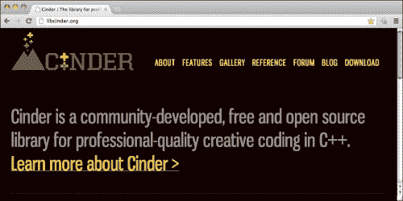
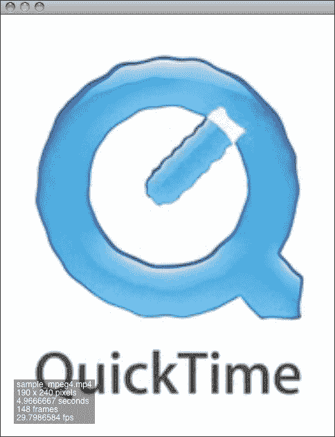
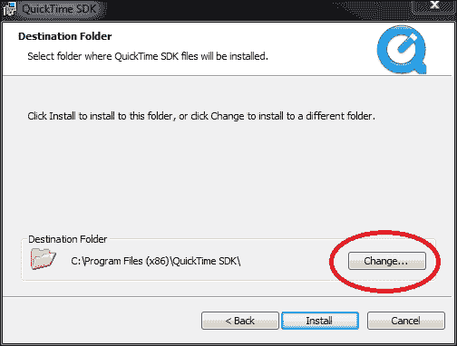
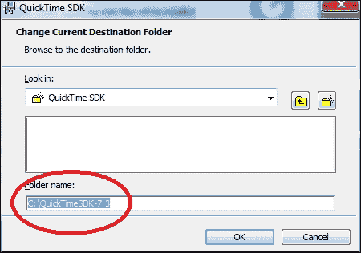
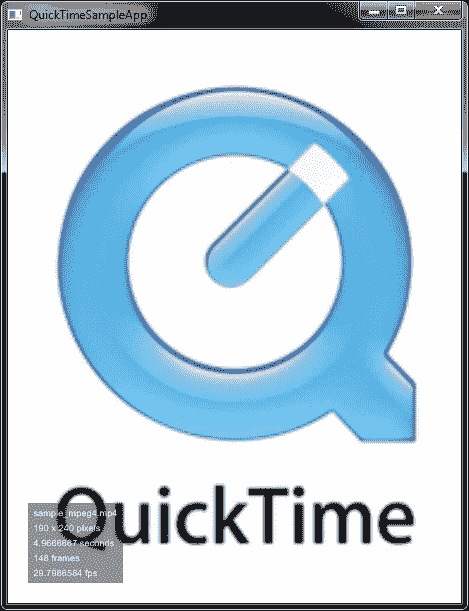

# 第一章. 现在开始学习 Cinder 基础

在本章中，我们将学习：

+   什么是创意编程

+   什么是 Cinder

+   如何在 Mac OS X 和 Windows 上设置

+   如何测试设置是否实际有效

# 什么是创意编程

这是对创意编程的简要介绍，我相信您可以在互联网上找到更多关于这个主题的信息。尽管如此，我将尝试从我的角度解释它是什么样子。

**创意编程**是一个相对较新的术语，用于描述一个结合编码和设计的领域。这个术语的核心可能是“编码”——要成为一名创意编码者，您需要知道如何编写代码以及一些关于编程的一般知识。另一个部分——“创意”——包含设计和所有可以与编码结合的其他事物。

同时精通编码和设计让您能够将您的想法解释为界面设计、艺术装置、手机应用和其他领域的可工作原型。它可以节省您在向他人解释您的想法以获得帮助时所花费的时间和精力。创意编程方法可能在大项目中效果不佳，除非涉及多个创意编码。

在过去几年中，出现了许多使编程更容易接触的新工具。它们都易于使用，但通常一个工具越简单，它的功能就越弱，反之亦然。

Cinder 是创意编程领域中最强大的工具之一。在本章中，我们将学习 Cinder 是什么以及如何在两个最流行的操作系统——Mac OS X 和 Windows 上设置它。如果您可以访问两者，并且希望尽可能快地完成，请选择 Mac OS X。如果您有一个好的互联网连接，在 Windows 上设置它不会花费太多时间。

# 关于 Cinder 的几句话

因此，我们来进行一些 Cinder 编程！Cinder 是您可以在互联网上免费获得的最多专业和强大的创意编程框架之一。如果您正在创建一些非常复杂的交互式实时音视频作品，它可以帮助您，因为它使用的是最流行和功能强大的底层编程语言之一——C++，并且依赖于最少的第三方代码库。Cinder 的创造者也试图使用所有最新的 C++ 语言特性，甚至包括那些尚未标准化（但很快将会）的特性，通过使用所谓的 Boost 库。

这本书不是关于 Cinder、C++ 编程语言或涉及的数学领域的 A 到 Z 指南。这是一本简短的介绍，面向那些已经使用过类似框架或工具并且已经了解一些编程的人。由于 Cinder 依赖于 C++，我们了解得越多越好。对 ActionScript、Java 或甚至 JavaScript 的了解将帮助您理解这里发生的事情。

# 下载 Cinder

好吧，少说多做！将您的浏览器指向 Cinder 网站 ([`libcinder.org`](http://libcinder.org))。

点击主菜单中的 **下载** 链接，并根据您选择的操作系统选择以下两个版本之一：

+   Cinder for Mac OS X (Mac OS X)

+   Cinder for Visual C++ 2010 (Windows)

### 注意

我们将在整本书中使用打包的 Cinder 版本 0.8.4，但会指出它和最新版本的 Cinder 0.8.5 之间的某些差异。

现在我们将 Cinder 设置分为两组：Mac OS X 和 Windows。这是因为配置过程，对于每个平台都有所不同。如果您使用 Mac OS X，您将更快地上手，但如果您似乎使用 Windows，这也不是什么过错——只需确保您有一个良好的互联网连接，您就可以开始了！

# 在 Mac OS X 上设置 Cinder

如果您之前做过一些编码，那么在 Mac OS X 上设置 Cinder 相对简单——这意味着，如果您已经安装了 Xcode。如果没有，您必须下载并安装它。为此，您可以从 [`developer.apple.com/programs/register/`](https://developer.apple.com/programs/register/) 获取 Apple 开发者账户。

一旦您有了 Apple 开发者 ID 和密码，请访问 [`developer.apple.com/xcode/`](https://developer.apple.com/xcode/) 的 Xcode 下载部分，或者打开 App Store 应用程序并在其中搜索 Xcode 应用程序。

安装 Xcode 的过程不是本书将要涵盖的主题，但它应该相当直观，因为苹果公司一直致力于使他们的应用程序尽可能用户友好。如果您在安装 Xcode 时遇到问题，请尝试 Google 或访问位于 [`developer.apple.com/support/xcode/`](https://developer.apple.com/support/xcode/) 的官方 Apple 开发者 Xcode 常见问题解答。

因此，现在您已经在您的计算机上安装了 Xcode！让我们继续，并将下载的 Cinder 包解压缩到安全的位置，例如，`/Users/Your_User-name/cinder`。在我的情况下，路径是 `/Users/kr15h/cinder`。

接下来，我们将通过打开一个示例应用程序来测试我们新创建的设置是否正常工作。我们将尝试 QuickTime 示例应用程序。为此，请在 `cinder/samples/QuickTime/xcode/` 目录（在 Cinder 0.8.5 中为 `cinder/samples/QuickTimeBasic/xcode/`）中打开文件 `quickTimeSample.xcodeproj`（在 Cinder 0.8.5 中为 `QuickTimeBasic.xcodeproj`）。在 Xcode 中，选择 **构建** | **构建并运行**（在 Xcode 4+ 中为 **产品** | **运行**）。您也可以通过按 *Cmd* + *R* 或在工具栏中点击 **构建并运行**（在 Xcode 4+ 中为 **运行**）按钮来实现相同的效果（您可以通过一个放置在灰度锤子或 Xcode 4+ 中的圆形灰色播放按钮上的圆形绿色播放按钮来识别它）。

应该会弹出一个 **打开文件** 对话框。从您的硬盘驱动器中选择一个电影文件！

如果你看到电影在窗口中播放，那就成功了！你已经准备好进入下一章。如果没有，请仔细遵循本节中提到的步骤——也许你没有注意到某些东西。

# 在 Windows 上设置 Cinder

在 Windows 上设置 Cinder 可能会比在 Mac OS X 上花费更长的时间。但这并不意味着它会运行得更慢。Windows PC 的好处在于，你通常可以更灵活地配置硬件。所以，如果你有强烈的意愿使用你选择的合适硬件来创建一些令人印象深刻的生成内容，那么选择 Windows，并配备一些四核 CPU、SSD 硬盘和适当的 GPU。这不会有害。

在 Windows 上配置 Cinder 花费更多时间的主要原因是你将需要下载更多内容。除了 Cinder 软件包外，你还需要下载和安装以下内容。

## Microsoft Visual C++ Express 2010

选择这个 IDE 的原因是所有官方 Cinder 示例应用程序项目都是为它创建的。在这里，我们将使用 Microsoft Visual C++，因为它是 Cinder 创建者选择的默认 Windows IDE。

要下载 Microsoft Visual C++，请将浏览器指向 [`www.microsoft.com/visualstudio/eng/downloads#d-2010-express`](http://www.microsoft.com/visualstudio/eng/downloads#d-2010-express)。

点击 **Visual C++ 2010 Express** 选项卡，选择要下载的语言，然后点击 **安装**。应该开始下载，下载完成后，打开 `*.exe` 文件。

我们不会涵盖整个安装过程，因为这不是本书的范围。只需为所有内容选择默认选项，就会一切顺利。让我们继续到我们还需要下一个组件。

## Windows 平台 SDK

我们需要这个 **软件开发工具包**（**SDK**）来与 Windows 系统进行通信。Cinder 框架会为我们完成这个任务，所以我们不会看到任何特定于 Windows 的内容——只有多平台 Cinder 特定的内容。不要害怕，从 [`bit.ly/IL35OV`](http://bit.ly/IL35OV) 下载 Windows 平台 SDK。

下载完成后，一定要运行它！再次选择默认选项，一切应该都会好。

## DirectX SDK

我们需要这个，因为 Cinder 音频核心依赖于它。所以，让我们从 [`bit.ly/OSe24s.`](http://bit.ly/OSe24s.) 获取它。

使用默认设置安装，然后就可以继续了。

## QuickTime SDK

如果你使用 Cinder 0.8.5，则不需要下载 QuickTime SDK。

你将需要获取一个 Apple 开发者账户来下载它。从 [`developer.apple.com/programs/register/`](https://developer.apple.com/programs/register/) 获取它。

然后转到 [`developer.apple.com/quicktime/`](https://developer.apple.com/quicktime/)。

安装时请小心。Cinder 预期 QuickTime SDK 与 Cinder 本身位于同一目录级别（并且目录名为 `QuickTimeSDK-7.3`）。因此，如果您将 Cinder 保存在 `C:\cinder`，则 QuickTime SDK 应位于 `C:\QuickTimeSDK-7.3`——在安装 SDK 时请更改此路径。

当您到达可以选择目标文件夹的安装点时，请点击 **更改** 按钮。

现在将 **目标文件夹** 路径更改为 `C:\QuickTimeSDK-7.3`。

如果您熟悉重新链接库，则无需担心此警告。

## 启动示例应用程序

在启动您的第一个示例应用程序之前，请确保您的系统上已安装 QuickTime Player。如果没有，请访问 [`www.apple.com/quicktime/download/`](http://www.apple.com/quicktime/download/)，下载并安装它。

前往 Cinder 示例目录，例如，`C:/cinder/samples/`，然后找到一个名为 QuickTime 的文件夹。打开 `C:/cinder/samples/QuickTime/vc10/quickTimeSample.sln`。

### 小贴士

**下载本书的彩色图像**

我们还为您提供了一个包含本书中使用的截图/图表彩色图像的 PDF 文件。这些彩色图像将帮助您更好地理解输出中的变化。

您可以从以下链接下载此文件：

[`www.packtpub.com/sites/default/files/downloads/9564OS_ColoredImages.pdf`](http://www.packtpub.com/sites/default/files/downloads/9564OS_ColoredImages.pdf)

欢迎使用 Microsoft Visual C++ 2010！按 *F5* 键构建项目并运行。您应该会收到一个提示，要求选择文件——从您的硬盘驱动器中选择一个与 QuickTime 兼容的电影文件，看看会发生什么。您应该看到电影正在播放，并且有一个半透明的矩形覆盖在电影文件上，显示不同的统计数据。

如果您看不到电影，请检查是否已安装 QuickTime Player。我第一次尝试这个示例应用程序时没有成功。我花了好几个小时试图弄清楚问题在哪里？什么都没有！您只是没有 QuickTime Player。从 [`www.apple.com/quicktime/download/`](http://www.apple.com/quicktime/download/) 下载它。

# 摘要

总结来说，这些是最简单、最快的方法来启动并运行 Cinder。当然，还有其他可能的方法，但它们超出了本书的范围。但如果您要查找 Cinder 的最新版本，请访问 Cinder 官方网站上的 *CINDER + GIT* 部分 ([`libcinder.org/docs/welcome/GitSetup.html`](http://libcinder.org/docs/welcome/GitSetup.html))。

在下一章中，我们将通过在 Cinder 示例包中启动不同的示例来尝试了解 Cinder 的可能性。
