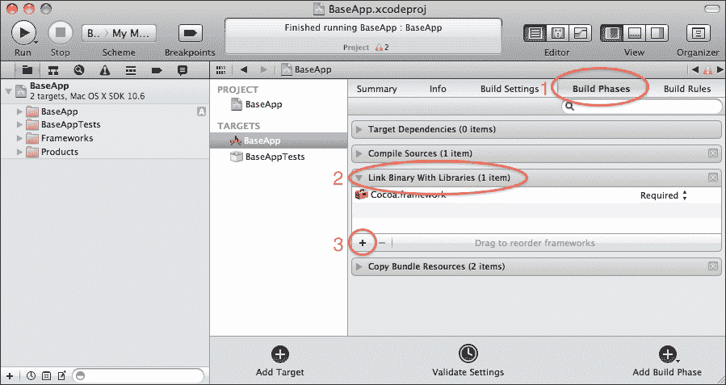

# 第三章。初始设置——创建 BaseApp

在本章中，我们将从头开始创建一个 Hello World 应用程序。该应用程序将被命名为 BaseApp，我们将在后续章节中使用其结构作为起点。

本章将涵盖以下内容：

+   使用 TinderBox 设置项目

+   在 Mac OS X（Xcode 3 和 4+）上从头开始设置项目

+   在 Windows 上从头开始设置项目

它与上一章的 BasicApp 没有多少共同之处，除了基本结构，这将是所有 Cinder 项目的共同点。

# TinderBox

创建 Cinder 项目的最简单方法是使用其集成工具 **TinderBox**。你可以在 `cinder/tools/` 目录中找到它。这将与 Mac OS X 和 Windows 一起工作。

让我们试一试。打开 TinderBox 应用程序。如果你是第一次做，你将需要指向你的 Cinder 目录。


完成这些后，TinderBox 项目设置窗口将出现。从 **Target** 列表中选择 **Basic App**，从 **Template** 下拉列表中选择 **OpenGL**。在 **Project Name** 字段中输入 `BaseApp`。确保你在 **Naming Prefix** 字段中有 **Base**。

### 注意

对于使用 Cinder 0.8.5 的人来说，在新的 TinderBox 中没有 **Target** 列表。你必须选择 **Basic OpenGL** 模板。此外，在新的 TinderBox 中没有 **Naming Prefix** 字段，所以请忽略它。

在 **Location** 字段中选择一个目录，用于存储你的 Cinder 项目。我的目录是 `/Users/kr15h/Documents/CinderProjects/`（在 Windows 上为 `C:\Users\kr15h\Documents\CinderProjects\`）。

在 **Cinder Version** 字段中保留 **HEAD**，并在 **Compilers** 部分选择 **Xcode**。如果你使用 Windows 或计划在两个操作系统上开发，请选择 **Visual C++ 2010**。

点击 **Create**！

你的项目已经准备好了！导航到你在 **Location** 字段中指定的 Cinder 项目文件夹，你将找到一个名为 `BaseApp` 的文件夹。你将在 `xcode` 目录中找到一个 Xcode 项目文件（在 Windows 的 `vc10` 目录中为 Visual C++ 2010 项目文件）。

打开 `BaseApp.xcodeproj`（在 Windows 上为 `BaseApp.sln`）。

尝试构建并运行它。你应该看到以下截图所示的结果：


窗口中还没有绘制出任何有趣的内容。我们稍后会做一些更改，但如果你能够编译、运行并看到这个，你就是大师了！

# 在 Mac OS X 上从头创建项目

我们中的一些人只想用困难的方式来做，实际上并不难，但涉及一些必须记住和理解的操作步骤。如果没有 TinderBox 会怎样？没问题！

在这里我们将再次分成两组——这次是根据我们使用的 Xcode 版本来分。有旧的方式（Xcode 3）和新方式（Xcode 4+）。你可以通过打开 Xcode 并从 **Xcode** 菜单中选择 **AboutXcode** 来检查版本。

### 注意

如果你正在使用 Cinder 0.8.5，请注意最低要求的 Mac OS X 版本是 10.7，并且你需要 Xcode 4.4+。

## 基本项目设置（Xcode 3）

前往你的 Cinder 项目目录，在我的例子中是`/Users/kr15h/Documents/CinderProjects/`。为我们的新项目创建一个空目录并命名为`BaseApp`。在其内部创建另一个目录并命名为`src`。它应该看起来像以下截图所示：


打开 Xcode 并从**文件**菜单中选择**新建项目**。选择**Mac OS X 应用程序**类别并选择**Cocoa 应用程序**。点击**选择**，浏览到我们之前创建的目录（`CinderProjects/BaseApp`），然后点击**保存**。

现在建议关闭 Xcode，浏览到你的新创建的项目目录，并将 Xcode 项目文件夹（BaseApp 中的 BaseApp——即`.xcodeproj`文件的父文件夹）重命名为`xcode`。


现在打开`BaseApp.xcodeproj`文件。我们必须删除我们不需要的一些文件。这些文件包括`main.m`、`InfoPlist.strings`、`MainMenu.xib`以及`BaseAppAppDelegate.m`和`BaseAppAppDelegate.h`。当被提示时，点击**也移动到废纸篓**。

让我们创建我们的第一个源文件。在**Xcode 项目导航器**面板中右键点击**Classes**文件夹，然后选择**添加** | **新建文件**。从**C 和 C++**类别中选择**C++文件**。将其命名为`BaseApp`并取消选择**也创建"BaseApp.h"**选项。对于位置，选择我们之前创建的`BaseApp/src`文件夹，然后点击**完成**。

## 基本项目设置（Xcode 4+）

打开 Xcode 并从**文件**菜单中选择**新建** | **新建项目**。在**Mac OS X**类别下选择**应用程序**项并选择**Cocoa 应用程序**。点击**下一步**。将**产品名称**输入为`BaseApp`，例如，将**公司标识符**输入为`com.mycompany`。再次点击**下一步**，你将被提示选择项目位置。浏览到我们之前创建的目录（`CinderProjects/BaseApp`）并点击**创建**。

关闭 Xcode（通过按*Cmd* + *Q*完全关闭）并导航到 BaseApp 项目目录。你可以看到那里有两个文件夹，`BaseApp`和`src`。将`BaseApp`重命名为`xcode`——所有与 Xcode 相关的文件都将存储在那里，而所有存储在`src`目录中的代码都打算在其他任何 IDE 中使用。这不是法律，这只是 Cinder 示例项目的组织方式，这也是保持跨平台代码项目良好组织的好方法。这样做是为了避免为每个平台和 IDE 创建源文件的单独版本。

打开 `BaseApp.xcodeproj` Xcode 项目文件。我们将移除一些我们不需要的文件。在项目导航器中，在 **BaseApp** 文件夹下，选择并删除 `AppDelegate.h`、`AppDelegate.m` 和 `MainMenu.xib`。当提示删除实际文件时，点击 **删除**，而不是仅仅删除引用。在 **支持文件** 文件夹下，选择并删除 `main.m` 和 `BaseApp-Prefix.pch`。当提示时，再次点击 **删除**。

让我们创建我们的第一个 C++ 源文件。在项目导航器中的 **BaseApp** 文件夹上右键单击，并选择 **新建文件** 选项。在 **Mac OS X** 和 **C 和 C++** 类别下选择 **C++ 文件**。将出现一个 **另存为** 对话框。导航到我们 `BaseApp` 项目的 `src` 目录 (`BaseApp/src`)。将文件命名为 `BaseApp` 并点击 **创建**。

## 添加代码 (Xcode 3 和 4+)

在编辑器中打开我们刚刚创建的文件 (`BaseApp.cpp`) 并输入以下代码：

```cs
#include "cinder/app/AppBasic.h"
#include "cinder/gl/gl.h"

using namespace ci;
using namespace ci::app;
using namespace std;

class BaseApp : public AppBasic {
public:
  void setup();
  void update();
  void draw();
};

void BaseApp::setup(){}
void BaseApp::update(){}

void BaseApp::draw()
{
  // clear out the window with black
  gl::clear( Color( 0, 0, 0 ) );
}

CINDER_APP_BASIC( BaseApp, RendererGl )
```

如果您尝试编译和运行应用程序，您将看到这是不可能的。还有一些东西仍然缺失，那就是与 Cinder 库和头文件的连接。

## 连接到 Cinder (Xcode 3)

在 **项目** 菜单下，选择 **编辑项目设置**。转到 **构建** 选项卡，在 **配置** 选择字段中，选择 **所有配置**。让我们添加一个用户定义的构建设置，这将很快证明其有用。这个用户定义的设置将存储 Cinder 目录相对于我们项目的位置。点击 **项目设置** 窗口左下角的齿轮按钮，并选择 **添加用户定义设置**。


将其命名为 `CINDER_PATH` 并将其值设置为 Cinder 目录的位置 /`Users/You/cinder`（将 `You` 替换为您的用户名）。

现在我们必须利用这个新创建的变量。滚动到 **搜索路径** 部分，并修改 **用户头文件搜索路径** 设置。将值设置为 `$(CINDER_PATH)/include`。完成此操作后，转到 **头文件搜索路径**（注意其前面没有用户），并将其设置为 `$(CINDER_PATH)/boost`。

然后转到 **架构** 部分，将 **架构** 变量设置为 `i386`。

接下来，我们必须告诉 Xcode Cinder 库的位置以便链接。找到 **链接** 部分，并将 **其他链接器标志** 下的 **调试** 字段更改为 `$(CINDER_PATH)/lib/libcinder_d.a`，并将 **发布** 字段更改为 `$(CINDER_PATH)/lib/libcinder.a`。

现在是最后一件事。我们需要添加 Mac OS X 框架，这些框架对于我们的 Cinder 应用程序是必需的。关闭 **项目设置** 面板，在 Xcode 项目导航器中的 **框架** 文件夹上右键单击，选择 **添加** | **现有框架**。然后，选择以下内容：

+   `Accelerate.framework`

+   `AudioToolbox.framework`

+   `AudioUnit.framework`

+   `CoreAudio.framework`

+   `CoreVideo.framework`

+   `OpenGL.framework`

+   `QTKit.framework`

+   `QuickTime.framework`

编译并运行项目。成功！现在，你可以前往本章的*最终调整*部分。

## 连接到 Cinder（Xcode 4+）

按照以下步骤创建一个带有我们主 Cinder 位置路径的用户定义变量：

1.  在 Xcode 项目导航器面板中选择**BaseApp**项目图标。

1.  在**目标**类别下选择**BaseApp**目标。

1.  确保我们对所有配置都进行了更改（选择**所有**和**组合**）。

1.  点击**添加构建设置**按钮，然后从菜单中选择**添加用户定义设置**。

1.  呼叫它`CINDER_PATH`，并输入你复制 Cinder 文件的位置的路径。

现在我们必须使用这个新创建的变量。滚动到**搜索路径**部分，并修改**用户头文件搜索路径**设置。将值设置为`$(CINDER_PATH)/include`。完成此操作后，转到**头文件搜索路径**（注意其前面没有用户），并将其设置为`$(CINDER_PATH)/boost`。

然后转到**架构**部分，并将**架构**变量设置为`i386`。

接下来，我们必须告诉 Xcode 在哪里可以找到用于链接的 Cinder 库。找到**链接**部分，并将**其他链接器标志**下的**调试**字段更改为`$(CINDER_PATH)/lib/libcinder_d.a`，将**发布**字段更改为`$(CINDER_PATH)/lib/libcinder.a`。

Xcode 还为我们自动添加了另一件事，一个链接到我们之前删除的前缀头文件。这将在编译时引发错误，因为编译器将无法找到前缀头文件。转到**Apple LLVM 编译器 3.0 – 语言**选项卡，并为**调试**和**发布**清除**前缀头**字段。

最后，我们必须将我们的应用程序链接到 Mac OS X 框架库。为此，请按照以下步骤操作：

1.  转到**构建阶段**选项卡。

1.  展开**链接二进制与库**部分。

1.  点击**添加项目**按钮以选择框架。

选择以下框架，然后点击**添加**：

+   `Accelerate.framework`

+   `AudioToolbox.framework`

+   `AudioUnit.framework`

+   `CoreAudio.framework`

+   `CoreVideo.framework`

+   `OpenGL.framework`

+   `QTKit.framework`

+   `QuickTime.framework`

就这样！编译并运行项目。成功！现在，你可以前往本章的**最终调整**部分。

# 从头创建项目（Windows）

所以你是在 Windows 系统上，对吧？让我们在 Visual C++中创建一个空项目。我们将将其链接到所有必要的库，并确保在继续之前可以编译该项目。

前往你的 Cinder 项目目录（在我的情况下是`C:\Users\kr15h\Documents\CinderProjects\`），并在其中创建一个新的目录`BaseApp`。

打开 Microsoft Visual C++ 2010，前往**文件** | **新建** | **项目**。从**Win32**类别中选择**Win32 项目**。在**名称**字段中输入`BaseApp`，在**位置**字段中输入我们刚刚创建的 BaseApp 项目目录。确保**创建解决方案目录**复选框未选中，并且解决方案名称为`BaseApp`——与项目名称相同。

在**应用程序设置**对话框中，选中**空项目**复选框，并确保您选择**Windows 应用程序**作为**应用程序**类型。点击**完成**。

关闭 Visual C++并转到`BaseApp`项目目录。您将看到一个名为`BaseApp`的文件夹——将其重命名为`vc10`。

在与`vc10`文件夹同一级别的目录中创建一个新的目录，并将其重命名为`src`。在`vc10`文件夹中打开`BaseApp.sln`文件。创建一个新的 C++文件。选择**文件** | **新建文件**。在对话框中，选择**Visual C++**模板类别，并选择**C++文件**。点击**打开**。编辑器中将打开一个空白文件。在那里输入以下代码片段：

```cs
#include "cinder/app/AppBasic.h"
#include "cinder/gl/gl.h"

using namespace ci;
using namespace ci::app;
using namespace std;

class BaseApp : public AppBasic {
public:
  void setup();
  void update();
  void draw();
};

void BaseApp::setup(){}
void BaseApp::update(){}

void BaseApp::draw()
{
  // clear out the window with black
 gl::clear( Color( 0, 0, 0 ) );
}

CINDER_APP_BASIC( BaseApp, RendererGl )
```

前往**文件** | **另存为**，导航到`BaseApp\src`目录，并将文件命名为`BaseApp.cpp`。为了保持整洁，导航到资源管理器中的**BaseApp**文件夹，并将其拖放到 Visual C++ 2010 解决方案资源管理器中的**源文件**目录。

您现在还不能编译和运行它。还有一些其他事情要做。

前往**项目** | **BaseApp 属性**。在**配置**选择字段中选择**所有配置**。

在左侧列中点击**C/C++**类别，然后在右侧列中找到**附加包含目录**字段。将以下路径添加到那里：

+   `C:\cinder\include`

+   `C:\cinder\boost`

在左侧列中点击**链接器**，并编辑**附加库目录**字段的值。您必须输入以下两个路径：

+   `C:\cinder\lib`

+   `C:\cinder\lib\msw`

点击**确定**。现在选择**调试**配置，并在**项目属性**窗口的左侧列中点击**链接器**下的**输入**。将`cinder_d.lib`添加到**附加依赖项**字段，并将`LIBCMT`添加到**忽略特定默认库**字段。

完成这些操作后，选择**发布**配置，并将`cinder.lib`添加到**附加依赖项**字段。

点击**确定**。构建并运行应用程序。一个黑色背景的窗口应该会出现。如果是这样，你就是大师，我们可以继续下一部分。

# 最终调整

无论您选择哪种设置，您都必须编辑一个位于项目目录相同位置且在所有配置中名称相同的单个文件，即`src/BaseApp.cpp`。打开它。我们将尝试理解不同代码行的含义。

```cs
#include "cinder/app/AppBasic.h"
#include "cinder/gl/gl.h"
```

这些是初始的 `include` 语句，负责在我们开始编写实际的 Cinder 代码之前包含所有必要的 Cinder 内容。

```cs
using namespace ci;
using namespace ci::app;
using namespace std;
```

在这里，我们告诉编译器我们将要使用一些命名空间。我们这样做是为了避免在我们的代码中在定义在这些命名空间中的变量和方法之前写上命名空间名称。因此，这些行只是为了让我们的代码更易于阅读，让我们的创意生活更轻松。我们在这里没有添加 `gl` 命名空间，因为我们希望将 OpenGL 绘图代码与文件中的所有其他代码区分开来。

```cs
class BaseApp : public AppBasic {
```

这是我们的基础应用程序类的定义。它扩展了 Cinder AppBasic——这是一个包含所有我们需要自己编写的必要功能的高级类。

```cs
  void setup();
  void update();
  void draw();
```

这些是我们将在该类中重写的函数。这些函数可以被认为是 Cinder 中最重要的，因为在这里你可以定义程序主运行循环中将要执行的操作。

`setup()` 用于设置你的程序，并且它只在程序开始时执行一次。

`update()` 在 `draw()` 函数（默认 Cinder 帧率为 30 fps）之前为每一帧调用，并且你应该在这里放置所有的计算、数据检索和分析代码。

`draw()` 用于在屏幕上绘制东西。由于 `update()` 负责所有计算，你可以在这里使用结果来在屏幕上绘制东西。可以是 2D 或 3D 文本、2D 或 3D 形状——电影文件中的某个点。选择你想要的，但尽量只使用这个方法进行绘图。

然后是方法的实现（在以 `BaseApp : public AppBasic {` 开始的类声明之后和以关闭括号 `}` 结束的类声明之间）以及负责启动你的程序的一行代码如下：

```cs
CINDER_APP_BASIC( BaseApp, RendererGl )
```

这告诉 Cinder 使用 `RendererGl` 来运行你的程序（`BaseApp`）。`RendererGl` 是 Cinder 中可用的渲染器之一。它使用 OpenGL 进行渲染，这让你可以使用 `gl::` 命名空间中定义的类和函数，以及纯 OpenGL 函数。

Cinder 中还有一些其他可用的渲染器，例如 `Renderer2d`，它可以与 Cairo 向量图形 Cinder 命名空间结合使用。它使用 `Cairo::createWindowSurface()` 函数进行绘图，可能不如使用 OpenGL 那样快。

好的，现在我们准备给我们的程序添加一些视觉反馈。我们在 `draw()` 方法的实现中这样做。

让我们画一些线条。按照以下方式编辑 `draw()` 方法的实现：

```cs
void BaseApp::draw()
{
  // clear out the window with black
  gl::clear( Color( 0.0f, 0.0f, 0.0f ) );
```

在我们开始编写实际的绘图代码之前，让我向你解释一下 Cinder 和 OpenGL 坐标空间之间的区别。

在 Cinder（以及许多其他创意编码框架和 2D 图形软件中），我们利用了所谓的二维笛卡尔坐标系中的第四象限。这意味着点（0，0）位于屏幕的左上角。你可能还记得在学校数学课上学到的这一点——从（0，0）点左侧，x 值变为负，右侧变为正。从（0，0）点向下，y 值变为负，向上变为正。

与 OpenGL 不同。所有四个象限都被使用，点（0，0）位于屏幕中心。你可能还记得这一点是从学校的数学课上学到的——从（0，0）点左侧，x 值变为负，右侧变为正。从（0，0）点向下，y 值变为负，向上变为正。


Cinder 的`gl`命名空间方法为我们完成了从“左上角居中”坐标系到“实际居中”坐标系的转换。所以让我们来画一下：

```cs
  // draw a x over the whole window area
  gl::drawLine( Vec2f(0.0f, 0.0f),
    Vec2f(getWindowWidth(), getWindowHeight()) );
  gl::drawLine( Vec2f(0.0f, getWindowHeight()),
    Vec2f(getWindowWidth(), 0.0f) );
}
```

编译并运行项目。你应该会看到以下输出：


就这样！我们已经为我们的未来应用程序创建了一个很好的基础！在接下来的章节中，我们将重用它的结构。

# 摘要

在本章中，我们学习了如何创建一个基础应用程序。我们使用了两种不同的方法——一种简单的方法（通过使用 TinderBox）和一种困难的方法（从头创建项目）。前者让你可以快速完成，但后者让你对事物的工作原理有更深入的了解。
