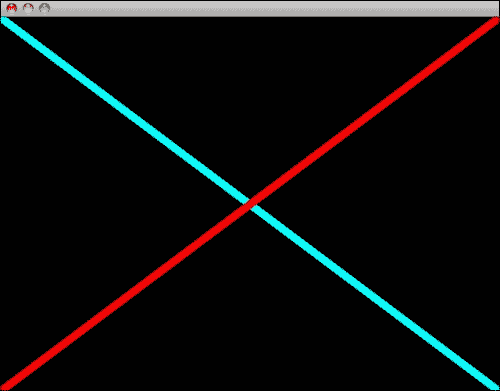
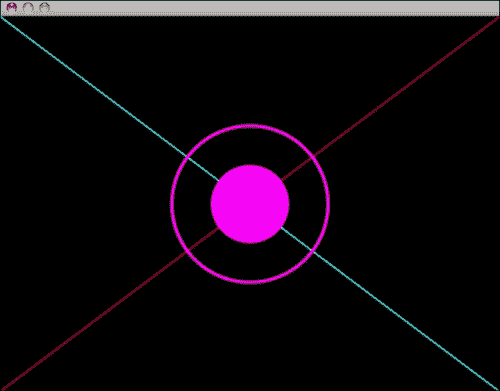
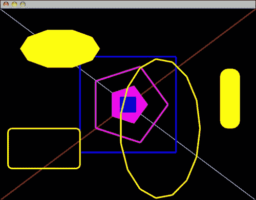

# 第四章：准备你的画笔 - 绘制基本形状

在本章中，我们将学习如何使用 Cinder 绘制不同的基本形状。这些形状是基本的，但通过组合这些形状，你可以创建相当复杂的图像。我们将逐一介绍可用的绘图方法，并尝试使用它们。

# 准备你的工作空间

打开 TinderBox (`yourCinderPath/tools/TinderBox`) 并创建一个名为 `BasicShapes` 的新项目。这次将 `BasicShapes` 作为 **命名前缀** 输入。在安全的地方创建它，并打开 `xcode/BasicShapes.xcodeproj`。Windows 用户应从 `vc10\BasicShapes.sln` 打开项目文件。在编辑器中打开 `BasicShapesApp.cpp` 并导航到类似于以下代码片段的位置：

```cs
void BasicShapesApp::draw()
{
  // clear out the window with black
  gl::clear( Color( 0, 0, 0 ) );
}
```

这是应用程序主要绘图方法的实现。这里只执行了一行代码（`gl::clear( Color( 0, 0, 0 ) );`），正如它前面的注释所说，它使用黑色清除颜色缓冲区，这本质上意味着在之前的 `draw()` 循环中绘制的一切都被黑色替换。

`draw()` 方法每帧执行一次。Cinder 的默认帧率为每秒 30 帧。因此，背景每秒清除 30 次。

让我们尝试改变背景的颜色！正如你所见，你必须向 `gl::clear()` 函数传递一个 `Color` 参数。在这种情况下，`Color` 对象由三个参数组成，这些参数定义了 RGB 颜色系统中的颜色。在 `Color( 0, 0, 0 )` 参数中，括号内有三个零。第一个定义了红色量，第二个是绿色，第三个是蓝色。假设我们想让背景是红色，那么我们必须将颜色的第一个参数传递为 `1`。它应该看起来类似于以下内容：

```cs
gl::clear( Color( 1, 0, 0 ) );
```

编译并运行项目以查看我们是否成功。你应该会看到一个背景为鲜红色的窗口。在 Cinder 中，颜色被定义为从 0 到 1 的数字。所以如果你不想背景这么亮，试试这个：

```cs
gl::clear( Color( 0.5f, 0, 0 ) );
```

再次编译并运行项目。现在你应该看到一个亮度较低的鲜红色背景。太好了！现在让我们将背景颜色改为黄色。为此，我们需要更改两个 `Color` 参数，因为在 RGB 颜色系统中没有单独的黄色量参数。当我们看色轮时，我们可以看到黄色位于红色和绿色之间。当我们仔细检查这两种颜色之间的空间时，你会看到，红色变成橙色，橙色变成黄色，黄色变成绿色。

因此，我们必须以相同的比例混合这两种颜色以得到黄色。在代码中，它看起来类似于以下内容：

```cs
gl::clear( Color( 1, 1, 0 ) );
```

编译并运行项目。做得好！你现在将看到一个漂亮、明亮的黄色背景。让我们对其进行最后一次调整，将其改为白色。要做到这一点，我们必须将所有 RGB 组件设置为最大值。正如我们从物理学世界中知道的那样，白色颜色由所有可见光波长组成，当我们通过玻璃棱镜射出白光束时，我们得到彩虹——完整的可见光光谱。当我们以相同的数量将光谱中的所有颜色组合在一起时，我们得到白色：

```cs
gl::clear( Color( 1, 1, 1 ) );
```

现在，我们有一个漂亮的白色背景。让我们在上面画些东西！

# 绘制线条

让我们把背景再次改为黑色，并添加以下代码行：

```cs
// draw a line
gl::drawLine( Vec2f(0,0), Vec2f(100,100) );
```

编译并运行项目以查看发生了什么。你应该在屏幕上看到一条相对较短的白色线条。这正是函数`gl::drawLine()`刚刚执行的操作。正如我们所见，必须向其传递两个参数。第一个参数代表线的起始坐标，第二个参数定义了线的结束坐标。这两个点被定义为`Vec2f`对象。从这些对象的名字中我们可以看出，它们是存储两个浮点值的向量。这些向量可以在二维空间中使用。`Vec2f(0,0)`代表位于屏幕左上角的两维空间中的点。让我们在整个窗口上画两条对角线。将以下代码替换为`gl::drawLine( Vec2f(0,0), Vec2f(100,100) );`:

```cs
gl::drawLine( Vec2f(0,0),
Vec2f(getWindowWidth(),getWindowHeight()) );
gl::drawLine( Vec2f(0,getWindowHeight()),
Vec2f(getWindowWidth(),0) );
```

如您所见，我们在这里使用了两种新的方法，`getWindowWidth()`和`getWindowHeight()`，它们旨在确定应用程序运行时的窗口大小。这是一种非常方便的绘制图形的方法，可以独立于窗口大小。我们不必每次决定更改我们的应用程序窗口大小时手动更改参数。我们只需将`getWindowWidth()`和`getWindowHeight()`方法放在参数的位置，图形将在应用程序窗口被调整大小时自动调整。

编译并运行应用程序，并尝试通过拖动其右下角来改变窗口的大小——线条应该调整到新的窗口大小。

做这件事很好，但如果我们需要线条不是白色，而是青色呢？没问题！在`drawLine()`调用之前添加以下代码行：

```cs
gl::color( 0, 1, 1 );
```

### 小贴士

**下载示例代码**

您可以从您在[`www.packtpub.com`](http://www.packtpub.com)的账户中下载您购买的所有 Packt 书籍的示例代码文件。如果您在其他地方购买了这本书，您可以访问[`www.packtpub.com/`](http://www.packtpub.com/)支持并注册，以便将文件直接通过电子邮件发送给您。

这并不难。我们只需要记住在调用一个应该绘制东西的函数之前改变颜色（如果我们想的话）。所以如果我们想用红色画一条线，用青色画另一条线，我们就这样做：

```cs
gl::color( 0, 1, 1 ); // set color to cyan
gl::drawLine( Vec2f(0,0),
Vec2f(getWindowWidth(),getWindowHeight()) );
gl::color( 1, 0, 0 ); // set color to red
gl::drawLine( Vec2f(0,getWindowHeight()),
Vec2f(getWindowWidth(),0) );
```

所以现在我们知道了如何改变线条的颜色。那么改变粗细呢？没问题！在绘制线条的调用之前放置以下代码行：

```cs
glLineWidth( 10.0f );
```

因此现在我们的线条正在以 `10` 像素的粗细绘制。编译并运行项目以查看效果。现在你应该看到如下截图所示的线条：



以下是完全的绘制方法，如果你之前没有理解某些内容（我在以下代码中将线宽更改为 `2`）：

```cs
void BasicShapesApp::draw(){
  // clear out the window with black
  gl::clear( Color( 0, 0, 0 ) );

  // draw some lines
  glLineWidth( 2 ); // set line width to 2
  gl::color( 0, 1, 1 ); // set color to cyan
  gl::drawLine( Vec2f(0,0),
      Vec2f(getWindowWidth(),getWindowHeight()) );
  gl::color( 1, 0, 0 ); // set color to red
  gl::drawLine( Vec2f(0,getWindowHeight()),
      Vec2f(getWindowWidth(),0) );
}
```

# 绘制圆圈

那么，在作品中添加一些圆怎么样？在最后一个 `drawLine` 调用之后添加以下行：

```cs
gl::drawSolidCircle( Vec2f(getWindowWidth()/2,
  getWindowHeight()/2), 50 );
```

在编译并运行应用程序后，你应该在屏幕中间看到一个圆圈。`drawSolidCircle()` 函数接受两个参数。第一个是圆心的位置。第二个是圆的半径。我们再次使用 `Vec2f` 对象来定义位置。正如你所见，我们再次使用了 `getWindowWidth()` 和 `getWindowHeight()`。这次我们需要它们来获取屏幕的中心坐标。我们通过将窗口的宽度和高度除以 `2` 来得到它。再次，通过使用这些方法，我们确保无论窗口的大小如何，我们的圆都会在屏幕中间绘制。

虽然有一种更简单的方法来做这件事，那就是使用 `getWindowCenter()` 方法。如果我们使用它，我们会得到相同的结果，但代码看起来更清晰一些：

```cs
gl::drawSolidCircle( getWindowCenter(), 50 );
```

让我们改变圆的颜色。你可以选择你自己的颜色，但这次我将使用洋红色。在 `drawSolidCircle()` 函数调用之前添加以下代码行：

```cs
gl::color( 1, 0, 1 ); // set color to magenta
```

尝试实验圆的位置、半径和颜色。尝试绘制多个形状，并尝试给它们不同的颜色。

如果我们只想绘制圆的轮廓呢？Cinder 有一个专门用于此的函数，称为 `drawStrokedCircle()`。在 `drawSolidCircle()` 函数之后添加另一行代码，如下所示：

```cs
gl::drawStrokedCircle( getWindowCenter(), 100 );
```

与 `drawSolidCircle()` 函数类似，`drawStrokedCircle()` 也接受两个参数——位置和半径。区别仅在于它只绘制轮廓。轮廓的粗细与我们之前通过 `glLineWidth()` 函数定义的相同。让我们通过在 `drawStrokedCircle()` 行之前添加以下代码行来将其更改为其他颜色：

```cs
glLineWidth( 4 );
```

编译并运行项目，看看会发生什么。你应该看到如下截图所示的屏幕：



对于 `drawSolidCircle()` 和 `drawStrokedCircle()` 函数，有一个隐藏的第三个参数。由于圆是通过三角形绘制的，每次绘制圆时，都必须决定使用多少个三角形。Cinder 会自动完成这项工作，但我们也可以自己定义三角形数量。所以让我们改变三角形段的数量：

```cs
gl::color( 1, 0, 1 ); // set color to magenta
gl::drawSolidCircle( getWindowCenter(), 50, 5 );
glLineWidth( 4 );
gl::drawStrokedCircle( getWindowCenter(), 100, 5 );
```

注意代码中高亮的部分。我们告诉圆形绘制函数只使用五个三角形来绘制圆形。通过这样做，我们得到了五边形而不是圆形。编译并运行项目，亲自看看吧！

尝试调整所有属性以充分利用它。你可以使用这个函数绘制几乎任何类型的规则多边形形状。

# 绘制矩形

现在我们知道了如何绘制线条和圆形，让我们转向另一个我们可以使用的几何原始形状——矩形。

就像圆形的情况一样，有一个函数用于绘制填充矩形，还有一个函数用于仅绘制轮廓。它们分别是 `drawSolidRect()` 和 `drawStrokedRect()`。

```cs
gl::color( 0, 0, 1 ); // set color to blue
gl::drawSolidRect( Rectf( getWindowWidth()/2-20.0f,
  getWindowHeight()/2-20.0f,
  getWindowWidth()/2+20.0f,
  getWindowHeight()/2+20.0f ) );
gl::drawStrokedRect( Rectf( getWindowWidth()/2-120.0f,
  getWindowHeight()/2-120.0f,
  getWindowWidth()/2+120.0f,
  getWindowHeight()/2+120.0f ) );
```

在这里，我们绘制了两个矩形，一个填充（或实心）和一个轮廓。请注意，我们向两个函数传递了类型为 `Rectf` 的单个参数。`Rectf` 的最简单版本是通过使用矩形的左上角和右下角的坐标来构建的。大多数绘图 API 使用左上角的 x 和 y 坐标以及矩形的宽度和高度，所以这可能有点难以适应。

# 其他有用的绘图函数

这些是非常基本的绘图函数，实际上如果你以创造性的方式使用它们，你可以做很多事情。但这里还有一些其他值得检查的函数。它们在以下代码片段中给出：

```cs
gl::color( 1, 1, 0 );
gl::drawSolidEllipse( Vec2f(150,100), 100, 50, 10);
gl::drawStrokedEllipse( Vec2f(400,300), 100, 175, 15);
gl::drawSolidRoundedRect(
Rectf(550,150,600,300), 20, 4 );
gl::drawStrokedRoundedRect(
Rectf(20,300,200,400), 10, 10 );
```

尝试通过调整这些函数的属性来完全理解它们的含义。编译并运行项目，你应该会看到一个类似于以下截图的图像：



尝试通过拖动右下角来调整窗口的大小。你会看到相对于窗口大小绘制的图形和不是相对于窗口大小绘制的图形之间的区别。在创建自己的应用程序时，请记住这一点。

以下是为绘制所有形状的完整代码，以防你不知道哪一行代码对应哪个位置：

```cs
void BasicShapesApp::draw(){
  // clear out the window with black
  gl::clear( Color( 0, 0, 0 ) );

  // draw some lines
  glLineWidth( 2 ); // set line width to 2
  gl::color( 0, 1, 1 ); // set color to cyan
  gl::drawLine( Vec2f(0,0),
        Vec2f(getWindowWidth(),getWindowHeight()) );
  gl::color( 1, 0, 0 ); // set color to red
  gl::drawLine( Vec2f(0,getWindowHeight()),
        Vec2f(getWindowWidth(),0) );

  // draw some circles
    gl::color( 1, 0, 1 ); // set color to magenta
    gl::drawSolidCircle( getWindowCenter(), 50, 5 );
    glLineWidth( 4 );
    gl::drawStrokedCircle( getWindowCenter(), 100, 5 );

  // draw rectangles
    gl::color( 0, 0, 1 ); // set color to blue
    gl::drawSolidRect( Rectf( getWindowWidth()/2-20.0f,
         getWindowHeight()/2-20.0f,
         getWindowWidth()/2+20.0f,
         getWindowHeight()/2+20.0f ) );
    gl::drawStrokedRect( Rectf( getWindowWidth()/2-120.0f,
         getWindowHeight()/2-120.0f,
         getWindowWidth()/2+120.0f,
         getWindowHeight()/2+120.0f ) );

  // draw rest
    gl::color( 1, 1, 0 );
    gl::drawSolidEllipse( Vec2f(150,100), 100, 50, 10);
    gl::drawStrokedEllipse( Vec2f(400,300), 100, 175, 15);
    gl::drawSolidRoundedRect(
         Rectf(550,150,600,300), 20, 4 );
    gl::drawStrokedRoundedRect(
         Rectf(20,300,200,400), 10, 10 );
}
```

就这些！这是用 Cinder 绘制基本形状最简单的方法之一。

# 概述

在本章中，我们介绍了 Cinder 中最关键的绘图函数。你可以用这些函数绘制很多东西。然而，它们在可以完成的事情方面有一些限制。如果你需要绘制一些非常复杂的东西，并且它必须表现良好或非常好，考虑获取一些 OpenGL 知识。

你可以在 [`libcinder.org/docs/v0.8.4/namespacecinder_1_1gl.html`](http://libcinder.org/docs/v0.8.4/namespacecinder_1_1gl.html) 找到 Cinder 当前可用的完整绘图函数列表。在网页上，滚动到函数部分，查看以 "draw" 开头的函数。

我们将在下一章中使用这个列表中的某些函数，所以这并不是我们使用绘制的唯一地方。
