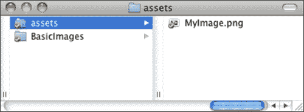

# 第五章：利用图片 – 加载和显示

在本章中，我们将学习以下内容：

+   如何加载图片

+   如何在屏幕上显示它

+   关于 Cinder 中的通用资产处理

你可以在你的应用程序中使用照片、插图或不同的图像数据库。为此，你需要一种将图片加载到你的应用程序中的方法，最重要的是，在屏幕上显示它。

在本章中，我们将学习 Cinder 文件加载功能的基础，并学习从网络和本地存储加载图片。

# 加载图片

打开 TinderBox 并创建一个名为 `BasicImages` 的新项目。打开 `xcode/BasicImages.xcodeproj` 项目文件。Windows 用户应打开项目文件 `vc10\BasicImages.sln`。在编辑器中打开 `BasicImagesApp.cpp` 文件。

首先，我们将包含一些头文件，这些头文件声明了执行我们想要完成的事情所需的功能。

导航到代码中包含 `#include` 语句的位置，并在 `#include "cinder/gl/gl.h"` 之后添加以下代码行：

```cs
#include "cinder/ImageIo.h"
#include "cinder/gl/Texture.h"
```

第一个包含语句加载了负责 Cinder 图像输入/输出功能的代码头文件，第二个代码头文件包含语句允许我们使用 OpenGL 纹理在屏幕上绘制图片。

接下来，我们需要声明一个类型为 `gl::Texture` 的变量，它将包含实际的图像数据。你可以为它选择自己的名字，但我会称它为 `imgTexture`：

```cs
gl::Texture imgTexture;
```

在 `BasicImagesApp` 类声明中 `void draw();` 之后添加高亮显示的代码行：

```cs
class BasicImagesApp : public AppBasic {
public:
  void setup();
  void update();
  void draw();
  gl::Texture imgTexture;
};
```

接下来，我们需要选择一个要加载到应用程序中的图片。因此，我们将使用互联网上的某些随机图片，因为如果你有网络连接，这是在屏幕上快速获取可见图片的最快方式。

### 注意

在编译和运行以下示例之前，请尝试在你的浏览器中打开此 URL [`rijnieks.lv/projects/cinder_begin_creative_coding/images/image.png`](http://rijnieks.lv/projects/cinder_begin_creative_coding/images/image.png)。如果你看不到图片，请在互联网上找到任何其他 `*.png` 或 `*.jpg` 图片。

在设置方法声明中添加以下高亮显示的代码行：

```cs
void BasicImagesApp::setup() {
 imgTexture = gl::Texture( loadImage( loadUrl( Url("http://rijnieks.lv/projects/cinder_begin_creative_coding/images/image.png") ) ) );
}
```

我们在 `setup()` 中加载它的原因是因为我们只需要加载一次图片。由于从网络上加载图片需要一些时间，我们不希望因为图片还在加载而延迟我们的 `draw()` 或 `update()` 操作。Cinder 专注于速度，我们不想牺牲它。

现在，我们需要添加一些代码来处理图片的显示。转到 `draw()` 方法的实现，并在 `gl::clear( Color( 0, 0, 0 ) );` 函数之后添加以下代码：

```cs
gl::draw( imgTexture, getWindowBounds() );
```

在这里，我们告诉 Cinder 我们想在应用程序窗口边界内绘制我们的`imgTexture`（图片将被拉伸，使其宽度等于窗口的宽度，高度等于窗口的高度）。尝试编译并运行应用程序。经过短暂的延迟后，应该会出现一个图片。如果你尝试调整窗口大小，你可以看到图片也在调整大小。

成员函数`getWindowBounds()`返回一个`Area`对象，我们不需要使用这个函数，可以自己定义绘图区域。尝试以下操作：

```cs
gl::draw( imgTexture, Area(100,100,540,380) );
```

如果你现在尝试调整窗口大小，你会看到它不会影响图片，因为现在它的显示位置和大小是硬编码在`Area(100,100,540,380)`中的。

# 处理资产

现在让我们看看我们需要创建一个将在没有互联网连接的计算机上使用的应用程序需要什么。我们必须在计算机的某个地方存储我们的图片。

Cinder 有预定义的处理图片和类似资产的方式。如果你使用 TinderBox 创建项目，你可能已经注意到在你的项目文件夹中有一个**资产**目录。如果没有，创建一个。


现在将你的图片文件复制到资产目录中，并将`setup()`实现中的`loadImage`代码更改为以下内容：

```cs
imgTexture = gl::Texture( loadImage( loadAsset( "MyImage.png" ) ) );
```

如你所见，我们将`loadUrl()`更改为`loadAsset()`，实际上它似乎比`loadUrl(Url("http://..."))`方法简单。只是我们确实需要自己处理我们的资产。

现在尝试将资产目录在文件系统中向上移动一个级别，使其紧邻`BasicImages`文件夹，如下截图所示：



尝试编译并运行我们的项目，你会惊讶地发现图片仍然可以加载！有些人可能会认为这是缓存的魔法或类似的东西，但不是，Cinder 只是自动搜索可执行文件上方最多五级的`assets`目录。因此，你可以选择在哪个级别存储你的资产，但以某种方式，默认方式可能是最好的，因为它允许你为 Mac OS X 和 Windows 项目使用相同的资产。如果你在多个使用相同资产的项目上工作，那么你可以将你的`assets`目录移动到项目文件夹级别，就像我们刚才做的那样。

其中有一点需要注意——如果你的图片使用 alpha 透明度，你可能会得到奇怪的结果。要绘制具有 alpha 透明度的图片，我们必须在绘制图片之前启用 alpha 混合，并在绘制后通过添加以下代码片段来禁用它：

```cs
gl::enableAlphaBlending();
gl::draw( imgTexture, Rectf(100,100,540,380) );
gl::disableAlphaBlending();
```

如果你有多个项目组使用相同的资产，也有一种方法添加额外的资产目录。以下代码行负责处理这一点：

```cs
addAssetDirectory( "/Users/You/myOtherAssets/" );
```

注意，这里你必须使用绝对路径，所以这对跨平台项目来说不是很好。在 Windows 上，你可能写成以下类似的内容：

```cs
addAssetDirectory( "C:\Users\You\myOtherAssets\" );
```

如果你使用资产，你必须记得将资产目录与应用程序一起部署。

有一种方法可以告诉你如何在应用程序中包含资源，但这个主题略超出了本书的范围。如果你想了解更多关于这个话题的信息，你应该在互联网上搜索“Cinder 资源管理”。

以下是我们在本章中制作的应用程序的完整代码：

```cs
#include "cinder/app/AppBasic.h"
#include "cinder/gl/gl.h"
#include "cinder/ImageIo.h"
#include "cinder/gl/Texture.h"

using namespace ci;
using namespace ci::app;
using namespace std;

class BasicImagesApp : public AppBasic {
public:
  void setup();
  void draw();
  gl::Texture imgTexture;
};

void BasicImagesApp::setup() {
  addAssetDirectory( "/Users/kr15h/myOtherAssets/" );
  imgTexture = gl::Texture( loadImage( loadAsset( "MyImage.png" ) ) );
}

void BasicImagesApp::draw() {
  gl::clear( Color( 0, 0, 0 ) );
  gl::enableAlphaBlending();
  gl::draw( imgTexture, Rectf(100,100,540,380) );
  gl::disableAlphaBlending();
}
```

```cs
CINDER_APP_BASIC( BasicImagesApp, RendererGl )
```

代码并不多！

# 摘要

在本章中，我们学习了如何从互联网以及本地存储加载图像，将其分配给 OpenGL 纹理，并在屏幕上绘制它。

我们对 Cinder 中资源管理的工作原理有了基本的了解，并且只要`assets`目录位于我们的应用程序上方不超过五级，我们就不必担心其位置。

我们还了解到，在 Mac OS X 和 Windows 上，我们可以以相同的方式使用`loadUrl()`和`loadAsset()`函数。
