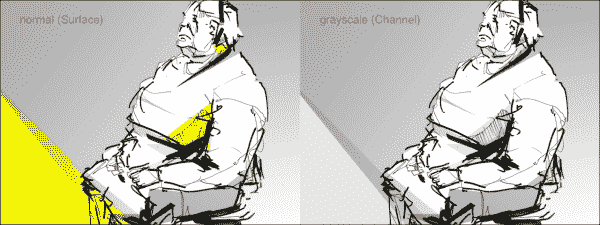
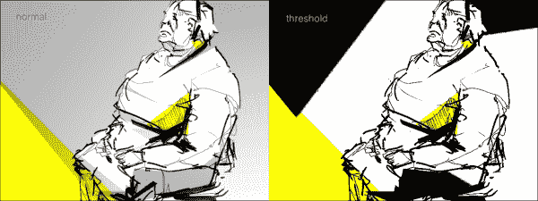
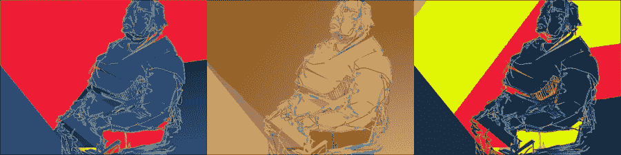
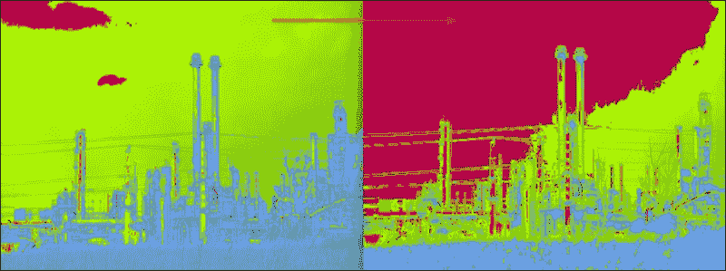

# 第七章. 与图像一起工作 – 实时后处理和效果

在本章中，我们将讨论使用内置 Cinder 类的基本方法来对静态和动态图像应用效果。

在本章中，我们将学习以下内容：

+   理解 CPU 和 GPU 图像处理之间的区别

+   对图像应用基本效果

+   遍历图像像素以及电影帧

+   利用像素级访问

# 介绍纹理、表面和通道

在第五章中，*利用图像 – 加载和显示*，我们已经学习了如何将图像加载到 Cinder 中。以下是我们当时使用的代码的精华：

```cs
gl::Texture texture = loadImage( loadAsset( "image.jpg" ) );
```

使用此行代码，我们将`image.jpg`图像文件中的像素加载到 GPU 内存中。`Texture`用于存储图像数据，但不用于操作或显示。要在屏幕上显示图像，我们使用以下行代码：

```cs
gl::draw( texture );
```

假设我们想在加载和绘制阶段之间进行一些图像处理。要在 GPU 上处理图像（图像数据由`Texture`对象存储），我们会使用着色器。着色器使用 OpenGL 着色语言，我们不会在这里详细介绍，因为这远远超出了本书的范围。

另一种处理图像的方法是在 CPU 上加载图像。为了使用 CPU，我们必须使用`Surface`类。它与`Texture`类类似，但主要区别在于它在 CPU 上存储图像数据。通过在 CPU 上加载图像，我们可以使用 C++代码进行图像处理。

要绘制一个表面，我们需要将其转换为`Texture`实例。可以将`Surface`数据转换为`Texture`类实例以绘制类似以下内容：

```cs
Surface surface;
gl::Texture texture = gl::Texture( surface );
```

通过执行前面的代码，我们创建了一个适合在屏幕上显示的 GPU 友好纹理。

Cinder 中存在第三种图像数据类型，即`Channel`类。如果`Surface`类能够在单个对象内部的不同通道中存储红色、绿色、蓝色和 alpha 值，那么`Channel`仅使用一个通道（可以存储上述提到的任何一个通道）并可用于存储灰度图像。

可以通过添加以下行从`Channel`类创建一个`Surface`实例：

```cs
Surface surface( channel );
```

上一行代码使得通过直接传递`Surface`实例到`Channel`类，可以创建一个高质量的灰度图像作为`Channel`类实例成为可能。

```cs
Channel channel( surface );
```

# 应用灰度效果

在上一节中，我们已经讨论了几乎可以在所有图像处理软件中应用的基本效果之一，即灰度。让我们创建一个简单的应用程序，通过使用我们刚刚讨论的方法加载图像并将其转换为灰度。

打开**TinderBox**，创建一个名为`BasicEffects`的新应用程序。将一个图像（让我们称它为`OurImage.png`，我将使用从我自己的档案中提取的一个简单、数字化增强的手绘草图）放入项目的`assets`目录中，并打开`xcode/BasicEffects.xcodeproj`项目文件。Windows 用户可以打开`vc10/BasicEffects.sln`文件。

在你的编辑器中打开`BasicEfectsApp.cpp`，并包含我们稍后需要的几个头文件：

```cs
#include "cinder/ImageIo.h"
#include "cinder/gl/Texture.h"
#include "cinder/Surface.h"
```

现在声明`Texture`和`Surface`类型的变量/对象如下：

```cs
Surface surface;
gl::Texture texture;
```

此外，将图像加载到`surface`对象中，并将其传递给`Texture`构造函数，以便我们之后可以绘制它（这将在`setup()`方法实现中完成）：

```cs
surface = Surface( loadImage( loadAsset("OurImage.png") ) );
texture = gl::Texture(surface);
```

最后，进入`draw()`方法实现，并添加以下代码行以绘制纹理：

```cs
if ( texture ) gl::draw( texture );
```

在我们绘制纹理之前，我们需要确保它确实存在。

当你编译并运行项目时，我们的图像应该出现在屏幕上。如果它没有出现，请确保图像确实存在于我们项目的`assets`目录中，并且`loadAsset("OurImage.png")`中的图像文件名参数是正确的。

我们已经在 CPU 上为图像处理创建了非常基本的结构。为了将图像转换为灰度，我们将使用`Channel`类。首先，我们将按照以下方式包含`Channel.h`文件：

```cs
#include "cinder/Channel.h"
```

接下来，在`setup()`方法实现中，我们加载图像，从`Surface`实例创建一个`Channel`实例，并使用新创建的通道来构建纹理：

```cs
surface = Surface( loadImage( loadAsset("image.png") ) );
Channel channel( surface );
texture = gl::Texture( channel );
```

编译并运行项目。以下截图是对比图像，显示了当我们使用`Surface`对象构建纹理和`Channel`之间的差异：



一旦我们将图像传递给`Channel`构造函数，图像就会自动转换为灰度，我们使用这个结果来创建纹理。当你编译并运行程序时，你应该自己看到这一点。

# 使用阈值

现在我们将使用一些逐像素操作。我们将选择一个介于 0 到 255 之间的特定阈值值，并将每个像素的每个通道与该值进行比较。如果值高于阈值，我们将通道值更改为最大值（255）。如果值较低，我们将将其更改为最小值（0）。

### 注意

之前我们使用 0 到 1 之间的浮点数来描述 R、G 和 B 通道。当使用`Surface`对象和图像时，你可能想知道`Surface (Surface8u)`对象的每个通道的每个像素由 8 位组成，可以存储 256 个值（从 0 到 255），除非未定义。

由于我们处理的是静态图像，我们只需要在`setup()`方法中在`surface`和`texture`对象初始化之间执行此过程一次。我们将使用一个非常实用的辅助类`Surface::Iter`，它将允许我们无缝地遍历每一行（行）和每一行的单个像素。

因此，这是我们必须添加到`setup()`方法实现中`surface`和`texture`变量初始化行之间的代码，如下所示：

```cs
surface = Surface( loadImage( loadAsset("OurImage.png") ) );

int threshold = 200;
Area area = surface.getBounds();
Surface::Iter iter = surface.getIter( area );
while( iter.line() ) {
  while( iter.pixel() ) {
    iter.r() = iter.r() > threshold ? 255 : 0;
    iter.g() = iter.g() > threshold ? 255 : 0;
    iter.b() = iter.b() > threshold ? 255 : 0;
  }
}

texture = gl::Texture( surface );
```

首先，我们定义阈值，所有高于该阈值的值将更改为 255，所有低于或等于该阈值的值将更改为 0。再见了，平滑的渐变。接下来，我们获取我们将要更改的图像区域。为了更改整个图像，我们必须获取整个表面的边界。我们必须获取一个迭代器（`iter`），以便之后构建一个漂亮的嵌套循环。最后，我们使用迭代器遍历表面的所有行（行）和像素（行内的列），逐个更改像素。

不要忘记更改`Texture`的初始化（您必须再次使用我们的`Surface`实例而不是`Channel`）：

```cs
texture = gl::Texture( surface );
```

注意，我们在更改表面的像素后初始化纹理。每次您更改将用作`Texture`的`Surface`对象时，您都必须从更改后的`Surface`对象重新初始化`texture`变量。

编译并运行项目，看看会发生什么！以下屏幕截图显示了应用了我们的阈值滤镜的源图像与目标图像的比较：



在我们继续下一部分之前，尝试通过改变阈值值和像素值变化的方式做一些实验。

# 动画效果

让我们通过使用我们刚刚学到的技巧和`update()`方法制作一个简单的效果动画。我们必须修改`setup()`方法实现中的代码，使其看起来类似于以下内容：

```cs
surface = Surface( loadImage( loadAsset("OurImage.png") ) );

// int threshold = 200; // comment or remove this line
Area area = surface.getBounds();
Surface::Iter iter = surface.getIter( area );
while( iter.line() ) {
  while( iter.pixel() ) {
 iter.r() += 1;
 iter.g() += 2;
 iter.b() += 3;
  }
}

texture = gl::Texture( surface );
```

接下来，我们必须将除了`surface`初始化之外的所有代码剪切并粘贴到`update()`方法实现中，如下所示：

```cs
void BasicEffectsApp::setup() {
  surface = Surface( loadImage( loadAsset("OurImage.png") ) );
}

void BasicEffectsApp::update() {
  Area area = surface.getBounds();
  Surface::Iter iter = surface.getIter( area );
  while( iter.line() ) {
    while( iter.pixel() ) {
      iter.r() += 1;
      iter.g() += 2;
      iter.b() += 3;
    }
  }

  texture = gl::Texture( surface );
}
```

完成这些后，编译并运行项目，看看会发生什么：



在前面的屏幕截图中，您可以看到一种类似酸液侵蚀的动画，它将图像的所有表面都转换了。

# 将效果应用于移动图像

我们刚刚看到了如何获得动态效果，现在让我们尝试将效果添加到移动图像上。

在做之前，制作我们项目（`BasicEffects`）的副本是个好主意。将新项目的文件夹重命名为`BasicEffectsMotion`。打开项目文件（在 Mac OS X 上为`xcode/BasicEffects.xcodeproj`，在 Windows 上为`vc10\BasicEffects.sln`）。

### 注意

对于 Windows 用户，您需要在项目属性中**链接** | **输入** | **附加依赖项**下添加`QTMLClient.lib`和`CVClient.lib`。您还必须在项目属性中**链接** | **常规** | **附加库目录**下添加 QuickTime SDK 的路径（`C:\QuickTimeSDK-7.3\Libraries`）。您可以通过菜单栏点击**项目** | **基本效果属性**来访问项目属性。

首先，我们需要找到一个我们可以使用的电影文件。[`vimeo.com/groups/freehd`](http://vimeo.com/groups/freehd)似乎是一个可以找到免费视频片段的好地方。我找到了一个工业场地的片段。

将电影文件放在项目的`assets`文件夹中，打开代码编辑器，并从包含`QuickTime.h`文件开始：

```cs
#include "cinder/qtime/QuickTime.h"
```

### 注意

如果你使用的是 Cinder 的 AppRewrite 版本，你应该知道 QuickTime 已经被作为一个单独的块。块是 Cinder 的扩展，当你需要特定的额外功能时，你可以将其添加到你的项目中。

接下来，我们必须声明一些新的变量。由于我们已经有了一个表面和一个纹理，我们只需要声明一个用于电影的变量：

```cs
qtime::MovieSurface movie;
```

完成这些后，让我们转到`setup()`方法部分，通过添加以下高亮代码来加载电影：

```cs
// comment out or remove this line
// surface = Surface( loadImage( loadAsset("OurImage.png") ) );

// add these lines
movie = qtime::MovieSurface( getAssetPath("OurMovie.mp4") );
movie.setLoop();
movie.play();

```

接下来，我们必须将每一帧复制到一个表面，并将该表面转换为纹理，这样我们就可以在屏幕上绘制它。让我们转到`update()`方法实现，进行以下操作，删除所有之前的代码，并添加以下内容：

```cs
if ( movie.checkNewFrame() ) {
  surface = movie.getSurface();
  // add effects here
  if ( surface ) texture = gl::Texture( surface );
}
```

由于加载电影是一个异步过程，在我们将其传递给纹理之前，我们必须检查是否存在一个表面。同样，在绘制之前，我们必须检查是否有纹理。将`draw()`方法中的`gl::draw`部分更改为以下内容：

```cs
if ( texture ) gl::draw( texture, getWindowBounds() );
```

我们需要确保电影在应用程序窗口的边界内绘制。我们通过将`getWindowBounds()`函数的结果作为`gl::draw()`函数的第二个参数来确保这一点。

现在编译并运行项目。你应该能看到电影正在播放。现在我们将结合之前制作的效果。在`update()`方法中找到`surface`和`texture`初始化之间的位置（我在那里留下了一个注释`// add effects here`）。在那里添加以下代码：

```cs
if ( surface ) {
  Area area = surface.getBounds();
  Surface::Iter iter = surface.getIter( area );
  while( iter.line() ) {
    while( iter.pixel() ) {
      iter.r() += addR;
      iter.g() += addG;
      iter.b() += addB;
    }
  }
  addR += 1;
  addG += 2;
  addB += 3;
}
```

如你可能已经猜到的，现在我们必须声明`addR`、`addG`和`addB`变量，并按照以下方式设置它们的初始值：

```cs
// add this in the class declaration
uint8_t addR, addG, addB;

// add this in the setup() implementation
addR = addG = addB = 0;
```

编译并运行项目。你应该能看到电影的颜色变化，如下面的截图所示：



通过调整`addR`、`addG`和`addB`的值来实验，看看你能得到什么样的不同效果。

# 摘要

在本章中，我们学习了将效果应用于静态和动态图像的基本方法。通过研究原始图像处理算法并将它们作为按像素操作应用，可以做更多的事情。所以如果你那样做，并且能够重现大多数在 Photoshop 或 Gimp 中可以找到的图像效果——恭喜！你也许还希望通过学习有关着色器和 OpenGL 着色语言的知识，将你的知识提升到下一个层次。
