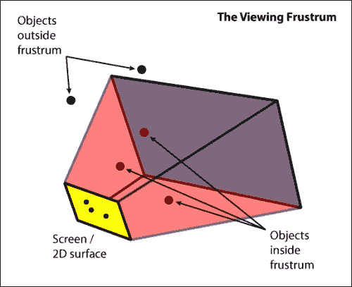
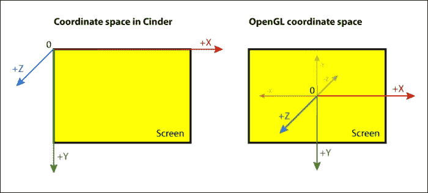
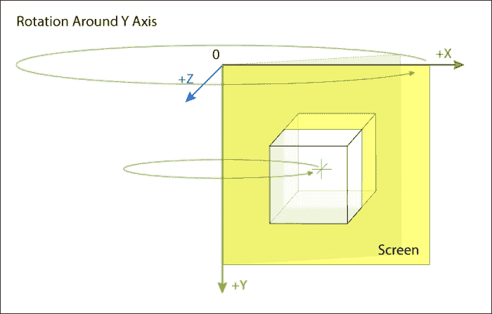
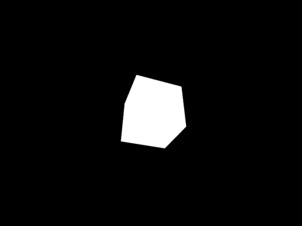
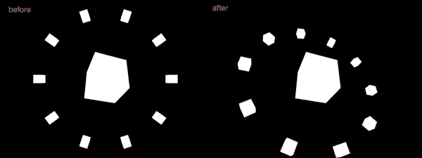
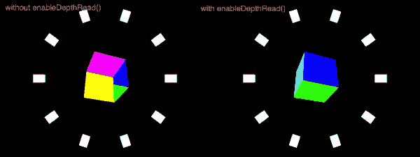
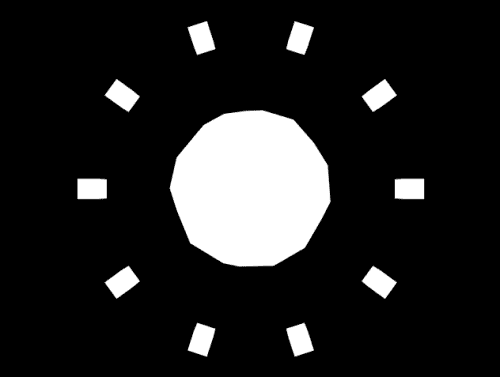
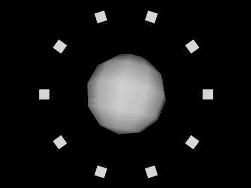
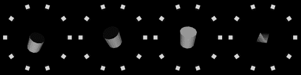
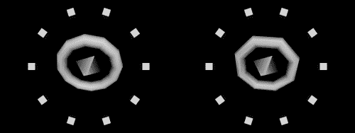

# 第八章. 深入学习 - Cinder 3D 基础

本章将向您介绍 Cinder 中可以绘制的基本 3D 方面和实用方法，以及可以用 Cinder 绘制的 3D 原语。我们将从二维坐标系过渡到三维，并继续探讨我们在三维图形编程世界中将要面临的基本问题和解决方案。在演示过程中，我们还将添加基本动画，以展示向原本静态对象添加运动的基本方法。

# 介绍 3D 空间

要使用 Cinder 进行 3D 绘图，我们需要了解一些关于 3D 计算机图形学的基础知识。首先，我们需要知道的是，3D 图形是在计算机中某个地方存在的三维空间中创建的，之后被转换成可以在我们的计算机屏幕上显示的二维图像。

通常有一个投影（视锥体）具有不同的属性，这些属性与我们在现实世界中拥有的相机的属性相似。**视锥体**负责渲染视锥体内可见的所有 3D 对象。它负责创建我们在屏幕上看到的 2D 图像。



如前图所示，所有在视锥体内的对象都在屏幕上被渲染。视锥体外的对象被忽略。

OpenGL（在 Cinder 中用于绘图）依赖于所谓的渲染管线来将对象的 3D 坐标映射到 2D 屏幕坐标。此过程使用了三种类型的矩阵：模型矩阵、视图矩阵和投影矩阵。模型矩阵将 3D 对象的局部坐标映射到世界（或全局）空间，视图矩阵将其映射到相机空间，最后投影矩阵负责将其映射到 2D 屏幕空间。较旧的 OpenGL 版本将模型和视图矩阵合并为一个——**模型视图**矩阵。

在前面的章节中，我们使用了二维坐标（x 和 y 坐标轴）来在屏幕上放置不同种类的对象和图形。现在我们将利用第三个维度——z 轴。

Cinder 中的坐标系从屏幕的左上角开始。放置在那里的任何对象的坐标都是 0, 0, 0（这些分别是 x、y 和 z 的值）。x 轴向右延伸，y 轴向下延伸，但 z 轴向观察者（我们）延伸，如图所示：



如前图所示，Cinder 中的坐标系与 OpenGL 中的坐标系略有不同。Cinder 内置的 OpenGL 绘图函数负责进行映射。

# 3D 绘图

让我们尝试考虑存在第三个维度来绘制一些东西。

使用 **TinderBox** 创建另一个项目，并将其命名为 `Basic3D`。在 Mac 上打开项目文件（`xcode/Basic3D.xcodeproj`），在 Windows 上打开（`vc10\Basic3D.sln`）。在编辑器中打开 `Basic3DApp.cpp` 并导航到 `draw()` 方法实现。

在 `gl::clear()` 方法之后，添加以下行以绘制一个立方体：

```cs
gl::drawCube( Vec3f(0,0,0), Vec3f(100,100,100) );
```

第一个参数定义了立方体中心的位子，第二个定义了它的大小。注意，我们使用 `Vec3f()` 变量在三个（x、y 和 z）维度内定义位置和大小。

编译并运行项目。这将绘制一个位于屏幕左上角的实心立方体。我们只能看到它的四分之一，因为立方体的中心是参考点。让我们通过以下方式转换前面的行，将其移动到屏幕中心：

```cs
gl::drawCube(
        Vec3f(getWindowWidth()/2,getWindowHeight()/2,0),
        Vec3f(100,100,100) );
```

现在我们将立方体定位在屏幕中间，无论窗口的宽度和高度如何，因为我们传递了窗口宽度的一半 (`getWindowWidth()/2`) 和窗口高度的一半 (`getWindowHeight()/2`) 作为立方体位置的 x 和 y 坐标值。编译并运行项目以查看结果。通过调整大小参数来理解其背后的逻辑。

我们可能想要稍微旋转一下这个立方体。有一个内置的 `rotate()` 函数我们可以使用。不过，我们必须要记住的一件事是，我们必须在绘制对象之前使用它。所以，在 `gl::drawCube()` 之前添加以下行：

```cs
gl::rotate( Vec3f(0,1,0) );
```

编译并运行项目。你应该会看到一个围绕 y 轴的奇怪旋转动画。这里的问题是 `rotate()` 函数旋转了整个 3D 世界以及其中的对象，并且它是通过考虑场景坐标来做到这一点的。由于 3D 世界的中心（所有轴交叉为零的点）在屏幕的左上角，所有的旋转都是围绕这个点进行的。



要改变这一点，我们必须使用 `translate()` 函数。它在 `rotate()` 或 `drawCube()` 之前用来移动场景（或画布）。为了使我们的立方体围绕屏幕中心旋转，我们必须执行以下步骤：

1.  使用 `translate()` 函数将 3D 世界转换到屏幕中心。

1.  使用 `rotate()` 函数旋转 3D 世界。

1.  绘制对象（`drawCube()`）。

1.  使用 `translate()` 函数将场景转换回原位。

我们必须使用 `translate()` 函数将场景转换回原位置，因为每次我们调用 `translate()` 时，值会被添加而不是替换。在代码中应该看起来像以下这样：

```cs
gl::translate( Vec3f(getWindowWidth()/2,getWindowHeight()/2,0) );
gl::rotate( Vec3f::yAxis()*1 );
gl::drawCube( Vec3f::zero(), Vec3f(100,100,100) );
gl::translate( Vec3f(-getWindowWidth()/2,-getWindowHeight()/2,0) );
```

因此，现在我们得到了立方体围绕 y 轴的平滑旋转。围绕 y 轴的旋转角度在每一帧中增加 1 度，因为我们把 `Vec3f::yAxis()*1` 的值传递给 `rotate()` 函数。通过调整旋转值来更深入地理解这一点。

如果我们想让立方体保持在恒定的旋转位置，我们必须记住 `rotate()` 函数的工作方式类似于 `translate` 函数。它向场景的旋转中添加值而不是替换它们。而不是将对象旋转回来，我们将使用 `pushMatrices()` 和 `popMatrices()` 函数。

旋转和平移是变换。每次调用 `translate()` 或 `rotate()`，你都在修改模型视图矩阵。如果进行了某些操作，有时可能不容易撤销。每次变换某个对象时，都会基于当前状态中所有之前的变换进行更改。

那么，这个状态是什么？每个状态都包含当前变换矩阵的一个副本。通过调用 `pushModelView()`，我们通过复制当前模型视图矩阵并将其存储到堆栈中来进入一个新状态。现在我们将进行一些疯狂的变换，而不用担心如何撤销它们。要返回，我们调用 `popModelView()`，它从堆栈中弹出（或删除）当前模型视图矩阵，并返回到具有先前模型视图矩阵的状态。

因此，让我们在 `gl::clear()` 调用之后添加以下代码进行尝试：

```cs
gl::pushModelView();
gl::translate( Vec3f(getWindowWidth()/2,getWindowHeight()/2,0) );
gl::rotate( Vec3f(35,20,0) );
gl::drawCube( Vec3f::zero(), Vec3f(100,100,100) );
gl::popModelView();
```

现在编译并运行我们的程序，你应该会看到以下截图类似的内容：



如我们所见，在执行任何操作之前，我们使用 `pushModelView()` 创建当前状态的副本。然后我们像之前一样，将场景平移到屏幕中间，旋转它（这次是围绕 x 轴 `35` 度和围绕 y 轴 `20` 度），最后绘制立方体！为了将舞台重置到之前的状态，我们只需要一行代码，`popModelView()`。

# 理解嵌套状态

可以通过使用之前讨论过的函数来创建嵌套状态。通过连续两次调用 `pushModelView()`，我们存储了两个不同的状态。通过随后调用一个 `popModelView()`，我们只弹出最后推入的模型视图矩阵。

让我们改变我们的 `draw()` 方法实现，如下所示：

```cs
void Basic3DApp::draw() {
   gl::clear( Color( 0, 0, 0 ) );

   // make a copy of the current modelview matrix
   gl::pushModelView();

   // translate the origin of the world to the center of the screen
   gl::translate( Vec3f(getWindowWidth()/2,getWindowHeight()/2,0) );

   // draw a ring of cubes
   int i; // iterator
   int numCubes = 10; // number of cubes in the ring
   for ( i=0; i < numCubes; i++ )
   {
           // make another copy of the current modelview matrix
           gl::pushModelView();

          // rotate the world around z axis
          gl::rotate( Vec3f::zAxis() * (360.f / numCubes * i) );

          // draw a relatively small cube
          // 200 pixels to the right from the center of the world
          gl::drawCube( Vec3f(200,0,0), Vec3f(25,25,25) );

          // return to the previous state
 gl::popModelView();
   }

   // rotate the world around the origin
   gl::rotate( Vec3f(35,20,0) );
   	// draw a bigger cube in the center of the world
   gl::drawCube( Vec3f::zero(), Vec3f(100,100,100) );
   	// return to the initial state
   gl::popModelView();
}
```

注意 `gl::pushModelView()` 和 `gl::popModelView()` 的使用。编译并运行项目，你应该会看到围绕我们之前看到的立方体的一圈较小的立方体。

现在尝试将 `gl::rotate()` 调用移动到 `for` 循环之前和 `gl::translate()` 调用之后。编译并运行项目。你应该看到与之前看到的不同的一些图像：



这是对嵌套状态的简单演示。尝试以我们刚才的方式实验，通过添加额外的变换并改变它们的顺序。此外，OpenGL 并不仅限于两层嵌套状态。你可以尝试通过在另一个 `for` 循环内部添加更多的 `pushModelView()` 和 `popModelView()` 函数，在每个小正方形周围添加环绕的对象，例如。

# 处理深度排序

让我们看看 Cinder 内置的 3D 原始形状绘制函数。虽然它们并不多，但鉴于 Cinder 比其他类似工具更底层，您之后应该继续学习一些 OpenGL，以便充分利用 Cinder 和 3D 空间中的绘图。

让我们从将单色立方体变为更加多彩，并添加一些与之前相同的恒定旋转开始。为此，我们需要将 `drawCube()` 函数调用替换为 `drawColorCube()`：

```cs
gl::drawColorCube( Vec3f::zero(), Vec3f(100,100,100) );
```

当您运行并编译应用程序时，您会看到立方体以某种奇怪的方式绘制。这是不适当的深度排序的效果。一个 3D 模型由放置在当前投影中不同深度的顶点组成。这些顶点形成面，它们也有不同的深度信息，这些信息在将它们转换为不同深度的像素时被考虑。如果这些顶点没有按其深度信息排序并按适当顺序绘制，我们就会得到一个图像，其中场景后面的面和对象被绘制在前面，反之亦然。为了避免这种情况，我们必须启用 OpenGL 的深度读取功能。在 `setup()` 方法实现中添加以下代码行：

```cs
gl::enableDepthRead();
```

编译并运行项目后，立方体应该看起来相当不错：



完成这些后，让我们添加一些旋转动画。为此，我们需要声明一些变量来存储旋转变量。然后，我们需要在 `setup()` 方法中为它们分配初始值，在 `update()` 方法中更改它们，并在 `draw()` 方法实现中最终绘制。让我们从声明变量开始。在 `setup()`、`update()` 和 `draw()` 方法声明之后添加以下行：

```cs
Vec3f currentRotation;
Vec3f rotationIncrement;
```

我们不是使用一个 `float` 变量来存储围绕每个轴的当前和增量旋转角度，而是使用 `Vec3f` 数据类型来能够在一个变量中存储旋转值。

我们现在必须将这些变量的初始值分配。转到 `setup()` 方法实现并添加以下行：

```cs
currentRotation = Vec3f( 0, 0, 0 );
rotationIncrement = Vec3f( 1.1f, 1.2f, 1.3f );
```

完成这些后，转到 `update()` 方法实现并添加以下行：

```cs
currentRotation += rotationIncrement;
```

这将在每一帧中增加围绕所有三个轴的旋转。

最后，我们必须在绘制时使用 `currentRotation` 变量。在 `gl::drawColorCube()` 调用之前更改 `gl::rotate()` 函数的参数为 `currentRotation`，如下所示：

```cs
…
// rotate the world around the origin
gl::rotate( currentRotation );

// draw a bigger cube in the center
gl::drawColorCube( Vec3f::zero(), Vec3f(100,100,100) );
```

现在，旋转值将在每一帧中增加和更新。编译并运行项目，亲自看看！您应该会看到一个不错的旋转动画。尝试用立方体的位置和大小来做同样的操作，以更好地理解这是如何工作的。

# 探索 Cinder 3D 原始形状的其他功能

现在，让我们尝试使用 Cinder 提供的函数的不同 3D 原始形状。我们刚刚尝试绘制了一种不同类型的立方体，所以让我们继续一个同样经典的形状，一个球体。将 `gl::drawColorCube()` 函数调用替换为以下行：

```cs
gl::drawSphere( Vec3f::zero(), 100 );
```

这个函数的第一个参数定义了球体的中心，第二个定义了半径。还有一个第三个（可选）参数 `int`，它控制球体由多少个段组成。默认值是 12，但你可能想将其更改为更高的值以增加球体的平滑度。

编译并运行项目。你应该会看到一个类似于以下截图的图像：



这里的问题是它看起来并不完全是 3D 的。正如你可能已经猜到的，问题是没有灯光。为了向场景添加灯光，在 `setup()` 方法实现中添加以下行：

```cs
glEnable( GL_LIGHTING );
glEnable( GL_LIGHT0 );
```

这些是负责打开灯光的 OpenGL 函数。第一个函数启用灯光，第二个是打开第一个灯光或 `GL_LIGHT0`。有方法可以定位和更改其参数，但我们将不会深入探讨，因为这超出了本书的范围。

编译并运行项目以查看开启灯光的球体。你应该得到一个类似于以下截图的结果：



让我们尝试绘制一个球体以外的其他东西。一个圆柱体怎么样？将 `drawSphere()` 函数调用替换为以下行：

```cs
gl::drawCylinder(50, 50, 100);
```

这将在屏幕上绘制一个开口的圆柱体。第一个参数定义了圆柱体底部的宽度，第二个参数定义了圆柱体顶部的宽度。第三个参数定义了圆柱体的高度。

在我们编译并运行应用程序后，你会注意到圆柱体不是像我们之前绘制的立方体或球体那样围绕其中心旋转。这是因为它的绘制方式——从下往上而不是上下两边。要改变这一点，我们可以绘制另一个圆柱体，具有负高度或更改 `translate()` 值。为了简化，让我们再画一个圆柱体。将圆柱体绘制代码替换为以下内容：

```cs
gl::drawCylinder(50, 50, 50);
gl::drawCylinder(50, 50, -50);
```

我们可以看到相同的圆柱体，但现在它围绕其中心旋转。我们可能还想添加圆柱体的封闭端。我们必须再次使用 2D 形状来完成这个任务。在 `drawCylinder()` 函数调用之后直接添加以下代码行：

```cs
gl::rotate( Vec3f(-90,0,0) );
gl::translate( Vec3f(0,0,50) );
gl::drawSolidCircle(Vec2f(0,0), 50, 12);
gl::translate( Vec3f(0,0,-50) );
gl::rotate( Vec3f(180,0,0) );
gl::translate( Vec3f(0,0,50) );
```

gl::drawSolidCircle(Vec2f(0,0), 50, 12);
这并不太容易，对吧？还没有一个 `drawSolidCircle()` 函数可以根据 3D 坐标绘制圆，但无论如何这是一种简写，所以我们不必编写纯 OpenGL。这些代码行所做的是将场景或画布移动到适当的相对位置和旋转，以便相对于已经绘制的圆柱体绘制其顶部和底部。

让我们稍微修改一下代码，看看`drawCylinder()`函数还能绘制圆锥甚至金字塔：

```cs
gl::drawCylinder(50, 0, 50, 4);
gl::drawCylinder(50, 0, -50, 4);
```

删除或注释掉`drawSolidCircle()`部分，并将`drawCylinder()`函数的顶部值改为`0`，并添加一个第四个值（如果你想绘制圆锥，可以将其设置为`4`或更多），这个值代表圆柱的切片数。

编译并运行应用程序后，我们看到的是一个金字塔，而不是我们预期的。让我们称它为钻石，以更准确地描述形状。在下面的屏幕截图中，你可以看到我们刚刚对`gl::drawCylinder()`所做的调整的图像条：



另一个值得介绍的基本形状是环面。Cinder 内置了一个用于绘制环面的函数，函数看起来是这样的：

```cs
gl::drawTorus(100, 20);
```

在圆柱绘制函数调用之后添加前面的代码行。第一个参数定义了外半径（负责环面底部形状的圆），第二个参数定义了内半径或用于创建环面体积的圆的半径。

为了让东西看起来更加整齐，让我们添加第三个和第四个参数，它们负责环面的经度和纬度切片数：

```cs
gl::drawTorus(100, 20, 8, 8);
```

如果我们现在编译并运行应用程序，我们应该看到类似于以下图像的图像：



# 摘要

总结来说，在本章中，我们通过 Cinder 可以做的非常基础的 3D 内容进行了自我介绍。我们了解了一些关于 3D 空间的概念，以及如何在空间中绘制和动画化对象。我们学习了如何打开灯光，并使用原语构建更复杂的形状。

还有更多，但要真正发挥 Cinder 的图形能力，你必须学习一些 OpenGL 和**OpenGL 着色语言**（**GLSL**）的更多知识。

在下一章中，我们将更多地讨论 Cinder 在音频方面的可能性，而不是图形。
