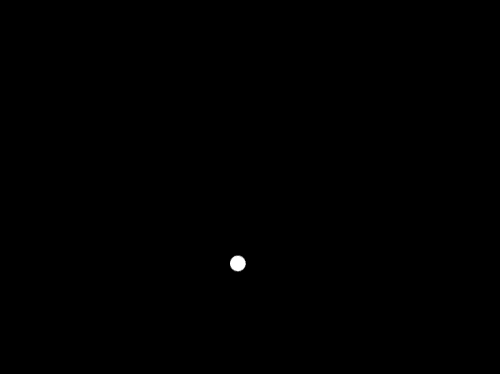
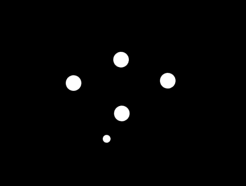
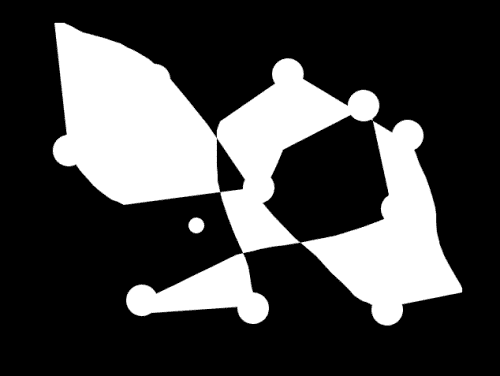
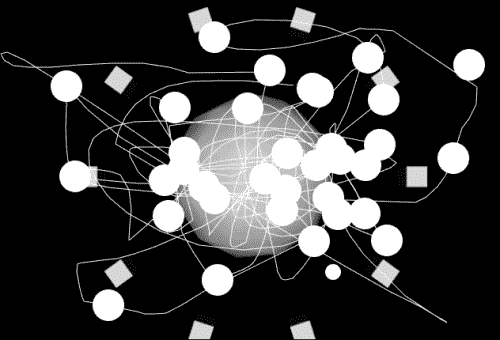

# 第十章. 与用户对话 – 添加交互性和 UI 事件

在本章中，我们将学习以下主题：

+   检测键盘按键

+   检测鼠标移动和点击

+   创建一个使用基本输入进行实时控制的应用程序

我们在前面几章中使用了一些这些功能，但在这里我们将尝试获得一个更系统的概述，了解 Cinder 可以提供哪些基本交互性。

# 处理事件

在本书中，我们编写的代码基本上扩展了`cinder::app::AppBasic`类及其继承的基类`App`的功能。我们声明和实现的方法基本上是覆盖了`AppBasic`和`App`类中构建的虚拟函数，并在某些事件中被调用。其中一些可以被称为事件处理器，它们基本上是对应用程序流程中发生的某些事件做出响应。

有三种基本方法构成了 Cinder 应用程序的核心：

+   `setup()`

+   `update()`

+   `draw()`

这些方法处理应用程序核心内部发生的事件，用户无法控制这些函数是否被调用（在函数实现的开头使用`return`或类似方式可以停止方法的执行）。

然后有一些方法可以在某些事件上执行代码，例如移动鼠标、按键盘上的键、滚动鼠标滚轮等。这是我们将在本章中关注的内容。所以这里有一个方法（或事件处理器）列表，我们将覆盖它们：

+   `keyDown()`

+   `keyUp()`

+   `fileDrop()`

+   `mouseDown()`

+   `mouseUp()`

+   `mouseMove()`

+   `mouseDrag()`

让我们创建一个简单的绘图应用程序，它将使用所有这些事件。为此，我们需要创建一个新的项目。打开**TinderBox**，创建一个名为`BasicEvents`的新项目。打开项目文件（在 Mac OS X 上为`xcode/BasicEvents.xcodeproj`，在 Windows 上为`vc10\BasicEvents.sln`）。在编辑器中打开`BasicEventsApp.cpp`，然后开始添加一些代码。

## 使用`mouseMove()`

首先，我们将添加一个自定义鼠标光标，当鼠标不移动时，它会慢慢下落，当鼠标移动时，它会返回到当前鼠标位置。为此，我们需要声明将保存光标 x 和 y 位置的变量。将以下代码行添加到文件声明部分：

```cs
Vec2i cursorPos;
```

这个变量将保存我们的光标`x`和`y`位置的`int`值。`Vec2i`中的`i`部分告诉我们它是一个由整数值组成的二维向量。

接下来，我们需要通过将值设置为应用程序启动时的当前鼠标位置来初始化该值。将以下代码行添加到`setup()`方法实现中：

```cs
cursorPos = getMousePos();
```

这将获取当前鼠标位置并将其分配给我们的光标位置值。

接下来，我们想在`cursorPos`坐标处绘制一个圆圈。让我们导航到应用程序的`draw()`方法实现，并在`gl::clear()`函数调用之后添加以下行：

```cs
gl::drawSolidCircle( cursorPos, 10 );
```

我们之前已经使用过这个函数。这将使用`cursorPos`变量定义的位置绘制一个半径为 10 像素的圆圈。编译并运行项目，亲自看看吧！

接下来，我们想要给圆圈添加下落动作。为此，我们需要在每一帧更新圆圈的`y`位置。换句话说，我们将每帧增加圆圈的`y`坐标。让我们导航到`update()`方法实现，并添加以下简单的一行代码：

```cs
cursorPos.y++;
```

这将使光标下落。最后，我们需要在`mouseMove`事件中使其粘附到鼠标上。我们需要在应用程序的类声明中声明`mouseMove()`方法重写。在类声明的末尾添加以下行：

```cs
void mouseMove(MouseEvent event);
```

然后将方法实现添加到类实现中，如下所示：

```cs
void BasicEventsApp::mouseMove(MouseEvent event) {
    cursorPos = event.getPos();
}
```

获取当前鼠标位置的方法不止一种，而不是使用`event.getPos()`。我们可以使用`getMousePos()`，它将执行与鼠标位置分配给`cursorPos`变量相同的事情。

编译并运行我们的应用程序，查看以下截图所示的结果：



你应该看到一个跟随鼠标移动的下落圆圈。

## 使用 mouseDown()

我们接下来要实现的事件处理程序是`mouseDown()`处理程序。每次我们点击鼠标的任意按钮时，它都会执行代码。我们将编写代码，每次我们点击左鼠标按钮时，都会在屏幕上添加一个静态圆圈。当我们点击右鼠标按钮时，它将移除第一个圆圈。

首先，我们需要声明一个新的变量，该变量能够存储我们生成的圆圈的多对坐标。我们可以使用`Vec2i`对象的数组，但由于我们不知道将要创建的圆圈的确切数量，我们将使用 C++的`vector`。

**向量**是一个动态数组，能够存储`std::vector::max_size`数量的特定类型的对象。`vector`数组在元素添加（或推入）和移除（或弹出）时动态地改变其大小（或长度）。

在我们的类声明的末尾添加以下代码行：

```cs
vector<Vec2i> circlePositions;
void mouseDown(MouseEvent event);
```

可能的`mouseDown()`方法已经为我们声明了。如果是这样，不要提及代码的第二行。如果`mouseDown()`之前没有声明，请继续将事件处理程序方法添加到类实现中：

```cs
void BasicEventsApp::mouseDown(MouseEvent event)
{
    // check if the left mouse button was pressed
    if ( event.isLeft() ) {
        // it was
        Vec2i cp = event.getPos(); // save current mouse position
        circlePositions.push_back(cp); // and add it to the vector
    }

    // check if the right mouse button was pressed
    if ( event.isRight() ) {
        // it was
        // check if the vector has at least one element
        if ( !circlePositions.empty() ) {  
            // it has, erase the first element
            circlePositions.erase(circlePositions.begin());
        }
    }
}
```

如您从前面的代码注释中可以看出，它检查哪个鼠标按钮已被按下，然后决定接下来要做什么。正如我们之前所述，当您点击左鼠标按钮时，必须创建一个圆，当您点击右鼠标按钮时，必须移除一个圆。实际上，我们在这里并没有创建圆，我们只是保存它们的位置。在`draw()`方法中，我们将能够选择是绘制圆还是其他完全不同的东西。

所以让我们导航到`draw()`方法实现，并添加以下代码片段：

```cs
// declare an iterator for this specific kind of vector
vector<Vec2i>::iterator i;

// loop through circle positions
for ( i=circlePositions.begin(); i!=circlePositions.end(); ++i ) {
    // and draw circles at these positions one by one
    gl::drawSolidCircle( *i, 20 );
}
```

要遍历一个向量，我们必须在这种情况下使用迭代器。向量迭代器是设计用来遍历向量的对象。在这种情况下，迭代器对象就像一个指针，一个`vector<Vec2i>`类型的迭代器将指向它内部的`Vec2i`对象。通过增加和减少迭代器的位置，我们可以访问向量中的下一个或上一个项目。可以从向量中获取`begin()`和`end()`迭代器，它们分别指向向量的第一个和超出结束元素。

要通过迭代器（类似于指针）访问元素，我们必须使用**解引用**的概念。要解引用指针，我们必须在指针变量前使用一个星号（`*`）。如果`i`是指向一个圆的实际位置的指针，要访问存储坐标的实际`Vec2i`对象，我们必须使用`*i`。要访问对象的属性，我们写`(*i).x`或`i->x`。

编译并运行项目。您应该能够通过点击鼠标的左右按钮来添加和移除圆。



您也可以通过使用`mouseUp()`事件处理器而不是`mouseDown()`来实现相同的功能。唯一的区别是，当您释放鼠标按钮时，代码将被执行。

## 使用 mouseDrag()

接下来，我们将利用`mouseDrag()`事件处理器在屏幕上绘制一个折线。我们需要另一个`vector`来存储实际形成折线的点的坐标。让我们在类声明中声明这个`vector`和`mouseDrag()`事件处理器。在它的末尾添加以下代码行：

```cs
PolyLine<Vec2f> line;
void mouseDrag(MouseEvent event);
```

我们在这里使用`PolyLine<Vec2f>`，因为`PolyLine`是 Cinder 类，用于存储线的控制点值。我们使用`Vec2f`而不是`int`，因为 Cinder 中没有接受由`int`值组成的`PolyLine`类的`draw`函数。

让我们进行下一步，并将`mouseDrag()`方法的实现添加到类实现中：

```cs
void BasicEventsApp::mouseDrag(MouseEvent event) {
    // create new position from current mouse position
    Vec2f cp = event.getPos();

    // copy it to the PolyLine
    line.push_back(cp);
}
```

这将在检测到鼠标位置变化时，将当前鼠标坐标的新位置添加到`PolyLine`中。

最后，我们必须绘制`PolyLine`。所以让我们导航到`draw()`方法实现，并添加以下代码行：

```cs
if ( line.size() ) {
  gl::drawSolid(line);
}
```

`gl::drawSolid`函数基本上会绘制一个填充的多边形。`PolyLine`本身定义了多边形的轮廓。编译并运行项目以查看我的意思。您应该得到一个类似于以下截图所示的图像：



如果您想画一条线，请使用`gl::draw(line)`代替。

## 使用`keyDown()`

如果在应用程序运行时能够清除屏幕而不是关闭和重新打开它来重新开始，那将很棒。让我们使用`keyDown()`事件处理器来检测按键。我们想要做的是，当按下*C*键时，擦除所有圆圈和线条。为此，我们需要在类声明中声明`keyDown()`方法：

```cs
void keyDown(KeyEvent event);
```

接下来，我们需要实现这一点，所以请在文件末尾添加以下代码片段：

```cs
void BasicEventsApp::keyDown(KeyEvent event) {
    if ( event.getCode() == KeyEvent::KEY_c ) {
        circlePositions.clear();
        line.getPoints().clear();
    }
}
```

`keyDown()`方法接受一个`KeyEvent`参数，该参数包含被按下的键的代码。在这里，我们检查键码是否代表键盘上的字母 C，如果是`true`，我们就清除`circlePositions` `vector`和`vector`值，在`PolyLine`对象中以与`vector` `circlePositions`相同的方式存储控制点。

您可以使用`keyUp()`事件处理器做同样的事情。现在我们不会为它制作一个单独的示例，因为它在按键释放时工作方式完全相同。

## 使用`fileDrop()`

但是，我们将使用`fileDrop()`事件处理器来在背景中放置一张图片。它接受一个`FileDropEvent`对象作为参数。它包含被拖放到应用程序窗口上的文件的路径。为了使用该路径，我们需要在类文件顶部添加以下行：

```cs
#include "cinder/gl/Texture.h"
#include "cinder/ImageIo.h"
```

第一个包含文件是必需的，因为它包含我们将需要的`gl::Texture`类，以便存储背景图像并使用`gl::draw()`函数绘制它。`ImageIo.h`文件在这里是因为我们需要加载实际图像到`Texture`实例中的图像加载函数。

接下来，我们需要声明一个变量来存储背景图像和`fileDrop()`事件方法本身。请在类声明末尾添加以下代码行：

```cs
gl::Texture background;
void fileDrop(FileDropEvent);
```

现在我们需要实现`fileDrop()`方法。请在类实现中添加以下代码行：

```cs
void BasicEventsApp::fileDrop(FileDropEvent event) {
    try {
         background = gl::Texture( loadImage( event.getFile(0) ) );
   } catch( ... ) {
         console() << "unable to load file" << endl;
   };
}
```

在这里，我们使用`try`和`catch`语句。通过这样做，我们只是确保如果放置了错误类型的文件，我们的应用程序不会崩溃。如果我们幸运的话，我们将图像加载到`background`变量中，如果不幸运，则将错误消息打印到控制台。

仔细看看`console()`函数调用。`console()`函数指的是标准输出或控制台。这是世界上最好的调试工具之一，如果您还没有使用它，您应该考虑使用它。

还有一件事需要完成，我们必须绘制`背景`。前往`draw()`方法实现，在`gl::clear()`函数调用之后和我们在本章中添加到该方法的所有代码之前添加以下代码片段。我们这样做是因为背景是我们需要在每一帧中首先绘制的：

```cs
if ( background ) {
    gl::draw( background, getWindowBounds() );
}
```

在我们绘制纹理之前，我们必须确保它确实存在。这就是为什么我们使用了一个额外的 if 语句。只有在这种情况下，我们才能在由`getWindowBounds()`方法调用返回的应用程序窗口范围内绘制背景纹理。

编译并运行我们的应用程序。将一个图像文件拖放到我们应用程序的窗口上，看看会发生什么。你应该会看到一个类似于以下屏幕截图的图像：



# 摘要

在本章中，我们获得了对任何类型的应用程序都可能使用的内置和最常用事件的基本理解。我们学习了如何利用鼠标点击、鼠标拖动、键盘点击甚至文件拖放事件。我们还利用了一些在之前章节中未解释的新绘图方法。

在下一章中，我们将讨论使用 Syphon 和 Open Sound Control 消息系统，在 Cinder 内置的应用程序与其他同一或不同网络计算机上的应用程序之间的通信。
