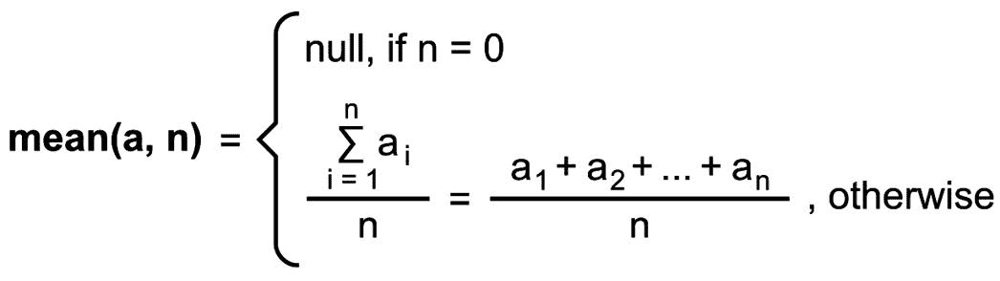
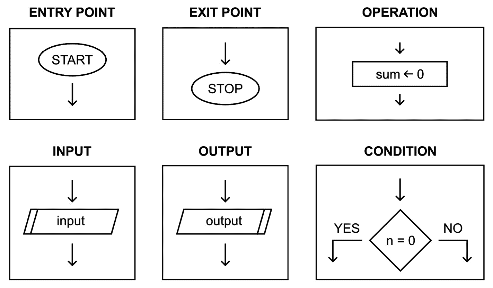
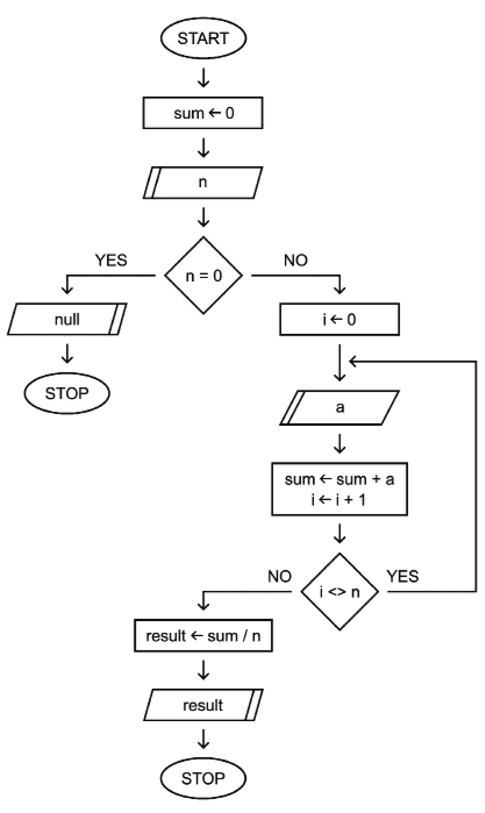
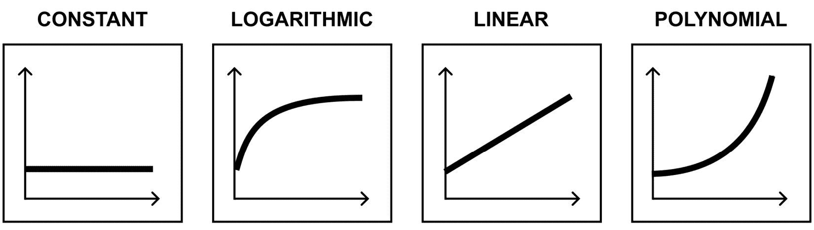

# 第二章：算法简介

在阅读这本书的第一章时，你了解到了各种数据类型。现在，是时候介绍算法这一主题了。在这一章中，你将了解它们的**定义**，以及一些现实世界的**例子**、**表示法**和**类型**。由于你应该注意应用程序的性能，因此算法的计算复杂性，包括时间复杂性，也将被介绍和解释。

首先，值得指出的是，算法这一主题非常广泛且复杂。你可以在互联网上轻松找到大量关于它们的科学出版物，这些出版物由来自世界各地的研究人员发表。算法的数量是巨大的，甚至记住所有常用算法的名称都几乎是不可能的。当然，有些算法易于理解和实现，而有些则极其复杂，没有对算法学、数学和其他相关科学领域的深入了解几乎无法理解。还有根据不同关键特征的算法分类，有很多类型，包括递归、贪婪、分而治之、回溯和启发式。然而，对于各种算法，你可以通过说明它们在处理输入大小增加时所需的时间和空间来指定计算复杂性。

这听起来是不是令人感到压倒性、复杂和困难？别担心。在这一章中，我将尝试以每个人都能理解的方式介绍算法这一主题，而不仅仅是数学家或其他科学家。因此，在这一章中，你会发现一些简化，以便使这个主题更简单、更容易理解。然而，目标是让你对这个主题感兴趣，**而不是创建另一本包含大量正式定义和公式的学术出版物或书籍**。你准备好了吗？让我们开始吧！

在这一章中，我们将涵盖以下主题：

+   什么是算法？

+   算法表示的符号

+   算法的类型

+   计算复杂性

# 什么是算法？

你知道吗，你通常每天都会使用算法，甚至在没有编写任何代码或绘制图表的情况下，你已经是某些算法的作者了吗？如果这听起来不可能，给我几分钟时间，阅读这一节来了解这是如何可能的。

## 定义

首先，你需要知道什么是**算法**。它是一个**为解决特定问题或执行计算而定义良好的解决方案**。它是一系列按给定顺序执行的精确**指令**，考虑（如果有）一个定义良好的**输入**，以产生一个定义良好的**输出**，如下所示：


图 2.1 – 算法的示意图

要更精确地说，**算法应该包含有限的一系列明确指令，这为你提供了一种有效且高效地解决问题的方法**。当然，算法可以包含**条件表达式**、**循环**或**递归**。

哪里可以找到更多信息？

如果你对这个算法主题感兴趣，你可以在许多书中找到关于它们的详细信息，包括托马斯·H·科门、查尔斯·E·利瑟森、罗纳德·L·里维斯和克利福德·斯坦因合著的《算法导论》。当然，还有许多在线资源，如*GeeksForGeeks* ([`www.geeksforgeeks.org`](https://www.geeksforgeeks.org))、*The Algorithms* ([`the-algorithms.com`](https://the-algorithms.com))和罗伯特·赛奇威克与凯文·韦恩合著的《算法，第 4 版》([`algs4.cs.princeton.edu`](https://algs4.cs.princeton.edu))。如果你在 GitHub 上浏览*算法*主题，你还可以找到大量的资源([`github.com/topics/algorithms`](https://github.com/topics/algorithms))。我强烈建议你在阅读完这本书后，在书籍或互联网上搜索各种资源，并继续学习算法。

## 现实世界例子

在掌握算法的定义后，你可能正在想，“**好吧——输入、输出、指令……我在哪里能找到它们？**”答案比你想象的要简单得多，因为你可以几乎在任何地方、任何时候找到这些项目！

让我们从**简单的早晨例行程序**开始。首先，你醒来，看看你的手机。如果有任何通知，你会浏览它们并回复紧急信息。对于任何非紧急事项，你会推迟它们。然后，你去洗手间。如果它被占用，你会等待直到它空闲，告诉里面的人快点。一旦你在洗手间里，你就洗澡并刷牙。最后，你根据当前的天气和温度选择合适的衣服。惊喜！你的早晨例行程序就是一个算法。你可以将其描述为一系列指令，它有一些输入，例如通知和当前温度，以及输出，例如选择的衣服。更重要的是，一些指令是条件性的，例如只回复紧急信息。其他指令可以在循环中执行，例如等待洗手间空闲。

上述早晨例行程序还包含其他算法，例如使用**面部识别解锁智能手机**的算法。这是一个基于算法的机制，你可以用它来确保只有你才能解锁你的手机。更重要的是，甚至**在手机上组织通知**也是考虑通知作为输入，将它们分组并适当排序后呈现给你的算法的结果。

到这个时候，你已经穿戴整齐，准备享用一顿健康美味的早餐。想象一下，你想要用你奶奶的秘密食谱**准备炒鸡蛋**。你需要一些原料，即三个鸡蛋、盐和胡椒。结果，你将为你完美的早餐制作出一道惊人的菜肴。首先，你将鸡蛋敲入碗中，并用一小撮盐和胡椒搅拌。然后，你在中火至小火的平底锅中融化黄油。接下来，你将鸡蛋混合物倒入平底锅中，并保持鸡蛋移动，直到没有液态鸡蛋。这样，你的早餐就准备好了。然而，如果没有一个写得很好且组织有序的算法，具有精确的输入和美味的输出，那它又是什么呢？

早餐后，你需要去上班。所以，你跳进你的车，在智能手机上启动导航应用，查看考虑到当前交通情况的**最快路线**。这个任务由复杂的算法完成，甚至可能涉及**人工智能**（**AI**），以及使用专用数据结构表示的计算机可理解的路由，以及从其他用户那里获得的数据。当它们结合在一起时，就形成了交通数据。正如你所见，算法对复杂的输入进行各种计算，为你提供一个有序的路线方向列表——例如，前往 A4 路线，右转至 S19 路线，并沿着这条路线直到你到达目的地。

在工作中，你需要为你的会计师准备文件，因此你需要从同事那里收集文件，从电子邮件中打印一些，然后**按编号对所有发票进行排序**。你如何进行排序？你从文件堆中取出第一份文件并将其放在桌子上。然后，你从未排序的文件堆中取出第二份文件，如果编号小于第一张发票，就把它放在上面，否则就放在上一张下面。接着，你取出第三张发票，并在有序的文件堆中找到合适的位置。你一直这样做，直到未排序的文件堆中没有文件为止。哇，又一个算法？没错！这正是**排序算法**之一。你将在下一章中了解它们。

工作时间到了，该休息一下了！你打开你最喜欢的社交应用，**收到新朋友的建议**。然而，他们是如何被找到并推荐给你的呢？是的，你是对的——这又是另一个算法，它从你的个人资料和活动数据以及可用用户的数据中获取输入，并为你返回一系列最适合的建议。它可以使用许多复杂和高级的技术，例如**机器学习**（ML）算法，这些算法可以学习并考虑你之前的反应。想想看，在这种情况下可以使用哪些数据结构。你如何组织与朋友的关系，以及你如何找出有多少其他人在你和好莱坞你最喜欢的演员之间？知道你的朋友认识玛丽，玛丽认识亚当，亚当是你的偶像的朋友，这不是很好吗？这样的任务可以使用一些图结构来完成，正如你将在本书后面看到的。

你会在本书中学到 AI 算法吗？

很遗憾，不是的。由于页面有限，本书没有包括与 AI 相关的各种算法。然而，请注意，这是一个非常有趣的话题，涉及许多概念，例如**机器学习**（ML）和**深度学习**（DL），这些在许多应用中使用，包括推荐系统、语音转文本、在极大量数据上搜索（大数据的概念）、生成文本和图形内容，以及控制自动驾驶汽车。为了实现这些目标，使用了大量有趣的算法。我强烈建议你亲自研究这个话题，或者选择 Packt 出版的专注于 AI 相关主题的书籍之一。

这些例子足够了吗？如果还不够，就想想在晚上去电影院看电影时**选择一部电影**，同时考虑基于电影院地理位置数据的电影推荐，或者根据你第二天计划的**设定闹钟**。正如你所看到的，**算法无处不在，我们都在使用它们，即使我们没有意识到**。

那么，如果算法如此普遍且如此有用，我们为什么不从可用的巨大算法集合中受益，甚至编写我们自己的算法呢？仍然有一些问题需要使用算法来解决。作为这本书的作者，我衷心希望你能解决这些问题！

# 算法表示的符号

在上一节中，算法是用英语表示的。然而，这并不是指定和记录算法的唯一方式。在本节中，你将了解四种算法表示的符号，即**自然语言**、**流程图**、**伪代码**和**编程语言**。

为了使这个任务更容易理解，你将使用所有这些符号指定计算**算术平均值**的算法。作为提醒，平均值可以使用以下公式计算：



图 2.2 – 计算算术平均数的公式

如您所见，使用了两个输入，即提供的数字（*a*）和元素总数（*n*）。如果没有提供数字，则返回`null`，表示没有可用的平均值。否则，您将数字相加，然后除以元素总数以获得结果。

## 自然语言

首先，让我们用自然语言指定算法。这是一种提供算法信息非常简单的方法，但它可能含糊不清。因此，让我们这样描述我们的算法：

*该算法读取输入，表示将从其中计算算术平均数的元素总数。如果输入的数字等于 0，则算法应返回 null。否则，它应读取等于预期总数量的数字。最后，它应以数字的总和除以它们的数量作为结果返回。*

非常简单易懂，不是吗？您可以使用这种符号表示简单的算法，但对于复杂和高级算法可能毫无用处。当然，无论算法的复杂程度如何，自然语言中的某些描述通常是有用的。它们可以为您提供算法目的的简要了解，以及算法的工作原理和您在分析或实现算法时应考虑的方面。

## 流程图

另一种表示算法的方法是通过**流程图**。流程图使用一组图形元素来准备一个指定算法操作的图表。以下是一些可用的符号：



图 2.3 – 设计流程图时可用符号

算法应包含**入口点**和一个或多个**出口点**。它还可以包含其他块，包括**操作**、**输入**、**输出**或**条件**。以下块通过**箭头**连接，指定执行顺序。您还可以绘制**循环**。

让我们看看计算算术平均数的流程图：



图 2.4 – 计算算术平均数的流程图

执行从`START`块开始。然后，我们将`sum`变量的值赋为`0`，该变量存储所有输入数字的总和。接下来，我们从输入读取一个值并将其存储为`n`变量的值。这是用于计算算术平均数的元素总数。接下来，我们检查`n`是否等于`0`。如果是这样，则选择`YES`分支，将`null`返回到输出，并停止执行。如果`n`不等于`0`，则选择`NO`分支，并将`i`变量的值赋为`0`。它存储已从输入中读取的元素数量。接下来，我们从输入读取一个数字并将其保存为`a`变量的值。接下来的操作块将`sum`增加`a`的值，并增加`i`的值。

下一个块是一个条件块，它检查`i`是否不等于`n`，这意味着所需的元素数量尚未从输入中读取。如果`i`等于`n`，则选择`NO`分支，并将`result`变量的值设置为`sum`除以`n`的结果。然后，返回`result`变量并停止执行。当条件表达式评估为`true`时，使用了一个有趣的构造，这意味着我们需要读取另一个输入。然后，使用循环，执行回到读取`a`的输入块之前。因此，我们可以多次执行某些操作，直到满足条件。

如你所见，流程图是一种图表，它以比自然语言更精确的方式指定算法的操作方式。对于简单的算法来说，这是一个有趣的选择，但在高级和复杂的算法中，它可能相当繁琐，因为不可能在合理大小的图表中展示整个操作。

## 模拟代码

我们接下来要探讨的下一个表示法是**模拟代码**。它允许你以另一种方式指定算法，这与编写在编程语言中的代码有点相似。在这里，我们使用英语来定义输入和输出，以及清晰地、简洁地展示一系列指令，但不包含任何编程语言的语法。

这里有一些用于计算算术平均数的模拟代码示例：

```cs
INPUT:
n – total number of elements used for mean calculation.
a – the following numbers entered by a user.
OUTPUT:
result - arithmetic mean of the entered numbers.
INSTRUCTIONS:
sum <- 0
read n
if n = 0 then
   return null
endif
i <- 0
do
   read a
   sum <- sum + a
   i <- i + 1
while i <> n
result <- sum / n
return result
```

如你所见，模拟代码为我们提供了一种易于理解和遵循的语法，以及相当接近编程语言的语法。因此，它是一种精确的算法表示和文档化方式，可以后来将其转换为所选编程语言中的一系列指令。

## 编程语言

现在，让我们来看算法表示法的最后一种形式：**编程语言**。它非常精确，可以编译和运行。因此，我们可以看到其操作的结果，并使用一组测试案例进行检查。当然，我们可以用任何编程语言实现算法。然而，在这本书中，你将只会看到用 C#语言编写的示例。

让我们看看均值计算算法的实现：

```cs
double sum = 0;
Console.Write("n = ");
int.TryParse(Console.ReadLine(), out int n);
if (n == 0) { Console.WriteLine("No result."); }
int i = 0;
do
{
    Console.Write("a = ");
    double.TryParse(Console.ReadLine(), out double a);
    sum += a;
    i++;
}
while (i != n);
double result = sum / n;
Console.WriteLine($"Result: {result:F2}");
```

之前的代码包含一个`if`条件语句和一个`do-while`循环。

如果我们运行应用程序，我们需要输入要计算算术平均值的元素数量。然后，我们将被要求输入数字`n`次。当提供的元素数量等于预期值时，结果将在控制台计算并显示，如下所示：

```cs
n = 3
a = 1
a = 5
a = 10
Result: 5.33
```

就这些！现在，你知道了算法是什么，你可以在日常生活中找到它们，以及如何使用自然语言、流程图、伪代码和编程语言来表示算法。有了这些知识，让我们继续学习不同类型的算法，包括递归和启发式算法。

# 算法类型

如前所述，算法几乎无处不在，甚至直观上，你在解决各种任务时每天都在使用它们。有大量的算法和许多类型，根据不同的标准进行选择。为了简化这个主题，这里将只展示一些类型，这些类型来自不同的分类，以展示多样性并鼓励你自己了解更多。同样，同一个算法也可能被归入几个不同的组。

## 递归算法

首先，让我们看看**递归算法**，它与**递归**的概念紧密相连，是**迭代算法**的对立面。这意味着什么？**如果一个算法通过调用自身来解决原始问题的较小子问题，则该算法是递归的**。算法会多次调用自身，直到满足**基本条件**。

这种技术为你提供了解决问题的强大解决方案，可以限制代码量，并且易于理解和维护。然而，递归有一些与性能或栈内存空间需求相关的缺点，这可能导致栈溢出问题。幸运的是，你可以使用**动态规划**来预防这些问题，这是一种支持递归的优化技术。

递归可以在多个算法中使用，包括以下：

+   使用**归并排序**和**快速排序**算法对数组进行排序，这些算法在*第三章*中详细实现和介绍，*数组和排序*

+   解决**汉诺塔**游戏，如*第五章*中所示，*栈和队列*

+   **遍历树**，如*第七章*中所述，*树的变体*

+   从**斐波那契数列**中获取一个数，如*第九章*中所示，*实战* *见*

+   **生成分形**，如*第九章*中所示，*实战* *见*

+   计算`n!`

+   使用欧几里得算法计算**两个数的最大公约数**

+   **遍历文件系统**中的目录和子目录

## 分而治之算法

另一组算法被称为**分而治之**。它与**通过将问题分解为更小的子问题（“分”步骤）来解决问题的算法范式相关**，递归调用它们，直到它们足够简单可以直接解决（“治”），然后将子问题的结果组合起来以获得最终结果（“合”）。这种方法具有许多优点，也借鉴了递归的优点，包括易于实现、理解和维护。通过将问题分解为许多子问题，它支持**并行计算**，这可能导致性能提升。不幸的是，这种范式也有一些缺点，包括需要正确定义基本案例以终止算法的执行。与递归算法类似，也可能存在性能问题。

分而治之是解决各种算法问题的流行方法，您可以在广泛的应用程序中看到其实现：

+   使用**归并排序**和**快速排序**算法对数组进行排序，这些算法在*第三章*中实现并详细介绍，*数组和排序*

+   **找到**位于二维表面上的**最近点对**，这将在*第九章*中介绍，*见* *实际操作*

+   计算一个数的**幂**

+   在数组中找到**最小值和最大值**

+   计算快速**傅里叶变换**

+   **使用 Karatsuba 算法**进行**大数乘法**

## 回溯算法

接下来，我们将介绍**回溯算法**。**它们用于解决由一系列决策组成的问题，每个决策都依赖于已经做出的决策，逐步构建解决方案。当您意识到已经做出的决策不能提供正确的解决方案时，您** **回溯**。当然，您可以使用递归来支持这种方法，尝试各种变体，从而找到合适的解决方案，如果存在的话。

您可以使用这种方法来完成许多任务，包括以下内容：

+   解决**迷宫中的老鼠**问题，如*第九章*中所示，*见* *实际操作*

+   如*第九章*中所示，解决**数独**，*见* *实际操作*

+   通过在空格中输入字母来解决**填字游戏**

+   解决**八皇后问题**，即在棋盘上放置八个皇后，并确保它们不能相互攻击

+   解决**骑士巡游问题**，其中您在棋盘的第一个方块上放置一个骑士，并移动它以便它恰好访问所有方块一次

+   生成**格雷码**以创建只有一位不同的位模式

+   解决与图相关主题的**m-着色问题**

## 贪心算法

现在我们已经介绍了递归、分治和回溯算法，是时候介绍另一种类型了，即贪心算法。**贪心算法**通过在每一步选择最佳选项来逐步构建解决方案，不考虑整体解决方案，并且在操作上具有短视性。因此，无法保证最终结果是最优的。然而，在许多场景中，使用局部最优解可以导致全局最优解，或者足够好。

这里有一些例子：

+   使用**迪杰斯特拉算法**在图中找到最短路径，如*第八章*《探索图论》中所示并详细解释。

+   如*第八章*《探索图论》中所示，使用**克鲁斯卡尔算法**和**普里姆算法**计算图中的最小生成树

+   解决**最小硬币找零问题**，如*第九章*《见行动》中解释。

+   **数据压缩算法**中**霍夫曼编码**的贪心方法

+   **负载均衡**和**网络路由**

## 启发式算法

现在，是时候通过启发式算法给你的算法添加更多“魔法”了！**启发式算法**为优化问题计算一个近似最优解，特别适用于精确方法不可用或太慢的场景。因此，你可以看到显著的加速，但结果的准确性会降低。**这种方法**在解决各种现实世界问题中很受欢迎且适用，这些问题通常很复杂且规模很大，并且应用于许多不同的科学领域，甚至包括生物信息学。

启发式算法有许多应用和子类型：

+   **遗传算法**，这是一种**自适应启发式搜索算法**，可以用来猜测这本书的标题，如*第九章*《见行动》中所示。

+   使用**禁忌搜索算法**解决**车辆路径问题**和**旅行商问题**

+   解决**背包问题**，其中需要选择具有最大总价值的物品，在质量限制内打包

+   **过滤和处理信号**

+   **检测病毒**

## 动态规划

由于我们正在讨论各种类型的算法，值得提一下**动态规划**。这是一种**通过限制重复计算相同结果的需要来优化递归算法的技术**。这种技术可以使用两种方法之一：

+   **自顶向下**的方法，它使用**记忆化**来保存子问题的结果。因此，算法可以使用缓存中的值，无需多次重新计算相同的结果，或者无需多次调用具有相同参数的方法。

+   **自底向上的方法**，它使用**表格**来用迭代替换递归。它限制了函数调用的次数，并解决了栈溢出的问题。

这两种方法都可以显著降低时间复杂度并提高性能，因此可以加快你的算法。每次使用递归时，尝试使用动态规划优化它都是一个好主意。如果你想学习如何优化计算**斐波那契数列**中的数字，请参阅*第九章*，*见* *实战*。

你还可以使用动态规划通过使用**Floyd-Warshall 算法**在图中找到所有顶点对之间的**最短路径**，以及在**Dijkstra 算法**中。另一个应用是解决**汉诺塔**数学游戏。可能性甚至更广泛，你还可以将其应用于**人工****神经网络**。

## 暴力算法

当我们介绍各种类型的算法时，我们也应该考虑暴力算法。**暴力算法**是解决一个问题的通用解决方案，通过检查所有可能的选项并选择最佳选项。这是一种可能具有巨大时间复杂度的方法，其操作可能需要很长时间，因此在现实场景中可能毫无用处。然而，当需要解决某些算法问题时，暴力算法通常是首选。这样做并没有什么不好，因为你可以更多地了解你想要解决的领域，并看到一些简单情况的结果。然而，在开发算法时，使用其他范式显著改进它是明智的。

这里有一些你可以使用暴力算法的例子：

+   **猜测密码**，正如在*第九章**,* *见* *实战*中所述，逐个检查每个可能的密码

+   **在未排序数组中寻找最小值**，因为你需要遍历所有项，因为数组中的值之间没有关系

+   **寻找一天中最佳的计划**，在会议之间安排各种任务，并尝试以你可以晚些开始工作并早点结束的方式组织它

+   解决**旅行商问题**

在介绍了几种算法类型之后，你会发现其中一些提供了更快的解决方案，而另一些则可能具有巨大的时间复杂度。但这意味着什么呢？你将在下一节中学习关于计算复杂度，特别是时间复杂度。

# 计算复杂度

在本节的最后，让我们看看算法的**计算复杂度**，重点关注**时间复杂度**和**空间复杂度**。为什么这如此重要？因为它可以决定你的算法是否可以在现实场景中使用。例如，以下哪个是你更喜欢的？

+   (A) 绝对是最好的工作路线方向，但你是在已经**在工作**后一个小时才收到它们的。

+   (B) 足够好的工作路线方向，但你是在进入**你的车**后几秒钟内收到的。

我确信你选择了**B** – 我也是！

## 时间复杂度

首先，让我们关注**时间复杂度**，它表示**算法作为输入长度函数所需的时间量**，即*n*。你可以使用**渐近分析**来指定它。这包括**大 O 符号**，用于表示**算法随着输入大小的增加将花费多少时间**。

例如，如果你在一个大小为*n*的无序数组中搜索最小值，你需要访问所有元素，因此最大操作数等于*n*，表示为*O(n)*。如果算法遍历一个大小为*n x n*的二维数组中的每个项目，时间复杂度是*O(n*n)*，所以它是*O(n²)*。

存在着各种时间复杂度，包括这里展示的：



图 2.5 – 时间复杂性的说明

第一个是**O(1**)，被称为**常数时间**。它表示一个执行时间不依赖于输入大小的算法。符合**O(1)**约束的典型操作包括从数组中获取第*i*个元素、检查哈希集合是否包含给定值或检查一个数字是偶数还是奇数。

这里接下来展示的时间复杂度是**O(log n**)，被称为**对数时间**。在这种情况下，执行时间不是常数，但它的增长速度比线性方法慢。*O(log n)*约束的一个著名例子是在排序数组中使用二分查找来查找一个项目。

第三种情况是**O(n**)，被称为**线性时间**。在这里，执行时间与输入长度成线性增长。你可以将找到无序列表中最小或最大值的算法或简单地找到无序列表中的给定值作为**O(n**)约束的例子。

这里最后展示的时间复杂度是**多项式时间**，表示为**O(n^m**)，所以它可以表示为*O(n²)*（**二次时间**）、*O(n³)*（**三次时间**）等等。在这种情况下，执行时间比线性约束的情况增长得更快。它可以涉及使用嵌套循环的解决方案。例如，冒泡排序、插入排序和选择排序算法。我们将在*第三章*中介绍这些，*数组和排序*。

当然，还有更多的时间复杂度可用，其中包括**双对数时间**、**多项对数时间**、**分数幂时间**、**线性对数时间**、**指数时间**和**阶乘时间**。

## 空间复杂度

与时间复杂度类似，你可以使用渐近分析和大 O 符号来指定**空间复杂度**。空间复杂度表示**随着输入长度的增加，运行算法所需的内存量**。你可以使用类似的指标，如*O(1)*，*O(n)*，或*O(n²)*。

你在哪里可以找到更多信息？

在本章中，只对算法的主题进行了非常简短的介绍。我强烈建议你尝试自己扩展关于算法的知识。这是一个极其有趣且具有挑战性的主题。例如，你可以在[`www.techtarget.com/whatis/definition/algorithm`](https://www.techtarget.com/whatis/definition/algorithm)和[`www.geeksforgeeks.org/most-important-type-of-algorithms/`](https://www.geeksforgeeks.org/most-important-type-of-algorithms/)了解更多关于各种算法的类型，而在[`en.wikipedia.org/wiki/Computational_complexity`](https://en.wikipedia.org/wiki/Computational_complexity)了解计算复杂性。我衷心祝愿你在算法学习上取得成功！

# 摘要

你刚刚完成了这本书的第二章，本章全部关于 C#语言中的数据结构和算法。这次，我们专注于算法，并指出了它们在各种应用开发中的关键作用，无论其类型如何。

首先，你学习了**什么是算法**以及**在日常生活中你可以在哪里找到算法**。正如你所看到的，算法几乎无处不在，你甚至在不自知的情况下使用和设计它们。

然后，你学习了**算法表示的符号**。在那里，你学习了如何以几种方式指定算法，即在自然语言中、使用流程图、通过伪代码或直接在编程语言中。

接下来，你学习了**关于几种不同类型的算法**，从递归算法开始，这些算法通过调用自身来解决更小的子问题。然后，你学习了**分而治之**算法，它将问题分为三个阶段，即分解、征服和合并。接下来，你学习了**回溯**算法，它允许你解决由一系列决策组成的问题，每个决策都依赖于已经做出的决策，以及如果决策不提供正确解决方案时的回溯选项。然后，你学习了**贪心**算法，它们在操作的每一步都选择最佳选项，而不关心整体解决方案。你学习的一组算法还包括用于寻找近似最优解的**启发式**算法。然后，你学习了如何使用**动态规划**及其自顶向下和自底向上的方法来优化递归算法。最后，你学习了**暴力**算法。

本章的最后一部分探讨了**计算复杂性**，从时间和空间复杂性的角度进行。介绍了渐近分析和大 O 符号。

在下一章中，我们将介绍**数组**和多种**排序算法**。你准备好继续在 C#语言中探索数据结构和算法的冒险了吗？如果是的话，那就让我们出发吧！
