# 3

# 数组和排序

作为一名开发者，您肯定在您的应用程序中存储了各种集合，例如用户数据、书籍和日志。存储此类数据的一种自然方式是使用数组。然而，您是否曾想过它们的变体？例如，您听说过锯齿形数组吗？在本章中，您将看到数组在实际中的应用，包括示例和详细描述。

您可以使用数组来存储`int`、`string`，以及用户自定义的类或记录。只需记住，**数组在初始化后其元素数量不能改变**。因此，您无法轻松地在数组的末尾添加新项或在数组中指定位置插入元素，同时将剩余项移动一个位置。如果您需要此类功能，可以使用另一种数据结构，即列表及其变体，这些将在下一章中描述。

在用 C#语言开发应用程序时，您可以受益于几种数组的变体，即**单维数组**、**多维数组**和**锯齿形数组**。在本章中，您还将了解七种**排序算法**，即**选择排序**、**插入排序**、**冒泡排序**、**归并排序**、**希尔排序**、**快速排序**和**堆排序**。对于每种算法，您将看到基于图示的示例、实现代码和逐步解释。您还将看到它们的性能分析，以图表的形式展示。

在本章中，我们将涵盖以下主题：

+   单维数组

+   多维数组

+   锯齿形数组

+   排序算法

# 单维数组

让我们从数组最简单的变体开始，即单维数组。第一个元素的索引为`0`，而最后一个元素的索引等于数组的长度减一。

想象一个单维数组

如果您想更好地想象单维数组，请暂时将目光从这本书上移开，看看您房间里的抽屉柜或衣柜。一个标准的抽屉柜由几个抽屉组成，单维数组看起来很相似。它也有几个元素（即抽屉），可以通过索引访问。您不能像改变抽屉数量一样改变数组的大小，因为家具已经准备好了。数组相对于抽屉柜有一个显著的优势，即所有的“抽屉”总是按预期工作。

以下图显示了单维数组的示例：

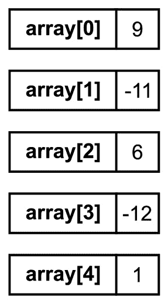

图 3.1 – 单维数组的示例

它包含五个元素，其值分别为`9`、`-11`、`6`、`-12`和`1`。第一个元素的索引等于`0`，而最后一个元素的索引等于`4`。

要使用一维数组，你需要声明和初始化它。声明非常简单，因为你只需要指定元素类型和名称，如下所示：

```cs
type[] name;
```

整数数组的声明如下所示：

```cs
new operator, as shown here:

```

numbers = new int[5];

```cs

 Of course, you can combine a declaration and initialization in the same line, as follows:

```

int[] numbers = new int[5];

```cs

 Unfortunately, all the elements currently have default values – that is, zeros in the case of integer values. Thus, you need to set the values of particular elements. You can do this using the `[]` operator and an index of an element, as shown in the following code:

```

numbers[0] = 9;

numbers[1] = -11;

numbers[2] = 6;

numbers[3] = -12;

numbers[4] = 1;

```cs

 Moreover, you can combine a declaration and initialization of array elements to specific values using one of the following variants:

```

int[] numbers = new int[] { 9, -11, 6, -12, 1 };

int[] numbers = { 9, -11, 6, -12, 1 };

```cs

 Another approach involves using the **collection expression**, as follows:

```

int[] numbers = [] 运算符和指定索引，如下所示的一行代码：

```cs
int middle = 2) from the numbers array and store it as a value of the middle variable.
The array has some properties that can be useful while developing applications. For example, the `Length` property makes it possible to get the size of the array, namely the number of elements stored within it. If you want to access the last item in the array, regardless of its size, you can use the following line of code:

```

int last = numbers[numbers.Length - 1];

```cs

 You can simplify this with the **index operator**, as follows:

```

int last = numbers[²]，第三个通过 [³]，以此类推。

另一个属性名为 `Rank`，返回数组的维度数。此属性的用法如下所示的一行代码：

```cs
int rank = numbers.Array class, such as Exists, to check whether there is any element in the array that matches the given predicate. For example, you can easily verify whether the array contains any element whose value is greater than zero, as follows:

```

bool anyPositive = Array.TrueForAll 检查是否所有元素都满足提供的谓词，例如确保数组中没有零：

```cs
bool noZeros = Array.Find method:

```

int firstNegative = Array.FindAll 方法。以下代码展示了如何获取所有负数：

```cs
int[] negatives = Array.IndexOf method, which returns an index of the first found occurrence of the value or -1, if not found:

```

int index = Array.ForEach。它允许你对数组中的所有元素执行一些操作。例如，你可以用它将每个数组元素的绝对值写入控制台，如下面的代码所示：

```cs
Array.ForEach(numbers, 
    e => Console.WriteLine(Math.Abs(e)));
```

如你所见，即使对于像一维数组这样简单的数据结构，你也有很多有用的内置功能。让我们继续学习它们，并看看接下来的两种方法，即 `Reverse` 和 `Sort`。根据它们的名称，第一个允许你反转元素顺序，无论是整个数组还是仅在某些范围内。以下代码展示了如何反转前三个元素：

```cs
Array.Sort method has even more variants. In its simplest form, it sorts the whole array. After running the following line, you’ll get the array with the elements sorted from the smallest to the biggest:

```

Array.for 循环并简单地遍历合适的索引并分配给定的值。然而，你可以使用 Fill 方法。以下行将 3 作为数组中所有元素的值：

```cs
Array.Clear, which makes it possible to clear the whole array or a range of its elements. For example, you can fill the whole array with the default value of the integer type, namely zeros, using the following line of code:

```

Array.Copy，它将源数组中的一系列元素复制到目标数组。你可以使用几种变体之一，例如指定两个数组中的索引。例如，让我们从 numbers 数组（作为源数组）复制 3 个元素（指定为长度），从第一个元素（源索引设置为 0）开始，并将它们放置在 subarray 数组中，从第一个元素（目标索引设置为 0）开始：

```cs
int[] subarray = new int[3];
Array.Contains and Max.
Have you ever heard about extension methods?
If not, think of them as methods that are “added” to a particular existing type (both built-in or user-defined) and can be called in the same way as when they are defined directly as instance methods. The declaration of an extension method requires you to specify it within a static class as a static method with the first parameter indicating the type to which you want to “add” this method with the `this` keyword.
You can use the `Contains` extension method to check whether the array contains an element passed as the parameter. As an example, let’s learn how to ensure that the `numbers` array contains `6` as one of its elements:

```

bool contains = numbers.Contains 方法不是唯一可用的扩展方法。其中，你可以找到 All 和 Any。第一个（All）检查所有元素是否与给定的谓词匹配，而另一个（Any）验证是否至少有一个元素满足条件。你可以使用它们来确保数组中没有零并检查是否至少有一个正元素，如下所示：

```cs
bool noZeros = numbers.All(n => n != 0);
bool anyPositive = numbers.Min and Max extension methods, as shown here:

```

int min = numbers.Min();

int max = numbers.Average 和 Sum 方法，它们可以轻松计算所有元素的平均值以及它们的总和：

```cs
double avg = numbers.Average();
int sum = numbers.Sum();
```

在对一维数组进行简短介绍之后，现在是时候看看如何在现实场景中应用这样的数组了。

你在哪里可以找到更多信息？

你可以在[C#语言中关于数组和它们各种变体的有趣信息](https://docs.microsoft.com/en-us/dotnet/csharp/programming-guide/arrays/)中找到很多。

示例 – 月份名称

总结一下关于一维数组的所学内容，我们可以用一个数组来存储英文月份的名称。这些名称应该自动获取，而不是通过在代码中硬编码它们。

实现如下所示：

```cs
using System.Globalization;
CultureInfo culture = new("en");
string[] months = new string[12];
for (int month = 1; month <= 12; month++)
{
    DateTime firstDay = new(DateTime.Now.Year, month, 1);
    string name = firstDay.ToString("MMMM", culture);
    months[month - 1] = name;
}
foreach (string m in months)
{
    Console.WriteLine(m);
}
```

首先，你创建一个新的`CultureInfo`类实例（来自`System.Globalization`命名空间），传递`en`作为参数，以便稍后获取英文月份的名称。然后，你声明一个新的单维数组，并用默认值初始化它。它包含`12`个元素，用于存储一年中所有月份的名称。然后，使用`for`循环遍历所有月份的数字——即从`1`到`12`。对于每一个，创建一个表示当前年份特定月份第一天的`DateTime`实例。

通过在`DateTime`实例上调用`ToString`方法，并传递适当的日期格式（`MMMM`）以及指定文化，来获取月份的名称。然后，使用`[]`操作符和元素的索引将名称存储在数组中。值得注意的是，索引等于`month`变量的当前值减一。这种减法是必要的，因为数组中的第一个元素的索引等于零，而不是一。

代码中下一个有趣的部分是`foreach`循环，它遍历数组的所有元素。对于每一个元素，月份的名称会在控制台显示：

```cs
January
February (...)
December
```

如前所述，一维数组并不是唯一可用的变体。你将在下一节中了解更多关于多维数组的内容。

多维数组

在 C#语言中，数组不需要只有一个维度。你可以创建二维数组。正如你将看到的，多维数组非常有用，并且在开发各种应用程序时经常被使用。

想象一个二维数组

如果你想想象一个二维数组，请休息一下，闭上眼睛，玩玩数独。如果你不知道这是什么，数独是一种流行的游戏，要求你用 1 到 9 的数字填充 9x9 葫芦娃的空格。然而，每一行、每一列以及每一个 3x3 的方块只能包含唯一的数字。惊喜！这个板子形成了一个二维数组！你可以通过指定其 *行* 和 *列* 来指向板上的任何位置，就像在二维数组中一样。如果你对用铅笔和一张纸解决这样的谜题感到有点厌倦，请看看 *第九章*，*实战*，在那里你将学习如何创建解决数独谜题的算法！

这里展示了一个存储整数值的二维数组示例：

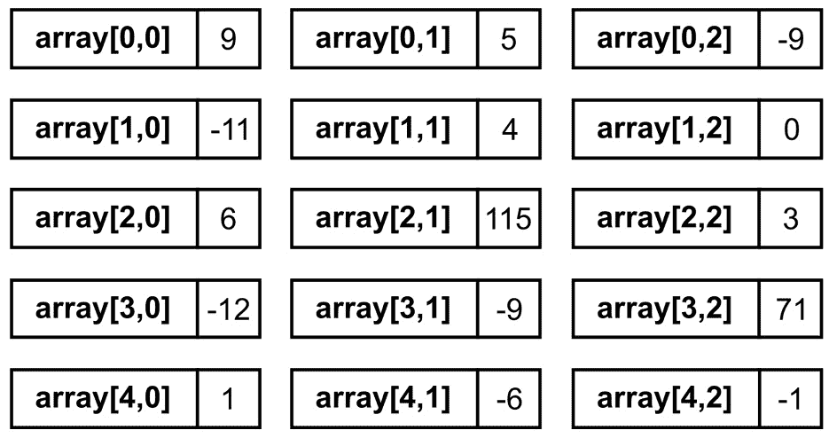

Figure 3.2 – Example of a two-dimensional array

首先，你需要声明并初始化一个具有 `5` 行和 `3` 列的二维数组，如下面的代码行所示：

```cs
int[,] numbers = new int[5, 3];
numbers[0, 0] = 9; (...)
```

你也可以以稍微不同的方式将声明和初始化结合起来：

```cs
int[,] numbers = new int[,]
{ 
    { 9, 5, -9 }, 
{ -11, 4, 0 }, 
{ 6, 115, 3 }, 
{ -12, -9, 71 }, 
    { 1, -6, -1 } 
};
```

对于从二维数组中访问特定元素的方式，需要做一些简单的解释。让我们看看以下示例：

```cs
int number = numbers[2, 1];
numbers2) and second column (index equal to 1) is obtained (that is, 115) and set as a value of the number variable. The other line replaces -11 with 11 in the second row and the first column.
Now that you’ve learned about one-dimensional and two-dimensional arrays, let’s proceed to three-dimensional ones. Do you know how to understand this structure?
Imagine a three-dimensional array
If you want to better imagine a three-dimensional array, launch a game in which you can create buildings from blocks. You place each of them in a specified location on the board, in *X* and *Y* coordinates. However, you can also build the next building floors, so you can specify the block’s *Z* coordinate as well. In such circumstances, you operate in a three-dimensional world with three-dimensional arrays!
An example three-dimensional array is presented in the following figure:
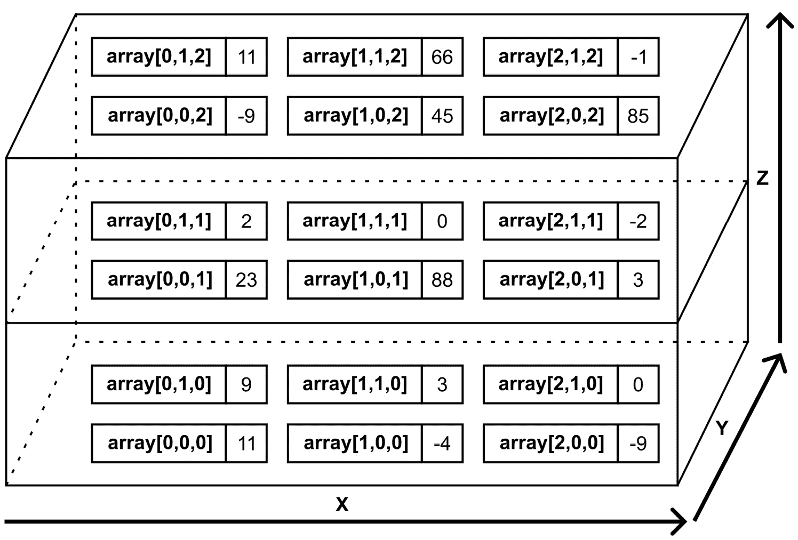

Figure 3.3 – Example of a three-dimensional array
If you want to create a three-dimensional array, you can use the following code:

```

int[,,] numbers = new int[3, 2, 3];

```cs

 The remaining operations can be performed similarly as in the case of arrays with a different number of dimensions. Of course, you need to specify three indices while accessing a particular element of the array.
So far, you’ve learned about one-, two-, and three-dimensional arrays. But is it possible to use four-dimensional arrays? Of course!
Imagine a four-dimensional array
Imagining a four-dimensional array is not very easy, but let’s try to do so! Once again, think about the three-dimensional game board we mentioned previously, but with content that changes depending on your level in the game. In this way, you can access a particular block in the three-dimensional world using *X*, *Y*, and *Z* coordinates. To get a target value, you need to use another dimension, namely by providing your current level. In this way, you will get different results depending on the fourth dimension. Not so difficult, right?
You can declare such an array using the following line of code:

```

int[,,,] numbers = new int[5, 4, 3, 2];

```cs

 If you need more dimensions, you can apply them. However, please keep in mind that using more dimensions can be quite difficult to understand and your code can be more difficult to follow and maintain in the future.
With this introduction to the topic of multi-dimensional arrays out of the way, let’s proceed to some examples. They will show you how to use such data structures in the real world.
Example – multiplication table
This first example shows basic operations being performed on a two-dimensional array to present a multiplication table. It stores the results of the multiplication of all integer values in the range from `1` to `10` in the array and present them in the console:

```

1   2   3   4   5   6   7   8   9  10

2   4   6   8  10  12  14  16  18  20

3   6   9  12  15  18  21  24  27  30

4   8  12  16  20  24  28  32  36  40

5  10  15  20  25  30  35  40  45  50

6  12  18  24  30  36  42  48  54  60

7  14  21  28  35  42  49  56  63  70

8  16  24  32  40  48  56  64  72  80

9  18  27  36  45  54  63  72  81  90

10  20  30  40  50  60  70  80  90 100

```cs

 Let’s take a look at the declaration and initialization of the array:

```

int[,] results = new int[10, 10];

```cs

 Here, a two-dimensional array with `10` rows and `10` columns is created and its elements are initialized to default values – that is, to zeros. When the array is ready, you fill it with the results of the multiplication, as well as present the result in the console. Such a task can be performed using two `for` loops, as shown here:

```

for (int i = 0; i < results.GetLength(0); i++)

{

for (int j = 0; j < results.GetLength(1); j++)

{

results[i, j] = (i + 1) * (j + 1);

Console.Write($"{results[i, j],4}");

}

Console.WriteLine();

}

```cs

 In the preceding code, you can see the `GetLength` method, which is called on the `results` array. This method returns the number of elements in a particular dimension – that is, the first (when passing `0` as the parameter) and the second (`1` as the parameter). In both cases, a value of `10` is returned, according to the values specified during the array’s initialization. Another important part of the code is the way of setting the value of an element. To do so, you must provide two indices.
The multiplication results, after converting them into `string` values, have different lengths, from one character (as in the case of `4` as a result of `2*2`) to three (`100` from `10*10`). To improve their presentation, you need to write each result in `4` characters. Therefore, if an integer value takes less space, leading spaces should be added. As an example, `1` will be shown with three leading spaces (`___1`, where `_` is a space), while `100` will be shown with only one space (`_100`). You can achieve this goal by using a proper composite format string (namely, `,4`) within the interpolated string.
Example – game map
Another example is a program that presents a map of a game. This map is a rectangle with 6 rows and 8 columns. Each element of the array specifies a type of terrain as grass, sand, water, or brick (also referred to as wall). Each place on the map should be shown in a particular color (such as green for grass), as well as using a custom character that depicts the terrain type (such as `≈` for water), as shown in the following figure:


Figure 3.4 – Screenshot of the game map example
Let’s start by creating two auxiliary methods that make it possible to get a particular color and character depending on the terrain’s type (`GetColor` and `GetChar`, respectively). The code for these methods is as follows:

```

ConsoleColor GetColor(char terrain)

{

return terrain switch

{

'g' => ConsoleColor.Green,

's' => ConsoleColor.Yellow,

'w' => ConsoleColor.Blue,

_ => ConsoleColor.DarkGray

};

}

char GetChar(char terrain)

{

return terrain switch

{

'g' => '\u201c',

's' => '\u25cb',

'w' => '\u2248',

_ => '\u25cf'

};

}

```cs

 As you can see, the code of the `GetColor` method is self-explanatory. However, the `GetChar` method returns a proper Unicode character depending on the character’s value (`g`, `s`, `w`, or `b`). For example, in the case of water, the `'\u2248'` value is returned, which is a representation of the `≈` character.
Let’s take a look at the remaining part of the code. Here, you configure the map, as well as present it in the console. The code is as follows:

```

using System.Text;

char[,] map =

{

{ 's', 's', 's', 'g', 'g', 'g', 'g', 'g' },

{ 's', 's', 's', 'g', 'g', 'g', 'g', 'g' },

{ 's', 's', 's', 's', 's', 'b', 'b', 'b' },

{ 's', 's', 's', 's', 's', 'b', 's', 's' },

{ 'w', 'w', 'w', 'w', 'w', 'b', 'w', 'w' },

{ 'w', 'w', 'w', 'w', 'w', 'b', 'w', 'w' }

};

Console.OutputEncoding = Encoding.UTF8;

for (int r = 0; r < map.GetLength(0); r++)

{

for (int c = 0; c < map.GetLength(1); c++)

{

Console.ForegroundColor = GetColor(map[r, c]);

Console.Write(GetChar(map[r, c]) + " ");

}

Console.WriteLine();

}

Console.ResetColor();

```cs

 This code should not require additional comments or explanations. Just keep in mind that to use Unicode values in the console output, don’t forget to choose the UTF-8 encoding by setting the `Encoding.UTF8` value for the `OutputEncoding` property. You can set the foreground color for the console using the `ForegroundColor` property. If you want to reset such a color to the default one, just call the `ResetColor` method, as presented in the last line.
So far, you’ve learned about both single- and multi-dimensional arrays, but one more variant remains to be presented in this book, namely jagged arrays. Let’s continue reading to learn more about them.
Jagged arrays
The last variant of arrays to be described in this book is **jagged arrays**, also referred to as an **array of arrays**. It sounds complicated, but fortunately, it is very simple. A jagged array can be understood as **a single-dimensional array, where each element is another array**. Of course, such inner arrays can have different lengths or they can even be not initialized.
Imagine a jagged array
If you want to better imagine a jagged array, stop reading this book for a moment, open your calendar, and switch its view so that it presents the whole year. It contains 365 or 366 boxes, depending on the year. For each day, you have a different number of meetings. On some days, you have three meetings, while on others, only one or even zero. Your holidays are marked in the calendar and blocked for meetings. You can easily imagine an application of a jagged array in this case. Each day box is an element of this array and it contains an array with data of meetings organized on a particular day. If this day is during your holidays, a related item is not initialized. This makes a jagged array much easier to visualize.
An example jagged array is presented in the following figure:
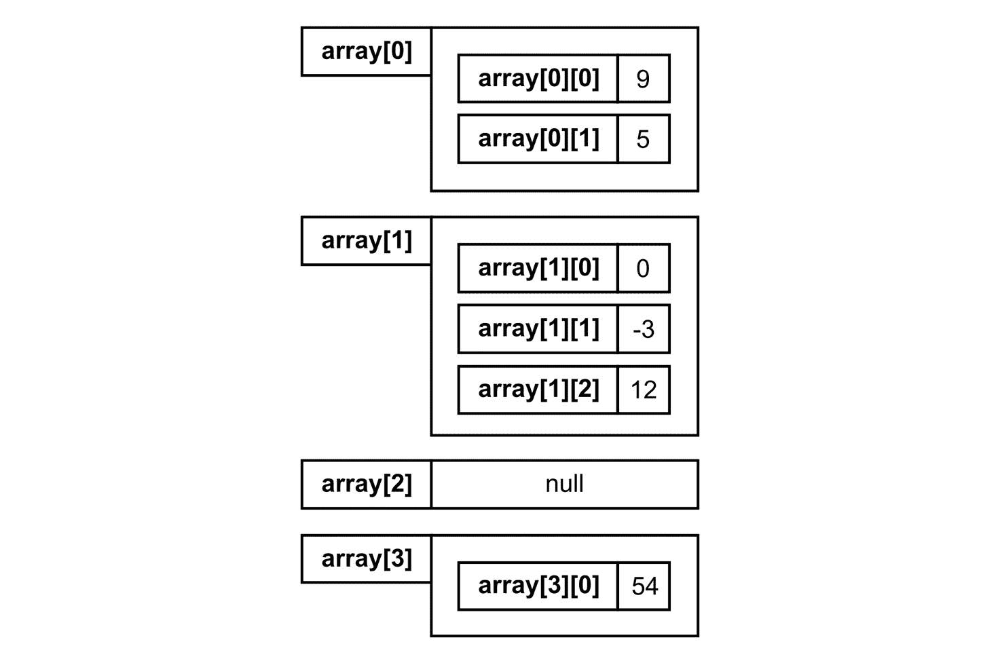

Figure 3.5 – Example of a jagged array
This jagged array contains four elements. The first has an array with two elements (`9` and `5`). The second element has an array with three elements (`0`, `-3`, and `12`). The third is not initialized (`null`), while the last one is an array with only one element (`54`).
Before proceeding to the example, it is worth mentioning the way of declaring and initializing a jagged array since it is a bit different from the arrays we’ve already described. Let’s take a look at the following code snippet:

```

int[][] numbers = new int[4][];

numbers[0] = new int[] { 9, 5 };

numbers[1] = new int[] { 0, -3, 12 };

numbers[3] = new int[] { 54 };

```cs

 This code can be simplified with a collection expression, as follows:

```

int[][] numbers = new int[4][];

numbers[0] = [9, 5];

numbers[1] = [0, -3, 12];

numbers[3] = numbers 数组使用默认值初始化，即 null。因此，我们需要手动初始化特定元素，如下三行代码所示。值得注意的是，第三个元素未初始化。

你也可以用不同的方式编写前面的代码，如下所示：

```cs
int[][] numbers =
{
    new int[] { 9, 5 },
    new int[] { 0, -3, 12 },
    null!,
    new int[] { 54 }
};
```

这还不是全部 - 还有一个更短的变体可用：

```cs
int[][] numbers =
[
    [9, 5],
    [0, -3, 12],
    null!,
    [54]
];
```

如何从一个交错数组中访问特定元素？让我们看看：

```cs
int number = numbers[1][2];
numbersnumber variable to 12 – that is, to the value of the third element (index equal to 2) from the array, which is the second element of the jagged array. The other line changes the value of the second element within the array, which is the second element of the jagged array, from -3 to 50.
Now that we’ve introduced jagged arrays, let’s look at an example.
Example – yearly transport plan
In this example, you’ll learn how to develop a program that creates a plan for your transportation for the whole year. For each day of each month, the application draws one of the available means of transport, such as by car, by bus, by subway, by bike, or simply on foot. In the end, the program presents the generated plan, as shown in the following screenshot:
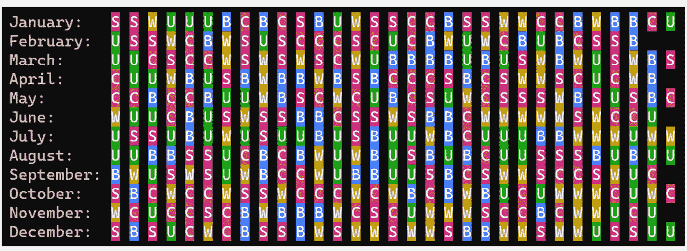

Figure 3.6 – Screenshot of the yearly transport plan example
First, let’s declare the enumeration type with constants representing types of transport:

```

public enum MeanEnum { Car, Bus, Subway, Bike, Walk }

```cs

 The next part of the code is as follows:

```

Random random = new();

int meansCount = Enum.GetNames<MeanEnum>().Length;

int year = DateTime.Now.Year;

MeanEnum[][] means = new MeanEnum[12][];

for (int m = 1; m <= 12; m++)

{

int daysCount = DateTime.DaysInMonth(year, m);

means[m - 1] = new MeanEnum[daysCount];

for (int d = 1; d <= daysCount; d++)

{

int mean = random.Next(meansCount);

means[m - 1][d - 1] = (MeanEnum)mean;

}

}

```cs

 First, a new instance of the `Random` class is created. This will be used to draw a suitable means of transport from the available ones. In the next line, we get the number of available transport types. Then, the jagged array is created. It is assumed that it has `12` elements, representing all months in the current year.
Next, a `for` loop is used to iterate through all the months within the year. In each iteration, the number of days is obtained using the `DaysInMonth` static method of `DateTime`. Each element of the jagged array is a single-dimensional array with `MeanEnum` values. The length of such an inner array depends on the number of days in a month. For instance, it is set to `31` elements for January and `30` elements for April.
The next `for` loop iterates through all the days of the month. Within this loop, you draw a transport type and set it as a value of a suitable element within an array that is an element of the jagged array.
The next part of the code is related to presenting the plan in the console:

```

string[] months = GetMonthNames();

int nameLength = months.Max(n => n.Length) + 2;

for (int m = 1; m <= 12; m++)

{

string month = months[m - 1];

Console.Write($"{month}:".PadRight(nameLength));

for (int d = 1; d <= means[m - 1].Length; d++)

{

MeanEnum mean = means[m - 1][d - 1];

(char character, ConsoleColor color) = Get(mean);

Console.ForegroundColor = ConsoleColor.White;

Console.BackgroundColor = color;

Console.Write(character);

Console.ResetColor();

Console.Write(" ");

}

Console.WriteLine();

}

```cs

 First, a single-dimensional array with month names is created using the `GetMonthNames` method, which will be presented and described later. Then, a value of the `nameLength` variable is set to the maximum necessary length of text for storing the month name. To do so, the `Max` extension method is used to find the maximum length of text from the collection with names of months. The obtained result is increased by `2` to reserve space for a colon and a space.
A `for` loop is used to iterate through all the elements of the jagged array – that is, through all months. In each iteration, the month’s name is presented in the console. The next `for` loop is used to iterate through all the items of the current element of the jagged array – that is, through all the days of the month. For each day, proper colors are set (for the foreground and background), and a suitable character is shown. Both a color and a character are returned by the `Get` method, taking the `MeanEnum` value as a parameter. This method will be shown a bit later.
Now, let’s take a look at the implementation of the `GetMonthNames` method:

```

string[] GetMonthNames()

{

CultureInfo culture = new("en");

string[] names = new string[12];

foreach (int m in Enumerable.Range(1, 12))

{

DateTime firstDay = new(DateTime.Now.Year, m, 1);

string name = firstDay.ToString("MMMM", culture);

names[m - 1] = name;

}

return names;

}

```cs

 This code is self-explanatory, but let’s focus on the line where we call the `Range` method. It returns a collection of integer values from `1` to `12`. Therefore, we can use it together with the `foreach` loop, instead of a simple `for` loop iterating from `1` to `12`. Just think about it as an alternative way of solving the same problem.
Finally, it is worth mentioning the `Get` method. It allows us to use one method instead of two, namely returning a character and a color for a given transport type. By returning data as a value tuple, the code is shorter and simpler, as shown here:

```

(char Char, ConsoleColor Color) Get(MeanEnum mean)

{

return mean switch

{

MeanEnum.Bike => ('B', ConsoleColor.Blue),

MeanEnum.Bus => ('U', ConsoleColor.DarkGreen),

MeanEnum.Car => ('C', ConsoleColor.Red),

MeanEnum.Subway => ('S', ConsoleColor.Magenta),

MeanEnum.Walk => ('W', ConsoleColor.DarkYellow),

_ => throw new Exception("Unknown type")

};

}

```cs

 Arrays are everywhere in this chapter! Now that we’ve learned about this data structure and its C# implementation-related topics, we can focus on some algorithms that are strictly related to arrays, namely sorting algorithms. Are you ready to get to know a few of them? If so, let’s proceed to the next section.
Sorting algorithms
Many algorithms use arrays for a very broad range of applications. However, one of the most common tasks is **sorting an array to arrange its elements in the correct order, either ascending or descending**. Of course, you can sort data of various types, including numbers, strings, or even instances of user-defined classes. However, to keep things a bit simpler, here, we will only focus on sorting integer values.
Imagine a sorting algorithm
You benefit from the sorting procedure frequently in your daily life! For example, your inbox is sorted in a way to present the newest messages first (by sending date in descending order), your calendar presents a day plan sorted by hours (by event start date in ascending order), as well as your list of tasks shows entries from the most important to the least important (by priority in descending order). That’s not all – at work, you sort documents by their issue date, then you choose a suitable road to home from the variants sorted by time to reach the destination, and in the evening, you change programs on the TV using a remote control according to the predefined order of channels.
Sorting algorithms involve many approaches and are also a popular subject of research. There are a lot of sorting types, including selection sort, insertion sort, bubble sort, merge sort, Shell sort, quicksort, and heap sort. These will be explained in detail in this chapter. However, these are not all of the available approaches. Various types differ in their performance results, which is one of the most important aspects that you should take into account while choosing your sorting implementation. This topic will be analyzed at the end of this chapter to give you some tips in this area.
Where can you find more information?
Array sorting is a popular topic that’s presented in various resources in books and research papers, as well as online. For example, you can read more about sorting algorithms presented in this chapter at Wikipedia, as well as you can take a look at some implementation codes at Wikibooks. You can browse for more information about the merge sort at [`en.wikipedia.org/wiki/Merge_sort`](https://en.wikipedia.org/wiki/Merge_sort) and [`en.wikibooks.org/wiki/Algorithm_Implementation/Sorting/Merge_sort`](https://en.wikibooks.org/wiki/Algorithm_Implementation/Sorting/Merge_sort), about Shell sort at [`en.wikipedia.org/wiki/Shellsort`](https://en.wikipedia.org/wiki/Shellsort) and [`en.wikibooks.org/wiki/Algorithm_Implementation/Sorting/Shell_sort`](https://en.wikibooks.org/wiki/Algorithm_Implementation/Sorting/Shell_sort), about quicksort at [`en.wikipedia.org/wiki/Quicksort`](https://en.wikipedia.org/wiki/Quicksort) and [`en.wikibooks.org/wiki/Algorithm_Implementation/Sorting/Quicksort`](https://en.wikibooks.org/wiki/Algorithm_Implementation/Sorting/Quicksort), and about heap sort at [`en.wikipedia.org/wiki/Heapsort`](https://en.wikipedia.org/wiki/Heapsort) and [`en.wikibooks.org/wiki/Algorithm_Implementation/Sorting/Heapsort`](https://en.wikibooks.org/wiki/Algorithm_Implementation/Sorting/Heapsort). In a similar way, you can find information about other sorting algorithms. Of course, Wikipedia, together with Wikibooks, is not the only available source of content regarding such algorithms. There are a huge number of websites dedicated to this subject. Some of them also contain animations that show how various algorithms operate. This can help you visualize how they work.
Selection sort
Let’s start with **selection sort**, which is one of the simplest sorting algorithms. **This algorithm divides the array into two parts, namely sorted and unsorted**. First, the sorted part is empty. In the following iterations, **the algorithm finds the smallest element in the unsorted part and exchanges it with the first element in the unsorted part**. Thus, the sorted part increases by one element. This sounds quite simple, doesn’t it?
To better understand the selection sort algorithm, let’s take a look at the following iterations for an array with nine elements (`-11`, `12`, `-42`, `0`, `1`, `90`, `68`, `6`, and `-9`), as shown in the following figure:
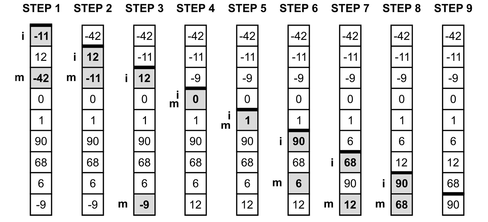

Figure 3.7 – Illustration of the selection sort algorithm
Bold lines are used to present the borders between the sorted and unsorted parts of the array. First (*Step 1*), the border is located just at the top of the array, which means that the sorted part is empty. Here, the algorithm finds the smallest value in the unsorted part (namely `-42`) and swaps it with the first element in this part (`-11`). The result is shown in *Step 2*, where the sorted part contains one element (`-42`), while the unsorted part consists of eight elements. In the next step, the algorithm finds `-11` as the smallest value in the unsorted part and swaps it with `12`, which is the first element in the unsorted part. As a result, the sorted part consists of two elements, namely `-42` and `-11`, while the unsorted part contains only seven elements, as shown in *Step 3*. The aforementioned steps are performed a few times until only one element is left in the unsorted part. The final result is shown in *Step 9*.
With that, you know how the selection sort algorithm works, but what role is performed by the `i` and `m` indicators shown on the left in the preceding diagram? They are related to the variables that are used in the implementation of this algorithm. So, it is time to see the code in the C# language!
The implementation is created within the `Sort` method, which takes the `a` array as the parameter and sorts it using selection sort:

```

void Sort(int[] a)

{

for (int i = 0; i < a.Length - 1; i++)

{

int minIndex = i;

int minValue = a[i];

for (int j = i + 1; j < a.Length; j++)

{

if (a[j] < minValue)

{

minIndex = j;

minValue = a[j];

}

}

(a[i], a[minIndex]) = (a[minIndex], a[i]);

}

}

```cs

 A `for` loop is used to iterate through the elements until only one item is left in the unsorted part. Thus, the number of iterations of the loop is equal to the length of the array minus one (`a.Length - 1`). In each iteration, another `for` loop is used to find the smallest value in the unsorted part (`minValue`, from the `i + 1` index until the end of the array), as well as to store an index of the smallest value (`minIndex`, referred to as the `m` indicator in the preceding diagram). Finally, the smallest element in the unsorted part (with an index equal to `minIndex`) is swapped with the first element in the unsorted part (the `i` index).
That’s all! Let’s use the following code to test the implementation of the selection sort algorithm:

```

int[] array = [-11, 12, -42, 0, 1, 90, 68, 6, -9];

Sort(array);

Console.WriteLine(string.Join(" | ", array));

```cs

 In the preceding code, an array is declared and initialized. Then, the `Sort` method is called, passing the `array` as a parameter. Finally, the `string` value is created by joining elements of the array, separated by `|`. The result is shown in the console:

```

-42 | -11 | -9 | 0 | 1 | 6 | 12 | 68 | 90

```cs

 Since we’re talking about various algorithms, one of the most important topics is computational complexity, especially time complexity. In the case of selection sort, both `for` loops (one within the other), each iterating through many elements of the array, which contains *n* elements. For this reason, the complexity is indicated as *O(n*2*)*.
A small reminder about computational complexity
You learned about computational complexity in the previous chapter. As a quick reminder, there are a few variants, such as for the worst or average case. This complexity can be interpreted as the number of basic operations that need to be performed by the algorithm, depending on the input size (*n*). The time complexity can be specified using Big O notation – for example, as *O(n)*, *O(n*2*)*, *O(n log(n))* or *O(1)*. As an example, the *O(n)* notation indicates that the number of operations increases linearly with the input size (*n*).
With that, you’ve learned about selection sort. If you are interested in another approach to sorting, proceed to the next section, where insertion sort is presented.
Insertion sort
**Insertion sort** is another algorithm that makes it possible to sort a single-dimensional array simply. Here, **the array is divided into two parts, namely sorted and unsorted**. However, at the beginning, the first element is included in the sorted part. In each iteration, **the algorithm takes the first element from the unsorted part and places it in a suitable location within the sorted part, to leave the sorted part in the correct order**. Such operations are repeated until the unsorted part is empty.
As an example, let’s take a look at an illustration of sorting an array with nine elements (`-11`, `12`, `-42`, `0`, `1`, `90`, `68`, `6`, and `-9`) using insertion sort:
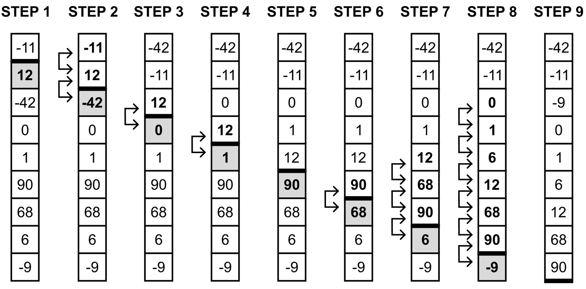

Figure 3.8 – Illustration of the insertion sort algorithm
First, only one element (namely `-11`) is located in the sorted part (*Step 1*). Then, you take the first element from the unsorted part (`12`). In this case, the location of this element does not need to be changed, so the sorted part is increased to two elements, namely `-11` and `12`. Then, you take `-42` as the first element in the unsorted part and you move it to the correct location in the sorted part. To do so, you need to perform two swap operations, as shown in *Step 2*. Thus, the length of the sorted part is increased to three elements, namely `-42`, `-11`, and `12`. In *Step 3*, you take `0` as the first element from the unsorted part and perform one swap operation to place it in the correct position, just before `12`, as presented in *Step 4*. At the same time, the size of the sorted part is increased to four already sorted elements, namely `-42`, `-11`, `0`, and `12`. Such operations are repeated until the unsorted part is empty (*Step 9*).
The implementation code for the insertion sort algorithm is very simple:

```

void Sort(int[] a)

{

for (int i = 1; i < a.Length; i++)

{

int j = i;

while (j > 0 && a[j] < a[j - 1])

{

(a[j], a[j - 1]) = (a[j - 1], a[j]);

j--;

}

}

}

```cs

 A `for` loop is used to iterate through all elements in the unsorted part. Thus, the initial value of the `i` variable is set to `1`, instead of `0`, because the unsorted part contains one element at the beginning. In each iteration of the `for` loop, a `while` loop is executed to move the first element from the unsorted part of the array (with the index equal to `i`) to the correct location within the sorted part, by swapping.
Finally, it is worth mentioning the time complexity of the insertion sort algorithm. Similarly, as in the case of the selection sort, both `for` and `while`) placed one within the other, which could iterate multiple times, depending on the input size (*n*).
Bubble sort
The third sorting algorithm we’ll cover is **bubble sort**. Its way of operation is very simple. **The algorithm just iterates through the array and compares adjacent elements. If they are located in an incorrect order, they are swapped.** It sounds very easy, doesn’t it? Unfortunately, the algorithm is not efficient and its usage with large collections can cause performance-related problems.
To better understand how the algorithm works, let’s take a look at the following figure, which shows how the algorithm operates in the case of sorting a single-dimensional array with nine elements (`-11`, `12`, `-42`, `0`, `1`, `90`, `68`, `6`, and `-9`):
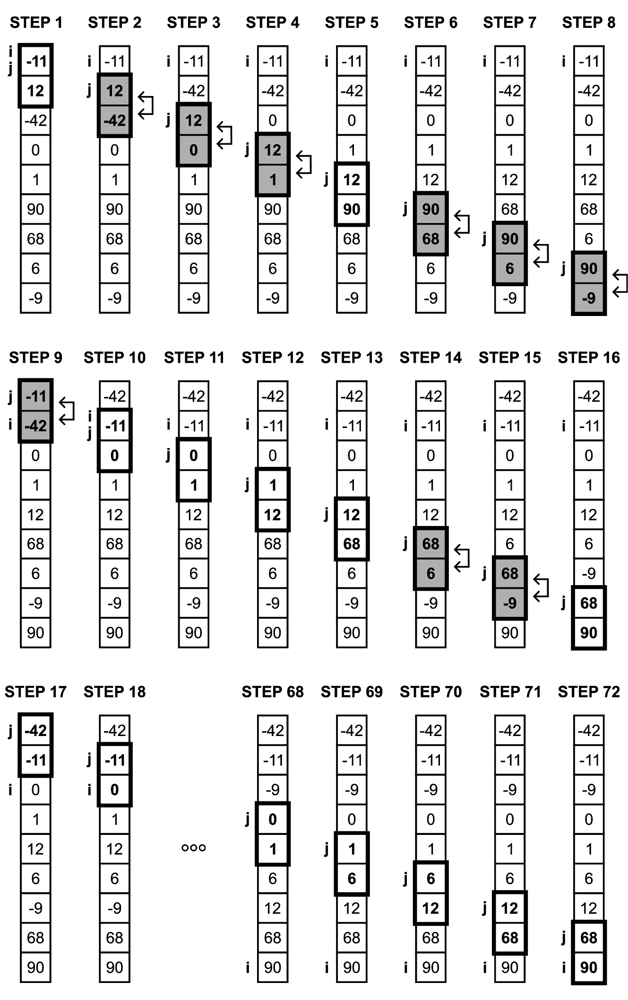

Figure 3.9 – Illustration of the bubble sort algorithm
In each step, the algorithm compares two adjacent elements in the array and swaps them, if necessary. For example, in *Step 1*, `-11` and `12` are compared. They are placed in the correct order, so it is not necessary to swap such elements. In *Step 2*, the next adjacent elements are compared (namely `12` and `-42`). This time, such elements are not placed in the correct order, so they are swapped. The aforementioned operations are performed many times. Finally, the array is sorted, as shown in *Step 72*.
The algorithm seems to be very easy, but what about its implementation? Is it also simple? Fortunately, yes! You just need to use two loops, compare adjacent elements, and swap them if necessary. That’s all! Let's take a look at the following code snippet:

```

void Sort(int[] a)

{

for (int i = 0; i < a.Length; i++)

}

for (int j = 0; j < a.Length - 1; j++)

{

if (a[j] > a[j + 1])

{

(a[j], a[j + 1]) = (a[j + 1], a[j]);

{

}

}

}

```cs

 Here, two `for` loops are used, together with a comparison and swapping. As mentioned previously, this algorithm is not efficient and its application can cause problems related to performance, especially in the case of large collections of data. However, it is possible to use a bit more efficient version of the bubble sort algorithm by introducing a simple modification. It is based on the assumption that **comparisons should be stopped when no changes are discovered during one iteration through the array**. The code is as follows:

```

void Sort(int[] a)

{

for (int i = 0; i < a.Length; i++)

{

bool isAnyChange = false;

for (int j = 0; j < a.Length - 1; j++)

}

if (a[j] > a[j + 1])

{

isAnyChange = true;

(a[j], a[j + 1]) = (a[j + 1], a[j]);

}

}

if (!isAnyChange) { break; }

}

}

```cs

 By introducing such a simple modification, the number of steps can decrease. In the preceding example, it decreases from 72 steps to 56 steps.
Before moving on to the next sorting algorithm, it is worth mentioning the time complexity of the bubble sort algorithm. As you may have already guessed, **both worst and average cases** are the same as in the case of the selection and insertion sort algorithms – that is, **O(n**2**)**.
Merge sort
The fourth sorting algorithm operates in a significantly different way than the three already presented. This approach is named **merge sort**. **This algorithm recursively splits the array in half until the array contains only one element, which is sorted. Then, the algorithm merges the already sorted subarrays (starting with these with only one element) into the sorted array.** Finally, the whole array is sorted and the algorithm stops its operation.
To better understand the merge sort algorithm, let’s take a look at the following iterations for an array with six elements (`-11`, `12`, `-42`, `0`, `90`, and `-9`):
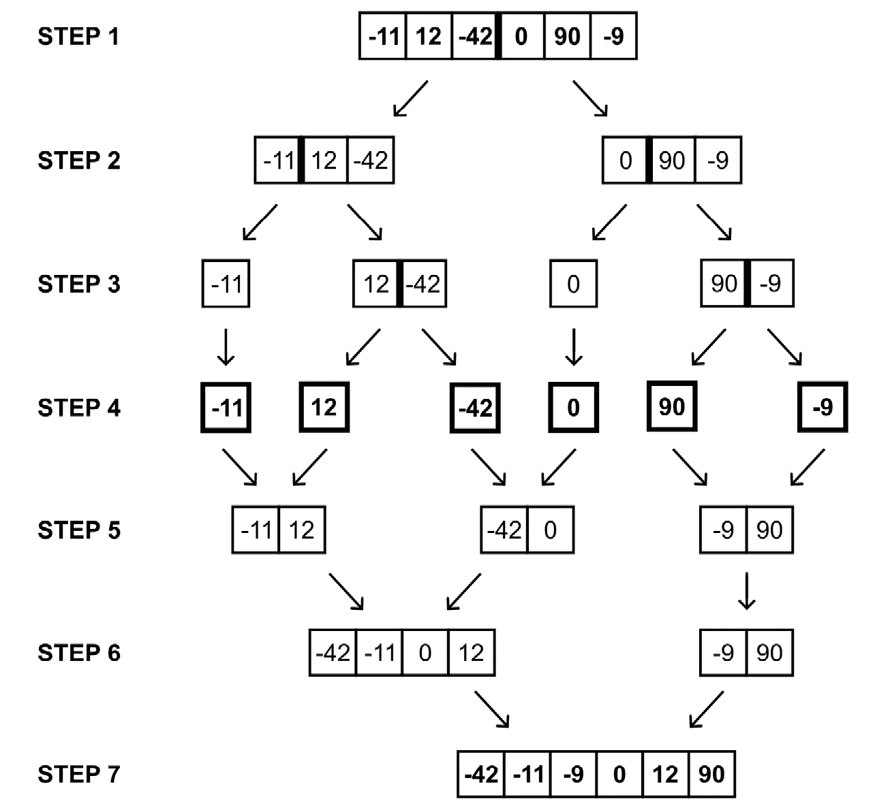

Figure 3.10 – Illustration of the merge sort algorithm
First (*Step 1*), you have the whole unsorted array, which you split into two parts, namely (`-11`, `12`, `-42`) and (`0`, `90`, `-9`), as shown in *Step 2*. In the next step, each of these subarrays is further split into (`-11`), (`12`, `-42`), (`0`), and (`90`, `-9`). In *Step 4*, you have the whole array divided into the subarrays with only one element each, namely (`-11`), (`12`), (`-42`), (`0`), (`90`), and (`-9`). Next, you merge all of these subarrays, together with sorting. Thus, in *Step 5*, you have three subarrays – that is, (`-11`, `12`), (`-42`, `0`), and (`-9`, `90`). Please keep in mind that these subarrays are already sorted. In *Step 6*, you need to merge and sort them further into (`-42`, `-11`, `0`, `12`) and (`-9`, `90`). Finally, you have the whole array sorted, namely (`-42`, `-11`, `-9`, `0`, `12`, `90`).
Does this seem simpler than just reading the textual description of the algorithm?  If so, let’s proceed to its implementation:

```

void Sort(int[] a)

{

if (a.Length <= 1) { return; }

int m = a.Length / 2;

int[] left = GetSubarray(a, 0, m - 1);

int[] right = GetSubarray(a, m, a.Length - 1);

Sort(left);

Sort(right);

int i = 0, j = 0, k = 0;

while (i < left.Length && j < right.Length)

{

if (left[i] <= right[j]) { a[k] = left[i++]; }

else { a[k] = right[j++]; }

k++;

}

while (i < left.Length) { a[k++] = left[i++]; }

while (j < right.Length) { a[k++] = right[j++]; }

}

```cs

 The `Sort` method is called `a`. To stop infinitely calling this method recursively, you must specify the stop condition at the beginning. It simply checks whether the size of the array is not greater than 1\. It is related to the assumption that you cannot further divide an array with one element only, because it is already sorted.
Next, you calculate an index of the middle element and store it as a value of `m`. In the following two lines, you call the auxiliary `GetSubarray` method, which creates a new array with only a part of elements, either from its left-hand side (with indices from `0` to `m-1`, stored as `left`) or the right-hand side (from `m` to the length of the array minus 1, stored as `right`). You will see its implementation after the explanation of the `Sort` method. Coming back to the explanation of the `Sort` method, you then recursively call the `Sort` method, passing the `left` and `right` subarrays.
The remaining part of the code is related to merging subarrays into the whole sorted array. Of course, this procedure is performed step by step, merging the subarrays into bigger and bigger subarrays until the whole array is sorted. You use a `while` loop to iterate through the `left` and `right` subarrays. You use three auxiliary variables, namely `i` as an index of the currently analyzed element from the `left` array, `j` from the `right` array, and `k` from the `a` array. Initially, all of them are set to `0`, so you keep an eye on the first element of the `left`, `right`, and `a` arrays.
Within the `while` loop, you check whether the current element from the `left` array (with the `i` index) is not greater than the current element from the `right` array (with the `j` index). If so, you place the current element from the `left` array as the first element in the `a` array. You also increase the `i` index, which means that the second element from the `left` array is the current one. If this condition is not met – that is, the current element from the `right` array is smaller than the current element from the `left` array – you use the current element from the `right` array as the first element in the `a` array and increase the `j` index. Finally, you increase the `k` index to keep an eye on the second element from the `a` array. The `while` loop ends when you are out of bounds of either the `left` or `right` array.
What about when some elements haven’t been analyzed yet from the `left` or `right` arrays? To handle such cases, you use two additional `while` loops. These allow you to place the remaining elements from either the `left` or `right` array on the remaining places in the `a` array. As you can see, the `Sort` method is equipped with a very simple way of merging two arrays into one, together with their sorting.
While explaining the algorithm’s implementation, the `GetSubarray` auxiliary method was mentioned. So, let’s show its code, together with a short explanation:

```

int[] GetSubarray(int[] a, int si, int ei)

{

int[] result = new int[ei - si + 1];

Array.Copy(a, si, result, 0, ei - si + 1);

return result;

}

```cs

 This method uses the `Copy` static method of the `Array` class to copy a part of the source array (`a`) to the declared and initialized here destination array (`result`). To perform this task, you need to take the correct number of elements, namely `ei` `–` `si` `+` `1`. Here, `ei` stands for *end index* and `si` stands for *start index*. You need to copy elements between arrays starting with the `si` index in the source array (`a`) and store them starting from the `0` index in the destination array (`result`).
Of course, you can fill a subarray in different ways, such as using a `for` loop, which iterates through elements and copies them accordingly. If you want, you can prepare the alternative implementation on your own and then compare it during the performance tests, which you will see later in this chapter.
What about the time complexity? It’s not very easy to specify it in the case of the merge sort algorithm compared to the other sorting algorithms I’ve presented. However, its time complexity is much better and can be indicated as **O(n log(n))** **for both average and worst cases**. You will see what this means in practice while analyzing the performance results.
However, you still have some algorithms to learn about, so let’s proceed to the next one.
Shell sort
A different approach to sorting is used in the **Shell sort** algorithm, whose name comes from its author’s name. It is a variation of the already presented insertion sort. **The algorithm performs h-****sorting** **to sort virtual subarrays consisting of elements with a distance equal to h, using the insertion sort. At the beginning, h is set to half of the array’s length and is divided by 2 in each iteration, until it is equal to 1.** This description can seem a bit complicated, but it is a surprisingly efficient algorithm with a very simple implementation.
First, let’s take a look at a figure that should make this topic much simpler and easier to understand than just the plain text:
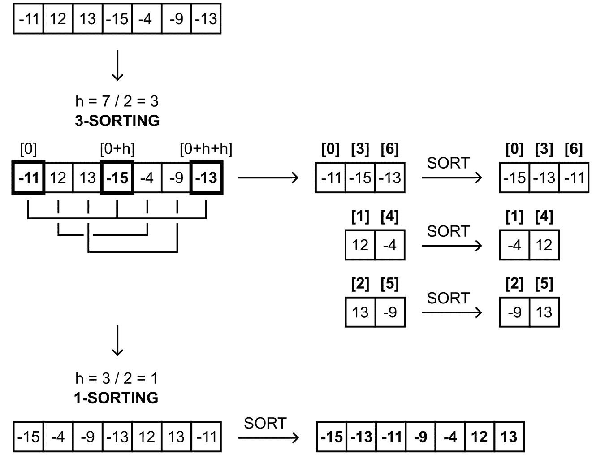

Figure 3.11 – Illustration of the Shell sort algorithm
As the source array contains 7 elements, the initial `h` value is set to `3`. So, now, it is time for `0`, `3`, `6`), (`1`, `4`), and (`2`, `5`). The first virtual subarray consists of (`-11`, `-15`, `-13`), so you sort it and receive (`-15`, `-13`, `-11`). The second is (`12`, `-4`) and forms (`-4`, `12`) after sorting. The last is (`13`, `-9`) and is sorted into (`-9`, `13`). When 3-sorting is completed, you calculate the next *h* value, simply by dividing the current value by 2\. The result is 1 and it is also the last *h*-sorting iteration, namely **1-sorting**. Now, you perform a simple insertion sort.
The illustration and description look pretty simple, don’t they? Let's write some C# code to implement the Shell sort algorithm, as shown below:

```

void Sort(int[] a)

{

for (int h = a.Length / 2; h > 0; h /= 2)

{

for (int i = h; i < a.Length; i++)

{

int j = i;

int ai = a[i];

while (j >= h && a[j - h] > ai)

{

a[j] = a[j - h];

j -= h;

}

a[j] = ai;

}

}

使用`for`循环来计算`h`的适当值，从数组（a）的长度除以 2 开始。每次迭代后，它进一步除以 2，最后一个可接受值是 1。

下一个`for`循环计算`i`索引，从`h`开始，并增加到达到数组的末尾。这部分用于在虚拟子数组上执行插入排序。

在循环中，你可以使用`ai`变量来存储具有`i`索引的元素的当前值，以便稍后用另一个值替换它。然后，使用一个`while`循环来移动虚拟子数组中的元素，以找到`ai`的正确位置。最后，将`ai`变量存储在由`j`变量指示的位置。

如你所见，实现非常简短且简单。更重要的是，这个算法效率高，可以用于排序大量数据，正如你将在本章后面看到的那样。但是，时间复杂度如何？**在最坏的情况下，它是** **O(n**2**)**。然而，其**平均时间复杂度大约是** **O(n log(n))**。

快速排序

本书所描述的第六种排序算法是**快速排序**。它是分治法组中的一种流行算法，将一个问题分解成一系列更小的子问题。它是如何工作的？

**算法选择某个值（例如，从数组的最后一个元素）作为枢轴。然后，它以这种方式重新排列数组，使得小于枢轴的值放在它之前（形成下子数组），而大于或等于枢轴的值放在它之后（形成上子数组）。这个过程称为**分区****。接下来，算法递归地对上述每个子数组进行排序。每个子数组进一步分解成下一个两个子数组，依此类推。递归调用在子数组中有一个或零个元素时停止，因为在这样的情况下，没有东西** **需要排序**。

上述描述可能听起来有点复杂。然而，以下图和算法的实现应该可以消除任何疑问。

以下图表显示了快速排序算法如何对一个包含九个元素的单维数组（`-11`，`12`，`-42`，`0`，`1`，`90`，`68`，`6` 和 `-9`）进行排序：

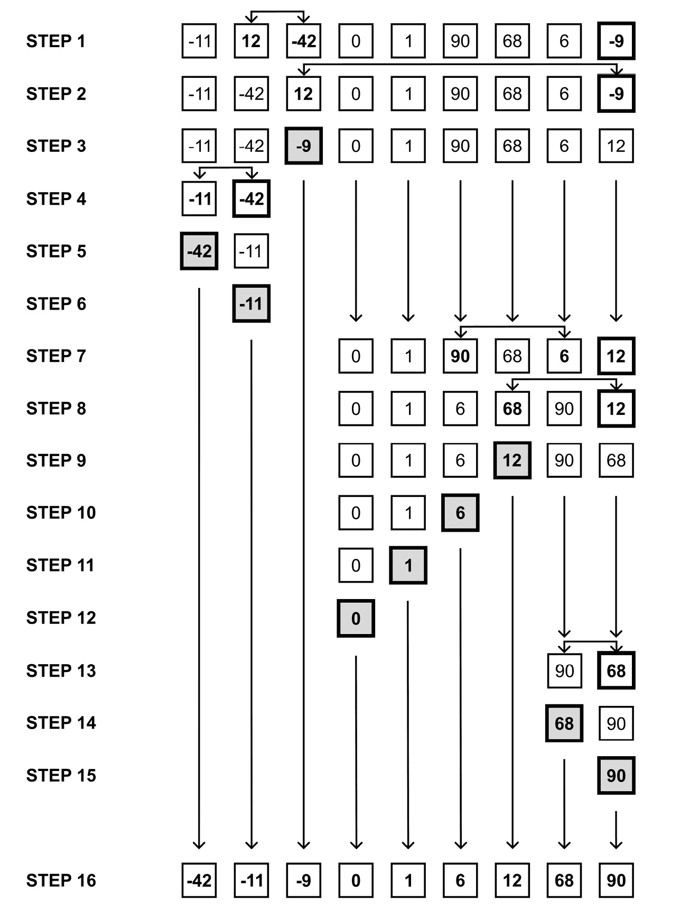

图 3.12 – 快速排序算法的示意图

在我们的情况下，假设枢轴被选为当前正在排序的子数组的最后一个元素的值。在 *步骤 1* 中，`-9` 被选为枢轴。然后，需要将 `12` 与 `-42`（*步骤 1*）以及 `12` 与 `-9`（*步骤 2*）交换，以确保只有小于枢轴的值（`-11`，`-42`）位于较低子数组中，而大于或等于枢轴的值（`0`，`1`，`90`，`68`，`6`，`12`）被放置在较高子数组中（*步骤 3*）。然后，算法对上述两个子数组进行递归调用，即（`-11`，`-42`，从 *步骤 4*）和（`0`，`1`，`90`，`68`，`6`，`12`，从 *步骤 7*），这样它们就可以像输入数组一样进行处理。

例如，*步骤 7* 显示 `12` 被选为枢轴。在分区后，子数组被分为两个其他子数组，即（`0`，`1`，`6`）和（`90`，`68`）。对于这两个子数组，选择其他枢轴元素，即 `6` 和 `68`。在执行所有剩余数组部分的此类操作后，你将得到 *步骤 16* 中显示的结果。

值得注意的是，枢轴可以在该算法的其他实现中根据不同的方式选择。现在你了解了算法的工作原理，让我们继续其实现。它并不比前面展示的例子更复杂，它使用 **递归** 来调用子数组的排序方法。主要代码如下：

```cs
void Sort(int[] a)
{
    SortPart(a, 0, a.Length - 1);
}
```

`Sort` 方法只接受一个参数，即应该排序的数组。它只是调用 `SortPart` 方法，这使得 `SortPart` 方法得以展示如下：

```cs
void SortPart(int[] a, int l, int u)
{
    if (l >= u) { return; }
    int pivot = a[u];
    int j = l - 1;
    for (int i = l; i < u; i++)
    {
        if (a[i] < pivot)
        {
            j++;
            (a[j], a[i]) = (a[i], a[j]);
        }
    }
    int p = j + 1;
    (a[p], a[u]) = (a[u], a[p]);
    SortPart(a, l, p - 1);
    SortPart(a, p + 1, u);
}
```

首先，方法检查数组（或子数组）是否至少有两个元素，通过比较 `l`（*下标*）和 `u`（*上标*）变量的值。如果不是，你将从这个方法返回。否则，你将执行分区阶段。

在这里，枢轴被选为数组（或子数组）中的最后一个元素的值，并存储为 `pivot` 变量的值。然后，使用 `for` 循环通过比较和交换元素来重新排列数组。你需要执行这个阶段以确保小于枢轴的值位于其前面，而大于或等于枢轴的值位于其后。

最后，你将枢轴值的新索引存储为 `p` 并执行交换以将其放置在那里。`p` 变量还用于计算子数组的上下界，即作为 (`l`, `p-1`) 和 (`p+1`, `u`)。然后，在递归调用 `SortPart` 方法对较低和较高部分进行排序时使用这些范围。这就是全部！

关于时间复杂度呢？它具有**O(n log(n))的平均时间复杂度，尽管最坏情况下的时间复杂度为 O(n²**)。这看起来像 Shell 排序吗？如果是这样，你就对了！你越来越接近本章的结尾了，在那里你将看到对各种排序算法进行性能测试的结果。

堆排序

我们将要介绍的最后一个方法是基于一种有趣的数据结构，称为**二叉堆**。为了给你一个简要的介绍，**它是一种基于树的结构的树，其中每个节点包含零个、一个或两个子节点**。你将在本书的后面部分了解更多关于树及其变体的内容。

你可能不会感到惊讶，这个排序解决方案被命名为**堆排序**。**首先，算法** **从数组中构建一个** **最大堆** **（执行堆化操作）。然后，它重复以下几个步骤，直到堆中只剩下一个元素：**

1.  **将第一个元素（最大值的根）与最后一个元素交换。**

1.  **从堆中移除最后一个元素（当前的最大值）。**

1.  **再次构建** **最大堆。**

通过执行这些操作，你有效地得到了排序后的数组。

由于这里需要引入一个新的数据结构，让我们看看二叉堆的样子以及算法是如何对示例数组进行排序的：

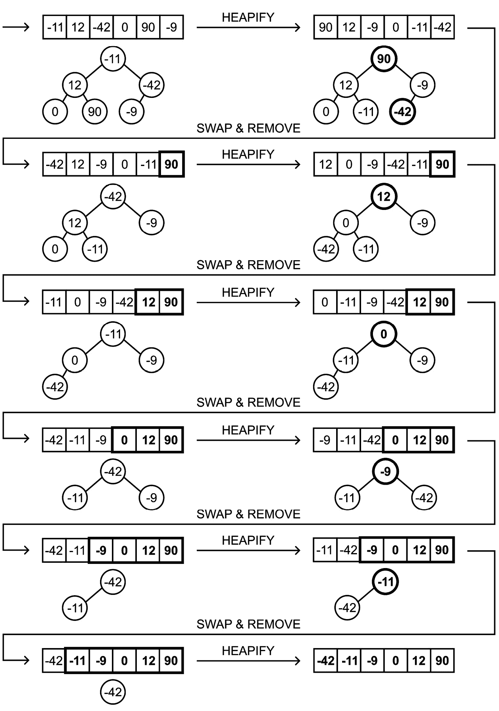

图 3.13 – 堆排序算法的示意图

输入数组由六个元素组成，即`-11`、`12`、`-42`、`0`、`90`和`-9`。你通过将第一个元素作为**根**，然后添加它的两个子节点：`12`和`-42`，从它形成二叉堆。在这个堆的级别上，你没有更多的空间，所以让我们将数组中的以下两个元素（`0`和`90`）作为子节点添加到值为`12`的节点上。数组的最后一个元素被留下。你必须将它放置在值为`-42`的节点的子节点上。正如你所看到的，你可以轻松地将一个数组映射到二叉堆数据结构，并使用数组作为数据结构来存储二叉堆的数据。

二叉堆的有趣特性

记住，在以数组表示的二叉堆中，根节点位于`array[0]`。如果你需要访问第*i*个元素的父节点数据，你可以从`array[(i-1)/2]`中获取它。第*i*个元素的左子节点和右子节点分别在`array[(2*i)+1]`和`array[(2*i)+2]`中可用。

堆排序算法中扮演重要角色的下一个操作被命名为`90`作为**根**。它包含`12`和`-9`作为节点。值为`12`的节点包含值较小的子节点，即`0`和`-11`。值为`-9`的节点只包含一个元素，这个元素也小于它，即`-42`。

最大堆不是唯一的选择

你也可以使用*heapify*操作来形成**min-heap**。它与最大堆类似，但每个节点都需要满足其子节点的值大于或等于父节点值的条件。

接下来，我们看一下前面图中的第二行。在这里，数组的最后一个元素（`90`）已经排序了。这是通过将根（之前是`90`）与数组中的最后一个元素（之前是`-42`）交换的结果。然后，你必须执行另一个*heapify*操作，并得到以`12`为*root*的最大堆。上述操作会一直重复，直到堆中只剩下一个元素。最后，你将得到前面图右下角所示的排序数组。

在这一点上，你应该准备好分析 C#语言的实现代码：

```cs
void Sort(int[] a)
{
    for (int i = a.Length / 2 - 1; i >= 0; i--)
    {
        Heapify(a, a.Length, i);
    }
    for (int i = a.Length - 1; i > 0; i--)
    {
        (a[0], a[i]) = (a[i], a[0]);
        Heapify(a, i, 0);
    }
}
```

`Sort`方法包含两个`for`循环。第一个循环执行初始的*heapify*操作，以准备*max-heap*。你可以通过多次调用`Heapify`来实现，即以相反的顺序和每个非叶子节点进行操作。然后，你将得到由数据形成的*max-heap*的数组。

第二个`for`循环会一直执行，直到堆中至少有一个元素。在每次迭代中，它将*root*元素（索引等于`0`）与最后一个元素（索引等于`i`）交换。然后，你需要通过调用`Heapify`方法来恢复*max-heap*属性，这涉及到堆的受影响部分。

现在，让我们来看看`Heapify`方法的代码：

```cs
void Heapify(int[] a, int n, int i)
{
    int max = i;
    int l = 2 * i + 1;
    int r = 2 * i + 2;
    max = l < n && a[l] > a[max] ? l : max;
    max = r < n && a[r] > a[max] ? r : max;
    if (max != i)
    {
        (a[i], a[max]) = (a[max], a[i]);
        Heapify(a, n, max);
    }
}
```

它有三个参数，即数组（`a`）、堆中的元素数量（`n`），以及一个元素的索引（`i`），它是应该*heapify*的子树的根。首先，你得到最大元素的索引（*root*，作为`max`），以及它的左子节点和右子节点（`l`和`r`，分别）。你可以根据前面提到的公式计算索引，即`2*i+1`和`2*i+2`。

在以下两行中，你检查左子节点索引（`l`）是否仍在堆中（`l<n`），以及具有该索引的元素（`a[l]`）是否大于当前根值（`a[max]`）。如果是这样，你更新根索引（`max`）。以同样的方式，你检查右子节点并调整`max`变量，如果需要的话。

在下一行，你检查在提到的操作中*root*索引是否发生了变化。如果是这样，这意味着当前的*root*不是最大值，你需要交换数组中的两个元素，即表示*root*（`i`索引）和最大值（`max`索引）。接下来，你递归地对受影响的子树执行*heapify*操作，即具有新根值的树。

在这个详细的解释之后，值得提到的是时间复杂度。在这种情况下，它非常重要，因为该方法效率高，可以在排序大型数据集合时成功使用。**时间复杂度是** **O(n log(n))**。

尽管学习了七种不同的排序算法，但请记住，还有许多其他这样的算法可供选择，包括**块排序**、**树排序**、**立方排序**、**链排序**和**循环排序**。如果你对这个主题感兴趣，我强烈建议你亲自查看它们。在此期间，让我们比较一下本章中涵盖的算法。

性能分析

要进行一些测试，你需要配置你的环境。因此，让我们首先准备运行各种排序算法的代码，使用相同的输入数组。

你还记得吗，本章中展示的每个实现都涉及`Sort`方法，它只接受一个参数（即`a`数组）？现在，你可以利用这个假设并创建一个`AbstractSort`抽象类，该类要求你在派生此类时实现此方法。

抽象类的代码如下：

```cs
public abstract class AbstractSort
{
    public abstract void Sort(int[] a);
}
```

然后，你需要为每个排序算法（如`SelectionSort`或`HeapSort`）准备一个单独的类，根据以下模板：

```cs
public class SelectionSort
    : AbstractSort
{
    public override void Sort(int[] a) { (...) }
}
```

由于所有表示排序算法的类都从基抽象类`AbstractSort`派生，你可以轻松地创建一个包含它们实例的列表：

```cs
List<AbstractSort> algorithms = new()
{
    new SelectionSort(),
    new InsertionSort(),
    new BubbleSort(),
    new MergeSort(),
    new ShellSort(),
new QuickSort(),
    new HeapSort()
};
```

代码中最有趣的部分如下所示：

```cs
for (int n = 0; n <= 100000; n += 10000)
{
    Console.WriteLine($"\nRunning tests for n = {n}:");
    List<(Type Type, long Ms)> milliseconds = [];
    for (int i = 0; i < 5; i++)
    {
        int[] array = GetRandomArray(n);
        int[] input = new int[n];
        foreach (AbstractSort algorithm in algorithms)
        {
            array.CopyTo(input, 0);
            Stopwatch stopwatch = Stopwatch.StartNew();
            algorithm.Sort(input);
            stopwatch.Stop();
            Type type = algorithm.GetType();
            long ms = stopwatch.ElapsedMilliseconds;
            milliseconds.Add((type, ms));
        }
    }
    List<(Type, double)> results = milliseconds
        .GroupBy(r => r.Type)
        .Select(r =>
            (r.Key, r.Average(t => t.Ms))).ToList();
    foreach ((Type type, double avg) in results)
    {
        Console.WriteLine($"{type.Name}: {avg} ms");
    }
}
```

在这里，你使用一个`for`循环来选择合适的`n`值，这是用于排序的输入数组的长度。你从一个包含零个元素的数组开始（`n` = `0`），并以每迭代增加`10000`的方式，直到有数十万个元素（`n` = `100000`）。`n`的值将是`0`、`10000`、`20000`、`30000`，直到`100000`。

在每次迭代中，你创建列表（`milliseconds`）的新实例。每个元素存储一个由两个元素组成的元组，即排序算法类的类型（`Type`）和执行消耗的毫秒数（`Ms`）。然后，你使用另一个`for`循环执行这样的测试`5`次。在每次测试中，你通过调用`GetRandomArray`获取一个给定大小的随机数组（`array`），它将被用作每个测试的模板。接下来，你声明并初始化输入数组（`input`）。

下一个部分涉及一个`foreach`循环，遍历所有从`AbstractSort`派生出来的类的实例。对于每一个，你通过从`array`复制元素到`input`来创建一个输入数组。然后，你开始计时并调用`Sort`方法。一旦它运行完成，你停止计时并将结果添加到`milliseconds`列表中。

代码的最后部分与计算每个排序算法的平均结果及其在控制台中的展示有关。为此，你使用一些扩展方法，例如`GroupBy`、`Select`和`Average`，以及一个`foreach`循环。

之前提到了`GetRandomArray`方法，让我们来看看它：

```cs
int[] GetRandomArray(long length)
{
    Random random = new();
    int[] array = new int[length];
    for (int i = 0; i < length; i++) 
    {
        array[i] = random.Next(-100000, 100000);
    }
    return array;
}
```

它使用`Random`类在`<-100,000, 100,000)`范围内获取一个随机整数。整个数组填充了这样的随机值。

到目前为止，你的环境已经准备就绪，你可以进行测试！所以，让我们运行代码并查看结果。我得到了以下值：

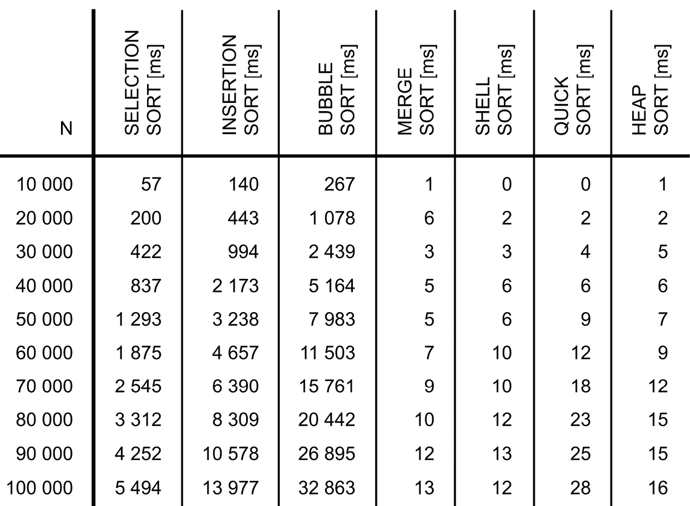

图 3.14 – 分析排序算法性能的结果

除了表格及其数据之外，让我们看看图表：

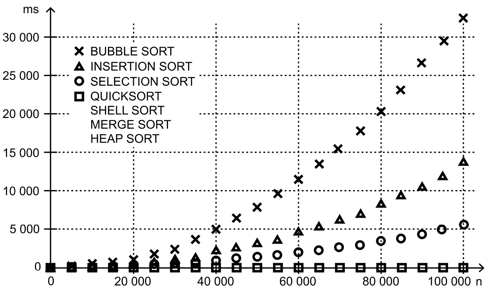

图 3.15 – 排序算法性能结果的比较

如你所见，最差的结果是冒泡排序，然后是插入排序和选择排序算法。对于包含 10 万个元素的数组，它们需要几乎 33 秒（冒泡排序）、几乎 14 秒（插入排序）和超过 5 秒（选择排序）。与归并排序、希尔排序、快速排序和堆排序的结果相比，这些值看起来非常高。这些算法需要 12 到 28 毫秒！这看起来令人惊讶吗？如果你回想一下时间复杂度，就不应该感到惊讶。

让我们记住所提及算法的平均时间复杂度：

+   *O(n²)*：选择排序、插入排序和冒泡排序

+   *O(n log(n))*：归并排序、希尔排序、快速排序和堆排序

哦，所以这样的时间复杂度确实很重要！ ;-) 如果你之前有任何怀疑，现在是时候注意你在应用中使用的算法了。你应该仔细选择它们，并优化解决方案以处理需要处理的各种数据量。

不要忘记性能

重视性能不仅对排序操作重要，对你在移动应用、Web 应用、API 和长时间运行的后台服务中进行的所有操作都很重要。让我们尝试编写高效的代码，并通过满足功能需求以及关注非功能需求（如与性能相关的需求）来测试它。

在之前的图表中，你几乎看不到任何关于具有*O(n log(n))*时间复杂度的算法的数据，所以让我们准备另一组测试。现在，你只能选择这些算法，并将最大数*n*增加到一百万！你可以在以下图表中看到我的结果：

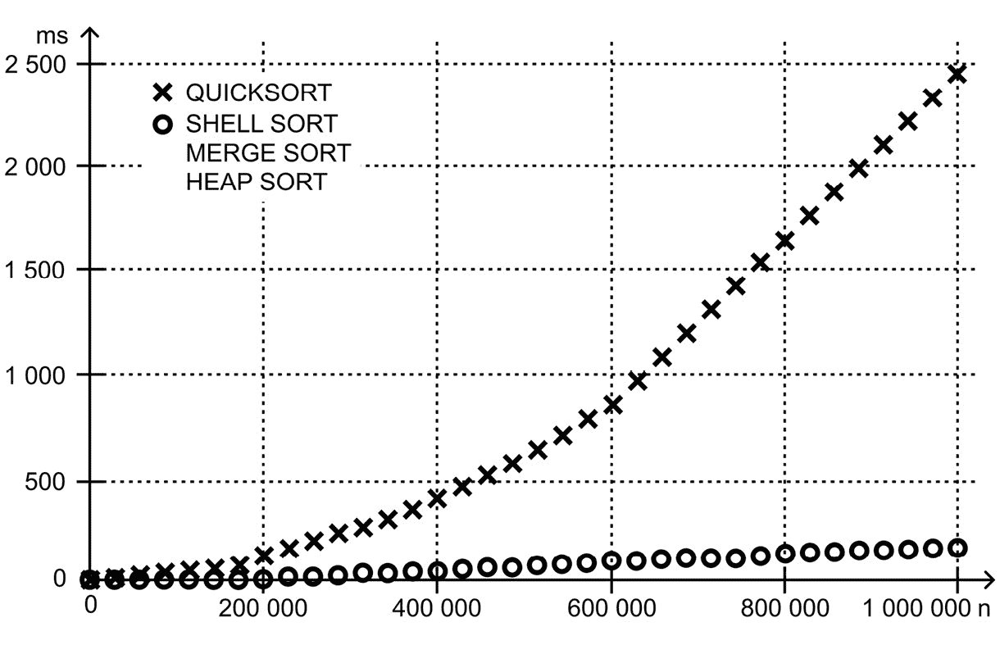

图 3.16 – 排序算法性能结果的比较

这里有一些差异，尤其是在快速排序和其他排序算法（如希尔排序、归并排序和堆排序）之间。然而，这种变化只有在相当大的输入大小下才能看到，并且可能由实现细节引起。所有具有 *O(n log(n))* 时间复杂度的排序算法都是排序的良好解决方案，可以处理各种数量的数据。还值得注意的是，这些结果是在我的设备上获得的，所以你可能得到不同的结果。然而，接收到的已过毫秒数之间的关系应该是一致的。

摘要

数组是开发各种类型的应用程序（如移动、Web 或分布式应用程序）时最常用的数据结构之一。然而，这个话题并不像看起来那么简单，因为即使是数组也可以分为几种变体，即**一维**和**多维**，例如二维和三维，以及**锯齿数组**，也称为数组数组。

在讨论数组时，不要忘记**排序算法**，这是与这种数据结构一起使用最流行的算法之一。有大量的排序算法，它们在概念、应用、实现细节和性能结果上都有所不同。在本章中，你学习了七种不同的排序算法，即**选择排序**、**插入排序**、**冒泡排序**、**归并排序**、**希尔排序**、**快速排序**和**堆排序**。每种算法都进行了描述，并在图中进行了可视化，并以 C# 代码编写。

在本章结束时，你看到了时间复杂性的重要性以及它在使用不同计算复杂性的算法（如 *O(n²)* 和 *O(n log(n))*) 时对**性能结果**的影响有多大。你学习了如何准备一个简单的性能测试环境并运行它们以获取结果。这些结果随后在表格以及图表中展示，并附有解释。

你准备好学习其他数据结构了吗？如果是的话，请继续阅读下一章，在那里你将学习关于各种**列表变体**的内容，包括简单、泛型、排序的，以及单链、双链和循环链。你将看到它们的实现和一些如何在现实世界例子中使用它们的示例。

```cs

```

```cs

```

```cs

```

```cs

```

```cs

```

```cs

```

```cs

```

```cs

```

```cs

```

```cs

```

```cs

```
