# 5

# 栈和队列

到目前为止，您已经学到了很多关于数组和列表的知识。然而，这些结构并不是唯一可用的。在其他结构中，还有一组更专业的数据结构，称为 **有限访问** **数据结构**。

这是什么意思？为了解释这个名称，让我们暂时回到数组的话题，数组属于 **随机访问数据结构** 的组。它们之间的区别只有一个词 - 那就是有限或随机。如您所知，数组允许您存储数据，并使用索引访问各种元素。因此，您可以从数组中轻松获取第一个、中间的、第 *n* 个或最后一个元素。因此，它可以被称为随机访问数据结构。

然而，“有限”是什么意思？答案是简单的。在有限访问数据结构中，**您不能从结构中访问每个元素**。因此，**获取元素的方式是严格指定的**。例如，您只能获取第一个或最后一个元素，但不能从数据结构中获取第 *n* 个元素。有限访问数据结构的流行代表是栈和队列，这些是本章中提到的主题。

您将看到栈的应用，以及队列的一些变体，包括普通队列、优先队列和循环队列。为了使理解更加容易，文本配有插图和带有详细解释的代码片段。

本章将涵盖以下主题：

+   栈

+   队列

+   优先队列

+   循环队列

# 栈

首先，让我们来谈谈 **栈**。它是一种数据结构，允许您 **只在顶部添加新元素**（称为 **push** 操作）和 **通过从顶部移除元素来获取元素**（pop 操作）。因此，栈符合 **LIFO** 原则，即 **后进先出**。

想象一个栈

如果您想更好地可视化栈，让我们暂时合上书本，去厨房看看一堆盘子，每个盘子都放在另一个盘子的上面。您只能将新盘子放在堆的顶部，您也只能从堆的顶部取盘子。您不能在不取掉顶部前六个盘子的情况下取走第七个盘子，您也不能在盘子堆的中间添加盘子。所以，最后添加的盘子（后进先出）将首先从盘子堆中取出。而且，甚至不要尝试从盘子堆的中间取盘子，因为您不想打碎盘子！栈的操作方式类似。它允许您只在顶部添加新元素（push 操作）并且只能通过从顶部移除元素来获取元素（pop 操作）。

如下所示是带有 *push* 和 *pop* 操作的栈的图示：

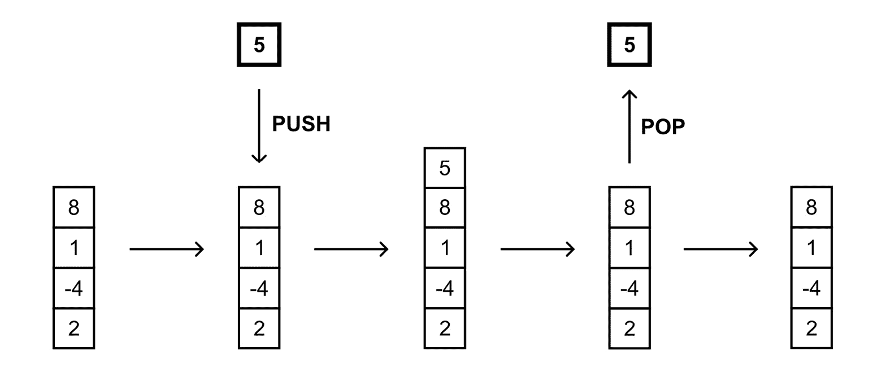

图 5.1 – 栈的示意图

这似乎很简单，不是吗？确实如此，您可以通过使用内置的泛型`Stack`类来享受堆栈的各种功能。值得记住的是，它位于`System.Collections.Generic`命名空间中。

让我们提及这个类中的三个方法：

+   `Push`在堆栈顶部插入一个元素

+   `Pop`从堆栈顶部移除一个元素并返回它

+   `Peek`返回堆栈顶部的元素而不移除它

您还可以访问其他方法，例如从堆栈中移除所有元素（`Clear`）或检查给定元素是否在堆栈中可用（`Contains`）。您可以使用`Count`属性获取当前堆栈中的元素数量。

关于性能如何？

值得注意的是，`Push`方法要么是*O(1)*操作，如果容量不需要增加，否则是*O(n)*，其中*n*是堆栈中的元素数量。`Pop`和`Peek`都是*O(1)*操作。

由于时间复杂度看起来非常有前景，现在是时候看看一些展示堆栈实际应用的示例了。

哪里可以找到更多信息？

您可以在[`learn.microsoft.com/en-us/dotnet/api/system.collections.generic.stack-1`](https://learn.microsoft.com/en-us/dotnet/api/system.collections.generic.stack-1)找到有关堆栈的内容

## 示例 – 反转一个单词

对于第一个示例，让我们尝试使用堆栈来反转一个单词。您可以通过遍历形成字符串的字符，将每个字符添加到堆栈顶部，然后移除堆栈中的所有元素来实现这一点。最后，您将收到反转后的单词，如下面的图表示例所示，如何反转`MARCIN`：

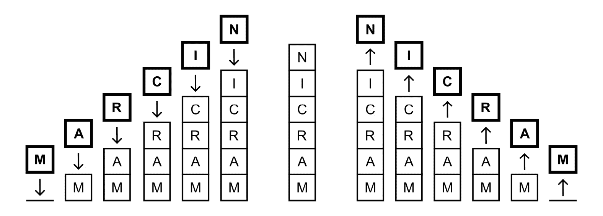

图 5.2 – 反转单词示例的说明

以下代码片段展示了实现：

```cs
string text = "MARCIN";
Stack<char> chars = new();
foreach (char c in text) { chars.Push(c); }
while (chars.Stack class is created. In this scenario, the stack can contain only char elements. Then, you iterate through all characters using a foreach loop and insert each character at the top of the stack by calling the Push method. The remaining part of the code consists of a while loop, which is executed until the stack is empty. This condition is checked using the Count property. In each iteration, the top element is removed from the stack (by calling Pop) and written in the console (using the Write static method of the Console class).
After running the code, you will receive the following result:

```

NICRAM

```cs

 Example – Tower of Hanoi
The next example is a significantly more complex application of stacks. It is related to the mathematical game *Tower of Hanoi*. The game requires three rods, onto which you can put discs. Each disc has a different size. At the beginning, all discs are placed on the first rod, forming a stack, ordered from the smallest (at the top) to the biggest (at the bottom). It is presented in the following diagram (on the left):
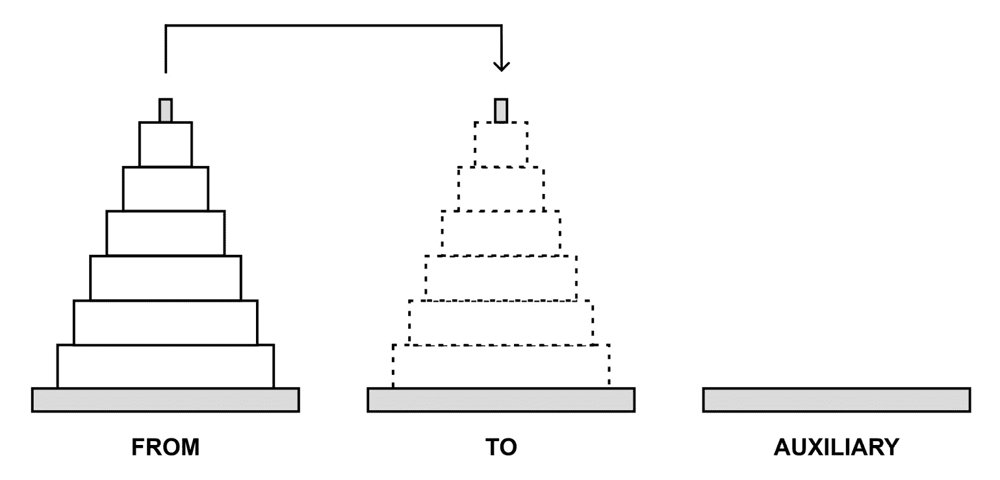

Figure 5.3 – Illustration of the Tower of Hanoi example
The aim of the game is to `FROM`) `TO`). However, during the whole game, you **cannot place a bigger disc on a smaller one**. Moreover, you **can only move one disc at a time**, and, of course, you **can only take a disc from the top of** **any rod**.
How could you move discs between the rods to comply with the aforementioned rules? The problem can be divided into sub-problems:

*   `FROM` to `TO`, without using the `AUXILIARY` rod.
*   `FROM` to `AUXILIARY`. Then, you move the remaining disc from `FROM` to `TO`. At the end, you move a disc from `AUXILIARY` to `TO`.
*   `FROM` to `AUXILIARY`, using the mechanism described earlier. The operation involves `TO` as the auxiliary rod. Then, you move the remaining disc from `FROM` to `TO`, and then move two discs from `AUXILIARY` to `TO`, using `FROM` as the auxiliary rod.

As you can see, you can solve the problem of `FROM` to `AUXILIARY`, using `TO` as the auxiliary rod. Then, you should move the remaining disc from `FROM` to `TO`. At the end, you just need to move *n-1* discs from `AUXILIARY` to the `TO` rod, using `FROM` as the auxiliary rod.
Now that you know the basic rules, let’s proceed to the code. First, let’s focus on the `Game` class, which contains the logic related to the game:

```

public class Game

{

public Stack<int> From { get; private set; }

public Stack<int> To { get; private set; }

public Stack<int> Auxiliary { get; private set; }

public int DiscsCount { get; private set; }

public int MovesCount { get; private set; }

public event EventHandler<EventArgs>? MoveCompleted;

}

```cs

 The class contains five properties, representing the following:

*   Three rods (`From`, `To`, `Auxiliary`)
*   The overall number of discs (`DiscsCount`)
*   The number of performed moves (`MovesCount`)

The `MoveCompleted` event is declared as well. It is fired after each move to inform that the user interface should be refreshed. Therefore, you can show the proper content, illustrating the current state of the rods.
Apart from the properties and the event, the class also has the following constructor:

```

public Game(int discsCount)

{

DiscsCount = discsCount;

From = new Stack<int>();

To = new Stack<int>();

Auxiliary = new Stack<int>();

for (int i = 0; i < discsCount; i++)

{

int size = discsCount - i;

From.Push(size);

}

}

```cs

 The constructor takes only one parameter, namely the number of discs (`discsCount`), and sets it as a value of the `DiscsCount` property. Then, new instances of the `Stack` class are created, and references to them are stored in the `From`, `To`, and `Auxiliary` properties. At the end, a `for` loop is used to create the necessary number of discs and to add elements to the first stack (`From`), using the `Push` method.
It is worth noting that `From`, `To`, and `Auxiliary` stacks only store integer values (`Stack<int>`). Each integer value represents the size of a particular disc. Such data is crucial due to the rules of moving discs between rods.
One of the most interesting and important parts of the code is the `MoveAsync` recursive method. It takes four parameters, namely the number of discs and references to three stacks. However, what happens in the `MoveAsync` method? Let’s look inside:

```

public async Task MoveAsync(int discs, Stack<int> from,

Stack<int> to, Stack<int> auxiliary)

{

if (discs == 0) { return; }

await MoveAsync(discs - 1, from, auxiliary, to);

to.Push(from.Pop());

MovesCount++;

MoveCompleted?.Invoke(this, EventArgs.Empty);

await Task.Delay(250);

await MoveAsync(discs - 1, auxiliary, to, from);

}

```cs

 As `MoveAsync` is called recursively, it is necessary to specify an exit condition to prevent the method from being called infinitely. In this case, the method will not call itself when the value of the `discs` parameter is equal to `0`.
Otherwise, the `MoveAsync` method is called, but the order of stacks is changed. Then, the element is removed from the stack represented by the second parameter (`from`), and inserted at the top of the stack represented by the third parameter (`to`).
In the following lines, the number of moves (`MovesCount`) is incremented and the `MoveCompleted` event is fired. It is responsible for refreshing the user interface. Then, the algorithm stops for 250 milliseconds to show the following steps of the operation in a way well visible to a user.
At the end, the `MoveAsync` method is called again, with another configuration of rod order. By calling this method several times, the discs will be moved from the first (`From`) rod to the second (`To`) rod. The operations performed in the `MoveAsync` method are consistent with the description of the problem of moving *n* discs between rods, as explained in the introduction to this example.
When the class with the logic regarding the *Tower of Hanoi* game is created, let’s see how to create a user interface that allows you to present the following moves of the algorithm. Such a task is accomplished by the `Visualization` class:

```

public class Visualization

{

private readonly Game _game;

private readonly int _columnSize;

private readonly char[,] _board;

public Visualization(Game game)

{

_game = game;

_columnSize = Math.Max(6,

`GetDiscWidth(_game.DiscsCount) + 2);`

`_board = new char[_game.DiscsCount,`

`_columnSize * 3];`

}

}

```cs

 It contains three private fields, namely storing a reference to data of the game (`_game`), the number of characters to present a single rod (`_columnSize`), as well as a two-dimensional array with visualization of all rods, shown in the console (`_board`). The constructor takes only one parameter and sets values for all private fields.
Column size is calculated using the `GetDiscWidth` auxiliary method:

```

`private int Show, which is shown next:

```cs
public void Show(Game game)
{
    Console.Clear();
    if (game.DiscsCount <= 0) { return; }
    FillEmptyBoard();
    FillRodOnBoard(1, game.From);
    FillRodOnBoard(2, game.To);
    FillRodOnBoard(3, game.Auxiliary);
    Console.WriteLine(Center("FROM")
        + Center("TO") + Center("AUXILIARY"));
    DrawBoard();
    Console.WriteLine($"\nMoves: {game.MovesCount}");
    Console.WriteLine($"Discs: {game.DiscsCount}");
}
```

该方法通过调用`Clear`方法清除控制台当前内容。然后，它调用`FillEmptyBoard`和`FillRodOnBoard`方法来清除控制台应显示的内容，然后使用`FillRodOnBoard`的每次调用填充杆的当前状态数据。接下来，显示每个杆的标题，绘制板，以及写入移动次数和圆盘数。

要清除板的内容，只需遍历二维数组中的所有元素，并将每个项目的值设置为空格，如下所示：

```cs
private void FillEmptyBoard()
{
    for (int y = 0; y < _board.GetLength(0); y++)
    {
        for (int x = 0; x < _board.GetLength(1); x++)
        {
            _board[y, x] = ' ';
        }
    }
}
```

如果你想了解如何填充与特定杆相关的二维数组部分，让我们看看`FillRodOnBoard`的代码：

```cs
private void FillRodOnBoard(int column, Stack<int> stack)
{
    int discsCount = _game.DiscsCount;
    int margin = _columnSize * (column - 1);
    for (int y = 0; y < stack.Count; y++)
    {
        int size = stack.ElementAt(y);
        int row = discsCount - (stack.Count - y);
        int columnStart = margin + discsCount - size;
        int columnEnd = columnStart + GetDiscWidth(size);
        for (int x = columnStart; x <= columnEnd; x++)
        {
            _board[row, x] = '=';
        }
    }
}
```

首先，计算左边界以在整体数组中正确部分添加数据 - 也就是说，在正确的列范围内。方法的主要部分是`for`循环，其中迭代次数等于堆栈中放置的圆盘数量。在每次迭代中，使用`ElementAt`扩展方法（来自`System.Linq`命名空间）读取当前圆盘的大小。接下来，计算圆盘应显示的行索引，以及列的起始和结束索引。最后，使用`for`循环在数组中适当位置插入等号（`=`）。

其中一个辅助方法是`Center`。它的目的是在传递给参数的文本前后添加额外的空格，以在列中居中文本：

```cs
private string Center(string text)
{
    int margin = (_columnSize - text.Length) / 2;
    return text.PadLeft(margin + text.Length)
        .PadRight(_columnSize);
}
```

最后使用的方法命名为`DrawBoard`。它简单地遍历二维数组中的所有元素，并在控制台中写入内容。代码如下所示：

```cs
private void DrawBoard()
{
    for (int y = 0; y < _board.GetLength(0); y++)
    {
        string line = string.Empty;
        for (int x = 0; x < _board.GetLength(1); x++)
        {
            line += _board[y, x];
        }
        Console.WriteLine(line);
    }
}
```

最后，让我们看看位于`Program.cs`文件中的主要代码：

```cs
Game game = new(10);
Visualization vis = new(game);
game.MoveCompleted += (s, e) => vis.Show((Game)s!);
await game.MoveAsync(game.DiscsCount,
    Game class is created. The parameter indicates that 10 discs are used. In the next line, you create a new instance of the Visualization class responsible for showing the following steps of the game. You also specify that the Show method is called when the MoveCompleted event is fired. Finally, you call the MoveAsync method to start moving discs between rods.
You already added the necessary code to run the *Tower of Hanoi* mathematical game. Let’s launch the application and see it in action! Just after starting the program, you see that all discs are located in the first rod (`FROM`). In the next step, the smallest disc is moved from the top of the first rod (`FROM`) to the top of the third rod (`AUXILIARY`), as shown in the following screenshot:
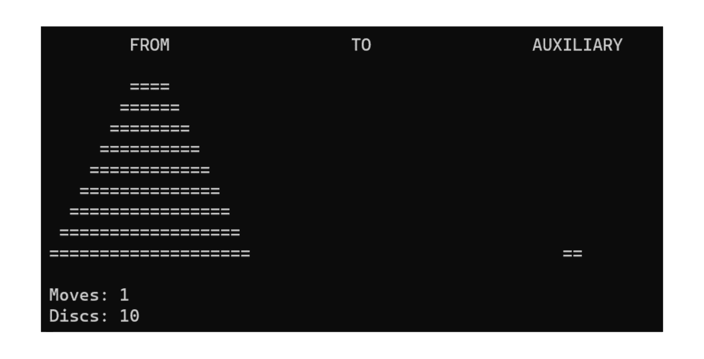

Figure 5.4 – The second step in the Tower of Hanoi example
While making many other moves in the program, you can see how discs are moved between all three rods. One of the intermediate steps is as follows:
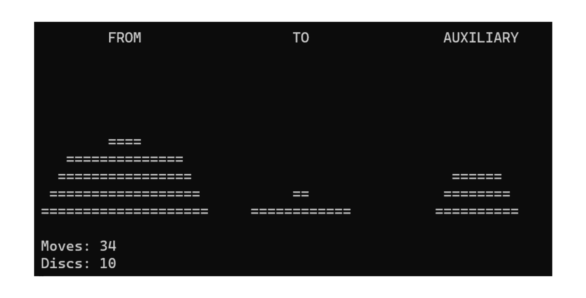

Figure 5.5 – One of the intermediate steps in the Tower of Hanoi example
When the necessary moves are completed, all discs are moved from the first rod (`FROM`) to the second one (`TO`). The final result is presented next:
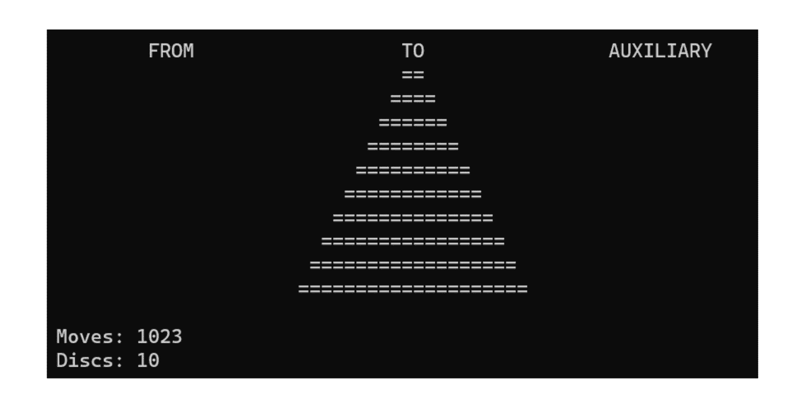

Figure 5.6 – Final step in the Tower of Hanoi example
Finally, it is worth mentioning the number of moves necessary to complete the *Tower of Hanoi* game. In the case of 10 discs, the number of moves is 1,023\. If you use only 3 discs, the number of moves is 7\. Generally speaking, **the number of moves can be calculated with the formula** **2**n**-1**, where *n* is the number of discs.
That’s all! In this section, you learned the first limited access data structure, namely a stack. Now, it is high time that you get to know more about queues.
Queues
A **queue** is a data structure that allows you **to add a new element only at the end of the queue** (referred to as an **enqueue** operation) and **to get an element only from the beginning of the queue** (a **dequeue** operation). For this reason, a queue is consistent with the **FIFO** principle, which stands for **First-In First-Out**.
Imagine a queue
If you want to better imagine a queue, let’s take a break from learning data structures and algorithms, wear your favorite jacket, and go to a shop in the vicinity. You buy your favorite ice cream, and you see five people waiting for checkout. Oh no... You are the last one, so you need to wait until the first, second, third, fourth, and fifth person pay. These lines in shops can be frustrating! In general, new people stand at the end of the line, and the next person is taken to the checkout from the beginning of the line. No one is allowed to choose a person from the middle and serve them in a different order. The queue data structure operates similarly. You can only add new elements at the end of the queue and remove an element from the beginning of the queue. So, people who come first (first-in) are served at the beginning (first-out).
The operation of a queue is presented in the following diagram:
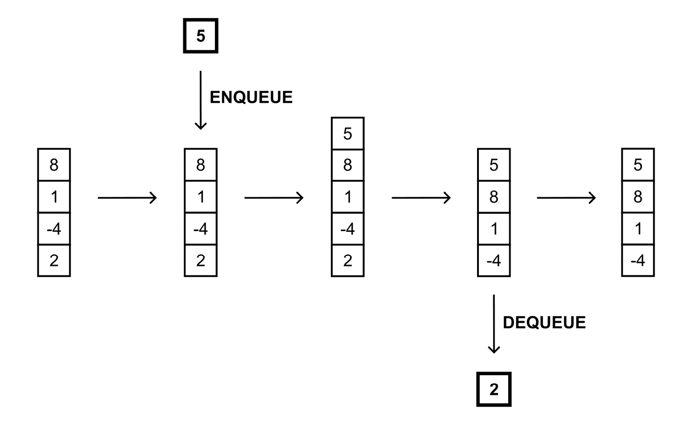

Figure 5.7 – Illustration of a queue
It is worth mentioning that a queue is a **recursive data structure**, similar to a stack. This means that **a queue can be either empty or consists of the first element and the rest of the queue, which also forms a queue**. Let’s take a look at the following diagram, where the beginning of the queue is marked with a bold line:
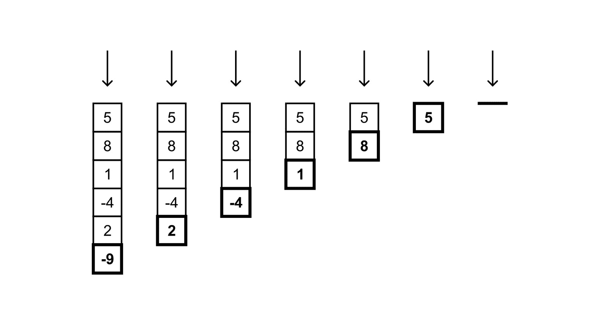

Figure 5.8 – A queue as a recursive data structure
The queue data structure seems to be very easy to understand, as well as being similar to a stack, apart from the way of removing an element. Does this mean that you can also use a built-in class to use a queue in your programs? Fortunately, yes! The available generic class is `Queue` from the `System.Collections.Generic` namespace.
Where can you find more information?
You can find content regarding a queue at [`learn.microsoft.com/en-us/dotnet/api/system.collections.generic.queue-1`](https://learn.microsoft.com/en-us/dotnet/api/system.collections.generic.queue-1).
The `Queue` class contains the following set of methods:

*   `Enqueue` adds an element at the end of the queue
*   `Dequeue` removes an element from the beginning of the queue and returns it
*   `Peek` returns an element from the beginning of the queue without removing it
*   `Clear` removes all elements from the queue
*   `Contains` checks whether the queue contains the given element

The `Queue` class also contains the `Count` property, which returns the total number of elements located in the queue. It can be used to check whether the queue is empty.
What about the performance?
It is worth mentioning that the `Enqueue` method is either an *O(1)* operation, if the internal array does not need to be reallocated, or *O(n)* otherwise, where *n* is the number of elements in the queue. Both `Dequeue` and `Peek` are *O(1)* operations.
The great performance results are supported by a very easy application of this data structure, as shown in the following part of the code:

```

`List<int> items = [2, -4, 1, 8, 5];`

`Queue<int> queue = new();`

`items.ForEach(queue.Enqueue);`

`while (queue.Count > 0)`

{

`Console.WriteLine(queue.Dequeue());`

}

```cs

 Here, you create a new list and a queue containing only integer values. Then, you add all elements from the list to the queue, using the `Enqueue` method. At the end, you use a `while` loop to dequeue all the elements, using the `Dequeue` method.
It is worth noting that in the third line, you do not use the lambda expression and simply use the name of the method. Of course, you can use the following form instead:

```

`items.ForEach(ConcurrentQueue generic class from the System.Collections.Concurrent namespace. This class contains a set of built-in methods to perform various operations on the queue, such as the following:

+   `Enqueue`将一个元素添加到队列的末尾

+   `TryDequeue`尝试从开始移除一个元素并返回它

+   `TryPeek`尝试从开始返回一个元素而不移除它

`TryDequeue`和`TryPeek`都有带有`out`关键字的参数。如果操作成功，此类方法返回`true`，并将结果作为`out`参数的值返回。此外，`ConcurrentQueue`类还包含两个属性，即`Count`用于获取存储在集合中的元素数量，以及`IsEmpty`用于返回一个值，指示队列是否为空。

哪里可以找到更多信息？

你可以在[`learn.microsoft.com/en-us/dotnet/api/system.collections.concurrent.concurrentqueue-1`](https://learn.microsoft.com/en-us/dotnet/api/system.collections.concurrent.concurrentqueue-1)找到有关`ConcurrentQueue`类的相关内容。

在这个简短的介绍之后，让我们来看两个例子，这两个例子代表了呼叫中心环境中的队列，其中有许多客户和一位或多位顾问。

示例 – 单顾问呼叫中心

这个第一个例子代表了对呼叫中心解决方案的简单方法，其中有许多**客户**（具有不同的标识符），以及**仅有一位顾问**，他按照来电出现的顺序回答等待的电话。

下一个场景如下所示：

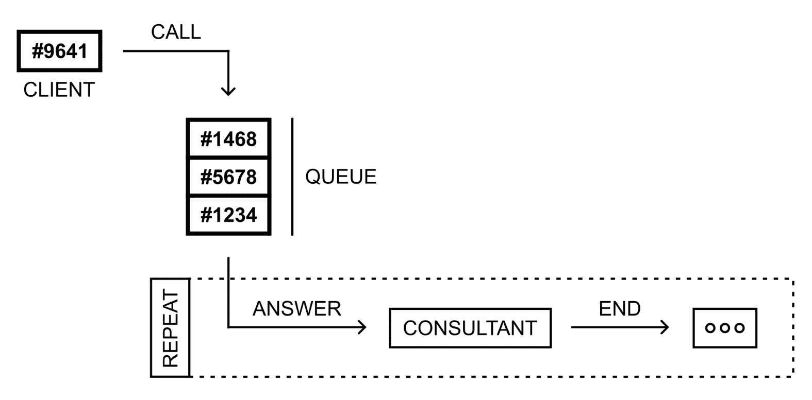

图 5.9 – 单顾问呼叫中心示例的说明

如前图所示，客户执行了四个呼叫。它们被添加到等待电话的队列中，即来自客户`#1234`、`#5678`、`#1468`和`#9641`。当顾问可用时，他们会接听电话。当通话结束时，顾问可以接听下一个等待的电话。根据这个规则，顾问将与客户按以下顺序交谈：**#1234**、**#5678**、**#1468**和**#9641**。

让我们来看看第一个类的代码，名为`IncomingCall`，它代表客户执行的单个来电。其代码如下：

```cs
public class IncomingCall
{
    public int Id { get; set; }
    public int ClientId { get; set; }
    public DateTime CallTime { get; set; }
    public DateTime? AnswerTime { get; set; }
    public DateTime? EndTime { get; set; }
    public string? Consultant { get; set; }
}
```

该类包含六个属性，代表一个呼叫的唯一标识符（`Id`）、客户标识符（`ClientId`）、呼叫开始时的日期和时间（`CallTime`）、回答时的日期和时间（`AnswerTime`）、结束时的日期和时间（`EndTime`），以及顾问的姓名（`Consultant`）。

代码中最重要的一部分与`CallCenter`类相关，它代表与呼叫相关的操作。其片段如下：

```cs
public class CallCenter
{
    private int _counter = 0;
    public Queue<IncomingCall> Calls { get; private set; }
    public CallCenter() =>
        Calls = new Queue<IncomingCall>();
}
```

`CallCenter`类包含一个`_counter`字段，其标识符为最后一个呼叫，等于迄今为止的呼叫数量。该类还有一个`Calls`属性，代表一个队列（包含`IncomingCall`实例），其中存储了等待电话的数据。在构造函数中，创建了一个新的`Queue`泛型类实例，并将其引用分配给`Calls`属性。

当然，该类还包含一些方法，例如具有以下代码的`Call`方法：

```cs
public IncomingCall Call(int clientId)
{
    IncomingCall call = new()
    {
        Id = ++_counter,
        ClientId = clientId,
        CallTime = DateTime.Now
    };
    Calls.Enqueue(call);
    return call;
}
```

在这里，你创建`IncomingCall`类的新实例并设置其属性的值，即其标识符（包括预增量`_counter`字段），客户标识符（使用`clientId`参数），以及呼叫时间。通过调用`Enqueue`方法将创建的实例添加到队列中并返回。

下一个方法是 `Answer`。它表示从等待时间最长的队列中接听电话的操作。这样的电话由队列开头的元素表示。`Answer` 方法如下所示：

```cs
public IncomingCall? Answer(string consultant)
{
    if (!AreWaitingCalls()) { return null; }
    IncomingCall call = Calls.Dequeue();
    call.Consultant = consultant;
    call.AnswerTime = DateTime.Now;
    return call;
}
```

在此方法中，你检查队列是否为空。如果是，则方法返回 `null`，这意味着没有电话可以被顾问接听。否则，电话将从队列中移除（使用 `Dequeue` 方法），并通过设置顾问的姓名（使用 `consultant` 参数）和接听时间（到当前日期和时间）来更新其属性。最后，返回电话的数据。

除了 `Call` 和 `Answer` 方法之外，你还实现了 `End` 方法，该方法在顾问结束与特定客户的通话时被调用。在这种情况下，你只需设置结束时间，如下所示：

```cs
public void End(IncomingCall call)
    => call.EndTime = DateTime.Now;
```

`CallCenter` 类中的最后一个方法是名为 `AreWaitingCalls` 的方法。它返回一个值，表示队列中是否有等待的电话，使用 `Queue` 类的 `Count` 属性。其代码如下：

```cs
public bool Program.cs file and its code:

```

Random random = new();

CallCenter center = new();

center.Call(1234);

center.Call(5678);

center.Call(1468);

center.Call(9641);

while (center.AreWaitingCalls())

{

IncomingCall call = center.Answer("Marcin")!;

记录($"电话 #{call.Id} 来自客户 #{call.ClientId}

接听 by {call.Consultant}.");

await Task.Delay(random.Next(1000, 10000));

center.End(call);

记录($"电话 #{call.Id} 来自客户 #{call.ClientId}

结束 by {call.Consultant}.");

}

```cs

 You create a new instance of the `Random` class (for getting random numbers), as well as an instance of the `CallCenter` class. Then, you simulate making a few calls by clients, namely with the following identifiers: `1234`, `5678`, `1468`, and `9641`. The most interesting part of the code is located in the `while` loop, which is executed until there are no waiting calls in the queue. Within the loop, the consultant answers the call (using the `Answer` method) and a log is generated (using the `Log` auxiliary method). Then, you wait for a random number of milliseconds (between `1000` and `10000`) to simulate the various lengths of a call. When this has elapsed, the call ends (by calling the `End` method), and a proper log is generated.
The last part of the code necessary for this example is the `Log` method:

```

void Log(string text) =>

控制台输出($"[{DateTime.Now:HH:mm:ss}] {text}");

```cs

 When you run the example, you will receive a result similar to the following:

```

[13:10:53] 来自客户 #1234 的电话 #1 由 Marcin 接听。

[13:10:56] 来自客户 #1234 的电话 #1 由 Marcin 结束。

[13:10:56] 来自客户 #5678 的电话 #2 由 Marcin 接听。

[13:10:59] 来自客户 #5678 的电话 #2 由 Marcin 结束。

[13:10:59] 来自客户 #1468 的电话 #3 由 Marcin 接听。

[13:11:06] 来自客户 #1468 的电话 #3 由 Marcin 结束。

[13:11:06] 来自客户 #9641 的电话 #4 由 Marcin 接听。

[13:11:09] 来自客户 #9641 的电话 #4 由 Marcin 结束。

```cs

 Congratulations! You just completed the first example regarding a queue data structure. If you want to learn more about the thread-safe version of the queue-related class, let’s proceed to the next example.
Example – call center with many consultants
The example shown in the preceding section was intentionally simplified to make understanding a queue much simpler. However, it is high time you make it more related to real-world problems. In this section, you will see how to expand it to support many consultants, as shown in the following diagram:
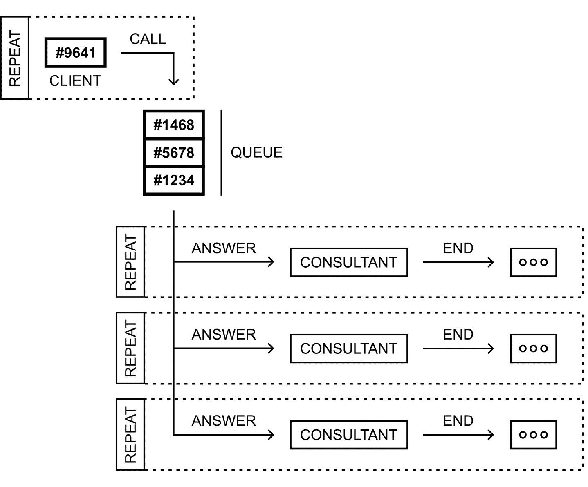

Figure 5.10 – Illustration of the call center with many consultants example
What is important is that both clients and consultants operate at the same time. If there are more incoming calls than available consultants, a new call will be added to the queue and will wait until there is a consultant who can answer the call. If there are too many consultants and few calls, the consultants will wait for a call. To perform this task, you create a few threads, which access the queue. Therefore, you use a thread-safe version of the queue, namely the `ConcurrentQueue` class.
Let’s take a look at the code! First, you need to declare an `IncomingCall` class, the code of which is exactly the same as in the previous example. Various modifications are necessary in the `CallCenter` class, as presented next:

```

using System.Collections.Concurrent;

public class CallCenter

{

private int _counter = 0;

public ConcurrentQueue<IncomingCall> Calls

{ get; private set; }

public CallCenter() => Calls =

new ConcurrentQueue<IncomingCall>();

}

```cs

 As the `Enqueue` method is available in both the `Queue` and `ConcurrentQueue` classes, no changes are necessary in the `Call` method.
However, the `Dequeue` method does not exist in `ConcurrentQueue`. For this reason, you need to modify the `Answer` method to use the `TryDequeue` method. It returns a value indicating whether the element is removed from the queue. The removed element is returned using the `out` parameter, as shown next:

```

public IncomingCall? Answer(string consultant)

{

if (!Calls.IsEmpty

&& Calls.TryDequeue(out IncomingCall? call))

{

call.Consultant = consultant;

call.AnswerTime = DateTime.Now;

return call;

}

return null;

}

```cs

 You can also slightly modify the `AreWaitingCalls` method to use the `IsEmpty` property instead of `Count`, presented as follows:

```

public bool AreWaitingCalls() => CallCenter 类。然而，还需要在 Program.cs 中的代码进行更多更改，如下所示：

```cs
Random random = new();
CallCenter center = new();
Parallel.Invoke(
  () => Clients(center),
  () => Consultant(center, "Marcin", ConsoleColor.Red),
  () => Consultant(center, "James", ConsoleColor.Yellow),
  () => CallCenter instance, you start execution of four actions, namely representing clients and three consultants, using the Invoke static method of the Parallel class from the System.Threading.Tasks namespace. The lambda expressions are used to specify methods that are called, namely Clients for client-related operations and Consultant for consultant-related tasks. You also specify additional parameters, such as a name and a color for a given consultant.
The `Clients` method represents operations performed cyclically by many clients. Its code is shown in the following block:

```

void Clients(CallCenter center)

{

while (true)

{

int clientId = random.Next(1, 10000);

IncomingCall call = center.Call(clientId);

记录($"来电 #{call.Id}

from client #{clientId}");

记录($"等待队列中的电话：

{center.Calls.Count}");

Thread.Sleep(random.Next(500, 2000));

}

}

```cs

 Within the `while` loop, you get a random number as an identifier of a client (`clientId`), and the `Call` method is called. The client identifier is logged, together with the number of waiting calls. At the end, the client-related thread is suspended for a random number of milliseconds in the range between 500 ms and 2,000 ms, to simulate the delay between another call made by the next client.
The following method is named `Consultant` and is executed on a separate thread for each consultant. The method takes three parameters, namely an instance of `CallCenter`, as well as a name and color for the consultant. The code is as follows:

```

void Consultant(CallCenter center, string name,

ConsoleColor color)

{

while (true)

{

Thread.Sleep(random.Next(500, 1000));

IncomingCall? call = center.Answer(name);

if (call == null) { continue; }

Log($"Call #{call.Id} from client #{call.ClientId}

answered by {call.Consultant}.", color);

Thread.Sleep(random.Next(1000, 10000));

center.End(call);

`Log($"Call #{call.Id} from client #{call.ClientId}

ended by {call.Consultant}.", color);

}

}

```cs

 Within the `while` loop, the consultant waits for a random period, between 0.5 and 1 second. Then, they try to answer the first waiting call, using the `Answer` method. If there are no waiting calls, you skip to the next iteration. Otherwise, the log is presented in a color of the current consultant. Then, the thread is suspended for a random period of time between 1 and 10 seconds. After this time, the consultant ends the call, which is indicated by calling the `End` method, and a log is generated.
The last method is named `Log` and is similar to the previous example:

```

void Log(string text,

ConsoleColor color = ConsoleColor.Gray)

{

Console.ForegroundColor = color;

Console.WriteLine(

$"[{DateTime.Now:HH:mm:ss.fff}] {text}");

Console.ResetColor();

}

```cs

 When you run the program and wait for some time, you will receive a result similar to the one shown in the following screenshot:
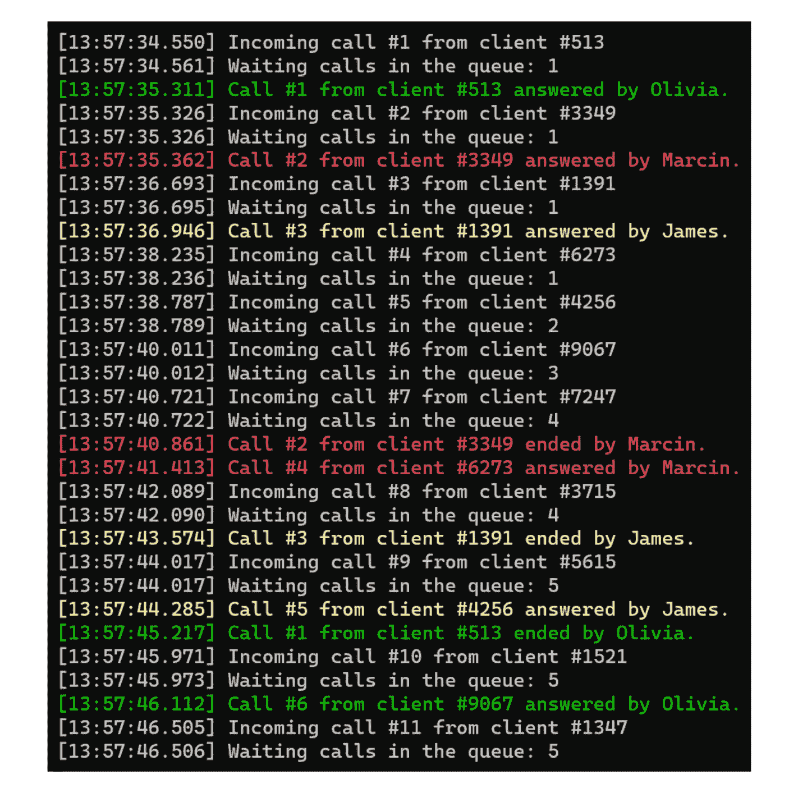

Figure 5.11 – Screenshot of the call center with many consultants example
You just completed two examples representing the application of a queue in the case of a call center scenario. Are you already a queue master?
Try to modify parameters on your own
It is a good idea to modify various parameters of the program, such as the number of consultants, as well as delay times, especially the delay between following calls performed by clients. Then, you will see how the algorithm works in the case when there are too many clients, as well as too many or too few consultants.
However, how can you handle clients with priority support? In the current solution, they wait in the same queue as clients with the standard support plan. Do you need to create two queues and first take clients from the prioritized queue? If so, what should happen if you introduce another support plan? Do you need to add another queue and introduce such modifications in the code? Fortunately, no! You can use another data structure, namely a priority queue, as explained in detail in the following section.
Priority queues
A `0`, while lower priority is specified by `1`, `2`, `3`, and so on.
Imagine a priority queue
If you want to better visualize a priority queue, close your eyes for a moment and imagine yourself going on the greatest vacation of your life. All passengers are already lining up at the gate, including you, but it turns out that right next to it, there is a much shorter queue for people who have a gold airline card. There are only 3 people in that line, and in yours there are over 100\. These 3 people will be served first, and only then will the service of your queue begin. Well, that’s how a priority queue works! You first serve all the highest priority items in the order they were added to the priority queue. Then, you return all lower priority items, also in the order they were added to the priority queue. Then, you take all items with an even lower priority, and so on, until all priorities are properly handled. And now the dream about holidays is over, it’s time to get back to further learning data structures and algorithms!
A diagram of a priority queue is presented next:
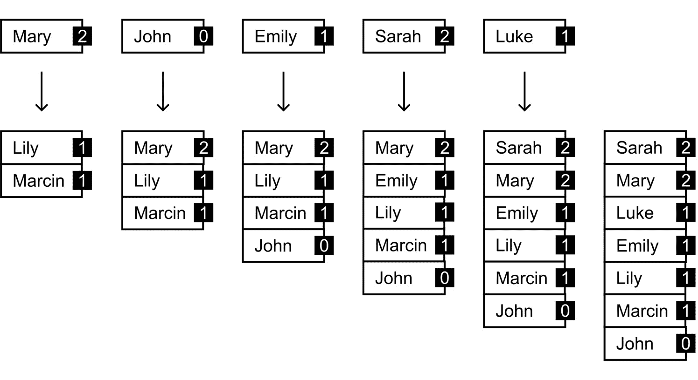

Figure 5.12 – Illustration of a priority queue
Let’s analyze the diagram. First, the priority queue contains two elements with the same priority (equal to `1`), namely `Marcin` (first) and `Lily` (second). Then, `Mary` is added with the lowest priority (`2`), which means that this element is placed at the end of the queue. In the next step, `John` is added with the highest priority (`0`), so it is added at the beginning of the priority queue. The third column presents the addition of `Emily` with a priority equal to `1` -  the same as `Marcin` and `Lily`. As `Emily` is added last, it is added after `Lily`. According to the aforementioned rules, you add the following elements - namely, `Sarah` with a priority set to `2` and `Luke` with a priority equal to `1`. The final order is shown on the right-hand side of the preceding diagram.
Of course, it is possible to implement a priority queue `PriorityQueue` from the `System.Collections.Generic` namespace. The mentioned class requires you to specify two types, namely for the stored data and for the priority. The class contains some useful methods, such as the following:

*   `Enqueue` adds an element to the priority queue
*   `Dequeue` removes an element from the beginning and returns it
*   `Clear` removes all elements from the priority queue
*   `Peek` returns an element from the beginning of the queue without removing it

You can also get the number of elements in the queue using the `Count` property. The class contains a set of other methods as well - for example, `TryDequeue` and `TryPeek`.
Where can you find more information?
You can find content regarding a priority queue at [`learn.microsoft.com/en-us/dotnet/api/system.collections.generic.priorityqueue-2`](https://learn.microsoft.com/en-us/dotnet/api/system.collections.generic.priorityqueue-2).
To make your horizons even broader, you will learn how to use `OptimizedPriorityQueue`. More information about this package is available at [`www.nuget.org/packages/OptimizedPriorityQueue`](https://www.nuget.org/packages/OptimizedPriorityQueue).
How to install a NuGet package?
Do you know how you can add a NuGet package to your project? If not, select **Manage NuGet Packages** from the context menu of the project node in the **Solution Explorer** window. Then, choose the **Browse** tab in the opened window and type the name of the package in the **Search** box. Click on the name of the package and press **Install**. Confirm this operation and wait until the installation is ready.
While the package is being installed, do you know that you can also be an author of a NuGet package that can be later used by developers from various regions of the world? If you create something great, please let me know! In the meantime, please keep in mind that you always should comply with the license terms of particular packages, and you should not fully trust all available packages, especially those with a smaller number of downloads. However, NuGet packages are a nice feature that can significantly simplify and speed up your work.
The `OptimizedPriorityQueue` library simplifies the application of a priority queue. Within it, the `SimplePriorityQueue` generic class is available, which contains some useful methods, such as the following:

*   `Enqueue` adds an element to the priority queue
*   `Dequeue` removes an element from the beginning of the queue and returns it
*   `GetPriority` returns the priority of the element
*   `UpdatePriority` updates the priority of the element
*   `Contains` checks whether the element exists in the priority queue
*   `Clear` removes all elements from the priority queue

You can get the number of elements currently available in the priority queue using the `Count` property. If you want to get an element from the beginning of the priority queue without removing it, you can use the `First` property. Moreover, the class contains a set of other methods, such as `TryDequeue` and `TryRemove`. As you can see, the names of some members of the class are even the same, as in the case of the `PriorityQueue` built-in class. Thus, you can easily change one implementation to another and check the impact of the implementation on the results or the performance of your solution.
What about the performance?
Both `Enqueue` and `Dequeue` methods are *O(log* *n)* operations.
If you want to see in action the priority queue depicted in the preceding diagram, you can use the following part of the code:

```

using Priority_Queue;

SimplePriorityQueue<string> queue = new();

queue.Enqueue("Marcin", 1);

queue.Enqueue("Lily", 1);

queue.Enqueue("Mary", 2);

`queue.Enqueue("John", 0);`

queue.Enqueue("Emily", 1);

queue.Enqueue("Sarah", 2);

`queue.Enqueue("Luke", 1);`

while (queue.Count > 0)

`{`

Console.WriteLine(queue.Dequeue());

}

```cs

 At the beginning, you create a new priority queue containing only `string` values. Then, you add all elements in the correct order, together with specifying their priority, using the `Enqueue` method. At the end, you use a `while` loop to dequeue all the elements, using the `Dequeue` method. Pretty simple and easy to understand, isn’t it?
When you run the code, you will get the following result:

```

John

Marcin

Lily

Emily

Luke

Mary

Sarah

```cs

 After this short introduction to the topic of priority queues, let’s proceed to the example of a call center with priority support, which is described next.
Example – call center with priority support
As an example of a priority queue, let’s present a simple approach to the call center solution, where there are many clients (with different identifiers), and only one consultant who answers waiting calls, first from clients with the priority support plan, and then from clients with the standard support plan.
This scenario is presented in the following diagram. Calls with standard priority are marked with `–`, while calls with priority support are indicated by `∆`, as follows:


Figure 5.13 – Illustration of the call center with priority support example
The priority queue contains only three elements, which will be served in the following order: `#5678` (the priority support), `#1234`, and `#1468`. However, the call from the client with the `#9641` identifier causes the order to change to `#5678`, `#9641` (due to priority support), `#1234`, and `#1468`.
It is high time to write some code! Let’s proceed to the implementation of the `IncomingCall` class:

```

public class IncomingCall

{

public int Id { get; set; }

public int ClientId { get; set; }

public DateTime CallTime { get; set; }

public DateTime? AnswerTime { get; set; }

public DateTime? EndTime { get; set; }

public string? Consultant { get; set; }

public bool IsPriority { get; set; }

}

```cs

 Here, there is only one change in comparison to the previously presented scenario of the simple call center application - namely, the `IsPriority` property is added. It indicates whether the current call has priority (`true`) or standard support (`false`).
Some modifications are also necessary for the `CallCenter` class, where a type of the `Calls` property is changed to `SimplePriorityQueue<IncomingCall>`, as shown next:

```

public class CallCenter

{

private int _counter = 0;

public SimplePriorityQueue<IncomingCall> Calls

{ get; private set; }

public CallCenter() => Calls =

new SimplePriorityQueue<IncomingCall>();

}

```cs

 The following changes are necessary for the `Call` method:

```

public IncomingCall Call(int clientId, bool isPriority)

{

IncomingCall call = new()

{

Id = ++_counter,

ClientId = clientId,

CallTime = DateTime.Now,

IsPriority = isPriority

`};`

Calls.Enqueue(call, isPriority ? 0 : 1);

return call;

}

```cs

 Here, a value of the `IsPriority` property is set using the parameter. Moreover, while calling the `Enqueue` method, two parameters are used, not only the value of the element (an instance of the `IncomingCall` class), but also an integer value representing the priority, namely `0` in the case of priority support, or `1` otherwise.
No more changes are necessary in the methods of the `CallCenter` class, namely in `Answer`, `End`, and `AreWaitingCalls`, which are shown next for your convenience:

```

public IncomingCall? Answer(string consultant)

{

if (!AreWaitingCalls()) { return null; }

IncomingCall call = Calls.Dequeue();

call.Consultant = consultant;

call.AnswerTime = DateTime.Now;

return call;

}

public void End(IncomingCall call) =>

call.EndTime = DateTime.Now;

public bool Program.cs 文件：

```cs
Random random = new();
CallCenter center = new();
center.Call(1234, false);
center.Call(5678, true);
center.Call(1468, false);
center.Call(9641, true);
while (center.AreWaitingCalls())
{
    IncomingCall call = center.Answer("Marcin")!;
    Log($"Call #{call.Id} from client #{call.ClientId} is
        answered by {call.Consultant}.", call.IsPriority);
    await Task.Delay(random.Next(1000, 10000));
    center.End(call);
    Log($"Call #{call.Id} from client #{call.ClientId} is
        ended by {call.Consultant}.", call.IsPriority);
}
void Log(string text, bool isPriority)
{
    Console.ForegroundColor = isPriority
        ? ConsoleColor.Red : ConsoleColor.Gray;
    Console.WriteLine($"[{DateTime.Now:HH:mm:ss}] {text}");
    Console.ResetColor();
}
```

您可能会惊讶地发现，在这个代码部分只需要进行微小的改动。原因是关于已使用数据结构的逻辑隐藏在`CallCenter`类中。在`Program.cs`文件中，您调用`CallCenter`类公开的方法和使用属性。您只需修改如何将调用添加到队列中（包括优先级），以及当顾问接听电话时调整显示的日志，根据电话的优先级选择合适的颜色。就这样！

当您运行应用程序时，您将收到类似以下的结果：

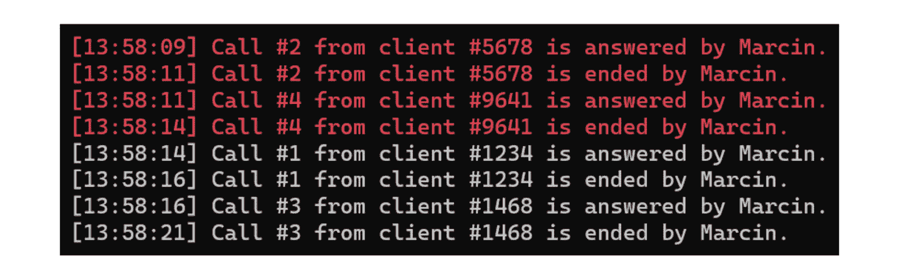

图 5.14 – 带优先级支持的呼叫中心截图示例

如你所见，呼叫是按照正确的顺序服务的。这意味着具有优先级支持的客户的呼叫比具有标准支持计划的客户的呼叫先被服务，尽管这样的呼叫需要等待更长的时间才能得到回答。

环形队列

在本章结束时，让我们看看另一种数据结构，即**环形队列**，也称为**环形缓冲区**。在这种情况下，**队列形成一个环**，内部使用数组，并且可以放置在队列中的最大元素数量是有限的。你需要指定两个变量，它们指示**前**和**后**元素的索引。**前一个指向第一个将被出队的元素。后一个指向队列中的最后一个元素**。

想象一个环形队列

如果你想更好地想象环形队列，回想一下你年轻的时候，当你说服你的父母带你坐过山车的时候。它由 10 节车厢组成，每节车厢可以容纳 2 人，所以只有 20 人可以参加一次过山车之旅。由于这是一个独特的景点，这样的旅程每小时只发生一次。这意味着只有 20 人被允许进入过山车的队列，其他人则不行。随着出发日期的临近，人们按照他们进入队列的顺序被允许进入。而环形队列的工作方式类似！它有一定的容量，并且不能向其中入队其他东西。然而，当你出队元素时，新的元素可以替代之前的元素。嗯，这意味着一个小时后，你可以用新的人来填满过山车的队列！

所述数据结构在以下图中展示：

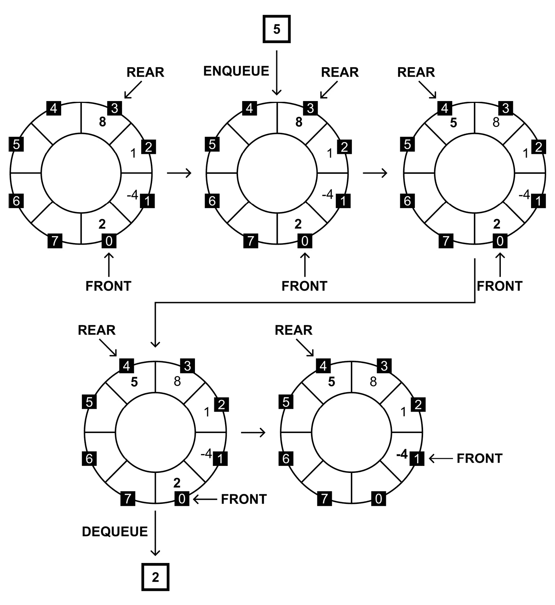

图 5.15 – 环形队列的示意图

在开始时，环形队列是空的，所以都是`-1`。然后，你添加`2`、`-4`、`1`和`8`个元素，这个状态在前图中第一步显示。在这里，前索引等于`0`，后索引等于`3`。

在下一步中，你执行一个`5`位于索引`4`，正如前图中第三步所示。当然，后索引更新为`4`，而前索引保持不变，即`0`。

以下步骤显示返回了一个`2`，前索引变为`1`。这意味着目前，环形队列在数组的前索引`1`（队首）和后索引`4`（队尾）之间存储了`4`个元素。

性能如何？

在这种情况下，性能结果非常出色！`入队`和`出队`方法都是*O(1)*操作，因为你不需要遍历数组。

你可以执行更多的`入队`和`出队`操作，以查看队列内容在环形队列中是如何“旋转”的。为此，你需要实现这个数据结构。让我们编写一些代码，从`CircularQueue`类开始：

```cs
public class CircularQueue<T>(int size)
    where T : struct
{
    private readonly T[] _items = new T[size];
    private int _front = -1;
    private int _rear = -1;
    private int _count = 0;
    public int Count { get { return _count; } }
}
```

这是一个泛型类，它使用主构造函数，将队列中元素的最大数量作为`size`参数。你可以看到四个私有字段：

+   存储元素的数组（`_items`）

+   队列中前后元素的下标（`_front`和`_rear`）

+   环形队列中当前元素的数量（`_count`）

还添加了一个公共只读`Count`属性，它返回`_count`字段的值。如果你对此已经很清楚，让我们看看`Enqueue`方法：

```cs
public bool Enqueue(T item)
{
    if (_count == _items.Length) { return false; }
    if (_front < 0) { _front = _rear = 0; }
    else { _rear = ++_rear % _items.Length; }
    _items[_rear] = item;
    _count++;
    return true;
}
```

在开始时，你需要检查环形队列中是否有空余空间，所以你需要比较队列中当前元素的数量（`_count`）与存储此类数据的数组长度（`_items`）。如果这两个值相等，你将返回`false`，因为没有空间，所以你不能入队任何元素。

下一行检查环形队列是否为空，这意味着前索引小于`0`。如果是这样，前索引和后索引都被设置为`0`。这表示环形队列中只有一个元素，并且这两个索引都指向它。

如果队列中已经有东西了，你增加后索引的值。如果它等于数组中的元素数量，你将其设置为`0`。

在最后三行中，你将新元素添加到由后索引（`_rear`）指示的位置，增加存储队列中当前元素数量的计数器（`_count`），以及返回`true`以指示入队操作成功。

现在让我们转到`Dequeue`方法，其代码如下所示：

```cs
public T? Dequeue()
{
    if (_count == 0) { return null; }
    T result = _items[_front];
    if (_front == _rear) { _front = _rear = -1; }
    else { _front = ++_front % _items.Length; }
    _count--;
    return result;
}
```

在这里，你检查环形队列是否为空。如果是这样，你返回一个`null`值。否则，你将前索引指示的值保存为`result`。这个值将在本方法结束时返回。

在接下来的几行中，你检查前索引和后索引是否相等。这意味着队列中只有一个元素。如果是这样，你将这两个索引都设置为`-1`，这表示环形队列是空的。否则，你增加前索引。如果它等于数组中的元素数量，你将其设置为`0`。

在最后两行中，你只是减少队列中的元素数量，以及返回之前保存的值（`result`）。

另一个方法名为`Peek`，如下所示：

```cs
public T? Peek()
{
    if (_count == 0) { return null; }
    return _items[_front];
}
```

这个方法只是返回队列中的第一个元素，而不从队列中移除它。当然，如果队列为空，它将返回`null`。

如你所见，环形队列的实现并不困难，并且只需要少量代码。所以，让我们看看以下代码的实际效果：

```cs
CircularQueue<int> queue = new(8);
queue.Enqueue(2);
queue.Enqueue(-4);
queue.Enqueue(1);
queue.Enqueue(8);
queue.Enqueue(5);
int item = queue.Dequeue();
Console.WriteLine(item);
```

前面的几行执行了图中展示的环形队列操作（*图 5.15*）。你创建了一个新的环形队列，可以存储八个`int`类型的元素。然后，你添加了`2`、`-4`、`1`、`8`和`5`这些值，并出队一个元素。

在介绍了循环队列的主题之后，是时候看看一个现实世界的例子了。

示例 – 重力过山车

让我们模拟位于山腰上的重力过山车的行为。这个队列在同一时间最多可以有 12 个车卡，它们在重力作用下沿着滑道下滑。参与者进入车卡后，它会自动加速，并在其路径上有几个转弯。到达山脚下后，车卡和参与者被一个简单的滑轮拉上来。参与者从他们上车的地方下车，如图所示：

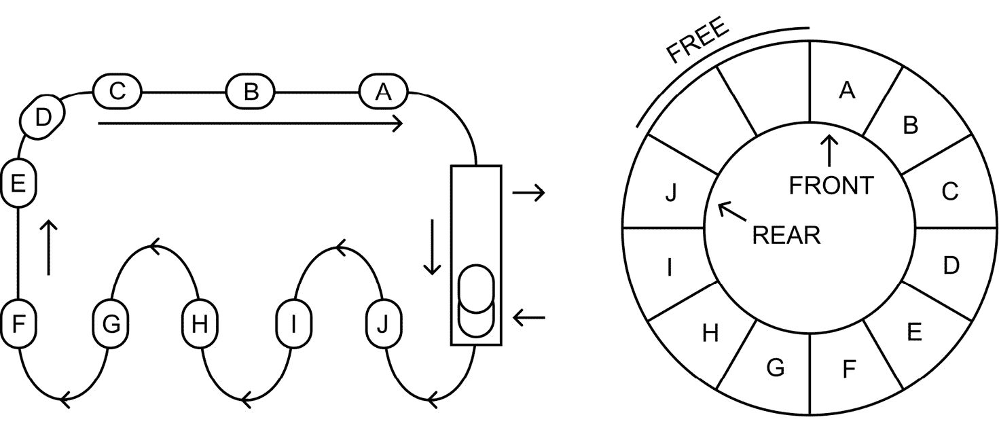

图 5.16 – 重力过山车示例示意图

你可以使用最大容量设置为 12 的循环队列来模拟这个例子，这意味着目前最多可以有 12 个人在这个重力过山车上。直到有座位空出，不会让另一个人进入。进入车卡意味着执行一个*入队*操作，离开车卡意味着执行一个*出队*操作。还值得一提的是，无法改变参与者被服务的顺序。首先进入队列的人将首先被放出，这与 FIFO（先进先出）原则一致。

让我们看看位于`Program.cs`文件中的代码：

```cs
using QueueItem = (System.DateTime StartedAt,
    System.ConsoleColor Color);
const int rideSeconds = 10;
Random random = new();
CircularQueue<QueueItem> queue = new(12);
ConsoleColor color = ConsoleColor.Black;
```

在这里，你为包含车进入时间和所选颜色的值元组类型指定了一个`QueueItem`别名。然后，将骑行长度设置为 10 秒，以及创建了一些其他变量，包括循环队列和最后使用的颜色。

以下是代码的下一部分，展示如下：

```cs
while (true)
{
    while (queue.Peek() != null)
    {
        QueueItem item = queue.Peek()!.Value;
        TimeSpan elapsed = DateTime.Now - item.StartedAt;
        if (elapsed.TotalSeconds < rideSeconds) { break; }
        queue.Dequeue();
        Log($"> Exits\tTotal: {queue.Count}", item.Color);
    }
    bool isNew = random.Next(3) == 1;
    if (isNew)
    {
        color = color == ConsoleColor.White
            ? ConsoleColor.DarkBlue
            : (ConsoleColor)(((int)color) + 1);
        if (queue.Enqueue((DateTime.Now, color)))
        {
            Log($"< Enters\tTotal: {queue.Count}", color);
        }
        else
        {
            Log($"! Not allowed\tTotal: {queue.Count}",
                ConsoleColor.DarkGray);
        }
    }
    await Task.Delay(500);
}
```

它包含一个无限`while`循环。在这个循环中，你首先检查哪些项目应该被出队，这意味着它们的骑行时间（即 10 秒）已经过去。如果是这样，你也会记录消息。然后，你随机抽取一个数字来决定是否在这个无限`while`循环的这次迭代中向循环队列中添加一个新的项目。如果是这样，你从`ConsoleColor`枚举中选择下一个颜色，尝试将新项目入队，并记录消息。在迭代结束时，你等待 500 毫秒。

这里展示了辅助`Log`方法的代码：

```cs
void Log(string text, ConsoleColor color)
{
    Console.ForegroundColor = color;
    Console.WriteLine($"{DateTime.Now:HH:mm:ss} {text}");
    Console.ResetColor();
}
```

当你运行代码时，你会得到以下结果：

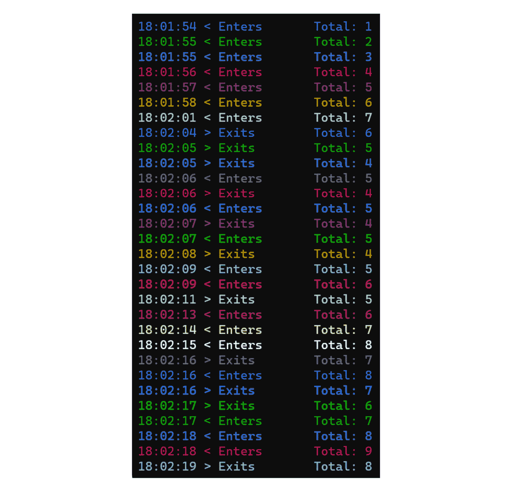

图 5.17 – 重力过山车示例截图

恭喜 – 你现在知道如何使用几种类型的队列了！你查看了一个常规队列、一个优先队列以及一个循环队列，并一起看了示例。所以，是时候总结本章内容了。

摘要

在本章中，你学习了两种有限访问数据结构，即栈和队列，包括常规的、优先的和循环的。值得记住的是，这些数据结构有严格指定的访问元素的方式。它们都有各种现实世界的应用。其中一些在本章中提到了。

首先，你看到了**栈**如何根据 LIFO（后进先出）原则操作。在这种情况下，你可以在栈顶添加一个元素（一个*压入*操作），并从栈顶移除一个元素（一个*弹出*操作）。栈在两个示例中进行了展示，即用于反转单词和解决*汉诺塔*数学游戏。

在本章的下一部分，你了解了作为数据结构的**队列**，它根据 FIFO（先进先出）原则操作。在这种情况下，介绍了*入队*和*出队*操作。队列使用两个示例进行了说明，都是关于模拟呼叫中心的应用。你学习了如何在 C#语言开发应用程序时使用线程安全的队列相关类的变体。

本章接下来介绍的数据结构被称为**优先队列**，它是支持特定元素优先级的队列的扩展。最后，你学习了**循环队列**，它通过形成一个圆来扩展常规队列的概念，其中第一个和最后一个元素由索引指示。

这只是这本书的第五章，而你已经学到了很多关于在 C#开发应用程序时非常有用的各种数据结构和算法。你对通过学习**字典**和**集合**来增加你的知识感兴趣吗？如果是这样，那就让我们继续到下一章，了解更多关于它们的内容！

```cs

```

```cs

```

```cs

```

```cs

```
