# 7

# 树的变体

在前面的章节中，你学习了关于许多数据结构的知识，从简单的数组开始。现在，是时候了解一个显著更复杂的数据结构组了，即**树**。

本章开头将介绍一个**基本树**，以及其在 C#语言中的实现，并有一些示例展示其作用。然后，将介绍**二叉树**，包括其实现的详细描述和应用的示例。**二叉搜索树**（BST）是另一种树变体，是最流行的树类型之一，在许多算法中使用。你还将了解**自平衡树**，即**AVL 树**和**红黑树**（RBTs）。然后，你将看到**字典树**作为一个专门的数据结构，用于执行字符串操作。本章的其余部分将简要介绍**堆**的主题。

数组、列表、栈、队列、字典、集合，现在还有树。你准备好提高难度并学习下一个数据结构了吗？如果是这样，让我们开始阅读吧！

本章将涵盖以下主题：

+   基本树

+   二叉树

+   二叉搜索树

+   自平衡树

+   字典树

+   堆

# 基本树

让我们从介绍树开始。它们是什么？你对这样一个数据结构的外观有什么想法吗？如果没有，让我们看看以下图表，它描绘了一个带有关于其特定元素的标题的树：

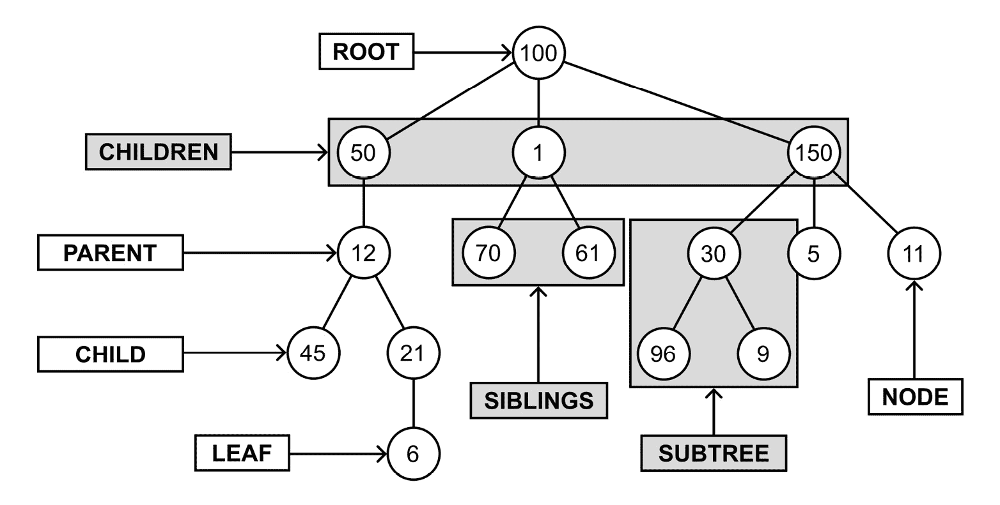

图 7.1 – 树的示意图

树由多个**节点**组成，包括一个**根节点**（图中为**100**）。根节点不包含**父节点**，而所有其他节点都包含。例如，节点**1**的父元素是**100**，而节点**96**的父节点是**30**。

此外，每个节点可以有任意数量的**子节点**，例如在**根节点**的情况下有三个**子节点**（即**50**、**1**和**150**）。同一节点的子节点可以被称为**兄弟节点**，例如节点**70**和**61**的情况。没有子节点的节点被称为**叶节点**，例如图中的**45**和**6**。

让我们看看包含三个节点（即**30**、**96**和**9**）的矩形。这样的树的一部分可以称为**子树**。当然，你可以在树中找到许多子树。

想象一棵树

如果你想要更好地想象一棵树，看看一个稍微大一点的公司结构，在层级结构的顶端是**首席执行官**（**CEO**），向他分配**首席运营官**（**COO**）、**首席营销官**（**CMO**）、**首席财务官**（**CFO**）和**首席技术官**（**CTO**）。由于销售是公司运营中的关键主题之一，区域总监向 COO 汇报，并为他们中的每一个分配三到五个销售专家。你自己找找看——你现在脑中就有了一棵树！它的根是 CEO，它有四个子节点（COO、CMO、CFO 和 CTO），这些子节点可以进一步创建后续层级的子节点。不再有任何下属的销售专家被称为叶子节点。

让我们简要地讨论一下节点子节点的最小和最大数量。一般来说，这些数字没有限制，每个节点可以包含零个、一个、两个、三个甚至更多的子节点。然而，在实际应用中，子节点的数量通常限制为两个，正如你很快就会看到的。

## 实现

基于 C#的基本树实现似乎非常明显且不复杂。要做到这一点，你需要声明两个类，代表单个节点和整个树，如本节所述。

### 节点

第一个类被命名为`TreeNode`，它被声明为一个泛型类，以便为开发者提供指定每个节点存储的数据类型的可能性。因此，你可以创建一个强类型解决方案，这消除了将对象强制转换为目标类型的必要性。代码如下：

```cs
public class TreeNode<T>
{
    public T? Data { get; set; }
    public TreeNode<T>? Parent { get; set; }
    public List<TreeNode<T>> Children { get; set; } = [];
    public int GetHeight()
    {
        int height = 1;
        TreeNode<T> current = this;
        while (current.Parent != null)
        {
            height++;
            current = current.Parent;
        }
        return height;
    }
}
```

该类包含三个属性：

+   节点中存储的数据（`Data`）

+   对父节点的引用（`Parent`）

+   对子节点引用的集合（`Children`）

除了属性之外，`TreeNode`类还包含`GetHeight`方法，它返回节点的高度——即从该节点到根节点的距离。这个方法的实现非常简单，因为它仅仅使用一个`while`循环从节点向上移动，直到没有父元素，这意味着到达了根节点。

### 树

下一个必要的类被命名为`Tree`。它代表整个树，如下所示：

```cs
public class Tree<T>
{
    public TreeNode<T>? Root { get; set; }
}
```

该类只有一个属性，`Root`。你可以使用这个属性来访问根节点，然后你可以使用它的`Children`属性来获取其子节点的数据。然后，你可以查看每一个，并获取它们的子节点数据。通过重复这样的操作，你可以从树中所有节点获取数据。

值得注意的是，`TreeNode`和`Tree`类都是泛型的，并且在这些类的情况下使用的是相同的类型。例如，如果树节点应该存储`string`类型的值，那么`string`类型应该用于`Tree`和`TreeNode`类的实例。

## 示例 - 标识符层次结构

你想看看如何在基于 C#的应用程序中使用树吗？让我们看看我们的第一个例子。目标是构建一个包含几个节点的树，如图所示。代码中只展示带有更粗边框的节点组。然而，自己调整代码来构建整个树是个好主意：

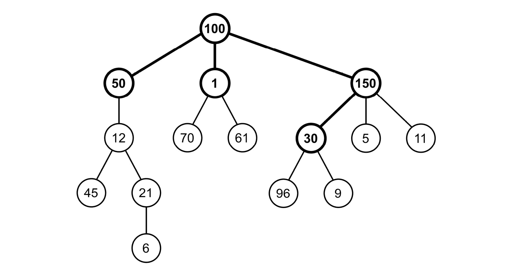

图 7.2 – 标识符层次结构示例的说明

在这里，每个节点存储一个整数值，因此`int`类型被用于`Tree`和`TreeNode`类。以下代码应放置在`Program.cs`文件中：

```cs
Tree<int> tree = new() { Root = new() { Data = 100 } };
tree.Root.Children =
[
    new() { Data = 50, Parent = tree.Root },
    new() { Data = 1, Parent = tree.Root },
    new() { Data = 150, Parent = tree.Root }
];
tree.Root.Children[2].Children =
[
    new() { Data = 30, Parent = tree.Root.Children[2] }
];
```

代码看起来相当简单，不是吗？一开始，创建了一个`Tree`类的新实例，并通过创建`TreeNode`类的新实例并设置`Data`属性的值为`100`来配置根节点。

在以下行中，指定了根节点的子节点，即值为`50`、`1`和`150`的节点。对于每个节点，将`Parent`属性的值设置为先前添加的根节点的引用。

代码的其余部分展示了如何为给定节点添加子节点，即根节点的第三个子节点——即值为`150`的节点。这里只添加了一个节点：值为`30`的节点。当然，你还需要指定父节点的引用。

那就结束了！你已经创建了第一个使用树的程序。现在，你可以运行它，但在控制台你将看不到任何输出。如果你想查看节点数据的组织方式，你可以调试程序并查看调试时的变量值。

## 示例 – 公司结构

在前面的例子中，你看到了如何在树中的每个节点存储整数值作为数据。然而，也可以在节点中存储用户定义类的实例。在这个例子中，你将看到如何创建一个表示公司结构的树，该树分为三个主要部门：开发、研究和销售。

在每个部门内，可能存在另一种结构，例如在开发团队的情况下。在这里，**约翰·史密斯**是开发团队的负责人。他是**克里斯·莫里斯**的老板，**克里斯·莫里斯**是两位初级开发人员**埃里克·格林**和**阿什莉·洛佩兹**的经理。后者也是**艾米丽·杨**的导师，**艾米丽·杨**是开发实习生。

下面的图中展示了示例树：

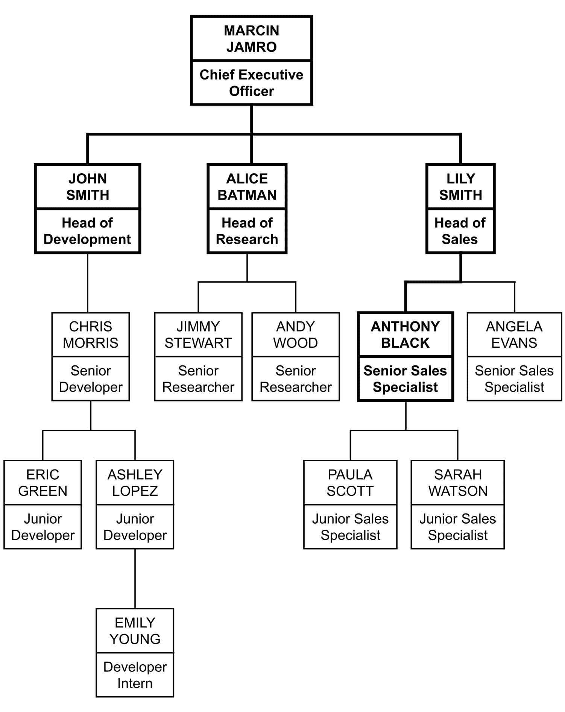

图 7.3 – 公司结构示例的说明

如您所见，每个节点应该存储比仅仅整数值更多的信息。应该有一个姓名和角色。此类数据作为`Person`记录实例的属性值存储，如下所示：

```cs
public record Person(string Name, string Role);
```

除了创建新的记录外，还需要添加一些代码：

```cs
Tree<Person> company = new()
{
    Root = new()
    {
        Data = new Person("Marcin Jamro",
            "Chief Executive Officer"),
        Parent = null
    }
};
company.Root.Children =
[
    new() { Data = new Person("John Smith",
        "Head of Development"), Parent = company.Root },
    new() { Data = new Person("Alice Batman",
        "Head of Research"), Parent = company.Root },
    new() { Data = new Person("Lily Smith",
        "Head of Sales"), Parent = company.Root }
];
company.Root.Children[2].Children =
[
    new() { Data = new Person("Anthony Black",
        "Senior Sales Specialist"),
        Parent = company.Root.Children[2] }
];
```

在第一行，创建了一个新的`Tree`类实例。值得注意的是，在创建`Tree`和`TreeNode`类的新实例时使用了`Person`记录作为指定的类型。因此，您可以轻松地为每个节点存储多个简单数据类型。代码的其余部分与第一个基本树的示例类似。在这里，您也指定了根节点（对于`Chief Executive Officer`角色），然后配置其子元素（`John Smith`、`Alice Batman`和`Lily Smith`），并为现有节点之一设置子节点，即`Head of Sales`角色的节点。

这看起来简单直接吗？在下一节中，您将看到一种更受限制，但非常重要且广为人知的树变体：二叉树。

# 二叉树

一般而言，基本树中的每个节点可以包含任意数量的子节点。然而，在**二叉树**的情况下，**一个节点不能包含超过两个子节点**。这意味着**它可以包含零个、一个或两个子节点**。这样的要求对二叉树的形状有重要影响，如下两个图所示，它们展示了二叉树：

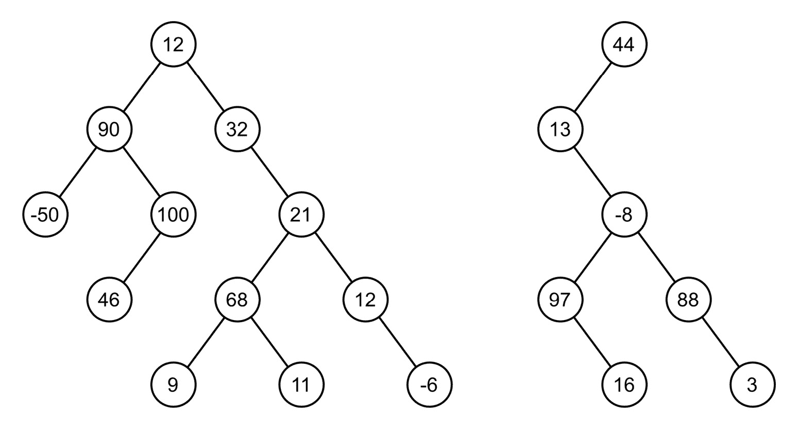

图 7.4 – 二叉树的示意图

如前所述，二叉树中的一个节点最多可以包含两个子节点。因此，它们被称为**左子节点**和**右子节点**。在前一个图中左侧显示的二叉树中，节点**21**有两个子节点，即作为左子节点的**68**和作为右子节点的**12**，而节点**100**只有一个左子节点。

## 遍历

您是否想过如何遍历树中的所有节点？您如何在树的遍历过程中指定节点的顺序？有三种常见的方法，即**先序**、**中序**和**后序**，如下所示：

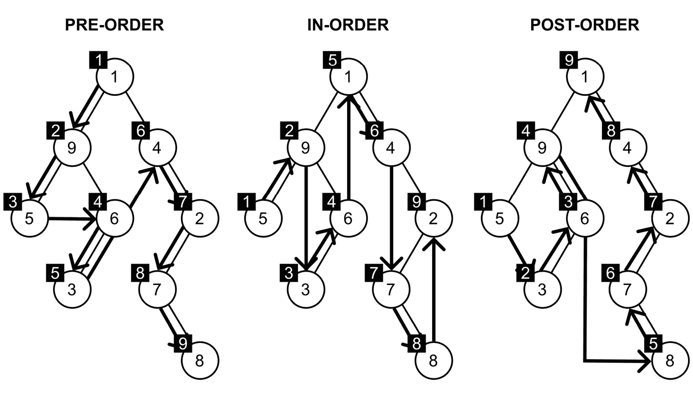

图 7.5 – 先序、中序和后序遍历

如您在图中所见，这些方法之间存在明显的差异。然而，您是否有任何想法如何应用二叉树的先序、中序或后序遍历？让我们详细解释所有这些方法。

### 先序

如果您想使用**先序**方法遍历二叉树，您首先访问根节点。然后，您访问左子节点。最后，访问右子节点。当然，这样的规则不仅适用于根节点，也适用于树中的任何节点。因此，您可以理解先序遍历的顺序为**首先访问当前节点，然后是其左子节点（使用先序方法递归地遍历整个左子树），最后是其右子节点（以类似的方式遍历右子树）**。

解释可能听起来有点复杂，所以让我们看看前一个图中左侧所示树的简单示例。首先，访问根节点（即 **1**）。然后，分析它的左子节点。因此，下一个访问的节点是当前节点，**9**。下一步是它的左子节点的中序遍历。因此，访问 **5**。由于这个节点没有子节点，你可以回到当前节点是 **9** 的遍历阶段。它已经被访问，以及它的左子节点，所以现在是时候继续到它的右子节点。在这里，你首先访问当前节点，**6**，然后跟随到它的左子节点，**3**。你可以应用相同的规则继续遍历树。最终的顺序是 **1**，**9**，**5**，**6**，**3**，**4**，**2**，**7**，**8**。

如果这仍然有点令人困惑，以下图应该可以消除任何疑问：

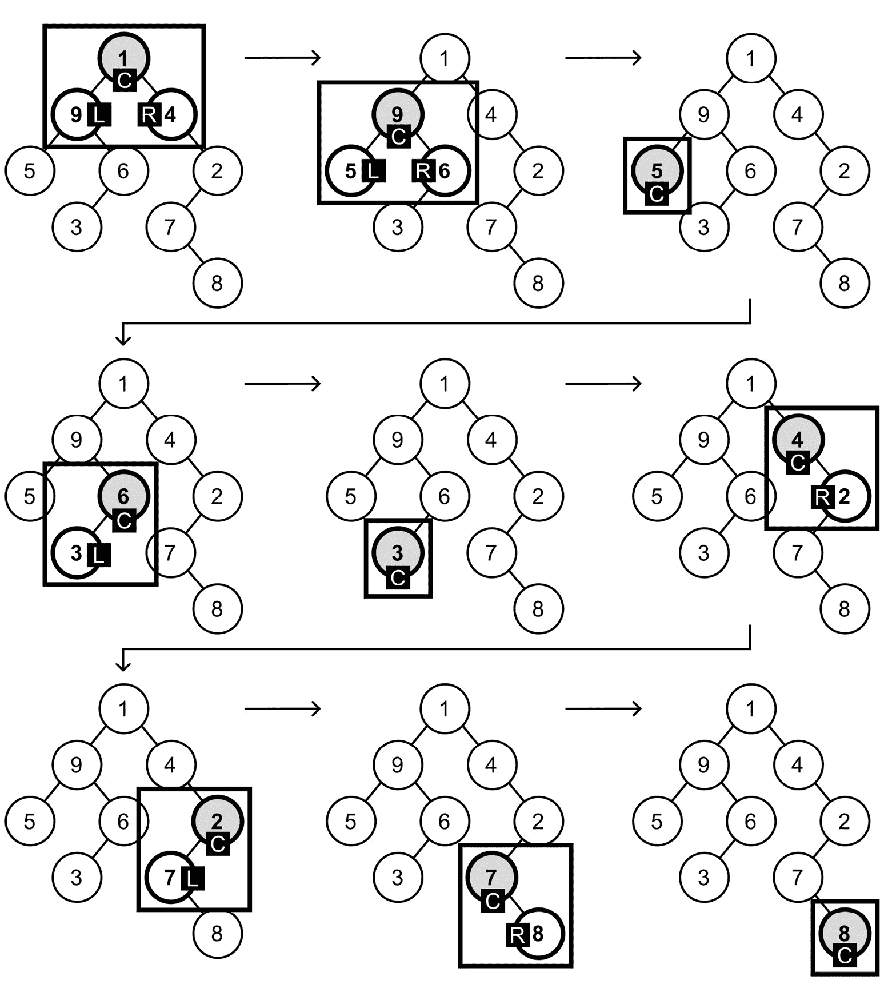

图 7.6 – 前序遍历的详细图

该图展示了前序遍历的以下步骤，并增加了额外的指示：**C** 代表 **当前节点**，**L** 代表 **左子节点**，**R** 代表 **右子节点**。

### 中序

第二种遍历模式称为 **中序**。它与前序方法的不同之处在于访问节点的顺序：**先访问左子节点，然后是** **当前节点**，最后是 **右子节点**。

如果你查看图中展示的包含所有三种遍历模式的示例，你可以看到第一个访问的节点是 **5**。为什么？一开始，根节点被分析，但并未访问，因为中序遍历从左子节点开始。因此，它分析了节点 **9**，但该节点也有一个左子节点，**5**，所以你继续到这个节点。由于这个节点没有子节点，当前节点（**5**）被访问。然后，你回到当前节点是 **9** 的步骤，由于它的左子节点已经被访问，你也访问了当前节点。接下来，你跟随到右子节点，但该节点有一个左子节点，**3**，它应该首先被访问。根据相同的规则，你按照相同的规则访问二叉树中的剩余节点。最终的顺序是 **5**，**9**，**3**，**6**，**1**，**4**，**7**，**8**，**2**。

### 后序

最后一种遍历模式称为 **后序**，支持以下节点遍历顺序：**先遍历左子节点，然后是右子节点，最后是** **当前节点**。

让我们分析图右侧显示的后序遍历示例。一开始，分析根节点，但由于后序遍历从左子节点开始，所以它没有被访问。因此，你继续到节点 **9**，然后是 **5**，你首先访问它。接下来，你需要分析节点 **9** 的右子节点。然而，节点 **6** 有一个左子节点（**3**），它应该先被访问。因此，在 **5** 之后，你访问 **3**，然后是 **6**，接着是 **9**。有趣的是，二叉树的根节点是在最后被访问的。最终的顺序是 **5**，**3**，**6**，**9**，**8**，**7**，**2**，**4**，**1**。

性能如何？

如果你想检查二叉树是否包含某个给定的值，你需要检查每个节点，通过三种可用的模式之一遍历树：前序、中序或后序。这意味着查找时间是线性的，即 *O(n)*。

在这个简短的介绍之后，让我们继续进行基于 C# 的实现。

## 实现

二叉树的实施很简单，特别是如果你使用已经描述的基本树代码。让我们从一个表示节点的类开始。

### 节点

二叉树中的节点由 `BinaryTreeNode` 类的实例表示，该类继承自 `TreeNode` 泛型类。在 `BinaryTreeNode` 类中，有必要隐藏从基类继承的 `Children` 定义，并声明两个属性，`Left` 和 `Right`，它们代表节点的两个可能的子节点。相关代码如下：

```cs
public class BinaryTreeNode<T>
    : TreeNode<T>
{
    public new BinaryTreeNode<T>?[] Children { get; set; }
        = [null, null];
    public BinaryTreeNode<T>? Left
    {
        get { return Children[0]; }
        set { Children[0] = value; }
    }
    public BinaryTreeNode<T>? Right
    {
        get { return Children[1]; }
        set { Children[1] = value; }
    }
}
```

此外，你需要确保包含子节点的数组恰好包含两个项目，最初设置为 `null`。因此，如果你想添加一个子节点，应该将其引用放置在 `Children` 属性数组的第一个或第二个元素中。因此，这样的数组始终恰好有两个元素，你可以无异常地访问第一个或第二个元素。如果设置了这样的元素，则返回其引用。否则，返回 `null`。

### 树

下一个必要的类被命名为 `BinaryTree`。它代表整个二叉树。通过使用泛型类，你可以轻松指定每个节点存储的数据类型。`BinaryTree` 类的实现的第一部分如下：

```cs
public class BinaryTree<T>
{
    public BinaryTreeNode<T>? Root { get; set; }
    public int Count { get; set; }
}
```

`BinaryTree` 类包含两个属性：

+   `Root` 表示根节点（`BinaryTreeNode` 类的实例）

+   `Count` 存储放置在树中的节点总数

当然，这些并不是类的唯一成员，因为它还配备了一套关于遍历树的方法。第一个遍历方法是 `TraversePreOrder` 方法，如下所示：

```cs
private void TraversePreOrder(BinaryTreeNode<T>? node,
    List<BinaryTreeNode<T>> result)
{
    if (node == null) { return; }
    result.Add(node);
    TraversePreOrder(node.Left, result);
    TraversePreOrder(node.Right, result);
}
```

该方法接受两个参数：当前节点（`node`）和已访问节点的列表（`result`）。递归实现非常简单。首先，你检查节点是否存在，通过确保参数不等于`null`来确保。然后，你将当前节点添加到已访问节点的集合中，对左子节点启动相同的遍历方法，然后对右子节点启动。

类似的实现也适用于`TraverseInOrder`方法，如下所示：

```cs
private void TraverseInOrder(BinaryTreeNode<T>? node,
    List<BinaryTreeNode<T>> result)
{
    if (node == null) { return; }
    TraverseInOrder(node.Left, result);
    result.Add(node);
    TraverseInOrder(node.Right, result);
}
```

这里，你为左子节点调用`TraverseInOrder`方法，将当前节点添加到已访问节点的列表中，然后对右子节点启动中序遍历。

下一个方法与**后序**遍历模式相关，如下所示：

```cs
private void TraversePostOrder(BinaryTreeNode<T>? node,
    List<BinaryTreeNode<T>> result)
{
    if (node == null) { return; }
    TraversePostOrder(node.Left, result);
    TraversePostOrder(node.Right, result);
    result.Add(node);
}
```

代码与已描述的方法类似，但当然，应用了另一种访问节点的顺序。这里，你从左子节点开始，然后访问右子节点，接着将当前节点添加到已访问节点的列表中。

最后，让我们添加一个公共方法来以各种模式遍历树，该方法调用前面提到的私有方法。相关代码如下：

```cs
public List<BinaryTreeNode<T>> Traverse(TraversalEnum mode)
{
    List<BinaryTreeNode<T>> nodes = [];
    if (Root == null) { return nodes; }
    switch (mode)
    {
        case TraversalEnum.PreOrder:
            TraversePreOrder(Root, nodes);
            break;
        case TraversalEnum.InOrder:
            TraverseInOrder(Root, nodes);
            break;
        case TraversalEnum.PostOrder:
            TraversePostOrder(Root, nodes);
            break;
    }
    return nodes;
}
```

该方法仅接受一个参数，即`TraversalEnum`枚举的值，它从先序、中序和后序中选择适当的模式。`Traverse`方法使用`switch`语句根据参数的值调用一个合适的私有方法。所提到的枚举如下：

```cs
public enum BinaryTree class is GetHeight. It returns the height of the tree, which can be understood as the maximum number of steps to travel from any leaf node to the root. The implementation is as follows:

```

public int GetHeight() => Root != null

? Traverse(TraversalEnum.PreOrder)

.Max(n => n.GetHeight())

: 0;

```cs

 After the introduction to the topic of binary trees, let’s see an example where this data structure is used for storing questions and answers in a simple quiz.
Example – simple quiz
As an example of a binary tree, a simple quiz application will be prepared. The quiz consists of a few questions and answers, shown depending on previously taken decisions. The application presents the question, waits until the user presses *Y* (yes) or *N* (no), and proceeds to the next question or shows the answer.
The structure of the quiz is created in the form of a binary tree, as follows:
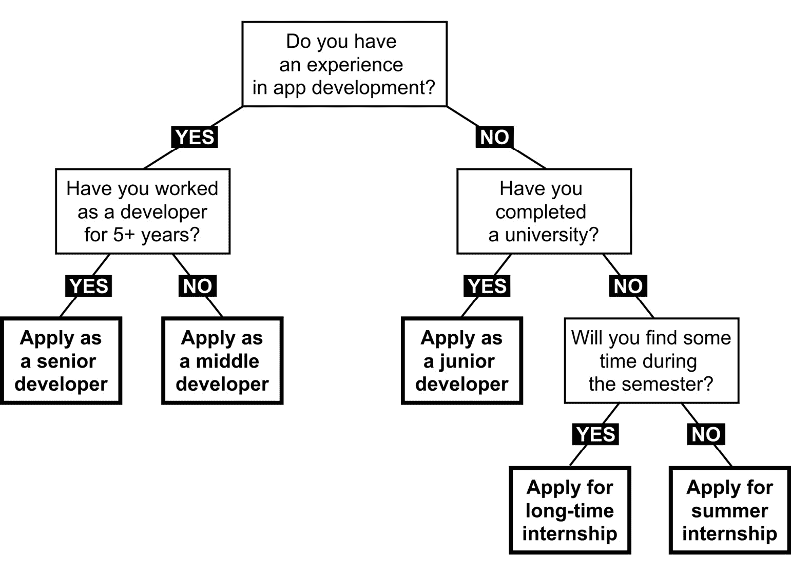

Figure 7.7 – Illustration of the simple quiz example
At the beginning, the user is asked whether they have any experience in application development. If so, the program asks whether they have worked as a developer for more than 5 years. In the case of a positive answer, the result regarding applying to work as a senior developer is presented. Of course, other answers and questions are shown in the case of different decisions taken by the user.
The implementation of the simple quiz requires the `BinaryTree` and `BinaryTreeNode` classes, which were presented and explained earlier. Each node stores only a `string` value as data, representing either a question or an answer.
Let’s take a look at the main part of the code:

```

BinaryTree<string> tree = GetTree();

BinaryTreeNode<string>? node = tree.Root;

while (node != null)

{

如果节点左侧和右侧都不为空

{

Console.WriteLine(node.Data);

node = Console.ReadKey(true).Key switch

{

ConsoleKey.Y => node.Left,

ConsoleKey.N => node.Right,

_ => node

};

}

else

{

Console.WriteLine(node.Data);

node = null;

}

}

```cs

 In the first line, the `GetTree` method is called to construct a tree with questions and answers. Such a method will be shown next. Then, the root node is taken as the current node, for which the following operations are taken until an answer is reached.
At the beginning, you check whether the left and right child nodes exist – that is, whether it is a question and not an answer. Then, the textual content is written in the console, and the program waits until the user presses a key. If it is equal to *Y*, the current node’s left child is used as the current node. In the case of pressing *N*, the current node’s right child is used instead.
When decisions taken by the user cause an answer to be shown, it is presented in the console, and `null` is assigned to the `node` variable. Therefore, you break out of the `while` loop.
As mentioned, the `GetTree` method is used to construct a binary tree with questions and answers. Its code is presented as follows:

```

BinaryTree<string> GetTree()

{

BinaryTree<string> tree = new();

tree.Root = new BinaryTreeNode<string>()

{

Data = "Do you have an experience

in app development?",

Children =

[

new BinaryTreeNode<string>()

{

Data = "Have you worked as a developer

for 5+ years?",

Children =

[

new() { Data = "Apply as

一名高级开发者" },

new() { Data = "Apply as

一名中级开发者" }

]

},

new BinaryTreeNode<string>()

{

Data = "Have you completed a university?",

Children =

[

new() { Data = "Apply as

一名初级开发者" },

new BinaryTreeNode<string>()

{

Data = "Will you find some time

during the semester?",

Children =

[

new() { Data = "Apply for

长期实习" },

new() { Data = "Apply for

summer internship" }

]

}

]

}

]

};

tree.Count = 9;

return tree;

}

```cs

 At the beginning, a new instance of the `BinaryTree` generic class is created, and you assign a new instance of `BinaryTreeNode` to the `Root` property.
What is interesting is that even while creating questions and answers programmatically, you create some kind of a tree-like structure because you use the `Children` property and specify items directly within such constructions. Therefore, you do not need to create many local variables for all questions and answers. It is worth noting that a question-related node is an instance of the `BinaryTreeNode` class with two child nodes (for *yes* and *no* decisions), while an answer-related node is a leaf, so it does not contain any child nodes.
Important note
In the presented solution, the values of the `Parent` property of the `BinaryTreeNode` instances are not set. If you want to use them or get the height of a node or a tree, you should set them on your own.
The simple quiz application is ready! You can build the project, launch it, and answer a few questions to see the results. Then, let’s close the program and proceed to the next section, where a variant of the binary tree data structure is presented.
Binary search trees
A binary tree is an interesting data structure that allows the creation of a hierarchy of elements, with the restriction that each node can contain at most two children, but without any rules about relationships between the nodes. For this reason, if you want to check whether a binary tree contains a given value, you need to check each node, traversing the tree using one of three available modes: pre-order, in-order, or post-order. This means that the lookup time is linear, namely *O(n)*.
What about a situation where there are some precise rules regarding relations between nodes in a tree? Let’s imagine a scenario where you know that the left subtree contains nodes with values smaller than the root’s value, while the right subtree contains nodes with values greater than the root’s value. Then, you can compare the searched value with the current node and decide whether you should continue searching in the left or right subtree. Such an approach can significantly limit the number of operations necessary to check whether the tree contains a given value. It seems quite interesting, doesn’t it?
This approach is applied in the **binary search tree (BST)** data structure. It is a kind of binary tree that introduces two strict rules regarding relations between nodes in the tree. **The rules state that for any node, the values of all nodes in its left subtree must be smaller than its value, and the values of all nodes in its right subtree must be greater than** **its value.**
Can you add duplicates to BSTs?
In general, a BST can contain two or more elements with the same value. However, within this book, a simplified version is given, which does not accept more than one element with the same value.
How does it look in practice? Let’s take a look at the following diagram of BSTs:
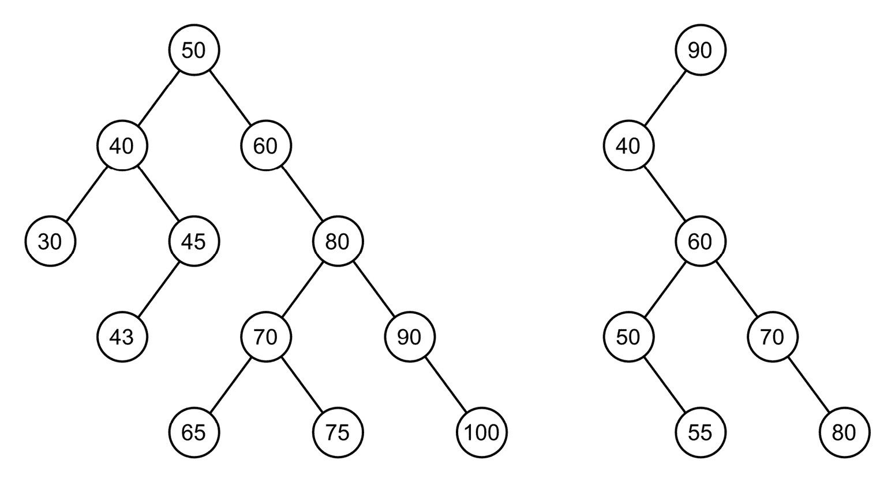

Figure 7.8 – Illustration of binary search trees.
The tree shown on the left-hand side contains 12 nodes. Let’s check whether it complies with the BST rule. You can do so by analyzing each node in the tree, except leaf nodes. Let’s start with the root node (with value **50**), which contains four descendant nodes in the left subtree (**40**, **30**, **45**, **43**), all smaller than **50**. The root node contains seven descendant nodes in the right subtree (**60**, **80**, **70**, **65**, **75**, **90**, **100**), all greater than **50**. That means that the BST rule is satisfied for the root node. While checking the BST rule for node **80**, you see that the values of all descendant nodes in the left subtree (**70**, **65**, **75**) are smaller than **80**, while the values in the right subtree (**90**, **100**) are greater than **80**. You should perform the same verification for all other nodes. Similarly, you can confirm that the BST from the right-hand side of the diagram adheres to the rules.
However, two such BSTs significantly differ in their **topology**. Both have the same height, but the number of nodes is different, namely 12 and 7\. The one on the left seems to be **fat**, while the other is rather **skinny**. Which one is better? To answer this question, let’s think about the algorithm for searching a value in the tree. As an example, the process of searching for the value **43** is shown in the following diagram:
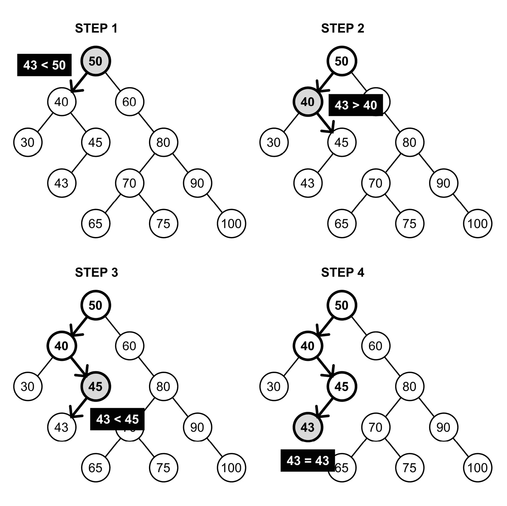

Figure 7.9 – Searching for a given value in a BST
At the beginning (**Step 1**), you take a value of the root node (that is, **50**) and check whether the given value (**43**) is smaller or greater. It is smaller, so you proceed to search in the left subtree (**Step 2**). Thus, you compare **43** with **40**. This time, the right subtree is chosen because **43** is greater than **40**. Next, **43** is compared with **45** (**Step 3**), and the left subtree is chosen. Here, you compare **43** with **43**, and the given value is found (**Step 4**). If you take a look at the tree, you will see that only four comparisons are necessary.
What about the performance?
The shape of a tree has a great impact on the lookup performance. Of course, **it is much better to have a fat tree with limited height than a skinny tree with a bigger height**. The performance boost is caused by making decisions as to whether searching should be continued in the left or right subtree, without the necessity of analyzing the values of all nodes. If nodes do not have both subtrees, the positive impact on the performance will be limited. In the worst case, when each node contains only one child, the search time is even linear. However, in the ideal BST, the lookup time is an *O(log* *n)* operation.
After this short introduction, let’s proceed to the implementation in the C# language. At the end, you will see an example that shows how to use this data structure in practice.
Implementation
The implementation of a BST is a bit more difficult than the previously described variants of trees. For example, it requires you to prepare operations of insertion and removal of nodes from a tree, which do not break the rule regarding the arrangement of elements in the BST. You will see a solution shortly.
Tree
The whole tree is represented by an instance of the `BinarySearchTree` class, which inherits from the `BinaryTree` generic class, as in the following code snippet:

```

public class BinarySearchTree<T>

: BinaryTree<T>

where T : IComparable

{

}

```cs

 It is worth mentioning that the type of data, stored in each node, should be comparable. For this reason, it has to implement the `IComparable` interface. Such a requirement is necessary because the algorithm needs to know the relationships between values.
Of course, it is not the final version of the implementation of the `BinarySearchTree` class. You will very soon learn how to add new features, such as lookup, insertion, and removal of nodes.
Lookup
Now, let’s take a look at the `Contains` method, which checks whether the tree contains a node with a given value. Of course, this method takes into account the BST rule regarding the arrangement of nodes to limit the number of comparisons. The code is presented in the following block:

```

public bool Contains(T data)

{

BinaryTreeNode<T>? node = Root;

while (node != null)

{

int result = data.CompareTo(node.Data);

如果结果为 0，则返回 true；

else if (result < 0) { node = node.Left; }

else { node = node.Right; }

}

return false;

}

```cs

 The method takes only one parameter, namely the value to find in the tree. Inside the method, a `while` loop exists. Within it, the searched value is compared with the value of the current node. If they are equal (the comparison returns `0`), the value is found, and `true` is returned to inform that the search is completed successfully. If the searched value is smaller than the value of the current node, the algorithm continues searching in the left subtree. Otherwise, the right subtree is used instead.
How to compare objects?
The `CompareTo` method is provided by the implementation of the `IComparable` interface from the `System` namespace. Such a method makes it possible to compare two values. If they are equal, `0` is returned. If the object on which the method is called is bigger than the parameter, a value higher than `0` is returned. Otherwise, a value lower than `0` is returned.
The loop is executed until the node is found or there is no suitable child node to follow.
Insertion
The next necessary operation is the insertion of a node into a BST. Such a task is a bit more complicated because you need to find a place for adding a new element that will not violate BST rules. Let’s take a look at the code of the `Add` method:

```

public void Add(T data)

{

BinaryTreeNode<T>? parent = GetParentForNewNode(data);

BinaryTreeNode<T> node = new()

{

Data = data,

Parent = parent

};

if (parent == null)

{

Root = node;

}

else if (data.CompareTo(parent.Data) < 0)

{

parent.Left = node;

}

else

{

parent.Right = node;

}

Count++;

}

```cs

 The method takes one parameter, namely a value that should be added to the tree. Within the method, you find a parent element (using the `GetParentForNewNode` auxiliary method, shown a bit later), where a new node should be added as a child. Then, a new instance of the `BinaryTreeNode` class is created, and the values of its `Data` and `Parent` properties are set.
In the following part of the method, you check whether the found parent element is equal to `null`. It means that there are no nodes in the tree, and a new node should be added as the root, which is well visible in the line, where a reference to the node is assigned to the `Root` property.
The next comparison checks whether the value for addition is smaller than the value of the parent node. In such a case, a new node should be added as the left child of the parent node. Otherwise, the new node is placed as the right child of the parent node. At the end, the number of elements stored in the tree is incremented.
Let’s take a look at the auxiliary method for finding the parent element for a new node:

```

private BinaryTreeNode<T>? GetParentForNewNode(T data)

{

BinaryTreeNode<T>? current = Root;

BinaryTreeNode<T>? parent = null;

while (current != null)

{

parent = current;

int result = data.CompareTo(current.Data);

if (result == 0) { throw new ArgumentException(

$"节点 {data} 已存在。"); }

else if (result < 0) { current = current.Left; }

else { current = current.Right; }

}

return parent;

}

```cs

 This method takes one parameter, namely a value of the new node. Within this method, you declare two variables representing the currently analyzed node (`current`) and the parent node (`parent`). Such values are modified in a `while` loop until the algorithm finds a proper place for the new node.
In the loop, you store a reference to the current node as the potential parent node. Then, you check whether the value for addition is equal to the value of the current node. If so, an exception is thrown because it is not allowed to add more than one element with the same value to the analyzed version of the BST. If the value for addition is smaller than the value of the current node, the algorithm continues searching for a place for the new node in the left subtree. Otherwise, the right subtree of the current node is used. At the end, the value of the `parent` variable is returned to indicate the found location for the new node.
Removal
You now know how to create a new BST, add some nodes to it, as well as check whether a given value already exists in the tree. However, can you also remove an item from a tree? Of course! The main method regarding the removal of a node from the tree is named `Remove` and takes only one parameter, namely the value of the node that should be removed. The implementation of the `Remove` method is as follows:

```

public void Remove. 这个私有方法的实现更为复杂，具体如下：

```cs
private void Remove(BinaryTreeNode<T>? node, T data)
{
    if (node == null)
    {
        return;
    }
    else if (data.CompareTo(node.Data) < 0)
    {
        Remove(node.Left, data);
    }
    else if (data.CompareTo(node.Data) > 0)
    {
        Remove(node.Right, data);
    }
    else
    {
        if (node.Left == null || node.Right == null)
        {
            BinaryTreeNode<T>? newNode =
                node.Left == null && node.Right == null
                    ? null
                    : node.Left ?? node.Right;
            ReplaceInParent(node, newNode!);
            Count--;
        }
        else
        {
            BinaryTreeNode<T> successor =
                FindMinimumInSubtree(node.Right);
            node.Data = successor.Data;
            Remove(successor, successor.Data!);
        }
    }
}
```

在开始时，方法检查当前节点（`node`参数）是否存在。如果不存在，则退出方法。

然后，`Remove`方法尝试找到要删除的节点。这是通过比较当前节点的值与要删除的值，并对当前节点的左子树或右子树递归调用`Remove`方法来实现的。

方法中最有趣的操作在以下部分进行。在这里，你需要处理四种节点删除场景，如下所示：

+   删除叶子节点

+   删除只有一个左子节点的节点

+   删除只有一个右子节点的节点

+   删除既有左子节点又有右子节点的节点

**删除叶子节点**的情况，你只需更新父元素中删除节点的引用。因此，将不会有从父节点到删除节点的引用，在遍历树时无法访问到它。

**删除只有一个左子节点的节点**也很简单，因为你只需要将删除节点的引用（在父元素中）替换为删除节点的左子节点。以下图示展示了如何删除只有一个左子节点的节点**80**：

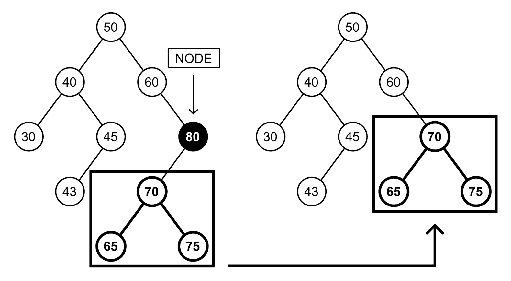

图 7.10 – 从二叉搜索树中删除只有一个左子节点的节点

**删除只有一个右子节点的节点**的情况与第二种情况非常相似。因此，你只需将删除节点的引用（在父元素中）替换为删除节点的右子节点。

所有的这三种情况都在代码中以类似的方式处理，通过调用`ReplaceInParent`辅助方法，其代码如下：

```cs
private void ReplaceInParent(BinaryTreeNode<T> node,
    BinaryTreeNode<T> newNode)
{
    if (node.Parent != null)
    {
        BinaryTreeNode<T> parent =
            (BinaryTreeNode<T>)node.Parent;
        if (parent.Left == node) { parent.Left = newNode; }
        else { parent.Right = newNode; }
    }
    else { Root = newNode; }
    if (newNode != null) { newNode.Parent = node.Parent; }
}
```

该方法接受两个参数：要删除的节点（`node`）和应在父节点中替换它的节点（`newNode`）。因此，如果你想删除一个叶子节点，只需将第二个参数传递为`null`，因为你不想用任何其他东西替换被删除的节点。在删除只有一个子节点的情况下，你传递左子节点或右子节点的引用。

如果被删除的节点不是根节点，你需要检查它是否是父节点的左子节点。如果是，则更新适当的引用。这意味着新节点被设置为被删除节点的父节点的左子节点。以类似的方式，该方法处理被删除节点是父节点的右子节点的情况。如果被删除的节点是根节点，则替换节点被设置为根节点。最后，你检查新节点是否不等于`null`。这意味着你并没有删除一个叶子节点。在这种情况下，你设置`Parent`属性的值以指示新节点应该具有与被删除节点相同的父节点。

一个更复杂的情况是`Remove`方法递归地应用于找到的节点。相关代码片段如下所示，此代码片段是从`Remove`私有方法中复制出来的，以方便你阅读：

```cs
BinaryTreeNode<T> successor =
    FindMinimumInSubtree(node.Right);
node.Data = successor.Data;
Remove(successor, successor.Data!);
```

最后的辅助方法命名为`FindMinimumInSubtree`，如下所示：

```cs
private BinaryTreeNode<T> FindMinimumInSubtree(
    BinaryTreeNode<T> node)
{
    while (node.Left != null) { node = node.Left; }
    return node;
}
```

该方法接受子树的根节点作为参数，其中应找到最小值。在方法内部，使用`while`循环来获取最左边的元素。当没有左子节点时，返回`node`变量的当前值。

你可以在哪里找到更多信息？

书籍、研究论文以及互联网上关于 BST 的信息有很多。然而，所提供的 BST 实现是基于在 https://en.wikipedia.org/wiki/Binary_search_tree 中显示的代码，在那里你还可以找到有关此数据结构的更多信息。我强烈建议你对各种数据结构和算法保持好奇心，并拓宽你的知识面。

前面的代码看起来并不复杂，对吧？然而，它在实际中是如何工作的呢？让我们看看一个表示删除具有两个子节点的节点的图表：

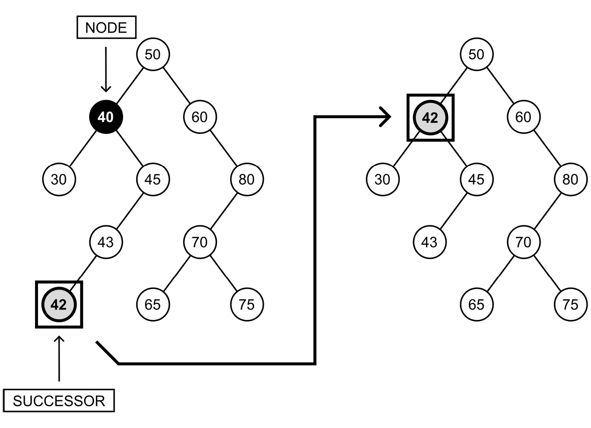

图 7.11 – 在 BST 中删除具有两个子节点的节点

图表显示了如何删除值为**40**的节点。为此，你需要找到后继节点。它是被删除节点的右子树中具有最小值的节点。后继节点是**42**，它替换了**40**。

示例 – BST 可视化

在阅读有关二叉搜索树（BSTs）的部分时，你学到了很多关于这种数据结构的知识。因此，现在是时候创建一个示例程序来查看这种树的变体在实际中的表现了。该应用程序将向你展示如何创建一个 BST，添加一些节点（手动添加和使用之前介绍的插入方法），删除节点，遍历树，以及在控制台中可视化树。

开始时，通过创建 `BinarySearchTree` 类的新实例来准备一个新的树（存储整数值的节点）。通过手动添加三个节点，并指示适当的子元素和父元素引用来配置。相关代码如下：

```cs
BinarySearchTree<int> tree = new();
tree.Root = new BinaryTreeNode<int>() { Data = 100 };
tree.Root.Left = new() { Data = 50, Parent = tree.Root };
tree.Root.Right = new() { Data = 150, Parent = tree.Root };
tree.Count = 3;
Visualize(tree, "BST with 3 nodes (50, 100, 150):");
```

然后，你使用 `Add` 方法向树中添加一些节点，并使用 `Visualize` 方法可视化当前树的状态，如下所示：

```cs
tree.Add(75);
tree.Add(125);
Visualize(tree, "BST after adding 2 nodes (75, 125):");
```

让我们添加五个节点，以下代码如下：

```cs
tree.Add(25);
tree.Add(175);
tree.Add(90);
tree.Add(110);
tree.Add(135);
Visualize(tree, "BST after adding 5 nodes
    (25, 175, 90, 110, 135):");
```

接下来的操作集与从树中删除各种节点以及可视化特定更改有关。相关代码如下：

```cs
tree.Remove(25);
Visualize(tree, "BST after removing the node 25:");
tree.Remove(50);
Visualize(tree, "BST after removing the node 50:");
tree.Remove(100);
Visualize(tree, "BST after removing the node 100:");
```

最后，展示了三种遍历模式。相应的代码如下：

```cs
foreach (TraversalEnum mode
    in Enum.GetValues<TraversalEnum>())
{
    Console.Write($"\n{mode} traversal:\t");
    Console.Write(string.Join(", ",
        tree.Traverse(mode).Select(n => n.Data)));
}
```

另一个有趣的任务是在控制台中开发树的可视化。这样的功能非常有用，因为它允许舒适且快速地观察树，无需在 IDE 中调试应用程序并展开工具提示中的以下元素以显示变量的当前值。然而，在控制台中展示树不是一个简单任务。幸运的是，你无需担心这一点，因为在本节中你将学习如何实现此功能。

首先，让我们看看 `Visualize` 方法：

```cs
void Visualize(BinarySearchTree<int> tree, string caption)
{
    char[,] console = Initialize(tree, out int width);
    VisualizeNode(tree.Root, 0, width / 2,
        console, width);
    Console.WriteLine(caption);
    Draw(console);
}
```

该方法接受两个参数，即代表整个树的 `BinarySearchTree` 类的实例，以及应在可视化上方显示的标题。在方法内部，使用 `Initialize` 辅助方法初始化一个字符数组，该数组应在控制台中显示，稍后展示。然后，调用 `VisualizeNode` 递归方法将特定节点在树中的数据填充到数组的各个部分。最后，将标题和板（由数组表示）写入控制台。

`Initialize` 方法创建了上述数组，如下代码片段所示：

```cs
const int ColumnWidth = 5;
char[,] Initialize(BinarySearchTree<int> tree,
    out int width)
{
    int height = tree.GetHeight();
    width = (int)Math.Pow(2, height) - 1;
    char[,] console =
        new char[height * 2, ColumnWidth * width];
    for (int y = 0; y < console.GetLength(0); y++)
    {
        for (int x = 0; x < console.GetLength(1); x++)
        {
            console[y, x] = ' ';
        }
    }
    return console;
}
```

二维数组包含的行数等于树的高度乘以 `2`，以便也有空间用于连接节点与父节点的线条。列数根据公式 *columnwidth* * 2^height - 1 计算，其中 *columnwidth* 是 `ColumnWidth` 常量值，*height* 是树的高度。

如果你看一下结果，这些值可能更容易理解：

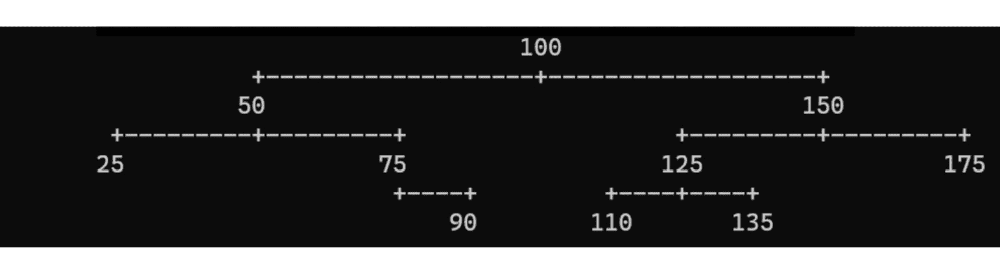

图 7.12 – BST 可视化示例的截图

在 `Visualize` 方法中，调用了 `VisualizeNode`。你对了解它是如何工作的以及如何不仅展示节点值还展示线条感兴趣吗？如果是这样，让我们看看它的代码，如下所示：

```cs
void VisualizeNode(BinaryTreeNode<int>? node, int row,
    int column, char[,] console, int width)
{
    if (node == null) { return; }
    char[] chars = node.Data.ToString().ToCharArray();
    int margin = (ColumnWidth - chars.Length) / 2;
    for (int i = 0; i < chars.Length; i++)
    {
        int col = ColumnWidth * column + i + margin;
        console[row, col] = chars[i];
    }
    int columnDelta = (width + 1) /
        (int)Math.Pow(2, node.GetHeight() + 1);
    VisualizeNode(node.Left, row + 2,
        column - columnDelta, console, width);
    VisualizeNode(node.Right, row + 2,
        column + columnDelta, console, width);
    DrawLineLeft(node, row, column, console, columnDelta);
    DrawLineRight(node, row, column, console, columnDelta);
}
```

`VisualizeNode`方法接受五个参数，包括用于可视化的当前节点(`node`)，行的索引(`row`)和列的索引(`column`)。在方法内部，有一个检查以确定当前节点是否存在。如果存在，则获取节点的值作为一个`char`数组，计算边距，并在`for`循环中将带有值字符表示的`char`数组写入缓冲区（`console`变量）。

在以下代码行中，对当前节点的左右子节点调用了`VisualizeNode`方法。当然，你需要调整行索引（通过添加`2`）和列索引（通过添加或减去计算出的值）。

最后，通过调用`DrawLineLeft`和`DrawLineRight`方法来绘制线条。第一个在以下代码片段中展示：

```cs
void DrawLineLeft(BinaryTreeNode<int> node, int row,
    int column, char[,] console, int columnDelta)
{
    if (node.Left == null) { return; }
    int sci = ColumnWidth * (column - columnDelta) + 2;
    int eci = ColumnWidth * column + 2;
    for (int x = sci + 1; x < eci; x++)
    {
        console[row + 1, x] = '-';
    }
    console[row + 1, sci] = '+';
    console[row + 1, eci] = '+';
}
```

该方法也接受五个参数：

+   应该绘制线的当前节点(`node`)

+   行的索引(`row`)

+   列的索引(`column`)

+   作为屏幕缓冲区的数组(`console`)

+   在`VisualizeNode`方法中计算出的增量值

在开始时，你检查当前节点是否包含左子节点，因为只有在这种情况下才需要绘制线的左侧部分。如果是这样，你计算列的起始(`sci`，代表*起始列索引*)和结束(`eci`作为*结束列索引*)索引，并用破折号填充数组的适当元素。最后，在绘制线条将与另一个元素的右侧线连接的地方以及线的另一侧添加一个加号。

几乎以相同的方式，你为当前节点绘制右侧线。当然，你需要调整有关计算列起始和结束索引的代码。`DrawLineRight`方法的最终代码如下：

```cs
void DrawLineRight(BinaryTreeNode<int> node, int row,
    int column, char[,] console, int columnDelta)
{
    if (node.Right == null) { return; }
    int sci = ColumnWidth * column + 2;
    int eci = ColumnWidth * (column + columnDelta) + 2;
    for (int x = sci + 1; x < eci; x++)
    {
        console[row + 1, x] = '-';
    }
    console[row + 1, sci] = '+';
    console[row + 1, eci] = '+';
}
```

最后，让我们看看在控制台中显示棋盘的`Draw`方法。它只是遍历数组的所有元素并将它们写入控制台，如下所示：

```cs
void Draw(char[,] console)
{
    for (int y = 0; y < console.GetLength(0); y++)
    {
        for (int x = 0; x < console.GetLength(1); x++)
        {
            Console.Write(console[y, x]);
        }
        Console.WriteLine();
    }
}
```

那就结束了！你已经写下了构建项目、启动程序并看到其运行的整个代码。启动后，你会看到第一个 BST，如下所示：


图 7.13 – BST 可视化示例截图，步骤 1

添加下一个两个节点`75`和`125`后，BST 看起来略有不同：


图 7.14 – BST 可视化示例截图，步骤 2

然后，你为接下来的五个元素执行插入操作。这些操作对树形结构有非常明显的影响，如控制台所示：

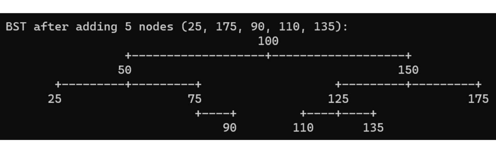

图 7.15 – BST 可视化示例截图，步骤 3

在添加了 10 个元素之后，程序显示了移除特定节点对树形状的影响。首先，让我们移除值为`25`的叶节点：

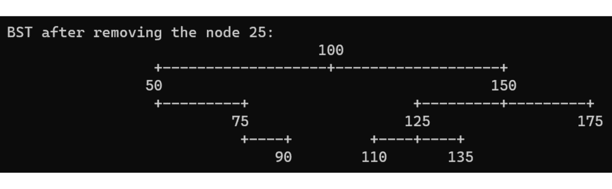

图 7.16 – BST 可视化示例的截图，步骤 4

然后，程序移除只有一个子节点的节点，即右子节点。有趣的是，右子节点也有一个右子节点。然而，所提出的算法在这种情况下也能正常工作，您得到了以下结果：

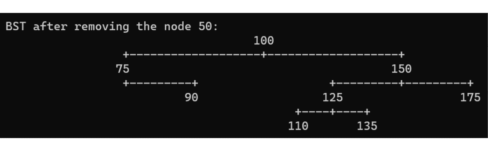

图 7.17 – BST 可视化示例的截图，步骤 5

最后一个移除操作是最复杂的，因为它需要您移除具有两个子节点的节点，并且它还扮演着根的角色。在这种情况下，从根的右子树的最左端找到元素，并将其替换为要移除的节点，如图树最终视图所示：

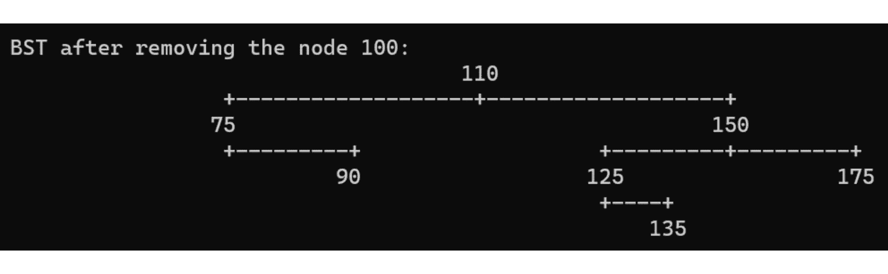

图 7.18 – BST 可视化示例的截图，步骤 6

剩下的一组操作是树的遍历，即先序、中序和后序遍历。应用程序呈现了以下结果：

```cs
Pre-order traversal:    110, 75, 90, 150, 125, 135, 175
In-order traversal:     75, 90, 110, 125, 135, 150, 175
Post-order traversal:   90, 75, 135, 125, 175, 150, 110
```

创建的应用程序看起来相当令人印象深刻，不是吗？您不仅从头开始实现了 BST 的实现，还为在控制台中可视化它准备了平台。干得好！

它已经排序了吗？

让我们再次查看中序遍历的结果。如您所见，在 BST 的情况下，它以升序排序节点。

然而，您能看出创建的解决方案中存在潜在问题吗？考虑一下只从树的给定区域移除节点或插入已排序值的情况。这可能意味着一个具有适当**宽度-深度比**的胖树可能会变成瘦树。在最坏的情况下，它甚至可能被描绘成一个列表，其中所有节点只有一个子节点。您有什么想法来解决不平衡树的问题并始终保持其平衡吗？如果没有，接下来您将找到一些关于如何实现这一目标的信息。

自平衡树

在本节中，您将了解**自平衡树**的两种变体，这些变体**在添加和移除节点时始终保持树平衡**。然而，为什么这如此重要呢？如前所述，查找性能取决于树的形状。在不适当的节点组织情况下，形成列表，搜索给定值的操作可能是一个*O(n)*操作。而一个正确排列的树，其性能可以通过*O(log n)*显著提高。

你知道 BST 可以非常容易地变成一个**不平衡树**吗？让我们做一个简单的测试，向树中添加以下九个数字，从**1**到**9**。然后，你将收到一个如左图所示的树形。然而，相同的值可以以另一种方式排列，形成一个**平衡树**，具有显著更好的宽度-深度比，如右图所示：

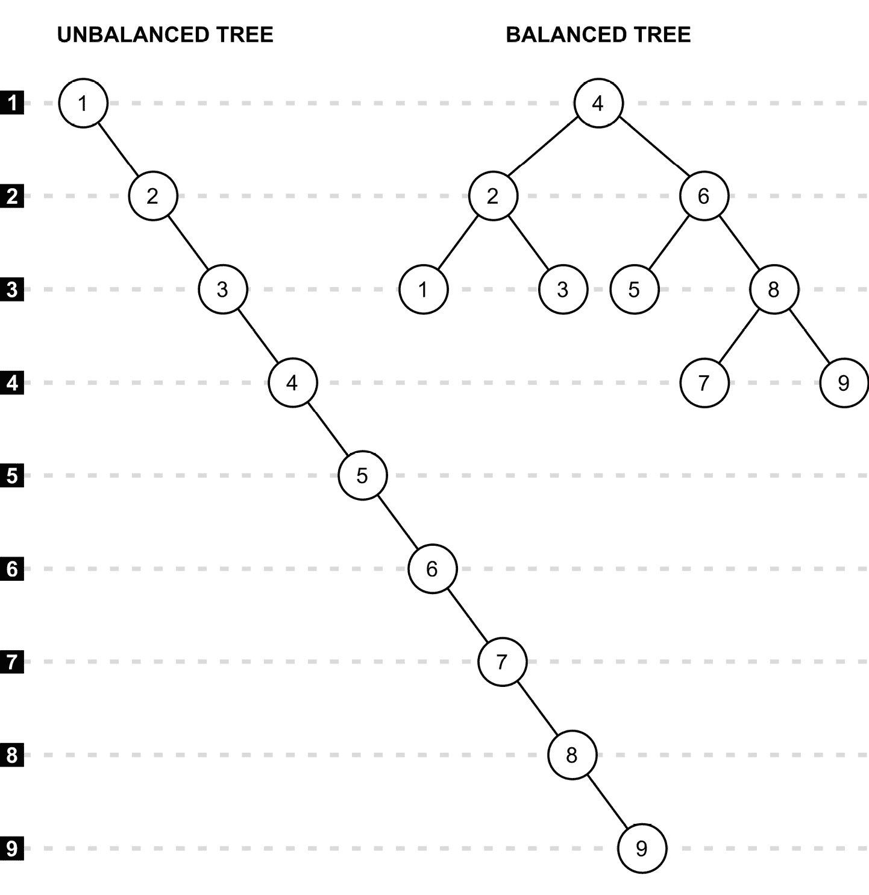

图 7.19 – 不平衡树与平衡树的差异

你现在知道了不平衡树和平衡树是什么，以及自平衡树的目标是什么。然而，AVL 树或红黑树是什么？它们是如何工作的？在使用这些数据结构时应该考虑哪些规则？你将在下一部分找到这些问题的答案。

AVL 树

**AVL 树**是以其发明者 Adelson-Velsky 和 Landis 的名字命名的。它**是一种二叉搜索树，它还要求每个节点的左右子树的高度之差不能超过一**。当然，在向树中添加和删除节点后，必须保持这条规则。旋转在这个过程中扮演着重要的角色，用于纠正节点的错误排列。

性能如何？

在讨论 AVL 树时，指出这种数据结构的性能至关重要。在这种情况下，插入、删除和查找的平均和最坏情况的时间复杂度都是*O(log n)*，因此与 BST 相比，最坏情况下的性能有显著提升。

AVL 树的实现，包括保持树平衡状态所需的必要旋转，并不简单，需要相当长的解释。由于本书的页数有限，其实现在此未展示。幸运的是，你可以使用一个支持此类基于树的 NuGet 包，在你的应用程序中利用 AVL 树。

红黑树

**红黑树**（**RBT**）是自平衡二叉搜索树的下一个变体。作为 BST 的变体，这种数据结构要求维护标准的 BST 规则。此外，还必须考虑以下规则：

+   **每个节点必须着色为红色或黑色**。因此，你需要为存储颜色的节点添加额外的数据。

+   `NIL`伪节点应作为树的叶子使用，而所有其他节点都是内部节点。此外，所有`NIL`伪节点都必须是黑色的。

+   **如果一个节点是红色，那么它的两个子节点必须是黑色**。

+   对于任何节点，`NIL`伪节点**必须相同**。

正确的红黑树在以下图中展示：

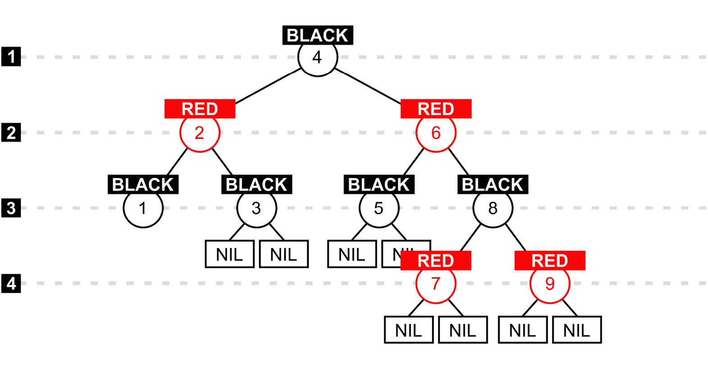

图 7.20 – 红黑树的示意图

该树由九个节点组成，每个节点着色为红色或黑色。值得一提的是 `NIL` 伪节点，它们被添加为叶子节点。如果你再次查看之前列出的规则集，你可以确认在这种情况下所有这些规则都得到了维护。

与 AVL 树类似，RBTs 在添加或删除节点后也必须维护规则。在这种情况下，恢复 RBT 属性的过程甚至更加复杂，因为它涉及到 **重新着色** 和 **旋转**。

性能如何？

在讨论这种自平衡二叉搜索树变体时，也值得注意其性能。在平均情况和最坏情况下，插入、删除和查找操作都是 *O(log n)* 操作，因此它们与 AVL 树的情况相同，并且在最坏情况下比 BSTs 更好。

幸运的是，你不需要了解和理解内部细节，这些细节相当复杂，才能从这种数据结构中受益并将其应用于你的项目。正如在 AVL 树的情况下已经提到的，你也可以使用可用的 NuGet 包之一来处理 RBTs。

你在哪里可以找到更多信息？

树的主题比本章所展示的要广泛得多。因此，如果你对这样的主题感兴趣，我强烈建议你自己去寻找更多信息。你还可以在 *Wikipedia* 上找到一些内容，例如在 [`en.wikipedia.org/wiki/Binary_tree`](https://en.wikipedia.org/wiki/Binary_tree) 和 [`en.wikipedia.org/wiki/Binary_search_tree`](https://en.wikipedia.org/wiki/Binary_search_tree)。自平衡树的内容在 [`en.wikipedia.org/wiki/AVL_tree`](https://en.wikipedia.org/wiki/AVL_tree) 和 [`en.wikipedia.org/wiki/Red-black_tree`](https://en.wikipedia.org/wiki/Red-black_tree) 中介绍。本章后面提到的 tries 和二叉堆（binary heaps）的主题也在 [`en.wikipedia.org/wiki/Trie`](https://en.wikipedia.org/wiki/Trie) 和 [`en.wikipedia.org/wiki/Binary_heap`](https://en.wikipedia.org/wiki/Binary_heap) 中介绍。

你已经了解了一些关于自平衡树的基本信息，即 AVL 树和 RBTs。那么，让我们看看另一种基于树的结构，即 trie，它是字符串相关操作的绝佳解决方案。

Tries

树是一种强大的数据结构，在各种场景中使用。其中之一与处理字符串相关，例如用于 **自动完成** 和 **拼写检查** 功能，这些功能你肯定从许多系统中都了解过。如果你想在你的应用程序中实现它，你可以从另一种基于树的数据库结构中受益，即 **Trie**。它用于存储字符串并执行基于前缀的搜索。

**Trie** 是一种树，只有一个根节点，其中每个节点代表一个字符串，每条边表示一个字符。Trie 节点包含对下一个节点的引用，作为一个包含 26 个元素的数组，代表字母表中的 26 个字符（从**a**到**z**）。当您从根节点到每个节点移动时，您会收到一个字符串，它要么是一个已保存的单词，要么是**它的子串**。

为什么正好是 26 个元素？

在这里，我们使用代表 26 个字符的 26 个元素，因为这是字母表中 `a` 和 `z` 之间基本字符的确切数量，没有任何特殊字符存在于各种语言中。当然，在您的实现中，您可以扩展这个集合，包括其他字符，例如来自波兰语的 `ą`、`ę` 或 `ś`，以及甚至数字或一些特殊字符，例如破折号。选择合适的字符集取决于此数据结构将用于的场景。

这听起来复杂吗？可能是的，所以让我们看看下面的图，它应该能消除任何疑虑：

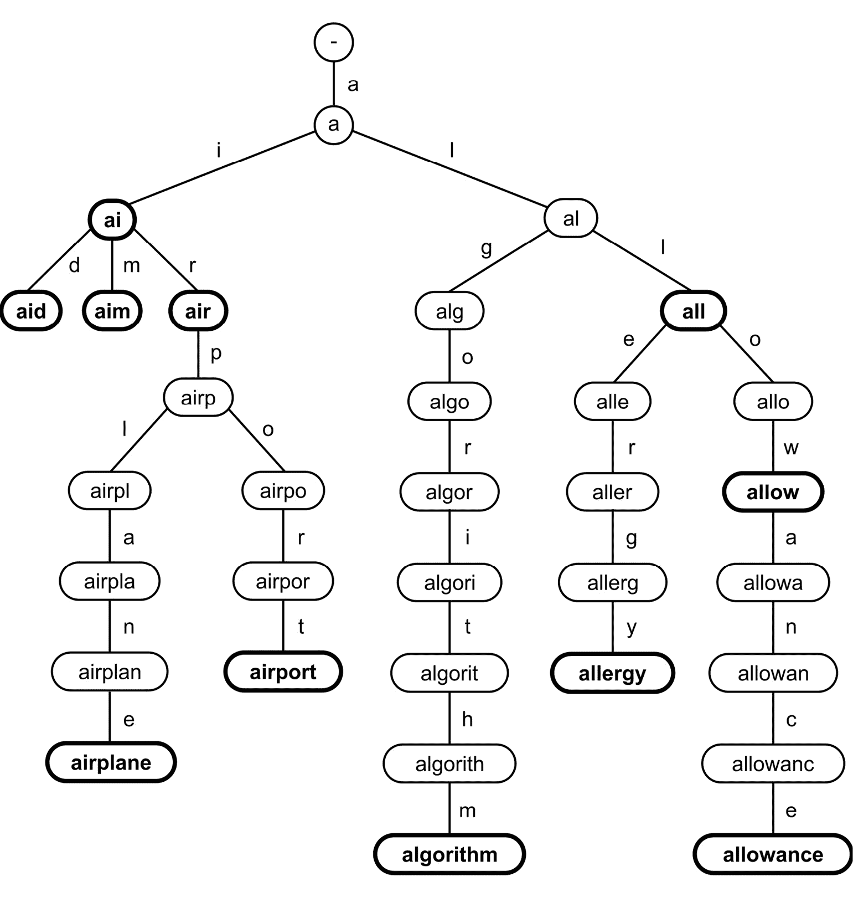

图 7.21 – trie 的示意图

该图展示了存储以下单词的 trie：**ai**、**aid**、**aim**、**air**、**airplane**、**airport**、**algorithm**、**all**、**allergy**、**allow**、**allowance**。正如您所看到的，有一个根节点（用**-**标记），它只包含一个子节点，即代表 **a** 子串。此节点包含两个子节点，分别对应 **ai** 单词和 **al** 子串。**ai** 节点有三个子节点，分别代表 **aid**、**aim** 和 **air** 单词。以类似的方式，您可以分析整个 trie。请记住，单词用粗线标记，而子串用较细的线表示。

性能如何？

在 trie 的情况下，搜索和插入是 *O(n)* 操作，其中 *n* 表示单词长度。因此，trie 是一种高效的字符串操作数据结构。

实现

在这个简短的介绍之后，让我们转向一些更令人兴奋的事情——编码！

节点

请查看以下表示节点的类的实现：

```cs
public class TrieNode
{
    public TrieNode[] Children { get; set; }
        = new TrieNode[26];
    public bool IsWord { get; set; } = false;
}
```

`TrieNode` 类包含两个属性。第一个属性名为 `Children`，是一个包含 `26` 个元素的数组。每个元素代表字母表中的一个特定字母，从 `a`（索引等于 `0`）到 `z`（索引等于 `25`）。如果有另一个具有相同前缀的单词，则下一个节点的引用位于 `Children` 数组的一个合适元素中。第二个属性名为 `IsWord`，表示当前节点是否是单词的最后一个字符。这意味着您可以通过从根元素移动到该节点来获取此单词。

Trie

代码的下一部分展示了表示 trie 的类的实现：

```cs
public class Trie
{
    private readonly TrieNode _root = new();
}
```

在这里，有一个表示根元素的私有字段。当然，你需要添加一些方法来使其可用。首先，让我们实现一个检查给定单词是否存在于字典树中的方法。其代码如下：

```cs
public bool DoesExist(string word)
{
    TrieNode current = _root;
    foreach (char c in word)
    {
        TrieNode child = current.Children[c - 'a'];
        if (child == null) { return false; }
        current = child;
    }
    return current.IsWord;
}
```

首先，你保存根元素的引用作为当前节点。然后，你遍历构成单词的以下字符。对于每个字符（由`c`变量表示），你获取一个适当的节点（`child`）。如果它是`null`，则意味着该单词不在字典树中。否则，你保存子元素作为当前节点。当`foreach`循环结束时，当前节点代表最后一个字符的节点，因此你只需返回`IsWord`属性的值。

下一个方法允许你将单词插入到字典树中，如下所示：

```cs
public void Insert(string word)
{
    TrieNode current = _root;
    foreach (char c in word)
    {
        int i = c - 'a';
        current.Children[i] = current.Children[i] ?? new();
        current = current.Children[i];
    }
    current.IsWord = true;
}
```

前面的代码与已描述的代码有些相似。然而，在`foreach`循环中有一个重要的区别。在这里，如果你为构成单词的任何字符都没有找到子节点，则创建一个新的子节点。最后，通过将`IsWord`属性的值设置为`true`，你表明该节点代表一个单词。

如前所述，字典树是一种数据结构，它允许你以高效的方式执行**基于前缀的搜索**。因此，让我们来实现它：

```cs
public List<string> SearchByPrefix(string prefix)
{
    TrieNode current = _root;
    foreach (char c in prefix)
    {
        TrieNode child = current.Children[c - 'a'];
        if (child == null) { return []; }
        current = child;
    }
    List<string> results = [];
    GetAllWithPrefix(current, prefix, results);
    return results;
}
```

该方法接受一个参数，即搜索单词的前缀。一开始，你遍历前缀的所有字符以获取形成前缀的最后一个字符的引用。如果在任何阶段找不到子节点，则返回一个空列表，这意味着没有结果。

否则，你创建一个`List<string>`实例来存储结果，然后调用`GetAllWithPrefix`方法，其代码如下：

```cs
private void GetAllWithPrefix(TrieNode node,
    string prefix, List<string> results)
{
    if (node == null) { return; }
    if (node.IsWord) { results.Add(prefix); }
    for (char c = 'a'; c <= 'z'; c++)
    {
        GetAllWithPrefix(node.Children[c - 'a'],
            prefix + c, results);
    }
}
```

你需要检查当前节点是否为`null`。如果是，则从方法中返回。否则，你将验证当前节点是否构成一个单词。如果是，则将其添加到`results`中。接下来，你遍历所有字母字符，即从`a`到`z`，并递归调用相同的方法以找到下一个单词并将它们添加到`results`列表中。

如你所见，字典树的基本实现并不复杂，可以用清晰简洁的代码完成。然而，你如何测试字典树的实际效果呢？让我们看看：

```cs
Trie trie = new();
trie.Insert("algorithm");
trie.Insert("aid");
trie.Insert("aim");
trie.Insert("air");
trie.Insert("ai");
trie.Insert("airport");
trie.Insert("airplane");
trie.Insert("allergy");
trie.Insert("allowance");
trie.Insert("all");
trie.Insert("allow");
bool isAir = trie.DoesExist("air");
List<string> words = trie.SearchByPrefix("ai");
foreach (string word in words)
{
    Console.WriteLine(word);
}
```

前面的代码形成一个字典树，如图 7**.21**所示，有以`a`开头的 11 个单词，例如`algorithm`和`allow`。你使用`Insert`方法添加这样的单词。然后，使用`DoesExist`方法检查`air`单词是否存在。接下来，你获取所有以`ai`前缀开头的单词并将它们写入控制台：

```cs
ai
aid
aim
air
airplane
airport
```

在关于 trie 的部分结束时，让我们谈谈这种数据结构的空间复杂度。如您所见，您需要为每个 trie 节点存储 26 个子节点引用，并且可能有很多只有一两个引用被设置的情况。例如，您可以看看 `algorithm` 这个词，其中浪费了很多空间。通过某种方式优化它，使整个树更小会更好。

幸运的是，可以使用另一种名为 **radix tree** 或 **压缩 trie** 的数据结构，它是 **trie 的空间优化版本**。区别相当简单：即 **您将此父节点的唯一子节点与父节点合并**。当然，在这种情况下，**边可以表示子串**。

如果您想看到与 trie 图表相同的输入数据的 radix tree 的样子，请看以下图表：

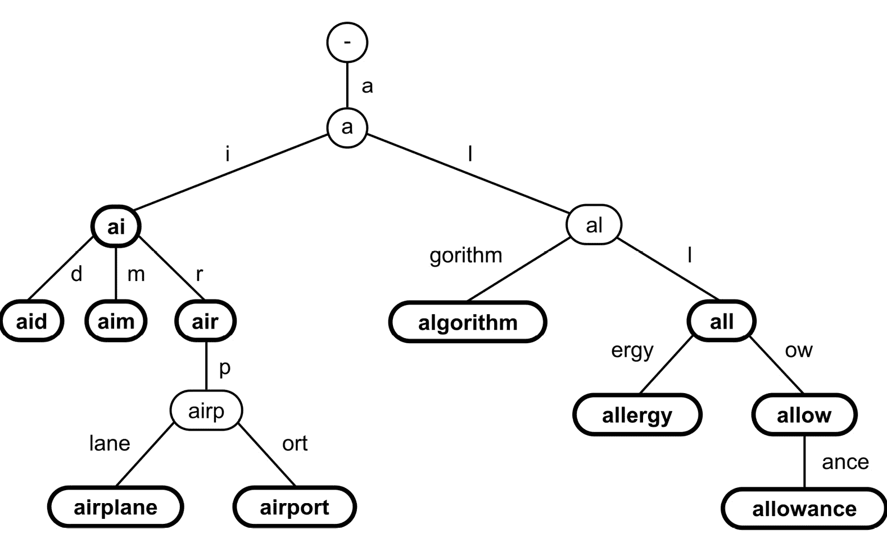

图 7.22 – 根树示意图

看起来简单多了，不是吗？例如，让我们分析从根节点到 **算法** 的路径。在这里，您只需使用三个边，即 **a**、**l** 和 **gorithm**。

尝试自己实现它

基于前面的图表和 trie 的实现，我鼓励您尝试自己实现 radix tree。您还应该准备一个在这样数据结构中搜索单词的方法。祝你好运！

示例 – 自动完成

作为 trie 应用程序的示例，您将创建一个包含国家名称的 `Countries.txt` 文件，并将其作为内容添加到项目中，该内容将被自动复制到输出目录。

如何将文件添加到项目中？

您应该在 `.txt` 扩展名的项目节点上右键单击。确认后，文件将被创建。如果您想将此文件标记为内容文件并自动将其复制到输出目录，您应该单击文件并在 **属性** 窗口中更改两个属性。首先，将 **生成操作** 更改为 **内容**。然后，将 **复制到输出目录** 设置为 **始终复制**。

国家名称的部分文件内容如下：

```cs
Afghanistan
Albania
Algeria (...)
Pakistan
Palau
Panama
Papua New Guinea
Paraguay
Peru
Philippines
Poland
Portugal (...)
Zambia
Zimbabwe
```

当然，前面的代码片段中省略了很多国家名称。然而，当国家名称文件准备好后，您需要读取其内容并形成一个 trie，如下面的代码块所示：

```cs
using System.Text.RegularExpressions;
Trie trie = new();
string[] countries =
    await File.ReadAllLinesAsync("Countries.txt");
foreach (string country in countries)
{
    Regex regex = new("[^a-z]");
    string name = country.ToLower();
    name = regex.Replace(name, string.Empty);
    trie.Insert(name);
}
```

在开始时，您创建 `Trie` 类的新实例。然后，您从 `Countries.txt` 文件中读取所有行并将它们存储在 `countries` 数组中。

代码的其余部分由一个 `foreach` 循环组成，该循环遍历所有国家名称。对于每一个，您将其转换为小写并删除所有除了 `a`-`z` 的字符。这个任务通过正则表达式和 `System.Text.RegularExpressions` 命名空间中的 `Regex` 类来完成。

当 trie 准备就绪后，您使用一个 `while` 循环，如下所示：

```cs
string text = string.Empty;
while (true)
{
    Console.Write("Enter next character: ");
    ConsoleKeyInfo key = Console.ReadKey();
    if (key.KeyChar < 'a' || key.KeyChar > 'z') { return; }
    text = (text + key.KeyChar).ToLower();
    List<string> results = trie.SearchByPrefix(text);
    if (results.Count == 0) { return; }
    Console.WriteLine(
        $"\nSuggestions for {text.ToUpper()}:");
    results.ForEach(r => Console.WriteLine(r.ToUpper()));
    Console.WriteLine();
}
```

在 `while` 循环中，你等待用户按下任何键。如果这个键不是 `a` 到 `z` 之间的字母，程序将结束其操作。否则，你将输入的字符追加到用于搜索以该前缀开头的所有国家名称的前缀中。如果结果数量为零，应用程序将结束其操作。否则，你使用 `ForEach` 扩展方法将每个建议写入单独的一行。

如你所见，前缀树为你提供了一个强大而高效的机制来实现自动完成功能。但在实践中它看起来是什么样子呢？让我们看看以下关于搜索 `POLAND` 的输出：

```cs
Enter next character: p
Suggestions for P:
PAKISTAN
PALAU
PANAMA
PAPUANEWGUINEA
PARAGUAY
PERU
PHILIPPINES
POLAND
PORTUGAL
Enter next character: o
Suggestions for PO:
POLAND
PORTUGAL
Enter next character: l
Suggestions for POL:
POLAND
Enter next character: e
```

在开始时，你可以看到以 `P` 开头的国家名称。在输入 `O` 之后，你将结果限制为以 `PO` 开头的国家名称。以同样的方式，你可以进一步增加前缀，并得到越来越少的结果。

让我们继续本章的最后部分，这部分与堆有关。堆是什么，为什么它们会在关于树的章节中出现？

堆

**堆**是树的另一种变体，你已经在 *第三章* *数组和排序* 中了解到了。在那里，你使用堆在堆排序算法中对数组进行排序。因此，在本章中，你将只看到这个数据结构的一个简要总结。然而，我强烈建议你不要离开这个主题，并且自己学习更多关于堆的知识，因为它们是强大且流行的数据结构。

如你所知，二叉堆存在两种版本：**最小堆**和**最大堆**。对于每一种，都必须满足一个额外的属性：

+   **对于最小堆**：每个节点的值必须大于或等于其父节点的值

+   **对于最大堆**：每个节点的值必须小于或等于其父节点的值

这些规则起着非常重要的作用，因为它们规定**根节点始终包含最小值（在最小堆中）或最大值（在最大堆中）**。你在排序时受益于这个假设。你还记得吗？

二叉堆还必须遵循**完全二叉树**规则，该规则要求**每个节点不能包含超过两个子节点，并且树的所有层级必须完全填充，除了最后一层，最后一层必须从左到右填充**，并且可以在右侧留出一些空间。

让我们看看以下两个二叉堆：

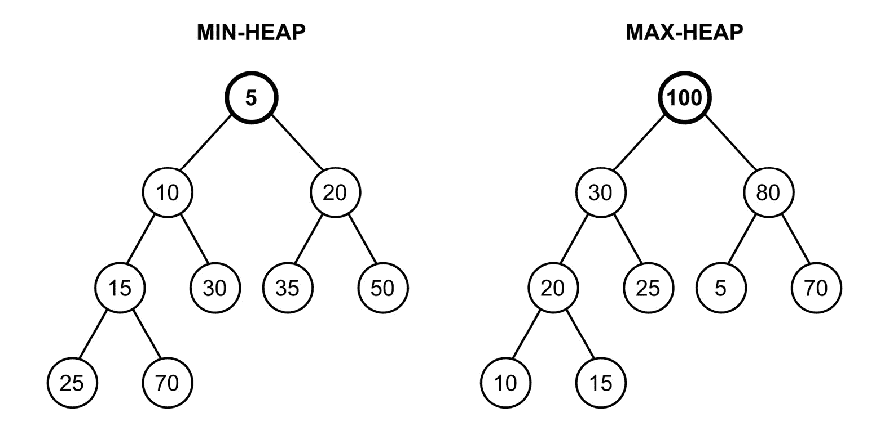

图 7.23 – 最小堆和最大堆的示意图

你可以轻松地检查这两个堆是否都遵循所有规则。作为一个例子，让我们验证最小堆变体中值等于 **20** 的节点（如图中左侧所示）的堆属性。该节点有两个子节点，其值分别为 **35** 和 **50**，这两个值都大于 **20**。以同样的方式，你可以检查堆中的其他节点。

二叉树规则也被保持，因为每个节点最多包含两个子节点。最后一个要求是树的每一层除了最后一层都要完全填满，最后一层不需要完全填满，但必须从左到右包含节点。在最小堆的例子中，有三层被完全填满（分别包含一个、两个和四个节点），而最后一层包含两个节点（**25**和**70**），放置在两个最左边的位置。同样，你可以确认最大堆（如右图所示）配置正确。

在对堆的主题，尤其是二叉堆的简短介绍结束时，值得提到的是其广泛的应用范围。首先，这种数据结构是实现**优先队列**的便捷方式，具有插入新值和移除最小值（在最小堆中）或最大值（在最大堆中）的操作。此外，堆在**堆排序算法**以及**图算法**中也被使用。

二叉堆可以从头开始实现，或者你可以使用一些已经可用的实现作为 NuGet 包。其中一个解决方案名为`PommaLabs.Hippie`，可以使用**NuGet 包管理器**轻松地在项目中安装。提到的库包含了一些堆变体的实现，包括二叉堆、**二项堆**和**斐波那契堆**。

在本章中，树无处不在，堆也是这种数据结构的代表！既然你已经对树有了很多了解，让我们继续到**总结**部分。

总结

当前章节是书中迄今为止最长的章节。然而，它包含了大量关于树变体的信息。这些数据结构在许多算法中扮演着非常重要的角色，因此了解它们以及如何在应用程序中使用它们是很好的。因此，本章不仅包含了简短的理论介绍，还包含了图表、解释和代码示例。

在一开始，**树的概念**被描述了。作为提醒，树由**节点**组成，包括一个**根节点**。根节点没有父节点，而所有其他节点都有。每个节点可以有任意数量的**子节点**。同一节点的子节点可以被称为**兄弟节点**，而没有子节点的节点被称为**叶节点**。

树的多种变体遵循这种结构。本章首先描述的是**二叉树**。在这种情况下，一个节点最多可以包含两个子节点。然而，**二叉搜索树**的规则更为严格。对于这类树中的任何节点，其左子树中所有节点的值必须小于该节点的值，而其右子树中所有节点的值必须大于该节点的值。BSTs 在许多应用中都有广泛的应用，并为开发者提供了显著的查找性能提升。然而，在向树中添加排序值时，很容易使树变得不平衡。因此，对性能的积极影响可能有限。

幸运的是，存在`NIL`伪节点。此外，如果节点是红色的，那么它的两个子节点必须是黑色的，并且对于任何节点，到达其子叶的路径上黑色节点的数量必须相同。

然后，你学习了关于**字典树**的很多知识，并看到了它们在处理字符串方面的出色性能，例如用于自动完成或拼写检查功能。每个字典树是一个只有一个根节点的树，其中每个节点代表一个字符串，每条边表示一个字符。字典树节点包含指向下一个节点的引用，这些引用作为一个包含可能字符的数组的元素。当你从根节点到每个节点移动时，你会得到一个字符串，它要么是一个已保存的单词，要么是其子串。在这一部分，还提到了**基数树**，它是字典树的空间优化版本。

本章剩余部分与**二叉堆**相关。作为提醒，堆是树的一种变体，存在两种版本，**最小堆**和**最大堆**。值得注意的是，每个节点的值必须大于或等于（对于最小堆）或小于或等于（对于最大堆）其父节点的值。

让我们继续讨论**图**，这是下一章的主题！

```cs

```
