# 探索图

在上一章中，你学习了关于树的知识。然而，你知道这样的数据结构也属于图吗？但什么是图，你如何在应用中使用它？你将在本章中找到这些以及其他许多问题的答案！

首先，将介绍关于图的基本信息，包括**节点**和**边**的解释。由于图是实践中常用的数据结构，你还将看到它们的一些应用，例如用于存储社交媒体上的朋友数据或用于在城市中寻找道路。然后，将介绍图**表示**的主题，即使用邻接表和矩阵。

在这简短的介绍之后，你将学习如何在 C#语言中实现图。此外，你还将了解两种图的遍历模式，即**深度优先搜索**（**DFS**）和**广度优先搜索**（**BFS**）。对于这两种方法，都会展示代码和详细的描述。

接下来，你将学习关于**最小生成树**（**MSTs**）的主题，以及创建它们的两种算法，即 Kruskal 算法和 Prim 算法。这些算法将以描述、代码片段和示意图的形式展示。此外，还将提供一个实际应用的例子。

另一个有趣的与图相关的问题是节点的**着色**，这将在本章的后续部分中考虑。最后，将使用 Dijkstra 算法分析在图中找到**最短路径**的主题。

正如你所见，图论涉及许多有趣的问题，而本书中仅提及其中的一些。然而，所选的主题适合在 C#语言的环境中展示各种与图相关的方面。你准备好深入图论的话题了吗？如果是的话，就开始阅读这一章吧！

本章将涵盖以下主题：

+   图的概念

+   应用

+   表示

+   实现

+   遍历

+   最小生成树

+   着色

+   最短路径

# 图的概念

让我们从问题“什么是图？”开始。广义上讲，**图是一种由** **节点** **（也称为** **顶点** **）和** **边** **组成的** **数据结构**。每条边连接两个节点。图数据结构不需要关于节点之间连接的任何特定规则，如下面的图所示：

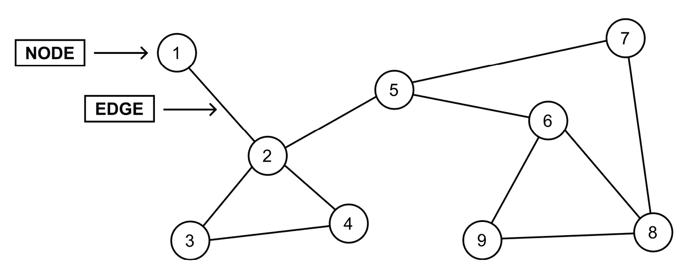

图 8.1 – 图的示意图

这个概念看起来很简单，不是吗？让我们尝试分析前面的图，以消除任何疑问。它包含**9 个节点**，其数值介于**1**和**9**之间。这些节点通过**11 条边**相连，例如节点**2**和**4**之间。此外，图可以包含**环** – 例如，由节点**2**、**3**和**4**表示的环 – 以及不相连的节点组。

然而，关于父节点和子节点的主题，你是从学习树的结构中知道的？由于图中没有关于连接的具体规则，因此在这种情况下不使用这些概念。

想象一个图

如果你想更好地可视化一个图，暂时放下这本书，看看展示你国家最重要道路的地图，比如高速公路或快速路。这样一条道路的每一部分连接两个城镇，并有一定的长度。一旦你在纸上画出这样的结构，你就会发现，由于它，你可以找到两个城镇之间的路线，以及整个路线的总距离。你知道你刚刚创建了一个图吗？单个城镇是节点，连接它们的线是边。两个城镇之间的距离是边的权重。当你能够将理论与实践联系起来时，事情变得如此简单，不是吗？现在，是时候把地图放一边，专注于学习这本书将要介绍的最后一个数据结构，即图。

图中的边需要更多的注释。在先前的图中，你可以看到一个所有节点都通过**无向边**连接的图 – 也就是说，**双向边**。它们表示**可以在两个方向之间旅行** – 例如，从节点**2**到**3**，以及从节点**3**到**2**。这样的边在图形上表示为**直线**。当一个图包含无向边时，它是一个**无向图**。

然而，当你需要表示**节点之间的旅行只能在一个方向上进行**时，情况会怎样？在这种情况下，你可以使用**有向边** – 也就是说，**单向边** – 它们在图形上表示为**带有指示边方向的箭头的直线**。如果一个图包含有向边，它可以被称为**有向图**。

自环是什么？

一个图也可以包含**自环**。每个自环都是连接给定节点与自身的边。然而，这样的主题超出了本书的范围，并且在本章的示例中不会考虑。

以下右图展示了一个有向图的例子，而左图展示了一个无向图：


图 8.2 – 无向图和有向图的区别

作为简短的解释，先前的图中右侧所示的有向图包含**8 个节点**，通过**15 条单向边**连接。例如，它们表示可以从节点**1**到**2**在两个方向上旅行，但只能从节点**1**到**3**单向旅行，因此无法直接从**3**到达**1**。

无向边和有向边之间的划分并非唯一。你也可以为特定的边指定**权重**（也称为**成本**），以表示节点之间旅行的成本。当然，这样的权重可以分配给无向边和有向边。如果提供了权重，则边被称为**加权边**，整个图被称为**加权图**。同样，如果没有提供权重，则图中使用**无权重边**。这种图被称为**无权重图**。

以下图显示了具有无向（左侧）和有向（右侧）边的加权图的示例：

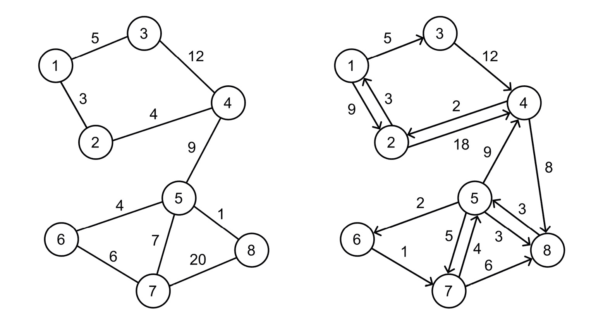

图 8.3 – 加权无向图和加权有向图之间的区别

这种加权边的图形表示显示了边旁边线的权重。例如，在无向图中，从节点**1**到**2**以及从节点**2**到**1**的旅行成本等于**3**，如前图所示。在有向图（右侧）的情况下，情况要复杂一些。在这里，你可以以等于**9**的成本从节点**1**到**2**旅行，而相反方向的旅行（从节点**2**到**1**）要便宜得多，成本仅为**3**。

# 应用

到目前为止，你已经了解了一些关于图的基本信息，特别是关于节点和不同类型的边。然而，为什么图的主题如此重要，为什么它占据了这本书的一整章？你能在你的应用中使用这种数据结构吗？答案很明显：是的！图在解决算法问题时被广泛使用，并且有无数的实际应用。

首先，让我们思考一下社交媒体上可用的**朋友结构**。每个用户都有许多联系人，但他们也有许多朋友，等等。你应该选择哪种数据结构来存储这样的数据？图是最简单的答案。在这种情况下，节点代表联系人，而边表示人与人之间的关系。例如，让我们看一下以下无向无权重图的示意图：

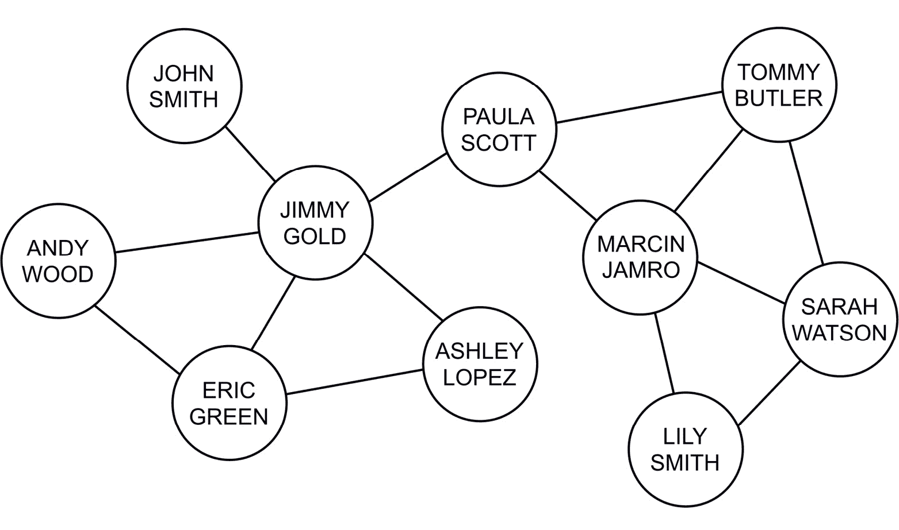

图 8.4 – 表示朋友结构的图形说明

如你所见，**吉米·戈德**有五个联系人，即**约翰·史密斯**、**安迪·伍德**、**埃里克·格林**、**艾什莉·洛佩兹**和**保拉·斯科特**。同时，**保拉·斯科特**还有两个其他朋友：**马辛·雅姆罗**和**汤米·巴特勒**。通过使用图作为数据结构，你可以轻松地检查两个人是否是朋友，或者他们是否有共同联系人。

图的另一个常见应用涉及**寻找最短路径**的问题。让我们想象一个程序，它应该找到城市中两点之间的路径，考虑到驾驶特定道路所需的时间。在这种情况下，你可以使用图来表示城市地图，其中节点表示交叉口，边表示道路。当然，你应该给边分配权重，以表示驾驶给定道路所需的时间。寻找最短路径的主题可以理解为找到从源节点到目标节点的边的列表，其总成本最小。以下是基于图的城市场景图：

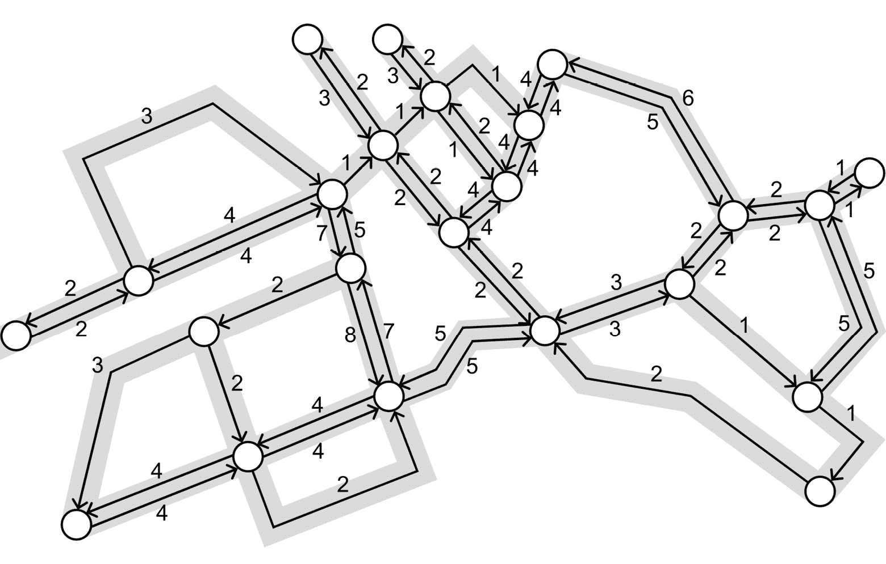

图 8.5 – 表示城市地图的图的示意图

如你所见，选择了有向加权图。有向边使得可以支持双向和单向道路，而加权边允许你指定在两个交叉口之间旅行所需的时间。

# 表示法

到目前为止，你已经知道了什么是图以及何时可以使用它，但如何在计算机的内存中表示一个图呢？解决这个问题有两种流行的方法，即使用**邻接表**和**邻接矩阵**。

## 邻接表

第一种方法要求你通过指定其邻居的列表来**扩展节点的数据**。因此，你只需遍历给定节点的邻接表，就可以轻松地获取给定节点的所有邻居。这种解决方案空间效率高，因为你只存储相邻边的数据。让我们看看下面的图示：

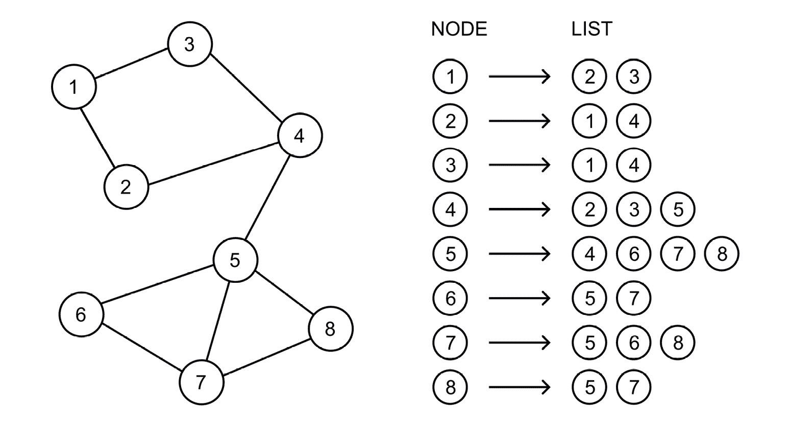

图 8.6 – 表示无向无权图的邻接表

这个示例图包含 8 个节点和 10 条边。对于每个节点，创建了一个包含相邻节点（即**邻居**）的列表，如图表右侧所示。例如，节点**1**有两个邻居，即节点**2**和**3**，而节点**5**有四个邻居，即节点**4**、**6**、**7**和**8**。如你所见，无向无权图的邻接表表示法简单明了，易于使用、理解和实现。

但在有向图中，邻接表是如何工作的呢？答案很明显，因为分配给每个节点的列表只显示了可以从给定节点到达的相邻节点。以下是一个示例图：

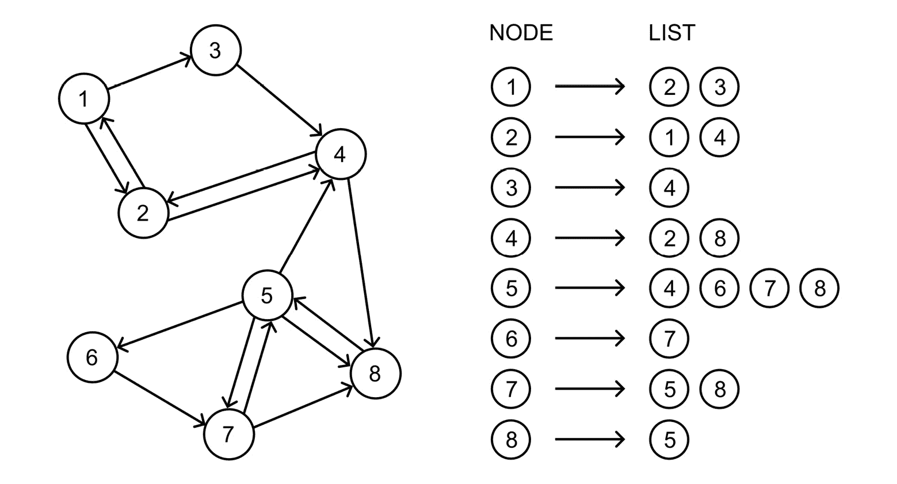

图 8.7 – 表示有向无权图的邻接表

让我们看看节点**3**。在这里，邻接表只包含一个元素——即节点**4**。节点**1**没有被包括在内，因为它不能从节点**3**直接到达。

在加权图的情况下，可能需要更多的解释。在这种情况下，还需要存储特定边的权重。你可以通过扩展邻接表中存储的数据来实现这一点，如下面的图所示：

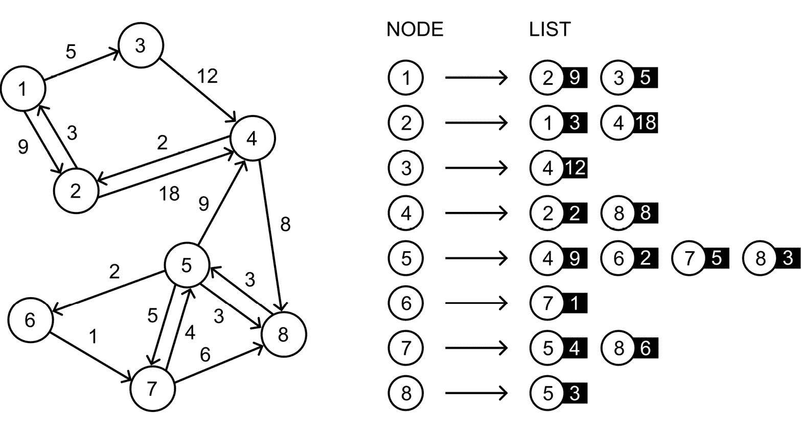

图 8.8 – 表示有向加权图的邻接表

例如，节点**7**的邻接表包含两个元素，即关于到节点**5**（权重等于**4**）和到节点**8**（权重等于**6**）的边。

## 邻接矩阵

另一种图表示方法涉及邻接矩阵，它使用**一个二维数组来显示哪些节点通过边连接**。矩阵包含与节点数量相同的行和列。主要思想是在矩阵的特定行和列的元素中**存储有关特定边的信息**。行和列的索引取决于与边连接的节点。例如，如果你想获取节点索引为**1**和**5**之间的边的信息，你必须检查索引设置为**1**的行和索引设置为**5**的列中的元素。

这种解决方案为你提供了一个**快速检查两个特定节点是否通过边连接的方法**。然而，它可能需要你存储比邻接表显著更多的数据，尤其是在节点之间没有许多边的情况下。

首先，让我们分析无向无权图的基本场景。在这种情况下，邻接矩阵可能只存储布尔值。放置在`i`行`j`列的`true`值表示索引等于`i`的节点与索引设置为`j`的节点之间存在连接。如果这听起来很复杂，请看下面的图：

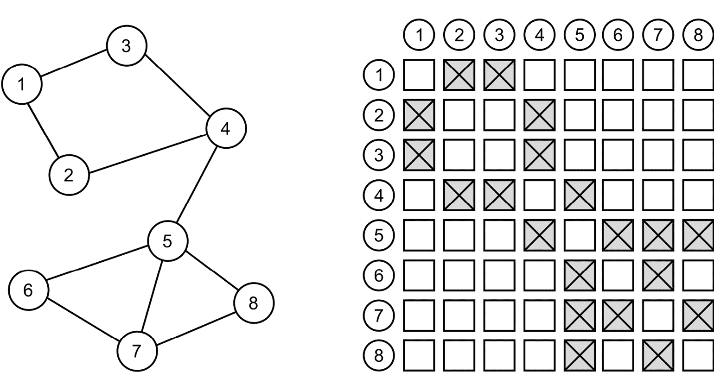

图 8.9 – 表示无向无权图的邻接矩阵

在这里，邻接矩阵包含 64 个元素（8 行 8 列），因为图中包含 8 个节点。数组中许多元素被设置为`false`，用缺失的指示符表示。其余的用交叉标记，表示`true`值。例如，第四行第三列的这种值表示节点**4**和**3**之间存在边，如前面的图所示。

对称邻接矩阵

由于前面的图是无向图，邻接矩阵是对称的。如果节点`i`和`j`之间存在边，那么节点`j`和`i`之间也存在边。

以下示例涉及一个有向和无权图。在这种情况下，可以使用相同的规则，但邻接矩阵不需要是对称的。让我们看一下图的插图，它与邻接矩阵一起展示：

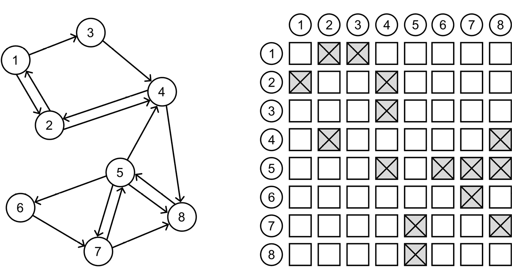

图 8.10 - 表示有向和无权图的邻接矩阵

在显示的邻接矩阵中，你可以找到 15 条边的数据，这些数据由 15 个具有`true`值的元素表示，在矩阵中以交叉表示。例如，从节点**5**到**4**的单向边在矩阵的第 5 行和第 4 列显示为交叉。

在前两个示例中，你学习了如何使用邻接矩阵表示无权图。然而，你如何存储加权图的数据，无论是无向还是有向的呢？答案是简单的——你只需要将邻接矩阵中特定元素的数据类型从布尔型更改为数值型。因此，你可以指定边的权重，如下面的图所示：

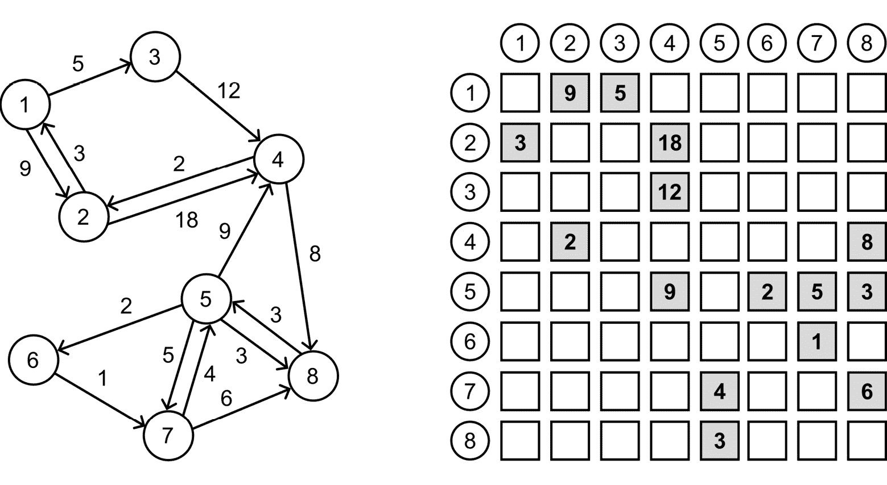

图 8.11 - 表示有向和加权图的邻接矩阵

为了消除任何疑问，让我们看一下节点**5**和**6**之间的边，其权重设置为**2**。这样的边由第 5 行和第 6 列的元素表示。该元素的值等于节点之间旅行的成本。

# 实现

你已经了解了一些关于图的基本信息，包括节点、边以及两种表示方法，即使用邻接表和矩阵。然而，你如何在应用程序中使用这样的数据结构呢？在本节中，你将学习如何使用 C#语言实现图。为了使你对这一内容更容易理解，将提供两个示例。

## 节点

首先，让我们看一下表示图中单个节点的通用类代码。这样的类被命名为`Node`，其代码如下：

```cs
public class Node<T>
{
    public int Index { get; set; }
    public required T Data { get; set; }
    public List<Node<T>> Neighbors { get; set; } = [];
    public List<int> Weights { get; set; } = [];
    public override string ToString() => $"Index: {Index}.
        Data: {Data}. Neighbors: {Neighbors.Count}.";
}
```

该类包含四个属性。由于所有这些元素在本章中显示的代码片段中都扮演着重要的角色，让我们详细分析它们：

+   第一个属性（`Index`）存储了图中节点集合中特定节点的索引，以简化访问特定元素的过程。因此，可以通过使用索引轻松地获取`Node`类的实例。

+   下一个属性名为`Data`，它只是在节点中存储一些数据。值得注意的是，这种数据类型与创建泛型类实例时指定的类型一致。

+   `Neighbors`属性表示特定节点的邻接表。因此，它包含指向表示相邻节点的`Node`实例的引用。

+   最后一个属性名为`Weights`，存储分配给相邻边的权重。在有向图中，`Weights`列表中的元素数量与邻居的数量（`Neighbors`）相同。如果图是无向的，`Weights`列表为空。

除了上述属性外，该类还包含重写的`ToString`方法，它返回对象的文本表示。在这里，字符串以`"Index: [index]. Data: [data]. Neighbors: [count]."`格式返回。

## 边

如同在图论主题的简要介绍中提到的，一个图由节点和边组成。节点由`Node`类的实例表示，通用的`Edge`类可以用来表示边。合适的代码部分如下：

```cs
public class Edge<T>
{
    public required Node<T> From { get; set; }
    public required Node<T> To { get; set; }
    public int Weight { get; set; }
    public override string ToString() => $"{From.Data}
        -> {To.Data}. Weight: {Weight}.";
}
```

该类包含三个属性，即表示与边相邻的节点（`From`和`To`），以及边的权重（`Weight`）。此外，重写了`ToString`方法，以展示关于边的一些基本信息。

## 图

下一个类名为`Graph`，它代表一个完整的图，具有有向或无向边，以及加权或无加权边。实现包括各种属性和方法。这些将在下面详细描述。

让我们看看`Graph`类的基本版本：

```cs
public class Graph<T>
{
    public required bool IsDirected { get; init; }
    public required bool IsWeighted { get; init; }
    public List<Node<T>> Nodes { get; set; } = [];
}
```

该类包含两个表示边是否为有向（`IsDirected`）和加权（`IsWeighted`）的属性。此外，声明了`Nodes`属性，它存储图中存在的节点列表。

`Graph`类的下一个有趣的成员是索引器，它接受两个索引，即两个节点的索引，以返回表示这些节点之间边的`Edge`类实例。实现如下：

```cs
public Edge<T>? this[int from, int to]
{
    get
    {
        Node<T> nodeFrom = Nodes[from];
        Node<T> nodeTo = Nodes[to];
        int i = nodeFrom.Neighbors.IndexOf(nodeTo);
        if (i < 0) { return null; }
        Edge<T> edge = new()
        {
            From = nodeFrom,
            To = nodeTo,
            Weight = i < nodeFrom.Weights.Count
                ? nodeFrom.Weights[i] : 0
        };
        return edge;
    }
}
```

在索引器中，根据索引获取表示两个节点（`nodeFrom`和`nodeTo`）的`Node`类实例。由于你想找到从第一个节点（`nodeFrom`）到第二个节点（`nodeTo`）的边，你需要尝试使用`IndexOf`方法在第一个节点的邻接节点集合中找到第二个节点。如果不存在这样的连接，`IndexOf`方法返回一个负值，并且索引器返回`null`。否则，你创建一个`Edge`类的新实例并设置其属性值，包括`From`和`To`。如果提供了特定边的权重数据，`Edge`类的`Weight`属性值也会被设置。

到目前为止，你知道如何在图中存储节点的数据，但如何添加一个新节点呢？要做到这一点，你可以实现`AddNode`方法，如下所示：

```cs
public Node<T> AddNode(T value)
{
    Node<T> node = new() { Data = value };
    Nodes.Add(node);
    UpdateIndices();
    return node;
}
```

在此方法中，您创建 `Node` 类的新实例并根据参数的值设置 `Data` 属性的值。然后，将新创建的实例添加到 `Nodes` 集合中，并调用（稍后描述的）`UpdateIndices` 方法来更新集合中存储的所有节点的索引。最后，返回表示新添加节点的 `Node` 实例。

您还可以删除现有的节点。此操作通过 `RemoveNode` 方法执行，如下代码片段所示：

```cs
public void RemoveNode(Node<T> nodeToRemove)
{
    Nodes.Remove(nodeToRemove);
    UpdateIndices();
    Nodes.ForEach(n => RemoveEdge(n, nodeToRemove));
}
```

此方法接受一个参数，即应删除的节点实例。首先，您将其从节点集合中删除。然后，您更新剩余节点的索引。最后，您遍历图中所有节点以删除与已删除节点相连的所有边。

如您所知，图由节点和边组成。因此，`Graph` 类的实现应向开发者提供一个添加新边的方法。当然，它应支持边的各种变体，无论是有向、无向、加权还是无权。建议的实现方式如下：

```cs
public void AddEdge(Node<T> from, Node<T> to, int w = 0)
{
    from.Neighbors.Add(to);
    if (IsWeighted) { from.Weights.Add(w); }
    if (!IsDirected)
    {
        to.Neighbors.Add(from);
        if (IsWeighted) { to.Weights.Add(w); }
    }
}
```

`AddEdge` 方法接受三个参数，即表示通过边连接的两个节点实例（`from` 和 `to`），以及连接的权重（`w`），默认设置为 `0`。

在方法的第一行中，您将表示第二个节点的 `Node` 实例添加到第一个节点的邻居节点列表中。如果考虑加权图，则还会添加上述边的权重。

以下代码部分仅在考虑无向图时才予以考虑。在这种情况下，您需要自动添加一个反向边。为此，您将表示第一个节点的 `Node` 实例添加到第二个节点的邻居节点列表中。如果边是加权的，则将上述边的权重添加到 `Weights` 列表中。

从图中删除边的操作由 `RemoveEdge` 方法支持。代码如下：

```cs
public void RemoveEdge(Node<T> from, Node<T> to)
{
    int index = from.Neighbors.FindIndex(n => n == to);
    if (index < 0) { return; }
    from.Neighbors.RemoveAt(index);
    if (IsWeighted) { from.Weights.RemoveAt(index); }
    if (!IsDirected)
    {
        index = to.Neighbors.FindIndex(n => n == from);
        if (index < 0) { return; }
        to.Neighbors.RemoveAt(index);
        if (IsWeighted) { to.Weights.RemoveAt(index); }
    }
}
```

此方法接受两个参数，即两个节点（`from` 和 `to`），它们之间有一个应删除的边。首先，您尝试在第一个节点的邻居节点列表中找到第二个节点。如果找到，则将其删除。如果考虑加权图，还应删除权重数据。在无向图的情况下，您会自动删除一个反向节点，即在 `to` 和 `from` 节点之间。

最后一个公共方法名为 `GetEdges`，它使得能够获取图中所有可用边的集合。建议的实现方式如下：

```cs
public List<Edge<T>> GetEdges()
{
    List<Edge<T>> edges = [];
    foreach (Node<T> from in Nodes)
    {
        for (int i = 0; i < from.Neighbors.Count; i++)
        {
            int weight = i < from.Weights.Count
                ? from.Weights[i] : 0;
            Edge<T> edge = new()
            {
                From = from,
                To = from.Neighbors[i],
                Weight = weight
            };
            edges.Add(edge);
        }
    }
    return edges;
}
```

首先，初始化一个新的边列表。然后，使用 `foreach` 循环遍历图中的所有节点。在循环内部，使用 `for` 循环创建 `Edge` 类的实例。实例的数量应等于当前节点的邻居数量（`foreach` 循环中的 `from` 变量）。在 `for` 循环中，通过设置属性值来配置新创建的 `Edge` 类实例，即第一个节点（`from` 变量，即 `foreach` 循环中的当前节点），第二个节点（当前分析的邻居），以及权重。然后，将新创建的实例添加到由 `edges` 变量表示的边集合中。最后，返回结果。

在各种方法中，您使用 `UpdateIndices` 方法。其代码如下：

```cs
private void UpdateIndices()
{
    int i = 0;
    Nodes.ForEach(n => n.Index = i++);
}
```

此方法遍历图中的所有节点，并将 `Index` 属性的值更新为连续数字，从 `0` 开始。值得注意的是，迭代是通过 `ForEach` 方法而不是 `foreach` 或 `for` 循环来执行的。

现在，您已经知道了如何创建一个基本的图实现。下一步是将它应用到表示一些示例图。

## 示例 – 无向无权边

让我们尝试使用之前的实现根据以下图创建一个无向无权图：

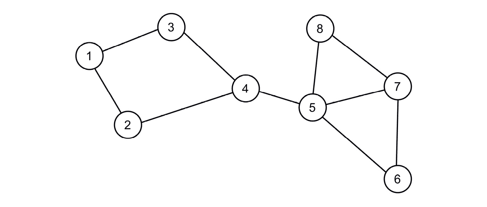

图 8.12 – 无向无权边示例的说明

如您所见，该图包含 8 个节点和 10 条边。实现从以下行开始，初始化一个新的无向无权图：

```cs
Graph<int> graph = new()
    { Node<int> type, as follows:

```

Node<int> n1 = graph.AddNode(1);

Node<int> n2 = graph.AddNode(2);

Node<int> n3 = graph.AddNode(3);

Node<int> n4 = graph.AddNode(4);

Node<int> n5 = graph.AddNode(5);

Node<int> n6 = graph.AddNode(6);

Node<int> n7 = graph.AddNode(7);

Node<int> n8 = graph.AddNode(8);

```cs

 Finally, you only need to add edges between nodes, as shown in the preceding diagram. The necessary code is as follows:

```

graph.AddEdge(n1, n2);

graph.AddEdge(n1, n3);

graph.AddEdge(n2, n4);

graph.AddEdge(n3, n4);

graph.AddEdge(n4, n5);

graph.AddEdge(n5, n6);

graph.AddEdge(n5, n7);

graph.AddEdge(n5, n8);

graph.AddEdge(n6, n7);

graph.AddEdge(n7, n8);

```cs

 That’s all! As you can see, configuring a graph is very easy using the proposed implementation of this data structure. Now, let’s proceed to a slightly more complex scenario with directed and weighted edges.
Example – directed and weighted edges
The following example involves a directed and weighted graph, as follows:
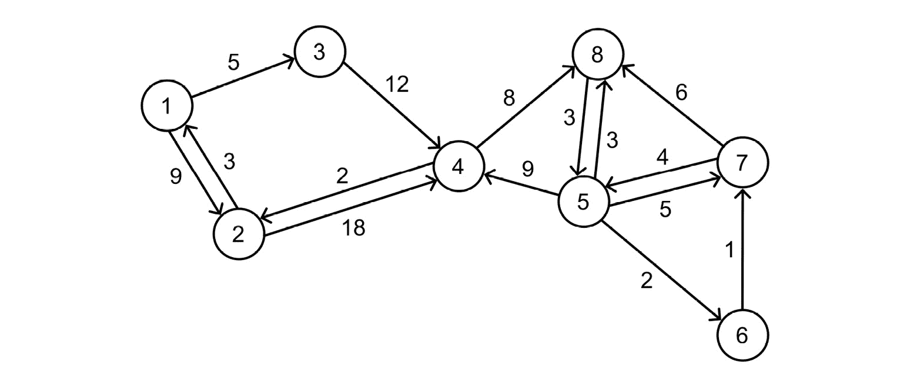

Figure 8.13 – Illustration of the directed and weighted edges example
The implementation is similar to the one described previously. However, some modifications are necessary. To start with, different values of the properties are used to indicate that a directed and weighted variant of the edges is being considered:

```

Graph<int> graph = new()

{ IsDirected = true, IsWeighted = true };

```cs

 The part regarding adding nodes is the same as in the previous example:

```

Node<int> n1 = graph.AddNode(1);

Node<int> n2 = graph.AddNode(2);

Node<int> n3 = graph.AddNode(3);

Node<int> n4 = graph.AddNode(4);

Node<int> n5 = graph.AddNode(5);

Node<int> n6 = graph.AddNode(6);

Node<int> n7 = graph.AddNode(7);

Node<int> n8 = graph.AddNode(8);

```cs

 Some changes are easily visible in the lines of code regarding the addition of edges. Here, you specify directed edges and their weights, as follows:

```

graph.AddEdge(n1, n2, 9);

graph.AddEdge(n1, n3, 5);

graph.AddEdge(n2, n1, 3);

graph.AddEdge(n2, n4, 18);

graph.AddEdge(n3, n4, 12);

graph.AddEdge(n4, n2, 2);

graph.AddEdge(n4, n8, 8);

graph.AddEdge(n5, n4, 9);

graph.AddEdge(n5, n6, 2);

graph.AddEdge(n5, n7, 5);

graph.AddEdge(n5, n8, 3);

graph.AddEdge(n6, n7, 1);

graph.AddEdge(n7, n5, 4);

graph.AddEdge(n7, n8, 6);

graph.AddEdge(n8, n5, 3);

```cs

 You’ve just completed the basic implementation of a graph, shown in two examples. So, let’s proceed to another topic, namely traversing a graph.
Traversal
One of the operations that’s commonly performed on a graph is **traversal** – that is, **visiting all of the nodes in some particular order**. Of course, the aforementioned problem can be solved in various ways, such as using **DFS** or **BFS** approaches. It is worth mentioning that the traversal topic is strictly connected with the task of **searching for a given node in** **a graph**.
Depth-first search
The first graph traversal algorithm described in this chapter is named **DFS**. It tries to go as deep as possible. **First, it proceeds to the next levels of the nodes instead of visiting all the neighbors of the current node**. Its steps, in the context of the example graph, are as follows:
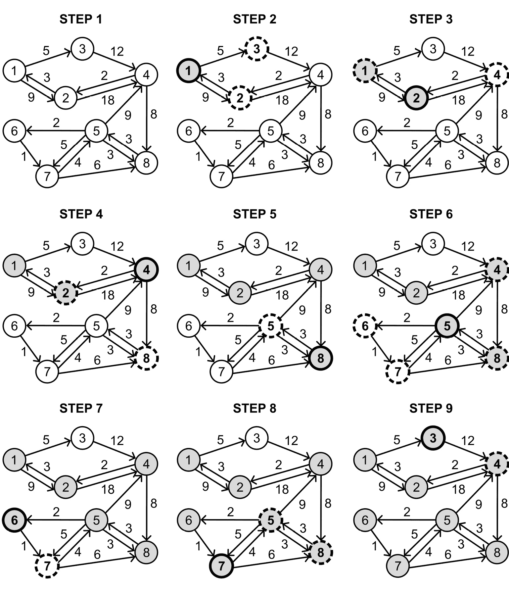

Figure 8.14 – Illustration of a DFS of a graph
Of course, it can be a bit difficult to understand how the DFS algorithm operates just by looking at the preceding diagram. For this reason, let’s try to analyze its stages.
In **Step 1**, there’s the graph with 8 nodes. In **Step 2**, node **1** is marked with a gray background (indicating that the node was already visited), as well as with a bolder border (indicating that it is the node that is currently being visited). Moreover, an important role in the algorithm is performed by the neighbor nodes (shown as circles with dashed borders) of the current one. When you know the roles of particular indicators, it is clear that in **Step 2**, node **1** is visited. It has two neighbors, namely nodes **2** and **3**.
Then, the first neighbor (node **2**) is taken into account (**Step 3**) and the same operations are performed – that is, the node is visited and its neighbors (nodes **1** and **4**) are analyzed. As node **1** was visited, it is skipped. In **Step 4**, the first suitable neighbor of node **2** is taken into account, namely node **4**. It has two neighbors, namely node **2** (already visited) and **8**. Next, node **8** is visited (**Step 5**) and, according to the same rules, node **5** (**Step 6**). It has four neighbors, namely nodes **4** (already visited), **6**, **7**, and **8** (already visited). Thus, in **Step 7**, node **6** is taken into account. As it has only one neighbor (node **7**), it is visited next (**Step 8**).
Then, you check the neighbors of node **7**, namely nodes **5** and **8**. Both were already visited, so you return to the node with an unvisited neighbor. In this example, node **1** has one unvisited node, namely node **3**. When it is visited (**Step 9**), all nodes are traversed and no further operations are necessary.
Given this example, let’s try to create the implementation in the C# language. To start, the code of the public `DFS` method (in the `Graph` class) is presented as follows:

```

public List<Node<T>> DFS()

{

bool[] isVisited = new bool[Nodes.Count];

List<Node<T>> result = [];

DFS(isVisited, Nodes[0], result);

return result;

}

```cs

 The important role is performed by the `isVisited` array. It has the same number of elements as the number of nodes and stores values indicating whether a given node has already been visited. If so, the `true` value is stored. Otherwise, `false` is stored. The list of traversed nodes is represented as a list in the `result` variable. What’s more, another variant of the `DFS` method is called here, passing three parameters:

*   A reference to the `isVisited` array
*   The first node to analyze
*   The list for storing results

The code for the aforementioned variant of the `DFS` method is as follows:

```

private void DFS(bool[] isVisited, Node<T> node,

List<Node<T>> result)

{

result.Add(node);

isVisited[node.Index] = true;

foreach (Node<T> neighbor in node.Neighbors)

{

if (!isVisited[neighbor.Index])

{

DFS(isVisited, neighbor, result);

}

}

}

```cs

 First, the current node is added to the collection of traversed nodes, and the element in the `isVisited` array is updated. Then, you use the `foreach` loop to iterate through all the neighbors of the current node. For each of them, if they haven’t already been visited, the `DFS` method is called recursively.
To finish, let’s take a look at the code that can be placed in the `Program.cs` file. Its main parts are presented in the following code snippet:

```

Graph<int> graph = new()

{ IsDirected = true, IsWeighted = true };

Node<int> n1 = graph.AddNode(1); (...)

Node<int> n8 = graph.AddNode(8);

graph.AddEdge(n1, n2, 9); (...)

graph.AddEdge(n8, n5, 3);

List<Node<int>> nodes = graph.DFS();

nodes.ForEach(Console.WriteLine);

```cs

 Here, you initialize a directed and weighted graph. It is worth noting that the missing lines of code (indicated by three dots) are the same as in the example where you created a graph with directed and weighted edges.
To start traversing the graph, you just need to call the `DFS` method, which returns a list of `Node` instances. Then, you can easily iterate through elements of the list to print some basic information about each node in the console:

```

索引：0。数据：1。邻居：2。

索引：1。数据：2。邻居：2。

索引：3。数据：4。邻居：2。

索引：7。数据：8。邻居：1。

索引：4。数据：5。邻居：4。

索引：5。数据：6。邻居：1。

索引：6。数据：7。邻居：2。

索引：2。数据：3。邻居：1。

```cs

 That’s all! As you can see, the algorithm tries to go as deep as possible and then goes back to find the next unvisited neighbor that can be traversed.
However, this algorithm is not the only approach to the problem of graph traversal. We’ll cover another method and its implementation in the next section.
Breadth-first search
In the previous section, you learned about the DFS approach. Now, you will see another solution, namely **BFS**. Its main aim is to **visit all the neighbors of the current node and then proceed to the next level** **of nodes**.
If the previous description sounds a bit complicated, take a look at this diagram, which depicts the steps of the BFS algorithm:
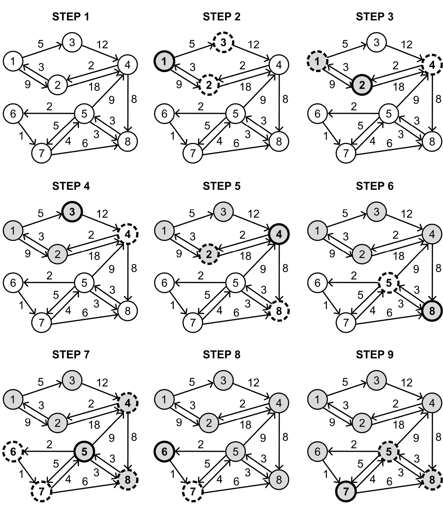

Figure 8.15 – Illustration of a BFS of a graph
The algorithm starts by visiting node **1** (**Step 2**). It has two neighbors, namely nodes **2** and **3**, which are visited next (**Step 3** and **Step 4**). As node **1** does not have more neighbors, the neighbors of its first neighbor (node **2**) are considered. As it has only one unvisited neighbor (node **4**), it is visited in the next step. According to the same method, the remaining nodes are visited in this order: **8**, **5**, **6**, **7**.
It sounds very simple, doesn’t it? Let’s take a look at the implementation:

```

public List<Node<T>> BFS public method is added to the Graph class and is used to start the traversal of a graph. It calls the private BFS method, passing the first node as the parameter. Its code is as follows:

```cs
private List<Node<T>> BFS(Node<T> node)
{
    bool[] isVisited = new bool[Nodes.Count];
    isVisited[node.Index] = true;
    List<Node<T>> result = [];
    Queue<Node<T>> queue = [];
    queue.Enqueue(node);
    while (queue.Count > 0)
    {
        Node<T> next = queue.Dequeue();
        result.Add(next);
        foreach (Node<T> neighbor in next.Neighbors)
        {
            if (!isVisited[neighbor.Index])
            {
                isVisited[neighbor.Index] = true;
                queue.Enqueue(neighbor);
            }
        }
    }
    return result;
}
```

代码的重要部分由`isVisited`数组执行，该数组存储布尔值，指示特定节点是否已被访问。该数组在`BFS`方法的开始时初始化，并将与当前节点相关的元素值设置为`true`，这表示该节点已被访问。

然后，创建用于存储已遍历节点的列表（`result`）和用于存储下一个要访问的节点的队列（`queue`）。在队列初始化后，当前节点被添加到其中。

执行以下操作，直到队列为空：从队列中获取第一个节点（`next`变量），将其添加到已访问节点的集合中，并遍历当前节点的邻居。对于每一个，你检查它是否已被访问。如果没有，通过在`isVisited`数组中设置适当的值将其标记为已访问，并将邻居添加到队列中，以便在`while`循环的下一个迭代中进行分析。

最后，返回已访问节点的列表。如果你想测试这个算法，可以使用以下代码：

```cs
Graph<int> graph = new()
    { IsDirected = true, IsWeighted = true };
Node<int> n1 = graph.AddNode(1); (...)
Node<int> n8 = graph.AddNode(8);
graph.AddEdge(n1, n2, 9); (...)
graph.AddEdge(n8, n5, 3);
List<Node<int>> nodes = graph.BFS();
nodes.ForEach(Console.WriteLine);
```

前面的代码调用`BFS`公共方法根据 BFS 算法遍历图。最后一行负责遍历结果，以在控制台显示节点的数据，如下所示：

```cs
Index: 0\. Data: 1\. Neighbors: 2.
Index: 1\. Data: 2\. Neighbors: 2.
Index: 2\. Data: 3\. Neighbors: 1.
Index: 3\. Data: 4\. Neighbors: 2.
Index: 7\. Data: 8\. Neighbors: 1.
Index: 4\. Data: 5\. Neighbors: 4.
Index: 5\. Data: 6\. Neighbors: 1.
Index: 6\. Data: 7\. Neighbors: 2.
```

你刚刚学习了两种图遍历算法，即 DFS 和 BFS。为了使你对这类主题的理解更加容易，本章包含了详细的描述、插图和示例。现在，让我们继续探讨另一个重要主题，即最小生成树，它在现实世界中有很多应用。

你在哪里可以找到更多信息？

关于图的遍历，有很多在线资源。你可以在[`en.wikipedia.org/wiki/Depth-first_search`](https://en.wikipedia.org/wiki/Depth-first_search)了解更多关于 DFS 的信息，同时你可以在[`www.geeksforgeeks.org/breadth-first-traversal-for-a-graph/`](https://www.geeksforgeeks.org/breadth-first-traversal-for-a-graph/)找到更多关于 BFS 算法及其实现的信息。

最小生成树

当谈论图时，介绍**生成树**的主题是有益的。那是什么？**生成树是图的边的子集，它连接图中的所有节点而不形成环**。当然，同一个图中可以有多个生成树。例如，让我们看看以下图表：

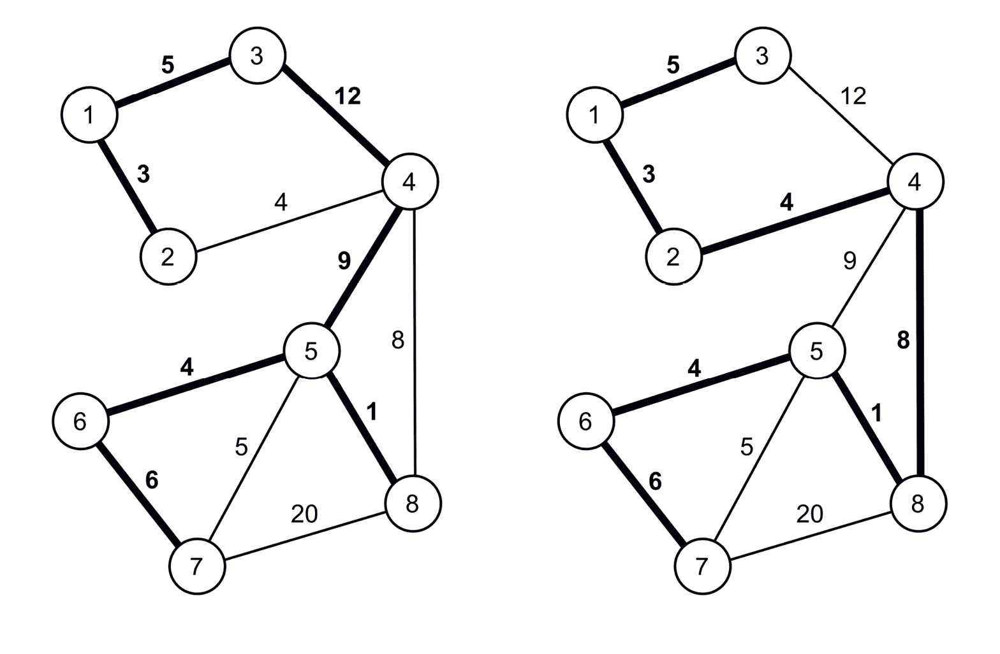

图 8.16 – 图中生成树的示意图

在左侧是一个包含以下边的生成树：(**1**, **2**), (**1**, **3**), (**3**, **4**), (**4**, **5**), (**5**, **6**), (**6**, **7**), 和 (**5**, **8**). 总权重等于 40。在右侧，显示了另一个生成树。这里，选择的边是：(**1**, **2**), (**1**, **3**), (**2**, **4**), (**4**, **8**), (**5**, **8**), (**5**, **6**), 和 (**6**, **7**). 总权重等于 31。

然而，上述任何一个生成树都不是这个图的**最小生成树（MST）**。生成树是“最小”的意思是什么？答案是真的很简单：它是**在图中所有可能的生成树中具有最小成本的生成树**。你可以通过将边(**6**, **7**)替换为(**5**, **7**)来得到 MST。然后，成本等于 30。还值得一提的是，生成树中的边数等于节点数减一。

为什么 MST（最小生成树）这个主题如此重要？让我们想象一个场景，你需要将许多建筑连接到电信电缆。当然，有各种可能的连接方式，比如从一个建筑到另一个建筑，或者使用一个中心节点。更重要的是，环境条件可能会由于需要穿越道路甚至河流而严重影响投资成本。你的任务是成功地将所有建筑以最低的成本连接到电信电缆。你应该如何设计这些连接？要回答这个问题，你只需要创建一个图，其中节点代表连接器，边表示可能的连接。然后，你找到 MST，这就完成了！

你想要一些例子吗？

在本节末尾关于 MST 的例子中，展示了将许多建筑连接到电信电缆的问题。

接下来的问题是如何找到最小生成树（MST）。解决这个问题有各种方法，包括应用克鲁斯卡尔或普里姆算法。这些方法将在以下章节中介绍和解释。

克鲁斯卡尔算法

用于找到 MST 的一种算法是由**克鲁斯卡尔**发现的。它的操作非常简单易懂。**算法从剩余的边中选择具有最小权重的边并将其添加到 MST 中，但只有当添加它不会创建环时**。算法在所有节点都连接时停止。

让我们看看一个展示使用**克鲁斯卡尔算法**找到 MST 步骤的图表：

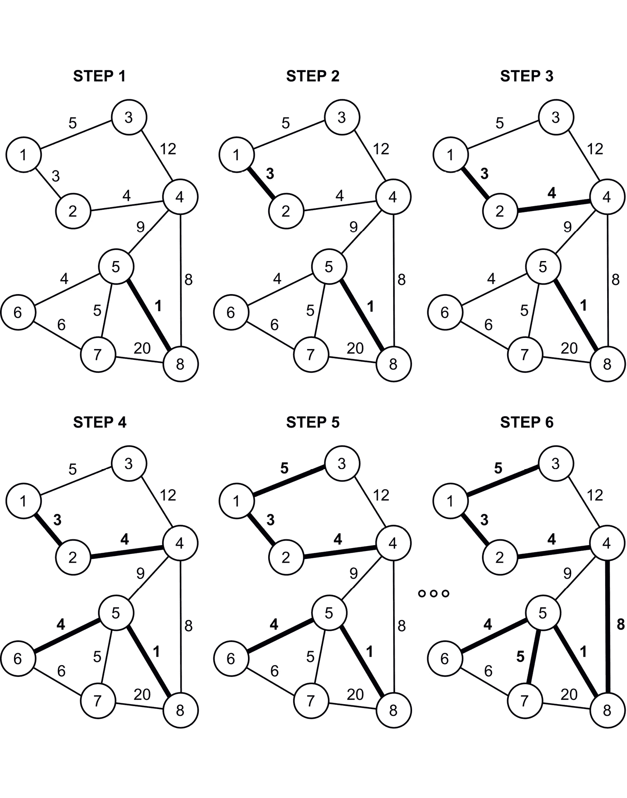

图 8.17 – 克鲁斯卡尔算法的示意图

在**步骤 1**中，选择边（**5**，**8**），因为它具有最小的权重，即**1**。然后，在**步骤 2**中选择边（**1**，**2**），在**步骤 3**中选择边（**2**，**4**），在**步骤 4**中选择边（**5**，**6**），在**步骤 5**中选择边（**1**，**3**），以及在**步骤 6**中选择边（**5**，**7**）和（**4**，**8**）。值得注意的是，在取（**4**，**8**）边之前，考虑了（**6**，**7**），因为它的权重更低（6 而不是 8）。然而，将其添加到 MST 中将会引入由（**5**，**6**），（**6**，**7**）和（**5**，**7**）边形成的环。因此，这样的边被忽略，算法选择了（**4**，**8**）。最后，MST 中的边数为 7。节点数为 8，这意味着算法可以停止运行，MST 已经找到。

让我们看看它的实现。这涉及到`MSTKruskal`方法，该方法应添加到`Graph`类中。提出的代码如下：

```cs
public List<Edge<T>> MSTKruskal()
{
    List<Edge<T>> edges = GetEdges();
    edges.Sort((a, b) => a.Weight.CompareTo(b.Weight));
    Queue<Edge<T>> queue = new(edges);
    Subset<T>[] subsets = new Subset<T>[Nodes.Count];
    for (int i = 0; i < Nodes.Count; i++)
    {
        subsets[i] = new() { Parent = Nodes[i] };
    }
    List<Edge<T>> result = [];
    while (result.Count < Nodes.Count - 1)
    {
        Edge<T> edge = queue.Dequeue();
        Node<T> from = GetRoot(subsets, edge.From);
        Node<T> to = GetRoot(subsets, edge.To);
        if (from == to) { continue; }
        result.Add(edge);
        Union(subsets, from, to);
    }
    return result;
}
```

此方法不接受任何参数。首先，通过调用`GetEdges`方法获取边列表。然后，根据权重将边按升序排序。这一步至关重要，因为在算法的后续迭代中，你需要获取具有最小成本的边。在下一行，创建了一个新的队列，并使用`Queue`类的构造函数将`Edge`实例入队。

在下一块代码中，创建了一个包含子集数据的数组。默认情况下，每个节点被添加到单独的子集中。这就是为什么`subsets`数组中的元素数量等于节点数量的原因。子集用于检查将边添加到 MST 中是否会导致创建环。

然后，创建用于存储 MST 边的列表（`result`）。代码中最有趣的部分是 `while` 循环，它迭代直到在 MST 中找到正确数量的边。在这个循环中，你只需通过在 `Queue` 实例上调用 `Dequeue` 方法，就可以得到具有最小权重的边。然后，你可以检查通过将找到的边添加到 MST 中是否引入了任何循环。在这种情况下，边被添加到目标列表中，并调用 `Union` 方法来合并两个子集。

在分析前面的方法时，提到了 `GetRoot` 方法。它的目的是更新子集的父节点，并返回子集的根节点，如下所示：

```cs
private Node<T> GetRoot(Subset<T>[] subsets, Node<T> node)
{
    int i = node.Index;
    ss[i].Parent = ss[i].Parent != node
        ? GetRoot(ss, ss[i].Parent) : ss[i].Parent;
    return ss[i].Parent;
}
```

最后一个私有方法命名为 `Union`，它执行两个集合的 *union* 操作（通过秩）。它接受三个参数，即 `Subset` 实例的数组以及两个 `Node` 实例，代表要执行 *union* 操作的子集的根节点。代码的合适部分如下：

```cs
private void Union(Subset<T>[] ss, Node<T> a, Node<T> b)
{
    ss[b.Index].Parent =
        ss[a.Index].Rank >= ss[b.Index].Rank
            ? a : ss[b.Index].Parent;
    ss[a.Index].Parent =
        ss[a.Index].Rank < ss[b.Index].Rank
            ? b : ss[a.Index].Parent;
    if (ss[a.Index].Rank == ss[b.Index].Rank)
    {
        ss[a.Index].Rank++;
    }
}
```

在前面的代码片段中，你可以看到 `Subset` 类，但它是什么样子呢？让我们看看它的声明：

```cs
public class Subset<T>
{
    public required Node<T> Parent { get; set; }
    public int Rank { get; set; }
    public override string ToString() => $"Rank: {Rank}.
        Parent: {Parent.Data}. Index: {Parent.Index}.";
}
```

该类包含表示父节点的属性（`Parent`），以及子集的秩（`Rank`）。该类还包含重写的 `ToString` 方法，它以文本形式呈现有关子集的一些基本信息。

你在哪里可以找到更多信息？

你知道所提出的方法代表了一种 **贪心算法** 吗？这里显示的代码基于在 [`www.geeksforgeeks.org/greedy-algorithms-set-2-kruskals-minimum-spanning-tree-mst/`](https://www.geeksforgeeks.org/greedy-algorithms-set-2-kruskals-minimum-spanning-tree-mst/) 可用的实现。你可以在那里找到关于 Kruskal 算法以及关于许多其他图算法的大量有趣信息，例如关于着色的一种简单方法，这也是本章等待你的一个主题。*GeeksForGeeks* 是一个关于各种算法的极好资源，拥有大量内容，我强烈推荐！

让我们看看 `MSTKruskal` 方法的用法：

```cs
Graph<int> graph = new()
    { IsDirected = false, IsWeighted = true };
Node<int> n1 = graph.AddNode(1);
Node<int> n2 = graph.AddNode(2);
Node<int> n3 = graph.AddNode(3);
Node<int> n4 = graph.AddNode(4);
Node<int> n5 = graph.AddNode(5);
Node<int> n6 = graph.AddNode(6);
Node<int> n7 = graph.AddNode(7);
Node<int> n8 = graph.AddNode(8);
graph.AddEdge(n1, n2, 3);
graph.AddEdge(n1, n3, 5);
graph.AddEdge(n2, n4, 4);
graph.AddEdge(n3, n4, 12);
graph.AddEdge(n4, n5, 9);
graph.AddEdge(n4, n8, 8);
graph.AddEdge(n5, n6, 4);
graph.AddEdge(n5, n7, 5);
graph.AddEdge(n5, n8, 1);
graph.AddEdge(n6, n7, 6);
graph.AddEdge(n7, n8, 20);
List<Edge<int>> edges = graph.MSTKruskal();
edges.ForEach(Console.WriteLine);
```

首先，你初始化一个无向加权图，并添加节点和边。然后，你调用 `MSTKruskal` 方法使用 Kruskal 算法找到 MST。最后，你使用 `ForEach` 方法将 MST 中每条边的数据写入控制台。示例输出如下：

```cs
8 -> 5\. Weight: 1.
1 -> 2\. Weight: 3.
2 -> 4\. Weight: 4.
5 -> 6\. Weight: 4.
1 -> 3\. Weight: 5.
7 -> 5\. Weight: 5.
8 -> 4\. Weight: 8.
```

如前所述，你将在本章学习两种寻找 MST 的算法。现在，是时候看看第二种算法了，即 Prim 算法。

Prim 算法

解决寻找 MST 问题的另一种方法是**Prim 算法**。**它使用两组不相交的节点集，即位于 MST 中的节点和尚未放置在那里的节点**。在后续迭代中，算法**找到连接第一组中的一个节点和第二组中的一个节点的最小权重的边。该边上的节点，如果它尚未在 MST 中，则被添加到**该集合中。

上述描述听起来相当简单，不是吗？让我们通过分析展示使用 Prim 算法寻找 MST 步骤的图表来实际看看：

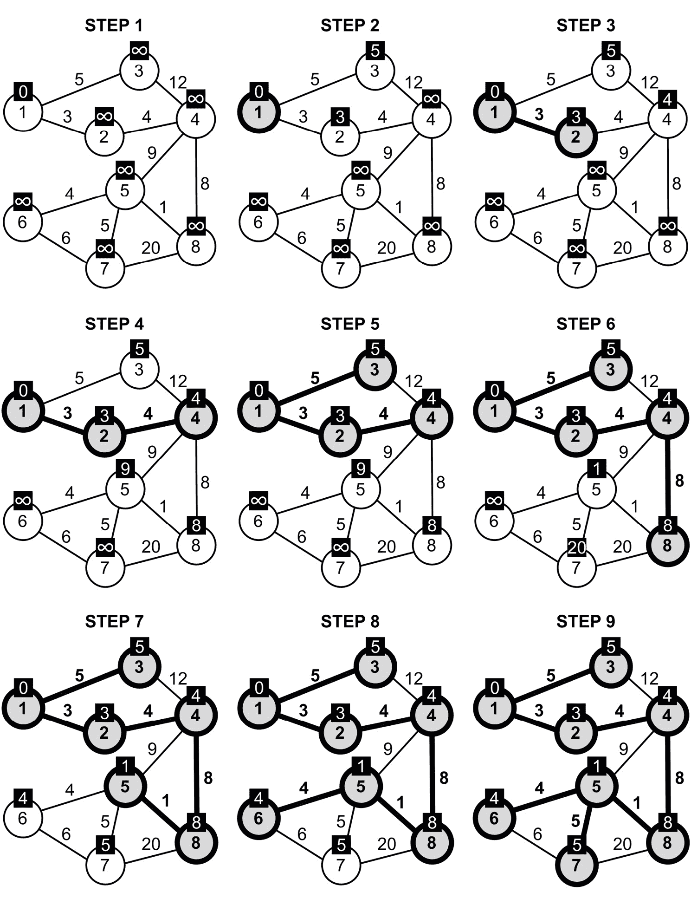

图 8.18 – Prim 算法的示意图

让我们看看在图中节点旁边添加的附加指标。它们表示从任何邻居到达此类节点的最小权重。默认情况下，起始节点的此值设置为**0**，而所有其他节点都设置为无穷大，如**步骤 1**所示。

在**步骤 2**中，起始节点被添加到形成最小生成树（MST）的节点子集中，并更新其邻居的距离，即到达节点**3**的距离为**5**，到达节点**2**的距离为**3**。其他节点的值仍然设置为无穷大。

在**步骤 3**中，选择具有最小成本的节点。在这种情况下，选择节点**2**，因为其成本等于**3**。其竞争对手（即节点**3**）的成本等于**5**。接下来，你需要更新到达当前节点（即节点**4**）邻居的成本，成本设置为**4**。

下一个选择的节点是节点**4**，因为它不在 MST 集合中，并且具有最低的到达成本（**步骤 4**）。同样，你将按照以下顺序选择下一个边：**步骤 5**中的（**1**，**3**），**步骤 6**中的（**4**，**8**），**步骤 7**中的（**8**，**5**），**步骤 8**中的（**5**，**6**），以及**步骤 9**中的（**5**，**7**）。现在，所有节点都包含在 MST 中，算法可以停止其操作。

给出了算法步骤的详细描述后，让我们继续进行基于 C#的实现。大多数操作都在`MSTPrim`方法中执行，该方法应添加到`Graph`类中：

```cs
public List<Edge<T>> MSTPrim()
{
    int[] previous = new int[Nodes.Count];
    previous[0] = -1;
    int[] minWeight = new int[Nodes.Count];
    Array.Fill(minWeight, int.MaxValue);
    minWeight[0] = 0;
    bool[] isInMST = new bool[Nodes.Count];
    Array.Fill(isInMST, false);
    for (int i = 0; i < Nodes.Count - 1; i++)
    {
        int mwi = GetMinWeightIndex(minWeight, isInMST);
        isInMST[mwi] = true;
        for (int j = 0; j < Nodes.Count; j++)
        {
            Edge<T>? edge = this[mwi, j];
            int weight = edge != null ? edge.Weight : -1;
            if (edge != null
                && !isInMST[j]
                && weight < minWeight[j])
            {
                previous[j] = mwi;
                minWeight[j] = weight;
            }
        }
    }
    List<Edge<T>> result = [];
    for (int i = 1; i < Nodes.Count; i++)
    {
        result.Add(this[previous[i], i]!);
    }
    return result;
}
```

`MSTPrim`方法不接收任何参数。它使用三个辅助节点相关数组，为图中的节点分配额外的数据：

+   第一个，即`previous`，存储从给定节点可以到达的前一个节点的索引。默认情况下，所有元素的值都等于`0`，除了第一个，其设置为`-1`。

+   `minWeight`数组存储访问给定节点的边的最小权重。默认情况下，所有元素都设置为`int`类型的最大值，而第一个元素的值被设置为`0`。

+   `isInMST`数组表示给定的节点是否已经在 MST 中。一开始，所有元素的值应该设置为`false`。

代码中最有趣的部分位于`for`循环中。在其中，你会找到从不在 MST 中的节点集中，以最小成本可达的节点的索引。这个任务由`GetMinWeightIndex`方法执行。然后，另一个`for`循环被使用。在其中，你得到一个连接具有`mwi`索引（代表*最小权重索引*）和`j`的节点的边。你检查节点是否不在 MST 中，以及到达该节点的成本是否小于之前的最低成本。如果是这样，`previous`和`minWeight`数组中与节点相关的元素值将被更新。

代码的其余部分只是准备最终结果。在这里，你创建了一个包含形成 MST 的边的数据的新列表实例。`for`循环用于获取以下边的数据并将它们添加到`result`列表中。

在分析代码时，提到了`GetMinWeightIndex`私有方法。其代码如下所示：

```cs
private int GetMinWeightIndex(
    int[] weights, bool[] isInMST)
{
    int minValue = int.MaxValue;
    int minIndex = 0;
    for (int i = 0; i < Nodes.Count; i++)
    {
        if (!isInMST[i] && weights[i] < minValue)
        {
            minValue = weights[i];
            minIndex = i;
        }
    }
    return minIndex;
}
```

`GetMinWeightIndex`方法只是找到一个节点索引，该节点不在 MST 中，并且可以以最小成本到达。为此，你使用`for`循环遍历所有节点。对于每个节点，你检查当前节点是否不在 MST 中，以及到达它的成本是否小于已存储的最低值。如果是这样，`minValue`和`minIndex`变量的值将被更新。最后，返回索引。

你在哪里可以找到更多信息？

与克鲁斯卡尔算法类似，普里姆算法的变体也是**贪婪算法**的一个代表。我强烈建议你在书籍、研究论文和互联网上搜索更多关于这个算法的有趣信息。值得注意的是，所提供的代码基于[`www.geeksforgeeks.org/greedy-algorithms-set-5-prims-minimum-spanning-tree-mst-2/`](https://www.geeksforgeeks.org/greedy-algorithms-set-5-prims-minimum-spanning-tree-mst-2/)中展示的实现。

让我们看看`MSTPrim`方法的用法：

```cs
Graph<int> graph = new()
    { IsDirected = false, IsWeighted = true };
Node<int> n1 = graph.AddNode(1); (...)
Node<int> n8 = graph.AddNode(8);
graph.AddEdge(n1, n2, 3); (...)
graph.AddEdge(n7, n8, 20);
List<Edge<int>> edges = graph.MSTPrim();
edges.ForEach(Console.WriteLine);
```

代码中缺失的部分与关于克鲁斯卡尔算法的示例代码相同。当你运行代码时，你会得到以下结果：

```cs
1 -> 2\. Weight: 3.
1 -> 3\. Weight: 5.
2 -> 4\. Weight: 4.
8 -> 5\. Weight: 1.
5 -> 6\. Weight: 4.
5 -> 7\. Weight: 5.
4 -> 8\. Weight: 8.
```

现在我们已经了解了多种寻找最小生成树（MST）的算法，让我们来看一个例子。

示例 - 电信电缆

如同在 MST 主题介绍中提到的，这个问题有一些重要的实际应用，例如制定建筑之间连接的计划，以最低的成本为所有建筑提供电信电缆。当然，有各种可能的连接方式，例如从一个建筑到另一个建筑或使用中心节点。更重要的是，环境条件可能会由于需要穿越道路甚至河流而严重影响投资成本。

例如，让我们创建一个程序，在一系列建筑的环境中解决此问题，如图所示：

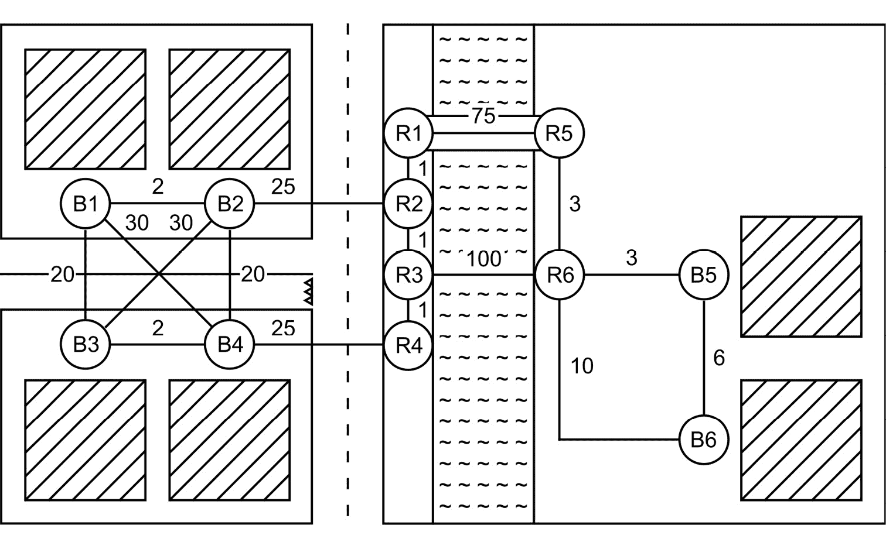

图 8.19 – 电信电缆示例示意图

如你所见，住宅社区由六个建筑组成。这些建筑位于一条小河的两侧，只有一座桥。此外，还有两条道路。当然，不同点之间的连接成本不同，这取决于距离和环境条件。例如，两个建筑（**B1**和**B2**）之间的直接连接成本等于**2**，而使用桥梁（在**R1**和**R5**之间）的成本等于**75**。如果你需要在没有桥梁的情况下穿越河流（在**R3**和**R6**之间），成本甚至更高，等于**100**。

你的任务是找到 MST。在这个示例中，你将应用 Kruskal 算法和 Prim 算法来解决这个问题。首先，让我们初始化无向加权图，并添加节点和边，如下所示：

```cs
Graph<string> graph = new()
    { IsDirected = false, IsWeighted = true };
Node<string> nodeB1 = graph.AddNode("B1");
Node<string> nodeB2 = graph.AddNode("B2");
Node<string> nodeB3 = graph.AddNode("B3");
Node<string> nodeB4 = graph.AddNode("B4");
Node<string> nodeB5 = graph.AddNode("B5");
Node<string> nodeB6 = graph.AddNode("B6");
Node<string> nodeR1 = graph.AddNode("R1");
Node<string> nodeR2 = graph.AddNode("R2");
Node<string> nodeR3 = graph.AddNode("R3");
Node<string> nodeR4 = graph.AddNode("R4");
Node<string> nodeR5 = graph.AddNode("R5");
Node<string> nodeR6 = graph.AddNode("R6");
graph.AddEdge(nodeB1, nodeB2, 2);
graph.AddEdge(nodeB1, nodeB3, 20);
graph.AddEdge(nodeB1, nodeB4, 30);
graph.AddEdge(nodeB2, nodeB3, 30);
graph.AddEdge(nodeB2, nodeB4, 20);
graph.AddEdge(nodeB2, nodeR2, 25);
graph.AddEdge(nodeB3, nodeB4, 2);
graph.AddEdge(nodeB4, nodeR4, 25);
graph.AddEdge(nodeR1, nodeR2, 1);
graph.AddEdge(nodeR2, nodeR3, 1);
graph.AddEdge(nodeR3, nodeR4, 1);
graph.AddEdge(nodeR1, nodeR5, 75);
graph.AddEdge(nodeR3, nodeR6, 100);
graph.AddEdge(nodeR5, nodeR6, 3);
graph.AddEdge(nodeR6, nodeB5, 3);
graph.AddEdge(nodeR6, nodeB6, 10);
graph.AddEdge(nodeB5, nodeB6, 6);
```

现在，你只需要调用`MSTKruskal`方法来使用 Kruskal 算法找到 MST。当获得结果时，你可以轻松地在控制台展示它们，包括总成本。合适的代码部分如下所示：

```cs
Console.WriteLine("Minimum Spanning Tree - Kruskal:");
List<Edge<string>> kruskal = graph.MSTKruskal();
kruskal.ForEach(Console.WriteLine);
Console.WriteLine("Cost: " + kruskal.Sum(e => e.Weight));
```

控制台显示的结果如下：

```cs
Minimum Spanning Tree - Kruskal:
R4 -> R3\. Weight: 1.
R3 -> R2\. Weight: 1.
R2 -> R1\. Weight: 1.
B1 -> B2\. Weight: 2.
B3 -> B4\. Weight: 2.
R6 -> R5\. Weight: 3.
R6 -> B5\. Weight: 3.
B6 -> B5\. Weight: 6.
B1 -> B3\. Weight: 20.
R2 -> B2\. Weight: 25.
R1 -> R5\. Weight: 75.
Cost: 139
```

如果你将此类结果可视化在地图上，你会发现以下 MST：

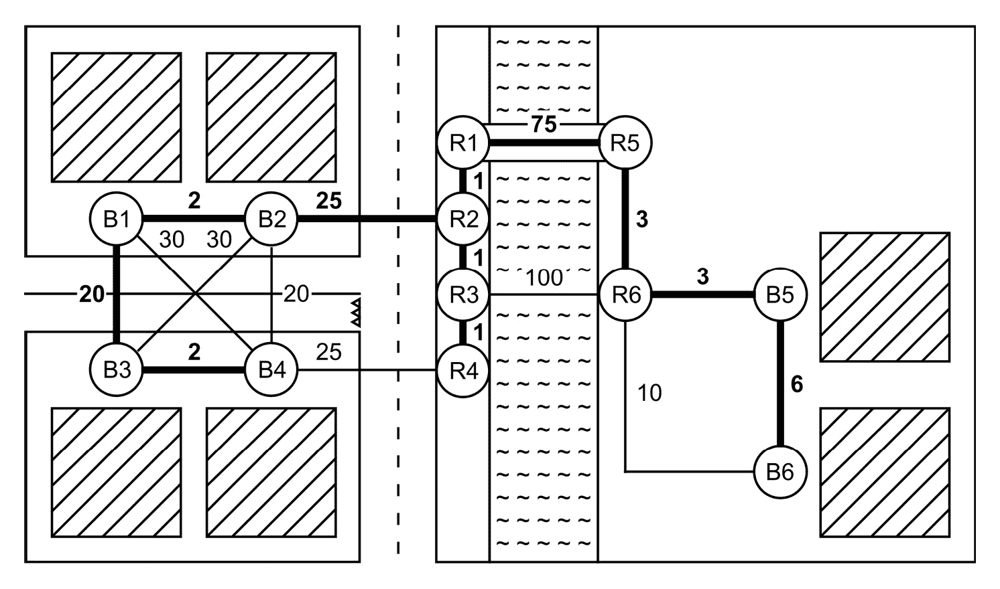

图 8.20 – 电信电缆示例的结果示意图

同样，你可以应用 Prim 算法：

```cs
Console.WriteLine("\nMinimum Spanning Tree - Prim:");
List<Edge<string>> prim = graph.MSTPrim();
prim.ForEach(Console.WriteLine);
Console.WriteLine("Cost: " + prim.Sum(e => e.Weight));
```

结果如下：

```cs
Minimum Spanning Tree - Prim:
B1 -> B2\. Weight: 2.
B1 -> B3\. Weight: 20.
B3 -> B4\. Weight: 2.
R6 -> B5\. Weight: 3.
B5 -> B6\. Weight: 6.
R2 -> R1\. Weight: 1.
B2 -> R2\. Weight: 25.
R2 -> R3\. Weight: 1.
R3 -> R4\. Weight: 1.
R1 -> R5\. Weight: 75.
R5 -> R6\. Weight: 3.
Cost: 139
```

你刚刚完成了一个与 MST 实际应用相关的示例。你准备好继续学习另一个被称为着色的图相关主题了吗？

上色

寻找最小生成树（MST）的问题并不是唯一的图相关问题。其中之一是**节点着色**。它的目的是**将颜色（数字）分配给所有节点，以符合规则，即不能存在两个具有相同颜色的节点之间的边**。当然，颜色数量应尽可能少。此类问题有一些实际应用，例如绘制地图。本章中展示的着色算法实现相当简单，在某些情况下可能需要比必要的更多颜色。

四色定理

你知道每个平面图的节点可以用不超过四种颜色着色吗？如果你对这个主题感兴趣，请查看 **四色定理** ([`mathworld.wolfram.com/Four-ColorTheorem.html`](http://mathworld.wolfram.com/Four-ColorTheorem.html))。由于我在谈论平面图，你应该理解它是一个在平面上绘制时边不会交叉的图。

让我们看看以下图表：

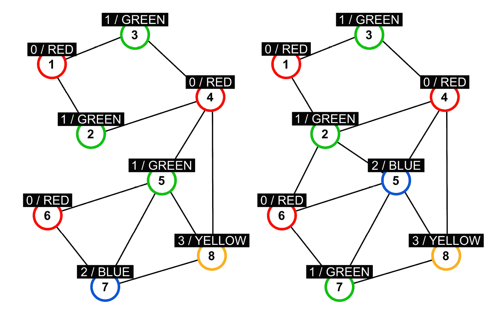

图 8.21 – 图着色的示意图

左侧的插图展示了一个使用四种颜色着色的图：红色（索引等于 **0**）、绿色（**1**）、蓝色（**2**）和黄色（**3**）。正如你所见，没有节点通过边连接具有相同的颜色。右侧展示的图显示了具有两个额外边（**2**，**6**）和（**2**，**5**）的图。在这种情况下，着色已改变，但颜色的数量保持不变。

问题在于，如何为节点找到颜色以满足上述规则？幸运的是，算法非常简单，其实现如下。以下是 `Color` 方法的代码，它应该添加到 `Graph` 类中：

```cs
public int[] Color()
{
    int[] colors = new int[Nodes.Count];
    Array.Fill(colors, -1);
    colors[0] = 0;
    bool[] available = new bool[Nodes.Count];
    for (int i = 1; i < Nodes.Count; i++)
    {
        Array.Fill(available, true);
        foreach (Node<T> neighbor in Nodes[i].Neighbors)
        {
            int ci = colors[neighbor.Index];
            if (ci >= 0) { available[ci] = false; }
        }
        colors[i] = Array.IndexOf(available, true);
    }
    return colors;
}
```

`Color` 方法使用两个与节点相关的辅助数组。第一个名为 `colors`，存储为特定节点选择的颜色索引。默认情况下，所有元素值设置为 `-1`，除了第一个，它被设置为 `0`。这意味着第一个节点的颜色将自动设置为第一种颜色（例如，红色）。另一个辅助数组（`available`）存储有关特定颜色可用性的信息。

代码中最关键的部分是 `for` 循环。在这个循环中，你通过将 `available` 数组中所有元素的值设置为 `true` 来重置颜色的可用性。然后，你遍历当前节点的邻居节点，读取它们的颜色，并通过将 `available` 数组中特定元素的值设置为 `false` 来标记这些颜色为不可用。然后，你找到当前节点的第一个可用颜色并使用它。

让我们看看 `Color` 方法的用法：

```cs
Graph<int> graph = new()
    { IsDirected = false, IsWeighted = false };
Node<int> n1 = graph.AddNode(1);
Node<int> n2 = graph.AddNode(2);
Node<int> n3 = graph.AddNode(3);
Node<int> n4 = graph.AddNode(4);
Node<int> n5 = graph.AddNode(5);
Node<int> n6 = graph.AddNode(6);
Node<int> n7 = graph.AddNode(7);
Node<int> n8 = graph.AddNode(8);
graph.AddEdge(n1, n2);
graph.AddEdge(n1, n3);
graph.AddEdge(n2, n4);
graph.AddEdge(n3, n4);
graph.AddEdge(n4, n5);
graph.AddEdge(n4, n8);
graph.AddEdge(n5, n6);
graph.AddEdge(n5, n7);
graph.AddEdge(n5, n8);
graph.AddEdge(n6, n7);
graph.AddEdge(n7, n8);
int[] colors = graph.Color();
for (int i = 0; i < colors.Length; i++)
{
    Console.WriteLine(
        $"Node {graph.Nodes[i].Data}: {colors[i]}");
}
```

在这里，你创建了一个新的无向无权图，与前面图中的左侧相同。然后，你添加节点和边，以及调用 `Color` 方法进行节点着色。结果，你得到一个包含特定节点颜色索引的数组。然后，你在控制台中展示结果：

```cs
Node 1: 0
Node 2: 1
Node 3: 1
Node 4: 0
Node 5: 1
Node 6: 0
Node 7: 2
Node 8: 3
```

通过这个简短的介绍，你就可以继续进行实际应用了，即着色省份地图。

示例 – 省份地图

让我们创建一个程序，将波兰的省地图表示为图，并着色这些区域，使得相邻省份的颜色不同。当然，你应该尽量限制颜色的数量。

首先，让我们思考一下图的表示。在这里，节点代表特定的地区，而边代表地区之间的共同边界。

下图显示了已经着色的波兰地图：

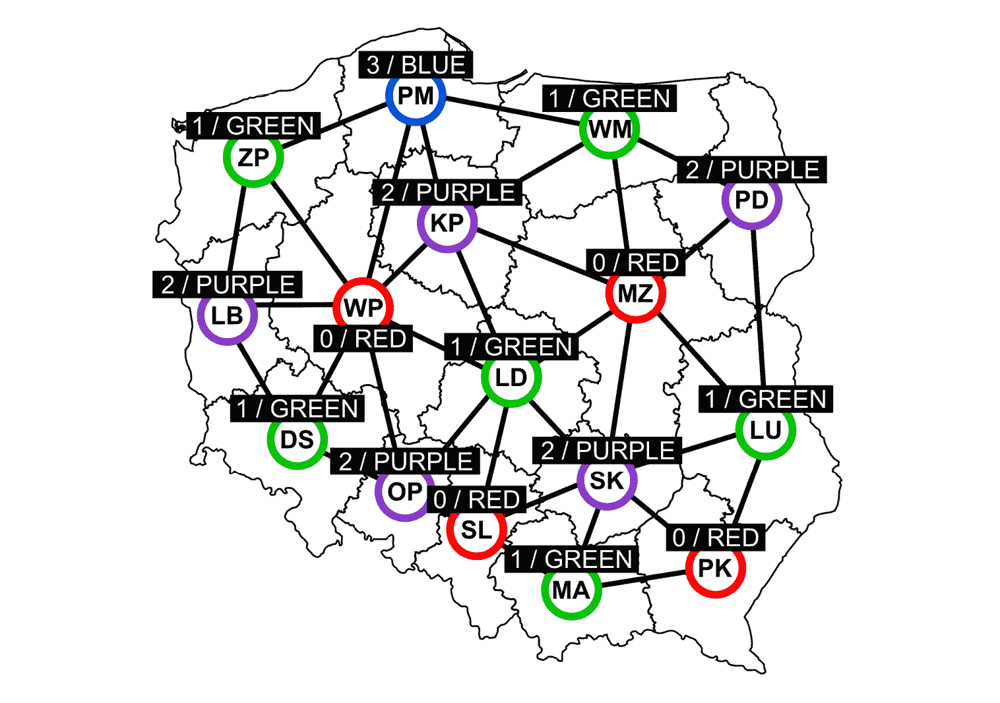

图 8.22 – 地区地图示例的说明

你的任务只是使用之前描述的算法在图中着色节点。为此，你创建一个无向无权图，添加代表地区的节点，并添加边来表示共同边界。代码如下：

```cs
Graph<string> graph = new()
    { IsDirected = false, IsWeighted = false };
List<string> borders =
[
    "PK:LU|SK|MA",
    "LU:PK|SK|MZ|PD",
    "SK:PK|MA|SL|LD|MZ|LU",
    "MA:PK|SK|SL",
    "SL:MA|SK|LD|OP",
    "LD:SL|SK|MZ|KP|WP|OP",
    "WP:LD|KP|PM|ZP|LB|DS|OP",
    "OP:SL|LD|WP|DS",
    "MZ:LU|SK|LD|KP|WM|PD",
    "PD:LU|MZ|WM",
    "WM:PD|MZ|KP|PM",
    "KP:MZ|LD|WP|PM|WM",
    "PM:WM|KP|WP|ZP",
    "ZP:PM|WP|LB",
    "LB:ZP|WP|DS",
    "DS:LB|WP|OP"
];
Dictionary<string, Node<string>> nodes = [];
foreach (string border in borders)
{
    string[] parts = border.Split(':');
    string name = parts[0];
    nodes[name] = graph.AddNode(name);
}
foreach (string border in borders)
{
    string[] parts = border.Split(':');
    string name = parts[0];
    string[] vicinities = parts[1].Split('|');
    foreach (string vicinity in vicinities)
    {
        Node<string> from = nodes[name];
        Node<string> to = nodes[vicinity];
        if (!from.Neighbors.Contains(to))
        {
            graph.AddEdge(from, to);
        }
    }
}
```

然后，在`Graph`实例上调用`Color`方法，并返回特定节点的颜色索引。最后，你在控制台中展示结果。合适的代码部分如下：

```cs
int[] colors = graph.Color();
for (int i = 0; i < colors.Length; i++)
{
    Console.WriteLine(
        $"{graph.Nodes[i].Data}: {colors[i]}");
}
```

结果如下：

```cs
PK: 0
LU: 1
SK: 2
MA: 1
SL: 0
LD: 1
WP: 0
OP: 2
MZ: 0
PD: 2
WM: 1
KP: 2
PM: 3
ZP: 1
LB: 2
DS: 1
```

你刚刚学习了如何在图中着色节点！然而，这并不是本书中关于图的有意思话题的结束。接下来，我们将搜索图中的最短路径。

最短路径

图是一种存储各种地图数据（如城市及其之间的距离）的绝佳数据结构。因此，图的一个明显的实际应用是**在两个节点之间搜索** **最短路径** **，考虑到特定的成本**，例如距离、所需时间，甚至所需的燃油量。

在图中搜索最短路径的方法有很多。然而，一个常见的解决方案是**Dijkstra 算法**，它使得**计算从起始节点到图中所有节点的距离**成为可能。然后，你可以轻松地得到两个节点之间的连接成本，还可以找到位于起始节点和结束节点之间的节点。

Dijkstra 算法使用两个与节点相关的辅助数组：

+   一个用于存储前一个节点的标识符，即当前节点可以通过最小的总成本到达的节点

+   一个用于存储最小距离（成本），这对于访问当前节点是必要的

更重要的是，它使用队列来存储应该检查的节点。**在连续迭代过程中，算法更新图中特定节点的最小距离**。最后，辅助数组包含从所选起始节点到达所有节点的最小距离（成本），以及如何使用最短路径到达每个节点的信息。

你在哪里可以找到更多信息？

你可以在互联网上找到大量关于 Dijkstra 算法的内容。只需搜索其名称，你将看到大量的结果。例如，你可以在本章中找到有关实现的有用内容，链接为[`en.wikipedia.org/wiki/Dijkstra%27s_algorithm`](https://en.wikipedia.org/wiki/Dijkstra%27s_algorithm)。

让我们看看以下图表，它展示了使用 Dijkstra 算法找到的两个不同最短路径。左侧显示从节点**8**到**1**的路径，而右侧显示从节点**1**到**7**的路径：

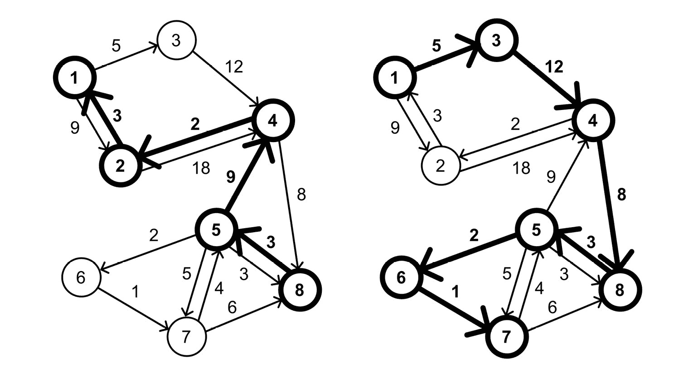

图 8.23 – 图中路径的最短路径示意图

是时候看看一些可以用来实现 Dijkstra 算法的 C#代码了。`GetShortestPath`方法扮演主要角色，应该添加到`Graph`类中。代码如下：

```cs
using Priority_Queue; (...)
public List<Edge<T>> GetShortestPath(
    Node<T> source, Node<T> target)
{
    int[] previous = new int[Nodes.Count];
    Array.Fill(previous, -1);
    int[] distances = new int[Nodes.Count];
    Array.Fill(distances, int.MaxValue);
    distances[source.Index] = 0;
    SimplePriorityQueue<Node<T>> nodes = new();
    for (int i = 0; i < Nodes.Count; i++)
    {
        nodes.Enqueue(Nodes[i], distances[i]);
    }
    while (nodes.Count != 0)
    {
        Node<T> node = nodes.Dequeue();
        for (int i = 0; i < node.Neighbors.Count; i++)
        {
            Node<T> neighbor = node.Neighbors[i];
            int weight = i < node.Weights.Count
                ? node.Weights[i] : 0;
            int wTotal = distances[node.Index] + weight;
            if (distances[neighbor.Index] > wTotal)
            {
                distances[neighbor.Index] = wTotal;
                previous[neighbor.Index] = node.Index;
                nodes.UpdatePriority(neighbor,
                    distances[neighbor.Index]);
            }
        }
    }
    List<int> indices = [];
    int index = target.Index;
    while (index >= 0)
    {
        indices.Add(index);
        index = previous[index];
    }
    indices.Reverse();
    List<Edge<T>> result = [];
    for (int i = 0; i < indices.Count - 1; i++)
    {
        Edge<T> edge = this[indices[i], indices[i + 1]]!;
        result.Add(edge);
    }
    return result;
}
```

`GetShortestPath`方法接受两个参数，即`source`和`target`节点。首先，它创建两个与节点相关的辅助数组，用于存储从给定节点可以到达的前一个节点的索引，这些索引具有最小的整体成本（`previous`），以及用于存储到给定节点的当前最小距离（`distances`）。默认情况下，`previous`数组中所有元素的值设置为`-1`，而在`distances`数组中，它们设置为`int`类型的最大值。当然，源节点的距离设置为`0`。

然后，你创建一个新的优先队列并将所有节点的数据入队。每个元素优先级等于到该节点的当前距离。在这里，你使用与*第五章*中介绍的相同的优先队列实现，即来自`OptimizedPriorityQueue` NuGet 包。

代码中最有趣的部分是`while`循环，它一直执行到队列变为空。在这个`while`循环中，你从队列中获取第一个节点，并使用`for`循环遍历其所有邻居。在这样一个循环中，你通过将当前节点的距离和边的权重相加来计算到邻居的距离。如果计算出的距离小于当前存储的值，你将更新有关给定邻居的最小距离以及可以到达邻居的前一个节点索引的值。值得注意的是，队列中元素的优先级也应该更新。

剩余的操作用于使用存储在`previous`数组中的值来解析路径。为此，你将后续节点的索引保存到`indices`列表中。然后，你将其反转以实现从源节点到目标节点的顺序。最后，你创建一个边列表，以便以适合从方法返回的形式呈现结果。

让我们看看`GetShortestPath`方法的用法：

```cs
Graph<int> graph = new()
    { IsDirected = true, IsWeighted = true };
Node<int> n1 = graph.AddNode(1); (...)
Node<int> n8 = graph.AddNode(8);
graph.AddEdge(n1, n2, 9); (...)
graph.AddEdge(n8, n5, 3);
List<Edge<int>> path = graph.GetShortestPath(n1, n5);
path.ForEach(Console.WriteLine);
```

在这里，你创建一个新的有向加权图，并添加节点和边。代码中缺失的部分与*有向加权边*示例中的相同。然后，你调用`GetShortestPath`方法来搜索节点`1`和`5`之间的最短路径。结果，你将收到形成最短路径的边的列表。然后，你只需遍历所有边，并在控制台显示结果：

```cs
1 -> 3\. Weight: 5.
3 -> 4\. Weight: 12.
4 -> 8\. Weight: 8.
8 -> 5\. Weight: 3.
```

在这个简短的介绍和简单示例的基础上，让我们继续探讨与游戏开发相关的高级和有趣的应用。

示例 - 游戏中的路径

本章我们将涵盖的最后一个示例涉及将 Dijkstra 算法应用于在游戏地图中找到最短路径。让我们想象你有一个带有各种障碍物的棋盘。因此，玩家只能使用棋盘的一部分来移动。你的任务是找到棋盘上两个位置之间的最短路径。

首先，让我们将棋盘表示为一个交错数组。合适的代码部分如下所示：

```cs
using System.Text;
string[] lines = new string[]
{
    "0011100000111110000011111",
    "0011100000111110000011111",
    "0011100000111110000011111",
    "0000000000011100000011111",
    "0000001110000000000011111",
    "0001001110011100000011111",
    "1111111111111110111111100",
    "1111111111111110111111101",
    "1111111111111110111111100",
    "0000000000000000111111110",
    "0000000000000000111111100",
    "0001111111001100000001101",
    "0001111111001100000001100",
    "0001100000000000111111110",
    "1111100000000000111111100",
    "1111100011001100100010001",
    "1111100011001100001000100"
};
bool[][] map = new bool[lines.Length][];
for (int i = 0; i < lines.Length; i++)
{
    map[i] = lines[i]
        .Select(c => int.Parse(c.ToString()) == 0)
        .ToArray();
}
```

为了提高代码的可读性，地图被表示为一个`string`值数组。每一行都作为文本呈现，字符数等于列数。每个字符的值表示点的可用性。如果等于`0`，则位置可用。否则，不可用。基于`string`的地图表示应然后转换为布尔交错数组。这项任务通过前面片段中显示的几行代码完成。

下一步是创建图，并添加必要的节点和边。合适的代码部分如下：

```cs
Graph<string> graph = new()
    { IsDirected = false, IsWeighted = true };
for (int i = 0; i < map.Length; i++)
{
    for (int j = 0; j < map[i].Length; j++)
    {
        if (!map[i][j]) { continue; }
        Node<string> from = graph.AddNode($"{i}-{j}");
        if (i > 0 && map[i - 1][j])
        {
            Node<string> to = graph.Nodes
                .Find(n => n.Data == $"{i - 1}-{j}")!;
            graph.AddEdge(from, to, 1);
        }
        if (j > 0 && map[i][j - 1])
        {
            Node<string> to = graph.Nodes
                .Find(n => n.Data == $"{i}-{j - 1}")!;
            graph.AddEdge(from, to, 1);
        }
    }
}
```

首先，你初始化一个新的无向加权图。然后，你使用两个`for`循环遍历棋盘上的所有位置。在循环中，你检查给定位置是否可用。如果是，你创建一个新的节点（`from`）。然后，你检查当前节点正上方的节点是否也可用。如果是，添加一个合适的边，权重等于`1`。同样，你也可以检查当前节点左侧的节点是否可用，并在必要时添加边。

现在，你只需要获取表示源节点和目标节点的`Node`实例。你可以通过使用`Find`方法并提供节点的文本表示来实现这一点——例如，`0-0`或`16-24`。然后，你调用`GetShortestPath`方法。在这种情况下，算法将尝试找到第一行第一列的节点和最后一行最后一列的节点之间的最短路径。代码如下所示：

```cs
Node<string> s = graph.Nodes.Find(n => n.Data == "0-0")!;
Node<string> t = graph.Nodes.Find(n => n.Data == "16-24")!;
List<Edge<string>> path = graph.GetShortestPath(s, t);
```

代码的最后部分与在控制台显示地图有关：

```cs
Console.OutputEncoding = Encoding.UTF8;
for (int r = 0; r < map.Length; r++)
{
    for (int c = 0; c < map[r].Length; c++)
    {
        bool isPath = path.Any(e =>
            e.From.Data == $"{r}-{c}"
            || e.To.Data == $"{r}-{c}");
        Console.ForegroundColor = isPath
            ? ConsoleColor.White
            : map[r][c]
                ? ConsoleColor.Green
                : ConsoleColor.Red;
        Console.Write("\u25cf ");
    }
    Console.WriteLine();
}
Console.ResetColor();
```

首先，你需要在控制台中设置适当的编码，以便能够以 Unicode 字符的形式显示。然后，你使用两个`for`循环遍历棋盘上的所有位置。在这些循环内部，你选择一个颜色来表示控制台中的点，绿色（点可用）或红色（不可用）。如果当前分析的点是最短路径的一部分，则设置白色。最后，你写入表示点的 Unicode 字符。当程序执行退出这两个循环时，控制台的颜色被重置。

当你运行应用程序时，你会看到以下结果：

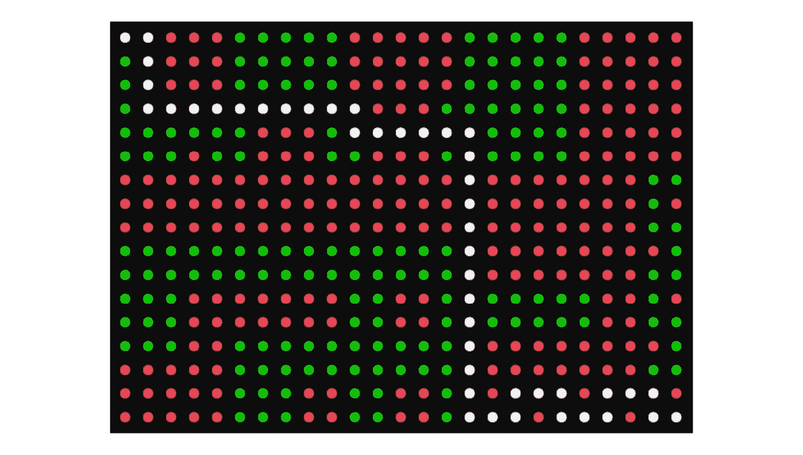

图 8.24 – 游戏地图示例的截图

干得好！现在，让我们总结本章中涵盖的主题。

摘要

本章与开发应用程序时可用的重要数据结构之一相关：图。正如你所学的，**图**是一种由**节点**和**边**组成的数据结构。每条边连接两个节点。更重要的是，还有各种边的变体，如无向和有向，以及无权和加权。所有这些都被详细描述和解释，并提供了插图和代码示例。还解释了两种图表示方法，即使用**邻接表**和**邻接矩阵**。你还学习了如何在 C#语言中实现图。

在讨论图时，展示一些**实际应用**是很重要的，尤其是在这种数据结构被广泛使用的情况下。例如，本章解释了社交媒体上可用的朋友结构或在城市中搜索最短路径的问题。

在本章涵盖的主题中，你学习了如何遍历图以以某种特定顺序访问所有节点。介绍了两种方法，即**深度优先搜索（DFS**）和**广度优先搜索（BFS**）。值得一提的是，遍历主题也可以应用于在图中搜索给定节点。 

接下来，介绍了**生成树**的主题，以及**最小生成树**。作为提醒，生成树是图中所有节点之间无环连接的边的子集，而最小生成树（MST）是从图中所有生成树中选择成本最低的生成树。寻找 MST 的方法有几种，包括**克鲁斯卡尔算法**和**普里姆算法**。

然后，你学习了如何解决**着色**问题，其中你为所有节点分配颜色（数字），以符合规则：两个节点之间不能有相同颜色的边。

另一个问题是在两个节点之间寻找**最短路径**，这需要考虑特定的成本，例如距离、所需时间，甚至所需的燃油量。在图论中，寻找最短路径有几种不同的方法。然而，其中一种常见的解决方案是**迪杰斯特拉算法**，它使得从起始节点到图中所有节点的距离计算成为可能。我们在这章中对此进行了详细的介绍。

现在，是时候进入下一章了，这一章将重点介绍来自各种组别，包括递归、贪婪、回溯，甚至遗传算法的**算法的实际应用方面**。让我们翻到下一页，看看它们是如何发挥作用的！

```cs

```
