# 第十章：结论

正如你在阅读本书时所看到的，有许多具有许多配置变体的数据结构。因此，**选择合适的数据结构并不是一件容易的事情**，这可能会对开发解决方案的性能产生重大影响。即使是本书中提到的主题也形成了一个相当长的数据结构描述列表。因此，以某种方式对它们进行分类是一个好主意。

在本章中，描述的数据结构被分为线性和非线性类别。在**线性数据结构**中，每个元素可以逻辑上与下一个或前一个元素相邻。在**非线性数据结构**的情况下，单个元素可以逻辑上与许多其他元素相邻，而不仅仅是单个或两个。

作为本书的最后一章，我们也将总结所有收集到的知识。每个数据结构都将提供一个简要的描述，其中一些还将通过插图展示，以帮助您记住这些信息。

在本章中，将涵盖以下主题：

+   分类

+   数组

+   列表

+   栈

+   队列

+   字典

+   集合

+   树

+   图

+   最后一词

# 分类

我将从对本书中展示的数据结构的分类开始。这个分类将所有结构分为线性和非线性。

**线性数据结构**意味着**每个元素可以逻辑上与下一个或前一个元素相邻**。有几个数据结构遵循这个规则，例如数组、列表、栈和队列。当然，你也应该注意所提到数据结构的各种子类型，例如链表的四种变体，它是列表的子类型。

**非线性数据结构**表示**单个元素可以逻辑上与许多其他元素相邻，而不仅仅是单个或两个**。它们可以在内存中自由分布。当然，包括树在内的基于图的数据结构也包含在这个类别中。树包括二叉树、Trie 树和堆，而二叉搜索树是二叉树的子类型。以类似的方式，你可以描述本书中展示和解释的其他数据结构之间的关系。

以下图表展示了所提到的分类：

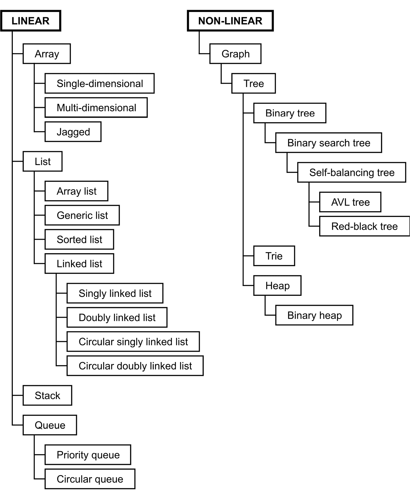

图 10.1 – 将数据结构分类为线性和非线性

你还记得书中展示的所有数据结构吗？由于描述的主题数量众多，重新审视以下数据结构是一个好主意。同时也会提到相关的算法。本章剩余部分是对一些实际应用的简要总结。

# 数组

让我们从 `int`、`string`或用户定义的类开始。重要的假设是数组的元素数量在初始化后不能改变。此外，数组属于**随机访问数据结构**。这意味着你可以使用索引来访问数组的第一个、中间的、第 *n* 个或最后一个元素。

你可以从数组的几种变体中受益——即**单维**、**多维**和**锯齿形数组**，也称为**数组数组**。所有这些变体都在下面的插图中有展示：

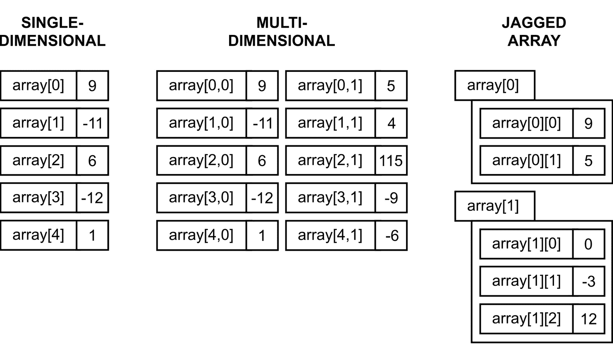

图 10.2 – 数组的变体

数组有很多应用，作为一个开发者，你可能已经多次使用这种数据结构了。在这本书中，你看到了如何使用它来存储各种数据，例如**月份名称**、**乘法表**，甚至**游戏地图**。在后一种情况下，你创建了一个与地图大小相同的二维数组，其中每个元素指定了某种地形类型，例如草地。

有许多算法在数组上执行操作。然而，最常见的任务之一是将数组排序，以正确地排列其元素，无论是升序还是降序。这本书重点介绍了七个算法，即**选择排序**、**插入排序**、**冒泡排序**、**归并排序**、**希尔排序**、**快速排序**和**堆排序**。每个算法都在插图和 C# 代码中进行了描述和展示，并附有详细的解释。

# 列表

接下来的一组数据结构是 `ArrayList`及其泛型（`List`）和排序（`SortedList`）变体。后者可以理解为键值对的集合，始终按键排序。

列表还有一些其他变体，包括`LinkedList`。你可以相当容易地扩展它以表现得像任何循环链表，无论是循环单链表还是循环双链表。

下面的插图显示了列表的多种变体：

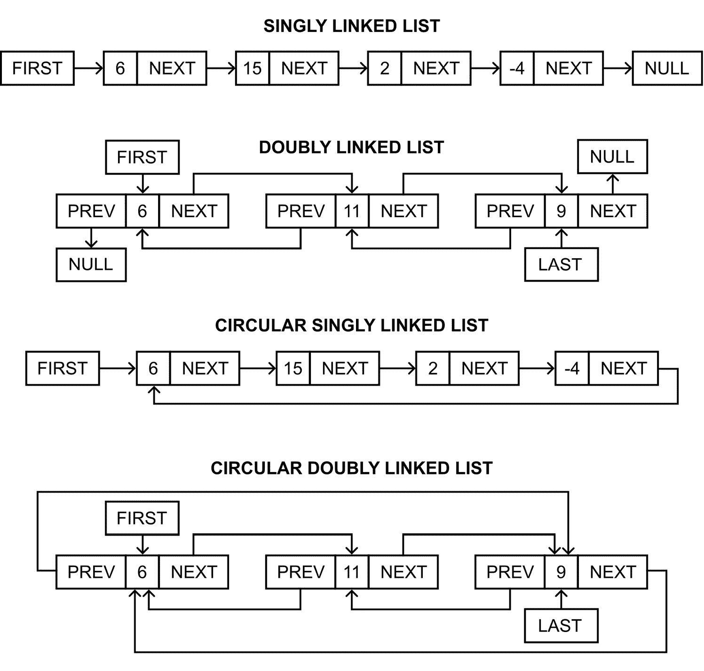

图 10.3 – 列表的变体

列表在解决各种应用中的各种问题时有很多应用。在这本书中，你看到了如何利用列表存储一些浮点值并计算平均值，如何使用这种数据结构创建一个简单的**人员数据库**，以及如何开发一个自动排序的**地址簿**。此外，你还准备了一个示例应用，允许用户通过改变页面来**阅读书籍**，以及一个游戏，用户可以通过随机力量**旋转轮盘**。轮盘旋转得越来越慢，直到停止。然后，用户可以再次旋转它，从上一个停止位置开始，这说明了循环链表。

# 栈

第五章 *栈和队列* 专注于栈和队列。现在，让我们回顾一下，`Stack` 类也是可用的。

栈的示意图如下所示：

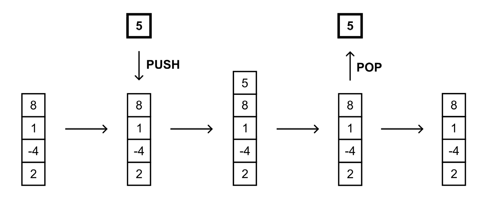

图 10.4 – 栈的示意图

栈在现实世界中也有许多应用。其中一个例子是关于**许多盘子堆叠**的，每个盘子都放在另一个盘子的上面。你只能在新盘子堆的顶部添加一个新的盘子，你只能从盘子堆的顶部取出一个盘子。你不能在不取走顶部前六个盘子的情况下取出第七个盘子，也不能在盘子堆的中间添加一个盘子。你还看到了如何使用栈来**反转一个单词**以及如何将其应用于解决数学游戏**汉诺塔**。但这还不是全部，因为栈的应用范围更广，例如用于计算**逆波兰表示法**中提供的数学表达式。

# 队列

第五章的另一个主要主题是 *栈和队列*，其中也为你提供了一个 `Queue` 类。

队列的示意图如下所示：

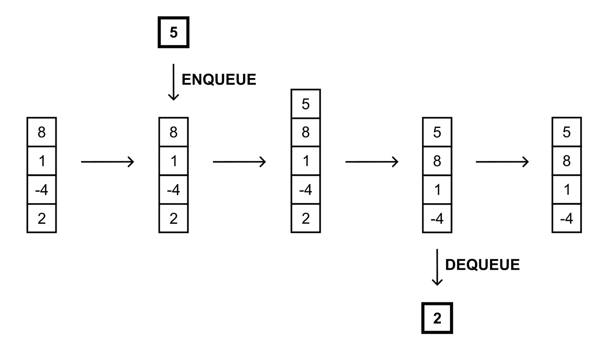

图 10.5 – 队列的示意图

还可以使用**优先队列**，它通过为每个元素设置优先级来扩展队列的概念。因此，出队操作返回的是优先级最高的元素，这是最早添加到队列中的。当所有具有最高优先级的元素都被出队后，优先队列处理具有下一个最高优先级的元素，并从最早添加的元素中出队这些元素。

队列的另一种变体是**循环队列**，也称为**环形缓冲区**，这在书中也被介绍和解释了。在这里，队列形成一个圆圈，内部使用数组，可以放置在队列中的最大元素数量是有限的。在这种情况下，你指定前导元素和尾元素的下标。

队列在现实世界中有很多应用。例如，队列可以用来表示在结账处等待的**人群队列**。新来的人站在队伍的末尾，下一个被带到结账处的人是从队伍的起始位置取出的。不允许从队伍中间选择一个人并为他们服务。此外，你还看到了一些**呼叫中心**解决方案的例子，其中有许多客户和一个顾问，或者许多客户和许多顾问，或者许多客户（具有不同的计划，无论是标准支持还是优先支持）以及只有一个顾问，他回答等待的电话。在介绍**基于图的算法**时还展示了另一组队列应用。在**广度优先搜索**算法中使用了队列来遍历图或搜索图中的给定值。在**迪杰斯特拉算法**中应用了优先队列来搜索图中的最短路径。

# 字典

*第六章*，“字典和集合”这一主题与字典和集合相关。首先，让我们回顾一下**字典**，它允许**将键映射到值并执行快速查找**。字典使用哈希函数，可以理解为包含一对对的集合，每对由一个键和一个值组成。

字典有两种内置版本——非泛型（`Hashtable`）和泛型（`Dictionary`）。还有字典的排序版本（`SortedDictionary`）。所有这些都在详细描述中。

以下插图展示了哈希表的机制：

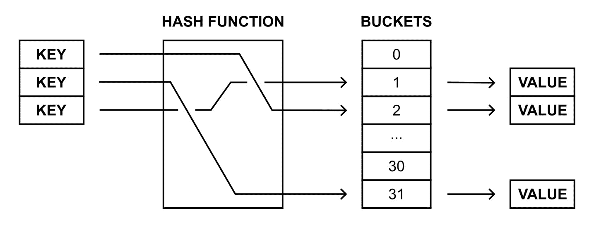

图 10.6 – 将键映射到特定值的示意图

由于哈希表的高性能，这种数据结构在许多实际应用中经常被使用，例如用于**关联数组**、**数据库索引**或**缓存系统**。在本书中，你看到了如何创建一个**电话簿**来存储条目，其中一个人的名字是键，电话号码是值。在其他例子中，你开发了一个帮助商店员工**找到产品放置位置**的应用程序，并且你应用了排序字典来创建一个简单的**百科全书**，用户可以添加条目。

# 集合

另一个来自*第六章*，“字典和集合”的数据结构是**集合**，它是一个**没有重复元素且没有特定顺序的独立对象的集合**。因此，你只能知道给定元素是否在集合中。集合与数学模型和操作（如**并集**、**交集**、**差集**和**对称差集**）紧密相关。

如下所示，示例集合存储了各种类型的数据：

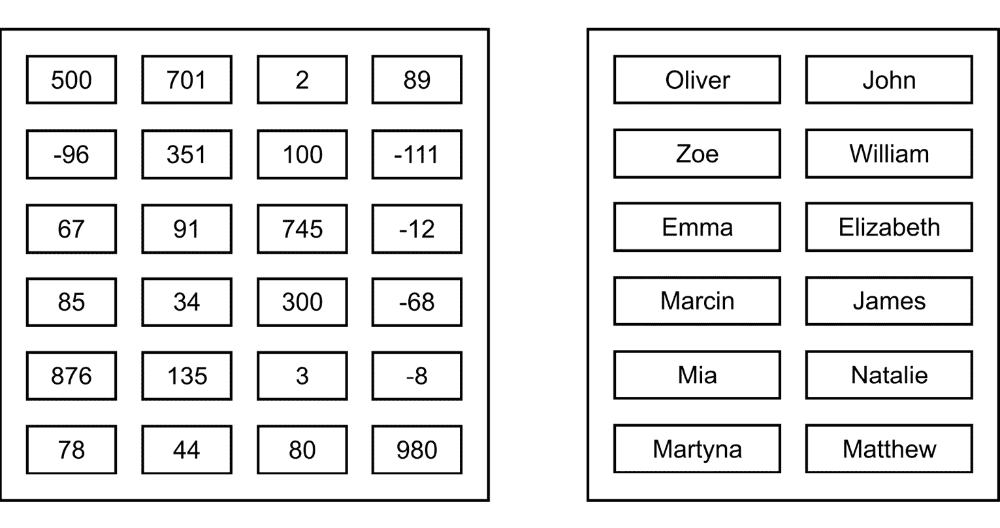

图 10.7 – 整数和字符串值集合的示意图

在开发 C# 语言的应用程序时，你可以从 `HashSet` 类提供的高性能集合相关操作中受益。例如，你看到了如何创建一个处理**一次性促销优惠券**的系统，并允许你检查扫描的优惠券是否已被使用。另一个例子是 SPA 中心四个游泳池系统的**报告服务**。通过使用集合，你可以计算统计数据，例如游泳池的访问人数、最受欢迎的游泳池以及至少访问过一次游泳池的人数。

# 树

下一个主题是关于**树**的，这是第七章“树的变体”的主题。树由具有一个**根**的**节点**组成。根节点没有**父**节点，而所有其他节点都有。此外，每个节点可以有任意数量的**子节点**。同一父节点的子节点可以称为**兄弟节点**，而没有子节点的节点称为**叶节点**。

这里展示了一个示例树：

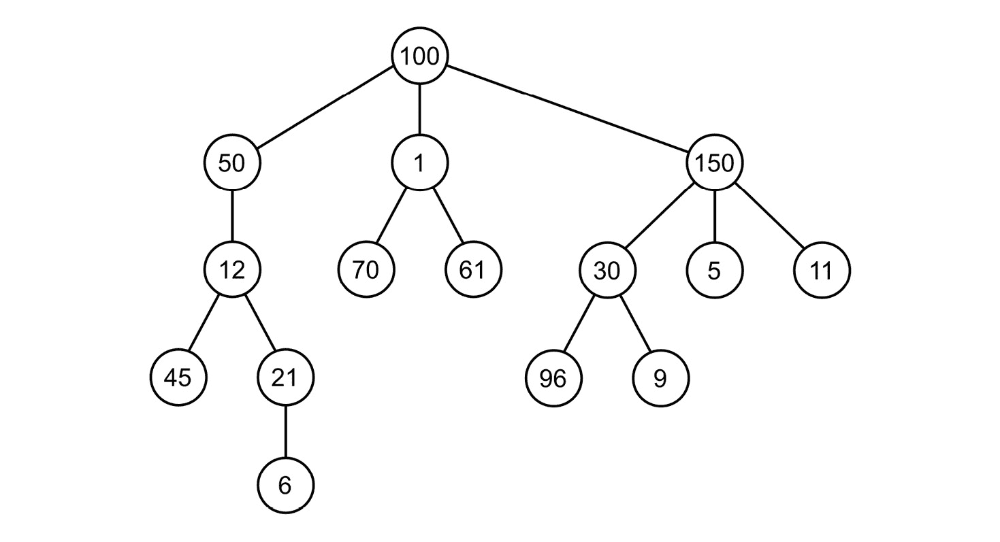

图 10.8 – 树的示意图

树是一种非常适合表示各种数据的数据结构，例如，一个公司**结构**，分为几个部门，每个部门都有自己的结构。你也看到了一个例子，其中使用树来安排一个**简单测验**，由几个问题和答案组成，这些问题和答案根据之前做出的决策显示出来。

通常来说，树中的每个节点可以包含任意数量的子节点。然而，在**二叉树**的情况下，一个节点不能包含超过两个子节点——也就是说，它可以没有子节点，或者只有一个或两个。然而，节点之间的关系没有规则。这里展示了示例二叉树：

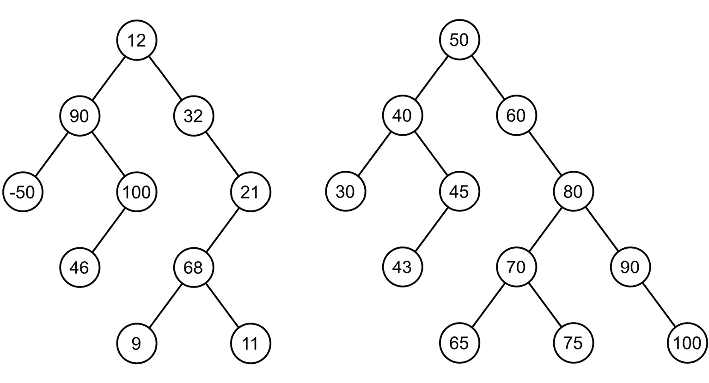

图 10.9 – 二叉树和二叉搜索树的示意图

如果你想使用**二叉搜索树**（BST），接下来介绍的一条规则是：对于任何节点，其左子树中所有节点的值必须小于其值，而其右子树中所有节点的值必须大于其值。上一个图例的右侧展示了示例二叉搜索树。

另一类树被称为**自平衡树**，在添加和删除节点的同时始终保持树的平衡。它们的应用非常重要，因为它允许你形成正确排列的树，这对性能有积极影响。自平衡树有多种变体，但**AVL 树**和**红黑树**（RBTs）是最受欢迎的一些。

树的一个应用与处理字符串有关，例如`a`到`z`）。当你从根节点走到每个节点时，你会得到一个字符串，它要么是一个已保存的单词，要么是其子串，如下面的图例所示：

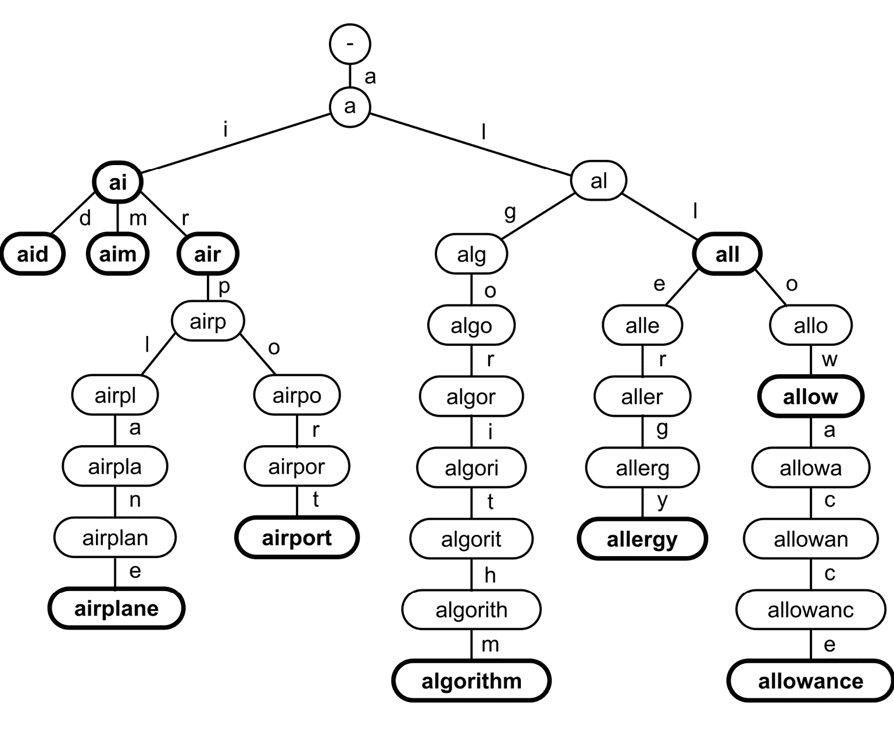

图 10.10 – trie 的示意图

**堆**是树的另一种子类型，存在许多变体，包括**二叉堆**。它包含两个版本——即**最小堆**和**最大堆**。对于每一个，都必须满足额外的属性。对于最小堆，每个节点的值必须大于或等于其父节点的值。因此，根节点包含最小的值。对于最大堆，每个节点的值必须小于或等于其父节点的值。因此，根节点总是包含最大的值。以下是最小二叉堆的示例：

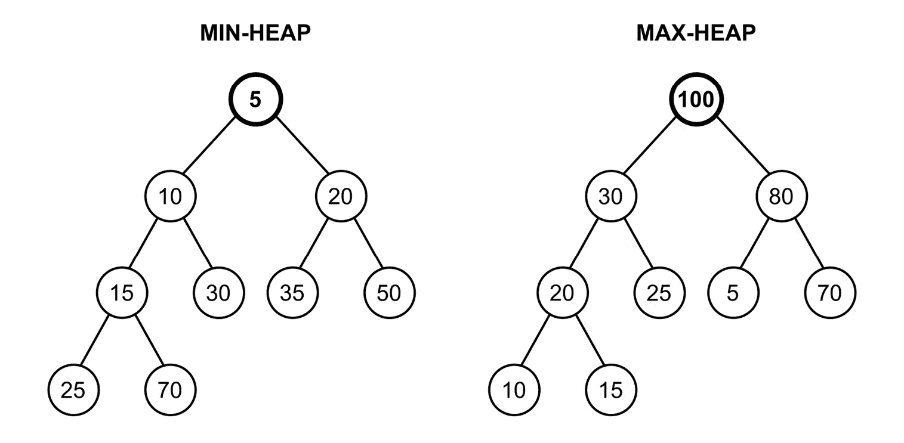

图 10.11 – 最小堆和最大堆的示意图

堆是实现**优先队列**的方便数据结构。另一个有趣的应用是排序算法，名为**堆排序**，这在关于数组和排序的章节中进行了介绍和解释。

# 图

*第八章*，*探索图*，与**图**相关——这是一个应用范围广泛且非常受欢迎的数据结构。提醒一下，图是一种由**节点**和**边**组成的数据结构。每条边连接两个节点。图中边的变体有几种，如无向和有向，以及无权和有权。图可以用邻接表或邻接矩阵来表示。

所有这些主题都在书中进行了描述，包括使用广度优先搜索和深度优先搜索算法进行图**遍历**的问题，使用克鲁斯卡尔和普里姆算法找到**最小生成树**，**节点着色**，以及使用迪杰斯特拉算法在图中找到**最短路径**。

典型的图示如下所示：

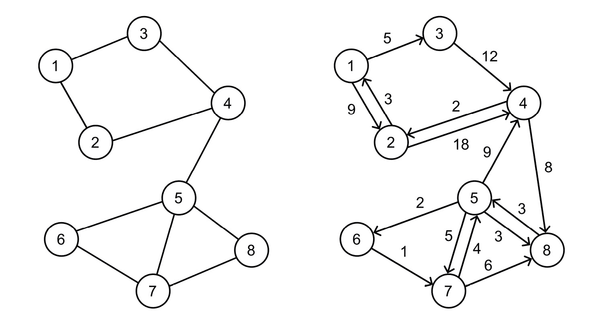

图 10.12 – 图的示意图

图数据结构在多种应用中都很常见。它也是一种表示各种数据的好方法，例如社交媒体网站上可用的**朋友结构**。在这里，节点可以代表联系人，而边代表人与人之间的关系。因此，你可以轻松地检查两个联系人是否认识彼此，或者需要多少人参与安排两个特定人之间的会议。

图的另一个常见应用涉及**寻找路径**的问题。例如，你可以使用图来找到城市中两点之间的路径，考虑到驾驶所需的距离或时间。你可以使用图来表示城市的地图，其中节点是交叉口，边代表道路。你可以给边分配权重，以表示驾驶给定道路所需的距离或时间。

与图相关的应用还有很多。例如，最小生成树可以用来创建**建筑物之间的连接计划**，以最小的成本为所有建筑物提供电信电缆。在书中使用了节点着色问题来**为波兰地图上的省进行着色**，根据规则，两个有共同边界的省份不能有相同的颜色。另一个展示的例子涉及迪杰斯特拉算法在**游戏地图中寻找最短路径**，考虑到各种障碍。

# 最后的话

您已经到达了这本书的最后一章的结尾。首先，介绍了数据结构的分类，考虑了线性和非线性数据结构。在第一组中，您可以找到数组、列表、栈和队列，而第二组包括图及其子类型，包括树和堆。在这一章的后续部分，考虑了各种数据结构的多样性应用。您看到了每种描述的数据结构的简要总结，以及使用特定数据结构（如队列或图）可以解决的问题的信息。为了使内容更容易理解，以及提醒您之前章节中的各种主题，总结配备了数据结构的简要描述和插图。

在这本书的引言中，我邀请您开始您的数据结构和算法冒险之旅。在阅读以下章节、编写数百行代码和调试的过程中，您有机会熟悉各种数据结构，从数组、列表开始，经过栈、队列、字典和集合，最后到树和图。我希望这本书只是您在数据结构和算法领域漫长、充满挑战和成功的冒险的第一步。

我想感谢您阅读这本书。如果您对描述的内容有任何问题或问题，请直接使用显示在[`marcin.com`](https://marcin.com)的联系方式与我联系。在访问我的网站时，您还可以找到许多您在开发生涯中可以提出的问题的答案。请告诉我，您想从这本书的下一版或我的其他书中学习哪些缺失的主题。我真心希望您能从展示的内容中受益。我衷心祝愿您在软件开发者的职业生涯中一切顺利，并希望您有许多成功的项目！如果您让我知道您的大项目，特别是如果它们受到了这本书内容的启发，我将非常高兴。祝您好运，保持联系！
