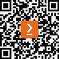

# 前言

欢迎来到*C#面试指南*，这是您掌握 C#编程语言和通过技术面试的全面资源。作为一种灵活且强大的语言，C#在游戏、网络服务和企业软件等众多领域得到广泛应用。本指南精心制作，旨在帮助您在求职过程中每一步都游刃有余，从撰写引人注目的简历和吸引人的求职信，到准备挑战性的面试。它提供了对 C#基础知识、高级概念、最佳实践以及最新框架和库的深入见解。无论您是希望在世界 C#开发领域留下足迹的新手，还是寻求提升面试技巧的资深程序员，本书旨在为您提供在职业生涯中脱颖而出、在日新月异的科技行业中获得理想工作的知识、策略和信心。

# 本书面向的对象

本书主要面向那些希望或在 C#编程和软件开发领域建立或提升职业生涯的个人。它是对以下人群的无价资源：

+   计算机科学、软件工程或相关领域的应届毕业生，他们希望专注于 C#开发，进入科技行业

+   初级到中级 C#开发者，旨在提高他们对高级概念、最佳实践和最新框架的理解，以在职业生涯中取得进步

+   想要从其他编程语言过渡到 C#或扩展技能集以包括这种多才多艺语言的资深开发者

+   准备求职面试的技术专业人士，寻求简历构建、面试策略和针对 C#角色的有效沟通技巧的指导

+   对编程概念有基础理解的自我学习程序员，希望将他们的知识在 C#中正规化和深化

# 本书涵盖的内容

*第一章*，*撰写引人注目的简历和求职信、在线形象和面试准备*，指导您创建有效的简历、专业的在线档案、吸引人的求职信和全面的面试准备。

*第二章*，*通过面试 - 掌握行为问题和面试技巧*，专注于面试准备、掌握行为问题以及在虚拟和面对面环境中专业地展示自己。

*第三章*，*C#编程基础*，介绍了 C#在技术面试中的基本概念、数据类型、控制结构和面向对象编程。

*第四章*，*高级 C#概念*，探讨了高级 C#功能，如集合、LINQ、async、委托、lambda 和多线程，用于复杂软件开发。

*第五章*，*指导可维护和高效 C#编程的基础知识*，涵盖了编写干净的 C#代码、实现 SOLID 原则、设计模式和利用 C#开发工具。

*第六章*，*深入探讨 C#库、框架和技术面试准备*，讨论了如 Entity Framework、ASP.NET Core 和 MAUI/Xamarin 等必要的 C#库和框架，以及技术面试策略。

*第七章*，*克服 C#技术面试的挑战和面试中解决编码挑战的技巧*，专注于 MAUI/Xamarin 的跨平台开发以及解决常见 C#面试问题和策略。

*第八章*，*构建软技能和拓展人脉*，回顾了 C#概念和实际应用，强调软技能和网络以实现成功的面试结果。

*第九章*，*协商薪资和评估工作机会*，指导你进行面试后的跟进、建立专业网络、薪资谈判以及作为 C#开发者评估工作机会。

*第十章*，*获得专家见解、有效跟进和采取行动*，总结了关键的 C#概念，行业专业人士的访谈以及适应行业变化和新兴技术的策略。

*第十一章*，*启动您的 C#职业生涯 - 洞察力*，提供了面试后的步骤、职业建设策略以及保持与 C#行业趋势同步以成功职业的见解。

# 为了最大限度地利用本书

为了充分利用本书，对编程原则有基本了解并熟悉**面向对象编程**（**OOP**）概念是很重要的。了解基本的 C#语法和结构将很有帮助，因为本书将逐步深入到更高级的主题。虽然软件开发背景有帮助，但并非必需，因为本书从基础概念开始，然后过渡到复杂概念。本指南假设你渴望深化你的 C#知识，提高你的面试技巧，并准备好参与编程和职业发展的理论与实践方面。

| **本书涵盖的软件** | **主题** |
| --- | --- |
| Rider | 简历 |
| Visual Studio | 面试 |
| Visual Studio Code | 求职信 |
| C# | STAR |
| MAUI |  |
| OOP |  |

**本指南中包含许多仅为演示目的提供的简短代码示例，您不需要直接执行** **这些示例**。

*为了帮助作者准备此访谈指南，参与者同意接受采访并提供与这项工作相关的信息和其他材料，包括他们的个人经历、评论和回忆，这些内容在*第十章*中描述，获得专家见解、有效跟进和*采取行动*。

# 使用的约定

本书使用了多种文本约定。

`Code in text`: 表示文本中的代码单词、数据库表名、文件夹名、文件名、文件扩展名、路径名、虚拟 URL、用户输入和 Twitter 昵称。以下是一个示例：“`args`参数包含一个字符串数组，在程序启动时传递给程序。”

代码块设置如下：

```cs
public class Program
{
    public static void Main(string[] args)
    {
        // program code
    }
}
```

小贴士或重要注意事项

它看起来像这样。

# 联系我们

我们始终欢迎读者的反馈。

`customercare@packtpub.com` 并在邮件主题中提及书名。

**勘误表**：尽管我们已经尽最大努力确保内容的准确性，但错误仍然可能发生。如果您在此书中发现错误，我们将不胜感激，如果您能向我们报告此错误。请访问[www.packtpub.com/support/errata](http://www.packtpub.com/support/errata)并填写表格。

`copyright@packt.com` 并附上材料的链接。

**如果您有兴趣成为作者**：如果您在某个领域有专业知识，并且您有兴趣撰写或为书籍做出贡献，请访问[authors.packtpub.com](http://authors.packtpub.com)。

# 分享你的想法

读完 C#面试指南后，我们很乐意听听您的想法！请访问[`packt.link/r/1805120468`](https://packt.link/r/1805120468)为此书提供反馈。

您的评论对我们和科技社区非常重要，并将帮助我们确保我们提供高质量的内容。

# 下载此书的免费 PDF 副本

感谢您购买此书！

您喜欢在路上阅读，但无法携带您的印刷书籍到处走？

您的电子书购买是否与您选择的设备不兼容？

不要担心，现在，每购买一本 Packt 书籍，您都可以免费获得该书的 DRM 免费 PDF 版本。

在任何地方、任何地方、任何设备上阅读。直接从您最喜欢的技术书籍中搜索、复制和粘贴代码到您的应用程序中。

优惠远不止这些，您还可以获得独家折扣、时事通讯和每日收件箱中的精彩免费内容。

按照以下简单步骤获取优惠：

1.  扫描下面的二维码或访问以下链接



[`packt.link/free-ebook/9781805120469`](https://download.packt.com/free-ebook/9781805120469)

1.  提交您的购买证明

1.  就这些！我们将直接将您的免费 PDF 和其他优惠发送到您的电子邮件。
