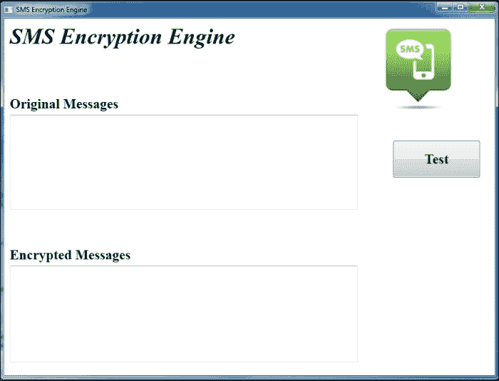
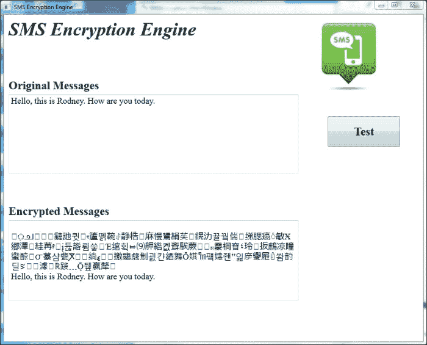
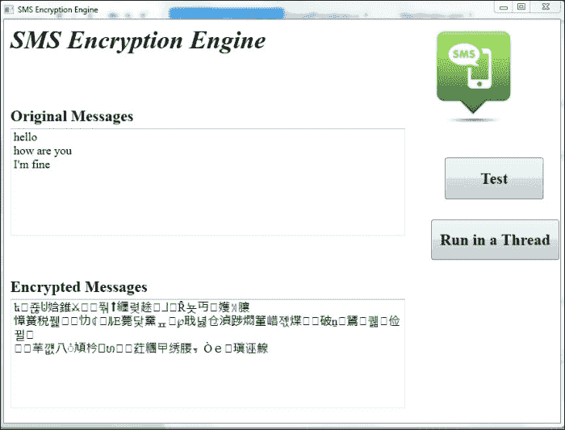
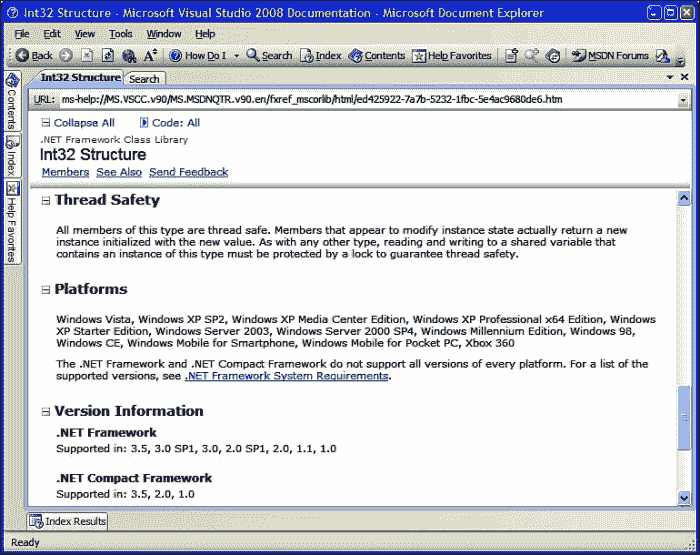
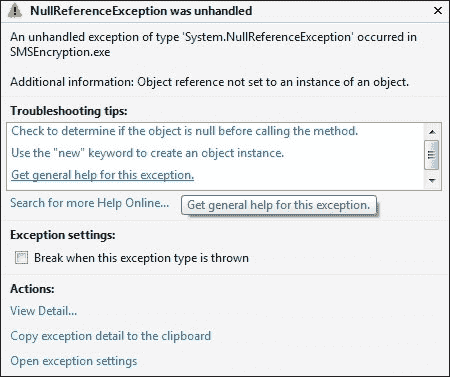
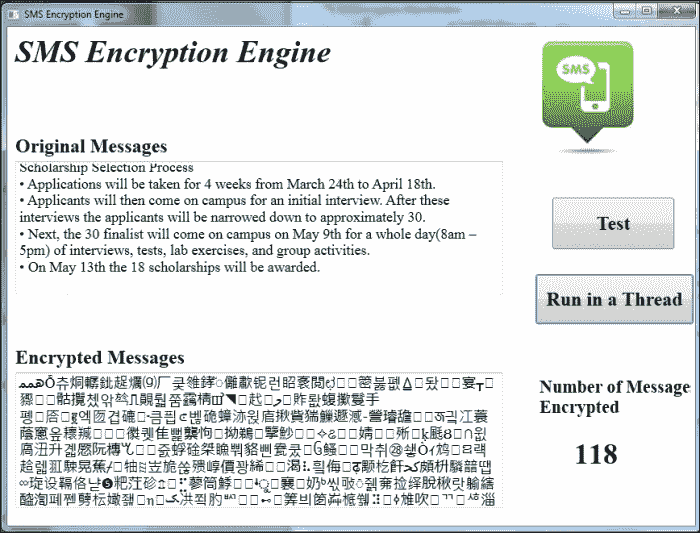
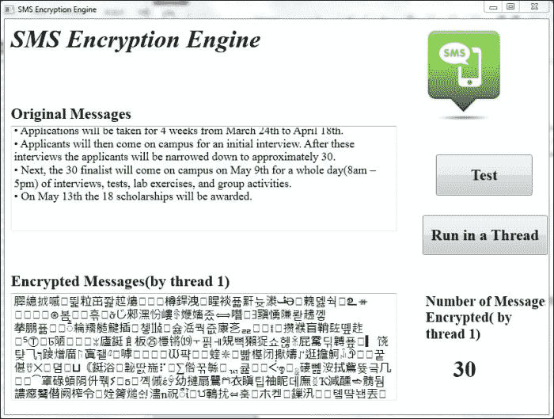

# 第三章。线程类 – C#中的重量级并发

在上一章中，我们探讨了`BackgroundWorker`组件及其如何通过多线程我们的应用程序来实现性能提升。这个组件很有用，但有很多限制。为了对我们的应用程序中并发运行的线程有非常精确的控制，我们可以使用`Thread`类。

在本章中，我们将详细研究这个类，并开发更多复杂的多线程应用程序，充分利用当今硬件的多处理能力。

在本书中，我们将使用**重量级并发**和**轻量级并发**这两个术语。让我们花一分钟时间思考一下我们所说的意思。当我们使用`Thread`类时，正如我们将在本章和下一章中看到的，我们将通过重量级并发来开发多线程应用程序。这意味着创建、协调和管理我们应用程序中的不同线程的责任在我们身上。我们还需要知道运行我们应用程序的硬件有多少个处理核心，以便最大化我们应用程序的多线程效率。我们使用重量级并发这个术语来描述这种多线程开发，因为它需要开发者额外编写代码并付出更多努力来实现最大效益。我们必须创建线程，协调线程之间的交互，管理线程何时完成，等等。

在本书的后面部分，我们将研究`Task`类和**任务并行库**（**TPL**）。这个库是.NET 框架的最近新增功能，将多线程应用程序开发提升到了新的水平。使用这些类可以让开发者以更少的努力实现多线程应用程序的最大化效益。

TPL 为您处理线程创建、协调和管理。使用 TPL 类进行开发被称为轻量级并发，因为开发者需要付出的努力更少。正如我们将看到的，使用这些类有一些缺点，因为大部分多线程工作都是由您来处理的，可能不会按照您期望的方式完成。

因此，根据您的应用程序和专业知识，有时重量级并发和轻量级并发都是正确的解决方案。关键是理解两者，并知道何时使用每个。

现在，我们将专注于重量级并发和`Thread`类。阅读本章并完成练习后，我们将能够：

+   开发对多个运行线程有极大控制的程序，提供令人兴奋的性能提升

+   学习如何使用一个非常强大的类创建独立且非常灵活的线程

+   了解如何启动、控制和协调多个线程

+   发现如何向线程发送参数并从线程检索数据

+   学习如何在多个线程之间共享数据

+   了解如何结合异步和同步执行，以便对正在运行的线程及其任务有详尽的控制

+   开发能够在必要时启动多个线程的应用程序

# 使用`Thread`类创建线程

到目前为止，我们使用`BackgroundWorker`组件创建与主应用程序线程无关的新线程。应用程序可以在处理过程中响应用户界面事件，充分利用多个核心，从而运行得更快。然而，当我们必须控制和管理许多线程的执行时，有一些限制，这些线程不是为了仅在后台运行而设计的。现在，让我们学习如何使用`Thread`类使应用程序能够完全控制并发线程的同步和异步执行。`Thread`类正如其名，是一个允许您为您的进程创建单独执行线程的类。

我们可以使用许多`Thread`类（`System.Threading.Thread`）的实例来运行许多并发线程，这些线程比使用`BackgroundWorker`组件创建的线程具有更多的控制能力。正如我们在上一章所学，性能结果将取决于我们运行应用程序的计算机上可用的核心或处理器的数量。然而，`Thread`类提供了许多精细调优的能力，帮助我们通过多线程实现所需的性能。

`Thread`类在提供极大的灵活性的同时，提供了一个简单的方式来初始化、协调、运行、停止和释放多个线程。

## 让我们从加密程序开始

为了演示如何使用`Thread`类，我们将创建一个简单的 WPF 应用程序，该应用程序可以接收文本消息并对它们进行加密和解密。该应用程序的客户正在使用一款新型手机，这款手机能够发送包含完整 Unicode 字符集的短信（文本消息）。这款手机是单核设备。该应用程序需要在非常快速且高效的加密引擎上运行，该引擎能够加密传入的文本消息并将它们留在输出队列中。这个引擎将在拥有许多多核处理器的巨大服务器上运行。他们希望它能够使用一个非常精细调优的多线程应用程序，能够利用在执行引擎的计算机上可用的所有核心数量。因此，该应用程序必须足够智能，能够检测核心数量并创建相应数量的线程。这样，它就可以充分利用硬件的全部功能，但不会创建额外的线程，这些线程不会进一步提高性能。

## 如何实现

首先，我们将构建一个新的 C# WPF 应用程序，并定义和测试加密和解密字符串的方法：

1.  使用 Visual Studio 中的 WPF 应用程序模板创建一个新的 C#项目。将项目名称命名为`SMSEncryption`。

1.  在设计模式下打开`MainWindow.xaml`，添加以下控件，并按以下截图所示对齐：

    +   一张显示文本消息图形的图片，名为`imgTextMessage`。

    +   三个文本框，它们的`Text`属性设置为`SMS Encryption Engine`、`Original Messages`和`Encrypted Messages`。

    +   两个文本框，它们的`Names`属性设置为`txtOriginalSMS`和`txtEncryptedSMS`，以及它们的`AcceptsReturn`属性设置为`true`。

    +   一个名为`butTest`的按钮控件，其`Text`属性设置为`Test`。这是将要测试加密和解密方法的按钮。

1.  接下来，添加一个名为`EncryptionProcedures`的类文件，它有两个静态方法，一个名为`Encrypt`，另一个名为`Decrypt`。

1.  `Encrypt`方法将加密作为参数接收的字符串，并返回一个包含结果编码消息的字符串，其中包含不可识别的字符。为此方法添加以下代码：

    ```cs
        public static string Encrypt(string psText)
      {
                string lsEncryptedText;
                string lsEncryptedTextWithFinalXOR;
                // A Random number generator
                Random loRandom = new Random();

                // The char position being encrypted
                int i;
                char loRandomChar;

                // Debug
                // Show the original text in the Immediate Window
                System.Diagnostics.Debug.Print("Original text:" + psText);

                lsEncryptedText = "";
                for (i = 0; i <= (psText.Length - 1); i++)
                {
                    loRandomChar = (char)(loRandom.Next(65535));
                    // Current char XOR random generated char

                    // Debug
                    // Show the random char code (in numbers) generated in the Immediate Window
                    System.Diagnostics.Debug.Print("Random char generated:" + ((int)loRandomChar).ToString());

                    lsEncryptedText += ((char)(psText[i] ^ loRandomChar)).ToString();
                    // Random generated char XOR 65535 - i
                    // It is saved because we need it later for the decryption process
                    lsEncryptedText += ((char)(loRandomChar ^ (65535 - i))).ToString();
                    // Another random generated char but just to add garbage to confuse the hackers
                    loRandomChar = (char)(loRandom.Next(65535));
                    lsEncryptedText += loRandomChar.ToString();

                    // Debug
                    // Show how the encrypted text is being generated in the Immediate Window
                    System.Diagnostics.Debug.Print("Partial encryption result char number: " + i.ToString() + ": " + lsEncryptedText);

                }

                lsEncryptedTextWithFinalXOR = "";
                // Now, every character XOR 125
                for (i = 0; i <= (lsEncryptedText.Length - 1); i++)
                {
                    lsEncryptedTextWithFinalXOR += ((char)(lsEncryptedText[i] ^ 125)).ToString();
                }

                // Debug
                // Show how the encrypted text is being generated in the Immediate Window
                System.Diagnostics.Debug.Print("Final encryption result with XOR: " + lsEncryptedTextWithFinalXOR);

                return lsEncryptedTextWithFinalXOR;

    }
    ```

1.  `Decrypt`方法将解密作为参数接收的加密字符串，并返回一个包含解码消息的字符串：

    ```cs
            public static string Decrypt(string psText)
            {
                // The decrypted text to return
                string lsDecryptedText;

                // The char position being decrypted
                int i;
                // The random char
                char loRandomChar;

                lsDecryptedText = "";
                for (i = 0; i <= (psText.Length - 1); i += 3)
                {
                    // Retrieve the previously random generated char XOR 125 XOR 65535 - i (but previous i)
                    loRandomChar = (char)(psText[i + 1] ^ 125 ^ (65535 - (i / 3)));
                    // Char XOR random generated char
                    lsDecryptedText += ((char)(psText[i] ^ 125 ^ loRandomChar)).ToString();
                }

                return lsDecryptedText;
        }
    ```

1.  打开按钮`butTest`的`Click`事件处理方法，并输入以下代码：

    ```cs
               private void butTest_Click(object sender, RoutedEventArgs e)
       {
                // The encrypted text
                string lsEncryptedText;

                // For each line in txtOriginalSMS TextBox
                int lineCount = txtOriginalSMS.LineCount;
                for (int line = 0; line < lineCount; line++)
                {
                    lsEncryptedText = EncryptProcedures.Encrypt(txtOriginalSMS.GetLineText(line));
                    // Append a line with the Encrypted text
                    txtEncryptedSMS.AppendText(lsEncryptedText + Environment.NewLine);
                    // Append a line with the Encrypted text decrypted to test everything is as expected
                    txtEncryptedSMS.AppendText(EncryptProcedures.Decrypt(lsEncryptedText) + Environment.NewLine);
                }
            }
    ```

1.  构建并运行应用程序。

1.  在标签为`Original SMS Messages`的文本框中输入简短文本，然后单击**Test**按钮。加密消息将出现在标签为`Encrypted SMS Messages`的文本框中。解密消息也将出现在底部的文本框中，但这将是解密加密消息以测试算法的结果。

1.  结果将类似于以下截图：

## 工作原理

在这个程序中，我们创建了`Encrypt`和`Decrypt`方法，它们分别接受一个`String`值并对其进行加密和解密。加密算法使用随机数生成器和许多**异或**（**XOR**）操作。它还在文本中添加垃圾数据，以混淆潜在的攻击者。

### 注意

记住，在 C#中，异或操作由`^`运算符指定，可以应用于数字。因此，我们需要进行许多类型转换到`char`类型，然后调用`ToString()`方法。

异或操作最令人兴奋的特性之一是当它被应用两次时，可以返回原始值。例如，考虑以下代码行：

```cs
int liOriginalValue = 120;
int liFirstXOR = liOriginalValue ^ 250;
int liSecondXOR = liFirstXOR ^ 250;
```

分配给`liSecondXOR`的值将与`liOriginalValue`中的值相同，即`120`。

由于加密算法使用完整的 Unicode 字符集，有 65,536 个可能的字符，因此生成的文本是不可读的，并且非常混乱，因为它不仅限于经典的 256 字符集。

# 创建一个使用线程的应用程序

由于我们已经测试了之前加密消息的解密，我们确信它运行良好。现在我们将使用`Thread`类创建的新线程运行加密算法。

我们想使用`Thread`类来紧密控制应用程序中不同处理线程的执行。首先，我们需要让加密函数仅在单个线程中运行。稍后，我们将线程与硬件的核心数对齐，以确保最大效率。因此，现在我们将更改之前构建的应用程序，以便加密逻辑在主应用程序之外单独的线程中运行。这将开始让我们控制何时以及如何加密文本消息。

## 如何操作

现在，我们将对应用程序进行一些修改，并使用`Thread`类创建和配置的新独立线程来加密消息：

1.  打开`SMSEncryption`项目。

1.  添加一个按钮控件（`butRunInThread`）。将其`Text`属性设置为`Run in a Thread`。

1.  由于我们将使用`Thread`类，我们需要添加一个`Using`语句，以便我们的应用程序可以从.NET 框架中找到这个类。在开头添加以下代码行（因为我们将使用`System.Threading.Thread`类）：

    ```cs
        using System.Threading;
    ```

1.  在`MainWindow`代码隐藏文件，`MainWindow.xaml.cs`类定义中添加以下行，以声明三个新的私有变量：

    ```cs
        // The thread
        private Thread proThreadEncryption;
        // The string list with SMS messages to encrypt (input)
        private List<string> prlsSMSToEncrypt;
        // The string list with SMS messages encrypted (output)
        private List<List<string>> prlsEncryptedSMS;
    ```

1.  添加一个名为`butRunInThread`的按钮控件，并将其`Text`属性设置为`Run in a Thread`。这是将测试在主线程之外运行的加密和解密方法的按钮。

1.  打开`butRunInThread`按钮的`Click`事件方法，并输入以下代码以使用`Thread`类创建的新线程运行加密过程：

    ```cs
    private void butRunInThread_Click(object sender, RoutedEventArgs e)
            {
                // Prepare everything the thread needs from the UI
                // For each line in txtOriginalSMS TextBox
                prlsSMSToEncrypt = new List<string>(txtOriginalSMS.LineCount);

                // Add the lines in txtOriginalSMS TextBox
                int lineCount = txtOriginalSMS.LineCount;
                for (int line = 0; line < lineCount; line++)
                {
                    prlsSMSToEncrypt.Add(txtOriginalSMS.GetLineText(line));
                }
                // Create the new Thread and use the ThreadEncryptProcedure method
                proThreadEncryption = new Thread(new ThreadStart(ThreadEncryptProcedure));

                // Start running the thread
                proThreadEncryption.Start();

                // Join the independent thread to this thread to wait until ThreadProc ends
                proThreadEncryption.Join();

                // When the thread finishes running this is the next line that is going to be executed
                // Copy the string List generated by the thread
                foreach (string lsEncryptedText in prlsEncryptedSMS)
                {
                    // Append a line with the Encrypted text
                    txtEncryptedSMS.AppendText(lsEncryptedText +
                     Environment.NewLine);
                }
       }
    ```

1.  现在，我们需要创建一个将在单独线程中运行并加密文本消息的`ThreadEncryptProcedure`。输入以下代码以创建此过程。

    ```cs
        private void ThreadEncryptProcedure()
            {
                string lsEncryptedText;

                //Initialize the encrypted array to the size of the array to encrypt.
                prlsEncryptedSMS = new List<string>(prlsSMSToEncrypt.Count);

                // Line of text message to encrypt
                string lsText;

                // Iterate through each string in the prlsSMSToEncrypt string
                for (int i = 0; i < prlsSMSToEncrypt.Count; i++)
                {
                    lsText = prlsSMSToEncrypt[i];
                    lsEncryptedText = EncryptProcedures.Encrypt(lsText);

                    // Add the encrypted string to the List of encrypted strings
                    prlsEncryptedSMS.Add(lsEncryptedText);
                }
       }
    ```

1.  构建并运行应用程序。

1.  在标记为`Original SMS Messages`的`Textbox`中输入或复制粘贴一段长文本，然后点击**Run in a Thread**按钮。加密的消息将出现在标记为`Encrypted Messages`的`Textbox`中。然而，代码是在不同的线程中运行的。结果将类似于以下截图所示：

## 工作原理

现在，当用户点击**Run in a Thread**按钮时，加密将在新线程中运行，但具有同步执行。我们创建线程，然后使用`proThreadEncryption.Start();`命令启动线程。由于这是一个同步操作，我们随后使用`proThreadEncryption.Join();`命令等待线程完成操作。因此，在单独的线程中，`ThreadEncryptProcedure`运行并加密文本消息字符串到字符串列表。

当运行`ThreadEncryptProcedure`的线程完成时，主线程将继续执行，它通过执行`Join`命令等待线程完成。然后，主线程将获取加密的字符串列表并在底部的文本框中显示它们。

`Thread.Join`方法指示发出调用的线程在此等待，直到线程完成。由于我们没有使用`BackgroundWorker`组件，该组件简化了 UI 解耦，我们必须在代码中完成这项工作。

以下代码行声明了两个私有字符串列表，它们将作为新独立线程的输入（`prlsSMSToEncrypt`）和输出（`prlsEncryptedSMS`）：

```cs
private List<string> prlsSMSToEncrypt;
private List<List<string>> prlsEncryptedSMS;
```

启动后，线程将执行`ThreadEncryptProcedure`中的代码（无参数）。此过程是私有的，位于与上述两个私有字符串列表相同的类中。因此，`ThreadEncryptProcedure`中的代码可以访问这两个变量，以获取输入字符串，加密它们，并将它们添加到输出字符串列表中。我们不是针对 UI 控件进行操作，而是解耦 UI，避免与 UI 相关的多线程问题。

`ThreadEncryptProcedure`执行一个非常简单的任务，不接触 UI 控件。对于输入字符串列表（`prlsSMSToEncrypt`）中的每个字符串，它都会加密该字符串并将其添加到输出字符串列表（`prlsEncryptedSMS`）中。

当用户点击**在单独的线程中运行**按钮时，以下代码行会从 UI 中准备线程所需的所有内容：

```cs
            prlsSMSToEncrypt = new List<string>(txtOriginalSMS.LineCount);

            // Add the lines in txtOriginalSMS TextBox
            int lineCount = txtOriginalSMS.LineCount;
            for (int line = 0; line < lineCount; line++)
            {
                prlsSMSToEncrypt.Add(txtOriginalSMS.GetLineText(line));
            }
```

首先，我们创建了一个新的`List<string>`实例。如前所述，我们通过将项目数量（容量）作为参数传递来优化执行，使用`txtOriginalSMS`文本框中的`LineCount`属性。

然后，我们使用`Add`方法将所有字符串添加到我们的新`List<string>`实例中。现在，线程所需的所有输入都在一个私有的`List<string>`中，它可以无问题地访问。

### 注意

在使用多线程时，掌握列表、数组和集合的使用是必不可少的。

这是一个非常简单的方法，可以在不出现复杂情况的情况下与新的独立线程共享数据。然而，我们必须非常小心，因为我们必须学习更多东西才能在许多线程访问的相同变量中更改数据。

### 注意

当我们从多个线程访问变量时，它们必须是线程安全类型。**线程安全类型**是那些在多线程操作中安全的类型。如果您对某个类型有疑问，可以在 C#文档中检查它是否为线程安全类型。它提供了一个描述线程安全的部分，如下面的截图所示，用于`Int32`类型：



以下代码行声明了`proThreadEncryption`变量，其类型为`Thread`：

```cs
private Thread proThreadEncryption;
```

当用户点击**在单独的线程中运行**按钮时，以下代码行创建了一个`Thread`类的实例，指定了当线程启动时必须在新的线程中执行的方法。为了实现这一点，我们使用了`ThreadStart`委托，因为我们不需要向线程发送参数或其他数据以进行初始化：

```cs
proThreadEncryption = new  Thread(newThreadStart(ThreadEncryptProcedure));
```

一旦创建了线程，它不会在指定的`ThreadEncryptProcedure`中开始运行代码，直到我们调用`Start()`方法。由于我们不希望向该程序发送参数，我们使用`Start()`方法：

```cs
proThreadEncryption.Start();
```

此方法告诉调度器以异步执行开始在新独立的线程中运行代码。然而，由于它是异步执行的，我们失去了控制代码在线程中开始运行的时间。它可能是 100 毫秒、200 毫秒，或者 2 秒。

在这种情况下，我们不想启动一个独立的线程并失去对其执行时间的控制，但我们希望以同步执行启动它，并在主线程中等待，直到它完成。为了做到这一点，我们在下一行调用`Join`方法：

```cs
proThreadEncryption.Join();
```

它使新线程运行`ThreadEncryptProcedure`代码。一旦它完成执行，它将控制权返回给主线程，并继续执行下一个语句。

### 注意

它就像我们正在调用一个经典方法，但是在另一个线程中。

使用`Thread`类在新的线程中分离代码非常简单，如果我们遵循这个简单的代码模式。

由于它与主线程连接在一起，因此在调用`Join`方法之后的语句会在线程执行完毕后立即执行。这些行收集在`prlsEncryptedSMS`字符串列表中生成的加密字符串，并将它们逐行追加到`txtEncryptedSMS`文本框中：

```cs
foreach (string lsEncryptedText in prlsEncryptedSMS)
{
    txtEncryptedSMS.AppendText(lsEncryptedText + Environment.NewLine);
}
```

由于线程将处理结果存储在一个私有变量中，这个变量也可以从主线程访问，因此我们可以使用它来在 UI 控件中显示结果。

这是一种从线程中检索数据并使结果留在变量中的非常简单的方法，这个变量可以从主线程和辅助线程访问。

这是线程相对于进程的主要优势之一。在不需要太多努力的情况下，很容易在线程之间共享数据。

# 在线程之间共享数据

到目前为止，我们已经使用了`BackgroundWorker`组件和`Thread`类来在独立的线程中执行代码。`Thread`类允许我们对线程有很好的控制，而`BackgroundWorker`组件提供了一个非常简单的方式来更新 UI，而无需使用复杂的委托或回调。我们如何在应用程序中将这个组件和这个类结合起来，使其完成速度更快，同时保持 UI 的响应性？

如果我们想在`Thread`类创建的一个或多个线程运行时，使用`BackgroundWorker`组件向 UI 控件显示一些反馈或进度，我们必须找到一种方法在线程之间共享数据。

在我们上一个例子中，我们做了类似的事情。然而，我们必须使用一些技术来避免混淆，因为这种有用的组件`BackgroundWorker`和这种灵活且强大的类`Thread`以不同的方式工作。

### 注意

我们可以使用 `Thread` 类来实现，但有一个 `BackgroundWorker` 组件可以帮助我们。因此，让我们采取实用主义的态度，利用两者的优点。

## 如何操作

现在，我们将对应用程序进行一些修改，添加一个 `BackgroundWorker` 组件来显示进度。为了实现这一点，我们必须在两个线程之间共享数据：

1.  打开 `SMSEncryption` 项目。

1.  添加一个标签控件 (`lblNumberOfSMSEncrypted`)。将其 `Text` 属性设置为 `0`。再添加另一个标签控件，并设置其 `Text` 属性为 `已加密消息数量`。

1.  如我们在上一章中学到的，添加一个 `BackgroundWorker` 组件 (`bakShowEncryptedStrings`) 来创建一个能够与 UI 通信的新独立线程。在 `MainWindow.xaml.cs` 文件中声明以下变量：

    ```cs
    private BackgroundWorker bakShowEncryptedStrings = new BackgroundWorker();
    ```

1.  为了让程序能够识别 `BackgroundWorker` 类，你还需要添加以下内容：

    ```cs
    using System.ComponentModel;
    ```

1.  在 `MainWindow` 构造函数中设置 `BackgroundWorker` 组件的以下属性。

1.  在 `MainWindow` 类定义中添加以下行以声明三个新的私有变量：

    ```cs
        // The number of the last encrypted string
           private int priLastEncryptedString;
        // The number of the last encrypted string shown in the UI
        private int priLastEncryptedStringShown;
        // The number of the previous last encrypted string shown in the UI
        private int priOldLastEncryptedStringShown;
    ```

1.  在 `ThreadEncryptProcedure` 的开头添加以下代码行：

    ```cs
        priLastEncryptedString = 0;
    ```

1.  在 `ThreadEncryptProcedure` 中的 `prlsEncryptedSMS.Add(lsEncryptedText);` 行之后添加以下代码行：

    ```cs
        priLastEncryptedString++;
    ```

1.  在 `MainWindow` 构造函数中为 `BackgroundWorker` 组件 `bakShowEncryptedStrings` 注册 `DoWork` 事件处理程序：

    ```cs
                //Register the DoWork  event handler.
                bakShowEncryptedStrings.DoWork += bakShowEncryptedStrings_DoWork;
    ```

1.  现在，在 `bakShowEncryptedStrings_DoWork` 方法中输入以下代码：

    ```cs
        // Initialize the last encrypted string shown
        priLastEncryptedStringShown = 0;
        // Initialize the last encrypted string shown before
        priOldLastEncryptedStringShown = 0;
        // The iteration
        int i;
        // The last encrypted string (saved locally to avoid changes in the middle of the iteration)
        int liLast;
        // Wait until proThreadEncryption begins
        while ((priLastEncryptedString < 1))
        {
            // Sleep the thread for 10 milliseconds)
            Thread.Sleep(10);
        }

        while (proThreadEncryption.IsAlive || (priLastEncryptedString > priLastEncryptedStringShown))
        {
            liLast = priLastEncryptedString;
            if (liLast != priLastEncryptedStringShown)
            {
                ((BackgroundWorker)sender).ReportProgress(liLast);
                priLastEncryptedStringShown = liLast;
            }

    // Sleep the thread for 1 second (1000 milliseconds)
            Thread.Sleep(1000);
        }
    ```

1.  在 `MainWindow` 构造函数中为 `BackgroundWorker` 组件 `bakShowEncryptedStrings` 注册 `ProgressChanged` 事件处理程序：

    ```cs
                //Register the DoWork  event handler.
                bakShowEncryptedStrings.ProgressChanged += bakShowEncryptedStrings_ProgressChanged;
    ```

1.  在 `BackgroundWorker bakShowEncryptedStrings` 的 `ProgressChanged` 事件中打开，并输入以下代码：

    ```cs
                // The iteration
                int i;
                // Show the number of SMS messages encrypted by the concurrent proThreadEncryption thread.
                lblNumberOfSMSEncrypted.Content = priLastEncryptedString.ToString();
                // Append each new string, from priOldLastEncryptedStringShown to the received parameter in e.ProgressPercentage - 1.
                for (i = priOldLastEncryptedStringShown;
                     i < (int)e.ProgressPercentage; i++)
                {
                    // Append the string to the txtEncryptedSMS TextBox
                    txtEncryptedSMS.AppendText(prlsEncryptedSMS[i]
                     + Environment.NewLine);

                }
                // Update the old last encrypted string shown
                priOldLastEncryptedStringShown = priLastEncryptedStringShown;
    ```

1.  在 `butRunInThread` 按钮的 `Click` 事件中打开，并在 `proThreadEncryption.Start();` 行之前输入以下代码（在我们开始加密线程之前，我们必须启动 `BackgroundWorker` 组件）：

    ```cs
        // Start the BackgroundWorker with an asynchronous execution
        bakShowEncryptedStrings.RunWorkerAsync();
    ```

1.  接下来，我们需要注释掉 `proThreadEncryption.Join();` 行，因为我们不希望主线程等待加密例程完成。我们还将注释掉在此之后显示加密文本消息的行。我们将通过 `BackgroundWorker` 处理来完成这项工作，以下代码片段将解释这一点：

    ```cs
                // Join the independent thread to this thread to wait until ThreadProc ends
                //proThreadEncryption.Join();

                // When the thread finishes running this is the next line that is going to be executed
                // Copy the string List generated by the thread
                //foreach (string lsEncryptedText in prlsEncryptedSMS)
                //{
                //    Append a line with the Encrypted text
                //    txtEncryptedSMS.AppendText(lsEncryptedText +
                //     Environment.NewLine);
            //   }
    ```

1.  在 `Join` 方法之后注释掉这些行之前尝试运行应用程序。但请保留 `proThreadEncryption.Join();` 命令未注释。这将创建一个可能导致变量 `prlsEncryptedSMS` 抛出空异常错误的竞争条件。如果主线程在加密线程完成第一行之前尝试使用此变量来显示加密的文本消息，那么此变量仍然将是 null。由于主线程和加密线程是并行运行的，我们无法保证这种情况不会发生。

1.  现在，让我们用这些行注释掉并构建和运行应用程序。

1.  在标记为`Original Messages`的文本框中输入或复制粘贴一个非常长的文本（超过 5,000 行），然后点击**在线程中运行**按钮。随着加密消息数量的增加，您将看到代表加密消息的字符串出现在标记为**Encrypted Messages**的文本框中。应用程序看起来可能如下截图所示：

## 它是如何工作的

现在，当用户点击**在线程中运行**按钮时，加密将在新线程中运行，但由于我们不再使用`Thread.Join()`方法让主线程等待它，因此它是异步执行的。同时，`BackgroundWorker`组件创建一个新线程来向 UI 提供反馈，并且也是异步运行的。因此，我们有两个并发线程，它们以异步方式执行，并行完成完全不同的任务。

这就是为什么我们添加了以下行：

```cs
bakShowEncryptedStrings.RunWorkerAsync();
proThreadEncryption.Start();
```

首先，我们启动`BackgroundWorker`线程，然后使用`Thread`类创建的加密线程。

### 注意

通过这些示例，我们学习和看到了以同步和异步方式执行线程之间的差异。我们必须掌握这一点，才能完全控制许多并发线程。

我们使用`BackgroundWorker`组件来向 UI 控件提供一些反馈。为了做到这一点，加密线程必须与`BackgroundWorker`线程共享数据。

我们使用与上一个示例中相同的技巧。然而，这次，我们的应用程序是并发操作的。当加密线程向`prlsEncryptedSMS`字符串列表添加加密字符串时，`BackgroundWorker`线程查看最后一个加密字符串的编号，并调用`ReportProgress`方法，将其作为参数发送。

### 注意

记住，过多的`ReportProgress`方法调用可能会生成堆栈溢出异常。因为这个方法运行代码来升级文本框并添加行，它比加密花费更多的时间。如果我们有 10 万个消息要加密，并且我们对`ReportProgress`方法进行了 10 万个调用；高度可能产生堆栈溢出。这个方法中的代码在主线程中运行，因此我们必须牺牲一些 UI 反馈以实现更好的整体性能并避免异常。

`DoWork`和`ReportProgress`事件处理器中的代码有点复杂，以避免为每条加密的行发送更新。

现在，我们定义三个新的私有变量：

```cs
private int priLastEncryptedString;
private int priLastEncryptedStringShown;
private int priOldLastEncryptedStringShown;
```

加密线程初始化`priLastEncryptedString`，然后在每次将加密字符串添加到`prlsEncryptedSMS`字符串列表时增加其值。这个值对`BackgroundWorker`线程很有用。

由`BackgroundWorker`线程与加密线程并发执行的`DoWork`事件处理器中的代码初始化`priLastEncryptedStringShown`和`priOldLastEncryptedStringShown`。

然后，它等待直到加密线程有一些结果。这是必要的，因为这两个线程都是异步启动的，几乎同时。这是一个`while`循环，但调用`Thread.Sleep`方法，线程有 10 毫秒的不活动时间：

```cs
while ((priLastEncryptedString < 1))
{
    Thread.Sleep(10);
}
```

由于`priLastEncryptedString`变量的值小于`1`，加密线程尚未添加任何值。

`Thread.Sleep`方法使当前线程（实际上下文中的线程）暂停指定的毫秒数（0.001 秒）。因为它暂停了线程执行，所以它不消耗 CPU 周期。因此，它不会浪费处理能力。

### 注意

永远不要在没有等待某些时间指令的情况下使用循环，因为你会浪费处理能力。相反，当你需要暂停线程时，使用`Thread.Sleep`方法。

当加密线程完成第一个字符串的加密，将其添加到加密字符串列表中，并增加`priLastEncryptedString`的值后，`BackgroundWorker`线程将进入`DoWork`事件处理器方法中的下一部分代码。现在，它将进入另一个循环：

```cs
while (proThreadEncryption.IsAlive || (priLastEncryptedString > priLastEncryptedStringShown))
{
    liLast = priLastEncryptedString;
    if (liLast != priLastEncryptedStringShown)
    {
        ((BackgroundWorker)sender).ReportProgress(liLast);
        priLastEncryptedStringShown = liLast;
    }
    Thread.Sleep(2000);
}
```

当加密线程正在运行或还有要显示的加密字符串时，循环（以及`DoWork`线程）将继续运行。我们知道当`proThreadEncryption`线程没有运行或没有调用其`IsAlive`方法时。`IsAlive`方法返回`true`或`false`。

循环的第一行将`priLastEncryptedString`的值保存到`liLast`中。这是必要的，因为该值在另一个线程（加密线程）上并发更改——我们不是孤军奋战（多线程逻辑的乐趣！）。我们必须保存该值，以便在循环的其余比较和赋值中使用捕获的值。我们不希望在循环的一次迭代中与移动的目标一起工作。

如果最后一个加密字符串不是最后显示的字符串，我们使用`sender`参数转换为`BackgroundWorker`组件来调用带有最后显示字符串作为参数的`ReportProgress`方法。

一旦`ReportProgress`方法通过异步事件触发以更新 UI 返回，我们就保存最后显示的字符串，并使线程暂停执行 1 秒（1,000 毫秒）。这是必要的，以避免可能的堆栈溢出。因为`DoWork`代码的执行速度比`ProgressChanged`事件处理器中编写的代码快，我们必须给 UI 控件一些时间来更新。

### 注意

当我们调用 `Thread.Sleep` 方法时，当前线程会暂停其执行指定的时间，尽管其他线程仍在运行。这就是为什么当我们用几行文本运行应用程序时，计数器会显示大步的原因。加密线程工作时不暂停。

因此，`BackgroundWorker` 组件帮助 `Thread` 类更新 UI 控件。`ProgressChanged` 事件处理器完成剩余的工作。

首先，它通过以下代码行更新加密的短信数量：

```cs
lblNumberOfSMSEncrypted.Content = priLastEncryptedString.ToString();
```

然后将作为参数接收的 `e.ProgressPercentage` 属性转换为整数，以获取最后一个加密字符串，而不是进度百分比。

然后，它通过一个循环将每个新的字符串从 `priOldLastEncryptedStringShown`（之前显示的最后一个加密字符串）追加到接收到的最后一个加密字符串（在 `e.ProgressPercentage` 属性中）。我们通过加密线程未修改的元素编号访问 `prlsEncryptedSMS` 字符串列表（因为它已经加密了）。因此，我们可以将字符串追加到文本框而不会出现问题：

```cs
for (i = priOldLastEncryptedStringShown; i < (int)e.ProgressPercentage; i++)
{
    txtEncryptedSMS.AppendText(prlsEncryptedSMS[i]+ Environment.NewLine);
}
```

最后，上一个加密字符串之前的字符串现在是显示的最后一个加密字符串：

```cs
priOldLastEncryptedStringShown = priLastEncryptedStringShown;
```

通过使用 `Thread` 类创建的一些线程和 `BackgroundWorker` 组件，我们可以轻松地向 UI 提供反馈，并实现响应式应用程序的更好性能。

在这一点上，我们应该提到，`BackgroundWorker` 组件有点像家中的黑羊。在 .NET 框架中，随着 `Thread` 类的出现，现在有了任务并行库和 `Async` 方法（本书稍后将会介绍），一些 .NET 开发者认为使用 `BackgroundWorker` 有点过时。虽然它可能不是 .NET 最酷的新特性，但它仍然是一个非常易于使用、有帮助且强大的组件。据我所知，.NET 中的所有多线程选项都有其位置，而 `BackgroundWorker` 组件仍然相关。

当我们调用 `Start` 方法时，线程被发送到调度器以执行。如前所述，这并不意味着立即执行。

### 注意

当我们依次调用许多线程的 `Start` 方法，或者当与我们的示例中的 `BackgroundWorker` 线程结合使用时，我们不确定哪一个会更快地运行。我们不能假设它们中的任何一个会首先到达某个语句，因为执行速度将取决于分配给它的处理器或核心及其能力。如果它需要比其他线程更多的上下文切换，它将需要更长的时间才能到达相同的语句。

这是并发性中最重要的问题之一。这完全取决于我们有时不知道如何预测的事情。因此，我们必须考虑将要并发执行的代码可能遇到的每一种可能的情况。

当我们调用`Join`方法时，线程将附加到调用`Join`方法的线程，并且它将不会执行任何其他操作，直到线程方法完成其执行。这对于习惯于传统线性代码的程序员来说是最难实现的事情之一。

# 向线程传递参数

我们已经使用了`BackgroundWorker`组件和`Thread`类来提供快速执行和 UI 反馈。现在，我们将多个`Thread`类实例与许多`BackgroundWorker`组件结合起来，创建一个在现代计算机架构上尽可能快速运行的应用程序。实际上，它将检查其正在运行的计算机，并为计算机的每个处理核心创建一个加密线程。这将最大化性能，而不会创建额外的线程，这些线程不会进一步提高性能。

我们将使用动态列表和`Environment.ProcessorCount`属性来根据机器上的核心数动态创建线程。然而，我们需要一些技术来将必须加密的短信消息分配到许多加密线程中。同时，我们必须通过许多`BackgroundWorker`组件提供反馈。这听起来很复杂，确实也很复杂。

为了实现这个目标，我们必须将特定参数传递给许多线程将运行的公共过程。我们希望重用这个过程，因为我们希望它在运行时根据可用的核心数动态组织。

## 如何做

现在，我们将对应用程序进行一些重大更改，将变量修改为列表，或列表的列表，以便它们可以被多个动态创建的线程访问。为了实现这一点，我们必须在许多线程之间共享数据：

1.  打开`SMSEncryption`项目。

1.  在`MainWindow`类定义中添加以下行，以声明一个新的私有变量，该变量将告诉我们机器上的核心数：

    ```cs
        // The number of processors or cores available in the computer for this application
        private int priProcessorCount = Environment.ProcessorCount;
    ```

1.  将`MainWindow`类定义中以下私有变量的定义更改为使它们成为列表：

    ```cs
        // The string list with SMS messages encrypted (output)
        private List<List<string>> prlsEncryptedSMS;
        // The number of the last encrypted string
        private List<int> priLastEncryptedString;
    ```

1.  在`MainWindow`类定义中添加以下行，以声明一个新的私有变量，该变量将保存`Thread`类实例的列表：

    ```cs
        // The threads list
        private List<Thread> prloThreadList;
    ```

1.  根据计算机中找到的核心数动态增长的变量已经添加到应用程序中。

    ### 注意

    手动将大于可用核心数的值分配给`priProcessorCount`变量可能的一个潜在问题是，操作系统调度程序所需的增加的上下文切换将降低性能。因此，你必须小心不要进行错误的微调。

现在，让我们改变不同的方法，以便尽可能快地让多个线程加密字符串。

重写这些代码比进行更改要容易，因为我们正在用列表替换单个变量。为了实现这一点，我们必须创建一个带有参数的线程，该参数指示其编号：

1.  打开 `SMSEncryption` 项目。

1.  将 `ThreadEncryptProcedure` 的定义替换为以下内容（现在它接受一个参数）：

    ```cs
        private void ThreadEncryptProcedure(object poThreadParameter)
    ```

1.  将标签中的文本从 `Encrypted Message` 更改为 `Encrypted Message(by thread 1)`，并将 `Number of Messages Encrypted` 更改为 `Number of Messages Encrypted(by thread 1)`。

1.  将 `ThreadEncryptProcedure` 过程中的代码替换为以下代码：

    ```cs
        string lsEncryptedText;
        // Retrieve the thread number received in object poThreadParameter
        int liThreadNumber = (int) poThreadParameter;
        // ThreadNumber + 1
        int liStringNumber;

        // Create a new string list for the prlsSMSToEncrypt corresponding to the thread
        prlsEncryptedSMS[liThreadNumber] = new List<string>((prlsSMSToEncrypt.Count / priProcessorCount));
        priLastEncryptedString[liThreadNumber] = 0;

        liStringNumber = 0;
        int i;
        // steps the thread number
        string lsText;
        // Iterate through each string in the prlsSMSToEncrypt string list stepping by priProcessorCount
        // To distribute the work among each concurrent thread
        for (i = liThreadNumber; i < prlsSMSToEncrypt.Count; i +=priProcessorCount)
        {
            lsText = prlsSMSToEncrypt[i];
            lsEncryptedText = Encrypt(lsText);
            // Append a string with the Encrypted text
            prlsEncryptedSMS[liThreadNumber].Add(lsEncryptedText);

            priLastEncryptedString[liThreadNumber]++;
            liStringNumber++;
        }
    ```

1.  将在 `butRunInThread` 按钮的 `Click` 事件处理程序中初始化和启动线程的代码替换为以下代码，在 `prlsSMSToEncrypt.AddRange(txtOriginalSMS.Lines);` 行之后：

    ```cs
        // Thread number
        int liThreadNumber;
        // Create the thread list and string lists
        prloThreadList = new List<Thread>(priProcessorCount);
        prlsEncryptedSMS = new List<List<string>>(priProcessorCount);
        priLastEncryptedString = new List<int>(priProcessorCount);

        // Initialize the threads
        for (liThreadNumber = 0; liThreadNumber < priProcessorCount;liThreadNumber++)
        {
            // Just to occupy the number
            prlsEncryptedSMS.Add(new List<string>());
            // Just to occupy the number
            priLastEncryptedString.Add(0);
            // Add the new thread, with a parameterized start (to allow parameters)
            prloThreadList.Add(new Thread(new ParameterizedThreadStart(ThreadEncryptProcedure)));
        }

        // Now, start the threads
        for (liThreadNumber = 0; liThreadNumber < priProcessorCount;liThreadNumber++)
        {
            prloThreadList[liThreadNumber].Start(liThreadNumber);
        }

        // Start the BackgroundWorker with an asynchronous execution
        bakShowEncryptedStrings.RunWorkerAsync();
    ```

1.  在 `BackgroundWorker bakShowEncryptedStrings` 的 `DoWork` 事件中打开，并对现有代码进行以下代码替换：

    +   将 `priLastEncryptedString` 替换为 `priLastEncryptedString[0]`

    +   将 `proThreadEncryption` 替换为 `prloThreadList[0]`

1.  在 `BackgroundWorker bakShowEncryptedStrings` 的 `ProgressChanged` 事件中打开，并对现有代码进行以下代码替换：

    +   将 `priLastEncryptedString` 替换为 `priLastEncryptedString[0]`

    +   将 `prlsEncryptedSMS[i]` 替换为 `prlsEncryptedSMS[0][i]`

1.  构建并运行应用程序。

1.  在标记为 **Original Messages** 的文本框中输入或复制粘贴一个非常长的文本（超过 20,000 行），然后点击 **Run in a Thread** 按钮。你将在标记为 **Encrypted Messages (by thread 1)** 的文本框中看到由线程 1 加密的字符串，同时线程 1 加密的短信数量会增加。在这个例子中，文本消息中有 119 行，`ProcessorCount` 为 `4`：

## 工作原理

代码变得更加复杂。然而，在四核计算机上运行此应用程序可以提高性能，几乎提高了四倍。我们没有实现 4 倍的性能提升，因为我们在 第一章 中讨论的多线程开销，*理解多处理和多核心*。

现在，当用户点击 **Run in a Thread** 按钮时，加密将在计算机中可用的核心数那么多线程中异步执行。同时，`BackgroundWorker` 组件开始并行运行，仅显示第一个线程的结果。

作为多个线程输入的私有字符串列表与前面的示例相同（`prlsSMSToEncrypt`），但每个线程以不同的方式访问。

作为输出工作的私有字符串列表（`prlsEncryptedSMS`）现在是一个字符串列表的列表。因此，每个线程可以在自己的输出中工作。

```cs
private List<List<string>> prlsEncryptedSMS;
```

有一个新的线程列表，将与 `priProcessorCount` 变量的值对齐：

```cs
private List<Thread> prloThreadList;
```

这替换了声明 `proThreadEncryption` 变量的 `Thread` 类型的行。

当用户点击**在单独的线程中运行**按钮时，以下行创建了一个`Thread`类的实例，指定了在新线程启动时必须执行的方法。为了实现这一点，我们使用了`ParameterizedThreadStart`委托，因为我们需要发送一个带有线程数的参数来识别运行的方法中的每个线程。这是一个需要注意的重要变化。之前，我们只是调用了`ThreadStart`方法。这个新方法允许我们启动一个具有委托方法的线程，该方法接受一个参数：

```cs
for (liThreadNumber = 0; liThreadNumber < priProcessorCount;liThreadNumber++)
{
    prlsEncryptedSMS.Add(new List<string>());
    priLastEncryptedString.Add(0);
    prloThreadList.Add(new Thread(new ParameterizedThreadStart(ThreadEncryptProcedure)));
}
```

一旦创建了每个线程，它不会在指定的`ThreadEncryptProcedure`程序中开始运行代码，直到我们调用`Start`方法。但首先我们初始化线程，然后为每个线程调用`Start`方法。我们想要向方法发送一个参数（线程号）。因此，我们使用带有一个参数的`Start`方法。花点时间确保你理解这些方法是如何工作的。

```cs
for (liThreadNumber = 0; liThreadNumber < priProcessorCount; liThreadNumber++)
{
    prloThreadList[liThreadNumber].Start(liThreadNumber);
}
```

此方法告诉调度器在新线程中开始运行代码（每个可用核心一个）。然后，我们想要并发运行`BackgroundWorker`线程，以从第一个创建的线程（线程号`0`）报告 UI 反馈：

```cs
bakShowEncryptedStrings.RunWorkerAsync();
```

在双核或双处理器的计算机中，我们将有两个加密线程和一个`BackgroundWorker`线程。在四核计算机中，我们将有四个加密线程和一个`BackgroundWorker`线程。

它使新线程运行`ThreadEncryptProcedure`方法代码（带线程号作为参数），当它们完成执行后，它将控制权返回给主线程，并继续执行下一个语句。

如果我们遵循这个简单的代码模式，并且对使用列表或动态数组有很好的了解，那么使用`Thread`类将代码分离成许多并发线程并向它们发送参数是很容易的。

我们不想为每个新线程使用很多方法。我们想要共享相同的方法，并通过一个带有识别每个线程的数字的参数来区分线程。

在许多并发线程中分配工作，这些线程正在处理相同的算法，使用相同的输入并产生几乎相同的输出，有多种方法。我们使用了其中一种，在接下来的章节中，我们将通过使用`Thread`和`Task`类以及`Parallel`库来学习更多。

当调用线程实例的`Start`方法时发送的参数在以下声明中作为`object`参数`poThreadParameter`接收：

```cs
private void ThreadEncryptProcedure(object poThreadParameter)
```

因此，我们必须使用类型转换将其转换为整数：

```cs
int liThreadNumber = (int) poThreadParameter;
```

使用线程号和将要共享要执行的工作的总线程数（`priProcessorCount`变量中的值），我们可以轻松地将要处理的列表的工作分配。一种简单的方法是让每个线程处理它必须处理的输入，并保持其余部分不变。

这是在迭代中完成的，它从线程号（因此，每个线程将从不同的数字开始）遍历字符串列表到要加密的字符串总数，步进`priProcessorCount`变量（线程总数）的值：

```cs
for (i = liThreadNumber; i < prlsSMSToEncrypt.Count;i += priProcessorCount)
```

例如，假设有四个线程。它们将从列表中的以下字符串开始工作：

+   `Thread #1: 0; 4; 8; 12; 16; 20; …`

+   `Thread #2: 1; 5; 9; 13; 17; 21; …`

+   `Thread #3: 2; 6; 10; 14; 18; 22; …`

+   `Thread #4: 3; 7; 11; 15; 19; 23; …`

在这里，我们将考虑它们是并发运行的。

`prlsEncryptedSMS[liThreadNumber]`的字符串列表容量由要加密的字符串总数除以线程总数（`priProcessorCount`变量中的值）确定：

```cs
prlsEncryptedSMS[liThreadNumber] = new List<string>((prlsSMSToEncrypt.Count / priProcessorCount));
```

它可能错误`1`，但在这个情况下没有关系（保留容量更好），因为线程增加一个变量，该变量包含已处理的字符串数：

```cs
priLastEncryptedString[liThreadNumber]++;
```

`BackgroundWorker`组件中的代码被修改，只显示第一个线程的进度。这可以更改或添加额外的`BackgroundWorker`组件来显示所有加密线程的进度。

## 尝试一下英雄式并发 UI 反馈

如前所述，还有一些工作要做。联邦调查局希望看到所有正在加密的代码，而不仅仅是第一个线程的工作。记住，他们有一台装有 16 个四核微处理器的计算机（64 个核心）。

使用我们所学的一切，开发这个应用程序的新版本，显示每个动态创建的线程的进度。以数字、进度条和文本框（添加加密短信）的形式显示进度。对于所有这些控件，应用程序中运行的并发线程数与可用核心数相同。

然后，使用我们学习的`Thread`类实例的控制程序，创建一个最终收集程序，该程序接受所有运行线程的结果并显示加密消息的完整列表。

通过使用以下信息，通过将字符串列表更改为新类的实例来增强应用程序：

+   来电显示

+   目标号码

+   短信消息

加密所有字段并计算发送的总字符数。

使用多列的网格显示传入和传出的短信消息及其信息，而不是使用文本框。

关闭摄像头。联邦调查局正在寻找你执行新任务！

# 摘要

在本章中，我们学习了关于使用线程和`Thread`类的大量知识。我们学习了如何创建线程、同步和异步地协调它们以及向它们传递参数。

在本章中，我们学习了以下内容：

+   开发能够提供对使用`Thread`类创建的多个运行线程更多控制的程序

+   编程代码，以便在`Thread`类实例启动时执行

+   使用强大的`Thread`类创建独立且灵活的线程

+   以极大的灵活性启动、控制和协调多个线程

+   从独立运行的线程发送参数和检索数据

+   在许多线程之间共享数据

+   结合异步和同步执行

+   将可用核心数与并发线程数相匹配，以充分利用现代计算机的并行处理能力

在下一章中，我们将更深入地探讨`Thread`类。
