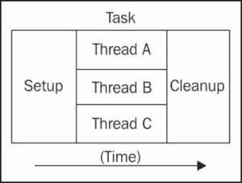
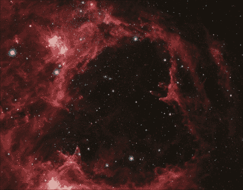
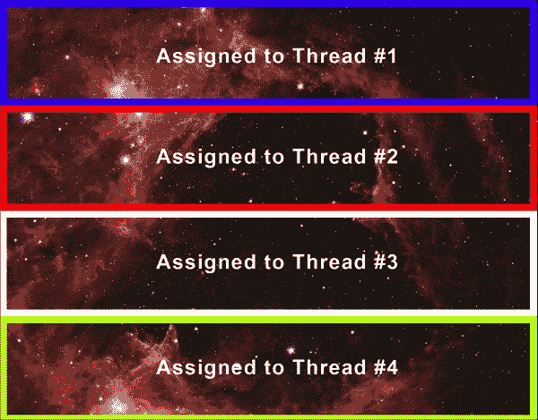
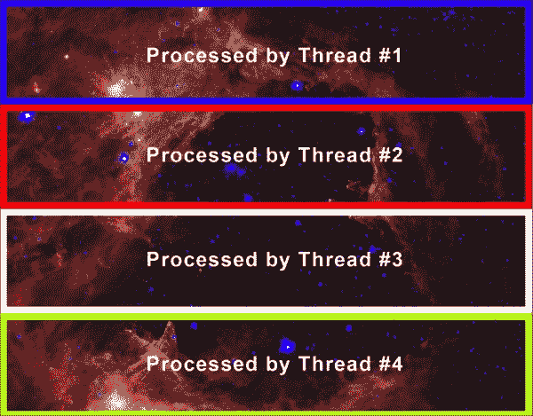
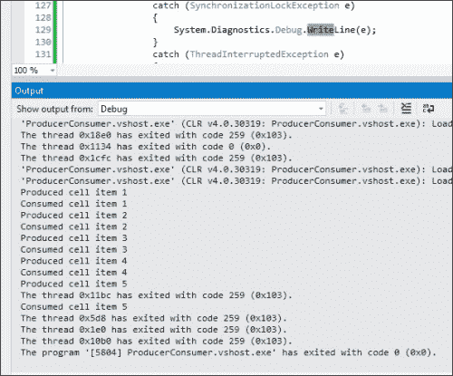

# 第四章。高级线程处理

在本章中，我们将继续学习`Thread`类和线程处理。在前一章中，我们开始讨论`Thread`类以及如何创建和使用线程。现在我们已经开始学习`Thread`类，在本章中，我们将讨论提升到下一个层次。我们将研究新的方法来控制并发线程，并将继续通过解决更具挑战性的问题来提高我们的并行编程能力。遵循本章中的说明后，我们将能够：

+   将问题分解为可以并发运行的片段

+   创建高度独立的代码块以在多个线程中运行，避免许多并发问题

+   在多个线程中使用标志进行协调

+   使用技术来完全控制线程的异步和同步执行

+   使用技术来在非线程安全组件中使用多线程

+   在多线程应用程序中执行错误处理

# 流水线

流水线是在多线程应用程序中常用的一个设计模式。在第九章中，我们将详细讲解这一点。但我想在这里简要介绍它，因为我们将在本章的示例中使用它。流水线是一种使用并发来解决问题的技术。首先，你将问题分解为必须按顺序执行的片段和可以并行执行的片段。然后，你使用线程或任务实现并行部分，并并发运行它们以提高性能，而不是按顺序运行所有功能。

到目前为止，我们已经使用`BackgroundWorker`组件和`Thread`类来创建多线程应用程序。并行编程使我们能够实现令人难以置信的性能提升和更好的 UI 反馈。我们如何使用线程和`Thread`类将图像处理算法分解为许多并发代码块？在这个设计模式中，我们将取一个问题，将其分解为多个我们可以并发解决的问题，然后在最后将片段组装成最终结果。

在第九章，*流水线和生产者-消费者设计模式*中，我们将学习处理多线程方法中常见问题的不同常见设计模式。但不会深入细节，在这一章中，我们将执行一种简单的流水线形式来完成我们的任务：



C# 提供了许多处理图像和位图的技巧。然而，其中许多都不是线程安全的。我们无法在 `Bitmap` (`System.Drawing.Bitmap`) 类的同一实例中运行多个并发线程来更改像素。尽管如此，正如我们在前面的章节中学到的，为了应用并行算法，我们可以通过使用不同的设计模式，如**流水线**，来避免这些问题，而不是寻找解决它们的困难方法。我们可以将原始位图分成多个完全独立的位图。每个线程都可以安全地处理其独立的位图实例。我们可以开发一个执行位图像素图像处理的算法，然后，通过在多个位图上并行执行此算法，与单线程版本相比，实现显著的性能提升。此外，我们还可以添加代码来暂停线程，然后重新启动。性能结果将取决于计算机中可用的核心或处理器的数量（我们已在第一章中讨论过，*理解多处理和多核心*），其中我们运行应用程序。

通过使用 `Thread` 类和流水线设计模式，我们可以实现令人难以置信的性能提升、令人印象深刻的用户体验以及合理的编程努力下的良好可扩展性。我们将构建的应用程序将能够扩展到任何大小的位图图像，并且能够在硬件中添加更多核心处理器时自动提高性能，而无需任何代码更改！

## 使用图像处理应用程序解释流水线技术

在本章的示例中，我们将使用 Windows Forms 应用程序来执行图像处理。我们也可以在 **Windows Presentation Foundation** (**WPF**) 应用程序中这样做，但我发现，在基于 GDI 的 `System.Drawing` 库中执行位图和像素级别的操作比基于 WPF 的 System、Windows Media 库更为直接。使用相同的核心逻辑，相同的程序也可以使用 `BitmapImage` 和 `CroppedBitmap` 类重新实现。

在大型图像文件上执行图像处理是采用多线程解决方案的良好候选，因为你可以将图像分割成块，并发地处理每个块，然后将这些块重新组装。在这个例子中，我们将从 NASA 获取一个位图图像，将其分割成更小的位图文件，在每个位图中搜索“旧星”，然后将这些位图重新组装成一个大的位图图像文件。

你将使用你的并行编程技能开发一个应用程序，该应用程序必须从美国宇航局斯皮策太空望远镜获取的大量红外图像中检测到较老恒星。在下面的屏幕截图中，你可以看到一个被称为**W5**的稀薄恒星形成区域：



图片由 NASA/JPL-Caltech/Harvard-Smithsonian CfA 提供

在这幅肖像中，最老的恒星可以看作是蓝色的小点，尤其是在两个空洞的中心。白色结块区域是年轻恒星形成的地方。

这张图像包含了迄今为止对触发恒星形成理论的最好证据。分析这张照片的科学家已经能够表明，随着距离洞穴中心的距离增加，恒星的年龄逐渐且系统地变得年轻。

您必须工作在一个非常快速且高效的算法，用于检测老星，能够将大图像中老星的像素颜色改变，使其对科学家更可见。他们希望您使用一个经过微调的多线程应用程序，能够与在执行星检测算法的计算机上可用的核心数量一样多的线程一起工作。

## 如何做到这一点

要做到这一点，我们将构建一个新的 C#应用程序，并将程序逻辑放入方法中以检测任何位图中老星，并为多个线程准备位图输入：

1.  使用 Visual Studio 中的 Windows 应用程序模板创建一个新的 C#项目。使用`OldStarsFinder`作为项目的名称。

1.  在表单类定义的开始处添加以下代码行（因为我们将要使用`System.Threading.Thread`和`System.Drawing.Imaging`类）：

    ```cs
    using System.Threading;
    using System.Drawing.Imaging;
    ```

1.  在类定义中添加以下行以声明三个新的私有变量：

    ```cs
    // The number of processors or cores available in the computer for this application
    private int priProcessorCount = Environment.ProcessorCount;
    // The bitmaps list
    private List<Bitmap> prloBitmapList;
    // The long list with the old stars count
    private List<long> prliOldStarsCount;
    ```

1.  添加以下函数，`CropBitmap`。它将裁剪接收到的位图，并返回由`Rectangle`实例`proRectangle`定义的原部分。这将使我们能够将任何大图像分割成一系列较小的图像。集合中的数字将与应用程序运行的机器上的核心数相对应。这样，我们可以通过同时使用每个核心来最大化性能，以处理大图像：

    ```cs
    private Bitmap CropBitmap(Bitmap proBitmap, Rectangle proRectangle)
    {
    // Create a new bitmap copying the portion of the original defined by proRectangle and keeping its PixelFormat
    Bitmap loCroppedBitmap = proBitmap.Clone(proRectangle,proBitmap.PixelFormat);
    // Return the cropped bitmap
    return loCroppedBitmap;
    }
    ```

1.  添加以下函数，`IsOldStar`。它将比较像素色调、饱和度和亮度，以确定它们的级别是否与红外肖像中老星提供的典型颜色范围相符：

    ```cs
    public bool IsOldStar(Color poPixelColor)
    {
    // Hue between 150 and 258
    // Saturation more than 0.10
    // Brightness more than 0.90
    return ((poPixelColor.GetHue() >= 150) && (poPixelColor.GetHue() <= 258) && (poPixelColor.GetSaturation() >= 0.10) &&(poPixelColor.GetBrightness() <= 0.90)); 
    }
    ```

1.  添加以下过程，`ThreadOldStarsFinder`。它将为启动它的线程遍历相应的位图中每个像素，并计算老星的数量：

    ```cs
    private void ThreadOldStarsFinder(object  poThreadParameter)
    {
    // Retrieve the thread number received in objectpoThreadParameter
    int liThreadNumber = (int)poThreadParameter;
    // The pixel matrix (bitmap) row number (Y)
    int liRow;
    // The pixel matrix (bitmap) col number (X)
    int liCol;
    // The pixel color
    Color loPixelColor;
    // Get my bitmap part from the bitmap list
    Bitmap loBitmap = prloBitmapList[liThreadNumber];

    // Reset my old stars counter
    prliOldStarsCount[liThreadNumber] = 0;
    // Iterate through each pixel matrix (bitmap) row
    for (liRow = 0; liRow < loBitmap.Height; liRow++)
    {
    // Iterate through each pixel matrix (bitmap) cols
    for (liCol = 0; liCol < loBitmap.Width; liCol++)
    {
    // Get the pixel color for liCol and liRow
    loPixelColor = loBitmap.GetPixel(liCol, liRow);
    if (IsOldStar(loPixelColor))
    {
    // The color range corresponds to an old star
    // Change its color to a pure blue
    loBitmap.SetPixel(liCol, liRow, Color.Blue);
    // Increase the old stars counter
    prliOldStarsCount[liThreadNumber]++;
    }
    }
    }
    }
    ```

## 它是如何工作的

查找和计数任何大位图肖像中潜在老星所需的代码现在包含在命名的函数和过程中，已经为动态创建的并发线程准备好了。我们已经为在管道设计模式中实现此函数奠定了基础。

为什么我们必须创建一个`CropBitmap`函数？那是因为我们无法从许多不同的并发线程中访问单个`Bitmap`实例的像素矩阵。如果我们这样做，我们将得到一个`InvalidOperationException`，因为 GDI+没有为多线程访问做好准备。

我们必须将原始的`Bitmap`分割成与将要同时处理它的并发线程数量一样多的独立部分。`CropBitmap`函数将允许我们获取`Bitmap`实例的特定部分，并生成一系列新的`Bitmap`实例（`prloBitmapList`）。

到目前为止，我们已经了解到与多线程应用程序和并行算法相关的问题有很多。由于有许多线程同时运行，我们在更改不同线程中变量的值时必须非常小心。解决此类并发问题的最佳方案是*避免*它们或通过**同步机制**来预防。然而，同步机制必须非常小心地使用，因为它们可能会降低性能并产生过多的上下文切换。此外，使用它们可能会引入潜在的难以调试的 bug。

我们如何避免并发问题？非常简单。尽可能多地，我们必须使每个线程独立于在相同全局资源部分工作的其他并发线程。正如我们将在后面的章节中看到的，任务并行库（Task Parallel Library）非常适合定义任务，然后并行运行这些任务。在这种情况下，每个位图的处理可以是一个任务。

使用简单的`CropBitmap`函数分割原始位图可以避免许多与并发相关的冲突，否则这些问题将非常复杂且难以调试。由于每个线程都将使用自己的位图，我们避免了潜在的危险问题。这是开发多线程应用程序的关键之一——正确地将工作分割成可以并行运行的片段。分割位图图像是一个完美的例子。

另一个潜在问题是统计在巨大的红外位图肖像中检测到的总星数。如果我们使用共享成员变量，可能会遇到锁定问题。如果我们有多个线程同时更改相同的变量值（同时进行），每次变量值增加时，我们都需要锁定该变量。锁定变量意味着上下文切换，从而降低性能。因此，我们使用`long`类型的列表`prliOldStarsCount`。每个线程都有一个计数器，我们将通过将*n*个`long`值（`prliOldStarsCount`）相加到一个新变量中（其中*n*是星系搜索线程的数量）来获得总数。

这样做可以避免使用锁，因为每个线程都有自己的独立计数器，与使用令人困惑且复杂的锁的解决方案相比，我们能够实现更好的性能。

为了在许多并发线程中处理图像，我们必须将其分割成与将要运行的线程数量一样多的独立部分。正如我们之前所看到的，`CropBitmap`函数提供了这种功能。

这种图像处理算法的改变有其成本，并不是免费的。在这种情况下，我们将按像素计数星星。然而，当我们必须应用其他更复杂的算法时，我们必须考虑许多重要的额外更改到基本代码。我们将在本章的后面继续讨论这个话题。

一旦处理完每个图像部分，我们必须收集结果，并使用对像素所做的更改重新组合原始图像。

## 理解像素的颜色组成

红外位图肖像中，一个老星没有确切的蓝色（红色 = 0，绿色 = 0，蓝色 = 255）颜色。有一种复杂的技术用于根据颜色范围确定星星的年龄。这对人类来说很容易理解，但对计算机来说很难。

然而，生成一个获取 `Color` (`System.Drawing.Color`) 实例的以下三个组件的算法很简单：

+   **色调**: 这是由 `GetHue()` 方法获得的

+   **饱和度**: 这是由 `GetSaturation()` 方法获得的（从 0.01 到 1.00）

+   **亮度**: 这是由 `GetBrightness()` 方法获得的（从 0.01 到 1.00）

使用这些颜色组件，我们可以应用以下规则来确定红外位图肖像中的像素是否对应一个潜在的旧星：

+   色调介于 150 和 258 之间

+   饱和度超过 10%（0.10）

+   亮度超过 90%（0.90）

与红色、绿色和蓝色值相比，使用色调、饱和度和亮度值来确定一个旧星更容易。

`IsOldStar` 函数接收一个 `Color` 实例作为参数，并返回根据其色调、饱和度和亮度应用上述规则的结果，如下面的代码行所示：

```cs
return ((poPixelColor.GetHue() >= 150)
     && (poPixelColor.GetHue() <= 258)
     && (poPixelColor.GetSaturation() >= 0.10)
     && (poPixelColor.GetBrightness() <= 0.90));

```

这个函数对红外位图肖像中的每个像素都进行调用，并返回一个 `bool` 值。

# 暂停和重新启动线程

在很多情况下，协调和等待线程是很重要的。以流水线设计为例。一旦我们启动了一组并发线程，我们就需要等待它们全部完成，汇总它们的结果，然后进入非并发部分。我们需要知道线程何时完成以及它们的结果，以便确定如何继续。

在线程之间协调和等待有几种方法。在下面的例子中，我们将展示如何检查一个线程是否仍在运行并处理，然后在继续应用程序的其余部分和重新组装位图片段之前，等待所有线程完成它们的位图处理工作。

在这个例子中，我们将使用 `IsAlive` 方法检查线程，然后在再次检查之前，使用 `Sleep` 方法暂停主线程一段时间。这是一种常见的线程间协调工作并监控线程何时完成的模式。

## 如何操作

现在，我们将创建 UI 并对创建多个线程进行一些更改，以动态处理位图的每个部分。为了完成这项任务，我们必须在各个线程之间共享数据，正如我们在前面的章节中学到的。执行以下步骤：

1.  保持项目，`OldStarsFinder`。

1.  在表单设计器中打开 Windows 表单`Form1`（`frmStarsFinder`），添加以下控件，并按以下截图所示对齐：

    以下是一些控件：

    +   一个显示由 NASA 的 Spitzer 太空望远镜获得的红外肖像的图片框（你可以在[www.nasa.gov](http://www.nasa.gov)或[`www.nasa.gov/multimedia/imagegallery/`](http://www.nasa.gov/multimedia/imagegallery/)找到许多这样的图片），其`SizeMode`属性设置为`StretchImage`。

    +   一个显示星星并设置其`Text`属性为`Find old star` (`butFindOldStars`)的按钮。此按钮将启动多个旧星星查找线程。

1.  在表单的类定义中添加以下行以声明两个新的私有变量：

    ```cs
        // The threads list
        private List<Thread> prloThreadList;
        // The original huge infrared bitmap portrait
        Bitmap proOriginalBitmap;
    ```

1.  添加以下过程，`WaitForThreadsToDie`。它将使主线程暂停，以便等待许多并发线程完成工作：

    ```cs
        private void WaitForThreadsToDie()
        {
            // A bool flag
            bool lbContinue = true;
            int liDeadThreads = 0;
            int liThreadNumber;
            while (lbContinue)
            {
                for (liThreadNumber = 0; liThreadNumber< priProcessorCount; liThreadNumber++)
                {
                    if (prloThreadList[liThreadNumber].IsAlive)
                    {
                        // One of the threads is still alive, 
                        // exit the for loop and sleep 100 
                        // milliseconds
                        break;
                    }
                    else
                    {
                        // Increase the dead threads count
                        liDeadThreads++;
                    }
                }
                if (liDeadThreads == priProcessorCount)
                {
                    // All the threads are dead, exit the while 
                    // loop
                    break;
                }
                Thread.Sleep(100);
                liDeadThreads = 0;
            }
        }
    ```

1.  添加以下过程，`ShowBitmapWithOldStars`。它将重建位图，添加之前分离的每个部分：

    ```cs
        private void ShowBitmapWithOldStars()
        {
            int liThreadNumber;
            // Each bitmap portion
            Bitmap loBitmap;
            // The starting row in each iteration
            int liStartRow = 0;

            // Calculate each bitmap's height
            int liEachBitmapHeight = ((int)(proOriginalBitmap.Height / priProcessorCount)) + 1;

            // Create a new bitmap with the whole width and 
            // height
            loBitmap = new Bitmap(proOriginalBitmap.Width,proOriginalBitmap.Height);
            Graphics g = Graphics.FromImage((Image)loBitmap);
            g.InterpolationMode = System.Drawing.Drawing2D.InterpolationMode.HighQualityBicubic;

            for (liThreadNumber = 0; liThreadNumber < priProcessorCount; liThreadNumber++)
            {
                // Draw each portion in its corresponding 
                // absolute starting row
                g.DrawImage(prloBitmapList[liThreadNumber], 0,liStartRow);
                // Increase the starting row
                liStartRow += liEachBitmapHeight;
            }
            // Show the bitmap in the PictureBox picStarsBitmap
            picStarsBitmap.Image = loBitmap;

            g.Dispose();
        }
    ```

1.  在按钮的`Click`事件`butFindOldStars`中打开，并输入以下代码：

    ```cs
        proOriginalBitmap = new Bitmap(picStarsBitmap.Image);

        // Thread number
        int liThreadNumber;
        // Create the thread list; the long list and the bitmap list
        prloThreadList = new List<Thread>(priProcessorCount);
        prliOldStarsCount = new List<long>(priProcessorCount);
        prloBitmapList = new List<Bitmap>(priProcessorCount);

        int liStartRow = 0;

        int liEachBitmapHeight = ((int)(proOriginalBitmap.Height / priProcessorCount)) + 1;

        int liHeightToAdd = proOriginalBitmap.Height;
        Bitmap loBitmap;

        // Initialize the threads
        for (liThreadNumber = 0; liThreadNumber < priProcessorCount; liThreadNumber++)
        {
            // Just to occupy the number
            prliOldStarsCount.Add(0);

            if (liEachBitmapHeight > liHeightToAdd)
            {
                // The last bitmap height perhaps is less than the other bitmaps height
                liEachBitmapHeight = liHeightToAdd;
            }

            loBitmap = CropBitmap(proOriginalBitmap, new Rectangle(0, liStartRow, proOriginalBitmap.Width,liEachBitmapHeight));
            liHeightToAdd -= liEachBitmapHeight;
            liStartRow += liEachBitmapHeight;
            prloBitmapList.Add(loBitmap);

            // Add the new thread, with a parameterized start 
            // (to allow parameters)
            prloThreadList.Add(new Thread(new ParameterizedThreadStart (ThreadOldStarsFinder)));
        }

        // Now, start the threads
        for (liThreadNumber = 0; liThreadNumber < priProcessorCount; liThreadNumber++)
        {
            prloThreadList[liThreadNumber].Start(liThreadNumber);
        }

        WaitForThreadsToDie();

        ShowBitmapWithOldStars();
    ```

1.  构建并运行应用程序。

1.  点击**Old Star Finder**按钮。几秒钟后（取决于计算机的并行处理能力），在 W5 wispy 星形成区域将显示一个巨大的红外肖像，其中包含纯蓝色的可能旧星星，如下面的截图所示：

## 它是如何工作的

当用户点击**Old Star Finder**按钮时，过程将按以下方式执行：

1.  原始图像被分割成许多独立的位图。每个部分将被分配给不同的线程。

1.  创建并启动了许多线程（异步执行），并带有参数，以便它们知道哪个位图属于它们。

1.  主线程等待所有星星查找线程完成工作，在查询线程状态时每次暂停 100 毫秒。

1.  一旦所有线程完成工作，主线程（唯一能够触摸 UI 的线程）将重建分割的位图，并在图片框控件中显示它。

每个线程在其独立的块中工作，不会干扰或影响其他线程。

用于将原始位图动态分割成许多更小位图的代码有点复杂。这是我们为了提高应用程序的性能和可扩展性所必须付出的代价。

这行代码从`picStarsBitmap`图片框中获取一个`Bitmap`实例（我们开始解耦 UI，因为我们不能从独立线程中触摸它）：

```cs
proOriginalBitmap = new Bitmap(picStarsBitmap.Image);
```

这些行创建了线程列表、`long`数字列表和位图列表，以便它们在应用程序运行的计算机中根据可用的核心数动态增长：

```cs
prloThreadList = new List<Thread>(priProcessorCount);
prliOldStarsCount = new List<long>(priProcessorCount);
prloBitmapList = new List<Bitmap>(priProcessorCount);
```

我们必须创建与可用核心数相对应的位图。我们使用行来选择每个位图部分的相似数量的行。

我们定义一个名为`liStartRow`的`int`类型变量，作为我们将开始裁剪原始位图的起始行：

```cs
int liStartRow = 0;
```

然后，我们必须确定每个位图的近似行数：

```cs
int liEachBitmapHeight = ((int)(proOriginalBitmap.Height /priProcessorCount)) + 1;
```

然而，根据核心数和原始位图的高度，这个除法的结果可能不是精确的。这是另一个问题。因此，我们使用另一个`int`变量来计算要添加到每个迭代的长度，以解决这个问题：

```cs
int liHeightToAdd = proOriginalBitmap.Height;
```

然后，算法很简单；对于`liThreadNumber`的每一次迭代，执行以下操作：

```cs
if (liEachBitmapHeight > liHeightToAdd)
{
    liEachBitmapHeight = liHeightToAdd;
}
loBitmap = CropBitmap(proOriginalBitmap, new Rectangle(0, liStartRow, proOriginalBitmap.Width, liEachBitmapHeight));
liHeightToAdd -= liEachBitmapHeight;
liStartRow += liEachBitmapHeight;
prloBitmapList.Add(loBitmap);
```

如果为每个位图计算的高度大于要添加的高度（这可能在要裁剪的最后一位图部分发生），我们就从要添加的高度中减去这个数字，这是每次迭代中这一行的结果：

```cs
liHeightToAdd -= liEachBitmapHeight;
```

此外，在每次迭代中，起始行增加了每个位图计算的高度。

以下截图显示了将此算法应用于美国宇航局斯皮策太空望远镜通过四个线程获得的红外人像的结果：



使用我们经典的 C#编程技能，我们可以生成智能算法，将工作分割成许多独立的、安全的并发代码块。再次强调，在并行编程中掌握列表确实是必要的。

# 线程间的信号

为了帮助协调多个线程之间的活动，我们可以创建整个类都可以访问的变量，因此每个线程都可以写入和读取这些变量，以帮助它们协调活动并跟踪所有线程之间发生的事情的整体情况。

我们使用带参数的线程，如我们之前章节中学到的，并使用以下循环异步启动它们：

```cs
for (liThreadNumber = 0; liThreadNumber < priProcessorCount; liThreadNumber++)
{
    prloThreadList[liThreadNumber].Start(liThreadNumber);
}
```

然而，我们必须等待并发星系寻找线程完成它们的工作，以便在 UI 中显示最终的修改后的位图。我们不希望使用`BackgroundWorker`组件。

因此，我们创建了`WaitForThreadsToDie`过程，它由主应用程序线程同步调用。当这个方法返回时，我们可以安全地在 UI 中显示结果位图，因为所有线程都已经完成了它们的工作。当然，为了达到同样的目的，我们也可以使用`BackgroundWorker`组件，结合我们之前章节中学到的作为`Thread`类实例创建的线程，来使用。

`WaitForThreadsToDie`过程中的代码很复杂，因为我们必须检查每个创建的线程，并且我们知道线程的数量是在运行时确定的，因为它们与可用核心的数量动态对齐。我们使用一个`bool`标志来确定`while`循环是否必须继续运行。然而，在这种情况下，我们没有更改标志的值，但还有其他情况下，这种代码模式可以用来修改用作标志的变量的值。

一旦进入`while`循环（`lbContinue`），我们必须检查每个线程是否完成其工作。我们使用众所周知的`IsAlive`属性：

```cs
for (liThreadNumber = 0; liThreadNumber < priProcessorCount;liThreadNumber++)
{
    if (prloThreadList[liThreadNumber].IsAlive)
    {
        break;
    }
    else
    {
        liDeadThreads++;
    }
} 
```

如果有一个线程是活跃的，我们将退出`for`循环。如果所有线程都不是活跃的，`liDeadThreads`将等于创建的线程总数。因此，我们将退出外层循环：

```cs
if (liDeadThreads == priProcessorCount)
{
    break;
}
```

`break;`语句可以被替换为`lbContinue = false;`，我们将达到相同的结果。

如果仍有线程正在运行，我们将对主线程调用`Sleep`方法，并使其休眠 100 毫秒（0.1 秒），然后重置`liDeadThreads`变量：

```cs
Thread.Sleep(100);
liDeadThreads = 0;
```

包含调用`Sleep`方法的行是必不可少的。

使用这些方法和标志，我们可以完全控制独立的线程，而不会引起与并发和失去对独立线程控制相关的经典问题。

如前所述，当调用`WaitForThreadsToDie`方法返回时，我们可以安全地在 UI 中显示结果位图，因为所有线程都已完成其工作。因此，我们调用`ShowBitmapWithOldStars`过程。

此方法重现了将原始位图分成几个独立部分时所做的操作，但顺序相反。

我们重复之前解释的高度计算过程。然后，我们必须创建一个新的位图，具有整个宽度和高度。这个位图必须保持从原始位图中提取的不同部分的对齐方式：

```cs
loBitmap = new Bitmap(proOriginalBitmap.Width,proOriginalBitmap.Height);
Graphics g = Graphics.FromImage((Image)loBitmap);
g.InterpolationMode = System.Drawing.Drawing2D.InterpolationMode.HighQualityBicubic;
```

因此，我们使用`Bitmap`构造函数，通过传递原始位图的宽度和高度作为参数来定义其大小。然后，我们从`Bitmap`类型转换为`Image`实例化一个`Graphics`对象（`Bitmap`类是`Image`类的子类）。

一旦我们有了`Graphics`实例，我们必须在每个线程处理并计算出的对应行（`liStartingRow`）中绘制每个位图图像，其计算方式与我们分离位图部分时相同：

```cs
for (liThreadNumber = 0; liThreadNumber < priProcessorCount;liThreadNumber++)
{
    g.DrawImage(prloBitmapList[liThreadNumber], 0, liStartRow);
    liStartRow += liEachBitmapHeight;
}
```

此外，在每次迭代中，起始行增加为每个位图计算的高度。然后，我们就准备好在图片框`picStarsBitmap`中显示重建的位图。

```cs
picStarsBitmap.Image = loBitmap;
```

解耦 UI，我们可以通过更改基本线性规划算法来生成令人印象深刻的性能改进。

以下截图显示了将此算法应用于由 NASA 的斯皮策太空望远镜获得的红外人像，并通过四个线程处理的结果：



截图显示了每个线程实现的清晰独立性。

运行应用程序，将`priProcessorCount`私有变量的值从 1 更改为计算机中可用的核心数，然后比较结果。

## 如何操作

现在，我们将对代码进行一些修改，以便使用事件等待句柄而不是使用循环来检查活动的线程：

1.  保持项目，`OldStarsFinder`。

1.  打开`Program.cs`的代码。

1.  将`[STAThread]`行替换为以下行（在`Main`方法声明之前）：

    ```cs
        [MTAThread]
    ```

1.  打开 Windows 表单的代码，`Form1`（`frmStarsFinder`）。

1.  添加以下私有变量：

    ```cs
        // The AutoResetEvent instances array
        private AutoResetEvent[] praoAutoResetEventArray;
    ```

1.  将`WaitForThreadsToDie`方法中的代码替换为以下行：

    ```cs
        // Just wait for the threads to signal that every work 
        // item has finished
        WaitHandle.WaitAll(praoAutoResetEventArray);
    ```

1.  在`ShowBitmapWithOldStars`方法的局部变量声明中添加以下行，在`int liStartRow = 0;`行之前（我们必须根据可用的核心数量创建数组）：

    ```cs
        // Create the AutoResetEvent array with the number of 
        // cores available
      praoAutoResetEventArray = new AutoResetEvent[priProcessorCount];
    ```

1.  在`ShowBitmapWithOldStars`方法中的线程创建循环中添加以下行，在`prloThreadList.Add(new Thread(new ParameterizedThreadStart(ThreadOldStarsFinder)));`行之前（我们必须为每个线程创建一个初始状态为假的`AutoResetEvent`实例）：

    ```cs
        // Create a new AutoResetEvent instance for that thread with its initial state set to false
        praoAutoResetEventArray[liThreadNumber] = new AutoResetEvent(false);
    ```

1.  在`ThreadOldStarsFinder`方法末尾添加以下行（我们必须指示工作项已完成）：

    ```cs
        // The thread finished its work. Signal that the work 
        // item has finished.
        praoAutoResetEventArray[liThreadNumber].Set();
    ```

1.  构建并运行应用程序。

1.  点击**旧星查找器**按钮。几秒钟后（取决于计算机的并行处理能力），W5 稀薄星形成区域将以纯蓝色显示在巨大的红外肖像中，可能的老星将被显示。你不会在应用程序中注意到任何变化。

## 工作原理

当用户点击**旧星查找器**按钮时：

1.  原始图像被分割成许多独立的位图。每个部分将被分配给不同的线程。

1.  创建了许多线程及其自动重置的事件处理程序，以便线程之间进行通信。

1.  线程以参数启动（异步执行），这样它们就知道哪个位图属于它们。

1.  一旦每个线程完成其工作，它将发出工作已完成信号，设置自动重置事件。

1.  主线程等待所有星查找线程完成工作，等待来自多个自动重置事件的必要信号。

1.  一旦所有线程完成工作，主线程（唯一能够触摸 UI 的线程）将重建分割的位图，并在图片框控件中显示它。

等待所有线程完成工作的代码更简单、更优雅。

## 使用`AutoResetEvent`类处理线程间的信号

`AutoResetEvent`实例允许我们通知等待的线程事件已发生。它是`WaitHandle`和`EventWaitHandle`类的子类。

### 注意

**事件等待句柄**封装了操作系统特定的对象，这些对象等待对共享资源的独占访问。使用它们，在任务完成后等待线程的信号以继续工作变得更容易。

首先，我们必须创建与线程数量相对应的事件等待句柄。我们在以下行中这样做，在`FindOldStarsAndShowResult`方法中：

```cs
praoAutoResetEventArray = new AutoResetEvent[priProcessorCount];
```

我们使用数组，因为`WaitAll`方法接收一个等待句柄数组作为参数。

在创建每个新的`Thread`类实例之前，我们为每个线程创建一个新的`AutoResetEvent`实例，并将其初始状态（一个`bool`状态）设置为`false`：

```cs
praoAutoResetEventArray[liThreadNumber] = new AutoResetEvent(false);
```

因此，每个独立的线程都可以访问它自己的`AutoResetEvent`实例。一旦线程完成其工作，它将通过调用`Set`方法来发出工作完成的信号，如以下行所示，在`ThreadOldStarsFinder`过程的末尾：

```cs
praoAutoResetEventArray[liThreadNumber].Set();
```

事件等待句柄的初始状态是`false`；现在它是`true`。

## 使用`WaitHandle`类检查信号

在另一方面，主 UI 线程必须等待所有并发星系查找线程完成其工作，以便在 UI 中显示最终的修改后的位图。因此，它必须等待所有事件句柄的状态设置为`true`，而不是初始的`false`。

这发生在所有线程都完成其工作并为其对应`AutoResetEvent`实例调用`Set`方法之后。

我们可以在`WaitForThreadsToDie`方法中使用一行代码来检查这一点：

```cs
WaitHandle.WaitAll(praoAutoResetEventArray);
```

`WaitAll`方法将监视所有事件句柄，等待它们的信号改变（线程的完成）。它接收一个事件句柄数组作为参数。

为了能够使用`WaitHandle.WaitAll`方法，我们必须将应用程序的线程模型更改为多线程公寓。如果我们不这样做，方法调用将失败并生成异常。因此，我们必须将位于`Main`方法声明之前的`[STAThread]`行替换为`[MTAThread]`。

# 线程合并

我们已经在上一章中检查了如何**合并**线程。当你合并一个线程时，你告诉当前线程等待你正在合并的线程完成。这允许你在两个线程之间协调工作。

在我们想要在开始下一部分之前知道某一部分何时完成的情况下，这非常方便。

对于我们的应用程序，假设我们想检查如果所有位图处理线程都是顺序运行而不是并发运行，性能会如何变化。

## 如何操作

如果我们想让所有位图处理线程顺序运行，那么在我们启动一个线程后，我们将合并该线程。这将使主线程的执行暂停，直到我们刚刚启动的位图处理线程完成。为此，更改`butFindOldStars_Click`事件处理程序中的底部`for`循环并添加以下行：

```cs
prloThreadList[liThreadNumber].Join();
```

现在，`for`循环看起来是这样的：

```cs
            // Now, start the threads
            for (liThreadNumber = 0; liThreadNumber < priProcessorCount; liThreadNumber++)
            {
                prloThreadList[liThreadNumber].Start(liThreadNumber);

                //Wait here on the Thread you just created to 
                // complete.
                prloThreadList[liThreadNumber].Join();

            }
```

## 它是如何工作的

现在，运行应用程序并点击**旧星星查找器**按钮。取消注释该行并重新运行应用程序。你看到了什么？

你会注意到，与没有额外代码相比，使用额外代码处理图像和完成过程的时间要慢得多。正如我们之前提到的，这是因为每次我们执行一个新线程来处理位图图像的一部分时，我们都会暂停主线程。因此，我们不是并发处理图像，而是顺序处理。

对于我们的应用来说，这并不非常实用，但对于许多问题来说，你可能会有想要这样做的原因。这里的主要教训是，`Thread`类有几种控制处理的方式，因此，作为开发者，你可以完全控制线程的创建、执行和协调方式。这也是为什么这被称为**重量级并发**，因为它需要开发者付出额外的努力和劳动来实现你想要的确切行为。

# 锁定资源以确保线程安全的数据

到目前为止，我们选择以这种方式设计我们的应用程序，以至于没有必要锁定资源来保护它们免受其他线程“践踏”，从而引起竞态条件和其它意外行为。

锁的语法如下：

```cs
                        lock (objVariable)
                        {

                        }
```

方括号之间的代码以线程安全的方式执行，并且直到锁执行完成，不会让其他线程操作被锁定的对象。

尝试对一个被锁定的对象执行操作的其它线程将等待锁被释放后，才会继续在对象上执行它们的操作。这一点很重要，因为它可能会创建“锁定”问题，其中一个线程正在等待另一个线程锁定的资源。如果在多线程代码中，多个线程不断等待对方释放资源以获得性能提升，这可能会适得其反。这也是我们设计代码使用单独的长整型值列表来计数旧星星，列表中的每个条目代表一个线程，而不是所有线程更新的一个总变量，的原因之一。

另一方面，当使用锁时，你需要小心不要创建死锁情况。这种情况发生在当一个线程正在等待另一个线程锁定的对象，而那个线程正在等待第一个线程锁定的对象时。因此，每个线程都在等待另一个线程，并且都无法继续。

还值得注意的是，C# 3.0 和 C# 4.0 之间在处理锁方面有所不同。在 3.0 中，锁被转换为代码如下：

```cs
var temp = object1;

Monitor.Enter(temp);

try
{
    // body
}
finally
{
    Monitor.Exit(temp);
}
```

在 C# 4.0 中，它被处理如下：

```cs
bool locked = false;
var temp = object1;
try
{
    Monitor.Enter(temp, ref locked);
    // body
}
finally
{
    if (locked)
    {
        Monitor.Exit(temp); 
    }
}
```

如你所见，在 C# 4.0 中，如果没有在对象上获取锁，对象不会有任何不同。

## 如何做到这一点

现在，让我们看看我们的代码，并对其进行简单修改，使用单个变量来保存我们的旧星星计数。让我们在有锁和无锁的情况下都做一下，看看不同的行为。

1.  首先，让我们将以下内容添加到类的声明语句的顶部：

    ```cs
    //Old stars count using a lock to protect thread safety.
            private String prsOldStarsCount = "0";
    ```

1.  还需要添加一个标签控件，并将`Text`属性设置为`Old Stars Count`，然后添加一个文本框控件，并将`Name`属性设置为`tbCount`。

此变量将保存我们的旧星计数，并且所有线程都将更新此一个变量。您会注意到我们使用的是字符串而不是整数。这是因为整数是语言的基本类型，而不是对象。由于这个原因，它默认是线程安全的，不需要锁定。因此，为了说明我们的观点，我们将使用 `String` 对象作为计数器。

现在，在 `ThreadOldStarsFinder` 方法中，在嵌套 `for` 循环的末尾（和内部）添加以下代码：

```cs
lock (prsOldStarsCount)
            {
                int i = Convert.ToInt32(prsOldStarsCount);
                i= i + 1;
                prsOldStarsCount = i.ToString();
            }
```

## 它是如何工作的

如您从本例中看到的，每次处理线程更新计数时，它将锁定资源，更新`prsOldStarsCount`，然后解锁它。这保护了其完整性，但由于锁引起的额外上下文切换，这会减慢整体处理速度。

# 使用线程进行错误处理

在本节中，我们将讨论使用 `try..catch` 块执行错误处理和多个线程协调的多种方法。

在本例中，我们将编写一个简单的控制台应用程序，演示典型的生产者-消费者模型。我们还将演示使用 `try..catch` 协调活动以及之前讨论的合并和锁定机制。这项练习将巩固我们到目前为止在本章中学到的所有内容。

此外，正如我们将在未来的章节中看到的，生产者-消费者设计模式是解决多线程问题中最常用的设计模式之一，并且与任务并行库一起使用得很多。它描述了一种设计，其中一个线程（或一组线程）"生产"一些输出，而第二个线程（或一组线程）"消费"这些输出并对它进行一些逻辑处理。通常，你将多线程化某些结果的生产到队列中，然后多线程化从队列中消费产生的结果。

## 如何做

执行以下步骤：

1.  打开 Visual Studio 并创建一个名为 `ProducerConsumer` 的新项目。

1.  让我们创建三个类，一个`Producer`类，一个`Consumer`类和一个`Cell`类。`Producer`类将生产细胞，而消费者类将消费细胞。在`Main`方法中，我们将启动一个生产者和一个消费者线程，然后等待它们完成。

1.  在 `Program.cs` 文件中添加以下代码，使其看起来像这样：

    ```cs
    using System;
    using System.Threading;

    public class ProducerConsumer
    {
        public static void Main(String[] args)
        {
            int result = 0;   // Results output
            Cell cell = new Cell();

            Producer producer = new Producer(cell, 5);  
            Consumer consumer = new Consumer(cell, 5);  

            Thread producerThread = new Thread(new ThreadStart(producer.ThreadRun));
            Thread consumerThread = new Thread(new ThreadStart(consumer.ThreadRun));

            try
            {
                producerThread.Start();
                consumerThread.Start();

                // Join both threads.
                producerThread.Join();   
                consumerThread.Join();

            }
            catch (ThreadStateException e)
            {
                System.Diagnostics.Debug.WriteLine(e);  // Output text of exception.
                result = 1;            // Set result to indicate an error.
            }
            catch (ThreadInterruptedException e)
            {
                System.Diagnostics.Debug.WriteLine(e);  // Output text noting an interruption.
                result = 1;            // Set result to indicate an error.
            }

            Environment.ExitCode = result;
        }
    }

    public class Producer
    {
        Cell cell;        
        int quantity = 1;  

        public Producer(Cell box, int request)
        {
            cell = box;          
            quantity = request;  
        }
        public void ThreadRun()
        {
            for (int looper = 1; looper <= quantity; looper++)
                cell.Write(looper);  // "producing"
        }
    }

    public class Consumer
    {
        Cell cell;        
        int quantity = 1;  

        public Consumer(Cell box, int request)
        {
            cell = box;         
            quantity = request;  
        }
        public void ThreadRun()
        {
            int value;
            for (int looper = 1; looper <= quantity; looper++)
                value = cell.Read();    // Consume the result by putting it in value
        }
    }

    public class Cell
    {
        int cellContents;      
        bool State = false;  
        public int Read()
        {
            lock (this)   // Synchronizing block of code.
            {
                if (!State)
                {            // Wait until Cell.Write is done producing
                    try
                    {
                        Monitor.Wait(this);     // Waits for the Monitor.Pulse in Write
                    }
                    catch (SynchronizationLockException e)
                    {
                        System.Diagnostics.Debug.WriteLine(e);
                    }
                    catch (ThreadInterruptedException e)
                    {
                        System.Diagnostics.Debug.WriteLine(e);
                    }
                }
                System.Diagnostics.Debug.WriteLine(String.Format("Consumed cell item {0}", cellContents));
                State = false;    // Consumption is done.

                Monitor.Pulse(this);   // Pulse tells Cell.Write that Cell.Read is finished.
            }   

            return cellContents;
        }

        public void Write(int n)
        {
            lock (this)  // Synchronization block
            {
                if (State)
                {      // Wait until Cell.Read is done consumption.
                    try
                    {
                        Monitor.Wait(this);   // Wait for the Monitor.Pulse in Read.
                    }
                    catch (SynchronizationLockException e)
                    {
                        System.Diagnostics.Debug.WriteLine(e);
                    }
                    catch (ThreadInterruptedException e)
                    {
                        System.Diagnostics.Debug.WriteLine(e);
                    }
                }
                cellContents = n;
                System.Diagnostics.Debug.WriteLine(String.Format("Produced cell item {0}", cellContents));
                State = true;    // Set State to indicate production is done.

                Monitor.Pulse(this);  // Pulse tells Cell.Read that Cell.Write is finished.

            }   
        }
    }
    ```

1.  让我们运行这个控制台应用程序。在 Visual Studio 中，确保您正在显示 **输出** 窗口。您可以通过转到 **视图** 菜单并选择 **输出** 来做到这一点。一旦运行应用程序，您应该在您的 **输出** 窗口中看到以下内容：

正如你在我们的应用程序中看到的那样，我们在生产者和消费者之间进行协调，并使用`try..catch`块和锁，我们能够生产一个项目，然后消费该项目。

## 它是如何工作的

在这个例子中，我们展示了如何使用锁和`Monitor`对象来实现同步。`Pulse`方法通知等待队列中的线程对象状态的变化。

在这个例子中，我们创建了一个具有两个方法`Read`和`Write`的`Cell`对象。还创建了两个其他对象，分别来自`Producer`和`Consumer`类。这些对象有一个名为`ThreadRun`的方法，其任务是调用`Cell.Read`和`Cell.Write`。同步是通过等待`Monitor`对象的“脉冲”来完成的。这些脉冲将按照接收的顺序到来。

因此，首先生产一个项目（此时消费者正在等待脉冲），然后发生脉冲，然后消费者“消费”所生产的项目。同时，生产者在等待脉冲。然后重复这个过程，直到我们达到在创建`Producer`和`Consumer`对象时设定的限制。

# 摘要

在本章中，我们深入研究了与`Thread`类一起工作。通过我们的示例，我们学习了如何以更高级的方式协调线程。我们学习了如何使用`try..catch`块、`Monitor`对象、锁、`Join`、`IsAlive`和`Sleep`方法在线程之间协调活动。

我们还介绍了两种常见的设计模式，这些模式将在后面的章节中更详细地探讨——管道和生产者-消费者模式。这些模式通常用于解决并行应用程序中的问题。它们是分割可以并行执行的工作和不能并行执行的工作的好方法。

正如我们所讨论的，这种类型的并行编程被称为重量级并发，因为繁重的工作是由程序员你来完成的。你必须管理和控制不同的线程以实现你期望的行为。你必须跟踪哪些线程在运行以及何时运行，哪些线程在等待以及为什么等待。这确实为程序员创造了复杂性和工作量，但它也允许对执行有非常紧密的控制。有时这是确保应用程序正确行为的最佳方式。

接下来，在第五章")中，*轻量级并发 – 任务并行库 (TPL)*，我们将开始探讨轻量级并发和任务并行库。这允许你让.NET 为你处理一些这种协调工作。在继续学习任务库和轻量级并发之前，你对`Thread`类的全面理解是非常重要的。
