# 第四章。使用响应式扩展（Reactive Extensions）组合基于事件的程序

本章讨论**响应式扩展**（**Rx**）。为了理解 Rx，我们将涵盖以下食谱：

+   安装 Rx

+   事件与可观察对象

+   使用 LINQ 执行查询

+   在 Rx 中使用调度器

+   调试 lambda 表达式

# 简介

通常，在用 C#开发应用程序的日常事务中，你将不得不使用异步编程。你也可能需要处理许多数据源。想想一个返回当前汇率的服务器，一个返回相关数据流的 Twitter 搜索，或者甚至由多台计算机生成的事件。Rx 提供了一个优雅的解决方案，即`IObserver<T>`接口。

你使用`IObserver<T>`接口来订阅事件。然后，维护`IObserver<T>`接口列表的`IObservable<T>`接口将在状态变化时通知它们。本质上，Rx 会将多个数据源（社交媒体、RSS 源、UI 事件等）粘合在一起生成数据。因此，Rx 将这些数据源汇集在一个接口中。实际上，Rx 可以被视为由三个部分组成：

+   **可观察对象**：将所有这些数据流汇集在一起并代表的接口

+   **语言集成查询**（**LINQ**）：使用 LINQ 查询这些多个数据流的能力

+   **调度器**：使用调度器参数化并发

许多人心中可能都会问，为什么开发者应该使用（或找到使用）Rx。以下是一些 Rx 真正有用的例子：

+   创建一个具有自动完成功能的搜索。你不想代码为搜索区域中输入的每个值执行搜索。Rx 允许你限制搜索。

+   使你的应用程序的用户界面更加响应。

+   当数据发生变化时被通知，而不是必须轮询数据以查找变化。想想实时股价。

要保持 Rx 的更新，你可以查看 GitHub 页面：[`github.com/Reactive-Extensions/Rx.NET`](https://github.com/Reactive-Extensions/Rx.NET)。

# 安装 Rx

在我们开始探索 Rx 之前，我们需要安装它。最简单的方法是使用 NuGet。

## 准备工作

对于本章节关于 Rx 的内容，我们不会创建一个单独的类。所有代码都将编写在控制台应用程序中。

## 如何操作…

1.  右键点击你的解决方案，从上下文菜单中选择**管理解决方案的 NuGet 包…**：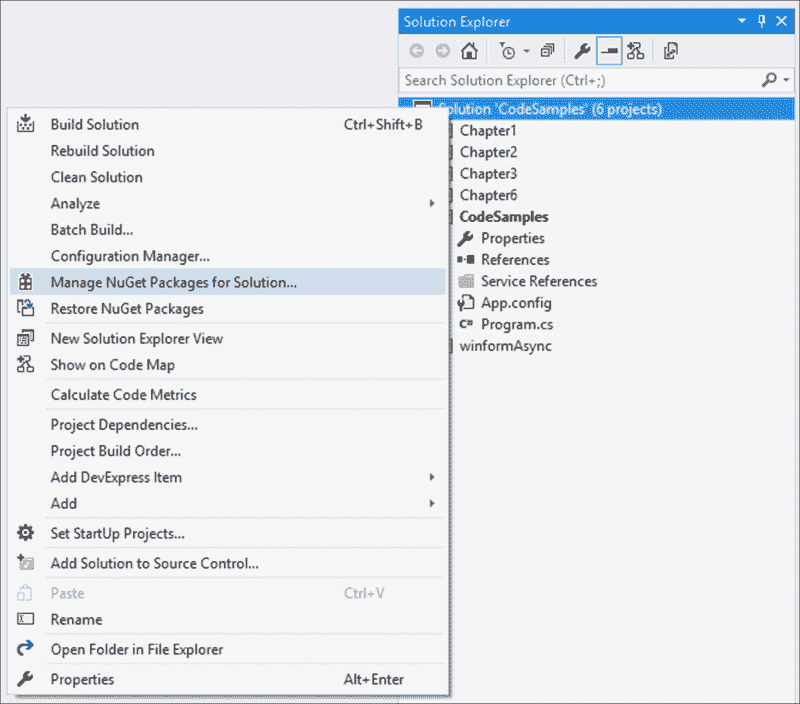

1.  在随后显示的窗口中，在搜索文本框中输入`System.Reactive`并搜索 NuGet 安装程序：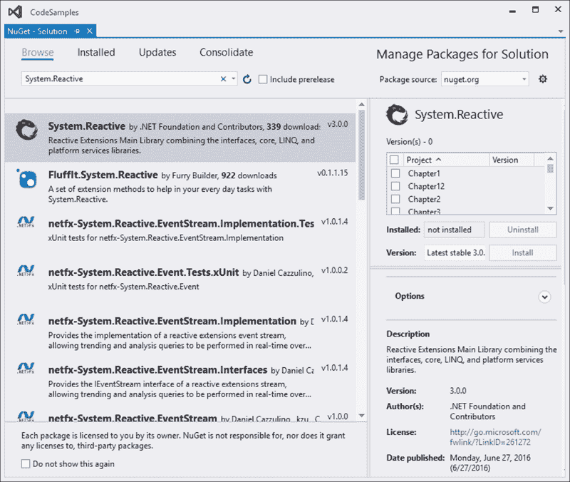

1.  在撰写本书时，最后一个稳定的版本是 3.0.0。接下来，选择你想要安装 Rx 的项目。为了简单起见，我们只是将其安装到整个项目中：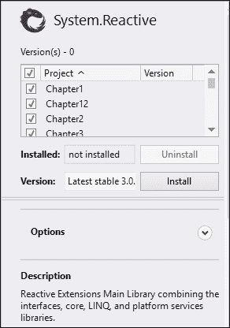

1.  下一个显示的截图是一个确认对话框，询问你确认对项目的更改。它将显示它将对每个项目进行的更改预览。如果你对更改满意，请点击**确定**按钮：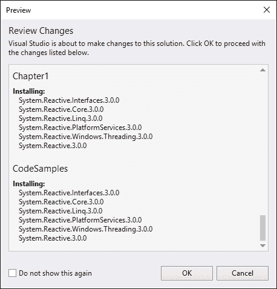

1.  最后一个对话框屏幕可能会显示一个许可协议，你需要接受它。要继续，请点击**我接受**按钮。

1.  安装完成后，你将在项目的**引用**节点下看到添加到 Rx 的引用。具体如下：

    +   `System.Reactive.Core`

    +   `System.Reactive.Interfaces`

    +   `System.Reactive.Linq`

    +   `System.Reactive.PlatformServices`

    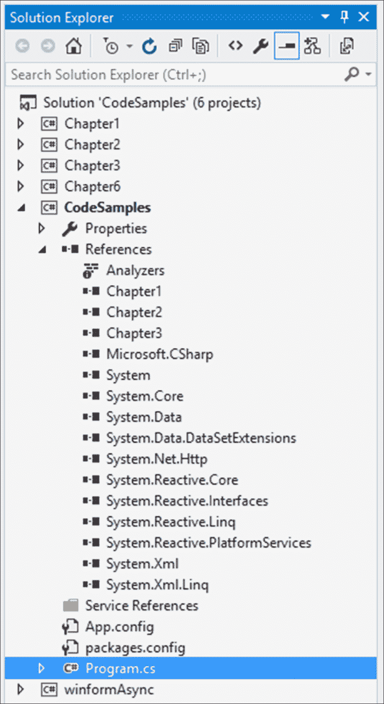

## 它是如何工作的…

NuGet 是向你的项目添加额外组件的最简单方法。正如你所看到的添加的引用，`System.Reactive`是主要程序集。为了更好地理解`System.Reactive`，查看**对象浏览器**中的程序集。为此，请双击项目**引用**选项中的任何程序集：

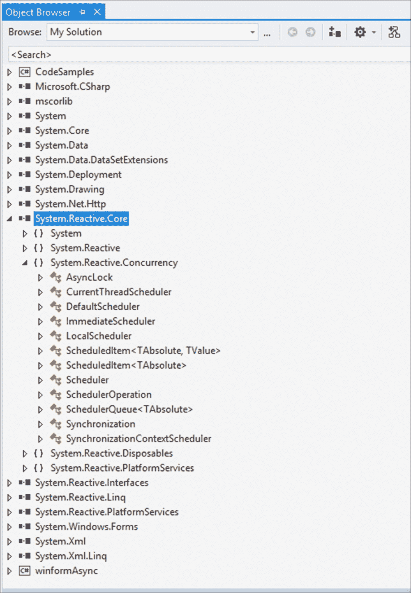

`System.Reactive.Linq`包含 Rx 中的所有查询功能。你还会注意到`System.Reactive.Concurrency`包含所有调度器。

# 事件与可观察对象

作为开发者，我们都应该非常熟悉事件。大多数开发者自从开始编写代码以来就一直在创建事件。实际上，如果你甚至在表单上放置了一个按钮控件，并双击按钮以创建处理按钮点击的方法，你就已经创建了一个事件。在.NET 中，我们可以使用`event`关键字声明事件，通过调用它来发布到事件，并通过向事件添加处理程序来订阅该事件。因此，我们有以下操作：

+   声明

+   发布

+   订阅

使用 Rx，我们有类似的架构，其中我们声明一个数据流，向该流发布数据，并订阅它。

## 准备就绪

首先，我们将看到 C#中事件是如何工作的。然后，我们将使用 Rx 查看事件的工作原理，并在此过程中突出显示差异。

## 如何操作…

1.  在你的控制台应用程序中，添加一个名为`DotNet`的新类。向此类添加一个名为`AvailableDatatype`的属性：

    ```cs
    public class DotNet
    {
        public string  AvailableDatatype { get; set; }
    }
    ```

1.  在主程序类中，添加一个名为`types`的新静态操作事件。基本上，这只是一个委托，将接收一些值，在我们的例子中，是可用的.NET 数据类型：

    ```cs
    class Program
    {
        // Static action event
        static event Action<string> types;

        static void Main(string[] args)
        {

        }
    }
    ```

1.  在`void Main`内部，创建一个名为`lstTypes`的`List<DotNet>`类。在这个列表中，添加几个`DotNet`类的值。在这里，我们只添加一些.NET 数据类型的硬编码数据：

    ```cs
    List<DotNet> lstTypes = new List<DotNet>();
    DotNet blnTypes = new DotNet();
    blnTypes.AvailableDatatype = "bool";
    lstTypes.Add(blnTypes);

    DotNet strTypes = new DotNet();
    strTypes.AvailableDatatype = "string";
    lstTypes.Add(strTypes);

    DotNet intTypes = new DotNet();
    intTypes.AvailableDatatype = "int";
    lstTypes.Add(intTypes);

    DotNet decTypes = new DotNet();
    decTypes.AvailableDatatype = "decimal";
    lstTypes.Add(decTypes);
    ```

1.  我们接下来的任务是使用一个简单地将*x*的值输出到控制台窗口的事件处理程序来订阅此事件。然后，每次我们通过添加`types(lstTypes[i].AvailableDatatype);`行来遍历`lstTypes`列表时，我们将引发事件：

    ```cs
    types += x =>
    {
        Console.WriteLine(x);
    };

    for (int i = 0; i <= lstTypes.Count - 1; i++)
    {
        types(lstTypes[i].AvailableDatatype);
    }

    Console.ReadLine();
    ```

    ### 注意

    实际上，在引发事件之前，我们应该始终检查事件是否为 null。只有在这个检查之后，我们才应该引发事件。为了简洁，我们在引发事件之前没有添加这个检查。

1.  当你将步骤 1 到步骤 4 的所有代码添加完毕后，你的控制台应用程序应该看起来像这样：

    ```cs
    class Program
    {
        // Static action event
        static event Action<string> types;

        static void Main(string[] args)
        {
            List<DotNet> lstTypes = new List<DotNet>();
            DotNet blnTypes = new DotNet();
            blnTypes.AvailableDatatype = "bool";
            lstTypes.Add(blnTypes);

            DotNet strTypes = new DotNet();
            strTypes.AvailableDatatype = "string";
            lstTypes.Add(strTypes);

            DotNet intTypes = new DotNet();
            intTypes.AvailableDatatype = "int";
            lstTypes.Add(intTypes);

            DotNet decTypes = new DotNet();
            decTypes.AvailableDatatype = "decimal";
            lstTypes.Add(decTypes);

            types += x =>
            {
                Console.WriteLine(x);
            };

            for (int i = 0; i <= lstTypes.Count - 1; i++)
            {
                types(lstTypes[i].AvailableDatatype);
            }

            Console.ReadLine();
        }
    }
    ```

1.  运行你的应用程序将设置我们的值列表，然后引发创建的事件，将列表的值输出到控制台窗口：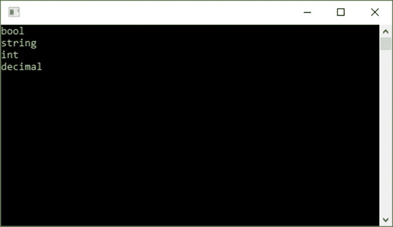

1.  让我们看看使用 Rx 的事件的工作原理。添加一个静态的`Subject`字符串。你可能还需要将`System.Reactive.Subjects`命名空间添加到你的项目中，因为`Subjects`位于这个单独的命名空间中：

    ```cs
    class Program
    {

        static Subject<string> obsTypes = new Subject<string>();

        static void Main(string[] args)
        {

        }
    }
    ```

1.  在创建`DotNet`列表的代码之后，我们使用了`+=`来连接事件处理器。这次，我们将使用`Subscribe`。这是代码中的`IObservable`部分。在你添加了这部分之后，使用`OnNext`关键字引发事件。这是代码中的`IObserver`部分。因此，当我们遍历我们的列表时，我们将调用`OnNext`来将值泵送到已订阅的`IObservable`接口：

    ```cs
    // IObservable
    obsTypes.Subscribe(x =>
    {
        Console.WriteLine(x);
    });

    // IObserver
    for (int i = 0; i <= lstTypes.Count - 1; i++)
    {
        obsTypes.OnNext(lstTypes[i].AvailableDatatype);
    }

    Console.ReadLine();
    ```

1.  当你完成所有代码的添加后，你的应用程序应该看起来像这样：

    ```cs
    class Program
    {

        static Subject<string> obsTypes = new Subject<string>();

        static void Main(string[] args)
        {
            List<DotNet> lstTypes = new List<DotNet>();
            DotNet blnTypes = new DotNet();
            blnTypes.AvailableDatatype = "bool";
            lstTypes.Add(blnTypes);

            DotNet strTypes = new DotNet();
            strTypes.AvailableDatatype = "string";
            lstTypes.Add(strTypes);

            DotNet intTypes = new DotNet();
            intTypes.AvailableDatatype = "int";
            lstTypes.Add(intTypes);

            DotNet decTypes = new DotNet();
            decTypes.AvailableDatatype = "decimal";
            lstTypes.Add(decTypes);

            // IObservable
            obsTypes.Subscribe(x =>
            {
                Console.WriteLine(x);
            });

            // IObserver
            for (int i = 0; i <= lstTypes.Count - 1; i++)
            {
                obsTypes.OnNext(lstTypes[i].AvailableDatatype);
            }

            Console.ReadLine();
        }
    }
    ```

1.  当你运行应用程序时，你将在控制台窗口中看到与之前相同的项输出：

## 如何工作…

在 Rx 中，我们可以使用`Subject`关键字声明一个事件流。因此，我们有一个事件源，我们可以使用`OnNext`来发布。为了在控制台窗口中看到这些值，我们使用`Subscribe`订阅了事件流。

Rx 允许你拥有仅是发布者或仅是订阅者的对象。这是因为`IObservable`和`IObserver`接口实际上是分开的。此外，请注意，在 Rx 中，可观察对象可以作为参数传递，作为结果返回，并存储在变量中，这使得它们成为一等公民：

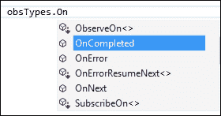

Rx 还允许你指定事件流已完成或发生了错误。这真正将 Rx 与.NET 中的事件区分开来。此外，重要的是要注意，在项目中包含`System.Reactive.Linq`命名空间允许开发者对`Subject`类型编写查询，因为`Subject`是一个`IObservable`接口：

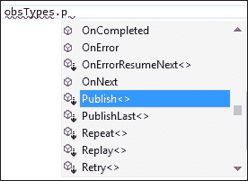

这又是 Rx 与.NET 中的事件区别的一个特性。

# 使用 LINQ 进行查询

Rx 允许开发者使用代表同步数据流的`IObservable`接口，通过 LINQ 编写查询。为了回顾，Rx 可以被视为由三个部分组成：

+   **可观察对象**：将所有这些数据流汇集并代表的接口

+   **语言集成查询**（**LINQ**）：使用 LINQ 查询这些多个数据流的能力

+   **调度器**：使用调度器参数化并发

在这个菜谱中，我们将更详细地查看 Rx 的 LINQ 功能。

## 准备工作

由于可观察者只是数据流，我们可以使用 LINQ 来查询它们。在下面的示例中，我们将根据 LINQ 查询将文本输出到屏幕。

## 如何操作…

1.  首先向您的解决方案添加一个新的 Windows Forms 项目：

1.  将项目命名为`winformRx`并点击**确定**按钮：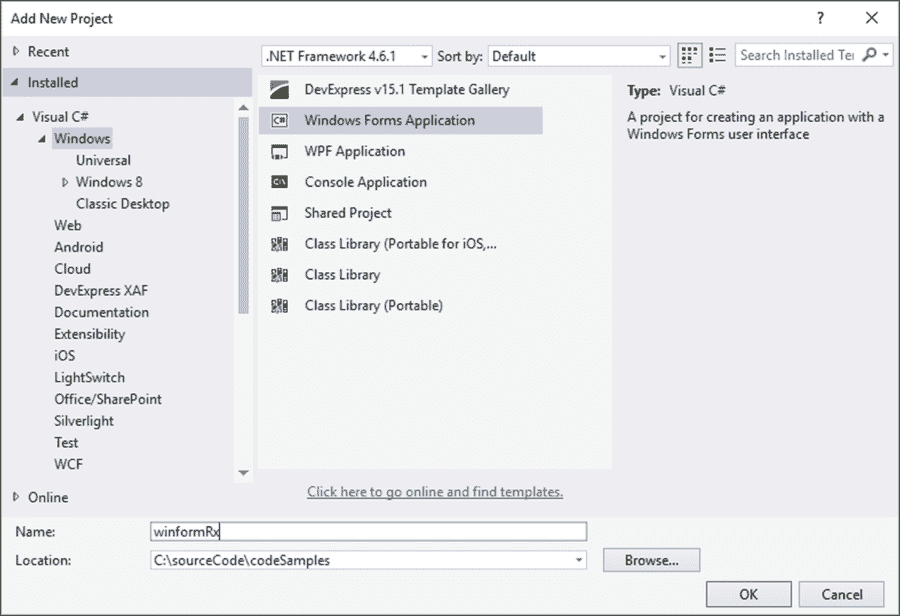

1.  在**工具箱**中搜索**文本框**控件并将其添加到您的表单中：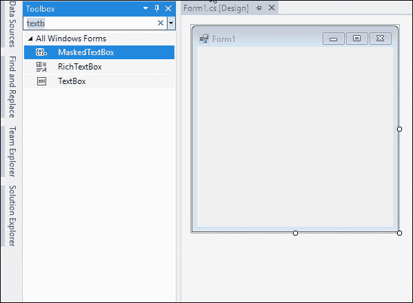

1.  最后，将标签控件添加到您的表单中：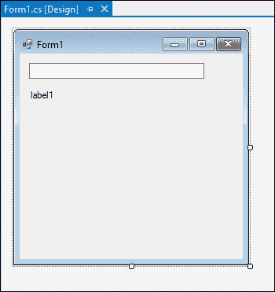

1.  右键单击您的`winformRx`项目，并从上下文菜单中选择**管理 NuGet 包…**：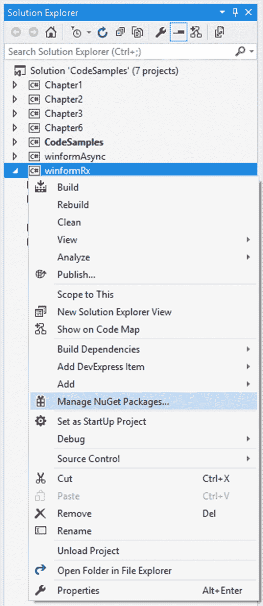

1.  在搜索文本框中输入`System.Reactive`以搜索 NuGet 包，然后点击**安装**按钮：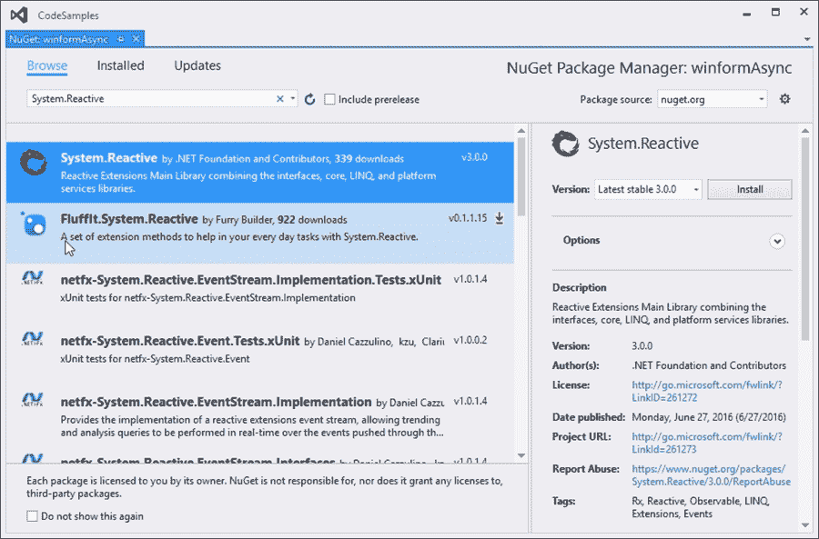

1.  Visual Studio 将要求您审查它即将对项目进行的更改。点击**确定**按钮：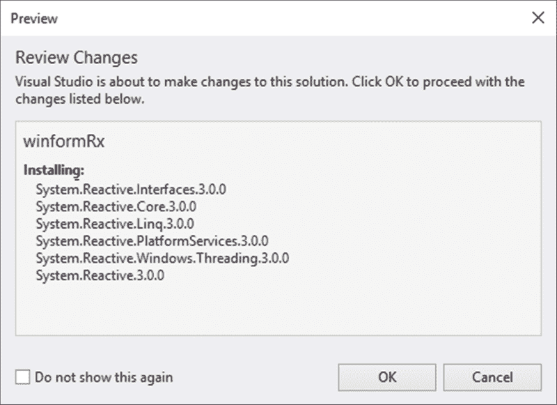

1.  在安装开始之前，您可能需要通过点击**我接受**按钮来接受许可协议：

1.  安装完成后，如果您展开项目的**引用**，应该会看到新添加到您的`winformRx`项目中的引用：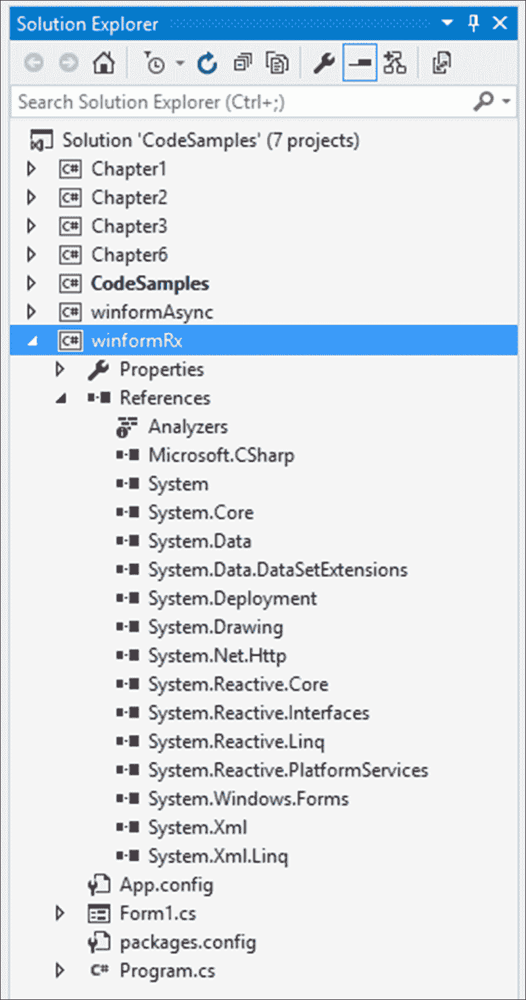

1.  最后，右键单击项目，并通过从上下文菜单中选择**设置为启动项目**来将`winformRx`设置为您的启动项目：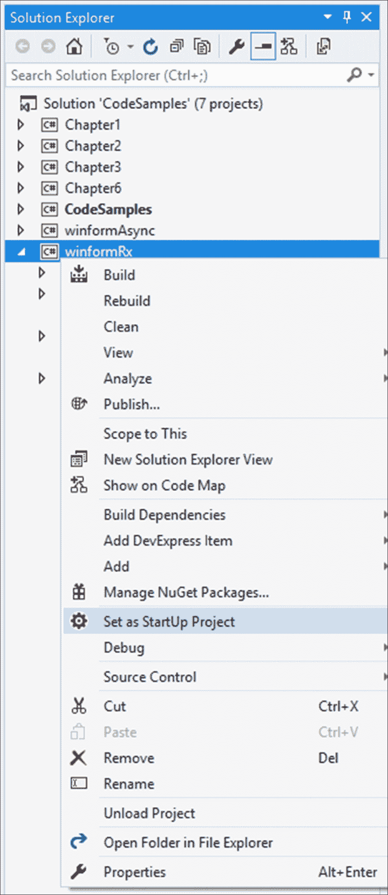

1.  通过在 Windows Form 上任何位置双击来创建表单的加载事件处理程序。向此表单添加`Observable`关键字。您会注意到关键字立即被下划线标注。这是因为您缺少对`System.Reactive`的 LINQ 组件的引用：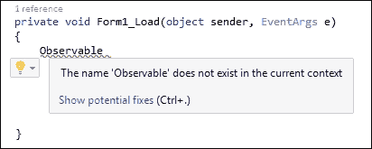

1.  要添加此内容，请按*Ctrl* + *.*（句号）以显示可能的建议以修复问题。选择将`using System.Reactive.Linq`命名空间添加到您的项目中：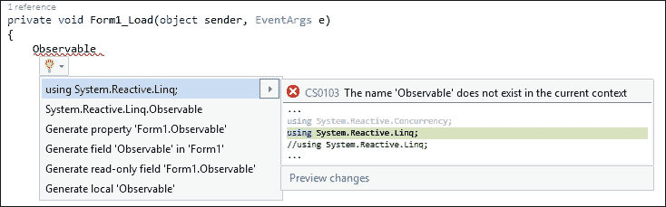

1.  继续将以下代码添加到表单的加载事件中。基本上，您正在使用 LINQ 并告诉编译器您想要从名为`textBox1`的表单上的文本框的文本更改事件匹配的事件模式中选择文本。完成此操作后，向变量添加订阅并告诉它将找到的任何文本输出到名为`label1`的表单上的标签：

    ```cs
    private void Form1_Load(object sender, EventArgs e)
    {
        var searchTerm = Observable.FromEventPattern<EventArgs>(textBox1, "TextChanged")
        .Select(x => ((TextBox)x.Sender).Text);

        searchTerm.Subscribe(trm => label1.Text = trm);
    }
    ```

    ### 注意

    当我们将文本框和标签添加到我们的表单中时，我们保留了控件名称的默认值。然而，如果您更改了默认名称，您将需要指定这些名称而不是表单上的控件`textBox1`和`label1`。

1.  点击运行按钮来运行您的应用程序。Windows Form 将显示带有文本框和标签的表单：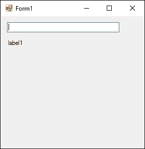

1.  注意，随着您输入文本，文本将输出到表单上的标签：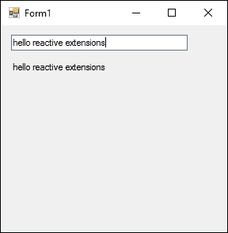

1.  让我们通过向 LINQ 语句添加一个`Where`条件来让事情变得更有趣。我们将指定只有当`text`字符串以句号结尾时才选择文本。这意味着文本只有在每个完整的句子之后才会显示在标签中。正如你所看到的，我们在这里并没有做什么特别的事情。我们只是在使用标准的 LINQ 查询我们的数据流并将结果返回到`searchTerm`变量：

    ```cs
    private void Form1_Load(object sender, EventArgs e)
    {
        var searchTerm = Observable.FromEventPattern<EventArgs>(textBox1, "TextChanged")
        .Select(x => ((TextBox)x.Sender).Text) 
        .Where(text => text.EndsWith("."));

        searchTerm.Subscribe(trm => label1.Text = trm);
    }
    ```

1.  运行你的应用程序并开始输入一行文本。你会看到，当你输入时，标签控件没有输出任何内容，正如我们在添加我们的`Where`条件之前的上一个例子中所见：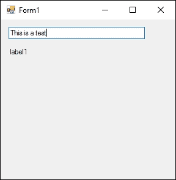

1.  添加一个句号，并开始添加第二行文本：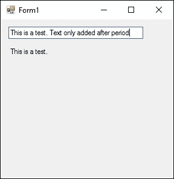

1.  你会看到，只有在每个周期之后，输入的文本才会添加到标签中。因此，我们的`Where`条件工作得非常完美：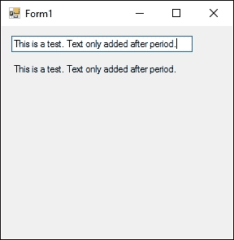

## 它是如何工作的…

Rx 的 LINQ 方面允许开发者构建观察序列。以下是一些示例：

+   `Observable.Empty<>`: 返回一个空的观察序列

+   `Observable.Return<>`: 返回包含单个元素的观察序列

+   `Observable.Throw<>`: 返回以异常终止的观察序列

+   `Observable.Never<>`: 返回一个非终止的观察序列，持续时间无限

LINQ 在 Rx 中的使用允许开发者操纵和过滤数据流，以返回他们所需的确切内容。

# 在 Rx 中使用调度器

有时候，我们需要在特定时间运行一个`IObservable`订阅。想象一下，需要在地理上不同区域和时区同步事件。你可能还需要在保持事件发生顺序的情况下从队列中读取数据。另一个例子是执行可能需要一些时间才能完成的某种 I/O 任务。在这些情况下，调度器非常有用。

## 准备工作

此外，你还可以考虑在 MSDN 上阅读更多关于使用调度器的信息。查看[`msdn.microsoft.com/en-us/library/hh242963(v=vs.103).aspx`](https://msdn.microsoft.com/en-us/library/hh242963(v=vs.103).aspx)。

## 如何做到这一点...

1.  如果你还没有这样做，创建一个新的 Windows 表单应用程序，并将其命名为`winformRx`。打开表单设计器，在**工具箱**中搜索**TextBox**控件并将其添加到你的表单中：

1.  接下来，将一个标签控件添加到你的表单中：

1.  双击 Windows 表单设计器以创建 onload 事件处理程序。在这个处理程序内部，添加一些代码来读取文本框中输入的文本，并在用户停止输入 5 秒后只显示该文本。这是通过使用`Throttle`关键字实现的。向`searchTerm`变量添加一个订阅，将文本输入的结果写入标签控件的文本属性：

    ```cs
    private void Form1_Load(object sender, EventArgs e)
    {
        var searchTerm = Observable.FromEventPattern<EventArgs>(textBox1, "TextChanged")
        .Select(x => ((TextBox)x.Sender).Text) 
        .Throttle(TimeSpan.FromMilliseconds(5000));

        searchTerm.Subscribe(trm => label1.Text = trm);
    }
    ```

    ### 注意

    注意，你可能需要在你的`using`语句中添加`System.Reactive.Linq`。

1.  运行您的应用程序并在文本框中输入一些文本。立即，我们会收到一个异常。这是一个跨线程违规。这发生在尝试从后台线程更新 UI 时。`Observable`接口正在从`System.Threading`运行计时器，它不在 UI 的同一线程上。幸运的是，有一个简单的方法可以克服这个问题。嗯，结果证明 UI 线程功能位于不同的程序集，我们发现通过**包管理器控制台**获取它最简单：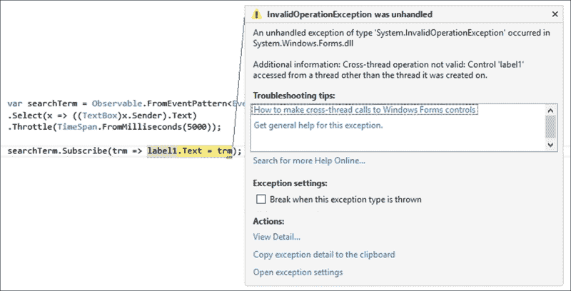

1.  点击**查看** | **其他窗口** | **包管理器控制台**以访问**包管理器控制台**：

1.  输入以下命令：`PM> Install-Package System.Reactive.Windows.Forms`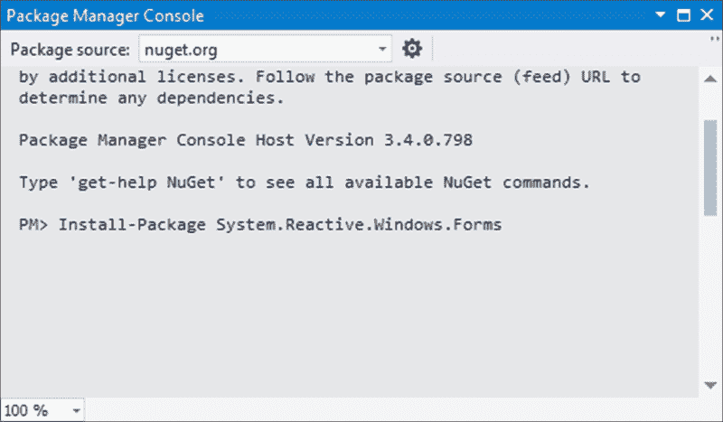

    ### 注意

    请注意，你需要确保在**包管理器控制台**中**默认项目**选择设置为`winformRx`。如果你看不到这个选项，调整**包管理器控制台**屏幕宽度直到选项显示。这样你可以确定包被添加到正确的项目中。

1.  安装完成后，修改你的代码在`onload`事件处理器中，并将`searchTerm.Subscribe(trm => label1.Text = trm);`，执行订阅，改为如下所示：

    ```cs
    searchTerm.ObserveOn(new ControlScheduler(this)).Subscribe(trm => label1.Text = trm);
    ```

    你会注意到我们在这里使用的是`ObserveOn`方法。这基本上告诉编译器，`new ControlScheduler(this)`中的`this`关键字实际上是对我们的 Windows 窗体的引用。因此，`ControlScheduler`将使用 Windows Forms 计时器来创建更新我们的 UI 的间隔。消息发生在正确的线程上，我们不再有跨线程违规。

1.  如果你还没有将`System.Reactive.Concurrency`命名空间添加到你的项目中，Visual Studio 将会用波浪线下划线标记`ControlScheduler`代码行。按下*Ctrl* + *.*（控制键和点）将允许你添加缺少的命名空间：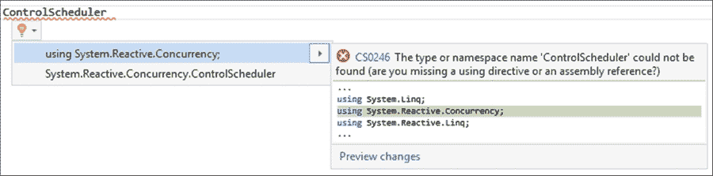

1.  这意味着`System.Reactive.Concurrency`包含一个可以与 Windows Forms 控件通信的调度器，以便它可以进行调度。再次运行您的应用程序并在文本框中输入一些文本：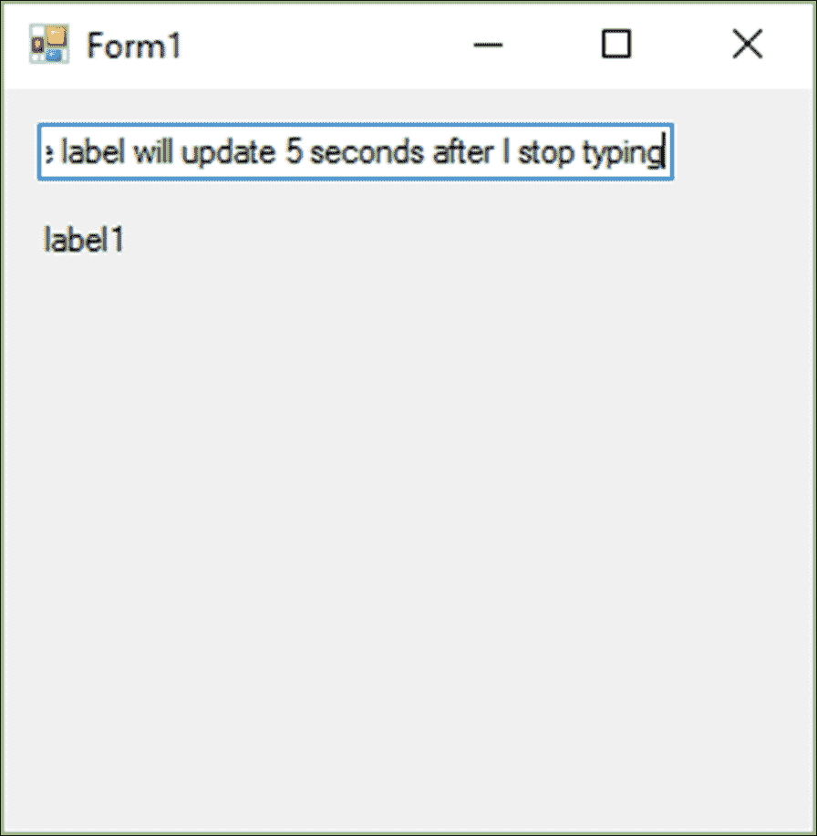

1.  停止输入五秒后，节流条件得到满足，文本输出到我们的标签：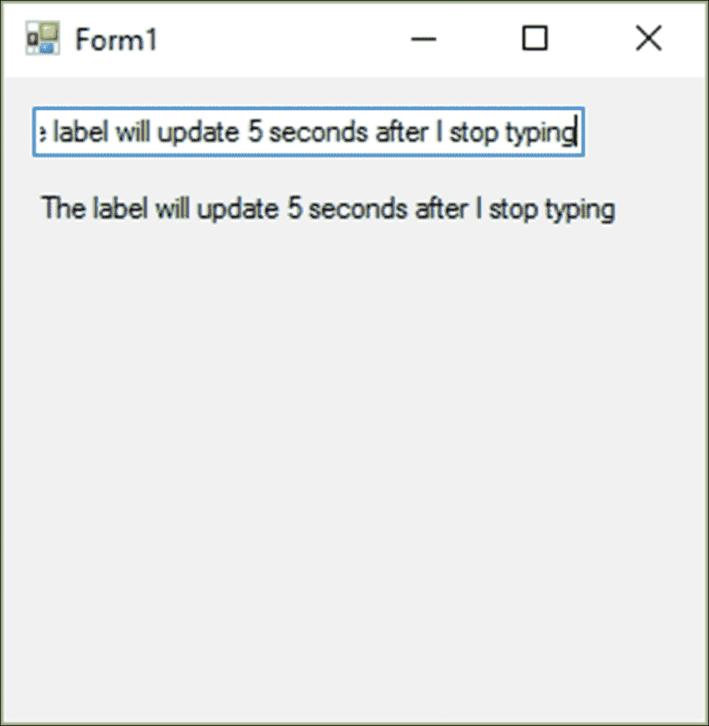

## 它是如何工作的…

我们需要记住的是，从我们创建的代码中，有`ObserveOn`和`Subscribe`。你不应该混淆这两个。在大多数情况下，处理调度器时，你会使用`ObserveOn`。`ObserveOn`方法允许你参数化`OnNext`、`OnCompleted`和`OnError`消息的运行位置。使用`Subscribe`，我们参数化实际订阅和取消订阅代码的运行位置。

我们还需要记住，Rx 使用线程计时器 (`System.Threading.Timer`) 作为默认设置，这就是为什么我们之前遇到了跨线程违规。然而，正如你所看到的，我们使用了调度器来参数化使用哪个计时器。调度器这样做是通过暴露三个组件来实现的。这些是：

+   调度器执行某些操作的能力

+   执行要执行的操作或工作的顺序

+   允许调度器有时间概念的时钟

使用时钟的重要性在于它允许开发者使用远程机器上的计时器，例如（在你和他们之间可能存在时间差异的情况下），告诉它们在特定时间执行操作。

# 调试 Lambda 表达式

Visual Studio 2015 为开发者添加了调试 lambda 表达式的功能。这是我们最喜欢的 IDE 功能的绝佳补充。它允许我们即时检查 lambda 表达式的结果，并修改表达式以测试不同的场景。

## 准备工作

我们将创建一个非常基础的 lambda 表达式，并在**监视**窗口中更改它以产生不同的值。

## 如何操作…

1.  添加一个名为 `CSharpSix` 的类。向这个类添加一个名为 `FavoriteFeature` 的属性：

    ```cs
    public class CSharpSix
    {
        public string FavoriteFeature { get; set; }
    }
    ```

1.  接下来，创建一个 `List<CSharpSix>` 对象，并将一些你最喜欢的 C# 6 特性添加到这个列表中：

    ```cs
    List<CSharpSix> FavCSharpFeatures = new List<CSharpSix>();
    CSharpSix feature1 = new CSharpSix();
    feature1.FavoriteFeature = "String Interpolation";
    FavCSharpFeatures.Add(feature1);

    CSharpSix feature2 = new CSharpSix();
    feature2.FavoriteFeature = "Exception Filters";
    FavCSharpFeatures.Add(feature2);

    CSharpSix feature3 = new CSharpSix();
    feature3.FavoriteFeature = "Nameof Expressions";
    FavCSharpFeatures.Add(feature3);
    ```

1.  然后，创建一个只返回以 `"Ex"` 字符串开头的特性的表达式。在这里，我们显然期望看到异常过滤器作为结果：

    ```cs
    var filteredFeature = FavCSharpFeatures.Where(feature => feature.FavoriteFeature.StartsWith("Ex"));
    ```

1.  在表达式中放置断点并运行你的应用程序。当代码在断点处停止时，你可以复制 lambda 表达式：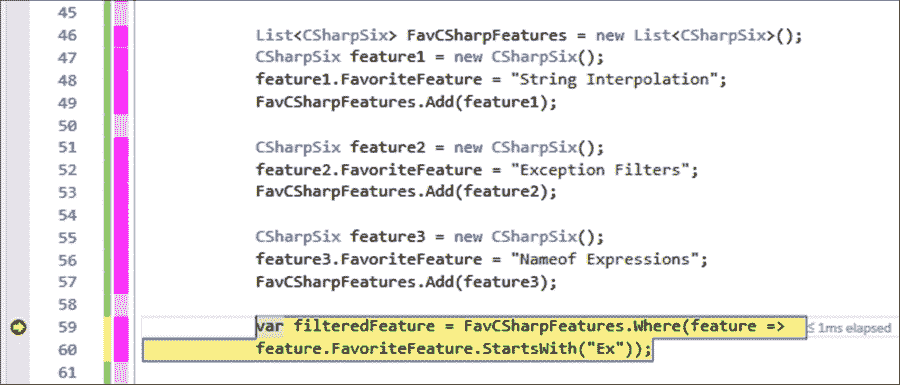

1.  将 lambda 表达式粘贴到你的**监视**窗口中，并更改 `StartsWith` 方法中的字符串。你会发现结果已经更改为 `"Nameof Expressions"` 字符串：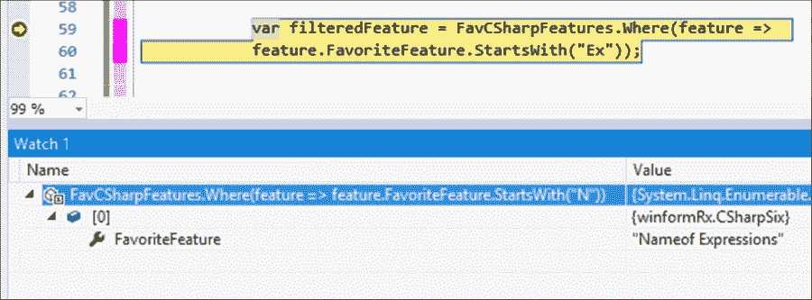

## 它是如何工作的…

能够调试 lambda 表达式使我们能够轻松地更改和调试 lambda 表达式。这是在 Visual Studio 的早期版本中不可能做到的事情。当与这些表达式一起工作时，了解这个技巧显然非常重要。

另一个需要注意的点是，你可以在 Visual Studio 2015 的**立即**窗口中做同样的事情，也可以从 lambda 表达式中的固定变量中做。
