# 第七章.使用 C#中的并行和多线程进行高性能编程

本章将探讨如何使用多线程和并行编程来提高代码的性能。在本章中，我们将介绍以下菜谱：

+   创建和终止一个低优先级的后台线程

+   增加最大线程池大小

+   创建多个线程

+   锁定一个线程直到有争议的资源可用

+   使用 `Parallel.Invoke` 调用方法进行并行调用

+   使用并行 `foreach` 循环来运行多个线程

+   取消并行 `foreach` 循环

+   在并行 `foreach` 循环中捕获错误

+   调试多个线程

# 简介

如果你今天能在电脑上找到一个单核 CPU，那可能意味着你站在一个博物馆里。今天每台新电脑都利用了多核的优势。程序员可以在自己的应用程序中利用这种额外的处理能力。随着应用程序的大小和复杂性的增长，在许多情况下，它们实际上需要利用多线程。

虽然并非所有情况都适合实现多线程代码逻辑，但了解如何使用多线程来提高应用程序的性能是很好的。本章将带你了解 C#编程中这项激动人心的技术的核心。

# 创建和终止一个低优先级的后台线程

我们之所以特别关注后台线程，是因为默认情况下，由主应用程序线程或 `Thread` 类构造函数创建的所有线程都是前台线程。那么，前台线程和后台线程究竟有什么区别呢？好吧，后台线程与前台线程相同，唯一的区别是，如果所有前台线程都终止了，后台线程也会停止。这在你的应用程序中有一个必须防止应用程序终止的过程时很有用。换句话说，当你的应用程序运行时，后台线程必须继续运行。

## 准备工作

我们将创建一个简单的应用程序，该应用程序定义的线程被创建为后台线程。然后它将挂起、恢复和终止线程。

## 如何操作…

1.  通过在解决方案上右键单击并从上下文菜单中选择**添加**然后**新建项目**来创建一个新的类库：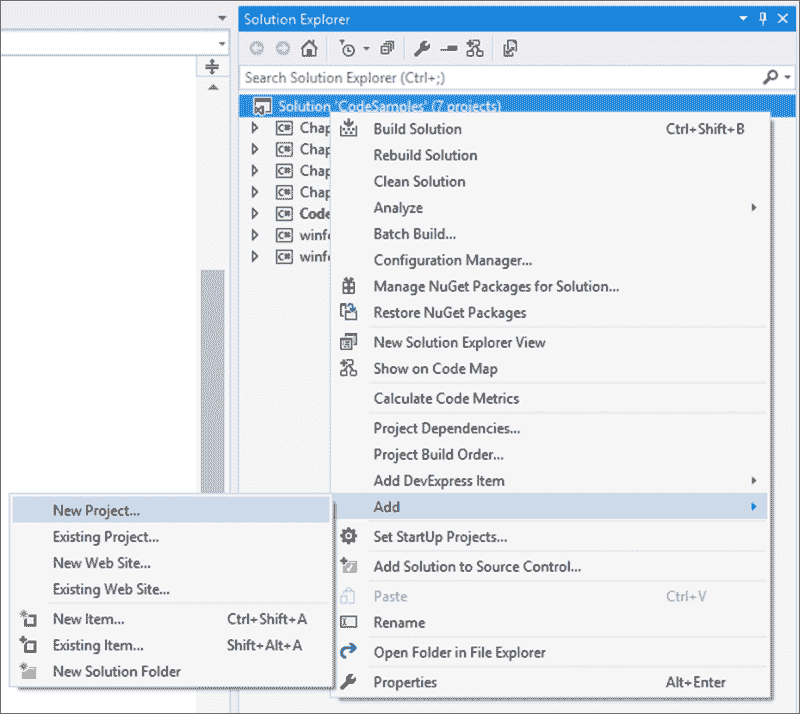

1.  从**添加新项目**对话框屏幕中，从已安装的模板中选择**类库**，并将你的类命名为 `Chapter7`：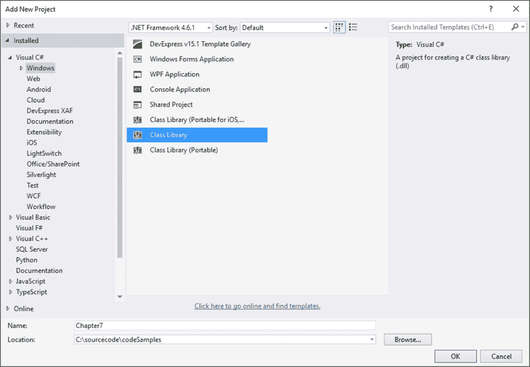

1.  你的新类库将以默认名称 `Class1.cs` 添加到你的解决方案中，我们将它重命名为 `Recipes.cs` 以便正确区分代码。然而，如果你觉得这样更有意义，你可以将你的类重命名为任何你喜欢的名字。

1.  要重命名你的类，只需在**解决方案资源管理器**中单击类名，然后从上下文菜单中选择**重命名**：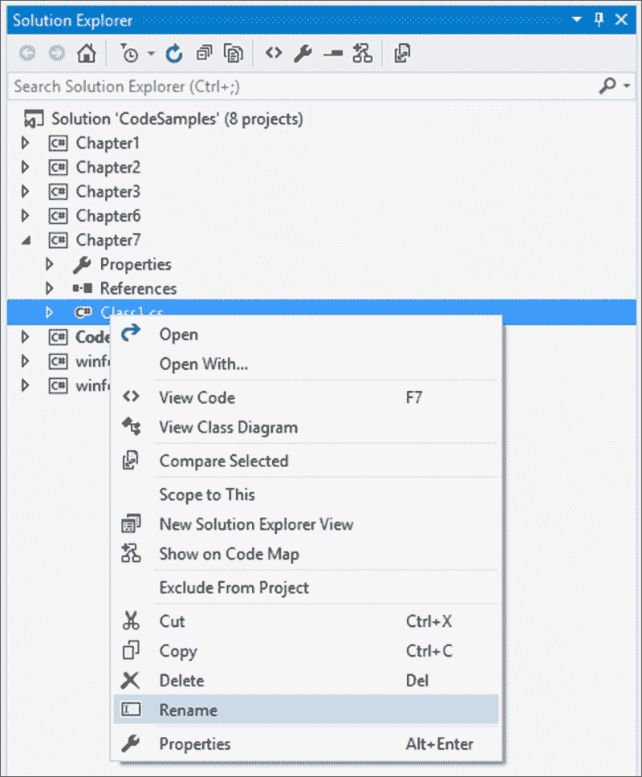

1.  Visual Studio 将要求你确认重命名项目中所有对代码元素**Class1**的引用。只需点击**是**：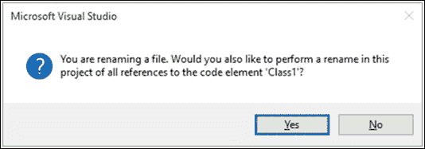

1.  以下类被添加到你的`Chapter7`库项目中：

    ```cs
    namespace Chapter7
    {
        public class Recipes
        {

        }
    }
    ```

1.  在`Recipes`类内部，添加一个名为`DoBackgroundTask()`的方法，并使用`public void`修饰符，向其中添加以下控制台输出：

    ```cs
    public void DoBackgroundTask()
            {
                WriteLine($"Thread {Thread.CurrentThread.ManagedThreadId} has a threadstate of {Thread.CurrentThread.ThreadState} with {Thread.CurrentThread.Priority} priority");
                WriteLine($"Start thread sleep at {DateTime.Now.Second} seconds");
                Thread.Sleep(3000);
                WriteLine($"End thread sleep at {DateTime.Now.Second} seconds");
            }
    ```

    ### 注意

    确保你已经为`System.Threading`和`static System.Console`添加了`using`语句。

1.  在之前添加的名为`CodeSamples`的控制台应用程序内部，通过在`CodeSamples`项目下的**引用**上右键单击并从上下文菜单中选择**添加引用**来添加对`Chapter7`类库的引用：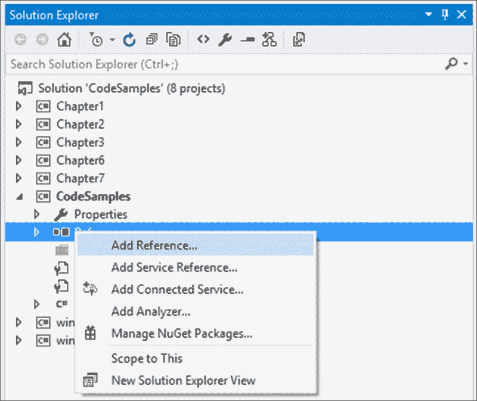

1.  在**参考管理器**窗口中，通过访问**项目** | **解决方案**选择`Chapter7`解决方案。这将允许你在你的控制台应用程序中使用我们刚刚创建的类：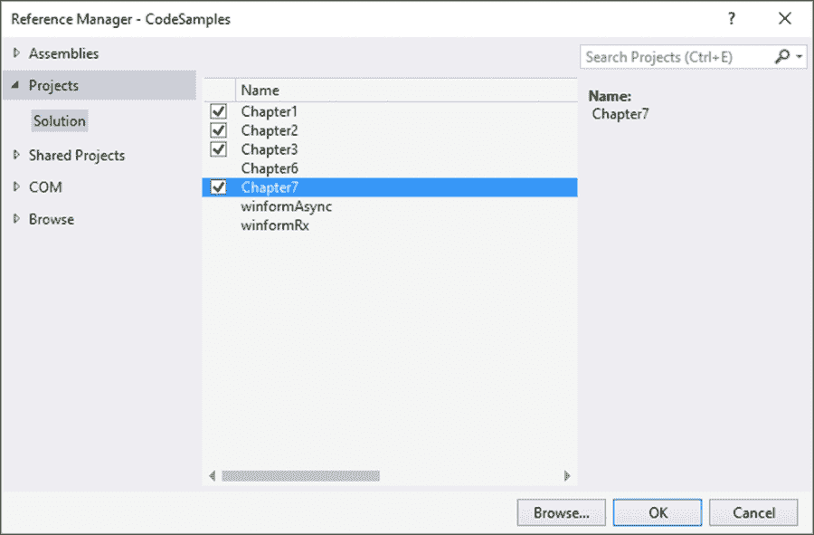

1.  在`void Main`方法中，创建你`Recipes`类的一个新实例并将其添加到名为`backgroundThread`的新线程中。将这个新创建的线程定义为后台线程，然后启动它。最后，让线程休眠五秒钟。我们需要这样做，因为我们创建了一个设置为休眠三秒的后台线程。后台线程不会阻止前台线程终止。因此，如果主应用程序线程（默认为前台线程）在后台线程完成之前终止，应用程序将终止，并且也会终止后台线程：

    ```cs
    static void Main(string[] args)
    {
        Chapter7.Recipes oRecipe = new Chapter7.Recipes();
        var backgroundThread = new Thread(oRecipe.DoBackgroundTask);
        backgroundThread.IsBackground = true;
        backgroundThread.Start();
        Thread.Sleep(5000);
    }
    ```

    ### 注意

    请注意，你可能需要添加`using System.Threading`指令。

1.  通过按*F5*键运行你的控制台应用程序。你会看到我们创建了一个具有正常优先级的后台线程：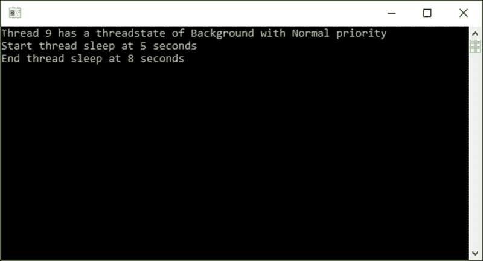

1.  让我们修改我们的线程并将其优先级降低到低。将以下代码行添加到你的控制台应用程序中：`backgroundThread.Priority = ThreadPriority.Lowest;`。这一行将降低线程优先级：

    ```cs
    Chapter7.Recipes oRecipe = new Chapter7.Recipes();
    var backgroundThread = new Thread(oRecipe.DoBackgroundTask);
    backgroundThread.IsBackground = true;
    backgroundThread.Priority = ThreadPriority.Lowest;
    backgroundThread.Start();
    Thread.Sleep(5000);
    ```

1.  再次运行你的控制台应用程序。这次，你会看到线程优先级已被设置为最低优先级：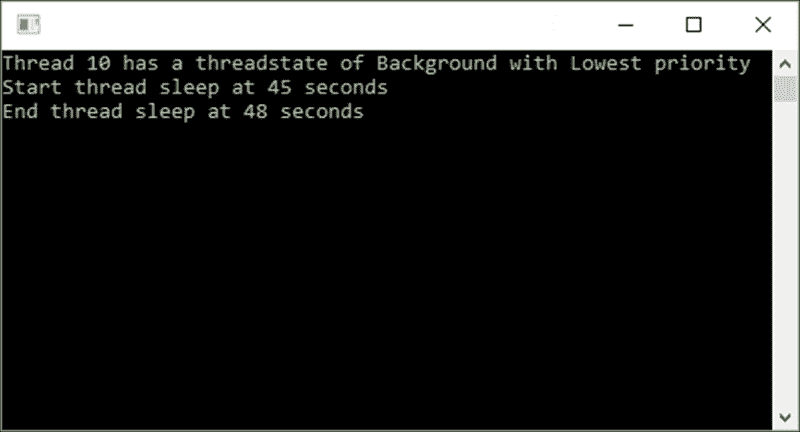

1.  返回到你的`DoBackgroundTask()`方法，并在调用`Thread.Sleep(3000);`之前添加`Thread.CurrentThread.Abort();`。这一行将提前终止后台线程。你的代码应该看起来像这样：

    ```cs
    public void DoBackgroundTask()
    {
        WriteLine($"Thread {Thread.CurrentThread.ManagedThreadId} has a threadstate of {Thread.CurrentThread.ThreadState} with {Thread.CurrentThread.Priority} priority");
        WriteLine($"Start thread sleep at {DateTime.Now.Second} seconds");
        Thread.CurrentThread.Abort();
        Thread.Sleep(3000);
        WriteLine($"End thread sleep at {DateTime.Now.Second} seconds");
    }
    ```

1.  当你运行你的控制台应用程序时，你会看到线程在调用`Thread.Sleep`方法之前被终止。然而，以这种方式终止线程通常是不推荐的：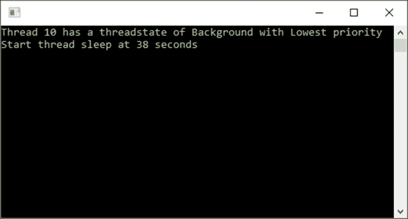

## 如何工作…

能够创建后台线程是在不干扰主应用程序线程进程的情况下在主线程之外工作的好方法。另一个附加的好处是，一旦主应用程序线程完成，后台线程就会立即终止。这个过程确保您的应用程序将优雅地终止。

# 增加最大线程池大小

.NET 中的线程池位于`System.Threading.ThreadPool`类中。通常，关于创建自己的线程而不是使用线程池有很多讨论。流行观点认为，线程池应该用于短期任务。这是因为线程池的大小有限。系统中还有许多其他进程会使用线程池。因此，您不希望您的应用程序占用线程池中的所有线程。

规则是您不能将最大工作线程或完成线程的数量设置得少于您计算机上的处理器数量。您也不得将最大工作线程或完成线程的数量设置得少于最小线程池大小。

## 准备工作

我们将读取当前计算机上的处理器数量。然后，我们将获取最小和最大允许的线程池大小，生成一个介于最小和最大线程池大小之间的随机数，并设置线程池上的最大线程数。

## 如何操作…

1.  在`Recipes`类中创建一个新的方法`IncreaseThreadPoolSize()`：

    ```cs
    public class Recipes
    {
        public void IncreaseThreadPoolSize()
        {

        }
    }
    ```

1.  首先，通过使用`Environment.ProcessorCount`添加读取当前机器上处理器数量的代码：

    ```cs
    public class Recipes
    {
        public void IncreaseThreadPoolSize()
        {
            int numberOfProcessors = Environment.ProcessorCount;
            WriteLine($"Processor Count = {numberOfProcessors}");
        }
    }
    ```

1.  接下来，我们将检索线程池中可用的最大和最小线程数：

    ```cs
    int maxworkerThreads;
    int maxconcurrentActiveRequests;
    int minworkerThreads;
    int minconcurrentActiveRequests;
    ThreadPool.GetMinThreads(out minworkerThreads, out minconcurrentActiveRequests);
    WriteLine($"ThreadPool minimum Worker = {minworkerThreads} and minimum Requests = {minconcurrentActiveRequests}");

    ThreadPool.GetMaxThreads(out maxworkerThreads, out maxconcurrentActiveRequests);
    WriteLine($"ThreadPool maximum Worker = {maxworkerThreads} and maximum Requests = {maxconcurrentActiveRequests}");
    ```

1.  然后，我们将生成一个介于线程池中最大和最小线程数之间的随机数：

    ```cs
    Random rndWorkers = new Random();
    int newMaxWorker = rndWorkers.Next(minworkerThreads, maxworkerThreads);
    WriteLine($"New Max Worker Thread generated = {newMaxWorker}");

    Random rndConRequests = new Random();
    int newMaxRequests = rndConRequests.Next(minconcurrentActiveRequests, maxconcurrentActiveRequests);
    WriteLine($"New Max Active Requests generated = {newMaxRequests}");
    ```

1.  现在，我们需要尝试通过调用`SetMaxThreads`方法并将它设置为工作线程和完成端口线程的新随机最大值来设置线程池中的最大线程数。任何超过此最大数的请求都将排队，直到线程池线程再次活跃。如果`SetMaxThreads`方法成功，该方法将返回`true`；否则，它将返回`false`。确保`SetMaxThreads`方法成功是一个好主意：

    ```cs
    bool changeSucceeded = ThreadPool.SetMaxThreads(newMaxWorker, newMaxRequests);
    if (changeSucceeded)
    {
         WriteLine("SetMaxThreads completed");
         int maxworkerThreadCount;
         int maxconcurrentActiveRequestCount;
         ThreadPool.GetMaxThreads(out maxworkerThreadCount, out maxconcurrentActiveRequestCount);
          WriteLine($"ThreadPool Max Worker = {maxworkerThreadCount} and Max Requests = {maxconcurrentActiveRequestCount}");
    }
    else
          WriteLine("SetMaxThreads failed");
    ```

    ### 注意

    工作线程是线程池中的最大工作线程数，而完成端口线程是线程池中的最大异步 I/O 线程数。

1.  当您已将步骤中列出的所有代码添加完毕后，您的`IncreaseThreadPoolSize()`方法应如下所示：

    ```cs
    public class Recipes
    {
        public void IncreaseThreadPoolSize()
        {
            int numberOfProcessors = Environment.ProcessorCount;
            WriteLine($"Processor Count = {numberOfProcessors}");

            int maxworkerThreads;
            int maxconcurrentActiveRequests;
            int minworkerThreads;
            int minconcurrentActiveRequests;
            ThreadPool.GetMinThreads(out minworkerThreads, out minconcurrentActiveRequests);
            WriteLine($"ThreadPool minimum Worker = {minworkerThreads} and minimum Requests = {minconcurrentActiveRequests}");

            ThreadPool.GetMaxThreads(out maxworkerThreads, out maxconcurrentActiveRequests);
            WriteLine($"ThreadPool maximum Worker = {maxworkerThreads} and maximum Requests = {maxconcurrentActiveRequests}");

            Random rndWorkers = new Random();
            int newMaxWorker = rndWorkers.Next(minworkerThreads, maxworkerThreads);
            WriteLine($"New Max Worker Thread generated = {newMaxWorker}");

            Random rndConRequests = new Random();
            int newMaxRequests = rndConRequests.Next(minconcurrentActiveRequests, maxconcurrentActiveRequests);
            WriteLine($"New Max Active Requests generated = {newMaxRequests}");

            bool changeSucceeded = ThreadPool.SetMaxThreads(newMaxWorker, newMaxRequests);
            if (changeSucceeded)
            {
                WriteLine("SetMaxThreads completed");
                int maxworkerThreadCount;
                int maxconcurrentActiveRequestCount;
                ThreadPool.GetMaxThreads(out maxworkerThreadCount, out maxconcurrentActiveRequestCount);
                WriteLine($"ThreadPool Max Worker = {maxworkerThreadCount} and Max Requests = {maxconcurrentActiveRequestCount}");
            }
            else
                WriteLine("SetMaxThreads failed");

        }
    }
    ```

1.  直接进入您的控制台应用程序，创建一个新的`Recipe`类实例，并调用`IncreaseThreadPoolSize()`方法：

    ```cs
    Chapter7.Recipes oRecipe = new Chapter7.Recipes();
    oRecipe.IncreaseThreadPoolSize();
    Console.ReadLine();
    ```

1.  最后，运行您的控制台应用程序并注意输出：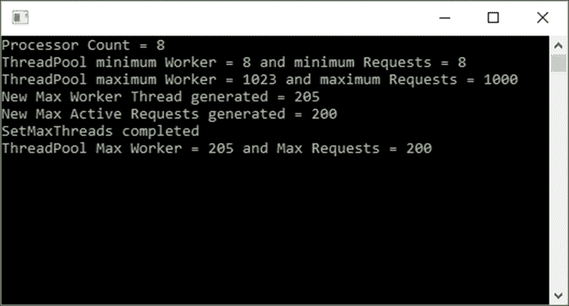

## 工作原理…

从控制台应用程序中，我们可以看到处理器数量是`8`。因此，线程池的最小线程数也等于 8。然后我们读取最大线程池大小，并在最小和最大数字之间生成一个随机数。最后，我们将最大线程池大小设置为随机生成的最小和最大值。

虽然这只是一个概念验证，并不是在生产应用程序中会做的事情（将线程池设置为随机数），但它清楚地说明了将线程池设置为开发人员指定的值的能力。

### 提示

本食谱中的代码是为 32 位编译的。尝试将您的应用程序更改为 64 位应用程序并再次运行代码。看看 64 位带来的差异。

# 创建多个线程

有时候，我们需要创建多个线程。然而，在我们继续之前，我们需要等待这些线程完成它们需要做的任何事情。为此，使用任务是最合适的。

## 准备工作

确保您已将`using System.Threading.Tasks;`语句添加到`Recipes`类的顶部。

## 如何做…

1.  在您的`Recipes`类中创建一个名为`MultipleThreadWait()`的新方法。然后，创建一个名为`RunThread()`的第二个方法，使用`private`修饰符，它接受一个整数秒数来使线程休眠。这将模拟进行一段时间工作的过程：

    ```cs
    public class Recipes
    {
        public void MultipleThreadWait()
        {        

        }

        private void RunThread(int sleepSeconds)
        {        

        }
    }
    ```

    ### 注意

    在现实中，你可能不会调用相同的方法。从所有目的来看，你可以调用三个不同的方法。然而，为了简单起见，我们将使用不同的睡眠时长调用相同的方法。

1.  将以下代码添加到您的`MultipleThreadWait()`方法中。您会注意到我们创建了三个任务，然后创建了三个线程。然后我们将启动这三个线程，并使它们分别休眠`3`、`5`和`2`秒。最后，我们将调用`Task.WaitAll`方法等待，然后再继续执行应用程序：

    ```cs
    Task thread1 = Task.Factory.StartNew(() => RunThread(3));
    Task thread2 = Task.Factory.StartNew(() => RunThread(5));
    Task thread3 = Task.Factory.StartNew(() => RunThread(2));

    Task.WaitAll(thread1, thread2, thread3);
    WriteLine("All tasks completed");
    ```

1.  然后，在`RunThread()`方法中，我们将读取当前线程 ID，然后使线程休眠指定的毫秒数。这仅仅是秒的整数值乘以`1000`：

    ```cs
    int threadID = Thread.CurrentThread.ManagedThreadId;

    WriteLine($"Sleep thread {threadID} for {sleepSeconds} seconds at {DateTime.Now.Second} seconds");
    Thread.Sleep(sleepSeconds * 1000);
    WriteLine($"Wake thread {threadID} at {DateTime.Now.Second} seconds");
    ```

1.  当您完成代码后，您的`Recipes`类应该看起来像这样：

    ```cs
    public class Recipes
    {
        public void MultipleThreadWait()
        {
            Task thread1 = Task.Factory.StartNew(() => RunThread(3));
            Task thread2 = Task.Factory.StartNew(() => RunThread(5));
            Task thread3 = Task.Factory.StartNew(() => RunThread(2));

            Task.WaitAll(thread1, thread2, thread3);
            WriteLine("All tasks completed");
        }

        private void RunThread(int sleepSeconds)
        {
            int threadID = Thread.CurrentThread.ManagedThreadId;

            WriteLine($"Sleep thread {threadID} for {sleepSeconds} seconds at {DateTime.Now.Second} seconds");
            Thread.Sleep(sleepSeconds * 1000);
            WriteLine($"Wake thread {threadID} at {DateTime.Now.Second} seconds");
        }
    }
    ```

1.  最后，将`Recipe`类的新实例添加到您的控制台应用程序中，并调用`MultipleThreadWait()`方法：

    ```cs
    Chapter7.Recipes oRecipe = new Chapter7.Recipes();
    oRecipe.MultipleThreadWait();
    Console.ReadLine();
    ```

1.  运行您的控制台应用程序并查看产生的输出：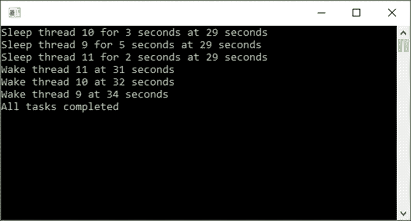

## 它是如何工作的…

您会注意到创建了三个线程（`thread 9`、`thread 10`和`thread 11`）。然后通过使它们休眠不同时间来暂停这些线程。在每个线程唤醒后，代码将等待所有三个线程完成，然后再继续执行应用程序代码。

# 锁定一个线程直到有争议的资源可用

有时候，我们希望将特定线程对进程的独占访问权。我们可以使用`lock`关键字来实现这一点。这将以线程安全的方式执行此进程。因此，当线程运行进程时，它将在锁的作用域内获得对进程的独占访问权。如果另一个线程试图在锁定代码内访问进程，它将被阻塞并必须等待直到锁被释放。

## 准备工作

对于这个例子，我们将使用任务。确保你已经将`using System.Threading.Tasks;`语句添加到你的`Recipes`类的顶部。

## 如何做…

1.  在`Recipes`类中，添加一个名为`threadLock`的对象，并使用`private`修饰符。然后，添加两个名为`LockThreadExample()`和`ContendedResource()`的方法，这两个方法接受一个表示睡眠秒数的整数作为参数：

    ```cs
    public class Recipes
    {
        private object threadLock = new object();
        public void LockThreadExample()
        {        

        }

        private void ContendedResource(int sleepSeconds)
        {        

        }
    }
    ```

    ### 注意

    被认为是一种最佳实践，将锁定对象定义为私有。

1.  在`LockThreadExample()`方法中添加三个任务。它们将创建尝试同时访问相同代码段的线程。此代码将在所有线程完成之前等待，然后终止应用程序：

    ```cs
    Task thread1 = Task.Factory.StartNew(() => ContendedResource(3));
    Task thread2 = Task.Factory.StartNew(() => ContendedResource(5));
    Task thread3 = Task.Factory.StartNew(() => ContendedResource(2));

    Task.WaitAll(thread1, thread2, thread3);
    WriteLine("All tasks completed");
    ```

1.  在`ContendedResource()`方法中，使用`private`的`threadLock`对象创建一个锁，然后使线程睡眠方法传递给方法的秒数：

    ```cs
    int threadID = Thread.CurrentThread.ManagedThreadId;
    lock (threadLock)
    {
        WriteLine($"Locked for thread {threadID}");
        Thread.Sleep(sleepSeconds * 1000);
    }
    WriteLine($"Lock released for thread {threadID}");
    ```

1.  在控制台应用程序中，添加以下代码以实例化一个新的`Recipes`类并调用`LockThreadExample()`方法：

    ```cs
    Chapter7.Recipes oRecipe = new Chapter7.Recipes();
    oRecipe.LockThreadExample();
    Console.ReadLine();
    ```

1.  运行控制台应用程序，查看信息输出到控制台窗口：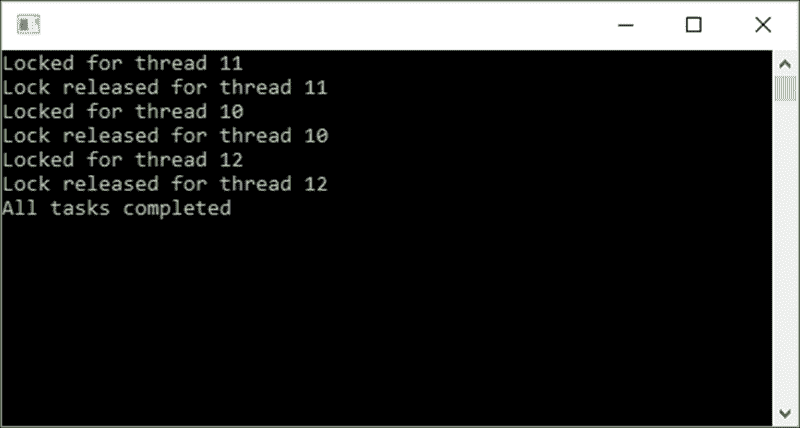

## 它是如何工作的…

我们可以看到`thread 11`获得了对竞争资源的独占访问权。同时，`thread 11`和`thread 12`试图访问由`thread 11`锁定的竞争资源。这导致其他两个线程必须等待直到`thread 11`完成并释放锁。结果是代码按顺序执行，如控制台窗口输出所示。每个线程等待它的轮次，直到它可以访问资源并锁定其线程。

# 使用 Parallel.Invoke 调用方法的并行调用

`Parallel.Invoke`允许我们以（你猜对了）并行的方式执行任务。有时，你需要同时执行操作，这样就可以加快处理速度。因此，可以预期处理任务的总时间等于运行时间最长的进程。使用`Parallel.Invoke`相当简单。

## 准备工作

确保你已经将`using System.Threading.Tasks;`语句添加到你的`Recipes`类的顶部。

## 如何做…

1.  首先，在`Recipes`类中创建两个名为`ParallelInvoke()`和`PerformSomeTask()`的方法，这两个方法接受一个表示睡眠秒数的整数作为参数：

    ```cs
    public class Recipes
    {
        public void ParallelInvoke()
        {        

        }

        private void PerformSomeTask(int sleepSeconds)
        {        

        }
    }
    ```

1.  将以下代码添加到`ParallelInvoke()`方法中。此代码将调用`Paralell.Invoke`来运行`PerformSomeTask()`方法：

    ```cs
    WriteLine($"Parallel.Invoke started at {DateTime.Now.Second} seconds");
    Parallel.Invoke(
        () => PerformSomeTask(3),
        () => PerformSomeTask(5),
        () => PerformSomeTask(2)
        );

    WriteLine($"Parallel.Invoke completed at {DateTime.Now.Second} seconds");
    ```

1.  在`PerformSomeTask()`方法中，让线程休眠的方法参数指定的秒数（通过将秒数乘以`1000`将其转换为毫秒）：

    ```cs
    int threadID = Thread.CurrentThread.ManagedThreadId;
    WriteLine($"Sleep thread {threadID} for {sleepSeconds} seconds");
    Thread.Sleep(sleepSeconds * 1000);
    WriteLine($"Thread {threadID} resumed");
    ```

1.  当你添加了所有代码后，你的`Recipes`类应该看起来像这样：

    ```cs
    public class Recipes
    {
        public void ParallelInvoke()
        {
            WriteLine($"Parallel.Invoke started at {DateTime.Now.Second} seconds");
            Parallel.Invoke(
                () => PerformSomeTask(3),
                () => PerformSomeTask(5),
                () => PerformSomeTask(2)
                );

            WriteLine($"Parallel.Invoke completed at {DateTime.Now.Second} seconds");           
        }

        private void PerformSomeTask(int sleepSeconds)
        {        
            int threadID = Thread.CurrentThread.ManagedThreadId;
            WriteLine($"Sleep thread {threadID} for {sleepSeconds} seconds");
            Thread.Sleep(sleepSeconds * 1000);
            WriteLine($"Thread {threadID} resumed");
        }
    }
    ```

1.  在控制台应用程序中，实例化`Recipes`类的一个新实例并调用`ParallelInvoke()`方法：

    ```cs
    Chapter7.Recipes oRecipe = new Chapter7.Recipes();
    oRecipe.ParallelInvoke();
    Console.ReadLine();
    ```

1.  运行控制台应用程序，查看控制台窗口中产生的输出：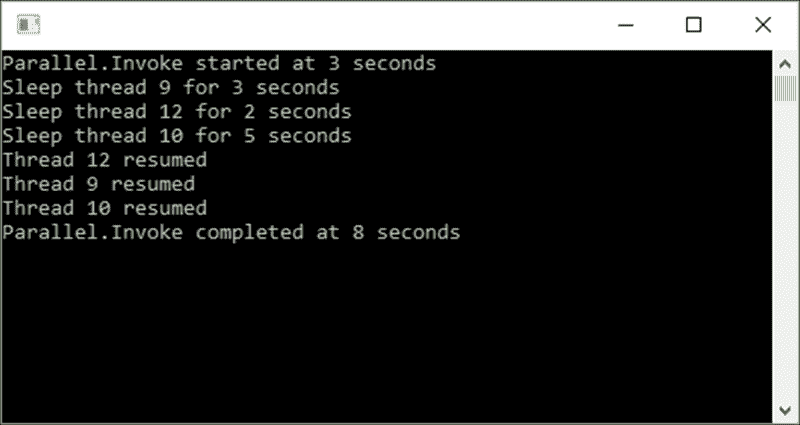

## 它是如何工作的…

由于我们正在并行运行所有这些线程，我们可以假设最长的过程将表示所有任务的总持续时间。这意味着整个过程的持续时间将是 5 秒，因为最长的任务将花费 5 秒来完成（我们将`thread 10`设置为最多休眠 5 秒）。

正如我们所见，`Parallel.Invoke`的开始和结束之间的时间差正好是 5 秒。

# 使用并行`foreach`循环运行多个线程

很久以前，在一次工作 retreat（是的，我工作的公司真的很酷），我的同事之一 Graham Rook 向我展示了一个并行`foreach`循环。它确实大大加快了处理速度。但是，这里的问题是。如果你处理的是少量数据或小任务，使用并行`foreach`循环是没有意义的。并行`foreach`循环在需要大量处理或处理大量数据时表现最佳。

## 准备工作

我们首先来看看并行`foreach`循环在性能上并不优于标准`foreach`循环的地方。为此，我们将创建一个包含 500 个项目的列表，并遍历列表，将项目写入控制台窗口。

为了说明并行`foreach`循环的强大功能，我们将使用相同的列表并为列表中的每个项目创建一个文件。在第二个示例中，并行`foreach`循环的强大功能和好处将变得明显。

## 如何做到这一点…

1.  首先，在`Recipes`类中创建两个方法。调用一个方法`ReadCollectionForEach()`并传递一个`List<string>`参数。创建第二个方法，称为`ReadCollectionParallelForEach()`，它也接受一个`List<string>`参数：

    ```cs
    public class Recipes
    {
        public double ReadCollectionForEach(List<string> intCollection)
        {        

        }

        private double ReadCollectionParallelForEach(List<string> intCollection)
        {        

        }
    }
    ```

1.  在`ReadCollectionForEach()`方法中，添加一个标准的`foreach`循环，该循环将遍历传递给它的字符串集合，并将找到的值写入控制台窗口。然后，清除控制台窗口。使用计时器来跟踪`foreach`循环期间的总秒数：

    ```cs
    var timer = Stopwatch.StartNew();
    foreach (string integer in intCollection)
    {
        WriteLine(integer);
        Clear();
    }
    return timer.Elapsed.TotalSeconds;
    ```

1.  在第二个方法，称为`ReadCollectionParallelForEach()`中，做同样的事情。然而，不是使用标准的`foreach`循环，而是添加一个`Parallel.ForEach`循环。你会注意到`Parallel.ForEach`循环看起来略有不同。`Parallel.ForEach`的签名要求你传递一个可枚举的数据源（`List<string> intCollection`）并定义一个操作，即每次迭代时被调用的委托（`integer`）：

    ```cs
    var timer = Stopwatch.StartNew();
    Parallel.ForEach(intCollection, integer =>
    {
        WriteLine(integer);
        Clear();
    });
    return timer.Elapsed.TotalSeconds;
    ```

1.  当你添加了所有必要的代码后，你的 `Recipes` 类应该看起来像这样：

    ```cs
    public class Recipes
    {
        public double ReadCollectionForEach(List<string> intCollection)
        {        
            var timer = Stopwatch.StartNew();
            foreach (string integer in intCollection)
            {
                WriteLine(integer);
                Clear();
            }
            return timer.Elapsed.TotalSeconds;
        }

        public double ReadCollectionParallelForEach(List<string> intCollection)
        {        
            var timer = Stopwatch.StartNew();
            Parallel.ForEach(intCollection, integer =>
            {
                WriteLine(integer);
                Clear();
            });
            return timer.Elapsed.TotalSeconds;
        }
    }
    ```

1.  在控制台应用程序中，创建 `List<string>` 集合并将其传递给 `Recipes` 类中创建的两个方法。你会注意到我们只创建了一个包含 500 个项目的集合。代码完成后，返回经过的时间（以秒为单位）并将其输出到控制台窗口：

    ```cs
    List<string> integerList = new List<string>();
    for (int i = 0; i <= 500; i++)
    {
        integerList.Add(i.ToString());
    }
    Chapter7.Recipes oRecipe = new Chapter7.Recipes();
    double timeElapsed1 = oRecipe.ReadCollectionForEach(integerList);
    double timeElapsed2 = oRecipe.ReadCollectionParallelForEach(integerList);
    WriteLine($"foreach executed in {timeElapsed1}");
    WriteLine($"Parallel.ForEach executed in {timeElapsed2}");
    ```

1.  运行你的应用程序。从显示的输出中，你会看到使用 `Parallel.ForEach` 循环的性能提升是可以忽略不计的。实际上，在这种情况下，`Parallel.ForEach` 循环只将性能提升了 0.4516 百分比：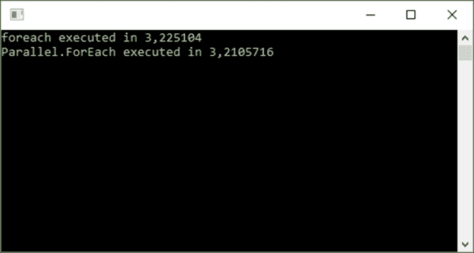

1.  现在让我们使用一个不同的例子。我们将创建一个密集型任务，并测量 `Parallel.ForEach` 循环将为我们带来的性能提升。创建两个名为 `CreateWriteFilesForEach()` 和 `CreateWriteFilesParallelForEach()` 的方法，这两个方法都接受 `List<string>` 集合作为参数：

    ```cs
    public class Recipes
    {
        public void CreateWriteFilesForEach(List<string> intCollection)
        {        

        }

        private void CreateWriteFilesParallelForEach(List<string> intCollection)
        {        

        }
    }
    ```

1.  将以下代码添加到 `CreateWriteFilesForEach()` 方法中。此代码启动计时器，并在 `List<string>` 对象上执行标准的 `foreach` 循环。然后，将经过的时间写入控制台窗口：

    ```cs
    WriteLine($"Start foreach File method");
    var timer = Stopwatch.StartNew();
    foreach (string integer in intCollection)
    {    

    }
    WriteLine($"foreach File method executed in {timer.Elapsed.TotalSeconds} seconds");
    ```

1.  在 `foreach` 循环内部，添加代码以检查是否已使用 `filePath` 变量的文件名部分附加的 `integer` 值创建了一个具有特定名称的文件。创建该文件（确保在尝试写入时使用 `Dispose` 方法以避免锁定文件），并将一些文本写入新创建的文件：

    ```cs
    string filePath = $"C:\\temp\\output\\ForEach_Log{integer}.txt";
    if (!File.Exists(filePath))
    {
        File.Create(filePath).Dispose();
        using (StreamWriter sw = new StreamWriter(filePath, false))
        {
            sw.WriteLine($"{integer}. Log file start: {DateTime.Now.ToUniversalTime().ToString()}");
        }
    }
    ```

1.  接下来，将以下代码添加到 `CreateWriteFilesParallelForEach()` 方法中，该方法基本上与 `CreateWriteFilesForEach()` 方法执行相同的函数，但使用 `Parallel.ForEach` 循环来创建和写入文件：

    ```cs
    WriteLine($"Start Parallel.ForEach File method");
    var timer = Stopwatch.StartNew();
    Parallel.ForEach(intCollection, integer =>
    {

    });
    WriteLine($"Parallel.ForEach File method executed in {timer.Elapsed.TotalSeconds} seconds");
    ```

1.  在 `Parallel.ForEach` 循环内部添加略微修改的文件创建代码：

    ```cs
    string filePath = $"C:\\temp\\output\\ParallelForEach_Log{integer}.txt";
    if (!File.Exists(filePath))
    {
        File.Create(filePath).Dispose();
        using (StreamWriter sw = new StreamWriter(filePath, false))
        {
            sw.WriteLine($"{integer}. Log file start: {DateTime.Now.ToUniversalTime().ToString()}");
        }
    }
    ```

1.  当你完成时，你的代码需要看起来像这样：

    ```cs
    public class Recipes
    {
        public void CreateWriteFilesForEach(List<string> intCollection)
        {        
            WriteLine($"Start foreach File method");
            var timer = Stopwatch.StartNew();
            foreach (string integer in intCollection)
            {
                string filePath = $"C:\\temp\\output\\ForEach_Log{integer}.txt";
                if (!File.Exists(filePath))
                {
                    File.Create(filePath).Dispose();
                    using (StreamWriter sw = new StreamWriter(filePath, false))
                    {
                        sw.WriteLine($"{integer}. Log file start: {DateTime.Now.ToUniversalTime() .ToString()}");
                    }
                }
            }
            WriteLine($"foreach File method executed in {timer.Elapsed.TotalSeconds} seconds");
        }

        public void CreateWriteFilesParallelForEach(List<string> intCollection)
        {        
            WriteLine($"Start Parallel.ForEach File method");
            var timer = Stopwatch.StartNew();
            Parallel.ForEach(intCollection, integer =>
            {
                string filePath = $"C:\\temp\\output\\ParallelForEach_Log {integer}.txt";
                if (!File.Exists(filePath))
                {
                    File.Create(filePath).Dispose();
                    using (StreamWriter sw = new StreamWriter(filePath, false))
                    {
                        sw.WriteLine($"{integer}. Log file start: {DateTime.Now.ToUniversalTime()
                        .ToString()}");
                    }
                }                
            });
            WriteLine($"Parallel.ForEach File method executed in {timer.Elapsed.TotalSeconds} seconds");
        }
    }
    ```

1.  转到控制台应用程序，稍微修改 `List<string>` 对象，并将计数从 `500` 增加到 `1000`。然后，调用 `Recipes` 类中创建的文件方法：

    ```cs
    List<string> integerList = new List<string>();
    for (int i = 0; i <= 1000; i++)
    {
        integerList.Add(i.ToString());
    }

    Chapter7.Recipes oRecipe = new Chapter7.Recipes();
    oRecipe.CreateWriteFilesForEach(integerList);
    oRecipe.CreateWriteFilesParallelForEach(integerList);
    ReadLine();
    ```

1.  最后，当你准备好时，请确保你有 `C:\temp\output` 目录，并且该目录中没有其他文件。运行你的应用程序并查看控制台窗口的输出。这一次，我们可以看到 `Parallel.ForEach` 循环产生了巨大的差异。性能提升非常显著，比标准的 `foreach` 循环提高了 60.7074 百分比：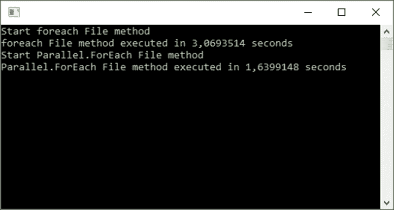

## 它是如何工作的…

从本食谱中使用的示例中可以看出，在使用并行 `foreach` 循环时应该仔细考虑。如果你处理的是相对较低的数据量或非处理密集型事务，并行 `foreach` 循环不会对你的应用程序性能带来太多好处。在某些情况下，标准的 `foreach` 循环可能比并行 `foreach` 循环快得多。然而，如果你在处理大量数据或运行处理器密集型任务时发现应用程序出现性能问题，可以尝试使用并行 `foreach` 循环。它可能会让你感到惊讶。

# 取消并行 `foreach` 循环

在处理并行 `foreach` 循环时，一个明显的问题是，如何根据某个条件（如超时）提前终止循环。实际上，并行 `foreach` 循环很容易提前终止。

## 准备工作

我们将创建一个方法，该方法接受一个项目集合，并在这个集合中以并行 `foreach` 循环的方式遍历。它还将知道一个超时值，如果超过，将终止循环并退出方法。

## 如何操作…

1.  首先，在 `Recipes` 类中创建一个名为 `CancelParallelForEach()` 的新方法，它接受两个参数。一个是 `List<string>` 集合，另一个是指定超时值的整数。当超时值超过时，`Parallel.ForEach` 循环必须终止：

    ```cs
    public class Recipes
    {
        public void CancelParallelForEach(List<string> intCollection, int timeOut)
        {        

        }    
    }
    ```

1.  在 `CancelParallelForEach()` 方法内部，添加一个计时器来跟踪经过的时间。这将向循环发出信号，表示超时阈值已超过，循环需要退出。创建 `Parallel.ForEach` 方法，定义一个状态。在每次迭代中，将经过的时间与超时时间进行比较，如果时间超过，则跳出循环：

    ```cs
    var timer = Stopwatch.StartNew();
    Parallel.ForEach(intCollection, (integer, state) =>
    {
        Thread.Sleep(1000);
        if (timer.Elapsed.Seconds > timeOut)
        {
            WriteLine($"Terminate thread {Thread.CurrentThread.ManagedThreadId}.Elapsed time {timer.Elapsed.Seconds} seconds");
            state.Break();
        }
        WriteLine($"Processing item {integer} on thread {Thread.CurrentThread.ManagedThreadId}");
    });
    ```

1.  在控制台应用程序中，创建 `List<string>` 对象并添加 `1000` 个项目到其中。使用 `5` 秒的超时时间调用 `CancelParallelForEach()` 方法：

    ```cs
    List<string> integerList = new List<string>();
    for (int i = 0; i <= 1000; i++)
    {
        integerList.Add(i.ToString());
    }

    Chapter7.Recipes oRecipe = new Chapter7.Recipes();
    oRecipe.CancelParallelForEach(integerList, 5);
    WriteLine($"Parallel.ForEach loop terminated");
    ReadLine();
    ```

1.  运行你的控制台应用程序并查看输出结果：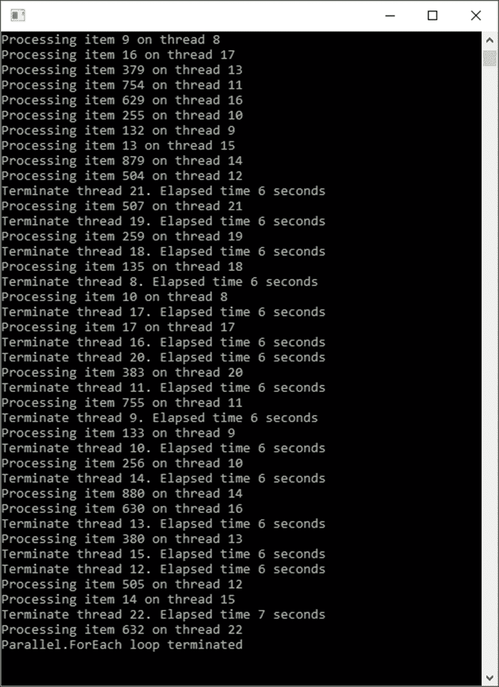

## 它是如何工作的…

你可以从控制台窗口输出中看到，一旦经过的时间超过超时值，并行循环就会在系统最早方便的时候通知停止执行当前迭代之后的迭代。这种对 `Parallel.ForEach` 循环的控制能力允许开发者避免失控的循环，并允许用户通过点击按钮来取消循环操作，或者当超时值达到时，应用程序自动终止。

# 在并行 `foreach` 循环中捕获错误

使用并行 `foreach` 循环，开发者可以将循环包裹在 `try` `catch` 语句中。然而，需要注意，`Parallel.ForEach` 将会抛出 `AggregatedException`，它将多个线程中遇到的异常合并为一个。

## 准备工作

我们将创建一个包含机器 IP 地址集合的`List<string>`对象。`Parallel.ForEach`循环将检查 IP 地址以查看给定 IP 地址另一端的机器是否存活。它是通过 ping IP 地址来做到这一点的。执行`Parallel.ForEach`循环的方法还将获得所需存活机器的最小数量作为整数值。如果未达到存活机器的最小数量，则会抛出异常。

## 如何操作…

1.  在`Recipes`类中，添加一个名为`CheckClientMachinesOnline()`的方法，该方法接受一个`List<string>`集合的 IP 地址和一个指定所需在线的最小机器数量的整数作为参数。添加第二个名为`MachineReturnedPing()`的方法，该方法将接收一个要 ping 的 IP 地址。为了我们的目的，我们将只返回`false`来模拟一个死机（ping 到 IP 地址超时）：

    ```cs
    public class Recipes
    {
        public void CheckClientMachinesOnline(List<string> ipAddresses, int minimumLive)
        {        

        }   

        private bool MachineReturnedPing(string ip)
        {            
            return false;
        } 
    }
    ```

1.  在`CheckClientMachinesOnline()`方法内部，添加`Parallel.ForEach`循环并创建`ParallelOptions`变量，该变量将指定并行度。将所有这些代码包裹在一个`try` `catch`语句中，并捕获`AggregateException`：

    ```cs
    try
    {
        int machineCount = ipAddresses.Count();                
        var options = new ParallelOptions();
        options.MaxDegreeOfParallelism = machineCount;
        int deadMachines = 0;

        Parallel.ForEach(ipAddresses, options, ip =>
        {

        });
    }
    catch (AggregateException aex)
    {
        WriteLine("An AggregateException has occurred");
        throw;
    }
    ```

1.  在`Parallel.ForEach`循环内部，编写代码通过调用`MachineReturnedPing()`方法来检查机器是否在线。在我们的示例中，此方法将始终返回`false`。你会注意到我们通过`Interlocked.Increment`方法跟踪离线机器的数量。这仅仅是一种在`Parallel.ForEach`循环的线程之间增加变量的方式：

    ```cs
    if (MachineReturnedPing(ip))
    {

    }
    else
    {                        
        if (machineCount - Interlocked.Increment(ref deadMachines) < minimumLive)
        {
            WriteLine($"Machines to check = {machineCount}");
            WriteLine($"Dead machines = {deadMachines}");
            WriteLine($"Minimum machines required = {minimumLive}");
            WriteLine($"Live Machines = {machineCount - deadMachines}");

            throw new Exception($"Minimum machines requirement of {minimumLive} not met");
        }
    }
    ```

1.  如果你已经正确添加了所有代码，你的`Recipes`类将看起来像这样：

    ```cs
    public class Recipes
    {
        public void CheckClientMachinesOnline(List<string> ipAddresses, int minimumLive)
        {        
            try
            {
                int machineCount = ipAddresses.Count();                
                var options = new ParallelOptions();
                options.MaxDegreeOfParallelism = machineCount;
                int deadMachines = 0;

                Parallel.ForEach(ipAddresses, options, ip =>
                {
                    if (MachineReturnedPing(ip))
                    {

                    }
                    else
                    {                        
                        if (machineCount - Interlocked.Increment(ref deadMachines) < minimumLive)
                        {
                            WriteLine($"Machines to check = {machineCount}");
                            WriteLine($"Dead machines = {deadMachines}");
                            WriteLine($"Minimum machines required = {minimumLive}");
                            WriteLine($"Live Machines = {machineCount - deadMachines}");

                            throw new Exception($"Minimum machines requirement of {minimumLive} not met");
                        }
                    }
                });
            }
            catch (AggregateException aex)
            {
                WriteLine("An AggregateException has occurred");
                throw;
            }
        }   

        private bool MachineReturnedPing(string ip)
        {            
            return false;
        } 
    }
    ```

1.  在控制台应用程序中，创建一个`List<string>`对象来存储一组模拟的 IP 地址。实例化你的`Recipes`类并调用`CheckClientMachinesOnline()`方法，将 IP 地址集合和所需在线的最小机器数量传递给它：

    ```cs
    List<string> ipList = new List<string>();
    for (int i = 0; i <= 10; i++)
    {
        ipList.Add($"10.0.0.{i.ToString()}");
    }

    try
    {
        Chapter7.Recipes oRecipe = new Chapter7.Recipes();
        oRecipe.CheckClientMachinesOnline(ipList, 2);
    }
    catch (Exception ex)
    {
        WriteLine(ex.InnerException.Message);
    }
    ReadLine();
    ```

1.  运行你的应用程序，并在控制台窗口中查看输出：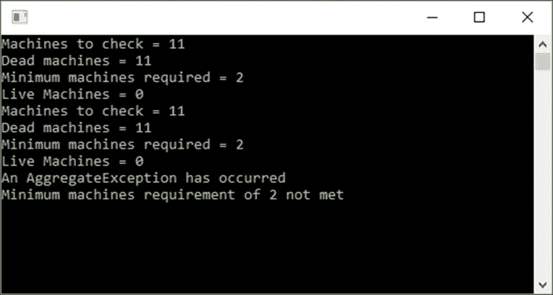

## 工作原理…

从控制台窗口输出中，你可以看到所需的最小在线机器数量没有达到。应用程序随后抛出了异常，并在`Parallel.ForEach`循环中捕获了它。能够处理此类并行循环中的异常对于通过处理发生的异常来维护应用程序的稳定性至关重要。

我们鼓励你稍微尝试一下`Parallel.ForEach`循环，并深入研究`AggregareException`类的内部方法，以更好地理解它。

# 调试多个线程

在 Visual Studio 中调试多个线程很棘手，尤其是这些线程都在同时运行。幸运的是，我们作为开发者有一些工具可以使用，以更好地了解我们的多线程应用程序中正在发生的事情。

## 准备工作

在调试多线程应用程序时，你可以通过在 Visual Studio 中转到**调试** | **窗口**来访问各种窗口。

## 如何操作…

1.  在代码中添加断点后开始调试你的多线程应用程序。你可以通过在 Visual Studio 中转到**调试** | **窗口**来访问各种调试窗口：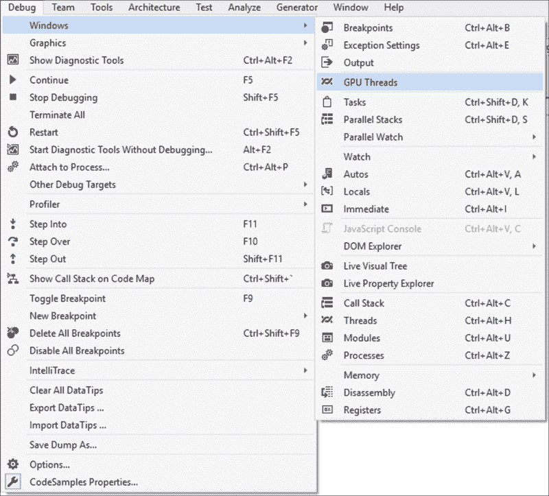

1.  可供你访问的第一个窗口是**线程**窗口。通过在 Visual Studio 中转到**调试** | **窗口**或按*Ctrl* + *Alt* + *H*来访问它。在这里，你可以右键单击一个线程来监视和标记它。如果你给你的线程命名了，你将在**名称**列中看到那个名称。要给你的线程命名，你可以在你的应用程序中添加以下代码，该代码在单独的线程上运行方法：

    ```cs
    int threadID = Thread.CurrentThread.ManagedThreadId;
    Thread.CurrentThread.Name = $"New Thread{threadID}";
    ```

    你还能够在调试器中看到当前活动的线程。它将被一个黄色箭头标记。然后是托管 ID，这是你之前用来创建唯一线程名称的相同 ID。

    **位置**列显示了线程当前所在的方法。**线程**窗口允许你通过双击**位置**字段来查看线程的堆栈。你还可以冻结和解冻线程。冻结会停止线程执行，而解冻允许冻结的线程正常继续：

    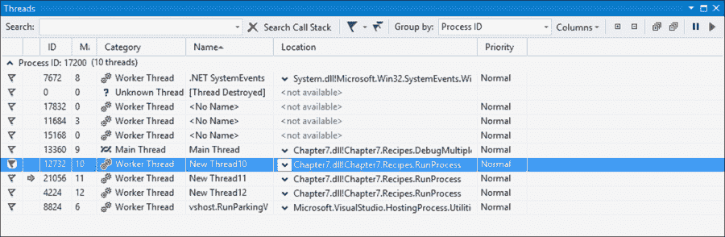

1.  **任务**窗口可以通过转到**调试** | **窗口**或按住*Ctrl* + *Shift* + *D*然后按*K*来访问。你会注意到在**线程**窗口中之前标记的线程在这里的**任务**窗口中也被标记了。任务的状态显示了那一刻的状态，可以是**活动**、**死锁**、**等待**、**已调度**或**完成**：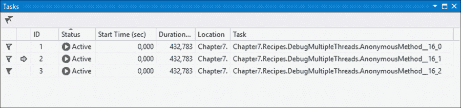

1.  **并行堆栈**窗口可以通过在 Visual Studio 中转到**调试** | **窗口**或按住*Ctrl* + *Shift* + *D*，然后按*S*键来访问。在这里，你可以看到任务和线程的图形视图。你可以在**并行堆栈**窗口的右上角的下拉列表中选择，在**线程**和**任务**视图之间切换：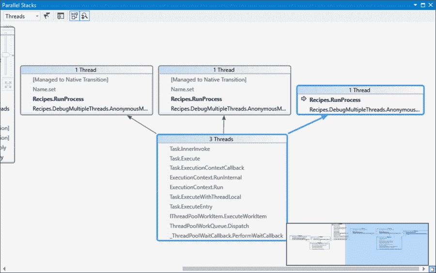

1.  将选择更改为**任务**将显示调试会话中的当前任务：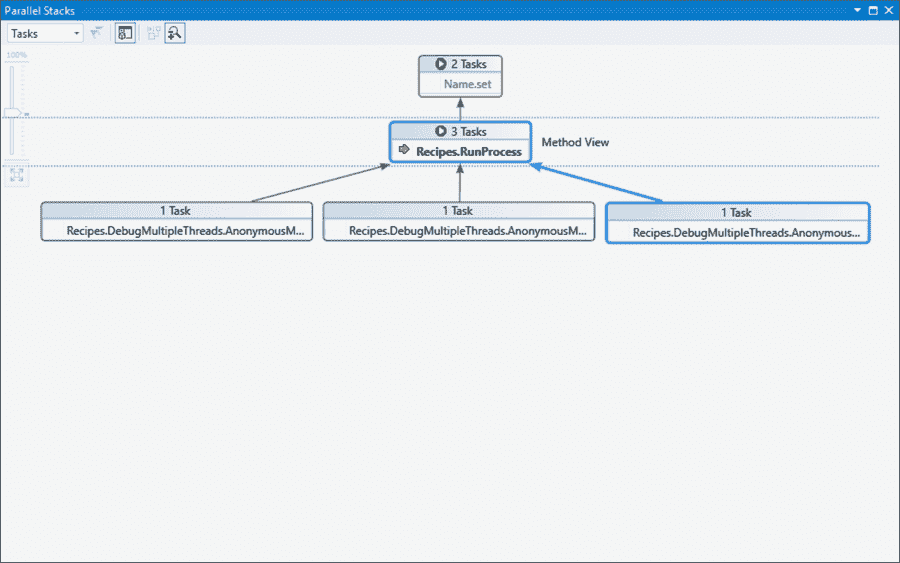

1.  下一个窗口，无疑是我最喜欢的，是**并行监视**窗口。实际上，它与 Visual Studio 中的标准**监视**窗口相同，但这是监视应用程序中所有线程的值。你可以在**并行监视**中输入任何有效的 C#表达式，并看到在调试会话中的那一刻的值。正如你所看到的，我们添加了`sleepSeconds`变量和线程名称到监视中：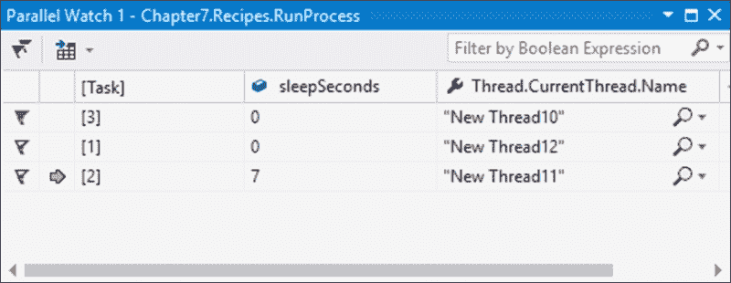

## 它是如何工作的…

能够在 Visual Studio 中有效地使用多线程应用的调试工具，使您更容易理解您应用程序的结构，并帮助您识别可能的错误、瓶颈和关注区域。

我们鼓励您了解您可用的各种调试窗口。
