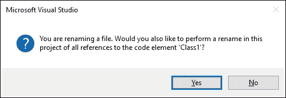
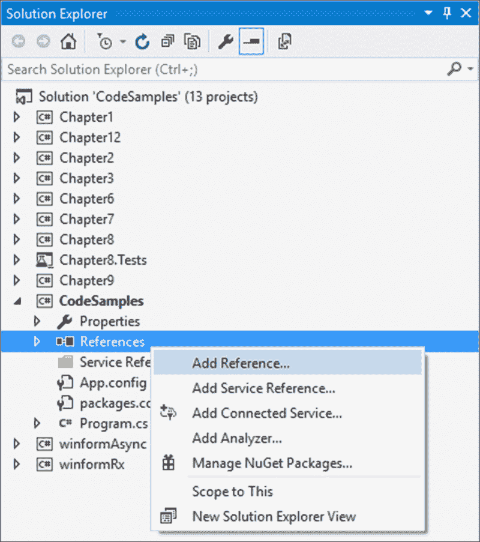
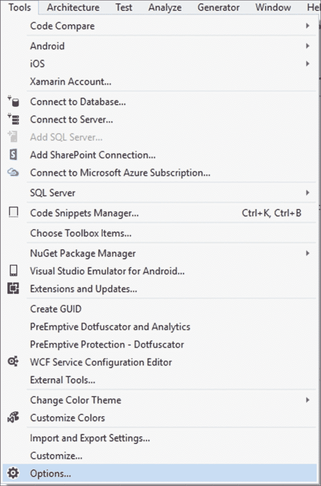

# 第十二章。在 Visual Studio 中编写安全代码和调试

在本章中，我们将探讨一些作为开发者提高调试代码效率的示例。我们还将探讨如何编写安全代码。编写安全代码可能是一个挑战，但考虑以下情况：如果你的代码安全部分涉及确保密码被安全存储，为什么要在项目之间反复编写相同的代码？编写一次代码，并在你创建的每个新项目中实施它。我们将探讨的概念如下：

+   正确加密和存储密码

+   在代码中使用 `SecureString`

+   保护 `App.config`/`web.config` 中的敏感部分

+   防止 SQL 注入攻击

+   使用 **诊断工具** 和 **历史调试**

+   设置条件断点

+   使用 **PerfTips** 识别代码中的瓶颈

# 简介

许多开发者往往忽略的是编写安全代码的需求。开发截止日期和其他项目相关压力导致开发者将交付代码置于正确执行之上。你们中许多人可能不同意我的观点，但请相信我，我已经多次听到“我们没有预算做这件事”的借口。这通常是在开发预算由其他利益相关者确定，而开发者没有被咨询的情况下发生的。

考虑这样一种情况，顾问告诉开发者他们已经向客户销售了一个系统。现在需要开发这个系统。此外，开发者被告知他们有 *x* 小时的时间来完成开发。给开发者一份概述要求的文档，并允许开发者开始，并在规定的时间内完成开发。

这种场景是许多开发者面临的现实。你可能认为这种场景根本不可能存在，或者也许你正在阅读这篇文章，并认为这个场景与你公司当前的工作流程相符。无论情况如何，这是软件开发中今天正在发生的事情。

那么开发者如何应对项目自杀？（我之所以这样称呼这些项目，是因为以这种方式处理的项目很少能成功。）首先，创建可重用代码。想想那些你经常重复执行到足以编写可重用 DLL 的过程。你知道你可以创建 Visual Studio 模板吗？如果你有一个你经常使用的标准项目结构，从它创建一个模板，并在每个新项目中重用它，从而加快交付速度并减少错误。

对于项目模板的一些考虑包括数据库层、安全层、常见验证代码（这个数据表是否包含任何数据）、常见扩展方法等。

# 正确加密和存储密码

我经常看到的是存储不当的密码。仅仅因为密码存储在你的服务器上的数据库中，并不意味着它是安全的。那么存储不当的密码是什么样的呢？


存储不当的安全密码不再安全。上一张截图中的密码是实际的用户密码。在登录屏幕上输入第一个密码 `^tj_Y4$g1!8LkD` 将允许用户访问系统。密码应安全地存储在数据库中。实际上，你需要使用加盐密码散列。你应该能够加密用户的密码，但永远不要解密它。

那么你如何解密密码以匹配用户在登录屏幕上输入的密码呢？好吧，你不需要。你总是对用户在登录屏幕上输入的密码进行散列。如果它与数据库中存储的实际密码的散列值匹配，你就允许他们访问系统。

## 准备工作

本食谱中的 SQL 表仅用于说明，代码中并未写入。数据库可以在与本书源代码一起提供的 `_database scripts` 文件夹中找到。

## 如何操作…

1.  通过在解决方案上右键单击，创建一个新的类库，然后从上下文菜单中选择 **添加** 和 **新建项目**：

1.  从**添加新项目**对话框屏幕中，从已安装的模板中选择**类库**，并将你的类命名为`Chapter12`：

1.  你新的类库将以默认名称 `Class1.cs` 添加到你的解决方案中，我们将其重命名为 `Recipes.cs` 以便正确区分代码。然而，如果你觉得这样更有意义，你可以将类重命名为你喜欢的任何名称。

1.  要重命名你的类，只需在 **解决方案资源管理器** 中单击类名，然后从上下文菜单中选择 **重命名**：

1.  Visual Studio 将要求你确认重命名项目中所有对代码元素 **Class1** 的引用。只需点击 **是**：

1.  以下类被添加到你的 `Chapter12` 库项目中：

    ```cs
    namespace Chapter12
    {
        public class Recipes
        {

        }
    }
    ```

1.  将以下 `using` 语句添加到你的类中：

    ```cs
    using System.Security.Cryptography;
    ```

1.  接下来，你需要向类中添加两个属性。这些属性将存储盐和散列。通常你会在数据库中将这些值与用户名一起写入，但为了本食谱的目的，我们将简单地将其添加到静态属性中。还要添加两个名为 `RegisterUser()` 和 `ValidateLogin()` 的方法。这两个方法都接受 `username` 和 `password` 变量作为参数：

    ```cs
    public static class Recipes
    {
        public static string saltValue { get; set; }
        public static string hashValue { get; set; }

        public static void RegisterUser(string password, string username)
        {

        }

        public static void ValidateLogin(string password, string username)
        {                  

        }
    }
    ```

1.  从 `RegisterUser()` 方法开始，这里我们做了很多事情。以下是方法中的步骤列表：

    1.  我们使用 `RNGCryptoServiceProvider` 生成一个真正随机、密码学上安全的盐值。

    1.  将盐添加到密码中，并使用 `SHA256` 对加盐密码进行散列。

        ### 注意

        你在添加盐之前还是之后添加都无关紧要。只需每次都保持一致即可。

    1.  将盐值和散列值与用户名一起存储在数据库中。

        ### 注意

        为了减少代码量，我实际上并没有添加代码将哈希值和盐值写入数据库。我只是将它们添加到之前创建的属性中。在现实世界中，你总是会将这些写入数据库。

        这是在你的应用程序中处理用户密码的一种非常安全的方式：

        ```cs
        public static void RegisterUser(string password, string username)
        {
            // Create a truly random salt using RNGCryptoServiceProvider.
            RNGCryptoServiceProvider csprng = new RNGCryptoServiceProvider();
            byte[] salt = new byte[32];
            csprng.GetBytes(salt);

            // Get the salt value
            saltValue = Convert.ToBase64String(salt);
            // Salt the password
            byte[] saltedPassword = Encoding.UTF8.GetBytes(saltValue + password);

            // Hash the salted password using SHA256
            SHA256Managed hashstring = new SHA256Managed();
            byte[] hash = hashstring.ComputeHash(saltedPassword);

            // Save both the salt and the hash in the user's database record.
            saltValue = Convert.ToBase64String(salt);
            hashValue = Convert.ToBase64String(hash);            
        }
        ```

1.  我们需要创建的下一个方法是`ValidateLogin()`方法。在这里，我们首先验证用户名。如果用户输入的用户名不正确，不要告诉他们。这将警告试图破坏系统的人他们有错误的用户名，并且一旦他们收到错误密码的通知，他们就会知道用户名是正确的。这个方法中的步骤如下：

    1.  从数据库中获取输入用户名的盐值和哈希值。

    1.  使用从数据库中读取的盐对登录屏幕上输入的用户密码进行盐化。

    1.  使用与用户注册时相同的哈希算法对加盐后的密码进行哈希处理。

    1.  将从数据库中读取的哈希值与在方法中生成的哈希值进行比较。如果两个哈希值匹配，则表示密码输入正确，用户已验证。

        注意，我们从未从数据库中解密密码。如果你有解密用户密码并匹配输入密码的代码，你需要重新考虑并重写你的密码逻辑。系统永远不应该能够解密用户密码。

        ```cs
        public static void ValidateLogin(string password, string username)
        {            
            // Read the user's salt value from the database
            string saltValueFromDB = saltValue;

            // Read the user's hash value from the database
            string hashValueFromDB = hashValue;

            byte[] saltedPassword = Encoding.UTF8.GetBytes(saltValueFromDB + password);

            // Hash the salted password using SHA256
            SHA256Managed hashstring = new SHA256Managed();
            byte[] hash = hashstring.ComputeHash(saltedPassword);

            string hashToCompare = Convert.ToBase64String(hash);

            if (hashValueFromDB.Equals(hashToCompare))
                Console.WriteLine("User Validated.");            
            else
                Console.WriteLine("Login credentials incorrect. User not validated.");            
        }
        ```

1.  为了测试代码，在你的`CodeSamples`项目中添加对`Chapter12`类的引用：

1.  因为我们已经创建了一个静态类，你可以在你的`Program.cs`文件中添加新的`using static`：

    ```cs
    using static Chapter12.Recipes;
    ```

1.  通过调用`RegisterUser()`方法并传入`username`和`password`变量来测试代码。之后，调用`ValidateLogin()`方法，看看密码是否与哈希值匹配。这显然不会在实际的生产系统中同时发生：

    ```cs
    string username = "dirk.strauss";
    string password = "^tj_Y4$g1!8LkD";
    RegisterUser(password, username);

    ValidateLogin(password, username);
    Console.ReadLine();
    ```

1.  当你调试代码时，你会看到用户已被验证：

1.  最后，稍微修改一下代码，将`password`变量设置为其他值。这将模拟用户输入错误密码的情况：

    ```cs
    string username = "dirk.strauss";
    string password = "^tj_Y4$g1!8LkD";
    RegisterUser(password, username);

    password = "WrongPassword";
    ValidateLogin(password, username);
    Console.ReadLine();
    ```

1.  当你调试应用程序时，你会看到用户没有被验证：

## 它是如何工作的…

在代码的任何地方，我们都没有解密密码。事实上，密码从未在任何地方存储过。我们总是与密码的哈希值一起工作。以下是这个菜谱中需要记住的重要点：

+   永远不要在 C#中使用`Random`类来生成你的盐。始终使用`RNGCryptoServiceProvider`类。

+   在你的代码中永远不要重复使用相同的盐。所以不要创建一个包含你的盐的常量，并使用它来对系统中所有的密码进行盐化。

+   如果密码不匹配，不要告诉用户密码错误。同样，也不要告诉用户他们输入了错误的用户名。这可以防止试图破坏系统的人知道他们正确地获得了两个登录凭证中的一个。如果用户名或密码输入错误，最好通知用户他们的登录凭证不正确。这可能意味着用户名或密码（或两者）输入错误。

+   您无法从数据库中存储的哈希值或盐值中获取密码。因此，如果数据库被破坏，其中存储的密码数据就不会处于风险之中。用户密码的加密是一个单向操作，这意味着它永远不能被解密。同样重要的是要注意，即使源代码被恶意意图的人窃取，您也无法使用该代码来解密数据库中的加密数据。

+   将之前的方法与强大的密码策略相结合（因为即使在 2016 年，仍然有用户认为使用`'l3tm31n'`作为密码就足够好了），您就拥有了一个非常好的密码加密流程。

当我们查看用户访问表时，存储用户凭据的正确方式看起来可能像这样：


盐值和哈希值与用户名一起存储，并且是安全的，因为它们不能被解密以暴露实际密码。

### 小贴士

如果您在互联网上注册一项服务，并且他们通过电子邮件或短信向您发送确认，并在该消息中以纯文本形式显示您的密码，那么您应该认真考虑关闭您的账户。如果一个系统可以读取您的密码并以纯文本形式将其发送给您，那么任何人都可以这样做。永远不要为所有登录使用相同的密码。

# 在代码中使用 SecureString

保护应用程序免受恶意攻击不是一项容易的任务。这是在编写安全代码的同时最小化错误（黑客通常利用这些错误）和黑帽编写越来越复杂的手段来破坏系统和网络之间的持续斗争。我个人认为，高等教育机构需要教给 IT 学生两件事：

+   如何使用和集成流行的 ERP 系统

+   正确的软件安全原则

事实上，我认为安全编程 101 不应该只是某个 IT 课程中的一个模块或主题，而应该是一个独立的课程。它需要得到应有的严肃和尊重，并且最好由能够实际入侵系统或网络的人来教授。

白帽教学生如何妥协系统、利用脆弱的代码和渗透网络，这将大大改变未来软件开发者对待编程的方式。这归结为开发者在进行防御性编程时知道不要做什么。完全有可能，其中一些学生可能会成为黑帽，但这与他们是否参加了关于安全编程黑客的课程无关。

## 准备工作

代码在某些地方可能看起来有点奇怪。这是因为 `SecureString` 正在使用非托管内存来存储敏感信息。请放心，`SecureString` 在 .NET Framework 中得到了很好的支持和使用，这可以从用于创建数据库连接的 `SqlCredential` 对象的实例化中看出：


## 如何操作…

1.  首先在您的解决方案中添加一个新的 Windows Forms 项目：

1.  将项目命名为 `winformSecure` 并单击 **确定** 按钮：

1.  在 **工具箱** 中搜索 **TextBox** 控件并将其添加到您的表单中：

1.  最后，在您的表单中添加一个按钮控件。您可以随意调整此表单的大小，使其看起来更像登录表单：

1.  在 Windows Forms 上选择文本框控件后，打开 **属性** 面板并单击事件按钮（看起来像闪电）。在 **键** 组中，双击 **KeyPress** 事件以在代码后创建处理程序：

    为您创建的代码是文本框控制的 **KeyPress** 事件处理程序。这将在用户按下键盘上的任何键时触发：

    ```cs
    private void textBox1_KeyPress(object sender, KeyPressEventArgs e)
    {

    }
    ```

1.  在 **属性** 面板中，展开 **行为** 组并将 **UseSystemPasswordChar** 的值更改为 `true`：

1.  在代码后，添加以下 `using` 语句：

    ```cs
    using System.Runtime.InteropServices;
    ```

1.  将 `SecureString` 变量作为全局变量添加到您的 Windows Forms 中：

    ```cs
    SecureString secure = new SecureString();
    ```

1.  然后在 `KeyPress` 事件中，每次用户按下键时，将 `KeyChar` 值追加到 `SecureString` 变量中。您可能想要添加代码来忽略某些按键，但这超出了本食谱的范围：

    ```cs
    private void textBox1_KeyPress(object sender, KeyPressEventArgs e)
    {
        secure.AppendChar(e.KeyChar);
    }
    ```

1.  然后在 **登录** 按钮的事件处理程序中，添加以下代码以从 `SecureString` 对象中读取值。我们正在处理非托管内存和非托管代码：

    ```cs
    private void btnLogin_Click(object sender, EventArgs e)
    {
        IntPtr unmanagedPtr = IntPtr.Zero;

        try
        {
            if (secure == null)
                throw new ArgumentNullException("Password not defined");
            unmanagedPtr = Marshal.SecureStringToGlobalAllocUnicode(secure);
            MessageBox.Show($"SecureString password to validate is {Marshal.PtrToStringUni(unmanagedPtr)}");
        }
        catch(Exception ex)
        {
            MessageBox.Show(ex.Message);
        }
        finally
        {
            Marshal.ZeroFreeGlobalAllocUnicode(unmanagedPtr);
            secure.Dispose();
        }
    }
    ```

1.  运行您的 Windows Forms 应用程序并输入一个密码：

1.  然后点击 **登录** 按钮。您将在消息框中看到您输入的密码：

## 它是如何工作的…

对于许多开发者来说，使用 `System.String` 来存储敏感信息，如密码，已经成为一种习惯。这种方法的缺点是 `System.String` 是不可变的。这意味着 `System.String` 在内存中创建的对象不能被更改。如果你修改了变量，就会在内存中创建一个新的对象。你也不能确定 `System.String` 创建的对象在垃圾回收期间何时会被从内存中移除。相反，通过使用 `SecureString` 对象，你可以加密敏感信息，当该对象不再需要时，它就会被从内存中删除。`SecureString` 在非托管内存中加密和解密你的敏感数据。

现在我需要在这里明确一点。`SecureString` 绝非万无一失。如果你的系统中存在一个专门用来破坏 `SecureString` 操作的病毒，使用它帮助不大（无论如何，请确保使用合适的反病毒软件）。在代码执行的过程中，你的密码（或敏感信息）的字符串表示形式是可见的。其次，如果黑客找到了一种方法来检查你的堆或记录你的按键，密码可能会被看到。然而，使用 `SecureString` 使得黑客的机会窗口变得更小。机会窗口的缩小是因为攻击向量（黑客的入口点）更少，从而减少了你的攻击面（黑客所有攻击点的总和）。

重要的是：`SecureString` 的存在是有原因的。作为一名关注安全的软件开发者，你应该使用 `SecureString`。

# 保护 App.config/web.config 的敏感部分

作为一名开发者，你无疑会处理诸如密码之类的敏感信息。你在开发过程中如何处理这些信息非常重要。过去，我曾收到一份客户的实时数据库副本用于测试。这对客户来说确实存在一个很大的安全风险。

通常，我们会在 `web.config` 文件中保存设置（当与网络应用程序一起工作时）。然而，在这个例子中，我将演示一个使用 `App.config` 文件的控制台应用程序。同样的逻辑也可以应用于 `web.config` 文件。

## 准备工作

创建控制台应用程序是演示这个菜谱的最快方式。如果你想要使用网络应用程序（并保护 `web.config` 文件）来跟随，你也可以这样做。

## 如何操作…

1.  在控制台应用程序中，找到 `App.config` 文件。这是包含敏感数据的文件：

1.  如果你打开 `App.config` 文件，你会看到在 `appSettings` 标签内添加了一个名为 `Secret` 的键。这些信息可能一开始就不应该放在 `App.config` 文件中。这里的问题可能是它可能会被提交到你的源代码控制中。想象一下在 GitHub 上会怎样？

    ```cs
    <?xml version="1.0" encoding="utf-8"?>
    <configuration>
        <startup> 
            <supportedRuntime version="v4.0" sku=".NETFramework,Version=v4.6.1"/>
        </startup>
        <appSettings>
          <add key="name" value="Dirk"/>
          <add key="lastname" value="Strauss"/> 
          <add key="Secret" value="letMeIn"/>
        </appSettings>
    </configuration>
    ```

1.  为了克服这种漏洞，我们需要将敏感数据从 `App.config` 文件移到另一个文件中。为此，我们指定一个包含我们想要从 `App.config` 文件中移除的敏感数据的文件路径：

    ```cs
    <appSettings file="C:\temp\secret\secret.config">
    ```

    ### 注意

    你可能想知道，为什么不直接加密信息呢？实际上，这确实是既定的。这个值以纯文本形式存在只是为了演示一个概念。在现实世界中，你可能会加密这个值。然而，你肯定不希望这些敏感信息以加密的形式存储在某个代码库的服务器上。请确保安全，将其从你的解决方案中移除。

1.  当你添加了安全文件的路径后，删除包含敏感信息的密钥：

1.  导航到 `App.config` 文件属性中指定的路径。创建你的 `secret.config` 文件并打开它进行编辑：

1.  在此文件中，重复 `appSettings` 部分，并将 `Secret` 密钥添加到其中。现在发生的情况是，当你的控制台应用程序运行时，它会读取解决方案中的 `appSettings` 部分，并找到对秘密文件的引用。然后它会查找秘密文件，并将其与解决方案中的 `App.config` 文件合并：

1.  为了验证这个合并是否成功，向你的控制台应用程序添加一个引用：

1.  搜索并添加 `System.Configuration` 到你的引用中：

1.  当你添加了引用后，你的解决方案引用应该看起来像这样：

1.  在你的 `Program.cs` 文件顶部添加以下 `using` 语句：

    ```cs
    using System.Configuration;
    ```

1.  将以下代码添加到读取 `Secret` 密钥设置的 `App.config` 文件中。这次，它将读取合并的文件，该文件由你的 `App.config` 和 `secret.config` 文件组成：

    ```cs
    string sSecret = ConfigurationManager.AppSettings["Secret"];
    Console.WriteLine(sSecret);
    Console.ReadLine();
    ```

1.  运行你的控制台应用程序，你会看到敏感数据已经从 `secret.config` 文件中读取，该文件在运行时与 `App.config` 文件合并：

## 它是如何工作的…

这里需要指出的是，这种技术也适用于 `web.config` 文件。如果你需要从配置文件中移除敏感信息，请将其移动到另一个文件，这样它就不会包含在源代码控制检查或部署中。

# 防止 SQL 注入攻击

SQL 注入攻击是一个非常现实的问题。有太多应用程序仍然容易受到这种攻击。如果你开发了一个网络应用程序或网站，你应该警惕不良的数据库操作。易受攻击的 SQL 注入暴露了数据库容易受到这种攻击。SQL 注入攻击是指攻击者通过网页表单输入框修改 SQL 语句，以产生与最初意图不同的结果。这通常发生在网络应用程序应该访问数据库以验证用户登录的表单上。如果不清理用户输入，你将使你的数据容易受到这种攻击的利用。

缓解 SQL 注入攻击的接受解决方案是创建一个参数化存储过程，并从你的代码中调用它。

## 准备工作

在继续本菜谱之前，你需要在 SQL Server 中创建 `CookbookDB` 数据库。你可以在附带的源代码中的 `_database scripts` 文件夹中找到脚本。

## 如何操作…

1.  对于这个菜谱，我使用的是 SQL Server 2012。如果你使用的是更早版本的 SQL Server，概念是相同的。在你创建了 `CookbookDB` 数据库之后，你会在 `Tables` 文件夹下看到一个名为 `UserDisplayData` 的表：

1.  `UserDisplayData` 表仅用于说明使用参数化存储过程查询的概念。在生产数据库中，它没有任何实际的好处，因为它只返回一个屏幕名称：

1.  我们需要创建一个存储过程来从表中选择特定 ID（用户 ID）的数据。点击 `Programmability` 节点以展开它：

1.  接下来，右键单击 `Stored Procedures` 节点，并从上下文菜单中选择 **New Stored Procedure…**：

1.  SQL Server 将为你创建以下存储过程模板。这个模板包括一个可以注释特定存储过程的区域，以及一个可以添加你可能需要的参数的区域，以及显然你需要添加实际 SQL 语句的区域：

    ```cs
    SET ANSI_NULLS ON
    GO
    SET QUOTED_IDENTIFIER ON
    GO
    -- =============================================
    -- Author:          <Author,,Name>
    -- Create date:      <Create Date,,>
    -- Description:      <Description,,>
    -- =============================================
    CREATE PROCEDURE <Procedure_Name, sysname, ProcedureName> 
        -- Add the parameters for the stored procedure here
        <@Param1, sysname, @p1> <Datatype_For_Param1, , int> = <Default_Value_For_Param1, , 0>, 
        <@Param2, sysname, @p2> <Datatype_For_Param2, , int> = <Default_Value_For_Param2, , 0>
    AS
    BEGIN
        -- SET NOCOUNT ON added to prevent extra result sets from
        -- interfering with SELECT statements.
        SET NOCOUNT ON;

        -- Insert statements for procedure here
        SELECT <@Param1, sysname, @p1>, <@Param2, sysname, @p2>
    END
    GO
    ```

1.  给存储过程一个合适的名称，以描述存储过程的行为或意图：

    ```cs
    CREATE PROCEDURE cb_ReadCurrentUserDisplayData
    ```

    ### 注意

    有很多人在他们的存储过程前加上前缀，我也是其中之一。我喜欢将我的存储过程分组。因此，我按照格式 *[prefix]_[tablename_or_module]_[stored_procedure_action]* 命名我的存储过程。话虽如此，我通常避免在我的存储过程中使用 `sp_` 作为前缀。互联网上有许多关于为什么这是一个坏主意的意见。普遍认为，使用 `sp_` 作为存储过程前缀会影响性能，因为它在 master 数据库中用作存储过程前缀。

    为了本菜谱的目的，我只为存储过程保留了简单的名称。

1.  为此存储过程定义一个参数。通过这样做，你是在告诉数据库，当调用此存储过程时，它将通过一个存储在参数调用 `@userID` 中的整数值传递：

    ```cs
    @userID INT
    ```

1.  你现在定义此存储过程要使用的 SQL 语句。我们只是做一个简单的 `SELECT` 语句：

    ```cs
    SELECT
       Firstname, Lastname, Displayname
    FROM
       dbo.UserDisplayData
    WHERE
       ID = @userID
    ```

    ### 注意

    你会注意到我的 `SELECT` 语句包含特定的列名，而不是使用 `SELECT * FROM`。使用 `SELECT *` 被认为是坏习惯。你通常不希望从表中返回所有列的值。如果你想要所有列的值，那么最好通过名称显式列出列，而不是获取所有列。

    使用 `SELECT *` 会返回不必要的列，并增加服务器上的开销。这在更大的范围内确实有影响，尤其是在数据库开始大量流量时。

    想要为大型表输入列名的想法绝对不是我会期待的事情。然而，你可以使用以下技巧来简化将列名添加到你的 SQL `SELECT` 语句的过程。你可以在数据库表上右键单击并选择 **Script Table As** 来创建几个 SQL 语句之一。其次，你可以展开 `Table` 节点并展开你想要编写语句的表。然后，你会看到一个名为 `Columns` 的节点。将 `Columns` 节点拖放到查询编辑器中。这将自动将所有列名插入到查询编辑器中。

1.  当你完成将代码添加到存储过程后，它看起来会是这样：

1.  要创建存储过程，你需要单击 **Execute** 按钮。确保在单击 **Execute** 按钮时已选择正确的数据库：

1.  存储过程将在 SQL Server 的 `Stored Procedures` 节点下创建：

1.  我们现在已经完成了这个任务的一半。现在是时候构建我们将在应用程序中用于查询数据库的代码了。我们将直接将此代码添加到控制台应用程序的 `Program.cs` 文件中。虽然这段代码不被认为是最佳实践（硬编码服务器凭据），但它仅仅是为了说明从 C# 调用参数化存储过程的原理。

1.  首先，将以下 `using` 语句添加到控制台应用程序的顶部：

    ```cs
    using System.Data.SqlClient;
    ```

1.  然后，我们添加变量来包含我们需要登录服务器的凭据：

    ```cs
    int intUserID = 1;
    int cmdTimeout = 15;
    string server = "DIRK";
    string db = "CookbookDB";
    string uid = "dirk";
    string password = "uR^GP2ABG19@!R";
    ```

1.  我们现在使用 `SecureString` 来存储密码并将其添加到 `SqlCredential` 对象中：

    ```cs
    SecureString secpw = new SecureString();
    if (password.Length > 0)
    {
        foreach (var c in password.ToCharArray()) secpw.AppendChar(c);
    }
    secpw.MakeReadOnly();

    string dbConn = $"Data Source={server};Initial Catalog={db};";
    6SqlCredential cred = new SqlCredential(uid, secpw);
    ```

    ### 注意

    更多关于 `SecureString` 的信息，请参阅本章的 *在代码中使用 SecureString* 菜单。

1.  现在，我们在 `using` 语句内部创建一个 `SqlConnection` 对象。这确保了当 `using` 语句超出作用域时，SQL 连接将被关闭：

    ```cs
    using (SqlConnection conn = new SqlConnection(dbConn, cred))
    {                
        try
        {

        }
        catch (Exception ex)
        {
            Console.WriteLine(ex.Message);
        }
    }
    Console.ReadLine();
    ```

1.  在`try`块中，添加以下代码以打开连接字符串并创建一个`SqlCommand`对象，该对象接受打开的连接和存储过程的名称作为参数。你可以使用创建实际 SQL 参数的快捷方法将其传递给存储过程：

    ```cs
    cmd.Parameters.Add("userID", SqlDbType.Int).Value = intUserID;
    ```

    因为我只是向存储过程传递一个整型参数，所以我没有为这个参数定义长度：

    

    然而，如果你需要定义一个类型为`VarChar(MAX)`的参数，你需要通过添加`-1`来定义参数类型的大小。例如，如果你需要将学生的论文存储到数据库中，那么对于`VarChar(MAX)`的代码将如下所示：

    ```cs
    cmd.Parameters.Add("essay", SqlDbType.VarChar, -1).Value = essayValue;
    ```

1.  在我们将参数及其值添加到`SqlCommand`对象之后，我们指定一个超时值，执行`SqlDataReader`，并将其加载到`DataTable`中。然后，该值被输出到控制台应用程序：

    ```cs
    conn.Open();
    SqlCommand cmd = new SqlCommand("cb_ReadCurrentUserDisplayData", conn);
    cmd.CommandType = CommandType.StoredProcedure;
    cmd.Parameters.Add("userID", SqlDbType.Int).Value = intUserID;
    cmd.CommandTimeout = cmdTimeout;
    var returnData = cmd.ExecuteReader();
    var dtData = new DataTable();
    dtData.Load(returnData);

    if (dtData.Rows.Count != 0)
         Console.WriteLine(dtData.Rows[0]["Displayname"]);
    ```

1.  在你将所有代码添加到控制台应用程序之后，正确的完整代码将如下所示：

    ```cs
    int intUserID = 1;
    int cmdTimeout = 15;
    string server = "DIRK";
    string db = "CookbookDB";
    string uid = "dirk";
    string password = "uR^GP2ABG19@!R";
    SecureString secpw = new SecureString();
    if (password.Length > 0)
    {
        foreach (var c in password.ToCharArray()) secpw.AppendChar(c);
    }
    secpw.MakeReadOnly();

    string dbConn = $"Data Source={server};Initial Catalog={db};";

    SqlCredential cred = new SqlCredential(uid, secpw);
    using (SqlConnection conn = new SqlConnection(dbConn, cred))
    {                
        try
        {
            conn.Open();
            SqlCommand cmd = new SqlCommand("cb_ReadCurrentUserDisplayData", conn);
            cmd.CommandType = CommandType.StoredProcedure;
            cmd.Parameters.Add("userID", SqlDbType.Int).Value = intUserID;
            cmd.CommandTimeout = cmdTimeout;
            var returnData = cmd.ExecuteReader();
            var dtData = new DataTable();
            dtData.Load(returnData);
            if (dtData.Rows.Count != 0)
            Console.WriteLine(dtData.Rows[0]["Displayname"]);

        }
        catch (Exception ex)
        {
            Console.WriteLine(ex.Message);
        }
    }
    Console.ReadLine();
    ```

1.  运行你的控制台应用程序，你将看到显示名称输出到屏幕上：

## 它是如何工作的…

通过创建参数化 SQL 查询，编译器在运行 SQL 语句之前正确地替换了参数。它将防止恶意数据更改你的 SQL 语句以实现恶意结果。这是因为`SqlCommand`对象不会直接将参数值插入到语句中。

总结一下，使用参数化存储过程意味着不再有“小鲍比·表格”的问题。

# 使用诊断工具和历史调试

这个可靠的旧虫子已经成为了软件开发者和工程师们超过 140 年的噩梦。是的，你没有看错。实际上，是托马斯·爱迪生在 19 世纪 70 年代末提出了“bug”这个术语。这个词出现在他许多笔记本条目中，例如，他描述了白炽灯泡仍然有许多“bug”未解决。

他调试发明的努力是非常传奇的。考虑一下，一个已经六十多岁的男人需要工作 112 小时的工作周，这需要多大的真金不怕火炼和决心。他和他的七人团队（有一个常见的误解，认为只有六个人，因为第七个人没有出现在团队照片中）在 5 周的艰苦工作中几乎没睡过觉，因此被称为“失眠小队”。

现在，由于技术的进步，软件开发者可以拥有大量的调试工具（在 Visual Studio 内部和外部）可供使用。那么调试真的重要吗？当然很重要。它是我们作为软件开发者所做的一部分。如果我们不调试，那么这里有一些例子：

+   在 2004 年，英国**电子数据系统公司**（**EDS**）的儿童抚养金系统向近 200 万人多付了抚养金，向近 100 万人少付了抚养金，导致数十亿美元的抚养金未能收回。EDS 与它依赖的另一个系统之间的不兼容性导致纳税人损失了钱财，并负面影响了许多单身父母的生活。

+   2012 年苹果地图的首次发布。无需多言。尽管对许多人来说令人困惑，但我仍然在陌生的城市或地区使用谷歌地图进行路线导航。

+   Therac-25 放射治疗机使用电子束靶向患者的肿瘤。不幸的是，软件中的竞争条件导致机器向几位患者提供了致命的过量辐射。

在互联网上可以找到许多影响数百万人的软件缺陷的例子。我们不仅仅是在谈论普通的缺陷。有时我们面临的是看似无法克服的问题。知道如何使用一些可用工具的安慰，是稳定应用程序和完全无法使用应用程序之间的区别。

## 准备中

到我写这篇文章的时候，IntelliTrace 仅在 Visual Studio 2015 Enterprise 中可用。然而，IntelliTrace 并不是 Visual Studio 的新特性。自 Visual Studio 2010 以来，它已经随着时间的推移发展成我们今天所拥有的功能。

## 如何操作…

1.  首先，转到**工具** | **选项**：

1.  展开 IntelliTrace 节点并点击**常规**。确保**启用 IntelliTrace**被勾选。同时，确保**IntelliTrace 事件和调用信息**选项被选中。点击**确定**：

1.  在`Recipes.cs`文件中，你可能需要添加以下`using`语句：

    ```cs
    using System.Diagnostics;
    using System.Reflection;
    using System.IO;
    ```

1.  向`Recipes`类添加一个名为`ErrorInception()`的方法。同时，添加读取基本路径的代码，并假设存在一个名为`log`的文件夹。不要在你的硬盘上创建此文件夹。我们希望抛出一个异常。最后，添加另一个名为`LogException()`的方法，它不做任何事情：

    ```cs
    public static void ErrorInception()
    {
        string basepath = Path.GetDirectoryName (Assembly.GetEntryAssembly().Location);
        var full = Path.Combine(basepath, "log");
    }

    private static void LogException(string message)
    {

    }
    ```

1.  在确定完整路径后，将以下代码添加到`ErrorInception()`方法中。这里我们正在尝试打开日志文件。这就是异常将发生的地方：

    ```cs
    try
    {
        for (int i = 0; i <= 3; i++)
        {
            // do work
            File.Open($"{full}\\log.txt", FileMode.Append);
        }
    }
    catch (Exception ex)
    {
        StackTrace st = new StackTrace();
        StackFrame sf = st.GetFrame(0);
        MethodBase currentMethodName = sf.GetMethod();
        ex.Data.Add("Date", DateTime.Now);
        LogException(ex.Message);
    }
    ```

1.  当你添加了所有代码后，你的代码应该看起来像这样：

    ```cs
    public static void ErrorInception()
    {
        string basepath = Path.GetDirectoryName(Assembly.GetEntryAssembly().Location);
        var full = Path.Combine(basepath, "log");

        try
        {
            for (int i = 0; i <= 3; i++)
            {
                // do work
                File.Open($"{full}\\log.txt", FileMode.Append);
            }
        }
        catch (Exception ex)
        {
            StackTrace st = new StackTrace();
            StackFrame sf = st.GetFrame(0);
            MethodBase currentMethodName = sf.GetMethod();
            ex.Data.Add("Date", DateTime.Now);
            LogException(ex.Message);
        }
    }

    private static void LogException(string message)
    {

    }
    ```

1.  在`Program.cs`文件中，调用`ErrorInception()`方法。紧接着，执行`Console.ReadLine()`，以便我们的控制台应用程序在此处暂停。不要在你的代码中添加任何断点：

    ```cs
    ErrorInception();
    Console.ReadLine();
    ```

1.  开始调试你的应用程序。异常被抛出，应用程序继续运行，这是在更复杂的应用程序中经常遇到的情况。在这个时候，你可能会期望日志文件附加了应用程序的虚构数据，但什么也没有发生。正是在这个时候，你停止应用程序，并在你的代码中到处添加断点，进行一种试错练习。我说试错，因为你可能不知道错误的确切位置。如果你的代码文件包含几千行代码，这种情况尤其如此。

    好吧，现在，有了 IntelliTrace 和历史调试，你只需要点击**Break All**按钮：

    

1.  你的应用程序现在基本上是暂停的。如果你看不到**诊断工具**窗口，请转到**调试**并点击**显示诊断工具**（或*Ctrl* + *Alt* + *F2*）：

1.  Visual Studio 现在显示**诊断工具**窗口。立即你可以看到在**事件**部分由红色菱形图标指示的问题。在底部的**事件**选项卡中，你可以点击异常：

1.  做这件事可以扩展异常详细信息，你可以看到日志文件未找到。然而，Visual Studio 在历史调试方面更进一步：

1.  你会在异常详细信息底部看到一个链接，上面写着**激活历史调试**。点击此链接。这允许你在代码编辑器中看到导致此异常的实际代码行。它还允许你在**局部变量**窗口、调用堆栈和其他窗口中查看应用程序的状态历史。现在你可以在代码编辑器中看到导致异常的具体代码行。在**局部变量**窗口中，你还可以看到应用程序用来查找日志文件的路径。这种调试体验非常强大，允许开发者直接找到错误的源头。这导致生产力的提高和更好的代码：

## 它是如何工作的…

那么，这里的关键点是什么？如果你只能记住一件事，那就记住这一点。一旦你的系统用户因为 bug 而失去对该系统能力和潜力的信心，这种信心几乎无法恢复。即使你从 bug 和其他问题中恢复你的系统，重新启动它，并生产出一个无瑕疵的产品，用户也不会轻易被说服。这是因为在他们心中，系统是有 bug 的。

我曾经接管了一个由即将离职的高级开发者部分开发完成的系统。她有一个优秀的规范和一个展示给客户的良好展示的原型。唯一的问题是她在系统第一阶段实施后不久就离开了公司。当 bug 开始出现时，客户自然要求她提供帮助。

告诉客户，负责与客户建立关系的开发者（一直负责构建这种关系）已经离开公司，这对建立信心并没有好处。在这个特定项目中，只有一个开发者参与本身就是第一个错误。

其次，第二阶段将由我亲自开发，我也是唯一被分配给这个客户的开发者。这必须在构建在存在问题的第一阶段之上时完成。所以我一边修复错误，一边为系统开发新功能。幸运的是，这次我有一个叫罗里·谢尔顿的出色项目经理作为我的助手。我们一起跳进了深水区，罗里在管理客户的期望方面做得非常出色，同时对我们面临挑战的透明度也做得很好。

不幸的是，用户已经对提供的系统感到失望，并且不相信软件。这种信任从未完全恢复。如果我们早在 2007 年就有 IntelliTrace 和历史调试，我肯定能够追踪到一个对我来说不熟悉的代码库中的问题。

总是调试你的软件。当你发现没有更多的错误时，再次调试它。然后把系统给我的妈妈（爱你妈妈）。作为该系统的开发者，你知道哪些按钮要点击，哪些数据要输入，以及事情需要发生的顺序。我的妈妈不知道，我可以向你保证，一个不熟悉系统的用户可以比你能煮一杯新鲜咖啡更快地破坏它。

Visual Studio 为开发者提供了一套非常强大且功能丰富的调试工具。使用它们。

# 设置条件断点

条件断点是调试中的另一个隐藏的宝石。这些允许你指定一个或多个条件。当这些条件之一满足时，代码将在断点处停止。使用条件断点非常简单。

## 准备工作

使用这个配方，你不需要特别准备任何东西。

## 如何做…

1.  将以下代码添加到你的 `Program.cs` 文件中。我们只是创建了一个整数列表并遍历该列表：

    ```cs
    List<int> myList = new List<int>() { 1, 4, 6, 9, 11 };
    foreach(int num in myList)
    {
        Console.WriteLine(num);
    }
    Console.ReadLine();
    ```

1.  接下来，在循环内的 `Console.WriteLine(num)` 代码行上放置一个断点：

1.  右键单击断点并从上下文菜单中选择 **条件…**：

1.  现在，你会看到 Visual Studio 打开一个 **断点设置** 窗口。在这里，我们指定只有当 `num` 的值为 `9` 时，断点才需要被触发。你可以添加多个条件并指定不同的条件。条件逻辑非常灵活：

1.  调试你的控制台应用程序。你会看到当断点被触发时，`num` 的值是 `9`：

## 它是如何工作的…

条件在每次循环时都会被评估。当条件为真时，断点将被触发。在本食谱中展示的示例中，条件断点的真正好处有些被忽略了，因为它是一个非常小的列表。但考虑一下。您正在绑定一个数据网格。网格中的项目根据项目状态被赋予特定的图标。由于这是一个分层网格，您的网格包含数百个项目。您识别出绑定到网格的项目的主 ID。然后，将此主 ID 传递给其他代码逻辑以确定状态，该状态决定了显示的图标。

通过数百次循环来调试并按下 *F10* 键在任何情况下都是没有效率的。使用条件断点，您可以为主 ID 指定一个值，并且只有当循环达到该值时才会中断。然后您可以直接跳转到显示不正确的项目。

# 使用 PerfTips 识别代码中的瓶颈

PerfTips 一定是 Visual Studio 2015 中我最喜欢的功能之一。解释它们的作用并不能真正公正地对待它们。您必须看到它们在实际操作中的效果。

## 准备工作

不要将 PerfTips 与 CodeLens 混淆。PerfTips 是 Visual Studio 中与 CodeLens 不同的独立选项。

## 如何操作...

1.  PerfTips 默认启用。但以防您没有看到任何 PerfTips，请转到 **工具** | **选项**，并展开 **调试** 节点。在 **常规** 下，设置页面底部，您将看到一个名为 **在调试时显示已过时间 PerfTip** 的选项。确保此选项被选中：

1.  我们将创建一些简单的模拟长时间运行任务的方法。为此，我们只需让线程休眠几秒钟。在 `Recipes.cs` 文件中，添加以下代码：

    ```cs
    public static void RunFastTask()
    {
        RunLongerTask();
    }

    private static void RunLongerTask()
    {
        Thread.Sleep(3000);
        BottleNeck();
    }

    private static void BottleNeck()
    {
        Thread.Sleep(8000);
    }
    ```

1.  在您的控制台应用程序中，调用静态方法 `RunFastTask()` 并在此行代码上放置断点：

    ```cs
    RunFastTask();
    Thread.Sleep(1000);
    ```

1.  开始调试您的控制台应用程序。您的断点将停在 `RunFastTask()` 方法上。按 *F10* 跳过此方法：

1.  您会注意到 11 秒后，下一行将被突出显示，并显示 PerfTip。PerfTip 显示了上一行代码执行所需的时间。因此，现在位于 `Thread.Sleep` 上的调试器显示 `RunFastTask()` 方法花费了 11 秒来完成。显然，这个任务并不快：

1.  步入 `RunFastTask()` 方法，您可以放置更多的断点并逐个跳过它们以找到导致最长延迟的方法。正如您所看到的，PerfTips 允许开发者快速轻松地识别代码中的瓶颈：

## 它是如何工作的…

市面上有许多工具可以进行这项操作以及更多，让开发者能够查看各种代码指标。然而，PerfTips 允许你在按照常规调试任务逐步执行代码时即时查看问题。在我看来，它是一个不可或缺的调试工具。
