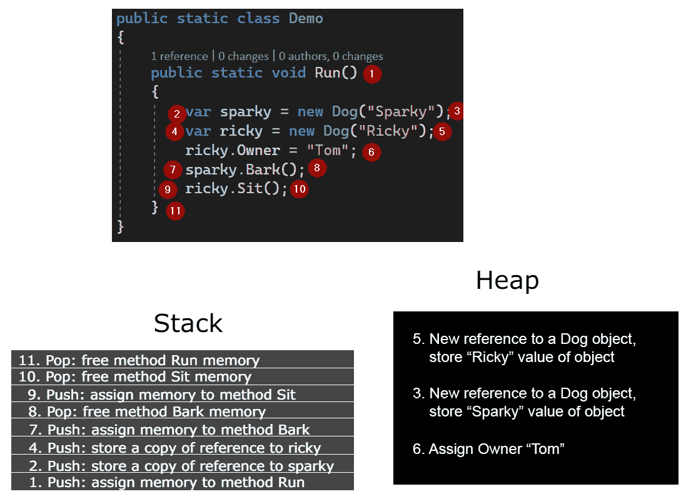

# 2. 构建高质量面向对象代码

概述

在本章中，你将学习如何使用面向对象编程（OOP）简化复杂逻辑。你将首先创建类和对象，然后探索 OOP 的四个支柱。接着，你将了解一些编码的最佳实践，即所谓的 SOLID 原则，并了解如何使用 C# 10 特性来根据这些原则编写有效的代码。到本章结束时，你将能够使用 C#面向对象设计编写干净的代码。

# 简介

人们如何编写即使经过几十年仍然可维护的软件？在现实世界概念周围建模软件的最佳方式是什么？这两个问题的答案都是面向对象编程（OOP）。OOP 是专业编程中广泛使用的一种范式，在企业环境中尤其有用。

面向对象编程（OOP）可以被视为连接现实世界概念和源代码的桥梁。例如，一只猫具有某些定义属性，如年龄、毛色、眼色和名字。天气可以用温度和湿度等因素来描述。这两个都是人类在长时间内识别和定义的现实世界概念。在 OOP 中，类是帮助定义程序逻辑的东西。当将这些类的属性赋予具体值时，结果就是一个对象。例如，使用 OOP，你可以定义一个表示房屋中房间的类，然后为其属性（颜色和面积）赋值以创建该类的对象。

在*第一章*，*Hello C#*中，你学习了如何使用 C#编写基本程序。在本章中，你将看到如何通过实现 OOP 概念和使用 C#的最佳方式来设计你的代码。

# 类和对象

一个类就像一个描述概念的蓝图。另一方面，对象是在应用这个蓝图后得到的结果。例如，`weather`可以是一个类，而`25 degrees and` `cloudless`可以指这个类的对象。同样，你可以有一个名为`Dog`的类，而一只四岁的`Spaniel`可以代表`Dog`类的对象。

在 C#中声明一个类很简单。它以`class`关键字开始，后面跟着类名和一对花括号。要定义一个名为`Dog`的类，你可以编写以下代码：

```cs
class Dog
{
}
```

目前，这个类只是一个空的骨架。然而，它仍然可以通过使用`new`关键字来创建对象，如下所示：

```cs
Dog dog = new Dog();
```

这创建了一个名为`dog`的对象。目前，这个对象是一个空壳，因为它缺少属性。你将在接下来的部分中看到如何为类定义属性，但首先，你将探索构造函数。

# 构造函数

在 C#中，构造函数是用于创建新对象的函数。您还可以使用它们来设置对象的初始值。像任何函数一样，构造函数有一个名称，接受参数，并且可以重载。一个类必须至少有一个构造函数，但如果需要，它可以有多个具有不同参数的构造函数。即使您没有显式定义单个构造函数，类仍然有一个默认构造函数——它不接受任何参数或执行任何操作，只是为新建的对象及其字段分配内存。

考虑以下代码片段，其中正在声明`Dog`类的构造函数：

```cs
// Within a class named Dog
public class Dog
{
  // Constructor
  public Dog()
  {
    Console.WriteLine("A Dog object has been created");
  }
}
```

注意

您可以在[`packt.link/H2lUF`](https://packt.link/H2lUF)找到用于此示例的代码。您可以在[`packt.link/4WoSX`](https://packt.link/4WoSX)找到代码的用法。

如果一个方法与类的名称相同且不提供`return`类型，则它是一个构造函数。在这里，代码片段位于名为`Dog`的类中。因此，构造函数位于指定的代码行内。请注意，通过显式定义此构造函数，您隐藏了默认构造函数。如果有一个或多个这样的自定义构造函数，您将无法再使用默认构造函数。一旦调用新的构造函数，您应该看到控制台打印出此消息：“已创建一个 Dog 对象”。

## 字段和类成员

您已经知道什么是变量：它有一个类型、一个名称和一个值，正如您在*第一章*，*Hello C#*中看到的。变量也可以存在于类作用域中，这样的变量被称为字段。声明一个字段就像声明一个局部变量一样简单。唯一的区别是在开始时添加一个关键字，即访问修饰符。例如，您可以使用公共访问修饰符在`Dog`类中声明一个字段，如下所示：

```cs
public string Name = "unnamed";
```

这行代码表示，`Name`字段，其值是一个字符串`"unnamed"`，可以公开访问。除了`public`之外，C#中的其他两个主要访问修饰符是`private`和`protected`，你将在稍后详细了解它们。

注意

您可以在[`docs.microsoft.com/en-us/dotnet/csharp/language-reference/keywords/access-modifiers.`](https://docs.microsoft.com/en-us/dotnet/csharp/language-reference/keywords/access-modifiers.)找到有关访问修饰符的更多信息。

类所持有的所有内容都称为类成员。类成员可以从类外部访问；然而，这种访问需要使用`public`访问修饰符显式授权。默认情况下，所有成员都具有`private`访问修饰符。

您可以通过编写对象名称后跟一个点（`.`）和成员名称来访问类成员。例如，考虑以下代码片段，其中创建了两个`Dog`类的对象：

```cs
Dog sparky = new Dog();
Dog ricky = new Dog();
```

这里，你可以声明两个独立的变量，`sparky`和`ricky`。然而，你没有明确地将这些名称分配给对象；注意，这些只是变量名。要使用点表示法将这些名称分配给对象，你可以编写以下代码：

```cs
sparky.Name = "Sparky";
ricky.Name = "Ricky";
```

你现在可以通过一个练习来亲身体验创建类和对象。

## 练习 2.01：创建类和对象

考虑有两个书籍，都是由名为`New Writer`的作者所著。第一本书名为`First Book`，由`Publisher 1`出版。这本书没有可用的描述。同样，第二本书名为`Second Book`，由`Publisher 2`出版。它的描述简单地说：“有趣阅读”。

在这个练习中，你将使用代码来模拟这些书籍。以下步骤将帮助你完成这个练习。

1.  创建一个名为`Book`的类。为`Title`、`Author`、`Publisher`、`Description`和页数添加字段。你必须从类外部打印这些信息，所以确保每个字段都是`public`：

    ```cs
        public class Book
        {
            public string Title;
            public string Author;
            public string Publisher;
            public int Pages;
            public string Description;
        }
    ```

1.  创建一个名为`Solution`的类，包含`Main`方法。正如你在*第一章*，*Hello C#*中看到的，这个包含`Main`方法的类是应用程序的起点：

    ```cs
        public static class Solution
        {
            public static void Main()
            {
            }
        }
    ```

1.  在`Main`方法内部，为第一本书创建一个对象并设置字段的值，如下所示：

    ```cs
    Book book1 = new Book();
    book1.Author = "New Writer";
    book1.Title = "First Book";
    book1.Publisher = "Publisher 1";
    ```

这里，创建了一个名为`book1`的新对象。通过写点（`.`）后跟字段名来为不同的字段赋值。第一本书没有描述，所以可以省略`book1.Description`字段。

1.  为第二本书重复此步骤。对于这本书，你需要为`Description`字段设置一个值：

    ```cs
    Book book2 = new Book();
    book2.Author = "New Writer";
    book2.Title = "Second Book";
    book2.Publisher = "Publisher 2";
    book2.Description = "Interesting read";
    ```

在实践中，你很少会看到具有公共访问修饰符的字段。数据容易更改，你可能在初始化后不希望程序对外部更改开放。

1.  在`Solution`类内部，创建一个名为`Print`的方法，该方法接受一个`Book`对象作为参数并打印所有字段及其值。使用字符串插值将书籍信息连接起来，并使用`Console.WriteLine()`将其打印到控制台，如下所示：

    ```cs
    private static void Print(Book book)
    {
        Console.WriteLine($"Author: {book.Author}, " +
                          $"Title: {book.Title}, " +
                          $"Publisher: {book.Publisher}, " +
                          $"Description: {book.Description}.");
    }
    ```

1.  在`Main`方法内部，调用`book1`和`book2`的`Print`方法：

    ```cs
    Print(book1);
    Print(book2);
    ```

运行此代码后，你将在控制台看到以下输出：

```cs
Author: New Writer, Title: First Book, Publisher: Publisher 1, Description: .
Author: New Writer, Title: Second Book, Publisher: Publisher 2, Description: Interesting read.
```

注意

你可以在[`packt.link/MGT9b`](https://packt.link/MGT9b)找到这个练习所使用的代码。

在这个练习中，你看到了如何在简单程序中使用字段和类成员。现在继续了解引用类型。

# 引用类型

假设你有一个对象，但这个对象不是创建的，只是声明的，如下所示：

```cs
Dog speedy;
```

如果你尝试访问其`Name`值会发生什么？调用`speedy.Name`会抛出`NullReferenceException`异常，因为`speedy`尚未初始化。对象是引用类型，它们的默认值是 null，直到初始化。你已经处理过值类型，例如`int`、`float`和`decimal`。现在你需要理解值类型和引用类型之间有两个主要区别。

首先，值类型在栈上分配内存，而引用类型在堆上分配内存。栈是内存中的一个临时位置。正如其名所示，在栈中，内存块是堆叠在一起的。当你调用一个函数时，所有局部函数变量最终都会位于栈的一个单独块中。如果你调用一个嵌套函数，该函数的局部变量将分配在另一个栈块中。

在以下图中，你可以看到在执行过程中哪些代码部分会在栈上分配内存，哪些会在堆上分配。方法调用（1、8、10）和局部变量（2、4）将存储在栈上。对象（3、5）及其成员（6）将存储在堆上。栈使用 Push 方法分配数据，使用 Pop 释放数据。当分配内存时，它位于栈顶。当它被释放时，也从栈顶移除。你一旦离开方法的范围，就会从栈上释放内存（8、10、11）。堆更加随机，垃圾回收器（GC）自动释放内存（与一些其他语言不同，你需要自己这样做）。

注意

GC 本身是一个巨大的主题。如果你想了解更多信息，请参阅官方 Microsoft 文档：[`docs.microsoft.com/en-us/dotnet/standard/garbage-collection/fundamentals`](https://docs.microsoft.com/en-us/dotnet/standard/garbage-collection/fundamentals)。



图 2.1：栈和堆比较

注意

如果你进行了太多的嵌套调用，你会遇到`StackoverflowException`异常，因为栈内存已耗尽。在栈上释放内存只是退出函数的事情。

第二个区别是，当值类型传递给方法时，它们的值被复制，而对于引用类型，只有引用被复制。这意味着在方法内部可以修改引用类型对象的状态，这与值类型不同，因为引用仅仅是对象的地址。

考虑以下代码片段。这里，一个名为`SetTo5`的函数将数字的值设置为`5`：

```cs
private static void SetTo5(int number)
{
        number = 5;
}
```

现在，考虑以下代码：

```cs
int a = 2;
// a is 2
Console.WriteLine(a);
SetTo5(a);
// a is still 2
Console.WriteLine(a);
```

这应该产生以下输出：

```cs
2
2 
```

如果你运行此代码，你会发现打印的`a`的值仍然是`2`而不是`5`。这是因为`a`是一个值类型，传递了值`2`，因此它的值被复制。在函数内部，你永远不与原始值打交道；总是创建一个副本。

那么引用类型呢？假设你在`Dog`类内部添加一个名为`Owner`的字段：

```cs
public class Dog
{    public string Owner;
}
```

创建一个函数`ResetOwner`，将对象的`Owner`字段的值设置为`None`：

```cs
private static void ResetOwner(Dog dog)
{
    dog.Owner = "None";
}
```

现在，假设以下代码被执行：

```cs
Dog dog = new Dog("speedy");
Console.WriteLine(dog.Owner);
ResetOwner(dog);
// Owner is "None"- changes remain
Console.WriteLine(dog.Owner);
```

这应该产生以下输出：

```cs
speedy
None 
```

注意

你可以在[`packt.link/gj164`](https://packt.link/gj164)找到用于此示例的代码。

如果你亲自尝试运行这段代码，你将首先在一行上看到名称`speedy`，然后在另一行上打印出`None`。这将改变狗的名称，并且这些更改将保留在函数外部。这是因为`Dog`是一个类，而类是一个引用类型。当传递给函数时，会创建一个引用的副本。然而，引用的副本指向整个对象，因此所做的更改也会保留在外部。

听到你传递一个引用的副本可能会让人困惑。你怎么能确定你正在处理一个副本呢？为了了解这一点，考虑以下函数：

```cs
private static void Recreate(Dog dog)
{
    dog = new Dog("Recreated");
}
```

在这里，创建一个新的对象创建了一个新的引用。如果你改变一个引用类型的值，你正在处理一个完全不同的对象。它可能看起来相同，但存储在内存中的完全不同的地方。为传递的参数创建一个对象将不会影响对象外部的东西。尽管这可能听起来很有用，但你通常应该避免这样做，因为它可以使代码难以理解。

## 属性

`Dog`类有一个缺陷。从逻辑上讲，你不会希望一旦分配了狗的名称就改变它。然而，到目前为止，没有任何东西可以阻止改变它。从你可以用它做什么的角度来考虑这个对象。你可以通过设置狗的名称（`sparky.Name = "Sparky"`）或通过调用`sparky.Name`来获取它。然而，你想要的只是一个只读的名称，可以设置一次。

大多数语言通过设置器和获取器方法来处理这个问题。如果你将`public`修饰符添加到一个字段上，这意味着它可以被检索（读取）和修改（写入）。不可能只允许这些操作中的任何一个。然而，通过设置器和获取器，你可以限制读取和写入访问。在面向对象编程（OOP）中，限制对对象可以执行的操作是确保数据完整性的关键。在 C#中，你可以使用属性而不是设置器和获取器方法。

在面向对象编程语言（例如 Java）中，要设置或获取名称的值，你会写如下内容：

```cs
public string GetName()
{
    return Name;
}
public string SetName (string name)
{
    Name = name;
}
```

在 C#中，它就像以下这样：

```cs
public string Name {get; set;}
```

这是一个属性，它实际上是一种像字段一样读取的方法。属性有两种类型：获取器和设置器。你可以使用它们执行读取和写入操作。从前面的代码中，如果你移除`get`，它将变成只写，如果你移除`set`，它将变成只读。

在内部，属性包括一个带有后置字段的设置器和获取器方法。后置字段只是一个存储值的私有字段，获取器和设置器方法与该值一起工作。你还可以像以下这样编写自定义的获取器和设置器：

```cs
private string _owner;
public string Owner
{
    get
    {
        return _owner;
    }
    set
    {
        _owner = value;
    }
}
```

在前面的片段中，`Owner` 属性显示了 `Dog` 类默认的获取器和设置器方法的外观。

就像其他成员一样，属性的各个部分（无论是获取器还是设置器）都可以有自己的访问修饰符，如下所示：

```cs
public string Name {get; private set;}
```

在这种情况下，获取器是 `public`，而设置器是 `private`。属性的各个部分（获取器、设置器或两者，根据定义）都继承自属性（在这种情况下是 `Name`）的访问修饰符，除非明确指定了其他情况（如 `private` 设置）。如果你不需要设置名称，你可以去掉设置器。如果你需要一个默认值，你可以按照以下方式编写代码：

```cs
public string Name {get;} = "unnamed";
```

这段代码意味着 `Name` 字段是只读的。你只能通过构造函数设置名称。请注意，这与 `private` 设置不同，因为后者意味着你仍然可以在 `Dog` 类内部更改名称。如果没有提供设置器（如这里的情况），你只能在构造函数中设置值。

当你创建一个只读属性时，内部会发生什么？以下代码是由编译器生成的：

```cs
private readonly string _name;
public string get_Name()
{
    return _name;
}
```

这表明获取器和设置器属性仅仅是带有后置字段的简单方法。需要注意的是，如果你有一个名为 `Name` 的属性，`set_Name()` 和 `get_Name()` 方法将被保留，因为这是编译器内部生成的。

你可能在前面的片段中注意到了一个新的关键字 `readonly`。它表示字段的值只能初始化一次——要么在声明时，要么在构造函数中。

有时，使用属性返回后置字段可能会显得多余。例如，考虑以下片段：

```cs
private string _name;

public string Name
{
    get
    {
        return "Dog's name is " + _name;
    }
}
```

这个代码片段是一个自定义属性。当一个获取器或设置器不仅仅是基本的返回时，你可以以这种方式编写属性，以向其中添加自定义逻辑。这个属性，不会影响狗的原有名称，会在返回名称之前添加 `Dog's name is`。你可以使用表达式主体属性语法使其更简洁，如下所示：

```cs
public string Name => "Dog's name is " + _name;
```

这段代码与之前的代码做的是同样的事情；`=>` 操作符表示这是一个只读属性，你返回 `=>` 操作符右侧指定的值。

如果没有设置器，你如何设置初始值？答案是构造函数。在面向对象编程中，构造函数只有一个目的——那就是设置字段的初始值。使用构造函数可以很好地防止创建处于无效状态的对象。

为了给 `Dog` 类添加一些验证，你可以编写以下代码：

```cs
public Dog(string name)
{
  if(string.IsNullOrWhitespace(name))
  {
    throw new ArgumentNullException("name")
  }
  Name = name;
}
```

你刚才编写的代码将防止在创建 `Dog` 实例时传递空名称。

值得注意的是，在类内部，你可以访问将要创建的对象本身。这可能听起来有些令人困惑，但通过以下示例应该会变得清晰：

```cs
private readonly string name;
public Dog(string name)
{
  this.name = name;
}
```

`this`关键字最常用于消除类成员和参数之间的区别。`this`指的是刚刚创建的对象，因此`this.name`指的是该对象的名称，而`name`指的是传递的参数。

创建`Dog`类的对象并设置名称的初始值现在可以简化为以下形式：

```cs
Dog ricky = new Dog("Ricky");
Dog sparky = new Dog("Sparky");
```

你仍然有一个私有设置器，这意味着你拥有的属性并非完全只读。你仍然可以在类内部更改名称的值。但是，修复这个问题相当简单；你只需简单地移除设置器，它就会变成真正的只读。

注意

你可以在[`packt.link/hjHRV`](http://packt.link/hjHRV)找到这个示例使用的代码。

## 对象初始化

通常，一个类有读和写属性。通常，而不是通过构造函数设置属性值，它们是在对象创建后分配的。然而，在 C#中有一个更好的方法——对象初始化。这就是你创建一个新对象并立即设置可变（可读和可写）字段值的地方。如果你需要创建一个`Dog`类的新对象并将该对象的`Owner`值设置为`Tobias`，你可以添加以下代码：

```cs
Dog dog = new Dog("Ricky");
dog.Owner = "Tobias";
```

这可以通过以下对象初始化来完成：

```cs
Dog dog = new Dog("Ricky")
{
  Owner = "Tobias"
};
```

当这些初始属性不是构造函数的一部分时，通常会更简洁。同样的规则也适用于数组和其它集合类型。假设你有两个`Dog`类的对象，如下所示：

```cs
Dog ricky = new Dog("Ricky");
Dog sparky = new Dog("Sparky");
```

在这种情况下，创建数组的一种方法如下：

```cs
Dog[] dogs = new Dog[2];
dogs[0] = ricky;
dogs[1] = sparky;
```

然而，而不是这样做，你只需添加以下代码，这会更简洁：

```cs
Dog[] dogs = {ricky, sparky};
```

在 C# 10 中，如果你可以从声明中推断出类型，你可以简化对象初始化而不提供类型，如下面的代码所示：

```cs
Dog dog = new("Dog");
```

## 比较函数和方法

到目前为止，你可能经常看到“函数”和“方法”这两个术语被频繁使用，几乎可以互换。现在继续深入了解函数和方法。函数是一段你可以通过其名称和一些输入调用的代码块。方法是存在于类中的函数。

然而，在 C#中，你不能在类外有函数。因此，在 C#中，每个函数都是一个方法。许多语言，尤其是非面向对象的语言，只有一些函数可以被称作方法（例如，JavaScript）。

类的行为是通过方法定义的。你已经为`Dog`类定义了一些行为，即获取其名称。为了完成这个类的行为实现，你可以实现一些现实世界的类比，比如坐下和吠叫。这两个方法都将从外部调用：

```cs
public void Sit()
{
    // Implementation of how a dog sits
}
public void Bark()
{
    // Implementation of how a dog barks 
}
```

你可以这样调用这两个方法：

```cs
Ricky.Sit();
Sparky.Bark();
```

在大多数情况下，最好避免公开数据，因此你应该只公开函数。在这里，你可能想知道，属性怎么办？属性只是获取器和设置器函数；它们与数据一起工作，但本身不是数据。你应该避免直接公开数据，原因和你锁门或把手机放在手机套里一样。如果数据是公开的，任何人都可以无限制地访问它。

此外，当程序需要数据保持不变时，数据不应发生变化。方法是一种确保对象不被以无效方式使用的机制，如果它被这样使用，它会被妥善处理。

如果你需要在整个应用程序中持续验证字段，那么，属性，即获取器和设置器方法，可以帮到你。你可以限制对数据的操作，并添加验证逻辑。属性帮助你完全控制如何获取和设置数据。属性很方便，但使用它们时需要谨慎。如果你想做一些复杂的事情，需要额外的计算，那么使用方法会更合适。

例如，假设你有一个由物品组成的库存类，每个物品都有一些重量。在这里，可能有一个属性来返回最重的物品是有意义的。如果你选择通过属性（称为`MaxWeight`）来做这件事，你可能会得到意想不到的结果；获取最重的物品需要遍历所有物品的集合，并按重量找到最大值。这个过程并不像你预期的那么快。实际上，在某些情况下，它甚至可能会抛出错误。属性应该有简单的逻辑，否则与它们一起工作可能会产生意想不到的结果。因此，当需要计算密集型的属性时，考虑将它们重构为方法。在这种情况下，你会将`MaxWeight`属性重构为`GetMaxWeight`方法。

应该避免使用属性来返回复杂计算的结果，因为调用属性可能会很昂贵。获取或设置字段的值应该是直接的。如果变得昂贵，它就不再被视为属性。

## 有效的类

`Dog`类模拟了一个`dog`对象；因此，它可以被称为模型。一些开发者更喜欢在数据和逻辑之间保持严格的分离。其他人则试图在模型中放入尽可能多的逻辑，只要它是自包含的。这里没有对错之分。这完全取决于你正在工作的上下文。

注意

这个讨论超出了本章的范围，但如果你想了解更多，可以参考关于领域驱动设计（DDD）的讨论，请参阅[`martinfowler.com/bliki/DomainDrivenDesign.xhtml`](https://martinfowler.com/bliki/DomainDrivenDesign.xhtml)。

很难确定一个有效的类是什么样的。然而，在决定一个方法更适合类 A 还是类 B 时，试着问自己这些问题：

+   一个非程序员是否知道你在谈论类？它是否是现实世界概念的逻辑表示？

+   这个类有多少理由需要改变？是只有一个还是更多？

+   私有数据是否与公共行为紧密相关？

+   这个类有多频繁地改变？

+   破坏代码有多容易？

+   这个类是否可以自行执行某些操作？

高聚合性是一个用来描述一个类，其所有成员不仅语义上，而且在逻辑上都有强烈关联的术语。相比之下，低聚合性的类具有松散相关的方法和字段，这些方法可能有一个更好的位置。这样的类效率低下，因为它可能因为多个原因而改变，并且你不能期望在其中找到任何东西，因为它根本没有任何强烈的逻辑意义。

例如，`Computer` 类的一部分可能看起来像这样：

```cs
class Computer
{
    private readonly Key[] keys;
}
```

然而，`Computer` 和 `keys` 并不在同一级别上相关。可能还有一个更适合 `Key` 类的类，那就是 `Keyboard`：

```cs
class Computer
{
    private readonly Keyboard keyboard;
}
class Keyboard
{
    private readonly Key[] keys;
}
```

注意

你可以在 [`packt.link/FFcDa`](https://packt.link/FFcDa) 找到这个示例所使用的代码。

键盘与键直接相关，就像它与电脑直接相关一样。在这里，`Keyboard` 和 `Computer` 类都具有高度的聚合性，因为它们的依赖关系有一个稳定的逻辑位置。你现在可以通过一个练习来了解更多关于它的信息。

## 练习 2.02：比较不同形状所占的面积

你有两个后院的部分，一个有圆形瓷砖，另一个有矩形瓷砖。你想要拆解后院的一个部分，但你不确定应该拆哪个。显然，你希望尽可能少地造成混乱，并决定选择占据面积最少的部分。

给定两个数组，一个用于不同尺寸的矩形瓷砖，另一个用于不同尺寸的圆形瓷砖，你需要找到要拆解的部分。这个练习的目标是输出占据面积较小的部分的名字，即 `rectangular` 或 `circular`。

执行以下步骤来完成：

1.  创建一个 `Rectangle` 类，如下所示。它应该有 `width`、`height` 和 `area` 字段：

    ```cs
    public class Rectangle
    {
        private readonly double _width;
        private readonly double _height;
        public double Area
        {
            get
            {
                return _width * _height;
            }
        } 

        public Rectangle(double width, double height)
        {
            _width = width;
            _height = height;
        }
    }
    ```

在这里，`_width` 和 `_height` 已经被设置为不可变的，使用了 `readonly` 关键字。选择的数据类型是 `double`，因为你将执行 `math` 操作。唯一公开暴露的属性是 `Area`。它将返回一个简单的计算：宽度和高度的乘积。`Rectangle` 是不可变的，所以它只需要通过构造函数传递一次，之后就会保持不变。

1.  类似地，创建一个 `Circle` 类，如下所示：

    ```cs
    public class Circle
    {
        private readonly double _radius;

        public Circle(double radius)
        {
            _radius = radius;
        }

        public double Area
        {
            get { return Math.PI * _radius * _radius; }
        }
    }
    ```

`Circle` 类与 `Rectangle` 类相似，除了它没有宽度和高度，而是有 `radius`，并且 `Area` 计算使用不同的公式。这里使用了常数 `PI`，它可以从 `Math` 命名空间中访问。

1.  创建一个名为 `Solution` 的类，并有一个名为 `Solve` 的骨架方法：

    ```cs
    public static class Solution
    {
        public const string Equal = "equal";
        public const string Rectangular = "rectangular";
        public const string Circular = "circular";
        public static string Solve(Rectangle[] rectangularSection, Circle[] circularSection)
        {
            var totalAreaOfRectangles = CalculateTotalAreaOfRectangles(rectangularSection);
            var totalAreaOfCircles = CalculateTotalAreaOfCircles(circularSection);
            return GetBigger(totalAreaOfRectangles, totalAreaOfCircles);
        }
    }
    ```

在这里，`Solution`类展示了代码的工作方式。目前，有三个基于要求的常量（哪个部分更大？矩形还是圆形，或者它们是否相等？）。流程将是先计算矩形的总面积，然后是圆形的总面积，最后返回更大的面积。

在实现解决方案之前，你必须首先创建用于计算矩形部分总面积、圆形部分总面积以及比较两者的辅助方法。你将在接下来的几个步骤中完成这项工作。

1.  在`Solution`类内部，添加一个方法来计算矩形部分的总体面积：

    ```cs
    private static double CalculateTotalAreaOfRectangles(Rectangle[] rectangularSection)
    {
        double totalAreaOfRectangles = 0;
        foreach (var rectangle in rectangularSection)
        {
            totalAreaOfRectangles += rectangle.Area;
        }

        return totalAreaOfRectangles;
    }
    ```

此方法遍历所有矩形，获取每个矩形的面积，并将其添加到总和中。

1.  同样，添加一个方法来计算圆形部分的总体面积：

    ```cs
    private static double CalculateTotalAreaOfCircles(Circle[] circularSection)
    {
        double totalAreaOfCircles = 0;
        foreach (var circle in circularSection)
        {
            totalAreaOfCircles += circle.Area;
        }

        return totalAreaOfCircles;
    }
    ```

1.  接下来，添加一个方法来获取更大的面积，如下所示：

    ```cs
    private static string GetBigger(double totalAreaOfRectangles, double totalAreaOfCircles)
    {
        const double margin = 0.01;
        bool areAlmostEqual = Math.Abs(totalAreaOfRectangles - totalAreaOfCircles) <= margin;
        if (areAlmostEqual)
        {
            return Equal;
        }
        else if (totalAreaOfRectangles > totalAreaOfCircles)
        {
            return Rectangular;
        }
        else
        {
            return Circular;
        }
    }
    ```

这个片段包含了最有趣的部分。在大多数语言中，带有小数点的数字并不精确。事实上，在大多数情况下，如果 a 和 b 是浮点数或双精度浮点数，它们可能永远不会相等。因此，在比较这样的数字时，你必须考虑精度。

在此代码中，你定义了边距，以便在比较时，当数字被认为是相等的时候（例如，0.001 和 0.0011 在这种情况下将是相等的，因为边距是 0.01）。之后，你可以进行常规比较，并返回面积最大的部分。

1.  现在，创建`Main`方法，如下所示：

    ```cs
    public static void Main()
    { 
        string compare1 = Solve(new Rectangle[0], new Circle[0]);
        string compare2 = Solve(new[] { new Rectangle(1, 5)}, new Circle[0]);
        string compare3 = Solve(new Rectangle[0], new[] { new Circle(1) });
        string compare4 = Solve(new []
        {
            new Rectangle(5.0, 2.1), 
            new Rectangle(3, 3), 
        }, new[]
        {
            new Circle(1),
            new Circle(10), 
        });

        Console.WriteLine($"compare1 is {compare1}, " +
                          $"compare2 is {compare2}, " +
                          $"compare3 is {compare3}, " +
                          $"compare4 is {compare4}.");
    }
    ```

在这里，创建了四组形状以进行比较。`compare1`有两个空的部分，这意味着它们应该是相等的。`compare2`有一个矩形但没有圆形，所以矩形更大。`compare3`有一个圆形但没有矩形，所以圆形更大。最后，`compare4`既有矩形也有圆形，但圆形的总面积更大。你使用了字符串插值在`Console.WriteLine`内部打印结果。

1.  运行代码。你应该会在控制台看到以下输出：

    ```cs
    compare1 is equal, compare2 is rectangular, compare3 is circular, compare4 is circular.
    ```

    注意

    你可以在[`packt.link/tfDCw`](https://packt.link/tfDCw)找到用于此练习的代码。

如果你没有对象会怎样？在这种情况下，部分由什么组成？对于一个圆，只传递半径可能是可行的，但对于矩形，你需要传递另一个包含宽度和高度的共线数组。

面向对象的代码非常适合将相似的数据和逻辑组合在一个外壳下，即一个类，并传递这些类对象。通过这种方式，你可以通过简单的类交互来简化复杂的逻辑。

现在，你将了解面向对象编程的四个支柱。

# 面向对象编程的四个支柱

高效的代码应该易于理解和维护，面向对象编程努力实现这种简单性。面向对象设计的整个概念基于四个主要原则，也称为面向对象编程的四个支柱。

## 封装

面向对象编程的第一个支柱是封装。它定义了数据和行为的关联，放置在同一壳中，即类。它指的是只公开必要的内容，隐藏其他所有内容的需求。当你考虑封装时，要考虑代码安全性的重要性：如果你泄露了密码，返回了机密数据，或者公开了 API 密钥，会发生什么？粗心大意往往会导致难以修复的损害。

安全性不仅限于防止恶意意图，还扩展到防止人为错误。人类容易犯错。事实上，可供选择的项目越多，他们犯错的概率就越高。封装在这方面有所帮助，因为你可以简单地限制将代码提供给使用代码的人的选项数量。

应该默认阻止所有访问，并在必要时才授予明确的访问权限。例如，考虑一个简化的 `LoginService` 类：

```cs
public class LoginService
{
    // Could be a dictionary, but we will use a simplified example.
    private string[] _usernames;
    private string[] _passwords;

    public bool Login(string username, string password)
    {
        // Do a password lookup based on username
        bool isLoggedIn = true;
        return isLoggedIn;
    }
}
```

这个类有两个 `private` 字段：`_usernames` 和 `_passwords`。这里需要注意的是，密码和用户名对公众不可访问，但你仍然可以通过在 `Login` 方法中公开足够的逻辑来实现所需的功能。

注意

你可以在 [`packt.link/6SO7a`](https://packt.link/6SO7a) 找到用于此示例的代码。

## 继承

警察可以逮捕某人，邮递员投递邮件，教师教授一个或多个科目。他们每个人都执行着广泛不同的职责，但他们有什么共同点？在现实世界的背景下，他们都是人类。他们都有名字、年龄、身高和体重。如果你要为每个角色建模，你需要创建三个类。这些类除了每个类都有一个独特的方法之外，看起来都一样。你如何在代码中表达他们都是人类的事实？

解决这个问题的关键是继承。它允许你从父类中获取所有属性并将其转移到子类中。继承还定义了一个“是”关系。警察、邮递员和教师都是人类，因此你可以使用继承。你现在将用代码写下这一点。

1.  创建一个具有 `name`、`age`、`weight` 和 `height` 字段的 `Human` 类：

    ```cs
    public class Human
    {
        public string Name { get; }
        public int Age { get; }
        public float Weight { get; }
        public float Height { get; }

        public Human(string name, int age, float weight, float height)
        {
            Name = name;
            Age = age;
            Weight = weight;
            Height = height;
        }
    }
    ```

1.  邮递员是人类。因此，`Mailman` 类应该拥有 `Human` 类的所有功能，但在此基础上，它还应该具有能够投递邮件的附加功能。按照以下方式编写代码：

    ```cs
    public class Mailman : Human
    {
        public Mailman(string name, int age, float weight, float height) : base(name, age, weight, height)
        {
        }

        public void DeliverMail(Mail mail)
        {
           // Delivering Mail...
        }
    }
    ```

现在，仔细看看 `Mailman` 类。编写 `class Mailman : Human` 表示 `Mailman` 继承自 `Human`。这意味着 `Mailman` 会继承 `Human` 中的所有属性和方法。你还可以看到一个新关键字，`base`。这个关键字用于告诉在创建 `Mailman` 时将使用哪个父构造函数；在这种情况下，是 `Human`。

1.  接下来，创建一个名为 `Mail` 的类来表示邮件，该类包含一个用于将消息发送到地址的字段：

    ```cs
    public class Mail
    {
       public string Message { get; }
       public string Address { get; }

       public Mail(string message, string address)
       {
           Message = message;
           Address = address;
       }
    }
    ```

创建一个 `Mailman` 对象与创建一个不使用继承的类的对象没有区别。

1.  创建 `mailman` 和 `mail` 变量，并告诉 `mailman` 按以下方式投递邮件：

    ```cs
    var mailman = new Mailman("Thomas", 29, 78.5f, 190.11f);
    var mail = new Mail("Hello", "Somewhere far far way");
    mailman.DeliverMail(mail);
    ```

    注意

    你可以在 [`packt.link/w1bbf`](https://packt.link/w1bbf) 找到用于此示例的代码。

在前面的代码片段中，你创建了 `mailman` 和 `mail` 变量。然后，你告诉 `mailman` 投递 `mail`。

通常，在定义子构造函数时必须提供一个基构造函数。这个规则的唯一例外是当父类有一个无参构造函数。如果基构造函数不带参数，那么使用基构造函数的子构造函数将是多余的，因此可以忽略。例如，考虑以下代码片段：

```cs
Public class A
{
}
Public class B : A
{
}
```

`A` 没有自定义构造函数，因此实现 `B` 也不需要自定义构造函数。

在 C# 中，只能继承一个类；然而，你可以有多层深度的继承。例如，你可以有一个名为 `RegionalMailman` 的 `Mailman` 子类，它将负责一个单一的区域。这样，你可以进一步深入，并为 `RegionalMailman` 创建另一个子类，称为 `RegionalBillingMailman`，然后是 `EuropeanRegionalBillingMailman`，依此类推。

在使用继承时，重要的是要知道即使所有内容都被继承，并不是所有内容都是可见的。就像之前一样，只有 `public` 成员才能从父类访问。然而，在 C# 中，有一个特殊的修饰符，称为 `protected`，它就像 `private` 修饰符一样工作。它允许子类访问 `protected` 成员（就像 `public` 成员一样），但阻止它们从类外部访问（就像 `private` 一样）。

数十年前，继承曾是许多问题的答案和代码重用的关键。然而，随着时间的推移，人们逐渐意识到使用继承是有代价的，这个代价是耦合。当你应用继承时，你会将子类与父类耦合起来。深度继承会将类作用域从父类一直扩展到子类。继承越深，作用域就越深。为了避免与全局变量相同的原因，应该避免深度继承（两个或更多级别），因为它很难知道来源是什么，也很难控制状态变化。这反过来使得代码难以维护。

没有人想编写重复的代码，但替代方案是什么？答案是组合。就像计算机由不同的部分组成一样，代码也应该由不同的部分组成。例如，想象你正在开发一个 2D 游戏，并且它有一个 `Tile` 对象。一些地砖包含陷阱，而一些地砖可以移动。使用继承，你可以这样编写代码：

```cs
class Tile
{
}
class MovingTile : Tile
{
    public void Move() {}
}
class TrapTile : Tile
{
    public void Damage() {}
}
//class MovingTrapTile : ?
```

这种方法在面临更复杂的需求时仍然有效。如果有些瓦片既是陷阱又能移动，该怎么办？你应该从移动瓦片继承并重写那里的 `TrapTile` 功能吗？你能同时继承两个吗？正如你所见，你一次不能继承多个类，因此，如果你要使用继承来实现这一点，你将被迫使情况复杂化，并重写一些代码。相反，你可以考虑不同瓦片包含的内容。`TrapTile` 有一个陷阱。`MovingTile` 有一个电机。

它们两者都代表瓦片，但它们各自额外的功能应该来自不同的组件，而不是子类。如果你想要将其作为一个基于组合的方法，你需要进行大量的重构。

为了解决这个问题，保持 `Tile` 类不变：

```cs
class Tile
{
}
```

现在，添加两个组件——电机和陷阱类。这样的组件作为逻辑提供者。目前，它们什么也不做：

```cs
class Motor
{
    public void Move() { }
}
class Trap
{
    public void Damage() { }
}
```

注意

你可以在 [`packt.link/espfn`](https://packt.link/espfn) 找到用于此示例的代码。

接下来，你定义一个名为 `MovingTile` 的类，它包含一个单一组件 `_motor`。在组合中，组件很少会动态变化。你不应该暴露类的内部结构，因此应用 `private readonly` 修饰符。组件本身可以有一个子类或发生变化，因此不应该从构造函数中创建。相反，它应该作为参数传递（参见高亮代码）：

```cs
class MovingTile : Tile
{
    private readonly Motor _motor;

    public MovingTile(Motor motor)
    {
        _motor = motor;
    } 

    public void Move()
    {
        _motor.Move();
    }
}
```

注意，`Move` 方法现在调用 `_motor.Move()`。这就是组合的本质；持有组合的类通常本身并不做什么。它只是将逻辑调用的调用委托给其组件。实际上，尽管这只是一个示例类，但一个真正的游戏类看起来会非常相似。

你将为 `TrapTile` 执行相同的操作，除了它将包含一个 `Trap` 组件而不是 `Motor`：

```cs
class TrapTile : Tile
{
    private readonly Trap _trap;

    public TrapTile(Trap trap)
    {
        _trap = trap;
    }

    public void Damage()
    {
        _trap.Damage();
    }
}
```

最后，是时候创建 `MovingTrapTile` 类了。它有两个组件，为 `Move` 和 `Damage` 方法提供逻辑。同样，这两个方法作为参数传递给构造函数：

```cs
class MovingTrapTile : Tile
{
    private readonly Motor _motor;
    private readonly Trap _trap;

    public MovingTrapTile(Motor motor, Trap trap)
    {
        _motor = motor;
        _trap = trap;
    }
    public void Move()
    {
        _motor.Move();
    }
    public void Damage()
    {
        _trap.Damage();
    }
}
```

注意

你可以在 [`packt.link/SX4qG`](https://packt.link/SX4qG) 找到用于此示例的代码。

可能看起来这个类重复了其他类中的一些代码，但这种重复是可以忽略不计的，而且带来的好处是值得的。毕竟，最大的逻辑块来自组件本身，重复的字段或调用并不重要。

你可能已经注意到，尽管没有将 `Tile` 提取为其他类的组件，但你继承了 `Tile`。这是因为 `Tile` 是所有继承它的类的本质。无论瓦片是什么类型，它仍然是一个瓦片。继承是面向对象编程的第二个支柱。它强大且有用。然而，要正确使用继承可能很困难，因为为了可维护性，它确实需要非常清晰和逻辑。在考虑是否应该使用继承时，考虑以下因素：

+   不深入（理想情况下为单级）。

+   逻辑性（is-a 关系，正如你在你的拼图示例中看到的那样）。

+   类之间的关系在未来几乎不会改变，且不太可能经常被修改。

+   纯加性（子类不应使用父类成员，除了构造函数）。

如果违反了这些规则中的任何一个，建议使用组合而不是继承。

## 多态性

面向对象编程的第三个支柱是多态性。为了掌握这个支柱，查看这个单词的含义是有用的。`Thomas`。`Thomas`既是人类也是邮递员。`Mailman`是`Thomas`的专门形式，而`Human`是`Thomas`的通用形式。然而，你可以通过这两种形式中的任何一种与`Thomas`进行交互。

如果你不知道每个人类的职责，你可以使用抽象类。

抽象类是未完成类的同义词。这意味着它不能被初始化。这也意味着如果你用`abstract`关键字标记它们，其中一些方法可能没有实现。你可以为`Human`类实现如下：

```cs
public abstract class Human
{
    public string Name { get; }

    protected Human(string name)
    {
        Name = name;
    }

    public abstract void Work();
}
```

你在这里创建了一个抽象（不完整）的`Human`类。与之前的不同之处在于，你将`abstract`关键字应用于类，并添加了一个新的`abstract`方法，`public abstract void Work()`。你还改变了构造函数为受保护的，这样它就只能从子类中访问。这是因为如果你不能创建抽象类，它就不再有`public`的意义；你不能调用`public`构造函数。从逻辑上讲，这意味着`Human`类本身没有意义，它只有在你在其他地方（即在子类中）实现了`Work`方法之后才有意义。

现在，你将更新`Mailman`类。它没有太大变化；它只是增加了一个额外的方法，即`Work()`。为了为抽象方法提供实现，你必须使用`override`关键字。通常，这个关键字用于在子类内部更改现有方法的实现。你将在稍后详细探讨这一点：

```cs
public override void Work()
{
    Console.WriteLine("A mailman is delivering mails.");
}
```

如果你为这个类创建一个新的对象并调用`Work`方法，它会在控制台打印出`"A mailman is delivering mails."`。为了全面了解多态性，你现在将创建另一个类，`Teacher`：

```cs
public class Teacher : Human
{
    public Teacher(string name, int age, float weight, float height) : base(name, age, weight, height)
    {
    }

    public override void Work()
    {
        Console.WriteLine("A teacher is teaching.");
    }
}
```

这个类几乎与`Mailman`相同；然而，提供了`Work`方法的不同实现。因此，你有了两个以两种不同方式做同样事情的类。调用同名方法但得到不同行为的行为称为多态性。

你已经了解了方法重载（不要与覆盖混淆），这是当你有相同名称但不同输入的方法时。这被称为静态多态性，它发生在编译时。以下是一个例子：

```cs
public class Person
{
    public void Say()
    {
        Console.WriteLine("Hello");
    }

    public void Say(string words)
    {
        Console.WriteLine(words);
    }
}
```

`Person`类有两个同名的方法，`Say`。一个不接受任何参数，另一个接受一个字符串参数。根据传递的参数，将调用不同实现的方法。如果没有传递任何内容，将打印`"Hello"`。否则，将打印你传递的单词。

在面向对象编程的上下文中，多态被称为动态多态，它发生在运行时。在本章的其余部分，多态应理解为动态多态。

### 多态的好处是什么？

老师是人，老师的工作方式是通过教学。这和邮递员不同，但老师也有名字、年龄、体重和身高，就像邮递员一样。多态允许你以相同的方式与两者交互，无论它们的特殊形式如何。最好的说明方式是将两者存储在`humans`值的数组中，并让它们工作：

```cs
Mailman mailman = new Mailman("Thomas", 29, 78.5f, 190.11f);
Teacher teacher = new Teacher("Gareth", 35, 100.5f, 186.49f);
// Specialized types can be stored as their generalized forms.
Human[] humans = {mailman, teacher};
// Interacting with different human types
// as if they were the same type- polymorphism.
foreach (var human in humans)
{
    human.Work();
}
```

这段代码会导致以下内容在控制台打印出来：

```cs
A mailman is delivering mails.
A teacher is teaching.
```

注意

你可以在[`packt.link/ovqru`](https://packt.link/ovqru)找到用于此示例的代码。

这段代码展示了多态的作用。你将`Mailman`和`Teacher`都视为`Human`，并为两者实现了`Work`方法。结果是每种情况都有不同的行为。这里要注意的重要点是，你不必关心`Human`的确切实现来实施`Work`。

没有多态，你将如何实现这一点？你需要根据对象的精确类型编写`if`语句来找到它应该使用的行为：

```cs
foreach (var human in humans)
{
    Type humanType = human.GetType();
    if (humanType == typeof(Mailman))
    {
        Console.WriteLine("Mailman is working...");
    }
    else
    {
        Console.WriteLine("Teaching");
    }
}
```

如你所见，这要复杂得多，也更难理解。当你遇到许多`if`语句的情况时，请记住这个例子。多态可以通过将每个分支的代码移动到子类中并简化交互来消除所有这些分支代码的负担。

如果你想打印有关某人的信息呢？考虑以下代码：

```cs
Human[] humans = {mailman, teacher};
foreach (var human in humans)
{
    Console.WriteLine(human);
}
```

运行此代码会导致对象类型名称被打印到控制台：

```cs
Chapter02.Examples.Professions.Mailman
Chapter02.Examples.Professions.Teacher
```

在 C#中，所有内容都从`System.Object`类派生，所以 C#中的每个类型都有一个名为`ToString()`的方法。每个类型都有自己的方法实现，这是多态的另一个例子，在 C#中广泛使用。

注意

`ToString()`与`Work()`不同，因为它提供了一个默认实现。你可以使用`virtual`关键字来实现这一点，这将在本章后面详细讨论。从子类的角度来看，使用`virtual`或`abstract`关键字是相同的。如果你想改变或提供行为，你将重写该方法。

在下面的代码片段中，一个`Human`对象被赋予了一个自定义的`ToString()`方法实现：

```cs
public override string ToString()
{
    return $"{nameof(Name)}: {Name}," +
           $"{nameof(Age)}: {Age}," +
           $"{nameof(Weight)}: {Weight}," +
           $"{nameof(Height)}: {Height}";
}
```

尝试在同一个 foreach 循环中打印关于人类的信息会导致以下输出：

```cs
Name: Thomas,Age: 29,Weight: 78.5,Height: 190.11
Name: Gareth,Age: 35,Weight: 100.5,Height: 186.49
```

注意

你可以在[`packt.link/EGDkC`](https://packt.link/EGDkC)找到用于此示例的代码。

多态是在处理缺失类型信息时使用不同底层行为的最有效方法之一。

## 抽象

面向对象编程（OOP）的最后一根支柱是抽象。有人说 OOP 只有三个支柱，因为抽象并没有真正引入很多新的东西。抽象鼓励你隐藏实现细节并简化对象之间的交互。每当你需要仅一个通用形式的功能时，你不应该依赖于它的实现。

抽象可以通过一个例子来说明人们如何与他们的电脑互动。当你打开电脑时，内部电路会发生什么？大多数人可能没有头绪，这是正常的。如果你只需要使用某些功能，你不需要了解内部工作原理。你所需要知道的是你可以做什么，而不是它是如何工作的。你知道你可以通过按按钮来打开和关闭电脑，而所有复杂的细节都被隐藏起来。抽象对其他三个支柱的贡献很小，因为它反映了它们每一个。**抽象与封装相似**，因为它隐藏了不必要的细节以简化交互。它也类似于多态，因为它可以与不知道其确切类型的对象交互。最后，继承只是创建抽象的一种方式。

在创建函数时，你不需要提供通过实现类型传递的不必要细节。以下示例说明了这个问题。你需要创建一个进度条。它应该跟踪当前进度，并应将进度增加到一定点。你可以创建一个带有设置器和获取器的基本类，如下所示：

```cs
public class ProgressBar
{
    public float Current { get; set; }
    public float Max { get; }

    public ProgressBar(float current, float max)
    {
        Max = max;
        Current = current;
    }
}
```

以下代码演示了如何初始化一个进度条，该进度条从`0`进度开始，增加到`100`。其余的代码说明了当你想要将新的进度设置为`120`时会发生什么。进度不能超过`Max`，因此，如果它超过`bar.Max`，它应该保持在`bar.Max`。否则，你可以使用你设置的值更新新的进度。最后，你需要检查进度是否完成（达到`Max`值）。为此，你需要比较增量与允许的误差容忍度范围（`0.0001`）。如果进度条接近容忍度，则表示进度条已完成。因此，更新进度的代码可能如下所示：

```cs
var bar = new ProgressBar(0, 100);
var newProgress = 120;
if (newProgress > bar.Max)
{
    bar.Current = bar.Max;
}
else
{
    bar.Current = newProgress;
}

const double tolerance = 0.0001;
var isComplete = Math.Abs(bar.Max - bar.Current) < tolerance;
```

这段代码完成了所需的功能，但需要一个函数的很多细节。想象一下，如果你在其他代码中使用这段代码，你需要再次执行相同的检查。换句话说，它容易实现但复杂难用。在类内部，你拥有的内容很少。一个强烈的迹象是，你总是调用对象，而不是在类内部做些事情。公开地，可能会通过忘记检查进度的`Max`值并将它设置为某个高值或负值来破坏对象状态。你写的代码耦合度低，因为要改变`ProgressBar`，你不会在类内部做，而是在类外部做。你需要创建一个更好的抽象。

考虑以下代码片段：

```cs
public class ProgressBar
{
    private const float Tolerance = 0.001f;

    private float _current;
    public float Current
    {
        get => _current;
        set
        {
            if (value >= Max)
            {
                _current = Max;
            }
            else if (value < 0)
            {
                _current = 0;
            }
            else
            {
                _current = value;
            }
        }
    }
```

使用这段代码，你隐藏了细节。当涉及到更新进度和定义容差时，这由`ProgressBar`类来决定。在重构的代码中，你有一个属性`Current`，它有一个后端字段`_current`来存储进度。属性设置器检查进度是否超过最大值，如果是，则不允许将`_current`的值设置为更高的值，即`=`。它也不能是负数，因为在这种情况下，值将被调整为`0`。最后，如果它既不是负数也不超过最大值，那么你可以将`_current`设置为传递的任何值。

显然，这段代码使得与`ProgressBar`类的交互变得更加简单：

```cs
var bar = new ProgressBar(0, 100);
bar.Current = 120;
bool isComplete = bar.IsComplete;
```

你不能破坏任何东西；你没有任何额外的选择，你所能做的只是通过最小化方法定义。当你被要求实现一个功能时，不建议做超过所需的事情。尽量保持最小化和简单化，因为这对于有效的代码至关重要。

记住，优秀的抽象代码充满了对读者的同理心。仅仅因为今天实现一个类或函数很容易，你也不应该忘记明天。需求会变化，实现也会变化，但结构应该保持稳定，否则你的代码很容易崩溃。

注意

你可以在[`packt.link/U126i`](https://packt.link/U126i)找到用于此示例的代码。GitHub 中给出的代码分为两个对比鲜明的示例——`ProgressBarGood`和`ProgressBarBad`。这两个代码都是简单的`ProgressBar`，但被明确地命名以避免歧义。

## 接口

之前提到过，继承并不是设计代码的正确方式。然而，你希望拥有高效的抽象以及多态性的支持，并且尽量减少耦合。如果你想要拥有机器人或蚂蚁工人呢？它们没有名字。诸如身高和体重等信息都是无关紧要的。而且从`Human`类继承几乎没有什么意义。使用接口可以解决这个问题。

在 C# 中，按照惯例，接口的命名以字母 `I` 开头，后跟其实际名称。接口是一个合同，它声明了一个类可以做什么。它没有任何实现。它只为实现它的每个类定义行为。现在，你将使用接口重构人类示例。

`Human` 类的对象能做什么？它可以工作。谁或什么能做工作？一个工人。现在，考虑以下片段：

```cs
public interface IWorker
{
    void Work();
}
```

注意

接口 `Work` 方法将与接口访问修饰符相同，在这种情况下，`public`。

蚂蚁不是人类，但它可以工作。通过接口，将蚂蚁抽象为工人是直接的：

```cs
public class Ant : IWorker
{
    public void Work()
    {
        Console.WriteLine("Ant is working hard.");
    }
}
```

同样，机器人不是人类，但它也可以工作：

```cs
public class Robot : IWorker
{
    public void Work()
    {
        Console.WriteLine("Beep boop- I am working.");
    }
}
```

如果你引用 `Human` 类，你可以将其定义更改为 `public abstract class Human : IWorker`。这可以读作：`Human` 类实现了 `IWorker` 接口。

在下一个片段中，`Mailman` 继承了 `Human` 类，该类实现了 `IWorker` 接口：

```cs
public class Mailman : Human
{
    public Mailman(string name, int age, float weight, float height) : base(name, age, weight, height)
    {
    }

    public void DeliverMail(Mail mail)
    {
        // Delivering Mail...
    }

    public override void Work()
    {
        Console.WriteLine("Mailman is working...");
    }
}
```

如果子类继承了一个实现了某些接口的父类，则子类默认也能实现相同的接口。然而，`Human` 是一个抽象类，你必须提供 `abstract void Work` 方法的实现。

如果有人问人类、蚂蚁和机器人有什么共同点，你可以说它们都可以工作。你可以模拟这种情况如下：

```cs
IWorker human = new Mailman("Thomas", 29, 78.5f, 190.11f);
IWorker ant = new Ant();
IWorker robot = new Robot();

IWorker[] workers = {human, ant, robot};
foreach (var worker in workers)
{
    worker.Work();
}
```

这将在控制台打印以下内容：

```cs
Mailman is working...
Ant is working hard.
Beep boop- I am working.
```

注意

你可以在 [`packt.link/FE2ag`](https://packt.link/FE2ag) 找到用于示例的代码。

C# 不支持多重继承。然而，可以实现多个接口。实现多个接口不算作多重继承。例如，为了实现 `Drone` 类，你可以添加一个 `IFlyer` 接口：

```cs
public interface IFlyer
{
    void Fly();
}
```

`Drone` 是一个既能飞行又能做些工作的飞行物体；因此它可以表达如下：

```cs
public class Drone : IFlyer, IWorker
{
    public void Fly()
    {
        Console.WriteLine("Flying");
    }

    public void Work()
    {
        Console.WriteLine("Working");
    }
}
```

列出多个接口并用逗号分隔意味着该类实现了它们中的每一个。你可以组合任意数量的接口，但尽量不要过度。有时，两个接口的组合构成一个逻辑抽象。如果每个无人机都能飞行并做一些工作，你可以在代码中这样写：

```cs
public interface IDrone : IWorker, IFlyer
{
}
```

`Drone` 类简化为 `public class Drone : IDrone`。

还可以将接口与基类（但不超过一个基类）混合。如果你想表示一个会飞的蚂蚁，你可以编写以下代码：

```cs
public class FlyingAnt : Ant, IFlyer
{
    public void Fly()
    {
        Console.WriteLine("Flying");
    }
}
```

显然，接口是最好的抽象方式，因为它不强迫你依赖任何实现细节。所需的一切只是已经定义的逻辑概念。实现可能会变化，但类之间关系背后的逻辑不会。

如果一个接口定义了一个类可以做什么，那么是否也可以定义一个公共数据的契约？绝对可以。接口持有行为，因此它也可以持有属性，因为它们定义了设置器和获取器行为。例如，你应该能够跟踪无人机，为此，它应该是可识别的，也就是说，它需要一个 ID。这可以编码如下：

```cs
public interface IIdentifiable
{
    long Id { get; }
}
public interface IDrone : IWorker, IFlyer 
{
}
```

在现代软件开发中，程序员每天都会使用一些复杂的底层细节。然而，他们通常并不知道这一点。如果你想创建一个具有大量逻辑和易于理解的代码的可维护代码库，你应该遵循以下抽象原则：

+   保持简单和小巧。

+   不要依赖于细节。

+   隐藏复杂性。

+   只暴露必要的部分。

通过这个练习，你将掌握面向对象编程的工作原理。

## 练习 2.03：后院铺地板

一个建造者正在用马赛克覆盖 x 平方米的面积。你有一些剩余的瓷砖，它们要么是矩形的，要么是圆形的。在这个练习中，你需要找出，如果你将瓷砖打碎以完美填充它们占据的面积，这些瓷砖是否可以完全填满马赛克。

你将编写一个程序，如果马赛克可以用瓷砖覆盖，则打印 `true`，如果不能，则打印 `false`。执行以下步骤：

1.  创建一个名为 `IShape` 的接口，具有 `Area` 属性：

    ```cs
    public interface IShape
    {
        double Area { get; }
    }
    ```

这是一个只读属性。请注意，属性是一个方法，所以它可以在接口中存在。

1.  创建一个名为 `Rectangle` 的类，具有宽度和高度，以及一个名为 `Area` 的计算面积的方法。为此实现一个 `IShape` 接口，如下所示代码：

    ```cs
    Rectangle.cs
    public class Rectangle : IShape
    {
        private readonly double _width;
        private readonly double _height;

        public double Area
        {
            get
            {
                return _width * _height;
            }
        } 

        public Rectangle(double width, double height)
        {
    ```

```cs
You can find the complete code here: https://packt.link/zSquP.
```

唯一需要的是计算面积。因此，只有 `Area` 属性是 `public` 的。你的接口需要实现一个获取 `Area` 属性的 getter，通过乘以 `width` 和 `height` 来实现。

1.  创建一个具有 `radius` 和 `Area` 计算功能的 `Circle` 类，它还实现了 `IShape` 接口：

    ```cs
    public class Circle : IShape
    {
        Private readonly double _radius;

        public Circle(double radius)
        {
            _radius = radius;
        }

        public double Area
        {
            get { return Math.PI * _radius * _radius; }
        }
    }
    ```

1.  创建一个名为 `Solution` 的骨架类，其中包含一个名为 `IsEnough` 的方法，如下所示：

    ```cs
    public static class Solution
    {
            public static bool IsEnough(double mosaicArea, IShape[] tiles)
            {
       }
    }
    ```

类和方法只是将来实现的占位符。这个类是 `static` 的，因为它将用作示例，并且不需要有状态。`IsEnough` 方法接受所需的 `mosaicArea`，一个瓷砖对象的数组，并返回瓷砖占据的总面积是否足够覆盖马赛克。

1.  在 `IsEnough` 方法内部，使用 `for` 循环来计算 `totalArea`。然后，返回总面积是否覆盖了马赛克面积：

    ```cs
                double totalArea = 0;
                foreach (var tile in tiles)
                {
                    totalArea += tile.Area;
                }
                const double tolerance = 0.0001;
                return totalArea - mosaicArea >= -tolerance;
           }
    ```

1.  在 `Solution` 类内部创建一个示例。添加几组不同形状的集合，如下所示：

    ```cs
    public static void Main()
    {
        var isEnough1 = IsEnough(0, new IShape[0]);
        var isEnough2 = IsEnough(1, new[] { new Rectangle(1, 1) });
        var isEnough3 = IsEnough(100, new IShape[] { new Circle(5) });
        var isEnough4 = IsEnough(5, new IShape[]
        {
            new Rectangle(1, 1), new Circle(1), new Rectangle(1.4,1)
        });

        Console.WriteLine($"IsEnough1 = {isEnough1}, " +
                          $"IsEnough2 = {isEnough2}, " +
                          $"IsEnough3 = {isEnough3}, " +
                          $"IsEnough4 = {isEnough4}.");
    }
    ```

在这里，你使用了四个示例。当要覆盖的区域为`0`时，无论你传递什么形状，都足够了。当要覆盖的区域为`1`时，一个面积为`1x1`的矩形就足够了。当它是`100`时，半径为`5`的圆是不够的。最后，对于第四个示例，三个形状占据的总面积被加起来，即一个面积为`1x1`的矩形，一个半径为`1`的圆，以及第二个面积为`1.4x1`的矩形。总面积是`5`，这小于这三个形状的总面积。

1.  运行演示。你应该在屏幕上看到以下输出：

    ```cs
    IsEnough1 = True, IsEnough2 = True, IsEnough3 = False, IsEnough4 = False.
    ```

    注意

    你可以在[`packt.link/EODE6`](https://packt.link/EODE6)找到用于此练习的代码。

这个练习与*练习 2.02*非常相似。然而，尽管任务更复杂，但代码比之前的任务要少。通过使用面向对象编程的支柱，你能够为复杂问题创建一个简单的解决方案。你能够创建依赖于抽象的函数，而不是为不同类型创建重载。因此，面向对象编程是一个强大的工具，而这只是触及了表面。

每个人都能写出能工作的代码，但写出能持续数十年且易于理解的代码是困难的。因此，了解面向对象编程（OOP）的最佳实践集合是至关重要的。

# OOP 中的 SOLID 原则

SOLID 原则是一组面向对象编程的最佳实践。SOLID 是五个原则的缩写，分别是单一职责、开闭原则、里氏替换原则、接口隔离原则和依赖倒置原则。你将不会详细探讨这些原则中的每一个。

## 单一职责原则

函数、类、项目和整个系统都会随时间而变化。每一次变化都有可能引起破坏，因此你应该限制同时改变太多事物的风险。换句话说，代码块的一部分应该只有一个改变的理由。

对于一个函数来说，这意味着它应该只做一件事，并且没有副作用。在实践中，这意味着一个函数要么改变，要么获取某些东西，但不能两者兼而有之。这也意味着负责高级事物的函数不应与执行低级事物的函数混合。低级主要涉及与硬件的交互和与原语一起工作。高级则专注于软件构建块或服务的组合。当谈论高级和低级函数时，通常指的是依赖链。如果函数 A 调用函数 B，那么 A 被认为是比 B 更高级的。一个函数不应实现多个事物；相反，它应该调用其他实现单一事物的函数。这个一般性指南是，如果你认为可以将你的代码拆分成不同的函数，那么在大多数情况下，你应该这么做。

对于类，这意味着你应该保持它们小巧且相互独立。一个高效的类示例是 `File` 类，它可以读取和写入。如果它实现了读取和写入，它会有两个原因（读取和写入）发生变化：

```cs
public class File
{
    public string Read(string filePath)
    {
        // implementation how to read file contents
        // complex logic
        return "";
    }

    public void Write(string filePath, string content)
    {
        // implementation how to append content to an existing file
        // complex logic
    }
}
```

因此，为了符合这个原则，你可以将读取代码拆分到一个名为 `Reader` 的类中，将写入代码拆分到一个名为 `Writer` 的类中，如下所示：

```cs
public class Reader
{
    public string Read(string filePath)
    {
        // implementation how to read file contents
        // complex logic
        return "";
    }
}
public class Writer
{
    public void Write(string filePath, string content)
    {
        // implementation how to append content to an existing file
        // complex logic
    }
}
```

现在，`File` 类将不再单独实现读取和写入功能，而是简单地由一个读取器和写入器组成：

```cs
public class File
{
    private readonly Reader _reader;
    private readonly Writer _writer;

    public File()
    {
        _reader = new Reader();
        _writer = new Writer();
    }  

    public string Read(string filePath) => _reader.Read(filePath);
    public void Write(string filePath, string content) => _writer.Write(filePath, content);
}
```

注意

你可以在[`packt.link/PBppV`](https://packt.link/PBppV)找到用于此示例的代码。

这可能有些令人困惑，因为类所执行的基本操作本质上保持不变。然而，现在，它只是消费一个组件，而不负责实现它。一个高级类（`File`）只是为如何使用低级类（`Reader`，`Writer`）添加上下文。

对于一个模块（库），这意味着你应该努力不引入消费者不需要的依赖。例如，如果你正在使用日志记录库，它不应该附带一些第三方日志提供者特定的实现。

对于一个子系统，这意味着不同的系统应该尽可能独立。如果两个（低级）系统需要通信，它们可以直接调用对方。一个考虑因素（不是强制性的）是有一个第三系统（高级）进行协调。系统还应该通过边界（例如，指定通信参数的合同）进行分离，隐藏所有细节。如果一个子系统是一个大的库集合，它应该有一个接口来公开它所能做的事情。如果一个子系统是一个网络服务，它应该是一组端点。在任何情况下，子系统的合同应该只提供客户端可能需要的那些方法。

有时，原则被过度执行，类被分割得太多，以至于需要更改多个地方。这确实符合原则，即一个类将有一个单一的理由进行更改，但在这种情况下，多个类将因为相同的原因而更改。例如，假设你有两个类：`Merchandise` 和 `TaxCalculator`。`Merchandise` 类有 `Name`、`Price` 和 `Vat` 字段：

```cs
public class Merchandise
{
    public string Name { get; set; }
    public decimal Price { get; set; }
    // VAT on top in %
    public decimal Vat { get; set; }
}
```

接下来，你将创建 `TaxCalculator` 类。`vat` 以百分比的形式衡量，因此实际支付的金额将是 `vat` 加上原始价格：

```cs
public static class TaxCalculator
{
    public static decimal CalculateNextPrice(decimal price, decimal vat)
    {
        return price * (1 + vat / 100);
    }
}
```

如果将计算价格的功能移动到 `Merchandise` 类，会发生什么变化？你仍然可以执行所需的操作。这里有两个关键点：

+   单独的操作很简单。

+   此外，税务计算器所需的一切都来自 `Merchandise` 类。

如果一个类可以自己实现逻辑，只要它是自包含的（不涉及额外组件），通常应该这样做。因此，一个合适的代码版本如下：

```cs
public class Merchandise
{
    public string Name { get; set; }
    public decimal Price { get; set; }
    // VAT on top in %
    public decimal Vat { get; set; }
    public decimal NetPrice => Price * (1 + Vat / 100);
}
```

这段代码将`NetPrice`计算移动到`Merchandise`类，并且已经删除了`TaxCalculator`类。

注意

单一职责原则（SRP）可以用几个词来概括：**拆分它**。你可以在这个例子中找到使用的代码[`packt.link/lWxNO`](https://packt.link/lWxNO)。

## 开放封闭原则

如前所述，代码的每一次更改都可能是破坏性的。为了解决这个问题，通常更倾向于编写新的代码，而不是更改现有的代码。每个软件实体都应该有一个扩展点，通过这个扩展点引入更改。然而，在完成这个更改后，不应该干扰软件实体。开放封闭原则（OCP）难以实现且需要大量的实践，但其好处（最小化破坏性更改的数量）是非常值得的。

如果一个多步骤算法本身没有变化，但其各个步骤可以变化，你应该将其拆分为几个函数。单个步骤的更改将不再影响整个算法，而只会影响那个步骤。这种最小化单个类或函数更改原因的做法正是 OCP 的核心。

注意

你可以在[`social.technet.microsoft.com/wiki/contents/articles/18062.open-closed-principle-ocp.aspx`](https://social.technet.microsoft.com/wiki/contents/articles/18062.open-closed-principle-ocp.aspx)找到有关 OCP 的更多信息。

你可能想要实施这个原则的另一个例子是，一个与代码中特定值组合工作的函数。这被称为硬编码，通常被认为是一种低效的做法。为了使其能够与新的值一起工作，你可能想创建一个新的函数，但通过简单地移除硬编码的部分并通过函数参数公开它，你可以使其可扩展。然而，当你有已知是固定且不会改变变量的情况，可以硬编码它们，但应该将它们标记为常量。

之前，你创建了一个具有两个依赖项（`Reader`和`Writer`）的文件类。这些依赖项是硬编码的，没有提供扩展点。解决这个问题将涉及两个方面。首先，为`Reader`和`Writer`类方法添加虚拟修饰符：

```cs
public virtual string Read(string filePath)
public virtual void Write(string filePath, string content)
```

然后，更改`File`类的构造函数，使其接受`Reader`和`Writer`的实例，而不是硬编码依赖项：

```cs
public File(Reader reader, Writer writer)
{
    _reader = reader;
    _writer = writer;
}
```

这段代码使你能够覆盖现有的读取器和写入器行为，并用你想要的任何行为替换它，即`File`类的扩展点。

OCP 可以用几个词来概括为**不要改变它，扩展它**。

## 李斯克代换

李斯克代换原则（LSP）是最直接的原则之一。它简单意味着子类应该支持父类的所有公共行为。如果你有两个类，`Car`和`CarWreck`，其中一个继承自另一个，那么你就违反了这个原则：

```cs
class Car
{
    public object Body { get; set; }
    public virtual void Move()
    {
        // Moving
    }
}
class CarWreck : Car
{
    public override void Move()
    {
        throw new NotSupportedException("A broken car cannot start.");
    }
}
```

注意

你可以在 [`packt.link/6nD76`](https://packt.link/6nD76) 找到用于此示例的代码。

`Car` 和 `CarWreck` 都有一个 `Body` 对象。`Car` 可以移动，但 `CarWreck` 呢？它只能待在一个地方。`Move` 方法是虚拟的，因为 `CarWreck` 想要覆盖它以标记为不支持。如果一个子类不再支持父类可以做的事情，那么它就不应该再继承那个父类。在这种情况下，车祸不是一辆车，它只是一个废墟。

你如何遵循这个原则？你只需要移除继承关系并复制必要的功能和结构。在这种情况下，`CarWreck` 仍然有一个 `Body` 对象，但 `Move` 方法是不必要的：

```cs
class CarWreck
{
    public object Body { get; set; }
}
```

代码更改很常见，有时你可能会无意中使用错误的方法来实现你的目标。有时，你以某种方式耦合代码，结果你原本认为灵活的代码变成了一个复杂的混乱。不要用继承作为代码重用的方式。保持事物小巧，并重新组合它们（再次）而不是尝试覆盖现有行为。在事物可以重用之前，它们应该是可用的。设计简单，你将免费获得灵活性。

LSP 可以用几个词来概括：**不要假装**。

注意

你可以在 [`www.microsoftpressstore.com/articles/article.aspx?p=2255313`](https://www.microsoftpressstore.com/articles/article.aspx?p=2255313) 找到更多关于 LSP 的信息。

## 接口隔离

接口隔离原则是 OCP 的一个特殊情况，但仅适用于将公开暴露的合同。记住，你做的每一个改变都可能是一个破坏性改变，这在修改合同时尤其重要。破坏性改变效率低下，因为它们通常需要多个人努力适应这些变化。

例如，假设你有一个接口，`IMovableDamageable`：

```cs
interface IMovableDamageable
{
    void Move(Location location);
    float Hp{get;set;}
}
```

一个接口应该代表一个单一的概念。然而，在这种情况下，它做了两件事：移动和管理 `Hp`（生命值）。一个接口有两个方法本身并不是问题。然而，在实现只需要接口的一部分的场景中，你被迫创建一个解决方案。

例如，得分文本是不可摧毁的，但你希望它能够动画化，并在场景中移动：

```cs
class ScoreText : IMovableDamageable
{
    public float Hp 
    { 
        get => throw new NotSupportedException(); 
        set => throw new NotSupportedException(); 
    }

    public void Move(Location location)
    {
        Console.WriteLine($"Moving to {location}");
    }
}

public class Location
{
}
```

注意

这里的重点不是打印位置；只是提供一个使用示例。是否打印取决于位置实现的意愿。

再举一个例子，你可能有一个不移动但可以被摧毁的房子：

```cs
class House : IMovableDamageable
{
    public float Hp { get; set; }

    public void Move(Location location)
    {
        throw new NotSupportedException();
    }
}
```

在这两种情况下，你通过抛出 `NotSupportedException` 来绕过这个问题。然而，另一个程序员不应该有调用从开始就永远不会工作的代码的选择。为了解决表示太多概念的问题，你应该将 `IMoveableDamageable` 接口拆分为 `IMoveable` 和 `IDamageable`：

```cs
interface IMoveable
{
    void Move(Location location);
}
interface IDamageable
{
    float Hp{get;set;}
}
```

现在实现可以去掉不必要的部分：

```cs
class House : IDamageable
{
    public float Hp { get; set; }
}

class ScoreText : IMovable
{
    public void Move(Location location)
    {
        Console.WriteLine($"Moving to {location}");
    }
}
```

在前面的代码中，`Console.WriteLine` 会显示命名空间名称和类名。

注意

接口隔离可以总结为**不要强制执行**。你可以在这个例子中找到用于此示例的代码：[`packt.link/32mwP`](https://packt.link/32mwP)。

## 依赖反转

大型软件系统可能包含数百万个类。每个类都是一个小的依赖项，如果未管理好，复杂性可能会累积成难以维护的状态。如果一个低级组件损坏，它会导致连锁反应，破坏整个依赖链。依赖反转原则指出，你应该避免对底层类有硬依赖。

依赖注入是实现依赖反转的行业标准方式。不要混淆这两个概念；一个是原则，另一个是这个原则的实现。

注意，你也可以在不使用依赖注入的情况下实现依赖反转。例如，在声明字段时，而不是写 `private readonly List<int> _numbers = new List<int>();`，最好是写 `private readonly IList<int> _numbers`，这样就将依赖转移到了抽象（`IList`）而不是实现（`List`）。

什么是依赖注入？它是传递一个实现并将其设置到抽象槽位的行为。有三种方法来实现这一点：

+   构造函数注入是通过在构造函数参数中暴露抽象并通过创建对象时传递实现来完成的，然后将它分配给一个字段。当你想在同一个对象中（但不一定是同一个类中）一致地使用相同的依赖项时使用它。

+   方法注入是通过通过方法参数暴露抽象，然后在调用该方法时传递实现来实现的。当对于单个方法，依赖项可能会变化，并且你不想在整个对象的生命周期中存储依赖项时使用它。

+   属性注入是通过通过公共属性暴露抽象，然后分配（或不分配）该属性到某个具体实现来实现的。属性注入是注入依赖项的一种罕见方式，因为它暗示依赖项甚至可能是 null 或临时的，并且有多种方式可能导致其失败。

给定两个类型，`interface IBartender { }` 和 `class Bar : Bartender { }`，你可以展示名为 `Bar` 的类的三种依赖注入方式。

首先，为构造函数注入准备 `Bar` 类：

```cs
class Bar
{
    private readonly IBartender _bartender;

    public Bar(IBartender bartender)
    {
        _bartender = bartender;
    }
}
```

构造函数注入如下所示：

```cs
var bar = new Bar(new Bartender());
```

这种依赖注入是一种占主导地位的继承方式，因为它通过不可变性来强制稳定性。例如，一些酒吧只有一位调酒师。

方法注入看起来是这样的：

```cs
class Bar
{
    public void ServeDrinks(IBartender bartender)
    {
        // serve drinks using bartender
    }
}
```

注入本身如下：

```cs
var bar = new Bar();
bar.ServeDrinks(new Bartender());
```

通常，这种依赖注入被称为接口注入，因为方法通常在接口下进行。接口本身是一个很好的想法，但这并没有改变这种依赖注入背后的理念。当你立即消耗你设置的依赖项，或者当你有复杂的方式动态设置新的依赖项时，使用方法注入。例如，使用不同的调酒师来服务饮品是有意义的。

最后，属性注入可以这样做：

```cs
class Bar
{
    public IBartender Bartender { get; set; }
}
```

调酒师现在是这样注入的：

```cs
var bar = new Bar();
bar.Bartender = new Bartender();
```

例如，酒吧可能会有调酒师换班，但一次只有一个调酒师。

注意

你可以在 [`packt.link/JcmAT`](https://packt.link/JcmAT) 找到用于此示例的代码。

在其他语言中，属性注入可能有不同的名称：setter 注入。在实践中，组件并不经常改变，因此这种依赖注入是最罕见的。

对于 `File` 类，这意味着你应该暴露抽象（接口）而不是类（实现），这意味着你的 `Reader` 和 `Writer` 类应该实现某些合同：

```cs
public class Reader : IReader
public class Writer: IWriter
```

你的文件类应该暴露读取器和写入器抽象，而不是实现，如下所示：

```cs
private readonly IReader _reader;
private readonly IWriter _writer;

public File(IReader reader, IWriter writer)
{
    _reader = reader;
    _writer = writer;
}
```

这允许你选择想要注入的 `IReader` 和 `IWriter` 类型。不同的读取器可能读取不同的文件格式，或者不同的写入器可能以不同的方式输出。你有选择权。

依赖注入是一个常用的强大工具，特别是在企业环境中。它通过在实现和抽象之间插入一个接口，实现实现-抽象-实现的 1:1 依赖关系，从而简化了复杂系统。

编写不会出错的代码可能是矛盾的。这就像从商店买工具一样；你无法确定它将持续多长时间，或者它将如何工作。代码，就像那些工具一样，现在可能工作，但不久后可能会出故障，你只有在它出故障时才会知道它不工作。

观察和等待，看代码如何演变，是确定你是否编写了有效代码的唯一方法。在小型的个人项目中，你可能甚至不会注意到任何变化，除非你将项目公之于众或涉及其他人。对大多数人来说，SOLID 原则听起来像过时的原则，就像过度设计。但实际上，它们是一套经过时间考验的最佳实践，由在企业管理环境中经验丰富的顶级专业人士制定。一开始就编写完美的 SOLID 代码是不可能的。事实上，在某些情况下，这甚至不是必要的（例如，如果项目很小且预期寿命短）。作为一个想要生产高质量软件并作为专业人士工作的人，你应该尽早开始练习它。

# C# 如何帮助面向对象设计

到目前为止，您所学的原则并非特定于任何一种语言。现在是时候学习如何使用 C# 进行面向对象编程了。C# 是一种非常好的语言，因为它包含了许多非常有用的特性。它不仅是最富有生产力的编程语言之一，而且它还允许您编写美观、难以破坏的代码。凭借丰富的关键字和语言特性，您可以完全按照自己的意愿来建模类，使意图清晰可见。本节将深入探讨有助于面向对象设计的 C# 特性。

## 静态

到目前为止，在这本书中，您主要与 `static` 代码进行交互。这指的是不需要新类和对象的代码，并且可以立即调用。在 C# 中，静态修饰符可以应用于五种不同的场景——方法、字段、类、构造函数和 `using` 语句。

静态方法和字段是 `static` 关键字的最简单应用：

```cs
public class DogsGenerator
{
    public static int Counter { get; private set; }
    static DogsGenerator()
    {
        // Counter will be 0 anyways if not explicitly provided,
        // this just illustrates the use of a static constructor.
        Counter = 0;
    }
    public static Dog GenerateDog()
    {
        Counter++;
        return new Dog("Dog" + Counter);
    }
}
```

注意

您可以在 [`packt.link/748m3`](https://packt.link/748m3) 找到用于此示例的代码。

在这里，您创建了一个名为 `DogsGenerator` 的类。`static class` 不能手动初始化（使用 `new` 关键字）。内部初始化，但仅初始化一次。调用 `GenerateDog` 方法将返回一个带有其名称旁边计数器的新的 `Dog` 对象，例如 `Dog1`、`Dog2` 和 `Dog3`。编写这样的计数器允许您从任何地方增加它，因为它 `public static` 并具有设置器。这可以通过直接从类访问成员来完成：`DogsGenerator.Counter++` 将计数器增加 `1`。

再次提醒，这不需要通过对象进行调用，因为 `static class` 实例在整个应用程序中是相同的。然而，`DogsGenerator` 并不是 `static class` 的最佳示例。这是因为您刚刚创建了一个全局状态。许多人会说 `static` 是低效的，应该避免使用，因为它可能会由于不可控的修改和访问而产生不可预测的结果。

公开可变状态意味着更改可以在应用程序的任何地方发生。除了难以理解之外，此类代码在具有多个线程的应用程序上下文中也容易出错（即它不是线程安全的）。

注意

您将在第五章 *并发：多线程、并行和异步代码* 中详细了解线程。

您可以通过使全局状态公开不可变来减少其影响。这样做的好处是现在您处于控制之中。您将不再允许计数器从程序内部的任何地方增加，而是仅在 `DogsGenerator` 中进行更改。对于 `counter` 属性，实现这一点就像将设置器属性 `private` 一样简单。

尽管如此，`static` 关键字有一个有价值的用途，那就是与辅助函数一起使用。这些函数接收输入并返回输出，而不在内部修改任何状态。此外，包含此类函数的类是 `static` 的，并且没有状态。`static` 关键字的另一个良好应用是创建不可变常量。它们使用不同的关键字（`const`）定义。例如 `PI` 和 `E`，静态辅助方法如 `Sqrt` 和 `Abs` 等。

`DogsGenerator` 类没有适用于对象的成员。如果所有类成员都是 `static`，则该类也应为 `static`。因此，你应该将类更改为 `public static class DateGenerator`。然而，请注意，依赖 `static` 与依赖具体实现相同。虽然它们易于使用且直观，但静态依赖难以摆脱，并且仅应用于简单代码，或者你确信不会更改且实现细节至关重要的代码。因此，`Math` 类也是一个 `static` 类；它拥有所有算术计算的基础。

`static` 的最后一个应用是 `using static`。在 `using` 语句前使用 `static` 关键字会导致所有方法和字段直接可访问，无需调用 `class`。例如，考虑以下代码：

```cs
using static Math;
public static class Demo
{
    public static void Run()
    {
   //No need Math.PI
        Console.WriteLine(PI);
    } 
}
```

这是 C# 中的静态导入功能。通过使用 `static Math`，可以直接访问所有静态成员。

## 密封

此前，你提到应该非常小心地处理继承，因为复杂性可能会迅速失控。你在阅读和编写代码时可以仔细考虑复杂性，但你能否通过设计来防止复杂性？C# 有一个用于停止继承的关键字，称为 `sealed`。如果从逻辑上讲继承一个类没有意义，那么你应该使用 `sealed` 关键字标记它。与安全相关的类也应密封，因为保持它们简单且不可覆盖至关重要。此外，如果性能至关重要，则与直接在密封类中相比，继承类中的方法会更慢。这是由于方法查找的工作方式。

## 部分

在 .NET 中，使用 `WinForms` 制作桌面应用程序相当流行。`WinForms` 的工作方式是，你可以借助设计器来设计应用程序的外观。内部，它会生成 UI 代码，而你只需双击一个组件，它就会生成事件处理程序代码。这就是部分类的作用所在。所有无聊的自动生成代码将在一个类中，而你编写的代码将在另一个类中。需要注意的是，这两个类将具有相同的名称，但位于不同的文件中。

你可以拥有任意数量的部分类。然而，建议的部分类数量不超过两个。编译器会将它们视为一个大类，但对于用户来说，它们看起来像是两个独立的类。生成代码会创建新的类文件，这将覆盖你编写的代码。当你处理自动生成的代码时，请使用`partial`。初学者犯的最大错误之一就是使用`partial`来管理大型复杂类。如果你的类很复杂，最好是将其拆分成更小的类，而不仅仅是不同的文件。

`partial`还有一个用例。想象一下，你有一个类中的代码片段，它只在一个其他程序集（assembly）中需要，但在它最初定义的程序集中是不必要的。你可以在不同的程序集中拥有相同的类，并将其标记为`partial`。这样，类中不需要的部分将只在使用它的地方使用，而在不应该看到的地方隐藏。

## 虚拟

抽象方法可以被重写；然而，它们不能被实现。如果你想要一个具有默认行为的方法，这个行为将来可以被重写，怎么办？你可以使用`virtual`关键字来实现，如下面的示例所示：

```cs
public class Human
{
    public virtual void SayHi()
    {
        Console.WriteLine("Hello!");
    }
}
```

在这里，`Human`类有`SayHi`方法。这个方法以`virtual`关键字为前缀，这意味着它可以在子类中更改行为，例如：

```cs
public class Frenchman : Human
{
    public override void SayHi()
    {
        Console.WriteLine("Bonjour!");
    }
}
```

注意

你可以在[`packt.link/ZpHhI`](https://packt.link/ZpHhI)找到这个示例使用的代码。

`Frenchman`类继承自`Human`类，并重写了`SayHi`方法。从`Frenchman`对象调用`SayHi`将打印`Bonjour`。

C#的一个特点是它的行为很难被重写。在声明方法时，你需要明确地告诉编译器该方法可以被重写。只有`virtual`方法可以被重写。接口方法是虚拟的（因为它们稍后获得行为），然而，你不能从子类中重写接口方法。你只能在父类中实现接口。

抽象方法是最后一种虚拟方法，它与`virtual`最相似，因为它可以被重写任意多次（在子类和孙类中）。

为了避免有脆弱的、变化的、可重写的表现行为，最好的虚拟方法是来自接口的方法。`abstract`和`virtual`关键字允许在子类中更改类行为并重写它，如果不受控制，这可能会成为一个大问题。重写行为通常会导致不一致和意外的结果，所以在使用`virtual`关键字之前你应该小心。

## 内部

`public`、`private`和`protected`是已经提到过的三种访问修饰符。许多初学者认为默认的类修饰符是`private`。然而，`private`意味着它不能从类外部调用，在命名空间的环境中，这并没有什么意义。类的默认访问修饰符是`internal`。这意味着该类将只在其定义的命名空间内部可见。`internal`修饰符非常适合在同一个程序集内重用类，同时又不让外部看到。

# 条件运算符

空引用异常可能是编程中最常见的错误。例如，参考以下代码：

```cs
int[] numbers = null;
numbers.length;
```

这段代码将抛出`NullReferenceException`，因为你正在与一个具有空值的变量交互。空数组的长度是多少？这个问题没有合适的答案，所以这里将抛出异常。

防止此类错误发生的最佳方式是根本避免处理空值。然而，有时这是不可避免的。在这种情况下，还有一种称为防御性编程的技术。在使用可能为`null`的值之前，请确保它不是`null`。

现在回想一下`Dog`类的例子。如果你创建一个新的对象，`Owner`的值可能是`null`。如果你要确定所有者的名字是否以字母`A`开头，你需要首先检查`Owner`的值是否为`null`，如下所示：

```cs
if (dog.Owner != null)
{
    bool ownerNameStartsWithA = dog.Owner.StartsWith('A');
}
```

然而，在 C#中，使用空条件运算符，这段代码变得像下面这样简单：

```cs
dog.Owner?.StartsWith('A');
```

空条件运算符（`?`）是 C#中的条件运算符的一个例子。它是一个隐式运行`if`语句（基于特定运算符的特定`if`语句）并返回某些值或继续工作的运算符。`Owner?.StartsWith('A')`部分如果条件满足则返回`true`，如果不满足或对象为`null`则返回`false`。

C#中还有更多你将学习的条件运算符。

## 三元运算符

几乎没有哪种语言没有`if`语句。最常见的一种`if`语句是`if-else`。例如，如果一个`Dog`类的实例的`Owner`值为`null`，你可以简单地描述这个实例为`{Name}`。否则，你可以更好地描述它为`{Name}, dog of {Owner}`，如下面的代码片段所示：

```cs
if (dog1.Owner == null)
{
    description = dog1.Name;
}
else
{
    description = $"{dog1.Name}, dog of {dog1.Owner}";
}
```

C#像许多其他语言一样，通过使用三元运算符来简化这一点：

```cs
description = dog1.Owner == null
    ? dog1.Name
    : $"{dog1.Name}, dog of {dog1.Owner}";
```

在左侧，你有一个条件（真或假），后面跟着一个问号（`?`），如果条件为真，则返回右侧的值，后面跟着一个冒号（`:`），如果条件为假，则返回左侧的值。`$`是一个字符串插值字面量，它允许你写出`$"{dog1.Name}, dog of {dog1.Owner}"`而不是`dog1.Name + "dog of" + dog1.Owner`。你应该在连接文本时使用它。

假设现在有两只狗。你希望第一只狗加入第二只（即，成为第二只狗的主人），但这只能发生在第二只狗已经有主人的情况下。通常，你会使用以下代码：

```cs
if (dog1.Owner != null)
{
    dog2.Owner = dog1.Owner;
}
```

但在 C#中，你可以使用以下代码：

```cs
dog1.Owner = dog1.Owner ?? dog2.Owner;
```

在这里，你使用了空值合并运算符（`??`），如果右侧的值是`null`，则返回右侧的值；如果不是`null`，则返回左侧的值。然而，你可以进一步简化这个操作：

```cs
dog1.Owner ??= dog2.Owner;
```

这意味着如果你尝试分配的值（在左侧）是`null`，那么输出将是右侧的值。

空值合并运算符的最后一个用途是输入验证。假设有两个类，`ComponentA`和`ComponentB`，并且`ComponentB`必须包含一个初始化的`ComponentA`实例。你可以编写以下代码：

```cs
public ComponentB(ComponentA componentA)
{
    if (componentA == null)
    {
        throw new ArgumentException(nameof(componentA));
    }
    else
    {
        _componentA = componentA;
    }
}
```

然而，而不是前面的代码，你可以简单地写以下内容：

```cs
_componentA = componentA ?? throw new ArgumentNullException(nameof(componentA));
```

这可以理解为如果没有`componentA`，则必须抛出异常。

注意

你可以在[`packt.link/yHYbh`](https://packt.link/yHYbh)找到用于此示例的代码。

在大多数情况下，应该使用空值运算符来替换标准的`if null-else`语句。然而，在使用三元运算符时要小心，并将其限制在简单的`if-else`语句中，因为代码可能会变得难以阅读。

## 重载运算符

在 C#中，可以抽象出很多内容是非常迷人的。比较原始数字、乘法或除法很容易，但涉及到对象时，这并不那么简单。一个人加上另一个人是什么？一袋苹果乘以另一袋苹果是什么？这很难说，但在某些领域背景下，这可以完全有道理。

考虑一个稍微好一点的例子。假设你正在比较银行账户。找出谁在银行账户中有更多的钱是一个常见的用例。通常，为了比较两个账户，你必须访问它们的成员，但 C#允许你重载比较运算符，以便你可以比较对象。例如，想象你有一个`BankAccount`类如下所示：

```cs
public class BankAccount
{
    private decimal _balance;

    public BankAccount(decimal balance)
    {
        _balance = balance;
    }
}
```

在这里，余额是`private`的。你并不关心确切的余额值；你只想比较一个与另一个。你可以实现一个`CompareTo`方法，但相反，你将实现一个比较运算符。在`BankAccount`类中，你将添加以下代码：

```cs
public static bool operator >(BankAccount account1, BankAccount account2)
    => account1?._balance > account2?._balance;
```

上述代码被称为运算符重载。使用这种自定义运算符重载，当余额更大时可以返回`true`，否则返回`false`。在 C#中，运算符是`public static`，后面跟着返回类型。然后是`operator`关键字，后面跟着被重载的实际运算符。输入取决于被重载的运算符。在这种情况下，你传递了两个银行账户。

如果你尝试按原样编译代码，你会得到一个错误，表明缺少某些内容。比较运算符有一个相反的操作方法是有意义的。现在，添加小于运算符重载如下：

```cs
public static bool operator <(BankAccount account1, BankAccount account2)
    => account1?._balance < account2?._balance;
```

代码现在可以编译了。最后，进行等式比较是有意义的。记住，你需要添加一对，等于和不等于：

```cs
public static bool operator ==(BankAccount account1, BankAccount account2)
    => account1?._balance == account2?._balance; 
public static bool operator !=(BankAccount account1, BankAccount account2)
    => !(account1 == account2);
```

接下来，你将创建用于比较的银行账户。注意，所有数字后面都附加了`m`，因为这个后缀使这些数字成为`decimal`类型。默认情况下，有分数的数字是`double`类型，所以你需要添加`m`在末尾来使它们成为`decimal`：

```cs
var account1 = new BankAccount(-1.01m);
var account2 = new BankAccount(1.01m);
var account3 = new BankAccount(1001.99m);
var account4 = new BankAccount(1001.99m);
```

比较两个银行账户现在变得如此简单：

```cs
Console.WriteLine(account1 == account2);
Console.WriteLine(account1 != account2);
Console.WriteLine(account2 > account1);
Console.WriteLine(account1 < account2);
Console.WriteLine(account3 == account4);
Console.WriteLine(account3 != account4);
```

运行代码会在控制台打印出以下内容：

```cs
False
True
True
True
True
False
```

注意

你可以在[`packt.link/5DioJ`](https://packt.link/5DioJ)找到用于此示例的代码。

许多（但不是所有）运算符可以重载，但仅仅因为你可以这样做并不意味着你应该这样做。在某些情况下，重载运算符是有意义的，但在其他情况下，它可能是不直观的。再次提醒，不要滥用 C#功能，只有在它们**逻辑上**有意义，并且使代码更容易阅读、学习和维护时才使用它们。

## 可空原始类型

你是否曾经想过当原始值未知时应该做什么？例如，假设宣布了一组产品。它们的名称、描述和一些其他参数是已知的，但价格只在发布前揭晓。你应该使用什么类型来存储价格值？

可空原始类型是一些可能具有某个值或没有值的原始类型。在 C#中，要声明此类类型，你必须在原始类型后添加`?`，如下面的代码所示：

```cs
int? a = null;
```

这里，你声明了一个可能具有值或没有值的字段。具体来说，这意味着 a 可能是未知的。不要将其与默认值混淆，因为默认情况下，`int`类型的值是`0`。

你可以非常简单地给一个可空字段赋值，如下所示：

```cs
a = 1;
```

要在之后检索其值，你可以编写如下代码：

```cs
int b = a.Value;
```

## 泛型

有时，你会遇到使用不同类型做完全相同的事情的情况，唯一的区别就是类型本身。例如，如果你需要创建一个打印`int`值的函数，你可以编写以下代码：

```cs
public static void Print(int element)
{
    Console.WriteLine(element);
}
If you need to print a float, you could add another overload:
public static void Print(float element)
{
    Console.WriteLine(element);
}
```

同样，如果你需要打印一个字符串，你可以添加另一个重载：

```cs
public static void Print(string element)
{
    Console.WriteLine(element);
}
```

你做了三遍同样的事情。当然，肯定有减少代码重复的方法。记住，在 C#中，所有类型都从`object`类型派生，该类型具有`ToString()`方法，因此你可以执行以下命令：

```cs
public static void Print(object element)
{
    Console.WriteLine(element);
}
```

即使最后的实现包含的代码最少，但实际上它是最不高效的。对象是一种引用类型，而原始类型是一种值类型。当你将一个原始类型赋值给一个对象时，你也会为它创建一个新的引用。这被称为装箱。这并不是免费的，因为你将对象从`栈`移动到`堆`。程序员应该意识到这个事实，并在可能的情况下避免它。

在本章的早期，你遇到了多态——使用相同类型做不同事情的一种方式。你也可以使用不同类型做相同的事情，泛型就是让你能够做到这一点的东西。在`Print`示例的情况下，你需要的是一个泛型方法：

```cs
public static void Print<T>(T element)
{
    Console.WriteLine(element);
}
```

使用菱形括号（`<>`），你可以指定一个类型`T`，这个函数将与之一起工作。`<T>`意味着它可以与任何类型一起工作。

现在，假设你想打印数组中的所有元素。简单地将一个集合传递给`WriteLine`语句会导致打印一个引用，而不是所有元素。通常，你会创建一个打印所有传递的元素的方法。利用泛型的力量，你可以有一个打印任何类型数组的单一方法：

```cs
public static void Print<T>(T[] elements)
{
    foreach (var element in elements)
    {
        Console.WriteLine(element);
    }
}
```

请注意，泛型版本并不像使用`object`类型那样高效，仅仅是因为你仍然会使用一个接受对象作为参数的`WriteLine`重载。当你传递一个泛型时，你无法确定它是否需要调用一个接受`int`、`float`或`String`的重载，或者是否一开始就有一个精确的重载。如果没有接受对象的重载`WriteLine`，你就无法调用`Print`方法。因此，最高效的代码实际上是具有三个重载的代码。尽管这并不非常重要，因为这只是一个装箱无论如何都会发生的非常具体的场景。然而，还有许多其他情况，你可以使代码不仅简洁，而且高效。

有时候，选择泛型或多态函数的答案隐藏在微小的细节中。如果你必须实现一个比较两个元素并返回`true`如果第一个更大的方法，你可以在 C#中使用一个`IComparable`接口：

```cs
public static bool IsFirstBigger1(IComparable first, IComparable second)
{
    return first.CompareTo(second) > 0;
}
```

这个泛型版本看起来是这样的：

```cs
public static bool IsFirstBigger2<T>(T first, T second)
    where T : IComparable
{
    return first.CompareTo(second) > 0;
}
```

这里的新特性是 `where T : IComparable`。这是一个泛型约束。默认情况下，你可以将任何类型传递给泛型类或方法。约束仍然允许传递不同类型，但它们显著减少了可能的选项。泛型约束只允许符合约束的类型作为泛型类型传递。在这种情况下，你将只允许实现 `IComparable` 接口类型的传递。约束可能看起来是对类型的限制；然而，它们暴露了受约束类型的内部行为，你可以在泛型方法中使用这些行为。有约束使你能够使用这些类型的特性，因此非常有用。在这种情况下，你确实限制了可以使用的类型，但与此同时，传递给泛型方法的任何内容都将是可以比较的。

如果不是返回第一个元素是否更大，而是需要返回第一个元素本身，你会怎么做？你可以编写一个非泛型方法，如下所示：

```cs
public static IComparable Max1(IComparable first, IComparable second)
{
    return first.CompareTo(second) > 0
        ? first
        : second;
}
```

泛型版本将如下所示：

```cs
public static T Max2<T>(T first, T second)
    where T : IComparable
{
    return first.CompareTo(second) > 0
        ? first
        : second;
}
```

此外，值得比较使用每个版本如何获取有意义的输出。使用非泛型方法，代码将如下所示：

```cs
int max1 = (int)Comparator.Max1(3, -4);
```

使用泛型版本，代码将如下所示：

```cs
int max2 = Comparator.Max2(3, -4);
```

注意

你可以在 [`packt.link/sIdOp`](https://packt.link/sIdOp) 找到用于此示例的代码。

在这种情况下，获胜者是显而易见的。在非泛型版本中，你必须进行类型转换。在代码中进行类型转换是不受欢迎的，因为如果你确实遇到错误，你将在运行时遇到它们，事情可能会改变，类型转换将失败。类型转换也是一个额外的动作，而泛型版本则更加流畅，因为它没有类型转换。当你想要直接使用类型而不是通过它们的抽象来工作时，请使用泛型。从函数中返回精确（非多态）类型是泛型的一个最佳用例之一。

C# 泛型将在第四章 *数据结构和 LINQ* 中详细介绍。

## 枚举

`enum` 类型代表一组已知值。由于它是一种类型，你可以将它传递给方法，而不是传递原始值。`enum` 包含所有可能的值，因此不可能有一个它不包含的值。以下代码片段展示了这个简单示例：

```cs
public enum Gender
{
    Male,
    Female,
    Other
}
```

注意

你可以在 [`packt.link/gP9Li`](https://packt.link/gP9Li) 找到用于此示例的代码。

现在，你可以通过编写 `Gender.Other` 来获取一个可能的性别值，就像它在 `static class` 中一样。枚举可以很容易地通过类型转换转换为整数——`(int)Gender.Male` 将返回 `0`，`(int)Gender.Female` 将返回 `1`，依此类推。这是因为 `enum` 默认从 `0` 开始编号。

枚举没有任何行为，它们被称为常量容器。当你想要使用常量并设计上防止传递无效值时，你应该使用它们。

## 扩展方法

几乎总是，你将处理不属于你的代码的一部分。有时，这可能会造成不便，因为你没有权限更改它。是否有可能以某种方式扩展现有类型以添加你想要的功能？是否可以在不继承或创建新的组件类的情况下做到这一点？

你可以通过扩展方法轻松实现这一点。它们允许你在完整类型上添加方法，并像它们是本地存在的方法一样调用它们。

如果你想使用 `Print` 方法将一个 `string` 打印到控制台，但要从 `string` 本身调用它？`String` 没有这样的方法，但你可以使用扩展方法（extension method）来添加它：

```cs
public static class StringExtensions
{
    public static void Print(this string text)
    {
        Console.WriteLine(text);
    }
}
```

这允许你编写以下代码：

```cs
"Hey".Print();
```

这将按照以下方式将 `Hey` 打印到控制台：

```cs
Hey
```

注意

你可以在 [`packt.link/JC5cj`](https://packt.link/JC5cj) 找到用于此示例的代码。

扩展方法是 `static` 的，并且必须放置在 `static class` 内部。如果你查看方法的语义，你会注意到 `this` 关键字的使用。在扩展方法中，`this` 关键字应该是第一个参数。之后，函数会像平常一样继续执行，你可以使用带有 `this` 关键字的参数，就像它是另一个参数一样。

使用扩展方法（extension methods）向现有类型添加（扩展，但不是与继承相同的方式）新行为，即使该类型在其他情况下不支持有方法。使用扩展方法，你甚至可以向 `enum` 类型添加方法，这在其他情况下是不可能的。

# 结构体

类（class）是一个引用类型，但并非所有对象都是引用类型（保存在堆上）。一些对象可以在栈上创建，这样的对象是通过结构体（struct）创建的。

结构体（struct）的定义类似于类（class），但它用于稍微不同的目的。现在，创建一个名为 `Point` 的 `struct`：

```cs
public struct Point
{
    public readonly int X;
    public readonly int Y;

    public Point(int x, int y)
    {
        X = x;
        Y = y;
    }
}
```

这里的唯一真正区别是 `struct` 关键字，它表示这个对象将被保存在栈上。你可能也注意到没有使用属性。很多人会直接使用 `x` 和 `y` 而不是 `Point`。这不是什么大问题，但这样你将处理两个变量而不是一个。这种处理原始数据的方式被称为原始数据依赖（primitive obsession）。你应该遵循面向对象编程（OOP）的原则，与抽象、良好封装的数据以及行为一起工作，以保持事物紧密相连，从而具有高内聚性。在选择放置变量的位置时，问问自己这个问题：`x` 是否可以独立于 `y` 改变？你是否曾经修改过一个点？一个点是否是一个完整的值？对这个问题的所有回答都是 **是**，因此将其放入数据结构中是有意义的。但为什么选择结构体而不是类？

结构体之所以快速，是因为它们在堆上没有进行任何分配。它们也很快，因为它们是通过值传递的（因此，访问是直接的，而不是通过引用）。通过值传递会复制值，所以即使你可以修改结构体，更改也不会保留在方法之外。当某物只是一个简单的小复合值时，你应该使用结构体。最后，使用结构体，你可以得到值相等性。

`struct`的另一个有效例子是`DateTime`。`DateTime`只是一个时间单位，包含一些信息。它也不会单独改变，支持`AddDays`、`TryParse`和`Now`等方法。尽管它包含几个不同的数据项，但它们可以被视为一个单元，因为它们与日期和时间相关。

大多数`struct`应该是不可变的，因为它们是通过值的副本传递的，所以在方法内部更改任何内容都不会保留这些更改。你可以在`struct`上添加`readonly`关键字，使其所有字段都变为`readonly`：

```cs
public readonly struct Point
{
    public int X { get; }
    public int Y { get; }

    public Point(int x, int y)
    {
        X = x;
        Y = y;
    }
}
```

一个`readonly`的`struct`可以有一个`readonly`字段或 getter 属性。这对于你代码库的未来维护者来说很有用，因为它防止他们执行你没有设计过的操作（无可变性）。结构体只是微小的分组数据，但它们也可以有行为。有一个方法来计算两点之间的距离是有意义的：

```cs
public static double DistanceBetween(Point p1, Point p2)
{
    return Math.Sqrt((p1.X - p2.X) * (p1.X - p2.X) + (p1.Y - p2.Y) * (p1.Y - p2.Y));
}
```

上述代码中包含一点数学——即两点之间的距离是 x 和 y 的平方差的平方根之和。

计算这个点与其他点之间的距离也是有意义的。你不需要做任何改变，因为你可以直接重用现有的代码，传递正确的参数：

```cs
public double DistanceTo(Point p)
{
    return DistanceBetween(this, p);
}
```

如果你想测量两点之间的距离，你可以这样创建它们：

```cs
var p1 = new Point(3,1);
var p2 = new Point(3,4);
```

并且使用成员函数来计算距离：

```cs
var distance1 = p1.DistanceTo(p2);
```

或者使用静态函数：

```cs
var distance2 = Point.DistanceBetween(p1, p2);
```

每个版本的输出结果如下：

```cs
– 3.
```

注意

你可以在[`packt.link/PtQzz`](https://packt.link/PtQzz)找到用于此示例的代码。

当你考虑结构体时，把它想象成只是一个原始类型的组合。需要记住的关键点是，结构体中的所有数据成员（属性或字段）都必须在对象初始化时分配。这需要完成，原因与局部变量在没有初始值设置的情况下不能使用是一样的。结构体不支持继承；然而，它们支持实现接口。

结构体实际上是一种拥有简单业务逻辑的极好方式。结构体应该保持简单，并且不应该在其中包含其他对象引用；它们应该是仅包含原始类型的。然而，一个类可以拥有它需要的任意数量的结构体对象。使用结构体是避免过度使用原始类型并自然地在属于小数据组中应用简单逻辑的极好方法——也就是说，一个`struct`。

## 记录

记录是一种引用类型（与`struct`不同，更像是类）。然而，默认情况下，它具有按值比较的方法（既使用`equals`方法也使用运算符）。此外，记录有一个不同的`ToString()`默认实现，它不再打印类型，而是打印所有属性。这正是许多情况下所需要的，因此它非常有帮助。最后，记录周围有很多语法糖，你很快就会看到。

你已经知道如何在 C#中创建自定义类型。不同自定义类型之间的唯一区别是使用的关键字。对于记录类型，这样的关键字是`record`。例如，你现在将创建一个电影记录。它有`Title`、`Director`、`Producer`、`Description`和`ReleaseDate`：

```cs
public record MovieRecordV1
{
    public string Title { get; }
    public string Director { get; }
    public string Producer { get; } 
    public string Description { get; set; }
    public DateTime ReleaseDate { get; }

    public MovieRecordV1(string title, string director, string producer, DateTime releaseDate)
    {
        Title = title;
        Director = director;
        Producer = producer;
        ReleaseDate = releaseDate;
    }
}
```

到目前为止，你应该觉得这非常熟悉，因为唯一的区别是关键字。无论这样一个细节如何，你都已经获得了巨大的好处。

注意

在章节中保留`MovieRecordV1`类，而不是 GitHub 代码中的`MovieClass`，是为了有一个类似于类的类型，然后通过重构突出记录的帮助。

创建两个相同的电影：

```cs
private static void DemoRecord()
{
    var movie1 = new MovieRecordV1(
        "Star Wars: Episode I – The Phantom Menace",
        "George Lucas",
        "Rick McCallum",
        new DateTime(1999, 5, 15));

    var movie2 = new MovieRecordV1(
        "Star Wars: Episode I – The Phantom Menace",
        "George Lucas",
        "Rick McCallum",
        new DateTime(1999, 5, 15));
}
```

到目前为止，一切都没有变化。尝试将电影打印到控制台：

```cs
    Console.WriteLine(movie1);
```

输出结果如下：

```cs
MovieRecordV1 { Title = Star Wars: Episode I - The Phantom Menace, Director = George Lucas, Producer
= Rick McCallum, Description = , ReleaseDate = 5/15/1999 12:00:00 AM }
```

注意

你可以在[`packt.link/xylkW`](https://packt.link/xylkW)找到这个示例使用的代码。

如果你尝试对类或`struct`对象做同样的事情，你只会得到一个类型打印出来。然而，对于记录，默认行为是打印出所有属性及其值。

这不是记录的唯一好处。同样，记录具有值相等语义。比较两个电影记录将通过它们的属性值进行比较：

```cs
    Console.WriteLine(movie1.Equals(movie2));
    Console.WriteLine(movie1 == movie2);
```

这将打印`true true`。

仅通过将数据结构更改为记录，你就用相同数量的代码实现了最多的功能。默认情况下，记录提供了`Equals()`、`GetHashCode()`重写、`== 和 !=`重写，甚至还有一个`ToString`重写，它会打印记录本身（所有成员及其值）。记录的好处不仅限于此，因为使用它们，你可以减少大量的样板代码。充分利用记录并重写你的电影记录：

```cs
public record MovieRecord(string Title, string Director, string Producer, string Description, DateTime ReleaseDate);
```

这是一个位置记录，意味着你传递的所有参数都将最终作为只读数据成员出现在正确的位置，就像是一个专门的构造函数。如果你再次运行演示，你会注意到它不再编译。这个声明的重大区别在于，现在，改变描述不再可能。创建可变属性并不困难，你只需要明确指出：

```cs
public record MovieRecord(string Title, string Director, string Producer, DateTime ReleaseDate)
{
    public string Description { get; set; }
}
```

你在这个段落开始时讨论了不可变性，但为什么主要关注的是记录？记录的好处实际上集中在不可变性上。使用`with`表达式，你可以创建一个具有零个或多个已修改属性的记录对象的副本。所以，假设你将以下内容添加到你的演示中：

```cs
var movie3 = movie2 with { Description = "Records can do that?" };
movie2.Description = "Changing original";
Console.WriteLine(movie3);
```

代码将产生以下结果：

```cs
MovieRecord { Title = Star Wars: Episode I - The Phantom Menace, Director = George Lucas, Producer
= Rick McCallum, ReleaseDate = 5/15/1999 12:00:00 AM, Description = Records can do that? }
```

如你所见，这段代码只拷贝了一个属性已更改的对象。在记录之前，你需要编写大量的代码来确保所有成员都被复制，然后才能设置值。请记住，这创建了一个浅拷贝。浅拷贝是一个包含所有引用的拷贝。深拷贝是一个包含所有引用类型对象重新创建的对象。不幸的是，没有方法可以覆盖这种行为。记录不能继承类，但可以继承其他记录。它们还可以实现接口。

除了是引用类型外，记录更像结构体，因为它们具有值相等性和关于不可变性的语法糖。它们不应该用作结构体的替代品，因为对于小型和简单的对象，结构体仍然是首选，这些对象具有简单的逻辑。当你想要不可变的数据对象，这些对象可能包含其他复杂对象（如果嵌套对象的状态可能会改变，浅拷贝可能会导致意外的行为）时，请使用记录。

## 仅`init`设置器

随着记录的引入，上一个版本 C# 9 也引入了仅`init`的设置器属性。使用`init`而不是`set`可以启用属性的初始化：

```cs
public class House
{
    public string Address { get; init; }
    public string Owner { get; init; }
    public DateTime? Built { get; init; }
}
```

这使你能够创建一个具有未知属性的房子：

```cs
var house2 = new House();
```

或者分配它们：

```cs
var house1 = new House
{
    Address = "Kings street 4",
    Owner = "King",
    Built = DateTime.Now
};
```

使用仅`init`的设置器特别有用，当你想要只读数据时，这些数据可以是已知的或未知的，但不一定是一致的。

注意

你可以在[`packt.link/89J99`](https://packt.link/89J99)找到这个示例的代码。

## `ValueTuple`和解构

你已经知道一个函数只能返回一个值。在某些情况下，你可以使用`out`关键字来返回第二个值。例如，将字符串转换为数字通常是这样做的：

```cs
var text = "123";
var isNumber = int.TryParse(text, out var number);
```

`TryParse`返回解析的数字以及文本是否为数字。

然而，C#有一个更好的方法来返回多个值。你可以使用名为`ValueTuple`的数据结构来实现这一点。它是一个泛型`struct`，包含从一到六个公共可变字段，可以是任何（指定的）类型。它只是一个用于持有无关值的容器。例如，如果你有一个`dog`、一个`human`和一个`Bool`，你可以在一个`ValueTuple`结构体中存储所有三个：

```cs
var values1 = new ValueTuple<Dog, Human, bool>(dog, human, isDogKnown);
```

然后，你可以访问每个——也就是说，通过`values1.Item1`访问`dog`，通过`values1.Item2`访问`human`，以及通过`values.Item3`访问`i`sDogKnown`。创建`ValueTuple`结构体的另一种方法是使用括号。这和之前做的是完全一样，但使用了括号语法：

```cs
var values2 = (dog, human, isDogKnown);
```

以下语法非常有用，因为它允许你声明一个实际上返回多个值的功能：

```cs
public (Dog, Human, bool) GetDogHumanAndBool()
{
    var dog = new Dog("Sparky");
    var human = new Human("Thomas");
    bool isDogKnown = false;

    return (dog, human, isDogKnown);
}
```

注意

你可以在[`packt.link/OTFpm`](https://packt.link/OTFpm)找到这个示例的代码。

你也可以做相反的操作，使用另一个名为解构的 C#特性。它接受对象数据成员，并允许你将它们分开，到不同的变量中。元组类型的问题是没有强名称。如前所述，每个字段都将被命名为`ItemX`，其中`X`是返回项的顺序。处理所有这些，`GetDogHumanAndBool`将需要将结果分配给三个不同的变量：

```cs
var dogHumanAndBool = GetDogHumanAndBool();
var dog = dogHumanAndBool.Item1;
var human = dogHumanAndBool.Item2;
var boo = dogHumanAndBool.Item3;
```

你可以简化这一点，并利用解构——立即将对象属性分配给不同的变量：

```cs
var (dog, human, boo) = GetDogHumanAndBool(); 
```

通过解构，你可以使代码变得更加易读和简洁。当你有多个无关变量并希望从函数中返回它们时，请使用`ValueTuple`。你不必总是使用`out`关键字来绕过，也不必通过创建一个新类来增加开销。你可以通过简单地返回并解构一个`ValueTuple`结构体来解决这个问题。

你现在可以通过以下练习亲身体验使用 SOLID 原则逐步编写代码。

## 练习 2.04：创建可组合的温度单位转换器

温度可以用不同的单位来衡量：摄氏度、开尔文和华氏度。将来可能会添加更多单位。然而，用户不必动态地添加单位；应用程序要么支持它，要么不支持。你需要创建一个应用程序，将温度从任何单位转换为另一个单位。

需要注意的是，从该单位转换到其他单位以及从其他单位转换到该单位将完全是两回事。因此，你将为每个转换器需要两个方法。作为一个标准单位，你将使用摄氏度。因此，每个转换器都应该有一个从和到摄氏度的转换方法，这使得它成为程序中最简单的单位。当你需要将非摄氏度转换为摄氏度时，你需要涉及两个转换器——一个将输入适配到标准单位（C），然后另一个将 C 转换为所需的任何单位。这个练习将帮助你开发一个应用程序，使用你在本章中学到的 SOLID 原则和 C#特性，例如`record`和`enum`。

执行以下步骤来完成此操作：

1.  创建一个使用`enum`类型定义常量（即一组已知值）的`TemperatureUnit`。你不需要动态添加它：

    ```cs
    public enum TemperatureUnit
    {
        C,
        F,
        K
    }
    ```

在这个例子中，你将使用三个温度单位，即`C`、`K`和`F`。

1.  应该将温度视为由两个属性组成的简单对象：`Unit`和`Degrees`。你可以使用`record`或`struct`，因为这是一个非常简单的具有数据的对象。在这里的最佳选择是选择`struct`（由于对象的大小），但为了练习的目的，你将使用`record`：

    ```cs
    public record Temperature(double Degrees, TemperatureUnit Unit);
    ```

1.  接下来，添加一个定义你希望从单个特定温度转换器中获得的合同：

    ```cs
    public interface ITemperatureConverter
    {
        public TemperatureUnit Unit { get; }
        public Temperature ToC(Temperature temperature);
        public Temperature FromC(Temperature temperature);
    }
    ```

你定义了一个包含三个方法的外部接口——`Unit`属性用于标识转换器针对的是哪种温度，以及`ToC`和`FromC`用于从和到标准单位进行转换。

1.  现在你已经有一个转换器了，添加一个组合转换器，它包含一个转换器数组：

    ```cs
    public class ComposableTemperatureConverter
    {
        private readonly ITemperatureConverter[] _converters;
    ```

1.  存在重复的温度单位转换器是没有意义的。因此，当检测到重复的转换器时，应该抛出一个错误。同样，没有任何转换器也是没有意义的。因此，应该有一些代码来验证`null`或空转换器：

    ```cs
    public class InvalidTemperatureConverterException : Exception
    {
        public InvalidTemperatureConverterException(TemperatureUnit unit) : base($"Duplicate converter for {unit}.")
        {
        }

        public InvalidTemperatureConverterException(string message) : base(message)
        {
        }
    }
    ```

在创建自定义异常时，你应该尽可能提供有关错误上下文的信息。在这种情况下，传递转换器未找到的`unit`。

1.  添加一个需要非空转换器的`method`：

    ```cs
    private static void RequireNotEmpty(ITemperatureConverter[] converters)
    {
        if (converters?.Length > 0 == false)
        {
            throw new InvalidTemperatureConverterException("At least one temperature conversion must be supported");
        }
    }
    ```

传递一个空转换器数组将抛出`InvalidTemperatureConverterException`异常。

1.  添加一个需要非重复转换器的`method`：

    ```cs
    private static void RequireNoDuplicate(ITemperatureConverter[] converters)
    {
        for (var index1 = 0; index1 < converters.Length - 1; index1++)
        {
            var first = converters[index1];
            for (int index2 = index1 + 1; index2 < converters.Length; index2++)
            {
                var second = converters[index2];
                if (first.Unit == second.Unit)
                {
                    throw new InvalidTemperatureConverterException(first.Unit);
                }
            }
        }
    }
    ```

这种方法会遍历每一个转换器，并检查在其他索引处是否重复了相同的转换器（通过复制`TemperatureUnit`）。如果发现重复的单位，它将抛出异常。如果没有，它将成功终止。

1.  现在将所有这些组合在一个构造函数中：

    ```cs
    public ComposableTemperatureConverter(ITemperatureConverter[] converters)
    {
        RequireNotEmpty(converters);
        RequireNoDuplicate(converters);
        _converters = converters;
    }
    ```

在创建转换器时，验证它们不为空且不重复，然后才设置它们。

1.  接下来，创建一个`private`辅助方法来帮助你在组合转换器中找到所需的转换器，即`FindConverter`：

    ```cs
    private ITemperatureConverter FindConverter(TemperatureUnit unit)
    {
        foreach (var converter in _converters)
        {
            if (converter.Unit == unit)
            {
                return converter;
            }
        }

        throw new InvalidTemperatureConversionException(unit);
    }
    ```

此方法返回所需单位的转换器，如果找不到转换器，则抛出异常。

1.  为了简化从任何单位到摄氏度的搜索和转换，添加一个`ToCelsius`方法：

    ```cs
    private Temperature ToCelsius(Temperature temperatureFrom)
    {
        var converterFrom = FindConverter(temperatureFrom.Unit);
        return converterFrom.ToC(temperatureFrom);
    }
    ```

在这里，你找到所需的转换器并将`Temperature`转换为摄氏度。

1.  将同样的方法用于将摄氏度转换为任何其他单位：

    ```cs
    private Temperature CelsiusToOther(Temperature celsius, TemperatureUnit unitTo)
    {
        var converterTo = FindConverter(unitTo);
        return converterTo.FromC(celsius);
    }
    ```

1.  通过实现这个算法来总结整个过程，标准化温度（转换为摄氏度），然后转换为任何其他温度：

    ```cs
    public Temperature Convert(Temperature temperatureFrom, TemperatureUnit unitTo)
    {
        var celsius = ToCelsius(temperatureFrom);
        return CelsiusToOther(celsius, unitTo);
    }
    ```

1.  添加一些转换器。从开尔文转换器`KelvinConverter`开始：

    ```cs
    public class KelvinConverter : ITemperatureConverter
    {
        public const double AbsoluteZero = -273.15;

        public TemperatureUnit Unit => TemperatureUnit.K;

        public Temperature ToC(Temperature temperature)
        {
            return new(temperature.Degrees + AbsoluteZero, TemperatureUnit.C);
        }

        public Temperature FromC(Temperature temperature)
        {
            return new(temperature.Degrees - AbsoluteZero, Unit);
        }
    }
    ```

所有其他转换器的实现都是直接的。你所要做的就是实现从或到摄氏度的正确单位的转换公式。开尔文有一个有用的常数，绝对零，所以你使用了一个命名的常数而不是一个魔法数字`-273.15`。此外，值得记住的是，温度不是一个原始数据类型。它既是一个度值，也是一个单位。因此，在转换时，你需要传递这两个值。`ToC`将始终以`TemperatureUnit.C`为单位，而`FromC`将接受转换器被识别为的任何单位，在这种情况下，`TemperatureUnit.K`。

1.  现在添加一个华氏度转换器，`FahrenheitConverter`：

    ```cs
    public class FahrenheitConverter : ITemperatureConverter
    {
        public TemperatureUnit Unit => TemperatureUnit.F;

        public Temperature ToC(Temperature temperature)
        {
            return new(5.0/9 * (temperature.Degrees - 32), TemperatureUnit.C);
        }

        public Temperature FromC(Temperature temperature)
        {
            return new(9.0 / 5 * temperature.Degrees + 32, Unit);
        }
    }
    ```

华氏度的结构相同；唯一的区别是公式和单位值。

1.  添加一个`CelsiusConverter`，它将接受一个温度值并返回相同的值，如下所示：

    ```cs
        public class CelsiusConverter : ITemperatureConverter
        {
            public TemperatureUnit Unit => TemperatureUnit.C;

            public Temperature ToC(Temperature temperature)
            {
                return temperature;
            }

            public Temperature FromC(Temperature temperature)
            {
                return temperature;
            }
        }
    ```

`CelsiusConverter` 是最简单的一个。它什么也不做；它只是返回相同的温度。转换器将转换为标准温度——摄氏度到摄氏度总是摄氏度。为什么你需要这样的类呢？如果没有它，你将需要稍微改变一下流程，添加 `if` 语句来忽略如果是摄氏度的温度。但是，使用这种实现，你可以将其纳入相同的流程，并使用相同的抽象 `ITemperatureConverter` 以相同的方式使用。

1.  最后，创建一个演示：

    ```cs
    Solution.cs
    public static class Solution
    {
        public static void Main()
        {
            ITemperatureConverter[] converters = {new FahrenheitConverter(), new KelvinConverter(), new CelsiusConverter()};
            var composableConverter = new ComposableTemperatureConverter(converters);

            var celsius = new Temperature(20.00001, TemperatureUnit.C);

            var celsius1 = composableConverter.Convert(celsius, TemperatureUnit.C);
            var fahrenheit = composableConverter.Convert(celsius1, TemperatureUnit.F);
            var kelvin = composableConverter.Convert(fahrenheit, TemperatureUnit.K);
            var celsiusBack = composableConverter.Convert(kelvin, TemperatureUnit.C);
            Console.WriteLine($"{celsius} = {fahrenheit}");
    ```

```cs
You can find the complete code here: https://packt.link/ruBph.
```

在这个例子中，你已经创建了所有转换器并将它们传递给了名为 `composableConverter` 的转换器容器。然后你创建了一个摄氏度温度并使用它来执行到所有其他温度的转换。

1.  运行代码，你将得到以下结果：

    ```cs
    Temperature { Degrees = 20.00001, Unit = C } = Temperature { Degrees = 68.000018, Unit = F }
    Temperature { Degrees = 68.000018, Unit = F } = Temperature { Degrees = -253.14998999999997, Unit = K }
    Temperature { Degrees = -253.14998999999997, Unit = K } = Temperature { Degrees = 20.000010000000003, Unit = C }
    ```

    注意

    你可以在 [`packt.link/dDRU6`](https://packt.link/dDRU6) 找到用于此练习的代码。

软件开发者应该以这样的方式设计代码，即现在或将来进行更改所需的时间相同。通过使用 SOLID 原则，你可以增量地编写代码并最小化破坏性更改的风险，因为你永远不会更改现有代码；你只是添加新代码。随着系统的增长，复杂性增加，可能很难了解事物是如何工作的。通过定义良好的契约，SOLID 使你能够拥有易于阅读和维护的代码，因为每个部分本身都很简单，并且它们彼此隔离。

你现在将通过一个活动来测试你创建类和重载操作符的知识。

## 活动二.01：合并两个圆

在这个活动中，你将创建类并重载操作符来解决以下数学问题：一块披萨面团的一部分可以用来制作两个半径为三厘米的圆形披萨块。如果使用相同量的面团制作单个披萨块，其半径会是多少？你可以假设所有披萨块厚度相同。以下步骤将帮助你完成这个活动：

1.  创建一个具有半径的 `Circle` 结构。它应该是一个 `struct`，因为它是一个简单的数据对象，它有一点点逻辑，计算面积。

1.  添加一个属性来获取圆的面积（尝试使用表达式成员）。记住，圆的面积公式是 `pi*r*r`。要使用 `PI` 常量，你需要导入 `Math` 包。

1.  将两个圆的面积相加。最自然的方式是使用加号（`+`）的重载。实现一个 `+` 操作符重载，它接受两个圆并返回一个新的圆。新圆的面积是两个旧圆面积的总和。然而，不要通过传递面积来创建一个新的圆。你需要一个半径。你可以通过将新面积除以 `PI` 然后取结果的平方根来计算这个半径。

1.  现在创建一个 `Solution` 类，它接受两个圆并返回一个结果——新圆的半径。

1.  在`main`方法中，创建两个半径为`3`厘米的圆，并定义一个新的圆，其面积等于另外两个圆面积之和。打印结果。

1.  运行`main`方法，结果应该如下：

    ```cs
    Adding circles of radius of 3 and 3 results in a new circle with a radius 4.242640687119285
    ```

如你所见，这个最终输出显示，新的圆将有一个半径为`4.24`（四舍五入到小数点后第二位）。

注意

该活动的解决方案可在[`packt.link/qclbF`](https://packt.link/qclbF)找到。

这个活动旨在测试你创建类和重载运算符的知识。通常不会使用运算符来解决这类问题，但在这个情况下，它效果很好。

# 摘要

在本章中，你学习了面向对象编程（OOP）以及它是如何帮助将复杂问题抽象成简单概念的。C#有几个有用的特性，并且大约每一年或两年就会发布一个新的语言版本。本章中提到的特性只是 C#帮助提高生产力的几种方式之一。你已经看到，通过设计，它允许编写更好、更清晰的代码，且更不容易出错。C#是生产力方面最好的语言之一。使用 C#，你可以快速编写有效的代码，因为很多样板代码都是为你预先准备好的。

最后，你学习了 SOLID 原则并在一个应用中使用了它们。SOLID 不是你可以一读就学会的东西；它需要实践、与同伴的讨论以及大量的试错，才能正确地掌握并开始持续应用。然而，这些好处是值得的。在现代软件开发中，快速、高效地编写代码已不再是首要任务。如今，重点是平衡生产力（你开发的速度）和性能（你的程序运行的速度）。C#是性能和生产力方面最有效的语言之一。

在下一章中，你将学习什么是函数式编程以及如何使用 lambda 和函数式结构，如委托。
