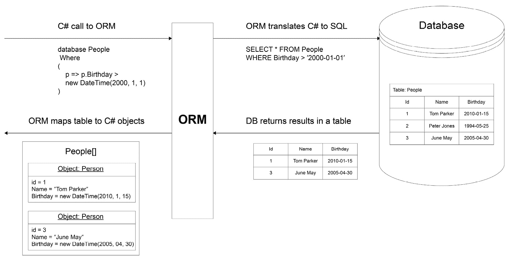
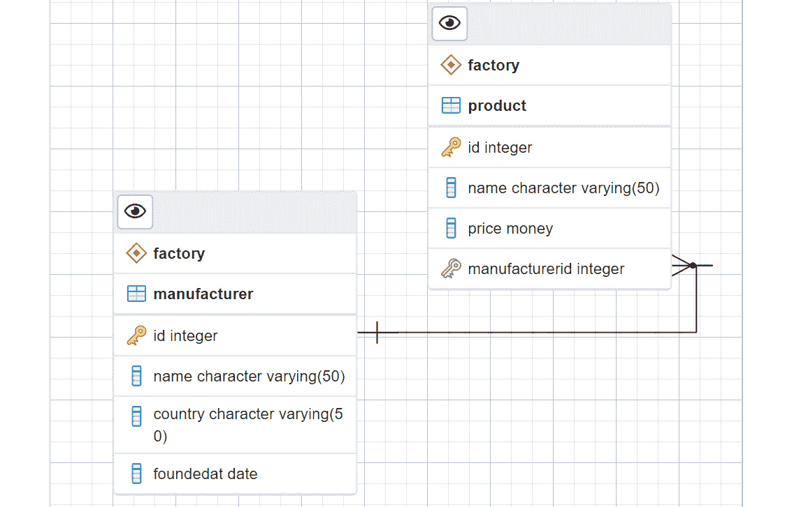
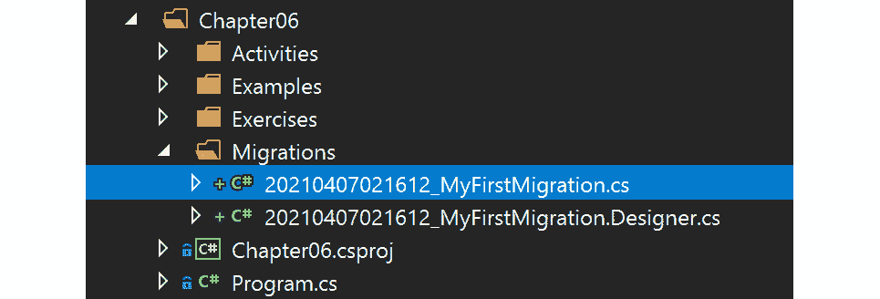
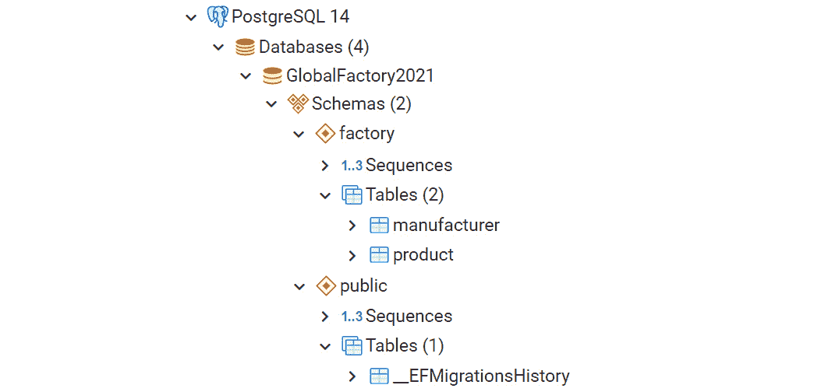
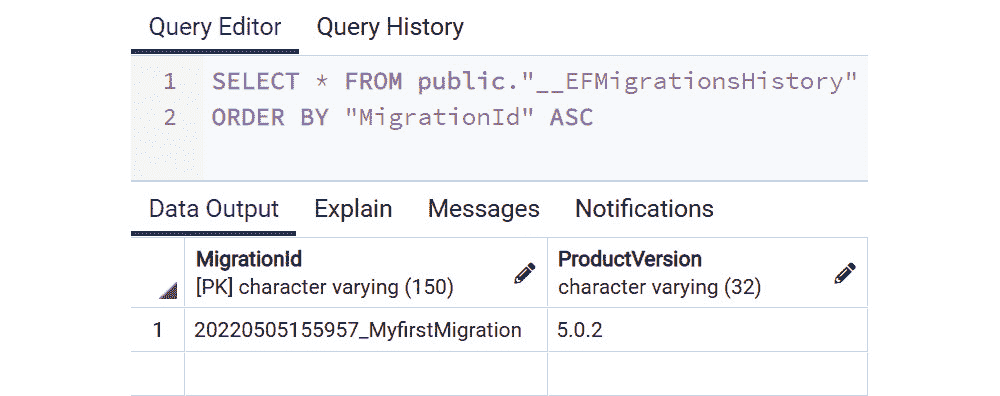
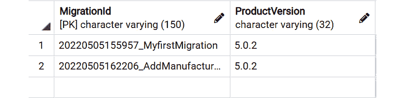
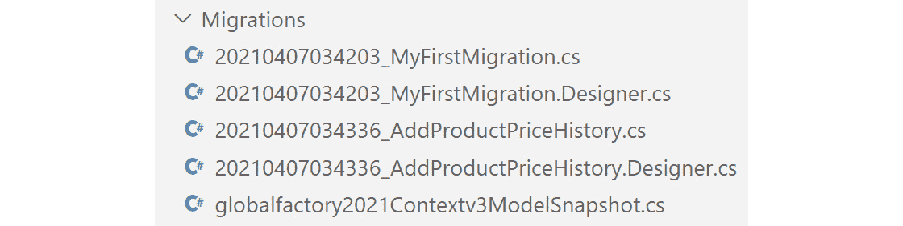
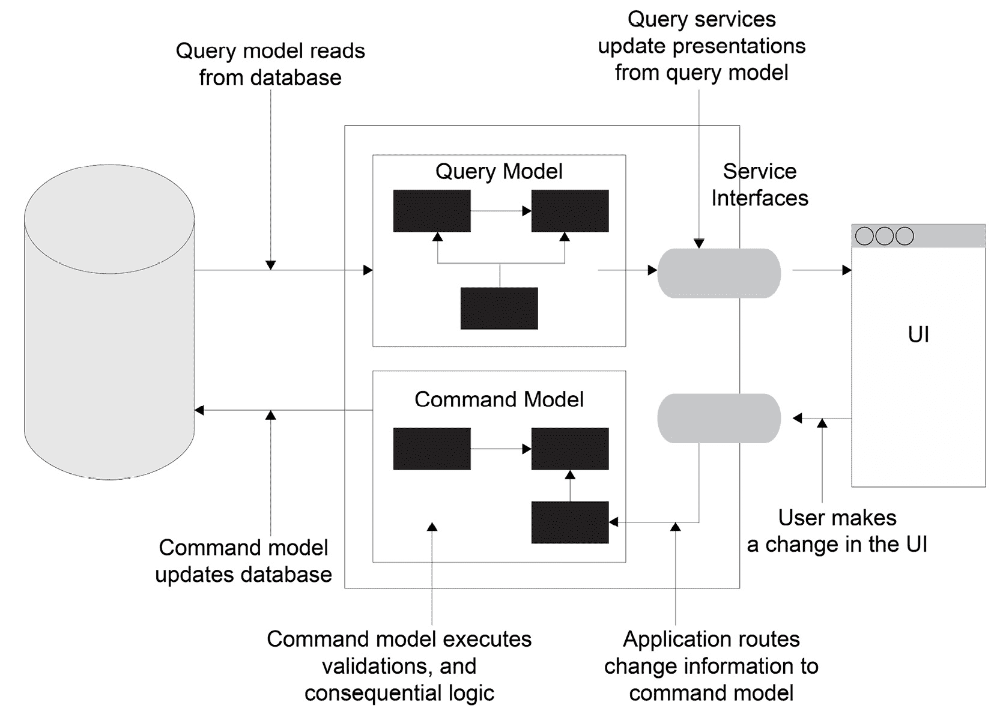
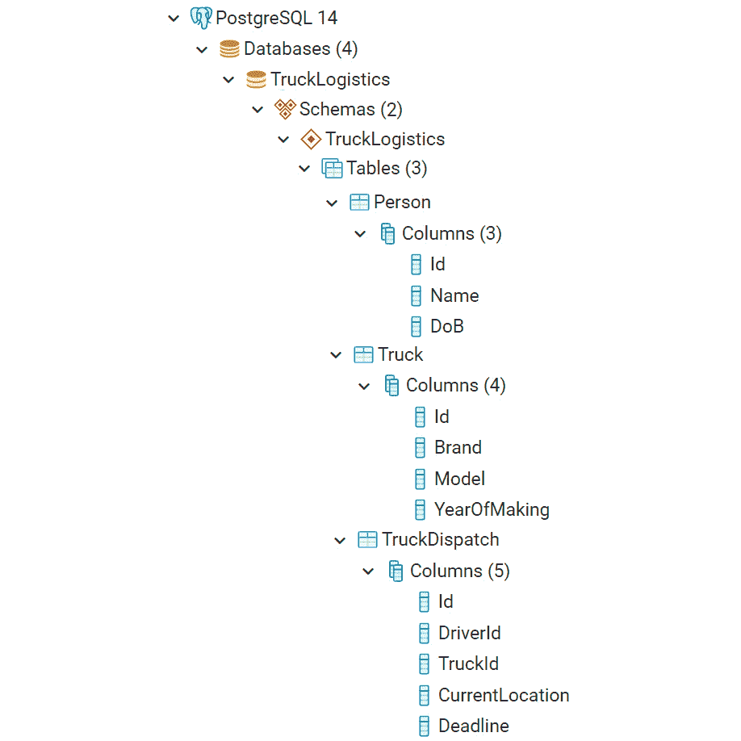

# 第六章：6. 使用 SQL Server 的 Entity Framework

概述

本章将向您介绍使用 SQL 和 C#进行数据库设计、存储和处理的基础知识。您将了解实体框架（EF）和对象关系映射器（ORM），并使用它们将数据库结果转换为 C#对象。然后，您将了解 SQL 和 EF 的主要性能陷阱以及如何查找和修复它们。

最后，您将通过查看存储库和命令查询责任分离（CQRS）模式以及设置用于开发和测试的本地数据库来深入了解与数据库的企业级实践。到本章结束时，您将能够使用 PostgreSQL 服务器创建和设计自己的数据库，并使用 EF 将其与 C#后端连接。

# 简介

数据库有多种类型，但最常见的一种是关系型数据库，管理关系型数据库的语言是 SQL。SQL 针对数据持久性进行了优化。然而，在其中执行业务规则效率低下。因此，在消费之前，数据通常在应用程序内存中检索并转换为对象。这种转换称为对象关系映射。

将数据库记录映射到对象中存在很多复杂性。然而，这种复杂性通过对象关系映射器（ORM）得到了缓解。一些 ORM 仅执行映射（称为微 ORM），但许多流行的 ORM 还抽象了数据库语言，允许您使用相同的语言来执行业务规则和处理数据：



图 6.1：ORM 在将 C#转换为 SQL 以及反向转换中的工作方式

本章的重点将是实体框架（EF）——.NET 中最受欢迎的 ORM。在本章的实践部分，您将使用它来快速原型化关系型数据库，并对它们进行查询。值得一提的是，在涉及数据库的情况下，您实际上是在与.NET 的 ADO.NET 部分进行交互。

在继续之前，建议您安装最新版本的 PostgreSQL，以及在此处找到的 PostgreSQL 服务器：[`www.enterprisedb.com/downloads/postgres-postgresql-downloads`](https://www.enterprisedb.com/downloads/postgres-postgresql-downloads)。您可以在*前言*中找到此安装说明。

本章将使用`AdventureWorks`数据库，这是一个微软经常使用的流行示例数据库的改编版本；它将在下一节中详细定义。

注意

对于那些对学习数据库基础知识以及如何使用 PostgreSQL 感兴趣的人来说，本书的 GitHub 仓库中包含了一个参考章节。您可以通过[`packt.link/sezEm`](https://packt.link/sezEm)访问它。

# 在开始之前创建一个演示数据库

您将使用`Adventureworks`作为示例，因为它是由微软常用的一个常见数据库，并且具有足够的复杂性来学习数据库主题。

执行以下步骤：

1.  打开命令行，创建一个名为`AdventureWorks`数据库的目录，并移动到该目录：

    ```cs
    C:\<change-with-your-download-path-to-The-C-Sharp-Workshop>\Chapter06\AdventureWorks\>
    ```

    注意

    将`<change-with-your-download-path-to-The-C-Sharp-Workshop>`替换为您下载 The-C-Sharp-Workshop 存储库的目录。

1.  在控制台中运行以下命令以创建一个空的`Adventureworks`数据库：

    ```cs
    psql -U postgres -c "CREATE DATABASE \"Adventureworks\";"
    ```

1.  使用安装脚本创建表格并填充数据。

    注意

    安装脚本位于[`packt.link/0SHd5`](https://packt.link/0SHd5)。

1.  运行以下命令指向安装脚本：

    ```cs
    psql -d Adventureworks -f install.sql -U postgres
    ```

## 使用 EF 建模数据库

使用其他语言与数据库交互会带来一个有趣的问题，那就是如何将表行转换为 C#对象？在 C#中，与数据库通信需要数据库连接和 SQL 语句。执行这些语句将弹出一个结果读取器，它与表格非常相似。使用结果读取器字典，您可以遍历结果并将它们映射到一个新的对象中。

此代码可能看起来如下所示：

```cs
using var connection = new NpgsqlConnection(Program.GlobalFactoryConnectionString);
connection.Open(); 
NpgsqlCommand command = new NpgsqlCommand("SELECT * FROM factory.product", connection);
var reader = command.ExecuteReader();
var products = new List<Product>();
while (reader.Read())
{
    products.Add(new Product
    {
        Id = (int)reader["id"],
        //ManufacturerId = (int)reader["ManufacturerId"],
        Name = (string)reader["name"],
        Price = (decimal)reader["price"]
    });
}
return products;
```

不要担心此代码的细节；它很快就会被分解。现在，只需知道前面的代码片段返回了`factory.product`表的所有行，并将结果映射到名为`products`的列表中。当处理单个表时，这种方法可能是可以的，但当涉及到连接时，它就会变得复杂。从一种类型到另一种类型的映射，如这里所做的那样，非常细粒度，可能会变得繁琐。为了运行此示例，请访问[`packt.link/2oxXn`](https://packt.link/2oxXn)，并在`static void Main(string[] args)`体中注释掉所有行，除了`Examples.TalkingWithDb.Raw.Demo.Run();`。

注意

您可以在[`packt.link/7uIJq`](https://packt.link/7uIJq)找到用于此示例的代码。

另一个需要考虑的因素是，当您从客户端处理 SQL 时，您应该小心。您不应该假设用户会像预期的那样使用您的程序。因此，您应该在客户端和服务器端都添加验证。例如，如果文本框需要输入用户 ID，客户端可以输入`105`并获取该 ID 的用户详细信息。此查询如下所示：

```cs
SELECT * FROM Users WHERE UserId = 105
```

用户还可以输入`105 or 1 = 1`，这始终为真，因此此查询返回所有用户：

```cs
SELECT * FROM Users WHERE UserId = 105 or 1 = 1
```

最坏的情况下，这会破坏您的应用程序。最坏的情况下，它会泄露所有数据。这种攻击被称为 SQL 注入。

解决接受任何类型用户输入的问题的一个简单而有效的方法是使用 ORM，因为它允许您将数据库表转换为 C#对象，反之亦然。在.NET 生态系统中，最常用的三个 ORM 是 EF、Dapper 和 NHibernate。当需要高性能时，Dapper 非常有效，因为它涉及执行原始 SQL 语句。这种 ORM 被称为 micro-ORM，因为它们只做映射，不做其他任何事情。

NHibernate 起源于 Java 生态系统，是.NET 中第一个 ORM 之一。NHibernate，就像 EF 一样，通过尝试抽象 SQL 和数据库相关的低级细节，解决了一个比微 ORM 更大的问题。使用完整的 ORM，如 EF 或 Nhibernate，通常意味着你不需要编写 SQL 来与数据库通信。实际上，这两个 ORM 允许你从你拥有的对象中生成复杂的数据库。反之亦然（即，你可以从你已有的数据库中生成对象）。

在接下来的几节中，我们将重点关注 EF。为什么不选择 Dapper？因为 Dapper 需要了解 SQL，而你希望使用简化的语法。为什么不选择 NHibernate？因为 NHibernate 已经过时，它有太多的配置选项，其中没有一个对 ORM 的入门有用。

在深入研究 EF 之前，你首先需要连接到数据库。因此，继续学习关于连接字符串和安全的知识。

### 连接字符串和安全

无论你使用什么语言，连接到数据库都将涉及使用连接字符串。它包含三个重要部分：

+   IP 或服务器名称。

+   你想要连接到的数据库的名称。

+   一些安全凭证（或者如果没有使用仅用于同一网络上的数据库的受信任连接，则不需要）。

要连接到你在“使用 EF 建模数据库”部分之前正在工作的本地数据库（`new NpgsqlConnection(ConnectionString)`），你可以使用以下连接字符串（出于安全原因，密码已被模糊处理）：

```cs
"Host=localhost;Username=postgres;Password=*****;Database=globalfactory2021"
```

当你在操作系统中添加环境变量时，将使用连接字符串。这将在后面详细说明。不同的数据库使用不同的连接。例如，以下数据库使用这些连接：

+   SQL Server: `SqlConnection`

+   PostgreSQL: `NpgsqlConnection`

+   MySql: `MySqlConnection`

+   SQLite: `SqliteConnection`

连接对象是.NET 和 SQL 数据库之间的接触点，因为只有通过它你才能与数据库进行通信。

将**连接字符串**硬编码会带来一些问题：

+   要更改连接字符串，程序必须重新编译。

+   这不安全。连接字符串可以被任何知道如何反编译代码的人查看（或者更糟糕的是，如果是一个开源项目，它可能是公开可见的）。

因此，连接字符串通常存储在配置文件中。但这并没有解决连接字符串敏感部分存储的问题。为了解决这个问题，通常在应用程序部署期间会替换整个字符串或其一部分。有三种主要方式来安全地存储和检索应用程序的秘密：

+   环境变量：这些是系统特有的变量，可以被同一台机器上的任何应用程序访问。这是最简单的安全方法，但在生产环境中可能不安全。

+   秘密管理器工具（可在.NET 和.NET Core 应用程序中使用）：类似于环境变量，但更适用于.NET，它将在本地机器上存储所有秘密，但存储在一个名为`secrets.json`的文件中。这个选项在生产环境中也可能不安全。

+   密钥保管库：这是最安全的方法，因为它与其他两种方法不同，它不与特定环境耦合。密钥保管库将秘密存储在一个集中的位置；通常是在远程位置。这种方法最常用于企业应用程序。在 Azure 的上下文中，Azure 密钥保管库是最好的选择，并且非常适合生产环境。

在下面的示例中，您将尝试安全地存储之前创建的连接字符串。您将使用最适合开发环境的简单安全方法——即环境变量。这种方法最适合本地开发，因为其他两种方法需要第三方工具进行设置，并且需要更长的时间。

注意

在继续之前，请确保阅读*参考章节*中的*练习 1*，*简单数据库和 SQL 入门*。它包含了创建所需表的新数据库所需的步骤。

在您的操作系统中添加环境变量只是执行一些简单步骤的问题。在 Windows 中执行以下步骤来设置环境变量：

1.  前往`控制面板`。

1.  点击`系统与安全`并选择`系统`。

1.  在搜索框中输入`环境变量`。

1.  然后从显示的列表中选择`编辑您的账户的环境变量`。

1.  在`环境变量`窗口中，点击`系统变量`窗口下的`新建`。

1.  在新建系统变量窗口中，在`变量名`旁边输入`GlobalFactory`。

1.  在`变量值`旁边粘贴以下内容：

    ```cs
    Host=localhost;Username=postgres;Password=*****;Database=globalfactory2021
    ```

1.  接下来，在所有窗口上点击`确定`以设置您的环境变量。

    注意

    这里密码将携带您在创建`globalfactory2021`数据库时在 PostgreSQL 中输入的数据库超级用户密码。

    +   Mac：从命令行中，找到`bash-profile: ~/.bash-profile f`。使用任何文本编辑器打开它，然后在文件末尾添加`export GlobalFactory='Host=localhost;Username=postgres;Password=*****;Database=globalfactory2021'`。最后，运行`source ~/.bash-profile`，这将更新环境变量。

    +   Linux：从命令行运行以下命令：`export GlobalFactory='Host=localhost;Username=postgres;Password=*****;Database=globalfactory2021'`。

现在可以通过在`Program.cs`文件中，类的顶部放置一个属性来获取环境变量而不是内存中的变量，如下所示：

```cs
public static string ConnectionString { get; } = Environment.GetEnvironmentVariable("GlobalFactory", EnvironmentVariableTarget.User);
```

这行代码返回本地用户配置的`GlobalFactory`环境变量的值。在上面的代码片段中，您已将此行添加到`Program.cs`文件中，并将其设置为静态，因为这样可以使其在整个应用程序中易于访问。虽然在大型应用程序中，这不是您希望采取的做法；然而，对于您在这里的目的来说，这是可以的。

在你掌握模型——程序的核心之前，你需要了解 EF 的主要版本。

### 选择哪一个——EF 还是 EF Core？

EF 有两个主要版本——EF 和 EF Core。两者都广泛使用，但在做出最适合你项目需求的选择之前，你应该了解一些因素。EF 首次于 2008 年发布。当时，没有 .NET Core，C# 仅适用于 **Windows**，并且严格需要 .NET Framework。目前，EF 的最新主要版本是 6，并且很可能不会再有其他主要版本，因为 2016 年，随着 .NET Core 1.0 一起发布了 EF Core 1（对 EF 6 的重写）。

EF Core 最初被命名为 EF 7。然而，它是对 EF 6 的完全重写，因此很快被重命名为 EF Core 1.0。EF 只能在 .NET 上运行，并且仅适用于 Windows，而 .NET Core 只能在 .NET Core 上运行，并且是多平台的。

在功能上，这两个框架都很相似，并且仍在不断发展。然而，现在的重点是 EF Core，因为 C# 的未来与 .NET 6 相关联，这是一个多平台框架。在撰写本书时，EF 6 拥有一套更丰富的功能。然而，EF Core 正在迅速迎头赶上，并可能很快就会领先。如果你的项目规格不需要与 .NET Framework 一起工作，坚持使用 EF Core 是更好的选择。

注意

关于两者之间最新差异的详细列表，请参阅微软的以下比较：[`docs.microsoft.com/en-us/ef/efcore-and-ef6/`](https://docs.microsoft.com/en-us/ef/efcore-and-ef6/)。

在你继续之前，安装 EF Core NuGet 包，以便你可以访问 EF Core API。在 Visual Studio Code (VS Code) 中打开项目后，在终端中运行以下行：

```cs
dotnet add package Microsoft.EntityFrameworkCore
```

单独来看，`EntityFrameworkCore` 只是一个用于抽象数据库结构的工具。为了将其与特定的数据库提供程序连接，你需要另一个包。这里你使用的是 PostgreSQL。因此，你将安装的包是 `Npgsql.EntityFrameworkCore.PostgreSQL`。为了安装它，从 VS Code 控制台运行以下命令：

```cs
dotnet add package Npgsql.EntityFrameworkCore.PostgreSQL
```

你现在已经了解了 EF 的两种版本以及它们如何与 .NET Framework 和 .NET 一起工作。下一节将深入探讨模型，这是程序的核心。

### 模型

一个设计用来表示业务对象的类被称为模型。它总是通过属性或方法管理数据。模型是程序的核心。它们不依赖于任何东西；程序的其它部分指向它们。

一个将数据表映射到对象的 ORM 被称为实体。在简单应用中，实体和模型是同一个类。在复杂应用中，对数据库的更改是常见的事情。这意味着实体经常发生变化，如果你没有为模型单独创建一个类，你的模型也会受到影响。业务逻辑应该与数据库更改隔离，因此建议有两个类——一个用于实体，一个用于模型。

在继续下一节之前，快速查看一下 `factory.product` 和 `factory.manufacturer` 表。一个制造商生产许多产品。以下实体关系（ER）图在图 6.2 中展示了这种关系。



图 6.2：产品和制造商的 ER 图

实体，理想情况下，应该与表列相对应。您可以通过属性来映射列。例如，`factory.product` 表有 `id`、`name`、`price` 和 `manufacturerId`。映射到该表的对象可能看起来像这样：

```cs
public class Product
{
    public int id { get; set; }
    public string name { get; set; }
    public decimal price { get; set; }
    public int manufacturerId { get; set; }
}
```

您知道只有产品的价格可以改变；其余属性不会变。然而，在前面的代码片段中，每个属性都仍然编写了一个设置器。这是因为通过 ORM 创建的实体始终需要所有属性都有设置器，否则可能无法设置值。

实体应该设计成与表结构相匹配，但并不总是必须这样。例如，如果 `Id` 属性被重命名为 `PrimaryKey`，您仍然可以使用 EF 以相同的方式使用，通过使用特殊的数据注释 `[Key]`：

```cs
public class Product
{
    [Key]
    public int PrimaryKey { get; set; }
    public string name { get; set; }
    public decimal price { get; set; }
    public int manufacturerId { get; set; }
}
```

数据注释是一个属性，它向属性添加元数据。您可以使用它来提供不同的名称，将约束列作为键，为字段添加最小和最大长度，添加精度，声明字段为必填项，等等。单独使用数据注释不会做任何事情。它们不会向模型添加逻辑。其他一些组件将消费注释对象，这将涉及读取它们的属性并根据这些属性执行操作。

您的模型（展示图 6.2 中的 ER 图）几乎完成了，但还有一些问题需要解决：

+   首先，表格模型映射缺少一个模式（`factory`，在这种情况下），因此您需要使用 `Table` 属性显式指定它。

+   第二，默认情况下，如果您还想检索一个 `manufacturer`，您将需要一个额外的查询。您可以通过添加一个指向制造商的导航属性来修复这个问题。但为什么您应该使用导航属性呢？如果只有一个 ID，您将需要一个单独的查询来获取相关实体。然而，使用导航属性，您可以使用预加载一次获取两个或更多实体。

以下代码片段将向您展示如何创建 `Manufacturer` 类并修复这两个模型的问题：

```cs
[Table("manufacturer", Schema = "factory")]
public class Manufacturer
{
    public int id { get; set; }
    public string name { get; set; }
    public string country { get; set; }
    public virtual ICollection<Product> Products { get; set; } = new List<Product>();
}
```

注意新的 `List<Product>();` 部分。这是必需的，以便在尝试添加新产品而表格中尚未有产品时，代码仍然可以正常工作，而不会抛出 `NullReferenceException`。

在以下代码片段中，为产品表创建了一个模型：

```cs
[Table("product", Schema = "factory")]
public class Product
{
    public int id { get; set; }
    public string name { get; set; }
    public decimal price { get; set; }
    public int manufacturerId { get; set; }
    public virtual Manufacturer Manufacturer { get; set; }
}
```

这两个模型已经完整，可以映射到你的数据库表。你没有用导航属性替换 ID 属性；两者都存在。如果你没有这样做，那么在你可以对产品进行任何操作之前，需要先获取父实体（`Manufacturer`）。使用这种方法，你可以独立于制造商处理产品。你所需要的就是一个 ID 链接。

在上述修复的基础上，你还使你的导航属性（`Manufacturer` 和 `Products`）虚拟。这对于启用 EF 的懒加载是必要的。懒加载意味着直到引用该属性时，该属性中才没有加载数据。

最后，值得提到的是，对于制造商产品，你使用了 `ICollection` 而不是 `IEnumerable` 或其他集合。这很有意义，因为 EF 在检索和映射项目时需要填充集合。`List` 或甚至 `Set` 都可以工作，但在设计面向对象的代码时，你应该专注于你可以依赖的最高抽象，在这种情况下是 `ICollection`。

注意

你可以在 [`packt.link/gfgB1`](https://packt.link/gfgB1) 找到用于此示例的代码。

为了运行此示例，请访问 [`packt.link/2oxXn`](https://packt.link/2oxXn) 并注释掉 `static void Main(string[] args)` 体内的所有行，除了 `Examples.TalkingWithDb.Orm.Demo.Run();`。

你现在对实体、模型、实体关系、数据注释、预加载和懒加载有了清晰的认识。下一节将展示如何结合所有这些内容，并通过 EF Core 与数据库进行通信。

## DbContext 和 DbSet

`DbContext` 是 EF 用于数据库抽象的类。一个新的数据库抽象必须从 `DbContext` 类派生，并提供连接到数据库的方式。就像数据库包含一个或多个表一样，`DbContext` 包含一个或多个 `DbSet` 实体。例如，考虑以下代码：

```cs
public class FactoryDbContext : DbContext
{
    public DbSet<Product> Products { get; set; }
    public DbSet<Manufacturer> Manufacturers { get; set; }

    protected override void OnConfiguring(DbContextOptionsBuilder optionsBuilder)
    {
        if (!optionsBuilder.IsConfigured)
        {
            optionsBuilder.UseNpgsql(Program.GlobalFactoryConnectionString);
        }
    }
}
```

在这里，`FactoryDbContext` 是你之前创建的数据库抽象，包含两个表：`Products` 和 `Manufacturers`。`OnConfiguring` 方法接受 `DbContextOptionsBuilder`，这允许你指定要连接的数据库以及如何建立连接。在这种情况下，你正在使用 PostgreSQL Server 并指定要连接的数据库。请注意，如果已经配置了数据库提供程序，则你将不会在 `if` 语句中使用 `Npgsql`，即 `if (!optionsBuilder.IsConfigured)` 语句。

需要注意的是，你应该不依赖于特定的数据库提供程序，原因有两个：

+   首先，更改数据库提供程序很容易；这只是一个在构建器上使用不同扩展方法的问题。

+   其次，EF 有一个内存数据库提供程序，这对于测试非常有效。或者，你也可以使用 SQLite，它是一个轻量级的数据库，仅用于测试。

目前，你的数据库抽象需要改进，因为它只允许你与 SQL Server 数据库通信。而不是硬编码选项，你将注入它们。注入允许你配置现有的类，而无需修改它。你不需要更改模型就能选择你想要连接到的数据库。你可以通过将 `options` 对象传递给 `FactoryDbContext` 构造函数来指定你想要连接到的数据库：

```cs
 public FactoryDbContext(DbContextOptions<FactoryDbContext> options)
    : base(options)
{
}
```

默认构造函数用于默认提供程序，当没有提供选项时将使用它。在这种情况下，上下文被设计为使用 PostgreSQL；因此，你需要添加以下代码：

```cs
public FactoryDbContext()
    : base(UsePostgreSqlServerOptions())
{
}
```

可以使用 `DbContextOptions` 来配置 `DbContext`。在这个例子中，你需要配置一个数据库提供程序（PostgreSQL）和一个连接字符串。使用 `DbContextOptionsBuilder` 来选择提供程序。`UseNpgsql` 是将 PostgreSQL 提供程序与数据库上下文连接起来的方式，如下所示：

```cs
protected static DbContextOptions UsePostgreSqlServerOptions()
{
    return new DbContextOptionsBuilder()
        .UseNpgsql(Program.ConnectionString)
        .Options;
}
```

完整的 `DbContext` 现在看起来是这样的：

```cs
FactoryDbContext.cs
public class FactoryDbContext : DbContext
{
    public DbSet<Product> Products { get; set; }
    public DbSet<Manufacturer> Manufacturers { get; set; }

    public FactoryDbContext(DbContextOptions<FactoryDbContext> options)
        : base(options)
    {
    }

    public FactoryDbContext()
        : base(UsePostgreSqlServerOptions())
    {
    }
The complete code can be found here: https://packt.link/0uVPP.
```

为了运行此示例，请访问 [`packt.link/2oxXn`](https://packt.link/2oxXn) 并在 `static void Main(string[] args)` 主体中注释掉所有行，除了 `Examples.TalkingWithDb.Orm.Demo.Run();`。

要从数据库中获取产品，你首先通过初始化你的 `DbContext` 实例来连接到数据库。然后，从该上下文中调用一个想要的 `DbSet`，并通过调用 `ToList()` 发送对数据库的调用：

```cs
using var context = new FactoryDbContext();
var products = context.Products.ToList();
```

在这种情况下，你创建了一个 `FactoryDbContext`（它连接到 `GlobalFactory` 数据库），而 `context.Products.ToList()` 等同于一个 `SELECT * FROM Products` SQL 语句。

注意

提到的两行不包括在 GitHub 中。它们很简单，这里只是为了说明目的。

当你初始化一个 `DbContext` 时，你几乎总是创建一个数据库连接，如果没有管理好，你最终可能会在连接池（一组可用连接）中耗尽连接。`DbContext` 是一个未管理资源；它实现了 `IDisposable` 接口，因此需要显式清理。在这里，你应用了一个 C# 功能——内联使用，它在对象离开其作用域后销毁对象：

```cs
using var context = new FactoryDbContext()
```

当你拥有一个 `DbContext` 时，从中获取数据是微不足道的：

+   访问 `DbSet`。

+   将其转换为列表。

然而，为什么你需要进行任何转换呢？那是因为 `DbSet` 与 `IEnumerable` 类似，是懒加载的。它封装了执行所需的 SQL。所以，除非你明确要求（例如，通过调用 `ToList`），否则不会查询任何数据。调用 `ToList` 会实际调用数据库并检索所有产品。

现在，你已经了解了所有关于数据库的知识。下一节将涉及 `AdventureWorks` 数据库，这是一个常用于教授初学者 SQL 的数据库。

### AdventureWorks 数据库

`AdventureWorks` 是一个用于学习目的的数据库。它包含数十个表，每个表中都有数百条记录。这些表专注于批发，这是企业应用中的常见场景。换句话说，`AdventureWorks` 数据库提供了与真实世界问题接近的学习示例。

注意

你必须首先在 PostgreSQL 中创建 `AdventureWorks` 数据库。你可以在 GitHub 上找到创建此数据库的步骤，位于参考章节中。

前几节介绍了实体、模型以及如何组合一切并与数据库通信。你还学习了 `DbContext` 和 `DbSet`。这完成了本节的理论部分。在下一节中，你将通过练习将其付诸实践。

## 练习 6.01：从 AdventureWorks 数据库读取库存位置

EF 的最简单用法是将数据表读入 C# 对象。本练习将教会你如何创建数据实体类并将其添加正确的属性。为此，你将在示例 `AdventureWorks` 数据库中创建一个库存 `location` 表。执行以下步骤来完成此操作：

1.  创建一个 `Location` 实体。它应该有 `LocationId`、`Name`、`Costrate`、`Availability` 和 `ModifiedDate` 属性，如下所示：

    ```cs
    [Table("location", Schema = "production")]
    public class Location
    {
        [Column("locationid")]
        public int LocationId { get; set; }
        [Column("name")]
        public string Name { get; set; }
        [Column("costrate")]
        public double Costrate { get; set; }
        [Column("availability")]
        public double Availability { get; set; }
        [Column("modifieddate")]
        public DateTime ModifiedDate { get; set; }
    }
    ```

由于需要指定模式和正确大写的表名，已应用 `[Table]` 属性。此外，每个列名都需要使用 `[Column]` 属性显式指定，因为大小写不匹配。

1.  创建一个名为 `AdventureWorksContext` 的类，它继承自 `DbContext`，如下所示：

    ```cs
    public class AdventureWorksContext : DbContext
    {
        public DbSet<Location> Locations { get; set; }

        public AdventureWorksContext()
            : base(UsePostgreSqlServerOptions())
        {
        }

        protected static DbContextOptions UsePostgreSqlServerOptions()
        {
            return new DbContextOptionsBuilder()
                .UseNpgsql(Program.AdventureWorksConnectionString)
                .Options;
        }
    ```

如果你想重用数据库抽象的基础功能，如连接到数据库，则必须继承 `DbContext`。基础功能的用法在两个基础构造函数中可见。在参数化构造函数中，你使用 PostgreSQL；在非参数化构造函数中，你可以提供你选择的任何数据库提供程序。

1.  现在按照以下方式使用 `Program.AdventureWorksConnectionString` 连接字符串：

    ```cs
    Host=localhost;Username=postgres;Password=****;Database=Adventureworks. DbSet<Location>Locations
    ```

这代表所需的 `location` 表。

注意

请确保您的 PostgreSQL 密码安全。不要在代码中以明文形式写入它们，而是使用环境变量或密钥。

1.  连接到数据库：

    ```cs
    var db = new AdventureWorksContext();
    ```

这就像创建一个新的 `DbContext` 一样简单。

1.  通过添加以下代码来获取所有产品：

    ```cs
    var locations = db.Locations.ToList();
    ```

1.  现在你已经查询了位置并且不再需要保持连接打开，最好是断开与数据库的连接。为了断开与数据库的连接，请按照以下方式调用 `Dispose` 方法：

    ```cs
    db.Dispose();
    ```

1.  通过添加以下代码来打印结果：

    ```cs
    foreach (var location in locations)
    {
        Console.WriteLine($"{location.LocationId} {location.Name} {location.Costrate} {location.Availability} {location.ModifiedDate}");
    }
    ```

代码本身在 [`packt.link/2oxXn`](https://packt.link/2oxXn) 运行。请确保在 `static void Main(string[] args)` 方法体内注释掉所有 `static void` 的行，除了 `Exercises.Exercise03.Demo.Run()`。当你运行代码时，以下输出将显示：

```cs
1 Tool Crib 0 0 2008-04-30 00:00:00
2 Sheet Metal Racks 0 0 2008-04-30 00:00:00
3 Paint Shop 0 0 2008-04-30 00:00:00
4 Paint Storage 0 0 2008-04-30 00:00:00
5 Metal Storage 0 0 2008-04-30 00:00:00
6 Miscellaneous Storage 0 0 2008-04-30 00:00:00
7 Finished Goods Storage 0 0 2008-04-30 00:00:00
10 Frame Forming 22,5 96 2008-04-30 00:00:00
20 Frame Welding 25 108 2008-04-30 00:00:00
30 Debur and Polish 14,5 120 2008-04-30 00:00:00
40 Paint 15,75 120 2008-04-30 00:00:00
45 Specialized Paint 18 80 2008-04-30 00:00:00
50 Subassembly 12,25 120 2008-04-30 00:00:00
60 Final Assembly 12,25 120 2008-04-30 00:00:00
```

使用 EF 很简单。正如你可以从这个练习中看到的那样，它直观，感觉像是 C#的自然扩展。

注意

你可以在[`packt.link/9Weup`](https://packt.link/9Weup)找到用于此练习的代码。

# 查询数据库——LINQ to SQL

EF（Entity Framework）的一个更有趣的特性是执行 SQL 语句非常类似于操作一个集合。例如，假设你想通过名称检索一个产品。你可以通过名称获取产品，就像使用 LINQ 一样：

```cs
public Product GetByName(string name)
{
    var product = db.Products.FirstOrDefault(p => p.Name == name);
    return product;
}
```

在这里，`FirstOrDefault`通过名称返回第一个匹配的产品。如果不存在具有该名称的产品，则返回`null`。

那么如何通过 ID 查找唯一元素呢？在这种情况下，你会使用一个特殊的方法（`Find`），它要么从数据库中获取一个实体，要么如果最近已经检索了具有相同 ID 的实体，则从内存中返回它：

```cs
public Product GetById(int id)
{
    var product = db.Products.Find(id);
    return product;
}
```

当使用主键时，最好使用`Find`而不是`Where`，因为在 EF 的上下文中，它们具有略微不同的含义。`Find`不会尝试创建 SQL 查询并执行它，而是会检查此项目是否已经被访问，并从缓存中检索它，而不是通过数据库。这使得操作更加高效。

关于通过相关制造商 ID 查找所有产品，你可以创建一个返回`IEnumerable<Product>`的方法来实现此目的，命名为`GetByManufacturer`，如下所示：

```cs
public IEnumerable<Product> GetByManufacturer(int manufacturerId)
{    var products = db
        .Products
        .Where(p => p.Manufacturer.Id == manufacturerId)
        .ToList();

    return products;
}
```

你可能想知道为什么你应该选择在这里使用`Where`而不是`Find`。那是因为你正在通过外键`manufacturerId`获取许多产品。请注意不要混淆外键和主键；`Find`仅用于主键。

为了运行此示例，请访问[`packt.link/2oxXn`](https://packt.link/2oxXn)，并在`static void Main(string[] args)`体中注释掉所有行，除了`Examples.Crud.Demo.Run();`。

注意

你可以在[`packt.link/pwcwx`](https://packt.link/pwcwx)找到用于此示例的代码。

现在，关于检索相关实体，如果你简单地调用`db.Manufacturers.ToList()`，你将得到 null 产品。这是因为除非明确指定，否则产品不会自动检索。如果你没有调用`ToList()`，你可以利用延迟加载（即按需加载所需的实体），但这将导致一个非常低效的解决方案，因为你将始终查询每个父实体的子实体。

一个合适的解决方案是调用`Include(parent => parent.ChildToInclude)`：

```cs
db.Manufacturers
.Include(m => m.Products)
.ToList();
```

这种方法被称为预加载。使用这种方法，你指定哪些子实体应该立即检索。在子实体还有其子实体的情况下，你可以调用`ThenInclude`。为了运行此示例，请在`Program.cs`中注释掉`static void Main(string[] args)`体中的所有行，除了`Examples.Crud.Demo.Run();`。

注意

你可以在[`packt.link/c82nA`](https://packt.link/c82nA)找到用于此示例的代码。

记得当提到尝试从表中获取所有内容在大多数情况下不是正确做法时吗？贪婪加载也有同样的问题。那么，如果你只想获取一些属性，你应该学习 LINQ 的另一面。

## 查询语法

查询语法是 LINQ lambdas 的另一种语法。它与 SQL 非常相似。查询语法相对于 lambda 的主要优势是，当你有复杂的连接并且只想获取一些数据时，写查询会感觉更自然。想象一下，如果你想获取所有产品-制造商名称对。你不能简单地获取制造商并包含产品；你只想获取两个产品。如果你尝试使用 LINQ，代码将类似于以下：

```cs
db.Products
.Join(db.Manufacturers,
    p => p.ManufacturerId, m => m.Id,
    (p, m) => new {Product = p.Name, Manufacturer = m.Name})
.ToList();
```

使用查询语法执行相同操作的样子如下：

```cs
(from p in db.Products
join m in db.Manufacturers
    on p.ManufacturerId equals m.Id
select new {Product = p.Name, Manufacturer = m.Name}
).ToList();
```

分解代码：

```cs
from p in db.Products
```

现在选中所有产品和它们的列：

```cs
join m in db.Manufacturers
```

对于每个产品，添加制造商列如下：

```cs
on p.ManufacturerId equals m.Id
```

只有当产品的`ManufacturerId`等于制造商的`Id`时，才会添加制造商列（`INNER JOIN`）。

注意

为什么不能写`==`而不是`equals`？这是因为，在 LINQ 查询语法中，`equals`完成了一个连接；它不仅仅是两个值的比较。

`select`部分在 lambda 和查询语法中都是相同的；然而，提一下你选择了什么是有意义的。`select new {...}`意味着你创建了一个新的匿名对象，包含你想要选择的所有内容。这个想法是稍后使用它来返回一个你需要的有强类型的对象。因此，在调用`ToList`方法之后，你很可能会执行另一个`select`操作来映射最终返回的结果。你不能立即进行映射，因为在调用`ToList`之前，你仍在处理一个尚未转换为 SQL 的表达式。只有调用`ToList`之后，你才能确定你正在处理 C#对象。

最后，你可能想知道为什么在调用`ToList`之前，连接操作被括号包围。这是因为你仍然处于查询语法模式，而唯一摆脱它并回到正常 LINQ 的方式就是用括号包围它。

如果你难以记住 LINQ 查询语法，记住一个`foreach`循环：

```cs
foreach(var product in db.Products)
```

`from`的查询语法如下：

```cs
from product in db.Products
```

在前面的代码片段中突出显示的部分是两个语法重叠的部分。这也适用于连接。这两个部分充分利用了查询语法。

lambda 和查询语法都有相同的性能指标，因为最终，查询语法将被编译成 lambda 等价物。当进行复杂的连接时，使用查询语法可能更有意义，因为它看起来更接近 SQL，因此可能更容易理解。

现在运行代码。为了运行此示例，在`Program.cs`中的`static void Main(string[] args)`体内部除`Examples.Crud.Demo.Run();`之外的所有行进行注释：

注意

你可以在[`packt.link/c82nA`](https://packt.link/c82nA)找到用于此示例的代码。

你现在知道查询语法是 LINQ lambda 的另一种语法。但你是如何使用查询语法来执行剩余的操作，比如创建、更新和删除行呢？下一节将详细说明如何做到这一点。

## CRUD 的其余部分

使用查询语法添加、更新和删除数据与基本的 LINQ 也类似。然而，与通过调用`ToList`执行查询类似，它涉及一个额外的步骤，即提交更改。考虑以下代码，其中你正在创建一个新的产品：

```cs
var product = new Product
{
    Name = "Teddy Bear",
    Price = 10,
    ManufacturerId = 1
};
db.Products.Add(product);
db.SaveChanges();
```

这段代码看起来几乎完全熟悉，除了最后一行。`SaveChanges`方法用于运行实际的 SQL。如果你不调用它，什么都不会发生，更改在断开数据库连接后将会消失。此外，当添加子实体（`product`）时，你不需要获取父实体（`manufacturer`）。你只需要通过外键（`ManufacturerId`）在两者之间提供链接。

为什么你需要一个额外的方法来应用你的更改？直接调用`Add`并立即创建一个新的产品行不是更简单吗？在实践中，事情并不那么简单。如果有多个不同实体的`Add`方法需要执行，并且其中一个失败了怎么办？你应该允许其中一些成功，而其他失败吗？最糟糕的事情是你可以将数据库置于无效状态，换句话说，破坏数据完整性。你需要一个机制来完全完成或失败，而不影响任何东西。

在 SQL 上下文中，这些一起运行的命令被称为事务。你可以对事务做两件事——要么提交，要么回滚。在 EF 中，除了查询之外，每个操作都会导致一个事务。`SaveChanges`方法完成事务，而命令失败则会回滚事务。

如果你需要在 C#中调用纯 SQL 命令，你需要创建一个参数化的 SQL 命令，分别提供每个参数，并拼接 SQL 以进行多查询更新。对于小型实体来说可能很简单；然而，随着规模的增大，复杂性也会增加。使用 EF，你不需要关心低级细节，例如向命令传递参数。例如，使用 EF，添加一个包含几个产品的`manufacturer`就像向`Manufacturers`列表添加一个`manufacturer`一样简单：

```cs
var manufacturer = new Manufacturer
{
    Country = "Lithuania",
    Name = "Toy Lasers",
    Products = new List<Product>
    {
        new()
        {
            Name = "Laser S",
            Price = 4.01m
        },
        new()
        {
            Name = "Laser M",
            Price = 7.99m
        }
    }
};
db.Manufacturers.Add(manufacturer);
db.SaveChanges();
```

如你所见，创建制造商几乎与向列表添加元素相同。主要区别在于需要使用`db.SaveChanges()`方法来完成更改。

关于更新现有产品？将产品的价格设置为`45.99`：

```cs
var productUpdate = new Product
{
    Id = existingProduct.Id,
    Price = 45.99m,
    ManufacturerId = existingProduct.ManufacturerId,
    Name = existingProduct.Name
};
db.Products.Update(productUpdate);
 db.SaveChanges();
```

如果你仔细查看此代码，你不仅提供了更新的`Price`和现有的`Id`项，还提供了所有其他字段。这是因为 EF 无法知道你是否想将现有值设置为 null，或者只设置新值。但别担心；从逻辑上讲，更新某物而没有任何依据的情况很少见。你应该在某处加载一组项目。因此，更新现有对象只是设置该对象属性的新值的问题。

当然，当你只想更新一项内容时，会有例外。在这种情况下，你可以有一个专门的方法，并完全控制。在下面的代码片段中，你将更新产品值，但仅当它们不为空时：

```cs
var productToUpdate = db.Products.Find(productUpdate.Id);
var anyProductToUpdate = productToUpdate != null;
if (anyProductToUpdate)
{
    productToUpdate.Name = productUpdate.Name ?? productToUpdate.Name;

    productToUpdate.ManufacturerId = (productUpdate.ManufacturerId != default)
        ? productUpdate.ManufacturerId
        : productToUpdate.ManufacturerId;

    productToUpdate.Price = (productUpdate.Price != default)
        ? productUpdate.Price
        : productToUpdate.Price;

    db.SaveChanges();
}
```

在这里，你只会更新那些不是默认值的值。理想情况下，在类似这种情况（你只想更新一些字段）的情况下工作，你应该有一个专门用于更新字段的模型，发送这些字段，并使用如 AutoMapper 之类的库进行映射。

注意

要了解更多关于 AutoMapper 的信息，请参阅他们的官方文档：[`docs.automapper.org/en/stable/Getting-started.xhtml`](https://docs.automapper.org/en/stable/Getting-started.xhtml)。

关于从数据库中删除现有行呢？这涉及到首先获取你想要删除的对象，然后才能删除它。例如，假设你想删除具有特定 ID 的产品：

```cs
var productToDelete = db.Products.Find(productId);
if (productToDelete != null)
{
    db.Products.Remove(productToDelete);
    db.SaveChanges();
} 
```

再次强调，从数据库中删除某项内容几乎与从列表中删除一个元素相同，唯一的区别是使用`db.SaveChanges()`来确认更改。为了运行此示例，请在`Program.cs`中注释掉`static void Main(string[] args)`体内的所有行，除了`Examples.Crud.Demo.Run();`。

注意

你可以在此示例中找到使用的代码：[`packt.link/bH5c4`](https://packt.link/bH5c4)。

你已经掌握了 CRUD 的基本概念是四个函数的组合——创建、读取、更新和删除。现在，是时候在以下练习中将其付诸实践了。

## 练习 6.02：更新产品和制造商表

你已经创建了一个包含`Products`和`Manufacturers`表的`GlobalFactory`数据库，你现在有足够的组件来执行数据库的完整创建、读取、更新和删除（CRUD）操作。在这个练习中，你将使用`FactoryDbContext`在名为`GlobalFactoryService`的新类中创建方法，以完成以下任务：

+   添加美国地区的制造商列表。

+   将产品列表添加到美国的所有制造商中。

+   在美国更新任何一种产品，并给出一个折扣价格。

+   从美国地区删除任何一种产品。

+   获取美国的所有制造商及其产品。

执行以下步骤以完成此练习：

1.  首先，创建一个`GlobalFactoryService`类。

1.  在构造函数中创建 `FactoryDbContext` 并注入上下文。注入上下文意味着您可以选择以任何您想要的方式设置它（例如，使用不同的提供者）。

1.  创建一个接受 `FactoryDbContext` 作为参数的构造函数，如下所示：

    ```cs
    public class GlobalFactoryService : IDisposable
    {
        private readonly FactoryDbContext _context;

        public GlobalFactoryService(FactoryDbContext context)
        {
            _context = context;
        }
    ```

1.  创建一个 `public void CreateManufacturersInUsa(IEnumerable<string> names)` 方法，如下所示：

    ```cs
    public void CreateManufacturersInUsa(IEnumerable<string> names)
    {
        var manufacturers = names
            .Select(name => new Manufacturer()
            {
                Name = name,
                Country = "USA"
            });

        _context.Manufacturers.AddRange(manufacturers);
        _context.SaveChanges();
    }
    ```

制造商只有两个字段——`Name` 和 `Country`。在这种情况下，`Country` 的值已知为 `"USA"`。您只需传递一个制造商 `names` 列表，并通过将 `Country` 的值与它们的名称组合来构建 `Manufacturers`。

1.  要创建产品，创建一个 `public void CreateUsaProducts(IEnumerable<Product> products)` 方法。

1.  然后获取所有美国制造商。

1.  最后，遍历每个制造商并将所有产品添加到每个制造商中：

    ```cs
    public void CreateUsaProducts(IEnumerable<Product> products)
    {
        var manufacturersInUsa = _context
            .Manufacturers
            .Where(m => m.Country == "USA")
            .ToList();

        foreach (var product in products)
        {
            manufacturersInUsa.ForEach(m => m.Products.Add(
                new Product {Name = product.Name, Price = product.Price}
                ));
        }

        _context.SaveChanges();
    }
    ```

注意，在这个例子中，每次您将相同的产品添加到制造商时，都会创建一个新的产品。这样做是因为尽管产品具有相同的属性，但它属于不同的制造商。为了设置这种区别，您需要传递不同的对象。如果您不这样做，产品将被分配给相同的（最后引用的）制造商。

1.  创建一个 `public void SetAnyUsaProductOnDiscount(decimal discountedPrice)` 方法。

1.  要设置任何美国产品的折扣，首先获取所有来自美国地区的商品，然后选择其中的第一个（顺序不重要）。

1.  接下来为该产品设置一个新的 `Price`，并调用 `SaveChanges()` 以确认：

    ```cs
    public void SetAnyUsaProductOnDiscount(decimal discountedPrice)
    {
        var anyProductInUsa = _context
            .Products
            .FirstOrDefault(p => p.Manufacturer.Country == "USA");

        anyProductInUsa.Price = discountedPrice;

        _context.SaveChanges();
    }
    ```

1.  创建一个 `public void RemoveAnyProductInUsa()` 方法。

1.  要删除一个项目，只需选择 `"USA"` 组中的第一个产品并将其删除：

    ```cs
    public void RemoveAnyProductInUsa()
    {
        var anyProductInUsa = _context
            .Products
            .FirstOrDefault(p => p.Manufacturer.Country == "USA");

        _context.Remove(anyProductInUsa);
        _context.SaveChanges();
    }
    ```

    注意

    注意到在每一步之后都调用了 `SaveChanges`。

1.  为了获取来自美国的制造商，创建一个 `public IEnumerable<Manufacturer> GetManufacturersInUsa()` 方法。

1.  在查询的末尾调用 `ToList()` 以执行 SQL：

    ```cs
      public IEnumerable<Manufacturer> GetManufacturersInUsa()
      {
          var manufacturersFromUsa = _context
              .Manufacturers
              .Include(m => m.Products)
              .Where(m => m.Country == "USA")
              .ToList();

          return manufacturersFromUsa;
      }
    }
    ```

1.  创建一个 `Demo` 类，在其中调用所有函数：

    ```cs
    Demo.cs
    public static class Demo
    {
        public static void Run()
        {
            var service = new GlobalFactoryService(new FactoryDbContext());
            service.CreateManufacturersInUsa(new []{"Best Buy", "Iron Retail"});
            service.CreateUsaProducts(new []
            {
                new Product
                {
                    Name = "Toy computer",
                    Price = 20.99m
                },
                new Product
                {
    ```

```cs
The complete code can be found here: https://packt.link/qMYbi.
```

为了运行此练习，在 `Program.cs` 中的 `static void Main(string[] args)` 体内部除 `Exercises.Exercise02.Demo.Run();` 之外的所有行进行注释。前面代码的输出将如下所示：

```cs
Best Buy:
Loli microphone 5
Iron Retail:
Toy computer 20,99
Loli microphone 7,51
```

此输出显示了您想要实现的确切内容。您创建了两个制造商：`Best Buy` 和 `Iron Retail`。每个制造商都有两个产品，但从第一个制造商 `Best Buy` 中移除了一个。因此，只有单个产品出现在其下，而 `Iron Retail` 下有产品。

注意

您可以在 [`packt.link/uq97N`](https://packt.link/uq97N) 找到用于此练习的代码。

到目前为止，您已经知道如何与现有数据库交互。然而，您到目前为止所做的是手动编写模型以适应您创建的 `GlobalFactory` 数据库。使用 EF，您只需要一边——要么是数据库，要么是 `DbContext` 架构。在下一节中，您将学习如何使用这两种方法之一。

## 数据库优先

在某些情况下，您可能不需要自己设计数据库。通常，一个架构师会为您做这件事，然后数据库管理员会处理进一步的更改。在其他情况下，您可能需要与一些非常旧的项目和遗留数据库一起工作。这两种情况都适合数据库-first 方法，因为您可以使用现有数据库生成包含所有所需模型的`DbContext`模式。

选择的必须是一个可执行项目。例如，`WebApi`和`ConsoleApp`是可以的；然而，一个类库不行（您不能运行类库；您只能从其他应用程序中引用它）。因此，在控制台中运行以下命令来安装 EF 工具：

```cs
dotnet add package Microsoft.EntityFrameworkCore.tools
```

最后，运行以下命令：

```cs
dotnet ef dbcontext scaffold "Host=localhost;Username=postgres;Password=****;Database=Adventureworks" Npgsql.EntityFrameworkCore.PostgreSQL -o your/models/path --schema "production"
```

此命令读取数据库模式（您指定从所有模式而不是仅一个生产模式生成数据库）并从中生成模型。您使用了`AdventureWorks`数据库。使用`-o`标志，您选择输出目录，使用`–schema`标志，您指定要从中生成数据库的模式。

注意

从现有数据库生成的模型可以在[`packt.link/8KIOK`](https://packt.link/8KIOK)找到。

生成的模型非常有趣。它们揭示了两个尚未讨论过的事情。当您创建`Manufacturer`类（阅读*使用 EF 建模数据库*部分）时，您没有从构造函数中初始化产品集合。这不是一个大问题，但您不会返回数据，而是得到一个空引用异常，这可能不是您想要的。无论模型多么简单或复杂，都没有属性。

您几乎完成了 db-first 方法。下一节将回顾`DbContext`并检查 EF 是如何做的，这样您就可以将您在代码-first 方法中学到的知识应用到实践中。

### 回顾 DbContext

通过逻辑理解以下片段`AdventureWorksContext`，您会注意到默认配置与*DbContext 和 DbSet*部分中创建的配置略有不同。不是直接使用 SQL Server 的连接字符串，生成的上下文使用`OnConfiguring`方法来双重检查给定的上下文选项，如果它们未配置，则设置一个。这是一个更干净的方法，因为您不必手动初始化构建器自己，并防止未配置的选项：

```cs
public globalfactory2021Context()
        {
        }
        public globalfactory2021Context(DbContextOptions<globalfactory2021Context> options)
            : base(options)
        {
        } 
        protected override void OnConfiguring(DbContextOptionsBuilder optionsBuilder)
        {
            if (!optionsBuilder.IsConfigured)
            {
                optionsBuilder.UseNpgsql(Program.GlobalFactoryConnectionString);
            }
        }
```

接下来，有一个名为`OnModelCreating`的方法。这是一个接受`ModelBuilder`的方法，用于动态构建数据库模型。`ModelBuilder`直接替换了基于属性的方案，因为它允许您保持模型无属性，并在上下文初始化时添加所需的约束或映射。它包括列名、约束、键和索引。

`ModelBuilder`允许您使用 Fluent API（即方法链），这反过来又允许您向模型添加额外配置。考虑以下单个、完全配置的模型：

```cs
globalfactory2021Context.cs
protected override void OnModelCreating(ModelBuilder modelBuilder)
{
modelBuilder.Entity<Manufacturer>(entity =>
{
              entity.ToTable("manufacturer", "factory");

              entity.Property(e => e.Id)
                      .HasColumnName("id")
                      .UseIdentityAlwaysColumn();

              entity.Property(e => e.Country)
                      .IsRequired()
                      .HasMaxLength(50)
                      .HasColumnName("country");
The complete code can be found here: https://packt.link/S5s6d.
```

查看此部分的`ModelBuilder`将向您展示模型如何映射到表及其列、键、索引和关系。生成的代码已为您分解。要开始配置实体，您需要调用以下代码：

```cs
modelBuilder.Entity< Manufacturer >(entity =>
```

映射到表和模式如下所示：

```cs
entity.ToTable("manufacturer", "factory");
```

您还可以添加约束（例如，确保字段不为空）并设置映射到列的字符限制和名称。在以下代码中，您正在对`Name`执行此操作：

```cs
entity.Property(e => e.Name)
        .IsRequired()
        .HasMaxLength(50)
   .HasColumnName("name");
```

最后，一些实体与多个导航属性相关联。当涉及多个导航属性时，EF 可能无法清楚地解释应该是什么关系。在这些情况下，您需要手动配置，如下面的代码所示：

```cs
                entity.HasOne(d => d.Manufacturer)
                    .WithMany(p => p.Products)
                    .HasForeignKey(d => d.Manufacturerid)
                    .HasConstraintName("product_manufacturerid_id");
```

上述代码将`Manufacturer`实体映射到`Product`，并设置外键列名为`product_manufacturerid_id`。发现这些情况可能很棘手；因此，只有在错误通知您存在这种歧义时，才应添加手动配置：

```cs
Unable to determine the relationship represented by navigation property Entity.NavProperty' of type 'AnotherEntity'. Either manually configure the relationship, or ignore this property from the model.
```

注意

这里没有可运行的代码；这只是一个数据库的框架。

现在您知道了生成的`DbContext`的样子以及如何自己自定义模型。在不接触模型类的情况下，而是使用`ModelBuidler`，现在是时候熟悉如何从上下文中生成数据库了。

### 从现有数据库生成 DbContext

对于后续示例，您将使用`GlobalFactory2021`数据库。为了确保您所做的是与数据库内容相同的，您将再次执行数据库框架操作。框架操作是一个操作，它从数据库模式（或`DbContext`）生成物理数据库。

打开控制台并运行以下命令：

```cs
dotnet ef dbcontext scaffold "Host=localhost;Username=postgres;Password=****;Database=globalfactory2021" Npgsql.EntityFrameworkCore.PostgreSQL -o Examples/GlobalFactory2021.
```

为了安全起见，不要忘记将`DbContext`中的硬编码连接字符串替换为环境变量中的连接字符串。生成的`DbContext`应如下所示：


图 6.3：应用框架命令后生成的 DbContext

EF 的主要优势之一是您可以快速定义实体，然后从它们创建数据库。但首先，您需要先学习代码优先的方法。

### 代码优先和迁移

通常，当您需要创建一个概念验证时，您将创建一个包含模型和数据库的`DbContext`模式，然后从该模式生成数据库。这种方法称为代码优先。

在这个例子中，你将使用从 `GlobalFactory2021` 数据库生成的上下文，然后基于它生成一个新的数据库。这种方法需要一个名为 `Design` 的额外包，所以请确保通过运行以下命令安装它：

```cs
dotnet add package Microsoft.EntityFrameworkCore.Design
```

EF 能够生成数据库，并且可以为它提供不同的版本控制。实际上，它可以从一个数据库版本迁移到另一个版本。在任何给定时间的一个单独的数据库版本被称为迁移。迁移是必要的，以确保你不仅仅总是重新创建数据库（毕竟，你不想丢失现有数据），而是以整洁、安全和可信的方式应用它们。要添加第一个迁移，从 VS Code 终端运行以下命令：

```cs
dotnet ef migrations add MyFirstMigration -c globalfactory2021Context
```

这将生成一个迁移文件：



图 6.4：新迁移默认放置在项目根目录下的 Migrations 文件夹中

迁移为 EF 提供有关下一个数据库架构版本的信息，因此可以用来从（或应用新更改到现有数据库）。请注意，由于你有多个 `DbContext` 架构，EF 无法告诉你使用哪个上下文，你必须明确提供。还值得一提的是，运行此命令需要选择默认项目，该项目包括所需的上下文，并将迁移放置在该项目的目录中。

为什么不能立即生成数据库呢？当处理数据时，捕捉任何给定时间的变更并能够回到之前的版本非常重要。尽管直接生成数据库听起来很简单，但这不是一个可行的方案，因为变更一直在发生。你希望保持控制，并能够随意在版本之间切换。迁移方法也与代码版本控制系统（如 Git）兼容，因为你可以通过迁移文件查看对数据库所做的更改。你将在 *第十一章*，*生产就绪的 C#：从开发到部署* 中了解更多关于版本控制的内容。

在创建数据库之前，请确保更改连接字符串中的数据库名称，以便可以创建新的数据库而不会覆盖现有数据库。可以从迁移运行以下命令来创建新的数据库：

```cs
dotnet ef database update -c globalfactory2021context
```

如果你打开 `pgAdmin`，你会看到一个非常熟悉的视图，包括 `manufacturer` 和 `product`。然而，有一个新的表格用于迁移历史：



图 6.5：pgAdmin 浏览器内生成的数据库（为了简洁，此处为简化视图）

`__EFMigrationsHistory` 表列出了所有已执行的迁移，执行时间以及执行迁移时使用的 EF 版本。在下面的屏幕截图中，你可以看到创建的第一个迁移名为 `MyfirstMigration`：



图 6.6：EFMigrationsHistory 表的行

您可能会觉得迁移表只有两列很奇怪。然而，这两列包含了所有需要的信息，例如何时、何事以及如何。在 `MigrationId` 下，下划线前的数字指的是迁移运行的时间和日期。这后面跟着迁移名称。`ProductVersion` 指的是执行命令时使用的 EF Core 版本。

如果您想在您的数据模型中进行更改怎么办？如果您希望 `manufacturer` 表也有一个成立日期怎么办？您将需要通过相同的流程——添加迁移并更新数据库。

因此，首先，您会在 `Manufacturer` 类内部添加一个新属性：

```cs
public DateTime FoundedAt { get; set; }
```

在这里，`FoundedAt` 是一个日期。它不需要与它相关联的时间，因此您应该指定一个适当的 SQL Server 类型，该类型映射到它。您将在 `GlobalFactory2021Context` 中的 `OnModelCreating` 方法中这样做：

```cs
entity.Property(e => e.FoundedAt)
    .HasColumnType("date")
```

现在您可以将它添加到一个新的迁移中：

```cs
dotnet ef migrations add AddManufacturerFoundedDate -c globalfactory2021Context
```

将新迁移应用到数据库中：

```cs
dotnet ef database update -c globalfactory2021context
```

这将在迁移历史中添加一个新条目：



图 6.7：作为在迁移表中创建的新迁移的迁移 2

您应该会看到 `manufacturer` 表中的新列如下：


图 6.8：名为 foundedat 的新列的制造商表

现在您知道了如何应用您的模型，更改它们，并从模型生成数据库。到目前为止，您已经做出了以下更改：

+   添加了 `FoundedAt` 属性和模型构建器更改。

+   创建了迁移文件。

+   使用该迁移文件更新了数据库。

取消这些更改将涉及以下顺序的相反操作：

+   回滚数据库更改（将数据库更新到最后一次成功的迁移）。

+   移除迁移文件。

+   移除模型构建器更改。

EF 迁移允许您选择性地应用任何您想要的迁移。在这里，您将应用之前的迁移：

```cs
dotnet ef database update MyFirstMigration -c globalfactory2021context
```

您将使用以下命令删除迁移文件：

```cs
dotnet ef migrations remove -c globalfactory2021Context
```

当处理大型且复杂的数据库时，尤其是在它们已经处于生产状态时，使用 EF 工具进行迁移可能会变得过于复杂。毕竟，您无法完全控制 EF 为迁移生成的确切脚本。如果您需要自定义迁移脚本，EF 将不再适合您的需求。然而，您始终可以将 EF 要执行的操作转换为 SQL。您可以通过运行以下命令来完成此操作：

```cs
dotnet ef migrations script -c globalfactory2021context
```

此命令生成的是 SQL 脚本，而不是 C# 迁移类。在生产环境中，执行 SQL 脚本（通常是经过修改的）是执行迁移的首选方式。

这些只是你在与数据库工作时可能会遇到的一些基本但常见的场景。变化几乎总是发生的；因此，你应该预料到它并做好准备，就像你将在以下练习中看到的那样。

## 练习 6.03：管理产品价格变动

再次，你的经理对你的结果印象深刻。这次，他们要求你跟踪产品价格变动。他们希望有一个新的表，`产品价格历史`，记录产品价格的变化。

以下步骤将帮助你完成这个练习：

1.  为了跟踪价格变动，添加一个新的模型`产品价格历史`，包含以下字段：

    +   `ID`

    +   `价格`

    +   `价格日期`

    +   `产品 ID`

    +   `产品`

新模型代码如下：

```cs
public class ProductPriceHistory
{
    public int Id { get; set; }
    public decimal Price { get; set; }
    public DateTime DateOfPrice { get; set; }
    public int ProductId { get; set; }

    public Product Product { get; set; }
}
```

1.  接下来，更新`产品`模型，使其包括历史价格变动。因此，添加一个新的集合属性`产品价格历史`：

    ```cs
    public ICollection<ProductPriceHistory> PriceHistory { get; set; }
    ```

1.  修改`价格`列。`价格`现在应该是一个获取产品最新价格的方法，完整的模型现在看起来如下：

    ```cs
    public partial class Product
    {
        public int Id { get; set; }
        public string Name { get; set; }
        public int ManufacturerId { get; set; }

        public decimal GetPrice() => PriceHistory
            .Where(p => p.ProductId == Id)
            .OrderByDescending(p => p.DateOfPrice)
            .First().Price;

        public Manufacturer Manufacturer { get; set; }
        public ICollection<ProductPriceHistory> PriceHistory { get; set; }
    }
    ```

1.  更新`DbContext`以包含一个新的`DbSet`，并将`产品价格历史`配置添加到`OnModelCreating`方法中，如下所示：

    ```cs
    modelBuilder.Entity<ProductPriceHistory>(entity =>
    {
        entity.ToTable("ProductPriceHistory", "Factory");

        entity.Property(e => e.Price)
            .HasColumnType("money");

        entity.Property(e => e.DateOfPrice)
            .HasColumnType("date");
    ```

上述代码提供了到表和列属性类型的映射。一个`产品`有许多历史价格变动，因此它与`价格历史`形成一个 1:n 的关系。

1.  在上述代码之后，在`产品`和`价格历史`之间创建一个 1:n 的关系：

    ```cs
     RelationalForeignKeyBuilderExtensions.HasConstraintName((ReferenceCollectionBuilder)
            entity.HasOne(d => d.Product)
                .WithMany(p => p.PriceHistory)
                .HasForeignKey(d => d.ProductId), "FK_ProductPriceHistory_Product");
    });
    ```

1.  为了捕获数据库更改（以便你可以将更改从代码应用到数据库或回滚），添加以下`迁移`：

    ```cs
    dotnet ef migrations add AddProductPriceHistory -c globalfactory2021Contextv3 -o Exercises/Exercise03/Migrations
    ```

将生成以下内容：



图 6.9：生成的数据库迁移和额外文件

1.  为了应用迁移，运行以下命令：

    ```cs
    dotnet ef database update -c globalfactory2021contextv3
    ```

1.  通过添加一些虚拟数据创建一个`演示`：

    ```cs
    Demo.cs
    public static class Demo
    {
        public static void Run()
        {
            var db = new globalfactory2021Contextv3();
            var manufacturer = new Manufacturer
            {
                Country = "Canada",
                FoundedAt = DateTime.UtcNow,
                Name = "Fake Toys"
            };

            var product = new Product
            {
                Name = "Rubber Sweater",
    ```

```cs
The complete code can be found here: https://packt.link/4FMz4.
```

在这里，你首先创建了一个`制造商`及其`产品`，然后添加了一些价格变动。一旦变动被保存，你就从数据库断开连接（这样你就不与缓存的实体一起工作）。为了测试它是否工作，你查询了所有`假玩具`制造商及其产品及其价格历史。

注意

当处理日期时，特别是在数据库或可能超出你本地环境的共享环境中，最好使用不带你本地化的日期，通过调用`DateTime.UtcNow`。

1.  为了运行这个练习，在`Program.cs`中的`static void Main(string[] args)`方法体内注释掉所有行，除了`Exercises.Exercise03.Demo.Run();`。你将看到以下输出：

    ```cs
    Fake Toys Rubber Sweater 15.5000
    ```

在`演示`中，你创建了一个包含一个产品（玩具`橡胶毛衣`）的`制造商`。这个玩具有两个价格：`15.11`和`15.50`（最新的）。然后你将这个玩具保存到数据库中，断开连接，并重新连接到该数据库（确保玩具没有被缓存，而是被检索），并执行了一个基于懒加载的连接。

注意

你可以在[`packt.link/viVZW`](https://packt.link/viVZW)找到他练习所用的代码。

EF（Entity Framework）对于快速数据库开发非常有效，但正因为如此，它也非常危险。缺乏经验的开发者往往依赖于幕后发生的魔法，因此忘记了 EF 不能神奇地优化数据模型以适应您的特定场景，或者猜测预期的查询应该表现得更好。以下部分将回顾人们在使用 EF 时犯的主要错误。

# EF 的陷阱

EF 从你那里抽象了很多细节，显著简化了你的工作。然而，它也引入了不了解实际发生情况的风险。有时，你可能会达到你想要的结果，但可能存在你并没有最优地实现目标的机会。以下是在 EF 中犯的一些最常见的错误。

## 示例设置

对于以下所有示例，假设你将在开始时初始化以下行：

```cs
var db = new GlobalFactory2021Context();
```

假设，每个示例都将以以下内容结束：

```cs
db.Dispose();
```

此外，数据本身将使用以下代码进行（预先生成）：

```cs
DataSeeding.cs
public static class DataSeeding
{
    public const string ManufacturerName = "Test Factory";
    public const string TestProduct1Name = "Product1     ";
    /// <summary>
    /// Padding should be 13 spaces to the right as per our test data, db and filtering requirements
    /// </summary>
    public const string TestProduct2NameNotPadded = "Product2";
    public const decimal MaxPrice = 1000;

    public static void SeedDataNotSeededBefore()
    {
        var db = new globalfactory2021Context();
        var isDataAlreadySeeded = db.Manufacturers.Any(m => m.Name == ManufacturerName);
        if (isDataAlreadySeeded) return;
The complete code can be found here: https://packt.link/58JTd.
```

之前的代码创建了一个`manufacturer`，它有`10,000`个产品，但前提是那个`manufacturer`之前不存在。`ManufacturerName`的长度将正好是 13 个字符，它们的价格将是随机的，但不会超过最大价格。所有这些信息在您断开连接之前都将保存到数据库中。

注意

这不是可运行的代码，它将被用于所有性能比较示例。

所有示例都将比较两个产生相同输出的函数。所有比较的摘要通过执行此演示代码来完成：

```cs
Demo.cs
public static class Demo
{
    public static void Run()
    {
        // For benchmarks to be more accurate, make sure you run the seeding before anything
        // And then restart the application
        // Lazy loading is a prime example of being impacted by this inverting the intended results.
        DataSeeding.SeedDataNotSeededBefore();
        // Slow-Faster example pairs
        // The title does not illustrate which you should pick
        // It rather illustrates when it becomes a problem.

    CompareExecTimes(EnumerableVsQueryable.Slow, EnumerableVsQueryable.Fast, "IEnumerable over IQueryable");
    CompareExecTimes(MethodChoice.Slow, MethodChoice.Fast, "equals over ==");
    CompareExecTimes(Loading.Lazy, Loading.Eager, "Lazy over Eager loading");
The complete code can be found here: https://packt.link/xE0Df.
```

在这里，你将比较内存和 SQL 过滤、懒加载和急加载、跟踪和非跟踪实体，以及逐个添加实体而不是批量添加。在接下来的段落中，你将找到被比较的函数，但每个比较都将显示以下内容：

+   场景名称

+   做同样事情的速度快和慢版本

你将使用秒表来测量执行时间，并在每次运行后打印格式化的比较。为了运行此示例，请在`Program.cs`中的`static void Main(string[] args)`主体内注释掉所有行，除了`Examples.PerformanceTraps.Demo.Run();`。你可以参考*结果摘要*部分以获取输出。

这些示例背后的想法是将 EF 的有效工作方式与直接等效的低效方式进行比较。慢速场景是低效的方式，而快速（即有效的方式）是应该这样做的方式。下一节将详细说明使用 EF 的有效方式。

## 多次添加

有时，你可能没有意识到，在编写程序时，你倾向于使用最直接的方法。例如，要添加 100 个项目，你可能使用 100 个单独的添加操作。然而，这并不总是最佳方法，尤其是在使用 EF 时。你可能会选择一次性插入 100 次，而不是对一个包含 100 个项目的批量进行单个查询。以下是一个示例代码：

```cs
for (int i = 0; i < 1000; i++)
{
    var product = new Product
    {
        Name = productName,
        Price = 11,
        ManufacturerId = 2
    };
    db.Products.Add(product);
}
```

此代码创建 `1,000` 个产品并将它们附加到 `DbContext`。发生的情况是，`DbContext` 模式中的 `1,000` 个实体被跟踪。你想要的不是将它们作为一个单独的批次跟踪，而是逐个跟踪。

你想要做的是进行范围操作：

+   `AddRange` 或

+   `UpdateRange`，或者

+   `RemoveRange`

上述代码的一个更好的版本，旨在以最佳方式与批量操作一起工作，如下所示：

```cs
var toAdd = new List<Product>();
for (int i = 0; i < 1000; i++)
{
    var product = new Product
    {
        Name = productName,
        Price = 11,
        Manufacturerid = 2
    };
    toAdd.Add(product);
}
db.Products.AddRange(toAdd);
```

当创建多个项目并打算将它们添加到数据库时，你应该首先将它们添加到一个列表中。当你的列表完成后，你可以将项目作为批量添加到 `DbSet<Product>` 中。你仍然会遇到多次添加的问题，但与直接调用 `DbSet<Product>` 添加相比，它的好处是，你不再需要在每次添加时都触发更改跟踪器。为了运行此示例，请在 `Program.cs` 中的 `static void Main(string[] args)` 方法体中注释掉所有 `Examples.PerformanceTraps.Demo.Run();` 之外的行。

注意

你可以在 [`packt.link/wPLyB`](https://packt.link/wPLyB) 找到用于此示例的代码。

下一个部分将探讨另一个陷阱——如何根据属性的相等性正确查询。

## 使用等于（Equals）而不是相等运算符（==）

魔鬼在于细节。C# 开发者通常不会犯这个错误，但如果你在语言之间转换（尤其是从 Java 转换过来），你可能在过滤时这样做：

```cs
var filtered = db.Products
    .Where(p => p.Name.Equals(DataSeeding.TestProduct1Name))
    .ToList();
```

对于 LINQ 来说，这是无害的。然而，在使用 EF 时，这种方法并不推荐。问题是 EF 只能将一些表达式转换为 SQL。通常，一个复杂的方法，如等于，无法转换，因为它来自基对象类，该类可以有多个实现。相反，使用简单的相等运算符：

```cs
var filtered = db.Products
    .Where(p => p.Name == DataSeeding.TestProduct1Name)
    .ToList();
```

第一次尝试的问题在于，它会首先获取所有产品（即执行 SQL 中的 `get` 语句），然后才会应用过滤条件（在内存中，在 C# 中）。再次强调，这是有问题的，因为使用数据库原生语言应用过滤条件获取数据是最佳的，但在 SQL 中获取产品然后在 C# 中过滤是不太理想的。在第二次尝试中，通过将 `Equals` 替换为相等运算符 `==` 来解决这个问题。为了运行此示例，请在 `Program.cs` 中的 `static void Main(string[] args)` 方法体中注释掉所有 `Examples.PerformanceTraps.Demo.Run();` 之外的行。

注意

你可以在 [`packt.link/js2es`](https://packt.link/js2es) 找到用于此示例的代码。

## 使用 IEnumerable 而不是 IQueryable

另一个例子涉及对 `IEnumerable<Product>` 概念的误解：

```cs
IEnumerable<Product> products = db.Products;
var filtered = products
    .Where(p => p.Name == DataSeeding.TestProduct1Name)
    .ToList();
```

在这里，你通过特定的产品名称获取产品。但是，当你将`DbSet<Product>`对象分配给`Ienumerable<Product>`时会发生什么，那就是执行`SELECT *`语句。因此，你不会只获取你需要的筛选后的产品，而是首先获取所有产品，然后手动筛选。

你可能会想知道为什么不能立即进行筛选。在某些情况下，构建查询并在方法间传递是有意义的。但是，在这样做的时候，你应该在它们完全构建之前不要执行它们。因此，你应该使用`Iqueryable<Product>`而不是`Ienumerable<Product>`，它是查询实体的抽象——一个在调用`ToList<Product>`或类似方法后将被转换为 SQL 的表达式。前面代码的高效版本看起来如下：

```cs
IQueryable<Product> products = db.Products;
var filtered = products
    .Where(p => p.Name == DataSeeding.TestProduct1Name)
    .ToList();
```

后者运行更快，因为你在 SQL 中而不是在内存中应用筛选。为了运行此示例，请在`Program.cs`中注释掉`static void Main(string[] args)`体内的所有行，除了`Examples.PerformanceTraps.Demo.Run();`。

注意

你可以在[`packt.link/ehq6C`](https://packt.link/ehq6C)找到用于此示例的代码。

急加载和懒加载已经提到，但还有一个重要的复杂性，应该被涵盖。下一节将详细说明。

## 懒加载与急加载

在 EF 中，你有一个有趣的 n+1 查询问题。例如，如果你获取一个项目列表，然后随后获取它们各自制造商的列表会导致执行一个 SQL 查询；这将导致延迟加载。幸运的是，从 EF 2.1 开始，这不再是默认行为，并且需要显式启用。假设在以下示例中，你已经启用了它。

这是一个获取任何第一项及其制造商的查询：

```cs
var product = db.Products.First();
// Lazy loaded
var manufacturer = product.Manufacturer;
```

初始时，查看此代码时，你可能认为没有问题，但这段小代码执行了两个 SQL 查询：

+   首先，它选择最上面的产品。

+   然后它选择关联的制造商，以及制造商 ID。

为了使代码更高效，你需要明确指定你确实想要将`Manufacturer`包含在产品中。代码的更好、更高效的版本如下：

```cs
var manufacturer = db.Products
    // Eager loaded
    .Include(p => p.Manufacturer)
    .First()
    .Manufacturer;
```

后者转换为一个查询，其中两个表之间进行连接，并返回其中一个表的第一项。为了运行此示例，请在`Program.cs`中注释掉`static void Main(string[] args)`体内的所有行，除了`Examples.PerformanceTraps.Demo.Run();`。

注意

你可以在[`packt.link/osrEM`](https://packt.link/osrEM)找到用于此示例的代码。

### 只读查询

EF 在运行你的查询时假设了很多事情。在大多数情况下，它做得很好，但有许多情况下你应该明确指出，并指示它不要假设。例如，你可以这样获取所有产品：

```cs
var products = db.Products
    .ToList();
```

默认情况下，EF 将跟踪所有检索和更改的实体。在某些情况下这很有用，但并不总是如此。当你有只读查询，只是获取而不修改实体时，你会明确告诉 EF 不要跟踪任何实体。获取产品的最佳方式如下：

```cs
var products = db.Products
    .AsNoTracking()
    .ToList();
```

所有这些代码所做的只是对数据库运行查询并将结果映射。EF 保持上下文清洁。为了运行此示例，请在`Program.cs`中的`static void Main(string[] args)`方法体内注释掉除`Examples.PerformanceTraps.Demo.Run();`之外的所有行。

注意

你可以在[`packt.link/rSW1k`](https://packt.link/rSW1k)找到用于此示例的代码。

## 结果摘要

以下代码片段显示了前几节的所有结果，以表格形式呈现：

```cs
IENUMERABLE OVER IQUERYABLE          Scenario1: 75ms,   Scenario2: 31ms
EQUALS OVER ==                       Scenario1: 33ms,   Scenario2: 24ms
LAZY OVER EAGER LOADING              Scenario1: 3ms,    Scenario2: 29ms
READ-ONLY QUERIES                    Scenario1: 40ms,   Scenario2: 10ms
MULTIPLE ADDS                        Scenario1: 8ms,    Scenario2: 8ms
```

注意，输出取决于你运行数据库的机器、数据等。这个比较的目的不是给你提供应该选择什么的具体规则，而是展示不同的方法可能如何节省大量的计算时间。

EF 是一个强大的工具，它允许你快速与数据库工作；然而，你应该小心地使用它。不用担心，即使你认为你对查询的内部工作方式不确定，仍然有方法可以看到下面发生了什么。

## 帮助你早期发现问题的工具

EF 本身就是一个工具箱；它允许你轻松地将其钩入并跟踪所发生的事情，而无需任何外部工具。你可以通过将以下内容添加到`OnConfiguring`方法来启用记录所有 EF 操作：

```cs
optionsBuilder.LogTo((s) => Debug.WriteLine(s));
```

如果你运行示例代码，这将记录在`output`窗口内的跟踪信息，如下所示：


图 6.10：运行性能陷阱演示后的调试输出

该图像显示了 EF 执行代码时生成的 SQL——特别是选择所有产品。

当你想完全调试你的应用程序并了解 EF 的每一步时，这种方法很有用。它对于发现你预期以 SQL 执行但实际上在内存中执行的查询非常有效。

在下一节中，你将了解有助于组织数据库通信代码的模式。

# 在企业中与数据库一起工作

当谈到数据库时，你通常会想象使用 SQL 或其他语言与之通信。在此基础上，另一种语言（在这个例子中是 C#）通常被用来连接数据库并执行 SQL 查询。如果不加控制，C#会与 SQL 混合，这会导致你的代码变得混乱。多年来，已经有一些模式被精炼出来，以干净的方式实现与数据库的通信。其中两种模式，即仓储和 CQRS，至今仍被广泛使用。

## 仓储模式

仓储是一个针对模型的目标模式，并定义了所有（如果需要）可能的 CRUD 操作。例如，如果你有一个`Product`模型，你可以有一个具有以下接口的仓储：

```cs
public interface IProductRepository
{
    int Create(Product product);
    void Delete(int id);
    void Update(Product product);
    Product Get(int id);
    IEnumerable<Product> Get();
}
```

这是一个经典的存储库模式，其中每个数据库操作都被抽象化。这允许你在数据库中做几乎所有你想做的事情，而不用担心底层数据库或你用来与数据库通信的技术。

注意，在这种情况下，`Create`方法返回一个整数。通常，在编写代码时，你会将改变状态的方法与查询方法分开。换句话说，不要试图同时获取和更改某个东西。然而，在这种情况下，这是很难实现的，因为实体的 ID 将由数据库生成。因此，如果你想对实体进行操作，你需要获取那个 ID。你也可以返回整个实体，但这就像你需要的是一个地址，而你却得到了一栋房子。

假设你想执行相同的四个操作（创建、删除、更新和获取），该模式看起来像这样：

```cs
public interface IManufacturerRepository
{
    int Create(Manufacturer product);
    void Delete(int id);
    void Update(Manufacturer product);
    Manufacturer Get(int id);
    IEnumerable<Manufacturer> Get();
}
```

它看起来几乎一样；唯一的区别是目标实体。鉴于你有一个非常简单的应用程序，它只是以非常简单的方式处理数据，使这些存储库通用是有意义的：

```cs
public interface IRepository<TEntity>: IDisposable where TEntity : class
{
    int Create(TEntity productentity);
    void Delete(long id)(int id);
    void Update(TEntity entityproduct);
    TEntity Get(long id)(int id);
    IEnumerable<TEntity> Get();
    void Dispose();
}
```

在这里，而不是`Product`或`Manufacturer`，接口接受一个通用的`TEntity`，它必须是一个类。你还有一个继承的`IDisposable`接口，用于清理存储库使用的所有资源。这个存储库仍然有缺陷。那么，你应该能够持久化任何类吗？如果是这样，标记你可以持久化的类会很好。

是的，你可以这样做。当谈论存储库时，你应该意识到，即使某物应该保存在数据库中，这并不意味着它会被单独保存。例如，联系信息总是与一个人一起保存。一个人可以没有联系信息存在，但联系信息不能没有一个人存在。人和联系信息都是实体。然而，一个人也是一个聚合（即，当你向数据库添加数据时，你将针对的实体），它可以独立存在。这意味着，如果存储联系信息会违反数据完整性，那么为联系信息创建存储库就没有意义。因此，你应该按聚合而不是按实体创建存储库。

数据库中的每一行应该有什么？它应该有一个 ID。实体是一个你可以持久化的模型（即，有一个 ID）；因此，你可以为它定义一个接口：

```cs
public interface IEntity
{
    int Id { get; }
}
```

请注意，在这里你正在使用一个只读的`get`属性，因为在所有情况下设置 ID 都没有意义。然而，能够通过获取 ID 来识别一个对象是至关重要的。此外，请注意，在这种情况下，ID 是一个整数，因为这只是一个简单的示例，并且不会有太多数据；但在实际应用中，它通常是整数或 GUID。有时，ID 甚至可以是两者之一。在这些情况下，可以考虑使实体接口通用（即，使用通用的`TId`）。

那么，聚合体是什么？聚合体是一个实体；因此，你会写出以下内容：

```cs
public interface IAggregate : IEntity
{
}
```

在这种情况下，你将只写 `Person: IAggregate, ContactInfo: IEntity`。如果你将相同的原理应用到两个表上，你会得到 `Product: IAggregate, Manufacturer: IAggregate`，因为这两个可以单独保存。

注意

这里没有可运行的代码；然而，你将在接下来的练习中使用它。你可以在这个示例中找到用于此示例的代码：[`packt.link/JDLAo`](https://packt.link/JDLAo)。

为每个聚合体编写仓库可能会变得是一项繁琐的工作，特别是如果没有特殊的持久性逻辑。在接下来的练习中，你将学习如何泛化和重用仓库。

## 练习 6.04：创建一个泛型仓库

与 ORM 的耦合可能会使你的业务逻辑更难测试。此外，由于持久性在大多数应用程序的核心中根深蒂固，更改 ORM 可能会变得麻烦。出于这些原因，你可能在业务逻辑和数据库之间放置一个抽象层。如果你直接使用 `DbContext`，你将耦合到 `EntityFramework`。

在这个练习中，你将学习如何创建一个数据库操作抽象——一个泛型仓库，它可以在任何实体上工作并支持创建、删除、更新和获取操作。逐个实现这些方法：

1.  首先，创建一个通用的仓库类，该类在构造函数中接受 `DbContext`：

    ```cs
    public class Repository<TAggregate>: IRepository<TAggregate> where TAggregate: class
    {
        private readonly DbSet<TAggregate> _dbSet;
        private readonly DbContext _context;

        public Repository(DbContext context)
        {
            _dbSet = context.Set<TAggregate>();
            _context = context;
        }
    ```

`context.Set<TEntity>()` 允许获取一个表模型绑定，然后在整个仓库中使用它。另一个有趣的点是，你不必提供具体的 `DbContext`，因为它使用泛型实体，并且泛型仓库适用于任何类型的上下文。

1.  要实现 `Create` 操作，添加一个方法插入单个聚合：

    ```cs
    public int Create(TAggregate aggregate)
    {
        var added = _dbSet.Add(aggregate);
        _context.SaveChanges();

        return added.Entity.Id;
    }
    ```

1.  要实现 `Delete` 操作，添加一个方法通过 ID 删除一个聚合：

    ```cs
        public void Delete(int id)
        {
            var toRemove = _dbSet.Find(id);
            if (toRemove != null)
            {
                _dbSet.Remove(toRemove);
            }

            _context.SaveChanges();
        }
    ```

1.  要实现 `Update` 操作，添加一个方法通过用新实体的值覆盖旧值来更新一个实体：

    ```cs
        public void Update(TAggregate aggregate)
        {
            _dbSet.Update(aggregate);
            _context.SaveChanges();
        }
    ```

1.  要实现 `Read` 操作，添加一个方法通过 ID 获取单个实体：

    ```cs
        public TAggregate Get(int id)
        {
            return _dbSet.Find(id);
        }
    ```

1.  `Read` 操作也应该支持获取所有实体。因此，添加一个获取所有实体的方法：

    ```cs
        public IEnumerable<TAggregate> Get()
        {
            return _dbSet.ToList();
        }
    ```

1.  将 `DbContext` 传递给构造函数将打开数据库连接。一旦你完成数据库的使用，你应该断开连接。为了支持传统的断开连接，实现 `IDisposable` 模式：

    ```cs
        public void Dispose()
        {
            _context?.Dispose();
        }
    }
    ```

1.  为了测试通用仓库是否工作正常，创建一个新的 `Run()` 方法：

    ```cs
    public static void Run()
    {
    ```

1.  在 `Run()` 方法内部，为 `Manufacturer` 实体初始化一个新的仓库：

    ```cs
         var db = new FactoryDbContext();
         var manufacturersRepository = new Repository<Manufacturer>(db);
    ```

1.  通过以下代码插入一个新的 `manufacturer` 来测试 `Create` 操作是否正常工作：

    ```cs
        var manufacturer = new Manufacturer { Country = "Lithuania", Name = "Tomo Baldai" };
         var id = manufacturersRepository.Create(manufacturer);
    ```

1.  通过以下方式更新制造商的名称来测试 `Update` 操作是否正常工作：

    ```cs
         manufacturer.Name = "New Name";
         manufacturersRepository.Update(manufacturer);
    ```

1.  通过从数据库检索新的制造商并打印它来测试 `Read` 操作在单个实体上的工作情况：

    ```cs
         var manufacturerAfterChanges = manufacturersRepository.Get(id);
         Console.WriteLine($"Id: {manufacturerAfterChanges.Id}, " +
                      $"Name: {manufacturerAfterChanges.Name}");
    ```

你应该看到以下输出：

```cs
Id: 25, Name: New Name
```

1.  通过以下代码获取所有制造商的计数来测试`Read`操作是否对所有实体都有效：

    ```cs
        var countBeforeDelete = manufacturersRepository.Get().Count();
    ```

1.  您可以通过以下方式删除新制造商来测试`Delete`操作是否正常工作：

    ```cs
        manufacturersRepository.Delete(id);
    ```

1.  为了看到删除（预期减少一个制造商）的影响，按照以下方式比较计数：

    ```cs
        var countAfter = manufacturersRepository.Get().Count();
        Console.WriteLine($"Before: {countBeforeDelete}, after: {countAfter}");
    }
    ```

1.  为了运行此练习，请在`Program.cs`中的`static void Main(string[] args)`方法体内注释掉除`Exercises.Exercise04.Demo.Run();`之外的所有行。运行`dotnet run`命令后，您应该看到以下输出：

    ```cs
    Before: 3, after: 2
    ```

以前，使用存储库来实现与数据库的交互是（可能是在 10-20 年前）一种流行的方法，因为这些方法是对数据库调用的一种很好的抽象方式。从数据库中抽象出来将使人们能够在需要时更改底层数据库提供程序。如果数据库发生变化，只有实现该接口的类会发生变化，而使用该接口的任何内容都不会受到影响。

回顾`DbContext`和`DbSet`，您可能会问为什么不能直接使用它们。答案是您可以使用，并且它具有与存储库类似的作用。这就是为什么存储库模式只有在您的查询足够复杂（意味着它有几行长）时才应该使用。

注意

您可以在[`packt.link/jDR0C`](https://packt.link/jDR0C)找到此练习使用的代码。

下一个部分将探讨 EF 的另一个好处，即本地数据库测试。

## 本地测试数据持久性逻辑

在开发软件时，您应该始终考虑质量和可测试性。数据库可测试性的问题在于它通常需要一个物理机器来托管数据库。然而，您并不总是能够访问这样的设置，尤其是在项目开始时。

幸运的是，EF 非常灵活，并提供了一些包来帮助您在这里。使用 EF 进行测试主要有三种方式——`InMemory`、使用 SQLite 和调用实际数据库。您已经看到了许多调用物理数据库的演示。接下来，您将探索另外两种：内存和 SQLite。

### 内存数据库提供程序

内存数据库提供程序只是内部可用的一组内存列表，它根本不对数据库进行任何查询。通常，甚至垃圾回收也会消除其状态。在您继续之前，就像所有其他数据库提供程序一样，您需要将其添加到您的项目中。

运行以下命令：

```cs
dotnet add package Microsoft.EntityFrameworkCore.InMemory
```

此命令允许您在向`DbContextOptionsBuilder`提供`UseInMemoryDatabase`选项时使用内存数据库，如下面的代码片段所示：

```cs
var builder = new DbContextOptionsBuilder<FactoryDbContext>();
builder.UseInMemoryDatabase(Guid.NewGuid().ToString());
var options = builder.Options;
_db = new FactoryDbContext(options);
```

在此代码片段中，你使用了选项构建器并创建了一个新的、独立的内存数据库。这里最重要的部分是 `builder.UseInMemoryDatabase();` 方法，它指定了应该创建内存数据库。此外，请注意 `Guid.NewGuid().ToString()` 参数。这个参数是数据库名称。在这种情况下，这意味着每次调用该行时，你将生成一个唯一的数据库名称，从而确保新测试数据库之间的隔离。如果你不使用此参数，你可能会影响测试状态下的上下文。你想要避免这种情况，因为测试场景需要从全新状态开始。

为了运行此示例，在 `Program.cs` 中的 `static void Main(string[] args)` 方法体内注释掉所有除 `Examples.TestingDb.Demo.Run();` 之外的所有行。

注意

你可以在 [`packt.link/mOodJ`](https://packt.link/mOodJ) 找到用于此示例的代码。

要测试制造商的通用存储库是否工作（假设前面的代码将被重用），首先创建一个新的存储库：

```cs
var productsRepository = new Repository<Product>(db);
```

这种模式的强大之处在于，新的实体存储库只需指定为不同的泛型参数。如果你想测试制造商，你不需要为它设计存储库类。你所要做的就是用 `Manufacturer` 作为泛型参数初始化存储库，例如 `new Repository<Manfacturer>(db)`。

现在，创建一个测试 `product` 并保存它：

```cs
var product = new Product {Name = "Test PP", ManufacturerId = 1, Price = 9.99m};
var id = productsRepository.Create(product);
```

要测试价格更新方法，更新 `product.Price` 并调用 `Update` 方法：

```cs
product.Price = 19m;
productsRepository.Update(product);
```

为了检查产品是否成功创建，调用一个 `Get` 方法并传递新的产品 `id`：

```cs
var productAfterChanges = productsRepository.Get(id);
```

输入以下内容以将产品打印到控制台：

```cs
Console.WriteLine($"Id: {productAfterChanges.Id}, " +
                  $"Name: {productAfterChanges.Name}, " +
                  $"Price: {productAfterChanges.Price}");
```

输出将如下显示：

```cs
Id: 1, Name: Test PP, Price: 19
```

现在需要检查删除是否生效。因此，创建一个新的产品：

```cs
var productToDelete = new Product { Name = "Test PP 2", ManufacturerId = 1, Price = 9.99m };
var idToDelete = productsRepository.Create(productToDelete);
```

检查存储库中产品的当前数量：

```cs
var countBeforeDelete = productsRepository.Get().Count();
```

现在删除产品：

```cs
productsRepository.Delete(idToDelete);
```

再次检查数量，与之前的一个进行比较：

```cs
var countAfter = productsRepository.Get().Count();
Console.WriteLine($"Before: {countBeforeDelete}, after: {countAfter}");
```

为了运行此示例，在 `Program.cs` 中的 `static void Main(string[] args)` 方法体内注释掉所有除 `Examples.TestingDb.Demo.Run();` 之外的所有行。以下输出将显示：

```cs
Before: 2, after: 1
```

注意

你可以在 [`packt.link/DGjf2`](https://packt.link/DGjf2) 找到用于此示例的代码。

使用内存提供程序有其局限性。接下来，你将学习另一个替代方案，用于测试依赖于 `DbContext` 的代码，它具有更少的局限性。

### SQLite 数据库提供程序

内存提供程序的问题在于你无法在它们上运行任何 SQL 语句。如果你这样做，代码会失败。此外，内存提供程序完全是关于内存数据结构，与 SQL 没有任何关系。SQLite 数据库提供程序免除了这些问题。它唯一的问题是 SQLite 是 SQL 的方言，因此其他提供程序的某些原始 SQL 查询可能不会工作。

要尝试 SQLite，请在 VS Code 终端中运行以下命令：

```cs
dotnet add package Microsoft.EntityFrameworkCore.Sqlite
```

安装的 NuGet 允许您在创建`DbContext`架构时使用 SQLite 提供者，如下所示：

```cs
var connection = new SqliteConnection("Filename=:memory:");
connection.Open();
var builder = new DbContextOptionsBuilder<FactoryDbContext>();
builder.UseSqlite(connection);
var options = builder.Options;
var db = new FactoryDbContext(options);
db.Database.EnsureCreated();
```

在前面的代码片段中，您创建了一个 SQL 连接，指定将使用内存中的 SQLite 数据库。`Db.Database.EnsureCreated()`是必需的，因为数据库不会总是使用该连接字符串创建。为了运行此示例，请在`Program.cs`中的`static void Main(string[] args)`主体中注释掉除`Examples.TestingDb.Demo.Run();`之外的所有行。

注意

您可以在[`packt.link/rW3JS`](https://packt.link/rW3JS)找到用于此示例的代码。

如果您创建`ProductsRepository`并从`InMemory`数据库示例中运行相同的代码，您将得到一个错误：`SQLite Error 19: 'FOREIGN KEY constraint failed'`。这是由于缺少一个 ID 为 1 的制造商，您正在尝试将其与新测试产品关联。这是一个 EF 内存提供者不可靠的典型例子。

为了修复这个问题，在创建测试产品之前添加以下内容：

```cs
var manufacturer = new Manufacturer() { Id = 1 };
db.Manufacturers.Add(manufacturer);
db.SaveChanges();
```

唯一要记住的是清理。在您使用完使用 SQL 连接创建的数据库上下文之后，不要忘记以这种方式销毁该连接：

```cs
connection.Dispose();
```

到目前为止，您已经知道如何以许多不同的方式使用`DbContext`与数据库进行通信。然而，如果所有这些都依赖于特定的 ORM，那么对第三方库（EF Core）和单元测试的依赖可能会很棘手。在下一段中，您将学习如何避免这种依赖。

## 关于仓库的一些话

仓库模式适用于简单的 CRUD 应用程序，因为它可以进一步简化数据库交互。然而，鉴于您正在使用 EF，与数据库的交互已经足够简单，额外的抽象层并不总是有必要的。毕竟，仓库模式之所以受到如此多的关注，其中一个关键原因就是它允许您避免数据库交互。然而，EF 内存提供者也允许这样做，因此使用仓库的理由就更少了。

通用仓库模式是一个有用的抽象。它通过一个简单的接口抽象出数据库交互。然而，对于非平凡场景，您可能需要自定义 CRUD 操作，然后您将创建一个非通用仓库。实际上，非通用仓库是推荐的方法（如果您想实现该模式），因为您很少希望所有实体都具有所有 CRUD 方法。在仓库上只有一个方法的情况并不少见。如果您使用通用仓库，您仍然可以使得所有方法都是虚拟的并覆盖它们，但这样您将不断覆盖或拥有不使用的方法。这并不理想。

以下部分将探讨一种不同的模式，该模式力求使每个数据库操作都进行简单、最优的交互——CQRS。

### 查询和命令处理器模式

命令查询责任分离（CQRS）是一种旨在将读取和写入分离的模式。而不是一个类用于所有 CRUD 操作，你将有一个类用于每个 CRUD 方法。在此基础上，而不是一个适合所有情况的实体，你将有一个针对特定场景的请求和查询对象模型。在 CQRS 中，所有数据库操作可以分为两类：

+   命令：一种改变状态的运算（创建、更新、删除）。

+   查询：一种获取某些内容但不影响状态的运算。



图 6.11：马丁·福勒使用的 CQRS 模式

注意

此图表的原始来源可在[`www.martinfowler.com/bliki/CQRS.xhtml`](https://www.martinfowler.com/bliki/CQRS.xhtml)找到。

为了实现创建产品的命令处理程序，你将首先定义命令。产品需要什么？它需要一个名称、一个价格以及一个制造商。创建命令的 ID 不需要（因为数据库会生成它），制造商属性也可以删除，因为你将不会使用导航属性。CQRS 操作的名字由三个部分组成——操作名称、实体名称以及`command`或`query`后缀。你正在创建一个产品；因此，模型将被称为`CreateProductCommand`：

```cs
public class CreateProductCommand
{
    public string Name { get; set; }
    public decimal Price { get; set; }
    public int ManufacturerId { get; set; }
}
```

接下来，你将创建此命令的处理程序。在构造函数中，传递数据库上下文。在`Handle`方法中，传递`CreateProductCommand`：

```cs
CreateProductQueryHandler.cs
public class CreateProductCommandHandler
{
    private readonly FactoryDbContext _context;

    public CreateProductCommandHandler(FactoryDbContext context)
    {
        _context = context;
    }

    public int Handle(CreateProductCommand command)
    {
        var product = new Product
        {
            ManufacturerId = command.ManufacturerId,
            Name = command.Name,
The complete code can be found here: https://packt.link/xhAVS.
```

处理程序是简单的、单方法对象，实现了处理命令或查询所需的所有内容。为了测试，你还将创建一个`GetProductQueryHandler`类：

```cs
public class GetProductQueryHandler
{
    private readonly FactoryDbContext _context;

    public GetProductQueryHandler(FactoryDbContext context)
    {
        _context = context;
    }

    public Product Handle(int id)
    {
        return _context.Products.Find(id);
    }
}
```

理念几乎相同，只是在这种情况下，查询变得如此简单，其最优模型是一个简单的整数。在某些场景中，如果你能预测复杂性增长和查询变得更加复杂，那么甚至这样的整数也可能转变为一个模型（为了避免查询格式完全改变——从原始整数到对象）。

为了查看命令和查询是否工作，你将再次使用内存数据库上下文。因此，创建一个创建新产品的命令，一个处理它的处理程序，执行它，并按如下方式打印结果：

```cs
var command = new CreateProductCommand { Name = "Test PP", Manufacturerid = 1, Price = 9.99m };
var commandHandler = new CreateProductCommandHandler(db);
var newProductId = commandHandler.Handle(command);
```

创建一个查询以获取创建的产品和一个处理查询的处理程序：

```cs
var query = newProductId;
var queryHandler = new GetProductQueryHandler(db);
var product = queryHandler.Handle(query);
Console.WriteLine($"Id: {product.Id}, " +
                  $"Name: {product.Name}, " +
                  $"Price: {product.Price}");
```

为了运行此示例，请在`Program.cs`中的`static void Main(string[] args)`体中注释掉除`Examples.Cqrs.Demo.Test();`之外的所有行。输出将如下所示：

```cs
Id: 1, Name: Test PP, Price: 9,99
```

注意

你可以在[`packt.link/Ij6J8`](https://packt.link/Ij6J8)找到用于此示例的代码。

你可能想知道，在演示了这么多之后，`ProductId`为什么仍然是`1`。那是因为它是一个内存数据库——每次测试时都会创建一个新的。由于你每次都是从空数据库开始的，所以向数据库添加新实体时，结果是一个 ID 为 1 的新条目。

你可能会想知道，如果你对数据库进行了某些更改或向其中添加了列，这将对代码库和业务逻辑产生什么影响。下一节将详细说明这些场景。

### 将数据库模型从业务逻辑（领域）模型中分离出来

数据库经常发生变化。然而，这会影响代码库的其他部分吗？一列数据类型改变或添加另一列是否会影响到业务逻辑？对此并没有直接的答案。这完全取决于项目范围、资源和团队的成熟度。然而，如果你正在从事一个中等或大型项目，你应该考虑将数据库和领域模型完全分离。这不仅意味着不同的逻辑应该放在不同的项目中，还意味着这些项目应该相互解耦。

数据库层消费领域层是可以的，但领域层消费数据库层是不可以的。如果你想在这两者之间实现完全分离，你将不得不引入一个反腐败层。这是一个概念，表示不要消费外部模型，而是在它们到达该层的公共组件时立即将它们映射。这个想法是，所有接口都应该特定于领域（即与领域模型一起工作）。然而，对于数据库通信实现，内部你将使用数据库实体而不是领域模型。这需要将它们映射到对方（在接收输入或返回输出时）。

在数据库实体完全改变的情况下，领域特定的接口将保持不变。只有映射会改变，这将防止数据库影响其他任何东西。对于初学者来说，这并不是一件容易理解或实现的事情。建议你现在忽略这一点；你的个人项目范围不值得付出这样的努力，你可能看不到任何好处。

这就结束了本节的理论部分。在接下来的部分，你将通过一个活动来将其付诸实践。

## 活动六点零一：卡车派发跟踪系统

一家物流公司雇佣你来跟踪派发的卡车。单次派发包括卡车的当前位置、卡车 ID 和驾驶员 ID。在这个活动中，你将创建一个派发卡车的数据库，用几个派发数据初始化它，并通过从中获取所有可能的数据来证明其工作正常。

你将创建两个类（`Truck`和`Person`），它们包含以下对象：

+   `Truck`: `Id`, `Brand`, `Model`, `YearOfMaking`

+   `Person`: `Id`, `Name`, `DoB`

所有表都存储在`TruckLogistics`数据库的`TruckLogistics`模式中。

执行以下步骤以完成此活动：

1.  创建一个`Person`类。

1.  创建一个`Truck`类。

1.  创建一个`TruckDispatch`类。

1.  创建一个包含三个表的`TruckDispatchDbContext`架构。

1.  创建一个连接字符串（理想情况下从环境变量中获取）。

1.  添加一个数据库迁移。

1.  从迁移中生成数据库。

1.  连接到数据库。

1.  使用初始数据填充数据库。

1.  从数据库中获取所有数据。

1.  打印结果。

1.  处理`TruckDispatchesDbContext`架构（即断开连接）。

完成这些步骤后，你应该看到以下输出：

```cs
Dispatch: 1 1,1,1 2021-11-02 21:45:42
Driver: Stephen King 2021-07-25 21:45:42
Truck: Scania R 500 LA6x2HHA 2009
```

注意

为了运行此活动，请在`Program.cs`中的`static void Main(string[] args)`体内部除`Activities.Activity01.Demo.Run()`外的所有行进行注释；。

数据库应该看起来像这样：



图 6.12：生成的 TruckLogistics 数据库（为了简洁而简化）

并且将创建以下迁移文件（类似但不完全相同）：


图 6.13：为解决方案创建的迁移文件

注意

这个活动的解决方案可以在[`packt.link/qclbF`](https://packt.link/qclbF)找到。

通过成功执行此活动，你现在应该对 EF 如何用于快速开发与数据库集成的解决方案有了坚实的了解。

# 摘要

在本章中，你了解了 ORM 的好处以及如何使用 EF Core 6 从 C#与数据库进行交互。EF 允许你使用`DbContext`抽象数据库，并包括对表和`DbSet`的抽象。

你体验了使用 EF 消费数据库的简单性，这几乎感觉就像编写 LINQ 查询一样。唯一的区别是使用数据库上下文设置连接的初始设置。你了解到客户端输入不应被信任，但 ORM 允许你自信地消费查询，因为它们考虑了安全性并保护你免受 SQL 注入的侵害。然而，你连接到数据库的方式（即连接字符串）必须得到保护，因此你必须像存储任何其他秘密一样存储它。你还研究了使用 EF 时最常见的问题以及可以帮助避免这些问题的工具。本章已经为你提供了足够的技能来使用 EF 创建和消费数据库。

在下一章中，你将更多地关注 Web 应用程序——它们是什么，以及如何构建它们。
