# 第九章：9. 创建 API 服务

概述

在现代软件开发中，大多数逻辑都是通过不同的 Web 服务来提供的。这对于作为开发者能够调用和创建新的 Web 服务至关重要。

在本章中，你将使用 ASP.NET Core Web API 模板创建自己的 RESTful Web 服务。你不仅将学习如何做到这一点，还将了解设计和管理 Web API 的一些最佳实践。你还将学习如何使用 Azure Active Directory (AAD)保护 API、集中处理错误、调试错误、生成文档等。

到本章结束时，你将能够创建专业的、使用 AAD 保护的、托管在云上、可扩展并能服务数千用户的 Web API。

# 简介

ASP.NET Core 是.NET Core 框架的一部分，旨在创建 Web 应用程序。使用它，你可以创建前端（如 Razor 或 Blazor）和后端（如 Web API 或 gRPC）应用程序。然而，在本章中，你将专注于创建 RESTful Web API。第一次创建新的 Web 服务可能听起来是一项艰巨的任务，但不必过于担心；对于大多数场景，都有一个模板可以帮助你开始。在本章中，你将使用 ASP.NET Core 6.0 创建几个 Web API。

# ASP.NET Core Web API

在*第八章*，*创建和使用 Web API 客户端*中，你学习了如何调用 RESTful API。在本章中，你将创建一个。Web API 是创建.NET 中 RESTful Web API 的模板。它包含路由、依赖注入（DI）、示例控制器、日志记录和其他有用的组件，帮助你开始。

## 创建新项目

为了创建一个新的 Web API，请按照以下步骤操作：

1.  创建一个新的目录。

1.  根据你想要创建的项目来命名它。

1.  使用`cd`命令导航到该目录。

1.  在命令行中执行以下操作：

    ```cs
    dotnet new webapi
    ```

这就是开始所需的全部。

1.  为了查看这是否按预期执行，运行以下命令并看到你的应用程序启动（*图 9.1*）：

    ```cs
    dotnet run --urls=https://localhost:7021/
    ```

    

图 9.1：显示应用程序托管端口的终端窗口

在*图 9.1*中，你将看到应用程序的`https`版本的 7021 端口。可能会有多个端口，特别是如果你同时托管了应用程序的`HTTP`和`HTTPs`版本。然而，要记住的关键是你可以通过端口来识别应用程序的运行位置（例如，通过命令行）。

端口是通过它允许所有其他应用程序调用特定应用程序的通道。它是一个出现在基础 URL 之后的数字，它允许单个应用程序通过。这些应用程序不必是外部程序；同样的规则也适用于内部通信。

本地主机指的是本地托管的应用程序。在本章的后面部分，你将配置服务以绑定到你想要的任何端口。

注意

单台机器上有 65,535 个端口可用。从 0 到 1023 的端口被称为知名端口，因为通常系统的相同部分会监听这些端口。通常，如果单个应用程序托管在一台机器上，端口将是 80 用于 `http` 和 443 用于 `https`。如果您托管多个应用程序，端口将会有很大差异（通常从端口 1024 开始）。

### Web API 项目结构

每个 Web API 至少由两个类组成——`Program` 和一个或多个控制器（在这个例子中是 `WeatherForecastController`）：

+   程序：这是应用程序的**起点**。它作为应用程序的低级运行者并管理依赖项。

+   控制器：这是一个 `[Model]Controller`。在这个例子中，`WeatherForecastController` 将通过 `/weatherforecast` 端点被调用。

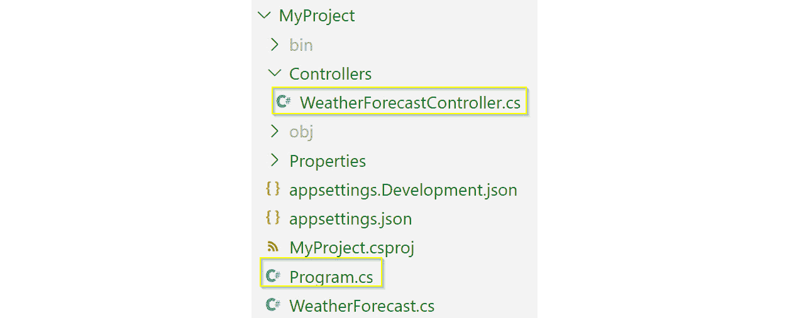

图 9.2：在 VS Code 中新创建的 MyProject 结构，突出显示关键部分

### 深入了解 WeatherForecastController

默认模板中的控制器前面有两个属性：

+   `[ApiController]`：此属性添加了常见的、方便的（但具有观点）Web API 功能。

+   `[Route("[controller]")]`：此属性用于提供给定控制器的路由模式。

例如，在这些属性不存在或请求复杂的情况下，您需要自己验证传入的 HTTP 请求，而不需要默认的路由：

```cs
[ApiController]
[Route("[controller]")]
public class WeatherForecastController : ControllerBase
{
```

此控制器以 `/WeatherForecast` 作为路由。路由通常由位于 `Controller` 之前的单词组成，除非有其他指定。在专业开发 API 或拥有客户端和服务器端应用程序时，建议在路由前预先添加 `/api`，使其成为 `[Route("api/[controller]")]`。

接下来，您将学习控制器类的声明。常见的控制器功能来自派生的 `ControllerBase` 类和一些组件（通常是一个日志记录器）以及服务。这里唯一有趣的部分是，您使用 `ILogger<WeatherForecastController>` 而不是 `Ilogger`：

```cs
    private readonly ILogger<WeatherForecastController> _logger;
    public WeatherForecastController(ILogger<WeatherForecastController> logger)
    {
        _logger = logger;
    }
```

使用泛型部分的原因纯粹是为了从日志被调用的地方获取上下文。使用日志记录器的泛型版本，您使用作为泛型参数提供的类的完全限定名称。调用 `logger.Log` 将在其前面加上上下文；在这种情况下，它将是 `Chapter09.Service.Controllers.WeatherForecastController[0]`。

最后，看看以下控制器方法：

```cs
    [HttpGet]
    public IEnumerable<WeatherForecast> Get()
    {
        return new List<WeatherForecast>(){new WeatherForecast()};
    }
}
```

`[HttpGet]` 属性将 `Get` 方法与根控制器端点（`/WeatherForecast`）的 HTTP GET 方法绑定。对于每个 HTTP 方法都有一个该属性的版本，它们是 `HttpGet`、`HttpPost`、`HttpPatch`、`HttpPut` 和 `HttpDelete`。要检查服务是否正常工作，请使用以下命令运行应用程序：

```cs
dotnet run --urls=https://localhost:7021/
```

这里，`-urls=https://localhost:7021/` 参数不是必需的。这个参数只是确保.NET 选择的端口与在执行此示例时指示的相同。

要查看输出，请在浏览器中导航到 `https://localhost:7021/weatherforecast/`。这将返回在调用 HTTP GET 时一个默认的 `WeatherForecast`：

`[{"date":"0001-01-01T00:00:00","temperatureC":0,"temperatureF":32,"summary":null}].`

注意

当 `https://localhost:7021/weatherforecast/` 显示错误消息（`localhost refused to connect`）时，这意味着应用程序可能正在运行，但端口不同。所以，始终记得按照 *创建新项目* 部分中描述的方式指定端口（*步骤 5*）。

### 以不同的状态码响应

查找 `public IEnumerable<WeatherForecast> Get()` 可以响应哪些状态码。使用以下步骤，你可以对其进行操作并在浏览器中检查发生了什么：

1.  在浏览器中导航到 `https://localhost:7021/weatherforecast/`。

1.  点击 `更多工具`。

1.  选择 `开发者工具` 选项。或者，你可以使用 `F12` 键来启动开发者工具。

1.  接下来，点击 `网络` 标签。

1.  点击 `头部` 标签。你会看到 `https://localhost:7021/weatherforecast/` 返回 `200` `状态码`：

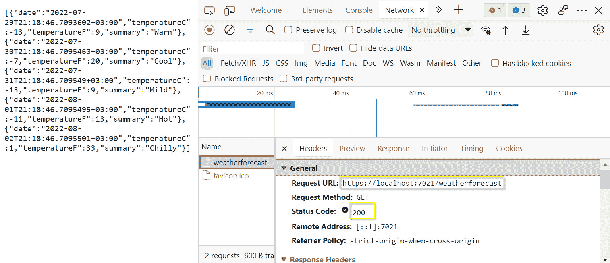

图 9.3：开发者工具网络标签页——检查成功响应的响应头

1.  创建一个名为 `GetError` 的新端点，如果在程序运行期间出现罕见情况，它会抛出异常：

    ```cs
            [HttpGet("error")]
            public IEnumerable<WeatherForecast> GetError()
            {
                throw new Exception("Something went wrong");
            }
    ```

1.  现在，调用 `https://localhost:7021/weatherforecast/error`。它返回状态码为 `500`：

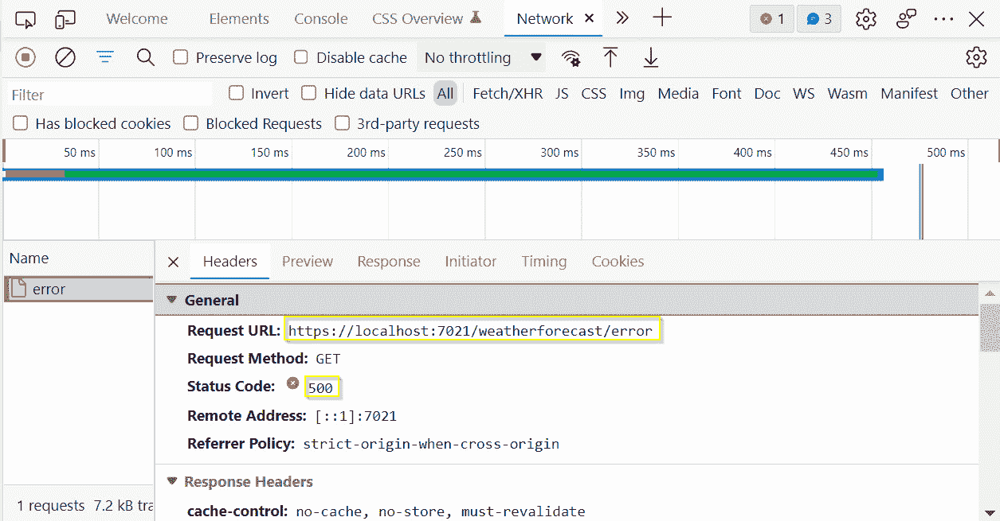

图 9.4：开发者工具网络标签页——检查带有异常的响应

如果你想返回不同的状态码，应该怎么做？为此，`BaseController` 类包含用于返回所需任何类型状态码的实用方法。例如，如果你想显式返回一个 OK 响应，而不是立即返回一个值，你可以返回 `Ok(value)`。然而，如果你尝试更改代码，你会得到以下错误：

```cs
Cannot implicitly convert type 'Microsoft.AspNetCore.Mvc.OkObjectResult' to 'Chapter09.Service.Models.WeatherForecast'
```

这不起作用，因为你没有从控制器返回 HTTP 状态码；你要么返回某个值，要么抛出某个错误。要返回你选择的任何状态码，你需要更改返回类型。因此，控制器永远不应该有某种值的返回类型。它应该始终返回 `IActionResult` 类型——一个支持所有状态码的类型。

创建一个获取任何一周中任何一天天气的方法。如果找不到该天（小于 `1` 或大于 `7` 的值），你将显式返回 `404 – not found`：

```cs
[HttpGet("weekday/{day}")]
public IActionResult GetWeekday(int day)
{
    if (day < 1 || day > 7)
    {
        return NotFound($"'{day}' is not a valid day of a week.");
    }
    return Ok(new WeatherForecast());
}
```

在这里，你在端点末尾添加了一个新的 `{day}`。这是一个占位符值，来自匹配的函数参数（在这种情况下，`day`）。重新运行服务并导航到 `https://localhost:7021/weatherforecast/weekday/8` 将导致 `404 – not found` 状态码，因为它超过了最大允许的天数值，即 `7`：

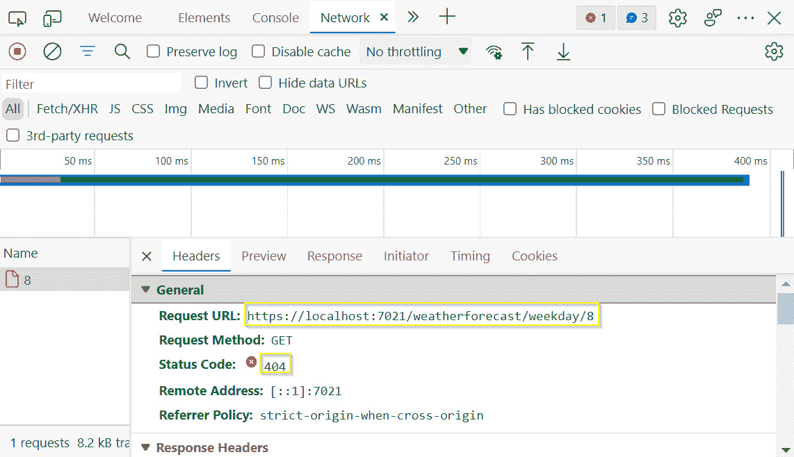

图 9.5：寻找不存在的一周中的天气预报的响应

注意

你可以在 [`packt.link/SCudR`](https://packt.link/SCudR) 找到用于此示例的代码。

这结束了本主题的理论部分。在接下来的部分，你将通过练习将其付诸实践。

## 练习 9.01：.NET Core 当前时间服务

一旦你成功运行了一个 Web API，添加新的控制器应该很简单。通常，检查一个服务是否在运行，最基本的方法是检查它是否返回 OK 或获取当前的 `DateTime` 值。在这个练习中，你将创建一个简单的当前时间服务，返回 ISO 标准的当前时间。执行以下步骤来完成此操作：

1.  创建一个新的控制器 `TimeController` 来获取本地时间，并进一步添加用于测试的功能：

    ```cs
        [ApiController]
        [Route("[controller]")]
        public class TimeController : ControllerBase
        {
    ```

这里显示的控制器不仅仅用于测试；它还充当业务逻辑。

1.  添加一个名为 `GetCurrentTime` 的 HTTP GET 端点，指向 `time/current` 路由。你将使用它来获取当前时间：

    ```cs
            [HttpGet("current")]
            public IActionResult GetCurrentTime()
            {
    ```

1.  将当前的 `DateTime` 转换为 ISO 格式的字符串：

    ```cs
                return Ok(DateTime.Now.ToString("o"));
            }
        }
    ```

1.  导航到 `https://localhost:7021/time/current`，你应该看到以下响应：

    ```cs
    2022-07-30T15:06:28.4924356+03:00
    ```

如 *Web API 项目结构* 部分所述，你可以使用端点来确定服务是否正在运行。如果它在运行，那么你会得到 `DateTime` 值，这在前面的输出中已经看到。如果它没有运行，那么你会得到一个状态码为 `404 – not found` 的响应。如果它在运行但存在问题，那么你会得到 `500` 状态码。

注意

你可以在 [`packt.link/OzaTd`](https://packt.link/OzaTd) 找到用于此练习的代码。

到目前为止，你所有的关注点都在控制器上。现在是时候将你的注意力转移到 Web API 的另一个关键部分——`Program` 类上。

## Web API 的引导

`Program` 类将整个 API 连接在一起。用通俗易懂的话来说，你注册了所有控制器使用的抽象实现，并添加了所有必要的中间件。

### 依赖注入

在 *第二章*，*构建面向对象的高质量代码* 中，你探讨了依赖注入（DI）的概念。在 *第七章*，*使用 ASP.NET 创建现代 Web 应用程序* 中，你看到了一个用于日志服务的 DI 示例。在本章中，你将获得在依赖注入（DI）和反转控制（IoC）容器方面的实践经验——这是一个用于在中央位置连接和解决所有依赖关系的组件。在 .NET Core 及其后续版本中，默认容器是 `Microsoft.Extensions.DependencyInjection`。你将在稍后了解更多关于它的内容。

### Program.cs 和最小 API

.NET 6 中最简单的 Web API 看起来是这样的：

```cs
// Inject dependencies (DI)
var builder = WebApplication.CreateBuilder(args);
builder.Services.AddControllers();
// Add middleware
var app = builder.Build();
if (builder.Environment.IsDevelopment())
{
    app.UseDeveloperExceptionPage();
}
app.MapControllers();
app.Run();
```

这是一个最小 API，因为它使用了顶层语句功能。在 .NET 6 之前，你会在 `Startup` 类（`Configure` 和 `ConfigureService`）和 `Program` 类中找到两个方法。现在你只有一个文件，`Program.cs`，没有类或方法。你仍然可以使用旧的方式启动应用程序。实际上，.NET 6 将在底层生成类似的类。然而，如果你正在使用 .NET 6 创建新应用程序，那么使用最小 API 应该是首选的。

分析前面的代码片段。要启动应用程序，你首先需要构建它。因此，你将使用以下代码行创建一个构建器：

```cs
var builder = WebApplication.CreateBuilder(args);
```

`builder.Services` 指定要注入哪些服务。在这种情况下，你注册了控制器的实现。因此，这里只有一个控制器被调用——即 `WeatherForecastController`：

```cs
builder.Services.AddControllers();
```

当你使用 `builder.Build()` 时，你可以访问 `app` 对象，并通过添加中间件进一步配置应用程序。例如，要添加控制器路由，请调用以下代码：

```cs
app.MapControllers();
```

最后，`builder.Environment.IsDevelopment()` 检查环境是否为开发环境。如果是开发环境，它将调用 `app.UseDeveloperExceptionPage();`，在失败时添加详细错误。

日志在任何地方都没有被提及；但你仍然在使用它。一个常见的模式是将所有相关的注入分组在 `IServiceCollection` 的同一个扩展方法下。所有与控制器相关的功能，包括日志，的扩展方法示例是 `AddControllers` 方法。

你已经在运行 API 后立即看到了通过控制台日志发送的日志消息。在底层，调用了 `builder.Services.AddLogging` 方法。此方法清除所有日志提供程序：

```cs
builder.Services.AddLogging(builder =>
{
    builder.ClearProviders();
});
```

如果你现在运行应用程序，你将不会在控制台（*图 9.6*）中看到任何内容：

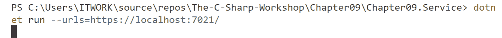

图 9.6：运行不显示日志的应用程序

然而，如果你将 `AddLogging` 修改为包含 `Console` 和 `Debug` 日志，如下所示，你将看到如图 *9.7* 所示的日志：

```cs
builder.Services.AddLogging(builder =>
{
    builder.ClearProviders();
    builder.AddConsole();
    builder.AddDebug();
});
```

现在，向 `WeatherForecastController` 的错误端点添加错误日志功能。当程序运行时出现罕见情况时，这将抛出异常：

```cs
[HttpGet("error")]
public IEnumerable<WeatherForecast> GetError()
{
    _logger.LogError("Whoops");
    throw new Exception("Something went wrong");
}
```

使用以下命令重启 API：

```cs
dotnet run --urls=https://localhost:7021/
```

现在，调用`https://localhost:7021/weatherforecast/error`，这将显示记录的消息（比较*图 9.6*和*图 9.7*）：

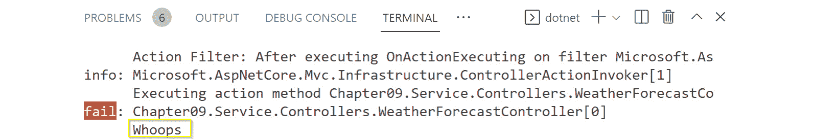

图 9.7：在终端上显示的错误消息，哎呀

## `AddLogging`方法的工作原理

`AddLogging`方法是如何工作的？`AddLogging`方法的反编译代码如下所示：

```cs
services.AddSingleton<ILoggerFactory, LoggerFactory>();
```

最好不要自己初始化日志记录器。`ILoggerFactory`提供了一个功能，可以从一个单一的位置创建日志记录器。虽然`ILoggerFactory`是一个接口，但`LoggerFactory`是此接口的实现。`AddSingleton`是一个方法，指定将创建并使用单个`LoggerFactory`实例，每当引用`ILoggerFactory`时。

现在问题来了：为什么在控制器中没有使用`ILoggerFactory`？在解析控制器实现时，`ILoggerFactory`在幕后使用。当公开控制器依赖项，如`logger`时，你不再需要关心它是如何初始化的。这是一个巨大的好处，因为它使得持有依赖项的类既更简单又更灵活。

如果你确实想使用`ILoggerFactory`而不是`Ilogger`，你可以有一个接受工厂的构造函数，如下所示：

```cs
public WeatherForecastController(ILoggerFactory logger)
```

然后，你可以用它来创建一个`logger`，如下所示：

```cs
_logger = logger.CreateLogger(typeof(WeatherForecastController).FullName);
```

这个后者的`logger`功能与前者相同。

本节讨论了在中央位置管理服务依赖的`AddSingleton`方法。继续下一节，使用依赖注入解决依赖复杂性。

### 注入组件的生命周期

`AddSingleton`方法很有用，因为复杂的应用程序有数百甚至数千个依赖项，通常跨不同组件共享。管理每个初始化都是一个相当大的挑战。依赖注入通过提供一个集中位置来管理依赖项及其生命周期来解决此问题。在继续前进之前，你需要了解更多关于依赖注入生命周期的知识。

.NET 中有三种注入对象的生命周期：

+   单例：每次应用程序生命周期初始化一次对象

+   范围：每次请求初始化一次对象

+   临时：每次引用时初始化对象

为了更好地说明依赖注入和不同的服务生命周期，下一节将重构现有的`WeatherForecastController`代码。

## 服务中的依赖注入示例

服务是最高级别逻辑的持有者。控制器本身不应执行任何业务逻辑，而应将请求委托给能够处理它的其他对象。应用此原则，并使用依赖注入重构`GetWeekday`方法。

首先，为你要将所有逻辑移动到的服务创建一个接口。这样做是为了创建一个抽象，你将后来提供实现。需要一个抽象，因为你希望尽可能多地从控制器中移除逻辑：

```cs
public interface IWeatherForecastService
{
    WeatherForecast GetWeekday(int day);
}
```

当你将一部分代码从控制器移开时，你希望同时处理错误场景。在这种情况下，如果提供的日期不在 `1` 和 `7` 之间，你将返回一个 `404 – not found` 错误。然而，在服务级别，没有 HTTP 状态码的概念。因此，你将抛出一个异常，而不是返回一个 HTTP 消息。为了正确处理异常，你将创建一个名为 `NoSuchWeekdayException` 的自定义异常：

```cs
public class NoSuchWeekdayException : Exception
{
    public NoSuchWeekdayException(int day) 
        : base($"'{day}' is not a valid day of a week.") { }
}
```

接下来，创建一个实现服务的类。你将把你的代码移到这里：

```cs
public class WeatherForecastService : IWeatherForecastService
{
    public WeatherForecast GetWeekday(int day)
    {
        if (day < 1 || day > 7)
        {
            throw new NoSuchWeekdayException(day);
        }
        return new WeatherForecast();
    }
}
```

与之前的代码相比，这里唯一的区别是，你使用了 `throw new NoSuchWeekdayException` 而不是返回 `NotFound`。

现在，将服务注入到控制器中：

```cs
private readonly IWeatherForecastService _weatherForecastService;
private readonly Ilogger _logger;
public WeatherForecastController(IloggerFactory logger, IWeatherForecastService weatherForecastService)
{
    _weatherForecastService = weatherForecastService;
    _logger = logger.CreateLogger(typeof(WeatherForecastController).FullName);
}
```

在 *响应不同状态码* 部分的清理后的控制器方法，具有最少的业务逻辑，现在看起来是这样的：

```cs
[HttpGet("weekday/{day}")]
public IActionResult GetWeekday(int day)
{
    try
    {
        var result = _weatherForecastService.GetWeekday(day);
        return Ok(result);
    }
    catch(NoSuchWeekdayException exception)
    {
        return NotFound(exception.Message);
    }
}
```

虽然看起来可能还是相同的代码；然而，关键点在于控制器不再执行任何业务逻辑。它只是将服务的结果映射回一个 HTTP 响应。

注意

在 *错误处理* 部分中，你将回到这里并进一步从控制器中移除代码，使其尽可能轻量。

如果你运行此代码，在调用控制器的任何端点时，你将得到以下异常：

```cs
Unable to resolve service for type 'Chapter09.Service.Examples.TemplateApi.Services.IweatherForecastService' while attempting to activate 'Chapter09.Service.Examples.TemplateApi.Controllers.WeatherForecastController'
```

这个异常表明 `WeatherForecastController` 无法确定 `IWeatherForecastService` 的实现。因此，你需要指定哪个实现适合所需的抽象。例如，这可以在 `Program` 类中如下完成：

```cs
builder.Services.AddSingleton<IWeatherForecastService, WeatherForecastService>();
```

`AddSingleton` 方法将此视为 `IWeatherForecastService` 的 `WeatherForecastService` **实现**。在接下来的段落中，你将了解它是如何工作的。

现在你有一个要注入的服务，你可以探索每次调用以下控制器方法时每个注入对服务调用的影响。为此，你将稍微修改 `WeatherForecastService` 和 `WeatherForecastController`。

在 `WeatherForecastService` 中，执行以下操作：

1.  注入一个 `logger`:

    ```cs
            private readonly ILogger<WeatherForecastService> _logger;
            public WeatherForecastService(ILogger<WeatherForecastService> logger)
            {
                _logger = logger;
            }
    ```

1.  当服务初始化时，记录一个随机的 `Guid`，将构造函数修改如下：

    ```cs
            public WeatherForecastService(ILogger<WeatherForecastService> logger)
            {
                _logger = logger;
                _logger.LogInformation(Guid.NewGuid().ToString());
            }
    ```

在 `WeatherForecastController` 中，执行以下操作：

1.  注入 `WeatherForecastService` 的第二个实例：

    ```cs
        public class WeatherForecastController : ControllerBase
        {
            private readonly IWeatherForecastService _weatherForecastService1;
            private readonly IWeatherForecastService _weatherForecastService2;
            private readonly ILogger _logger;
            public WeatherForecastController(ILoggerFactory logger, IWeatherForecastService weatherForecastService1, IWeatherForecastService weatherForecastService2)
            {
                _weatherForecastService1 = weatherForecastService1;
                _weatherForecastService2 = weatherForecastService2;
                _logger = logger.CreateLogger(typeof(WeatherForecastController).FullName);
            }
    ```

1.  在获取星期几时调用两个实例：

    ```cs
            [HttpGet("weekday/{day}")]
            public IActionResult GetWeekday(int day)
            {
                try
                {
                    var result = _weatherForecastService1.GetWeekday(day);
                    result = _weatherForecastService1.GetWeekday(day);
                    return Ok(result);
                }
                catch (NoSuchWeekdayException exception)
                {
                    return NotFound(exception.Message);
                }
            }
    ```

`GetWeekday` 方法被调用了两次，因为这有助于更好地说明依赖注入的生命周期。现在，是时候探索不同的依赖注入生命周期了。

## 单例

按以下方式在 `Program.cs` 中将服务注册为单例：

```cs
builder.Services.AddSingleton<IWeatherForecastService, WeatherForecastService>();
```

在调用应用程序后，你将看到以下日志在运行代码时生成：

```cs
info: Chapter09.Service.Services.WeatherForecastService[0]
      2b0c4e0c-97ff-4472-862a-b6326992d9a6
info: Chapter09.Service.Services.WeatherForecastService[0]
      2b0c4e0c-97ff-4472-862a-b6326992d9a6
```

如果你再次调用应用程序，你将看到相同的 GUID 已被记录：

```cs
info: Chapter09.Service.Services.WeatherForecastService[0]
      2b0c4e0c-97ff-4472-862a-b6326992d9a6
info: Chapter09.Service.Services.WeatherForecastService[0]
      2b0c4e0c-97ff-4472-862a-b6326992d9a6
```

这证明了服务只初始化了一次。

## 作用域

按以下方式在 `Program.cs` 中将服务注册为作用域：

```cs
builder.Services.AddScoped<IWeatherForecastService, WeatherForecastService>();
```

在调用应用程序后，你将看到以下日志在运行代码时生成：

```cs
info: Chapter09.Service.Services.WeatherForecastService[0]
      921a29e8-8f39-4651-9ffa-2e83d2289f29
info: Chapter09.Service.Services.WeatherForecastService[0]
      921a29e8-8f39-4651-9ffa-2e83d2289f29
```

再次调用 `WeatherForecastService` 时，你将看到以下内容：

```cs
info: Chapter09.Service.Services.WeatherForecastService[0]
      974e082d-1ff5-4727-93dc-fde9f61d3762
info: Chapter09.Service.Services.WeatherForecastService[0]
      974e082d-1ff5-4727-93dc-fde9f61d3762
```

这是一个不同的 GUID，已经被记录。这证明了服务每次请求都会初始化一次，但在新的请求上会初始化一个新的实例。

## 瞬态

在 `Program.cs` 中将服务注册为瞬态的方式如下：

```cs
builder.Services.AddTransient<IWeatherForecastService, WeatherForecastService>();
```

在调用应用程序后，你应该在运行代码时生成的日志中看到以下内容：

```cs
info: Chapter09.Service.Services.WeatherForecastService[0]
      6335a0aa-f565-4673-a5c4-0590a5d0aead
info: Chapter09.Service.Services.WeatherForecastService[0]
      4074f4d3-5e50-4748-9d6f-15fb6a782000
```

有两个不同的 GUID 被记录证明这两个服务都是使用不同的实例初始化的。在 Web API 之外使用 DI 和 IoC 是可能的。通过 IoC 的 DI 只是一个带有 Web API 模板提供的少量额外功能的库。

注意

如果你想在 ASP.NET Core 之外使用 IoC，请安装以下 NuGet（或其他 IoC 容器）：`Microsoft.Extensions.DependencyInjection`。

### TryAdd

到目前为止，你已经使用 `Add[Lifetime]` 函数将实现与其抽象连接起来。然而，在大多数情况下，这并不是最佳实践。通常，你希望单个实现与单个抽象连接。然而，如果你反复调用 `Add[Lifetime]`，例如 `AddSingleton` 函数，你将在下面创建一个实现实例的集合（重复）。这很少是意图，因此你应该保护自己免受这种情况的影响。

连接依赖项最干净的方式是通过 `TryAdd[Lifetime]` 方法。在重复依赖项的情况下，它将简单地不会添加重复项。为了说明两种 DIs 版本之间的区别，比较使用不同方法注入的服务数量。在这里，你将注入两个相同的服务作为单例。

在这里，你使用 `Add[Lifetime]` 服务作为单例：

```cs
builder.Services.AddSingleton<IWeatherForecastService, WeatherForecastService>();
Debug.WriteLine("Services count: " + services.Count);
builder.services.AddSingleton<IWeatherForecastService, WeatherForecastService>();
Debug.WriteLine("Services count: " + services.Count);
```

命令将显示以下输出：

```cs
Services count: 156
Services count: 157
```

在这里，你使用 `TryAdd[Lifetime]` 服务作为单例：

```cs
builder.Services.TryAddSingleton<IWeatherForecastService, WeatherForecastService>();
Debug.WriteLine("Services count: " + services.Count);
builder.Services.TryAddSingleton<IWeatherForecastService, WeatherForecastService>();
Debug.WriteLine("Services count: " + services.Count);
```

命令将显示以下输出：

```cs
Services count: 156
Services count: 156
```

注意到 `Add[Lifetime]` 在输出中添加了重复项，而 `TryAdd[Lifetime]` 没有这样做。由于你不想有重复的依赖项，建议使用 `TryAdd[Lifetime]` 版本。

你也可以为具体的类进行注入。调用 `builder.Services.AddSingleton<WeatherForecastService, WeatherForecastService>();` 是有效的 C# 代码；然而，这并没有太多意义。DI 用于将实现注入到抽象中。在启动服务时这不会工作，因为以下错误将会显示：

```cs
Unable to resolve a controller
```

错误发生是因为仍然需要提供抽象-实现绑定。只有当控制器构造函数中暴露的是具体实现而不是抽象时，它才会工作。在实践中，这种情况很少使用。

你已经了解到通过 `TryAdd[Lifetime]` 方法是连接依赖项最干净的方式。现在你将创建一个接受原始参数（`int` 和 `string`）的服务，并查看它在 IoC 容器中如何管理其非原始依赖项。

### 使用 IoC 容器进行手动注入

有一些场景，在注入之前你需要创建一个服务实例。一个例子用例可能是一个在构造函数中有原始参数的服务，换句话说，是一个具有配置好的预报刷新间隔的特定城市的天气预报服务。因此，在这里你不能注入一个字符串或一个整数，但你可以创建一个具有整数和字符串的服务并注入它。

修改`WeatherForecastService`以包含所述功能：

```cs
public class WeatherForecastServiceV2 : IWeatherForecastService
{
    private readonly string _city;
    private readonly int _refreshInterval;
    public WeatherForecastService(string city, int refreshInterval)
    {
        _city = city;
        _refreshInterval = refreshInterval;
    }
```

返回到`Program`类，尝试注入一个具有`5`（小时）刷新间隔的`New York`服务：

```cs
builder.Services.AddSingleton<IWeatherForecastService, WeatherForecastService>(BuildWeatherForecastService);
static WeatherForecastServiceV2 BuildWeatherForecastService(IServiceProvider _)
{
    return new WeatherForecastServiceV2("New York", 5);
}
```

为了注入服务，就像往常一样，你使用`builder.Services.Add[Lifetime]`方法的版本。然而，在此基础上，你还提供了一个参数——一个指定如何创建服务的委托。可以通过调用`IServiceCollection`上的`BuildServices`方法来访问服务提供者。这个委托接受`IServiceProvider`作为输入，并使用它来构建一个新的服务。

在这种情况下，你没有使用它，因此按照丢弃操作符（`_`）命名了参数。函数的其余部分只是简单地返回上一段落的值（为了简洁，你不会添加任何额外的逻辑来使用新值）。如果你有一个更复杂的服务，例如，需要一个其他服务的服务，你可以从`IServiceProvider`调用`.GetService<ServiceType>`方法。

`Build`和`Create`是两个常见的函数名。然而，它们不应该被互换使用。当构建单个专用对象时使用`Build`，而当意图是生成多种类型的多个对象时使用`Create`。

注意

你可以在[`packt.link/fBFRQ`](https://packt.link/fBFRQ)找到此示例使用的代码。

## 练习 9.02：在 Country API 时区中显示当前时间

在这个练习中，你被要求创建一个 Web API，该 API 提供 UTC 不同时区的日期和时间。通过 URL，你将传递一个介于`-12`和`+12`之间的数字，并返回该时区的当前时间。

执行以下步骤：

1.  创建一个名为`ICurrentTimeProvider`的接口，其中有一个名为`DateTime GetTime(string timezone)`的方法：

    ```cs
    public interface ICurrentTimeProvider
    {
        DateTime GetTime(string timezoneId);
    }
    ```

1.  创建一个名为`CurrentTimeUtcProvider`的类，实现`ICurrentTimeProvider`以实现应用程序所需的逻辑：

    ```cs
    public class CurrentTimeUtcProvider : ICurrentTimeProvider
    {
    ```

1.  实现将当前`DateTime`转换为`Utc`并根据传递的时间区进行偏移的方法：

    ```cs
        public DateTime GetTime(string timezoneId)
        {
            var timezoneInfo = TimeZoneInfo.FindSystemTimeZoneById(timezoneId);
            var time = TimeZoneInfo.ConvertTimeFromUtc(DateTime.UtcNow, timezoneInfo);
            return time;
        }
    }
    ```

1.  创建一个`CurrentTimeProviderController`控制器以确保它接受构造函数中的`ICurrentTimeProvider`：

    ```cs
    [ApiController]
    [Route("[controller]")]
    public class CurrentTimeController : ControllerBase
    {
        private readonly ICurrentTimeProvider _currentTimeProvider;
        public CurrentTimeController(ICurrentTimeProvider currentTimeProvider)
        {
            _currentTimeProvider = currentTimeProvider;
        }
    ```

1.  创建一个名为`IActionResult Get(string timezoneId)`的`HttpGet`端点，该端点调用当前时间提供者并返回当前时间：

    ```cs
        [HttpGet]
        public IActionResult Get(string timezoneId)
        {
            var time = _currentTimeProvider.GetTime(timezoneId);
            return Ok(time);
        }
    }
    ```

请注意，`{timezoneId}` 在 `HttpGet` 属性中没有指定。这是因为模式用于端点的 REST 部分；然而，在这个场景中，它作为查询字符串的参数传递。如果字符串包含空格或其他特殊字符，它应该在传递之前进行编码。你可以使用此工具对字符串进行 URL 编码：[`meyerweb.com/eric/tools/dencoder/`](https://meyerweb.com/eric/tools/dencoder/)。

1.  在 `Program` 类中注入服务：

    ```cs
    builder.Services.AddSingleton<ICurrentTimeProvider, CurrentTimeUtcProvider>();
    ```

在这里，你将服务作为单例注入，因为它是无状态的。

1.  使用 `timezoneid` 值调用 `https://localhost:7021/CurrentTime?timezone=[yourtimezone]` 端点。例如，你可以调用以下端点：`https://localhost:7021/CurrentTime?timezoneid=Central%20Europe%20Standard%20Time`。

你将得到显示该时区日期和时间的响应：

```cs
"2021-09-18T20:32:29.1619999"
```

注意

你可以在 [`packt.link/iqGJL`](https://packt.link/iqGJL) 找到用于此练习的代码。

## OpenAPI 和 Swagger

OpenAPI 是一种 **REST API** 描述格式。它定义了 API 的端点、支持的认证方法、接受的参数以及它所提供的事例请求和响应。REST API 可以与 JSON 和 XML 格式一起工作；然而，JSON 被频繁选择。Swagger 是一组实现 OpenAPI 标准的工具和库。Swagger 生成两样东西：

+   一个用于调用你的 API 的网页

+   生成客户端代码

在 .NET 中，有两个库用于与 Swagger 一起工作：

+   `NSwag`

+   `Swashbuckle`

### 使用 Swagger Swashbuckle

在本节中，你将使用 `Swashbuckle` 来演示测试 API 和生成 API 文档的多种方法之一。因此，通过运行以下命令安装 `Swashbuckle.AspNetCore` 包：

```cs
dotnet add package Swashbuckle.AspNetCore
```

在 `Program.cs` 中 `builder.Build()` 调用之前，添加以下代码行：

```cs
builder.Services.AddSwaggerGen();
```

这将注入生成 Swagger 架构和文档测试页所需的 Swagger 服务。

在 `Program.cs` 中的 `builder.Build()` 之后，添加以下内容：

```cs
app.UseSwagger();
app.UseSwaggerUI(c => { c.SwaggerEndpoint("/swagger/v1/swagger.json", "My API V1"); }); 
```

第一行支持访问 OpenAPI Swagger 规范，第二行允许在用户友好的网页上访问规范。

现在，按照以下方式运行程序：

```cs
dotnet run --urls=https://localhost:7021/
```

当你导航到 `https://localhost:7021/swagger/` 时，你会看到以下屏幕：

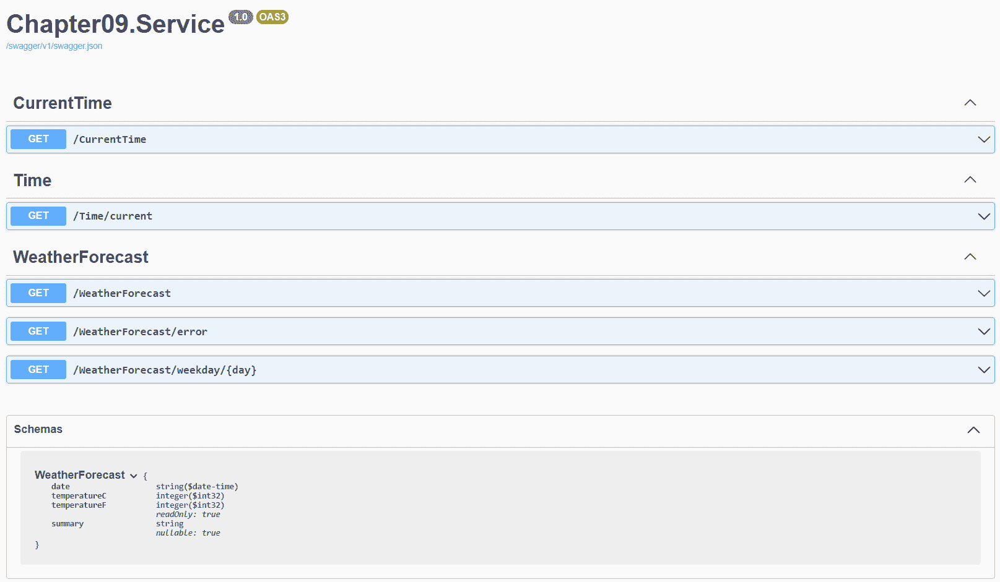

图 9.8：用户友好的 Swagger 端点

点击任何端点都可以让你向它们发送 HTTP 请求。这个页面可以被配置为包含关于项目的常见信息，例如联系信息、许可证、描述、服务条款等等。

Swagger 的好处不止于此。如果你有注释，你还可以将它们包含在这个页面上。你还可以包含端点产生的所有可能的响应类型。你甚至可以包含示例请求，并在调用 API 时将它们设置为默认值。

创建一个新的端点来保存天气预报，然后另一个端点来检索它。逐一记录这两个方法。因此，首先，更新`IWeatherForecastService`接口以包含两个新方法，`GetWeekday`和`GetWeatherForecast`，如下所示：

```cs
    public interface IWeatherForecastService
    {
        WeatherForecast GetWeekday(int day);
        void SaveWeatherForecast(WeatherForecast forecast);
        WeatherForecast GetWeatherForecast(DateTime date);
    }
```

接下来，向`WeatherForecastService`添加这些方法的实现。为了保存天气预报，你需要存储，最简单的存储方式是`IMemoryCache`。在这里，你需要为`IMemoryCache`添加一个新的字段：

```cs
private readonly IMemoryCache _cache;
```

现在，更新构造函数以注入`IMemoryCache`：

```cs
public WeatherForecastService(ILogger<WeatherForecastService> logger, string city, int refreshInterval, IMemoryCache cache)
        {
            _logger = logger;
            _city = city;
            _refreshInterval = refreshInterval;
            _serviceIdentifier = Guid.NewGuid();
            _cache = cache;
        }
```

然后，创建`SaveWeatherForecast`方法来保存天气预报：

```cs
        public void SaveWeatherForecast(WeatherForecast forecast)
        {
            _cache.Set(forecast.Date.ToShortDateString(), forecast);
        }
```

创建一个`GetWeatherForecast`方法来获取天气预报：

```cs
        public WeatherForecast GetWeatherForecast(DateTime date)
        {
            var shortDateString = date.ToShortDateString();
            var contains = _cache.TryGetValue(shortDateString, out var entry);
            return !contains ? null : (WeatherForecast) entry;
        }
```

现在，回到`WeatherForecastController`并为每个方法创建一个端点，以便你可以使用 HTTP 请求来测试它：

```cs
        [HttpGet("{date}")]
        public IActionResult GetWeatherForecast(DateTime date)
        {
            var weatherForecast = _weatherForecastService1.GetWeatherForecast(date);
            if (weatherForecast == null) return NotFound();
            return Ok(weatherForecast);
        }
        [HttpPost]
        public IActionResult SaveWeatherForecast(WeatherForecast weatherForecast)
        {
            _weatherForecastService1.SaveWeatherForecast(weatherForecast);
            return CreatedAtAction("GetWeatherForecast", new { date = weatherForecast.Date.ToShortDateString()}, weatherForecast);
        }
```

请注意，在创建新的天气预报时，你返回一个`CreatedAtAction`结果。这返回一个 HTTP 状态码为`201`的 URI，用于获取创建的资源。指定了，为了稍后获取创建的预报，你可以使用`GetWeatherForecast`。匿名`new { date = weatherForecast.Date.ToShortDateString()}`对象指定了调用该操作所需的参数。你传递了`Date.ToShortDateString()`而不是仅仅一个日期，因为完整的`DateTime`包含了你不需要的信息。在这里，你只需要一个日期；因此，你明确地切掉了不需要的部分。

通过描述每个方法的功能和它可以返回的状态码来记录每个方法。然后，你将在每个端点上方添加此信息：

```cs
        /// <summary>
        /// Gets weather forecast at a specified date.
        /// </summary>
        /// <param name="date">Date of a forecast.</param>
        /// <returns>
        /// A forecast at a specified date.
        /// If not found - 404.
        /// </returns>
        [HttpGet("{date}")]
        [ProducesResponseType(StatusCodes.Status404NotFound)]
        [ProducesResponseType(StatusCodes.Status200OK)]
        public IActionResult GetWeatherForecast(DateTime date)
        /// <summary>
        /// Saves a forecast at forecast date.
        /// </summary>
        /// <param name="weatherForecast">Date which identifies a forecast. Using short date time string for identity.</param>
        /// <returns>201 with a link to an action to fetch a created forecast.</returns>
        [HttpPost]
        [ProducesResponseType(StatusCodes.Status201Created)]
        public IActionResult SaveWeatherForecast(WeatherForecast weatherForecast)
```

你现在已经为这两个端点添加了 XML 文档。使用`ProducesResponseType`，你指定了端点可以返回哪些状态码。如果你刷新 Swagger 页面，你将看到 Swagger 中的`SaveWeatherForecast`端点：

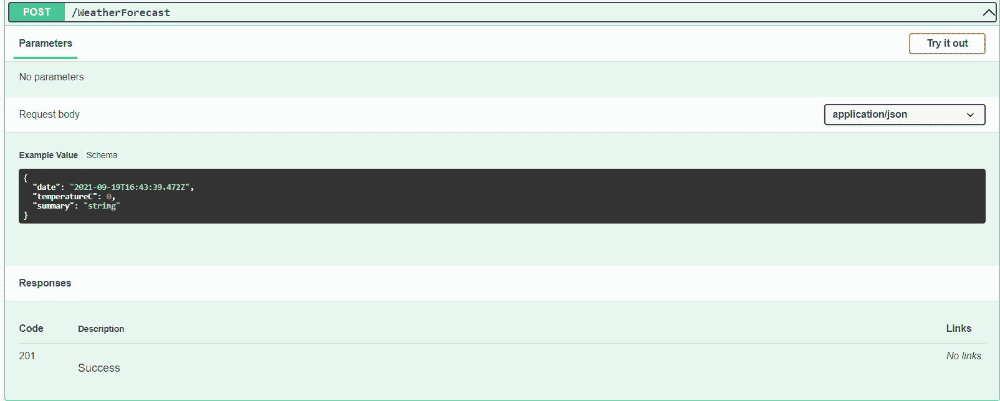

图 9.9：Swagger 中的 SaveWeatherForecast 端点

如果你刷新 Swagger 页面，你将看到 Swagger 中的`GetWeatherForecast`端点：

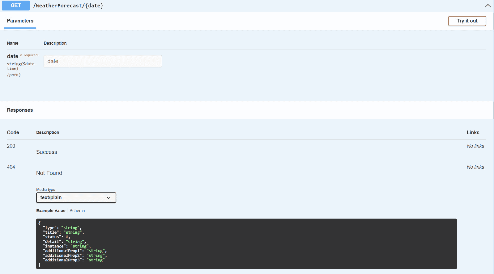

图 9.10：Swagger 中的 GetWeatherForecast 端点

你可以看到状态码的添加，但注释去哪里了？默认情况下，Swagger 不会选择 XML 文档。你需要通过配置项目文件来指定它需要做什么。为此，在目标框架属性组下方`<Project>`内添加以下代码段：

```cs
  <PropertyGroup>
    <GenerateDocumentationFile>true</GenerateDocumentationFile>
    <NoWarn>$(NoWarn);1591</NoWarn>
  </PropertyGroup>
```

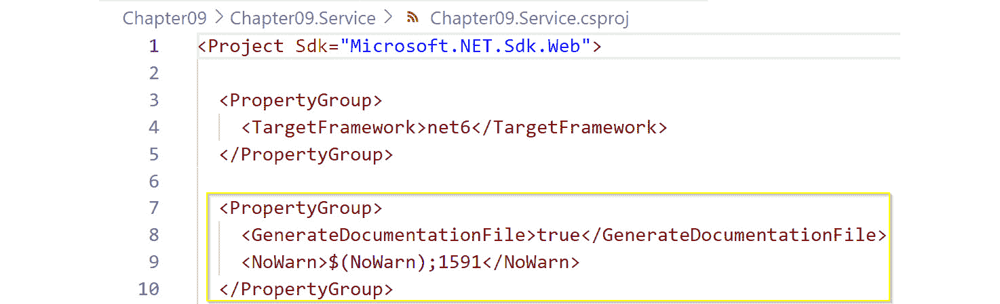

图 9.11：包含 XML 文档的 Swagger 配置

最后，转到`Program.cs`文件，将`service.AddSwaggerGen()`替换为以下内容：

```cs
            builder.Services.AddSwaggerGen(cfg =>
            {
                var xmlFile = $"{Assembly.GetExecutingAssembly().GetName().Name}.xml";
                var xmlPath = Path.Combine(AppContext.BaseDirectory, xmlFile);
                cfg.IncludeXmlComments(xmlPath);
            });
```

这是包含 XML 注释在 Swagger 文档中所需的最后一部分代码。现在，刷新页面，你应该会看到包含的注释：

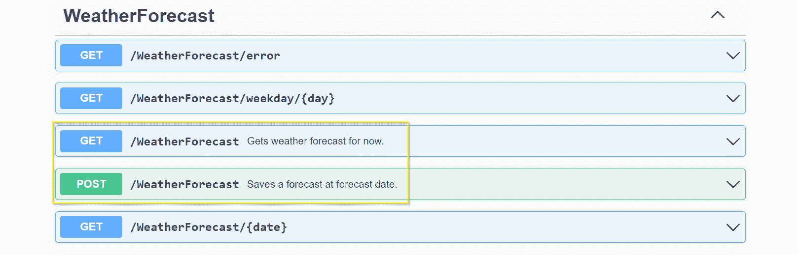

图 9.12：包含 XML 文档的 WeatherForecast Swagger 文档

注意

您可以在 [`packt.link/iQK5X`](https://packt.link/iQK5X) 找到此示例使用的代码。

您可以使用 Swagger 做很多事情；您可以将示例请求和响应包含在内，并为参数提供默认值。您甚至可以创建自己的 API 规范标准，并装饰项目命名空间，以便将相同的约定应用到每个控制器及其端点，但这超出了本书的范围。

最后要提到的是，从 Swagger 文档生成客户端的能力。要这样做，请按照以下步骤操作：

1.  为了下载 `swagger.json` OpenAPI 文档工件，导航到 `https://localhost:7021/swagger/v1/swagger.json`。

1.  在页面上任何位置右键单击并选择 `另存为` 选项。

1.  然后，按 `Enter` 键。

1.  接下来，您将使用此 JSON 生成客户端代码。因此，注册并登录到 [`app.swaggerhub.com/home`](https://app.swaggerhub.com/home)（您可以使用您的 GitHub 账户）。

1.  在新窗口中，点击 `创建新` 按钮（`1`）：

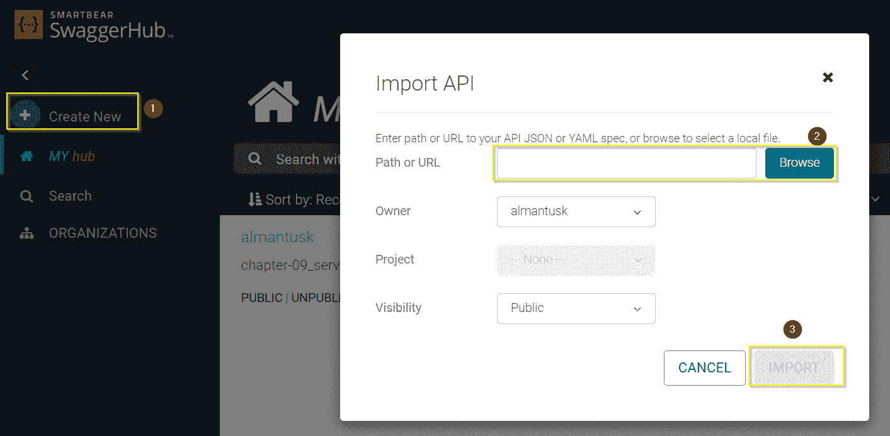

图 9.13：SwaggerHub 和导入 API 窗口

1.  选择 `导入并记录 API` 选项。

1.  通过点击 `浏览` 按钮（`2`）选择您刚刚下载的 Swagger 文件。

1.  然后，点击 `上传文件` 按钮：

    注意

    当您选择文件时，`导入` 按钮（*图 9.13* 中的 `3`）更改为 `上传文件` 按钮（*图 9.14* 中的 `3`）。

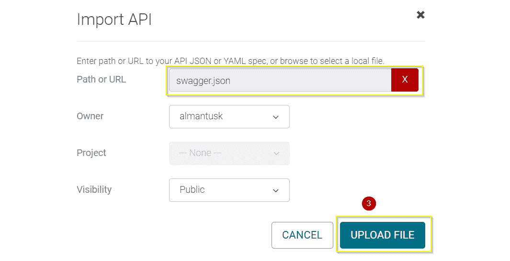

图 9.14：SwaggerHub 导入按钮更改为上传文件按钮

1.  在下一屏，请使用默认值保留服务的名称和版本。

1.  接下来，点击 `导入定义` 按钮：

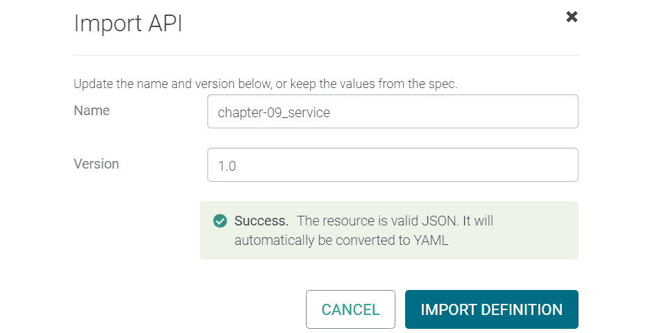

图 9.15：SwaggerHub 导入 Swagger 服务定义

1.  现在，`Swagger.json` API 规范已导入，您可以使用它生成强类型 C# 客户端代码来调用 API。因此，点击 `导出` 选项（`1`）。

1.  然后，点击 `客户端 SDK` 选项（`2`）。

1.  选择 `csharp` 选项（`3`）：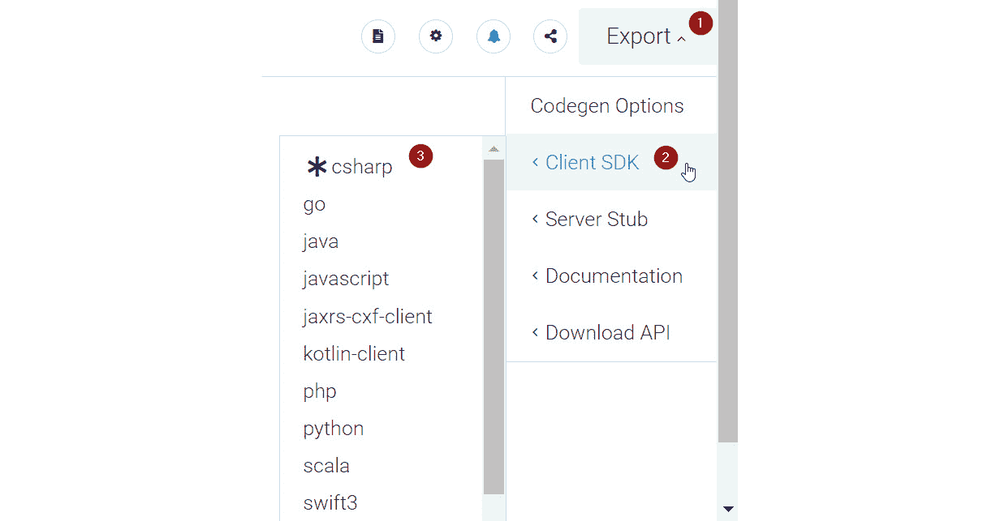

图 9.16：从 SwaggerHub 导出新的 C# 客户端

将下载一个 `csharp-client-generated.zip` 文件。

1.  提取 `csharp-client-generated.zip` 文件。

1.  导航到提取的文件夹并打开 `IO.Swagger.sln` 文件。您应该看到以下内容：


图 9.17：使用 SwaggerHub 生成的客户端文件

生成的客户端代码不仅包含强类型 HTTP 客户端，还包括测试。它还包含一个 `README.md` 文件，说明如何调用客户端以及许多其他常见开发场景。

现在，出现的一个问题是，当您已经有 Postman 时，是否应该使用 Swagger。虽然 Postman 是用于测试不同类型 Web API 的最受欢迎的工具之一，但 Swagger 远不止是一个测试 API 是否工作的客户端。首先，Swagger 是一个用于记录 API 的工具。从常规代码中，它允许您生成所有可能需要的内容：

+   测试页面

+   测试客户端代码

+   测试文档页面

到目前为止，您已经了解到 Swagger 是一组实现 OpenAPI 标准的工具和库集合，这些工具和库对于测试和记录您的 API 非常有帮助。现在，您可以继续学习错误处理。

## 错误处理

您已经了解到，由于控制器是代码中的最高级别（直接调用），其内部的代码应该尽可能简洁。特定的错误处理不应该包含在控制器代码中，因为它会增加已经复杂的代码的复杂性。幸运的是，有一种方法可以将异常映射到 HTTP 状态码，并在一个地方设置所有这些——那就是通过`Hellang.Middleware.ProblemDetails`包。为此，首先通过运行以下命令安装该包：

```cs
dotnet add package Hellang.Middleware.ProblemDetails
```

将`NoSuchWeekdayException`映射到 HTTP 状态码`404`。在`Program.cs`文件中，在`builder.Build()`之前添加以下代码：

```cs
            builder.Services.AddProblemDetails(opt =>
            {
                opt.MapToStatusCode<NoSuchWeekdayException>(404);
                opt.IncludeExceptionDetails = (context, exception) => false;
            });
```

这不仅将异常转换为正确的状态码，还使用`ProblemDetails`——一个基于 RFC 7807 的标准响应模型——在 HTTP 响应中提供错误。同时，它还排除了错误消息中的异常详情。

在本地开发服务时，了解出了什么问题是无价的。然而，暴露确定错误所需的堆栈跟踪和其他信息可能会暴露您的 Web API 的漏洞。因此，在向发布阶段过渡时，最好将其隐藏。默认情况下，`Hellang`库已经在上层环境中排除了异常详情，因此您最好不包含该行。为了演示目的和简化响应消息，这里将其包含在内。

在构建演示之前，您还需要关闭默认的开发者异常页面，因为它会覆盖`ProblemDetails`中的异常。只需从`Configure`方法中删除以下代码块：

```cs
        if (builder.Environment.IsDevelopment())
        {
            app.UseDeveloperExceptionPage();
        }
```

由于您已经有了处理`NoSuchWeekdayException`的中心位置，因此您可以简化获取给定日期的`WeatherForecast`的控制器方法：

```cs
        [HttpGet("weekday/{day}")]
        public IActionResult GetWeekday(int day)
        {
            var result = _weatherForecastService.GetWeekday(day);
            return Ok(result);
        }
```

当使用无效的天数值调用端点（例如，`9`）时，您会得到以下响应：

```cs
{
    "type": "/weatherforecast/weekday/9",
    "title": "Not Found",
    "status": 404,
    "traceId": "|41dee286-4c5efb72e344ee2d."
}
```

这种集中式错误处理方法使得控制器可以摆脱所有的`try-catch`块。

注意

您可以在[`packt.link/CntW6`](https://packt.link/CntW6)找到用于此示例的代码。

现在，您可以映射异常到 HTTP 状态码，并在一个地方设置它们。接下来的这一节将探讨 API 的另一个新增功能，即请求验证。

## 请求验证

API 的另一个有用功能是请求验证。默认情况下，ASP.NET Core 使用基于所需属性的请求验证器。然而，可能存在一些复杂场景，其中属性组合会导致无效请求或需要自定义错误消息的请求，这时需要进行验证。

.NET 有一个很好的 NuGet 包用于此：`FluentValidation.AspNetCore`。执行以下步骤来学习如何执行请求验证。在继续之前，通过运行以下命令安装包：

```cs
dotnet add package FluentValidation.AspNetCore
```

此包允许按模型注册自定义验证器。它利用现有的 ASP.NET Core 中间件，因此你只需注入一个新的验证器。为 `WeatherForecast` 创建一个验证器。

验证器应该继承 `AbstractValidator` 类。这不是强制性的，但强烈推荐，因为它实现了功能性的常用方法，并为泛型验证提供了默认实现：

```cs
public class WeatherForecastValidator : AbstractValidator<WeatherForecast>
```

通过泛型参数，你指定这是一个针对 `WeatherForecast` 的验证器。

接下来是验证本身。这是在验证器的构造函数中完成的：

```cs
        public WeatherForecastValidator()
        {
            RuleFor(p => p.Date)
                .LessThan(DateTime.Now.AddMonths(1))
                .WithMessage("Weather forecasts in more than 1 month of future are not supported");
            RuleFor(p => p.TemperatureC)
                .InclusiveBetween(-100, 100)
                .WithMessage("A temperature must be between -100 and +100 C.");
        }
```

`FluentValidation` 是一个 .NET 库，它完全关于流畅的 API，具有自解释的方法。在这里，你需要一个天气预报日期，不超过一个月。下一个验证是温度在 `-100 C` 和 `100 C` 之间。

如果你通过 Swagger ping 你的 API，以下请求将显示：

```cs
{
  "date": "2022-09-19T19:34:34.511Z",
  "temperatureC": -111,
  "summary": "string"
}
```

响应将如下显示：

```cs
{
  "type": "https://tools.ietf.org/html/rfc7231#section-6.5.1",
  "title": "One or more validation errors occurred.",
  "status": 400,
  "traceId": "|ade14b9-443aaaf79026feec.",
  "errors": {
    "Date": [
      "Weather forecasts in more than 1 month of future are not supported"
    ],
    "TemperatureC": [
      "A temperature must be between -100 and +100 C."
    ]
  }
}
```

你不必使用 `FluentValidation`，特别是如果你的 API 简单且没有复杂规则的话。但在企业环境中，强烈建议使用它，因为你可以添加到验证中的详细程度是无限的。

你已经了解了 `FluentValidation` 以及其有用的场景。下一节将涉及在 ASP.NET 中读取配置的两个选项。

注意

你可以在 [`packt.link/uOGOe`](https://packt.link/uOGOe) 找到用于此示例的代码。

## 配置

在 ASP.NET Core Web API 中，你有两种读取配置的选项：

+   `IConfiguration`: 这是一个全局配置容器。尽管它允许访问所有配置属性，但直接将其注入到其他组件中是不高效的。这是因为它是弱类型的，并且存在你尝试获取不存在的配置属性的风险。

+   `IOptions`: 这是一个强类型且方便的配置方式，因为配置被分解为组件所需的各个部分。

你可以选择两种选项中的任何一种。在 ASP.NET Core 中使用 `IOptions` 是最佳实践，因为配置示例将基于它。无论你选择哪种选项，你都需要将配置存储在 `appsettings.json` 文件中。

将硬编码的配置（天气预测城市和刷新间隔）从构造函数中移除，并将其移动到 `appsettings.json` 文件中的配置部分：

```cs
  "WeatherForecastConfig": {
    "City": "New York",
    "RefreshInterval":  5 
  }
```

创建一个表示此配置部分的模型：

```cs
    public class WeatherForecastConfig
    {
        public string City { get; set; }
        public int RefreshInterval { get; set; }
    }
```

你不再需要将两个原始值注入到组件中。相反，你将注入 `IOptions<WeatherForecastConfig>`：

```cs
public WeatherForecastService(Ilogger<WeatherForecastService> logger, Ioptions<WeatherForecastConfig> config, ImemoryCache cache)
```

在可以使用 JSON 部分之前，你需要将其绑定。这可以通过通过 `IConfiguration`（通过 `builder.Configuration` 属性）找到部分来完成：

```cs
builder.Services.Configure<WeatherForecastConfig>(builder.Configuration.GetSection(nameof(WeatherForecastConfig)));
```

在这种情况下，`WeatherForecastConfig` 在配置文件中有一个匹配的部分。因此，使用了 `nameof`。因此，当使用替代的 `string` 类型时，应首选 `nameof`。这样，如果类型的名称发生变化，配置将保持一致（否则代码将无法编译）。

记得你之前使用的 `BuildWeatherForecastService` 方法吗？它的美妙之处在于整个方法可以完全删除，因为服务可以在不需要自定义初始化的情况下创建。如果你编译并运行代码，你将得到相同的响应。

注意

你可以在[`packt.link/xoB0K`](https://packt.link/xoB0K)找到用于此示例的代码。

ASP.NET Core Web API 是在 .NET Core 框架之上的库集合。你可以在其他类型的应用程序中使用 `appsettings.json`。无论你选择的项目类型如何，最好使用单独的库。为了通过 JSON 使用配置，你需要安装以下 NuGet 包：

+   `Microsoft.Extensions.Configuration`

+   `Microsoft.Extensions.Configuration.EnvironmentVariables`

+   `Microsoft.Extensions.Configuration.FileExtensions`

+   `Microsoft.Extensions.Configuration.Json`

+   `Microsoft.Extensions.Options`

在本节中，你学习了如何使用 `IConfiguration` 和 `IOptions`。你的 API 现在已经准备好了，并且它已经包括了典型 Web API 的许多标准组件。下一节将详细说明你如何在代码中处理这种复杂性。

### 开发环境和配置

应用程序通常需要有两个环境——生产环境和开发环境。你希望应用程序的开发环境拥有预制的设置，更详细的错误消息（如果可能的话），更详细的日志记录，最后，启用调试。所有这些在生产环境中都不需要，你希望保持其简洁。

除了构建配置之外，你通过不同的配置文件来管理环境。`appsettings.json` 文件是一个基本配置文件，并在所有环境中使用。此配置文件应包含你希望用于生产的配置。

`Appsettings.development.json` 文件是一个配置文件，当你在调试模式下构建应用程序时将应用此文件。在这里，`appsettings.json` 仍然会使用，但开发设置将覆盖匹配的部分。一个常见的例子在此处描述。

`appsettings.json` 包含以下内容：

```cs
{
  "Logging": {
    "LogLevel": {
      "Default": "Information",
      "Microsoft": "Information",
      "Microsoft.Hosting.Lifetime": "Information"
    }
  },
  "AllowedHosts": "*",
  "WeatherForecastConfig": {
    "City": "New York",
    "RefreshInterval": 5
  },
  "WeatherForecastProviderUrl": "https://community-open-weather-map.p.rapidapi.com/",
  "AzureAd": {
    "Instance": "https://login.microsoftonline.com/",
    "ClientId": "2d8834d3-6a27-47c9-84f1-0c9db3eeb4bb",
    "TenantId": "ddd0fd18-f056-4b33-88cc-088c47b81f3e",
    "Audience": "api://2d8834d3-6a27-47c9-84f1-0c9db3eeb4bb"
  }
}
```

`appsettings.development.json` 包含以下内容：

```cs
{
  "Logging": {
    "LogLevel": {
      "Default": "Trace",
      "Microsoft": "Trace",
      "Microsoft.Hosting.Lifetime": "Trace"
    }
  }
}
```

然后，将使用的设置将是具有匹配部分的合并文件，如下所示：

```cs
{
  "Logging": {
    "LogLevel": {
      "Default": "Trace",
      "Microsoft": "Trace",
      "Microsoft.Hosting.Lifetime": "Trace"
    }
  },
  "AllowedHosts": "*",
  "WeatherForecastConfig": {
    "City": "New York",
    "RefreshInterval": 5
  },
  "WeatherForecastProviderUrl": "https://community-open-weather-map.p.rapidapi.com/",
  "AzureAd": {
    "Instance": "https://login.microsoftonline.com/",
    "ClientId": "2d8834d3-6a27-47c9-84f1-0c9db3eeb4bb",
    "TenantId": "ddd0fd18-f056-4b33-88cc-088c47b81f3e",
    "Audience": "api://2d8834d3-6a27-47c9-84f1-0c9db3eeb4bb"
  }
}
```

在下一节中，你将学习如何更干净地管理依赖注入（DI）。

## 引导

需要处理复杂性，这里所指的复杂性是 `Program` 类。你需要将其分解成更小的部分，并形成一个指定服务由哪些组件组成的 Bootstrapping 目录。

在 `Program.cs` 中分解代码时，建议使用流畅的 API 模式。这是一种模式，其中你可以从单个根对象链式调用多个函数调用。在这种情况下，你将为 `IServiceCollection` 类型创建几个扩展方法，并逐个链式注入所有模块。

为了减少 `Program` 类的复杂性，将不同逻辑部分的依赖注入（DI）移动到不同的文件中。接下来的每个步骤都将这样做。因此，将控制器和 API 基线设置拆分到名为 `ControllersConfigurationSetup.cs` 的新文件中：

```cs
    public static class ControllersConfigurationSetup
    {
        public static IserviceCollection AddControllersConfiguration(this IserviceCollection services)
        {
            services
                .AddControllers()
                .AddFluentValidation();
            return services;
        }
    }
```

现在，将日志代码移动到名为 `LoggingSetup.cs` 的新文件中：

```cs
    public static class LoggingSetup
    {
        public static IServiceCollection AddLoggingConfiguration(this IServiceCollection services)
        {
            services.AddLogging(builder =>
            {
                builder.ClearProviders();
                builder.AddConsole();
                builder.AddDebug();
            });
            return services;
        }
    }
```

接下来，将请求验证逻辑移动到名为 `RequestValidatorsSetup.cs` 的新文件中：

```cs
    public static class RequestValidatorsSetup
    {
        public static IServiceCollection AddRequestValidators(this IServiceCollection services)
        {
            services.AddTransient<Ivalidator<WeatherForecast>, WeatherForecastValidator>();
            return services;
        }
    }
```

将 Swagger 设置逻辑移动到名为 `SwaggerSetup.cs` 的新文件中：

```cs
    public static class SwaggerSetup
    {
        public static IServiceCollection AddSwagger(this IServiceCollection services)
        {
            services.AddSwaggerGen(cfg =>
            {
                var xmlFile = $"{Assembly.GetExecutingAssembly().GetName().Name}.xml";
                var xmlPath = Path.Combine(AppContext.BaseDirectory, xmlFile);
                cfg.IncludeXmlComments(xmlPath);
            });
            return services;
        }
    }
```

将与 `WeatherForecast` 相关的类的代码注入移动到名为 `WeatherServiceSetup.cs` 的新文件中：

```cs
    public static class WeatherServiceSetup
    {
        public static IServiceCollection AddWeatherService(this IServiceCollection services, IConfiguration configuration)
        {
            services.AddScoped<IWeatherForecastService, WeatherForecastService>(BuildWeatherForecastService);
            services.AddSingleton<ICurrentTimeProvider, CurrentTimeUtcProvider>();
            services.AddSingleton<ImemoryCache, MemoryCache>();
            services.Configure<WeatherForecastConfig>(configuration.GetSection(nameof(WeatherForecastConfig)));
            return services;
        }
        private static WeatherForecastService BuildWeatherForecastService(IserviceProvider provider)
        {
            var logger = provider
                .GetService<IloggerFactory>()
                .CreateLogger<WeatherForecastService>();
            var options = provider.GetService<Ioptions<WeatherForecastConfig>>();
            return new WeatherForecastService(logger, options, provider.GetService<ImemoryCache>());
        }
    }
```

最后，将 HTTP 状态码的异常映射移动到名为 `ExceptionMappingSetup.cs` 的新文件中：

```cs
    public static class ExceptionMappingSetup
    {
        public static IServiceCollection AddExceptionMappings(this IServiceCollection services)
        {
            services.AddProblemDetails(opt =>
            {
                opt.MapToStatusCode<NoSuchWeekdayException>(404);
            });
            return services;
        }
    }
```

现在，将所有新类移动到 `/Bootstrap` 文件夹下：

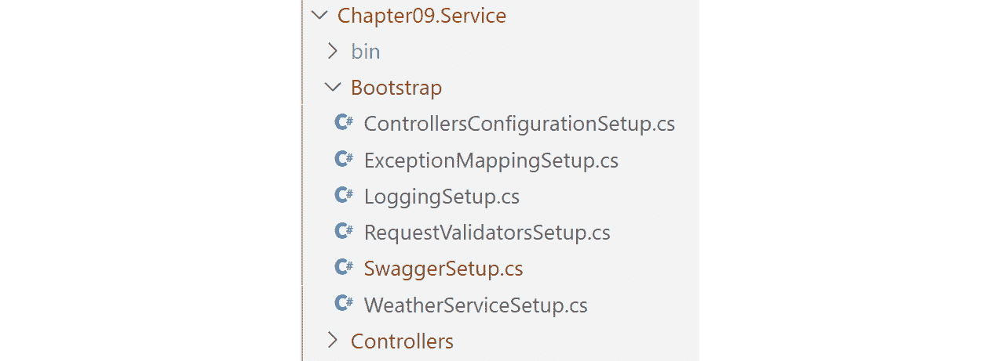

图 9.18：带有碎片化服务注入的 Bootstrap 文件夹

*图 9.18* 展示了 `Bootstrap` 文件夹。这个项目结构本身展示了 API 由什么组成。因此，依赖注入（DI）变得像下面这样简单：

```cs
builder.Services
    .AddControllersConfiguration()
    .AddLoggingConfiguration()
    .AddRequestValidators()
    .AddSwagger()
    .AddWeatherService(builder.Configuration)
    .AddExceptionMappings();
```

在某些情况下，你可能希望多次从构建器传递配置或环境到其他引导方法或应用程序方法。如果你发现自己反复调用 `builder.X`，那么考虑将每个属性存储在局部变量中，如下所示：

```cs
var services = builder.Services;
var configuration = builder.Configuration;
var environment = builder.Environment;
```

通过这种方式，你将不再反复访问构建器，而是可以直接使用所需的构建器属性。如果你从 .NET Core 迁移到 .NET 6，这特别有用。`Environment` 和 `Configuration` 以前是 `Program` 类的属性，而 `Services` 会注入到 `ConfigureServices` 方法中。在 .NET 6 中，`Services` 通过 `builder` 对象访问。然而，使用这种方法，你仍然可以使用这些属性或参数，就像以前一样。

从现在开始，当提到服务、环境或配置时，你将假设你正在从 `builder.Services`、`builder.Environment` 和 `builder.Configuration` 访问它们，相应地。

注意

你可以在 [`packt.link/iQK5X`](https://packt.link/iQK5X) 找到用于此示例的代码。

## 调用另一个 API

一个工作产品通常由许多相互通信的 API 组成。为了有效通信，一个网络服务通常需要调用另一个服务。例如，一家医院可能有一个网站（前端），该网站调用 Web API（后端）。这个 Web API 通过调用预订 Web API、计费 Web API 和员工 Web API 来协调事务。员工 Web API 可能会调用库存 API、假日 API 等。

### RapidAPI

如第八章所述，在*创建和使用 Web API 客户端*中，有多种方式可以对其他服务进行 HTTP 调用（尽管 HTTP 不是调用另一个服务的唯一方式）。这次，你将尝试从现有的 API 获取天气预报，并以你自己的方式格式化它。为此，你将使用 RapidAPI Weather API，该 API 可以在[`rapidapi.com/visual-crossing-corporation-visual-crossing-corporation-default/api/visual-crossing-weather/`](https://rapidapi.com/visual-crossing-corporation-visual-crossing-corporation-default/api/visual-crossing-weather/)找到。

注意

RapidAPI 是一个支持许多 API 的平台。网站[`rapidapi.com/visual-crossing-corporation-visual-crossing-corporation-default/api/visual-crossing-weather/`](https://rapidapi.com/visual-crossing-corporation-visual-crossing-corporation-default/api/visual-crossing-weather/)只是一个例子。那里展示的许多 API 都是免费的；然而，请注意，今天免费的 API 明天可能变成付费的。如果在你阅读这一章的时候发生了这种情况，请查看示例，并探索[`rapidapi.com/category/Weather`](https://rapidapi.com/category/Weather)上的*Weather APIs*部分。你应该能在那里找到类似的替代方案。

此 API 使用需要 GitHub 账户。按照以下步骤使用 RapidAPI Weather API：

1.  登录网站[`rapidapi.com/community/api/open-weather-map/`](https://rapidapi.com/community/api/open-weather-map/)。

    注意

    只有在登录状态下，你才能导航到[`rapidapi.com/community/api/open-weather-map/`](https://rapidapi.com/community/api/open-weather-map/)。因此，请在[`rapidapi.com/`](https://rapidapi.com/)上注册并创建一个账户。如果你需要 API 密钥，这是必须的。接下来登录，选择`Weather`类别并选择`Open Weather`链接。

登录网站后，你会看到以下窗口：

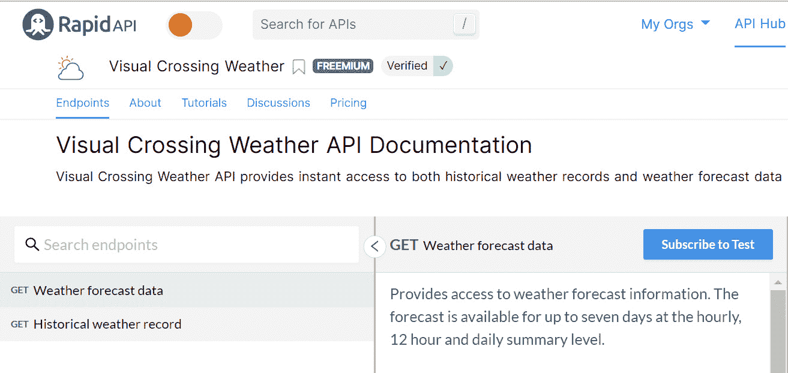

图 9.19：rapidapi.com 上 Visual Crossing Weather API 的未订阅测试页面

1.  点击`Subscribe to Test`按钮以免费获取对 Web API 的调用权限。将打开一个新窗口。

1.  选择`Basic`选项，这将允许你每月对该 API 进行 500 次调用。出于教育目的，基本计划应该足够：

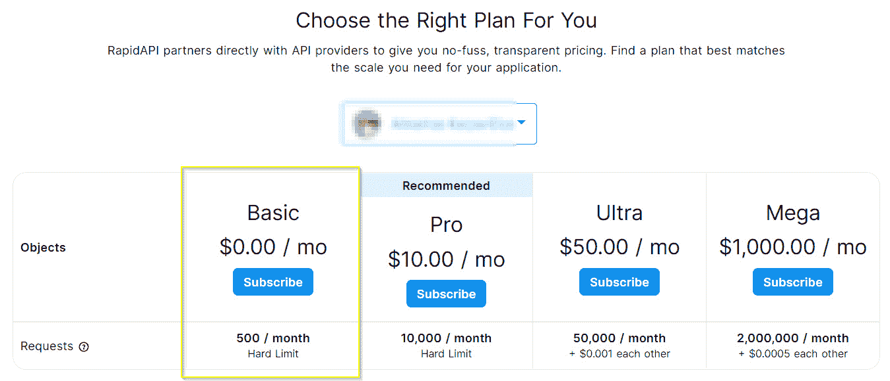

图 9.20：RapidAPI 订阅费用，免费的基本计划突出显示

你将被重定向到带有`Test Endpoint`按钮的测试页面（而不是`Subscribe to Test`按钮）。

1.  现在，配置请求。第一个配置要求你输入获取天气预报的间隔。你想要一个小时的预报，所以在`aggregateHours`（`1`）旁边输入`1`小时。

1.  接下来是`location`地址（`2`）。

在*图 9.21*中，你可以看到城市、州和国家被指定。这些字段要求你输入你的地址。但是，输入你的城市名称也会起作用。

1.  对于此 API，选择默认的`contentType`选项为`csv`（`3`）：

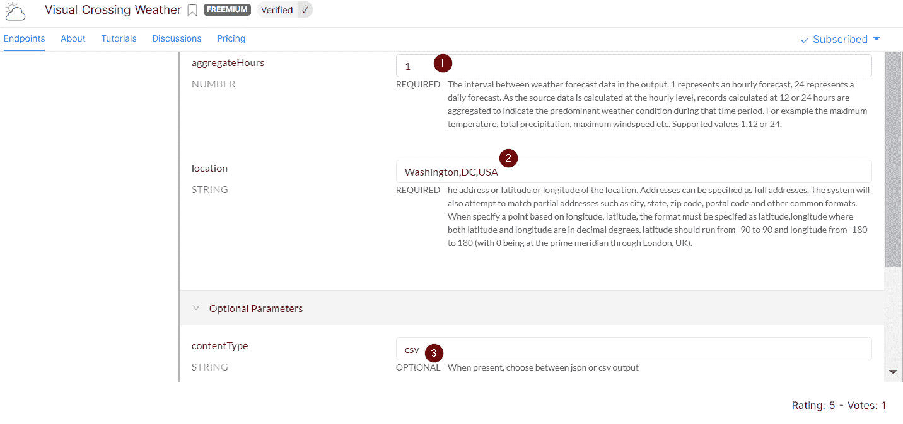

图 9.21：GET 天气预报数据请求配置

这个 API 很有趣，因为它允许你以不同的格式返回数据——JSON、XML 和 CSV。它仍然是一个 Web API，并且不是那么 RESTful，因为数据响应类型是本地的 CSV。如果你选择 JSON，它看起来会很不自然，并且处理起来会困难得多。

1.  在下一屏幕上，点击`Code Snippets`（`1`）然后点击`(C#) HttpClient`（`2`）来查看为你生成的示例客户端代码。

1.  接下来，点击`Test Endpoint`（`3`）发送请求。

1.  点击`Results`标签（`4`）来查看响应（在*图 9.22*中，其他端点已折叠）：

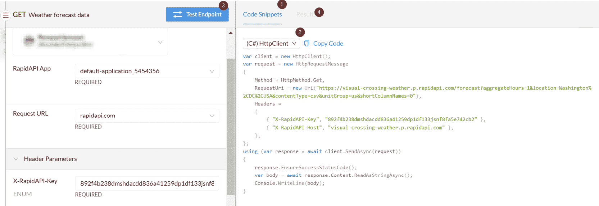

图 9.22：rapidapi.com 带有测试请求页面和 C#示例代码的请求

此窗口提供了一个优秀的 API。这也是通过提供多种语言和技术创建客户端的多个示例来学习如何调用它的绝佳方式。

像往常一样，你不会直接在客户端中初始化此客户端，而是以某种方式注入客户端。在*第八章*，*创建和使用 Web API 客户端*中提到，为了有一个静态的`HttpClient`，这是一个高效的实践。然而，对于 Web API 来说，有一个更好的替代方案——`HttpClientFactory`。

1.  在做所有这些之前，你需要准备一些事情。首先，更新`appsettings.json`文件，包括 API 的基本 URL：

    ```cs
    "WeatherForecastProviderUrl": "https://visual-crossing-weather.p.rapidapi.com/"
    ```

接下来，你需要为从该 API 获取天气详情创建另一个类。为此，你需要一个 API 密钥。你可以在 API 网站上的示例代码片段中找到它：

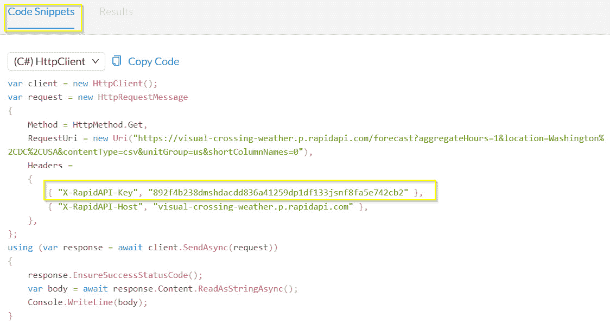

图 9.23：示例代码片段中的 RapidAPI API 密钥

1.  将 API 密钥保存为环境变量，因为它是一个秘密，将秘密存储在代码中是不好的做法。所以，将其命名为`x-rapidapi-key`。

1.  最后，返回的天气预报可能与你的预报大不相同。你可以通过点击`Test Endpoint`按钮来查看示例响应：

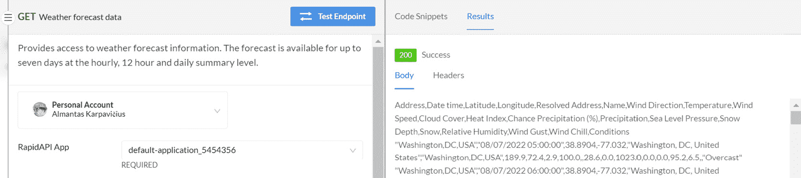

图 9.24：RapidAPI 从 GET 当前天气数据端点获取的示例响应

1.  点击`Test Endpoint`按钮后，复制收到的结果。

1.  将结果粘贴到[`toolslick.com/generation/code/class-from-csv`](https://toolslick.com/generation/code/class-from-csv)。

1.  将类名指定为`WeatherForecast`，并将其余设置保留为默认值。

1.  最后，按下`GENERATE`按钮：

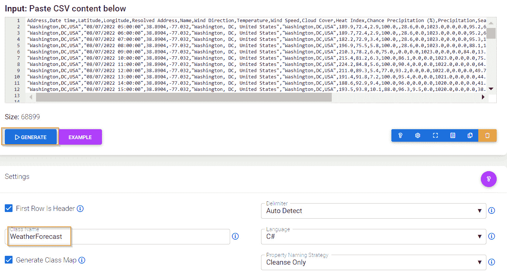

图 9.25：将响应内容粘贴到[`toolslick.com/generation/code/class-from-csv`](https://toolslick.com/generation/code/class-from-csv)

这将创建两个类，`WeatherForecast`和`WeatherForecastClassMap`：

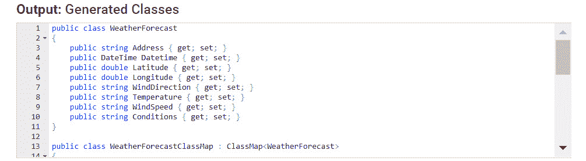

图 9.26：生成的数据模型和映射类（为了简洁而简化）

`WeatherForecast`表示将从该 API 加载数据的对象。

1.  在`Dtos`文件夹下创建一个名为`WeatherForecast.cs`的文件，并将类粘贴到那里（DTO 将在*DTO 和 AutoMapper 映射*部分中详细介绍）。

1.  删除与已存在的`WeatherForecast`模型没有连接的部分。清理后的模型将如下所示：

    ```cs
    public class WeatherForecast
    {
        public DateTime Datetime { get; set; }
        public string Temperature { get; set; }
        public string Conditions { get; set; }
    }
    ```

你应该知道`WeatherForecastClassMap`是一个特殊类。它由`CsvHelper`库使用，该库用于解析 CSV 文件。你可以自己解析 CSV 文件；然而，`CsvHelper`使解析变得容易得多。

1.  要使用`CsvHelper`，安装其 NuGet 包：

    ```cs
    dotnet add package CsvHelper
    ```

`WeatherForecastCsv`表示从 CSV 到 C#对象的映射。

1.  现在，在`ClassMaps`文件夹下创建一个名为`WeatherForecastClassMap.cs`的文件，并将类粘贴到那里。

1.  仅保留与在*步骤 17*中编辑的`WeatherForecast`类匹配的映射：

    ```cs
    public class WeatherForecastClassMap : ClassMap<WeatherForecast>
    {
        public WeatherForecastClassMap()
        {
            Map(m => m.Datetime).Name("Date time");
            Map(m => m.Temperature).Name("Temperature");
            Map(m => m.Conditions).Name("Conditions");
        }
    }
    ```

    注意

    你可以在[`packt.link/dV6wX`](https://packt.link/dV6wX)和[`packt.link/mGJMW`](https://packt.link/mGJMW)找到用于此示例的代码。

在上一节中，你学习了如何从现有的 API 获取天气预报，并使用 RapidAPI Weather API 以你的方式格式化它们。现在，是时候继续到服务客户端，使用创建的模型以及设置，解析 API 响应，并返回当前时间的天气。

### 服务客户端

现在你已经拥有了创建提供者类所需的所有成分。你在*第八章*，*创建和使用 Web API 客户端*中学习了，在与另一个 API 通信时，最好为其创建一个单独的组件。因此，这里你将从接口抽象`IWeatherForecastProvider`开始：

```cs
    public interface IWeatherForecastProvider
    {
        Task<WeatherForecast> GetCurrent(string location);
    }
```

接下来，创建该接口的实现——即一个使用`HttpClient`进行依赖注入的类：

```cs
public class WeatherForecastProvider : IWeatherForecastProvider
    {
        private readonly HttpClient _client;
        public WeatherForecastProvider(HttpClient client)
        {
            _client = client;
        }
```

要实现一个接口，首先编写一个获取当前天气的方法定义：

```cs
public async Task<WeatherForecast> GetCurrent(string location)
{
```

接下来，创建一个请求以调用 HTTP GET，并使用相对 URI 获取给定位置的 CSV 类型预报：

```cs
var request = new HttpRequestMessage
{
    	Method = HttpMethod.Get,
    	RequestUri = new Uri($"forecast?aggregateHours=1&location={location}&contentType=csv", UriKind.Relative),
};
```

现在，发送一个请求并验证它是否成功：

```cs
using var response = await _client.SendAsync(request);
response.EnsureSuccessStatusCode();
```

如果状态码不在 `200-300` 范围内，`response.EnsureSuccessStatusCode();` 会抛出异常。设置 CSV 读取器以准备反序列化天气预报：

```cs
var body = await response.Content.ReadAsStringAsync();
using var reader = new StringReader(body);
using var csv = new CsvReader(reader, CultureInfo.InvariantCulture);
csv.Context.RegisterClassMap<WeatherForecastClassMap>();
```

你正在向 `StringReader` 和 `CsvReader` 添加 `using` 语句，因为它们都实现了 `IDisposable` 接口以释放非托管资源。这发生在函数返回后使用 `using` 语句时。

最后，反序列化预报：

```cs
var forecasts = csv.GetRecords<WeatherForecast>();
```

这样，你请求 API 从今天开始返回预报，并在未来几天内以每小时间隔停止。第一个返回的预报是当前小时的预报——即你需要的那一个：

```cs
return forecasts.First();
}
```

现在，你将使用 `Newtonsoft.Json` 进行反序列化。安装以下包以实现此目的：

```cs
dotnet add package Microsoft.AspNetCore.Mvc.NewtonsoftJson
```

通过在 services 对象上追加以下行来更新 `AddControllersConfiguration` 方法：

```cs
.AddNewtonsoftJson();
```

这行代码用 `Newtonsoft.Json` 替换了默认序列化器。现在，不需要使用 `Newtonsoft.Json`；然而，与默认序列化器相比，它是一个更受欢迎且更完整的序列化库。

注意

你可以在 [`packt.link/jmSwi`](https://packt.link/jmSwi) 找到用于此示例的代码。

到目前为止，你已经学习了如何创建服务客户端并使用它进行基本的 HTTP 调用。这对于掌握基础知识是有效的；然而，API 使用的类应该与它所消耗的 API 的类耦合。在下一节中，你将学习如何使用 DTO 和通过 `AutoMapper` 的映射来解耦 API 与第三方 API 模型。

### DTO 和 AutoMapper 的映射

来自 RapidAPI 的天气预报模型是一个日期传输对象 (DTO)——一个仅用于传输数据且便于序列化的模型。RapidAPI 可能会更改其数据模型，如果发生这种情况，DTO 也会随之改变。如果你只是展示接收到的数据而不需要对其执行任何逻辑操作，那么任何更改都可能没问题。

然而，你通常会将对数据模型的业务逻辑应用。你已经知道数据模型引用分散在多个类中。每当 DTO 发生变化时，一个类可能也需要更改。例如，之前称为 `weather` 的 DTO 属性现在已更改为 `weathers`。另一个例子是之前称为 `description` 的属性现在将称为 `message`。因此，像这样重命名 DTO 属性将需要你在所有引用的地方进行更改。项目越大，这个问题就越严重。

SOLID 原则的建议是避免此类更改（参考*第二章*，*构建高质量面向对象代码*）。实现这一目标的一种方法是有两种模型——一种用于领域，另一种用于外部调用。这将需要在来自外部 API 的外部对象与您自己的对象之间进行映射。

映射可以通过手动方式或使用一些流行的库来完成。最受欢迎的映射库之一是 AutoMapper。它允许您使用属性名称从一个对象映射到另一个对象。您也可以创建自己的映射。现在，您将使用此库来配置一个天气预测 DTO 和天气预测模型之间的映射。

因此，首先安装 NuGet：

```cs
dotnet add package AutoMapper.Extensions.Microsoft.DependencyInjection
```

此库允许您将`AutoMapper`注入到`ServiceCollection`中。在这里，`AutoMapper`使用`Profile`类来定义映射。

新的映射应该继承`Profile`类。因此，在新配置文件的构造函数中，使用`CreateMap`方法提供映射：

```cs
    public class WeatherForecastProfile : Profile
    {
        public WeatherForecastProfile()
        {
            CreateMap<Dtos.WeatherForecast, Models.WeatherForecast>()
```

接下来，为了从`CreateMap`方法映射每个属性，调用`ForMember`方法并指定如何进行映射：

```cs
                .ForMember(to => to.TemperatureC, opt => opt.MapFrom(from => from.main.temp));
```

在这里，`TemperatureC`的值来自 DTO 中的`main.temp`。

对于其他属性，您将所有天气描述连接成一个字符串，并将其称为摘要（`BuildDescription`）：

```cs
        private static string BuildDescription(Dtos.WeatherForecast forecast)
        {
            return string.Join(",",
                forecast.weather.Select(w => w.description));
        }
```

现在，在构建天气预测摘要映射时使用 lambda 方法`ForMember`：

```cs
.ForMember(to => to.Summary, opt => opt.MapFrom(from => BuildDescription(from)))
```

创建一个`MapperSetup`类，并从`AddModelMappings`方法注入`AutoMapper`以提供不同的映射配置文件：

```cs
public static class MapperSetup
{
    public static IServiceCollection AddModelMappings(this IServiceCollection services)
    {
        services.AddAutoMapper(cfg =>
        {
            cfg.AddProfile<WeatherForecastProfile>();
        });
        return services;
    }
}
```

将`.AddModelMappings()`附加到`services`对象调用。有了这个，您就可以调用`mapper.Map<Model.WeatherForecast>(dtoForecast);`。

注意

您可以在[`packt.link/fEfdw`](https://packt.link/fEfdw)和[`packt.link/wDqK6`](https://packt.link/wDqK6)找到用于此示例的代码。

`AutoMapper`映射库允许您通过默认映射匹配属性名称从一个对象映射到另一个对象。下一节将详细介绍如何使用依赖注入（DI）重用`HttpClient`。

### HttpClient DI

继续使用 DI，现在您想要养成使用分段的`ConfigureServices`方法的习惯。因此，首先创建一个名为`HttpClientsSetup`的类，然后创建一个用于添加配置的`HttpClients`的方法：

```cs
    public static class HttpClientsSetup
    {
        public static IServiceCollection AddHttpClients(IServiceCollection services)
        {
```

接下来，对于注入本身，使用`AddHttpClient`方法：

```cs
services.AddHttpClient<IWeatherForecastProvider, WeatherForecastProvider>((provider, client) =>
            {
```

在前面的章节中提到，密钥应该被隐藏并存储在环境变量中。为了设置每个调用的默认起始 URI，设置`BaseAddress`（在*RapidAPI*部分的*步骤 10*中使用的`WeatherForecastProviderUrl`）。

在每个请求中附加 API 密钥，获取您存储在环境变量中的 API 密钥，并将其分配给默认头部的`x-rapidapi-key`：

```cs
                client.BaseAddress = new Uri(config["WeatherForecastProviderUrl"]);
                var apiKey = Environment.GetEnvironmentVariable("x-rapidapi-key", EnvironmentVariableTarget.User);
                client.DefaultRequestHeaders.Add("x-rapidapi-key", apiKey);
            });
```

要完成注入构建器模式，您需要返回`services`对象，如下所示：

```cs
return services;
```

现在，回到`Program`中的`services`并附加以下内容：

```cs
.AddHttpClients(Configuration)
```

要集成你刚刚设置的客户端，请转到 `WeatherForecastService`，并注入 `mapper` 和 `provider` 组件：

```cs
public WeatherForecastService(..., IWeatherForecastProvider provider, IMapper mapper)
```

将 `GetWeatherForecast` 方法更改为获取当前小时的缓存预报或从 API 获取新的预报：

```cs
        public async Task<WeatherForecast> GetWeatherForecast(DateTime date)
        {
            const string DateFormat = "yyyy-MM-ddthh";
            var contains = _cache.TryGetValue(date.ToString(DateFormat), out var entry);
            if(contains){return (WeatherForecast)entry;}

            var forecastDto = await _provider.GetCurrent(_city);
            var forecast = _mapper.Map<WeatherForecast>(forecastDto);
            forecast.Date = DateTime.UtcNow;
            _cache.Set(DateTime.UtcNow.ToString(DateFormat), forecast);
            return forecast;
        }
```

此方法与上一个方法类似，首先尝试从缓存中获取一个值。如果值存在，则方法返回该值。但是，如果值不存在，则方法调用预配置城市的 API，将 DTO 预报映射到模型预报，并将其保存到缓存中。

如果你向 `https://localhost:7021/WeatherForecast/` 发送一个 HTTP GET 请求，你应该看到以下响应：

```cs
{"date":"2021-09-21T20:17:47.410549Z","temperatureC":25,"temperatureF":76,"summary":"clear sky"}
```

调用相同的端点会产生相同的响应。然而，由于使用了缓存而不是重复调用预报 API，响应时间显著更快。

注意

你可以在[`packt.link/GMFmm`](https://packt.link/GMFmm)找到此示例使用的代码。

这就结束了本主题的理论部分。在下一节中，你将通过练习将其付诸实践。

## 练习 9.03：通过调用 Azure Blob 存储执行文件操作

使用 Web API 的一个常见任务是执行各种文件操作，例如下载、上传或删除。在这个练习中，你将重用第八章，*构建面向对象的高质量代码*中的*活动 8.04*中的部分 `FilesClient`，作为调用 Azure Blob 存储的基线客户端，并通过 REST 端点调用其方法来执行以下操作：

+   下载一个文件。

+   获取一个带有过期时间的可分享链接。

+   上传一个文件。

+   删除一个文件。

执行以下步骤来完成此操作：

1.  为 `FilesClient` 提取一个接口并命名为 `IFilesService`：

    ```cs
    public interface IFilesService
        {
            Task Delete(string name);
            Task Upload(string name, Stream content);
            Task<byte[]> Download(string filename);
            Uri GetDownloadLink(string filename);
        }
    ```

新的界面简化了，因为你将在一个单独的容器上工作。然而，根据要求，你添加了一些新的方法：`Delete`、`Upload`、`Download` 和 `GetDownloadLink`。`Download` 方法用于以原始形式（即字节）下载文件。

1.  创建一个名为 `Exercises/Exercise03/FilesService.cs` 的新类。

1.  将以下部分复制到[`packt.link/XC9qG`](https://packt.link/XC9qG%20)。

1.  将 `Client` 重命名为 `Service`。

1.  还将第八章，*构建面向对象的高质量代码*中的`Exercise04`引用（用于此章节）更改为`Exercise03`（一个新引用，用于本章）：

    ```cs
    FilesService.cs
    public class FilesService : IFilesService
        {
            private readonly BlobServiceClient _blobServiceClient;
            private readonly BlobContainerClient _defaultContainerClient;
            public FilesClient()
            {
                var endpoint = "https://packtstorage2.blob.core.windows.net/";
                var account = "packtstorage2";
                var key = Environment.GetEnvironmentVariable("BlobStorageKey", EnvironmentVariableTarget.User);
                var storageEndpoint = new Uri(endpoint);
                var storageCredentials = new StorageSharedKeyCredential(account, key);
                _blobServiceClient = new BlobServiceClient(storageEndpoint, storageCredentials);
                _defaultContainerClient = CreateContainerIfNotExists("Exercise03).Result;
            }
            private async Task<BlobContainerClient> CreateContainerIfNotExists(string container)
    ```

```cs
You can find the complete code here: https://packt.link/fNQAX.
```

构造函数初始化 `blobServiceClient` 以获取 `blobClient`，这允许你在 Azure Blob 存储账户中的 *Exercice03* 目录中执行操作。如果文件夹不存在，`blobServiceClient` 将为你创建它： 

```cs
        {
            var lowerCaseContainer = container.ToLower();
            var containerClient = _blobServiceClient.GetBlobContainerClient(lowerCaseContainer);
            if (!await containerClient.ExistsAsync())
            {
                containerClient = await _blobServiceClient.CreateBlobContainerAsync(lowerCaseContainer);
            }
            return containerClient;
        }
```

注意

为了使前面的步骤生效，你需要一个 Azure 存储账户。因此，请参考第八章，*构建面向对象的高质量代码*中的*活动 8.04*。

1.  创建一个名为 `ValidateFileExists` 的方法来验证文件是否存在于存储中，否则抛出异常（一个之前不存在的小助手方法）：

    ```cs
    private static void ValidateFileExists(BlobClient blobClient)
    {
        if (!blobClient.Exists())
        {
            throw new FileNotFoundException($"File {blobClient.Name} in default blob storage not found.");
        }
    }
    ```

1.  现在，创建一个名为 `Delete` 的方法来删除文件：

    ```cs
    public Task Delete(string name)
    {
        var blobClient = _defaultContainerClient.GetBlobClient(name);
        ValidateFileExists(blobClient);
        return blobClient.DeleteAsync();
    }
    ```

在这里，你将首先获取一个文件客户端，然后检查文件是否存在。如果不存在，则抛出`FileNotFoundException`异常。如果文件存在，则删除该文件。

1.  创建`UploadFile`方法来上传文件：

    ```cs
    public Task UploadFile(string name, Stream content)
    {
        var blobClient = _defaultContainerClient.GetBlobClient(name);
        return blobClient.UploadAsync(content, headers);
    }
    ```

再次强调，您首先获取一个允许您对文件执行操作的客户端。然后，向其中提供内容和头以上传。

1.  创建一个用于以字节形式下载文件的`Download`方法：

    ```cs
            public async Task<byte[]> Download(string filename)
            {
                var blobClient = _defaultContainerClient.GetBlobClient(filename);
                var stream = new MemoryStream();
                await blobClient.DownloadToAsync(stream);
                return stream.ToArray();
            }
    ```

此方法创建一个内存流并将文件下载到其中。请注意，这在大文件上可能不起作用。

注意

如果您想了解更多关于如何处理大文件的信息，请参阅[`docs.microsoft.com/en-us/aspnet/core/mvc/models/file-uploads?view=aspnetcore-6.0#upload-large-files-with-streaming`](https://docs.microsoft.com/en-us/aspnet/core/mvc/models/file-uploads?view=aspnetcore-6.0#upload-large-files-with-streaming)。

有一种方法可以将原始下载的字节呈现为图像或 JSON，而不是通用可下载内容。通过 HTTP 请求或响应，您可以发送一个指定内容解释方式的头。这个头被称为 Content-Type。每个应用程序都会以不同的方式处理它。在 Swagger 的上下文中，`image/png`将显示为图像，而`application/json`将显示为 JSON。

1.  创建一个`GetUri`方法来获取`blobClient`的 URI：

    ```cs
            private Uri GetUri(BlobClient blobClient)
            {
                var sasBuilder = new BlobSasBuilder
                {
                    BlobContainerName = _defaultContainerClient.Name,
                    BlobName = blobClient.Name,
                    Resource = "b",
                    ExpiresOn = DateTimeOffset.UtcNow.AddHours(1)
                };
                sasBuilder.SetPermissions(BlobSasPermissions.Read);
                var sasUri = blobClient.GenerateSasUri(sasBuilder);
                return sasUri;
            }
    ```

获取 URI 需要使用`BlobSasBuilder`，通过它可以生成指向 blob 的可分享 URL。通过构建器，指定您要尝试共享的资源类型（`"b"`代表 blob）和过期时间。您需要设置权限（读取权限）并将`sasBuilder`构建器传递给`blobClient`客户端以生成`sasUri`。

1.  现在，使用文件名创建一个文件下载链接：

    ```cs
            public Uri GetDownloadLink(string filename)
            {
                var blobClient = _defaultContainerClient.GetBlobClient(filename);
                var url = GetUri(blobClient);
                return url;
            }
    ```

1.  在`ExceptionMappingSetup`类和`AddExceptionMappings`方法中，添加以下映射：

    ```cs
    opt.MapToStatusCode<FileNotFoundException>(404);
    ```

1.  创建一个扩展方法来注入`FileUploadService`模块：

    ```cs
    public static class FileUploadServiceSetup
    {
        public static IServiceCollection AddFileUploadService(this IServiceCollection services)
        {
            services.AddScoped<IFilesService, FilesService>();
            return services;
        }
    }
    ```

扩展方法是一种简化显示现有接口新方法的方式。

1.  将其附加到`Program.cs`中的`services`以使用`FileUploadService`模块：

    ```cs
    .AddFileUploadService();
    ```

1.  现在，为文件创建一个控制器：

    ```cs
        [Route("api/[controller]")]
        [ApiController]
        public class FileController : ControllerBase
        {
    ```

在 MVC 架构中，控制器创建是标准的，这允许用户通过 HTTP 请求访问`FileService`。

1.  然后，注入`IFilesService`以提供一个接口，通过该接口可以访问文件相关功能：

    ```cs
            private readonly IFilesService _filesService;
            public FileController(IFilesService filesService)
            {
                _filesService = filesService;
            }
    ```

1.  接下来，创建一个用于删除文件的端点：

    ```cs
            [HttpDelete("{file}")]
            public async Task<IActionResult> Delete(string file)
            {
                await _filesService.Delete(file);
                return Ok();
            }
    ```

1.  创建一个用于下载文件的端点：

    ```cs
      [HttpGet("Download/{file}")]
            public async Task<IActionResult> Download(string file)
            {
                var content = await _filesService.Download(file);
                return new FileContentResult(content, "application/octet-stream ");
            }
    ```

1.  创建一个用于获取可分享文件下载链接的端点：

    ```cs
            [HttpGet("Link")]
            public IActionResult GetDownloadLink(string file)
            {
                var link = _filesService.GetDownloadLink(file);
                return Ok(link);
            }
    ```

1.  创建一个用于上传文件的端点：

    ```cs
            [HttpPost("upload")]
            public async Task<IActionResult> Upload(IFormFile file)
            {
                await _filesService.UploadFile(file.FileName, file.OpenReadStream());
                return Ok();
            }
    ```

`IFormFile`是将小文件传递给控制器的一种常见方式。然而，从`IFormFile`中，您需要文件内容作为流。您可以使用`OpenReadStream`方法获取它。Swagger 允许您使用文件资源管理器窗口选择要上传的文件。

1.  现在运行 API。

您的 Swagger 文档将有一个新的部分，包含控制器方法。以下是每个方法的响应：

+   上传文件请求：

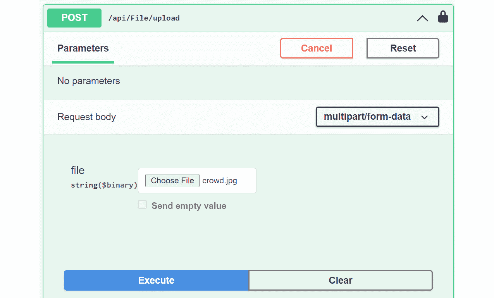

图 9.27：Swagger 中的上传文件请求

+   上传文件响应：

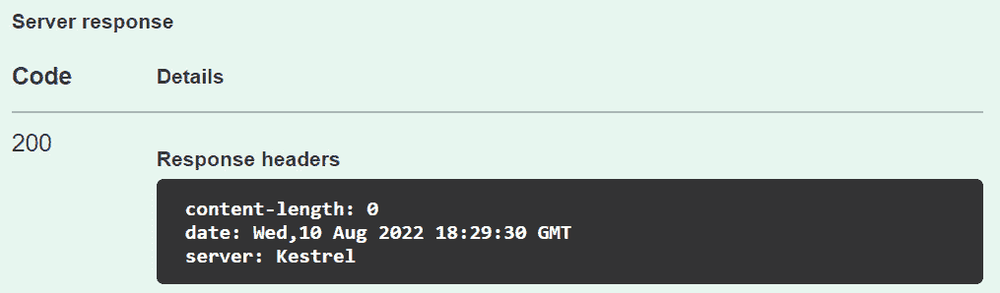

图 9.28：Swagger 中的上传文件响应

+   获取下载链接请求：

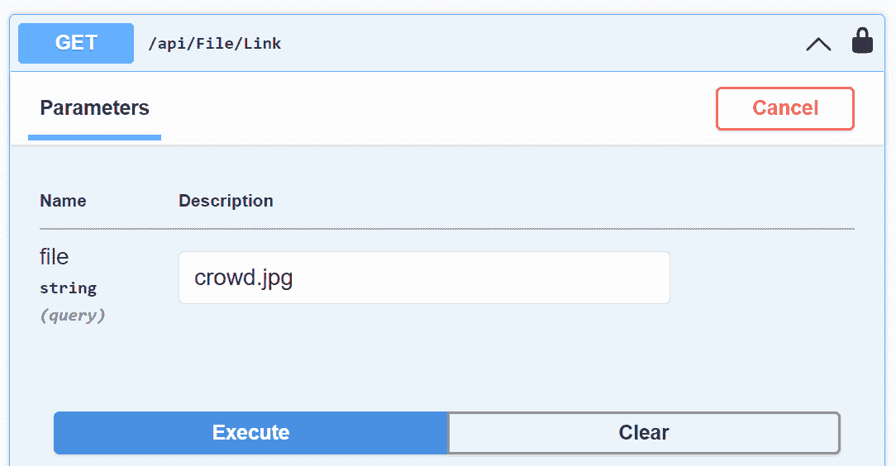

图 9.29：Swagger 中的获取下载链接请求

+   获取下载链接响应：

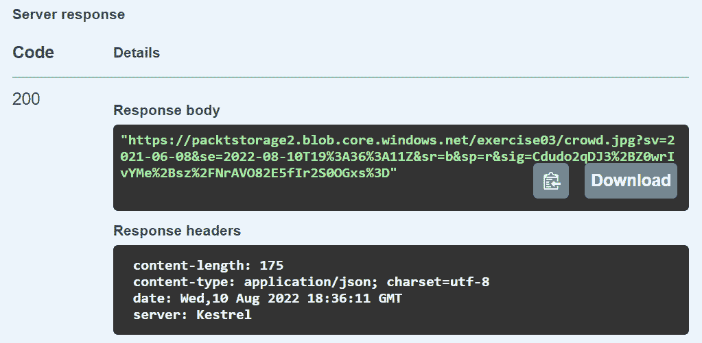

图 9.30：Swagger 中的获取下载链接响应

+   下载文件请求：

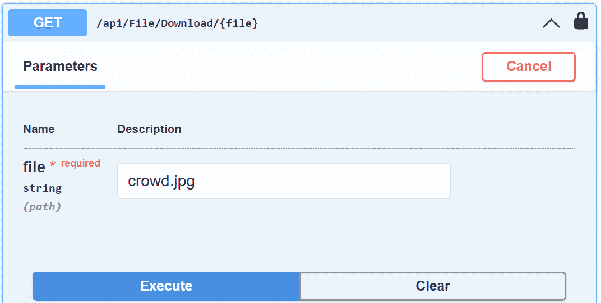

图 9.31：Swagger 中的下载文件请求

+   下载文件响应：

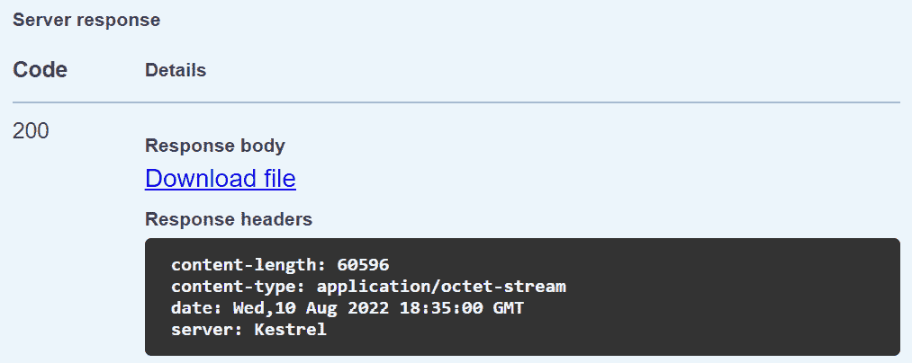

图 9.32：Swagger 中的下载文件响应

+   删除文件请求：

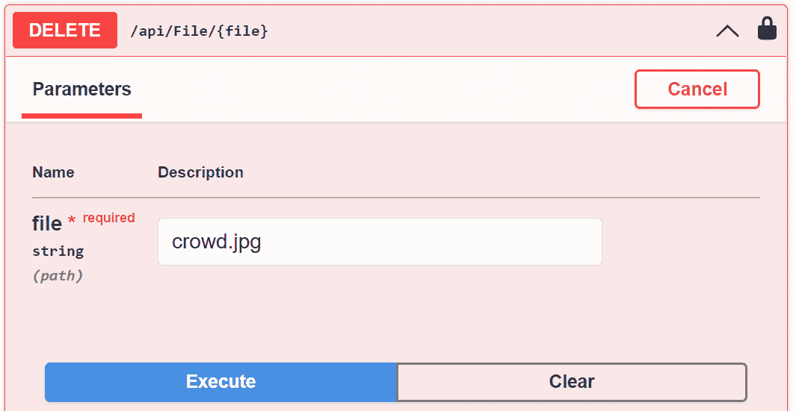

图 9.33：Swagger 中的删除文件请求

+   删除文件响应：

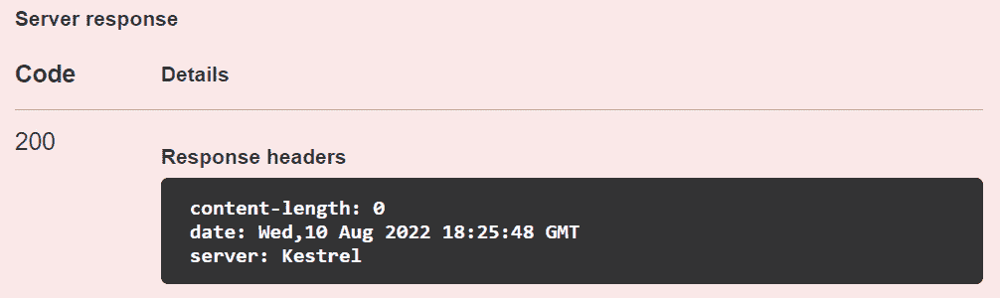

图 9.34：Swagger 中的删除文件响应

这个练习展示了你可以使用 Web API 做的剩余方面。

注意

你可以在[`packt.link/cTa4a`](https://packt.link/cTa4a)找到用于此练习的代码。

你可以通过网络提供的功能量是巨大的。然而，这也伴随着它自己的大问题。你如何确保你的 API 只被预期的身份消费？在下一节中，你将探索如何保护 Web API。

## 保护 Web API

不时地，你会在新闻中听到关于重大安全漏洞的消息。在本节中，你将学习如何使用 Azure Active Directory (AAD) 保护公共 API。

### Azure Active Directory

Azure Active Directory (AAD) 是微软的云身份和访问管理服务，用于登录到知名应用程序，如 Visual Studio、Office 365 和 Azure，以及内部资源。AAD 使用 OpenID 通过 JavaScript Web Token 提供用户身份。

### JWT

JavaScript Web Token (JWT) 是一组个人数据，编码后作为身份验证机制发送。JWT 中编码的单个字段称为声明。

### OpenID Connect

OpenID Connect (OIDC) 是用于获取 ID 令牌的协议，该令牌提供用户身份或访问令牌。它是在 OAuth 2 之上的一层，用于获取身份。

OAuth 作为代表某些用户获取访问令牌的手段。使用 OIDC，你获得一个身份；这有一个角色，访问来自该角色。当用户想要登录到网站时，OpenID 可能会要求他们输入他们的凭据。这听起来可能完全一样，就像 OAuth 一样；然而，不要混淆这两个。OpenID 完全是关于获取和验证用户的身份，并授予与角色相关的访问权限。另一方面，OAuth 给予用户访问权限以执行一组有限的操作。

一个现实生活中的类比如下：

+   OpenID：你来到机场并出示你的护照（由政府签发），以确认你的角色（乘客）和身份。你将被**授予**乘客角色并允许登机。

+   OAuth：你来到机场，工作人员要求你参加一个情绪状态跟踪活动。在你的**同意**下，机场的工作人员（**他人**）现在可以跟踪更多你的个人数据。

以下是一个总结：

+   OpenID 提供身份验证并**验证你是谁**。

+   OAuth 是一种授权，允许他人代表你做**事情**。

## 应用程序注册

使用 Azure 保护 Web API 的第一步是在 AAD 中创建应用程序注册。执行以下步骤以完成此操作：

1.  在搜索栏中键入`active dir`以导航到`Azure Active Directory`：

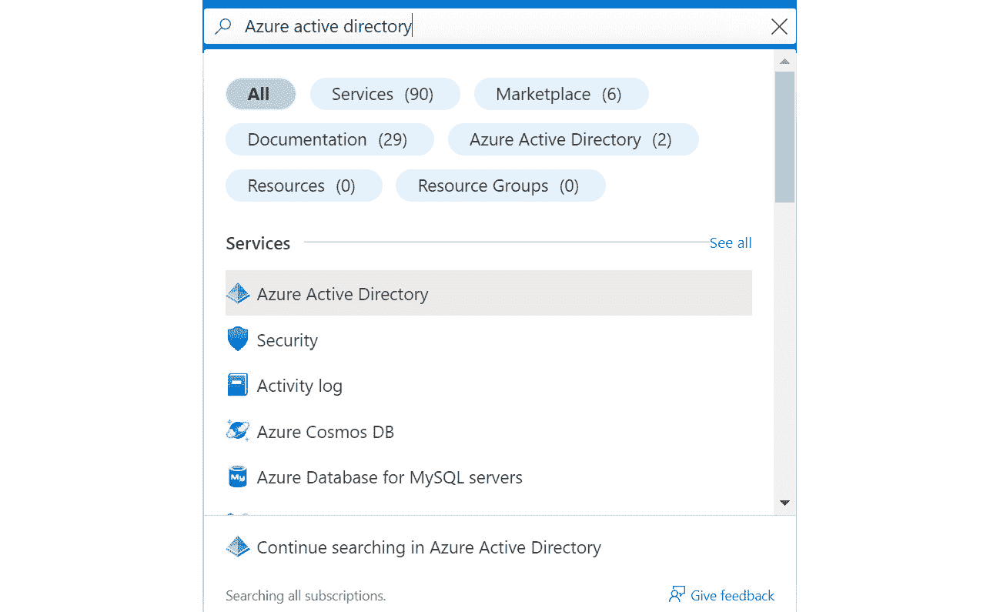

图 9.35：在 portal.azure 中搜索 Azure Active Directory

1.  在新窗口中，点击“应用程序注册”选项（`1`）。

1.  然后，点击“新建注册”按钮（`2`）：


图 9.36：Azure 应用程序注册

1.  在新窗口中，输入`Chapter09WebApi`作为名称。

1.  保持其他设置默认，并点击“注册”按钮：

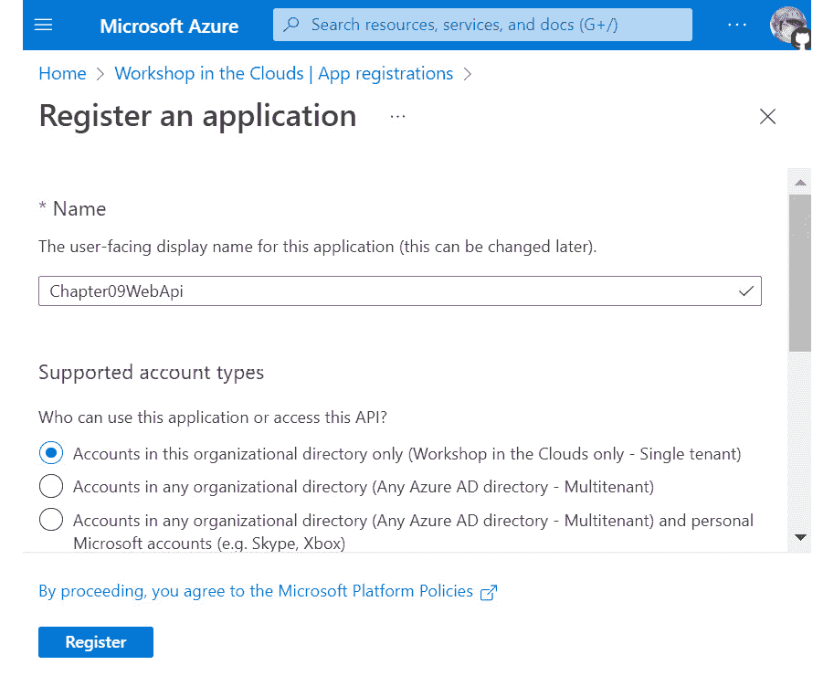

图 9.37：名为 Chapter09WebApi 的新应用程序注册

1.  要访问 API，你需要至少一个作用域或角色。在这个例子中，你将创建一个名为`access_as_user`的作用域。

1.  作用域通常可以用来控制 API 的哪些部分对你可访问。为了让作用域对所有用户可用，你需要选择`管理员和用户`。

1.  在这个简单的例子中，假设令牌有效，你将允许访问一切。因此，选择“作为用户访问所有内容”选项。其他字段的精确值并不重要：

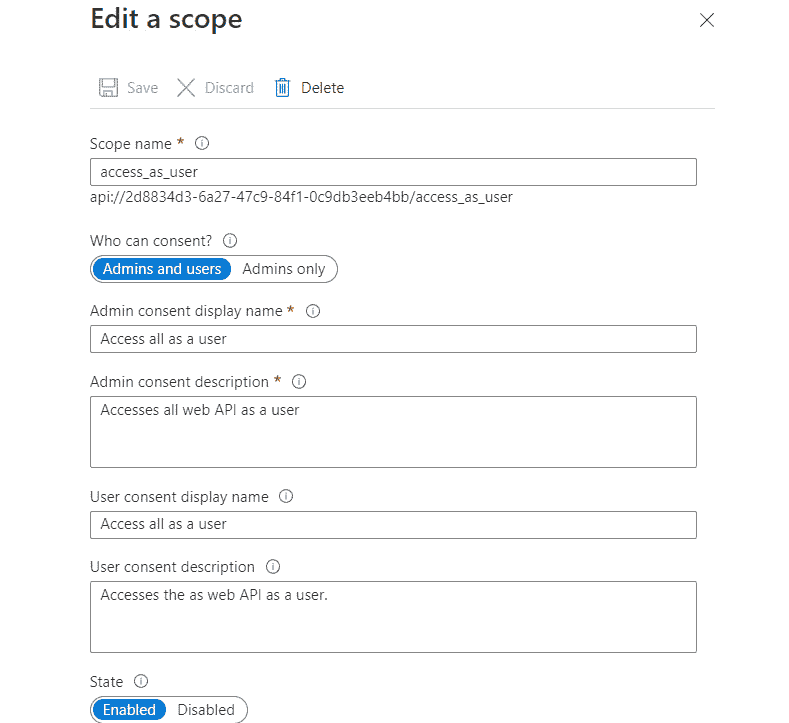

图 9.38：对所有用户可用的 access_as_user 作用域

使用 Azure 保护 Web API 的第一步是在 AAD 中创建应用程序注册。下一个主题将介绍如何在.NET 中实现 Web API 的安全。

## 实现 Web API 安全

本节将重点介绍如何通过编程方式获取令牌并使用它。因此，首先安装 NuGet，它使用 Microsoft 身份平台进行 JWT 验证：

```cs
dotnet add package Microsoft.Identity.Web
```

在 Bootstrap 文件夹中，创建`SecuritySetup`类：

```cs
    public static class SecuritySetup
    {
        public static IServiceCollection AddSecurity(this IServiceCollection services, IConfiguration configuration, IWebHostEnvironment env)
        {
            services.AddMicrosoftIdentityWebApiAuthentication(configuration);
            return services;
        }
    }
```

然后，在`Program.cs`中，将以下内容追加到`services`：

```cs
.AddSecurity()
```

注入的服务是授权中间件所需的。因此，在`app`上添加以下内容以添加授权中间件：

```cs
    app.UseAuthentication();
    app.UseAuthorization();
```

这将在所有带有`[Authorize]`属性的端点上触发。确保前两行在`app.MapControllers();`之前放置，否则中间件将无法与你的控制器连接。

在`appsettings.json`中，添加以下配置以链接到您的`AzureAd`安全配置：

```cs
  "AzureAd": {
    "Instance": "https://login.microsoftonline.com/",
    "ClientId": "2d8834d3-6a27-47c9-84f1-0c9db3eeb4ba",
    "TenantId": "ddd0fd18-f056-4b33-88cc-088c47b81f3e",
    "Audience": "api://2d8834d3-6a27-47c9-84f1-0c9db3eeb4bb"
  }
```

最后，在每个控制器上方添加`Authorize`属性以实现您选择的任何类型的安全：

```cs
    [Authorize]
    [ApiController]
    [RequiredScope("access_as_user")]
    [Route("[controller]")]
    public class WeatherForecastController : ControllerBase
```

`Authorize`属性对于任何类型的安全实现都是必不可少的。此属性将执行通用的令牌验证，而`[RequiredScope("access_as_user")]`将检查是否包含`access_as_user`作用域。现在您拥有了一个安全的 API。如果您尝试调用`WeatherForecast`端点，您将收到`401 – 未授权`错误。

注意

您可以在[`packt.link/ruj9o`](https://packt.link/ruj9o)找到用于此示例的代码。

在下一节中，您将学习如何通过令牌生成器应用程序生成令牌，并使用它来安全地访问您的 API。

### 令牌生成器应用程序

要调用 API，您需要通过创建控制台应用程序来生成一个令牌。但在这样做之前，您需要在应用程序注册中配置一项内容。您的控制台应用程序被视为桌面应用程序。因此，在登录时，您需要一个重定向 URI。这个 URI 与代码一起返回，用于获取访问令牌。为了实现这一点，请执行以下步骤：

1.  从 AAD 的左侧面板中选择`认证`选项（`1`）以查看所有外部应用程序的配置。

1.  接下来，点击`添加平台`按钮（`2`）以配置新应用程序（令牌生成器）：

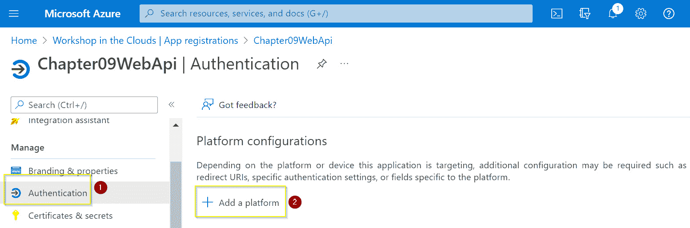

图 9.39：带有配置新应用程序选项的认证窗口

1.  在`配置平台`部分，选择`移动和桌面应用程序`按钮（`3`）以注册控制台应用程序令牌生成器：

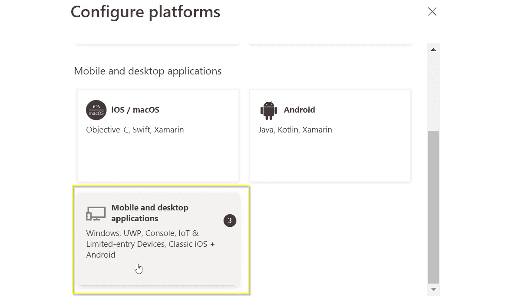

图 9.40：选择认证的移动和桌面应用程序平台

屏幕上将会打开一个新窗口。

1.  输入您的`自定义重定向 URI`，指定在请求令牌时成功登录到 AAD 后返回的位置。在这种情况下，这并不那么重要。所以，输入任何 URL。

1.  然后，点击`配置`按钮（`4`）：

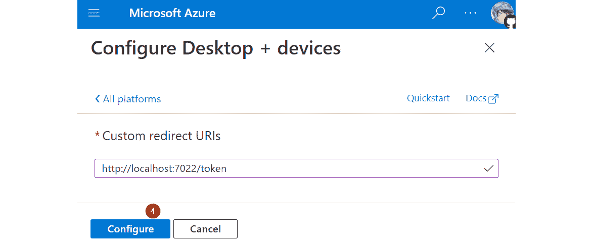

图 9.41：配置重定向 URI

这就完成了 AAD 的配置。现在，您已经拥有了所有安全基础设施，可以构建一个控制台应用程序来从 AAD 生成访问令牌：

1.  首先，创建一个名为`Chapter09.TokenGenerator`的新项目。这将允许您生成调用 API 所需的授权令牌。

1.  然后，将其设置为.NET Core 控制台应用程序以保持简单并显示生成的令牌。

1.  通过运行以下命令添加`Microsoft.Identity.Client`：

    ```cs
    dotnet add package Microsoft.Identity.Client
    ```

这将允许您稍后请求令牌。

1.  接下来，在 `Program.cs` 中创建一个方法来初始化 AAD 应用程序客户端。这将用于提示浏览器登录，就像您登录到 Azure 门户一样：

    ```cs
    static IPublicClientApplication BuildAadClientApplication()
    {
        const string clientId = "2d8834d3-6a27-47c9-84f1-0c9db3eeb4bb"; // Service
        const string tenantId = "ddd0fd18-f056-4b33-88cc-088c47b81f3e";
        const string redirectUri = "http://localhost:7022/token";
        string authority = string.Concat("https://login.microsoftonline.com/", tenantId);
        var application = PublicClientApplicationBuilder.Create(clientId)
            .WithAuthority(authority)
            .WithRedirectUri(redirectUri)
            .Build();
        return application;
    }
    ```

    注意

    在前面的代码中使用的值将根据 AAD 订阅的不同而有所不同。

如您所见，应用程序使用在 AAD 中配置的 `clientId` 和 `tenantId`。

1.  创建另一个方法来使用需要 Azure 用户登录以获取身份验证令牌的应用程序：

    ```cs
    static async Task<string> GetTokenUsingAzurePortalAuth(IPublicClientApplication application)
    {
    ```

1.  现在，定义您需要的范围：

    ```cs
                var scopes = new[] { $"api://{clientId}/{scope}" };
    ```

如果您不是使用默认值，请将 `api://{clientId}/{scope}` 替换为您自己的应用程序 ID URI。

1.  然后，尝试获取缓存的令牌：

    ```cs
                AuthenticationResult result;
                try
                {
                    var accounts = await application.GetAccountsAsync();
                    result = await application.AcquireTokenSilent(scopes, accounts.FirstOrDefault()).ExecuteAsync();
                }
    ```

如果登录是在之前完成的，则需要缓存令牌检索。如果您之前没有登录以获取令牌，您将需要登录到 Azure AD：

```cs
            catch (MsalUiRequiredException ex)
            {
                result = await application.AcquireTokenInteractive(scopes)
                    .WithClaims(ex.Claims)
                    .ExecuteAsync();
            }
```

1.  将访问令牌作为已登录用户的结果返回，以便您以后可以使用它来访问您的 API：

    ```cs
                return result.AccessToken;
    ```

1.  现在，调用这两个方法并打印结果（使用最小 API）：

    ```cs
    var application = BuildAadClientApplication();
    var token = await GetTokenUsingAzurePortalAuth(application);
    Console.WriteLine($"Bearer {token}");
    ```

1.  最后，当您运行令牌应用程序时，它将要求您登录：

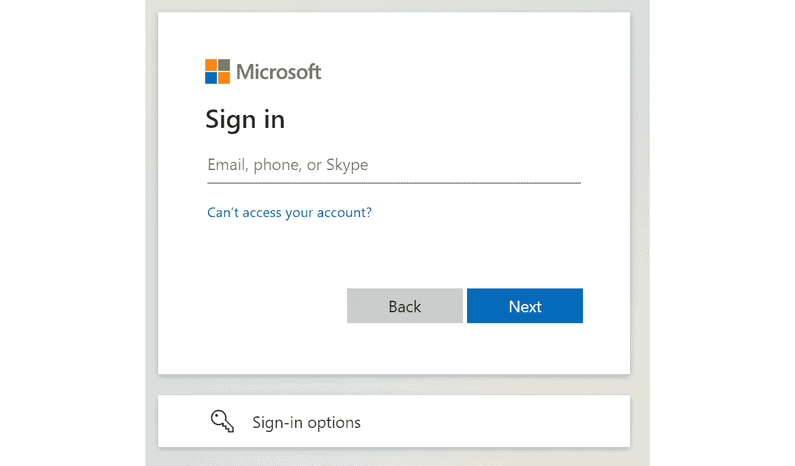

图 9.42：来自 Azure 的登录请求

成功登录后，您将被重定向到配置的重定向 URI，并显示以下消息：

```cs
Authentication complete. You can return to the application. Feel free to close this browser tab.
```

您将看到令牌将在控制台窗口中返回：

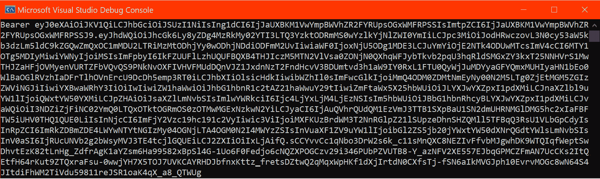

图 9.43：控制台应用程序中的应用程序注册生成的令牌

现在，您可以使用 [`jwt.io/`](https://jwt.io/) 网站检查令牌。以下屏幕显示两个部分：`Encoded` 和 `Decoded`。`Decoded` 部分分为以下部分：

+   `HEADER`：这包含令牌的类型和用于加密令牌的算法。

+   `PAYLOAD`：令牌中编码的声明包含信息，例如谁请求了令牌以及授予了哪些访问权限：


图 9.44：使用您的应用程序注册在 jwt.io 网站上编码和解码 JWT 版本

在本节中，您学习了如何保护未受保护的 API。安全性不仅限于授权令牌。作为一名专业开发者，您必须了解 API 中最常见的漏洞。根据行业趋势，这份列表每四年更新一次，称为开放 Web 应用程序安全项目（OWASP），可在 [`owasp.org/www-project-top-ten/`](https://owasp.org/www-project-top-ten/) 访问。

在下一节中，您将应用 Swagger 与授权令牌一起工作的所需更改。

### 配置 Swagger 身份验证

要通过 Swagger 传递授权头，您需要添加一些配置。按照以下步骤进行操作：

1.  为了渲染一个授权按钮，请在`SwaggerSetup`类中的`AddSwagger`方法和`services.AddSwaggerGen(cfg =>`部分内添加以下代码块：

    ```cs
                    cfg.AddSecurityDefinition("Bearer", new OpenApiSecurityScheme()
                    {
                        Name = "Authorization",
                        Type = SecuritySchemeType.ApiKey,
                        Scheme = "Bearer",
                        BearerFormat = "JWT",
                        In = ParameterLocation.Header,
                        Description = $"Example: \"Bearer YOUR_TOKEN>\"",
                    });
    ```

1.  为了将带有授权头的令牌值转发，请添加以下代码片段：

    ```cs
                    cfg.AddSecurityRequirement(new OpenApiSecurityRequirement
                    {
                        {
                            new OpenApiSecurityScheme
                            {
                                Reference = new OpenApiReference
                                {
                                    Type = ReferenceType.SecurityScheme,
                                    Id = "Bearer"
                                }
                            },
                            new string[] {}
                        }
                    });
    ```

1.  当您导航到[`localhost:7021/index.xhtml`](https://localhost:7021/index.xhtml)时，您将看到它现在包含`Authorize`按钮：

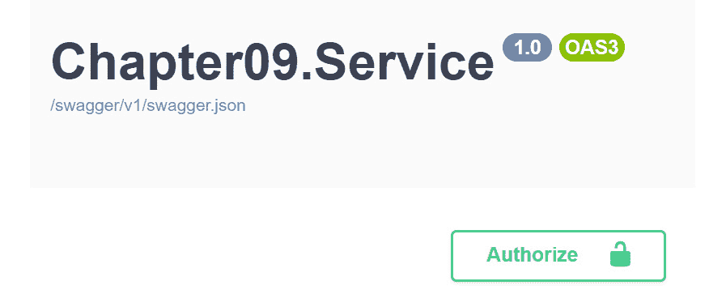

图 9.45：带有授权按钮的 Swagger 文档

1.  点击`Authorize`按钮以允许您输入令牌：

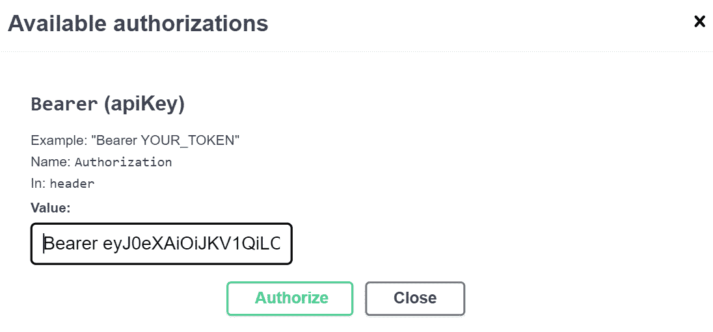

图 9.46：点击授权按钮后的令牌输入

1.  现在，发送一个请求：

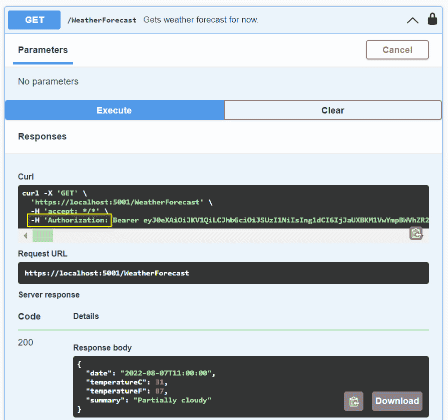

图 9.47：Swagger 生成的状态为 200 的请求

您将看到已添加授权头，并返回了`ok`响应（HTTP 状态码`200`）。

在本节中，您添加了一些配置以通过 Swagger 传递授权头。

注意

您可以在[`packt.link/hMc2t`](https://packt.link/hMc2t)找到此示例使用的代码。

如果您出错并且令牌验证失败，您将收到`401 – 未授权`或`403 – 禁止`状态码返回（通常没有任何详细信息）。修复此错误可能很头疼。然而，获取有关出错原因的更多信息并不太难。下一节提供了更多详细信息。

### 令牌验证错误故障排除

要模拟此场景，尝试通过在`appsettings.json`中更改任何单个符号（例如，最后一个字母更改为`b`）来使客户端-id 无效。运行请求并查看响应如何显示为`401`，日志中没有任何其他内容。

所有验证和入站和出站请求都可以通过管道跟踪。您必须做的就是将默认的最小日志级别从`info`更改为`Trace`。您可以通过替换`appsettings.development.json`文件内容来实现这一点：

```cs
{
  "Logging": {
    "LogLevel": {
      "Default": "Trace",
      "Microsoft": "Trace",
      "Microsoft.Hosting.Lifetime": "Trace"
    }
  }
}
```

不要将`appsettings.development.json`与`appsettings.json`混合使用。前者用于整体配置，而后者覆盖配置，但仅在某些环境中生效——在本例中是开发（本地）环境。

如果您再次运行相同的请求，您现在将在控制台看到详细的日志：

```cs
Audience validation failed. Audiences: 'api://2d8834d3-6a27-47c9-84f1-0c9db3eeb4bb'. Did not match: validationParameters.ValidAudience: 'api://2d8834d3-6a27-47c9-84f1-0c9db3eeb4bc' or validationParameters.ValidAudiences: 'null'.
```

深入检查会发现错误如下：

`Audience validation failed; Audiences: 'api://2d8834d3-6a27-47c9-84f1-0c9db3eeb4bb'. Did not match validationParameters`

此错误指示 JWT 中配置的受众不匹配：

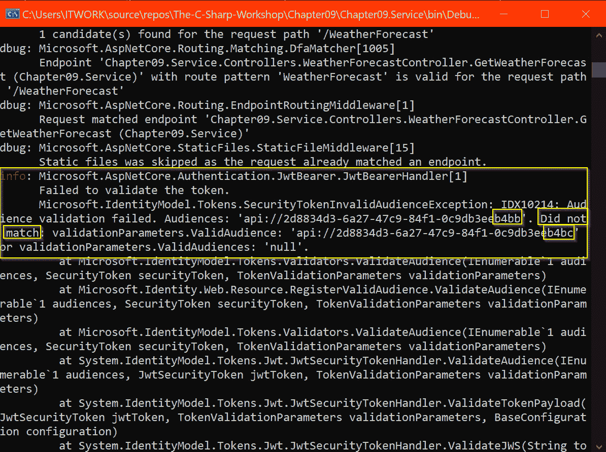

图 9.48：带有错误高亮的令牌验证错误

现在是时候学习关于 SOA 架构了，在这种架构中，系统的组件作为独立的服务托管。

## 面向服务架构

软件架构已经走了很长的路——从单体架构发展到面向服务架构（SOA）。SOA 是一种将应用程序的主要层作为独立服务托管的架构。例如，将有一个或多个用于数据访问的 Web API，一个或多个用于业务逻辑的 Web API，以及一个或多个消费所有内容的客户端应用程序。流程将如下所示：客户端应用程序调用业务 Web API，该 API 调用另一个业务 Web API 或数据访问 Web API。

然而，现代软件架构更进一步，引入了一种更进化的架构，称为微服务架构。

### 微服务架构

微服务架构是应用了单一职责原则的 SOA。这意味着，你不再有作为一层的服务，而是托管了具有单一职责的自包含模块。一个自包含的服务具有数据访问层和业务逻辑层。在这种方法中，每个模块都有许多服务，而不是每个层都有许多服务。

这些自包含模块的目的是允许多个团队同时在不同部分上工作，而不会相互干扰。除此之外，系统中的部分可以独立扩展和托管，且没有单点故障。此外，每个团队都可以自由使用他们最熟悉的任何技术栈，因为所有通信都通过 HTTP 调用进行。

这结束了本主题的理论部分。在接下来的部分中，你将通过一个活动将所学知识付诸实践。

## 活动九.01：使用微服务架构实现文件上传服务

微服务应该是自包含的，只做一件事。在这个活动中，你将总结将一段代码提取到微服务中的步骤，该微服务管理你通过网页（删除、上传和下载）与文件交互的方式。这应该作为创建新微服务时需要完成的整体有效清单。

执行以下步骤来完成此操作：

1.  创建一个新的项目。在这种情况下，它将是一个基于.NET 6.0 框架的`.NET Core Web API`项目。

1.  命名为`Chapter09.Activity.9.01`。

1.  现在，添加常用的 NuGet 包：

    +   `AutoMapper.Extensions.Microsoft.DependencyInjection`

    +   `FluentValidation.AspNetCore`

    +   `Hellang.Middleware.ProblemDetails`

    +   `Microsoft.AspNetCore.Mvc.NewtonsoftJson`

    +   `Microsoft.Identity.Web`

    +   `Swashbuckle.AspNetCore`

1.  接下来，将 Azure Blobs 客户端包包含为`Azure.Storage.Blobs`。

1.  创建一个或多个控制器以与 Web API 进行通信。在这种情况下，你将`FileController`移动到`Controllers`文件夹。

1.  为了创建一个或多个用于业务逻辑的服务，将`FilesService`移动到`Services`文件夹，将`FileServiceSetup`移动到`Bootstrap`文件夹。

1.  然后使用 XML 文档和 Swagger 记录 API。

1.  更新 `csproj` 文件以包含 XML 文档。

1.  将 `SwaggerSetup` 复制到 `Bootstrap` 文件夹。

1.  配置 `Controllers`。在这种情况下，它将是 `ControllersConfigurationSetup` 类和 `AddControllersConfiguration` 方法下的一个单行 `services.AddControllers()`。

1.  配置问题详细信息错误映射。在这种情况下，你将不会显式处理任何异常。因此，你将保持它在 `ExceptionMappingSetup` 类和 `AddExceptionMappings` 以及 `services.AddProblemDetails()` 方法中的单行。

1.  保护 API。

1.  为新服务创建 AAD 应用程序注册。请参考“*保护 Web API*”部分中的“*应用程序注册*”子部分。

1.  根据 Azure AD 应用程序注册客户端、`tenant` 和 `app` ID 更新新服务的配置。

1.  注入所需的服务并配置 API 管道。

1.  复制 `Program` 类。

1.  由于 `ConfigureServices` 方法包含额外的服务，你不需要删除它们。保持 `Configure` 方法不变。

1.  通过 Swagger 运行服务并上传测试文件。不要忘记首先使用之前学到的更新值生成令牌生成应用程序中的令牌。

1.  然后，尝试获取你刚刚上传的测试文件。你应该看到状态码 `200`：

    +   获取下载链接请求：

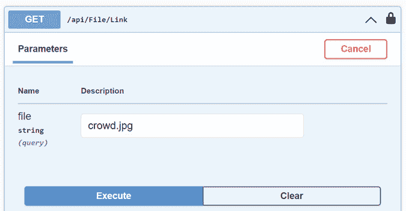

图 9.49：Swagger 中的获取下载链接请求

+   获取下载链接响应：

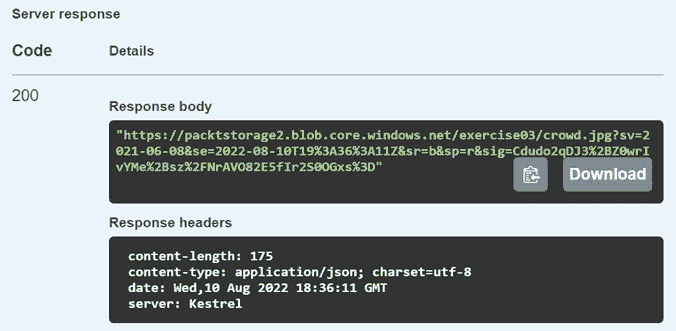

图 9.50：Swagger 中的获取下载链接响应

注意

该活动的解决方案可以在 [`packt.link/qclbF`](https://packt.link/qclbF) 找到。

到目前为止创建的所有服务都需要考虑诸如托管、扩展和可用性等问题。在下一节中，你将了解无服务器和 Azure Functions。

## Azure Functions

在前一节中，你了解到微服务架构是一个包含数据访问层和业务逻辑层的自包含服务。采用这种方法，每个模块都有许多服务。然而，与微服务一起工作，尤其是在开始时，可能会感觉像是一项麻烦。它可能会引发以下疑问：

+   “不够大”是什么意思？

+   你应该在不同的服务器上托管还是在同一台机器上托管？

+   另一种云托管模型是否更好？

这些问题可能令人感到压倒性。因此，通过 HTTP 调用你的代码的一种简单方法是通过使用 Azure Functions。Azure Functions 是一种无服务器解决方案，它允许你在云中调用你的函数。无服务器并不意味着没有服务器；只是你不需要自己管理它。在本节中，你将尝试将 *练习 9.02* 中的 `CurrentTimeController` 移植到 Azure Function。

注意

在继续下一步之前，首先使用以下说明安装 Azure Functions Core Tools：[`docs.microsoft.com/en-us/azure/azure-functions/functions-run-local?tabs=v3%2Cwindows%2Ccsharp%2Cportal%2Cbash%2Ckeda#install-the-azure-functions-core-tools`](https://docs.microsoft.com/en-us/azure/azure-functions/functions-run-local?tabs=v3%2Cwindows%2Ccsharp%2Cportal%2Cbash%2Ckeda#install-the-azure-functions-core-tools)。Azure Functions Core Tools 还需要安装 Azure CLI（如果你想要发布 Azure Functions 应用程序，而不是在服务器上）。请按照以下说明操作：[`docs.microsoft.com/en-us/cli/azure/install-azure-cli-windows?tabs=azure-cli`](https://docs.microsoft.com/en-us/cli/azure/install-azure-cli-windows?tabs=azure-cli)。

执行以下步骤以实现此目的：

1.  在 VS Code 中，点击 `扩展` 图标 (`1`)。

1.  然后，在搜索文本框中搜索 `azure function` (`2`)。

1.  然后，安装 `Azure Functions` 扩展 (`3`)：

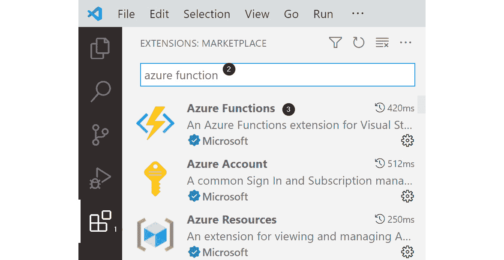

图 9.51：在 VS Code 中搜索 Azure Functions 扩展

在左侧将出现一个新的 Azure 选项卡。

1.  点击新的 Azure 选项卡。

1.  在新页面上，点击 `添加` 按钮 (`1`)。

1.  选择 `创建函数…` 选项 (`2`)：

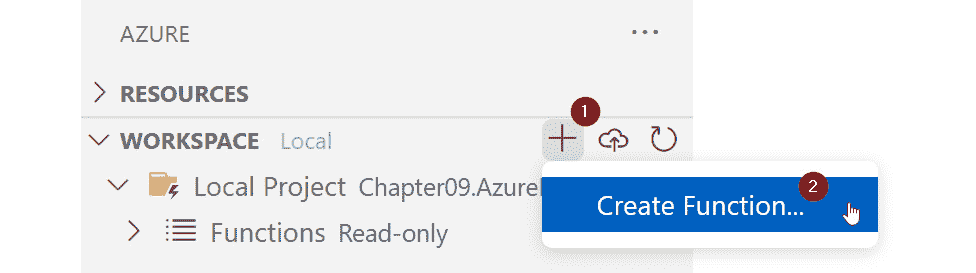

图 9.52：带有创建函数…按钮的 VS Code 中的新 Azure Functions 扩展

1.  在创建函数窗口中，选择 `HTTP trigger`。

1.  输入名称 `GetCurrentTime.Get`。

1.  将存放项目的名称命名为 `Pact.AzFunction`。

1.  在最后一屏，选择 `anonymous`。

在这一点上，没有必要对这个配置进行过多的详细说明。这里要考虑的关键点是，该函数将通过 HTTP 请求公开访问。通过这些步骤创建的新项目将包括新的 Azure Function。

1.  现在，导航到新项目文件夹的根目录以运行项目。

1.  然后，按 `F5` 或点击 `开始调试以更新此列表…` 消息：


图 9.53：带有待构建项目的 Azure 扩展窗口

你会注意到，在构建成功后，消息会变为函数名称：


图 9.54：带有后构建项目的 Azure 扩展窗口

VS Code 底部的终端输出窗口显示了以下详细信息：

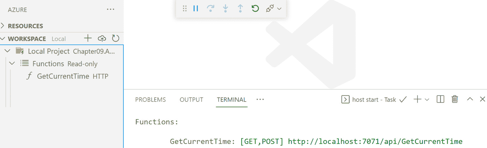

图 9.55：成功构建后的终端输出

1.  接下来，在 VS Code 探索器中打开 `GetCurrentTime.cs`：

1.  注意，在 *练习 9.01* 中，你使用了 `GetCurrentTime` 代码。你将在这里重用相同的代码：

    ```cs
    namespace Pact.Function
    {
        public static class GetCurrentTime
        {
            [Function("GetCurrentTime")]
            public static HttpResponseData Run([HttpTrigger(AuthorizationLevel.Anonymous, "get", "post")] HttpRequestData request,
                FunctionContext executionContext)
    ```

模板名称是根据你之前的配置生成的。Azure Function 通过 `[Function("GetCurrentTime")]` 属性绑定到 HTTP 端点。

在你继续之前，你可能已经注意到，尽管获取当前时间的函数使用了 `timezoneid` 变量，但这里还没有这样的变量（目前还没有）。与之前创建的用于将参数传递给 Azure Function 的 REST API 不同，这里你可以通过请求体或查询变量来传递它。这里唯一的问题是，你必须自己解析它，因为没有像控制器方法那样的属性绑定。你需要的是一个简单的字符串，它可以作为查询参数传递。这一行解析请求中的 URI 并从查询字符串中获取 `timezoneId` 变量。

1.  使用 `timezoneId` 变量来获取特定时区的时间：

    ```cs
            {
                var timezoneId = HttpUtility.ParseQueryString(request.Url.Query).Get("timezoneId");
    ```

1.  接下来是业务逻辑。因此，使用 `timezoneId` 变量来获取指定时区的时间：

    ```cs
    var timezoneInfo = TimeZoneInfo.FindSystemTimeZoneById(timezoneId);
                var time = TimeZoneInfo.ConvertTimeFromUtc(DateTime.UtcNow, timezoneInfo);
    ```

1.  最后，将结果序列化为 `HTTP 200 Ok` 作为 `text/plain` 内容类型：

    ```cs
    var response = request.CreateResponse(HttpStatusCode.OK);
                response.Headers.Add("Content-Type", "text/plain; charset=utf-8");
                response.WriteString(time.ToString());
                return response;
    }
    ```

1.  运行此代码并导航到 `http://localhost:7071/api/GetCurrentTime?timezoneId=Central%20European%20Standard%20Time`。

你将得到该时区当前的时间，如下所示：

```cs
2022-08-07 16:02:03
```

你现在已经掌握了 Azure Functions 的工作原理——一种在云端调用你的函数的无服务器解决方案。

在这本书中，你已经走过了一段漫长的路程，但随着这个最后活动的结束，你已经掌握了创建自己的现代 C# 应用程序所需的所有概念和技能。

# 摘要

在本章中，你学习了如何使用 ASP.NET Core Web API 模板构建自己的 REST Web API。你学习了如何使用引导类处理配置的日益增长复杂性。你被介绍到 OpenAPI 标准，以及用于调用 API 以查看是否成功渲染文档的 Swagger 工具。你还深入了解了将异常映射到特定的 HTTP 状态代码，以及如何将 DTO 映射到领域对象以及反之亦然。在章节的后半部分，你练习了使用 AAD 保护 Web API，了解了微服务概念，并创建了一个——通过一个新的专用 Web API 和通过 Azure Function。

了解如何创建和消费 Web API 非常重要，因为那正是大多数软件开发的核心。你可能在某个时候会消费或创建 Web API。即使你不需要自己创建一个，掌握它的来龙去脉也会帮助你作为一个专业开发者。

这标志着 *《C# 实战》* 的结束。在这本书中，你从 C# 编程的基础学起，从使用算术和逻辑运算符的简单程序开始，然后是越来越复杂的清洁编码、委托和 lambda 表达式、多线程、客户端和服务器 Web API 以及 Razor Pages 应用程序的概念。

这本书的印刷版到此结束，但这并不是您旅程的终点。访问 GitHub 仓库[`packt.link/sezEm`](https://packt.link/sezEm)，获取额外章节——第十章“自动化测试”和第十一章“生产就绪的 C#：从开发到部署”——涵盖在深入探讨使用 Nunit（C#最受欢迎的第三方测试库）进行单元测试之前的不同测试形式，熟悉 Git 并使用 GitHub 来远程备份您的代码，启用持续部署（CD）并将代码部署到云端，使用 Microsoft Azure 学习云，以及学习如何使用 GitHub Actions 执行 CI 和 CD，将应用程序更改实时推送到生产环境。


**Jason Hales**


**Almantas Karpavicius**


**Mateus Viegas**

## 嘿！

我们是这本书的作者 Jason Hales、Almantas Karpavicius 和 Mateus Viegas。我们真心希望您喜欢阅读我们的书，并觉得它对学习 C#很有帮助。

如果您能在亚马逊上留下对《C# Workshop》的评论，分享您的想法，这将真正对我们（以及其他潜在读者！）有所帮助。

访问链接 [`packt.link/r/1800566492`](https://packt.link/r/1800566492)。

或者

扫描二维码留下您的评论。


您的评论将帮助我们了解这本书中哪些内容做得很好，哪些内容需要改进以供未来版本使用，所以这真的非常感谢。

祝好，

Jason Hales、Almantas Karpavicius 和 Mateus Viegas


