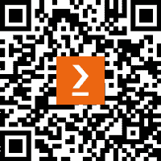

# 前言

有一些编程书籍长达数千页，旨在成为 C#语言、.NET 库以及网站、服务、桌面和移动应用等应用模型的综合参考。

本书与众不同。它简洁明了，旨在成为一本轻松愉快的读物，其中包含了每个主题的实用动手实践指南。广泛的叙述范围是以牺牲一些深度为代价的，但您会发现许多路标，如果您愿意，可以进一步探索。

本书同时是一本学习现代 C#和跨平台.NET 的实用指南，以及现代 Web 开发基础和用这些技术构建网站和服务的简要介绍。本书最适合 C#和.NET 的初学者，以及过去使用过 C#但可能觉得过去几年变化让自己落后于时代的程序员。

如果您已经熟悉 C#语言的旧版本，那么在*第二章*，*说 C#*的第一主题中，您可以在在线部分回顾新语言特性的表格。

如果您已经熟悉旧版本的.NET 库，那么在*第七章*，*打包和分发.NET 类型*的第一节中，您可以在在线部分回顾新库特性的表格。

我将指出 C#和.NET 的酷点和注意事项，以便您能迅速给同事留下深刻印象并提高工作效率。我并不会通过解释每一个小细节来放慢速度并让一些读者感到无聊，而是假设您足够聪明，能够通过 Google 为与主题相关但不是必需包含在有限篇幅的印刷书中的入门到中级指南中的主题找到解释。

一些章节为那些希望了解更多细节的读者提供了指向额外相关在线内容的链接。例如，*第一章*，*你好，C#! 欢迎使用.NET!*有一个关于.NET 历史和背景的在线部分。

# 代码解决方案的查找位置

您可以从以下链接的 GitHub 仓库下载逐步引导任务和练习的解决方案：

[`github.com/markjprice/cs13net9`](https://github.com/markjprice/cs13net9)

如果您不知道如何下载或克隆 GitHub 仓库，那么我将在*第一章*，*你好，C#! 欢迎使用.NET!*的末尾提供说明。

# 本书涵盖的内容

*第一章*，*你好，C#! 欢迎使用.NET!*，是关于设置你的开发环境以使用 Visual Studio 或 VS Code 与 C#开发工具包。然后你将学习如何使用它们用 C#和.NET 创建可能的最简单的应用程序。对于简化的控制台应用程序，你将看到 C# 9 中引入的顶级程序功能的用法，该功能随后在 C# 10 及以后的模板中默认使用。你还将了解一些寻找帮助的好地方，包括 ChatGPT 和 GitHub Copilot 等 AI 工具，以及如何通过其 GitHub 存储库和未来的印刷版本来联系我以获取帮助或提供改进书籍的反馈。

*第二章*，*C#入门*，介绍了 C#的版本，并在在线部分有表格显示哪些版本引入了新功能。我将解释你将每天使用的语法和词汇，以编写应用程序的源代码。特别是，你将学习如何声明和使用不同类型的变量。

*第三章*，*控制流程、类型转换和异常处理*，涵盖了使用运算符对变量执行简单操作，包括比较、编写做出决策的代码、模式匹配、重复语句块以及类型之间的转换。本章还涵盖了编写防御性代码以处理不可避免发生的异常，包括在.NET 8 中引入的`ArgumentOutOfRangeException`类上使用`ThrowIfLessThan`等守卫子句。

*第四章*，*编写、调试和测试函数*，是关于通过编写可重用函数来遵循**不要重复自己**（**DRY**）原则，这些函数使用命令式和函数式实现风格。你还将学习如何使用调试工具追踪和消除错误，使用热重载在应用程序运行时进行更改，在代码执行时监控代码以诊断问题，以及严格测试你的代码以消除错误，确保在部署到生产之前稳定性和可靠性。

*第五章*，*使用面向对象编程构建自己的类型*，讨论了类等类型可以拥有的所有不同成员类别，包括用于存储数据的字段和执行操作的函数。你将使用面向对象编程（**OOP**）的概念，如聚合和封装，以及如何管理类型的命名空间，包括使用 C# 12 引入的能力来别名任何引入的类型。你将学习语言特性，如元组语法支持、`out`变量、局部函数和默认文字以及推断的元组名称。你还将学习如何使用`record`关键字、`init`-only 属性和`with`表达式定义和操作不可变类型，这些都是在 C# 9 中引入的。最后，我们来看看 C# 11 如何引入`required`关键字来帮助避免过度使用构造函数来控制初始化，C# 12 如何为非记录类型引入主构造函数，以及 C# 13 如何扩展对`params`参数的支持类型，以及你现在如何定义部分属性以及部分方法。

*第六章*，*实现接口和继承类*，解释了如何使用面向对象编程（OOP）从现有类型派生出新类型。你将学习如何定义运算符、委托和事件，如何实现关于基类和派生类的接口，如何覆盖类型的成员，如何使用多态，如何创建扩展方法，如何在继承层次结构中的类之间进行类型转换，以及 C# 8 中引入可空引用类型带来的重大变化，以及 C# 10 及以后将其作为默认设置的转换。在可选的在线部分，你可以了解分析器如何帮助你编写更好的代码。

*第七章*，*打包和分发.NET 类型*，介绍了.NET 的版本，并在在线部分包含显示哪个版本引入了新库功能的表格。然后，我将介绍符合.NET Standard 的.NET 类型，并解释它们如何与 C#相关。在整个章节中，你将学习如何在任何支持的操作系统上编写和编译代码，包括 Windows、macOS 和 Linux 变体。你将学习如何打包、部署和分发你自己的应用程序和库。在三个可选的在线部分，你可以了解如何在.NET 库中使用遗留.NET Framework 库，关于将遗留.NET Framework 代码库迁移到现代.NET 的可能性，以及关于源生成器和如何创建它们。

*第八章*，*使用常见的.NET 类型*，讨论了允许你的代码执行常见实用任务的类型，例如操作数字和文本、在集合中存储项，以及在可选的仅限在线章节中，使用低级类型与网络进行操作。你还将了解正则表达式以及使编写它们更简单的改进，以及如何使用源生成器来提高它们的性能。随着.NET 9 的引入，出现了新的类，用于 Base64 编码的 URL、在大型整数上执行乘法、有序字典、只读集、改进字符串搜索以及能够在部分属性上生成正则表达式。

*第九章*，*处理文件、流和序列化*，涵盖了与文件系统交互、读写文件和流、文本编码以及 JSON 和 XML 等序列化格式，包括`System.Text.Json`类改进的功能和性能。如果你使用 Linux，那么你可能会对如何使用`tar`存档进行编程操作感兴趣，你可以在一个仅限在线的章节中了解这些内容。.NET 9（终于！）移除了危险的遗留`BinaryFormatter`序列化类，并添加了一个用于导出 JSON 模式的类。

*第十章*，*使用 Entity Framework Core 处理数据*，解释了如何使用名为**Entity Framework Core**（**EF Core**）的**对象关系映射**（**ORM**）技术，对关系型数据库（如 SQL Server 和 SQLite）进行读写操作。你将学习如何使用**Database First**模型定义实体模型，这些模型映射到数据库中现有的表。在三个仅限在线的章节中，你还可以学习如何定义**Code First**模型，这些模型可以在运行时创建表和数据库，如何插入、更新和删除数据，以及如何使用事务将多个更改组合在一起。

*第十一章*，*使用 LINQ 查询和操作数据*，介绍了**语言集成查询**（**LINQ**）——语言扩展，它添加了处理项目序列并过滤、排序和将它们投影到不同输出的能力。本章包括.NET 6 中引入的 LINQ 方法，如`TryGetNonEnumeratedCount`和`DistinctBy`，.NET 7 中的`Order`和`OrderDescending`，以及.NET 9 中的`CountBy`、`AggregateBy`和`Index`。可选的仅限在线章节涵盖了使用并行 LINQ 的多线程、使用 LINQ to XML 以及创建自己的 LINQ 扩展方法。

*第十二章*，*使用.NET 介绍现代 Web 开发*，介绍了可以使用 C#和.NET 构建的 Web 项目类型。你还将构建一个 EF Core 模型来表示虚构组织*Northwind*的数据库，该数据库将在本书的其余章节中使用。你将学习如何使用中央包管理来高效地管理 NuGet 包版本。最后，你将了解 HTML 和 CSS 等常见 Web 技术。

*第十三章*，*使用 ASP.NET Core 构建网站*，是关于学习使用 ASP.NET Core 在服务器端构建具有现代 HTTP 架构的网站的基础。您将学习如何实现 ASP.NET Core 的 Blazor 静态**服务器端渲染（SSR**）功能，该功能取代了用于创建数据驱动 Web 页面的旧 Razor Pages 技术。您将学习如何使用.NET 9 引入的新方法`MapStaticAssets`来优化静态资源，如 JavaScript 和样式表。在两个仅在线提供的可选部分中，您将了解如何自定义 HTTP 请求和响应管道，并深入了解在网站项目中启用 HTTP/3 的方法。

*第十四章*，*使用 Blazor 构建交互式 Web 组件*，介绍了如何使用 Blazor 构建可以在服务器端或浏览器客户端内部执行的 Web 用户界面组件。您将看到如何构建易于在客户端和服务器之间切换的组件，这是随着.NET 8 引入的新托管模型。

*第十五章*，*构建和消费 Web 服务*，解释了使用 ASP.NET Core Minimal APIs 构建后端 REST 架构 Web 服务的方法。我们将介绍如何使用新的 Microsoft 实现的 OpenAPI 文档生成器来文档化它们。随着.NET 9 的引入，我们将学习如何使用混合缓存来获得内存和分布式缓存的最佳效果。然后我们将看到如何使用工厂实例化的 HTTP 客户端来正确消费它们。在两个仅在线提供的可选部分中，您将了解高级功能，如健康检查和添加安全 HTTP 头，以及 Minimal APIs 项目如何在发布过程中使用本机**预编译**（**AOT**）编译来提高启动时间和内存占用。

*后记*描述了您进一步学习 C#和.NET 的选项。

*附录*，*测试你的知识问题答案*，包含了每章末尾的测试问题的答案。您可以通过以下链接阅读附录：[`packt.link/LsQtz`](https://packt.link/LsQtz)。

# 您需要为本书准备的内容

您可以使用 VS Code 和大多数操作系统上的命令行工具来开发和部署 C#和.NET 应用程序，包括 Windows、macOS 和许多种类的 Linux。您只需要一个支持 VS Code 的操作系统和互联网连接，就可以跟随本书学习。

如果您更喜欢其他选择，那么您可以选择使用 Visual Studio 或 JetBrains Rider 等第三方工具。

# 下载本书中的彩色图像

我们还为您提供了一个包含本书中使用的截图和图表彩色图像的 PDF 文件。彩色图像将帮助您更好地理解输出中的变化。

您可以从[`packt.link/gbp/9781835881224`](https://packt.link/gbp/9781835881224)下载此文件。

# 规范

在这本书中，您将找到许多用于区分不同类型信息的文本样式。以下是一些这些样式的示例及其含义的解释。

`CodeInText`：表示文本中的代码单词、数据库表名、文件夹名、文件名、文件扩展名、路径名、虚拟 URL、用户输入和 Twitter 昵称。例如：“`Controllers`、`Models`和`Views`文件夹包含 ASP.NET Core 类和`.cshtml`文件，用于在服务器上执行。”

代码块按以下方式设置：

```cs
// storing items at index positions
names[0] = "Kate";
names[1] = "Jack";
names[2] = "Rebecca";
names[3] = "Tom"; 
```

当我们希望您注意代码块中的特定部分时，相关的行或项目会被突出显示：

```cs
// storing items at index positions
names[0] = "Kate";
**names[1] = "Jack";**
names[2] = "Rebecca";
names[3] = "Tom"; 
```

任何命令行输入或输出都按以下方式编写：

```cs
dotnet new console 
```

**粗体**：表示新**术语**、重要的**单词**或您在屏幕上看到的单词，例如在菜单或对话框中。例如：“点击**下一步**按钮将您带到下一个屏幕。”

重要提示和外部资源的链接出现在这样的框中。

**良好实践**：如何像专家一样编程的建议如下所示。

# 联系我们

我们始终欢迎读者的反馈。

**一般反馈**：如果您对本书的任何方面有疑问，请在邮件主题中提及书名，并通过`customercare@packtpub.com`给我们发邮件。

**勘误表**：尽管我们已经尽最大努力确保内容的准确性，但错误仍然可能发生。如果您在这本书中发现了错误，如果您能向我们报告，我们将不胜感激。请访问[www.packtpub.com/support/errata](https://www.packtpub.com/support/errata)，选择您的书籍，点击**勘误提交表单**链接，并输入详细信息。

**盗版**：如果您在互联网上以任何形式发现我们作品的非法副本，如果您能提供位置地址或网站名称，我们将不胜感激。

请通过`copyright@packt.com`与我们联系，并提供材料的链接。

如果您有兴趣成为作者：如果您在某个主题上具有专业知识，并且您有兴趣撰写或为书籍做出贡献，请访问[authors.packtpub.com](https://authors.packtpub.com)。

# 留下您的评价！

感谢您从 Packt Publishing 购买这本书——我们希望您喜欢它！您的反馈对我们来说是无价的，它帮助我们改进和成长。一旦您阅读完毕，请花一点时间留下一个[Amazon 评价](https://packt.link/r/1835881238)；这只需一分钟，但对像您这样的读者来说意义重大。

扫描下面的二维码，免费获得您选择的电子书。


https://packt.link/NzOWQ

# 下载这本书的免费 PDF 副本

感谢您购买这本书！

您喜欢在路上阅读，但无法携带您的印刷书籍到处走吗？

您的电子书购买是否与您选择的设备不兼容？

别担心，现在每购买一本 Packt 书籍，您都可以免费获得该书的 DRM 免费 PDF 版本。

在任何地方、任何设备上阅读。直接从您最喜欢的技术书籍中搜索、复制和粘贴代码到您的应用程序中。

优惠远不止这些，您还可以获得独家折扣、新闻通讯以及每天收件箱中的优质免费内容。

按照以下简单步骤获取福利：

1.  扫描下面的二维码或访问以下链接：



https://packt.link/free-ebook/9781835881224

1.  提交您的购买证明。

1.  就这样！我们将直接将您的免费 PDF 和其他福利发送到您的邮箱。
