# 第一章：嗨，C#! 欢迎使用 .NET！

在本章中，第一个目标是设置您的开发环境以使用 Visual Studio 2022、Visual Studio Code 或 JetBrains Rider。

在本书的整个过程中，我将使用 **Visual Studio**、**VS Code** 和 **Rider** 这三个名称分别指代这三个代码编辑器。

其他目标包括理解现代 .NET、.NET Core、.NET Framework、Mono、Xamarin 和 .NET Standard 之间的相似之处和不同之处；使用 C# 13 和 .NET 9 创建可能的最简单应用程序，使用各种代码编辑器；然后发现寻找帮助的好地方。

我的写作风格确保您可以从我的书中开始，然后切换到在线文档和其他在线资源，如视频、博客和论坛，这些是开发者喜欢学习的主要方式，如下链接所示：[`survey.stackoverflow.co/2024/developer-profile#learning-to-code`](https://survey.stackoverflow.co/2024/developer-profile#learning-to-code)。

本章节涵盖了以下主题：

+   介绍本书及其内容

+   设置您的开发环境

+   理解 .NET

+   使用 Visual Studio 构建控制台应用程序

+   使用 VS Code 构建控制台应用程序

+   充分利用本书的 GitHub 仓库

+   寻找帮助

# 介绍本书及其内容

让我们从介绍这本书的代码解决方案、结构和内容开始。

## 获取本书的代码解决方案

本书 GitHub 仓库提供了使用完整应用程序项目解决所有代码任务和练习的解决方案，如下链接所示：

[`github.com/markjprice/cs13net9`](https://github.com/markjprice/cs13net9)

在您的网络浏览器中导航到 GitHub 仓库后，按键盘上的 `.`（点）键，或手动将链接中的 `.com` 更改为 `.dev`，将仓库转换为基于 VS Code 的实时代码编辑器，称为 GitHub Codespaces，如图 *1.1* 所示：

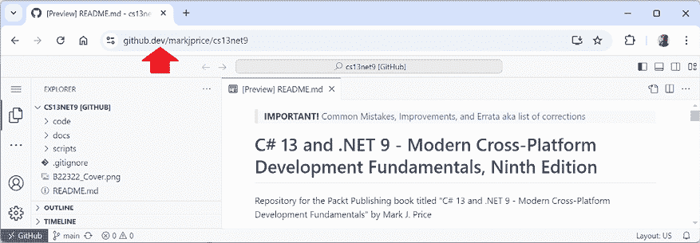

图 1.1：GitHub Codespaces 在实时编辑本书的 GitHub 仓库

**警告！** 当您使用 GitHub Codespaces 访问仓库时，其 GitHub Repositories 扩展将尝试下载仓库的索引。默认情况下，最大大小可达 50MB，但仓库超过了此限制，因此您将看到以下警告信息：“仓库超过下载大小限制！继续使用部分文本服务。”您可以忽略此信息，因为您没有使用完整功能。

我们为您提供了一份包含本书中使用的截图和图表彩色图像的 PDF 文件。您可以从 [`packt.link/gbp/9781837635870`](https://packt.link/gbp/9781837635870) 下载此文件。

在网络浏览器中运行 VS Code 是在您完成本书的编码任务时与您选择的本地代码编辑器并行运行的好方法。您可以将您的代码与解决方案代码进行比较，并在需要时轻松复制和粘贴部分内容。

你不需要使用或了解 Git 就能获取本书的解决方案代码。你可以通过以下直接链接下载包含所有代码解决方案的 ZIP 文件，然后将 ZIP 文件提取到你的本地文件系统中：[`github.com/markjprice/cs13net9/archive/refs/heads/main.zip`](https://github.com/markjprice/cs13net9/archive/refs/heads/main.zip)。

## 本书使用的.NET 术语

在这本书中，我使用术语**现代.NET**来指代.NET 9 及其前身，如.NET 6，它们源自.NET Core。我使用术语**传统.NET**来指代.NET Framework、Mono、Xamarin 和.NET Standard。

现代.NET 是那些传统平台和标准的统一体。

## 本书的结构和风格

在第一章之后，本书将分为三个部分：语言、库和 Web 开发。

首先，我们将涵盖 C#语言的语法和词汇；其次，我们将涵盖.NET 库中可用于构建应用程序功能的类型；第三，我们将涵盖使用 C#和.NET 构建的跨平台网站、服务和浏览器应用程序的基础。

大多数人通过模仿和重复来最好地学习复杂主题，而不是阅读理论的详细解释；因此，我不会在这本书的每个步骤都提供详细的解释。目的是让你编写一些代码并看到它运行。

你不需要立即知道所有细节。这将是随着你构建自己的应用程序并超越任何书籍所能教授的内容而逐渐出现的事情。

用 1755 年编写英语词典的塞缪尔·约翰逊的话来说，我犯了一些“一些荒谬的错误和可笑的谬误，任何如此繁多的作品都无法避免。”我对此承担全部责任，并希望你能欣赏我尝试通过撰写关于快速发展的技术（如 C#和.NET）以及你可以用它们构建的应用程序的书所带来的挑战。

如果你对这本书有任何投诉，请在撰写亚马逊上的负面评论之前联系我。作者无法回应亚马逊评论，所以我无法联系你解决问题并帮助你或倾听你的反馈并试图在下一版中做得更好。请在本书的 Discord 频道中提出问题[`packt.link/csharp13dotnet9`](https://packt.link/csharp13dotnet9)，通过`markjprice@gmail.com`给我发邮件，或在以下链接的 GitHub 存储库中提出问题：[`github.com/markjprice/cs13net9/issues`](https://github.com/markjprice/cs13net9/issues)。

## 本书涵盖的主题

本书涵盖了以下主题：

+   **语言基础**：C#语言的基本特性，从声明变量到编写函数和面向对象编程。

+   **库基础**：.NET 基础类库的基本功能，以及一些用于数据库访问等常见任务的某些重要可选包。

+   **现代 Web 开发基础**：ASP.NET Core 框架的现代功能，用于服务器端和客户端网站及 Web 服务开发。这包括 Blazor 和最小 API，不包括基于控制器的功能，如 MVC 和 Web API，或遗留功能，如 Razor Pages。

这本书，《C# 13 和 .NET 9 – 现代跨平台开发基础》，最好按章节顺序线性阅读，因为它逐步构建基本技能和知识。

## .NET 8 应用和服务涵盖的主题

以下主题可在配套书籍《.NET 8 应用和服务》中找到：

+   **数据**：SQL Server 和 Azure Cosmos DB。

+   **专用库**：日期、时间、时区和国际化；用于图像处理、日志记录、映射和生成 PDF 的常见第三方库；多任务和并发；等等。

+   **服务**：缓存、队列、后台服务、gRPC、GraphQL、Azure Functions、SignalR 和最小 API。

+   **用户界面**：ASP.NET Core、Blazor 和 .NET MAUI。

这本书更像是一本食谱书，所以如果你特别感兴趣于构建 gRPC 服务，那么你可以直接阅读那章，而无需阅读关于最小 API 服务的 preceding chapters。

## .NET 8 工具和技能涵盖的主题

以下主题可在配套书籍《.NET 8 工具和技能》中找到：

+   调试和内存分析。

+   从单元和集成测试到性能和 Web UI 测试的所有重要测试类型。

+   Docker 和 .NET Aspire 用于本地分布式开发和测试。

+   设计模式和解决方案架构。

+   准备面试以获得你想要的 .NET 开发者职业。

我为 .NET 8 编写的书籍同样适用于 .NET 9。你可以让你的项目针对 .NET 9，所有代码示例都将正常工作。由于向后兼容性，你不需要等待包升级以也针对 .NET 9，因此无需等待。

## 查找所有我的书籍

要查看我通过 Packt 出版的所有书籍的列表，你可以使用以下链接：

[`subscription.packtpub.com/search?query=mark+j.+price`](https://subscription.packtpub.com/search?query=mark+j.+price)

在亚马逊上也有类似的列表：

[`www.amazon.com/Mark-J-Price/e/B071DW3QGN/`](https://www.amazon.com/Mark-J-Price/e/B071DW3QGN/)

你也可以在其他图书销售网站上搜索我的书籍。

# 设置你的开发环境

在开始编程之前，你需要一个用于 C# 的代码编辑器，无论是来自 Microsoft 还是第三方。

Microsoft 拥有一系列代码编辑器和 **集成开发环境**（**IDEs**），包括：

+   Visual Studio for Windows

+   VS Code for Windows、Mac 或 Linux

+   VS Code for the Web 或 GitHub Codespaces

第三方已经创建了他们自己的 C#代码编辑器；例如，JetBrains 有跨平台的 Rider，它适用于 Windows、Mac 或 Linux，并且自 2024 年 10 月起对非商业用途免费。Rider 在经验更丰富的.NET 开发者中很受欢迎。

**警告！**虽然 JetBrains 是一家了不起的公司，拥有优秀的产品，但 Rider 和 Visual Studio 的 ReSharper 扩展都是软件，所有软件都有 bug 和古怪的行为。例如，它们可能会在你的 Razor 页面、Razor 视图和 Blazor 组件中显示错误，如*无法解析符号*。然而，你可以构建和运行这些文件，因为没有真正的问题。如果你安装了 Unity 支持插件，那么它将抱怨装箱操作（这对 Unity 游戏开发者来说是一个真正的问题），但在非 Unity 项目中；因此，这个警告不适用。

大多数读者使用 Visual Studio，这是一个庞大而复杂的工具，可以做很多事情。但 Visual Studio 喜欢提供自己的机制来做尽可能多的事情，使用它的.NET 开发者可能会很容易地认为 Visual Studio 是完成.NET 相关任务（如修改项目配置或编辑代码文件）的唯一方式。

总是试图记住，Visual Studio 和所有其他代码编辑器只是为你做工作的工具，你可以手动完成这些工作。它们只是显示了你正在工作的文件（如项目文件和所有 C#代码文件）中真正发生的事情的视图。

你可以使用纯文本编辑器手动编辑项目和代码文件。最终，你使用`dotnet`命令行界面来编译（即构建）项目文件，将其打包成可运行的程序集，作为`.dll`或`.exe`文件，如图*图 1.2*所示：

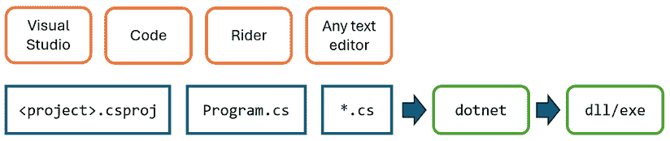

图 1.2：所有代码编辑器最终只是更改底层文件

## 选择适合学习的适当工具和应用类型

学习 C#和.NET 的最佳工具和应用类型是什么？

在学习时，最好的工具是那些帮助你编写代码和配置，但不会隐藏真正发生的事情的工具。IDEs 提供了友好的图形用户界面，但它们在底层为你做了什么？一个更基本的代码编辑器，在提供编写代码帮助的同时更接近操作，在学习过程中可能会更好。

话虽如此，你可以提出这样的论点：最好的工具是你已经熟悉或者你或你的团队将用作日常开发工具的工具。因此，我希望你能自由选择任何 C#代码编辑器或 IDE 来完成这本书中的编码任务，包括 VS Code、Visual Studio，甚至是 Rider。

在本书中，我在*本章*中提供了详细的分步指导，说明如何在 Visual Studio 和 VS Code 中创建多个项目。同时，还有链接到其他代码编辑器的在线指导，如下所示：[`github.com/markjprice/cs13net9/blob/main/docs/code-editors/README.md`](https://github.com/markjprice/cs13net9/blob/main/docs/code-editors/README.md)。

在随后的章节中，我只会给出项目的名称以及一般性说明，这样你可以使用你喜欢的任何工具。

对于学习 C#语言结构和许多.NET 库来说，最佳的应用类型是不受不必要的应用程序代码干扰的类型。例如，没有必要创建一个完整的 Windows 桌面应用程序或网站，只是为了学习如何编写`switch`语句。

因此，我相信学习第一章到第十一章的 C#和.NET 主题的最佳方法是构建控制台应用程序。然后，在第十二章到第十五章，关于 Web 开发的部分，你将使用 ASP.NET Core 的现代部分构建网站和服务，包括 Blazor 和 Minimal APIs。

### 用于跨平台开发的 VS Code

从中选择最现代和轻量级的代码编辑器，并且是微软唯一一款跨平台的编辑器，就是 VS Code。它可以在所有常见的操作系统上运行，包括 Windows、macOS 以及许多 Linux 版本，例如**红帽企业 Linux**（**RHEL**）和 Ubuntu。

VS Code 是现代跨平台开发的良好选择，因为它拥有广泛且不断增长的扩展集，支持 C#以外的许多语言。对于 C#和.NET 开发者来说，最重要的扩展是于 2023 年 6 月发布的**C#开发工具包**（**C# Dev Kit**），它将 VS Code 从通用代码编辑器转变为针对 C#和.NET 开发者优化的工具。

**更多信息**：你可以在以下链接的官方公告中了解关于**C#开发工具包**扩展的更多信息：[`devblogs.microsoft.com/visualstudio/announcing-csharp-dev-kit-for-visual-studio-code/`](https://devblogs.microsoft.com/visualstudio/announcing-csharp-dev-kit-for-visual-studio-code/).

由于 VS Code 及其扩展跨平台且轻量级，可以安装到你的应用程序将部署的所有平台上，以便快速修复错误等。选择 VS Code 意味着开发者可以使用跨平台的代码编辑器来开发跨平台的应用程序。VS Code 支持 ARM 处理器，因此你可以在苹果硅电脑和树莓派电脑上开发。

VS Code 对 Web 开发有强大的支持，尽管目前对移动和桌面开发的支持较弱。

VS Code 迄今为止是最受欢迎的代码编辑器或集成开发环境（IDE），在 Stack Overflow 的调查中，超过 73%的专业开发者选择了它，你可以通过以下链接阅读调查结果：[`survey.stackoverflow.co/2024/`](https://survey.stackoverflow.co/2024/).

### 用于云上开发的 GitHub Codespaces

GitHub Codespaces 是一个基于 VS Code 的完全配置的开发环境，可以在云中托管的环境中启动，并通过任何网络浏览器访问。它支持 Git 仓库、扩展和内置的命令行界面，因此您可以从任何设备进行编辑、运行和测试。

但请注意，为了使您的 GitHub Codespaces 体验完全功能化和实用，它确实有一定的许可费用。

**更多信息**：您可以在以下链接中了解更多关于 GitHub Codespaces 的信息：[`github.com/features/codespaces`](https://github.com/features/codespaces)。

### Visual Studio 通用开发

Visual Studio 可以创建大多数类型的应用程序，包括控制台应用程序、网站、网络服务和桌面应用程序。尽管您可以使用 Visual Studio 编写跨平台的移动应用程序，但您仍然需要 macOS 和 Xcode 来编译它。

Visual Studio 仅在 Windows 10 版本 1909 或更高版本、家庭版、专业版、教育版或企业版；或 Windows 11 版本 21H2 或更高版本、家庭版、专业版、专业教育版、工作站专业版、企业版或教育版上运行。Windows Server 2016 及更高版本也受支持。32 位操作系统和 Windows S 模式不支持。

**警告！** Visual Studio for Mac 并未官方支持 .NET 8 或更高版本，并且它已于 2024 年 8 月达到其生命周期的终点。如果您一直在使用 Visual Studio for Mac，那么您应该切换到 VS Code for Mac、Rider for Mac，或者在本地计算机或云中使用虚拟机运行 Windows 上的 Visual Studio，使用类似 Microsoft Dev Box 的技术。退休公告可以在此处阅读：[`devblogs.microsoft.com/visualstudio/visual-studio-for-mac-retirement-announcement/`](https://devblogs.microsoft.com/visualstudio/visual-studio-for-mac-retirement-announcement/)。

### 我所使用的

为了编写和测试本书的代码，我使用了以下硬件和软件：

+   在 Surface Laptop 7 Copilot+ PC 上使用 Visual Studio、VS Code 和 Rider 运行 Windows 11。

+   在配备 Apple Silicon Mac mini (M1) 台式机的 macOS 上使用 VS Code 和 Rider。

我希望您也能访问各种硬件和软件，因为看到平台之间的差异可以加深您对开发挑战的理解，尽管上述任何一种组合都足以学习 C# 和 .NET 的基础知识以及如何构建实用的应用程序和网站。

## 部署跨平台

您在开发时选择的代码编辑器和操作系统不会限制您的代码部署的位置。

.NET 9 支持以下平台进行部署：

+   **Windows**: Windows 10 版本 1607 或更高版本、Windows 11 版本 22000 或更高版本、Windows Server 2012 R2 SP1 或更高版本，以及 Nano Server 版本 2019 或 2022。

+   **Mac**: macOS Catalina 版本 10.15 或更高版本，并在 Rosetta 2 x64 模拟器中运行。

+   **Linux**: Alpine Linux 3.19 或 3.20、CentOS Stream 9、Debian 12、Fedora 40、openSUSE 15.5 或 15.6、RHEL 8 或 9、SUSE Enterprise Linux 15.5 或 15.6、以及 Ubuntu 20.04、22.04 或 24.04。

+   **Android**: 最低 SDK 目标是 API 21 或更高版本。版本 12、12.1、13 和 14。

+   **iOS**和**iPadOS**: 15、16 或 17。iOS 12.2 作为最低 SDK 目标。

+   **Mac 催化剂**: 12、13 或 14。

**警告！** .NET 对 Windows 7 和 8.1 的支持已于 2023 年 1 月结束：[`github.com/dotnet/core/issues/7556`](https://github.com/dotnet/core/issues/7556)。

.NET 5 及以后的 Windows Arm64 支持意味着你可以在 Windows Arm 设备上开发，并部署到像微软的 Windows Dev Kit 2023（以前称为 Project Volterra）和 Surface Pro 11 以及 Surface Laptop 7。

你可以在以下链接中查看最新的受支持操作系统和版本：[`github.com/dotnet/core/blob/main/release-notes/9.0/supported-os.md`](https://github.com/dotnet/core/blob/main/release-notes/9.0/supported-os.md)。

所有受支持的.NET 版本都可以通过 Windows 的 Microsoft Update 自动更新。

## 下载并安装 Visual Studio

许多专业的.NET 开发者在日常开发工作中使用 Visual Studio。即使你选择使用 VS Code 来完成本书中的编码任务，你也可能想熟悉一下 Visual Studio。只有当你用某个工具编写了一定数量的代码后，你才能真正判断它是否符合你的需求。

如果你没有 Windows 电脑，则可以跳过本节，继续到下一节，在那里你将下载并安装 VS Code 在 macOS 或 Linux 上。

自 2014 年 10 月以来，微软已向学生、开源贡献者和个人免费提供专业质量的 Visual Studio 版本。它被称为社区版。任何版本都适合本书。如果你还没有安装它，我们现在就安装：

1.  从以下链接下载 Visual Studio 的最新版本：[`visualstudio.microsoft.com/downloads/`](https://visualstudio.microsoft.com/downloads/)。

**Visual Studio vNext**：在撰写本文时，Visual Studio 的版本是 17.12，并命名为 Visual Studio 2022。我预计下一个主要版本的 Visual Studio 将是 18.0，并命名为 Visual Studio 2025。它可能将在本书发布后的 2025 年上半年发布。Visual Studio 2025 将主要具有与 2022 版相同的特性，尽管用户界面可能会做一些调整。

1.  运行安装程序以开始安装。

1.  在**工作负载**选项卡上，选择以下：

    +   **ASP.NET 和 Web 开发**。

    +   **.NET 桌面开发**（因为这包括控制台应用程序）。

    +   使用 C++进行**桌面开发**（包含所有默认组件，因为这样可以让你发布启动更快且内存占用更小的控制台应用程序和 Web 服务）。

1.  点击**安装**，等待安装程序获取所选软件，然后进行安装。

1.  安装完成后，点击**启动**。

1.  第一次运行 Visual Studio 时，您将被提示登录。如果您有 Microsoft 账户，可以使用该账户。如果没有，可以在以下链接注册一个新账户：[`signup.live.com/`](https://signup.live.com/)。

1.  第一次运行 Visual Studio 时，您将被提示配置您的环境。对于 **开发设置**，选择 **Visual C#**。对于颜色主题，我选择了 **蓝色**，但您可以选择任何您喜欢的。

1.  如果您想自定义您的键盘快捷键，请导航到 **工具** | **选项…**，然后选择 **键盘** 部分。

### Visual Studio 的键盘快捷键

在这本书中，我将避免展示键盘快捷键，因为它们通常都是自定义的。如果它们在代码编辑器中一致且常用，我会尽量展示它们。

如果您想识别和自定义您的键盘快捷键，可以参考以下链接：[`learn.microsoft.com/en-us/visualstudio/ide/identifying-and-customizing-keyboard-shortcuts-in-visual-studio`](https://learn.microsoft.com/en-us/visualstudio/ide/identifying-and-customizing-keyboard-shortcuts-in-visual-studio)。

## 下载并安装 VS Code

VS Code 在过去几年中迅速改进，并且以其受欢迎程度让微软感到惊喜。如果您敢于尝试并喜欢走在前沿，那么还有 **Insiders** 版本，这是下一个版本的每日构建版本。

即使您计划只使用 Visual Studio 进行开发，我也建议您下载并安装 VS Code，并使用它来完成本章中的编码任务，然后决定是否想在本书的剩余部分只使用 Visual Studio。

现在我们来下载并安装 VS Code、.NET SDK 以及 **C# 开发工具包** 扩展：

1.  从以下链接下载并安装 VS Code 的稳定版或 Insiders 版本：[`code.visualstudio.com/`](https://code.visualstudio.com/)。

**更多信息**：如果您需要更多帮助安装 VS Code，可以阅读以下链接中的官方安装指南：[`code.visualstudio.com/docs/setup/setup-overview`](https://code.visualstudio.com/docs/setup/setup-overview)。

1.  从以下链接下载并安装 9.0 和 8.0 版本的 .NET SDK：[`www.microsoft.com/net/download`](https://www.microsoft.com/net/download)。

在现实生活中，您极不可能只在您的计算机上安装一个 .NET SDK 版本。为了了解如何控制用于构建项目的 .NET SDK 版本，我们需要安装多个版本。.NET 8 和 .NET 9 是截至 2024 年 11 月出版时唯一受支持的版本。您可以安全地并行安装多个 SDK。最新版本的 SDK 将用于构建您的项目。

1.  要使用用户界面安装 **C# 开发工具包** 扩展，您必须首先启动 VS Code 应用程序。

1.  在 VS Code 中，点击 **扩展** 图标或导航到 **视图** | **扩展**。

1.  **C# 开发工具包** 是最受欢迎的扩展之一，因此您应该能在列表顶部看到它，或者您可以在搜索框中输入 `C#`。

**C# 开发工具包** 依赖于 **C#** 扩展版本 2.0 或更高版本，因此您无需单独安装 **C#** 扩展。请注意，**C#** 扩展版本 2.0 或更高版本不再使用 OmniSharp，因为它有一个新的 **语言服务器协议 (LSP**) 主机。**C# 开发工具包** 还依赖于 **.NET 扩展作者安装工具** 和 **IntelliCode for C# 开发工具包** 扩展，因此它们也将被安装。

1.  点击 **安装** 并等待支持包下载和安装。

**良好实践**：请务必阅读 **C# 开发工具包** 的许可协议。它的许可协议比 **C#** 扩展更为严格：[`aka.ms/vs/csdevkit/license`](https://aka.ms/vs/csdevkit/license)。

### 安装其他扩展

在本书的后续章节中，您将使用更多 VS Code 扩展。如果您现在想安装它们，我们将使用的所有扩展都显示在 *表 1.1* 中：

| **扩展名称和标识符** | **描述** |
| --- | --- |
| **C# 开发工具包**`ms-dotnettools.csdevkit` | 来自微软的官方 C# 扩展。帮助您使用解决方案资源管理器管理代码，并通过集成的单元测试发现和执行测试您的代码，无论您在哪里开发（Windows、macOS、Linux，甚至是在代码空间中），都能提升您的 C# 开发体验。 |
| **C#**`ms-dotnettools.csharp` | 提供了丰富的 C# 语言支持，并随 C# 开发工具包一起提供。由一个 **语言服务器协议 (LSP**) 服务器提供支持，此扩展与开源组件如 Roslyn 和 Razor 集成，以提供丰富的类型信息和更快、更可靠的 C# 体验。 |
| **IntelliCode for C# 开发工具包**`ms-dotnettools.vscodeintellicode-csharp` | 为 Python、TypeScript/JavaScript、C# 和 Java 开发者提供 AI 辅助开发功能。 |
| **MSBuild 项目工具**`tintoy.msbuild-project-tools` | 为 MSBuild 项目文件提供 IntelliSense，包括 `<PackageReference>` 元素的自动完成。 |
| **Markdown All in One**`yzhang.markdown-all-in-one` | 提供了 Markdown 所需的一切（键盘快捷键、目录、自动预览等）。 |
| **多语言笔记本**`ms-dotnettools.dotnet-interactive-vscode` | 此扩展增加了在笔记本中使用 .NET 和其他语言的支持。它依赖于 **Jupyter** 扩展 (`ms-toolsai.jupyter`)，该扩展本身也有依赖项。 |
| **ilspy-vscode**`icsharpcode.ilspy-vscode` | 反编译 MSIL 程序集 – 支持 .NET、.NET Framework、.NET Core 和 .NET Standard。 |
| **REST 客户端**`humao.rest-client` | 在 VS Code 中发送 HTTP 请求并直接查看响应。 |

表 1.1：VS Code 的 .NET 开发扩展

你可以在命令提示符或终端中安装 VS Code 扩展，如下 *表 1.2* 所示：

| **命令** | **描述** |
| --- | --- |
| `code --list-extensions` | 列出已安装的扩展。 |
| `code --install-extension <extension-id>` | 安装指定的扩展。 |
| `code --uninstall-extension <extension-id>` | 卸载指定的扩展。 |

表 1.2：在命令提示符中管理 VS Code 扩展

例如，要安装 **C# 开发工具包** 扩展，请在命令提示符中输入以下内容：

```cs
code --install-extension ms-dotnettools.csdevkit 
```

我已经创建了 PowerShell 脚本来安装和卸载前面表格中的 VS Code 扩展。你可以在以下链接中找到它们：[`github.com/markjprice/cs13net9/tree/main/scripts/extension-scripts/`](https://github.com/markjprice/cs13net9/tree/main/scripts/extension-scripts/)。PowerShell 脚本是跨平台的，你可以在以下链接中了解更多信息：[`learn.microsoft.com/en-us/powershell/scripting/overview`](https://learn.microsoft.com/en-us/powershell/scripting/overview)。

### 理解 VS Code 版本

微软几乎每个月都会发布一个新的 VS Code 功能版本，并且更频繁地发布错误修复版本。例如：

+   版本 1.93.0，2024 年 8 月的功能发布

+   版本 1.93.1，2024 年 8 月的错误修复发布

本书使用的版本是 1.93.0，2024 年 8 月的功能发布版，但 VS Code 的版本不如你安装的 **C# 开发工具包** 或 **C#** 扩展的版本重要。我建议使用 **C# 开发工具包** v1.10.18 或更高版本，以及 **C#** 扩展 v2.45.20 或更高版本。

虽然 **C#** 扩展不是必需的，但它提供你在输入时的智能感知、代码导航和调试功能，因此安装并保持更新以支持最新的 C# 语言特性是非常方便的。

### VS Code 的快捷键

如果你想要自定义 VS Code 的快捷键，那么你可以，如下所示链接所示：[`code.visualstudio.com/docs/getstarted/keybindings`](https://code.visualstudio.com/docs/getstarted/keybindings)。

我建议你从以下列表中下载适用于你操作系统的 VS Code 快捷键 PDF：

+   Windows: [`code.visualstudio.com/shortcuts/keyboard-shortcuts-windows.pdf`](https://code.visualstudio.com/shortcuts/keyboard-shortcuts-windows.pdf)

+   macOS: [`code.visualstudio.com/shortcuts/keyboard-shortcuts-macos.pdf`](https://code.visualstudio.com/shortcuts/keyboard-shortcuts-macos.pdf)

+   Linux: [`code.visualstudio.com/shortcuts/keyboard-shortcuts-linux.pdf`](https://code.visualstudio.com/shortcuts/keyboard-shortcuts-linux.pdf)

# 理解 .NET

> “那些不能记住过去的人注定要重蹈覆辙。”
> 
> – 乔治·桑塔亚那

.NET、.NET Core、.NET Framework、.NET Standard 和 Xamarin 是开发者常用的相关且重叠的平台，用于构建应用程序和服务。

如果你不太熟悉 .NET 的历史，那么我将在以下链接中为你介绍这些 .NET 概念：

[`github.com/markjprice/cs13net9/blob/main/docs/ch01-dotnet-history.md`](https://github.com/markjprice/cs13net9/blob/main/docs/ch01-dotnet-history.md)

随着时间的推移，越来越多的读者已经了解了.NET 的历史，所以在书中继续包含它将会是空间的浪费。但如果你是新手，那么请确保阅读我在网上提供的所有额外内容，如前面的内容。

## 理解.NET 支持

.NET 版本可以是**长期支持**（**LTS**）、**标准支持期**（STS）（以前称为**当前**）或**预览**，如下面的列表中所述：

+   **LTS**版本是对于那些不打算频繁更新的应用程序的好选择，尽管你必须每月更新你的生产代码的.NET 运行时。LTS 版本在**通用可用性**（**GA**）后的 3 年内或下一个 LTS 版本发布后的 1 年内得到微软的支持，以较长者为准。

+   **STS**版本包含可能根据反馈而更改的特性。这些版本对于你正在积极开发的应用程序来说是个不错的选择，因为它们提供了访问最新改进的机会。STS 版本在 GA 后的 18 个月内或下一个 STS 或 LTS 版本发布后的 6 个月内得到微软的支持，以较长者为准。

+   **预览**版本是供公众测试的。这些版本对于想要走在技术前沿的冒险程序员或需要提前访问新语言特性、库以及应用和服务平台的编程书籍作者来说是个不错的选择。预览版本通常不得到微软的支持，但一些预览或**发布候选**（**RC**）版本可能会被宣布为**上线**，这意味着它们在生产中得到微软的支持。

STS 和 LTS 版本在其生命周期内会收到针对安全和可靠性的关键补丁。

**良好实践**：你必须保持与最新补丁的同步以获得支持。例如，如果一个系统正在运行.NET 运行时版本 9.0.0，然后版本 9.0.1 发布，你必须安装版本 9.0.1 以获得支持。这些更新在每个月的第二个星期二发布，也就是所谓的**补丁星期二**。

为了更好地理解你关于 STS 和 LTS 版本的选择，看到它们以可视化方式呈现是有帮助的，LTS 版本用 3 年长的黑色条表示，STS 版本用 1½年长的灰色条表示，如图*图 1.3*所示：

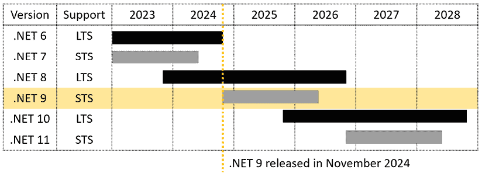

图 1.3：最近和计划中的 STS 和 LTS 版本的支持时长

在.NET 9 的生命周期内，.NET 8 仍将得到支持，而.NET 10 将发布。我已经尽力考虑到你可能选择使用本书中的.NET 8 或.NET 10；然而，显然，本书无法涵盖.NET 10 的新特性，因为我不知道它们会是什么！

如果你需要来自微软的长周期支持（LTS），那么请将你的 .NET 项目设置为针对 .NET 8，并在 2025 年 11 月发布后迁移到 .NET 10。这是因为 .NET 9 是一个短期支持（STS）版本，因此它将在 2026 年 5 月之前失去支持，而 .NET 8 将在 2026 年 11 月失去支持。一旦 .NET 10 发布，立即开始将你的 .NET 8 项目升级到它。在 .NET 8 达到其生命周期的结束之前，你将有整整一年的时间来完成这项工作。

**良好实践**：记住，对于所有发布版本，你必须升级到错误修复版本，如 .NET 运行时 9.0.1 和 .NET SDK 9.0.101，这些版本预计将在 2024 年 12 月发布，因为更新每月都会发布。

在 2024 年 11 月发布时，所有现代 .NET 版本都已达到其 EOL，除了以下列表中显示的版本，它们按其 EOL 日期排序：

+   .NET 9 将在 2026 年 5 月达到 EOL。

+   .NET 8 将在 2026 年 11 月达到 EOL。

+   .NET 10 将从 2025 年 11 月开始提供，并将在 2028 年 11 月达到 EOL。

你可以通过以下链接检查哪些 .NET 版本目前正在得到支持以及它们何时将达到 EOL：[`github.com/dotnet/core/blob/main/releases.md`](https://github.com/dotnet/core/blob/main/releases.md)。

## 理解生命周期的结束（EOL）

**支持结束**或**生命周期的结束**（EOL）意味着在此日期之后，微软将不再提供错误修复、安全更新或技术支持。

例如，现在 .NET 6 在 2024 年 11 月 12 日达到支持结束，你可以期待以下情况：

+   使用 .NET 6 的项目将继续运行。

+   对于 .NET 6，将不再发布新的安全更新，因此继续使用不受支持的版本将越来越容易暴露你于安全漏洞。

+   你可能无法访问你继续使用的任何 .NET 6 应用程序的技术支持。

+   当你从像 .NET 9 SDK 这样的后续 SDK 靶向 .NET 6 时，你会得到 `NETSDK1138` 构建警告。

+   当你针对 .NET 6 时，你将在 Visual Studio 中收到警告。

## 理解 .NET 支持阶段

.NET 版本的寿命会经过几个阶段，在这些阶段中，它们的支持水平各不相同，如下列所示：

+   **预览版**：这些版本根本不受支持。.NET 9 预览版 1 到预览版 7 从 2024 年 2 月到 2024 年 8 月处于此支持阶段。

+   **上市**：这些版本在 GA 之前得到支持，然后立即不再支持。一旦可用，你必须立即升级到最终发布版本。.NET 9 发布候选版本 1 和发布候选版本 2 分别在 2024 年 9 月和 10 月处于此支持阶段。

+   **活跃状态**：.NET 9 将从 2024 年 11 月到 2025 年 11 月处于此支持阶段。

+   **维护**：在其生命周期的最后 6 个月中仅提供安全修复。.NET 9 将从 2025 年 11 月到 2026 年 5 月处于此支持阶段。

+   **EOL**：不受支持。.NET 9 将在 2026 年 5 月达到其 EOL。

## 理解 .NET 运行时和 .NET SDK 版本

如果您尚未构建独立应用程序，那么您至少需要安装 .NET 运行时，以便操作系统可以运行 .NET 应用程序。.NET SDK 包含 .NET 运行时，以及构建 .NET 代码和应用程序所需的编译器和其他工具。

.NET 运行时版本化遵循语义版本化——也就是说，主版本号的增加表示破坏性更改，次版本号的增加表示新功能，补丁版本号的增加表示错误修复。

.NET SDK 版本化不遵循语义版本化。主版本号和次版本号与它们匹配的运行时版本相关联。第三个数字遵循一个约定，表示 SDK 的次版本和补丁版本。第三个数字从 100 开始，对于初始版本（相当于次版本和补丁号为 0.0）。第一个数字随着次版本的增加而增加，其他两个数字随着补丁版本的增加而增加。

您可以在 *表 1.3* 中看到一个例子：

| **变更** | **运行时** | **SDK** |
| --- | --- | --- |
| 首次发布 | 9.0.0 | 9.0.100 |
| SDK 错误修复 | 9.0.0 | 9.0.101 |
| 运行时和 SDK 错误修复 | 9.0.1 | 9.0.102 |
| SDK 新功能 | 9.0.1 | 9.0.200 |

表 1.3：.NET 运行时和 SDK 的更改和版本示例

## 列出和删除 .NET 版本

.NET 运行时更新与 9.x 等主版本兼容，.NET SDK 的更新版本保持构建针对先前运行时版本的应用程序的能力，这允许安全地删除旧版本。

您可以使用以下命令查看当前已安装的 SDK 和运行时：

```cs
dotnet --list-sdks
dotnet --list-runtimes
dotnet --info 
```

**良好实践**：为了使在命令提示符或终端中输入命令更容易，以下链接列出了本书中可以轻松复制和粘贴的所有命令：[`github.com/markjprice/cs13net9/blob/main/docs/command-lines.md`](https://github.com/markjprice/cs13net9/blob/main/docs/command-lines.md).

在 Windows 上，使用 **应用和功能** 部分来删除 .NET SDK。

在 Linux 上，没有单一机制，但您可以在以下链接中了解更多信息：

[`learn.microsoft.com/en-us/dotnet/core/install/remove-runtime-sdk-versions?pivots=os-linux`](https://learn.microsoft.com/en-us/dotnet/core/install/remove-runtime-sdk-versions?pivots=os-linux)

您可以使用第三方工具，如位于以下链接的友好 .NET SDK 管理器 Dots：[`johnnys.news/2023/01/Dots-a-dotnet-SDK-manager`](https://johnnys.news/2023/01/Dots-a-dotnet-SDK-manager)。在撰写本文时，您必须从其 GitHub 仓库中构建应用程序，因此我只推荐高级开发者使用。

## 理解中间语言

`dotnet` CLI 工具使用的 C#编译器（命名为**Roslyn**）将你的 C#源代码转换为**中间语言**（**IL**）代码，并将 IL 存储在**程序集**（DLL 或 EXE 文件）中。IL 代码语句类似于汇编语言指令，由.NET 的虚拟机（称为 CoreCLR，是现代.NET 中**公共语言运行时（CLR）**的新名称）执行。传统的.NET Framework 有一个仅限 Windows 的 CLR，而现代.NET 为每个操作系统（如 Windows、macOS 和 Linux）都有一个。如今，它们通常都被称为 CLRs。

在运行时，CoreCLR 从程序集加载 IL 代码，**即时编译器**将其编译成本地 CPU 指令，然后由你的机器上的 CPU 执行。

这种两步编译过程的优点是，微软可以为 Linux 和 macOS 以及 Windows 创建**CLRs**。由于第二步骤生成了适用于本地操作系统和 CPU 指令集的代码，因此相同的 IL 代码可以在任何地方运行。

不论源代码是用哪种语言编写的（例如，C#、Visual Basic 或 F#），所有.NET 应用程序都使用存储在程序集中的 IL 代码作为它们的指令。微软和其他人提供了可以打开程序集并揭示此 IL 代码的反汇编工具，例如 ILSpy .NET 反汇编器扩展。你将在*第七章*，*打包和分发.NET 类型*中了解更多信息，该章节可在以下链接找到：[`github.com/markjprice/cs13net9/blob/main/docs/ch07-decompiling.md`](https://github.com/markjprice/cs13net9/blob/main/docs/ch07-decompiling.md)。

因此，编译过程通常涉及将源代码转换为 IL，然后由 CLR 使用 JIT 编译在运行时将其编译成机器代码。**提前编译（AOT）**是这种方法的替代方案，你将在*第七章*，*打包和分发.NET 类型*中了解它。

## 比较.NET 技术

我们可以总结并比较当前的.NET 技术，如*表 1.4*所示：

| **技术** | **描述** | **宿主操作系统** |
| --- | --- | --- |
| 现代 NET | 包含从 C# 8 到 C# 13 的完整语言支持的现代功能集。它可以用于移植现有应用程序或创建新的桌面、移动和 Web 应用程序和服务。 | Windows、macOS、Linux、Android、iOS、tvOS 和 Tizen |
| .NET Framework | 具有限制 C# 8 支持且没有 C# 9 或更高版本支持的旧功能集。它仅应用于维护现有应用程序。 | 仅限 Windows |
| Xamarin | 仅适用于移动和桌面应用程序。 | Android、iOS 和 macOS |

表 1.4：.NET 技术比较

Visual Studio、Rider 以及甚至安装了**C#开发工具包**扩展的 VS Code 都有一个称为**解决方案**的概念，它允许你同时打开和管理多个项目。我们将使用解决方案来管理本章中你将创建的两个项目。

# 使用 Visual Studio 构建控制台应用程序

本节的目标是展示如何使用 Visual Studio 构建控制台应用程序。

如果你没有 Windows 计算机或想使用 VS Code，则可以跳过此部分，因为代码将是相同的；只是工具体验不同。然而，我建议你查看此部分，因为它确实解释了一些代码和顶级程序的工作方式，这些信息适用于所有代码编辑器。

本节也可在 GitHub 仓库中找到（如果需要，发布后可以更新）以下链接：

[`github.com/markjprice/cs13net9/blob/main/docs/code-editors/vs.md`](https://github.com/markjprice/cs13net9/blob/main/docs/code-editors/vs.md)

如果你想看到使用 Rider 的类似说明，它们可以在以下链接的 GitHub 仓库中找到：

[`github.com/markjprice/cs13net9/blob/main/docs/code-editors/rider.md`](https://github.com/markjprice/cs13net9/blob/main/docs/code-editors/rider.md)

## 使用 Visual Studio 编写代码

让我们开始编写代码：

1.  启动 Visual Studio。

1.  在**创建新项目**对话框中，选择 C#语言以过滤项目模板，在**搜索模板**框中输入`console`，然后选择**控制台应用程序**。

确保你选择了跨平台项目模板，而不是仅适用于 Windows 的.NET Framework 模板，以及**C#**项目模板而不是其他语言，例如 Visual Basic 或 TypeScript。

1.  点击**下一步**。

1.  在**配置新项目**对话框中，将项目名称输入为`HelloCS`，将位置输入为`C:\cs13net9`，将解决方案名称输入为`Chapter01`。

在 GitHub 仓库的以下链接中可以找到创建新项目时 Visual Studio 的截图：[`github.com/markjprice/cs13net9/blob/main/docs/ch01-project-options.md`](https://github.com/markjprice/cs13net9/blob/main/docs/ch01-project-options.md)。

1.  点击**下一步**。

1.  在**附加信息**对话框中，在**框架**下拉列表中，注意你的.NET SDK 选择表示该版本是**标准支持期限**、**长期支持**、**预览**还是**已停用**，然后选择**.NET 9.0（标准支持期限）**。

你可以安装你喜欢的任何.NET SDK 版本。如果你缺少一个.NET SDK 版本，则可以从以下链接安装它：[`dotnet.microsoft.com/en-us/download/dotnet`](https://dotnet.microsoft.com/en-us/download/dotnet)。

1.  保持标记为**不使用顶级语句**的复选框为空。（在本章的后面，你将创建一个选择此选项的控制台应用程序，因此你会看到差异。）

1.  保持标记为**启用原生 AOT 发布**的复选框为空。你将在*第七章*，*打包和分发.NET 类型*中了解此选项的功能。

1.  点击**创建**。

1.  如果你看不到**解决方案资源管理器**，则导航到**视图** | **解决方案资源管理器**。

1.  如果代码没有显示，那么在 **解决方案资源管理器** 中，双击名为 `Program.cs` 的文件以打开它，并注意 **解决方案资源管理器** 显示 **HelloCS** 项目，如图 *1.4* 所示：


图 1.4：在 Visual Studio 中编辑 Program.cs

1.  在 `Program.cs` 中，请注意代码仅由一个注释和一条语句组成，如下所示代码：

    ```cs
    // See https://aka.ms/new-console-template for more information
    Console.WriteLine("Hello, World!"); 
    ```

    此模板使用了 C# 9 中引入的顶级程序功能，我将在本章后面解释。正如代码中的注释所说，您可以在以下链接中了解更多关于此模板的信息：[`aka.ms/new-console-template`](https://aka.ms/new-console-template)。

1.  在 `Program.cs` 中，修改第 2 行，以便写入控制台的文字显示为 `Hello, C#!`。

    所有必须审查或键入的代码示例和命令都以纯文本形式显示，因此您永远不需要从截图（如图 *1.4* 所示）中读取代码或命令，因为截图可能太小或太淡。

## 使用 Visual Studio 编译和运行代码

下一个任务是编译和运行代码：

1.  在 Visual Studio 中，导航到 **调试** | **不调试启动**。

**良好实践**：当您在 Visual Studio 中启动项目时，可以选择是否附加调试器。如果您不需要调试，那么最好不要附加，因为附加调试器需要更多资源，并且会减慢一切速度。附加调试器还会限制您只能启动一个项目。如果您想运行多个项目，每个项目都附加了调试器，那么您必须启动多个 Visual Studio 实例。在工具栏中，单击顶栏中 **HelloCS** 右侧的绿色轮廓三角形按钮（如图 *1.5* 所示），以不调试启动，而不是顶栏中 **HelloCS** 左侧的绿色实心三角形按钮（如图 *1.5* 所示），除非您需要调试。

1.  控制台窗口中的输出将显示应用程序运行的结果，如图 *1.5* 所示：

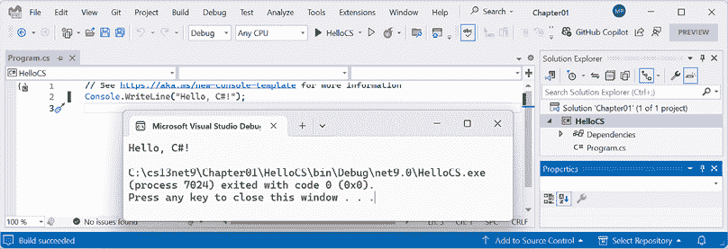

图 1.5：在 Windows 上运行控制台应用程序

1.  按任意键关闭控制台应用程序窗口并返回到 Visual Studio。

1.  可选地，关闭 **属性** 选项卡以为 **解决方案资源管理器** 提供更多垂直空间。

1.  双击 **HelloCS** 项目，并注意 `HelloCS.csproj` 项目文件显示，该项目已将其目标框架设置为 `net9.0`，如图 *1.6* 所示。

1.  在 **解决方案资源管理器** 工具栏中，切换开启 **显示所有文件** 按钮，并注意编译器生成的 `bin` 和 `obj` 文件夹可见，如图 *1.6* 所示：

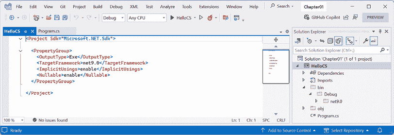

图 1.6：显示编译器生成的文件夹和文件

## 理解编译器生成的文件夹和文件

根据以下列表，创建了两个由编译器生成的文件夹，分别命名为 `obj` 和 `bin`：

+   `obj`文件夹包含每个源代码文件的一个编译的**对象**文件。这些对象还没有被链接成一个最终的可执行文件。

+   `bin`文件夹包含应用程序或类库的**二进制**可执行文件。我们将在*第七章*，*打包和分发.NET 类型*中更详细地探讨这一点。

你目前不需要查看这些文件夹或理解它们的文件（但如果你好奇，可以随意浏览）。

请注意，编译器需要创建临时文件夹和文件来完成其工作。你可以删除这些文件夹及其文件，它们将在你下次“构建”或运行项目时自动重新创建。开发者通常会删除这些临时文件夹和文件以“清理”项目。Visual Studio 甚至有一个名为**清理解决方案**的命令，它会为你删除一些这些临时文件。CLI 中的等效命令是`dotnet clean`。

## 理解顶层程序

如果你之前见过较老的.NET 项目，那么你可能期望有更多的代码，甚至只是输出一个简单的消息。这个项目有最少的语句，因为当你针对.NET 6 或更高版本时，一些必需的代码是由编译器为你编写的。

如果你使用.NET SDK 5 或更早版本创建项目，或者如果你选择了标记为**不使用顶层语句**的复选框，那么`Program.cs`文件将包含更多的语句，如下面的代码所示：

```cs
using System;
namespace HelloCS
{
  class Program
  {
    static void Main(string[] args)
    {
      Console.WriteLine("Hello, World!");
    }
  }
} 
```

在使用.NET SDK 6 或更高版本进行编译时，所有用于定义`Program`类及其`Main`方法的样板代码都会生成并围绕你编写的语句包装。

这使用了.NET 5 中引入的一个特性，称为**顶层程序**，但直到.NET 6，微软才更新了控制台应用程序的项目模板，使其默认使用顶层语句。然后，在.NET 7 及以后的版本中，微软添加了选项，如果你更喜欢旧风格，可以使用：

+   如果你正在使用 Visual Studio，请选择标记为**不使用顶层语句**的复选框。

+   如果你正在命令提示符下使用`dotnet` CLI，请添加一个开关：

    ```cs
    dotnet new console --use-program-main 
    ```

**警告！**一个功能上的差异是，自动生成的代码没有定义命名空间，因此`Program`类在没有任何名称的空命名空间中隐式定义，而不是与项目名称匹配的命名空间。

## 顶层程序的要求

关于顶层程序需要记住的关键点包括以下内容：

+   在一个项目中，只能有一个类似于用于顶层程序代码的文件。

+   任何`using`语句都必须位于文件的顶部。

+   如果你声明了任何类或其他类型，它们必须位于文件的底部。

+   尽管你应该显式定义入口点方法为`Main`，但编译器创建的方法名为`<Main>$`。

## 隐式导入的命名空间

文件顶部的`using System;`语句导入`System`命名空间。这使`Console.WriteLine`语句能够工作。但为什么我们不需要在我们的项目中导入它？

技巧在于我们仍然需要导入`System`命名空间，但现在它是通过 C# 10 和.NET 6 中引入的功能组合来完成的。让我们看看它是如何做到的：

1.  在**解决方案资源管理器**中，展开`obj`、`Debug`和`net9.0`文件夹，并打开名为`HelloCS.GlobalUsings.g.cs`的文件。

1.  注意，此文件是由编译器自动为针对.NET 6 或更高版本的项目创建的，并使用 C# 10 中引入的功能，称为**全局命名空间导入**，该功能导入一些常用命名空间，如`System`，以便在所有代码文件中使用，如下面的代码所示：

    ```cs
    // <autogenerated />
    global using global::System;
    global using global::System.Collections.Generic;
    global using global::System.IO;
    global using global::System.Linq;
    global using global::System.Net.Http;
    global using global::System.Threading;
    global using global::System.Threading.Tasks; 
    ```

1.  在**解决方案资源管理器**中，单击**显示所有文件**按钮以隐藏`bin`和`obj`文件夹。

我将在下一章中解释更多关于隐式导入功能的内容。现在，只需注意，.NET 5 和.NET 6 之间发生的重大变化之一是，许多项目模板，如控制台应用程序模板，使用新的 SDK 和语言功能来隐藏实际发生的事情。

## 通过抛出异常来揭示隐藏的代码

现在我们来探究隐藏的代码是如何编写的：

1.  在`Program.cs`中，在输出消息的语句之后，添加一个抛出新异常的语句，如下面的代码所示：

    ```cs
    throw new Exception(); 
    ```

1.  在 Visual Studio 中，导航到**调试** | **不调试启动**。（不要以调试方式启动项目，否则异常将被调试器捕获！）

1.  控制台窗口中的输出将显示应用程序的运行结果，包括编译器定义了一个隐藏的`Program`类，其中有一个名为`<Main>$`的方法，该方法有一个名为`args`的参数来传递参数，如图*图 1.7*和以下输出所示：

    ```cs
    Hello, C#!
    Unhandled exception. System.Exception: Exception of type 'System.Exception' was thrown.
       at Program.<Main>$(String[] args) in C:\cs13net9\Chapter01\HelloCS\Program.cs:line 3 
    ```

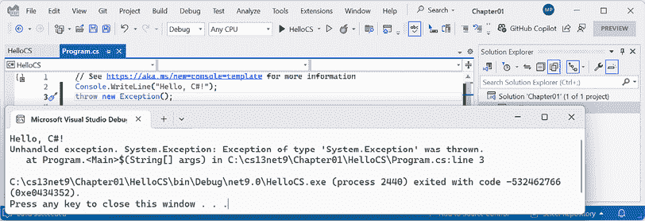

图 1.7：抛出异常以揭示隐藏的 Program.<Main>$方法

1.  按任意键关闭控制台应用程序窗口并返回 Visual Studio。

## 揭示`Program`类的命名空间

现在，让我们探究`Program`类是在哪个命名空间中定义的：

1.  在`Program.cs`中，在抛出异常的语句之前，添加语句以获取`Program`类的命名空间名称，并将其写入控制台，如下面的代码所示：

    ```cs
    string name = typeof(Program).Namespace ?? "<null>";
    Console.WriteLine($"Namespace: {name}"); 
    ```

`??`是**空合并运算符**。第一个语句的意思是，“如果`Program`的命名空间是`null`，则返回`<null>`；否则，返回名称。”你将在本书的其余部分看到这些关键字和运算符的更多解释。现在，只需输入代码并运行它，看看它会做什么。

**良好实践**：代码编辑器有一个名为**代码片段**的功能。这允许您通过输入快捷键并按两次*Tab*来插入常用代码片段。例如，在 Visual Studio 中，要输入`Console.WriteLine()`并将光标置于括号中间以便您输入要输出的内容，请输入`cw`，然后按*Tab*，*Tab*。阅读您代码编辑器的文档以了解如何使用快捷键插入代码片段。

1.  在 Visual Studio 中，导航到**调试** | **不调试启动**。

1.  控制台窗口的输出将显示应用程序的运行结果，包括隐藏的`Program`类在没有命名空间的情况下被定义，如下面的输出所示：

    ```cs
    Namespace: <null> 
    ```

1.  按任意键关闭控制台应用程序窗口并返回 Visual Studio。

## 使用 Visual Studio 添加第二个项目

让我们向我们的解决方案添加第二个项目以探索如何处理多个项目：

1.  在 Visual Studio 中，导航到**文件** | **添加** | **新建项目…**。

    **警告！**上述步骤将向现有解决方案添加一个新项目。请勿导航到**文件** | **新建** | **项目…**，因为这实际上是为了创建一个新项目和解决方案（尽管对话框中有一个下拉菜单可以选择添加到现有解决方案）。

1.  在**添加新项目**对话框中，在**最近的项目模板**中，选择**控制台应用程序 [C#]**，然后点击**下一步**。

1.  在**配置新项目**对话框中，对于**项目名称**，输入`AboutMyEnvironment`，将位置保留为`C:\cs13net9\Chapter01`，然后点击**下一步**。

1.  在**附加信息**对话框中，选择**.NET 9.0（标准支持条款）**并选择**不使用顶级语句**复选框。

**警告！**请确保您已选中**不使用顶级语句**复选框，以便我们能够看到较旧的`Program.cs`风格。

1.  点击**创建**。

1.  在`AboutMyEnvironment`项目中，在`Program.cs`中，注意定义与项目名称匹配的命名空间、名为`Program`的内部类以及名为`Main`的静态方法，该方法有一个名为`args`的参数，返回值为空（`void`），如下面的代码所示：

    ```cs
    namespace AboutMyEnvironment
    {
      internal class Program
      {
        static void Main(string[] args)
        {
          Console.WriteLine("Hello, World!");
        }
      }
    } 
    ```

1.  在`Program.cs`文件中，在`Main`方法中，将现有的`Console.WriteLine`语句替换为输出当前目录、操作系统版本和`Program`类的命名空间的语句，如下面的代码所示：

    ```cs
    Console.WriteLine(Environment.CurrentDirectory);
    Console.WriteLine(Environment.OSVersion.VersionString);
    Console.WriteLine("Namespace: {0}",
      typeof(Program).Namespace ?? "<null>"); 
    ```

1.  在**解决方案资源管理器**中，右键单击**Chapter01**解决方案，然后选择**配置启动项目…**。

1.  在**“Chapter01”解决方案属性页**对话框中，将**启动项目**设置为**当前选择**，然后点击**确定**。

1.  在**解决方案资源管理器**中，单击`AboutMyEnvironment`项目（或其内的任何文件或文件夹），并注意 Visual Studio 通过使项目名称加粗来指示`AboutMyEnvironment`现在是启动项目。

**良好实践**：我推荐这种方式来设置启动项目，因为这样通过简单地点击一个项目（或项目中的任何文件）就可以轻松地切换启动项目。尽管您可以通过右键单击项目将其设置为启动项目，但如果您想运行不同的项目，则必须手动再次更改它。在项目中任何地方点击都更简单。在大多数章节中，您只需一次运行一个项目。在*第十五章，构建和消费 Web 服务*中，我将向您展示如何配置多个启动项目。

1.  导航到**调试**|**不调试启动**来运行 `AboutMyEnvironment` 项目，并注意结果，如下面的输出和*图 1.8*所示：

    ```cs
    C:\cs13net9\Chapter01\AboutMyEnvironment\bin\Debug\net9.0
    Microsoft Windows NT 10.0.26100.0
    Namespace: AboutMyEnvironment 
    ```


图 1.8：在 Visual Studio 解决方案中运行具有两个项目的控制台应用程序

Windows 11 只是品牌名称。它的官方名称是 Windows NT，其主要版本号仍然是 10！但它的补丁版本是 22000 或更高。

1.  按任意键关闭控制台应用程序窗口并返回 Visual Studio。

    当 Visual Studio 运行控制台应用程序时，它将从 `<projectname>\bin\Debug\net9.0` 文件夹中执行它。在后续章节中处理文件系统时，这一点非常重要。当使用 VS Code（更准确地说，是 `dotnet` CLI）时，它有不同的行为，您很快就会看到。

# 使用 VS Code 构建控制台应用程序

本节的目标是展示如何使用 VS Code 和 `dotnet` CLI 构建控制台应用程序。

如果您从未想尝试 VS Code 或 `dotnet` 命令行工具，那么请随意跳过本节，然后继续阅读*充分利用本书 GitHub 仓库*的部分。

本节中的说明和截图均适用于 Windows，但相同的操作在 macOS 和 Linux 的 VS Code 版本上同样适用。

主要区别将是原生命令行操作，例如删除文件；在 Windows、macOS 和 Linux 上，命令和路径可能都不同。幸运的是，`dotnet` CLI 工具本身及其命令在所有平台上都是相同的。

## 使用 VS Code 编写代码

让我们开始编写代码！

1.  启动您喜欢的文件系统操作工具，例如 Windows 上的**文件资源管理器**或 Mac 上的**查找器**。

1.  在 Windows 上导航到您的 `C:` 驱动器，在 macOS 或 Linux 上导航到您的用户文件夹（我的文件夹名为 `markjprice` 和 `home/markjprice`），或任何您想要保存项目的目录或驱动器。

1.  创建一个名为 `cs13net9` 的新文件夹。（如果您完成了 Visual Studio 的部分，那么这个文件夹已经存在。）

1.  在 `cs13net9` 文件夹中，创建一个名为 `Chapter01-vscode` 的新文件夹。

如果您没有完成 Visual Studio 的部分，那么您可以命名这个文件夹为 `Chapter01`，但我会假设您将完成这两个部分，因此需要使用一个不冲突的名称。

1.  在 `Chapter01-vscode` 文件夹中，打开命令提示符或终端。例如，在 Windows 上，右键单击文件夹，然后选择 **在终端中打开**。

1.  在命令提示符或终端中，使用 `dotnet` CLI 创建一个名为 `Chapter01` 的新解决方案，如下所示：

    ```cs
    dotnet new sln --name Chapter01 
    ```

您可以使用 `-n` 或 `--name` 作为开关来指定名称。如果您不使用这些开关中的任何一个显式指定解决方案名称，则默认名称将与文件夹名称匹配，例如，`Chapter01-vscode`。

1.  注意以下输出结果，如图所示：

    ```cs
    The template "Solution File" was created successfully. 
    ```

1.  在命令提示符或终端中，使用 `dotnet` CLI 创建一个名为 `HelloCS` 的控制台应用程序的新子文件夹和项目，如下所示：

    ```cs
    dotnet new console --output HelloCS 
    ```

您可以使用 `-o` 或 `--output` 作为开关来指定文件夹和项目名称。`dotnet new console` 命令默认针对您最新的 .NET SDK 版本。要针对不同的版本，请使用 `-f` 或 `--framework` 开关来指定目标框架。例如，要针对 .NET 8，请使用以下命令：`dotnet new console -f net8.0`。

1.  在命令提示符或终端中，使用 `dotnet` CLI 将项目添加到解决方案中，如下所示：

    ```cs
    dotnet sln add HelloCS 
    ```

1.  注意以下输出结果，如图所示：

    ```cs
    Project `HelloCS\HelloCS.csproj` added to the solution. 
    ```

1.  在命令提示符或终端中，启动 VS Code 并打开当前文件夹，用 `.`（点）表示，如下所示：

    ```cs
    code . 
    ```

1.  如果您被提示 **您是否信任此文件夹中文件的作者？**，请选择 **信任父文件夹‘cs13net9’中的所有文件作者** 复选框，然后点击 **是，我信任作者**。

1.  在 VS Code 中，在 **EXPLORER** 中，在 **CHAPTER01-VSCODE** 文件夹视图中展开 `HelloCS` 文件夹，您将看到 `dotnet` 命令行工具创建了两个文件，`HelloCS.csproj` 和 `Program.cs`，以及 `bin` 和 `obj` 文件夹，如图 *图 1.9* 所示：

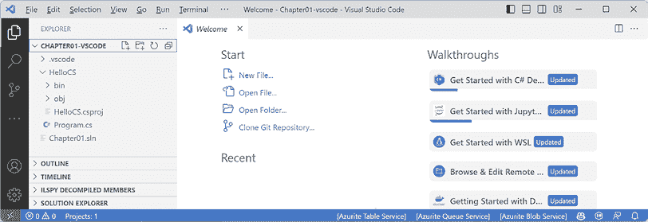

图 1.9：**EXPLORER** 显示已创建了两个文件和临时文件夹。

1.  导航到 **视图** | **输出**。

1.  在 **输出** 面板中，选择 **C# 开发工具包**，并注意工具已识别并处理了解决方案。

1.  在 **EXPLORER** 的底部，注意 **SOLUTION EXPLORER**。

1.  将 **SOLUTION EXPLORER** 拖到 **EXPLORER** 面板的顶部并展开它。

1.  在 **SOLUTION EXPLORER** 中，展开 **HelloCS** 项目，然后单击名为 `Program.cs` 的文件以在编辑器窗口中打开它。

1.  在 `Program.cs` 中，修改第 2 行，使写入控制台的文字为 `Hello, C#!`。

**良好实践**：导航到 **文件** | **自动保存**。此切换将避免每次重建应用程序前记得保存的烦恼。

在前面的步骤中，我向您展示了如何使用`dotnet` CLI 创建解决方案和项目。最后，随着 2024 年 8 月或之后的 C# 开发工具包的发布，VS Code 提供了改进的项目创建体验，它提供了与通过`dotnet` CLI 创建新项目时相同的选项。

要启用此功能，您必须更改设置，如下配置所示：

```cs
"csharp.experimental.dotnetNewIntegration": true 
```

在 VS Code 中，导航到**文件** | **首选项** | **设置**，搜索`dotnet new`，然后选择**Csharp > Experimental: Dotnet New Integration**复选框。

您可以在以下链接中了解更多信息：

[`devblogs.microsoft.com/dotnet/whats-new-in-csharp-dev-kit-august-2024/#create-new-project-configuration-options`](https://devblogs.microsoft.com/dotnet/whats-new-in-csharp-dev-kit-august-2024/#create-new-project-configuration-options)

## 使用 dotnet CLI 编译和运行代码

下一个任务是编译和运行代码：

1.  在**解决方案资源管理器**中，右键单击`HelloCS`项目中的任何文件，然后选择**在集成终端中打开**。

1.  在**终端**中，输入以下命令：`dotnet run`。

1.  **终端**窗口中的输出将显示应用程序运行的结果。

1.  在`Program.cs`中，在输出消息的语句之后，添加获取`Program`类命名空间名称的语句，将其写入控制台，然后抛出一个新的异常，如下代码所示：

    ```cs
    string name = typeof(Program).Namespace ?? "<null>";
    Console.WriteLine($"Namespace: {name}");
    throw new Exception(); 
    ```

1.  在**终端**中，再次输入以下命令：`dotnet run`。

在**终端**中，您可以按上箭头和下箭头键循环查看之前的命令，然后按左右箭头键编辑命令，在按下*Enter*键运行它们之前。

1.  **终端**窗口中的输出将显示应用程序运行的结果，包括编译器定义了一个隐藏的`Program`类，该类有一个名为`<Main>$`的方法，该方法有一个名为`args`的参数用于传递参数，并且它没有命名空间，如下输出所示：

    ```cs
    Hello, C#!
    Namespace: <null>
    Unhandled exception. System.Exception: Exception of type 'System.Exception' was thrown.
       at Program.<Main>$(String[] args) in C:\cs13net9\Chapter01-vscode\HelloCS\Program.cs:line 7 
    ```

## 使用 VS Code 添加第二个项目

让我们添加第二个项目来探索如何处理多个项目：

1.  在**终端**中，切换到`Chapter01-vscode`目录，如下命令所示：

    ```cs
    cd .. 
    ```

1.  在**终端**中，创建一个名为`AboutMyEnvironment`的新控制台应用程序项目，使用较旧的顶级程序样式，如下命令所示：

    ```cs
    dotnet new console -o AboutMyEnvironment --use-program-main 
    ```

**良好实践**：在**终端**中输入命令时请小心。在输入可能具有破坏性的命令之前，请确保您位于正确的文件夹中！

1.  在**终端**中，使用`dotnet` CLI 将新项目文件夹添加到解决方案中，如下命令所示：

    ```cs
    dotnet sln add AboutMyEnvironment 
    ```

1.  注意以下结果，如下输出所示：

    ```cs
    Project `AboutMyEnvironment\AboutMyEnvironment.csproj` added to the solution. 
    ```

1.  在 **解决方案资源管理器** 中，在 `AboutMyEnvironment` 项目中打开 `Program.cs`，然后在 `Main` 方法中，将现有语句更改为输出当前目录、操作系统版本字符串和 `Program` 类的命名空间，如下所示代码：

    ```cs
    Console.WriteLine(Environment.CurrentDirectory);
    Console.WriteLine(Environment.OSVersion.VersionString);
    Console.WriteLine("Namespace: {0}",
      typeof(Program).Namespace ?? "<null>"); 
    ```

1.  在 **解决方案资源管理器** 中，右键单击 `AboutMyEnvironment` 项目中的任何文件，然后选择 **在集成终端中打开**。

1.  在 **终端** 中输入运行项目的命令，如下所示命令：`dotnet run`。

1.  注意查看 **终端** 窗口中的输出，如下所示：

    ```cs
    C:\cs13net9\Chapter01-vscode\AboutMyEnvironment
    Microsoft Windows NT 10.0.26100.0
    Namespace: AboutMyEnvironment 
    ```

一旦打开多个终端窗口，您可以通过点击 **终端** 右侧面板上的名称在它们之间切换。默认情况下，名称将是常见的壳之一，如 **pwsh**、**powershell**、**zsh** 或 **bash**。右键单击并选择 **重命名** 以设置其他名称。

当 VS Code 或更准确地说，`dotnet` CLI 运行控制台应用程序时，它将从 `<projectname>` 文件夹中执行它。Visual Studio 将从 `<projectname>\bin\Debug\net9.0` 文件夹中执行应用程序。在后续章节中处理文件系统时，这一点将非常重要。

如果你在 macOS Ventura 上运行程序，操作系统环境将不同，如下所示输出：

```cs
Unix 13.5.2 
```

**良好实践**：尽管源代码，如 `.csproj` 和 `.cs` 文件，是相同的，但由编译器自动生成的 `bin` 和 `obj` 文件夹可能会有不匹配，导致错误。如果您想在 Visual Studio 和 VS Code 中打开相同的项目，请在其他代码编辑器中打开项目之前删除临时的 `bin` 和 `obj` 文件夹。这就是为什么我要求您在本章中为 VS Code 项目创建不同文件夹的原因。

## VS Code 步骤总结

按照以下步骤使用 VS Code 创建解决方案和项目，如 *表 1.5* 所示：

| **步骤描述** | **命令** |
| --- | --- |
| 1. 为解决方案创建文件夹。 | `mkdir <solution_folder_name>` |
| 2. 切换到文件夹。 | `cd <solution_folder_name>` |
| 3. 在文件夹中创建解决方案文件。 | `dotnet new sln` |
| 4. 使用模板创建文件夹和项目。 | `dotnet new console -o <project_folder_name>` |
| 5. 将文件夹及其项目添加到解决方案中。 | `dotnet sln add <project_folder_name>` |
| 6. 重复步骤 4 和 5 以创建和添加任何其他项目。 |  |
| 7. 使用 VS Code 打开包含解决方案的当前文件夹路径（`.`）。 | `code .` |

表 1.5：使用 VS Code 创建解决方案和项目的步骤总结

## 本书使用其他项目类型总结

**控制台应用程序** / `console` 项目只是项目模板的一种类型。在本书中，您还将使用以下项目模板创建项目，如 *表 1.6* 所示：

| **Visual Studio** | **dotnet new** | **Rider – 类型** |
| --- | --- | --- |
| 控制台应用程序 | `console` | 控制台应用程序 |
| 类库 | `classlib` | 类库 |
| xUnit 测试项目 | `xunit` | 单元测试项目 – xUnit |
| ASP.NET Core 空项目 | `web` | ASP.NET Core Web 应用程序 – 空项目 |
| Blazor Web App | `blazor` | ASP.NET Core Web 应用程序 – Blazor Web 应用程序 |
| ASP.NET Core Web API | `webapi` | ASP.NET Core Web 应用程序 – Web API |
| ASP.NET Core Web API（原生 AOT） | `webapiaot` | ASP.NET Core Web 应用程序 – Web API（原生 AOT） |

表 1.6：各种代码编辑器的项目模板名称

将任何类型的新项目添加到解决方案中的步骤是相同的。只有项目模板的类型名称不同，有时还需要一些命令行开关来控制选项。如果它们与默认值不同，我总是会指定那些开关和选项应该是什么。

可以在这里找到项目模板默认值、选项和开关的摘要：[`github.com/markjprice/cs13net9/blob/main/docs/ch01-project-options.md`](https://github.com/markjprice/cs13net9/blob/main/docs/ch01-project-options.md)。

# 充分利用这本书的 GitHub 仓库

**Git** 是一个常用的源代码管理系统。**GitHub** 是一家公司、一个网站和桌面应用程序，它使得管理 Git 更加容易。微软在 2018 年收购了 GitHub，因此它将继续与微软工具更加紧密地集成。

我为这本书创建了一个 GitHub 仓库，并用于以下目的：

+   为了存储在印刷出版日期之后可以维护的这本书的解决方案代码。

+   为了提供扩展书籍的额外材料，如勘误表修正、小改进、有用链接列表以及关于无法放入印刷书的主题的可选部分。

+   为读者提供一个地方，如果他们对这本书有问题，可以与我联系。

**良好实践**：我强烈建议大家在尝试这本书中的任何编码任务之前，先审查勘误表、改进、出版后更改和常见错误页面。您可以在以下链接中找到它们：[`github.com/markjprice/cs13net9/blob/main/docs/errata/README.md`](https://github.com/markjprice/cs13net9/blob/main/docs/errata/README.md)。

## 理解 GitHub 上的解决方案代码

这本书的 GitHub 仓库中的解决方案代码包括每个章节的文件夹，可以使用以下任何一种代码编辑器打开：

+   Visual Studio 或 Rider：打开 `.sln` 解决方案文件。

+   VS Code：打开包含解决方案文件的文件夹。

*第一章* 到 *第十一章* 每章都有自己的解决方案文件，命名为 `ChapterXX.sln`，其中 `XX` 是章节号 *01* 到 *11*。*第十二章* 到 *第十五章* 共享一个名为 `ModernWeb.sln` 的单个解决方案文件。

`.sln`解决方案文件格式是微软专有的文件格式，冗长、难以阅读，并使用**全局唯一标识符**（**GUIDs**）来引用解决方案和其他组件。一个基于 XML 的新格式即将推出，设计得更加简单易读，并将使用`.slnx`文件扩展名。您可以在以下链接中了解更多信息：[`github.com/dotnet/sdk/issues/40913`](https://github.com/dotnet/sdk/issues/40913)。

所有代码解决方案都可以在以下链接找到：

[`github.com/markjprice/cs13net9/tree/main/code`](https://github.com/markjprice/cs13net9/tree/main/code)

**良好实践**：如果您需要，请返回本章以提醒自己如何在您选择的代码编辑器中创建和管理多个项目。GitHub 仓库提供了三个代码编辑器（Visual Studio、VS Code 和 Rider）的逐步说明，以及额外的截图：[`github.com/markjprice/cs13net9/tree/main/docs/code-editors/`](https://github.com/markjprice/cs13net9/tree/main/docs/code-editors/)。

## 提出关于本书的问题

如果您在遵循本书中的任何说明时遇到困难，或者如果在文本或解决方案中的代码中发现错误，请在 GitHub 仓库中提出问题：

1.  使用您喜欢的浏览器导航到以下链接：[`github.com/markjprice/cs13net9/issues`](https://github.com/markjprice/cs13net9/issues)。

1.  点击**新建问题**。

1.  提供尽可能多的细节，这将有助于我诊断问题。例如：

    +   具体的章节标题、页码和步骤编号。

    +   提供尽可能多的与您的代码和配置相关的信息。

    +   对预期行为和实际行为的描述。

    +   截图（您可以将图片文件拖放到**问题**框中）。

以下内容可能不太相关，但可能有用：

+   您的代码编辑器，例如，Visual Studio、VS Code、Rider 或其他，包括版本号。

+   您的操作系统，例如，Windows 11 64 位或 macOS Ventura 版本 13.5.2

+   您的硬件，例如，英特尔、苹果硅或 ARM CPU

我不能总是立即回应问题。但我希望所有读者都能通过我的书取得成功，所以如果我能帮助您（和其他人）而不会带来太多麻烦，我将非常乐意这样做。

## 给我反馈

如果您想就本书提供更一般的反馈，请通过以下邮箱地址给我发送邮件 `markjprice@gmail.com` 或在 Discord 的书频道中问我一个问题。您可以匿名提供反馈，或者如果您希望得到我的回复，可以提供电子邮件地址。我只会使用这个电子邮件地址来回答您的反馈。

请使用此邀请链接加入我及您的其他读者在 Discord 上的讨论：[`packt.link/csharp13dotnet9`](https://packt.link/csharp13dotnet9)。

我很高兴听到读者们关于他们喜欢我的书的内容，以及改进建议以及他们如何使用 C# 和 .NET，所以请不要害羞。请与我联系！

感谢您提前提供的深思熟虑和建设性的反馈。

## 避免常见错误

在完成本书中的逐步任务后，读者们通常会尝试自己编写类似的代码，但有时会遇到问题，要么在 GitHub 仓库中提出问题，要么在 Discord 频道中发布问题。

从这些中，我注意到了一些常见的错误，因此我在仓库中维护了一个页面来突出显示并解释这些潜在的陷阱以及如何修复它们：

[`github.com/markjprice/cs13net9/blob/main/docs/errata/common-mistakes.md`](https://github.com/markjprice/cs13net9/blob/main/docs/errata/common-mistakes.md)

## 从 GitHub 仓库下载解决方案代码

如果您只想下载所有解决方案文件而不使用 Git，请点击绿色 **<> 代码** 按钮，然后选择 **下载 ZIP**，如图 *图 1.10* 所示：

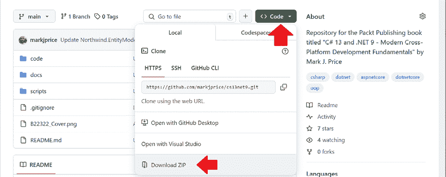

图 1.10：将仓库作为 ZIP 文件下载

**良好实践**：最好将代码解决方案克隆或下载到短路径的文件夹中，例如 `C:\cs13net9\` 或 `C:\book\`，以避免生成的构建文件超过最大路径长度。您还应避免使用特殊字符，如 `#`。例如，不要使用文件夹名称 `C:\C# projects\`。这个文件夹名称可能适用于简单的控制台应用程序项目，但一旦您开始添加自动生成代码的功能，您很可能会遇到奇怪的问题。请保持文件夹名称简短且简单。

## 使用 VS Code 和命令提示符中的 Git

VS Code 与 Git 集成，但它将使用您的操作系统中的 Git 安装，因此您必须首先安装 Git 2 或更高版本才能获得这些功能。

您可以从以下链接安装 Git：[`git-scm.com/download`](https://git-scm.com/download)。

如果您喜欢使用图形用户界面，您可以从以下链接下载 GitHub Desktop：[`desktop.github.com`](https://desktop.github.com)。

## 克隆书籍解决方案代码仓库

让我们克隆书籍解决方案代码仓库。在接下来的步骤中，您将使用 VS Code 终端，但您可以在任何命令提示符或终端窗口中输入命令：

1.  在您的 `user` 或 `Documents` 文件夹中创建一个名为 `Repos-vscode` 的文件夹，或者您想存储 Git 仓库的任何位置。

1.  在命令提示符或终端中打开 `Repos-vscode` 文件夹，然后输入以下命令：

    ```cs
    git clone https://github.com/markjprice/cs13net9.git 
    ```

注意，克隆所有章节的解决方案可能需要一分钟或更长时间，所以请耐心等待。

# 寻求帮助

这一节全部关于如何在网络上找到关于编程的高质量信息。

## Microsoft Learn 文档和 Ask Learn

获取 Microsoft 开发者工具和平台帮助的终极资源是在 Microsoft Learn 上的技术文档，您可以在以下链接中找到它：[`learn.microsoft.com/en-us/docs`](https://learn.microsoft.com/en-us/docs)。

> “我们工程师最近构建的最雄心勃勃且影响最大的项目之一是 Ask Learn，这是一个 API，它为 Microsoft Q&A 提供了生成式 AI 功能。” - Bob Tabor，Microsoft 的 Skilling 组织

您可以在以下链接中了解更多信息：

[`devblogs.microsoft.com/engineering-at-microsoft/how-we-built-ask-learn-the-rag-based-knowledge-service/`](https://devblogs.microsoft.com/engineering-at-microsoft/how-we-built-ask-learn-the-rag-based-knowledge-service/)

## 本书中的文档链接

.NET 的官方 Microsoft 文档需要涵盖所有版本。文档中显示的默认版本始终是最新的 GA 版本。

例如，在 2024 年 11 月到 2025 年 11 月之间，文档页面中显示的.NET 默认版本将是.NET 9。在 2025 年 11 月到 2026 年 11 月之间，.NET 的默认版本将是.NET 10。以下链接将根据当前日期自动跳转到当前版本：

[`learn.microsoft.com/en-us/dotnet/api/system.diagnostics.codeanalysis.stringsyntaxattribute`](https://learn.microsoft.com/en-us/dotnet/api/system.diagnostics.codeanalysis.stringsyntaxattribute)

在 2025 年 11 月之后，要查看.NET 9 的特定文档页面，请将`?view=net-9.0`追加到链接的末尾。例如，使用以下链接：

[`learn.microsoft.com/en-us/dotnet/api/system.diagnostics.codeanalysis.stringsyntaxattribute?view=net-9.0`](https://learn.microsoft.com/en-us/dotnet/api/system.diagnostics.codeanalysis.stringsyntaxattribute?view=net-9.0)

本书中的所有文档链接都没有指定版本。如果您想强制文档显示.NET 8 的版本，因为您需要针对 LTS 版本（三年）而不是 STS 版本（18 个月）的.NET 9，那么请将`?view=net-8.0`追加到链接的末尾。

您可以通过在链接末尾追加`#applies-to`来检查.NET 功能支持哪些版本，例如：

[`learn.microsoft.com/en-us/dotnet/api/system.diagnostics.codeanalysis.stringsyntaxattribute#applies-to`](https://learn.microsoft.com/en-us/dotnet/api/system.diagnostics.codeanalysis.stringsyntaxattribute#applies-to)

因此，我们可以看到`StringSyntax`属性仅在.NET 7 或更高版本中可用。

## 获取 dotnet 工具的帮助

在命令提示符下，您可以请求`dotnet`工具提供其命令的帮助。语法是：

```cs
dotnet help <command> 
```

这将导致您的网络浏览器打开有关指定命令的文档页面。常见的`dotnet`命令包括`new`、`build`、`run`等。

**警告！** `dotnet help new` 命令在 .NET Core 3.1 到 .NET 6 中工作，但在 .NET 7 或更高版本中返回错误：`指定的命令 'new' 不是一个有效的 SDK 命令。指定一个有效的 SDK 命令。有关更多信息，请运行 dotnet help.` 希望.NET 很快修复这个错误！

另一种类型的帮助是命令行文档。它遵循以下语法：

```cs
dotnet <command> -?|-h|--help 
```

例如，`dotnet new -?` 或 `dotnet new -h` 或 `dotnet new --help` 在命令提示符下输出有关 `new` 命令的文档。

如您所期望的，`dotnet help help` 打开一个网页浏览器以显示 `help` 命令，而 `dotnet help -h` 在命令提示符下输出有关 `help` 命令的文档！

让我们尝试一些示例：

1.  要在网页浏览器窗口中打开 `dotnet build` 命令的官方文档，请在命令提示符或 VS Code 终端中输入以下内容，并注意在您的网页浏览器中打开的页面：

    ```cs
    dotnet help build 
    ```

1.  要在命令提示符下获取帮助输出，请使用 `-?` 或 `-h` 或 `--help` 标志，如下面的命令所示：

    ```cs
    dotnet build -? 
    ```

1.  您将看到以下部分输出：

    ```cs
    Description:
      .NET Builder
    Usage:
      dotnet build [<PROJECT | SOLUTION>...] [options]
    Arguments:
      <PROJECT | SOLUTION>  The project or solution file to operate on. If a file is not specified, the command will search the current directory for one.
    Options:
      --ucr, --use-current-runtime         Use current runtime as the target runtime.
      -f, --framework <FRAMEWORK>          The target framework to build for. The target framework must also be specified in the project file.
    ...
      -?, -h, --help                       Show command line help. 
    ```

1.  对以下命令重复两种帮助请求：`add`、`help`、`list`、`new` 和 `run`，记住 `new` 可能不会显示其网页，因为 .NET 7 中引入了一个错误。

## 获取类型及其成员的定义

代码编辑器最有用的功能之一是 **转到定义** (*F12*)。它在 VS Code、Visual Studio 和 Rider 中可用。它将通过读取编译的程序集中的元数据来显示类型或成员的公共定义看起来是什么样子。

一些工具，如 ILSpy .NET Decompiler，甚至可以将元数据和 IL 代码逆向工程回 C# 或其他语言。

一个类似且相关的功能名为 **转到实现** (*Ctrl* + *F12*)。它不会读取元数据或反编译，如果源代码已嵌入，它将使用可选的源链接功能显示实际的源代码。

**警告！** **转到定义** 应该跳转到成员或类型的反编译元数据。但如果您之前已经查看过源链接，那么它会跳转到那里。**转到实现** 应该跳转到成员或类型的源链接实现。但如果您已禁用源链接，那么它会跳转到反编译元数据。

让我们看看如何使用 **转到定义** 功能：

1.  在您首选的代码编辑器中，打开名为 `Chapter01` 的解决方案/文件夹。

如果您正在使用 Visual Studio：

+   导航到 **工具** | **选项**。

+   在搜索框中输入 `navigation to source`。

+   选择 **文本编辑器** | **C#** | **高级**。

+   取消选择 **启用导航到源链接和嵌入源** 复选框，然后单击 **确定**，如图 *图 1.11* 所示：

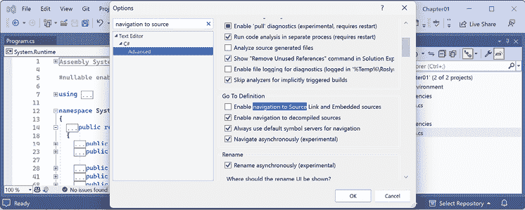

图 1.11：禁用“转到定义”功能的源链接

定义可以是反向工程自元数据，或者如果启用了原始源代码，则可以从原始源代码中加载。我个人发现来自元数据的代码更有用，正如您即将看到的。在本节末尾，尝试将 Source Link 选项切换回开启，以查看差异。

1.  在`HelloCS`项目中，在`Program.cs`的底部，输入以下语句以声明一个名为`z`的整数变量：

    ```cs
    int z; 
    ```

1.  在 Visual Studio 或 VS Code 中，单击`int`，右键单击`int`，然后选择**转到定义**。在 Rider 中，选择**转到** | **转到声明或用法**。

1.  在出现的代码窗口中，您可以看到`int`数据类型的定义，如下面的代码所示：

    ```cs
    #region Assembly System.Runtime, Version=9.0.0.0, Culture=neutral, PublicKeyToken=b03f5f7f11d50a3a
    // C:\Program Files\dotnet\packs\Microsoft.NETCore.App.Ref\9.0.0\ref\net9.0\System.Runtime.dll
    #endregion
    #nullable enable
    using System.Diagnostics.CodeAnalysis;
    using System.Globalization;
    using System.Numerics;
    using System.Runtime.CompilerServices;
    namespace System
    {
      public readonly struct Int32 : IComparable,
        IComparable<Int32>, IConvertible, ...
      {
        public const Int32 MaxValue = 2147483647;
        public const Int32 MinValue = -2147483648;
        ...
      }
    } 
    ```

您可以看到`int`：

+   使用`struct`关键字定义。

+   位于`System.Runtime`程序集中。

+   位于`System`命名空间中。

+   被命名为`Int32`。

+   因此，是`System.Int32`类型的别名。

+   实现了`IComparable`等接口。

+   有其最大值（`2147483647`）和最小值（`-2147483648`）的常量值。

+   包含`Parse`（在前面代码中不可见）等方法。

目前，**转到定义**功能对您来说并不那么有用，因为您还不知道所有这些信息意味着什么。在本书的第一个部分结束时，这部分包括*第 2*章到*第 6*章，并教授您 C#语言，您将了解足够的信息，使此功能变得非常实用。

1.  在代码编辑器窗口中，向下滚动以找到具有单个`string`参数的`Parse`方法，如下面的代码所示：

    ```cs
    public static Int32 Parse(string s) 
    ```

1.  展开代码并查看文档此方法的注释，如图*1.12*所示：

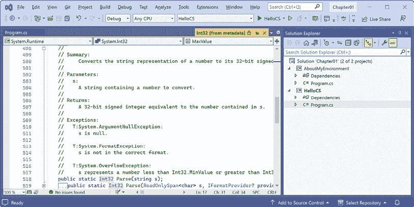

图*1.12*：具有单个字符串参数的 Parse 方法的注释

在注释中，您将看到 Microsoft 已记录以下内容：

+   描述方法的摘要。

+   可以传递给方法的参数，例如`string`值。

+   该方法返回值及其数据类型。

+   如果您调用此方法可能会发生的三个异常，包括`ArgumentNullException`、`FormatException`和`OverflowException`。现在，我们知道我们可以选择在`try`语句中包装对此方法的调用，并捕获哪些异常。

## 配置内联提示，也称为内联提示。

在本书中的代码中，在调用方法时，我经常明确指定命名参数以帮助您了解正在发生的事情。例如，我在以下代码中指定了参数`format`和`arg0`的名称：

```cs
Console.WriteLine(format: "Value is {0}.", arg0: 19.8); 
```

**内联提示**，也称为**内联提示**，显示参数名称，而无需您输入它们，如图*1.13*所示：


图*1.13*：配置内联提示，也称为内联提示

大多数代码编辑器都有此功能，您可以选择永久启用或仅在按下像*Alt* + *F1*或*Ctrl*这样的键组合时启用：

+   在 Visual Studio 中，导航到`OK`。

+   在 VS Code 中，导航到**文件** | **首选项** | **设置**，搜索`inlay`，选择**C#**过滤器，然后选择**显示内联参数名称提示**复选框。

+   在 Rider 中，在**设置**中，导航到**编辑器** | **内联提示** | **C#** | **参数名称提示**。

希望你现在迫不及待地想了解这一切的含义！

再耐心一点。你几乎就要结束这一章了，在下一章中，你将深入探讨 C#语言的细节。但首先，让我们看看你还可以在哪里寻求帮助。

## 在 Stack Overflow 上寻找答案

Stack Overflow 是获取困难编程问题答案最受欢迎的第三方网站。让我们看看一个例子：

1.  启动您喜欢的网络浏览器。

1.  导航到`stackoverflow.com`；在搜索框中输入`securestring`，并注意搜索结果。

## 使用 Google 搜索寻找答案

你可以使用高级搜索选项来搜索 Google，以增加找到所需信息的机会：

1.  通过以下链接导航到 Google：[`www.google.com/`](https://www.google.com/).

1.  使用简单的 Google 查询搜索有关`垃圾回收`的信息，并注意在你看到计算机科学中垃圾回收的维基百科定义之前，你可能会看到很多当地垃圾回收服务的广告！

1.  通过限制到有用的网站（如 Stack Overflow），移除我们可能不关心的语言（如 C++、Rust 和 Python），或显式添加 C#和.NET，来改进搜索，如下面的搜索查询所示：

    ```cs
    garbage collection site:stackoverflow.com +C# -Java 
    ```

## 在 Discord 和其他聊天论坛上寻求帮助

在编程论坛和 Discord 频道中提问是一门艺术，也是一种科学。为了最大限度地提高获得有用回答的机会，你应该追求清晰、具体和社区意识。

这里有一些提问的技巧：

+   **在公共频道提问，而不是在私人频道。请不要直接给作者发消息提问或好友请求。** 记住，每个提问和回答都在构建整个社区的集体知识和资源。在公共频道提问也允许其他读者帮助你，而不仅仅是作者。Packt 和我围绕我的书籍建立的社区既友好又聪明。让我们**所有人**来帮助你。

+   **提问前先进行调研**：在向社区求助之前，自己寻找答案是很重要的。使用搜索引擎、官方文档以及论坛或 Discord 服务器内的搜索功能。这不仅尊重了社区的时间，也有助于你更有效地学习。首先查找的地方还包括书籍的错误和改进部分，链接如下：[`github.com/markjprice/cs13net9/blob/main/docs/errata/README.md`](https://github.com/markjprice/cs13net9/blob/main/docs/errata/README.md).

+   **具体且简洁**：清楚地说明你想要达到的目标、你已经尝试过的方法以及你遇到的问题。一个简洁的问题更有可能得到快速的回复。

+   **指定书籍位置**：如果你在书的某个特定部分遇到困难，请指定页码和章节标题，这样其他人就可以查找你问题的上下文。

+   **展示你的工作过程**：展示你已经努力自己解决问题，这不仅提供了上下文，还有助于他人理解你的思考过程以及你可能走错的道路。

+   **准备你的问题**：避免过于宽泛或模糊的问题。错误截图或代码片段（格式正确）可能非常有帮助。

    奇怪的是，我越来越多地看到读者拍照屏幕并发布这些照片。这些更难阅读，并且展示的内容有限。最好复制粘贴你的代码文本或错误信息，这样其他人也可以自己复制粘贴。或者，至少用手机摄像头以一个斜角度拍摄高分辨率截图！

+   **正确格式化你的代码**：大多数论坛和 Discord 服务器都支持使用 Markdown 语法进行代码格式化。使用格式化使你的代码更易于阅读。例如，用单行反引号包围代码关键字，如`` `public void` ``，并用三行反引号包围代码块，可选地包含语言代码，如下面的代码所示：

    ```cs
    ```cs

    using static System.Console;

    ```WriteLine("这是 C#格式的代码。");

    ```cs 
    ```

    **良好实践**：在 Markdown 中开始代码块的三行反引号之后，指定一个语言简称，如`cs`**，** `csharp`**，`js`**，** `javascript`**，`json`**，`html`**，`css`**，`cpp`**，`xml`**，`mermaid`**，`python`**，`java`**，`ruby`**，`go`**，`sql`**，`bash`**，或`shell`**。

**更多信息**：要了解如何在 Discord 频道消息中格式化文本，请参阅以下链接：[`support.discord.com/hc/en-us/articles/210298617-Markdown-Text-101-Chat-Formatting-Bold-Italic-Underline`](https://support.discord.com/hc/en-us/articles/210298617-Markdown-Text-101-Chat-Formatting-Bold-Italic-Underline)**。

+   **礼貌且耐心**：记住，你是在向那些自愿奉献时间的人寻求帮助。礼貌的语气和在等待回复时的耐心会大有帮助。频道参与者通常在不同的时区，所以你可能要到第二天才能看到有人回答你的问题。

+   **准备好积极参与**：在提问后，保持参与。你可能会收到一些后续问题以澄清。迅速且清晰地回答可以提高你得到有用答案的机会。当我提问时，我会设置一个三小时后的闹钟，回来查看是否有人回答。如果还没有人回答，那么我会再设置一个 24 小时后的闹钟。

在提问时采用这些方法不仅可以增加你获得有用回复的可能性，而且还可以积极贡献于社区，通过尊重他人的时间和努力。

**良好实践**：在任何聊天系统中，永远不要只说“Hello”作为消息。你可以在以下链接中阅读原因：[`nohello.net/`](https://nohello.net/)。同样，不要询问是否可以询问：[`dontasktoask.com/`](https://dontasktoask.com/)。

## 在 .NET 源代码中搜索

有时，你可以从看到微软团队如何实现 .NET 中学到很多东西。.NET 整个代码库的源代码可在公共 GitHub 存储库中找到。例如，你可能知道有一个内置的属性可以验证电子邮件地址。

让我们搜索存储库中的单词“email”，看看我们能否找出它是如何工作的：

1.  使用你喜欢的网络浏览器导航到 [`github.com/search`](https://github.com/search)。

1.  点击 **高级搜索**。

1.  在搜索框中，输入 `email`。

1.  在 **这些存储库** 框中，输入 `dotnet/runtime`。 (你可能还想搜索的其他存储库包括 `dotnet/core`、`dotnet/aspnetcore`、`dotnet/wpf` 和 `dotnet/winforms`。)

1.  在 **用此语言编写** 框中，选择 **C#**。

1.  在页面右上角，注意高级查询是如何为你编写的。点击 **搜索**，然后点击 **代码** 过滤器，并注意结果包括 `EmailAddressAttribute`，如图 *图 1.14* 所示：

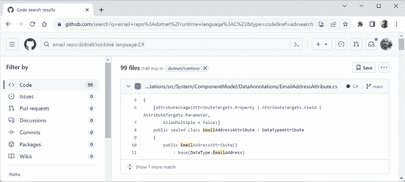

图 1.14：在 dotnet/runtime 存储库中高级搜索 email

1.  点击源文件，并注意它通过检查 `string` 值是否包含一个 `@` 符号（但不是作为第一个或最后一个字符）来实现电子邮件验证，如下面的代码所示：

    ```cs
    // only return true if there is only 1 '@' character
    // and it is neither the first nor the last character
    int index = valueAsString.IndexOf('@');
    return
        index > 0 &&
        index != valueAsString.Length - 1 &&
        index == valueAsString.LastIndexOf('@'); 
    ```

1.  关闭浏览器。

为了方便起见，你可以通过替换以下链接中的搜索词 `email` 来快速搜索其他术语：[`github.com/search?q=%22email%22+repo%3Adotnet%2Fruntime+language%3AC%23&type=code&ref=advsearch`](https://github.com/search?q=%22email%22+repo%3Adotnet%2Fruntime+language%3AC%23&type=code&ref=advsearch)。

## 文档中的源代码

当你阅读 API 参考文档时，你通常会想查看实际的源代码。对于启用了 Source Link、具有可访问的 PDB 并且托管在公共 GitHub 存储库中的 .NET API，源代码链接包含在定义元数据中。例如，`String` 类的文档页面现在有这个新的 **源** 链接，其 `IndexOf` 方法有一个指向另一个源文件的 **源** 链接，如图 *图 1.15* 所示：

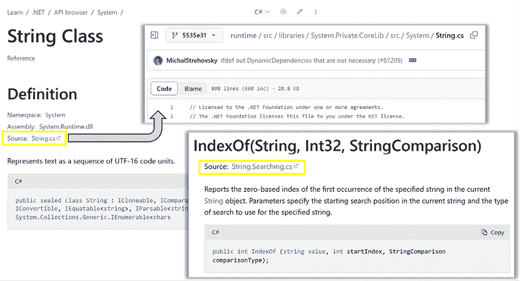

图 1.15：包含指向源文件链接的文档

```cs
https://devblogs.microsoft.com/dotnet/dotnet-docs-link-to-source-code/.
```

## 官方 .NET 博客、站立会议和新闻

要保持对 .NET 的最新了解，一个值得订阅的博客是官方 .NET 博客，由 .NET 工程团队撰写，你可以在以下链接找到它：[`devblogs.microsoft.com/dotnet/`](https://devblogs.microsoft.com/dotnet/).

要观看 .NET 团队成员介绍新功能的预览，你可以观看每月的“站立会议”，链接如下：

[`dotnet.microsoft.com/en-us/live/community-standup`](https://dotnet.microsoft.com/en-us/live/community-standup)

您可以在以下链接订阅最新的 .NET 新闻：

[`github.com/dotnet/core/discussions/categories/news`](https://github.com/dotnet/core/discussions/categories/news)

## 观看 Scott Hanselman 的视频

微软的 Scott Hanselman 拥有一个关于计算机知识的优秀 YouTube 频道，这些知识在学校里没有教过：[`computerstufftheydidntteachyou.com/`](http://computerstufftheydidntteachyou.com/).

我推荐所有与计算机工作的人订阅。

## AI 工具如 ChatGPT 和 GitHub Copilot

在过去几年中，编码和开发最大的变化之一是生成式 **人工智能**（**AI**）工具的出现，这些工具可以帮助完成编码任务，如完成代码语句、实现整个函数、编写单元测试以及为现有代码提出调试修复建议。

你可以阅读开发者关于 2023 年 Stack Overflow 开发者调查中 AI 工具的看法：“44% 的开发者现在在他们的开发过程中使用 AI 工具，26% 计划很快使用” ([`stackoverflow.blog/2023/06/14/hype-or-not-developers-have-something-to-say-about-ai/`](https://stackoverflow.blog/2023/06/14/hype-or-not-developers-have-something-to-say-about-ai/))：

> “从研究到调试再到文档，开发者正在使用生成式 AI 来节省时间，完成工作中各种繁琐的任务。最大的用例是编写代码。这是最近 Stack Overflow 开发者调查中 82.55% 的开发者报告使用生成式 AI 的方式。”

ChatGPT 目前为个人提供几个模型：4o mini（免费）、4o（免费但有限）和 4o with 5x 更多的请求以及其他好处，如新功能的早期访问和 DALL·E 图像生成（每月 20 美元）。它还为企业提供了定价。你可以在以下链接查看他们的定价：[`openai.com/chatgpt/pricing/`](https://openai.com/chatgpt/pricing/).

### ChatGPT 示例

假设你需要编写一个 C# 函数来验证电子邮件地址。你可能会去 ChatGPT 并输入以下提示：

```cs
write a c# function to validate an email address 
```

它会响应一个包含方法的完整类，如图 *1.16* 所示：


图 1.16：ChatGPT 编写验证电子邮件地址的函数

然后它提供了代码的解释和如何调用函数的示例，如下面的代码所示：

```cs
bool isValid = EmailValidator.IsValidEmail("test@example.com");
Console.WriteLine(isValid ? "Valid" : "Invalid"); 
```

但像 ChatGPT 这样的通用生成式 AI 是否是 C# 程序员的最佳伴侣？

### GitHub Copilot 为程序员

微软有一个专门为程序员提供的服务，名为 GitHub Copilot，它可以帮助你在代码编辑器中直接自动完成代码。它为代码编辑器提供了插件，包括 Visual Studio、VS Code 和基于 JetBrains IntelliJ 的 IDE。

个人来说，我非常喜欢 Copilot 的品牌。它清楚地表明你是飞行员。你最终负责“驾驶飞机”。但对于简单或无聊的部分，你可以暂时交给你的副驾驶，同时保持随时准备接管控制。

**GitHub Copilot** 对学生、教师和一些开源项目维护者是免费的。对于其他人，它有一个 30 天的免费试用期，然后对个人用户每月收费 10 美元或每年收费 100 美元。一旦你有了账户，你就可以注册等待名单，以获取更高级的实验性 GitHub Copilot 功能。

你应该在网上查看哪些 Copilot 功能适用于各种代码编辑器。正如你可以想象的那样，这是一个快速变化的世界，我今天在书中可能写的一些内容，在你阅读时可能已经过时了：[`github.com/features/copilot`](https://github.com/features/copilot)。

JetBrains 有自己的 GitHub Copilot 对应产品，名为 AI Assistant，你可以在以下链接中了解更多信息：[`blog.jetbrains.com/idea/2023/06/ai-assistant-in-jetbrains-ides/`](https://blog.jetbrains.com/idea/2023/06/ai-assistant-in-jetbrains-ides/)。

那么，GitHub Copilot 今天能为你做什么？

想象一下，你刚刚添加了一个名为 `Product.cs` 的新类文件。你点击 `Product` 类内部，按 *Enter* 键插入一个空行，然后暂停一秒钟，思考你需要输入什么……然后 GitHub Copilot 以灰色生成了一些示例代码，如图 *图 1.17* 所示：

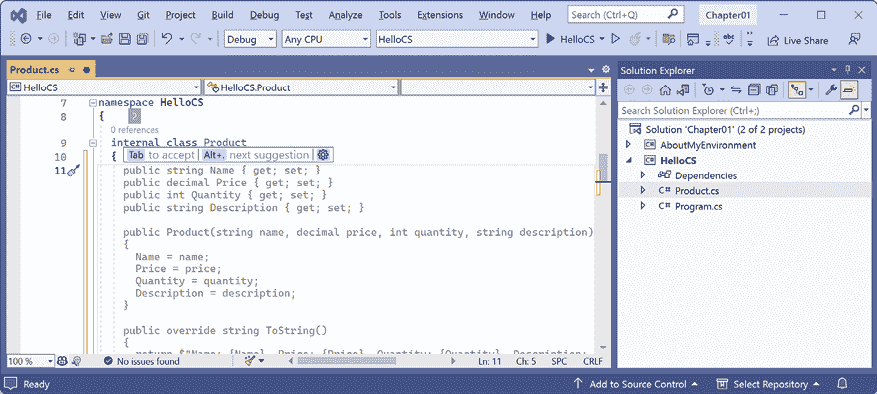

图 1.17：GitHub Copilot 建议如何定义一个 Product 类

在这个阶段，你可以浏览一下代码，如果它接近你想要的样子，只需按 *Tab* 键插入全部内容，或者按 *Alt* + *.* (点) 在其他建议之间切换。

有时候，它离你需要的功能太远，你最好完全忽略它的建议，自己写出来。但通常，其中会有一些可用的内容，或者能让你想起你需要使用的语法。有时，它感觉就像魔法一样，能写出几十行你正好需要的代码。

微软用来自公共 GitHub 仓库的代码为其 AI 工具提供数据，包括我从 2016 年以来为本书所有版本创建的所有仓库。这意味着它可以对本书的读者提出代码补全建议，这些建议是惊人的准确预测，包括我在代码中频繁使用的流行文化引用。这就像我，马克·J·普莱斯，是“机器中的幽灵”，引导你的编码。

很容易想象一个已经吸收了所有官方 Microsoft .NET 文档、所有关于.NET 的公开博客文章，甚至可能是数百本关于.NET 的书籍的定制 ChatGPT，然后与之交谈以找到错误或提出解决编程问题的建议。

您可以在以下链接处注册 GitHub Copilot：[`github.com/github-copilot/signup/`](https://github.com/github-copilot/signup/)。

**良好实践**：在以下链接中了解更多关于如何将 Copilot 作为您的编码 GPS 使用的信息：[`devblogs.microsoft.com/visualstudio/using-github-copilot-as-your-coding-gps/`](https://devblogs.microsoft.com/visualstudio/using-github-copilot-as-your-coding-gps/)。

这里有一些关于使用 AI 进行编码的更多链接：

+   GitHub Copilot 的提示工程入门指南：[`dev.to/github/a-beginners-guide-to-prompt-engineering-with-github-copilot-3ibp`](https://dev.to/github/a-beginners-guide-to-prompt-engineering-with-github-copilot-3ibp)

+   Register 关于 AI 的文章：[`www.theregister.com/2024/01/27/ai_coding_automatic/`](https://www.theregister.com/2024/01/27/ai_coding_automatic/)

+   StackOverflow 2024 调查 – 代码编辑器/IDE：[`survey.stackoverflow.co/2024/technology#1-integrated-development-environment`](https://survey.stackoverflow.co/2024/technology#1-integrated-development-environment)

+   StackOverflow 2024 调查 – AI 搜索工具：[`survey.stackoverflow.co/2024/technology#1-ai-search-and-developer-tools`](https://survey.stackoverflow.co/2024/technology#1-ai-search-and-developer-tools)

## 关闭阻碍工作的工具

虽然这些工具可能很有帮助，但它们也可能阻碍您，尤其是在学习时，因为它们有时会为您完成工作而不通知您。如果您自己至少不这样做几次，您就不会完全学会。

要在 Visual Studio 中配置 C#的 IntelliSense：

1.  导航到**工具** | **选项**。

1.  在**选项**对话框的树视图中，导航到**文本编辑器** | **C#** | **IntelliSense**。

1.  点击标题栏中的**？**按钮以查看文档。

要在 Visual Studio 中配置 GitHub Copilot：

1.  导航到**工具** | **选项**。

1.  在**选项**对话框的树视图中，导航到**GitHub** | **Copilot**。

1.  将**全局启用**设置为**True**或**False**，然后点击**确定**。

要在 VS Code 中禁用 GitHub Copilot：

1.  在状态栏的右侧，在通知图标左侧，点击 GitHub Copilot 图标。

1.  在弹出窗口中，点击**全局禁用**。

1.  要启用它，再次点击 GitHub Copilot 图标，然后点击**全局启用**。

如需有关 Rider IntelliSense 的帮助，请参阅以下链接：[`www.jetbrains.com/help/rider/Auto-Completing_Code.html`](https://www.jetbrains.com/help/rider/Auto-Completing_Code.html)。

# 练习和探索

让我们现在通过尝试回答一些问题、进行一些实际操作练习，并更深入地探讨本章涵盖的主题来测试您的知识和理解。

## 练习 1.1 – 在线材料

在线材料可以是我为本书编写的额外内容，也可以是引用微软或第三方创建的内容。

### .NET 当前版本

您可以在以下链接中检查不同平台上的最新 .NET 版本以及官方支持的内容：[`versionsof.net`](https://versionsof.net)。

如果您需要了解更多关于对旧版 .NET Framework 的支持信息，您可以在以下链接中阅读：[`learn.microsoft.com/en-us/lifecycle/products/microsoft-net-framework`](https://learn.microsoft.com/en-us/lifecycle/products/microsoft-net-framework)。

### 升级到新的 .NET 版本

.NET 每年都会发布新版本。一些开发者在新版本发布后立即开始升级，而另一些开发者则更喜欢等到当前版本达到生命周期的结束支持阶段。升级涉及几个重要的考虑因素，您可以在以下链接中了解更多信息：

[`learn.microsoft.com/en-us/dotnet/core/install/upgrade`](https://learn.microsoft.com/en-us/dotnet/core/install/upgrade)

### freeCodeCamp 和 C# 认证

多年来，微软为 C# 5 开设了一门考试，即 *Exam 70-483: Programming in C#*。我教授了数百名开发者获得资格并通过该考试的技能。遗憾的是，该考试几年前已被取消。

2023 年 8 月，微软宣布推出一个新的 C# 基础认证，并附带一个免费的 35 小时在线课程。您可以在以下链接中了解更多关于如何获得认证的信息：

[`www.freecodecamp.org/learn/foundational-c-sharp-with-microsoft/`](https://www.freecodecamp.org/learn/foundational-c-sharp-with-microsoft/)

C# 认证注册：[`aka.ms/learningseries/csharp/signup`](https://aka.ms/learningseries/csharp/signup)

### 探索 Polyglot Notebooks

完成以下仅在线部分，以探索如何使用 Polyglot Notebooks 和其 .NET Interactive 引擎：

[`github.com/markjprice/cs13net9/blob/main/docs/ch01-polyglot-notebooks.md`](https://github.com/markjprice/cs13net9/blob/main/docs/ch01-polyglot-notebooks.md)

### Windows 开发

本书是关于现代跨平台开发的。但对于 Windows 的 **图形用户界面（GUI）** 开发又该如何呢？

您可以在以下链接中阅读一篇讨论此问题的文章：

[`visualstudiomagazine.com/articles/2024/02/13/desktop-dev.aspx`](https://visualstudiomagazine.com/articles/2024/02/13/desktop-dev.aspx)

### C# 与其他语言比较

即使是微软也不使用 C# 和 .NET 来满足其所有自身开发需求。您可以在以下链接中阅读有关 C# 和 Rust 的有趣讨论：

[`www.reddit.com/r/dotnet/comments/1aezqmg/comment/ko8lnf2/`](https://www.reddit.com/r/dotnet/comments/1aezqmg/comment/ko8lnf2/)

之前 Reddit 链接中的关键引言是：

> “关于 Rust 的炒作很多，而且有充分的理由。但它是系统语言。微软并不是要重写数百万行代码并丢弃 C#（对于任何感到紧张的人来说！![img/1.png]）他们只是在做实用的事情，使用有效的工具来完成工作。”

### 免费计算机科学课程

哈佛 CS50：计算机科学导论：[`pll.harvard.edu/course/cs50-introduction-computer-science`](https://pll.harvard.edu/course/cs50-introduction-computer-science)

### .NET 新闻通讯

有电子邮件新闻通讯你可以订阅，以获取每日或每周的更新、提示和技巧。其中一些较好的包括以下内容：

+   米兰·约万诺维奇的《.NET 周刊》：[`www.milanjovanovic.tech/blog`](https://www.milanjovanovic.tech/blog)

+   C#摘要：[`csharpdigest.net/`](https://csharpdigest.net/)

+   阿尔文·阿什克罗夫特的《晨露》：[`www.alvinashcraft.com/`](https://www.alvinashcraft.com/)

+   Mukesh 的.NET 新闻通讯：[`newsletter.codewithmukesh.com/`](https://newsletter.codewithmukesh.com/)

+   JetBrains 的 dotInsights：[`www.jetbrains.com/lp/dotinsights-monthly/`](https://www.jetbrains.com/lp/dotinsights-monthly/)

## 练习 1.2 – 实践练习

以下实践练习将更深入地探讨本章的主题。

### 在任何地方使用浏览器练习 C#

你不需要下载和安装 VS Code 或甚至 Visual Studio 来编写 C#。你可以在以下链接中的任何一个开始在线编码：

+   SharpLab：[`sharplab.io/`](https://sharplab.io/)

+   C#在线编译器 | .NET Fiddle：[`dotnetfiddle.net/`](https://dotnetfiddle.net/)

+   W3Schools C# 在线编译器：[`www.w3schools.com/cs/cs_compiler.php`](https://www.w3schools.com/cs/cs_compiler.php)

### .NET 的 Alpha 版本

你可以（但可能不应该）从以下链接下载.NET 的未来版本，包括 alpha 版本：

[`github.com/dotnet/sdk/blob/main/documentation/package-table.md`](https://github.com/dotnet/sdk/blob/main/documentation/package-table.md)

**警告！** Alpha 版本仅设计供微软员工内部使用。Beta 版本（官方预览版）设计供外部使用，并从每年 2 月中旬开始提供。

更多关于使用本书中的.NET 10 的信息，请参阅以下链接：[`github.com/markjprice/cs13net9/blob/main/docs/dotnet10.md`](https://github.com/markjprice/cs13net9/blob/main/docs/dotnet10.md)。

## 练习 1.3 – 测试你的知识

尝试回答以下问题，记住尽管大多数答案可以在本章找到，但你应该进行一些在线研究或编写代码来回答其他问题：

1.  Visual Studio 是否比 VS Code 更好？

1.  .NET 5 及以后的版本是否比.NET Framework 更好？

1.  .NET 标准是什么，为什么它仍然很重要？

1.  为什么程序员可以使用不同的语言（例如，C#和 F#）来编写在.NET 上运行的应用程序？

1.  什么是顶级程序，您如何访问任何命令行参数？

1.  .NET 控制台应用程序的入口点方法叫什么名字，如果您不使用顶级程序功能，应该如何显式声明？

1.  使用顶级程序时，`Program` 类定义在哪个命名空间中？

1.  您会去哪里寻找 C# 关键字的帮助？

1.  你会首先在哪里寻找常见编程问题的解决方案？

1.  在使用 AI 为您编写代码之后，您应该做什么？

*附录*，*测试你的知识问题的答案*，可以从 GitHub 仓库中的 README 文件中的链接下载：[`github.com/markjprice/cs13net9`](https://github.com/markjprice/cs13net9)。

## 练习 1.4 – 探索主题

一本印刷书是一种精选的体验。我试图找到合适的主题平衡，包括在这本书中。其他我写的相关内容可以在本书的 GitHub 仓库中找到。

我认为这本书涵盖了 C# 和 .NET 开发者应该具备或了解的所有基本知识和技能。一些较长的示例最好作为链接包含在 Microsoft 文档或第三方文章作者的链接中。

使用下一页上的链接了解本章涵盖主题的更多详细信息：

[`github.com/markjprice/cs13net9/blob/main/docs/book-links.md#chapter-1---hello-c-welcome-net`](https://github.com/markjprice/cs13net9/blob/main/docs/book-links.md#chapter-1---hello-c-welcome-net)

# 摘要

在本章中，我们：

+   设置你的开发环境。

+   在一篇在线文章中讨论了现代 .NET、.NET Core、.NET Framework、Xamarin 和 .NET Standard 之间的相似之处和不同之处。

+   使用 Visual Studio 和 VS Code 以及 .NET SDK CLI 创建了一些简单的控制台应用程序，并将它们分组在一个解决方案中。

+   学习了如何从其 GitHub 仓库下载这本书的解决方案代码。

+   学习了如何寻找帮助。这可以通过传统方式，例如使用帮助命令开关、文档和文章，或者现代方式，通过与编码专家 AI 进行对话或使用基于 AI 的工具执行“苦力工作”来实现。

在下一章中，您将学习如何“说”C#。

# 在 Discord 上了解更多信息

要加入这本书的 Discord 社区——在那里您可以分享反馈、向作者提问并了解新版本——请扫描下面的二维码：

[`packt.link/csharp13dotnet9`](https://packt.link/csharp13dotnet9)


# 留下评论！

感谢您从 Packt Publishing 购买这本书——我们希望您喜欢它！您的反馈对我们来说是无价的，它帮助我们改进和成长。一旦您阅读完毕，请花一点时间在亚马逊上留下评论；这只需要一分钟，但对像您这样的读者来说意义重大。

扫描二维码或访问链接以获取您选择的免费电子书。

[`packt.link/NzOWQ`](https://packt.link/NzOWQ)


