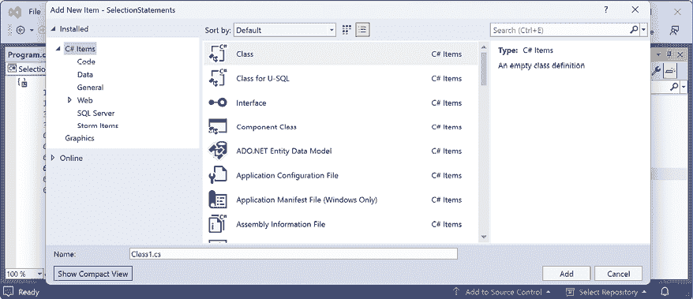
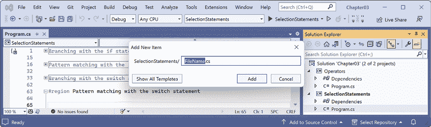
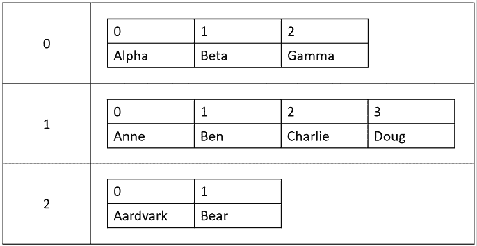
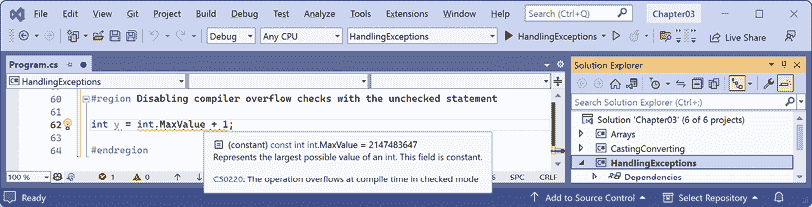
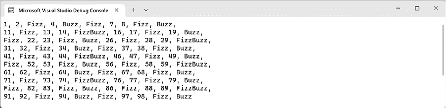

# 3

# 控制流程、转换类型和处理异常

本章主要讲解编写对变量执行简单操作、做出决策、执行模式匹配以及重复语句或代码块的代码。你还将学习如何使用数组存储多个值，如何将变量或表达式值从一种类型转换为另一种类型，如何处理异常，以及如何在数字变量中检查溢出。

本章涵盖以下主题：

+   操作变量

+   理解选择语句

+   理解迭代语句

+   在数组中存储多个值

+   类型转换和类型间转换

+   处理异常

+   检查溢出

# 操作变量

**运算符** 对 **操作数**（如变量和字面值）执行简单的操作，如加法和乘法。运算符返回一个新值，它是操作的结果，可以赋给变量，并且它们也可以影响操作数。

## 理解二元运算符

大多数运算符是 **二元** 的，意味着它们作用于两个操作数，如下面的伪代码所示：

```cs
var resultOfOperation = firstOperand operator secondOperand; 
```

二元运算符的例子包括加法和乘法，如下面的代码所示：

```cs
int x = 5;
int y = 3;
int resultOfAdding = x + y;
int resultOfMultiplying = x * y; 
```

## 理解一元运算符

一些运算符是 **一元** 的，意味着它们作用于单个操作数，可以在操作数之前或之后应用，如下面的伪代码所示：

```cs
var resultOfOperationAfter = onlyOperand operator;
var resultOfOperationBefore = operator onlyOperand; 
```

一元运算符的例子包括增量运算符和检索类型或其字节大小，如下面的代码所示：

```cs
int x = 5;
int postfixIncrement = x++;
int prefixIncrement = ++x;
Type theTypeOfAnInteger = typeof(int);
string nameOfVariable = nameof(x);
int howManyBytesInAnInteger = sizeof(int); 
```

## 理解三元运算符

**三元** 运算符作用于三个操作数，如下面的伪代码所示：

```cs
var resultOfOperation = firstOperand firstOperator
  secondOperand secondOperator thirdOperand; 
```

三元运算符的一个例子是条件运算符 `?:`，它像一个简化的 `if` 语句。第一个操作数是一个布尔表达式，第二个操作数是在它为 `true` 时返回的值，第三个操作数是在它为 `false` 时返回的值，如下面的代码所示：

```cs
// Syntax of conditional operator.
var result = boolean_expression ? value_if_true : value_if_false;
// Example of conditional operator.
string result = x > 3 ? "Greater than 3" : "Less than or equal to 3";
// Equivalent using an if statement.
string result;
if (x > 3)
{
  result = "Greater than 3";
}
else
{
  result = "Less than or equal to 3";
} 
```

更有经验的 C# 开发者尽可能多地使用三元运算符，因为它们简洁，一旦习惯了阅读，就可以使代码更清晰。

## 探索一元运算符

两个常用的 **一元** 运算符用于增加，`++`，和减少，`--`，一个数字。让我们写一些示例代码来展示它们是如何工作的：

1.  如果你已经完成了前面的章节，那么你将已经有一个 `cs13net9` 文件夹。如果没有，那么你需要创建它。

1.  使用你喜欢的代码编辑器创建一个新的解决方案和项目，如下所示列表：

    +   项目模板：**控制台应用程序** / `console`

    +   项目文件和文件夹：`Operators`

    +   解决方案文件和文件夹：`Chapter03`

    +   **不要使用顶层语句**：已清除

    +   **启用原生 AOT 发布**：已清除

1.  在 `Operators.csproj` 文件中，添加一个新的 `<ItemGroup>` 部分，以静态导入 `System.Console`，以便所有使用 `.NET SDK` 的 `implicit usings` 功能的 C# 文件，如下所示：

    ```cs
    <ItemGroup>
      <Using Include="System.Console" Static="true" />
    </ItemGroup> 
    ```

1.  在`Program.cs`中，删除现有的语句，然后声明两个名为`a`和`b`的整数变量；将`a`设置为`3`，在赋值时递增`a`并将结果赋给`b`，然后输出它们的值，如下所示代码：

    ```cs
    #region Exploring unary operators
    int a = 3;
    int b = a++;
    WriteLine($"a is {a}, b is {b}");
    #endregion 
    ```

**良好实践**：我建议将每个部分的语句包裹在`#region`和`#endregion`（如前述代码所示）中，这样你可以轻松地折叠这些部分。但我在未来的代码任务中不会展示这一点以节省空间。

1.  在运行控制台应用程序之前，问问自己一个问题：你认为`b`的值在输出时会是多少？一旦你思考过这个问题，运行代码并将你的预测与实际结果进行比较，如下所示输出：

    ```cs
    a is 4, b is 3 
    ```

变量`b`的值是`3`，因为`++`运算符是在赋值**之后**执行的；这被称为**后缀运算符**。如果你需要在赋值**之前**递增，那么请使用**前缀运算符**。

1.  复制并粘贴语句，然后修改它们以重命名变量并使用前缀运算符，如下所示代码：

    ```cs
    int c = 3;
    int d = ++c; // Prefix means increment c before assigning it.
    WriteLine($"c is {c}, d is {d}"); 
    ```

1.  重新运行代码并注意结果，如下所示输出：

    ```cs
    a is 4, b is 3
    c is 4, d is 4 
    ```

**良好实践**：由于增量`++`和减量`--`运算符与赋值运算符`=`结合使用时前缀和后缀之间的混淆，Swift 编程语言的设计者决定从版本 3 开始不支持此运算符。我对于 C#的使用建议是永远不要将`++`和`--`运算符与赋值运算符`=`结合使用。将操作作为单独的语句执行。

## 探索二进制算术运算符

增量和减量是单目算术运算符。其他算术运算符通常是双目运算符，允许你对两个数字执行算术运算，如下所示：

1.  添加语句来声明并给两个名为`e`和`f`的整数变量赋值，然后应用五个常见的二进制算术运算符到这两个数字上，如下所示代码：

    ```cs
    int e = 11;
    int f = 3;
    WriteLine($"e is {e}, f is {f}");
    WriteLine($"e + f = {e + f}");
    WriteLine($"e - f = {e - f}");
    WriteLine($"e * f = {e * f}");
    WriteLine($"e / f = {e / f}");
    WriteLine($"e % f = {e % f}"); 
    ```

1.  运行代码并注意结果，如下所示输出：

    ```cs
    e is 11, f is 3
    e + f = 14
    e - f = 8
    e * f = 33
    e / f = 3
    e % f = 2 
    ```

要理解整数除法`/`和取模`%`运算符，你需要回想起小学。想象你有十一个糖果和三个朋友。

你如何将糖果分给你的朋友们？你可以给每个朋友三个糖果，然后会剩下两个。这两个糖果就是**余数**，也称为除法后的**余数**。如果你有十二个糖果，那么每个朋友会得到四个，就不会剩下，所以余数会是零。

1.  添加语句来声明并给一个名为`g`的`double`变量赋值，以显示整数除法和实数除法之间的差异，如下所示代码：

    ```cs
    double g = 11.0;
    WriteLine($"g is {g:N1}, f is {f}");
    WriteLine($"g / f = {g / f}"); 
    ```

1.  重新运行代码并注意结果，如下所示输出：

    ```cs
    g is 11.0, f is 3
    g / f = 3.6666666666666665 
    ```

如果第一个操作数是一个浮点数，例如 `g` 的值为 `11.0`，那么除法运算符返回一个浮点值，例如 `3.6666666666665`，而不是一个整数。

## 赋值运算符

你已经使用过最常见的赋值运算符 `=`。

要使你的代码更简洁，你可以将赋值运算符与其他运算符（如算术运算符）结合使用，如下面的代码所示：

```cs
int p = 6;
p += 3; // Equivalent to: p = p + 3;
p -= 3; // Equivalent to: p = p - 3;
p *= 3; // Equivalent to: p = p * 3;
p /= 3; // Equivalent to: p = p / 3; 
```

## 空合并运算符

与赋值运算符相关的运算符是空合并运算符。有时，你想要将变量赋给结果，或者如果变量为 `null`，则赋给一个替代值。

你可以使用空合并运算符 `??` 或 `??=` 来做到这一点，如下面的代码所示：

```cs
string? authorName = GetAuthorName(); // A fictional function.
// The maxLength variable will be the length of authorName if it is
// not null, or 30 if authorName is null.
int maxLength = authorName?.Length ?? 30;
// The authorName variable will be "unknown" if authorName was null.
authorName ??= "unknown"; 
```

## 探索逻辑运算符

逻辑运算符作用于布尔值，因此它们返回 `true` 或 `false`。让我们探索作用于两个布尔值（在数学中传统上命名为 `p` 和 `q`）的二进制逻辑运算符：

1.  在 `Program.cs` 中添加语句来声明两个布尔变量 `p` 和 `q`，它们的值分别为 `true` 和 `false`，然后输出应用 AND、OR 和 XOR（异或）逻辑运算符的结果的真值表，如下面的代码所示：

    ```cs
    bool p = true;
    bool q = false;
    WriteLine($"AND  | p     | q    ");
    WriteLine($"p    | {p & p,-5} | {p & q,-5} ");
    WriteLine($"q    | {q & p,-5} | {q & q,-5} ");
    WriteLine();
    WriteLine($"OR   | p     | q    ");
    WriteLine($"p    | {p | p,-5} | {p | q,-5} ");
    WriteLine($"q    | {q | p,-5} | {q | q,-5} ");
    WriteLine();
    WriteLine($"XOR  | p     | q    ");
    WriteLine($"p    | {p ^ p,-5} | {p ^ q,-5} ");
    WriteLine($"q    | {q ^ p,-5} | {q ^ q,-5} "); 
    ```

记住，`,-5` 表示在五个宽度列内左对齐。

1.  运行代码并注意结果，如下面的输出所示：

    ```cs
    AND  | p     | q
    p    | True  | False
    q    | False | False
    OR   | p     | q
    p    | True  | True
    q    | True  | False
    XOR  | p     | q
    p    | False | True
    q    | True  | False 
    ```

对于 `&` 逻辑运算符，两个操作数都必须为 `true`，结果才为 `true`。对于 `|` 逻辑运算符，任一操作数可以为 `true`，结果才为 `true`。对于 `^` 逻辑运算符，任一操作数可以为 `true`（但不能同时为 `true`!），结果才为 `true`。

## 探索条件逻辑运算符

条件逻辑运算符类似于逻辑运算符，但使用两个符号而不是一个，例如，使用 `&&` 而不是 `&`，或使用 `||` 而不是 `|`。

在 *第四章*，*编写、调试和测试函数* 中，你将更详细地了解函数，但我现在需要介绍函数来解释条件逻辑运算符，也称为短路布尔运算符。

函数执行语句然后返回一个值。这个值可以是用于布尔操作的布尔值，例如 `true`。让我们利用条件逻辑运算符：

1.  在 `Program.cs` 的底部，编写语句来声明一个函数，该函数将消息写入控制台并返回 `true`，如下面的代码所示：

    ```cs
    static bool DoStuff()
    {
      WriteLine("I am doing some stuff.");
      return true;
    } 
    ```

局部函数可以在 `Program.cs` 中使用顶级程序功能的任何语句中，但良好的实践是将它们放在文件的底部。

1.  在之前的 `WriteLine` 语句之后，对 `p` 和 `q` 变量以及函数调用的结果执行 AND `&` 操作，如下面的代码所示：

    ```cs
    WriteLine();
    // Note that DoStuff() returns true.
    WriteLine($"p & DoStuff() = {p & DoStuff()}");
    WriteLine($"q & DoStuff() = {q & DoStuff()}"); 
    ```

1.  运行代码，查看结果，并注意函数被调用了两次，一次是 `p`，一次是 `q`，如下面的输出所示：

    ```cs
    I am doing some stuff.
    p & DoStuff() = True
    I am doing some stuff.
    q & DoStuff() = False 
    ```

1.  复制并粘贴这三个语句，然后将`&`运算符更改为`&&`运算符，如下面的代码所示：

    ```cs
    WriteLine();
    WriteLine($"p && DoStuff() = {p && DoStuff()}");
    WriteLine($"q && DoStuff() = {q && DoStuff()}"); 
    ```

1.  运行代码，查看结果，并注意当与`p`变量结合时函数会运行。当与`q`变量结合时不会运行，因为`q`变量是`false`，所以结果无论如何都会是`false`，因此不需要执行函数，如下面的输出所示：

    ```cs
    I am doing some stuff.
    p && DoStuff() = True
    q && DoStuff() = False // DoStuff function was not executed! 
    ```

    **良好实践**：现在你可以看到为什么条件逻辑运算符被描述为短路。它们可以使你的应用程序更高效，但它们也可能在假设函数总是会调用的情况下引入微妙的错误。当与引起副作用的功能一起使用时，最安全的方法是避免使用它们。

## 探索位运算和二进制移位运算符

位运算符比较一个数字的二进制表示中的位。每个位，无论是`0`（零）还是`1`（一）的值，都会与同一列中的位单独比较。

二进制移位运算符可以比传统运算符更快地执行一些常见的算术计算，例如，任何乘以 2 的因子。

让我们探索位运算和二进制移位运算符：

1.  在`Program.cs`中添加语句以声明两个名为`x`和`y`的整型变量，其值分别为`10`和`6`，然后输出应用 AND、OR 和 XOR 位运算符的结果，如下面的代码所示：

    ```cs
    WriteLine();
    int x = 10;
    int y = 6;
    WriteLine($"Expression | Decimal |   Binary");
    WriteLine($"-------------------------------");
    WriteLine($"x          | {x,7} | {x:B8}");
    WriteLine($"y          | {y,7} | {y:B8}");
    WriteLine($"x & y      | {x & y,7} | {x & y:B8}");
    WriteLine($"x | y      | {x | y,7} | {x | y:B8}");
    WriteLine($"x ^ y      | {x ^ y,7} | {x ^ y:B8}"); 
    ```

记住，`,`7`表示在七宽度列中右对齐，而`:B8`表示以八位二进制格式进行格式化。

1.  运行代码并注意结果，如下面的输出所示：

    ```cs
    Expression | Decimal |   Binary
    -------------------------------
    x          |      10 | 00001010
    y          |       6 | 00000110
    x & y      |       2 | 00000010
    x | y      |      14 | 00001110
    x ^ y      |      12 | 00001100 
    ```

    对于`x & y`，只有 2 位列被设置。对于`x | y`，8 位、4 位和 2 位列被设置。对于`x ^ y`，8 位和 4 位列被设置。

1.  在`Program.cs`中添加语句以输出将变量`x`的位左移三列、将`x`乘以 8 以及将变量`y`的位右移一列的结果，如下面的代码所示：

    ```cs
    // Left-shift x by three bit columns.
    WriteLine($"x << 3     | {x << 3,7} | {x << 3:B8}");
    // Multiply x by 8.
    WriteLine($"x * 8      | {x * 8,7} | {x * 8:B8}");
    // Right-shift y by one bit column.
    WriteLine($"y >> 1     | {y >> 1,7} | {y >> 1:B8}"); 
    ```

1.  运行代码并注意结果，如下面的输出所示：

    ```cs
    x << 3     |      80 | 01010000
    x * 8      |      80 | 01010000
    y >> 1     |       3 | 00000011 
    ```

`80`的结果是因为其中的位向左移动了三列，所以 1 位移动到了 64 位和 16 位列，64 + 16 = 80。这相当于乘以 8，但 CPU 可以更快地执行位移操作。`3`的结果是因为`y`中的 1 位向右移动了一列进入了 2 位和 1 位列。

**良好实践**：记住，在操作整型值时，`&`和`|`符号是位运算符，而在操作类似`true`和`false`的布尔值时，`&`和`|`符号是逻辑运算符。

## 杂项运算符

`nameof`和`sizeof`是处理类型时方便的运算符：

+   `nameof`返回变量、类型或成员的短名称（不带命名空间）作为`string`值，这在输出异常消息时很有用。

+   `sizeof` 返回简单类型的大小（以字节为单位），这对于确定数据存储的效率很有用。技术上，`sizeof` 运算符需要一个不安全代码块，但具有 C# 别名的值类型的大小，如 `int` 和 `double`，由编译器硬编码为常量，因此不需要不安全块。

例如：

```cs
int age = 50;
WriteLine($"The {nameof(age)} variable uses {sizeof(int)} bytes of memory."); 
```

还有许多其他运算符；例如，变量和其成员之间的点称为 **成员访问运算符**，函数或方法名称末尾的圆括号称为 **调用运算符**，如下面的代码所示：

```cs
int age = 50;
// How many operators in the following statement?
char firstDigit = age.ToString()[0];
// There are four operators:
// = is the assignment operator
// . is the member access operator
// () is the invocation operator
// [] is the indexer access operator 
```

# 理解选择语句

每个应用程序都需要能够从选项中进行选择，并沿着不同的代码路径分支。C# 中的两个选择语句是 `if` 和 `switch`。您可以使用 `if` 为所有代码，但 `switch` 可以在某些常见场景中简化您的代码，例如当有一个变量可以具有多个值，每个值都需要不同的处理时。

## 使用 `if` 语句进行分支

`if` 语句通过评估布尔表达式来确定要遵循的分支。如果表达式为 `true`，则执行该块。`else` 块是可选的，如果 `if` 表达式为 `false`，则执行该块。`if` 语句可以嵌套。

`if` 语句可以与其他 `if` 语句结合使用，作为 `else if` 分支，如下面的代码所示：

```cs
if (expression1)
{
  // Executes if expression1 is true.
}
else if (expression2)
{
  // Executes if expression1 is false and expression2 is true.
}
else if (expression3)
{
  // Executes if expression1 and expression2 are false
  // and expression3 is true.
}
else
{
  // Executes if all expressions are false.
} 
```

每个 `if` 语句的布尔表达式都是独立的，并且与 `switch` 语句不同，不需要引用单个值。

让我们编写一些代码来探索 `if` 等选择语句：

1.  使用您首选的代码编辑器，将名为 `SelectionStatements` 的新 **Console App** / `console` 项目添加到 `Chapter03` 解决方案中。

记得在项目文件中静态导入 `System.Console`。如果您正在使用 Visual Studio，则将启动项目配置为当前选择。

1.  在 `Program.cs` 文件中，删除现有的语句，然后添加语句来检查密码是否至少有八个字符长，如下面的代码所示：

    ```cs
    string password = "ninja";
    if (password.Length < 8)
    {
      WriteLine("Your password is too short. Use at least 8 chars.");
    }
    else
    {
      WriteLine("Your password is strong.");
    } 
    ```

1.  运行代码并注意结果，如下面的输出所示：

    ```cs
    Your password is too short. Use at least 8 chars. 
    ```

### 为什么您始终应该与 `if` 语句一起使用大括号

由于每个块内只有一个语句，前面的代码可以不使用大括号编写，如下面的代码所示：

```cs
if (password.Length < 8)
  WriteLine("Your password is too short. Use at least 8 chars.");
else
  WriteLine("Your password is strong."); 
```

应该避免这种 `if` 语句的样式，因为它可能会引入严重的错误。一个臭名昭著的例子是苹果公司 iPhone iOS 操作系统中的 #gotofail 错误。在苹果公司 iOS 6 发布后的 18 个月内，即 2012 年 9 月，由于在 **安全套接字层** (**SSL**) 加密代码中缺少大括号的 `if` 语句，存在一个错误。这意味着任何尝试连接到受保护网站（如他们的银行）的用户，使用 Safari 浏览器（该设备的网络浏览器）时，都没有得到适当的保护，因为一个重要的检查被意外地跳过了。

虽然您可以省略花括号，但这并不意味着您应该这样做。没有它们，您的代码并不“更高效”；相反，它更难以阅读，维护性更差，并且可能更危险。

### 使用 `if` 语句进行模式匹配

C# 7 及以后版本引入的一个特性是模式匹配。`if` 语句可以使用 `is` 关键字结合声明局部变量来使您的代码更安全。重要的是要注意，单个表达式，例如 `o is int i`，执行了两个操作：

1.  检查名为 `o` 的变量中的数据类型。

1.  如果类型检查为 `true`，则将值赋给名为 `i` 的变量。

**更多信息**：您可以在以下链接中了解更多关于 `is` 操作符的信息：[`learn.microsoft.com/en-us/dotnet/csharp/language-reference/operators/is`](https://learn.microsoft.com/en-us/dotnet/csharp/language-reference/operators/is)。您将在后面的章节中使用这项技术，所以请记住这一点。

让我们看看它是如何工作的：

1.  添加语句，以便如果名为 `o` 的变量中存储的值是 `int` 类型，则将该值赋给名为 `i` 的局部变量，这样就可以在 `if` 语句内部使用它。这样做比使用名为 `o` 的变量更安全，因为我们确信 `i` 是一个 `int` 类型的变量，而不是其他类型，如下面的代码所示：

    ```cs
    // Add and remove the "" to change between string and int.
    object o = "3";
    int j = 4;
    if (o is int i)
    {
      WriteLine($"{i} x {j} = {i * j}");
    }
    else
    {
      WriteLine("o is not an int so it cannot multiply!");
    } 
    ```

1.  运行代码并查看结果，如下所示：

    ```cs
    o is not an int so it cannot multiply! 
    ```

1.  删除围绕 `"3"` 值的双引号字符，以便名为 `o` 的变量中存储的值是 `int` 类型，而不是 `string` 类型。

1.  重新运行代码以查看结果，如下所示：

    ```cs
    3 x 4 = 12 
    ```

## 使用 `switch` 语句进行分支

`switch` 语句与 `if` 语句不同，因为 `switch` 将单个表达式与多个可能的 `case` 语句列表进行比较。每个 `case` 语句都与单个表达式相关。每个 `case` 部分必须以以下之一结束：

+   `break` 关键字（如下面代码中的 `case 1`）。

+   `goto` `case` 关键字（如下面代码中的 `case 2`）。

+   它们应该没有语句（如以下代码中的 `case 3`）。

+   引用命名标签的 `goto` 关键字（如下面代码中的 `case 5`）。

+   使用 `return` 关键字离开当前函数（代码中未显示）。

让我们编写一些代码来探索 `switch` 语句：

1.  为 `switch` 语句输入以下代码。您应该注意，倒数第二个语句是一个可以跳转到的标签，第一个语句生成一个介于 1 和 6 之间的随机数（代码中的数字 7 是一个排他性上限）。`switch` 语句的分支基于这个随机数的值，如下面的代码所示：

    ```cs
    // Inclusive lower bound but exclusive upper bound.
    int number = Random.Shared.Next(minValue: 1, maxValue: 7);
    WriteLine($"My random number is {number}");
    switch (number)
    {
      case 1:
        WriteLine("One");
        break; // Jumps to end of switch statement.
      case 2:
        WriteLine("Two");
        goto case 1;
      case 3: // Multiple case section.
      case 4:
        WriteLine("Three or four");
        goto case 1;
      case 5:
        goto A_label;
      default:
        WriteLine("Default");
        break;
    } // End of switch statement.
    WriteLine("After end of switch");
    A_label:
    WriteLine($"After A_label"); 
    ```

**良好实践**：你可以使用 `goto` 关键字跳转到另一个 case 或标签。大多数程序员都不赞成使用 `goto` 关键字，但在某些场景下它可能是一个好的解决方案。然而，如果你确实需要使用它，应该尽量少用。要查看 Microsoft 在 .NET 基类库中使用了多少次 `goto`，请使用以下链接：[`github.com/search?q=%22goto%20%22+repo%3Adotnet%2Fruntime+language%3AC%23&type=code&ref=advsearch`](https://github.com/search?q=%22goto%20%22+repo%3Adotnet%2Fruntime+language%3AC%23&type=code&ref=advsearch)。

1.  运行代码多次，以查看在随机数的各种情况下会发生什么，如下面的示例输出所示：

    ```cs
    // First random run.
    My random number is 4
    Three or four
    One
    After end of switch
    After A_label
    // Second random run.
    My random number is 2
    Two
    One
    After end of switch
    After A_label
    // Third random run.
    My random number is 6
    Default
    After end of switch
    After A_label
    // Fourth random run.
    My random number is 1
    One
    After end of switch
    After A_label
    // Fifth random run.
    My random number is 5
    After A_label 
    ```

**良好实践**：我们用来生成随机数的 `Random` 类有一个 `Next` 方法，允许你指定一个包含的较低界限和一个排除的较高界限，并将生成一个伪随机数。由于 .NET 6，你不再需要创建一个非线程安全的 `Random` 实例，你可以使用一个线程安全的 `Shared` 实例，这样它就可以在任何线程中并发使用。

现在，让我们暂时从 `switch` 关键字转向，回顾一下如何在 Visual Studio 中添加新项，因为在下一个代码任务中，你需要将一个新类文件添加到你的项目中，而我还没有向你展示如何做。

### 使用 Visual Studio 向项目添加新项

Visual Studio 版本 17.6 及更高版本提供了一个用于向项目添加新项的可选简化对话框。在导航到 **项目** | **添加新项…**，或在 **解决方案资源管理器** 中右键单击项目并选择 **添加** | **新项…** 后，你会看到传统的对话框，如图 *图 3.1* 所示：



图 3.1：正常视图中的“添加新项”对话框

如果你点击 **显示紧凑视图** 按钮，那么它将切换到一个简化的对话框，如图 *图 3.2* 所示：



图 3.2：紧凑视图中的“添加新项”对话框

要返回到正常对话框，请点击 **显示所有模板** 按钮。

### 使用 switch 语句进行模式匹配

与 `if` 语句一样，`switch` 语句在 C# 7 及更高版本中支持模式匹配。`case` 值不再需要是字面值；它们可以是模式。

在 C# 7 及更高版本中，你的代码可以根据类的子类型更简洁地进行分支，并且你可以声明和分配一个局部变量来安全地使用它。此外，`case` 语句可以包含一个 `when` 关键字以执行更具体的模式匹配。

让我们通过一个使用自定义动物类层次结构（具有不同属性）的 `switch` 语句模式匹配的例子来看一下：

你将在 *第五章* 中学习更多关于定义类的细节，*使用面向对象编程构建自己的类型*。现在，你应该能够通过阅读代码来理解这个概念。

1.  在 `SelectionStatements` 项目中，添加一个名为 `Animals.cs` 的新类文件：

    +   在 Visual Studio 中，导航到 **项目** | **添加新项…** 或按 *Ctrl* + *Shift* + *A*，输入名称，然后单击 **添加**。

    +   在 VS Code 中，单击 **新建文件…** 按钮，并输入名称。

    +   在 Rider 中，右键单击项目并选择 **添加** | **类/接口…**。

1.  在 `Animals.cs` 文件中，删除任何现有的语句，然后定义三个类，一个基类 `Animal` 和两个继承类 `Cat` 和 `Spider`，如下面的代码所示：

    ```cs
    class Animal // This is the base type for all animals.
    {
      public string? Name;
      public DateTime Born;
      public byte Legs;
    }
    class Cat : Animal // This is a subtype of animal.
    {
      public bool IsDomestic;
    }
    class Spider : Animal // This is another subtype of animal.
    {
      public bool IsVenomous;
    } 
    ```

由于本节是关于模式匹配，而不是定义具有字段的类的最常见方式，因此数据类型的声明方式并不重要。`Name` 属性已被声明为可空，而其他两个属性则不是。您可以将 `Name` 声明为非可空，并将其他两个声明为可空，模式匹配示例不受影响。

1.  在 `Program.cs` 文件中，添加语句来声明一个可空动物数组，然后根据每个动物的类型和属性显示一条消息，如下面的代码所示：

    ```cs
    var animals = new Animal?[]
    {
      new Cat { Name = "Karen", Born = new(year: 2022, month: 8,
        day: 23), Legs = 4, IsDomestic = true },
      null,
      new Cat { Name = "Mufasa", Born = new(year: 1994, month: 6,
        day: 12) },
      new Spider { Name = "Sid Vicious", Born = DateTime.Today,
        IsVenomous = true},
      new Spider { Name = "Captain Furry", Born = DateTime.Today }
    };
    foreach (Animal? animal in animals)
    {
      string message;
      switch (animal)
      {
        case Cat fourLeggedCat when fourLeggedCat.Legs == 4:
          message = $"The cat named {fourLeggedCat.Name} has four legs.";
          break;
        case Cat wildCat when wildCat.IsDomestic == false:
          message = $"The non-domestic cat is named {wildCat.Name}.";
          break;
        case Cat cat:
          message = $"The cat is named {cat.Name}.";
          break;
        default: // default is always evaluated last.
          message = $"{animal.Name} is a {animal.GetType().Name}.";
          break;
        case Spider spider when spider.IsVenomous:
          message = $"The {spider.Name} spider is venomous. Run!";
          break;
        case null:
          message = "The animal is null.";
          break;
      }
      WriteLine($"switch statement: {message}");
    } 
    ```

**良好实践：** 总是在 `switch` 语句的末尾放置 `default`。我故意将前面的 `switch` 语句中的 `default` 放在分支集合的中间，以显示编译器将接受这一点，并且会始终将其移动到分支集合的末尾。

下面的代码中显示的 `case` 语句：

`case Cat fourLeggedCat when fourLeggedCat.Legs == 4:`

也可以使用更简洁的属性模式匹配语法来编写，如下面的代码所示：

`case Cat { Legs: 4 } fourLeggedCat:`

1.  运行代码并注意，名为 `animals` 的数组被声明为包含 `Animal?` 类型，因此它可以包含 `Animal` 的任何子类型，例如 `Cat` 或 `Spider`，或者一个 `null` 值。在此代码中，我们创建了四个不同类型的 `Animal` 实例，具有不同的属性，以及一个 `null` 实例，因此结果将是五条描述每个动物的消息，如下面的输出所示：

    ```cs
    switch statement: The cat named Karen has four legs.
    switch statement: The animal is null.
    switch statement: The non-domestic cat is named Mufasa.
    switch statement: The Sid Vicious spider is venomous. Run!
    switch statement: Captain Furry is a Spider. 
    ```

### 使用 `switch` 表达式简化 `switch` 语句

在 C# 8 或更高版本中，您可以使用 `switch` 表达式简化 `switch` 语句。

大多数 `switch` 语句都非常简单，但它们需要大量的输入。`switch` 表达式旨在简化您需要输入的代码，同时在所有情况都返回一个值以设置单个变量的场景中，仍然表达相同的意图。`switch` 表达式使用 lambda 表达式 `=>` 来指示返回值。

让我们实现之前使用 `switch` 语句的代码，使用 `switch` 表达式，以便您可以比较两种风格：

1.  在 `Program.cs` 文件中，在 `foreach` 循环底部内部添加语句，根据动物的类型和属性设置消息，使用 `switch` 表达式，如下面的代码所示：

    ```cs
    message = animal switch
    {
      Cat fourLeggedCat when fourLeggedCat.Legs == 4
        => $"The cat named {fourLeggedCat.Name} has four legs.",
      Cat wildCat when wildCat.IsDomestic == false
        => $"The non-domestic cat is named {wildCat.Name}.",
      Cat cat
        => $"The cat is named {cat.Name}.",
      Spider spider when spider.IsVenomous
        => $"The {spider.Name} spider is venomous. Run!",
      null
        => "The animal is null.",
      _
        => $"{animal.Name} is a {animal.GetType().Name}."
    };
    WriteLine($"switch expression: {message}"); 
    ```

主要区别是移除了`case`和`break`关键字。下划线字符`_`用于表示默认返回值。它被称为**丢弃**，你可以在以下链接中了解更多信息：[`learn.microsoft.com/en-us/dotnet/csharp/fundamentals/functional/discards`](https://learn.microsoft.com/en-us/dotnet/csharp/fundamentals/functional/discards)。

1.  运行代码，注意结果与之前相同，如下所示：

    ```cs
    switch statement: The cat named Karen has four legs.
    switch expression: The cat named Karen has four legs.
    switch statement: The animal is null.
    switch expression: The animal is null.
    switch statement: The non-domestic cat is named Mufasa.
    switch expression: The non-domestic cat is named Mufasa.
    switch statement: The Sid Vicious spider is venomous. Run!
    switch expression: The Sid Vicious spider is venomous. Run!
    switch statement: Captain Furry is a Spider.
    switch expression: Captain Furry is a Spider. 
    ```

# 理解迭代语句

迭代语句会重复执行一个语句块，要么是在条件为`true`时（`while`和`for`语句），要么是在集合中的每个项目上（`foreach`语句）。选择使用哪个语句取决于解决逻辑问题的理解难度和个人偏好。

## 使用`while`语句进行循环

`while`语句评估一个布尔表达式，并在表达式为真时继续循环。让我们来探索迭代语句：

1.  使用你喜欢的代码编辑器，向`Chapter03`解决方案中添加一个名为`IterationStatements`的新**控制台应用程序**/ `console`项目。

1.  在`Program.cs`中，删除现有的语句，然后添加语句来定义一个`while`语句，该语句在整数变量的值小于 10 时循环，如下所示：

    ```cs
    int x = 0;
    while (x < 10)
    {
      WriteLine(x);
      x++;
    } 
    ```

1.  运行代码并查看结果，结果应该是从 0 到 9 的数字，如下所示：

    ```cs
    0
    1
    2
    3
    4
    5
    6
    7
    8
    9 
    ```

## 使用`do`语句进行循环

`do`语句类似于`while`，除了布尔表达式是在块的底部而不是顶部进行检查，这意味着块至少执行一次，如下所示：

1.  输入语句以定义`do`循环，如下所示：

    ```cs
    string? actualPassword = "Pa$$w0rd";
    string? password;
    do
    {
      Write("Enter your password: ");
      password = ReadLine();
    }
    while (password != actualPassword);
    WriteLine("Correct!"); 
    ```

1.  运行代码，注意你会被提示重复输入密码，直到输入正确，如下所示：

    ```cs
    Enter your password: password
    Enter your password: 12345678
    Enter your password: ninja
    Enter your password: correct horse battery staple
    Enter your password: Pa$$w0rd
    Correct! 
    ```

1.  作为一项可选挑战，添加语句，以便用户只能在显示错误消息之前尝试三次。

1.  在这一点上，你可能想要注释掉这一部分的代码，这样你就不必每次运行控制台应用程序时都输入密码！

## 使用`for`语句进行循环

`for`语句类似于`while`，但它更简洁。它结合了：

+   一个可选的**初始化表达式**，它在循环开始时执行一次。

+   一个可选的**条件表达式**，它在循环的每次迭代开始时执行，以检查是否应该继续循环。如果表达式返回`true`或它缺失，则循环将再次执行。

+   一个可选的**迭代表达式**，它在语句底部的每个循环中执行。这通常用于递增计数器变量。

`for`语句通常与整数计数器一起使用。让我们看看一些代码：

1.  输入一个`for`语句以输出从 1 到 10 的数字，如下所示：

    ```cs
    for (int y = 1; y <= 10; y++)
    {
      WriteLine(y);
    } 
    ```

1.  运行代码以查看结果，结果应该是从 1 到 10 的数字。

1.  添加另一个 `for` 语句以输出 0 到 10 的数字，每次增加 3，如下面的代码所示：

    ```cs
    for (int y = 0; y <= 10; y += 3)
    {
      WriteLine(y);
    } 
    ```

1.  运行代码以查看结果，结果应该是数字 0、3、6 和 9。

1.  可选地，尝试更改初始化器表达式、条件表达式或迭代器表达式以查看它们的效果。一次只更改一个，以便您可以清楚地看到产生的效果。

## 使用 `foreach` 语句进行循环

`foreach` 语句与前面的三个迭代语句略有不同。

它用于对序列中的每个项目执行一组语句，例如数组或集合。每个项目通常是只读的，如果在迭代过程中修改了序列结构，例如添加或删除一个项目，那么将抛出异常。

尝试以下示例：

1.  输入语句以创建一个字符串变量的数组，然后输出每个变量的长度，如下面的代码所示：

    ```cs
    string[] names = { "Adam", "Barry", "Charlie" };
    foreach (string name in names)
    {
      WriteLine($"{name} has {name.Length} characters.");
    } 
    ```

1.  运行代码并查看以下输出结果：

    ```cs
    Adam has 4 characters.
    Barry has 5 characters.
    Charlie has 7 characters. 
    ```

### 理解 `foreach` 在内部是如何工作的

定义表示多个项目（如数组或集合）的类型的设计师应确保程序员可以使用 `foreach` 语句遍历类型的项。

技术上，`foreach` 语句将在遵循以下规则的所有类型上工作：

+   类型必须有一个名为 `GetEnumerator` 的方法，该方法返回一个对象。

+   返回的对象必须有一个名为 `Current` 的属性和一个名为 `MoveNext` 的方法。

+   `MoveNext` 方法必须更改 `Current` 的值，并在还有更多要枚举的项目时返回 `true`，如果没有更多项目则返回 `false`。

有名为 `IEnumerable` 和 `IEnumerable<T>` 的接口正式定义了这些规则，但从技术上讲，编译器不要求类型实现这些接口。

编译器将前面示例中的 `foreach` 语句转换为以下伪代码：

```cs
IEnumerator e = names.GetEnumerator();
while (e.MoveNext())
{
  string name = (string)e.Current; // Current is read-only!
  WriteLine($"{name} has {name.Length} characters.");
} 
```

由于使用了迭代器和其只读的 `Current` 属性，因此 `foreach` 语句中声明的变量不能用来修改当前项的值。

# 在数组中存储多个值

当你需要存储相同类型的多个值时，你可以声明一个**数组**。例如，当你需要在一个 `string` 数组中存储四个名字时，你可能这样做。

## 与一维数组一起工作

你接下来要编写的代码将为存储四个 `string` 值的数组分配内存。然后它将在索引位置 0 到 3 存储字符串值（数组通常具有零的下限，因此最后一个项目的索引比数组的长度少一）。

我们可以将数组可视化如下：

| 0 | 1 | 2 | 3 |
| --- | --- | --- | --- |
| 凯特 | 杰克 | 丽贝卡 | 汤姆 |

表 3.1：四个字符串值数组的可视化

**良好实践**：不要假设所有数组都是从零开始的。在 .NET 中最常见的数组类型是 **szArray**，这是一个单维零索引数组，并且它们使用正常的 `[]` 语法。但是 .NET 还有一个 **mdArray**，这是一个多维数组，它们不必有零的下限。这些很少使用，但您应该知道它们存在。

最后，它将使用 `for` 语句遍历数组中的每个项目。

让我们看看如何使用数组：

1.  使用您首选的代码编辑器，向 `Chapter03` 解决方案中添加一个名为 `Arrays` 的新 **Console App** / `console` 项目。

1.  在 `Program.cs` 文件中，删除现有的语句，然后输入语句来声明和使用一个 `string` 类型的数组，如下面的代码所示：

    ```cs
    string[] names; // This can reference any size array of strings.
    // Allocate memory for four strings in an array.
    names = new string[4];
    // Store items at these index positions.
    names[0] = "Kate";
    names[1] = "Jack";
    names[2] = "Rebecca";
    names[3] = "Tom";
    // Loop through the names.
    for (int i = 0; i < names.Length; i++)
    {
      // Output the item at index position i.
      WriteLine($"{names[i]} is at position {i}.");
    } 
    ```

1.  运行代码并注意结果，如下面的输出所示：

    ```cs
    Kate is at position 0.
    Jack is at position 1.
    Rebecca is at position 2.
    Tom is at position 3. 
    ```

数组在内存分配时总是固定大小的，因此您需要在实例化之前决定要存储多少项。

与上述分三步定义数组的方法不同，可以使用数组初始化语法：

1.  在 `for` 循环之前，添加一个语句来声明、分配内存并实例化一个类似数组的值，如下面的代码所示：

    ```cs
    // Alternative syntax for creating and initializing an array.
    string[] names2 = { "Kate", "Jack", "Rebecca", "Tom" }; 
    ```

1.  将 `for` 循环改为使用 `names2`，运行控制台应用程序，并注意结果相同。

## 处理多维数组

如果我们想要存储一个值的网格，或者一个立方体，甚至更高的维度，而不是存储一行的字符串值（或任何其他数据类型）的单一维度数组，那会怎么样呢？

我们可以将字符串值的二维数组，也就是网格，可视化如下：

|  | 0 | 1 | 2 | 3 |
| --- | --- | --- | --- | --- |
| 0 | Alpha | Beta | Gamma | Delta |
| 1 | Anne | Ben | Charlie | Doug |
| 2 | Aardvark | Bear | Cat | Dog |

表 3.2：二维数组的可视化

让我们看看如何使用多维数组：

1.  在 `Program.cs` 文件的底部添加语句来声明和实例化一个 `string` 类型的二维数组，如下面的代码所示：

    ```cs
    string[,] grid1 = // Two dimensional array.
    {
      { "Alpha", "Beta", "Gamma", "Delta" },
      { "Anne", "Ben", "Charlie", "Doug" },
      { "Aardvark", "Bear", "Cat", "Dog" }
    }; 
    ```

1.  我们可以使用有用的方法来发现这个数组的上下限，如下面的代码所示：

    ```cs
    WriteLine($"1st dimension, lower bound: {grid1.GetLowerBound(0)}");
    WriteLine($"1st dimension, upper bound: {grid1.GetUpperBound(0)}");
    WriteLine($"2nd dimension, lower bound: {grid1.GetLowerBound(1)}");
    WriteLine($"2nd dimension, upper bound: {grid1.GetUpperBound(1)}"); 
    ```

1.  运行代码并注意结果，如下面的输出所示：

    ```cs
    1st dimension, lower bound: 0
    1st dimension, upper bound: 2
    2nd dimension, lower bound: 0
    2nd dimension, upper bound: 3 
    ```

1.  然后，我们可以使用这些值在嵌套的 `for` 语句中循环遍历 `string` 值，如下面的代码所示：

    ```cs
    for (int row = 0; row <= grid1.GetUpperBound(0); row++)
    {
      for (int col = 0; col <= grid1.GetUpperBound(1); col++)
      {
        WriteLine($"Row {row}, Column {col}: {grid1[row, col]}");
      }
    } 
    ```

1.  运行代码并注意结果，如下面的输出所示：

    ```cs
    Row 0, Column 0: Alpha
    Row 0, Column 1: Beta
    Row 0, Column 2: Gamma
    Row 0, Column 3: Delta
    Row 1, Column 0: Anne
    Row 1, Column 1: Ben
    Row 1, Column 2: Charlie
    Row 1, Column 3: Doug
    Row 2, Column 0: Aardvark
    Row 2, Column 1: Bear
    Row 2, Column 2: Cat
    Row 2, Column 3: Dog 
    ```

在实例化时，您必须为每一行和每一列提供一个值，否则您将得到编译错误。如果您需要表示缺失的 `string` 值，则使用 `string.Empty`。或者，如果您通过使用 `string?[]` 声明数组为可空 `string` 值，那么您也可以使用 `null` 表示缺失的值。

如果您不能使用数组初始化语法，可能是因为您正在从文件或数据库中加载数值，那么您可以将数组的声明和内存分配与值的赋值分开，如下面的代码所示：

```cs
// Alternative syntax for declaring and allocating memory
// for a multi-dimensional array.
string[,] grid2 = new string[3,4]; // Allocate memory.
grid2[0, 0] = "Alpha"; // Assign values.
grid2[0, 1] = "Beta";
// And so on.
grid2[2, 3] = "Dog"; 
```

在声明维度的尺寸时，你指定长度，而不是上界。表达式 `new string[3,4]` 表示数组在其第一个维度（0）中可以有 3 个项目，上界为 2，并且数组在其第二个维度（1）中可以有 4 个项目，上界为 3。

## 使用交错数组

如果你需要一个多维数组，但每个维度中存储的项目数量不同，那么你可以定义一个数组数组，也称为交错数组。

我们可以将交错数组可视化如图 *图 3.3* 所示：



图 3.3：交错数组的可视化

让我们看看如何使用交错数组：

1.  在 `Program.cs` 的底部，添加语句来声明和实例化一个 `string` 值的数组数组，如下面的代码所示：

    ```cs
    string[][] jagged = // An array of string arrays.
    {
      new[] { "Alpha", "Beta", "Gamma" },
      new[] { "Anne", "Ben", "Charlie", "Doug" },
      new[] { "Aardvark", "Bear" }
    }; 
    ```

1.  我们可以找到数组数组的上下界，然后是每个与之相关的数组，如下面的代码所示：

    ```cs
    WriteLine("Upper bound of the array of arrays is: {0}",
      jagged.GetUpperBound(0));
    for (int array = 0; array <= jagged.GetUpperBound(0); array++)
    {
      WriteLine("Upper bound of array {0} is: {1}",
        arg0: array,
        arg1: jagged[array].GetUpperBound(0));
    } 
    ```

1.  运行代码并注意结果，如下面的输出所示：

    ```cs
    Upper bound of the array of arrays is: 2
    Upper bound of array 0 is: 2
    Upper bound of array 1 is: 3
    Upper bound of array 2 is: 1 
    ```

1.  然后，我们可以使用这些值在嵌套的 `for` 语句中使用，以遍历 `string` 值，如下面的代码所示：

    ```cs
    for (int row = 0; row <= jagged.GetUpperBound(0); row++)
    {
      for (int col = 0; col <= jagged[row].GetUpperBound(0); col++)
      {
        WriteLine($"Row {row}, Column {col}: {jagged[row][col]}");
      }
    } 
    ```

1.  运行代码并注意结果，如下面的输出所示：

    ```cs
    Row 0, Column 0: Alpha
    Row 0, Column 1: Beta
    Row 0, Column 2: Gamma
    Row 1, Column 0: Anne
    Row 1, Column 1: Ben
    Row 1, Column 2: Charlie
    Row 1, Column 3: Doug
    Row 2, Column 0: Aardvark
    Row 2, Column 1: Bear 
    ```

## 使用数组进行列表模式匹配

在本章的早期部分，你看到了单个对象如何支持与其类型和属性的模式匹配。模式匹配也适用于数组和集合。

从 C# 11 开始引入，列表模式匹配与任何具有公共 `Length` 或 `Count` 属性并且使用 `int` 或 `System.Index` 参数的索引器的类型一起工作。你将在 *第五章*，*使用面向对象编程构建自己的类型* 中了解索引器。

当你在同一个 `switch` 表达式中定义多个列表模式时，你必须按顺序排列它们，以便更具体的模式先出现，否则编译器会抱怨，因为更通用的模式也会匹配更具体的模式，从而使更具体的模式不可达。

*表 3.3* 显示了列表模式匹配的示例，假设有一个 `int` 值的列表：

| **示例** | **描述** |
| --- | --- |
| `[]` | 与空数组或集合匹配。 |
| `[..]` | 与包含任何数量（包括零）的项的数组或集合匹配，因此如果需要同时切换，则 `[..]` 必须在 `[]` 之后。 |
| `[_]` | 与包含任何单个项目的列表匹配。 |
| `[int item1]` 或 `[var item1]` | 与包含任何单个项目的列表匹配，并且可以通过引用 `item1` 使用返回表达式中的值。 |
| `[7, 2]` | 与具有这些值的顺序的恰好两个项目的列表匹配。 |
| `[_, _]` | 与包含任何两个项目的列表匹配。 |
| `[var item1, var item2]` | 与包含任何两个项目的列表匹配，并且可以通过引用 `item1` 和 `item2` 在返回表达式中使用这些值。 |
| `[_, _, _]` | 与包含任何三个项目的列表匹配。 |
| `[var item1, ..]` | 与包含一个或多个项目的列表匹配。可以通过引用 `item1` 在返回表达式中引用第一个项目的值。 |
| `[var firstItem, .., var lastItem]` | 匹配包含两个或更多项目的列表。可以通过引用`firstItem`和`lastItem`来引用其返回表达式中第一个和最后一个项目的值。 |
| `[.., var lastItem]` | 匹配包含一个或多个项目的列表。可以通过引用`lastItem`来引用其返回表达式中最后一个项目的值。 |

表 3.3：列表模式匹配的示例

让我们看看一些代码示例：

1.  在`Program.cs`的底部，添加语句来定义一些`int`值的数组，然后将它们传递给一个方法，该方法根据最佳匹配模式返回描述性文本，如下所示代码：

    ```cs
    int[] sequentialNumbers = { 1, 2, 3, 4, 5, 6, 7, 8, 9, 10 };
    int[] oneTwoNumbers = { 1, 2 };
    int[] oneTwoTenNumbers = { 1, 2, 10 };
    int[] oneTwoThreeTenNumbers = { 1, 2, 3, 10 };
    int[] primeNumbers = { 2, 3, 5, 7, 11, 13, 17, 19, 23, 29 };
    int[] fibonacciNumbers = { 0, 1, 1, 2, 3, 5, 8, 13, 21, 34, 55, 89 };
    int[] emptyNumbers = { }; // Or use Array.Empty<int>()
    int[] threeNumbers = { 9, 7, 5 };
    int[] sixNumbers = { 9, 7, 5, 4, 2, 10 };
    WriteLine($"{nameof(sequentialNumbers)}: {CheckSwitch(sequentialNumbers)}");
    WriteLine($"{nameof(oneTwoNumbers)}: {CheckSwitch(oneTwoNumbers)}");
    WriteLine($"{nameof(oneTwoTenNumbers)}: {CheckSwitch(oneTwoTenNumbers)}");
    WriteLine($"{nameof(oneTwoThreeTenNumbers)}: {CheckSwitch(oneTwoThreeTenNumbers)}");
    WriteLine($"{nameof(primeNumbers)}: {CheckSwitch(primeNumbers)}");
    WriteLine($"{nameof(fibonacciNumbers)}: {CheckSwitch(fibonacciNumbers)}");
    WriteLine($"{nameof(emptyNumbers)}: {CheckSwitch(emptyNumbers)}");
    WriteLine($"{nameof(threeNumbers)}: {CheckSwitch(threeNumbers)}");
    WriteLine($"{nameof(sixNumbers)}: {CheckSwitch(sixNumbers)}");
    static string CheckSwitch(int[] values) => values switch
    {
      [] => "Empty array",
      [1, 2, _, 10] => "Contains 1, 2, any single number, 10.",
      [1, 2, .., 10] => "Contains 1, 2, any range including empty, 10.",
      [1, 2] => "Contains 1 then 2.",
      [int item1, int item2, int item3] =>
        $"Contains {item1} then {item2} then {item3}.",
      [0, _] => "Starts with 0, then one other number.",
      [0, ..] => "Starts with 0, then any range of numbers.",
      [2, .. int[] others] => $"Starts with 2, then {others.Length} more numbers.",
      [..] => "Any items in any order.", // <-- Note the trailing comma for easier re-ordering.
      // Use Alt + Up or Down arrow to move statements.
    }; 
    ```

在 C# 6 中，Microsoft 添加了对表达式主体函数成员的支持。上面的`CheckSwitch`函数使用了这种语法。在 C#中，lambda 是使用`=>`字符来表示函数的返回值。我将在*第四章，编写、调试和测试函数*中适当介绍这一点。

1.  运行代码并注意结果，如下所示输出：

    ```cs
    sequentialNumbers: Contains 1, 2, any range including empty, 10.
    oneTwoNumbers: Contains 1 then 2.
    oneTwoTenNumbers: Contains 1, 2, any range including empty, 10.
    oneTwoThreeTenNumbers: Contains 1, 2, any single number, 10.
    primeNumbers: Starts with 2, then 9 more numbers.
    fibonacciNumbers: Starts with 0, then any range of numbers.
    emptyNumbers: Empty array
    threeNumbers: Contains 9 then 7 then 5.
    sixNumbers: Any items in any order. 
    ```

你可以在以下链接中了解更多关于列表模式匹配的信息：[`learn.microsoft.com/en-us/dotnet/csharp/language-reference/operators/patterns#list-patterns`](https://learn.microsoft.com/en-us/dotnet/csharp/language-reference/operators/patterns#list-patterns)。

## 尾随逗号

在`switch`表达式的最后一个项目后面的逗号是可选的，编译器不会对此提出异议。

大多数语言，包括 C#，都允许使用尾随逗号的代码风格。当多个项目通过逗号分隔（例如，在声明匿名对象、数组、集合初始化器、枚举和`switch`表达式时），C# 允许你在最后一个项目后面使用尾随逗号。这使得在不添加和删除逗号的情况下重新排列项目顺序变得容易。

你可以在以下链接中回顾 2018 年关于允许`switch`表达式尾随逗号的讨论：[`github.com/dotnet/csharplang/issues/2098`](https://github.com/dotnet/csharplang/issues/2098)。

即使 JSON 序列化器也有一个选项允许这样做，因为它如此常见，如以下链接中讨论的：[`learn.microsoft.com/en-us/dotnet/api/system.text.json.jsonserializeroptions.allowtrailingcommas`](https://learn.microsoft.com/en-us/dotnet/api/system.text.json.jsonserializeroptions.allowtrailingcommas)。

## 理解内联数组

内联数组是在 C# 12 中引入的；它们是.NET 运行时团队用来提高性能的高级功能。除非你是公共库的作者，否则你不太可能自己使用它们，但你将自动从其他人使用它们中受益。

**更多信息**：你可以在以下链接中了解更多关于内联数组的信息：[`learn.microsoft.com/en-us/dotnet/csharp/language-reference/proposals/csharp-12.0/inline-arrays`](https://learn.microsoft.com/en-us/dotnet/csharp/language-reference/proposals/csharp-12.0/inline-arrays)。

## 总结数组

我们使用略微不同的语法来声明不同类型的数组，如*表 3.4*所示：

| **数组类型** | **声明语法** |
| --- | --- |
| 一维 | `datatype[]`, 例如，`string[]` |
| 二维 | `string[,]` |
| 三维 | `string[,,]` |
| 十维 | `string[,,,,,,,,,]` |
| 数组数组，也称为二维交错数组 | `string[][]` |
| 数组数组的数组，也称为三维交错数组 | `string[][][]` |

表 3.4：数组声明语法总结

数组用于临时存储多个项目，但在动态添加和删除项目时，集合是一个更灵活的选项。您现在不需要担心集合，因为我们将在第八章“使用常见的.NET 类型”中介绍它们。

您可以使用`ToArray`扩展方法将任何项目序列转换为数组，我们将在第十一章“使用 LINQ 查询和操作数据”中介绍。

**良好实践**：如果您不需要动态添加和删除项目，那么您应该使用数组而不是像`List<T>`这样的集合，因为数组在内存使用上更高效，并且项目是连续存储的，这可以提高性能。

# 类型之间的转换和转换

您经常需要在不同类型之间转换变量值。例如，数据输入通常在控制台以文本形式输入，因此最初存储在`string`类型的变量中，但它随后需要转换为日期/时间、数字或其他数据类型，具体取决于如何存储和处理。

有时您需要在执行计算之前在数字类型之间进行转换，例如在整数和浮点数之间。

转换也称为**转换**，它有两种类型：**隐式**和**显式**。隐式转换是自动发生的，并且是安全的，这意味着您不会丢失任何信息。

显式转换必须手动执行，因为它可能会丢失信息，例如数字的精度。通过显式转换，您正在告诉 C#编译器您了解并接受风险。

## 隐式和显式转换数字

将`int`变量隐式转换为`double`变量是安全的，因为不会丢失任何信息，如下所示：

1.  使用您首选的代码编辑器将名为`CastingConverting`的新**控制台应用程序**/ `console`项目添加到`Chapter03`解决方案中。

1.  在`Program.cs`中，删除现有的语句，然后输入语句来声明和分配一个`int`变量和一个`double`变量，然后在将整数值赋给`double`变量时隐式转换整数，如下面的代码所示：

    ```cs
    int a = 10;
    double b = a; // An int can be safely cast into a double.
    WriteLine($"a is {a}, b is {b}"); 
    ```

1.  输入语句来声明和分配一个`double`变量和一个`int`变量，然后在将`double`值赋给`int`变量时隐式转换，如下面的代码所示：

    ```cs
    double c = 9.8;
    int d = c; // Compiler gives an error if you do not explicitly cast.
    WriteLine($"c is {c}, d is {d}"); 
    ```

1.  运行代码并注意错误信息，如下面的输出所示：

    ```cs
    Error: (6,9): error CS0266: Cannot implicitly convert type 'double' to 'int'. An explicit conversion exists (are you missing a cast?) 
    ```

此错误消息也将出现在 Visual Studio **错误列表**、VS Code **问题**窗口或 Rider **问题**窗口中。

你不能隐式地将`double`变量转换为`int`变量，因为这可能是不安全的，并且可能会丢失数据，就像小数点后的值一样。你必须使用一对圆括号明确地将`double`变量转换为你要转换的`int`类型。这对圆括号是**转换运算符**。即使如此，你也必须意识到小数点后的部分将被截断，而不会发出警告，因为你选择了执行显式转换，因此理解了后果。

1.  将`d`变量的赋值语句修改为显式地将变量`c`转换为`int`，并添加注释来解释将会发生什么，如下所示高亮显示的代码：

    ```cs
    double c = 9.8;
    int d = (int)c; // Compiler gives an error if you do not explicitly cast.
    WriteLine($"c is {c}, d is {d}"); **// d loses the .8 part.** 
    ```

1.  运行代码以查看结果，如下所示输出：

    ```cs
    a is 10, b is 10
    c is 9.8, d is 9 
    ```

在将大整数和小整数之间的值进行转换时，我们必须执行类似的操作。再次提醒，请注意，你可能会丢失信息，因为任何太大的值都会将其位复制过来，然后以你可能无法预料的方式解释！

1.  输入语句以声明和分配一个`long`（64 位）整数变量到一个`int`（32 位）整数变量，同时使用一个可以工作的小值和一个太大无法工作的大值，如下所示代码：

    ```cs
    long e = 10;
    int f = (int)e;
    WriteLine($"e is {e:N0}, f is {f:N0}");
    e = long.MaxValue;
    f = (int)e;
    WriteLine($"e is {e:N0}, f is {f:N0}"); 
    ```

1.  运行代码以查看结果，如下所示输出：

    ```cs
    e is 10, f is 10
    e is 9,223,372,036,854,775,807, f is -1 
    ```

1.  将`e`的值修改为 50 亿，如下所示代码：

    ```cs
    e = 5_000_000_000; 
    ```

1.  运行代码以查看结果，如下所示输出：

    ```cs
    e is 5,000,000,000, f is 705,032,704 
    ```

五十亿无法放入 32 位整数中，因此它溢出（回绕）到大约 705 百万。这完全与整数的二进制表示有关。你将在本章后面看到更多关于整数溢出及其处理方法的示例。

## 如何表示二进制中的负数

你可能想知道为什么在之前的代码中`f`的值是`-1`。负数，也称为有符号数，使用第一个位来表示负值。如果这个位是`0`（零），那么它是一个正数。如果这个位是`1`（一），那么它是一个负数。

让我们编写一些代码来演示这一点：

1.  输入语句以输出`int`的最大值，以十进制和二进制数格式，然后输出值`8`到`-8`，每次递减一个，最后输出`int`的最小值，如下所示代码：

    ```cs
    WriteLine("{0,12} {1,34}", "Decimal", "Binary");
    WriteLine("{0,12} {0,34:B32}", int.MaxValue);
    for (int i = 8; i >= -8; i--)
    {
      WriteLine("{0,12} {0,34:B32}", i);
    }
    WriteLine("{0,12} {0,34:B32}", int.MinValue); 
    ```

注意，`,`12`和`,`34`表示在这些列宽内右对齐。`:B32`表示以二进制格式填充，前导零的宽度为 32。

1.  运行代码以查看结果，如下所示输出：

    ```cs
     Decimal                             Binary
      2147483647   01111111111111111111111111111111
               8   00000000000000000000000000001000
               7   00000000000000000000000000000111
               6   00000000000000000000000000000110
               5   00000000000000000000000000000101
               4   00000000000000000000000000000100
               3   00000000000000000000000000000011
               2   00000000000000000000000000000010
               1   00000000000000000000000000000001
               0   00000000000000000000000000000000
              -1   11111111111111111111111111111111
              -2   11111111111111111111111111111110
              -3   11111111111111111111111111111101
              -4   11111111111111111111111111111100
              -5   11111111111111111111111111111011
              -6   11111111111111111111111111111010
              -7   11111111111111111111111111111001
              -8   11111111111111111111111111111000
     -2147483648   10000000000000000000000000000000 
    ```

1.  注意，所有正二进制数表示都以 `0` 开头，所有负二进制数表示都以 `1` 开头。十进制值 `-1` 在二进制中表示为全 `1`。这就是为什么当整数太大而无法放入 32 位整数时，它变成 `-1`。但这类转换的结果并不总是 `-1`。当从更宽的整数数据类型转换为更窄的整数数据类型时，最高有效位会被截断。例如，如果你从 32 位整数转换为 16 位整数，32 位整数的 16 个最高有效位（MSBs）将被截断。最低有效位（LSBs）代表转换的结果。例如，如果你转换到 16 位整数，原始值的 16 个最低有效位将代表转换后的结果。

1.  输入语句以展示一个 `long` 整数的例子，当将其转换为 `int` 时，会被截断为一个非负一值，如下面的代码所示：

    ```cs
    long r = 0b_101000101010001100100111010100101010;
    int s = (int) r;
    Console.WriteLine($"{r,38:B38} = {r}");
    Console.WriteLine($"{s,38:B32} = {s}"); 
    ```

1.  运行代码以查看结果，如下面的输出所示：

    ```cs
    00101000101010001100100111010100101010 = 43657622826
          00101010001100100111010100101010 = 707949866 
    ```

**更多信息**：如果你对在计算机系统中如何表示有符号数字感兴趣，可以阅读以下文章：[`en.wikipedia.org/wiki/Signed_number_representations`](https://en.wikipedia.org/wiki/Signed_number_representations)。

## 使用 System.Convert 类型进行转换

你只能进行类似类型的转换，例如，在整数类型如 `byte`、`int` 和 `long` 之间，或者在一个类及其子类之间。你不能将 `long` 转换为 `string` 或将 `byte` 转换为 `DateTime`。

使用转换运算符的替代方法是使用 `System.Convert` 类型。`System.Convert` 类型可以将所有 C# 数字类型以及布尔值、字符串和日期时间值进行转换。

让我们编写一些代码来观察这一过程：

1.  在 `Program.cs` 的顶部，静态导入 `System.Convert` 类，如下面的代码所示：

    ```cs
    using static System.Convert; // To use the ToInt32 method. 
    ```

或者，将条目添加到 `CastingConverting.csproj` 中，如下面的标记所示：`<Using Include="System.Convert" Static="true" />`。

1.  在 `Program.cs` 的底部，输入语句以声明并分配一个 `double` 变量的值，将其转换为整数，然后将这两个值写入控制台，如下面的代码所示：

    ```cs
    double g = 9.8;
    int h = ToInt32(g); // A method of System.Convert.
    WriteLine($"g is {g}, h is {h}"); 
    ```

1.  运行代码并查看结果，如下面的输出所示：

    ```cs
    g is 9.8, h is 10 
    ```

转换和转换之间的重要区别在于，转换会将 `double` 值 `9.8` 向上舍入到 `10`，而不是截断小数点后的部分。另一个区别是，转换可以允许溢出，而转换会抛出异常。

### 数字四舍五入和默认的四舍五入规则

你现在已经看到，转换运算符会截断实数的十进制部分，而 `System.Convert` 方法会向上或向下舍入。然而，四舍五入的规则是什么？

在英国小学（5 至 11 岁儿童就读的学校）中，学生被教导如果小数部分是 .5 或更高，则**向上**四舍五入，如果小数部分小于，则向下四舍五入。当然，这些术语之所以有意义，是因为在那个年龄，学生只处理正数。对于负数，这些术语会变得令人困惑，应该避免使用。这就是为什么 .NET API 使用 `enum` 值 `AwayFromZero`、`ToZero`、`ToEven`、`ToPositiveInfinity` 和 `ToNegativeInfinity` 来提高清晰度。

让我们探索 C# 是否遵循相同的学校规则：

1.  编写语句来声明并分配一个 `double` 值数组，将每个值转换为整数，然后将结果写入控制台，如下面的代码所示：

    ```cs
    double[,] doubles = {
      { 9.49, 9.5, 9.51 },
      { 10.49, 10.5, 10.51 },
      { 11.49, 11.5, 11.51 },
      { 12.49, 12.5, 12.51 } ,
      { -12.49, -12.5, -12.51 },
      { -11.49, -11.5, -11.51 },
      { -10.49, -10.5, -10.51 },
      { -9.49, -9.5, -9.51 }
    };
    WriteLine($"| double | ToInt32 | double | ToInt32 | double | ToInt32 |");
    for (int x = 0; x < 8; x++)
    {
      for (int y = 0; y < 3; y++)
      {
        Write($"| {doubles[x, y],6} | {ToInt32(doubles[x, y]),7} ");
      }
      WriteLine("|");
    }
    WriteLine(); 
    ```

1.  运行代码并查看结果，如下面的输出所示：

    ```cs
    | double | ToInt32 | double | ToInt32 | double | ToInt32 |
    |   9.49 |       9 |    9.5 |      10 |   9.51 |      10 |
    |  10.49 |      10 |   10.5 |      10 |  10.51 |      11 |
    |  11.49 |      11 |   11.5 |      12 |  11.51 |      12 |
    |  12.49 |      12 |   12.5 |      12 |  12.51 |      13 |
    | -12.49 |     -12 |  -12.5 |     -12 | -12.51 |     -13 |
    | -11.49 |     -11 |  -11.5 |     -12 | -11.51 |     -12 |
    | -10.49 |     -10 |  -10.5 |     -10 | -10.51 |     -11 |
    |  -9.49 |      -9 |   -9.5 |     -10 |  -9.51 |     -10 | 
    ```

我们已经表明，C# 的四舍五入规则与小学规则微妙地不同：

+   如果小数部分小于中点 .5，它总是会**向零**四舍五入。

+   如果小数部分大于中点 .5，它总是会**远离零**进行四舍五入。

+   如果小数部分是中点 .5 且非小数部分是**奇数**，则它会**远离零**四舍五入，但如果非小数部分是**偶数**，则它会**向零**四舍五入。

这个规则被称为**银行家四舍五入法**，因为它通过交替向零或远离零进行四舍五入来减少偏差，因此更受欢迎。遗憾的是，其他语言如 JavaScript 使用的是小学规则。

### 控制四舍五入规则

您可以通过使用 `Math` 类的 `Round` 方法来控制四舍五入规则：

1.  使用“远离零”四舍五入规则（也称为向上四舍五入）编写语句来四舍五入每个 `double` 类型的值，然后将结果写入控制台，如下面的代码所示：

    ```cs
    foreach (double n in doubles)
    {
      WriteLine(format:
        "Math.Round({0}, 0, MidpointRounding.AwayFromZero) is {1}",
        arg0: n,
        arg1: Math.Round(value: n, digits: 0,
                mode: MidpointRounding.AwayFromZero));
    } 
    ```

    您可以使用 `foreach` 语句来枚举多维数组中的所有项。

1.  运行代码并查看结果，如下面的部分输出所示：

    ```cs
    Math.Round(9.49, 0, MidpointRounding.AwayFromZero) is 9
    Math.Round(9.5, 0, MidpointRounding.AwayFromZero) is 10
    Math.Round(9.51, 0, MidpointRounding.AwayFromZero) is 10
    Math.Round(10.49, 0, MidpointRounding.AwayFromZero) is 10
    Math.Round(10.5, 0, MidpointRounding.AwayFromZero) is 11
    Math.Round(10.51, 0, MidpointRounding.AwayFromZero) is 11
    ... 
    ```

**良好实践**：对于您使用的每种编程语言，检查其四舍五入规则。它们可能不会按您预期的那样工作！您可以在以下链接中了解更多关于 `Math.Round` 的信息：[`learn.microsoft.com/en-us/dotnet/api/system.math.round`](https://learn.microsoft.com/en-us/dotnet/api/system.math.round)。

## 从任何类型转换为字符串

最常见的转换是将任何类型转换为 `string` 变量，以便作为可读文本输出，因此所有类型都有一个名为 `ToString` 的方法，它们从 `System.Object` 类继承。

`ToString` 方法将任何变量的当前值转换为文本表示形式。某些类型无法合理地表示为文本，因此它们返回它们的命名空间和类型名称。

让我们将一些类型转换为 `string`：

1.  编写语句来声明一些变量，将它们转换为它们的 `string` 表示形式，并将它们写入控制台，如下面的代码所示：

    ```cs
    int number = 12;
    WriteLine(number.ToString());
    bool boolean = true;
    WriteLine(boolean.ToString());
    DateTime now = DateTime.Now;
    WriteLine(now.ToString());
    object me = new();
    WriteLine(me.ToString()); 
    ```

1.  运行代码并查看结果，如下面的输出所示：

    ```cs
    12
    True
    08/28/2024 17:33:54
    System.Object 
    ```

将任何对象传递给`WriteLine`方法会隐式地将其转换为`string`，因此不需要显式调用`ToString`。我们在这里这样做只是为了强调正在发生的事情。显式调用`ToString`可以避免装箱操作，所以如果你正在使用 Unity 开发游戏，那么这可以帮助你避免内存垃圾回收问题。

## 从二进制对象转换为字符串

当你有一个像图像或视频这样的二进制对象，你想要存储或传输时，有时你不想发送原始位，因为你不知道这些位可能会被误解，例如，由传输它们的网络协议或读取存储的二进制对象的另一个操作系统。

做最安全的事情是将二进制对象转换为安全字符的`字符串`。程序员称这种编码为**Base64**编码。Base64 是一种编码方案，它使用一组特定的 64 个字符将任意字节转换为文本。它在数据传输中得到了广泛的应用，并且长期以来通过各种方法得到了支持。

`Convert`类型有一对方法，`ToBase64String`和`FromBase64String`，为你执行这种转换。让我们看看它们在实际中的应用：

1.  使用类型语句创建一个随机填充字节值的字节数组，将每个字节格式化地写入控制台，然后将相同的字节转换为 Base64 写入控制台，如下面的代码所示：

    ```cs
    // Allocate an array of 128 bytes.
    byte[] binaryObject = new byte[128];
    // Populate the array with random bytes.
    Random.Shared.NextBytes(binaryObject);
    WriteLine("Binary Object as bytes:");
    for (int index = 0; index < binaryObject.Length; index++)
    {
      Write($"{binaryObject[index]:X2} ");
    }
    WriteLine();
    // Convert the array to Base64 string and output as text.
    string encoded = ToBase64String(binaryObject);
    WriteLine($"Binary Object as Base64: {encoded}"); 
    ```

默认情况下，`int`值会以十进制表示输出，即 Base10。你可以使用如`:X2`这样的格式代码来使用十六进制表示格式化值。

1.  运行代码并查看结果，如下面的输出所示：

    ```cs
    Binary Object as bytes:
    EB 53 8B 11 9D 83 E6 4D 45 85 F4 68 F8 18 55 E5 B8 33 C9 B6 F4 00 10 7F CB 59 23 7B 26 18 16 30 00 23 E6 8F A9 10 B0 A9 E6 EC 54 FB 4D 33 E1 68 50 46 C4 1D 5F B1 57 A1 DB D0 60 34 D2 16 93 39 3E FA 0B 08 08 E9 96 5D 64 CF E5 CD C5 64 33 DD 48 4F E8 B0 B4 19 51 CA 03 6F F4 18 E3 E5 C7 0C 11 C7 93 BE 03 35 44 D1 6F AA B0 2F A9 CE D5 03 A8 00 AC 28 8F A5 12 8B 2E BE 40 C4 31 A8 A4 1A
    Binary Object as Base64: 61OLEZ2D5k1FhfRo+BhV5bgzybb0ABB/y1kjeyYYFjAAI+aPqRCwqebsVPtNM+FoUEbEHV+xV6Hb0GA00haTOT76CwgI6ZZdZM/lzcVkM91IT+iwtBlRygNv9Bjj5ccMEceTvgM1RNFvqrAvqc7VA6gArCiPpRKLLr5AxDGopBo= 
    ```

## URL 中的 Base64

Base64 很有用，但它使用的某些字符，如`+`和`/`，对于某些用途来说是有问题的，例如 URL 中的查询字符串，在这些字符中具有特殊含义。

为了解决这个问题，创建了 Base64Url 方案。它与 Base64 类似，但使用了一组略微不同的字符，使其适合像 URL 这样的上下文。

**更多信息**：你可以在以下链接中了解更多关于 Base64Url 方案的信息：[`base64.guru/standards/base64url`](https://base64.guru/standards/base64url)。

.NET 9 引入了新的`Base64Url`类，它提供了一系列针对使用`Base64Url`方案进行编码和解码数据的优化方法。例如，你可以将一些任意的字节转换为 Base64Url，如下面的代码所示：

```cs
ReadOnlySpan<byte> bytes = ...;
string encoded = Base64Url.EncodeToString(bytes); 
```

## 从字符串解析到数字或日期和时间

第二种最常见的转换是从字符串到数字或日期和时间值。

`ToString`的反向操作是`Parse`。只有少数类型有`Parse`方法，包括所有数字类型和`DateTime`。

让我们看看`Parse`的实际应用：

1.  在`Program.cs`的顶部，导入用于处理文化的命名空间，如下面的代码所示：

    ```cs
    using System.Globalization; // To use CultureInfo. 
    ```

1.  在`Program.cs`的底部添加语句，从字符串中解析整数和日期时间值，然后将结果写入控制台，如下面的代码所示：

    ```cs
    // Set the current culture to make sure date parsing works.
    CultureInfo.CurrentCulture = CultureInfo.GetCultureInfo("en-US");
    int friends = int.Parse("27");
    DateTime birthday = DateTime.Parse("4 June 1980");
    WriteLine($"I have {friends} friends to invite to my party.");
    WriteLine($"My birthday is {birthday}.");
    WriteLine($"My birthday is {birthday:D}."); 
    ```

1.  运行代码并查看结果，如下面的输出所示：

    ```cs
    I have 27 friends to invite to my party.
    My birthday is 6/4/1980 12:00:00 AM.
    My birthday is Wednesday, June 4, 1980. 
    ```

默认情况下，日期和时间值以短日期时间格式输出。你可以使用如`D`之类的格式代码，仅使用长日期格式输出日期部分。

**良好实践**：使用标准的日期和时间格式说明符，如下面的链接所示：[`learn.microsoft.com/en-us/dotnet/standard/base-types/standard-date-and-time-format-strings#table-of-format-specifiers`](https://learn.microsoft.com/en-us/dotnet/standard/base-types/standard-date-and-time-format-strings#table-of-format-specifiers)。

## 通过使用`TryParse`方法避免解析异常

`Parse`方法的一个问题是，如果`string`无法转换，它会报错：

1.  输入一个尝试将包含字母的字符串解析为整型变量的语句，如下面的代码所示：

    ```cs
    int count = int.Parse("abc"); 
    ```

1.  运行代码并查看结果，如下面的输出所示：

    ```cs
    Unhandled Exception: System.FormatException: Input string was not in a correct format. 
    ```

除了前面的异常信息，你还会看到一个堆栈跟踪。我没有在这本书中包含堆栈跟踪，因为它们会占用太多空间。

为了避免错误，你可以使用`TryParse`方法。`TryParse`尝试将输入的`string`转换为其他类型，如果可以转换则返回`true`，如果不能转换则返回`false`。异常操作相对昂贵，因此应尽可能避免。

`out`关键字是必需的，以便在转换成功时允许`TryParse`方法设置`count`变量。

让我们看看`TryParse`的实际应用：

1.  将`int` `count`声明替换为使用`TryParse`方法的语句，并提示用户输入鸡蛋数量的计数，如下面的代码所示：

    ```cs
    Write("How many eggs are there? ");
    string? input = ReadLine();
    if (int.TryParse(input, out int count))
    {
      WriteLine($"There are {count} eggs.");
    }
    else
    {
      WriteLine("I could not parse the input.");
    } 
    ```

1.  运行代码，输入`12`，查看结果，如下面的输出所示：

    ```cs
    How many eggs are there? 12
    There are 12 eggs. 
    ```

1.  运行代码，输入`twelve`，查看结果，如下面的输出所示：

    ```cs
    How many eggs are there? twelve
    I could not parse the input. 
    ```

你还可以使用`System.Convert`类型的方法将`string`值转换为其他类型；然而，与`Parse`方法一样，如果无法转换，它也会报错。

## 理解`Try`方法命名约定

.NET 为遵循`Try`命名约定的所有方法使用标准签名。对于任何名为`Something`且返回特定类型值的方法，其对应的`TrySomething`方法必须返回`bool`以指示成功或失败，并使用`out`参数代替返回值。例如：

```cs
// A method that might throw an exception.
int number = int.Parse("123");
// The Try equivalent of the method.
bool success = int.TryParse("123", out int number);
// Trying to create a Uri for a Web API.
bool success = Uri.TryCreate("https://localhost:5000/api/customers",
  UriKind.Absolute, out Uri serviceUrl); 
```

# 处理异常

你已经看到了在类型转换过程中发生错误的一些场景。一些语言在出错时会返回错误代码。.NET 使用更丰富且仅用于错误报告的异常。当这种情况发生时，我们说*抛出了一个运行时异常*。

其他系统可能会使用具有多种用途的返回值。例如，如果返回值是正数，它可能代表表中的行数；如果返回值是负数，它可能代表某些错误代码。

一些第三方库使得定义可以指示错误以及成功的“结果”类型变得更加容易。许多.NET 开发者更喜欢使用它们而不是抛出异常。你可以在本章末尾的选读在线部分了解更多关于此内容。

当抛出异常时，线程将被挂起，如果调用代码已定义`try-catch`语句，则它将有机会处理该异常。如果当前方法没有处理它，则其调用方法将有机会，依此类推，沿着调用堆栈向上。

正如你所看到的，控制台应用程序的默认行为是输出有关异常的消息，包括堆栈跟踪，然后停止运行代码。应用程序被终止。这比允许代码在可能损坏的状态下继续执行要好。你的代码应该只捕获并处理它理解并能正确修复的异常。

**良好实践**：尽可能避免编写会抛出异常的代码，可能通过执行`if`语句检查来实现。有时你无法这样做，有时最好让调用你的代码的高级组件捕获异常。你将在*第四章*，*编写、调试和测试函数*中学习如何做到这一点。

在.NET 9 中，异常处理使用基于 NativeAOT 异常处理模型的新实现。这通过.NET 团队的基准测试将异常处理性能提高了 2 到 4 倍。

## 在`try`块中包裹容易出错的代码

当你知道一个语句可能会引发错误时，你应该将该语句包裹在`try`块中。例如，从文本解析到数字可能会引发错误。只有当`try`块中的语句抛出异常时，`catch`块中的任何语句才会执行。

我们不需要在`catch`块内部做任何事情。让我们看看它是如何实际工作的：

1.  使用你喜欢的代码编辑器，将一个新的**控制台应用程序**/`console`项目命名为`HandlingExceptions`添加到`Chapter03`解决方案中。

1.  在`Program.cs`中，删除任何现有语句，然后输入提示用户输入他们的年龄并将他们的年龄写入控制台的语句，如下面的代码所示：

    ```cs
    WriteLine("Before parsing");
    Write("What is your age? ");
    string? input = ReadLine();
    try
    {
      int age = int.Parse(input);
      WriteLine($"You are {age} years old.");
    }
    catch
    {
    }
    WriteLine("After parsing"); 
    ```

你将看到以下编译器消息：`警告 CS8604 在 'int int.Parse(string s)' 中参数 's' 的可能为 null 的引用参数`。

默认情况下，在.NET 6 或更高版本的项目中，Microsoft 启用了可空引用类型，因此你会看到更多这样的编译器警告。在生产代码中，你应该添加代码来检查`null`并适当地处理这种情况，如下面的代码所示：

```cs
if (input is null)
{
  WriteLine("You did not enter a value so the app has ended.");
  return; // Exit the app.
} 
```

在这本书中，我不会每次都给出添加这些`null`检查的指令，因为代码示例不是设计成生产质量的，到处都有`null`检查会使得代码杂乱无章，并占用宝贵的页面。

你可能会在这本书的代码示例中看到数百个可能为`null`的变量的例子。对于书中的代码示例，这些警告可以安全忽略。你只需要在你自己的生产代码中注意类似的警告。你将在*第六章*，*实现接口和继承类*中了解更多关于`null`处理的内容。

在这种情况下，`input`不可能为`null`，因为用户必须按*Enter*键，`ReadLine`才会返回，如果他们当时没有输入任何字符，则`ReadLine`方法将返回一个空字符串。让我们告诉编译器它不需要显示这个警告：

1.  要禁用编译器警告，将`input`改为`input!`，如下所示高亮代码：

    ```cs
    int age = int.Parse(input**!**); 
    ```

表达式后的感叹号`!`称为**null- forgiving operator**，它禁用编译器警告。**null- forgiving operator**在运行时没有效果。如果表达式在运行时可能评估为`null`，可能是因为我们以另一种方式分配了它，那么将抛出异常。

此代码包含两个消息，用于指示在解析之前和解析之后，以使代码的流程更清晰。当示例代码变得更加复杂时，这些将特别有用。

1.  运行代码，输入`49`，查看以下输出结果：

    ```cs
    Before parsing
    What is your age? 49
    You are 49 years old.
    After parsing 
    ```

1.  运行代码，输入`Kermit`，查看以下输出结果：

    ```cs
    Before parsing
    What is your age? Kermit
    After parsing 
    ```

当代码执行时，捕获了错误异常，没有输出默认消息和堆栈跟踪，控制台应用程序继续运行。这比默认行为要好，但可能需要查看发生的错误类型。

**良好实践**：你永远不应该在生产代码中使用这样的空`catch`语句，因为它“吞没”异常并隐藏潜在问题。如果你不能或不想正确处理它，至少记录异常，或者重新抛出它，以便高级代码可以决定。你将在*第四章*，*编写、调试和测试函数*中学习关于日志记录的内容。

## 捕获所有异常

要获取有关可能发生的任何类型异常的信息，你可以在`catch`块中声明一个类型为`System.Exception`的变量：

1.  在`catch`块中添加一个异常变量声明，并使用它将异常信息写入控制台，如下所示代码：

    ```cs
    catch (Exception ex)
    {
      WriteLine($"{ex.GetType()} says {ex.Message}");
    } 
    ```

1.  运行代码，再次输入`Kermit`，查看以下输出结果：

    ```cs
    Before parsing
    What is your age? Kermit
    System.FormatException says Input string was not in a correct format.
    After parsing 
    ```

## 捕获特定异常

现在我们知道了发生了哪种具体的异常类型，我们可以通过只捕获这种类型的异常并自定义显示给用户的消息来改进我们的代码。您可以将此视为一种测试形式：

1.  留下现有的`catch`块，在其上方添加一个新的`catch`块用于格式异常类型，如下所示的高亮代码：

    ```cs
    **catch** **(FormatException)**
    **{**
     **WriteLine(****"****The age you entered is not a valid number format."****);**
    **}**
    catch (Exception ex)
    {
      WriteLine($"{ex.GetType()} says {ex.Message}");
    } 
    ```

1.  运行代码，再次输入`Kermit`，查看结果，如下所示输出：

    ```cs
    Before parsing
    What is your age? Kermit
    The age you entered is not a valid number format.
    After parsing 
    ```

我们想要留下更通用的`catch`块的原因是可能还有其他类型的异常会发生。

1.  运行代码，输入`9876543210`，查看结果，如下所示输出：

    ```cs
    Before parsing
    What is your age? 9876543210
    System.OverflowException says Value was either too large or too small for an Int32.
    After parsing 
    ```

让我们为这种类型的异常添加另一个`catch`块。

1.  留下现有的`catch`块，并添加一个新的`catch`块用于溢出异常类型，如下所示的高亮代码：

    ```cs
    **catch** **(OverflowException)**
    **{**
     **WriteLine(****"Your age is a valid number format but it is either too big or small."****);**
    **}**
    catch (FormatException)
    {
      WriteLine("The age you entered is not a valid number format.");
    } 
    ```

1.  运行代码，输入`9876543210`，查看结果，如下所示输出：

    ```cs
    Before parsing
    What is your age? 9876543210
    Your age is a valid number format but it is either too big or small.
    After parsing 
    ```

捕获异常的顺序很重要。正确的顺序与异常类型的继承层次结构相关。您将在*第五章*，*使用面向对象编程创建自己的类型*中学习关于继承的内容。然而，不必过于担心这一点——如果您的异常顺序错误，编译器会给出构建错误。

**良好实践**：避免过度捕获异常。它们通常应该允许向上传播调用堆栈，以便在更了解可能导致它们处理逻辑变化的情境的级别进行处理。您将在*第四章*，*编写、调试和测试函数*中学习这一点。

## 带过滤器的捕获

您还可以使用`when`关键字向`catch`语句添加过滤器，如下所示代码：

```cs
Write("Enter an amount: ");
string amount = ReadLine()!;
if (string.IsNullOrEmpty(amount)) return;
try
{
  decimal amountValue = decimal.Parse(amount);
  WriteLine($"Amount formatted as currency: {amountValue:C}");
}
catch (FormatException) when (amount.Contains('$'))
{
  WriteLine("Amounts cannot use the dollar sign!");
}
catch (FormatException)
{
  WriteLine("Amounts must only contain digits!");
} 
```

**良好实践**：`string`类型的`Contains`方法对使用双引号传递的`string`值和使用单引号传递的`char`值都有重载。当您想检查一个字符，如美元符号时，使用前面代码中的`char`重载会更有效。

# 检查溢出

之前我们了解到，在数字类型之间进行转换时可能会丢失信息，例如，将`long`变量转换为`int`变量时。如果存储在类型中的值太大，就会发生溢出。

## 使用`checked`语句抛出溢出异常

`checked`语句告诉.NET 在发生溢出时抛出异常，而不是允许它静默发生，这是默认的做法，出于性能考虑。

我们将一个`int`变量的初始值设置为最大值减一。然后，我们将它增加几次，每次输出其值。一旦它超过最大值，它就会溢出到最小值，并从那里继续增加。

让我们看看实际操作：

1.  在`Program.cs`中，输入语句来声明并分配一个整数，其值小于其可能的最大值，然后递增它并将它的值写入控制台三次，如下面的代码所示：

    ```cs
    int x = int.MaxValue - 1;
    WriteLine($"Initial value: {x}");
    x++;
    WriteLine($"After incrementing: {x}");
    x++;
    WriteLine($"After incrementing: {x}");
    x++;
    WriteLine($"After incrementing: {x}"); 
    ```

1.  运行代码并查看以下输出结果，它显示了值静默溢出并环绕到大的负值，如图所示：

    ```cs
    Initial value: 2147483646
    After incrementing: 2147483647
    After incrementing: -2147483648
    After incrementing: -2147483647 
    ```

1.  现在，让我们通过使用`checked`语句块包裹语句来让编译器警告我们关于溢出，如下面的代码所示：

    ```cs
    **checked**
    **{**
      int x = int.MaxValue - 1;
      WriteLine($"Initial value: {x}");
      x++;
      WriteLine($"After incrementing: {x}");
      x++;
      WriteLine($"After incrementing: {x}");
      x++;
      WriteLine($"After incrementing: {x}");
    **}** 
    ```

1.  运行代码并查看以下输出结果，它显示了溢出被检查并导致抛出异常，如图所示：

    ```cs
    Initial value: 2147483646
    After incrementing: 2147483647
    Unhandled Exception: System.OverflowException: Arithmetic operation resulted in an overflow. 
    ```

1.  就像任何其他异常一样，我们应该将这些语句包裹在`try`语句块中，并为用户提供更友好的错误消息，如下面的代码所示：

    ```cs
    try
    {
      // previous code goes here
    }
    catch (OverflowException)
    {
      WriteLine("The code overflowed but I caught the exception.");
    } 
    ```

1.  运行代码并查看以下输出结果：

    ```cs
    Initial value: 2147483646
    After incrementing: 2147483647
    The code overflowed but I caught the exception. 
    ```

## 使用`unchecked`语句禁用编译器溢出检查

前一节是关于运行时默认溢出行为以及如何使用`checked`语句来改变这种行为。本节是关于编译时溢出行为以及如何使用`unchecked`语句来改变这种行为。

一个相关的关键字是`unchecked`。这个关键字关闭了编译器在代码块内执行的溢出检查。让我们看看如何做到这一点：

1.  在上一条语句的末尾输入以下语句。编译器将不会编译此语句，因为它知道它将溢出：

    ```cs
    int y = int.MaxValue + 1; 
    ```

1.  将鼠标指针悬停在错误上，注意编译时检查会显示为错误消息，如图*3.4*所示：



图 3.4：整数溢出的编译时检查

1.  要禁用编译时检查，将语句包裹在`unchecked`块中，将`y`的值写入控制台，递减它，并重复，如下面的代码所示：

    ```cs
    **unchecked**
    **{**
      int y = int.MaxValue + 1;
     **WriteLine(****$"Initial value:** **{y}****"****);**
     **y--;**
     **WriteLine(****$"After decrementing:** **{y}****"****);**
     **y--;**
     **WriteLine(****$"After decrementing:** **{y}****"****);**
    **}** 
    ```

1.  运行代码并查看以下输出结果：

    ```cs
    Initial value: -2147483648
    After decrementing: 2147483647
    After decrementing: 2147483646 
    ```

当然，你很少会想明确地关闭这种检查，因为这会导致溢出发生。但也许你可以想到一个你可能想要这种行为的情况。

# 练习和探索

通过回答一些问题、进行一些实际操作，并深入探索本章的主题来测试你的知识和理解。

## 练习 3.1 – 网络材料

网络材料可以是我为这本书写的额外内容，也可以是引用微软或第三方创建的内容。

### 返回结果类型与抛出异常

在.NET 编程中，错误处理通常围绕两个主要机制：异常和结果类型。通过阅读以下在线部分了解更多关于结果类型的信息：

[`github.com/markjprice/cs13net9/blob/main/docs/ch03-result-types.md`](https://github.com/markjprice/cs13net9/blob/main/docs/ch03-result-types.md)

### C# 101 笔记本

使用以下链接中的笔记本和视频查看使用 Polyglot Notebooks 的 C# 交互式示例：

[`github.com/dotnet/csharp-notebooks#c-101`](https://github.com/dotnet/csharp-notebooks#c-101)

## 练习 3.2 – 实践练习

实践练习深入探讨了本章的主题。

### 循环和溢出

如果此代码执行，会发生什么？

```cs
int max = 500;
for (byte i = 0; i < max; i++)
{
  WriteLine(i);
} 
```

在 `Chapter03` 中创建一个名为 `Exercise_LoopsAndOverflow` 的控制台应用程序并输入前面的代码。运行控制台应用程序并查看输出。会发生什么？

你可以添加什么代码（不要更改前面的任何代码）来警告我们问题？

### 实践循环和运算符

FizzBuzz 是一个儿童分组游戏，用于教授他们除法。玩家轮流递增计数，将任何能被 3 整除的数字替换为单词 *fizz*，任何能被 5 整除的数字替换为单词 *buzz*，同时能被两者整除的替换为 *fizzbuzz*。

在 `Chapter03` 中创建一个名为 `Exercise_FizzBuzz` 的控制台应用程序，输出一个模拟的 FizzBuzz 游戏，该游戏计数到 100。输出应类似于 *图 3.5*：



图 3.5：模拟的 FizzBuzz 游戏输出

## 实践异常处理

在 `Chapter03` 中创建一个名为 `Exercise_Exceptions` 的控制台应用程序，要求用户输入 0-255 范围内的两个数字，然后除以第二个数字：

```cs
Enter a number between 0 and 255: 100
Enter another number between 0 and 255: 8
100 divided by 8 is 12 
```

编写异常处理程序来捕获任何抛出的错误，如下所示输出：

```cs
Enter a number between 0 and 255: apples
Enter another number between 0 and 255: bananas
FormatException: Input string was not in a correct format. 
```

## 练习 3.3 – 测试你的知识

回答以下问题：

1.  当你将一个 `int` 变量除以 `0` 时会发生什么？

1.  当你将一个 `double` 变量除以 `0` 时会发生什么？

1.  当你溢出一个 `int` 变量时（即将其设置为超出其范围的值）会发生什么？

1.  `x = y++;` 和 `x = ++y;` 之间的区别是什么？

1.  当在循环语句中使用时，`break`、`continue` 和 `return` 之间的区别是什么？

1.  `for` 语句的三个部分是什么，哪部分是必需的？

1.  `=` 和 `==` 运算符之间的区别是什么？

1.  以下语句能否编译？

    ```cs
    for ( ; ; ) ; 
    ```

1.  下划线 (`_`) 在 `switch` 表达式中代表什么？

1.  为了使用 `foreach` 语句枚举对象，该对象必须“实现”什么接口？

### 测试你对运算符的知识

执行以下语句后，`x` 和 `y` 的值是什么？在 `Chapter03` 中创建一个名为 `Ch03Ex03Operators` 的控制台应用程序来测试你的假设：

1.  增量和加法运算符：

    ```cs
    x = 3;
    y = 2 + ++x; 
    ```

1.  二进制移位运算符：

    ```cs
    x = 3 << 2;
    y = 10 >> 1; 
    ```

1.  位运算符：

    ```cs
    x = 10 & 8;
    y = 10 | 7; 
    ```

## 练习 3.4 – 探索主题

使用以下页面上的链接详细了解本章涵盖的主题：

[`github.com/markjprice/cs13net9/blob/main/docs/book-links.md#chapter-3---controlling-flow-converting-types-and-handling-exceptions`](https://github.com/markjprice/cs13net9/blob/main/docs/book-links.md#chapter-3---controlling-flow-converting-types-and-handling-exceptions)

# 概述

在本章中，你学习了以下内容：

+   使用运算符执行简单任务。

+   使用分支和循环语句实现逻辑。

+   处理单维和多维数组。

+   在不同类型之间进行转换。

+   捕获异常并处理整数溢出。

现在，你已准备好学习如何通过定义函数来重用代码块，如何将值传递给它们并从中获取值，以及如何使用调试和测试工具追踪代码中的错误并将它们消除！
