# 第四章：编写、调试和测试函数

本章是关于编写函数以重用代码，在开发过程中调试逻辑错误，对代码进行单元测试以移除错误，并提高稳定性和可靠性。

在一个可选的在线部分，你将学习如何在运行时记录异常。你可以在本章末尾找到相关信息。

本章涵盖了以下主题：

+   编写函数

+   开发过程中的调试

+   开发过程中的热重载

+   单元测试

+   在函数中抛出和捕获异常

# 编写函数

编程的一个基本原则是**不要重复自己**（**DRY**）。

在编程过程中，如果你发现自己反复编写相同的语句，那么将这些语句转换成一个**函数**。函数就像微小的程序，完成一项小任务。例如，你可能编写一个函数来计算销售税，然后在财务应用的许多地方重用该函数。

与程序一样，函数通常有输入和输出。它们有时被描述为黑盒，你在一边输入一些原材料，在另一边就出现了一个制造品。一旦创建并彻底调试和测试，你就不需要考虑它们是如何工作的。

## 探索顶级程序、函数和命名空间

在*第一章*，*Hello, C#! 欢迎使用 .NET!*，我们了解到自 C# 10 和 .NET 6 以来，控制台应用的默认项目模板使用了 C# 9 中引入的顶级程序功能。

一旦开始编写函数，了解它们如何与自动生成的 `Program` 类及其 `<Main>$` 方法协同工作就很重要。

让我们探索当你定义函数时，顶级程序功能是如何工作的：

1.  使用你喜欢的代码编辑器创建一个新的解决方案和项目，如下列表所示：

    +   **项目模板**：**控制台应用** / `console`

    +   **项目文件和文件夹**：`TopLevelFunctions`

    +   **解决方案文件和文件夹**：`Chapter04`

    +   **不要使用顶级语句**：已清除

    +   **启用原生 AOT（提前编译）发布**：已清除

1.  在 `Program.cs` 中，删除现有的语句，在文件底部定义一个局部函数，并调用它，如下代码所示：

    ```cs
    using static System.Console;
    WriteLine("* Top-level functions example");
    WhatsMyNamespace(); // Call the function.
    void WhatsMyNamespace() // Define a local function.
    {
      WriteLine("Namespace of Program class: {0}",
        arg0: typeof(Program).Namespace ?? "null");
    } 
    ```

    **良好实践**：函数不需要放在文件的底部，但将它们与其他顶级语句混合并不是一个好的实践。类型，如类，*必须*在 `Program.cs` 文件的底部声明，而不是在文件中间，否则你将看到编译器错误 `CS8803`，如下链接所示：[`learn.microsoft.com/en-us/dotnet/csharp/language-reference/compiler-messages/cs8803`](https://learn.microsoft.com/en-us/dotnet/csharp/language-reference/compiler-messages/cs8803)。最好在单独的文件中定义类型，如类。

1.  运行控制台应用并注意，`Program` 类的命名空间为 `null`，如下所示输出：

    ```cs
    * Top-level functions example
    Namespace of Program class: null 
    ```

### 自动为局部函数生成什么？

编译器自动生成一个带有`<Main>$`函数的`Program`类，然后将您的语句和函数移动到`<Main>$`方法中，使函数局部化，并重命名函数，如下面高亮显示的代码所示：

```cs
**using****static** **System.Console;**
**partial****class****Program**
**{**
**static****void** **<Main>$(String[] args)**
 **{**
    WriteLine("* Top-level functions example");
 **<<Main>$>g__WhatsMyNamespace|****0****_0();** **// Call the function.**
**void** **<<Main>$>g__WhatsMyNamespace|****0****_0()** **// Define a local function.**
    {
      WriteLine("Namespace of Program class: {0}",
        arg0: typeof(Program).Namespace ?? "null");
    }
 **}**
**}** 
```

为了让编译器知道哪些语句需要放在哪里，您必须遵循一些规则：

+   导入语句（`using`）必须放在`Program.cs`文件的顶部。

+   将要放入`<Main>$`函数中的语句可以与`Program.cs`文件中间的函数混合。任何函数都将成为`<Main>$`方法中的**局部函数**。

最后一点很重要，因为局部函数有一些限制，例如它们不能有 XML 注释来文档化它们。

如果包含代码的文件是.NET SDK 或其他生成此代码的工具，则该代码需要在一个编译器会在文件系统中找到并编译的源代码文件中。因为此代码是由编译器本身生成的，所以不需要源代码文件。发现编译器做了什么唯一的方法是使用反编译器对程序集进行逆向工程以获取原始代码。您也可以在函数和方法中抛出异常以查看一些信息，正如我在*第一章*，*你好，C#! 欢迎使用，.NET!*中展示的那样。

您将看到一些 C#关键字，如`static`和`partial`，这些将在*第五章*，*使用面向对象编程构建自己的类型*中正式介绍。

## 定义具有静态函数的`partial Program`类

更好的方法是，将任何函数写在单独的文件中，并将它们定义为`Program`类的`static`成员：

1.  添加一个名为`Program.Functions.cs`的新类文件。这个文件名实际上并不重要，但使用这种命名约定是合理的。您可以将文件命名为`Gibberish.cs`，它会有相同的行为。

1.  在`Program.Functions.cs`中，删除任何现有语句，然后添加语句来定义一个`partial Program`类。将`WhatsMyNamespace`函数剪切并粘贴到`Program.cs`中，然后将其移动到`Program.Functions.cs`中，并给函数添加`static`关键字，如下面高亮显示的代码所示：

    ```cs
    **using****static** **System.Console;**
    **// Do not define a namespace so this class goes in the default empty**
    **// namespace just like the auto-generated partial Program class.**
    **partial****class****Program**
    **{**
      **static** void WhatsMyNamespace() // Define a **static** function.
      {
        WriteLine("Namespace of Program class: {0}",
          arg0: typeof(Program).Namespace ?? "null");
      }
    **}** 
    ```

1.  在`Program.cs`中，确认其全部内容现在只是三条语句，如下面代码所示：

    ```cs
    using static System.Console;
    WriteLine("* Top-level functions example");
    WhatsMyNamespace(); // Call the function. 
    ```

1.  运行控制台应用程序，并注意它的行为与之前相同。

### 自动为静态函数生成什么？

当您使用单独的文件来定义具有`static`函数的`partial Program`类时，编译器会定义一个带有`<Main>$`函数的`Program`类，并将您的函数作为`Program`类的一个成员合并，如下面高亮显示的代码所示：

```cs
using static System.Console;
**partial****class****Program**
**{**
**static****void** **<Main>$(String[] args)**
 **{**
    WriteLine("* Top-level functions example");
    WhatsMyNamespace(); // Call the function.
 **}**
  static void WhatsMyNamespace() // Define a static function.
  {
    WriteLine("Namespace of Program class: {0}",
      arg0: typeof(Program).Namespace ?? "null");
  }
**}** 
```

**解决方案资源管理器**显示，您的`Program.Functions.cs`类文件将其`partial Program`与自动生成的`partial Program`类合并，如图*4.1*所示：

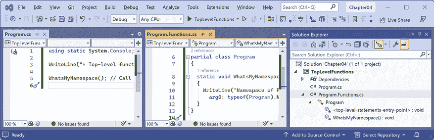

图 4.1：解决方案资源管理器显示合并的 `partial Program` 类

**良好实践**：在 `Program.cs` 中将要调用的任何函数创建在单独的文件中，并在 `partial Program` 类中手动定义它们。这将使它们与自动生成的 `Program` 类在 `<Main>$` 方法的同一级别合并，而不是作为 `<Main>$` 方法内部的本地函数。

重要的是要注意缺少命名空间声明。自动生成的 `Program` 类和显式定义的 `Program` 类都在默认的 `null` 命名空间中。

**警告**！不要为你的 `partial Program` 类定义命名空间。如果你这样做，它将位于不同的命名空间中，因此不会与自动生成的 `partial Program` 类合并。

可选地，可以将 `Program` 类中的所有 `static` 方法显式声明为 `private`，但这已经是默认设置。由于所有函数都将在本 `Program` 类内部调用，因此访问修饰符并不重要。

## 乘法表示例

假设你想帮助你的孩子学习乘法表，因此你想使其容易生成一个数字的乘法表，例如 7 的乘法表：

```cs
1 x 7 = 7
2 x 7 = 14
3 x 7 = 21
...
10 x 7 = 70
11 x 7 = 77
12 x 7 = 84 
```

大多数乘法表都有 10、12 或 20 行，这取决于孩子的学习程度。

你在本章中已经学习了 `for` 语句，所以你知道它可以在存在常规模式时用于生成重复的输出行，例如 12 行的 7 乘法表，如下所示：

```cs
for (int row = 1; row <= 12; row++)
{
  Console.WriteLine($"{row} x 7 = {row * 7}");
} 
```

然而，我们不想总是输出 12 行的 7 乘法表，我们希望使其更加灵活，以便可以输出任何大小和任何数字的乘法表。我们可以通过创建一个函数来实现这一点。

让我们通过创建一个函数来探索函数，该函数可以输出任何大小（最多 255 行，但默认为 12 行）的 0 到 255 的任意数字的乘法表：

1.  使用你喜欢的代码编辑器创建一个新项目，如下所示：

    +   项目模板：**控制台应用程序** / `console`

    +   项目文件和文件夹：`WritingFunctions`

    +   解决方案文件和文件夹：`Chapter04`

    +   在 Visual Studio 中，将解决方案的启动项目设置为当前选择。

1.  在 `WritingFunctions.csproj` 中，在 `<PropertyGroup>` 部分之后，添加一个新的 `<ItemGroup>` 部分以静态导入 `System.Console`，为所有使用隐式使用 .NET SDK 功能的 C# 文件，如下所示：

    ```cs
    <ItemGroup>
      <Using Include="System.Console" Static="true" />
    </ItemGroup> 
    ```

1.  向项目中添加一个名为 `Program.Functions.cs` 的新类文件。

1.  在 `Program.Functions.cs` 中，用以下代码替换任何现有的代码，以在 `partial Program` 类中定义一个名为 `TimesTable` 的函数，如下所示：

    ```cs
    partial class Program
    {
      static void TimesTable(byte number, byte size = 12)
      {
        WriteLine($"This is the {number} times table with {size} rows:");
        WriteLine();
        for (int row = 1; row <= size; row++)
        {
          WriteLine($"{row} x {number} = {row * number}");
        }
        WriteLine();
      }
    } 
    ```

在前面的代码中，请注意以下内容：

+   `TimesTable` 必须有一个名为 `number` 的 `byte` 值作为参数传递。

+   `TimesTable` 可选地可以有一个名为 `size` 的 `byte` 值作为参数传递。如果没有传递值，则默认为 `12`。

+   `TimesTable`是一个`static`方法，因为它将由`static`方法`<Main>$`调用。

+   `TimesTable`不向调用者返回值，因此它使用`void`关键字在名称之前声明。

+   `TimesTable`使用`for`语句输出传递给它的`number`的乘法表，其行数等于`size`。

1.  在`Program.cs`中，删除现有的语句，然后调用该函数。为`number`参数传递一个`byte`值，例如`7`，如下面的代码所示：

    ```cs
    TimesTable(7); 
    ```

1.  运行代码并查看结果，如下面的输出所示：

    ```cs
    This is the 7 times table with 12 rows:
    1 x 7 = 7
    2 x 7 = 14
    3 x 7 = 21
    4 x 7 = 28
    5 x 7 = 35
    6 x 7 = 42
    7 x 7 = 49
    8 x 7 = 56
    9 x 7 = 63
    10 x 7 = 70
    11 x 7 = 77
    12 x 7 = 84 
    ```

1.  将`size`参数设置为`20`，如下面的代码所示：

    ```cs
    TimesTable(7, 20); 
    ```

1.  运行控制台应用程序并确认现在的时间表有 20 行。

**良好实践**：如果一个函数有一个或多个参数，仅传递值可能不足以提供足够的意义，那么你可以选择性地指定参数的名称以及其值，如下面的代码所示：`TimesTable(number: 7, size: 10)`。

1.  将传递给`TimesTable`函数的数字更改为`0`到`255`之间的其他`byte`值，并确认输出的乘法表是正确的。

1.  注意，如果你尝试传递一个非`byte`的数字，例如`int`、`double`或`string`，将会返回一个错误，如下面的输出所示：

    ```cs
    Error: (1,12): error CS1503: Argument 1: cannot convert from 'int' to 'byte' 
    ```

## 关于参数和参数的简要说明

在日常使用中，大多数开发者会将术语**参数**和**参数**互换使用。严格来说，这两个术语有具体和细微的区别。但就像一个人可以是父母和医生一样，这两个术语通常适用于同一事物。

*参数*是函数定义中的一个变量。例如，`startDate`是`Hire`函数的参数，如下面的代码所示：

```cs
void Hire(DateTime startDate)
{
  // Function implementation.
} 
```

当调用一个方法时，*参数*是你传递给方法参数的数据。例如，`when`是一个作为参数传递给`Hire`函数的变量，如下面的代码所示：

```cs
DateTime when = new(year: 2024, month: 11, day: 5);
Hire(when); 
```

你可能更喜欢在传递参数时指定参数名称，如下面的代码所示：

```cs
DateTime when = new(year: 2024, month: 11, day: 5);
Hire(startDate: when); 
```

当谈论对`Hire`函数的调用时，`startDate`是参数，而`when`是参数。

如果你阅读官方的 Microsoft 文档，他们会交替使用**命名和可选参数**和**命名和可选参数**这两个短语，如下面的链接所示：[`learn.microsoft.com/en-us/dotnet/csharp/programming-guide/classes-and-structs/named-and-optional-arguments`](https://learn.microsoft.com/en-us/dotnet/csharp/programming-guide/classes-and-structs/named-and-optional-arguments)。

这变得复杂，因为单个对象可以根据上下文同时作为参数和参数。例如，在`Hire`函数的实现中，`startDate`参数可以作为参数传递给另一个函数，如`SaveToDatabase`，如下面的代码所示：

```cs
void Hire(DateTime startDate)
{
  ...
  SaveToDatabase(startDate, employeeRecord);
  ...
} 
```

命名事物是计算中最困难的部分之一。一个经典的例子是 C# 中最重要的函数 `Main` 的参数。它定义了一个名为 `args` 的参数，代表参数，如下所示：

```cs
static void Main(String[] args)
{
  ...
} 
```

总结来说，参数定义了函数的输入；当调用函数时，将参数传递给函数。

**良好实践**：根据上下文尽量使用正确的术语，但如果其他开发者“误用”术语，不要过于拘泥。我在这本书中可能已经使用了成千上万次的“参数”和“参数”这两个术语。我确信有些时候我可能不够精确。请不要因此@我。

## 编写返回值的函数

前一个函数执行了操作（循环和写入控制台），但没有返回值。假设你需要计算销售额或**增值税**（**VAT**）。在欧洲，增值税率可以从瑞士的 8% 到匈牙利的 27% 不等。在美国（**US**），州销售税率可以从俄勒冈州的 0% 到加利福尼亚州的 8.25% 不等。

税率随时变化，并且根据许多因素而有所不同。本例中使用的值不需要非常准确。

让我们实现一个用于计算世界各地税收的函数：

1.  在 `Program.Functions.cs` 文件中，在 `Program` 类中，编写一个名为 `CalculateTax` 的函数，如下所示：

    ```cs
    static decimal CalculateTax(
      decimal amount, string twoLetterRegionCode)
    {
      decimal rate = twoLetterRegionCode switch
      {
        "CH" => 0.08M, // Switzerland
        "DK" or "NO" => 0.25M, // Denmark, Norway
        "GB" or "FR" => 0.2M, // UK, France
        "HU" => 0.27M, // Hungary
        "OR" or "AK" or "MT" => 0.0M, // Oregon, Alaska, Montana
        "ND" or "WI" or "ME" or "VA" => 0.05M,
        "CA" => 0.0825M, // California
        _ => 0.06M // Most other states.
      };
      return amount * rate;
    } 
    ```

在前面的代码中，请注意以下内容：

+   `CalculateTax` 有两个输入：一个名为 `amount` 的参数，它将是花费的金额，以及一个名为 `twoLetterRegionCode` 的参数，它将是花费的区域。

+   `CalculateTax` 将使用 `switch` 表达式执行计算，然后以 `decimal` 类型的值返回应缴纳的销售额税或增值税；因此，在函数名称之前，我们已声明返回值的类型为 `decimal`。

1.  在 `Program.Functions.cs` 文件的顶部，导入用于处理文化的命名空间，如下所示：

    ```cs
    using System.Globalization; // To use CultureInfo. 
    ```

1.  在 `Program.Functions.cs` 文件中，在 `Program` 类中，编写一个名为 `ConfigureConsole` 的函数，如下所示：

    ```cs
    static void ConfigureConsole(string culture = "en-US",
      bool useComputerCulture = false)
    {
      // To enable Unicode characters like Euro symbol in the console.
      OutputEncoding = System.Text.Encoding.UTF8;
      if (!useComputerCulture)
      {
        CultureInfo.CurrentCulture = CultureInfo.GetCultureInfo(culture);
      }
      WriteLine($"CurrentCulture: {CultureInfo.CurrentCulture.DisplayName}");
    } 
    ```

此函数为控制台输出启用 UTF-8 编码。这是输出一些特殊符号（如欧元货币符号）所必需的。此函数还控制用于格式化日期、时间和货币值的当前文化。

1.  在 `Program.cs` 文件中，注释掉任何 `TimesTable` 方法调用，然后调用 `ConfigureConsole` 方法以及 `CalculateTax` 方法，传递金额值，例如 `149`，以及有效的区域代码，例如 `FR`，如下所示：

    ```cs
    // TimesTable(number: 7, size: 10);
    ConfigureConsole();
    decimal taxToPay = CalculateTax(amount: 149, twoLetterRegionCode: "FR");
    WriteLine($"You must pay {taxToPay:C} in tax.");
    // Alternatively, call the function in the interpolated string.
    // WriteLine($"You must pay {CalculateTax(amount: 149,
    //   twoLetterRegionCode: "FR"):C} in tax."); 
    ```

1.  运行代码，查看结果，并注意它使用的是美国英语文化，这意味着货币为美元，如下所示：

    ```cs
    CurrentCulture: English (United States)
    You must pay $29.80 in tax. 
    ```

1.  在 `Program.cs` 文件中，将 `ConfigureConsole` 方法更改为使用您本地的计算机文化，如下所示：

    ```cs
    ConfigureConsole(useComputerCulture: true); 
    ```

1.  运行代码，查看结果，并注意货币现在应显示为您的本地货币。例如，对我来说在英国，我会看到 `£29.80`，如下所示输出：

    ```cs
    CurrentCulture: English (United Kingdom)
    You must pay £29.80 in tax. 
    ```

1.  在 `Program.cs` 中，将 `ConfigureConsole` 方法更改为使用法语文化，如下所示代码：

    ```cs
    ConfigureConsole(culture: "fr-FR"); 
    ```

1.  运行代码，查看结果，并注意货币现在应显示为欧元，这是在法国使用的，如下所示输出：

    ```cs
    CurrentCulture: French (France)
    You must pay 29,80 € in tax. 
    ```

你能想到 `CalculateTax` 函数编写中的任何问题吗？如果用户输入了如 `fr` 或 `UK` 这样的代码会发生什么？你如何重写该函数以改进它？使用 `switch` *语句* 而不是 `switch` *表达式* 会更清晰吗？

## 将数字从基数转换为序数

用于计数的数字称为 **基数**，例如，1、2 和 3，而用于排序的数字称为 **序数**，例如，1st、2nd 和 3rd。让我们创建一个函数将基数转换为序数：

1.  在 `Program.Functions.cs` 中，编写一个名为 `CardinalToOrdinal` 的函数，该函数将基数 `uint` 值转换为序数 `string` 值；例如，它将 `uint` 值 `1` 转换为字符串值 `"1st"`，`uint` 值 `2` 转换为字符串值 `"2nd"`，依此类推，如下所示代码：

    ```cs
    static string CardinalToOrdinal(uint number)
    {
      uint lastTwoDigits = number % 100;
      switch (lastTwoDigits)
      {
        case 11: // Special cases for 11th to 13th.
        case 12:
        case 13:
          return $"{number:N0}th";
        default:
          uint lastDigit = number % 10;
          string suffix = lastDigit switch
          {
            1 => "st",
            2 => "nd",
            3 => "rd",
            _ => "th"
          };
          return $"{number:N0}{suffix}";
      }
    } 
    ```

从前面的代码中，注意以下内容：

+   `CardinalToOrdinal` 有一个输入，一个名为 `number` 的 `uint` 类型参数，因为我们不希望允许负数，并且有一个输出：返回 `string` 类型的值。

+   使用 `switch` *语句* 处理 `11`、`12` 和 `13` 的特殊情况。

+   然后，使用 `switch` *表达式* 处理所有其他情况：如果最后一位数字是 `1`，则使用 `st` 作为后缀；如果最后一位数字是 `2`，则使用 `nd` 作为后缀；如果最后一位数字是 `3`，则使用 `rd` 作为后缀；如果最后一位数字是其他任何数字，则使用 `th` 作为后缀。

1.  在 `Program.Functions.cs` 中，编写一个名为 `RunCardinalToOrdinal` 的函数，该函数使用 `for` 循环从 1 到 150，对每个数字调用 `CardinalToOrdinal` 函数，并将返回的 `string` 写入控制台，用空格字符分隔，如下所示代码：

    ```cs
    static void RunCardinalToOrdinal()
    {
      for (uint number = 1; number <= 150; number++)
      {
        Write($"{CardinalToOrdinal(number)} ");
      }
      WriteLine();
    } 
    ```

1.  在 `Program.cs` 中，注释掉 `CalculateTax` 语句并调用 `RunCardinalToOrdinal` 方法，如下所示代码：

    ```cs
    RunCardinalToOrdinal(); 
    ```

1.  运行控制台应用程序并查看结果，如下所示输出：

    ```cs
    1st 2nd 3rd 4th 5th 6th 7th 8th 9th 10th 11th 12th 13th 14th 15th 16th 17th 18th 19th 20th 21st 22nd 23rd 24th 25th 26th ... 139th 140th 141st 142nd 143rd 144th 145th 146th 147th 148th 149th 150th 
    ```

1.  在 `RunCardinalToOrdinal` 函数中，将最大数更改为 `1500`。

1.  运行控制台应用程序并查看结果，如下所示输出：

    ```cs
    ... 1,480th 1,481st 1,482nd 1,483rd 1,484th 1,485th 1,486th 1,487th 1,488th 1,489th 1,490th 1,491st 1,492nd 1,493rd 1,494th 1,495th 1,496th 1,497th 1,498th 1,499th 1,500th 
    ```

## 使用递归计算阶乘

5 的阶乘是 120，因为阶乘是通过将起始数字乘以比它小一的数字，然后再乘以再小一的数字，依此类推，直到数字减少到 1 来计算的。一个例子如下：5 x 4 x 3 x 2 x 1 = 120。

阶乘函数仅对非负整数定义，即对 0、1、2、3 等等，其定义为：

```cs
0! = 1
n! = n × (n − 1)!, for n  { 1, 2, 3, ... } 
```

我们可以将拒绝负数的任务留给编译器，就像我们在 `CardinalToOrdinal` 函数中所做的那样，将输入参数声明为 `uint`，但这次，让我们看看另一种处理方式：抛出参数异常。

阶乘的表示方式为 `5!`，其中感叹号读作“bang”，所以 `5!` = 120，或者说 *五 bang 等于一百二十*。在阶乘的上下文中，“bang”是一个很好的术语，因为它们增长得非常快，就像爆炸一样。

我们将编写一个名为 `Factorial` 的函数；这将计算传递给它的 `int` 参数的阶乘。我们将使用一种称为 **递归** 的巧妙技术，它指的是在其实现中直接或间接调用自身的函数：

1.  在 `Program.Functions.cs` 文件中，编写一个名为 `Factorial` 的函数，如下面的代码所示：

    ```cs
    static int Factorial(int number)
    {
      if (number < 0)
      {
         throw new ArgumentOutOfRangeException(message:
           $"The factorial function is defined for non-negative integers only. Input: {number}",
           paramName: nameof(number));
      }
      else if (number == 0)
      {
        return 1;
      }
      else
      {
        return number * Factorial(number - 1);
      }
    } 
    ```

如前所述，前面的代码中有几个值得注意的元素，包括以下内容：

+   如果输入参数 `number` 是负数，`Factorial` 会抛出异常。

+   如果输入参数 `number` 是 `0`，`Factorial` 返回 `1`。

+   如果输入参数 `number` 大于 `0`（在其他所有情况下都会是这样），`Factorial` 会将数字乘以调用自身并传递 `number` 减一的返回结果。这使得函数是递归的。

**更多信息**：递归很巧妙，但它可能会导致问题，例如由于函数调用过多而导致的栈溢出，因为每次函数调用都会使用内存来存储数据，最终会使用太多。在 C# 等语言中，迭代是一个更实际、但不太简洁的解决方案。您可以在以下链接中了解更多信息：[`en.wikipedia.org/wiki/Recursion_(computer_science)#Recursion_versus_iteration`](https://en.wikipedia.org/wiki/Recursion_(computer_science)#Recursion_versus_iteration)。

1.  在 `Program.Functions.cs` 文件中，编写一个名为 `RunFactorial` 的函数，该函数使用 `for` 循环输出从 1 到 15 的数字的阶乘，在其循环内部调用 `Factorial` 函数，然后输出结果，使用代码 `N0` 格式化，该代码指的是使用千位分隔符且没有小数位的数字格式，如下面的代码所示：

    ```cs
    static void RunFactorial()
    {
      for (int i = 1; i <= 15; i++)
      {
        WriteLine($"{i}! = {Factorial(i):N0}");
      }
    } 
    ```

1.  将 `RunCardinalToOrdinal` 方法的调用注释掉，并调用 `RunFactorial` 方法。

1.  运行项目并查看结果，如下面的部分输出所示：

    ```cs
    1! = 1
    2! = 2
    3! = 6
    4! = 24
    ...
    12! = 479,001,600
    13! = 1,932,053,504
    14! = 1,278,945,280
    15! = 2,004,310,016 
    ```

在前面的输出中并不立即明显，但 13 及以上的阶乘会超出 `int` 类型的范围，因为它们非常大。`12!` 是 479,001,600，大约是五亿。可以存储在 `int` 变量中的最大正数值大约是二十亿。`13!` 是 6,227,020,800，大约是六十亿，当存储在 32 位整数中时，它会静默溢出而不会显示任何问题。

你应该做什么才能在溢出发生时收到通知？当然，我们可以通过使用 `long`（64 位整数）而不是 `int`（32 位整数）来解决 `13!` 和 `14!` 的问题，但我们很快就会再次达到溢出限制。

本节的目的在于理解和展示数字可能会溢出，而不是具体讲解如何计算大于 `12!` 的阶乘。让我们来看一看：

1.  修改 `Factorial` 函数，以便在自我调用的语句中检查溢出，如下所示，代码中已突出显示：

    ```cs
    **checked** **// for overflow**
    **{**
      return number * Factorial(number - 1);
    **}** 
    ```

1.  修改 `RunFactorial` 函数，将起始数字改为 `-2`，并在调用 `Factorial` 函数时处理溢出和其他异常，如下所示，代码中已突出显示：

    ```cs
    static void RunFactorial()
    {
      for (int i = **-2**; i <= 15; i++)
      {
    **try**
     **{**
          WriteLine($"{i}! = {Factorial(i):N0}");
     **}**
    **catch** **(OverflowException)**
     **{**
     **WriteLine(****$"****{i}****! is too big for a 32-bit integer."****);**
     **}**
    **catch** **(Exception ex)**
     **{**
     **WriteLine(****$"****{i}****! throws** **{ex.GetType()}****:** **{ex.Message}****"****);**
     **}**
      }
    } 
    ```

1.  运行代码并查看结果，如下所示的部分输出：

    ```cs
    -2! throws System.ArgumentOutOfRangeException: The factorial function is defined for non-negative integers only. Input: -2 (Parameter 'number')
    -1! throws System.ArgumentOutOfRangeException: The factorial function is defined for non-negative integers only. Input: -1 (Parameter 'number')
    0! = 1
    1! = 1
    2! = 2
    ...
    12! = 479,001,600
    13! is too big for a 32-bit integer.
    14! is too big for a 32-bit integer.
    15! is too big for a 32-bit integer. 
    ```

## 使用 XML 注释记录函数

默认情况下，当调用 `CardinalToOrdinal` 等函数时，代码编辑器会显示包含基本信息的工具提示。

让我们通过添加额外信息来改进工具提示：

1.  如果你使用带有 **C#** 扩展的 VS Code，你应该导航到 **视图** | **命令面板** | **首选项：打开设置（UI**），然后搜索 `formatOnType` 并确保它已启用。C# XML 文档注释是 Visual Studio 和 Rider 的内置功能，因此您不需要做任何事情就可以使用它们。

1.  在 `CardinalToOrdinal` 函数上方的一行中，输入三个反斜杠 `///`，并注意它们被扩展为识别函数有一个名为 `number` 的单个参数的 XML 注释，如下所示，代码中已突出显示：

    ```cs
    /// <summary>
    ///
    /// </summary>
    /// <param name="number"></param>
    /// <returns></returns> 
    ```

1.  为 `CardinalToOrdinal` 函数输入合适的 XML 文档注释信息。添加摘要并描述输入参数和返回值，如下所示，代码中已突出显示：

    ```cs
    /// <summary>
    /// P**ass a 32-bit unsigned integer and it will be converted into its**
    **ordinal equivalent.**
    /// </summary>
    /// <param name="number">N**umber as a cardinal value e.g. 1, 2, 3, and so**
    **on.**</param>
    /// <returns>N**umber as an ordinal value e.g. 1st, 2nd, 3rd, and so on.**</
    returns> 
    ```

1.  现在，当调用函数时，你会看到更多详细信息，如下所示 *图 4.2*：

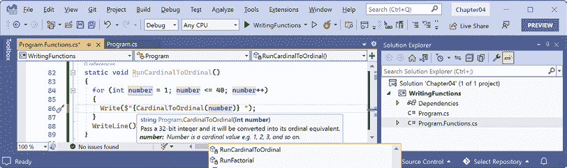

图 4.2：显示更详细的方法签名的工具提示

值得强调的是，此功能主要是为了与将注释转换为文档的工具一起使用而设计的，例如 Sandcastle，你可以在以下链接中了解更多信息：[`github.com/EWSoftware/SHFB`](https://github.com/EWSoftware/SHFB)。在输入代码或悬停在函数名称上时出现的工具提示是次要功能。

局部函数不支持 XML 注释，因为局部函数不能在它们声明的成员之外使用，因此从它们生成文档没有意义。遗憾的是，这也意味着没有工具提示，虽然这仍然很有用，但 Visual Studio 和 VS Code 都没有识别出来。

**良好实践**：除了局部函数外，为所有函数添加 XML 文档注释。

## 在函数实现中使用 lambda 表达式

**F#** 是微软的强类型函数式编程语言，与 C# 类似，它编译成 **中间语言**（**IL**）以由 .NET 执行。函数式语言起源于 lambda 演算，这是一种仅基于函数的计算系统。代码看起来更像数学函数，而不是食谱中的步骤。

以下列表中定义了函数式语言的一些重要属性：

+   **模块化**：在 C# 中定义函数的相同好处也适用于函数式语言。这将一个大而复杂的代码库分解成更小的部分。

+   **不可变性**：在 C# 的意义上，变量不存在。函数内部的数据值不能改变。相反，可以从现有数据值创建一个新的数据值。这减少了错误。

+   **可维护性**：函数式代码更干净、更清晰（对于数学倾向的程序员来说）。

自 C# 6 以来，微软一直在努力添加语言特性以支持更函数式的方法，例如，在 C# 7 中添加 **元组** 和 **模式匹配**，在 C# 8 中添加 **非空引用类型**，并在 C# 9 中改进模式匹配和添加记录，即潜在的 **不可变对象**。

在 C# 6 中，微软添加了对 **表达式主体函数成员** 的支持。我们现在将看看这个例子。在 C# 中，lambda 是使用 `=>` 字符来表示函数的返回值。

数字的 **斐波那契数列** 总是以 0 和 1 开始。然后，其余的序列使用将前两个数字相加的规则生成，如下所示数列：

```cs
0 1 1 2 3 5 8 13 21 34 55 ... 
```

序列的下一个项将是 34 + 55，即 89。

我们将使用斐波那契数列来说明命令式和声明式函数实现之间的区别：

1.  在 `Program.Functions.cs` 中，编写一个名为 `FibImperative` 的函数，它将以命令式风格编写，如下所示代码：

    ```cs
    static int FibImperative(uint term)
    {
      if (term == 0)
      {
        throw new ArgumentOutOfRangeException();
      }
      else if (term == 1)
      {
        return 0;
      }
      else if (term == 2)
      {
        return 1;
      }
      else
      {
        return FibImperative(term - 1) + FibImperative(term - 2);
      }
    } 
    ```

1.  在 `Program.Functions.cs` 中，编写一个名为 `RunFibImperative` 的函数，该函数在从 1 到 30 的循环语句中调用 `FibImperative`，如下所示代码：

    ```cs
    static void RunFibImperative()
    {
      for (uint i = 1; i <= 30; i++)
      {
        WriteLine("The {0} term of the Fibonacci sequence is {1:N0}.",
          arg0: CardinalToOrdinal(i),
          arg1: FibImperative(term: i));
      }
    } 
    ```

1.  在 `Program.cs` 中，注释掉其他方法调用并调用 `RunFibImperative` 方法。

1.  运行控制台应用程序并查看结果，如下所示的部分输出：

    ```cs
    The 1st term of the Fibonacci sequence is 0.
    The 2nd term of the Fibonacci sequence is 1.
    The 3rd term of the Fibonacci sequence is 1.
    The 4th term of the Fibonacci sequence is 2.
    The 5th term of the Fibonacci sequence is 3.
    ...
    The 29th term of the Fibonacci sequence is 317,811.
    The 30th term of the Fibonacci sequence is 514,229. 
    ```

1.  在 `Program.Functions.cs` 中，编写一个名为 `FibFunctional` 的函数，采用声明式风格，如下所示代码：

    ```cs
    static int FibFunctional(uint term) => term switch
      {
        0 => throw new ArgumentOutOfRangeException(),
        1 => 0,
        2 => 1,
        _ => FibFunctional(term - 1) + FibFunctional(term - 2)
      }; 
    ```

1.  在 `Program.Functions.cs` 中，编写一个函数，在从 1 到 30 的循环语句中调用它，如下所示代码：

    ```cs
    static void RunFibFunctional()
    {
      for (uint i = 1; i <= 30; i++)
      {
        WriteLine("The {0} term of the Fibonacci sequence is {1:N0}.",
          arg0: CardinalToOrdinal(i),
          arg1: FibFunctional(term: i));
      }
    } 
    ```

1.  在 `Program.cs` 中，注释掉 `RunFibImperative` 方法调用并调用 `RunFibFunctional` 方法。

1.  运行代码并查看结果（将与之前相同）。

现在你已经看到了一些函数的示例，让我们看看当它们有错误时如何修复它们。

# 开发期间的调试

在本节中，您将学习如何在开发时间调试问题。您必须使用具有调试工具的代码编辑器，例如 Visual Studio 或 VS Code。

## 创建包含故意错误的代码

让我们通过创建一个包含故意错误的控制台应用程序来探索调试，然后我们将使用代码编辑器中的调试工具来追踪并修复：

1.  使用您首选的代码编辑器将一个新的 **Console App** / `console` 项目命名为 `Debugging` 并添加到 `Chapter04` 解决方案中。

1.  将 `Debugging.csproj` 修改为静态导入所有代码文件的 `System.Console`。

1.  在 `Program.cs` 中，删除任何现有的语句，然后在文件底部添加一个包含故意错误的函数，如下所示代码：

    ```cs
    double Add(double a, double b)
    {
      return a * b; // Deliberate bug!
    } 
    ```

1.  在 `Add` 函数上方编写语句以声明和设置一些变量，然后使用有错误的函数将它们相加，如下所示代码：

    ```cs
    double a = 4.5;
    double b = 2.5;
    double answer = Add(a, b);
    WriteLine($"{a} + {b} = {answer}");
    WriteLine("Press Enter to end the app.");
    ReadLine(); // Wait for user to press Enter. 
    ```

1.  运行控制台应用程序并查看结果，如下所示输出：

    ```cs
    4.5 + 2.5 = 11.25
    Press Enter to end the app. 
    ```

但等等，这里有错误！4.5 加上 2.5 应该是 7，而不是 11.25！

我们将使用调试工具来寻找并修复错误。

## 设置断点和开始调试

断点允许我们标记我们想要暂停以检查程序状态和查找错误的代码行。

### 使用 Visual Studio

让我们设置一个断点，然后使用 Visual Studio 开始调试：

1.  在第 1 行点击，这是声明名为 `a` 的变量的语句。

1.  导航到 **调试** | **切换断点** 或按 *F9*。在左侧边缘栏上会出现一个红色圆圈，并且语句将以红色突出显示以指示已设置断点，如图 *图 4.3* 所示：

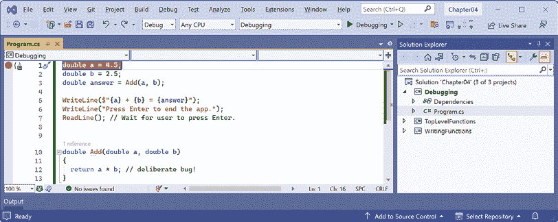

图 4.3：使用 Visual Studio 切换断点

断点可以通过相同的操作关闭。您还可以在边缘处左键单击以切换断点的开/关，或右键单击断点以查看更多选项，例如删除、禁用或编辑条件或现有断点的操作。

1.  导航到 **调试** | **开始调试** 或按 *F5*。Visual Studio 启动控制台应用程序，然后在遇到断点时暂停。这被称为 *断点模式*。可能会出现标题为 **局部变量**（显示局部变量的当前值）、**监视 1**（显示您定义的任何监视表达式）、**调用堆栈**、**异常设置** 和 **立即窗口** 的额外窗口。将出现 **调试** 工具栏。将要执行的下一行以黄色突出显示，并且从边缘栏指向该行的黄色箭头，如图 *图 4.4* 所示：

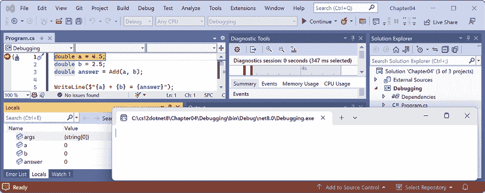

图 4.4：Visual Studio 中的断点模式

如果您不想了解如何使用 VS Code 开始调试，则可以跳过 *使用 VS Code* 部分，并继续到标题为 *使用调试工具栏导航* 的部分。

### 使用 VS Code

让我们设置一个断点，然后使用 VS Code 开始调试：

1.  在第 1 行点击，这是声明名为 `a` 的变量的语句。

1.  导航到**运行** | **切换断点**或按*F9*。在左侧边栏上会出现一个红色圆圈，以指示已设置断点。

断点可以通过相同的操作切换关闭。您还可以在边栏中左键单击以切换断点的开启和关闭；右键单击以查看更多选项，例如删除、编辑或禁用现有断点；或者在没有断点时添加断点、条件断点或 Logpoint。**Logpoints**，也称为**Tracepoints**，表示您希望在代码执行到该点时记录一些信息，而无需在该点停止执行代码。

1.  导航到**视图** | **运行**，或在左侧导航栏中，您可以单击**运行和调试**图标（三角形“播放”按钮和“虫子”）或按*Ctrl* + *Shift* + *D*（在 Windows 上）。

1.  在**RUN AND DEBUG**窗口的顶部，单击**运行和调试**按钮，然后选择**调试**项目，如图*图 4.5*所示：

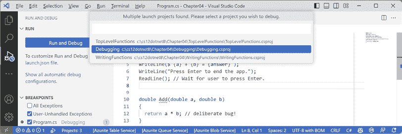

图 4.5：使用 VS Code 选择要调试的项目

如果您首先被提示选择调试器，请选择**C#**，而不是.NET 5+或.NET Core。

1.  VS Code 启动控制台应用程序，并在遇到断点时暂停。这被称为**断点模式**。即将执行的行将以黄色突出显示，并且从边栏栏中指向该行的黄色方块，如图*图 4.6*所示：

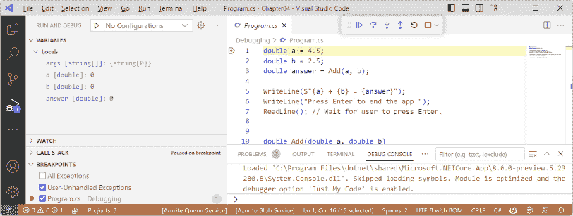

图 4.6：VS Code 中的断点模式

## 使用调试工具栏进行导航

Visual Studio 在其**标准**工具栏中有两个与调试相关的按钮，用于启动或继续调试以及快速重新加载运行代码的更改，还有一个单独的**调试**工具栏用于其他工具。

VS Code 显示一个浮动工具栏，其中包含按钮，便于访问调试功能。

两者均在*图 4.7*中展示：

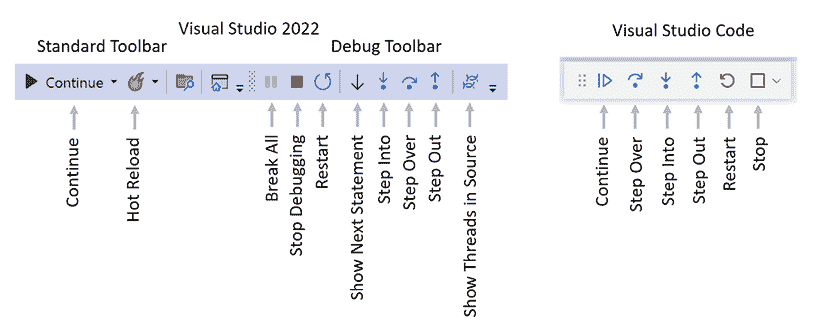

图 4.7：Visual Studio 和 VS Code 中的调试工具栏

以下列表描述了工具栏中最常见的按钮：

+   **开始**/**继续**/*F5*：此按钮是上下文相关的。它将启动运行项目或从当前位置继续运行项目，直到结束或遇到断点。

+   **热重载**：此按钮将在无需重新启动应用程序的情况下重新加载编译的代码更改。

+   **断点全部**：此按钮将在运行的应用程序中进入下一个可用的代码行。

+   **停止调试**/**停止**/*Shift* + *F5*（红色方块）：此按钮将停止调试会话。

+   **重启**/*Ctrl* 或 *Cmd* + *Shift* + *F5*（圆形箭头）：此按钮将停止程序，然后立即重新启动程序，并再次附加调试器。

+   **显示下一语句**：此按钮将当前光标移动到即将执行的下一语句。

+   **进入**/*F11*，**跳过**/*F10*，和**跳出**/*Shift* + *F11*（蓝色箭头覆盖点）：这些按钮以各种方式逐步执行代码语句，您将在稍后看到。

+   **显示源中的线程**：此按钮允许你检查和操作你正在调试的应用程序中的线程。

## 调试窗口

在调试过程中，Visual Studio 和 VS Code 都会显示额外的窗口，允许你在执行代码时监控有用的信息，例如变量。

以下列表中描述了最有用的窗口：

+   **变量**，包括**局部变量**，显示任何局部变量的名称、值和类型。在执行代码时，请注意此窗口。

+   **WATCH**，或**Watch 1**，显示你手动输入的变量和表达式的值。

+   **调用堆栈**，显示函数调用的堆栈。

+   **断点**，显示所有断点并允许更精细地控制它们。

在断点模式下，编辑区域底部还有一个有用的窗口：

+   **调试控制台**，或**即时窗口**，允许你与代码进行实时交互。例如，你可以通过输入变量的名称来查询程序状态。例如，你可以通过输入`1+2`并按*Enter*来询问“1+2 等于多少？”。

## 逐行执行代码

让我们探索一些使用 Visual Studio 或 VS Code 逐行执行代码的方法：

调试的菜单命令位于 Visual Studio 的**调试**菜单或 VS Code 和 Rider 的**运行**菜单中。

1.  导航到**运行**或**调试** | **进入**，点击工具栏中的**进入**按钮，或按*F11*。黄色高亮显示向前移动一行。

1.  导航到**运行**或**调试** | **进入**，点击工具栏中的**进入**按钮，或按*F11*。黄色高亮显示向前移动一行。目前，你可以看到使用**进入**或**跳过**没有区别，因为我们正在执行单行语句。

1.  你现在应该位于调用`Add`方法的行上。

当你即将执行方法调用时，可以看到**进入**和**跳过**之间的区别。

如果你点击**进入**，调试器将进入方法，以便你可以逐行执行该方法中的每一行。

如果你点击**跳过**，整个方法将一次性执行；它不会跳过方法而不执行。

1.  点击**进入**以进入`Add`方法。

1.  将鼠标指针悬停在代码编辑窗口中的`a`或`b`参数上，并注意会弹出一个显示它们当前值的工具提示。

1.  选择表达式`a * b`，右键单击表达式，并选择**添加到监视**或**添加监视**。表达式被添加到**WATCH**或**Watch 1**窗口中，显示该运算符正在将`a`乘以`b`得到结果`11.25`。

1.  在**WATCH**或**Watch 1**窗口中，右键单击表达式并选择**移除表达式**或**删除监视**。

1.  通过将`Add`函数中的`*`改为`+`来修复错误。

1.  通过点击圆形箭头的**重启**按钮或按*Ctrl*或*Cmd* + *Shift* + *F5*来重启调试。

1.  跳过函数，花一分钟注意它现在是如何正确计算的，然后点击**继续**按钮或按*F5*。

1.  使用 VS Code 时，注意在调试期间写入控制台时，输出出现在**DEBUG CONSOLE**窗口而不是**TERMINAL**窗口，如图*4.8*所示：

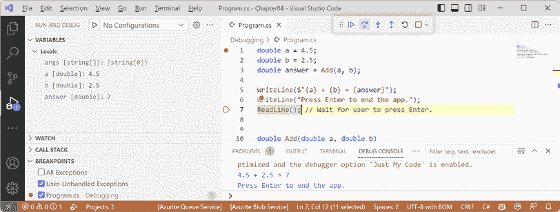

图 4.8：调试期间写入 DEBUG CONSOLE

## 使用 VS Code 集成终端进行调试

默认情况下，控制台在调试期间设置为使用内部**DEBUG CONSOLE**，这不允许像从`ReadLine`方法中输入文本这样的交互。

为了提高体验，我们可以将设置更改为使用集成终端。首先，让我们修改代码以要求与用户交互：

1.  在`Program.cs`的顶部，添加提示用户输入数字并将该数字解析为变量`a`中的`double`类型的语句，如下面的代码所示，高亮显示：

    ```cs
    **Write(****"Enter a number: "****);**
    **string** **number = ReadLine()!;**
    double a = **double****.Parse(number)**; 
    ```

1.  在第 1 行设置断点，写入提示`Enter a number`。

1.  在**运行和调试**窗口的顶部，点击**运行和调试**按钮，然后选择**Debugging**项目。

1.  注意，`Enter a number`提示既没有写入**TERMINAL**也没有写入**DEBUG CONSOLE**，并且两个窗口都没有等待用户输入数字并按*Enter*。

1.  停止调试。

1.  在**运行和调试**窗口的顶部，点击**创建 launch.json 文件**链接，然后，当提示选择调试器时，选择**C#**，如图*4.9*所示：

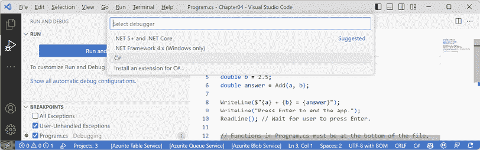

图 4.9：为 launch.json 文件选择调试器

1.  在`launch.json`文件编辑器中，点击**添加配置...**按钮，然后选择**.NET: Launch .NET Core Console App**，如图*4.10*所示：

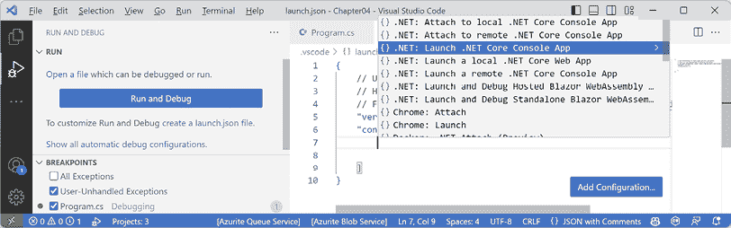

图 4.10：为.NET 控制台应用程序添加启动配置

1.  在`launch.json`中，进行以下添加和更改，如下面的配置所示，高亮显示：

    +   注释掉`preLaunchTask`设置。

    +   在`program`路径中，在`workspaceFolder`变量之后添加`Debugging`项目文件夹。

    +   在`program`路径中，将`<target-framework>`更改为`net9.0`。

    +   在`program`路径中，将`<project-name.dll>`更改为`Debugging.dll`。

    +   将`console`设置从`internalConsole`更改为`integratedTerminal`：

    ```cs
    {
      // Use IntelliSense to learn about possible attributes.
      // Hover to view descriptions of existing attributes.
      // For more information, visit: https://go.microsoft.com/fwlink/?linkid=830387
      "version": "0.2.0",
      "configurations": [
        {
          "name": ".NET Core Launch (console)",
          "type": "coreclr",
          "request": "launch",
          **//**"preLaunchTask": "build",
          "program": "${workspaceFolder}/**Debugging/**bin/Debug/**net9.0**/**Debugging.dll**",
          "args": [],
          "cwd": "${workspaceFolder}",
          "stopAtEntry": false,
          "console": "**integratedTerminal**"
        }
      ]
    } 
    ```

记住，使用 VS Code 时，我们打开`Chapter04`文件夹来处理解决方案文件，因此工作区文件夹是`Chapter04`，而不是`Debugging`项目。

1.  在**运行和调试**窗口的顶部，注意启动配置的下拉列表，并点击**开始调试**按钮（绿色三角形），如图*4.11*所示。

1.  导航到**视图** | **终端**，并注意**终端**窗口附加到`Debugging.dll`，如图*4.11*所示。

1.  跳过将`Enter a number:`写入控制台的语句。

1.  跳过调用`ReadLine`的语句。

1.  输入`5.5`并按*Enter*。

1.  继续逐句执行或按*F5*或点击**继续**，并注意写入集成终端的输出，如图*图 4.11*所示：

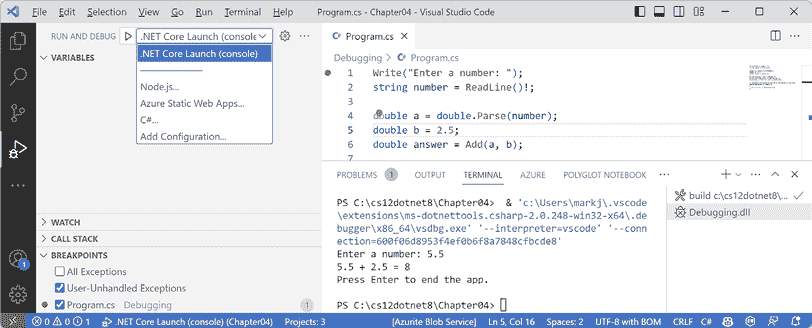

图 4.11：设置为使用集成终端进行用户交互的启动配置

## 自定义断点

创建更复杂的断点很容易：

1.  如果您仍在调试中，请点击调试工具栏中的**停止**按钮，导航到**运行**或**调试** | **停止调试**，或按*Shift* + *F5*。

1.  导航到**运行** | **移除所有断点**或**调试** | **删除所有断点**。

1.  点击输出答案的`WriteLine`语句。

1.  通过按*F9*或导航到**运行**或**调试** | **切换断点**来设置断点。

1.  右键单击断点并选择适合您的代码编辑器的适当菜单：

    +   在 VS Code 中，选择**编辑断点...**。

    +   在 Visual Studio 中，选择**条件...**。

1.  输入一个表达式，例如`answer`变量必须大于`9`，然后按*Enter*键接受它，并注意表达式必须评估为`true`，断点才能激活，如图*图 4.12*所示：

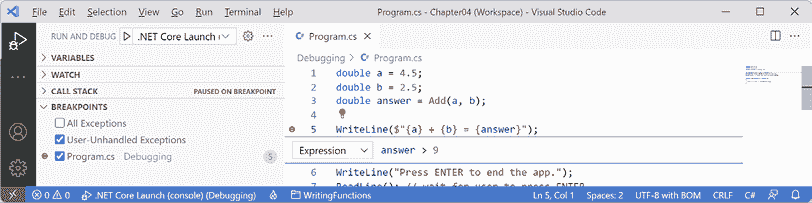

图 4.12：使用 VS Code 自定义带有表达式的断点

1.  开始调试并注意断点未被触发。

1.  停止调试。

1.  编辑断点或其条件，并将其表达式更改为小于`9`。

1.  开始调试并注意断点被触发。

1.  停止调试。

1.  编辑断点或其条件（在 Visual Studio 中，点击**添加条件**），选择**触发次数**，然后输入一个数字，例如`3`，这意味着您必须触发断点三次才能激活它，如图*图 4.13*所示：

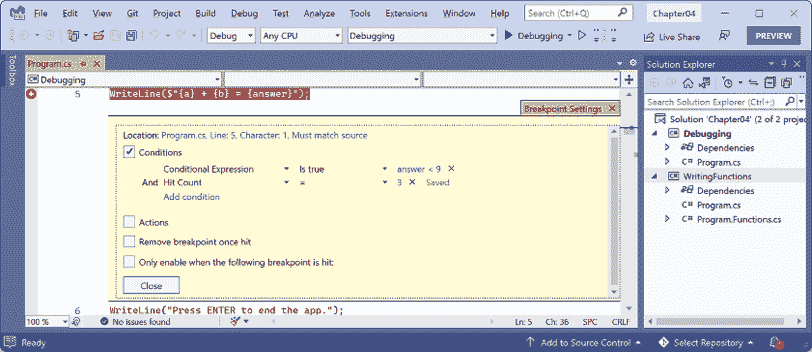

图 4.13：使用 Visual Studio 自定义带有表达式和触发次数的断点

1.  将鼠标悬停在断点的红色圆圈上，可以看到摘要，如图*图 4.14*所示：

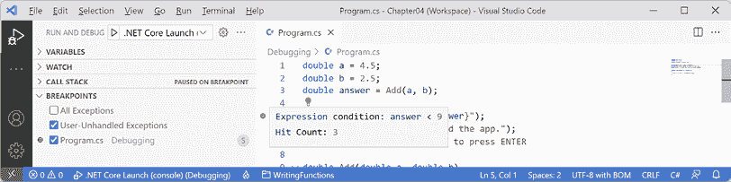

图 4.14：VS Code 中自定义断点的摘要

您现在已使用一些调试工具修复了一个错误，并看到了设置断点的先进可能性。

# 开发中的热重载

**热重载**是一个允许开发者在应用程序运行时应用代码更改并立即看到效果的特性。这对于快速修复错误非常有用。热重载也称为**编辑并继续**。您可以在以下链接中找到支持热重载的更改类型列表：[`aka.ms/dotnet/hot-reload`](https://aka.ms/dotnet/hot-reload)。

在.NET 6 发布之前，一位高级微软员工试图使该功能仅限于 Visual Studio，引发了争议。幸运的是，微软内部的开放源代码阵营成功地推翻了这一决定。使用命令行工具仍然可以使用 Hot Reload。

让我们看看实际操作：

1.  使用您喜欢的代码编辑器，将名为 `HotReloading` 的新 **控制台应用程序** / `console` 项目添加到 `Chapter04` 解决方案中。

1.  修改 `HotReloading.csproj` 以静态导入所有代码文件的 `System.Console`。

1.  在 `Program.cs` 中，删除现有的语句，然后每两秒向控制台写入一条消息，如下所示代码：

    ```cs
    /* Visual Studio: run the app, change the message, click Hot Reload.
     * VS Code: run the app using dotnet watch, change the message. */
    while (true)
    {
      WriteLine("Hello, Hot Reload!");
      await Task.Delay(2000);
    } 
    ```

## 使用 Visual Studio 进行热重载

如果您使用的是 Visual Studio，热重载功能已集成到用户界面中：

1.  在 Visual Studio 中启动项目，并注意每两秒输出一条消息。

1.  保持项目运行。

1.  在 `Program.cs` 中，将 `Hello` 改为 `Goodbye`。

1.  导航到 **调试** | **应用代码更改** 或在工具栏中点击 **热重载** 按钮，如图 4.15 所示，并注意更改已应用而无需重新启动控制台应用程序。

1.  展开热重载按钮菜单，并选择 **文件保存时热重载**，如图 4.15 所示：

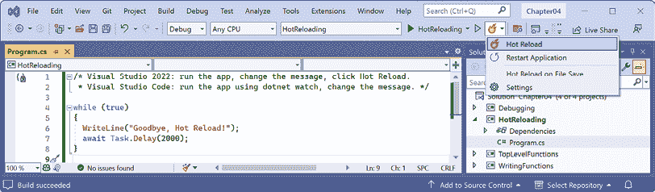

图 4.15：更改热重载选项

1.  再次更改消息，保存文件，并注意控制台应用程序自动更新。

## 使用 VS Code 和 dotnet watch 进行热重载

如果您使用 VS Code，在启动控制台应用程序时必须发出一个特殊命令以激活热重载：

1.  在 VS Code 中，在 **终端** 中使用 `dotnet watch` 启动控制台应用程序，并注意显示热重载已激活的输出，如下所示输出：

    ```cs
    dotnet watch  Hot reload enabled. For a list of supported edits, see https://aka.ms/dotnet/hot-reload.
       Press "Ctrl + R" to restart.
    dotnet watch  Building...
      Determining projects to restore...
      All projects are up-to-date for restore.
      HotReloading -> C:\cs13net9\Chapter04\HotReloading\bin\Debug\net9.0\HotReloading.dll
    dotnet watch  Started
    Hello, Hot Reload!
    Hello, Hot Reload!
    Hello, Hot Reload! 
    ```

1.  在 VS Code 中，将 `Hello` 改为 `Goodbye`，并注意几秒钟后更改已应用而无需重新启动控制台应用程序，如下所示输出：

    ```cs
    Hello, Hot Reload!
    dotnet watch  File changed: .\Program.cs.
    Hello, Hot Reload!
    Hello, Hot Reload!
    dotnet watch  Hot reload of changes succeeded.
    Goodbye, Hot Reload!
    Goodbye, Hot Reload! 
    ```

1.  按 *Ctrl* + *C* 停止其运行，如下所示输出：

    ```cs
    Goodbye, Hot Reload!
    dotnet watch  Shutdown requested. Press Ctrl+C again to force exit. 
    ```

现在您已经看到了在开发过程中查找和删除错误的方法，让我们看看如何通过编写测试来追踪开发和生产过程中可能出现的更不明显的问题。

# 单元测试

修复代码中的错误代价高昂。在开发过程中越早发现错误，修复成本就越低。

单元测试是开发过程中早期发现错误的好方法，因为它们在集成到一起或被用户验收测试人员看到之前测试了一个小的单元。一些开发者甚至遵循程序员应该在编写代码之前创建单元测试的原则，这被称为 **测试驱动开发** (**TDD**)。

微软有一个名为 **MSTest** 的专有单元测试框架。还有一个名为 **NUnit** 的框架。然而，我们将使用免费且开源的第三方框架 **xUnit.net**。这三个框架基本上做的是同一件事。xUnit 是由构建 NUnit 的同一团队创建的，但他们修正了他们认为之前犯下的错误。xUnit 更易于扩展，并且拥有更好的社区支持。

如果你好奇各种测试系统的优缺点，那么有数百篇文章是由每个系统的支持者撰写的。只需在谷歌上搜索：[`www.google.com/search?q=xunit+vs+nunit`](https://www.google.com/search?q=xunit+vs+nunit)。

## 理解测试类型

单元测试只是许多测试类型中的一种，如 *表 4.1* 所述：

| **类型** | **描述** |
| --- | --- |
| 单元 | 测试代码的最小单元，通常是方法或函数。单元测试是在通过模拟（如果需要）将其依赖项隔离的代码单元上进行的。每个单元应具有多个测试：一些具有典型输入和预期输出，一些具有极端输入值以测试边界，还有一些具有故意错误的输入以测试异常处理。 |
| 集成 | 测试较小的单元和较大的组件是否作为一个单一的软件组件一起工作。有时涉及与外部组件的集成，而这些组件你没有源代码。 |
| 系统 | 测试软件将运行的整个系统环境。 |
| 性能 | 测试软件的性能；例如，你的代码必须在 20 毫秒内向访客返回一个充满数据的网页。 |
| 负载 | 测试软件可以同时处理多少请求，同时保持所需性能，例如，一个网站有 10,000 个并发访客。 |
| 用户验收 | 测试用户是否可以使用你的软件愉快地完成他们的工作。 |

表 4.1：测试类型

## 创建需要测试的类库

首先，我们将创建一个需要测试的函数。我们将在一个与控制台应用程序项目分开的类库项目中创建它。类库是一组代码，可以分发并由其他 .NET 应用程序引用：

1.  使用你喜欢的代码编辑器将一个名为 `CalculatorLib` 的新 **类库** / `classlib` 项目添加到 `Chapter04` 解决方案中。

到目前为止，你将创建大约十几个新的控制台应用程序项目并将它们添加到解决方案中。添加 **类库** / `classlib` 项目时唯一的区别是选择不同的项目模板。其余步骤与添加 **控制台应用程序** / `console` 项目相同。

如果你使用 Visual Studio：

1.  导航到 **文件** | **添加** | **新项目**。

1.  在 **添加新项目** 对话框中，搜索并选择 **类库 [C#]**，然后点击 **下一步**。

1.  在 **配置新项目** 对话框中，对于 **项目名称**，输入 `CalculatorLib`，保留位置为 `C:\cs13net9\Chapter04`，然后点击 **下一步**。

1.  在 **附加信息** 对话框中，选择 **.NET 9.0 (标准术语支持**)，然后点击 **创建**。

如果你使用 VS Code：

1.  在 **终端** 中，切换到 `Chapter04` 文件夹下的终端。

1.  使用 `dotnet` CLI 创建一个名为 `CalculatorLib` 的新类库项目，如下命令所示：`dotnet new classlib -o CalculatorLib`。

1.  使用 `dotnet` CLI 将新的项目文件夹添加到解决方案中，如下所示命令：`dotnet sln add CalculatorLib`。

1.  注意结果，如下所示输出：``项目 `CalculatorLib\CalculatorLib.csproj` 已添加到解决方案``。

1.  对于所有代码编辑器，在 `CalculatorLib` 项目中，将名为 `Class1.cs` 的文件重命名为 `Calculator.cs`。

1.  在 `Calculator.cs` 中，修改文件以定义一个 `Calculator` 类（故意包含一个错误），如下所示代码：

    ```cs
    namespace CalculatorLib;
    public class Calculator
    {
      public double Add(double a, double b)
      {
        return a * b;
      }
    } 
    ```

1.  编译您的类库项目：

    +   在 Visual Studio 中，导航到 **构建** | **构建 CalculatorLib**。

    +   在 VS Code 中，在 `CalculatorLib` 文件夹的 **终端** 窗口中，输入命令 `dotnet build`。（您也可以在 `Chapter04` 文件夹中运行此命令，但那样会构建整个解决方案，在这种情况下是不必要的。）

1.  使用您首选的代码编辑器将新的 **xUnit 测试项目 [C#]** / `xunit` 项目 `CalculatorLibUnitTests` 添加到 `Chapter04` 解决方案中。例如，在命令提示符或 `Chapter04` 文件夹中的终端中，输入以下命令：

    ```cs
    dotnet new xunit -o CalculatorLibUnitTests
    dotnet sln add CalculatorLibUnitTests 
    ```

1.  在 `CalculatorLibUnitTests` 项目中，将 `CalculatorLib` 项目添加为项目引用：

    +   如果您正在使用 Visual Studio，在 **解决方案资源管理器** 中选择 `CalculatorLibUnitTests` 项目，导航到 **项目** | **添加项目引用…**，勾选复选框以选择 `CalculatorLib` 项目，然后点击 **确定**。

    +   如果您正在使用 VS Code，使用 `dotnet add reference` 命令，或在名为 `CalculatorLibUnitTests.csproj` 的文件中修改配置以添加一个项目组，其中包含对 `CalculatorLib` 项目的项目引用，如下所示突出显示的标记：

        ```cs
        <ItemGroup>
          <ProjectReference
            Include="..\CalculatorLib\CalculatorLib.csproj" />
        </ItemGroup> 
        ```

项目引用的路径可以使用前导斜杠 `(/)` 或反斜杠 `(\)`，因为路径由 .NET SDK 处理，并在必要时根据当前操作系统进行更改。

1.  构建项目 `CalculatorLibUnitTests`。

## 编写单元测试

一个编写良好的单元测试将包含三个部分：

+   **准备**：这一部分将声明和实例化输入和输出的变量。

+   **执行**：这一部分将执行您正在测试的单元。在我们的例子中，这意味着调用我们想要测试的方法。

+   **断言**：这一部分将对输出进行一个或多个断言。断言是一种信念，如果为假，则表明测试失败。例如，当将 2 和 2 相加时，我们期望结果是 4。

现在，我们将为 `Calculator` 类编写一些单元测试：

1.  将文件 `UnitTest1.cs` 重命名为 `CalculatorUnitTests.cs` 然后打开它。

1.  在 VS Code 中，将类重命名为 `CalculatorUnitTests`。（Visual Studio 在您重命名文件时将提示您重命名类。）

1.  在 `CalculatorUnitTests` 中导入 `CalculatorLib` 命名空间，然后修改 `CalculatorUnitTests` 类以包含两个测试方法，一个用于将 2 和 2 相加，另一个用于将 2 和 3 相加，如下所示代码：

    ```cs
    using CalculatorLib; // To use Calculator.
    namespace CalculatorLibUnitTests;
    public class CalculatorUnitTests
    {
      [Fact]
      public void TestAdding2And2()
      {
        // Arrange: Set up the inputs and the unit under test.
        double a = 2;
        double b = 2;
        double expected = 4;
        Calculator calc = new();
        // Act: Execute the function to test.
        double actual = calc.Add(a, b);
        // Assert: Make assertions to compare expected to actual results.
        Assert.Equal(expected, actual);
      }
      [Fact]
      public void TestAdding2And3()
      {
        double a = 2;
        double b = 3;
        double expected = 5;
        Calculator calc = new();
        double actual = calc.Add(a, b);
        Assert.Equal(expected, actual);
      }
    } 
    ```

Visual Studio 仍然使用一个较旧的项模板，该模板使用嵌套命名空间。前面的代码显示了`dotnet new`和 Rider 使用的现代项目项模板，它使用文件作用域命名空间。

1.  构建 CalculatorLibUnitTests 项目。

### 使用 Visual Studio 运行单元测试

现在我们已经准备好运行单元测试并查看结果：

1.  在 Visual Studio 中，导航到**测试** | **运行所有测试**。

1.  在**测试资源管理器**中，注意结果指示运行了两个测试，一个测试通过，一个测试失败，如图*图 4.16*所示：

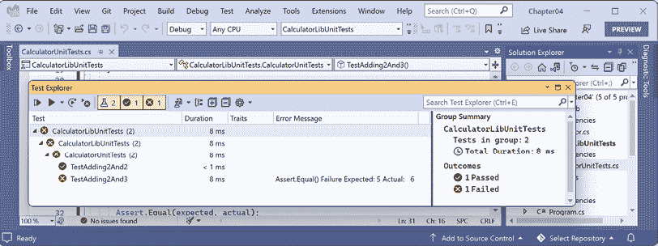

图 4.16：Visual Studio 测试资源管理器中的单元测试结果

### 使用 VS Code 运行单元测试

现在我们已经准备好运行单元测试并查看结果：

1.  如果你最近没有构建测试项目，那么构建 CalculatorLibUnitTests 项目以确保 C#开发工具包扩展中的新测试功能能够识别你编写的单元测试。

1.  在 VS Code 中，导航到**查看** | **测试**，注意**测试**窗口有一个迷你工具栏，带有**刷新测试**、**运行测试**、**调试测试**等按钮。

1.  在**测试**窗口中，展开**CalculatorLibUnitTests**项目以显示两个测试。

1.  将鼠标指针悬停在**CalculatorUnitTests**上，然后点击该类中定义的**运行测试**按钮（黑色三角形图标）。

1.  点击**测试结果**选项卡，注意结果指示运行了两个测试，一个测试通过，一个测试失败，如图*图 4.17*所示：

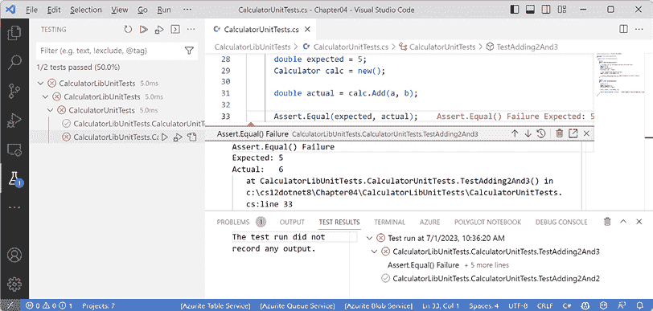

图 4.17：VS Code 的测试结果中的单元测试结果

### 修复错误

现在你可以修复错误：

1.  修复`Add`方法中的错误。

1.  再次运行单元测试以查看错误是否已修复并且两个测试都通过。

现在我们已经编写、调试、记录和单元测试了函数，让我们通过查看如何在函数中抛出和捕获异常来结束本章。

## 指定多个参数值

我们创建了两个单元测试方法：第一个用于测试 2 加 2，第二个用于测试 2 加 3。我们不必编写两个分别用`[Fact]`装饰的方法，我们可以编写一个用`[Theory]`装饰的方法，并通过`[InlineData]`传递不同的参数值，如下面的代码所示：

```cs
using CalculatorLib; // To use Calculator.
namespace CalculatorLibUnitTests;
public class CalculatorUnitTests
{
  [Theory]
  [InlineData(2, 2, 4)]
  [InlineData(2, 3, 5)]
  public void TestAdding(double a, double b, double expected)
  {
    // Arrange: Set up the unit under test.
    Calculator calc = new();
    // Act: Execute the function to test.
    double actual = calc.Add(a, b);
    // Assert: Make assertions to compare expected to actual results.
    Assert.Equal(expected, actual);
  }
} 
```

`[InlineData]`属性中传递的参数顺序必须与测试方法中参数的顺序匹配。

现在我们来看看当出现错误时如何抛出和捕获异常。

# 函数中的抛出和捕获异常

在**第三章**，“控制流程，转换类型和处理异常”中，你被介绍了异常以及如何使用`try-catch`语句来处理它们。但你应该只在有足够信息来缓解问题的情况下捕获和处理异常。如果没有，你应该允许异常通过调用堆栈向上传递到更高层次。

## 理解使用错误和执行错误

**使用错误**发生在程序员误用函数时，通常是通过传递无效的参数值。他们可以通过更改代码以传递有效值来避免这些错误。当一些程序员刚开始学习 C#和.NET 时，他们有时认为异常总是可以避免的，因为他们假设所有错误都是使用错误。在使用生产运行之前，应该修复所有使用错误。

**执行错误**发生在运行时发生的事情，无法通过编写“更好的”代码来修复。执行错误可以分为**程序错误**和**系统错误**。如果你尝试访问网络资源但网络断开，你需要能够通过记录异常来处理该系统错误，并且可能需要暂时退后并再次尝试。然而，某些系统错误，如内存不足，根本无法处理。如果你尝试打开一个不存在的文件，你可能能够捕获该错误并通过创建新文件来程序化地处理它。程序错误可以通过编写智能代码来程序化修复。系统错误通常无法通过程序化修复。

## 函数中常见的抛出异常

很少应该定义新的异常类型来指示使用错误。.NET 已经定义了许多你应该使用的异常。

当定义带有参数的自定义函数时，你的代码应该检查参数值，并在它们具有将阻止函数正常工作的值时抛出异常。

例如，如果一个函数的参数不应该为`null`，则抛出`ArgumentNullException`。对于其他问题，抛出`ArgumentException`、`NotSupportedException`或`InvalidOperationException`。

对于任何异常，包括一个描述问题的消息，以便任何需要阅读它的人（通常是面向类库和函数的开发者受众，或者如果是在 GUI 应用程序的最高级别，则是最终用户），如下面的代码所示：

```cs
static void Withdraw(string accountName, decimal amount)
{
  if (string.IsNullOrWhiteSpace(accountName))
  {
    throw new ArgumentException(paramName: nameof(accountName));
  }
  if (amount <= 0)
  {
    throw new ArgumentOutOfRangeException(paramName: nameof(amount),
      message: $"{nameof(amount)} cannot be negative or zero.");
  }
  // process parameters
} 
```

**良好实践**：如果一个函数无法成功执行其操作，你应该将其视为函数失败，并通过抛出异常来报告。

## 使用保护子句抛出异常

你可以使用异常本身的静态方法而不是使用`new`来实例化异常。当在函数实现中用于检查参数值时，它们被称为**保护子句**。其中一些是在.NET 6 中引入的，并在.NET 8 中添加了更多。

常见的保护子句在*表 4.2*中展示：

| **异常** | **保护子句方法** |
| --- | --- |
| `ArgumentException` | `ThrowIfNullOrEmpty`、`ThrowIfNullOrWhiteSpace` |
| `ArgumentNullException` | `ThrowIfNull` |
| `ArgumentOutOfRangeException` | `ThrowIfEqual`、`ThrowIfGreaterThan`、`ThrowIfGreaterThanOrEqual`、`ThrowIfLessThan`、`ThrowIfLessThanOrEqual`、`ThrowIfNegative`、`ThrowIfNegativeOrZero`、`ThrowIfNotEqual`、`ThrowIfZero` |

表 4.2：常见保护子句

我们可以简化前面的示例，而不是编写 `if` 语句然后抛出 `new` 异常，如下所示：

```cs
static void Withdraw(string accountName, decimal amount)
{
  ArgumentException.ThrowIfNullOrWhiteSpace(accountName,
    paramName: nameof(accountName));
  ArgumentOutOfRangeException.ThrowIfNegativeOrZero(amount,
    paramName: nameof(amount));
  // process parameters
} 
```

**更多信息**：为了了解 Microsoft 源代码使用其自己的守卫子句的频率，您可以阅读以下在线博客文章的以下部分：[`devblogs.microsoft.com/dotnet/performance-improvements-in-net-8/#exceptions`](https://devblogs.microsoft.com/dotnet/performance-improvements-in-net-8/#exceptions)。例如，`ThrowIfNull` 在 `dotnet/runtime` 的核心库中的 `src` 内部被调用了 4,795 次。

## 理解调用栈

.NET 控制台应用程序的入口点是 `Main` 方法（如果你明确定义了此类）或 `Program` 类中的 `<Main>$`（如果它是通过顶级程序功能为你创建的）。

`Main` 方法将调用其他方法，这些方法又调用其他方法，依此类推；这些方法可能位于当前项目或引用的项目和 NuGet 包中，如图 *4.18* 所示：

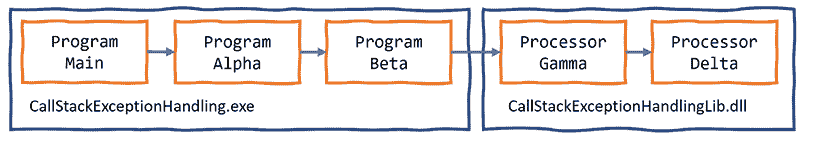

图 4.18：创建调用栈的方法链

让我们创建一个类似的方法链，以探索我们可以捕获和处理异常的地方：

1.  使用您喜欢的代码编辑器，将名为 `CallStackExceptionHandlingLib` 的新 **类库** / `classlib` 项目添加到 `Chapter04` 解决方案中。

1.  将 `Class1.cs` 文件重命名为 `Processor.cs`。

1.  在 `Processor.cs` 中，修改其内容，如下所示：

    ```cs
    using static System.Console;
    namespace CallStackExceptionHandlingLib;
    public class Processor
    {
      public static void Gamma() // public so it can be called from outside.
      {
        WriteLine("In Gamma");
        Delta();
      }
      private static void Delta() // private so it can only be called internally.
      {
        WriteLine("In Delta");
        File.OpenText("bad file path");
      }
    } 
    ```

1.  使用您喜欢的代码编辑器，将名为 `CallStackExceptionHandling` 的新 **控制台应用程序** / `console` 项目添加到 `Chapter04` 解决方案中。

1.  在 `CallStackExceptionHandling` 控制台应用程序项目中，添加对 `CallStackExceptionHandlingLib` 类库项目的引用，如下所示：

    ```cs
    <ItemGroup>
      <ProjectReference Include="..\CallStackExceptionHandlingLib\
    CallStackExceptionHandlingLib.csproj" />
    </ItemGroup> 
    ```

1.  构建名为 `CallStackExceptionHandling` 的控制台应用程序项目，以确保依赖项目被编译并复制到本地的 `bin` 文件夹。

1.  在 `Program.cs` 中，删除现有语句，添加定义两个方法的语句，并将它们以及类库中的方法进行链式调用，如下所示：

    ```cs
    using CallStackExceptionHandlingLib; // To use Processor.
    using static System.Console;
    WriteLine("In Main");
    Alpha();
    void Alpha()
    {
      WriteLine("In Alpha");
      Beta();
    }
    void Beta()
    {
      WriteLine("In Beta");
      Processor.Gamma();
    } 
    ```

1.  在没有附加调试器的情况下运行控制台应用程序，并注意结果，如下所示的部分输出：

    ```cs
    In Main
    In Alpha
    In Beta
    In Gamma
    In Delta
    Unhandled exception. System.IO.FileNotFoundException: Could not find file 'C:\cs13net9\Chapter04\CallStackExceptionHandling\bin\Debug\net9.0\bad file path'.
    File name: 'C:\cs13net9\Chapter04\CallStackExceptionHandling\bin\Debug\net9.0\bad file path'
       at Microsoft.Win32.SafeHandles.SafeFileHandle.CreateFile(String fullPath, FileMode mode, FileAccess access, FileShare share, FileOptions options)
       at Microsoft.Win32.SafeHandles.SafeFileHandle.Open(String fullPath, FileMode mode, FileAccess access, FileShare share, FileOptions options, Int64 preallocationSize)
       at System.IO.Strategies.OSFileStreamStrategy..ctor(String path, FileMode mode, FileAccess access, FileShare share, FileOptions options, Int64 preallocationSize)
       at System.IO.Strategies.FileStreamHelpers.ChooseStrategyCore(String path, FileMode mode, FileAccess access, FileShare share, FileOptions options, Int64 preallocationSize)
       at System.IO.StreamReader.ValidateArgsAndOpenPath(String path, Encoding encoding, Int32 bufferSize)
       at System.IO.File.OpenText(String path)
       at CallStackExceptionHandlingLib.Calculator.Delta() in C:\cs13net9\Chapter04\CallStackExceptionHandlingLib\Processor.cs:line 16
       at CallStackExceptionHandlingLib.Calculator.Gamma() in C:\cs13net9\Chapter04\CallStackExceptionHandlingLib\Processor.cs:line 10
       at Program.<<Main>$>g__Beta|0_1() in C:\cs13net9\Chapter04\CallStackExceptionHandling\Program.cs:line 16
       at Program.<<Main>$>g__Alpha|0_0() in C:\cs13net9\Chapter04\CallStackExceptionHandling\Program.cs:line 10
       at Program.<Main>$(String[] args) in C:\cs13net9\Chapter04\CallStackExceptionHandling\Program.cs:line 5 
    ```

注意调用栈是倒置的。从底部开始，你看到：

+   第一次调用是自动生成的 `Program` 类中的 `<Main>$` 入口点函数。这是将参数作为 `String` 数组传递的地方。

+   第二次调用是 `<<Main>$>g__Alpha|0_0` 函数。（当 C# 编译器将其添加为局部函数时，会将其重命名为 `Alpha`。）

+   第三次调用是 `Beta` 函数。

+   第四次调用是 `Gamma` 函数。

+   第五次调用是到 `Delta` 函数。此函数尝试通过传递一个错误的文件路径来打开文件。这导致抛出异常。任何带有 `try-catch` 语句的函数都可以捕获此异常。如果它没有捕获，异常将自动向上传递到调用堆栈，直到达到顶部，此时.NET 将输出异常（以及此调用堆栈的详细信息）。

**良好实践**：除非你需要逐步通过代码来调试它，否则你应该始终在没有附加调试器的情况下运行你的代码。在这种情况下，特别重要的是不要附加调试器，因为如果你这样做，它将捕获异常并在 GUI 对话框中显示它，而不是像书中所示那样输出它。

## 在哪里捕获异常

程序员可以决定他们是否希望在失败点附近或调用堆栈更高处捕获异常。这允许你的代码简化并标准化。你可能知道调用一个函数可能会抛出一个或多个类型的异常，但你不需要在当前调用堆栈点处理它们。

## 重新抛出异常

有时，你可能想要捕获一个异常，记录它，然后重新抛出它。例如，如果你正在编写一个将被应用程序调用的低级类库，你的代码可能没有足够的信息以编程方式以智能的方式修复错误，但调用应用程序可能拥有更多信息并能做到这一点。你的代码应该记录错误，以防调用应用程序没有记录，然后将其重新抛出到调用堆栈，以防调用应用程序选择更好地处理它。

在 `catch` 块内部重新抛出异常有三种方法，如下所示列表所示：

+   要以原始调用堆栈抛出捕获的异常，请调用 `throw`。

+   要将捕获的异常作为如果它在调用堆栈的当前级别抛出一样抛出，请使用捕获的异常调用 `throw`，例如，`throw ex`。这通常是一种不好的做法，因为你已经失去了可能对调试有用的信息，但在你想要故意删除包含敏感数据的信息时，这可能是有用的。

+   要将捕获的异常包装在另一个异常中，该异常可以包含更多可能帮助调用者理解问题的信息，请抛出一个新的异常，并将捕获的异常作为 `innerException` 参数传递。

如果我们在调用 `Gamma` 函数时发生错误，那么我们可以捕获异常并执行以下代码中所示的三种重新抛出异常的技术之一：

这段代码只是为了说明。你永远不会在同一个 `catch` 块中使用所有三种技术！

```cs
try
{
  Gamma();
}
catch (IOException ex)
{
  LogException(ex);
  // Throw the caught exception as if it happened here
  // this will lose the original call stack.
  throw ex;
  // Rethrow the caught exception and retain its original call stack.
  throw;
  // Throw a new exception with the caught exception nested within it.
  throw new InvalidOperationException(
    message: "Calculation had invalid values. See inner exception for why.",
    innerException: ex);
} 
```

让我们通过我们的调用堆栈示例来看看这个动作：

1.  在 `CallStackExceptionHandling` 项目的 `Program.cs` 文件中，在 `Beta` 函数中，在调用 `Gamma` 函数周围添加一个 `try-catch` 语句，如下所示，代码中已突出显示：

    ```cs
    void Beta()
    {
      WriteLine("In Beta");
      **try**
     **{**
     **Processor.Gamma();**
     **}**
    **catch** **(Exception ex)**
     **{**
     **WriteLine(****$"Caught this:** **{ex.Message}****"****);**
    **throw** **ex;**
     **}**
    } 
    ```

注意你的代码编辑器将在`throw ex`下显示一个波浪线来警告你，你将丢失调用堆栈信息，如代码分析器消息“重新抛出捕获的异常会更改堆栈信息”中所述；更多详细信息可以在以下链接中找到：[`learn.microsoft.com/en-us/dotnet/fundamentals/code-analysis/quality-rules/ca2200`](https://learn.microsoft.com/en-us/dotnet/fundamentals/code-analysis/quality-rules/ca2200)。

1.  运行控制台应用程序并注意输出排除了一些调用堆栈的详细信息，如下面的输出所示：

    ```cs
    Caught this: Could not find file 'C:\cs13net9\Chapter04\CallStackExceptionHandling\bin\Debug\net9.0\bad file path'.
    Unhandled exception. System.IO.FileNotFoundException: Could not find file 'C:\cs13net9\Chapter04\CallStackExceptionHandling\bin\Debug\net9.0\bad file path'.
    File name: 'C:\cs13net9\Chapter04\CallStackExceptionHandling\bin\Debug\net9.0\bad file path'
       at Program.<<Main>$>g__Beta|0_1() in C:\cs13net9\Chapter04\CallStackExceptionHandling\Program.cs:line 23
       at Program.<<Main>$>g__Alpha|0_0() in C:\cs13net9\Chapter04\CallStackExceptionHandling\Program.cs:line 10
       at Program.<Main>$(String[] args) in C:\cs13net9\Chapter04\CallStackExceptionHandling\Program.cs:line 5 
    ```

1.  通过将`throw ex;`语句替换为`throw;`来移除`ex`。

1.  运行控制台应用程序并注意输出包括调用堆栈的所有详细信息。

## 实现测试执行者和尝试模式

**测试执行者模式**可以避免一些抛出的异常（但并不能完全消除）。这种模式使用一对函数：一个用于执行测试，另一个用于执行如果测试未通过就会失败的操作。

.NET 本身实现了这个模式。例如，在通过调用`Add`方法向集合中添加项之前，你可以测试它是否只读，这会导致`Add`失败并因此抛出异常。

例如，在从银行账户取款之前，你可能需要测试账户是否没有透支，如下面的代码所示：

```cs
if (!bankAccount.IsOverdrawn())
{
  bankAccount.Withdraw(amount);
} 
```

测试执行者模式可能会增加性能开销，因此你也可以实现**尝试模式**，实际上，这种模式将测试和执行部分合并为一个单独的函数，就像我们在`TryParse`中看到的那样。

测试执行者模式的一个问题是当你使用多个线程时。在这种情况下，一个线程调用测试函数，并返回一个表示可以继续执行的状态值。但然后另一个线程执行，改变了状态。然后原始线程继续执行，假设一切正常，但实际上并不正常。这被称为*竞争条件*。这个话题过于复杂，本书中不会涵盖如何处理它。

**良好实践**：优先使用尝试模式而不是测试执行者模式。

如果你实现了自己的尝试模式函数并且它失败了，请记住将`out`参数设置为该类型的默认值，然后返回`false`，如下面的代码所示：

```cs
static bool TryParse(string? input, out Person value)
{
  if (someFailure)
  {
    value = default(Person);
    return false;
  }
  // Successfully parsed the string into a Person.
  value = new Person() { ... };
  return true;
} 
```

**更多信息**：现在你已经了解了异常的基本知识，你可以通过阅读以下链接中的官方文档来了解更多细节：[`learn.microsoft.com/en-us/dotnet/standard/exceptions/`](https://learn.microsoft.com/en-us/dotnet/standard/exceptions/)。

# 练习和探索

通过回答一些问题、进行一些实际操作练习，并深入探索本章涵盖的主题来测试你的知识和理解。

## 练习 4.1 – 在线材料

在线材料可以是为我这本书写的额外内容，也可以是引用由微软或第三方创建的内容。

### 开发和运行时记录

你应该在应用程序中添加代码来记录正在发生的事情，尤其是在异常发生时，这样你就可以查看日志并使用它们来追踪问题并解决问题。在一个在线部分，你将学习如何实现基本的记录；这可以在以下链接中找到：

[`github.com/markjprice/cs13net9/blob/main/docs/ch04-logging.md`](https://github.com/markjprice/cs13net9/blob/main/docs/ch04-logging.md)

## 练习 4.2 – 练习题

练习题深入探讨了本章的主题。

### 编写带有调试和单元测试的函数

质因数是几个最小的质数的组合，当它们相乘时会产生原始数字。考虑以下示例：

+   4 的质因数是 2 x 2

+   7 的质因数是 7

+   30 的质因数是 5 x 3 x 2

+   40 的质因数是 5 x 2 x 2 x 2

+   50 的质因数是 5 x 5 x 2

创建三个项目：

+   一个名为 `Exercise_PrimeFactorsLib` 的类库，其中包含一个静态类和一个名为 `PrimeFactors` 的静态方法，该方法接受一个 `int` 类型的参数，并返回一个显示其质因数的 `string`。

+   一个名为 `Exercise_PrimeFactorsTests` 的单元测试项目，包含一些合适的单元测试

+   一个名为 `Exercise_PrimeFactorsApp` 的控制台应用程序来使用它

为了保持简单，你可以假设输入的最大数字将是 1,000。

使用调试工具和编写单元测试来确保你的函数能够正确处理多个输入并返回正确的输出。

## 练习 4.3 – 测试你的知识

回答以下问题。如果你卡住了，可以尝试在谷歌上搜索答案，如果需要的话，同时记住，如果你完全卡住了，答案可以在 *附录* 中找到：

1.  C# 关键字 `void` 的含义是什么？

1.  指令式编程和函数式编程风格之间有哪些不同之处？

1.  在 VS Code 或 Visual Studio 中，按下 *F5*、*Ctrl* 或 *Cmd* + *F5*、*Shift* + *F5* 和 *Ctrl* 或 *Cmd* + *Shift* + *F5* 有什么区别？

1.  `Trace.WriteLine` 方法将输出写入到何处？

1.  有哪五个跟踪级别？

1.  `Debug` 类和 `Trace` 类之间的区别是什么？

1.  当编写单元测试时，三个“A”指的是什么？

1.  当使用 xUnit 编写单元测试时，你必须用哪个属性来装饰测试方法？

1.  执行 xUnit 测试的 `dotnet` 命令是什么？

1.  要重新抛出名为 `ex` 的捕获异常而不丢失堆栈跟踪，你应该使用哪个语句？

## 练习 4.4 – 探索主题

使用以下页面上的链接了解本章涵盖的主题的更多信息：

[`github.com/markjprice/cs13net9/blob/main/docs/book-links.md#chapter-4---writing-debugging-and-testing-functions`](https://github.com/markjprice/cs13net9/blob/main/docs/book-links.md#chapter-4---writing-debugging-and-testing-functions)

# 概述

在本章中，你学习了：

+   如何使用输入参数和返回值编写可重用函数，无论是命令式还是函数式风格

+   如何使用 Visual Studio 和 VS Code 的调试和诊断功能，如日志和单元测试，来识别和修复其中的任何错误

+   如何在函数中抛出和捕获异常，并理解调用栈

在下一章中，您将学习如何使用面向对象编程技术构建自己的类型。

# 在 Discord 上了解更多信息

要加入这本书的 Discord 社区——在那里您可以分享反馈，向作者提问，并了解新版本——请扫描下面的二维码：

[`packt.link/csharp13dotnet9`](https://packt.link/csharp13dotnet9)


# 留下您的评价！

感谢您从 Packt Publishing 购买这本书——我们希望您喜欢它！您的反馈对我们来说是无价的，它帮助我们改进和成长。一旦您阅读完毕，请花一点时间在亚马逊上留下评价；这只需一分钟，但对像您这样的读者来说意义重大。

扫描二维码或访问链接，免费获取您选择的电子书。

[`packt.link/NzOWQ`](https://packt.link/NzOWQ)


