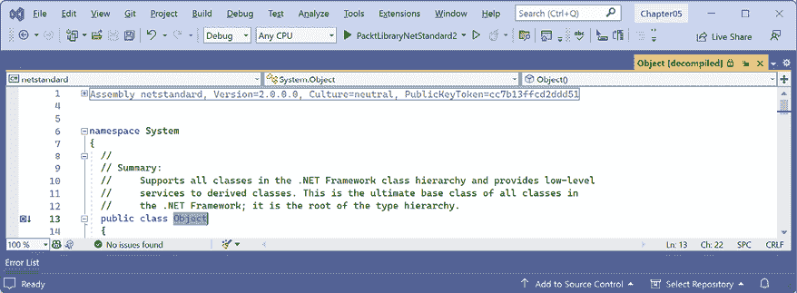
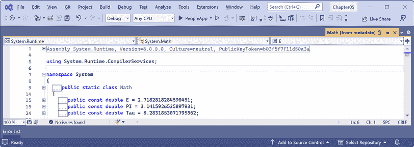
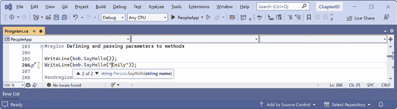
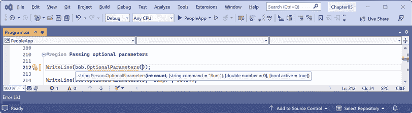

# 使用面向对象编程创建自己的类型

本章是关于使用**面向对象编程**（**OOP**）创建自己的类型。你将了解一个*类型*可以拥有的所有不同成员类别，包括用于存储数据的字段和执行动作的方法。你将使用 OOP 概念，如聚合和封装。你还将了解语言特性，如元组语法支持、`out`变量、推断的元组名称和默认字面量。最后，你将学习模式匹配和定义记录，以使变量的相等性和不可变性更容易实现。

本章将涵盖以下主题：

+   讨论面向对象编程

+   构建类库

+   在字段中存储数据

+   使用方法和元组进行操作

+   使用属性和索引器控制访问

+   使用对象进行模式匹配

+   使用记录类型

# 讨论面向对象编程

世界上一个对象是一个东西，比如汽车或人，而在编程中，一个对象通常代表现实世界中的某个东西，比如产品或银行账户，但它也可以是更抽象的东西。

在 C#中，我们使用 C#关键字`class`、`record`和`struct`来定义对象的类型。你将在*第六章*，*实现接口和继承类*中学习`struct`类型。你可以将类型视为对象的蓝图或模板。

这里简要描述了 OOP 的概念：

+   **封装**是指与对象相关的数据和动作的组合。例如，`BankAccount`（银行账户）类型可能包含数据，如`Balance`（余额）和`AccountName`（账户名称），以及动作，如`Deposit`（存款）和`Withdraw`（取款）。在封装时，你通常想要控制可以访问那些动作和数据的内容，例如，限制从外部访问或修改对象内部状态的方式。

+   **组合**是指对象由什么组成。例如，`Car`（汽车）由不同的部分组成，如四个`Wheel`（轮子）对象、几个`Seat`（座位）对象和一个`Engine`（引擎）。

+   **聚合**是指可以与对象结合的内容。例如，`Person`（人）不是`Car`（汽车）对象的一部分，但它们可以坐在司机的`Seat`（座位）上，然后成为汽车的`Driver`（驾驶员）——两个独立的对象聚合在一起形成一个新的组件。

+   **继承**是通过让**子类**从**基类**或**超类**派生来重用代码。基类中的所有功能都被继承，并在**派生类**中可用。例如，基类或超`Exception`（异常）类有一些成员在所有异常中具有相同的实现，而子类或派生`SqlException`（SQL 异常）类继承了这些成员，并具有仅在 SQL 数据库异常发生时相关的额外成员，例如数据库连接的属性。

+   **抽象**是指捕捉一个对象的核心思想，忽略细节或具体内容。C#有`abstract`关键字来正式化这个概念，但不要将抽象的概念与`abstract`关键字的使用混淆，因为抽象不仅仅是这个。抽象的概念也可以通过接口实现。如果一个类没有明确地声明为**抽象**，那么它可以被描述为**具体**的。基类或超类通常是抽象的；例如，超类`Stream`是抽象的，它的子类，如`FileStream`和`MemoryStream`，是具体的。只有具体的类才能用来创建对象；抽象类只能用作其他类的基类，因为它们缺少一些实现。抽象是一个棘手的平衡。如果你使一个类更抽象，更多的类将能够从它继承，但与此同时，将会有更少的功能可以共享。抽象的一个现实世界例子是汽车制造商对**电动汽车**（**EVs**）采取的方法。他们创建了一个共同的“平台”（基本上就是电池和轮子），这是所有电动汽车所需内容的抽象，然后在此基础上构建不同的车辆，如汽车、卡车、面包车等等。这个平台本身不是一个完整的产品，就像一个抽象类。

+   **多态**是指允许派生类覆盖继承的动作以提供自定义行为。

    在接下来的两章中，有很多关于面向对象编程（OOP）的内容要介绍，其中一些部分是难以学习的。在*第六章*的结尾，*实现接口和继承类*，我编写了一个关于自定义类型类别及其功能的总结，并附有示例代码。这将帮助你回顾最重要的事实，并突出不同选择之间的差异，例如`abstract`类或`interface`，以及何时使用它们。

# 构建类库

**类库**程序集将类型组合成易于部署的单元（DLL 文件）。除了你学习了单元测试之外，你只创建了控制台应用程序来包含你的代码。为了使你编写的代码可以在多个项目中重用，你应该将其放入类库程序集中，就像微软所做的那样。

## 创建类库

第一个任务是创建一个可重用的.NET 类库：

1.  使用你喜欢的代码编辑器创建一个新项目，如下列所示：

    +   项目模板：**类库** / `classlib`

    +   项目文件和文件夹：`PacktLibraryNet2`

    +   解决方案文件和文件夹：`Chapter05`

1.  打开`PacktLibraryNet2.csproj`文件，并注意，默认情况下，由.NET 9 SDK 创建的类库针对.NET 9，因此只能被其他.NET 9 兼容的程序集引用，如下面的标记所示：

    ```cs
    <Project Sdk="Microsoft.NET.Sdk">
      <PropertyGroup>
        **<TargetFramework>net9****.0****</TargetFramework>**
        <ImplicitUsings>enable</ImplicitUsings>
        <Nullable>enable</Nullable>
      </PropertyGroup>
    </Project> 
    ```

1.  修改框架以针对 .NET Standard 2.0，添加一个条目以显式使用 C# 13 编译器，并静态导入所有 C# 文件中的 `System.Console` 类，如下面的标记所示：

    ```cs
    <Project Sdk="Microsoft.NET.Sdk">
      <PropertyGroup>
     **<!--.NET Standard** **2.0****class****library****can****be****used****by****:**
     **.****NET****Framework****,** **Xamarin****,** **modern** **.****NET****. -->**
     **<****TargetFramework****>****netstandard2.0****</****TargetFramework****>**
     **<!--****Compile****this****library****using****C****# 13** **so****we****can****use****most**
    **modern****compiler****features****. -->**
     **<****LangVersion****>13</****LangVersion****>**
        <Nullable>enable</Nullable>
        <ImplicitUsings>enable</ImplicitUsings>
      </PropertyGroup>
     **<****ItemGroup****>**
     **<****Using****Include****="****System.Console****"** **Static****="****true****" />**
     **</****ItemGroup****>**
    </Project> 
    ```

虽然我们可以使用 C# 13 编译器，但一些现代编译器功能需要现代 .NET 运行时。例如，我们不能在接口中使用默认实现（C# 8 中引入），因为它需要 .NET Standard 2.1。我们不能使用 `required` 关键字（C# 11 中引入），因为它需要 .NET 7 中引入的属性。但许多有用的现代编译器功能，如原始字面量字符串，将对我们可用。

1.  保存并关闭文件。

1.  删除名为 `Class1.cs` 的文件。

1.  编译项目以便其他项目以后可以引用它：

    +   在 Visual Studio 中，导航到 **构建** | **构建 PacktLibraryNet2**。

    +   在 VS Code 中，输入以下命令：`dotnet build`。

**良好实践**：为了使用最新的 C# 语言和 .NET 平台功能，将类型放在 .NET 9 类库中。为了支持旧版 .NET 平台，如 .NET Core、.NET Framework 和 Xamarin，将可能重用的类型放在 .NET Standard 2.0 类库中。默认情况下，针对 .NET Standard 2.0 使用 C# 7 编译器，但可以覆盖它，以便即使你受限于 .NET Standard 2.0 API，也能获得较新 SDK 和编译器的优势。

## 理解文件作用域命名空间

传统上，你定义像在命名空间中嵌套的类这样的类型，如下面的代码所示：

```cs
namespace Packt.Shared
{
  public class Person
  {
  }
} 
```

如果你在同一个代码文件中定义多个类型，那么它们可以位于不同的命名空间中，因为类型必须显式地位于每个命名空间的括号内。

如果你使用 C# 10 或更高版本，可以通过在命名空间声明末尾添加分号并删除花括号来简化你的代码，这样类型定义就不需要缩进，如下面的代码所示：

```cs
// All types in this file will be defined in this file-scoped namespace.
namespace Packt.Shared;
public class Person
{
} 
```

这被称为 **文件作用域命名空间** 声明。每个文件只能有一个文件作用域命名空间。这个特性对于空间有限的书籍作者特别有用。

**良好实践**：将你创建的每个类型放在其自己的代码文件中，或者至少将同一命名空间中的类型放在同一代码文件中，这样你就可以使用文件作用域命名空间声明。

## 在命名空间中定义类

下一个任务是定义一个将代表人的类：

1.  在 `PacktLibraryNet2` 项目中，添加一个名为 `Person.cs` 的新类文件。

1.  在 `Person.cs` 中，删除任何现有语句并将命名空间设置为 `Packt.Shared`，对于 `Person` 类，将访问修饰符设置为 `public`，如下面的代码所示：

    ```cs
    // All types in this file will be defined in this file-scoped namespace.
    namespace Packt.Shared;
    public class Person
    {
    } 
    ```

    **良好实践**：我们这样做是因为将您的类放在一个逻辑命名的命名空间中很重要。更好的命名空间名称应该是特定领域的，例如，对于与高级数字相关的类型，可以使用`System.Numerics`。在这种情况下，我们将创建的类型是`Person`、`BankAccount`和`WondersOfTheWorld`，它们没有典型的领域，因此我们将使用更通用的`Packt.Shared`。

## 理解类型访问修饰符

注意，C#关键字`public`在`class`之前使用。这个关键字是一个**访问修饰符**，它允许任何其他代码在类库外部访问这个类。

如果您没有明确应用`public`关键字，那么它只能在定义它的程序集内部访问。这是因为类的隐式访问修饰符是`internal`。我们需要这个类在程序集外部可访问，所以我们必须确保它是`public`。

如果您有嵌套类，即在一个类中定义的类，那么内部类可以具有`private`访问修饰符，这意味着它在其父类之外不可访问。

从.NET 7 开始引入，应用于类型的`file`访问修饰符意味着该类型只能在它的代码文件中使用。这只有在您在同一个代码文件中定义多个类时才有用，这很少是好的实践，但与源生成器一起使用。

**更多信息**：您可以在以下链接中了解更多关于`file`访问修饰符的信息：[`learn.microsoft.com/en-us/dotnet/csharp/language-reference/keywords/file`](https://learn.microsoft.com/en-us/dotnet/csharp/language-reference/keywords/file).

**良好实践**：对于类来说，最常见的访问修饰符是`public`和`internal`（如果未指定，则为类的默认访问修饰符）。始终明确指定类的访问修饰符，以便使其清晰。其他访问修饰符包括`private`和`file`，但它们很少使用。

## 理解成员

`Person`类型目前还没有封装任何成员。我们将在接下来的几页中创建一些。成员可以是字段、方法或两者的特殊版本。您可以在以下内容中找到它们的描述：

+   **字段**用于存储数据。您可以将字段视为属于类型的变量。还有三个专门的字段类别，如下所示：

    +   **常量**：数据永远不会改变。编译器将数据字面量地复制到任何读取它的代码中。例如，`byte.MaxValue`始终是`255`。常量必须设置为字面量值。字面量值只能是一个由`""`包围的`string`，一个由单引号包围的`char`，一个布尔值如`true`或`false`，或一个数字如`3`、`3L`、`3.0`、`3.0F`或`3.0M`。不支持非字面量值，因此您不能有常量日期/时间值。

    +   **只读**：在类实例化后，数据不能更改，但在实例化时可以从外部源计算或加载数据。例如，`String.Empty`是`""`，`Guid.Empty`是一个**GUID**（**全局唯一标识符**）所有位都是零，`TimeSpan.Zero`是零时间间隔，`DateTime.MinValue`是格里高利历中的`00:00:00.0000000 UTC，0001 年 1 月 1 日`，而`Path.DirectorySeparatorChar`在 Windows 上是`\`。

    `DateTime.UnixEpoch`在格里高利历中是`00:00:00.0000000 UTC，1970 年 1 月 1 日`，但这个字段是在.NET Standard 2.0 之后引入的，所以你无法在当前的类库中尝试它。

    +   **事件**：当发生某些事情时，数据引用一个或多个你想要执行的方法，例如点击按钮或响应其他代码的请求。事件将在*第六章*，*实现接口和继承类*中介绍。例如，`Console.CancelKeyPress`会在控制台应用程序中按下*Ctrl* + *C*或*Ctrl* + *Break*时发生。

+   **方法**用于执行语句。当你学习*第四章*，*编写、调试和测试函数*时，你看到了一些例子。还有四种特殊的方法类别：

    +   **构造函数**：当你使用`new`关键字为实例化类分配内存时执行语句。例如，要实例化 2023 年圣诞节，你可以编写以下代码：`new DateTime(2023, 12, 25)`。

    +   **属性**：当你获取或设置数据时执行语句。数据通常存储在字段中，但也可以在外部存储或在运行时计算。除非需要暴露字段的内存地址，否则属性是封装字段的首选方式；例如，`Console.ForegroundColor`用于设置控制台应用程序中文本的颜色。

    +   **索引器**：当你使用“数组”语法`[]`获取或设置数据时执行语句。例如，使用`name[0]`获取`name`变量中的第一个字符，它是一个`string`。

    +   **运算符**：当你对你的类型操作数应用运算符（如`+`和`/`）时执行语句。例如，使用`a + b`将两个变量相加。

## 导入命名空间以使用类型

在本节中，我们将创建`Person`类的实例。

在我们实例化一个类之前，我们需要从另一个项目中引用包含它的程序集。我们将在控制台应用程序中使用这个类：

1.  使用你喜欢的代码编辑器将一个新的**控制台应用程序**/ `console`命名为`PeopleApp`添加到`Chapter05`解决方案中。确保你*添加*新的项目到现有的`Chapter05`解决方案中，因为你即将从控制台应用程序项目引用现有的类库项目，所以两个项目必须在同一个解决方案中。

1.  如果你使用 Visual Studio：

    1.  配置解决方案的启动项目为当前选择。

    1.  在 **解决方案资源管理器** 中，选择 `PeopleApp` 项目，导航到 **项目** | **添加项目引用…**，勾选复选框以选择 `PacktLibraryNet2` 项目，然后单击 **确定**。

    1.  在 `PeopleApp.csproj` 中添加一个条目以静态导入 `System.Console` 类，如下所示标记：

        ```cs
        <ItemGroup>
        <Using Include="System.Console" Static="true" />
        </ItemGroup> 
        ```

    1.  导航到 **构建** | **构建 PeopleApp**。

1.  如果你使用 VS Code：

    1.  编辑 `PeopleApp.csproj` 以添加对 `PacktLibraryNet2` 的项目引用，并添加一个条目以静态导入 `System.Console` 类，如下所示标记：

        ```cs
        <Project Sdk="Microsoft.NET.Sdk">
          <PropertyGroup>
            <OutputType>Exe</OutputType>
            <TargetFramework>net9.0</TargetFramework>
            <Nullable>enable</Nullable>
            <ImplicitUsings>enable</ImplicitUsings>
          </PropertyGroup>
        **<****ItemGroup****>**
        **<****ProjectReference****Include****=**
        **"../PacktLibraryNet2/PacktLibraryNet2.csproj"** **/>**
        **</****ItemGroup****>**
        **<****ItemGroup****>**
        **<****Using****Include****=****"System.Console"****Static****=****"true"** **/>**
        **</****ItemGroup****>**
        </Project> 
        ```

    1.  在终端中，编译 `PeopleApp` 项目及其依赖项 `PacktLibraryNet2` 项目，如下所示命令：

        ```cs
        dotnet build 
        ```

1.  在 `PeopleApp` 项目中添加一个名为 `Program.Helpers.cs` 的新类文件。

1.  在 `Program.Helpers.cs` 中删除任何现有语句，并定义一个 `partial Program` 类，其中包含一个配置控制台以启用特殊符号（如欧元货币）和控制当前文化的方法，如下所示代码：

    ```cs
    using System.Globalization; // To use CultureInfo.
    partial class Program
    {
      private static void ConfigureConsole(
        string culture = "en-US",
        bool useComputerCulture = false,
        bool showCulture = true)
      {
        OutputEncoding = System.Text.Encoding.UTF8;
        if (!useComputerCulture)
        {
          CultureInfo.CurrentCulture = CultureInfo.GetCultureInfo(culture);
        }
        if (showCulture)
        {
          WriteLine($"Current culture: {CultureInfo.CurrentCulture.DisplayName}.");
        }
      }
    } 
    ```

到本章结束时，你将了解前面提到的方法如何使用 C# 的特性，如部分类、可选参数等。如果你想了解更多关于与语言和文化以及日期、时间和时区工作的内容，那么在我的配套书籍 *Apps and Services with .NET 8* 中有一个关于全球化和本地化的章节。

## 实例化一个类

现在，我们已经准备好编写语句来实例化 `Person` 类：

1.  在 `PeopleApp` 项目中，在 `Program.cs` 文件中删除现有语句，然后添加语句导入我们的 `Person` 类的命名空间，然后不带任何参数调用 `ConfigureConsole` 方法，以便将其设置为美国英语当前文化，使所有读者都能看到相同的输出，如下所示代码：

    ```cs
    using Packt.Shared; // To use Person.
    ConfigureConsole(); // Sets current culture to US English.
    // Alternatives:
    // ConfigureConsole(useComputerCulture: true); // Use your culture.
    // ConfigureConsole(culture: "fr-FR"); // Use French culture. 
    ```

虽然我们可以全局导入 `Packt.Shared` 命名空间，但如果 `import` 语句位于文件顶部，那么阅读此代码的人将更清楚地知道我们从哪里导入使用的类型，并且 `PeopleApp` 项目将只有一个需要导入命名空间的 `Program.cs` 文件。

1.  在 `Program.cs` 中添加语句：

    +   创建 `Person` 类型的实例。

    +   使用实例自身的文本描述输出实例。

`new` 关键字为对象分配内存并初始化任何内部数据，如下所示代码：

```cs
// Person bob = new Person(); // C# 1 or later.
// var bob = new Person(); // C# 3 or later.
Person bob = new(); // C# 9 or later.
WriteLine(bob); // Implicit call to ToString().
// WriteLine(bob.ToString()); // Does the same thing. 
```

1.  运行 `PeopleApp` 项目并查看结果，如下所示输出：

    ```cs
    Current culture: English (United States).
    Packt.Shared.Person 
    ```

你可能会想知道，“为什么 `bob` 变量有一个名为 `ToString` 的方法？`Person` 类是空的！”别担心，我们很快就会找到答案！

## 继承自 System.Object

虽然我们的 `Person` 类没有明确选择继承自某个类型，但所有类型最终都直接或间接地继承自一个名为 `System.Object` 的特殊类型。`System.Object` 类型中 `ToString` 方法的实现会输出完整的命名空间和类型名称。

在原始的 `Person` 类中，我们可以明确地告诉编译器 `Person` 继承自 `System.Object` 类型，如下面的代码所示：

```cs
public class Person : System.Object 
```

当类 B 从类 A 继承时，我们说 A 是基类或超类，B 是派生类或子类。在这种情况下，`System.Object` 是基类或超类，`Person` 是派生类或子类。你也可以使用 C# 关键字 `object`。

让我们的类显式继承自 `object`，然后回顾所有对象都具有哪些成员：

1.  将你的 `Person` 类修改为显式继承自 `object`，如下面的代码所示：

    ```cs
    public class Person : object 
    ```

1.  在 `object` 关键字内单击并按 *F12*，或者右键单击 `object` 关键字并选择 **转到定义**。

你将看到微软定义的 `System.Object` 类型及其成员。这目前你不需要了解其细节，但请注意，该类位于 .NET Standard 2.0 类库程序集，如图 *5.1* 所示：



图 5.1：.NET Standard 2.0 中的 System.Object 类定义

如果你向下滚动类代码文件，请注意 `Object` 类有一个名为 `ToString` 的方法。

**良好实践**：假设其他程序员知道，如果没有指定继承，则类将继承自 `System.Object`。

## 避免使用 using 别名与命名空间冲突

我们需要了解更多关于命名空间及其类型的知识。可能存在两个包含相同类型名称的命名空间，导入这两个命名空间会导致歧义。例如，`JsonOptions` 存在于多个微软定义的命名空间中。如果你使用错误的一个来配置 JSON 序列化，那么它将被忽略，你可能会困惑为什么会出现这种情况！

让我们回顾一个虚构的例子：

```cs
// In the file, France.Paris.cs
namespace France
{
  public class Paris
  {
  }
}
// In the file, Texas.Paris.cs
namespace Texas
{
  public class Paris
  {
  }
}
// In the file, Program.cs
using France;
using Texas;
Paris p = new(); 
```

如果我们构建这个项目，编译器会报以下错误：

```cs
Error CS0104: 'Paris' is an ambiguous reference between 'France.Paris' and 'Texas.Paris' 
```

我们可以为其中一个命名空间定义一个别名以区分它，如下面的代码所示：

```cs
using France; // To use Paris.
using Tx = Texas; // Tx becomes alias for the namespace, and it is not imported.
Paris p1 = new(); // Creates an instance of France.Paris.
Tx.Paris p2 = new(); // Creates an instance of Texas.Paris. 
```

## 使用 using 别名重命名类型

你可能还想使用别名的另一种情况是，如果你想重命名一个类型。例如，如果你在 `System` 命名空间中大量使用 `Environment` 类，你可以使用别名将其重命名以使其更短，如下面的代码所示：

```cs
using Env = System.Environment;
WriteLine(Env.OSVersion);
WriteLine(Env.MachineName);
WriteLine(Env.CurrentDirectory); 
```

从 C# 12 开始，你可以对任何类型进行别名。这意味着你可以重命名现有的类型，或者给未命名的类型（如元组）命名，就像你将在本章后面看到的那样。

你可以在以下链接中学习如何使用别名任何类型重构你的代码：[`devblogs.microsoft.com/dotnet/refactor-your-code-using-alias-any-type/`](https://devblogs.microsoft.com/dotnet/refactor-your-code-using-alias-any-type/)。

# 在字段中存储数据

在本节中，我们将定义类中的一系列字段来存储有关个人的信息。

## 定义字段

假设我们已经决定一个人由姓名和出生日期组成。我们将这两个值封装在一个人中，并且这些值将对外可见：

+   在 `Person` 类内部，编写语句声明两个公共字段以存储一个人的姓名和他们出生的日期，如下面的代码所示：

    ```cs
    public class Person : object
    {
    **#****region** **Fields: Data or state for this person.**
    **public****string****? Name;** **// ? means it can be null.**
    **public** **DateTimeOffset Born;**
    **#****endregion**
    } 
    ```

对于 `Born` 字段的数据类型，我们有多种选择。.NET 6 引入了 `DateOnly` 类型。这将仅存储日期而没有时间值。`DateTime` 存储出生人的日期和时间，但它在本地时间和 **协调世界时**（**UTC**）之间有所不同。最佳选择是 `DateTimeOffset`，它存储日期、时间和从 **UTC** 的偏移量，这与时区相关。选择取决于您需要存储多少细节。

## 字段类型

自 C# 8 开始，编译器有了警告您如果引用类型（如 `string`）可能具有 `null` 值并因此可能抛出 `NullReferenceException` 的能力。自 .NET 6 开始，SDK 默认启用这些警告。您可以在 `string` 类型后缀一个问号 `?` 来表示您接受这一点，警告就会消失。您将在 *第六章*，*实现接口和继承类* 中了解更多关于可空性和如何处理它的信息。

您可以使用任何类型作为字段，包括数组集合，如列表和字典。如果您需要在一个命名字段中存储多个值，就会使用这些类型。在这个例子中，一个人只有一个姓名和一个出生日期和时间。

## 成员访问修饰符

封装的一部分是选择其他代码可以访问成员的程度。

注意，就像我们对类所做的那样，我们明确地应用了 `public` 关键字到这些字段上。如果我们没有这样做，那么它们将隐式地成为类的 `private`，这意味着它们只能在类内部访问。

有四个 **成员访问修饰符** 关键字，以及两种可以应用于类成员（如字段或方法）的访问修饰符关键字组合。成员访问修饰符应用于单个成员。它们与应用于整个类型的类型访问修饰符类似，但却是分开的。六种可能的组合在 *表 5.1* 中显示：

| **成员访问修饰符** | **描述** |
| --- | --- |
| `private` | 该成员仅可在类型内部访问。这是默认设置。 |
| `internal` | 该成员可在类型内部及其同一程序集的任何类型内部访问。 |
| `protected` | 该成员可在类型内部及其继承类型的任何类型内部访问。 |
| `public` | 该成员可在任何地方访问。 |
| `internal protected` | 该成员可在类型内部、同一程序集的任何类型以及继承自该类型的任何类型内部访问。等同于一个虚构的访问修饰符 `internal_or_protected`。 |
| `private protected` | 成员在类型内部及其继承自该类型的任何类型中是可访问的，并且在该类型所在的程序集内。等同于一个虚构的访问修饰符名称 `internal_and_protected`。这种组合仅在 C# 7.2 或更高版本中可用。 |

表 5.1：六个成员访问修饰符

**良好实践**：明确地将一个访问修饰符应用于所有类型成员，即使你想为成员使用隐式访问修饰符，即 `private`。此外，字段通常应该是 `private` 或 `protected`，然后创建 `public` 属性来获取或设置字段值。这是因为属性控制访问。你将在本章的后面这样做。

## 设置和输出字段值

现在，我们将在你的代码中使用这些字段：

1.  在 `Program.cs` 中，在实例化 `bob` 之后，添加语句设置他的姓名和出生日期和时间，然后格式化输出这些字段，如下所示：

    ```cs
    bob.Name = "Bob Smith";
    bob.Born = new DateTimeOffset(
      year: 1965, month: 12, day: 22,
      hour: 16, minute: 28, second: 0,
      offset: TimeSpan.FromHours(-5)); // US Eastern Standard Time.
    WriteLine(format: "{0} was born on {1:D}.", // Long date.
      arg0: bob.Name, arg1: bob.Born); 
    ```

`arg1` 的格式代码是标准日期和时间格式之一。`D` 表示长日期格式，而 `d` 则表示短日期格式。你可以在以下链接中了解更多有关标准日期和时间格式代码的信息：[`learn.microsoft.com/en-us/dotnet/standard/base-types/standard-date-and-time-format-strings`](https://learn.microsoft.com/en-us/dotnet/standard/base-types/standard-date-and-time-format-strings)。

1.  运行 `PeopleApp` 项目并查看结果，如下所示：

    ```cs
    Bob Smith was born on Wednesday, December 22, 1965. 
    ```

如果你将调用`ConfigureConsole`改为使用你本地的计算机文化或指定的文化，例如法国的法国文化（`"fr-FR"`），那么你的输出将看起来不同。

## 使用对象初始化器语法设置字段值

你还可以使用花括号简写**对象初始化器**语法来初始化字段，这是从 C# 3.0 开始引入的。让我们看看如何：

1.  在现有代码下方添加语句以创建另一个名为 Alice 的新人物。注意在写入控制台时，她的出生日期和时间的标准格式代码与以下代码所示的不同：

    ```cs
    Person alice = new()
    {
      Name = "Alice Jones",
      Born = new(1998, 3, 7, 16, 28, 0,
        // This is an optional offset from UTC time zone.
        TimeSpan.Zero)
    };
    WriteLine(format: "{0} was born on {1:d}.", // Short date.
      arg0: alice.Name, arg1: alice.Born); 
    ```

我们可以使用字符串插值来格式化输出，但对于长字符串，它将在多行中换行，这在打印的书中可能更难阅读。在本书的代码示例中，请记住 `{0}` 是 `arg0` 的占位符，依此类推。

1.  运行 `PeopleApp` 项目并查看结果，如下所示：

    ```cs
    Alice Jones was born on 3/7/1998. 
    ```

**良好实践**：使用命名参数传递参数，这样更清楚地知道这些值的含义，特别是对于像`DateTimeOffset`这样的类型，其中有一系列数字连续出现。

## 使用枚举类型存储值

有时，一个值需要是有限选项集中的一个。例如，有七个古代世界奇迹，一个人可能有一个最喜欢的。

在其他时候，一个值可能需要是有限选项集的组合。例如，一个人可能有他们想要参观的古代世界奇迹的愿望清单。我们可以通过定义`enum`类型来存储这些数据。

`enum`类型是一种非常高效的存储一个或多个选择的方法，因为它在内部使用整数值与`string`描述的查找表的组合。让我们看看一个例子：

1.  向`PacktLibraryNet2`项目添加一个名为`WondersOfTheAncientWorld.cs`的新文件。

1.  修改`WondersOfTheAncientWorld.cs`的内容，如下所示：

    ```cs
    namespace Packt.Shared;
    public enum WondersOfTheAncientWorld
    {
      GreatPyramidOfGiza,
      HangingGardensOfBabylon,
      StatueOfZeusAtOlympia,
      TempleOfArtemisAtEphesus,
      MausoleumAtHalicarnassus,
      ColossusOfRhodes,
      LighthouseOfAlexandria
    } 
    ```

1.  在`Person.cs`中，定义一个字段来存储一个人的最喜欢的古代世界奇迹，如下所示：

    ```cs
    public WondersOfTheAncientWorld FavoriteAncientWonder; 
    ```

1.  在`Program.cs`中，设置 Bob 最喜欢的古代世界奇迹并输出，如下所示：

    ```cs
    bob.FavoriteAncientWonder = WondersOfTheAncientWorld.StatueOfZeusAtOlympia;
    WriteLine(
      format: "{0}'s favorite wonder is {1}. Its integer is {2}.",
      arg0: bob.Name,
      arg1: bob.FavoriteAncientWonder,
      arg2: (int)bob.FavoriteAncientWonder); 
    ```

1.  运行`PeopleApp`项目并查看结果，如下所示：

    ```cs
    Bob Smith's favorite wonder is StatueOfZeusAtOlympia. Its integer is 2. 
    ```

`enum`值在内部以`int`的形式存储以提高效率。`int`值自动分配，从`0`开始，所以我们在`enum`中的第三个世界奇迹有一个值为`2`。你可以分配`enum`中没有列出的`int`值。它们将输出为`int`值而不是名称，因为找不到匹配项。

## 使用`enum`类型存储多个值

对于愿望清单，我们可以创建一个`enum`实例的数组或集合，集合作为字段将在本章后面介绍，但针对这种情况有一个更好的方法。我们可以使用`enum`标志将多个选择组合成一个值。让我们看看如何：

1.  通过使用`[Flags]`属性装饰`enum`，并显式为每个奇迹设置代表不同位列的`byte`值，修改`enum`，如下所示：

    ```cs
    namespace Packt.Shared;
    **[****Flags****]**
    public enum WondersOfTheAncientWorld **:** **byte**
    {
      None                     **=** **0b****_0000_0000,** **// i.e. 0**
      GreatPyramidOfGiza       **=** **0b****_0000_0001,** **// i.e. 1**
      HangingGardensOfBabylon  **=** **0b****_0000_0010,** **// i.e. 2**
      StatueOfZeusAtOlympia    **=** **0b****_0000_0100,** **// i.e. 4**
      TempleOfArtemisAtEphesus **=** **0b****_0000_1000,** **// i.e. 8**
      MausoleumAtHalicarnassus **=** **0b****_0001_0000,** **// i.e. 16**
      ColossusOfRhodes         **=** **0b****_0010_0000,** **// i.e. 32**
      LighthouseOfAlexandria   **=** **0b****_0100_0000** **// i.e. 64**
    } 
    ```

`enum`可以继承的整数类型有`Byte`、`SByte`、`Int16`、`Int32`、`Int64`、`UInt16`、`UInt32`和`UInt64`。新的整数类型`Int128`和`UInt128`不受支持。

我们为每个选择分配显式值，这些值在查看内存中存储的位时不会重叠。我们还应该使用`System.Flags`属性装饰`enum`类型，以便当返回值时，它可以自动与多个值匹配，作为以逗号分隔的`string`，而不是返回`int`值。

通常，`enum`类型在内部使用`int`变量，但由于我们不需要那么大的值，我们可以通过将其告知使用`byte`变量来减少内存需求，即每个值 1 字节而不是 4 字节。例如，如果你想要定义一个表示一周中每一天的`enum`，那么将只有七个值。

如果我们想表明我们的愿望清单包括了**巴比伦空中花园**和**哈利卡纳苏斯的陵墓**这些古代世界的奇迹，那么我们希望将`16`和`2`位设置为`1`。换句话说，我们将存储值`18`，如*表 5.2*所示：

| 64 | 32 | 16 | 8 | 4 | 2 | 1 |
| --- | --- | --- | --- | --- | --- | --- |
| 0 | 0 | 1 | 0 | 0 | 1 | 0 |

表 5.2：在枚举中用位存储 18

1.  在 `Person.cs` 中，保留现有的字段以存储单个最喜欢的古代世界奇迹，并添加以下语句到您的字段列表中，以存储多个古代世界奇迹：

    ```cs
    public WondersOfTheAncientWorld BucketList; 
    ```

1.  在 `Program.cs` 中，添加语句使用 `|` 运算符（位逻辑或）来组合枚举值。我们也可以使用将数字 `18` 强制转换为枚举类型的值来设置该值，如注释所示，但我们不应该这样做，因为这会使代码更难以理解，如下面的代码所示：

    ```cs
    bob.BucketList =
      WondersOfTheAncientWorld.HangingGardensOfBabylon
      | WondersOfTheAncientWorld.MausoleumAtHalicarnassus;
    // bob.BucketList = (WondersOfTheAncientWorld)18;
    WriteLine($"{bob.Name}'s bucket list is {bob.BucketList}."); 
    ```

1.  运行 `PeopleApp` 项目并查看以下输出结果：

    ```cs
    Bob Smith's bucket list is HangingGardensOfBabylon, MausoleumAtHalicarnassus. 
    ```

**良好实践**：使用枚举值来存储离散选项的组合。如果有最多八个选项，则从 `byte` 派生枚举类型；如果有最多 16 个选项，则从 `ushort` 派生；如果有最多 32 个选项，则从 `uint` 派生；如果有最多 64 个选项，则从 `ulong` 派生。

现在我们已经用 `[Flags]` 属性装饰了 `enum`，值的组合可以存储在一个单独的变量或字段中。现在，当应该只存储一个值时，程序员也可以在 `FavoriteAncientWonder` 中存储值的组合。为了强制执行这一点，我们应该将字段转换为属性，这样我们就可以控制其他程序员如何获取和设置值。您将在本章后面看到如何做到这一点。

## 改变枚举基类型以提高性能

前一节是关于使用枚举类型存储多个值。这是关于带有 `[Flags]` 属性的枚举类型，它们使用位操作有效地存储这些多个值。在代码示例中，我们定义了一个用于古代世界七大奇迹的枚举，因此只需要七个可组合的值（以及 `0` 表示 `None`）。

前一节并不是关于将所有枚举类型派生为 `byte` 以使您的代码更快，因为这将是糟糕的建议。

在 2024 年 3 月 18 日，尼克·查帕斯（Nick Chapsas）发布了一个 YouTube 视频，标题为 *Turn All Your Enums Into Bytes Now! | Code Cop #014*，您可以通过以下链接观看：[`www.youtube.com/watch?v=1gWzE9SIGkQ`](https://www.youtube.com/watch?v=1gWzE9SIGkQ)。他批评了一些博客文章，这些文章建议将枚举类型的默认基整数类型从 `int` 改为 `byte` 以提高性能。

C#语言的原始设计者花费了努力来实现枚举类型可以从除了默认的 `int` 之外的其他整数类型派生的能力。例如，您可以通过使用正整数如 `byte` 或 `ushort` 来使用更少的字节，或者使用正整数如 `uint` 或 `ulong` 来使用相同或更多的字节。他们实现了这个特性，因为有时.NET 开发者将需要这种能力。

我认为让我的读者知道在必要时他们可以这样做是很重要的。微软的官方指南指出，“尽管你可以更改此基础类型，但在大多数情况下并不必要或推荐这样做。使用小于 `Int32` 的数据类型并不会带来显著的性能提升。”，正如你可以在以下链接中阅读的那样：[`learn.microsoft.com/en-us/dotnet/fundamentals/code-analysis/quality-rules/ca1028`](https://learn.microsoft.com/en-us/dotnet/fundamentals/code-analysis/quality-rules/ca1028)。

对于那些反对将任何 `enum` 从 `int` 更改为其他整数的开发者，编译器代码分析警告如上所述。如果启用，当将 `enum` 设置为除 `int` 之外的内容时，它将触发：“CA1028: `enum` 存储应该是 Int32。”此警告默认未启用，因为微软知道开发者可能有合法的理由需要使用它。

让我们看看一些现实生活中的例子，说明你为什么需要将 `enum` 从派生自 `int` 改为派生自其他整数类型：

+   你想增加整数的尺寸，以便在标志 `enum` 中存储超过 16 个选项。默认的 `int` 只允许 16 个选项：0, 1, 2, 4, 8, 16, 32, 64, 128, 256, 512, 1024, 2048, 4096, 8192, 和 16384。改为 `uint` 会将选择数量加倍到 32，而不会占用更多内存空间。改为 `ulong` 会提供 64 个选项。改为 `ushort` 会允许在半字节的相同 16 个选项。

+   你需要通过串行连接将数据作为二进制流传输到嵌入式设备，并且必须仔细遵循协议，或者你正在定义自己的串行消息协议，并且你希望减小数据包大小以充分利用可用带宽。

+   你有包含数百万条记录的 SQL 表，其中一些列是 `enum` 值。将这些列设置为 `tinyint`，并在 C# 实体类中匹配 `enum` : `byte` 属性，可以使索引通过变得更小并减少从磁盘读取的页面数来提高性能。一些开发者会处理 30 年或更老的系统，这些系统使用旋转金属磁盘。并不是每个人都部署到现代 64 位操作系统和现代硬件上。

+   你需要减小 `struct` 的大小，因为它将在资源受限的硬件上每秒创建 100,000 次，或者你有游戏代码设置为使用 `byte` 和 `short`，因为你有为游戏数据在连续数组中有数百万个它们。这样做可以获得相当大的性能提升，尤其是在缓存方面。

现在，让我们看看如何使用集合存储多个值。

## 使用集合存储多个值

现在，让我们添加一个字段来存储一个人的孩子。这是一个聚合的例子，因为孩子是相关于当前人的类的实例，但它们不是人本身的一部分。我们将使用可以存储任何类型有序集合的泛型 `List<T>` 集合类型。你将在 *第八章*，*使用常见的 .NET 类型* 中了解更多关于集合的内容。现在，只需按照以下步骤操作：

+   在 `Person.cs` 文件中，声明一个新的字段来存储代表此人的多个 `Person` 实例，如下面的代码所示：

    ```cs
    public List<Person> Children = new(); 
    ```

`List<Person>` 读作“`Person` 的列表”，例如，“名为 `Children` 的属性类型是 `Person` 实例的列表。”

在我们向集合中添加项目之前，必须确保集合被初始化为一个新的实例；否则，该字段将为 `null`，并在我们尝试使用其任何成员（如 `Add`）时抛出运行时异常。

## 理解泛型集合

`List<T>` 类型中的尖括号是 C# 中称为 **泛型** 的特性，该特性于 2005 年随 C# 2.0 引入。这是一个用于创建 **强类型** 集合的术语，即编译器知道可以存储在集合中的特定类型的对象。泛型可以提高代码的性能和正确性。

**强类型** 与 **静态类型** 有不同的含义。旧的 `System.Collection` 类型是静态类型，用于包含弱类型的 `System.Object` 项目。较新的 `System.Collection.Generic` 类型是静态类型，用于包含强类型的 `<T>` 实例。

具有讽刺意味的是，术语 *泛型* 意味着我们可以使用更具体的静态类型！

1.  在 `Program.cs` 中，添加语句为 `Bob` 添加三个孩子，然后显示他有多少孩子以及他们的名字，如下面的代码所示：

    ```cs
    // Works with all versions of C#.
    Person alfred = new Person();
    alfred.Name = "Alfred";
    bob.Children.Add(alfred);
    // Works with C# 3 and later.
    bob.Children.Add(new Person { Name = "Bella" });
    // Works with C# 9 and later.
    bob.Children.Add(new() { Name = "Zoe" });
    WriteLine($"{bob.Name} has {bob.Children.Count} children:");
    for (int childIndex = 0; childIndex < bob.Children.Count; childIndex++)
    {
      WriteLine($"> {bob.Children[childIndex].Name}");
    } 
    ```

1.  运行 `PeopleApp` 项目并查看结果，如下面的输出所示：

    ```cs
    Bob Smith has 3 children:
    > Alfred
    > Bella
    > Zoe 
    ```

我们也可以使用 `foreach` 语句遍历集合。作为一个可选挑战，将 `for` 语句改为使用 `foreach` 输出相同的信息。

## 使字段成为静态

我们迄今为止创建的字段都是 **实例成员**，这意味着每个创建的类的每个字段都有一个不同的值。`alice` 和 `bob` 变量有不同的 `Name` 值。

有时，你想要定义一个字段，该字段只有一个值，这个值在所有实例之间共享。

这些被称为 **静态成员**，因为字段不是唯一可以静态的成员。让我们以银行账户为例，看看使用 `static` 字段可以实现什么。`BankAccount` 的每个实例都将有自己的 `AccountName` 和 `Balance` 值，但所有实例将共享一个单一的 `InterestRate` 值。

让我们动手做：

1.  在 `PacktLibraryNet2` 项目中，添加一个名为 `BankAccount.cs` 的新类文件。

1.  修改类，使其具有三个字段——两个实例字段和一个静态字段——如下面的代码所示：

    ```cs
    namespace Packt.Shared;
    public class BankAccount
    {
      public string? AccountName; // Instance member. It could be null.
      public decimal Balance; // Instance member. Defaults to zero.
      public static decimal InterestRate; // Shared member. Defaults to zero.
    } 
    ```

1.  在 `Program.cs` 文件中，添加语句来设置共享利率，然后创建两个 `BankAccount` 类型的实例，如下面的代码所示：

    ```cs
    BankAccount.InterestRate = 0.012M; // Store a shared value in static field.
    BankAccount jonesAccount = new();
    jonesAccount.AccountName = "Mrs. Jones";
    jonesAccount.Balance = 2400;
    WriteLine(format: "{0} earned {1:C} interest.",
      arg0: jonesAccount.AccountName,
      arg1: jonesAccount.Balance * BankAccount.InterestRate);
    BankAccount gerrierAccount = new();
    gerrierAccount.AccountName = "Ms. Gerrier";
    gerrierAccount.Balance = 98;
    WriteLine(format: "{0} earned {1:C} interest.",
      arg0: gerrierAccount.AccountName,
      arg1: gerrierAccount.Balance * BankAccount.InterestRate); 
    ```

1.  运行 `PeopleApp` 项目并查看附加输出：

    ```cs
    Mrs. Jones earned $28.80 interest.
    Ms. Gerrier earned $1.18 interest. 
    ```

记住 `C` 是一个格式代码，它告诉 .NET 使用当前文化的货币格式来格式化十进制数字。

字段不是唯一可以静态的成员。构造函数、方法、属性和其他成员也可以是静态的。

静态方法不需要对象实例即可调用。例如，`Console.WriteLine` 不需要对象实例；方法直接从类名调用。静态方法在 *第六章，实现接口和继承类* 中介绍。

## 将字段设置为常量

如果一个字段的值永远不会改变，你可以使用 `const` 关键字并在编译时分配一个字面量值。任何更改该值的语句都会导致编译时错误。让我们看看一个简单的例子：

1.  在 `Person.cs` 文件中，添加一个表示人的物种的 `string` 常量，如下面的代码所示：

    ```cs
    // Constant fields: Values that are fixed at compilation.
    public const string Species = "Homo Sapiens"; 
    ```

1.  要获取常量字段的值，你必须写出类的名称，而不是类的实例名称。在 `Program.cs` 文件中，添加一个语句将鲍勃的名字和物种写入控制台，如下面的代码所示：

    ```cs
    // Constant fields are accessible via the type.
    WriteLine($"{bob.Name} is a {Person.Species}."); 
    ```

1.  运行 `PeopleApp` 项目并查看结果，如下面的输出所示：

    ```cs
    Bob Smith is a Homo Sapiens. 
    ```

Microsoft 类型中 `const` 字段的示例包括 `System.Int32.MaxValue` 和 `System.Math.PI`，因为这两个值永远不会改变，如 *图 5.2* 所示：



图 5.2：System.Math 类中常量的示例

**良好实践**：常量并不总是最佳选择，有两个重要原因：值必须在编译时已知，并且必须可以用字面量 `string`、`Boolean` 或数字值表示。对 `const` 字段的每个引用在编译时都会被替换为字面量值，因此，如果值在未来版本中更改，并且你没有重新编译引用它的任何程序集以获取新值，则将不会反映出来。

## 将字段设置为只读

对于不应更改的字段，通常更好的选择是将它们标记为只读：

1.  在 `Person.cs` 文件中，添加一个语句来声明一个实例只读字段以存储一个人的家乡星球，如下面的代码所示：

    ```cs
    // Read-only fields: Values that can be set at runtime.
    public readonly string HomePlanet = "Earth"; 
    ```

1.  在 `Program.cs` 文件中，添加一个语句将鲍勃的名字和家乡星球写入控制台，如下面的代码所示：

    ```cs
    // Read-only fields are accessible via the variable.
    WriteLine($"{bob.Name} was born on {bob.HomePlanet}."); 
    ```

1.  运行 `PeopleApp` 项目并查看结果，如下面的输出所示：

    ```cs
    Bob Smith was born on Earth. 
    ```

**良好实践**：与常量字段相比，使用只读字段有两个重要原因：值可以在运行时计算或加载，并且可以使用任何可执行语句表示。因此，只读字段可以使用构造函数或字段赋值来设置。对只读字段的每个引用都是一个活动引用，因此任何未来的更改都将被调用代码正确地反映出来。

你也可以声明`static` `readonly`字段，其值将在类型的所有实例之间共享。

## 在实例化时要求字段必须设置

C# 11 引入了`required`修饰符。如果你在字段或属性上使用它，编译器将确保你在实例化时将该字段或属性设置为值。它需要目标.NET 7 或更高版本，因此我们需要首先创建一个新的类库：

1.  在`Chapter05`解决方案中，添加一个名为`PacktLibraryModern`的新类库项目，目标为.NET 9。（`required`修饰符支持的最旧版本是.NET 7。）

1.  在`PacktLibraryModern`项目中，将`Class1.cs`重命名为`Book.cs`。

1.  修改代码文件内容，给类添加四个字段，其中两个设置为`required`，如下面的代码所示：

    ```cs
    namespace Packt.Shared;
    public class Book
    {
      // Needs .NET 7 or later as well as C# 11 or later.
      public required string? Isbn;
      public required string? Title;
      // Works with any version of .NET.
      public string? Author;
      public int PageCount;
    } 
    ```

注意所有`三个`字符串属性都是可空的。将属性或字段设置为`required`并不意味着它不能是`null`。它只是意味着它必须显式设置为`null`。

1.  在`PeopleApp`控制台应用程序项目中，添加对`PacktLibraryModern`类库项目的引用：

    +   如果你使用 Visual Studio，那么在**解决方案资源管理器**中，选择`PeopleApp`项目，导航到**项目** | **添加项目引用…**，勾选复选框以选择`PacktLibraryModern`项目，然后点击**确定**。

    +   如果你使用 VS Code，那么编辑`PeopleApp.csproj`以添加对`PacktLibraryModern`的引用，如下面的标记所示：

        ```cs
        <ItemGroup>
          <ProjectReference Include=
        "..\PacktLibraryNet2\PacktLibraryNet2.csproj" />
         **<ProjectReference Include=**
        **"..\PacktLibraryModern\PacktLibraryModern.csproj"** **/>**
        </ItemGroup> 
        ```

1.  构建项目`PeopleApp`。这将编译其引用的依赖项，并将类库`.dll`复制到本地`bin`文件夹的正确子目录中。

1.  在`PeopleApp`项目中的`Program.cs`中，尝试不设置`Isbn`和`Title`字段来实例化`Book`，如下面的代码所示：

    ```cs
    Book book = new(); 
    ```

1.  注意你将看到编译器错误，如下面的输出所示：

    ```cs
    C:\cs13net9\Chapter05\PeopleApp\Program.cs(137,13): error CS9035: Required member 'Book.Isbn' must be set in the object initializer or attribute constructor. [C:\cs13net9\Chapter05\PeopleApp\PeopleApp.csproj]
    C:\cs13net9\Chapter05\PeopleApp\Program.cs(137,13): error CS9035: Required member 'Book.Title' must be set in the object initializer or attribute constructor. [C:\cs13net9\Chapter05\PeopleApp\PeopleApp.csproj]
        0 Warning(s)
        2 Error(s) 
    ```

1.  在`Program.cs`中，修改语句以使用对象初始化语法设置两个必需的属性，如下面的代码所示：

    ```cs
    Book book = new()
    **{**
     **Isbn =** **"978-1803237800"****,**
     **Title =** **"C# 12 and .NET 8 - Modern Cross-Platform Development Fundamentals"**
    **}**; 
    ```

1.  注意现在这个语句可以无错误地编译。

1.  在`Program.cs`中，添加语句以输出有关书籍的信息，如下面的代码所示：

    ```cs
    WriteLine("{0}: {1} written by {2} has {3:N0} pages.",
      book.Isbn, book.Title, book.Author, book.PageCount); 
    ```

在我们运行项目并查看输出之前，让我们讨论一种初始化类型字段（或属性）的替代方法。

## 使用构造函数初始化字段

字段通常需要在运行时进行初始化。你可以在使用`new`关键字创建类的实例时调用的构造函数中这样做。构造函数在代码设置任何字段之前执行：

1.  在`Person.cs`中，在现有的只读`HomePlanet`字段之后添加语句以定义第二个只读字段，然后在构造函数中设置`Name`和`Instantiated`字段，如下面的代码所示：

    ```cs
    // Read-only fields: Values that can be set at runtime.
    public readonly string HomePlanet = "Earth";
    **public****readonly** **DateTime Instantiated;**
    #endregion
    **#****region** **Constructors: Called when using new to instantiate a type.**
    **public****Person****()**
    **{**
    **// Constructors can set default values for fields**
    **// including any read-only fields like Instantiated.**
     **Name =** **"Unknown"****;**
     **Instantiated = DateTime.Now;**
    **}**
    **#****endregion** 
    ```

1.  在`Program.cs`中，添加语句以实例化一个新的`Person`对象，然后输出其初始字段值，如下面的代码所示：

    ```cs
    Person blankPerson = new();
    WriteLine(format:
      "{0} of {1} was created at {2:hh:mm:ss} on a {2:dddd}.",
      arg0: blankPerson.Name,
      arg1: blankPerson.HomePlanet,
      arg2: blankPerson.Instantiated); 
    ```

1.  运行`PeopleApp`项目并查看关于书籍以及空白人物的代码结果，如下所示输出：

    ```cs
    978-1803237800: C# 12 and .NET 8 - Modern Cross-Platform Development Fundamentals written by  has 0 pages.
    Unknown of Earth was created at 11:58:12 on a Sunday 
    ```

## 定义多个构造函数

你可以在一个类型中拥有多个构造函数。这特别有用，可以鼓励开发者为字段设置初始值：

1.  在`Person.cs`中，添加定义第二个构造函数的语句，允许开发者为人的姓名和家园行星设置初始值，如下所示代码：

    ```cs
    public Person(string initialName, string homePlanet)
    {
      Name = initialName;
      HomePlanet = homePlanet;
      Instantiated = DateTime.Now;
    } 
    ```

1.  在`Program.cs`中，添加使用两个参数的构造函数创建另一个人的语句，如下所示代码：

    ```cs
    Person gunny = new(initialName: "Gunny", homePlanet: "Mars");
    WriteLine(format:
      "{0} of {1} was created at {2:hh:mm:ss} on a {2:dddd}.",
      arg0: gunny.Name,
      arg1: gunny.HomePlanet,
      arg2: gunny.Instantiated); 
    ```

1.  运行`PeopleApp`项目并查看结果：

    ```cs
    Gunny of Mars was created at 11:59:25 on a Sunday 
    ```

## 使用构造函数设置必需字段

现在，让我们回到具有`required`字段的`Book`类示例：

1.  在`PacktLibraryModern`项目中，在`Book.cs`中，添加定义一对构造函数的语句，一个支持对象初始化器语法，另一个用于设置两个必需属性，如下所示代码：

    ```cs
    public class Book
    {
    **// Constructor for use with object initializer syntax.**
    **public****Book****()** **{ }**
    **// Constructor with parameters to set required fields.**
    **public****Book****(****string****? isbn,** **string****? title****)**
     **{**
     **Isbn = isbn;**
     **Title = title;**
     **}** 
    ```

1.  在`Program.cs`中，注释掉使用对象初始化器语法实例化书籍的语句，添加一个使用构造函数实例化书籍的语句，然后设置书籍的非`required`属性，如下所示代码：

    ```cs
    **/***
    **// Instantiate a book using object initializer syntax.**
    Book book = new()
    {
      Isbn = "978-1803237800",
      Title = "C# 12 and .NET 8 - Modern Cross-Platform Development Fundamentals"
    };
    ***/**
    **Book book =** **new****(isbn:** **"978-1803237800"****, title:**
    **"C# 12 and .NET 8 - Modern Cross-Platform Development Fundamentals"****)**
    **{**
     **Author =** **"Mark J. Price"****,**
     **PageCount =** **821**
    **};** 
    ```

1.  注意，你将看到与之前相同的编译器错误，因为编译器无法自动判断调用构造函数是否会设置这两个`required`属性。

1.  在`PacktLibraryModern`项目中，在`Book.cs`中，导入命名空间以执行代码分析，然后使用属性装饰构造函数，告诉编译器它设置了所有必需属性和字段，如下所示代码：

    ```cs
    **using** **System.Diagnostics.CodeAnalysis;** **// To use [SetsRequiredMembers].**
    namespace Packt.Shared;
    public class Book
    {
      public Book() { } // For use with initialization syntax.
     **[****SetsRequiredMembers****]**
      public Book(string isbn, string title) 
    ```

1.  在`Program.cs`中，注意现在调用构造函数的语句可以无错误地编译。

1.  可选地，运行`PeopleApp`项目以确认其行为符合预期，如下所示输出：

    ```cs
    978-1803237800: C# 12 and .NET 8 - Modern Cross-Platform Development Fundamentals written by Mark J. Price has 821 pages. 
    ```

**更多信息**：你可以在以下链接中了解更多关于`required`字段以及如何使用构造函数设置它们的信息：[`learn.microsoft.com/en-us/dotnet/csharp/language-reference/keywords/required`](https://learn.microsoft.com/en-us/dotnet/csharp/language-reference/keywords/required)。

构造函数是方法的一种特殊类别。让我们更详细地看看方法。

# 与方法和元组一起工作

**方法**是类型的成员，执行一组语句。它们是属于类型的函数。

## 从方法返回值

方法可以返回单个值或无返回值：

+   执行某些操作但不返回值的函数通过在方法名称之前使用`void`类型来表示。

+   执行某些操作并返回值的函数通过在方法名称之前返回值的类型来表示。

例如，在下一个任务中，你将创建两个方法：

+   `WriteToConsole`：这将执行一个操作（将一些文本写入控制台），但方法将不返回任何内容，这由`void`关键字表示。

+   `GetOrigin`：这将返回一个由 `string` 关键字指示的文本值。

让我们编写代码：

1.  在 `Person.cs` 文件中，添加语句来定义我之前描述的两个方法，如下面的代码所示：

    ```cs
    #region Methods: Actions the type can perform.
    public void WriteToConsole()
    {
      WriteLine($"{Name} was born on a {Born:dddd}.");
    }
    public string GetOrigin()
    {
      return $"{Name} was born on {HomePlanet}.";
    }
    #endregion 
    ```

1.  在 `Program.cs` 文件中，添加语句来调用两个方法，如下面的代码所示：

    ```cs
    bob.WriteToConsole();
    WriteLine(bob.GetOrigin()); 
    ```

1.  运行 `PeopleApp` 项目并查看结果，如下面的输出所示：

    ```cs
    Bob Smith was born on a Wednesday.
    Bob Smith was born on Earth. 
    ```

## 定义和传递方法参数

方法可以通过传递参数来改变其行为。参数的定义有点像变量声明，但位于方法声明的括号内，就像你在本章前面看到的构造函数一样。让我们看看更多的例子：

1.  在 `Person.cs` 文件中，添加语句来定义两个方法，第一个不带参数，第二个带一个参数，如下面的代码所示：

    ```cs
    public string SayHello()
    {
      return $"{Name} says 'Hello!'";
    }
    public string SayHelloTo(string name)
    {
      return $"{Name} says 'Hello, {name}!'";
    } 
    ```

1.  在 `Program.cs` 文件中，添加语句来调用两个方法，并将返回值写入控制台，如下面的代码所示：

    ```cs
    WriteLine(bob.SayHello());
    WriteLine(bob.SayHelloTo("Emily")); 
    ```

1.  运行 `PeopleApp` 项目并查看结果：

    ```cs
    Bob Smith says 'Hello!'
    Bob Smith says 'Hello, Emily!' 
    ```

当你键入调用方法的语句时，IntelliSense 会显示一个工具提示，显示方法名称、任何参数的类型以及方法的返回类型。

## 重载方法

而不是有两个不同的方法名称，我们可以给这两个方法相同的名称。这是允许的，因为每个方法都有不同的签名。

**方法签名**是一组可以在调用方法时传递的参数类型。重载方法必须在参数类型列表上有所不同。两个重载方法不能有相同的参数类型列表，并且仅在返回类型上有所不同。让我们通过一个示例来编写代码：

1.  在 `Person.cs` 文件中，将 `SayHelloTo` 方法的名称更改为 `SayHello`。

1.  在 `Program.cs` 文件中，将方法调用更改为使用 `SayHello` 方法，并注意方法快速信息告诉你它有一个额外的重载，**1 of 2**，以及 **2 of 2**，在 Visual Studio 中，尽管其他代码编辑器可能不同，如图 *5.3* 所示：



图 5.3：一个重载方法的 IntelliSense 工具提示

**良好实践**：使用重载方法通过使类看起来有更少的方法来简化你的类。

## 传递可选参数

简化方法的另一种方法是使参数可选。你通过在方法参数列表中分配默认值来使参数可选。可选参数必须始终位于参数列表的末尾。

我们现在将创建一个有三个可选参数的方法：

1.  在 `Person.cs` 文件中，添加语句来定义方法，如下面的代码所示：

    ```cs
    public string OptionalParameters(string command = "Run!",
      double number = 0.0, bool active = true)
    {
      return string.Format(
        format: "command is {0}, number is {1}, active is {2}",
        arg0: command,
        arg1: number,
        arg2: active);
    } 
    ```

1.  在 `Program.cs` 文件中，添加语句来调用方法，并将返回值写入控制台，如下面的代码所示：

    ```cs
    WriteLine(bob.OptionalParameters()); 
    ```

1.  当你键入代码时，IntelliSense 会显示出来。你会看到一个工具提示，显示三个带有默认值的可选参数。

1.  运行 `PeopleApp` 项目并查看结果，如下面的输出所示：

    ```cs
    command is Run!, number is 0, active is True 
    ```

1.  在 `Program.cs` 文件中，添加一条语句以传递 `command` 参数的 `string` 值和 `number` 参数的 `double` 值，如下面的代码所示：

    ```cs
    WriteLine(bob.OptionalParameters("Jump!", 98.5)); 
    ```

1.  运行 `PeopleApp` 项目并查看结果，如下面的输出所示：

    ```cs
    command is Jump!, number is 98.5, active is True 
    ```

`command` 和 `number` 参数的默认值已被替换，但 `active` 的默认值仍然是 `true`。

## 调用方法时命名参数值

当调用方法时，可选参数通常与命名参数结合使用，因为命名参数允许以不同于声明时的顺序传递值：

1.  在 `Program.cs` 文件中，添加一条语句以传递 `command` 参数的 `string` 值和 `number` 参数的 `double` 值，但使用命名参数，这样它们传递的顺序可以互换，如下面的代码所示：

    ```cs
    WriteLine(bob.OptionalParameters(number: 52.7, command: "Hide!")); 
    ```

1.  运行 `PeopleApp` 项目并查看结果，如下面的输出所示：

    ```cs
    command is Hide!, number is 52.7, active is True 
    ```

你甚至可以使用命名参数来跳过可选参数。

1.  在 `Program.cs` 文件中，添加一条语句以使用位置顺序传递 `command` 参数的 `string` 值，跳过 `number` 参数，并使用命名的 `active` 参数，如下面的代码所示：

    ```cs
    WriteLine(bob.OptionalParameters("Poke!", active: false)); 
    ```

1.  运行 `PeopleApp` 项目并查看结果，如下面的输出所示：

    ```cs
    command is Poke!, number is 0, active is False 
    ```

    **良好实践**：虽然可以混合命名和位置参数值，但大多数开发者更喜欢在同一个方法调用中只使用一种或另一种方式来阅读代码。

## 混合可选和必需参数

目前，`OptionalParameters` 方法中的所有参数都是可选的。如果其中一个参数是必需的怎么办？

1.  在 `Person.cs` 文件中，将 `OptionalParameters` 方法添加一个不带默认值的第四个参数，如下面的代码所示：

    ```cs
    public string OptionalParameters(string command = "Run!",
      double number = 0.0, bool active = true**,** **int** **count**) 
    ```

1.  构建项目并注意编译器错误：

    ```cs
    Error CS1737 Optional parameters must appear after all required parameters. 
    ```

1.  在 `OptionalParameters` 方法中，将 `count` 参数移动到可选参数之前，如下面的代码所示：

    ```cs
    public string OptionalParameters(**int** **count,**
      string command = "Run!",
      double number = 0.0, bool active = true) 
    ```

1.  在 `Program.cs` 文件中，修改所有对 `OptionalParameters` 方法的调用，将 `int` 值作为第一个参数传递，例如，如下面的代码所示：

    ```cs
    WriteLine(bob.OptionalParameters(3));
    WriteLine(bob.OptionalParameters(3, "Jump!", 98.5));
    WriteLine(bob.OptionalParameters(3, number: 52.7, command: "Hide!"));
    WriteLine(bob.OptionalParameters(3, "Poke!", active: false)); 
    ```

记住，如果你命名了参数，那么你可以改变它们的顺序，例如：`bob.OptionalParameters(number: 52.7, command: "Hide!", count: 3)`。

1.  当你调用 `OptionalParameters` 方法时，注意 Visual Studio 中显示的工具提示，它显示了必需的一个参数、三个可选参数及其默认值，如图 *5.4* 所示：



图 5.4：IntelliSense 显示了你键入代码时必需和可选参数

## 控制参数的传递方式

当一个参数传递给方法时，它可以以几种方式之一传递：

+   通过 **值**（这是默认方式）：将这些视为*单向的*。虽然值可以被更改，但这只会影响方法中的参数。

+   作为 `out` 参数：将这些视为*只写*。`out` 参数在其声明中不能有默认值，也不能未初始化。它们必须在方法内部设置；否则，编译器会报错。

+   通过**引用**作为 `ref` 参数：将这些视为*读写*。与 `out` 参数一样，`ref` 参数也不能有默认值，但由于它们可以在方法外部设置，因此不需要在方法内部设置。

+   作为 `in` 参数：将这些视为*只读*的引用参数。`in` 参数的值不能被更改，如果你尝试更改，编译器会报错。

让我们看看一些在方法中传递参数进出的示例：

1.  在 `Person.cs` 文件中，添加语句来定义一个具有三个参数的方法，一个 `in` 参数，一个 `ref` 参数和一个 `out` 参数，如下面的方法所示：

    ```cs
    public void PassingParameters(int w, in int x, ref int y, out int z)
    {
      // out parameters cannot have a default and they
      // must be initialized inside the method.
      z = 100;
      // Increment each parameter except the read-only x.
      w++;
      // x++; // Gives a compiler error!
      y++;
      z++;
      WriteLine($"In the method: w={w}, x={x}, y={y}, z={z}");
    } 
    ```

1.  在 `Program.cs` 文件中，添加语句来声明一些 `int` 变量并将它们传递到方法中，如下面的代码所示：

    ```cs
    int a = 10;
    int b = 20;
    int c = 30;
    int d = 40;
    WriteLine($"Before: a={a}, b={b}, c={c}, d={d}");
    bob.PassingParameters(a, b, ref c, out d);
    WriteLine($"After: a={a}, b={b}, c={c}, d={d}"); 
    ```

1.  运行 `PeopleApp` 项目并查看结果，如下面的输出所示：

    ```cs
    Before: a=10, b=20, c=30, d=40
    In the method: w=11, x=20, y=31, z=101
    After: a=10, b=20, c=31, d=101 
    ```

注意以下关于前面输出的内容：

+   当默认地以参数的形式传递变量时，传递的是变量的当前值，而不是变量本身。因此，`w` 有 `a` 变量的值的副本。即使 `w` 增加到 11，`a` 变量仍然保留其原始值 `10`。

+   当将变量作为 `in` 参数传递时，变量的引用被传递到方法中。因此，`x` 是 `b` 的引用。如果在方法执行过程中 `b` 变量被其他过程增加，则 `x` 参数会显示这一点。

+   当将变量作为 `ref` 参数传递时，变量的引用被传递到方法中。因此，`y` 是 `c` 的引用。当 `y` 参数增加时，`c` 变量也会增加。

+   当将变量作为 `out` 参数传递时，变量的引用被传递到方法中。因此，`z` 是 `d` 的引用。`d` 变量的值会被方法内部执行的任何代码替换。

我们可以通过不将值 `40` 赋给 `d` 变量来简化 `Main` 方法中的代码，因为它的值无论如何都会被替换。在 C# 7 及以后的版本中，我们可以简化使用 `out` 参数的代码。

1.  在 `Program.cs` 文件中，添加语句来声明一些额外的变量，包括一个名为 `h` 的 `out` 参数，该参数是内联声明的，如下面的代码所示：

    ```cs
    int e = 50;
    int f = 60;
    int g = 70;
    WriteLine($"Before: e={e}, f={f}, g={g}, h doesn't exist yet!");
    // Simplified C# 7 or later syntax for the out parameter.
    bob.PassingParameters(e, f, ref g, out int h);
    WriteLine($"After: e={e}, f={f}, g={g}, h={h}"); 
    ```

1.  运行 `PeopleApp` 项目并查看结果，如下面的输出所示：

    ```cs
    Before: e=50, f=60, g=70, h doesn't exist yet!
    In the method: w=51, x=60, y=71, z=101
    After: e=50, f=60, g=71, h=101 
    ```

## 传递可变数量的参数

C# 中的 `params` 关键字用于指定一个可以接受可变数量参数的方法参数。它允许你将一个参数数组传递给方法，或者传递一个编译器会自动转换为数组的参数列表。

在 C# 13 及更高版本中，除了传递数组外，还可以传递任何可以通过集合表达式构造的类型，例如 `List<T>` 或 `IEnumerable<T>`。集合表达式在 *第八章，使用常见的 .NET 类型* 中有详细说明，但基本上，你可以通过在方括号 `[ ]` 中包围逗号分隔的项列表来定义一个项集合。

使用 `params` 的好处包括灵活性。它允许方法接受任意数量的参数，并且易于使用，因为它通过避免在调用方法之前显式创建数组来简化方法签名。

在使用 `params` 关键字时有一些考虑事项：

+   `params` 关键字只能用于方法中的一个参数，如果方法有多个参数，它必须是最后一个参数。

+   你可以传递单个参数，编译器会自动将它们打包成一个数组。或者，你可以传递一个数组或集合表达式。

+   当使用 `params` 时，你可以不传递任何参数调用该方法，并将传递一个空数组。

让我们看看一些代码示例：

1.  在 `Person.cs` 中，添加语句定义一个方法，包含两个参数，一个普通参数和一个 `params` 参数，如下所示的方法：

    ```cs
    public void ParamsParameters(
      string text, params int[] numbers)
    {
      int total = 0;
      foreach(int number in numbers)
      {
        total += number;
      }
      WriteLine($"{text}: {total}");
    } 
    ```

    在 C# 12 及更早版本中，`params int[]` 必须是一个数组，尽管项目可以是任何数据类型，而不仅仅是 `int`。在 C# 13 及更高版本中，`params int[]` 可以是集合表达式支持的任何数据类型，如 `params List<int>` 或 `IEnumerable<int>`，尽管项目可以是任何数据类型，而不仅仅是 `int`。

1.  在 `Program.cs` 中，添加语句以各种方式将字符串和一些数字传递给方法，如下面的代码所示：

    ```cs
    bob.ParamsParameters("Sum using commas",
      3, 6, 1, 2);
    bob.ParamsParameters("Sum using collection expression",
      [3, 6, 1, 2]);
    bob.ParamsParameters("Sum using explicit array",
      new int[] { 3, 6, 1, 2 });
    bob.ParamsParameters("Sum (empty)"); 
    ```

1.  运行 `PeopleApp` 项目并查看结果，如下面的输出所示：

    ```cs
    Sum using commas: 12
    Sum using collection expression: 12
    Sum using explicit array: 12
    Sum (empty): 0 
    ```

`params` 关键字是 C# 中一个强大的功能，它通过允许方法接受可变数量的参数，增强了代码的灵活性和可读性。

## 理解 `ref` 返回值

在 C# 7 及更高版本中，`ref` 关键字不仅用于将参数传递给方法；它还可以应用于 `return` 值。这允许外部变量引用内部变量，并在方法调用后修改其值。这在高级场景中可能很有用，例如，将占位符传递给大数据结构，但这超出了本书的范围。如果你有兴趣了解更多，可以阅读以下链接中的信息：[`learn.microsoft.com/en-us/dotnet/csharp/language-reference/keywords/ref#reference-return-values`](https://learn.microsoft.com/en-us/dotnet/csharp/language-reference/keywords/ref#reference-return-values)。

现在，让我们回到查看方法返回值的更高级场景。

## 使用元组组合多个返回值

每个方法只能返回一个具有单个类型的单一值。该类型可以是简单类型，如前例中的`string`；复杂类型，如`Person`；或集合类型，如`List<Person>`。

假设我们想要定义一个名为`GetTheData`的方法，该方法需要返回一个`string`值和一个`int`值。我们可以定义一个名为`TextAndNumber`的新类，其中包含一个`string`字段和一个`int`字段，并返回该复杂类型的实例，如下代码所示：

```cs
public class TextAndNumber
{
  public string Text;
  public int Number;
}
public class LifeTheUniverseAndEverything
{
  public TextAndNumber GetTheData()
  {
    return new TextAndNumber
    {
      Text = "What's the meaning of life?",
      Number = 42
    };
  }
} 
```

但仅仅为了组合两个值而定义一个类是不必要的，因为在现代版本的 C#中，我们可以使用**元组**。元组是将两个或更多值组合成一个单元的高效方式。我读作*tuh-ples*，但我听说其他开发者读作*too-ples*。To-may-toe, to-mah-toe, po-tay-toe, po-tah-toe，我想。

元组是某些语言的一部分，如 F#，自其第一个版本以来就有，但.NET 直到 2010 年的.NET 4 才添加了对它们的支持，使用`System.Tuple`类型。

直到 2017 年的 C# 7 版本，C#才添加了对元组的语言语法支持，使用括号字符`()`，同时.NET 添加了一个新的`System.ValueTuple`类型，在某些常见场景中比旧的.NET 4 `System.Tuple`类型更高效。C#的元组语法使用更高效的那个。

让我们探索元组：

1.  在`Person.cs`中，添加语句定义一个返回组合`string`和`int`的元组的方法，如下代码所示：

    ```cs
    // Method that returns a tuple: (string, int).
    public (string, int) GetFruit()
    {
      return ("Apples", 5);
    } 
    ```

1.  在`Program.cs`中，添加语句调用`GetFruit`方法，然后输出元组的字段，这些字段自动命名为`Item1`和`Item2`，如下代码所示：

    ```cs
    (string, int) fruit = bob.GetFruit();
    WriteLine($"{fruit.Item1}, {fruit.Item2} there are."); 
    ```

1.  运行`PeopleApp`项目并查看结果，如下所示输出：

    ```cs
    Apples, 5 there are. 
    ```

## 为元组的字段命名

要访问元组的字段，默认名称是`Item1`、`Item2`等。

你可以显式指定字段名称：

1.  在`Person.cs`中，添加语句定义一个返回具有命名字段的元组的方法，如下代码所示：

    ```cs
    // Method that returns a tuple with named fields.
    public (string Name, int Number) GetNamedFruit()
    {
      return (Name: "Apples", Number: 5);
    } 
    ```

1.  在`Program.cs`中，添加语句调用该方法并输出元组的命名字段，如下代码所示：

    ```cs
    var fruitNamed = bob.GetNamedFruit();
    WriteLine($"There are {fruitNamed.Number} {fruitNamed.Name}."); 
    ```

我们使用`var`来缩短以下完整语法：

```cs
`(string Name, int Number) fruitNamed = bob.GetNamedFruit();` 
```

1.  运行`PeopleApp`项目并查看结果，如下所示输出：

    ```cs
    There are 5 Apples. 
    ```

如果你从一个对象构造元组，你可以使用 C# 7.1 中引入的一个特性，称为**元组名称推断**。

1.  在`Program.cs`中，创建两个元组，每个元组由一个`string`值和一个`int`值组成，如下代码所示：

    ```cs
    var thing1 = ("Neville", 4);
    WriteLine($"{thing1.Item1} has {thing1.Item2} children.");
    var thing2 = (bob.Name, bob.Children.Count);
    WriteLine($"{thing2.Name} has {thing2.Count} children."); 
    ```

在 C# 7 中，两者都会使用`Item1`和`Item2`命名方案。在 C# 7.1 及以后版本中，`thing2`可以推断出`Name`和`Count`名称。

## 别名元组

在 C# 12 中引入了为元组别名的功能，以便你可以命名类型，并在声明变量和参数时使用该类型名，例如，如下代码所示：

```cs
using UnnamedParameters = (string, int); // Aliasing a tuple type.
// Aliasing a tuple type with parameter names.
using Fruit = (string Name, int Number); 
```

在别名元组时，使用标题大小写命名约定为其参数命名，例如，`Name`、`Number` 和 `BirthDate`。

让我们看看一个例子：

1.  在 `Program.cs` 文件顶部，定义一个命名元组类型，如下所示代码：

    ```cs
    using Fruit = (string Name, int Number); // Aliasing a tuple type. 
    ```

1.  在 `Program.cs` 中，复制并粘贴调用 `GetNamedFruit` 方法的语句，并将 `var` 更改为 `Fruit`，如下所示代码：

    ```cs
    // Without an aliased tuple type.
    //var fruitNamed = bob.GetNamedFruit();
    // With an aliased tuple type.
    Fruit fruitNamed = bob.GetNamedFruit(); 
    ```

1.  运行 `PeopleApp` 项目并注意结果相同。

## 分解元组

您还可以将元组分解到单独的变量中。分解声明具有与命名字段元组相同的语法，但没有为元组命名变量，如下所示代码：

```cs
// Store return value in a tuple variable with two named fields.
(string name, int number) namedFields = bob.GetNamedFruit();
// You can then access the named fields.
WriteLine($"{namedFields.name}, {namedFields.number}");
// Deconstruct the return value into two separate variables.
(string name, int number) = bob.GetNamedFruit();
// You can then access the separate variables.
WriteLine($"{name}, {number}"); 
```

分解的效果是将元组拆分为其部分，并将这些部分分配给新的变量。让我们看看它是如何工作的：

1.  在 `Program.cs` 中，添加语句来分解 `GetFruit` 方法返回的元组，如下所示代码：

    ```cs
    (string fruitName, int fruitNumber) = bob.GetFruit();
    WriteLine($"Deconstructed tuple: {fruitName}, {fruitNumber}"); 
    ```

1.  运行 `PeopleApp` 项目并查看结果，如下所示输出：

    ```cs
    Deconstructed tuple: Apples, 5 
    ```

## 使用元组分解其他类型

元组不是唯一可以分解的类型。任何类型都可以有特殊方法，名为 `Deconstruct`，将对象分解为部分。只要它们的签名不同，您就可以有任意多的 `Deconstruct` 方法。让我们为 `Person` 类实现一些：

1.  在 `Person.cs` 中，添加两个具有 `out` 参数的 `Deconstruct` 方法，这些参数定义了我们想要分解的部分，如下所示代码：

    ```cs
    // Deconstructors: Break down this object into parts.
    public void Deconstruct(out string? name,
      out DateTimeOffset dob)
    {
      name = Name;
      dob = Born;
    }
    public void Deconstruct(out string? name,
      out DateTimeOffset dob,
      out WondersOfTheAncientWorld fav)
    {
      name = Name;
      dob = Born;
      fav = FavoriteAncientWonder;
    } 
    ```

1.  在 `Program.cs` 中，添加语句来分解 `bob`，如下所示代码：

    ```cs
    var (name1, dob1) = bob; // Implicitly calls the Deconstruct method.
    WriteLine($"Deconstructed person: {name1}, {dob1}");
    var (name2, dob2, fav2) = bob;
    WriteLine($"Deconstructed person: {name2}, {dob2}, {fav2}"); 
    ```

您不需要显式调用 `Deconstruct` 方法。当您将对象分配给元组变量时，它会隐式调用。

1.  运行 `PeopleApp` 项目并查看结果，如下所示输出：

    ```cs
    Deconstructed person: Bob Smith, 12/22/1965 4:28:00 PM -05:00
    Deconstructed person: Bob Smith, 12/22/1965 4:28:00 PM -05:00,
    StatueOfZeusAtOlympia 
    ```

## 使用局部函数实现功能

C# 7 中引入的一项语言特性是定义 **局部函数** 的能力。

局部函数是方法的局部变量的等效。换句话说，它们是仅在定义它们的包含方法内部可访问的方法。在其他语言中，它们有时被称为 **嵌套** 或 **内部函数**。

局部函数可以在方法内部定义任何位置：顶部、底部，甚至在中间的某个位置！

我们将使用局部函数来实现阶乘计算：

1.  在 `Person.cs` 中，添加语句来定义一个使用内部局部函数来计算结果的 `Factorial` 函数，如下所示代码：

    ```cs
    // Method with a local function.
    public static int Factorial(int number)
    {
      if (number < 0)
      {
        throw new ArgumentException(
          $"{nameof(number)} cannot be less than zero.");
      }
      return localFactorial(number);
      int localFactorial(int localNumber) // Local function.
      {
        if (localNumber == 0) return 1;
        return localNumber * localFactorial(localNumber - 1);
      }
    } 
    ```

1.  在 `Program.cs` 中，添加语句来调用 `Factorial` 函数，并将返回值写入控制台，带有异常处理，如下所示代码：

    ```cs
    // Change to -1 to make the exception handling code execute.
    int number = 5;
    try
    {
      WriteLine($"{number}! is {Person.Factorial(number)}");
    }
    catch (Exception ex)
    {
      WriteLine($"{ex.GetType()} says: {ex.Message} number was {number}.");
    } 
    ```

1.  运行 `PeopleApp` 项目并查看结果，如下所示输出：

    ```cs
    5! is 120 
    ```

1.  将数字更改为 `-1` 以便我们可以检查异常处理。

1.  运行 `PeopleApp` 项目并查看结果，如下所示输出：

    ```cs
    System.ArgumentException says: number cannot be less than zero. number was -1. 
    ```

## 使用部分拆分类

当在具有多个团队成员的大型项目上工作，或者与特别大且复杂的类实现一起工作时，能够将类的定义拆分到多个文件中非常有用。你可以使用 `partial` 关键字来完成此操作。

假设我们想要向 `Person` 类添加由工具自动生成的语句，例如从数据库读取模式信息的对象关系映射器。如果类被定义为 `partial`，则可以将类拆分为自动生成的代码文件和手动编辑的代码文件。

让我们编写一些模拟此示例的代码：

1.  在 `Person.cs` 中添加 `partial` 关键字，如下所示代码中突出显示：

    ```cs
    public **partial** class Person 
    ```

1.  在 `PacktLibraryNet2` 项目/文件夹中，添加一个名为 `PersonAutoGen.cs` 的新类文件。

1.  按照以下代码所示，向新文件中添加语句：

    ```cs
    namespace Packt.Shared;
    // This file simulates an auto-generated class.
    public partial class Person
    {
    } 
    ```

1.  构建项目 `PacktLibraryNet2`。如果你看到 `CS0260 Missing partial modifier on declaration of type 'Person'; another partial declaration of this type exists` 错误，请确保你已将 `partial` 关键字应用于两个 `Person` 类。

本章剩余的代码将编写在 `PersonAutoGen.cs` 文件中。

## 局部方法

局部方法于 2007 年在 .NET Framework 上的 C# 3 中引入。这是一个允许在 `partial` `class` 或 `struct` 的一个部分中定义方法签名，并在另一部分提供实际实现的功能。局部方法在代码生成和手动代码共存的情况下特别有用，例如在由 Entity Framework Core 或源代码生成器等工具生成的代码中。

如下所示列表中列出了 `partial` 方法的几个关键特性：

+   局部方法使用 `partial` 关键字声明。声明提供了方法签名，而实现提供了方法体。

+   局部方法的实现是可选的。如果声明了局部方法但没有实现，编译器将删除对方法的调用，并且不会抛出错误。

+   局部方法是隐式私有的，不能有访问修饰符。它们还必须返回 `void`，并且不能有 `out` 参数。

+   局部方法不能是 `virtual`。

局部方法通常用于涉及代码生成的场景，其中提供了一个基本结构，并且可以在不修改生成的代码的情况下添加自定义逻辑。

假设你有一个类文件，如下所示：

```cs
// MyClass1.cs
public partial class MyClass
{
  // No method body in the declaration.
  partial void OnSomethingHappened();
  public void DoWork()
  {
    // Some work here.
    // Call the partial method.
    OnSomethingHappened();
  }
} 
```

现在，假设你还有一个类文件，如下所示：

```cs
// MyClass2.cs
public partial class MyClass
{
  partial void OnSomethingHappened()
  {
    Console.WriteLine("Something happened.");
  }
} 
```

在前面的示例中，`OnSomethingHappened` 是在 `MyClass1.cs` 中声明并在 `MyClass2.cs` 中实现的局部方法。`DoWork` 方法调用局部方法，如果提供了实现，则会打印一条消息。

如果在示例中，`OnSomethingHappened` 已声明但未实现，则 C# 编译器将删除 `DoWork` 中的 `OnSomethingHappened` 调用，并且不会抛出错误。

部分方法通常用于自动生成的代码中，开发者可以挂钩到该过程而无需修改生成的代码。如果 `MyClass1.cs` 文件是自动生成的，那么就会是这样的情况。

C# 中的部分方法提供了一种强大的方式来扩展和自定义生成的代码，而无需直接修改它。它们提供了一种干净的机制来插入自定义行为，确保代码生成和自定义逻辑可以共存。通过利用部分方法，开发者可以在生成的代码和自定义代码之间保持清晰的分离，从而提高可维护性和可读性。现在你已经看到了许多字段和方法的示例，我们将探讨一些可以用来访问字段并提供控制和改进开发者体验的专用方法类型。

# 使用属性和索引器控制访问

之前，你创建了一个名为 `GetOrigin` 的方法，该方法返回一个包含人名和出身的 `string`。像 Java 这样的语言经常这样做。C# 有一个更好的方法，它被称为属性。

**属性**简单地说是一个方法（或一对方法），当你想要获取或设置值时，它表现得像一个字段，但当你设置和获取值时，它表现得像一个方法，从而简化了语法，并使功能（如验证和计算）成为可能。

字段和属性之间的基本区别在于，字段提供了一个数据内存地址。你可以将这个内存地址传递给外部组件，比如 Windows API C 风格的函数调用，然后它可以修改数据。属性不提供其数据的内存地址，这提供了更多的控制。你所能做的就是要求属性获取或设置数据。然后属性执行语句，并可以决定如何响应，包括拒绝请求！

## 定义只读属性

`readonly` 属性仅有一个 `get` 实现：

1.  在 `PersonAutoGen.cs` 文件中，在 `Person` 类中添加语句以定义三个属性：

    +   第一个属性将执行与 `GetOrigin` 方法相同的功能，使用与所有版本 C# 兼容的属性语法。

    +   第二个属性将返回一个问候消息，使用 C# 6 及以后的 lambda 表达式体 `=>` 语法。

    +   第三个属性将计算人的年龄。

这里是代码：

```cs
#region Properties: Methods to get and/or set data or state.
// A readonly property defined using C# 1 to 5 syntax.
public string Origin
{
  get
  {
    return string.Format("{0} was born on {1}.",
      arg0: Name, arg1: HomePlanet);
  }
}
// Two readonly properties defined using C# 6 or later
// lambda expression body syntax.
public string Greeting => $"{Name} says 'Hello!'";
public int Age => DateTime.Today.Year - Born.Year;
#endregion 
```

**良好实践**：这不是计算某人年龄的最佳方式，但我们不是在学习如何从出生日期和时间计算年龄。如果你需要正确地这样做，请阅读以下链接的讨论：[`stackoverflow.com/questions/9/how-do-i-calculate-someones-age-in-c`](https://stackoverflow.com/questions/9/how-do-i-calculate-someones-age-in-c)。

1.  在 `Program.cs` 文件中，添加获取属性的语句，如下面的代码所示：

    ```cs
    Person sam = new()
    {
      Name = "Sam",
      Born = new(1969, 6, 25, 0, 0, 0, TimeSpan.Zero)
    };
    WriteLine(sam.Origin);
    WriteLine(sam.Greeting);
    WriteLine(sam.Age); 
    ```

1.  运行 `PeopleApp` 项目并查看结果，如下面的输出所示：

    ```cs
    Sam was born on Earth
    Sam says 'Hello!'
    54 
    ```

输出显示 `54`，因为我是在 2023 年 7 月 5 日运行控制台应用程序时，Sam 已经 54 岁了。

## 定义可设置属性

要创建一个可设置的属性，你必须使用较旧的语法并提供一对方法——不仅是一个`get`部分，还包括一个`set`部分：

1.  在`PersonAutoGen.cs`中，添加语句来定义一个具有`get`和`set`方法（也称为**getter**和**setter**）的`string`属性，如下所示代码：

    ```cs
    // A read-write property defined using C# 3 auto-syntax.
    public string? FavoriteIceCream { get; set; } 
    ```

尽管你没有手动创建一个字段来存储人的最喜欢的冰淇淋，但它确实在那里，由编译器自动为你创建。

有时，你需要对属性设置时发生的事情有更多的控制。在这种情况下，你必须使用更详细的语法并手动创建一个`private`字段来存储属性的值。

1.  在`PersonAutoGen.cs`中，添加语句来定义一个名为**后置字段**的`private` `string`字段，如下所示代码：

    ```cs
    // A private backing field to store the property value.
    private string? _favoritePrimaryColor; 
    ```

**良好实践**：尽管没有正式的标准来命名私有字段，但最常见的是使用带下划线前缀的驼峰式命名法。

1.  在`PersonAutoGen.cs`中，添加语句来定义一个具有`get`和`set`以及验证逻辑的`string`属性，如下所示代码：

    ```cs
    // A public property to read and write to the field.
    public string? FavoritePrimaryColor
    {
      get
      {
        return _favoritePrimaryColor;
      }
      set
      {
        switch (value?.ToLower())
        {
          case "red":
          case "green":
          case "blue":
            _favoritePrimaryColor = value;
            break;
          default:
            throw new ArgumentException(
              $"{value} is not a primary color. " +
              "Choose from: red, green, blue.");
        }
      }
    } 
    ```

**良好实践**：避免在 getter 和 setter 中添加过多的代码。这可能表明你的设计存在问题。考虑添加私有方法，然后在`set`和`get`方法中调用这些方法以简化你的实现。

1.  在`Program.cs`中，添加语句来设置 Sam 的最喜欢的冰淇淋和颜色，然后将其写入，如下所示代码：

    ```cs
    sam.FavoriteIceCream = "Chocolate Fudge";
    WriteLine($"Sam's favorite ice-cream flavor is {sam.FavoriteIceCream}.");
    string color = "Red";
    try
    {
      sam.FavoritePrimaryColor = color;
      WriteLine($"Sam's favorite primary color is {sam.FavoritePrimaryColor}.");
    }
    catch (Exception ex)
    {
      WriteLine("Tried to set {0} to '{1}': {2}",
        nameof(sam.FavoritePrimaryColor), color, ex.Message);
    } 
    ```

打印的书籍限制在大约 820 页。如果我在所有代码示例中添加异常处理代码，就像我们在这里所做的那样，那么我可能不得不从书中删除至少一章来腾出足够的空间。在将来，我不会明确告诉你添加异常处理代码，但我会养成在需要时自己添加它的习惯。

1.  运行`PeopleApp`项目并查看结果，如下所示输出：

    ```cs
    Sam's favorite ice-cream flavor is Chocolate Fudge.
    Sam's favorite primary color is Red. 
    ```

1.  尝试将颜色设置为除了红色、绿色或蓝色以外的任何值，例如黑色。

1.  运行`PeopleApp`项目并查看结果，如下所示输出：

    ```cs
    Tried to set FavoritePrimaryColor to 'Black': Black is not a primary color. Choose from: red, green, blue. 
    ```

**良好实践**：当你想在读取或写入字段时执行语句，而不使用方法对，如`GetAge`和`SetAge`时，请使用属性而不是字段。

## 部分属性

在上一节中，你学习了关于部分类和部分方法的内容。在.NET 9 的 C# 13 中，你可以定义部分属性，并且它们的工作方式类似。主要好处是支持源生成的类型。部分属性使得源生成器设计者更容易创建自然感觉的 API，正如你在*第八章，使用常见的.NET 类型*中将会看到的，当我们看到正则表达式源生成器时。

## 限制标志枚举值

在本章的早期，我们定义了一个字段来存储一个人的最喜欢的古代奇迹。但后来我们使`enum`能够存储值的组合。现在，让我们将最喜欢的限制为一个：

1.  在 `Person.cs` 中，注释掉 `FavoriteAncientWonder` 字段并添加注释说明它已移动到 `PersonAutoGen.cs` 代码文件中，如下代码所示：

    ```cs
    // This has been moved to PersonAutoGen.cs as a property.
    // public WondersOfTheAncientWorld FavoriteAncientWonder; 
    ```

1.  在 `PersonAutoGen.cs` 中，为 `FavoriteAncientWonder` 添加一个 `private` 字段和一个 `public` 属性，如下代码所示：

    ```cs
    private WondersOfTheAncientWorld _favoriteAncientWonder;
    public WondersOfTheAncientWorld FavoriteAncientWonder
    {
      get { return _favoriteAncientWonder; }
      set
      {
        string wonderName = value.ToString();
        if (wonderName.Contains(','))
        {
          throw new ArgumentException(
            message: "Favorite ancient wonder can only have a single enum value.",
            paramName: nameof(FavoriteAncientWonder));
        }
        if (!Enum.IsDefined(typeof(WondersOfTheAncientWorld), value))
        {
          throw new ArgumentException(
            $"{value} is not a member of the WondersOfTheAncientWorld enum.",
            paramName: nameof(FavoriteAncientWonder));
        }
        _favoriteAncientWonder = value;
      }
    } 
    ```

    我们可以通过仅检查值是否定义在原始 `enum` 中来简化验证，因为 `IsDefined` 对多个值和未定义的值返回 `false`。然而，我想展示一个针对多个值的不同的异常，所以我将使用事实，即格式化为字符串的多个值将包括名称列表中的逗号。这也意味着我们必须在检查值是否定义之前检查多个值。逗号分隔列表是表示多个 `enum` 值作为 `string` 的方式，但您不能使用逗号来设置多个 `enum` 值。您应该使用 `|`（位或）。

1.  在 `Program.cs` 中，在 *使用枚举类型存储值* 区域，将鲍勃的最爱奇迹设置为超过一个 `enum` 值，如下代码所示：

    ```cs
    bob.FavoriteAncientWonder =
      WondersOfTheAncientWorld.StatueOfZeusAtOlympia |
      WondersOfTheAncientWorld.GreatPyramidOfGiza; 
    ```

1.  运行 `PeopleApp` 项目并注意异常，如下所示输出：

    ```cs
    Unhandled exception. System.ArgumentException: Favorite ancient wonder can only have a single enum value. (Parameter 'FavoriteAncientWonder')
       at Packt.Shared.Person.set_FavoriteAncientWonder(WondersOfTheAncientWorld value) in C:\cs13net9\Chapter05\PacktLibraryNet2\PersonAutoGen.cs:line 67
       at Program.<Main>$(String[] args) in C:\cs13net9\Chapter05\PeopleApp\Program.cs:line 57 
    ```

1.  在 `Program.cs` 中，将鲍勃的最爱奇迹设置为一个无效的 `enum` 值，如 128，如下代码所示：

    ```cs
    bob.FavoriteAncientWonder = (WondersOfTheAncientWorld)128; 
    ```

1.  运行 `PeopleApp` 项目并注意异常，如下所示输出：

    ```cs
    Unhandled exception. System.ArgumentException: 128 is not a member of the WondersOfTheAncientWorld enum. (Parameter 'FavoriteAncientWonder') 
    ```

1.  在 `Program.cs` 中，将鲍勃的最爱奇迹设置回一个有效的单个 `enum` 值。

## 定义索引器

**索引器**允许调用代码使用数组语法来访问属性。例如，`string` 类型定义了一个索引器，以便调用代码可以访问 `string` 中的单个字符，如下代码所示：

```cs
string alphabet = "abcdefghijklmnopqrstuvwxyz";
char letterF = alphabet[5]; // 0 is a, 1 is b, and so on. 
```

您可以重载索引器，以便可以使用不同的类型作为它们的参数。例如，除了传递一个 `int` 值外，您还可以传递一个 `string` 值。

我们将定义一个索引器来简化对一个人子代的访问：

1.  在 `PersonAutoGen.cs` 中，添加语句来定义一个索引器，通过子代的索引来获取和设置一个子代，如下代码所示：

    ```cs
    #region Indexers: Properties that use array syntax to access them.
    public Person this[int index]
    {
      get
      {
        return Children[index]; // Pass on to the List<T> indexer.
      }
      set
      {
        Children[index] = value;
      }
    }
    #endregion 
    ```

注意使用 `this[]` 来定义一个索引器。它不要与使用 `this` 关键字来引用对象的当前实例，或者使用 `this()` 来引用当前类型的构造函数混淆。

1.  在 `PersonAutoGen.cs` 中，添加语句来定义一个索引器，通过子代的名称来获取和设置一个子代，如下代码所示：

    ```cs
    // A read-only string indexer.
    public Person this[string name]
    {
      get
      {
        return Children.Find(p => p.Name == name);
      }
    } 
    ```

您将在 *第八章*，*使用常见的 .NET 类型* 中学习更多关于 `List<T>` 等集合的知识，以及如何在 *第十一章*，*使用 LINQ 查询和操作数据* 中使用 `=>` 编写 lambda 表达式。

1.  在 `Program.cs` 中，添加语句向 `Sam` 添加两个子代，然后使用较长的 `Children` 字段和较短的索引器语法访问第一个和第二个子代，如下代码所示：

    ```cs
    sam.Children.Add(new() { Name = "Charlie",
      Born = new(2010, 3, 18, 0, 0, 0, TimeSpan.Zero) });
    sam.Children.Add(new() { Name = "Ella",
      Born = new(2020, 12, 24, 0, 0, 0, TimeSpan.Zero) });
    // Get using Children list.
    WriteLine($"Sam's first child is {sam.Children[0].Name}.");
    WriteLine($"Sam's second child is {sam.Children[1].Name}.");
    // Get using the int indexer.
    WriteLine($"Sam's first child is {sam[0].Name}.");
    WriteLine($"Sam's second child is {sam[1].Name}.");
    // Get using the string indexer.
    WriteLine($"Sam's child named Ella is {sam["Ella"].Age} years old."); 
    ```

1.  运行 `PeopleApp` 项目并查看结果，如下所示输出：

    ```cs
    Sam's first child is Charlie.
    Sam's second child is Ella.
    Sam's first child is Charlie.
    Sam's second child is Ella.
    Sam's child named Ella is 3 years old. 
    ```

`sam[0].Name` 调用了 `Person` 类的索引器或 `this`，因为 `[]` 是调用索引器的符号。`sam.Children[0].Name` 调用了名为 `Children` 的集合的索引器，它是一个 `List<Person>`。我们已经在 `Person` 上实现了索引器以执行相同的功能，这样我们就可以使用更短的语法。

对于 `string` 值也是类似的。如果我有一个 `string name = "Mark";`，那么想象它有一个名为 `Characters` 的属性，它是一个 `List<char>`。我可以用 `name.Characters[0]` 返回字符 `M`。但由于 `string` 已经定义了索引器，我可以用 `name[0]` 做同样的事情。

大多数类型没有定义索引器。它只是定义一个使用 `[]` 而不是名称来调用的属性的一种方式。实际上它可以做任何你想做的事情。但是，它应该用来定义数组/集合风格的获取器/设置器。如果你的类型不需要这个，那么它不需要索引器。

对于你定义的任何类型，只需想象另一个开发者正在使用你的类型。他们会期望索引器做什么？例如，如果你获取第一个索引，如下面的代码所示：

```cs
Car car = new("Ford");
var thing1 = car[0]; // What type is thing1? What is its value?
Database db = new("Commerce");
var thing2 = db[0]; // What type is thing2? What is its value?
string name = "Mark";
var thing3 = name[0]; // thing3 is a char. Its value is "M".
List<int> numbers = new() { 27, 95, 13 };
var thing4 = numbers[0]; // thing4 is an int. Its value is 27. 
```

`thing1` 可能是车上的第一个乘客或车的第一个轮子。`thing2` 可能是数据库中的第一个表或第一个用户。对于自定义类型，由你来决定什么最适合你的类型。

# 对象的模式匹配

在 *第三章*，*控制流程、转换类型和处理异常* 中，你被介绍了基本的模式匹配。在本节中，我们将更详细地探讨模式匹配。

## 模式匹配飞行乘客

在这个例子中，我们将定义一些代表航班上各种类型乘客的类，然后我们将使用带有模式匹配的 switch 表达式来确定他们的飞行费用：

1.  在 `PacktLibraryNet2` 项目/文件夹中，添加一个名为 `FlightPatterns.cs` 的新文件。

1.  如果你使用 Visual Studio，在 `FlightPatterns.cs` 中删除现有的语句，包括名为 `FlightPatterns` 的类，因为我们将会定义多个类，并且没有类名与代码文件名匹配。

1.  在 `FlightPatterns.cs` 文件中，添加语句来定义三种具有不同属性的乘客类型，如下面的代码所示：

    ```cs
    // All the classes in this file will be defined in the following namespace.
    namespace Packt.Shared;
    public class Passenger
    {
      public string? Name { get; set; }
    }
    public class BusinessClassPassenger : Passenger
    {
      public override string ToString()
      {
        return $"Business Class: {Name}";
      }
    }
    public class FirstClassPassenger : Passenger
    {
      public int AirMiles { get; set; }
      public override string ToString()
      {
        return $"First Class with {AirMiles:N0} air miles: {Name}";
      }
    }
    public class CoachClassPassenger : Passenger
    {
      public double CarryOnKG { get; set; }
      public override string ToString()
      {
        return $"Coach Class with {CarryOnKG:N2} KG carry on: {Name}";
      }
    } 
    ```

你将在 *第六章*，*实现接口和继承类* 中学习如何重写 `ToString` 方法。

1.  在 `Program.cs` 文件中，添加语句来定义一个包含五种不同类型和属性值的乘客对象数组，然后枚举它们，输出他们的飞行费用，如下面的代码所示：

    ```cs
    // An array containing a mix of passenger types.
    Passenger[] passengers = {
      new FirstClassPassenger { AirMiles = 1_419, Name = "Suman" },
      new FirstClassPassenger { AirMiles = 16_562, Name = "Lucy" },
      new BusinessClassPassenger { Name = "Janice" },
      new CoachClassPassenger { CarryOnKG = 25.7, Name = "Dave" },
      new CoachClassPassenger { CarryOnKG = 0, Name = "Amit" },
    };
    foreach (Passenger passenger in passengers)
    {
      decimal flightCost = passenger switch
      {
        FirstClassPassenger p when p.AirMiles > 35_000 => 1_500M,
        FirstClassPassenger p when p.AirMiles > 15_000 => 1_750M,
        FirstClassPassenger _                         => 2_000M,
        BusinessClassPassenger _                      => 1_000M,
        CoachClassPassenger p when p.CarryOnKG < 10.0 => 500M,
        CoachClassPassenger _                         => 650M,
        _                                             => 800M
      };
      WriteLine($"Flight costs {flightCost:C} for {passenger}");
    } 
    ```

在审查前面的代码时，请注意以下内容：

+   大多数代码编辑器都不会像上面那样对齐 lambda 符号 =>。

+   要对对象的属性进行模式匹配，你必须命名一个局部变量，例如 `p`，然后可以在表达式中使用它。

+   要仅对类型进行模式匹配，可以使用 `_` 来丢弃局部变量；例如，`FirstClassPassenger _` 表示你匹配类型，但你不在乎其任何属性的值，因此不需要命名变量如 `p`。稍后，你将看到我们如何进一步改进代码。

+   `switch` 表达式也使用 `_` 来表示其默认分支。

1.  运行 `PeopleApp` 项目并查看结果，如下所示输出：

    ```cs
    Flight costs $2,000.00 for First Class with 1,419 air miles: Suman
    Flight costs $1,750.00 for First Class with 16,562 air miles: Lucy
    Flight costs $1,000.00 for Business Class: Janice
    Flight costs $650.00 for Coach Class with 25.70 KG carry on: Dave
    Flight costs $500.00 for Coach Class with 0.00 KG carry on: Amit 
    ```

## 现代 C# 中模式匹配的增强

之前的示例使用的是 C# 8，现在我们将看看 C# 9 及以后的增强功能。首先，你不再需要使用下划线来丢弃局部变量以进行类型匹配：

1.  在 `Program.cs` 中，注释掉 C# 8 语法，并添加 C# 9 及以后的语法来修改一等舱乘客的分支，使用嵌套的 `switch` 表达式和新的条件支持，如以下代码中突出显示：

    ```cs
    decimal flightCost = passenger switch
    {
      **/* C# 8 syntax**
      FirstClassPassenger p when p.AirMiles > 35_000 => 1_500M,
      FirstClassPassenger p when p.AirMiles > 15_000 => 1_750M,
      FirstClassPassenger _                          => 2_000M, ***/**
    **// C# 9 or later syntax**
     **FirstClassPassenger p => p.AirMiles** **switch**
     **{**
     **>** **35****_000 =>** **1****_500M,**
     **>** **15****_000 =>** **1****_750M,**
     **_       =>** **2****_000M**
     **},**
      BusinessClassPassenger                        => 1_000M,
      CoachClassPassenger p when p.CarryOnKG < 10.0 => 500M,
      CoachClassPassenger                           => 650M,
      _                                             => 800M
    }; 
    ```

1.  运行 `PeopleApp` 项目以查看结果，并注意它们与之前相同。

你也可以将关系模式与属性模式结合使用，以避免嵌套的 `switch` 表达式，如下所示代码：

```cs
FirstClassPassenger { AirMiles: > 35000 } => 1500M,
FirstClassPassenger { AirMiles: > 15000 } => 1750M,
FirstClassPassenger                       => 2000M, 
```

# 与记录类型一起工作

在我们深入探讨新的 `record` 语言特性之前，让我们看看 C# 9 及以后的其它相关新特性。

## 仅初始化属性

你在本章中使用了对象初始化语法来实例化对象并设置初始属性。这些属性也可以在实例化后更改。

有时，你希望将属性视为 `readonly` 字段，以便它们可以在实例化时设置，但不能在之后设置。换句话说，它们是不可变的。`init` 关键字可以实现这一点。它可以在属性定义中替代 `set` 关键字。

由于这是一个不受 .NET Standard 2.0 支持的语言特性，我们无法在 `PacktLibraryNet2` 项目中使用它。我们必须在现代项目中使用它：

1.  在 `PacktLibraryModern` 项目中，添加一个名为 `Records.cs` 的新文件。

1.  在 `Records.cs` 中，定义一个具有两个不可变属性的人员类，如下所示代码：

    ```cs
    namespace Packt.Shared;
    public class ImmutablePerson
    {
      public string? FirstName { get; init; }
      public string? LastName { get; init; }
    } 
    ```

1.  在 `Program.cs` 中，添加语句以实例化一个新的不可变人员，然后尝试更改其属性之一，如下所示代码：

    ```cs
    ImmutablePerson jeff = new()
    {
      FirstName = "Jeff",
      LastName = "Winger"
    };
    jeff.FirstName = "Geoff"; 
    ```

1.  编译控制台应用程序并注意编译错误，如下所示输出：

    ```cs
    C:\cs13net9\Chapter05\PeopleApp\Program.cs(404,1): error CS8852: Init-only property or indexer 'ImmutablePerson.FirstName' can only be assigned in an object initializer, or on 'this' or 'base' in an instance constructor or an 'init' accessor. [/Users/markjprice/Code/Chapter05/PeopleApp/PeopleApp.csproj] 
    ```

1.  注释掉在实例化后尝试设置 `FirstName` 属性的尝试。

即使你在对象初始化器中没有设置 `FirstName`，你仍然无法在初始化后设置它。如果你需要强制设置属性，那么请应用本章早些时候学到的 `required` 关键字。

## 定义记录类型

仅初始化属性为 C# 提供了一些不可变性。你可以通过使用 **record 类型** 来进一步扩展这个概念。这些类型是通过使用 `record` 关键字而不是（或以及）`class` 关键字来定义的。这样可以使整个对象不可变，并且在比较时表现得像一个值。我们将在 *第六章*，*实现接口和继承类* 中更详细地讨论类、记录和值类型的相等性和比较。

不可变记录不应该有任何在实例化后改变的状态（属性和字段）。相反，想法是从现有的记录中创建新的记录。新的记录具有改变后的状态。这被称为非破坏性变异。为此，C# 9 引入了 `with` 关键字：

1.  在 `Records.cs` 类中，在 `ImmutablePerson` 类之后添加一个名为 `ImmutableVehicle` 的记录，如下面的代码所示：

    ```cs
    public record ImmutableVehicle
    {
      public int Wheels { get; init; }
      public string? Color { get; init; }
      public string? Brand { get; init; }
    } 
    ```

1.  在 `Program.cs` 中，添加语句来创建一个 `car` 对象，然后创建它的一个变异副本，如下面的代码所示：

    ```cs
    ImmutableVehicle car = new()
    {
      Brand = "Mazda MX-5 RF",
      Color = "Soul Red Crystal Metallic",
      Wheels = 4
    };
    ImmutableVehicle repaintedCar = car
      with { Color = "Polymetal Grey Metallic" };
    WriteLine($"Original car color was {car.Color}.");
    WriteLine($"New car color is {repaintedCar.Color}."); 
    ```

1.  运行 `PeopleApp` 项目以查看结果，并注意变异副本中汽车颜色的变化，如下面的输出所示：

    ```cs
    Original car color was Soul Red Crystal Metallic.
    New car color is Polymetal Grey Metallic. 
    ```

你也可以释放 `car` 变量的内存，而重新喷漆的 `repaintedCar` 仍然完全存在。

## 记录类型的相等性

`record` 类型最重要的行为之一是它们的相等性。具有相同属性值的两个记录被认为是相等的。这可能听起来并不令人惊讶，但如果你使用的是普通类而不是记录，那么它们就不会被认为是相等的。让我们看看：

1.  在 `PacktLibraryModern` 项目中，添加一个名为 `Equality.cs` 的新文件。

1.  在 `Equality.cs` 中，定义一个 `class` 和一个 `record` 类型，如下面的代码所示：

    ```cs
    namespace Packt.Shared;
    public class AnimalClass
    {
      public string? Name { get; set; }
    }
    public record AnimalRecord
    {
      public string? Name { get; set; }
    } 
    ```

1.  在 `Program.cs` 中，添加语句来创建 `AnimalClass` 的两个实例和 `AnimalRecord` 的两个实例，然后比较它们的相等性，如下面的代码所示：

    ```cs
    AnimalClass ac1 = new() { Name = "Rex" };
    AnimalClass ac2 = new() { Name = "Rex" };
    WriteLine($"ac1 == ac2: {ac1 == ac2}");
    AnimalRecord ar1 = new() { Name = "Rex" };
    AnimalRecord ar2 = new() { Name = "Rex" };
    WriteLine($"ar1 == ar2: {ar1 == ar2}"); 
    ```

1.  运行 `PeopleApp` 项目以查看结果，并注意即使两个类的实例具有相同的属性值，它们也不相等，而两个记录实例如果具有相同的属性值则相等，如下面的输出所示：

    ```cs
    ac1 == ac2: False
    ar1 == ar2: True 
    ```

类实例只有在它们确实是同一个对象时才相等。当它们的内存地址相等时这是正确的。你将在 *第六章*，*实现接口和继承类* 中了解更多关于类型相等性的内容。

## 其他类型的相等性

使用 `==` 和 `!=` 运算符比较两个变量是很常见的。这两个运算符的行为对于引用类型和值类型是不同的。

当你检查两个值类型变量的相等性时，.NET 实际上会比较这两个变量在栈上的 *值*，如果它们相等则返回 `true`：

1.  在 `Program.cs` 中，添加语句来声明两个具有相等值的整数，然后比较它们，如下面的代码所示：

    ```cs
    int number1 = 3;
    int number2 = 3;
    WriteLine($"number1: {number1}, number2: {number2}");
    WriteLine($"number1 == number2: {number1 == number2}"); 
    ```

1.  运行 `PeopleApp` 项目并查看结果，如下面的输出所示：

    ```cs
    number1: 3, number2: 3
    number1 == number2: True 
    ```

当你检查两个引用类型变量的相等性时，.NET 会比较这两个变量的内存地址，如果它们相等则返回`true`。

1.  在`Program.cs`中，添加语句以声明两个具有相同名称的`Person`实例，然后比较变量及其名称，如下面的代码所示：

    ```cs
    Person p1 = new() { Name = "Kevin" };
    Person p2 = new() { Name = "Kevin" };
    WriteLine($"p1: {p1}, p2: {p2}");
    WriteLine($"p1.Name: {p1.Name}, p2.Name: {p2.Name}");
    WriteLine($"p1 == p2: {p1 == p2}"); 
    ```

1.  运行`PeopleApp`项目并查看结果，如下面的输出所示：

    ```cs
    p1: Packt.Shared.Person, p2: Packt.Shared.Person
    p1.Name: Kevin, p2.Name: Kevin
    p1 == p2: False 
    ```

这是因为它们不是同一个对象。如果两个变量实际上都指向堆上的同一个对象，那么它们就是相等的。

1.  添加语句以声明第三个`Person`对象并将`p1`分配给它，如下面的代码所示：

    ```cs
    Person p3 = p1;
    WriteLine($"p3: {p3}");
    WriteLine($"p3.Name: {p3.Name}");
    WriteLine($"p1 == p3: {p1 == p3}"); 
    ```

1.  运行`PeopleApp`项目并查看结果，如下面的输出所示：

    ```cs
    p3: Packt.Shared.Person
    p3.Name: Kevin
    p1 == p3: True 
    ```

    引用类型这种行为的一个例外是`string`类型。它是一个引用类型，但相等运算符已被重写，使其表现得像值类型一样。

1.  添加语句以比较两个`Person`实例的`Name`属性，如下面的代码所示：

    ```cs
    // string is the only class reference type implemented to
    // act like a value type for equality.
    WriteLine($"p1.Name: {p1.Name}, p2.Name: {p2.Name}");
    WriteLine($"p1.Name == p2.Name: {p1.Name == p2.Name}"); 
    ```

1.  运行`PeopleApp`项目并查看结果，如下面的输出所示：

    ```cs
    p1.Name: Kevin, p2.Name: Kevin
    p1.Name == p2.Name: True 
    ```

你可以用与`string`相同的方式在你的类中重写相等运算符`==`，使其返回`true`，即使两个变量不是引用同一个对象（堆上的相同内存地址），而是它们的字段具有相同的值。然而，这超出了本书的范围。

**良好实践**：或者，使用`record class`，因为它的一个好处是它为你实现了这种相等行为。

## 记录中的位置数据成员

使用位置数据成员定义记录的语法可以大大简化。与使用花括号的对象初始化语法相比，有时你可能更喜欢提供一个具有位置参数的构造函数，正如你在这章前面所看到的。你还可以将此与析构函数结合使用，将对象拆分为单独的部分，如下面的代码所示：

```cs
public record ImmutableAnimal
{
  public string Name { get; init; }
  public string Species { get; init; }
  public ImmutableAnimal(string name, string species)
  {
    Name = name;
    Species = species;
  }
  public void Deconstruct(out string name, out string species)
  {
    name = Name;
    species = Species;
  }
} 
```

属性、构造函数和析构函数可以为你生成：

1.  在`Records.cs`中，添加语句以使用简化语法定义另一个记录，这种语法称为位置记录，如下面的代码所示：

    ```cs
    // Simpler syntax to define a record that auto-generates the
    // properties, constructor, and deconstructor.
    public record ImmutableAnimal(string Name, string Species); 
    ```

1.  在`Program.cs`中，添加语句以构造和析构不可变的动物，如下面的代码所示：

    ```cs
    ImmutableAnimal oscar = new("Oscar", "Labrador");
    var (who, what) = oscar; // Calls the Deconstruct method.
    WriteLine($"{who} is a {what}."); 
    ```

1.  运行`PeopleApp`项目并查看结果，如下面的输出所示：

    ```cs
    Oscar is a Labrador. 
    ```

当我们查看第六章“实现接口和继承类”中 C# 10 或更高版本的`struct`记录支持时，你将再次看到记录。

**更多信息**：在你的项目中使用记录的方式还有很多。我建议你查看以下链接中的官方文档：[`learn.microsoft.com/en-us/dotnet/csharp/whats-new/tutorials/records`](https://learn.microsoft.com/en-us/dotnet/csharp/whats-new/tutorials/records)。

## 定义类的主构造函数

在 C# 12 中引入的功能允许你将一个构造函数作为类定义的一部分来定义。这被称为主构造函数。其语法与记录中位置数据成员的语法相同，但行为略有不同。

传统上，我们将类定义与任何构造函数分开，如下面的代码所示：

```cs
public class Headset // Class definition.
{
  // Constructor.
  public Headset(string manufacturer, string productName)
  {
    // You can reference manufacturer and productName parameters in
    // the constructor and the rest of the class.
  }
} 
```

使用类的主构造函数，你可以将两者结合成一个更简洁的语法，如下面的代码所示：

```cs
public class Headset(string manufacturer, string productName); 
```

让我们看看一个例子：

1.  在 `PacktLibraryModern` 项目中，添加一个名为 `Headset.cs` 的类文件。

1.  修改代码文件内容，为类提供两个参数，分别用于制造商和产品名称，如下面的代码所示：

    ```cs
    namespace Packt.Shared;
    public class Headset(string manufacturer, string productName); 
    ```

1.  在 `Program.cs` 中，添加语句来实例化一个头盔，如下面的代码所示：

    ```cs
    Headset vp = new("Apple", "Vision Pro");
    WriteLine($"{vp.ProductName} is made by {vp.Manufacturer}."); 
    ```

`record` 类型与具有主构造函数的 `class` 类型之间的一个区别是，其参数不会自动成为公共属性，因此你会看到 `CS1061` 编译器错误。`ProductName` 和 `productName` 都无法在类外访问。

1.  在 `Headset.cs` 中，添加语句来定义两个属性并使用传递给主构造函数的参数来设置它们，如下面的代码所示：

    ```cs
    namespace Packt.Shared;
    public class Headset(string manufacturer, string productName)
    **{**
    **public****string** **Manufacturer {** **get****;** **set****; } = manufacturer;**
    **public****string** **ProductName {** **get****;** **set****; } = productName;**
    **}** 
    ```

1.  运行 `PeopleApp` 项目并查看结果，如下面的输出所示：

    ```cs
    Vision Pro is made by Apple. 
    ```

1.  在 `Headset.cs` 中，添加一个默认的无参数构造函数，如下面的代码所示：

    ```cs
    namespace Packt.Shared;
    public class Headset(string manufacturer, string productName)
    {
      public string Manufacturer { get; set; } = manufacturer;
      public string ProductName { get; set; } = productName;
    **// Default parameterless constructor calls the primary constructor.**
    **public****Headset****() :** **this****(****"Microsoft"****,** **"HoloLens"****)** **{ }**
    } 
    ```

注意使用 `this()` 调用基类的构造函数，并在调用 `Headset` 的默认构造函数时向其传递两个参数。

1.  在 `Program.cs` 中，创建一个未初始化的头盔实例和一个 Meta Quest 3 的实例，如下面的代码所示：

    ```cs
    Headset holo = new();
    WriteLine($"{holo.ProductName} is made by {holo.Manufacturer}.");
    Headset mq = new() { Manufacturer = "Meta", ProductName = "Quest 3" };
    WriteLine($"{mq.ProductName} is made by {mq.Manufacturer}."); 
    ```

1.  运行 `PeopleApp` 项目并查看结果，如下面的输出所示：

    ```cs
    Vision Pro is made by Apple.
    HoloLens is made by Microsoft.
    Quest 3 is made by Meta. 
    ```

**更多信息**：你可以在以下链接中了解更多关于类和结构的主构造函数的信息：[`learn.microsoft.com/en-us/dotnet/csharp/whats-new/tutorials/primary-constructors`](https://learn.microsoft.com/en-us/dotnet/csharp/whats-new/tutorials/primary-constructors) 和 [`devblogs.microsoft.com/dotnet/csharp-primary-constructors-refactoring/`](https://devblogs.microsoft.com/dotnet/csharp-primary-constructors-refactoring/)。特别是，值得阅读第二个链接底部的评论，以了解为什么许多开发者不喜欢类中的主构造函数。

**良好实践**：只有当主构造函数仅用于初始化非只读私有字段，并且不需要执行其他语句时，才在类中使用主构造函数。

# 练习和探索

通过回答一些问题、进行一些实际操作练习，并深入研究本章的主题来测试你的知识和理解。

## 练习 5.1 – 在线材料

在线材料可以是我为这本书写的额外内容，也可以是引用 Microsoft 或第三方创建的内容。

### 模式匹配

在你的项目中使用模式匹配有很多种方法。我建议你查看以下链接中的官方文档：[`learn.microsoft.com/en-us/dotnet/csharp/fundamentals/functional/pattern-matching`](https://learn.microsoft.com/en-us/dotnet/csharp/fundamentals/functional/pattern-matching).

## 练习 5.2 – 练习

练习将更深入地探讨本章的主题。

### 练习访问修饰符

想象一下你是编译器。在构建以下项目时，你会显示哪些错误？需要更改什么才能修复它？

在类库项目中，在 `Car.cs`：

```cs
class Car
{
  int Wheels { get; set; }
  public bool IsEV { get; set; }
  internal void Start()
  {
    Console.WriteLine("Starting...");
  }
} 
```

在一个引用类库项目的控制台应用程序项目中，在 `Program.cs`：

```cs
Car fiat = new() { Wheels = 4, IsEV = true };
fiat.Start(); 
```

## 练习 5.3 – 测试你的知识

回答以下问题：

1.  有七个访问修饰符关键字和关键字的组合，它们分别是什么，以及它们的作用？

1.  当应用于类型成员时，`static`、`const` 和 `readonly` 关键字之间的区别是什么？

1.  构造函数的作用是什么？

1.  当你想存储组合值时，为什么应该将 `[Flags]` 属性应用于 `enum` 类型？

1.  为什么 `partial` 关键字很有用？

1.  元组是什么？

1.  `record` 关键字的作用是什么？

1.  载荷过载是什么意思？

1.  以下两个语句之间的区别是什么？（不要只是说 a > 字符！）

    ```cs
    public List<Person> Children = new();
    public List<Person> Children => new(); 
    ```

1.  你如何使方法参数成为可选的？

1.  为什么 `DateTime` 字段不能是一个常量？

## 练习 5.4 – 探索主题

使用以下页面上的链接了解更多关于本章涵盖的主题：

[`github.com/markjprice/cs13net9/blob/main/docs/book-links.md#chapter-5---building-your-own-types-with-object-oriented-programming`](https://github.com/markjprice/cs13net9/blob/main/docs/book-links.md#chapter-5---building-your-own-types-with-object-oriented-programming)

# 摘要

在本章中，你学习了以下内容：

+   使用面向对象编程（OOP）创建自己的类型。

+   类型可以拥有的不同成员类别，包括用于存储数据的字段和执行操作的函数。

+   面向对象编程（OOP）概念，例如聚合和封装

+   如何使用现代 C# 功能，如关系和属性模式匹配增强、仅初始化属性和记录类型。

在下一章中，你将通过定义运算符、委托和事件、实现接口以及从现有类继承来进一步探讨这些概念。
