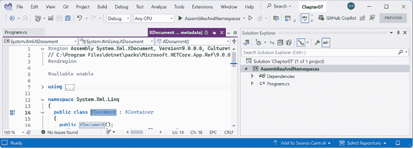
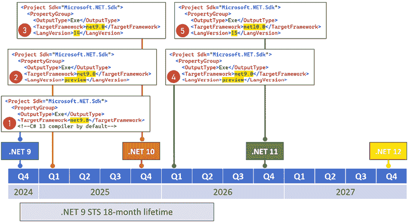
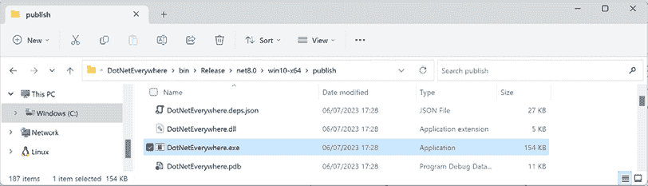
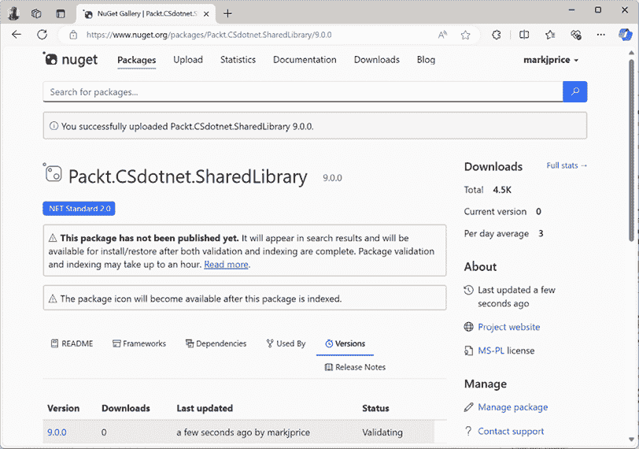
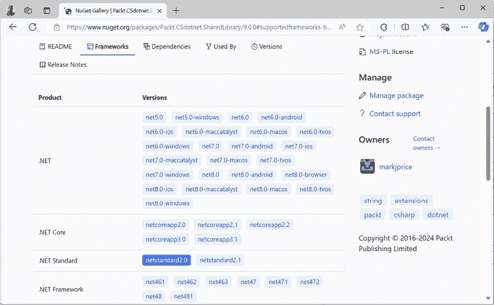
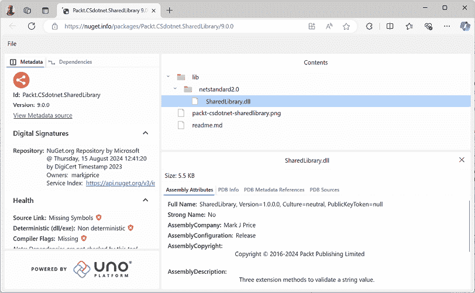

# 打包和分发.NET 类型

本章介绍了 C#关键字与.NET 类型之间的关系以及命名空间和程序集之间的关系。你将熟悉如何打包和发布你的.NET 应用程序和库以实现跨平台使用。

本章有几个在线部分，你将在章节末尾找到所有链接。

在仅在线的部分，*反编译.NET 程序集*，我们介绍了如何为了学习目的反编译.NET 程序集，以及为什么你无法阻止他人反编译你的代码。在另一个仅在线的部分，*从.NET Framework 迁移到现代.NET*，你可以学习如何在.NET 库中使用遗留的.NET Framework 库，以及如何将遗留的.NET Framework 代码库迁移到现代.NET。最后，在第三个仅在线的部分，*创建源生成器*，你将学习如何创建可以动态向你的项目添加源代码的源生成器——这是一个非常强大的功能。

本章涵盖了以下主题：

+   .NET 9 之路

+   理解.NET 组件

+   发布你的应用程序以进行部署

+   原生提前编译

+   打包你的库以进行 NuGet 分发

+   使用预览功能

# .NET 9 之路

这本书的这一部分介绍了.NET 提供的**基类库**（**BCL**）API 中的功能，以及如何使用.NET Standard 跨所有不同的.NET 平台重用功能。

## .NET Standard 兼容的框架

从.NET Core 2.0 开始，对至少.NET Standard 2.0 的支持很重要，因为它提供了许多在.NET Core 的第一个版本中缺失的 API。对于现代开发相关的 15 年积累的库和应用程序，.NET Framework 开发者现在可以迁移到.NET，并且它们可以在 macOS 和 Linux 变体以及 Windows 上跨平台运行。

.NET Standard 2.1 添加了大约 3,000 个新 API。其中一些 API 需要运行时更改，这可能会破坏向后兼容性。总结如下：

+   .NET Framework 4.8 仅实现了.NET Standard 2.0。

+   .NET Core 3.0、Xamarin、Mono 和 Unity 实现了.NET Standard 2.1。

.NET 5 移除了.NET Standard 的需求，因为所有项目类型现在都可以针对.NET 的单个版本。同样的情况也适用于.NET 6 及以后的版本。从.NET 5 开始的每个版本都与之前的版本向后兼容。这意味着一个针对.NET 5 的类库可以被任何类型的.NET 5 或更高版本的任何项目使用。现在，随着.NET 版本发布了对使用.NET MAUI 构建的移动和桌面应用程序的全面支持，对.NET Standard 的需求进一步减少。

由于你可能仍然需要为遗留的.NET Framework 项目或遗留的 Xamarin 移动应用程序创建类库，因此仍然需要创建.NET Standard 2.0 类库。

正式来说，即使它是一个相对较新的功能，您也必须使用 .NET Standard 2.0 类库来创建源生成器。

为了总结自 2016 年 .NET Core 首个版本以来 .NET 所取得的进展，我已将主要的 .NET Core 和现代 .NET 版本与以下列表中的等效 .NET Framework 版本进行了比较：

+   **.NET Core 1.x**：与 .NET Framework 4.6.1 相比，API 小得多，这是 2016 年 3 月的当前版本。

+   **.NET Core 2.x**：由于它们都实现了 .NET Standard 2.0，因此与现代 API 相比，API 与 .NET Framework 4.7.1 相等。

+   **.NET Core 3.x**：与 .NET Framework 相比，API 更大，因为 .NET Framework 4.8 没有实现 .NET Standard 2.1。

+   **.NET 5**：与 .NET Framework 4.8 相比，API 更大，特别是对于现代 API，性能有了显著提升。

+   **.NET 6**：继续改进性能和扩展 API，并在 2022 年 5 月添加了对 .NET MAUI 的可选支持。

+   **.NET 7**：与支持移动应用的支持最终统一，.NET MAUI 作为可选工作负载可用。本书不涵盖 .NET MAUI 开发。Packt 有多本专注于 .NET MAUI 的书籍，您可以通过搜索他们的网站找到它们。

+   **.NET 8**：继续改进平台，如果您需要长期支持，则应用于所有新的开发。

+   **.NET 9**：继续改进平台，特别是在性能方面，如果您对标准期限支持感到舒适，则应使用它。您可以在以下链接中查看每个预览版本的 .NET 9 发布说明：[`github.com/dotnet/core/discussions/9234`](https://github.com/dotnet/core/discussions/9234)。

您可以在以下链接的 GitHub 仓库中阅读更多详细信息：[`github.com/markjprice/cs13net9/blob/main/docs/ch07-features.md`](https://github.com/markjprice/cs13net9/blob/main/docs/ch07-features.md)。

**更多信息**：比较两个 .NET 版本的一个有用方法是 .NET 网站的 API。例如，您可以在以下链接中比较 .NET 9 与 .NET 8 的新功能：[`apisof.net/catalog?diff=net8.0-vs-net9.0`](https://apisof.net/catalog?diff=net8.0-vs-net9.0)。

## 检查您的 .NET SDKs 是否有更新

微软在 .NET 6 中引入了一个命令来检查您已安装的 .NET SDKs 和运行时的版本，如果任何需要更新，它会向您发出警告。例如，输入以下命令：

```cs
dotnet sdk check 
```

您将看到结果，包括可用更新的状态，如下所示的部分输出：

```cs
.NET SDKs:
Version            Status
-------------------------------------------------------
8.0.400            Patch 8.0.401 is available.
9.0.100            Up to date. 
```

**良好实践**：为了保持微软的支持，您必须确保您的 .NET SDKs 和 .NET 运行时始终更新到最新的补丁。

一个相关的第三方工具是 `dotnet-outdated`，它允许您快速报告 .NET 项目中任何过时的 NuGet 包。您可以在以下链接中了解更多信息：[`github.com/dotnet-outdated/dotnet-outdated`](https://github.com/dotnet-outdated/dotnet-outdated)。

# 理解 .NET 组件

.NET 由几个部分组成，以下列表显示了这些部分：

+   **语言编译器**：这些将您使用 C#、F# 和 Visual Basic 等语言编写的源代码转换为存储在组件中的**中间语言**（**IL**）代码。从 C# 6 及以后版本开始，微软切换到了一个开源重写的编译器，称为 **Roslyn**，它也被 Visual Basic 使用。

+   **公共语言运行时**（**CLR**）：此运行时加载组件，将存储在其中的 IL 代码编译成计算机 CPU 的本地代码指令，并在管理资源（如线程和内存）的环境中执行代码。

+   **基类库**（**BCL**）：这些是使用 NuGet 打包和分发的预构建组件集合，用于在构建应用程序时执行常见任务。您可以使用它们快速构建任何您想要的东西，就像组合乐高™ 瓦片一样。

## 组件、NuGet 包和命名空间

**组件**是类型在文件系统中存储的地方。组件是部署代码的机制。例如，`System.Data.dll` 组件包含用于管理数据的类型。要使用其他组件中的类型，它们必须被引用。组件可以是静态的（预先创建）或动态的（在运行时生成）。动态组件是本书不会涉及的高级功能。组件可以编译为单个文件，作为 DLL（类库）或 EXE（控制台应用程序）。

组件以 **NuGet 包**的形式分发，这些是从公共在线源中可下载的文件，可以包含多个组件和其他资源。您还会听到关于 **项目 SDK**、**工作负载**和**平台**的内容，这些都是 NuGet 包的组合。

微软的 NuGet 源位于此处：[`www.nuget.org/`](https://www.nuget.org/)。

## 命名空间是什么？

命名空间是类型的地址。命名空间是一种机制，通过要求完整的地址来唯一标识一个类型，而不是仅仅一个短名称。在现实世界中，*34 桉树街的鲍勃*与*12 橡树巷的鲍勃*是不同的。

在 .NET 中，`System.Web.Mvc` 命名空间中的 `IActionFilter` 接口与 `System.Web.Http.Filters` 命名空间中的 `IActionFilter` 接口不同。

## 依赖组件

如果一个组件被编译为类库并提供其他组件使用的类型，那么它具有文件扩展名 `.dll`（**动态链接库**），并且不能独立执行。

同样，如果一个组件被编译为应用程序，那么它具有文件扩展名 `.exe`（**可执行文件**）并且可以独立执行。在 .NET Core 3 之前，控制台应用程序被编译为 `.dll` 文件，并且必须通过 `dotnet run` 命令或宿主可执行文件来执行。

任何程序集都可以将一个或多个类库程序集作为依赖项引用，但不能有循环引用。因此，如果程序集 *A* 已经引用了程序集 *B*，则程序集 *B* 不能引用程序集 *A*。如果尝试添加会导致循环引用的依赖项引用，编译器将发出警告。循环引用通常是代码设计不佳的警告信号。如果你确定你需要循环引用，那么请使用接口来解决这个问题。

## Microsoft .NET 项目 SDK

默认情况下，控制台应用程序依赖于 Microsoft .NET 项目 SDK。此平台包含成千上万的类型，这些类型几乎所有应用程序都需要，例如 `System.Int32` 和 `System.String` 类型。

在使用 .NET 时，你需要在项目文件中引用应用程序需要的依赖程序集、NuGet 包和平台。

让我们探索程序集和命名空间之间的关系：

1.  使用你偏好的代码编辑器创建一个新项目，如下列表所示：

    +   项目模板：**控制台应用程序** / `console`

    +   项目文件和文件夹：`AssembliesAndNamespaces`

    +   解决方案文件和文件夹：`Chapter07`

1.  打开 `AssembliesAndNamespaces.csproj`，注意它是一个典型的 .NET 应用程序项目文件，如下所示：

    ```cs
    <Project Sdk="Microsoft.NET.Sdk">
      <PropertyGroup>
        <OutputType>Exe</OutputType>
        <TargetFramework>net9.0</TargetFramework>
        <Nullable>enable</Nullable>
        <ImplicitUsings>enable</ImplicitUsings>
      </PropertyGroup>
    </Project> 
    ```

1.  在 `<PropertyGroup>` 部分之后，添加一个新的 `<ItemGroup>` 部分以静态导入所有 C# 文件中的 `System.Console`，使用 .NET SDK 的隐式使用功能，如下所示：

    ```cs
    <ItemGroup Label="To simplify use of Console methods.">
      <Using Include="System.Console" Static="true" />
    </ItemGroup> 
    ```

### `PropertyGroup` 元素

`PropertyGroup` 元素用于定义控制构建过程的配置属性。这些属性可以是任何东西，从编译二进制的输出路径到版本信息。`PropertyGroup` 中的每个属性都定义为简单的名称-值对，如下所示：

```cs
<PropertyGroup>
<OutputType>Exe</OutputType>
<TargetFramework>net9.0</TargetFramework>
<ImplicitUsings>enable</ImplicitUsings>
<Nullable>enable</Nullable>
<RootNamespace>Packt.Shared</RootNamespace>
</PropertyGroup> 
```

在前面的示例中：

+   `OutputType` 指定输出类型，例如可执行文件 (`Exe`) 或库 (`Library`)。

+   `TargetFramework` 指定项目的目标框架，例如 `net9.0`。

+   `RootNamespace` 设置项目的默认命名空间。

### `ItemGroup` 元素

`ItemGroup` 元素用于定义包含在构建过程中的项目集合。项目可以是源文件、对其他程序集的引用、包引用和其他资源。

你经常想为不同的目的定义多个 `ItemGroup` 元素。它们将在构建时合并。例如，你可能有一个 `ItemGroup` 用于所有项目引用，还有一个单独的 `ItemGroup` 用于所有包引用。

`ItemGroup` 元素可以有一个 `Label` 属性，以便你可以记录每个部分应该用于什么，如下所示：

```cs
<ItemGroup Label="Additional files to include during build.">
  <Compile Include="Utils.cs" />
  <None Include="readme.txt" />
</ItemGroup>
<ItemGroup Label="NuGet packages for this project.">
  <PackageReference Include="Newtonsoft.Json" Version="13.0.3" />
</ItemGroup> 
```

### 标签和条件属性

`PropertyGroup` 和 `ItemGroup` 都可以有一个 `Label` 属性，可以用来记录元素的目的，以及一个 `Condition` 属性，可以用来定义它们何时应用。例如，一个典型的条件可能是构建 `DEBUG` 版本时，如下面的标记所示：

```cs
<PropertyGroup Condition="'$(CompileConfig)' == 'DEBUG'" >
  <Optimization>false</Optimization>
  <Obfuscate>false</Obfuscate>
  <OutputPath>$(OutputPath)\debug</OutputPath>
</PropertyGroup> 
```

**警告！** `PropertyGroup` 和 `ItemGroup` 元素都在根 `Project` 元素中的同一级别。不要在 `PropertyGroup` 元素内部嵌套 `ItemGroup` 元素，反之亦然！

## 程序集中的命名空间和类型

许多常见的 .NET 类型都包含在 `System.Runtime.dll` 程序集中。程序集和命名空间之间不一定是一对一映射。单个程序集可以包含多个命名空间，而一个命名空间也可以定义在多个程序集中。您可以在 *表 7.1* 中查看一些程序集及其为它们提供类型的命名空间之间的关系：

| **程序集** | **示例命名空间** | **示例类型** |
| --- | --- | --- |
| `System.Runtime.dll` | `System`, `System.Collections`, `System.Collections.Generic` | `Int32`, `String`, `IEnumerable<T>` |
| `System.Console.dll` | `System` | `Console` |
| `System.Threading.dll` | `System.Threading` | `Interlocked`, `Monitor`, `Mutex` |
| `System.Xml.XDocument.dll` | `System.Xml.Linq` | `XDocument`, `XElement`, `XNode` |

表 7.1：程序集及其命名空间的示例

## NuGet 包

.NET 被分割成一系列包，使用名为 NuGet 的微软支持的包管理技术进行分发。这些包中的每一个都代表一个同名的单个程序集。例如，`System.Collections` 包包含 `System.Collections.dll` 程序集。

以下是一些包的好处：

+   包可以轻松地分发到公共源。

+   包可以被重用。

+   包可以按照自己的时间表进行分发。

+   包可以在不依赖其他包的情况下独立测试。

+   包可以通过包含为不同操作系统和 CPU 构建的同一程序集的多个版本来支持不同的操作系统和 CPU。

+   包可以具有仅针对单个库的特定依赖项。

+   应用程序更小，因为未引用的包不是分发的一部分。*表 7.2* 列出了一些重要的包及其重要类型：

| **包** | **重要类型** |
| --- | --- |
| `System.Runtime` | `Object`, `String`, `Int32`, `Array` |
| `System.Collections` | `List<T>`, `Dictionary<TKey, TValue>` |
| `System.Net.Http` | `HttpClient`, `HttpResponseMessage` |
| `System.IO.FileSystem` | `File`, `Directory` |
| `System.Reflection` | `Assembly`, `TypeInfo`, `MethodInfo` |

表 7.2：一些重要的包及其重要类型

## 包源

包源是 NuGet 可以查找包的位置，例如 [`www.nuget.org`](https://www.nuget.org)、本地目录或其他包存储库。`nuget.config` 文件允许您指定、优先级排序和配置这些源，以及其他相关设置。

`nuget.config` 文件使用 XML 定义包源，如下所示：

```cs
<?xml version="1.0" encoding="utf-8"?>
<configuration>
  <packageSources>
    <add key="nuget.org"
         value="https://api.nuget.org/v3/index.json" />
    <add key="MyCustomSource"
         value="https://mycustomsource.com/nuget" />
  </packageSources>
</configuration> 
```

在前面的配置中：

+   `<packageSources>`：此部分列出了 NuGet 将用于查找包的所有源。

+   `<add key="sourceName" value="sourceUrl"/>`：每个 `<add>` 元素定义一个包源。

NuGet 可以使用位于不同目录中的多个 `nuget.config` 文件。设置将按特定顺序应用，最具体的设置具有优先权：

1.  项目目录：项目目录中的 `nuget.config` 文件。

1.  解决方案目录：解决方案目录中的 `nuget.config` 文件。

1.  用户目录：用户配置文件目录中的 `nuget.config` 文件——例如，Windows 上的 `%AppData%\nuget\nuget.config`。

1.  系统级配置：系统级设置中的 `nuget.config` 文件——例如，Windows 上的 `%ProgramFiles(x86)%\nuget\config`。

NuGet 合并这些配置，更具体的文件中的设置将覆盖不那么具体的文件中的设置。

如果找不到 `nuget.config` 文件，NuGet 将使用默认的包源，这通常是官方的 NuGet.org 仓库。这意味着默认情况下，Visual Studio、`dotnet` 和 `nuget.exe` 等工具将查找 NuGet.org 的包，除非进行其他配置。

## 理解框架

框架和包之间存在双向关系。包定义了 API，而框架将包分组。没有包的框架不会定义任何 API。

.NET 包支持一组框架。例如，`System.IO.FileSystem` 包版本 4.3.0 支持以下框架：

+   .NET 标准版，版本 1.3 或更高版本

+   .NET 框架，版本 4.6 或更高版本

+   六个 Mono 和 Xamarin 平台（例如，Xamarin.iOS）

**更多信息**：您可以在以下链接中阅读详细信息：[`www.nuget.org/packages/System.IO.FileSystem/#supportedframeworks-body-tab`](https://www.nuget.org/packages/System.IO.FileSystem/#supportedframeworks-body-tab)。

## 导入命名空间以使用类型

让我们探索命名空间与程序集和类型之间的关系：

1.  在 `AssembliesAndNamespaces` 项目中，在 `Program.cs` 中删除现有的语句，然后输入以下代码：

    ```cs
    XDocument doc = new(); 
    ```

近期版本的代码编辑器通常会自动添加一个命名空间导入语句来修复您想要看到的问题。请删除您的代码编辑器为您编写的 `using` 语句。

1.  构建项目并注意编译器错误信息，如下所示：

    ```cs
    CS0246 The type or namespace name 'XDocument' could not be found (are you missing a using directive or an assembly reference?) 
    ```

`XDocument` 类型没有被识别，因为我们没有告诉编译器该类型的命名空间。尽管此项目已经引用了包含该类型的程序集，但我们还需要在类型名称前加上其命名空间（例如，`System.Xml.Linq.XDocument`）或导入命名空间。

1.  在 `XDocument` 类名内点击。您的代码编辑器显示一个灯泡，表示它识别了该类型，并且可以自动为您修复问题。

1.  点击灯泡图标，从菜单中选择 `using System.Xml.Linq;`。

这将通过在文件顶部添加一个 `using` 语句来导入命名空间。一旦在代码文件的顶部导入了命名空间，该命名空间内的所有类型都可以通过仅输入其名称来在该代码文件中使用，无需通过在其名称前加上命名空间前缀来完全限定类型名称。

我喜欢在导入命名空间后添加一条注释，以提醒我为什么需要导入它，如下所示：

```cs
using System.Xml.Linq; // To use XDocument. 
```

如果你不对你的命名空间进行注释，你或其他开发者将不知道为什么需要导入它们，可能会删除它们，导致代码出错。相反，他们可能永远不会删除导入的命名空间“以防万一”它们可能需要，这可能会不必要地使代码变得杂乱。这就是为什么大多数现代代码编辑器都有移除未使用命名空间的功能。这种技术也在你学习的同时无意识地训练你，记住你需要导入哪个命名空间来使用特定的类型或扩展方法。

## 将 C# 关键字关联到 .NET 类型

我经常收到新 C# 程序员提出的一个常见问题是，“小写 s 的 `string` 和大写 S 的 `String` 之间有什么区别？”

简短的回答是：没有。长一点的回答是，所有代表类型如 `string` 或 `int` 的 C# 关键字都是类库程序集中的一个 .NET 类型的别名。

当你使用 `string` 关键字时，编译器将其识别为 `System.String` 类型。当你使用 `int` 类型时，编译器将其识别为 `System.Int32` 类型。

让我们通过一些代码来看看这个操作：

1.  在 `Program.cs` 文件中，声明两个变量来存储 `string` 值，一个使用小写 `string`，一个使用大写 `String`，如下所示：

    ```cs
    string s1 = "Hello";
    String s2 = "World";
    WriteLine($"{s1} {s2}"); 
    ```

1.  运行 `AssembliesAndNamespaces` 项目，并注意 `string` 和 `String` 都可以正常工作，并且字面上意味着同一件事。

1.  在 `AssembliesAndNamespaces.csproj` 文件中，添加一个条目以防止 `System` 命名空间被全局导入，如下所示：

    ```cs
    <ItemGroup>
      <Using Remove="System" />
    </ItemGroup> 
    ```

1.  在 `Program.cs` 文件中，以及 **错误列表** 或 **问题** 窗口中，注意编译器错误信息，如下所示：

    ```cs
    CS0246 The type or namespace name 'String' could not be found (are you missing a using directive or an assembly reference?) 
    ```

1.  在 `Program.cs` 文件顶部，使用 `using` 语句导入 `System` 命名空间，这将修复错误，如下所示：

    ```cs
    using System; // To use String. 
    ```

**良好实践**：当你有选择时，使用 C# 关键字而不是实际类型，因为关键字不需要导入命名空间。

## 将 C# 别名映射到 .NET 类型

*表 7.3* 展示了 18 个 C# 类型关键字及其实际的 .NET 类型：

| **关键字** | **.NET 类型** |  | **关键字** | **.NET 类型** |
| --- | --- | --- | --- | --- |
| `string` | `System.String` |  | `char` | `System.Char` |
| `sbyte` | `System.SByte` |  | `byte` | `System.Byte` |
| `short` | `System.Int16` |  | `ushort` | `System.UInt16` |
| `int` | `System.Int32` |  | `uint` | `System.UInt32` |
| `long` | `System.Int64` |  | `ulong` | `System.UInt64` |
| `nint` | `System.IntPtr` |  | `nuint` | `System.UIntPtr` |
| `float` | `System.Single` |  | `double` | `System.Double` |
| `decimal` | `System.Decimal` |  | `bool` | `System.Boolean` |
| `object` | `System.Object` |  | `dynamic` | `System.Dynamic.DynamicObject` |

表 7.3：C# 类型关键字及其实际的 .NET 类型

其他 .NET 编程语言编译器也可以做到同样的事情。例如，Visual Basic .NET 语言有一个名为`Integer`的类型，它是`System.Int32`的别名。

## 理解原生大小整数

C# 9 引入了`nint`和`nuint`关键字别名，用于**原生大小整数**，这意味着整数值的存储大小是平台特定的。它们在 32 位进程中存储 32 位整数，`sizeof()`返回 4 字节；它们在 64 位进程中存储 64 位整数，`sizeof()`返回 8 字节。这些别名代表内存中整数值的指针，这就是为什么它们的 .NET 名称是`IntPtr`和`UIntPtr`。实际的存储类型将是`System.Int32`或`System.Int64`，具体取决于进程。

在 64 位进程中，以下代码：

```cs
WriteLine($"Environment.Is64BitProcess = {Environment.Is64BitProcess}");
WriteLine($"int.MaxValue = {int.MaxValue:N0}");
WriteLine($"nint.MaxValue = {nint.MaxValue:N0}"); 
```

产生以下输出：

```cs
Environment.Is64BitProcess = True
int.MaxValue = 2,147,483,647
nint.MaxValue = 9,223,372,036,854,775,807 
```

## 揭示类型的定位

大多数代码编辑器都为 .NET 类型提供了内置文档。让我们首先确保你通过检查是否正确设置了相关选项，来确保你在 Visual Studio 中的预期体验，然后探索：

1.  如果你正在使用 Visual Studio，请确保你已经禁用了源链接功能：

    1.  导航到**工具** | **选项**。

    1.  在搜索框中输入`导航到源`。

    1.  在**文本编辑器** | **C#**部分中选择**高级**。

    1.  清除**启用导航到源链接和嵌入源**复选框，然后点击**确定**。

1.  在`XDocument`上右键单击并选择**转到定义**。

1.  导航到代码文件顶部，展开折叠区域，并注意程序集文件名是`System.Xml.XDocument.dll`，但类在`System.Xml.Linq`命名空间中，如下面的代码和*图 7.1*所示：

    ```cs
    #region Assembly System.Runtime, Version=9.0.0.0, Culture=neutral, PublicKeyToken=b03f5f7f11d50a3a
    // C:\Program Files\dotnet\packs\Microsoft.NETCore.App.Ref\9.0.0\ref\net9.0\System.Runtime.dll
    #endregion 
    ```



图 7.1：包含 XDocument 类的程序集和命名空间

1.  关闭**XDocument [来自元数据]**选项卡。

1.  在`string`或`String`内部右键单击并选择**转到定义**。

1.  导航到代码文件顶部，展开折叠区域，并注意程序集文件名是`System.Runtime.dll`，但类在`System`命名空间中。

你的代码编辑器实际上在对你撒谎。如果你记得我们在*第二章*，*讲 C#*中编写代码时，当我们揭示了 C# 词汇量的范围，我们发现`System.Runtime.dll`程序集包含零个类型。

`System.Runtime.dll`程序集包含的是类型前向器。这些是在程序集中看似存在但实际上在其他地方实现的特殊类型。在这种情况下，它们使用高度优化的代码在 .NET 运行时深处实现。

如果你需要将一个类型从其原始程序集移动到另一个程序集，你可能需要使用类型前向器。如果没有定义类型前向器，任何引用原始程序集的项目将无法在其中找到该类型，并且会抛出运行时异常。你可以在以下链接中了解更多关于这个虚构示例的信息：[`learn.microsoft.com/en-us/dotnet/standard/assembly/type-forwarding`](https://learn.microsoft.com/en-us/dotnet/standard/assembly/type-forwarding)。

## 使用.NET Standard 与遗留平台共享代码

在.NET Standard 之前，存在**可移植类库**（**PCLs**）。使用 PCLs，你可以创建一个代码库，并明确指定你希望库支持的平台，例如 Xamarin、Silverlight 和 Windows 8。然后，你的库可以使用由指定平台支持的 API 交集。

微软意识到这是不可持续的，因此他们创建了.NET Standard——一个所有未来的.NET 平台都将支持的单一 API。有.NET Standard 的旧版本，但.NET Standard 2.0 是一次尝试统一所有重要的近期.NET 平台。.NET Standard 2.1 于 2019 年底发布，但只有.NET Core 3.0 和那年的 Xamarin 版本支持其新功能。在这本书的其余部分，我将使用.NET Standard 来指代.NET Standard 2.0。

.NET Standard 就像 HTML5 一样，它们都是平台应该支持的标准。就像谷歌的 Chrome 浏览器和微软的 Edge 浏览器实现了 HTML5 标准一样，.NET Core、.NET Framework 和 Xamarin 都实现了.NET Standard。如果你想创建一个可以在旧.NET 变体之间工作的类型库，你可以使用.NET Standard 最简单地做到这一点。

**良好实践**：由于.NET Standard 2.1 中的许多 API 新增都需要运行时更改，而.NET Framework 是微软的遗留平台，需要尽可能保持不变，因此.NET Framework 4.8 仍然停留在.NET Standard 2.0 上，而不是实现.NET Standard 2.1。如果你需要支持.NET Framework 客户，那么你应该在.NET Standard 2.0 上创建类库，即使它不是最新的，也不支持所有最新的语言和 BCL 新功能。

你选择的目标.NET Standard 版本取决于在最大化平台支持和可用功能之间的平衡。较旧的版本支持更多平台，但 API 集较小。较新的版本支持较少的平台，但 API 集较大。通常，你应该选择支持你所需所有 API 的最低版本。

## 理解不同 SDK 的类库默认设置

当使用`dotnet` SDK 工具创建类库时，了解默认将使用哪个目标框架可能很有用，如下表 7.4 所示：

| **SDK** | **新类库的默认目标框架** |
| --- | --- |
| .NET Core 3.1 | `netstandard2.0` |
| .NET 6 | `net6.0` |
| .NET 7 | `net7.0` |
| .NET 8 | `net8.0` |
| .NET 9 | `net9.0` |

表 7.4：.NET SDK 及其针对新类库的默认目标框架

当然，一个类库默认针对特定的 .NET 版本并不意味着你不能在创建类库项目后更改它。使用默认模板创建类库项目后，你可以更改它。

你可以手动设置目标框架到一个支持需要引用该库的项目值的值，如 *表 7.5* 所示：

| **类库目标框架** | **可以被以下项目使用** |
| --- | --- |
| `netstandard2.0` | .NET Framework 4.6.1 或更高版本，.NET Core 2 或更高版本，.NET 5 或更高版本，Mono 5.4 或更高版本，Xamarin.Android 8 或更高版本，以及 Xamarin.iOS 10.14 或更高版本 |
| `netstandard2.1` | .NET Core 3 或更高版本，.NET 5 或更高版本，Mono 6.4 或更高版本，Xamarin.Android 10 或更高版本，以及 Xamarin.iOS 12.16 或更高版本 |
| `net6.0` | .NET 6 或更高版本 |
| `net7.0` | .NET 7 或更高版本 |
| `net8.0` | .NET 8 或更高版本 |
| `net9.0` | .NET 9 或更高版本 |

表 7.5：类库目标框架及其可使用的项目

**良好实践**：始终检查类库的目标框架，并在必要时手动更改它到一个更合适的目标。有意识地决定它应该是什么，而不是接受默认值。

## 创建 .NET Standard 类库

我们将使用 .NET Standard 2.0 创建一个类库，以便它可以在所有重要的 .NET 遗留平台上使用，并在 Windows、macOS 和 Linux 操作系统上跨平台，同时还可以访问广泛的 .NET API：

1.  使用你喜欢的代码编辑器添加一个新的 **类库** / `classlib` 项目，命名为 `SharedLibrary`，针对 `Chapter07` 解决方案的目标为 .NET Standard 2.0：

    +   如果你使用 Visual Studio，当提示选择 **目标框架** 时，选择 **.NET Standard 2.0**，然后配置解决方案的启动项目为当前选择。

    +   如果你使用 VS Code，包括一个目标为 .NET Standard 2.0 的开关，如下所示命令：

        ```cs
        dotnet new classlib -f netstandard2.0 
        ```

**良好实践**：如果你需要创建使用 .NET 9 的新功能的类型，以及仅使用 .NET Standard 2.0 功能的类型，那么你可以创建两个独立的类库：一个针对 .NET Standard 2.0，另一个针对 .NET 0。

1.  构建 `SharedLibrary` 项目。

手动创建两个类库的替代方法是创建一个支持 **多目标** 的类库。如果你希望我在下一版中添加关于多目标的内容，请告知我。你可以在这里了解多目标：[`learn.microsoft.com/en-us/dotnet/standard/library-guidance/cross-platform-targeting#multi-targeting`](https://learn.microsoft.com/en-us/dotnet/standard/library-guidance/cross-platform-targeting#multi-targeting)。

## 控制 .NET SDK

默认情况下，执行 `dotnet` 命令会使用已安装的最高版本的 .NET SDK。有时你可能想控制使用哪个 SDK。

例如，一旦 .NET 10 在 2025 年 2 月开始预览版，或者最终版本在 2025 年 11 月发布，您可能会安装它。但您可能希望您的体验与书中步骤相匹配，这些步骤使用 .NET 9 SDK。但一旦您安装了 .NET 10 SDK，它将默认使用。

您可以通过使用包含要使用版本的 `global.json` 文件来控制默认使用的 .NET SDK，`dotnet` 命令会依次搜索当前文件夹及其父文件夹，查找 `global.json` 文件，以确定是否应使用不同的 .NET SDK 版本。

您不需要完成以下步骤，但如果您想尝试并且尚未安装 .NET 8 SDK，则可以从以下链接安装它：

[`dotnet.microsoft.com/download/dotnet/8.0`](https://dotnet.microsoft.com/download/dotnet/8.0)

1.  在 `Chapter07` 文件夹中创建一个名为 `ControlSDK` 的子目录/文件夹。

1.  在 Windows 上，启动 **命令提示符** 或 **Windows 终端**。在 macOS 上，启动 **终端**。如果您正在使用 VS Code，则可以使用集成终端。

1.  在 `ControlSDK` 文件夹中，在命令提示符或终端中输入命令以列出已安装的 .NET SDK，如下所示：

    ```cs
    dotnet --list-sdks 
    ```

1.  注意以下输出中突出显示的最新安装的 .NET 8 SDK 的结果和版本号：

    ```cs
    **8.0.400** [C:\Program Files\dotnet\sdk]
    **9.0.100** [C:\Program Files\dotnet\sdk] 
    ```

1.  创建一个 `global.json` 文件，强制使用您已安装的最新 .NET 8 SDK（可能晚于我的版本），如下所示：

    ```cs
    dotnet new globaljson --sdk-version 8.0.400 
    ```

1.  注意以下输出中的结果：

    ```cs
    The template "global.json file" was created successfully. 
    ```

1.  使用您首选的代码编辑器打开 `global.json` 文件并查看其内容，如下所示：

    ```cs
    {
      "sdk": {
        "version": "8.0.400"
      }
    } 
    ```

例如，要使用 VS Code 打开它，请输入命令 `code global.json`。

1.  在 `ControlSDK` 文件夹中，在命令提示符或终端中输入命令以创建类库项目，如下所示：

    ```cs
    dotnet new classlib 
    ```

1.  如果您没有安装 .NET 8 SDK，则将看到错误，如下所示：

    ```cs
    Could not execute because the application was not found or a compatible .NET SDK is not installed. 
    ```

1.  如果您已安装 .NET 8 SDK，则将创建一个默认针对 .NET 8 的类库项目，如下所示：

    ```cs
    <Project Sdk="Microsoft.NET.Sdk">
      <PropertyGroup>
        **<TargetFramework>net8****.0****</TargetFramework>**
        <ImplicitUsings>enable</ImplicitUsings>
        <Nullable>enable</Nullable>
      </PropertyGroup>
    </Project> 
    ```

## 混合 SDK 和框架目标

许多组织决定针对 .NET 的长期支持版本，以从微软获得长达三年的支持。这样做并不意味着您会失去在 .NET 运行时生命周期内 C# 语言改进的好处。

您可以在安装和使用未来的 C# 编译器的同时轻松地继续针对 .NET 9 运行时，如图 7.2 所示，以下列表中也有说明：

1.  **2024 年 11 月**：安装 .NET SDK 9.0.100，并使用它来构建默认使用 C# 13 编译器的针对 .NET 9 的项目。每月，更新开发计算机上的 .NET 9 SDK 补丁，并更新任何部署计算机上的 .NET 9 运行时补丁。

1.  **2025 年 2 月**：可选地安装 .NET SDK 10 预览版 1，以探索新的 C# 14 语言和 .NET 10 库功能。请注意，当针对 .NET 9 时，您将无法使用新的库功能。预览版每年 2 月至 10 月每月发布一次。请阅读每月公告，了解以下链接中该预览版的新功能：[`github.com/dotnet/Announcements/issues`](https://github.com/dotnet/Announcements/issues)。

1.  **2025 年 11 月**：安装 .NET SDK 10.0.100，并使用它来构建继续针对 .NET 9 的项目，并使用 C# 14 编译器来利用其新功能。您将使用完全受支持的 SDK 和完全受支持的运行时。

1.  **2026 年 2 月**：可选地安装 .NET 11 预览版，以探索新的 C# 15 语言和 .NET 11 库功能。当您准备好迁移时，开始规划任何新的库和 ASP.NET Core 功能，这些功能可以应用于您的 .NET 9 和 .NET 11 项目。

1.  **2026 年 11 月**：安装 .NET 11.0.100 SDK，并使用它来构建针对 .NET 10 的项目，并使用 C# 15 编译器。



图 7.2：针对长期支持的 .NET 8 同时使用最新的 C# 编译器

当决定安装 .NET SDK 时，请记住，默认情况下使用最新版本来构建任何 .NET 项目。一旦您安装了 .NET 9 SDK 预览版，它将默认用于所有项目，除非您强制使用较旧且完全受支持的 SDK 版本，如 8.0.100 或更高版本的补丁。

# 为部署发布您的代码

如果您写了一本小说，并且希望其他人阅读它，您必须将其出版。

大多数开发者为其他开发者在他们自己的项目中使用或为用户作为应用程序运行而编写代码。为此，您必须将您的代码发布为打包的类库或可执行应用程序。

有三种方式可以发布和部署 .NET 应用程序。它们是：

+   **框架依赖部署**（**FDD**）

+   **框架依赖可执行文件**（**FDE**）

+   **自包含**

如果您选择部署您的应用程序及其包依赖项，但不是 .NET 本身，那么您依赖于 .NET 已经在目标计算机上。这对于部署到服务器的 Web 应用程序来说效果很好，因为 .NET 和许多其他 Web 应用程序可能已经存在于服务器上。

FDD 表示您部署一个必须由 `dotnet` 命令行工具执行的 DLL。FDE 表示您部署一个可以直接从命令行运行的 EXE。两者都需要在系统上安装适当的 .NET 运行时版本。

有时，您可能希望能够给某人一个包含为他们的操作系统构建的应用程序，并知道它可以在他们的计算机上执行。您将想要执行自包含部署。虽然部署文件的尺寸会更大，但您会知道它将工作。

## 创建用于发布的控制台应用程序

让我们探索如何发布一个控制台应用程序：

1.  使用您喜欢的代码编辑器将一个新的**控制台应用程序**/ `console`项目命名为`DotNetEverywhere`添加到`Chapter07`解决方案中。确保您针对.NET 9。

1.  修改项目文件，将`System.Console`类静态导入到所有 C#文件中。

1.  在`Program.cs`中删除现有的语句，然后添加一条输出消息的语句，说明控制台应用程序可以在任何地方运行，以及一些关于操作系统的信息，如下所示代码：

    ```cs
    WriteLine("I can run everywhere!");
    WriteLine($"OS Version is {Environment.OSVersion}.");
    if (OperatingSystem.IsMacOS())
    {
      WriteLine("I am macOS.");
    }
    else if (OperatingSystem.IsWindowsVersionAtLeast(
      major: 10, build: 22000))
    {
      WriteLine("I am Windows 11.");
    }
    else if (OperatingSystem.IsWindowsVersionAtLeast(major: 10))
    {
      WriteLine("I am Windows 10.");
    }
    else
    {
      WriteLine("I am some other mysterious OS.");
    }
    WriteLine("Press any key to stop me.");
    ReadKey(intercept: true); // Do not output the key that was pressed. 
    ```

1.  运行`DotNetEverywhere`项目，并注意在 Windows 11 上运行的结果，如下所示输出：

    ```cs
    I can run everywhere!
    OS Version is Microsoft Windows NT 10.0.22000.0.
    I am Windows 11.
    Press any key to stop me. 
    ```

1.  在`DotNetEverywhere.csproj`中，在`<PropertyGroup>`元素内添加**运行时标识符**（**RIDs**），以针对三个操作系统进行目标定位，如下所示高亮显示的标记：

    ```cs
    <Project Sdk="Microsoft.NET.Sdk">
      <PropertyGroup>
        <OutputType>Exe</OutputType>
        <TargetFramework>net9.0</TargetFramework>
        <Nullable>enable</Nullable>
        <ImplicitUsings>enable</ImplicitUsings>
     **<RuntimeIdentifiers>**
     **win-x64;osx-arm64;linux-x64**
     **</RuntimeIdentifiers>**
      </PropertyGroup>
    </Project> 
    ```

    +   `win-x64` RID 值表示 x64 兼容 CPU 上的 Windows。使用`win-arm64` RID 值将应用程序部署到 Windows ARM 设备。

    +   `osx-arm64` RID 值表示 Apple Silicon 上的 macOS。

    +   `linux-x64` RID 值表示大多数桌面 Linux 发行版，如 Ubuntu、CentOS、Debian 或 Fedora 在 x64 兼容 CPU 上。对于 Raspbian 或 Raspberry Pi OS 32 位，请使用`linux-arm`。对于运行 Ubuntu 64 位的 Raspberry Pi，请使用`linux-arm64`。

您可以在以下链接中检查最新的允许的 RID 值：[`learn.microsoft.com/en-us/dotnet/core/rid-catalog#known-rids`](https://learn.microsoft.com/en-us/dotnet/core/rid-catalog#known-rids)。

**警告！**您可以使用两个元素来指定运行时标识符。如果您只需要指定一个，请使用`<RuntimeIdentifier>`。如果您需要指定多个，如前例所示，请使用`<RuntimeIdentifiers>`。如果您使用错误的一个，那么编译器将给出错误，并且仅凭一个字符的差异可能难以理解原因！

## 理解 dotnet 命令

当您安装.NET SDK 时，它包括一个名为`dotnet`的**命令行界面**（**CLI**）。

.NET CLI 有在当前文件夹中创建新项目的命令，使用模板：

1.  在 Windows 上，启动**命令提示符**或**Windows 终端**。在 macOS 上，启动**终端**。如果您更喜欢使用 Visual Studio 或 VS Code，则可以使用集成终端。

1.  输入`dotnet new list`（或对于较旧的 SDK，使用`dotnet new -l`或`dotnet new --list`）命令以列出您当前安装的模板，其中最常见的模板如*表 7.6*所示：

| **模板名称** | **简称** | **语言** |
| --- | --- | --- |
| `.NET MAUI App` | `maui` | C# |
| `.NET MAUI Blazor App` | `maui-blazor` | C# |
| `ASP.NET Core Empty` | `web` | C#和 F# |
| `ASP.NET Core gRPC Service` | `grpc` | C# |
| `ASP.NET Core Web API` | `webapi` | C#和 F# |
| `ASP.NET Core Web API (native AOT)` | `webapiaot` | C# |
| `ASP.NET Core Web App (Model-View-Controller)` | `mvc` | C#和 F# |
| `Blazor Web App` | `blazor` | C# |
| `Class Library` | `classlib` | C#、F#和 VB |
| `Console App` | `console` | C#、F#和 VB |
| `EditorConfig File` | `editorconfig` |  |
| `全局.json 文件` | `globaljson` |  |
| `解决方案文件` | `sln` |  |
| `xUnit 测试项目` | `xunit` |  |

表 7.6：项目模板的全名和简称

.NET MAUI 项目不支持 Linux。团队表示，他们已将这项工作留给开源社区。如果您需要创建一个真正的跨平台图形应用程序，请查看以下链接中的 Avalonia：[`avaloniaui.net/`](https://avaloniaui.net/)。

## 获取有关 .NET 及其环境的详细信息

查看当前安装的 .NET SDK 和运行时，以及有关操作系统的信息很有用，如下所示命令：

```cs
dotnet --info 
```

注意以下部分输出中的结果：

```cs
.NET SDK:
 Version:   9.0.100
 Commit:    81a714c6d3
 Workload version:  9.0.100-manifests.bbb3781c
 MSBuild version:   17.12.0
Runtime Environment:
 OS Name:     Windows
 OS Version:  10.0.26100
 OS Platform: Windows
 RID:         win-arm64
 Base Path:   C:\Program Files\dotnet\sdk\9.0.100\
.NET workloads installed:
Configured to use loose manifests when installing new manifests.
 [aspire]
   Installation Source: VS 17.12.35309.182, VS 17.11.35303.130
   Manifest Version:    9.0.0/0.0.100
   Manifest Path:       C:\Program Files\dotnet\sdk-manifests\9.0.100\microsoft.net.sdk.aspire\9.0.0\WorkloadManifest.json
   Install Type:        FileBased
Host (useful for support):
  Version: 9.0.0
  Architecture: arm64
  Commit:  static
.NET SDKs installed:
  8.0.400 [C:\Program Files\dotnet\sdk]
  9.0.100 [C:\Program Files\dotnet\sdk]
.NET runtimes installed:
  Microsoft.AspNetCore.App 8.0.8 [...\dotnet\shared\Microsoft.AspNetCore.App]
... 
```

## 使用 dotnet CLI 管理项目

.NET CLI 有以下命令在当前文件夹中的项目上工作，使您能够管理项目：

+   `dotnet help`: 这显示命令行帮助。

+   `dotnet new`: 这创建一个新的 .NET 项目或文件。

+   `dotnet tool`: 这安装或管理扩展 .NET 体验的工具。

+   `dotnet workload`: 这管理可选的工作负载，如 .NET MAUI。

+   `dotnet restore`: 这为项目下载依赖项。

+   `dotnet build`: 这将构建，即编译，一个 .NET 项目。.NET 8 中引入的新开关是 `--tl`（表示终端记录器），它提供了一种现代的输出方式。例如，它提供了有关构建正在做什么的实时信息。您可以在以下链接中了解更多信息：[`learn.microsoft.com/en-us/dotnet/core/tools/dotnet-build#options`](https://learn.microsoft.com/en-us/dotnet/core/tools/dotnet-build#options)。

+   `dotnet build-server`: 这与由构建启动的服务器交互。

+   `dotnet msbuild`: 这将运行 MS Build 引擎命令。

+   `dotnet clean`: 这从构建中删除临时输出。

+   `dotnet test`: 这将构建并运行项目的单元测试。

+   `dotnet run`: 这将构建并运行项目。

+   `dotnet pack`: 这为项目创建一个 NuGet 包。

+   `dotnet publish`: 这将构建并发布项目，可以是带依赖项的，也可以是自包含的应用程序。在 .NET 7 及更早版本中，默认发布 `Debug` 配置。在 .NET 8 及更高版本中，现在默认发布 `Release` 配置。

+   `dotnet add`: 这将包或类库的引用添加到项目中。

+   `dotnet remove`: 这将从项目中移除对包或类库的引用。

+   `dotnet list`: 这列出项目的包或类库引用。

+   `dotnet package search`: 这允许您搜索一个或多个包源，以查找与搜索词匹配的包。命令格式为 `dotnet package search [search term] [options]`。您可以在以下链接中了解更多信息：[`devblogs.microsoft.com/nuget/announcing-nuget-6-9/#support-for-dotnet-search-command`](https://devblogs.microsoft.com/nuget/announcing-nuget-6-9/#support-for-dotnet-search-command)。

## 发布自包含应用程序

现在您已经看到了一些示例 `dotnet` 工具命令，我们可以发布我们的跨平台控制台应用程序：

1.  在命令提示符或终端中，确保您位于 `DotNetEverywhere` 文件夹中。

1.  输入命令以构建和发布 Windows 的控制台应用程序的单文件发布版本，如下所示：

    ```cs
    dotnet publish -c Release -r win-x64 --self-contained 
    ```

    发布过程可能需要一段时间，请耐心等待。

1.  注意，构建引擎会恢复任何需要的包，将项目源代码编译成程序集 DLL，并创建一个 `publish` 文件夹，如下所示：

    ```cs
    MSBuild version 17.11.0+14c24b2d3 for .NET
      Determining projects to restore...
      All projects are up-to-date for restore.
      DotNetEverywhere -> C:\cs13net9\Chapter07\DotNetEverywhere\bin\Release\net9.0\win-x64\DotNetEverywhere.dll
      DotNetEverywhere -> C:\cs13net9\Chapter07\DotNetEverywhere\bin\Release\net9.0\win-x64\publish\ 
    ```

1.  输入以下命令以构建和发布 macOS 和 Linux 变体的发布版本，如下所示：

    ```cs
    dotnet publish -c Release -r osx-arm64 --self-contained
    dotnet publish -c Release -r linux-x64 --self-contained 
    ```

**良好实践**：您可以使用 PowerShell 等脚本语言自动化这些命令，并在任何操作系统上执行脚本文件，使用跨平台的 PowerShell Core。我已经为您在以下链接中完成了这项工作：[`github.com/markjprice/cs13net9/tree/main/scripts/publish-scripts`](https://github.com/markjprice/cs13net9/tree/main/scripts/publish-scripts)。

1.  打开 Windows **文件资源管理器**或 macOS **查找器**窗口，导航到 `DotNetEverywhere\bin\Release\net9.0`，并注意五个操作系统对应的输出文件夹。

1.  在 `win-x64` 文件夹中，打开 `publish` 文件夹，并注意所有支持程序集，如 `Microsoft.CSharp.dll`。

1.  选择 `DotNetEverywhere` 可执行文件，并注意它的大小为 154 KB，如图 *7.3* 所示：



图 7.3：Windows 64 位 DotNetEverywhere 可执行文件

1.  如果您使用的是具有 x64 兼容芯片的 Windows，则双击程序以执行，并注意结果，如下所示：

    ```cs
    I can run everywhere!
    OS Version is Microsoft Windows NT 10.0.26100.0.
    I am Windows 11.
    Press any key to stop me. 
    ```

我在我的 Surface Laptop 7 上执行了程序，因此针对并构建了 `win-arm64` 架构。前面的输出显示了在我的计算机上的结果。

1.  按任意键关闭控制台应用程序及其窗口。

1.  注意，`publish` 文件夹及其所有文件的总大小为 68.3 MB。

1.  在 `osx-arm64` 文件夹中，选择 `publish` 文件夹，注意所有支持程序集，然后选择 `DotNetEverywhere` 可执行文件。请注意，可执行文件大小为 125 KB，而 `publish` 文件夹大约为 73.9 MB。在 macOS 上发布的应用程序没有 `.exe` 文件扩展名，因此文件名不会有扩展名。

如果您将任何这些 `publish` 文件夹复制到适当的 **操作系统**（**OS**），控制台应用程序将运行；这是因为它是一个自包含、可部署的 .NET 应用程序。例如，在 macOS 上就是这样：

```cs
I can run everywhere!
OS Version is Unix 13.5.2
I am macOS.
Press any key to stop me. 
```

此示例使用的是控制台应用程序，但您同样可以轻松创建 ASP.NET Core 网站、网络服务或 Windows Forms 或 WPF 应用程序。当然，您只能将 Windows 桌面应用程序部署到 Windows 计算机，而不是 Linux 或 macOS。

## 发布单文件应用程序

如果你知道你想要运行你的应用的计算机上已经安装了 .NET，那么你可以在发布你的应用时使用额外的标志来说明它不需要自包含，并且你希望将其发布为单个文件（如果可能），如下所示（必须在单行中输入）：

```cs
dotnet publish -r win-x64 -c Release --no-self-contained
/p:PublishSingleFile=true 
```

这将生成两个文件：`DotNetEverywhere.exe` 和 `DotNetEverywhere.pdb`。`.exe` 文件是可执行文件。`.pdb` 文件是一个 **程序调试数据库** 文件，用于存储调试信息。

如果你希望 `.pdb` 文件嵌入到 `.exe` 文件中（例如，以确保它与程序集一起部署），那么请将 `<DebugType>` 元素添加到你的 `.csproj` 文件中的 `<PropertyGroup>` 元素，并将其设置为 `embedded`，如下所示（以下标记已高亮显示）：

```cs
<PropertyGroup>
<OutputType>Exe</OutputType>
<TargetFramework>net9.0</TargetFramework>
<Nullable>enable</Nullable>
<ImplicitUsings>enable</ImplicitUsings>
<RuntimeIdentifiers>
win-x64;osx-arm64;linux-x64
</RuntimeIdentifiers>
**<****DebugType****>****embedded****</****DebugType****>**
</PropertyGroup> 
```

如果你不能假设计算机上已经安装了 .NET，那么尽管 Linux 也只生成两个文件，但对于 Windows，你还需要期待以下额外的文件：`coreclr.dll`、`clrjit.dll`、`clrcompression.dll` 和 `mscordaccore.dll`。

让我们以 Windows 为例：

1.  在命令提示符或终端中，在 `DotNetEverywhere` 文件夹中，输入构建 Windows 控制台应用自包含发布版本的命令，如下所示：

    ```cs
    dotnet publish -c Release -r win-x64 --self-contained /p:PublishSingleFile=true 
    ```

1.  导航到 `DotNetEverywhere\bin\Release\net9.0\win-x64\publish` 文件夹，并选择 `DotNetEverywhere` 可执行文件。请注意，可执行文件现在为 62.6 MB，还有一个 11 KB 的 `.pdb` 文件。这些文件在你的系统中的大小可能会有所不同。

## 使用应用裁剪减小应用大小

将 .NET 应用作为自包含应用部署的一个问题是 .NET 库占用大量空间。最大的需求之一是减少 Blazor WebAssembly 组件的大小，因为所有 .NET 库都需要下载到浏览器。

幸运的是，你可以通过不将未使用的程序集打包到你的部署中来减小这个大小。从 .NET Core 3 开始引入的应用裁剪系统可以识别你的代码需要的程序集，并删除那些不需要的程序集。这被称为 `copyused` 裁剪模式。

在 .NET 5 中，裁剪进一步扩展，通过删除未使用的单个类型，甚至成员（例如，方法），如果它们在程序集中未被使用。例如，对于一个 **Hello World** 控制台应用，`System.Console.dll` 程序集从 61.5 KB 裁剪到 31.5 KB。这被称为 `link` 裁剪模式，但默认情况下并未启用。

在 .NET 6 中，微软向他们的库添加了注释，以指示它们如何安全地进行裁剪，因此类型和成员的裁剪被设置为默认选项。

在 .NET 7 中，微软将 `link` 重命名为 `full`，将 `copyused` 重命名为 `partial`。

但问题是裁剪如何准确地识别未使用的程序集、类型和成员。如果你的代码是动态的，可能使用了反射，那么它可能无法正确工作，因此微软也允许手动控制。

有两种方式来启用类型级别和成员级别，也就是所谓的`full`级别的修剪。由于这种修剪级别在.NET 6 或更高版本中是默认的，我们只需要启用修剪，而不需要设置修剪级别或模式。

第一种方式是在项目文件中添加一个元素，如下所示：

```cs
<PublishTrimmed>true</PublishTrimmed> <!--Enable trimming.--> 
```

第二种方式是在发布时添加一个标志，如下所示高亮显示的命令：

```cs
dotnet publish ... **-p:PublishTrimmed=True** 
```

有两种方式来启用程序集级别，也就是所谓的`partial`级别的修剪。

第一种方式是在项目文件中添加两个元素，如下所示：

```cs
<PublishTrimmed>true</PublishTrimmed> <!--Enable trimming.-->
<TrimMode>partial</TrimMode> <!--Set assembly-level trimming.--> 
```

第二种方式是在发布时添加两个标志，如下所示高亮显示的命令：

```cs
dotnet publish ... **-p:PublishTrimmed=True -p:TrimMode=partial** 
```

## 控制构建工件创建的位置

传统上，每个项目都有自己的`bin`和`obj`子文件夹，在构建过程中会创建临时文件。当你发布时，文件会创建在`bin`文件夹中。

你可能希望将这些临时文件和文件夹放在其他地方。随着.NET 8 的引入，现在可以控制构建工件创建的位置。让我们看看如何：

1.  在`Chapter07`文件夹的命令提示符或终端中，输入以下命令：

    ```cs
    dotnet new buildprops --use-artifacts 
    ```

1.  注意成功消息，如下所示输出：

    ```cs
    The template "MSBuild Directory.Build.props file" was created successfully. 
    ```

    我们可以在`cs13net9`文件夹中创建此文件，然后它将影响所有章节的所有项目。

1.  在`Chapter07`文件夹中，打开`Directory.Build.props`文件，如下所示：

    ```cs
    <Project>
    <!-- See https://aka.ms/dotnet/msbuild/customize for more details on
    customizing your build -->
    <PropertyGroup>
        <ArtifactsPath>$(MSBuildThisFileDirectory)artifacts</ArtifactsPath>
    </PropertyGroup>
    </Project> 
    ```

1.  构建任何项目或整个解决方案。

1.  在`Chapter07`文件夹中，请注意现在有一个`artifacts`文件夹，其中包含任何最近构建项目的子文件夹。

1.  你可以删除此文件，或者将其重命名为类似`Directory.Build.props.disabled`的名称，这样它就不会通过在你不期望的文件夹中构建这些工件来影响本章的其余部分。这是可选的，但建议这样做。

**警告！**如果你保持此构建配置启用，请记住你的构建工件现在将创建在这个新的文件夹结构中。

# 原生提前编译

原生 AOT 生成的程序集是：

+   **自包含**，意味着它们可以在没有安装.NET 运行时的系统上运行。

+   **提前编译（AOT）为原生代码**，这意味着启动时间更快，内存占用可能更小。

原生 AOT 在编写时将 IL 代码编译为原生代码，而不是在运行时使用**即时（JIT）**编译器。但原生 AOT 程序集必须针对特定的运行时环境，如 Windows x64 或 Linux Arm。

由于原生 AOT 发生在发布时，你应该记住，当你在你代码编辑器中调试和实时工作在项目上时，它仍然使用运行时 JIT 编译器，即使你在项目中启用了 AOT！

然而，一些与原生 AOT 不兼容的功能将被禁用或抛出异常，并启用源分析器来显示有关潜在代码不兼容性的警告。

## 本地 AOT 的限制

本地 AOT 对启用它的项目有一些限制，以下列出了一些：

+   不允许动态加载程序集。

+   不允许运行时代码生成，例如使用 `System.Reflection.Emit`。

+   这需要裁剪，正如我们在上一节中提到的，它有其自身的限制。

+   项目必须是自包含的，因此它们必须嵌入它们所调用的任何库，这增加了它们的大小。

虽然您自己的程序集可能没有使用上面列出的功能，但 .NET 本身的主要部分确实使用了。例如，ASP.NET Core MVC（包括使用控制器的 Web API 服务）和 EF Core 都会进行运行时代码生成以实现其功能。

.NET 团队正在努力使尽可能多的 .NET 与本地 AOT 兼容，并且尽快实现。但如果你使用 Minimal APIs，.NET 9 只包括对 ASP.NET Core 的基本支持，并且没有对 EF Core 的支持。

我的猜测是，.NET 10 将包括对 ASP.NET Core MVC 和 EF Core 部分的支持，但可能需要到 .NET 11 或 .NET 12 我们才能自信地使用大多数 .NET，并且知道我们可以使用本地 AOT 构建我们的程序集以获得这些好处。

本地 AOT 发布过程包括代码分析器来警告您是否使用了不受支持的功能，但并非所有包都已注释以与这些分析器良好协作。

最常用的注释来指示类型或成员不支持 AOT 是 `[RequiresDynamicCode]` 属性。

**更多信息**：您可以在以下链接中了解更多关于 AOT 警告的信息：[`learn.microsoft.com/en-us/dotnet/core/deploying/native-aot/fixing-warnings`](https://learn.microsoft.com/en-us/dotnet/core/deploying/native-aot/fixing-warnings)。

## 反射和本地 AOT

反射常用于运行时检查类型 `元数据`、成员的动态调用和代码生成。

本地 AOT 允许一些反射功能，但在本地 AOT 编译过程中进行的裁剪无法静态确定类型是否有可能仅通过反射访问的成员。这些成员将被 AOT 移除，这会导致运行时异常。

**良好实践**：开发者必须使用 `[DynamicallyAccessedMembers]` 注释来标记仅通过反射动态访问的成员，因此应保留未裁剪。

## 本地 AOT 的要求

对于不同的操作系统，有一些额外的要求：

+   在 Windows 上，您必须安装包含所有默认组件的 Visual Studio **桌面开发与 C++** 工作负载。

+   在 Linux 上，您必须安装 .NET 运行时所依赖的库的编译器工具链和开发包。例如，对于 Ubuntu 18.04 或更高版本：`sudo apt-get install clang zlib1g-dev`。

+   **警告！** 不支持跨平台原生 AOT 发布。这意味着您必须在您将要部署的操作系统上运行发布操作。例如，您不能在 Linux 上发布用于在 Windows 上运行的本地 AOT 项目，反之亦然。

## 启用项目的原生 AOT

要在项目中启用原生 AOT 发布，请将 `<PublishAot>` 元素添加到项目文件中，如下所示标记突出显示：

```cs
 <PropertyGroup>
    <TargetFramework>net9.0</TargetFramework>
 **<PublishAot>****true****</PublishAot>** 
```

## 构建原生 AOT 项目

现在，让我们通过使用控制台应用程序的新 AOT 选项来查看一个实际示例：

1.  在名为 `Chapter07` 的解决方案中，添加一个与以下列表定义的本地 AOT 兼容的控制台应用程序项目：

    +   项目模板：**控制台应用程序** / `console --aot`

    +   解决方案文件和文件夹：`Chapter07`

    +   项目文件和文件夹：`AotConsole`

    +   不要使用顶层语句：已清除

    +   启用原生 AOT 发布：已选择

如果您的代码编辑器尚未提供 AOT 选项，请创建一个传统的控制台应用程序，然后您将需要手动启用 AOT，如步骤 2 所示，或使用 `dotnet` CLI。

1.  在项目文件中，请注意已启用原生 AOT 发布以及不变全球化，如下所示标记突出显示：

    ```cs
    <Project Sdk="Microsoft.NET.Sdk.Web">
      <PropertyGroup>
        <TargetFramework>net9.0</TargetFramework>
        <Nullable>enable</Nullable>
        <ImplicitUsings>enable</ImplicitUsings>
     **<PublishAot>****true****</PublishAot>**
     **<InvariantGlobalization>****true****</InvariantGlobalization>**
      </PropertyGroup>
    </Project> 
    ```

在 .NET 8 的 **控制台应用程序** 项目模板中，显式设置不变全球化为 `true` 是新的。它旨在使控制台应用程序不受文化限制，以便可以在世界任何地方部署并具有相同的行为。如果您将此属性设置为 `false`，或者如果元素缺失，则控制台应用程序将默认为当前托管计算机的文化。您可以在以下链接中了解更多关于不变全球化模式的信息：[`github.com/dotnet/runtime/blob/main/docs/design/features/globalization-invariant-mode.md`](https://github.com/dotnet/runtime/blob/main/docs/design/features/globalization-invariant-mode.md)。

1.  修改项目文件以在所有 C# 文件中静态导入 `System.Console` 类。

1.  在 `Program.cs` 中，删除任何现有语句，然后添加语句以输出当前文化和操作系统版本，如下所示代码：

    ```cs
    using System.Globalization; // To use CultureInfo.
    WriteLine("This is an ahead-of-time (AOT) compiled console app.");
    WriteLine("Current culture: {0}", CultureInfo.CurrentCulture.DisplayName);
    WriteLine("OS version: {0}", Environment.OSVersion);
    Write("Press any key to exit.");
    ReadKey(intercept: true); // Do not output the key that was pressed. 
    ```

1.  运行控制台应用程序项目，并注意文化是不变的，如下所示输出：

    ```cs
    This is an ahead-of-time (AOT) compiled console app.
    Current culture: Invariant Language (Invariant Country)
    OS version: Microsoft Windows NT 10.0.22621.0 
    ```

    **警告！** 实际上，控制台应用程序尚未进行 AOT 编译；它仍然是当前 JIT 编译的，因为我们尚未发布它。

## 发布原生 AOT 项目

在开发期间代码未裁剪且 JIT 编译时功能正确的控制台应用程序，在您使用原生 AOT 发布后仍可能失败，因为代码此时被裁剪并 JIT 编译，因此它是不同的代码，具有不同的行为。因此，在假设项目将正常工作之前，您应该执行发布操作。

如果在发布时您的项目没有产生任何 AOT 警告，那么您可以有信心在发布后 AOT 将正常工作。

让我们发布我们的控制台应用程序：

1.  在`AotConsole`项目的命令提示符或终端中，使用原生 AOT 发布控制台应用程序，如下面的命令所示：

    ```cs
    dotnet publish 
    ```

1.  注意关于生成原生代码的消息，如下面的输出所示：

    ```cs
    MSBuild version 17.8.0+4ce2ff1f8 for .NET
      Determining projects to restore...
      Restored C:\cs13net9\Chapter07\AotConsole\AotConsole.csproj (in 173 ms).
      AotConsole -> C:\cs13net9\Chapter07\AotConsole\bin\Release\net9.0\win-x64\AotConsole.dll
      Generating native code
      AotConsole -> C:\cs13net9\Chapter07\AotConsole\bin\Release\net9.0\win-x64\publish\ 
    ```

1.  启动**文件资源管理器**，打开`bin\Release\net9.0\win-x64\publish`文件夹，并注意`AotConsole.exe`文件大约有 1.2 MB。`AotConsole.pdb`文件仅用于调试。

1.  运行`AotConsole.exe`，注意控制台应用程序的行为与之前相同。

1.  在`Program.cs`中，导入命名空间以处理动态代码程序集，如下面的代码所示：

    ```cs
    using System.Reflection; // To use AssemblyName.
    using System.Reflection.Emit; // To use AssemblyBuilder. 
    ```

1.  在`Program.cs`中，创建一个动态程序集构建器，如下面的代码所示：

    ```cs
    AssemblyBuilder ab = AssemblyBuilder.DefineDynamicAssembly(
      new AssemblyName("MyAssembly"), AssemblyBuilderAccess.Run); 
    ```

1.  在`AotConsole`项目的命令提示符或终端中，使用原生 AOT 发布控制台应用程序，如下面的命令所示：

    ```cs
    dotnet publish 
    ```

1.  注意关于调用带有`[RequiresDynamicCode]`属性装饰的`DefineDynamicAssembly`方法的警告，如下面的输出所示：

    ```cs
    C:\cs13net9\Chapter07\AotConsole\Program.cs(9,22): warning IL3050: Using member 'System.Reflection.Emit.AssemblyBuilder.DefineDynamicAssembly(AssemblyName, AssemblyBuilderAccess)' which has 'RequiresDynamicCodeAttribute' can break functionality when AOT compiling. Defining a dynamic assembly requires dynamic code. [C:\cs13net9\Chapter07\AotConsole\AotConsole.csproj] 
    ```

1.  将我们无法在 AOT 项目中使用的语句注释掉。

**更多信息**：你可以在以下链接中了解更多关于原生 AOT 的信息：[`learn.microsoft.com/en-us/dotnet/core/deploying/native-aot/`](https://learn.microsoft.com/en-us/dotnet/core/deploying/native-aot/)。

# 为 NuGet 分发打包你的库

在我们学习如何创建和打包自己的库之前，我们将回顾一个项目如何使用现有的包。

## 引用 NuGet 包

假设你想添加一个第三方开发者创建的包，例如，`Newtonsoft.Json`，这是一个用于处理**JavaScript 对象表示法**（**JSON**）序列化格式的流行包：

1.  在`AssembliesAndNamespaces`项目中，可以通过 Visual Studio 的 GUI 或使用 CLI 的`dotnet add package`命令添加对`Newtonsoft.Json` NuGet 包的引用。

在 C#开发工具包的 4 月版本中，你现在可以使用命令面板中的某些命令直接从 VS Code 管理 NuGet 包，如以下链接所述：[`devblogs.microsoft.com/nuget/announcing-nuget-commands-in-c-dev-kit/`](https://devblogs.microsoft.com/nuget/announcing-nuget-commands-in-c-dev-kit/)。

1.  打开`AssembliesAndNamespaces.csproj`文件，注意已经添加了一个包引用，如下面的标记所示：

    ```cs
    <ItemGroup>
      <PackageReference Include="Newtonsoft.Json"
                        Version="13.0.3" />
    </ItemGroup> 
    ```

如果你有一个更新的`Newtonsoft.Json`包版本，那么自本章编写以来它已经被更新。

## 解决依赖关系

为了一致地还原包并编写可靠的代码，**解决依赖关系**非常重要。解决依赖关系意味着你正在使用为特定版本的.NET 发布的同一系列包，例如，SQLite 用于.NET 9，如下面的标记所示：

```cs
<Project Sdk="Microsoft.NET.Sdk">
  <PropertyGroup>
    <OutputType>Exe</OutputType>
    <TargetFramework>net9.0</TargetFramework>
    <Nullable>enable</Nullable>
    <ImplicitUsings>enable</ImplicitUsings>
  </PropertyGroup>
  <ItemGroup>
    <PackageReference Version="9.0.0"
      Include="Microsoft.EntityFrameworkCore.Sqlite" />
  </ItemGroup>
</Project> 
```

为了解决依赖关系，每个包都应该有一个单一的版本，没有额外的限定符。额外的限定符包括测试版（`beta1`）、发布候选版（`rc4`）和通配符（`*`）。

通配符允许自动引用和使用未来的版本，因为它们始终代表最新的发布。因此，通配符是危险的，因为它们可能导致使用未来不兼容的包，从而破坏您的代码。

在编写书籍时，这可能值得承担风险，因为每个月都会发布新的预览版本，您不想像我在 2024 年那样不断更新预览包引用，如下所示：

```cs
<PackageReference Version="9.0.0-preview.*"
  Include="Microsoft.EntityFrameworkCore.Sqlite" /> 
```

要自动使用每年 9 月和 10 月到达的发布候选版本，您可以使模式更加灵活，如下所示：

```cs
<PackageReference Version="9.0-*"
  Include="Microsoft.EntityFrameworkCore.Sqlite" /> 
```

如果您使用`dotnet add package`命令或 Visual Studio 的**管理 NuGet 包**，则默认情况下将使用包的最新特定版本。但如果您从博客文章中复制粘贴配置或手动添加引用，您可能会包含通配符限定符。

以下是一些 NuGet 包引用的示例，它们*不是*固定的，因此除非您知道其影响，否则应避免使用：

```cs
<PackageReference Include="System.Net.Http" Version="4.1.0-*" />
<PackageReference Include="Newtonsoft.Json" Version="13.0.2-beta1" /> 
```

**良好实践**：Microsoft 保证，如果您将依赖项固定到与特定.NET 版本（例如`9.0.0`）一起提供的版本，那么所有这些包都将一起工作。几乎总是固定依赖项，尤其是在生产部署中。

## 打包库以用于 NuGet

现在，让我们打包您之前创建的`SharedLibrary`项目：

1.  在`SharedLibrary`项目中，请注意类库的目标是.NET Standard 2.0，因此默认情况下使用 C# 7.3 编译器。如以下标记所示，明确指定 C# 12 编译器：

    ```cs
    <Project Sdk="Microsoft.NET.Sdk">
      <PropertyGroup>
        <TargetFramework>netstandard2.0</TargetFramework>
        <LangVersion>12</LangVersion>
      </PropertyGroup>
    </Project> 
    ```

1.  在`SharedLibrary`项目中，将`Class1.cs`文件重命名为`StringExtensions.cs`。

1.  修改其内容，以提供一些有用的扩展方法来验证各种文本值，使用正则表达式，如下所示：

    ```cs
    using System.Text.RegularExpressions; // To use Regex.
    namespace Packt.Shared;
    public static class StringExtensions
    {
      public static bool IsValidXmlTag(this string input)
      {
        return Regex.IsMatch(input,
          @"^<([a-z]+)([^<]+)*(?:>(.*)<\/\1>|\s+\/>)$");
      }
      public static bool IsValidPassword(this string input)
      {
        // Minimum of eight valid characters.
        return Regex.IsMatch(input, "^[a-zA-Z0-9_-]{8,}$");
      }
      public static bool IsValidHex(this string input)
      {
        // Three or six valid hex number characters.
        return Regex.IsMatch(input,
          "^#?([a-fA-F0-9]{3}|[a-fA-F0-9]{6})$");
      }
    } 
    ```

您将在*第八章*，*使用常见.NET 类型*中学习如何编写正则表达式。

1.  在`SharedLibrary.csproj`中，修改其内容，如下所示，并注意以下内容：

    +   `PackageId`必须是全局唯一的，因此如果您想将此 NuGet 包发布到[`www.nuget.org/`](https://www.nuget.org/)公共源供他人引用和下载，您必须使用不同的值。

    +   `PackageLicenseExpression`必须是来自[`spdx.org/licenses/`](https://spdx.org/licenses/)的值，或者您可以指定自定义许可。

    **警告！**如果你依赖 IntelliSense 来编辑文件，那么它可能会误导你使用已弃用的标签名称。例如，`<PackageIconUrl>`已被`<PackageIcon>`取代。有时，你不能完全信任自动化工具来帮助你正确操作！推荐的标签名称在以下链接中找到的表格的**MSBuild 属性**列中有记录：[`learn.microsoft.com/en-us/nuget/reference/msbuild-targets#pack-target`](https://learn.microsoft.com/en-us/nuget/reference/msbuild-targets#pack-target)。

    +   所有其他元素都是自解释的：

        ```cs
        <Project Sdk="Microsoft.NET.Sdk">
          <PropertyGroup>
            <TargetFramework>netstandard2.0</TargetFramework>
            <LangVersion>12</LangVersion>
            **<****GeneratePackageOnBuild****>****true****</****GeneratePackageOnBuild****>**
        **<****PackageId****>****Packt.CSdotnet.SharedLibrary****</****PackageId****>**
        **<****PackageVersion****>****9.0.0.0****</****PackageVersion****>**
        **<****Title****>****C# 13 and .NET 9 Shared Library****</****Title****>**
        **<****Authors****>****Mark J Price****</****Authors****>**
        **<****PackageLicenseExpression****>**
         **MS-PL**
        **</****PackageLicenseExpression****>**
        **<****PackageProjectUrl****>**
         **https://github.com/markjprice/cs13net9**
        **</****PackageProjectUrl****>**
        **<****PackageReadmeFile****>****readme.md****</****PackageReadmeFile****>**
        **<****PackageIcon****>****packt-csdotnet-sharedlibrary.png****</****PackageIcon****>**
            **<****PackageRequireLicenseAcceptance****>****true****</****PackageRequireLicenseAcceptance****>**
        **<****PackageReleaseNotes****>**
         **Example shared library packaged for NuGet.**
        **</****PackageReleaseNotes****>**
        **<****Description****>**
         **Three extension methods to validate a string value.**
        **</****Description****>**
        **<****Copyright****>**
         **Copyright © 2016-2023 Packt Publishing Limited**
        **</****Copyright****>**
        **<****PackageTags****>****string extensions packt csharp dotnet****</****PackageTags****>**
          </PropertyGroup>
        **<****ItemGroup****>**
        **<****None****Include****=****"packt-csdotnet-sharedlibrary.png"**
        **PackagePath****=****"\"****Pack****=****"true"** **/>**
        **<****None****Include****=****"readme.md"**
        **PackagePath****=****"\"****Pack****=****"true"** **/>**
        **</****ItemGroup****>**
        </Project> 
        ```

        `<None>`表示一个不参与构建过程的文件。`Pack="true"`表示该文件将被包含在指定包路径位置创建的 NuGet 包中。你可以通过以下链接了解更多信息：[`learn.microsoft.com/en-us/nuget/reference/msbuild-targets#packing-an-icon-image-file`](https://learn.microsoft.com/en-us/nuget/reference/msbuild-targets#packing-an-icon-image-file)。

**良好实践**：配置属性值如果是`true`或`false`，则不能有任何空白字符。

1.  从以下链接下载图标文件，并将其保存到`SharedLibrary`项目文件夹中：[`github.com/markjprice/cs13net9/blob/main/code/Chapter07/SharedLibrary/packt-csdotnet-sharedlibrary.png`](https://github.com/markjprice/cs13net9/blob/main/code/Chapter07/SharedLibrary/packt-csdotnet-sharedlibrary.png).

1.  在`SharedLibrary`项目文件夹中，创建一个名为`readme.md`的文件，其中包含有关包的一些基本信息，如下所示：  

    ```cs
    # README for C# 13 and .NET 9 Shared Library
    This is a shared library that readers build in the book,
    *C# 13 and .NET 9 - Modern Cross-Platform Development Fundamentals*. 
    ```

1.  构建发布版本：

    +   在 Visual Studio 中，在工具栏中选择**发布**，然后导航到**生成** | **生成 SharedLibrary**。

    +   在 VS Code 中的**终端**中，输入`dotnet build -c Release`。

如果我们没有在项目文件中将`<GeneratePackageOnBuild>`设置为`true`，那么我们就必须手动使用以下额外步骤创建一个 NuGet 包：

+   在 Visual Studio 中，导航到**生成** | **打包 SharedLibrary**。

+   在 VS Code 中的**终端**中，输入`dotnet pack -c Release`。

## 将包发布到公共 NuGet 源  

如果你希望每个人都能下载和使用你的 NuGet 包，那么你必须将其上传到公共 NuGet 源，如 Microsoft 的：

1.  打开你喜欢的浏览器并导航到以下链接：[`www.nuget.org/packages/manage/upload`](https://www.nuget.org/packages/manage/upload)。

1.  如果你想上传一个 NuGet 包供其他开发者作为依赖项引用，你需要注册并登录到[`www.nuget.org/`](https://www.nuget.org/)的 Microsoft 账户。

1.  点击**浏览...**按钮，选择由生成 NuGet 包创建的`.nupkg`文件。文件夹路径应该是`cs13net9\Chapter07\SharedLibrary\bin\Release`，文件名为`Packt.CSdotnet.SharedLibrary.9.0.0.nupkg`。

1.  确认您在`SharedLibrary.csproj`文件中输入的信息已正确填写，然后点击**提交**。

1.  等待几秒钟，然后您将看到一个成功消息，显示您的包已上传，如图*7.4*所示：



图 7.4：NuGet 包上传消息

**良好实践**：如果您遇到错误，请检查项目文件中的错误，或阅读有关`PackageReference`格式的更多信息，请参阅[`learn.microsoft.com/en-us/nuget/reference/msbuild-targets`](https://learn.microsoft.com/en-us/nuget/reference/msbuild-targets)。

1.  点击**框架**选项卡，并注意，因为我们针对.NET Standard 2.0，我们的类库可以被每个.NET 平台使用，如图*7.5*所示：



图 7.5：.NET Standard 2.0 类库包可以被所有.NET 平台使用

## 将包发布到私有 NuGet 源

组织可以托管自己的私有 NuGet 源。这对于许多开发团队来说是一种方便的共享工作方式。您可以在以下链接中了解更多信息：[`learn.microsoft.com/en-us/nuget/hosting-packages/overview`](https://learn.microsoft.com/en-us/nuget/hosting-packages/overview)。

## 使用工具探索 NuGet 包

一个名为**NuGet 包浏览器**的实用工具，用于打开和查看 NuGet 包的更多详细信息，由 Uno Platform 创建。它不仅是一个网站，还可以作为跨平台应用程序安装。让我们看看它能做什么：

1.  启动您喜欢的浏览器并导航到以下链接：[`nuget.info`](https://nuget.info)。

1.  在搜索框中输入`Packt.CSdotnet.SharedLibrary`。

1.  选择由**马克·J·普莱斯**发布的**v9.0.0**版本包，然后点击**打开**按钮。

1.  在**内容**部分，展开`lib`文件夹和`netstandard2.0`文件夹。

1.  选择`SharedLibrary.dll`，并注意详细信息，如图*7.6*所示：



图 7.6：使用 Uno Platform 的 NuGet 包浏览器探索我的包

1.  如果您想将来在本地使用此工具，请点击浏览器中的**安装**按钮。

1.  关闭浏览器。

并非所有浏览器都支持安装此类 Web 应用。我建议使用 Chrome 进行测试和开发。

## 测试您的类库包

您现在将通过在`AssembliesAndNamespaces`项目中引用它来测试您上传的包：

1.  在`AssembliesAndNamespaces`项目中，添加对您的（或我的）包的引用，如下所示，高亮显示的标记：

    ```cs
    <ItemGroup>
      <PackageReference Include="Newtonsoft.Json" Version="13.0.3" />
     **<PackageReference Include=****"Packt.CSdotnet.SharedLibrary"**
     **Version=****"9.0.0"** **/>**
    </ItemGroup> 
    ```

1.  构建项目`AssembliesAndNamespaces`。

1.  在`Program.cs`中，导入`Packt.Shared`命名空间。

1.  在`Program.cs`中，提示用户输入一些`string`值，然后使用包中的扩展方法进行验证，如下所示：

    ```cs
    Write("Enter a color value in hex: ");
    string? hex = ReadLine();
    WriteLine("Is {0} a valid color value? {1}",
      arg0: hex, arg1: hex.IsValidHex());
    Write("Enter a XML element: ");
    string? xmlTag = ReadLine();
    WriteLine("Is {0} a valid XML element? {1}",
      arg0: xmlTag, arg1: xmlTag.IsValidXmlTag());
    Write("Enter a password: ");
    string? password = ReadLine();
    WriteLine("Is {0} a valid password? {1}",
      arg0: password, arg1: password.IsValidPassword()); 
    ```

1.  运行`AssembliesAndNamespaces`项目，根据提示输入一些值，并查看结果，如下所示：

    ```cs
    Enter a color value in hex: 00ffc8
    Is 00ffc8 a valid color value? True
    Enter an XML element: <h1 class="<" />
    Is <h1 class="<" /> a valid XML element? False
    Enter a password: secretsauce
    Is secretsauce a valid password? True 
    ```

# 使用预览功能

对于微软来说，交付一些具有跨.NET 多个部分影响的新功能是一个挑战，比如运行时、语言编译器和 API 库。这是一个典型的“先有鸡还是先有蛋”的问题。你先做什么？

从实际角度来看，这意味着尽管微软可能已经完成了实现一个功能所需的大部分工作，但整个功能可能直到他们现在每年一次的.NET 发布周期的最后阶段才完全准备好，这对于在“野外”进行适当的测试来说太晚了。

因此，从.NET 6 开始，微软将在**通用可用性**（**GA**）发布中包含预览功能。开发者可以选择加入这些预览功能并向微软提供反馈。在后续的 GA 发布中，它们可以为所有人启用。

需要注意的是，这个主题是关于 *预览功能*。这与.NET 或 Visual Studio 的预览版不同。在开发过程中，微软会发布 Visual Studio 和.NET 的预览版以获取开发者的反馈，然后进行最终的 GA（通用可用性）发布。GA 发布后，功能对所有用户可用。在 GA 发布之前，获取新功能唯一的方式是安装预览版。"预览功能"不同之处在于它们与 GA 发布一起安装，并且必须选择性地启用。

例如，当微软在 2022 年 2 月发布.NET SDK 6.0.200 时，它将 C# 11 编译器作为一个预览功能包含在内。这意味着.NET 6 开发者可以选择将语言版本设置为`preview`，然后开始探索 C# 11 功能，如原始字符串字面量和`required`关键字。

一旦在 2022 年 11 月发布了.NET SDK 7.0.100，任何想要继续使用 C# 11 编译器的.NET 6 开发者就需要使用.NET 7 SDK 来处理他们的.NET 6 项目，并将目标框架设置为`net6.0`，同时设置`<LangVersion>`为`11`。这样，他们就可以使用受支持的.NET 7 SDK 和受支持的 C# 11 编译器来构建.NET 6 项目。

到 2025 年 11 月，微软可能会发布带有 C# 14 编译器的.NET 10 SDK。然后你可以安装并使用.NET 10 SDK 来获得 C# 14 中任何新功能的益处，同时仍然针对.NET 9，如下面的`Project`文件所示：

```cs
<Project Sdk="Microsoft.NET.Sdk">
  <PropertyGroup>
    <OutputType>Exe</OutputType>
 **<TargetFramework>net9****.0****</TargetFramework>**
 **<LangVersion>****14****</LangVersion> <!--Requires .NET** **10** **SDK GA-->**
    <ImplicitUsings>enable</ImplicitUsings>
    <Nullable>enable</Nullable>
  </PropertyGroup>
</Project> 
```

**良好实践**：预览功能不支持在生产代码中使用。预览功能在最终发布前可能会出现破坏性更改。启用预览功能存在风险。切换到 GA 发布的未来 SDK，如.NET 11，以使用新的编译器功能，同时仍然针对旧版但长期支持的.NET 版本，如.NET 8 或 10。

## 需要预览功能

`[RequiresPreviewFeatures]` 属性用于指示使用预览功能的程序集、类型或成员，因此需要关于预览功能的警告。代码分析器可以扫描此属性，并在需要时生成警告。如果你的代码没有使用任何预览功能，你将不会看到任何警告。如果你的代码使用了任何预览功能，那么你将看到警告。你的代码也应该带有此属性，以警告其他开发者你的代码使用了预览功能。

## 启用预览功能

在 `Project` 文件中，添加一个元素以启用预览功能，并添加一个元素以启用预览语言功能，如下所示，高亮显示的标记：

```cs
<Project Sdk="Microsoft.NET.Sdk">
  <PropertyGroup>
    <OutputType>Exe</OutputType>
    <TargetFramework>net9.0</TargetFramework>
    <Nullable>enable</Nullable>
    <ImplicitUsings>enable</ImplicitUsings>
**<****EnablePreviewFeatures****>****true****</****EnablePreviewFeatures****>**
**<****LangVersion****>****preview****</****LangVersion****>**
  </PropertyGroup>
</Project> 
```

## 方法拦截器

拦截器是一种方法，它用一个对可拦截方法的调用替换成对自身的调用。这是一个在源生成器中最常用的高级功能。如果你感兴趣，我可能会在第 9 版中添加一个关于它们的章节。

**更多信息**：您可以在以下链接中了解更多关于拦截器的信息：[`learn.microsoft.com/en-us/dotnet/csharp/whats-new/csharp-12#interceptors`](https://learn.microsoft.com/en-us/dotnet/csharp/whats-new/csharp-12#interceptors).

# 练习和探索

通过回答一些问题、进行一些实际操作练习以及进一步研究本章的主题，来测试你的知识和理解。

## 练习 7.1 – 在线材料

在线材料可以是我为这本书编写的额外内容，也可以是引用 Microsoft 或第三方创建的内容。

### 实验性 MSBuild 编辑器

MSBuild 是 .NET 开发体验的一个基本组件，但对于新开发者和经验丰富的开发者来说，它可能很难导航。为了帮助开发者更好地理解他们的项目文件并利用需要直接编辑项目文件的先进功能，Microsoft 团队推出了实验性的 MSBuild 编辑器。这个新编辑器提供了比当前 XML 架构提供的更深入的理解 MSBuild 文件。

如果你想尝试这个扩展，请在 Visual Studio 扩展管理器中搜索**MSBuild 编辑器**。目前，该扩展仅适用于 Visual Studio，但正在进行将其移植到 VS Code 的工作。

你可以在以下链接中了解更多关于新的 MSBuild 编辑器体验：

[`devblogs.microsoft.com/visualstudio/experimental-msbuild-editor/`](https://devblogs.microsoft.com/visualstudio/experimental-msbuild-editor/)

### 提高 .NET 性能

在过去几年中，Microsoft 对 .NET 性能进行了重大改进。你应该阅读 Stephen Toub 编写的博客文章，以了解团队做了哪些更改以及为什么。他的文章以其长篇、详细和精彩而闻名！

你可以在以下链接中找到关于改进的帖子：

+   [`devblogs.microsoft.com/dotnet/performance-improvements-in-net-core/`](https://devblogs.microsoft.com/dotnet/performance-improvements-in-net-core/) - 25 页

+   [`devblogs.microsoft.com/dotnet/performance-improvements-in-net-core-2-1/`](https://devblogs.microsoft.com/dotnet/performance-improvements-in-net-core-2-1/) - 20 页

+   [`devblogs.microsoft.com/dotnet/performance-improvements-in-net-core-3-0/`](https://devblogs.microsoft.com/dotnet/performance-improvements-in-net-core-3-0/) - 41 页

+   [`devblogs.microsoft.com/dotnet/performance-improvements-in-net-5/`](https://devblogs.microsoft.com/dotnet/performance-improvements-in-net-5/) - 43 页

+   [`devblogs.microsoft.com/dotnet/performance-improvements-in-net-6/`](https://devblogs.microsoft.com/dotnet/performance-improvements-in-net-6/) - 100 页

+   [`devblogs.microsoft.com/dotnet/performance_improvements_in_net_7/`](https://devblogs.microsoft.com/dotnet/performance_improvements_in_net_7/) - 156 页

+   [`devblogs.microsoft.com/dotnet/performance-improvements-in-net-8/`](https://devblogs.microsoft.com/dotnet/performance-improvements-in-net-8/) - 218 页

+   [`devblogs.microsoft.com/dotnet/performance-improvements-in-net-9/`](https://devblogs.microsoft.com/dotnet/performance-improvements-in-net-9/) - 307 页

### 反编译 .NET 程序集

要了解如何反编译 .NET 程序集，您可以阅读以下链接：

[`github.com/markjprice/cs13net9/blob/main/docs/ch07-decompiling.md`](https://github.com/markjprice/cs13net9/blob/main/docs/ch07-decompiling.md)

### 从 .NET Framework 迁移到现代 .NET

如果您对将遗留项目从 .NET Framework 迁移到现代 .NET 感兴趣，那么我在以下链接中编写了一个仅在线的部分：

[`github.com/markjprice/cs13net9/blob/main/docs/ch07-porting.md`](https://github.com/markjprice/cs13net9/blob/main/docs/ch07-porting.md)

## 练习 7.2 – 练习题

练习题以深入了解本章主题。

### 创建源生成器

如果您对创建源生成器感兴趣，那么我在以下链接中编写了一个仅在线的部分：

[`github.com/markjprice/cs13net9/blob/main/docs/ch07-source-generators.md`](https://github.com/markjprice/cs13net9/blob/main/docs/ch07-source-generators.md)

您可以在以下链接中找到源生成器的示例：

[`github.com/amis92/csharp-source-generators`](https://github.com/amis92/csharp-source-generators)

### 探索 PowerShell

PowerShell 是 Microsoft 用于在所有操作系统上自动化任务的脚本语言。Microsoft 推荐使用带有 PowerShell 扩展的 VS Code 来编写 PowerShell 脚本。

由于 PowerShell 是一种广泛使用的语言，本书中没有足够的空间来涵盖它。您可以从以下链接中的 Microsoft 培训模块中了解一些关键概念：[`learn.microsoft.com/en-us/training/modules/introduction-to-powershell/`](https://learn.microsoft.com/en-us/training/modules/introduction-to-powershell/).

你可以在以下链接中阅读官方文档：[`learn.microsoft.com/en-us/powershell/`](https://learn.microsoft.com/en-us/powershell/).

## 练习 7.3 – 测试你的知识

回答以下问题：

1.  命名空间和程序集之间的区别是什么？

1.  你如何在 `.csproj` 文件中引用另一个项目？

1.  类似 ILSpy 这样的工具有什么好处？

1.  C# 中的 `float` 别名代表的是哪种 .NET 类型？

1.  `<PropertyGroup>` 和 `<ItemGroup>` 元素在 .NET 项目文件中用于什么？

1.  .NET 应用程序的框架依赖型部署和自包含部署之间的区别是什么？

1.  RID 是什么？

1.  `dotnet pack` 和 `dotnet publish` 命令之间的区别是什么？

1.  你如何控制构建过程使用的源以下载 NuGet 包？

1.  使用 AOT 编译有什么局限性？

## 练习 7.4 – 探索主题

使用以下页面上的链接了解本章涵盖主题的更多详细信息：

[`github.com/markjprice/cs13net9/blob/main/docs/book-links.md#chapter-7---packaging-and-distributing-net-types`](https://github.com/markjprice/cs13net9/blob/main/docs/book-links.md#chapter-7---packaging-and-distributing-net-types)

# 摘要

在本章中，我们：

+   回顾了 .NET 为 BCL 功能所经历的旅程。

+   探索了程序集和命名空间之间的关系。

+   看到了发布适用于多个操作系统的应用程序的选项。

+   学会了如何发布原生 AOT 以实现更快的启动和更小的内存占用。

+   打包并分发了一个类库。

+   学会了如何激活预览功能。

在下一章中，你将了解一些现代 .NET 中包含的常见 BCL 类型。
