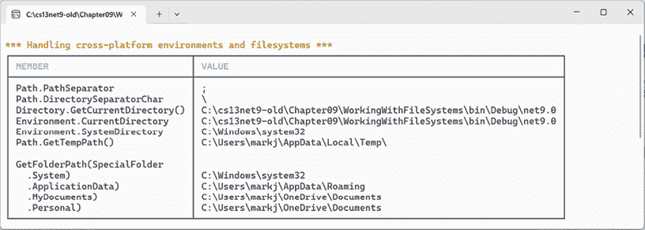
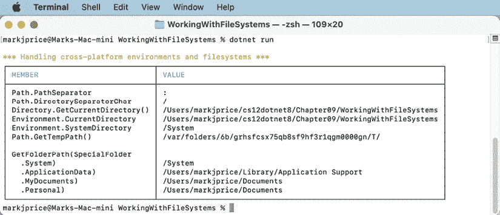
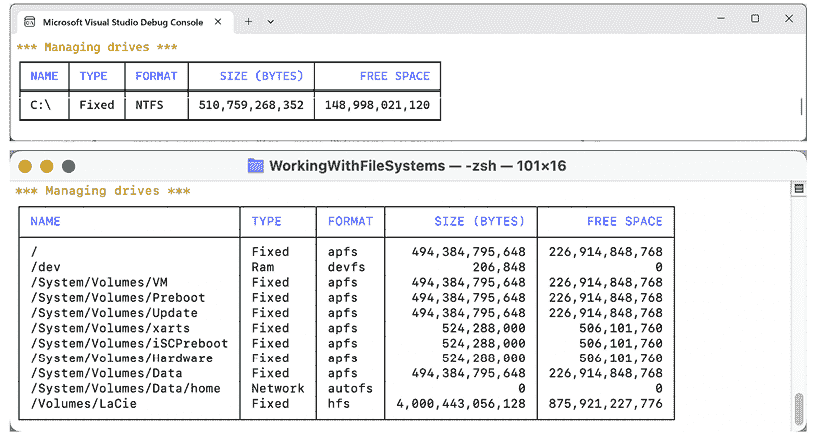
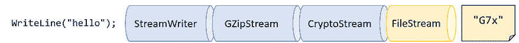
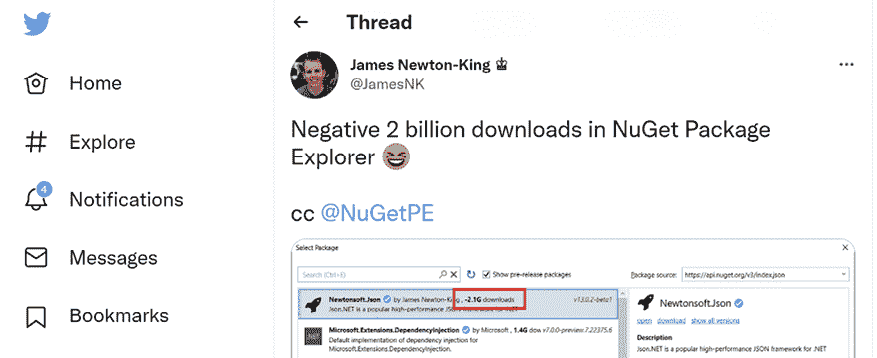

# 处理文件、流和序列化

本章主要介绍文件和流的读写操作、文本编码以及序列化。不与文件系统交互的应用程序非常罕见。作为一名.NET 开发者，你构建的几乎每个应用程序都需要管理文件系统，并创建、打开、读取和写入文件。大多数这些文件将包含文本，因此了解文本的编码方式非常重要。最后，在内存中处理对象之后，你还需要将它们永久存储起来以供以后重用。你可以使用一种称为序列化的技术来完成这项工作。

本章将涵盖以下主题：

+   管理文件系统

+   使用流进行读写操作

+   文本编码和解码

+   序列化对象图

# 管理文件系统

您的应用程序通常需要在不同的环境中对文件和目录执行输入和输出操作。`System` 和 `System.IO` 命名空间包含用于此目的的类。

## 处理跨平台环境和文件系统

让我们探索如何处理跨平台环境以及 Windows、Linux 和 macOS 之间的差异。Windows、macOS 和 Linux 的路径不同，因此我们将首先探讨 .NET 如何处理这个问题：

1.  使用您首选的代码编辑器创建一个新项目，如下所示：

    +   项目模板：**控制台应用程序** / `console`

    +   项目文件和文件夹：`WorkingWithFileSystems`

    +   解决方案文件和文件夹：`Chapter09`

1.  在项目文件中，添加对 `Spectre.Console` 的包引用，然后添加元素以静态和全局方式导入以下类：`System.Console`、`System.IO.Directory`、`System.IO.Path` 和 `System.Environment`，如下所示：

    ```cs
    <ItemGroup>
      <PackageReference Include="Spectre.Console" Version="0.47.0" />
    </ItemGroup>
    <ItemGroup>
      <Using Include="System.Console" Static="true" />
      <Using Include="System.IO.Directory" Static="true" />
      <Using Include="System.IO.Path" Static="true" />
      <Using Include="System.Environment" Static="true" />
    </ItemGroup> 
    ```

1.  构建用于恢复包的 `WorkingWithFileSystems` 项目。

1.  添加一个名为 `Program.Helpers.cs` 的新类文件。

1.  在 `Program.Helpers.cs` 中，添加一个部分 `Program` 类，包含一个 `SectionTitle` 方法，如下所示：

    ```cs
    // null namespace to merge with auto-generated Program.
    partial class Program
    {
      private static void SectionTitle(string title)
      {
        WriteLine();
        ConsoleColor previousColor = ForegroundColor;
        // Use a color that stands out on your system.
        ForegroundColor = ConsoleColor.DarkYellow;
        WriteLine($"*** {title} ***");
        ForegroundColor = previousColor;
      }
    } 
    ```

1.  在 `Program.cs` 中，添加语句以使用 `Spectre.Console` 表格执行以下操作：

    +   输出路径和目录分隔符。

    +   输出当前目录的路径。

    +   输出系统文件、临时文件和文档的一些特殊路径：

    ```cs
    using Spectre.Console; // To use Table.
    #region Handling cross-platform environments and filesystems
    SectionTitle("Handling cross-platform environments and filesystems");
    // Create a Spectre Console table.
    Table table = new();
    // Add two columns with markup for colors.
    table.AddColumn("[blue]MEMBER[/]");
    table.AddColumn("[blue]VALUE[/]");
    // Add rows.
    table.AddRow("Path.PathSeparator", PathSeparator.ToString());
    table.AddRow("Path.DirectorySeparatorChar",
      DirectorySeparatorChar.ToString());
    table.AddRow("Directory.GetCurrentDirectory()",
      GetCurrentDirectory());
    table.AddRow("Environment.CurrentDirectory", CurrentDirectory);
    table.AddRow("Environment.SystemDirectory", SystemDirectory);
    table.AddRow("Path.GetTempPath()", GetTempPath());
    table.AddRow("");
    table.AddRow("GetFolderPath(SpecialFolder", "");
    table.AddRow("  .System)", GetFolderPath(SpecialFolder.System));
    table.AddRow("  .ApplicationData)",
      GetFolderPath(SpecialFolder.ApplicationData));
    table.AddRow("  .MyDocuments)",
      GetFolderPath(SpecialFolder.MyDocuments));
    table.AddRow("  .Personal)",
      GetFolderPath(SpecialFolder.Personal));
    // Render the table to the console
    AnsiConsole.Write(table);
    #endregion 
    ```

    `Environment` 类型还有许多其他有用的成员，我们在这段代码中没有使用，包括 `OSVersion` 和 `ProcessorCount` 属性。

1.  运行代码并查看结果，如图 9.1 所示，使用 Windows 上的 Visual Studio：



图 9.1：使用 Windows 上的 Visual Studio 显示文件系统信息

**更多信息**：您可以在以下链接中了解更多关于使用 `Spectre Console` 表格的信息：[`spectreconsole.net/widgets/table`](https://spectreconsole.net/widgets/table)。

当在 Mac 上使用`dotnet run`运行控制台应用程序时，路径和目录分隔符字符不同，`CurrentDirectory`将是项目文件夹，而不是`bin`文件夹内的文件夹，如*图 9.2*所示：



图 9.2：在 macOS 上使用 CLI 显示文件系统信息

**良好实践**：Windows 使用反斜杠（`\`）作为目录分隔符字符。macOS 和 Linux 使用正斜杠（`/`）作为目录分隔符字符。在组合路径时，不要假设使用哪个字符，请使用`Path.DirectorySeparatorChar`。

在本章的后续部分，我们将在`Personal`特殊文件夹中创建目录和文件，因此请记下在您的操作系统中的位置。例如，如果您使用 Linux，它应该是`$USER/Documents`。

## 管理驱动器

要管理驱动器，请使用`DriveInfo`类型，它有一个静态方法，可以返回连接到您的计算机的所有驱动器的信息。每个驱动器都有一个驱动器类型。

让我们探索驱动器：

1.  在`Program.cs`中编写语句以获取所有驱动器并输出它们的名称、类型、大小、可用空间和格式，但仅当驱动器已准备好时，如下代码所示：

    ```cs
    SectionTitle("Managing drives");
    Table drives = new();
    drives.AddColumn("[blue]NAME[/]");
    drives.AddColumn("[blue]TYPE[/]");
    drives.AddColumn("[blue]FORMAT[/]");
    drives.AddColumn(new TableColumn(
      "[blue]SIZE (BYTES)[/]").RightAligned());
    drives.AddColumn(new TableColumn(
      "[blue]FREE SPACE[/]").RightAligned());
    foreach (DriveInfo drive in DriveInfo.GetDrives())
    {
      if (drive.IsReady)
      {
        drives.AddRow(drive.Name, drive.DriveType.ToString(),
          drive.DriveFormat, drive.TotalSize.ToString("N0"),
          drive.AvailableFreeSpace.ToString("N0"));
      }
      else
      {
        drives.AddRow(drive.Name, drive.DriveType.ToString(),
          string.Empty, string.Empty, string.Empty);
      }
    }
    AnsiConsole.Write(drives); 
    ```

**良好实践**：在读取`TotalSize`等属性之前，请检查驱动器是否已准备好，否则您将看到在可移动驱动器上抛出的异常。

在 Linux 上，默认情况下，当以普通用户身份运行时，您的控制台应用程序只能读取`Name`和`DriveType`属性。对于`DriveFormat`、`TotalSize`和`AvailableFreeSpace`将抛出`UnauthorizedAccessException`。以超级用户身份运行控制台应用程序以避免此问题，如下命令所示：`sudo dotnet run`。在开发环境中使用`sudo`是可以的，但在生产环境中，建议编辑您的权限以避免以提升权限运行。在 Linux 上，名称和驱动器格式列可能也需要更宽，例如，分别为 55 和 12 个字符宽。

1.  运行代码并查看结果，如*图 9.3*所示：

图 9.3：在 Windows 和 macOS 上显示驱动器信息

## 管理目录

要管理目录，请使用`Directory`、`Path`和`Environment`静态类。这些类型包括许多用于与文件系统交互的成员。

当构建自定义路径时，您必须小心编写代码，以确保它不针对平台做出假设，例如，使用什么作为目录分隔符字符：

1.  在`Program.cs`中编写语句以执行以下操作：

    +   在用户主目录下通过创建一个包含目录名称的字符串数组来定义一个自定义路径，然后使用`Path`类型的`Combine`方法正确地组合它们。

    +   使用`Directory`类的`Exists`方法检查自定义目录路径是否存在。

    +   使用`Directory`类的`CreateDirectory`和`Delete`方法创建然后删除目录，包括其内的文件和子目录：

        ```cs
        SectionTitle("Managing directories");
        string newFolder = Combine(
          GetFolderPath(SpecialFolder.Personal), "NewFolder");
        WriteLine($"Working with: {newFolder}");
        // We must explicitly say which Exists method to use
        // because we statically imported both Path and Directory.
        WriteLine($"Does it exist? {Path.Exists(newFolder)}");
        WriteLine("Creating it...");
        CreateDirectory(newFolder);
        // Let's use the Directory.Exists method this time.
        WriteLine($"Does it exist? {Directory.Exists(newFolder)}");
        Write("Confirm the directory exists, and then press any key.");
        ReadKey(intercept: true);
        WriteLine("Deleting it...");
        Delete(newFolder, recursive: true);
        WriteLine($"Does it exist? {Path.Exists(newFolder)}"); 
        ```

        在.NET 6 及之前版本中，只有`Directory`类有`Exists`方法。在.NET 7 或更高版本中，`Path`类也有`Exists`方法。两者都可以用来检查路径是否存在。

1.  运行代码，查看结果，并使用你喜欢的文件管理工具确认在按下*Enter*键删除之前已创建目录，如下所示输出：

    ```cs
    Working with: C:\Users\markj\OneDrive\Documents\NewFolder
    Does it exist? False
    Creating it...
    Does it exist? True
    Confirm the directory exists, and then press any key.
    Deleting it...
    Does it exist? False 
    ```

## 管理文件

当处理文件时，你可以静态导入文件类型，就像我们为目录类型所做的那样。然而，对于下一个示例，我们不会这样做，因为它有一些与目录类型相同的方法，它们可能会冲突。文件类型有足够短的名字，在这种情况下不会造成影响。步骤如下：

1.  在`Program.cs`中编写以下语句：

    1.  检查文件是否存在。

    1.  创建一个文本文件。

    1.  向文件中写入一行文本。

    1.  关闭文件以释放系统资源和解锁文件（这通常在`try`-`finally`语句块内完成，以确保即使在写入时发生异常，文件也能被关闭）。

    1.  将文件复制到备份中。

    1.  删除原始文件。

    1.  读取备份文件的 内容然后关闭它：

        ```cs
        SectionTitle("Managing files");
        // Define a directory path to output files starting
        // in the user's folder.
        string dir = Combine(
          GetFolderPath(SpecialFolder.Personal), "OutputFiles");
        CreateDirectory(dir);
        // Define file paths.
        string textFile = Combine(dir, "Dummy.txt");
        string backupFile = Combine(dir, "Dummy.bak");
        WriteLine($"Working with: {textFile}");
        WriteLine($"Does it exist? {File.Exists(textFile)}");
        // Create a new text file and write a line to it.
        StreamWriter textWriter = File.CreateText(textFile);
        textWriter.WriteLine("Hello, C#!");
        textWriter.Close(); // Close file and release resources.
        WriteLine($"Does it exist? {File.Exists(textFile)}");
        // Copy the file, and overwrite if it already exists.
        File.Copy(sourceFileName: textFile,
          destFileName: backupFile, overwrite: true);
        WriteLine(
          $"Does {backupFile} exist? {File.Exists(backupFile)}");
        Write("Confirm the files exist, and then press any key.");
        ReadKey(intercept: true);
        // Delete the file.
        File.Delete(textFile);
        WriteLine($"Does it exist? {File.Exists(textFile)}");
        // Read from the text file backup.
        WriteLine($"Reading contents of {backupFile}:");
        StreamReader textReader = File.OpenText(backupFile);
        WriteLine(textReader.ReadToEnd());
        textReader.Close(); 
        ```

1.  运行代码并查看结果，如下所示输出：

    ```cs
    Working with: C:\Users\markj\OneDrive\Documents\OutputFiles\Dummy.txt
    Does it exist? False
    Does it exist? True
    Does C:\Users\markj\OneDrive\Documents\OutputFiles\Dummy.bak exist? True
    Confirm the files exist, and then press any key.
    Does it exist? False
    Reading contents of C:\Users\markj\OneDrive\Documents\OutputFiles\Dummy.bak:
    Hello, C#! 
    ```

## 管理路径

有时，你需要处理路径的一部分；例如，你可能只想提取文件夹名、文件名或扩展名。有时，你需要生成临时文件夹和文件名。你可以使用`Path`类的静态方法来完成这些操作：

1.  在`Program.cs`中添加以下语句：

    ```cs
    SectionTitle("Managing paths");
    WriteLine($"Folder Name: {GetDirectoryName(textFile)}");
    WriteLine($"File Name: {GetFileName(textFile)}");
    WriteLine("File Name without Extension: {0}",
      GetFileNameWithoutExtension(textFile));
    WriteLine($"File Extension: {GetExtension(textFile)}");
    WriteLine($"Random File Name: {GetRandomFileName()}");
    WriteLine($"Temporary File Name: {GetTempFileName()}"); 
    ```

1.  运行代码并查看结果，如下所示输出：

    ```cs
    Folder Name: C:\Users\markj\OneDrive\Documents\OutputFiles
    File Name: Dummy.txt
    File Name without Extension: Dummy
    File Extension: .txt
    Random File Name: u45w1zki.co3
    Temporary File Name:
    C:\Users\markj\AppData\Local\Temp\tmphdmipz.tmp 
    ```

`GetTempFileName`创建一个零字节的文件并返回其名称，供你使用。`GetRandomFileName`仅返回一个文件名；它不会创建文件。

## 获取文件信息

要获取有关文件或目录的更多信息，例如大小或最后访问时间，你可以创建`FileInfo`或`DirectoryInfo`类的实例。

`FileInfo`和`DirectoryInfo`都继承自`FileSystemInfo`，因此它们都有`LastAccessTime`和`Delete`等成员，以及一些特定于自身的额外成员，如*表 9.1*所示：

| **类** | **成员** |
| --- | --- |
| `FileSystemInfo` | 字段：`FullPath`和`OriginalPath`属性：`Attributes`、`CreationTime`、`CreationTimeUtc`、`Exists`、`Extension`、`FullName`、`LastAccessTime`、`LastAccessTimeUtc`、`LastWriteTime`、`LastWriteTimeUtc`和`Name`方法：`Delete`、`GetObjectData`和`Refresh` |
| `DirectoryInfo` | 属性：`Parent`和`Root`方法：`Create`、`CreateSubdirectory`、`EnumerateDirectories`、`EnumerateFiles`、`EnumerateFileSystemInfos`、`GetAccessControl`、`GetDirectories`、`GetFiles`、`GetFileSystemInfos`、`MoveTo`和`SetAccessControl` |
| `FileInfo` | 属性：`Directory`, `DirectoryName`, `IsReadOnly`, 和 `Length` 方法：`AppendText`, `CopyTo`, `Create`, `CreateText`, `Decrypt`, `Encrypt`, `GetAccessControl`, `MoveTo`, `Open`, `OpenRead`, `OpenText`, `OpenWrite`, `Replace`, 和 `SetAccessControl` |

表 9.1：获取文件和目录信息的类

让我们编写一些使用`FileInfo`实例来高效地对文件执行多个操作的代码：

1.  在`Program.cs`中，添加语句以创建备份文件的`FileInfo`实例，并将其信息写入控制台，如下面的代码所示：

    ```cs
    SectionTitle("Getting file information");
    FileInfo info = new(backupFile);
    WriteLine($"{backupFile}:");
    WriteLine($"  Contains {info.Length} bytes.");
    WriteLine($"  Last accessed: {info.LastAccessTime}");
    WriteLine($"  Has readonly set to {info.IsReadOnly}."); 
    ```

1.  运行代码并查看以下输出结果：

    ```cs
    C:\Users\markj\OneDrive\Documents\OutputFiles\Dummy.bak:
      Contains 12 bytes.
      Last accessed: 13/07/2023 12:11:12
      Has readonly set to False. 
    ```

在您的操作系统上，字节数可能不同，因为操作系统可以使用不同的行结束符。

## 控制如何处理文件

当处理文件时，您通常需要控制它们的打开方式。`File.Open`方法有重载，可以使用`enum`值指定附加选项。

`enum`类型如下：

+   `FileMode`：这控制了您想要对文件执行的操作，如`CreateNew`、`OpenOrCreate`或`Truncate`。

+   `FileAccess`：这控制您需要的访问级别，如`ReadWrite`。

+   `FileShare`：这控制对文件的锁定，以允许其他进程以指定的级别访问，如`Read`。

您可能想要打开一个文件并从中读取，同时允许其他进程读取它，如下面的代码所示：

```cs
FileStream file = File.Open(pathToFile,
  FileMode.Open, FileAccess.Read, FileShare.Read); 
```

同样还有一个`enum`用于文件的属性，`FileAttributes`，它会检查`FileSystemInfo`派生类型的`Attributes`属性，以获取如`Archive`和`Encrypted`之类的值。例如，您可以检查文件或目录的属性，如下面的代码所示：

```cs
FileInfo info = new(backupFile);
WriteLine("Is the backup file compressed? {0}",
  info.Attributes.HasFlag(FileAttributes.Compressed)); 
```

`File`类中管理文件的所有方法都有一个参数，用于指定文件路径作为`string`值。`File`类、其方法和它们的返回值的附加参数如下所示*表 9.2*：

| **方法** | **特殊参数** | **返回值** | **说明** |
| --- | --- | --- | --- |
| `Open` | `FileMode`, `FileAccess`, `FileShare` | `FileStream` | 以字节级别访问文件。 |
| `OpenWrite` |  | `FileStream` | 从开始覆盖但不截断。 |
| `Create` | `FileOptions` | `FileStream` | 覆盖并截断。 |
| `OpenText` |  | `StreamReader` | 用于读取文本文件。 |
| `CreateText` |  | `StreamWriter` | 覆盖并截断。 |
| `AppendText` |  | `StreamWriter` | 如果文件不存在，则创建文件。 |
| `ReadAllLines` | `Encoding` | `string[]` | 警告！对于大文件，这会使用大量内存。 |
| `ReadAllText` | `Encoding` | `string` | 警告！对于大文件，这会使用大量内存。 |
| `WriteAllText` | `string`, `Encoding` | `void` |  |
| `AppendAllText` | `string`, `Encoding` | `void` |  |
| `WriteAllLines` | `string[]`, `IEnumerable<string>`, `Encoding` | `void` |  |
| `AppendAllLines` | `string[]`, `IEnumerable<string>`, `Encoding` | `void` |  |

表 9.2：文件类及其方法

现在你已经学习了在文件系统中处理目录和文件的一些常见方法，接下来我们需要学习如何读取和写入存储在文件中的数据，即如何使用流。

# 使用流进行读写

在 *第十章*，*使用 Entity Framework Core 处理数据* 中，你将使用一个名为 `Northwind.db` 的文件，但你不会直接与文件交互。相反，你将与 SQLite 数据库引擎交互，它反过来会读取和写入文件。在没有其他系统“拥有”文件并为你进行读写操作的情况下，你将使用文件流直接与文件交互。

**流**是一系列可以读取和写入的字节。虽然文件可以像数组一样处理，通过知道文件中字节的定位来提供随机访问，但将文件作为流处理更有效，其中字节可以按顺序访问。当人类进行处理时，他们往往需要随机访问，以便可以在数据中跳跃，进行更改，然后返回到之前工作的数据。当自动化系统进行处理时，它往往可以按顺序工作，并且只需要“接触”数据一次。

流也可以用来处理终端输入输出和网络资源，例如套接字和端口，这些资源不提供随机访问且不能进行定位（即移动）到某个位置。你可以编写代码来处理一些任意的字节，而不必知道或关心它们来自何处。你的代码只需简单地读取或写入流，而另一段代码则处理字节存储的位置。

## 理解抽象和具体流

有一个名为 `Stream` 的抽象类，代表任何类型的流。请记住，抽象类不能使用 `new` 实例化；它只能被继承。这是因为它只部分实现了。

有许多具体类继承自这个基类，包括 `FileStream`、`MemoryStream`、`BufferedStream`、`GZipStream` 和 `SslStream`。它们的工作方式相同。所有流都实现了 `IDisposable`，因此它们都有一个 `Dispose` 方法来释放非托管资源。

`Stream` 类的一些常见成员在 *表 9.3* 中进行了描述：

| **成员** | **描述** |
| --- | --- |
| `CanRead` 和 `CanWrite` | 这些属性确定你是否可以从流中读取和写入。 |
| `Length` 和 `Position` | 这些属性确定流中的总字节数和当前位置。对于某些类型的流，这些属性可能会抛出 `NotSupportedException`，例如，如果 `CanSeek` 返回 `false`。 |
| `Close` 和 `Dispose` | 此方法关闭流并释放其资源。你可以调用任一方法，因为 `Dispose` 的实现调用了 `Close`！ |
| `Flush` | 如果流有一个缓冲区，则此方法将缓冲区中的字节写入流，并清除缓冲区。 |
| `CanSeek` | 此属性确定是否可以使用`Seek`方法。 |
| `Seek` | 此方法将当前位置移动到其参数中指定的位置。 |
| `Read` 和 `ReadAsync` | 这些方法将指定数量的字节从流中读取到字节数组中并前进位置。 |
| `ReadByte` | 此方法从流中读取下一个字节并前进位置。 |
| `Write` 和 `WriteAsync` | 这些方法将字节数组的内容写入流。 |
| `WriteByte` | 此方法将一个字节写入流。 |

表 9.3：Stream 类的常见成员

## 理解存储流

一些表示字节存储位置的存储流在*表 9.4*中描述：

| **命名空间** | **类** | **描述** |
| --- | --- | --- |
| `System.IO` | `FileStream` | 存储在文件系统中的字节 |
| `System.IO` | `MemoryStream` | 存储在当前进程中的内存中的字节 |
| `System.Net.Sockets` | `NetworkStream` | 存储在网络位置的字节 |

表 9.4：存储流类

`FileStream`在.NET 6 中已重写，以在 Windows 上提供更高的性能和可靠性。您可以在以下链接中了解更多信息：[`devblogs.microsoft.com/dotnet/file-io-improvements-in-dotnet-6/`](https://devblogs.microsoft.com/dotnet/file-io-improvements-in-dotnet-6/)。

## 理解函数流

函数流不能独立存在，只能“插入”到其他流中以添加功能。其中一些在*表 9.5*中描述：

| **命名空间** | **类** | **描述** |
| --- | --- | --- |
| `System.Security.Cryptography` | `CryptoStream` | 此流进行加密和解密。 |
| `System.IO.Compression` | `GZipStream`, `DeflateStream` | 这些压缩和解压缩流。 |
| `System.Net.Security` | `AuthenticatedStream` | 此方法通过流发送凭据。 |

表 9.5：函数流类

## 理解流辅助

尽管有时您需要以低级别处理流，但大多数情况下，您可以将辅助类插入链中，使事情变得更容易。所有流辅助类型都实现`IDisposable`，因此它们有一个`Dispose`方法来释放非托管资源。

一些用于处理常见场景的辅助类在*表 9.6*中描述：

| **命名空间** | **类** | **描述** |
| --- | --- | --- |
| `System.IO` | `StreamReader` | 此以纯文本形式从底层流中读取。 |
| `System.IO` | `StreamWriter` | 此以纯文本形式将底层流写入。 |
| `System.IO` | `BinaryReader` | 此读取流作为.NET 类型。例如，`ReadDecimal`方法从底层流中读取下一个 16 字节作为`decimal`值，而`ReadInt32`方法读取下一个 4 字节作为`int`值。 |
| `System.IO` | `BinaryWriter` | 此将.NET 类型写入流。例如，具有`decimal`参数的`Write`方法将 16 字节写入底层流，而具有`int`参数的`Write`方法写入 4 字节。 |
| `System.Xml` | `XmlReader` | 这使用 XML 格式从底层流中读取。 |
| `System.Xml` | `XmlWriter` | 这使用 XML 格式将数据写入底层流。 |

表 9.6：流辅助类

## 构建流管道

将辅助器，如 `StreamWriter`，多个功能流，如 `GZipStream` 和 `CryptoStream`，以及存储流，如 `FileStream`，组合成管道是很常见的，如图 *9.4* 所示：



图 9.4：将纯文本写入，然后将其加密并压缩到文件流中

你的代码只需调用一个简单的辅助方法，如 `WriteLine`，将一个 `string` 值，如 `"Hello"`，通过管道发送，直到它到达最终目的地，经过压缩和加密后，被写入文件作为 `"``G7x"`（或任何其他值）。

**良好实践**：“*良好的加密将生成相对不可压缩的数据。如果你改变操作的顺序，先压缩再加密，不仅最终文件会更小，而且加密很可能花费更少的时间，因为它将处理更少的数据*。” 来自 Stephen Toub 的文章：[`learn.microsoft.com/en-us/archive/msdn-magazine/2008/february/net-matters-stream-pipeline`](https://learn.microsoft.com/en-us/archive/msdn-magazine/2008/february/net-matters-stream-pipeline)。

## 写入文本流

当你打开一个文件进行读取或写入时，你使用 .NET 之外的资源。这些被称为 **未托管资源**，在完成与它们的操作后必须释放。

为了确定性地控制这些资源何时被释放，我们可以调用 `Dispose` 方法。当 `Stream` 类最初设计时，所有清理代码都预期放在 `Close` 方法中。但后来，.NET 中添加了 `IDisposable` 的概念，`Stream` 必须实现 `Dispose` 方法。后来，.NET 中添加了 `using` 语句，它可以自动调用 `Dispose`。所以今天，你可以调用 `Close` 或 `Dispose`，实际上它们做的是同一件事。

让我们输入一些代码来将文本写入流：

1.  使用你喜欢的代码编辑器，向 `Chapter09` 解决方案中添加一个名为 `WorkingWithStreams` 的新 **控制台应用程序**/ `console` 项目：

1.  在项目文件中，添加一个元素以导入 `System.Console`、`System.Environment` 和 `System.IO.Path` 类，静态和全局地。

1.  添加一个名为 `Program.Helpers.cs` 的新类文件。

1.  在 `Program.Helpers.cs` 中，添加一个部分 `Program` 类，包含 `SectionTitle` 和 `OutputFileInfo` 方法，如下面的代码所示：

    ```cs
    // null namespace to merge with auto-generated Program.
    partial class Program
    {
      private static void SectionTitle(string title)
      {
        ConsoleColor previousColor = ForegroundColor;
        ForegroundColor = ConsoleColor.DarkYellow;
        WriteLine($"*** {title} ***");
        ForegroundColor = previousColor;
      }
      private static void OutputFileInfo(string path)
      {
        WriteLine("**** File Info ****");
        WriteLine($"File: {GetFileName(path)}");
        WriteLine($"Path: {GetDirectoryName(path)}");
        WriteLine($"Size: {new FileInfo(path).Length:N0} bytes.");
        WriteLine("/------------------");
        WriteLine(File.ReadAllText(path));
        WriteLine("------------------/");
      }
    } 
    ```

1.  添加一个名为 `Viper.cs` 的新类文件。

1.  在 `Viper.cs` 中，定义一个名为 `Viper` 的静态类，其中包含一个名为 `Callsigns` 的静态 `string` 值数组，如下面的代码所示：

    ```cs
    namespace Packt.Shared;
    public static class Viper
    {
      // Define an array of Viper pilot call signs.
      public static string[] Callsigns = new[]
      {
        "Husker", "Starbuck", "Apollo", "Boomer",
        "Bulldog", "Athena", "Helo", "Racetrack"
      };
    } 
    ```

1.  在 `Program.cs` 文件中，删除现有的语句，然后导入命名空间以使用 `Viper` 类，如下面的代码所示：

    ```cs
    using Packt.Shared; // To use Viper. 
    ```

1.  在 `Program.cs` 中添加语句以枚举 `Viper` 呼号，将每个呼号单独写入一个文本文件的一行中，如下面的代码所示：

    ```cs
    SectionTitle("Writing to text streams");
    // Define a file to write to.
    string textFile = Combine(CurrentDirectory, "streams.txt");
    // Create a text file and return a helper writer.
    StreamWriter text = File.CreateText(textFile);
    // Enumerate the strings, writing each one to the stream
    // on a separate line.
    foreach (string item in Viper.Callsigns)
    {
      text.WriteLine(item);
    }
    text.Close(); // Release unmanaged file resources.
    OutputFileInfo(textFile); 
    ```

在流写入辅助工具上调用 `Close` 将会调用底层流的 `Close`。这反过来会调用 `Dispose` 以释放非托管文件资源。

1.  运行代码并查看结果，如下面的输出所示：

    ```cs
    **** File Info ****
    File: streams.txt
    Path: C:\cs13net9\Chapter09\WorkingWithStreams\bin\Debug\net9.0
    Size: 68 bytes.
    /------------------
    Husker
    Starbuck
    Apollo
    Boomer
    Bulldog
    Athena
    Helo
    Racetrack
    ------------------/ 
    ```

1.  打开创建的文件，并确认它包含呼号列表以及一个空行，因为我们实际上调用了两次 `WriteLine`：一次是在将最后一个呼号写入文件时，另一次是在读取整个文件并将其写入控制台时。

记住，如果您使用 `dotnet run` 在命令提示符下运行项目，则路径将是项目文件夹。它不会包括 `bin\Debug\net9.0`。

## 写入 XML 流

有两种方式来编写 XML 元素，如下所示：

+   `WriteStartElement` 和 `WriteEndElement`：当元素可能有子元素时使用此对。

+   `WriteElementString`：当元素没有子元素时使用此方法。

现在，让我们尝试将 Viper 飞行员的呼号数组（`string` 类型的值）存储在一个 XML 文件中：

1.  在 `Program.cs` 的顶部导入 `System.Xml` 命名空间，如下面的代码所示：

    ```cs
    using System.Xml; // To use XmlWriter and so on. 
    ```

1.  在 `Program.cs` 的底部添加语句以枚举呼号，将每个呼号作为单个 XML 文件中的一个元素写入，如下面的代码所示：

    ```cs
    SectionTitle("Writing to XML streams");
    // Define a file path to write to.
    string xmlFile = Combine(CurrentDirectory, "streams.xml");
    // Declare variables for the filestream and XML writer.
    FileStream? xmlFileStream = null;
    XmlWriter? xml = null;
    try
    {
      xmlFileStream = File.Create(xmlFile);
      // Wrap the file stream in an XML writer helper and tell it
      // to automatically indent nested elements.
      xml = XmlWriter.Create(xmlFileStream,
        new XmlWriterSettings { Indent = true });
      // Write the XML declaration.
      xml.WriteStartDocument();
      // Write a root element.
      xml.WriteStartElement("callsigns");
      // Enumerate the strings, writing each one to the stream.
      foreach (string item in Viper.Callsigns)
      {
        xml.WriteElementString("callsign", item);
      }
      // Write the close root element.
      xml.WriteEndElement();
    }
    catch (Exception ex)
    {
      // If the path doesn't exist the exception will be caught.
      WriteLine($"{ex.GetType()} says {ex.Message}");
    }
    finally
    {
      if (xml is not null)
      {
        xml.Close();
        WriteLine("The XML writer's unmanaged resources have been disposed.");
      }
      if (xmlFileStream is not null)
      {
        xmlFileStream.Close();
        WriteLine("The file stream's unmanaged resources have been disposed.");
      }
    }
    OutputFileInfo(xmlFile); 
    ```

1.  可选地，在 `xmlFileStream` 的 `Close` 方法上右键单击，选择 **转到实现**，并注意 `Dispose`、`Close` 和 `Dispose(bool)` 方法的实现，如下面的代码所示：

    ```cs
    public void Dispose() => Close();
    public virtual void Close()
    {
      // When initially designed, Stream required that all cleanup logic
      // went into Close(), but this was thought up before IDisposable
      // was added and never revisited. All subclasses
      // should put their cleanup now in Dispose(bool).
      Dispose(true);
      GC.SuppressFinalize(this);
    }
    protected virtual void Dispose(bool disposing)
    {
      // Note: Never change this to call other virtual methods on Stream
      // like Write, since the state on subclasses has already been
      // torn down.  This is the last code to run on cleanup for a stream.
    } 
    ```

`Stream` 类中的 `Close` 和 `Dispose(bool)` 方法是 `virtual` 的，因为它们被设计为在派生类（如 `FileStream`）中重写，以执行释放非托管资源的工作。

1.  运行代码并查看结果，如下面的输出所示：

    ```cs
    **** File Info ****
    The XML writer's unmanaged resources have been disposed.
    The file stream's unmanaged resources have been disposed.
    File: streams.xml
    Path: C:\cs13net9\Chapter09\WorkingWithStreams\bin\Debug\net9.0
    Size: 320 bytes.
    /------------------
    <?xml version="1.0" encoding="utf-8"?>
    <callsigns>
      <callsign>Husker</callsign>
      <callsign>Starbuck</callsign>
      <callsign>Apollo</callsign>
      <callsign>Boomer</callsign>
      <callsign>Bulldog</callsign>
      <callsign>Athena</callsign>
      <callsign>Helo</callsign>
      <callsign>Racetrack</callsign>
    </callsigns>
    -------------------/ 
    ```

**良好实践**：在调用 `Dispose` 方法之前，请检查对象是否不是 `null`。

## 使用 `using` 语句简化释放

您可以使用 `using` 语句简化需要检查 `null` 对象并调用其 `Dispose` 方法的代码。除非您需要更高程度的控制，否则我通常会推荐使用 `using` 而不是手动调用 `Dispose`，因为它更简洁。

令人困惑的是，`using` 关键字有两种用法：导入命名空间和生成一个调用实现 `IDisposable` 接口的对象的 `Dispose` 方法的 `finally` 语句。

编译器将 `using` 语句块转换为没有 `catch` 语句的 `try`-`finally` 语句。您可以使用嵌套的 `try` 语句，因此如果您确实想捕获任何异常，您可以，如下面的代码示例所示：

```cs
using (FileStream file2 = File.OpenWrite(
  Path.Combine(path, "file2.txt")))
{
  using (StreamWriter writer2 = new StreamWriter(file2))
  {
    try
    {
      writer2.WriteLine("Welcome, .NET!");
    }
    catch(Exception ex)
    {
      WriteLine($"{ex.GetType()} says {ex.Message}");
    }
  } // Automatically calls Dispose if the object is not null.
} // Automatically calls Dispose if the object is not null. 
```

您甚至可以通过不显式指定 `using` 语句的大括号和缩进来进一步简化代码，如下面的代码所示：

```cs
using FileStream file2 = File.OpenWrite(
  Path.Combine(path, "file2.txt"));
using StreamWriter writer2 = new(file2);
try
{
  writer2.WriteLine("Welcome, .NET!");
}
catch(Exception ex)
{
  WriteLine($"{ex.GetType()} says {ex.Message}");
} 
```

为了使这更清晰，让我们回顾一个更简单的例子。您可以使用`using`块确保在作用域结束时调用`Dispose`方法，如下面的代码所示：

```cs
using (ObjectWithUnmanagedResources thing = new())
{
  // Statements that use thing.
} 
```

**更多信息**：您可以在以下链接中了解前面的代码是如何转换为`try-catch`块的：[`github.com/markjprice/cs13net9/blob/main/docs/ch06-memory.md#ensuring-that-dispose-is-called`](https://github.com/markjprice/cs13net9/blob/main/docs/ch06-memory.md#ensuring-that-dispose-is-called)。如果您还没有阅读，您也应该阅读以下在线部分：[`github.com/markjprice/cs13net9/blob/main/docs/ch06-memory.md#releasing-unmanaged-resources`](https://github.com/markjprice/cs13net9/blob/main/docs/ch06-memory.md#releasing-unmanaged-resources)。

您还可以使用不带花括号的简化语法，如下面的代码所示：

```cs
using ObjectWithUnmanagedResources thing = new();
// Statements that use thing.
// Dispose called at the end of the container scope e.g. method. 
```

在前面的代码示例中，没有显式定义由花括号定义的块，因此定义了一个隐式块，该块在包含作用域的末尾结束。

**更多信息**：您可以在以下链接中了解更多信息：[`learn.microsoft.com/en-us/dotnet/csharp/language-reference/proposals/csharp-8.0/using`](https://learn.microsoft.com/en-us/dotnet/csharp/language-reference/proposals/csharp-8.0/using) 和 [`learn.microsoft.com/en-us/dotnet/csharp/language-reference/language-specification/statements#1314-the-using-statement`](https://learn.microsoft.com/en-us/dotnet/csharp/language-reference/language-specification/statements#1314-the-using-statement)。

## 压缩流

XML 相对冗长，因此它占用的字节数比纯文本多。让我们看看如何使用常见的压缩算法 GZIP 来压缩 XML。

在.NET Core 2.1 中，Microsoft 引入了 Brotli 压缩算法的实现。在性能上，Brotli 类似于 DEFLATE 和 GZIP 中使用的算法，但输出密度大约高 20%。

让我们比较两种压缩算法：

1.  添加一个名为`Program.Compress.cs`的新类文件。

1.  在`Program.Compress.cs`中，编写语句以使用`GZipStream`或`BrotliStream`的实例创建包含与之前相同的 XML 元素的压缩文件，然后在其读取并输出到控制台的同时对其进行解压缩，如下面的代码所示：

    ```cs
    using Packt.Shared; // To use Viper.
    using System.IO.Compression; // To use BrotliStream, GZipStream.
    using System.Xml; // To use XmlWriter, XmlReader.
    partial class Program
    {
      private static void Compress(string algorithm = "gzip")
      {
        // Define a file path using the algorithm as file extension.
        string filePath = Combine(
          CurrentDirectory, $"streams.{algorithm}");
        FileStream file = File.Create(filePath);
        Stream compressor;
        if (algorithm == "gzip")
        {
          compressor = new GZipStream(file, CompressionMode.Compress);
        }
        else
        {
          compressor = new BrotliStream(file, CompressionMode.Compress);
        }
        using (compressor)
        {
          using (XmlWriter xml = XmlWriter.Create(compressor))
          {
            xml.WriteStartDocument();
            xml.WriteStartElement("callsigns");
            foreach (string item in Viper.Callsigns)
            {
              xml.WriteElementString("callsign", item);
            }
          }
        } // Also closes the underlying stream.
        OutputFileInfo(filePath);
        // Read the compressed file.
        WriteLine("Reading the compressed XML file:");
        file = File.Open(filePath, FileMode.Open);
        Stream decompressor;
        if (algorithm == "gzip")
        {
          decompressor = new GZipStream(
            file, CompressionMode.Decompress);
        }
        else
        {
          decompressor = new BrotliStream(
            file, CompressionMode.Decompress);
        }
        using (decompressor)

        using (XmlReader reader = XmlReader.Create(decompressor))

        while (reader.Read())
        {
          // Check if we are on an element node named callsign.
          if ((reader.NodeType == XmlNodeType.Element)
            && (reader.Name == "callsign"))
          {
            reader.Read(); // Move to the text inside element.
            WriteLine($"{reader.Value}"); // Read its value.
          }
          // Alternative syntax with property pattern matching:
          // if (reader is { NodeType: XmlNodeType.Element,
          //   Name: "callsign" })
        }
      }
    } 
    ```

使用`decompressor`对象的代码不使用简化的`using`语法。相反，它利用了`using`块可以省略其花括号以表示单个“语句”的事实，就像`if`语句一样。记住，即使一个块内只执行了一个语句，`if`语句也可以有显式的花括号，如下面的代码所示：

```cs
if (c = 1)
{
// Execute a single statement.
}
if (c = 1)
// Execute a single statement.
using (someObject)
{
// Execute a single statement.
}
using (someObject)
// Execute a single statement 
```

在前面的代码中，`using (XmlReader reader = XmlReader.Create(decompressor))`和整个`while (reader.Read()) { ... }`块相当于单个语句，因此我们可以省略花括号，代码按预期工作。

1.  在`Program.cs`中，添加调用`Compress`的语句，使用`gzip`和`brotli`算法，如下面的代码所示：

    ```cs
    SectionTitle("Compressing streams");
    Compress(algorithm: "gzip");
    Compress(algorithm: "brotli"); 
    ```

1.  运行代码，并使用`gzip`和`brotli`算法比较 XML 文件和压缩 XML 文件的大小，如下面的输出所示：

    ```cs
    **** File Info ****
    File: streams.gzip
    Path: C:\cs13net9\Chapter09\WorkingWithStreams\bin\Debug\net9.0
    Size: 151 bytes.
    /------------------
    ­?
    z?{??}En?BYjQqf~???????Bj^r~Jf^??RiI??????MrbNNqfz¹?i?QZ??Zd?@H?$%?&gc?t,
    ?????*????H?????t?&?d??%b??H?aUPbrjIQ"??b;????9
    ------------------/
    Reading the compressed XML file:
    Husker
    Starbuck
    Apollo
    Boomer
    Bulldog
    Athena
    Helo
    Racetrack
    **** File Info ****
    File: streams.brotli
    Path: C:\cs13net9\Chapter09\WorkingWithStreams\bin\Debug\net9.0
    Size: 117 bytes.
    /-------------------
     ??d?&?_????\@?Gm????/?h>?6????? ??^?__???wE?'?t<J??]??
    ???b?\fA?>?+??F??]
    ?T?\?~??A?J?Q?q6 ?-??
    ???
    --------------------/
    Reading the compressed XML file:
    Husker
    Starbuck
    Apollo
    Boomer
    Bulldog
    Athena
    Helo
    Racetrack 
    ```

总结文件大小：

+   未压缩：320 字节

+   GZIP 压缩：151 字节

+   Brotli 压缩：117 字节

除了选择压缩模式外，您还可以选择压缩级别。您可以在以下链接中了解更多信息：[`learn.microsoft.com/en-us/dotnet/api/system.io.compression.compressionlevel`](https://learn.microsoft.com/en-us/dotnet/api/system.io.compression.compressionlevel)。

## 使用随机访问句柄进行读写

在.NET 生命的头 20 年里，直接与文件工作的唯一 API 是流类 API。这些对于只需要按顺序处理数据的自动化任务非常出色。但当人类与数据交互时，他们通常会跳来跳去，多次返回到同一位置。

在.NET 6 及以后版本中，有一个新的 API 用于以随机访问方式处理文件，无需使用文件流。让我们看看一个简单的例子：

1.  使用您首选的代码编辑器，将名为`WorkingWithRandomAccess`的新**控制台应用程序**/`console`项目添加到`Chapter09`解决方案中：

1.  在项目文件中，添加一个元素以静态和全局方式导入`System.Console`类。

1.  在`Program.cs`中删除现有语句，然后获取名为`coffee.txt`的文件句柄，如下面的代码所示：

    ```cs
    using Microsoft.Win32.SafeHandles; // To use SafeFileHandle.
    using System.Text; // To use Encoding.
    using SafeFileHandle handle =
      File.OpenHandle(path: "coffee.txt",
        mode: FileMode.OpenOrCreate,
        access: FileAccess.ReadWrite); 
    ```

1.  将一些编码为字节数组的文本写入，然后将其存储到文件中的只读内存缓冲区中，如下面的代码所示：

    ```cs
    string message = "Café £4.39";
    ReadOnlyMemory<byte> buffer = new(Encoding.UTF8.GetBytes(message));
    await RandomAccess.WriteAsync(handle, buffer, fileOffset: 0); 
    ```

1.  要从文件中读取，获取文件长度，使用该长度分配内存缓冲区以存储内容，然后读取文件，如下面的代码所示：

    ```cs
    long length = RandomAccess.GetLength(handle);
    Memory<byte> contentBytes = new(new byte[length]);
    await RandomAccess.ReadAsync(handle, contentBytes, fileOffset: 0);
    string content = Encoding.UTF8.GetString(contentBytes.ToArray());
    WriteLine($"Content of file: {content}"); 
    ```

1.  运行代码，并注意文件内容，如下面的输出所示：

    ```cs
    Content of file: Café £4.39 
    ```

# 文本编码和解码

文本字符可以用不同的方式表示。例如，字母表可以用摩尔斯电码编码成一系列点和划，以便在电报线上传输。

类似地，计算机内的文本以位（一和零）的形式存储，代表代码空间内的代码点。大多数代码点代表单个字符，但它们也可以有其他含义，如格式化。

例如，ASCII 有 128 个代码点。.NET 使用一个称为**Unicode**的标准来内部编码文本。Unicode 有超过一百万个代码点。

有时，你需要将文本移出.NET，以便由不使用 Unicode 或其变体的系统使用，因此学习如何在编码之间进行转换是很重要的。

计算机使用的常见文本编码如下表所示：

| **编码** | **描述** |
| --- | --- |
| ASCII | 使用字节的低 7 位编码字符的有限范围。 |
| UTF-8 | 这表示每个 Unicode 代码点为一个 1 到 4 字节的序列。 |
| UTF-7 | 这是为了在 7 位通道上比 UTF-8 更有效，但它存在安全和健壮性问题，因此建议使用 UTF-8 而不是 UTF-7。 |
| UTF-16 | 这表示每个 Unicode 代码点为一个或两个 16 位整数的序列。 |
| UTF-32 | 这表示每个 Unicode 代码点为一个 32 位整数，因此是一个固定长度编码，与所有其他 Unicode 编码不同，它们都是可变长度编码。 |
| ANSI/ISO 编码 | 这提供了对各种代码页的支持，这些代码页用于支持特定的语言或语言组。 |

表 9.7：常见文本编码

**良好实践**：在当今大多数情况下，UTF-8 是一个好的默认编码，这也是为什么它是字面上的默认编码，即 `Encoding.Default`。您应该避免使用 `Encoding.UTF7`，因为它不安全。因此，当您尝试使用 UTF-7 时，C# 编译器会警告您。当然，您可能需要使用该编码生成文本以与其他系统兼容，因此它需要在 .NET 中保留为一个选项。

## 将字符串编码为字节数组

让我们探索文本编码：

1.  使用您首选的代码编辑器，将一个新的 **Console App** / `console` 项目，命名为 `WorkingWithEncodings`，添加到 `Chapter09` 解决方案中。

1.  在项目文件中，添加一个元素以静态和全局导入 `System.Console` 类。

1.  在 `Program.cs` 中，删除现有的语句，导入 `System.Text` 命名空间，添加语句以使用用户选择的编码编码一个 `string`，循环遍历每个字节，然后将编码的值解码回 `string` 并输出，如下面的代码所示：

    ```cs
    using System.Text; // To use Encoding.
    WriteLine("Encodings");
    WriteLine("[1] ASCII");
    WriteLine("[2] UTF-7");
    WriteLine("[3] UTF-8");
    WriteLine("[4] UTF-16 (Unicode)");
    WriteLine("[5] UTF-32");
    WriteLine("[6] Latin1");
    WriteLine("[any other key] Default encoding");
    WriteLine();
    Write("Press a number to choose an encoding.");
    ConsoleKey number = ReadKey(intercept: true).Key;
    WriteLine(); WriteLine();
    Encoding encoder = number switch
    {
      ConsoleKey.D1 or ConsoleKey.NumPad1 => Encoding.ASCII,
      ConsoleKey.D2 or ConsoleKey.NumPad2 => Encoding.UTF7,
      ConsoleKey.D3 or ConsoleKey.NumPad3 => Encoding.UTF8,
      ConsoleKey.D4 or ConsoleKey.NumPad4 => Encoding.Unicode,
      ConsoleKey.D5 or ConsoleKey.NumPad5 => Encoding.UTF32,
      ConsoleKey.D6 or ConsoleKey.NumPad6 => Encoding.Latin1,
      _  => Encoding.Default
    };
    // Define a string to encode
    string message = "Café £4.39";
    WriteLine($"Text to encode: {message}  Characters: {message.Length}.");
    // Encode the string into a byte array.
    byte[] encoded = encoder.GetBytes(message);
    // Check how many bytes the encoding needed.
    WriteLine("{0} used {1:N0} bytes.",
      encoder.GetType().Name, encoded.Length);
    WriteLine();
    // Enumerate each byte.
    WriteLine("BYTE | HEX | CHAR");
    foreach (byte b in encoded)
    {
      WriteLine($"{b,4} | {b,3:X} | {(char)b,4}");
    }
    // Decode the byte array back into a string and display it.
    string decoded = encoder.GetString(encoded);
    WriteLine($"Decoded: {decoded}"); 
    ```

1.  运行代码，按 *1* 选择 ASCII，注意当输出字节时，英镑符号 (`£`) 和带重音的 e (`é`) 无法在 ASCII 中表示，因此它使用问号代替：

    ```cs
    Text to encode: Café £4.39  Characters: 10
    ASCIIEncodingSealed used 10 bytes.
    BYTE | HEX | CHAR
      67 |  43 |    C
      97 |  61 |    a
     102 |  66 |    f
      63 |  3F |    ?
      32 |  20 |
      63 |  3F |    ?
      52 |  34 |    4
      46 |  2E |    .
      51 |  33 |    3
      57 |  39 |    9
    Decoded: Caf? ?4.39 
    ```

1.  重新运行代码并按 *3* 选择 UTF-8。注意 UTF-8 需要为每个需要 2 个字节的两个字符额外使用 2 个字节（总共 12 个字节而不是 10 个字节），但它可以编码和解码 `é` 和 `£` 字符：

    ```cs
    Text to encode: Café £4.39  Characters: 10
    UTF8EncodingSealed used 12 bytes.
    BYTE | HEX | CHAR
      67 |  43 |    C
      97 |  61 |    a
     102 |  66 |    f
     195 |  C3 |    Ã
     169 |  A9 |    ©
      32 |  20 |
     194 |  C2 |    Â
     163 |  A3 |    £
      52 |  34 |    4
      46 |  2E |    .
      51 |  33 |    3
      57 |  39 |    9
    Decoded: Café £4.39 
    ```

1.  重新运行代码并按 *4* 选择 Unicode（UTF-16）。注意 UTF-16 为每个字符需要 2 个字节，因此总共需要 20 个字节，并且它可以编码和解码 `é` 和 `£` 字符。此编码由 .NET 内部用于存储 `char` 和 `string` 值。

## 文件中的文本编码和解码

当使用流辅助类，例如 `StreamReader` 和 `StreamWriter` 时，您可以指定您想要使用的编码。当您向辅助类写入时，文本将被自动编码；当您从辅助类读取时，字节将被自动解码。

要指定一个编码，将编码作为辅助类型构造函数的第二个参数传递，如下面的代码所示：

```cs
StreamReader reader = new(stream, Encoding.UTF8);
StreamWriter writer = new(stream, Encoding.UTF8); 
```

**良好实践**：通常，你不会选择使用哪种编码方式，因为你将生成一个文件供其他系统使用。然而，如果你有选择，请选择使用字节最少的编码方式，但可以存储你需要的所有字符。

# 序列化对象图

**对象图**是一组多个相互关联的对象的结构，这些对象通过直接引用或间接引用链相互关联。

**序列化**是将活动对象图转换为使用指定格式的一系列字节的过程。**反序列化**是相反的过程。

你可以使用序列化来保存活动对象的状态，以便将来可以重新创建它，例如，保存游戏当前状态以便明天可以继续，在相同的地方继续。从序列化对象产生的流通常存储在文件或数据库中。

你可以选择数十种格式进行序列化，但最常用的两种基于文本的、可读性强的格式是 **可扩展标记语言** (**XML**) 和 **JavaScript 对象表示法** (**JSON**)。还有更高效的二进制格式，如 Protobuf，它被 gRPC 所使用。

**良好实践**：JSON 更紧凑，更适合网页和移动应用程序。XML 更冗长，但在更多遗留系统中支持得更好。使用 JSON 来最小化序列化对象图的大小。当将对象图发送到网页应用程序和移动应用程序时，JSON 也是一个不错的选择，因为它是 JavaScript 的原生序列化格式，并且移动应用程序通常在有限的带宽下进行调用，因此字节数很重要。

.NET 有多个类可以将 XML 和 JSON 序列化和反序列化。我们将首先看看 `XmlSerializer` 和 `JsonSerializer`。

## 将对象序列化为 XML

让我们先看看 XML，可能是世界上使用最广泛的序列化格式（目前）。为了展示一个典型的例子，我们将定义一个自定义类来存储有关人员的信 息，然后创建一个对象图，使用 `Person` 实例的列表进行嵌套：

1.  使用你喜欢的代码编辑器，将一个名为 `WorkingWithSerialization` 的新 **Console App** / `console` 项目添加到 `Chapter09` 解决方案中。

1.  在项目文件中，添加元素以静态和全局导入以下类：

    +   使用 `System.Console` 的 `ForegroundColor` 和 `WriteLine`

    +   使用 `System.Environment` 的 `CurrentDirectory`

    +   使用 `System.IO.Path` 的 `Combine`、`GetFileName` 和 `GetDirectoryName`

1.  添加一个名为 `Program.Helpers.cs` 的新类文件。

1.  在 `Program.Helpers.cs` 中，添加一个部分 `Program` 类，包含 `SectionTitle` 和 `OutputFileInfo` 方法，如下面的代码所示：

    ```cs
    // null namespace to merge with auto-generated Program.
    partial class Program
    {
      private static void SectionTitle(string title)
      {
        ConsoleColor previousColor = ForegroundColor;
        ForegroundColor = ConsoleColor.DarkYellow;
        WriteLine($"*** {title} ***");
        ForegroundColor = previousColor;
      }
      private static void OutputFileInfo(string path)
      {
        WriteLine("**** File Info ****");
        WriteLine($"File: {GetFileName(path)}");
        WriteLine($"Path: {GetDirectoryName(path)}");
        WriteLine($"Size: {new FileInfo(path).Length:N0} bytes.");
        WriteLine("/------------------");
        WriteLine(File.ReadAllText(path));
        WriteLine("------------------/");
      }
    } 
    ```

1.  添加一个名为 `Person.cs` 的新类文件，用于定义一个具有 `Salary` 属性的 `Person` 类，该属性是 `protected` 的，这意味着它只能由自身和派生类访问。为了填充薪水，该类有一个带有单个参数的构造函数，用于设置初始薪水，如下面的代码所示：

    ```cs
    namespace Packt.Shared;
    public class Person
    {
      public Person(decimal initialSalary)
      {
        Salary = initialSalary;
      }
      public string? FirstName { get; set; }
      public string? LastName { get; set; }
      public DateTime DateOfBirth { get; set; }
      public HashSet<Person>? Children { get; set; }
      protected decimal Salary { get; set; }
    } 
    ```

1.  在 `Program.cs` 文件中，删除现有的语句，然后导入命名空间以使用 XML 序列化和 `Person` 类，如下面的代码所示：

    ```cs
    using System.Xml.Serialization; // To use XmlSerializer.
    using Packt.Shared; // To use Person. 
    ```

1.  在 `Program.cs` 文件中添加语句以创建 `Person` 实例的对象图，如下面的代码所示：

    ```cs
    List<Person> people = new()
    {
      new(initialSalary: 30_000M)
      {
        FirstName = "Alice",
        LastName = "Smith",
        DateOfBirth = new(year: 1974, month: 3, day: 14)
      },
      new(initialSalary: 40_000M)
      {
        FirstName = "Bob",
        LastName = "Jones",
        DateOfBirth = new(year: 1969, month: 11, day: 23)
      },
      new(initialSalary: 20_000M)
      {
        FirstName = "Charlie",
        LastName = "Cox",
        DateOfBirth = new(year: 1984, month: 5, day: 4),
        Children = new()
        {
          new(initialSalary: 0M)
          {
            FirstName = "Sally",
            LastName = "Cox",
            DateOfBirth = new(year: 2012, month: 7, day: 12)
          }
        }
      }
    };
    SectionTitle("Serializing as XML");
    // Create serializer to format a "List of Person" as XML.
    XmlSerializer xs = new(type: people.GetType());
    // Create a file to write to.
    string path = Combine(CurrentDirectory, "people.xml");
    using (FileStream stream = File.Create(path))
    {
      // Serialize the object graph to the stream.
      xs.Serialize(stream, people);
    } // Closes the stream.
    OutputFileInfo(path); 
    ```

1.  运行代码，查看结果，并注意会抛出一个异常，如下面的输出所示：

    ```cs
    Unhandled Exception: System.InvalidOperationException: Packt.Shared.Person cannot be serialized because it does not have a parameterless constructor. 
    ```

1.  在 `Person.cs` 文件中添加一个定义无参构造函数的语句，如下面的代码所示：

    ```cs
    // A parameterless constructor is required for XML serialization.
    public Person() { } 
    ```

构造函数不需要做任何事情，但它必须存在，以便 `XmlSerializer` 可以在反序列化过程中调用它以实例化新的 `Person` 实例。

1.  运行代码并查看结果，并注意对象图被序列化为 XML 元素，如 `<FirstName>Bob</FirstName>`，并且 `Salary` 属性没有包含，因为它不是 `public` 属性，如下面的输出所示：

    ```cs
    **** File Info ****
    File: people.xml
    Path: C:\cs13net9\Chapter09\WorkingWithSerialization\bin\Debug\net9.0
    Size: 793 bytes.
    /------------------
    <?xml version="1.0" encoding="utf-8"?>
    <ArrayOfPerson  >
      <Person>
        <FirstName>Alice</FirstName>
        <LastName>Smith</LastName>
        <DateOfBirth>1974-03-14T00:00:00</DateOfBirth>
      </Person>
      <Person>
        <FirstName>Bob</FirstName>
        <LastName>Jones</LastName>
        <DateOfBirth>1969-11-23T00:00:00</DateOfBirth>
      </Person>
      <Person>
        <FirstName>Charlie</FirstName>
        <LastName>Cox</LastName>
        <DateOfBirth>1984-05-04T00:00:00</DateOfBirth>
        <Children>
          <Person>
            <FirstName>Sally</FirstName>
            <LastName>Cox</LastName>
            <DateOfBirth>2012-07-12T00:00:00</DateOfBirth>
          </Person>
        </Children>
      </Person>
    </ArrayOfPerson>
    ------------------/ 
    ```

## 生成紧凑的 XML

我们可以使用属性而不是元素来使某些字段更紧凑的 XML：

1.  在 `Person.cs` 文件的顶部导入 `System.Xml.Serialization` 命名空间，以便可以使用 `[XmlAttribute]` 属性装饰一些属性，如下面的代码所示：

    ```cs
    using System.Xml.Serialization; // To use [XmlAttribute]. 
    ```

1.  在 `Person.cs` 文件中，使用 `[XmlAttribute]` 属性装饰姓名、姓氏和出生日期属性，并为每个属性设置一个简短名称，如下面的代码所示：

    ```cs
    **[****XmlAttribute(****"fname"****)****]**
    public string? FirstName { get; set; }
    **[****XmlAttribute(****"lname"****)****]**
    public string? LastName { get; set; }
    **[****XmlAttribute(****"dob"****)****]**
    public DateTime DateOfBirth { get; set; } 
    ```

1.  运行代码，并注意文件大小从 793 字节减少到 488 字节，节省了超过三分之一的存储空间。这种减少是通过将属性值作为 XML 属性输出实现的，如下面的输出所示：

    ```cs
    **** File Info ****
    File: people.xml
    Path: C:\cs13net9\Chapter09\WorkingWithSerialization\bin\Debug\net9.0
    Size: 488 bytes.
    /------------------
    <?xml version="1.0" encoding="utf-8"?>
    <ArrayOfPerson  >
      <Person fname="Alice" lname="Smith" dob="1974-03-14T00:00:00" />
      <Person fname="Bob" lname="Jones" dob="1969-11-23T00:00:00" />
      <Person fname="Charlie" lname="Cox" dob="1984-05-04T00:00:00">
        <Children>
          <Person fname="Sally" lname="Cox" dob="2012-07-12T00:00:00" />
        </Children>
      </Person>
    </ArrayOfPerson>
    ------------------/ 
    ```

## 反序列化 XML 文件

现在，让我们尝试将 XML 文件反序列化回内存中的活动对象：

1.  在 `Program.cs` 文件中添加语句以打开 XML 文件，然后反序列化它，如下面的代码所示：

    ```cs
    SectionTitle("Deserializing XML files");
    using (FileStream xmlLoad = File.Open(path, FileMode.Open))
    {
      // Deserialize and cast the object graph into a "List of Person".
      List<Person>? loadedPeople =
        xs.Deserialize(xmlLoad) as List<Person>;
      if (loadedPeople is not null)
      {
        foreach (Person p in loadedPeople)
        {
          WriteLine("{0} has {1} children.",
            p.LastName, p.Children?.Count ?? 0);
        }
      }
    } 
    ```

1.  运行代码，并注意人员已成功从 XML 文件中加载并枚举，如下面的输出所示：

    ```cs
    Smith has 0 children.
    Jones has 0 children.
    Cox has 1 children. 
    ```

**更多信息**：在 `System.Xml.Serialization` 命名空间中定义了许多其他属性，可以用来控制生成的 XML。一个好的起点是找到 `XmlAttributeAttribute` 类的官方文档，该文档位于此处：[`learn.microsoft.com/en-us/dotnet/api/system.xml.serialization.xmlattributeattribute`](https://learn.microsoft.com/en-us/dotnet/api/system.xml.serialization.xmlattributeattribute)。不要将此类与 `System.Xml` 命名空间中的 `XmlAttribute` 类混淆。后者用于在读取和写入 XML 时表示 XML 属性，使用 `XmlReader` 和 `XmlWriter`。

如果不使用任何注解，`XmlSerializer` 在反序列化时会使用属性名进行不区分大小写的匹配。

**良好实践**：当使用 `XmlSerializer` 时，请记住，只有公共字段和属性会被包含，并且类型必须有一个无参构造函数。您可以使用属性来自定义输出。

## 使用 JSON 序列化

最受欢迎的 .NET 库之一用于处理 JSON 序列化格式是 **Newtonsoft.Json**，也称为 **Json.NET**。它成熟且功能强大。

`Newtonsoft.Json` 非常受欢迎，以至于它溢出了 NuGet 包管理器中用于下载计数的 32 位整数的界限，如下所示 *图 9.5*：



图 9.5：2022 年 8 月 Newtonsoft.Json 的下载量达到负 20 亿

让我们看看实际效果：

1.  在 `WorkingWithSerialization` 项目中，添加对最新版本 `Newtonsoft.Json` 的包引用，如下所示：

    ```cs
    <ItemGroup>
      <PackageReference Include="Newtonsoft.Json" Version="13.0.3" />
    </ItemGroup> 
    ```

1.  构建项目 `WorkingWithSerialization` 以恢复包。

1.  在 `Program.cs` 中，添加创建文本文件的语句，然后将人员序列化为 JSON 文件，如下所示：

    ```cs
    SectionTitle("Serializing with JSON");
    // Create a file to write to.
    string jsonPath = Combine(CurrentDirectory, "people.json");
    using (StreamWriter jsonStream = File.CreateText(jsonPath))
    {
      Newtonsoft.Json.JsonSerializer jss = new();
      // Serialize the object graph into a string.
      jss.Serialize(jsonStream, people);
    } // Closes the file stream and release resources.
    OutputFileInfo(jsonPath); 
    ```

1.  运行代码，注意 JSON 相比于具有元素的 XML 所需的字节数更少。它甚至比使用属性的 XML 文件更小（366 与 488 相比），如下所示：

    ```cs
    **** File Info ****
    File: people.json
    Path: C:\cs13net9\Chapter09\WorkingWithSerialization\bin\Debug\net9.0
    Size: 366 bytes.
    /------------------
    [{"FirstName":"Alice","LastName":"Smith","DateOfBirth":"1974-03-14T00:00:00","Children":null},{"FirstName":"Bob","LastName":"Jones","DateOfBirth":"1969-11-23T00:00:00","Children":null},{"FirstName":"Charlie","LastName":"Cox","DateOfBirth":"1984-05-04T00:00:00","Children":[{"FirstName":"Sally","LastName":"Cox","DateOfBirth":"2012-07-12T00:00:00","Children":null}]}]
    ------------------/ 
    ```

## 高性能 JSON 处理

.NET Core 3 引入了一个新的命名空间来处理 JSON，`System.Text.Json`，它通过利用 `Span<T>` 等 API 来优化性能。

此外，像 `Json.NET` 这样的旧库是通过读取 UTF-16 实现的。使用 UTF-8 读取和写入 JSON 文档将更高效，因为大多数网络协议，包括 HTTP，都使用 UTF-8，你可以避免将 UTF-8 转换为和从 Json.NET 的 Unicode `string` 值转换。

使用新的 API，Microsoft 在不同场景下实现了 1.3x 到 5x 的性能提升。

Json.NET 的原始作者 James Newton-King 加入微软，并与他们一起开发新的 JSON 类型。正如他在讨论新 JSON API 的注释中所说，“*Json.NET 不会消失*”，如下所示 *图 9.6*：


图 9.6：Json.NET 原作者的注释

## 反序列化 JSON 文件

让我们看看如何使用现代 JSON API 来反序列化一个 JSON 文件：

1.  在 `WorkingWithSerialization` 项目中，在 `Program.cs` 的顶部，导入新的 JSON 类以执行序列化，使用别名以避免与之前使用的 Json.NET 名称冲突，如下所示：

    ```cs
    using FastJson = System.Text.Json.JsonSerializer; 
    ```

1.  在 `Program.cs` 中，添加打开 JSON 文件、反序列化它并输出人员的姓名和子女数量的语句，如下所示：

    ```cs
    SectionTitle("Deserializing JSON files");
    await using (FileStream jsonLoad = File.Open(jsonPath, FileMode.Open))
    {
      // Deserialize object graph into a "List of Person".
      List<Person>? loadedPeople =
        await FastJson.DeserializeAsync(utf8Json: jsonLoad,
          returnType: typeof(List<Person>)) as List<Person>;
      if (loadedPeople is not null)
      {
        foreach (Person p in loadedPeople)
        {
          WriteLine("{0} has {1} children.",
            p.LastName, p.Children?.Count ?? 0);
        }
      }
    } 
    ```

1.  运行代码并查看结果，如下所示：

    ```cs
    Smith has 0 children.
    Jones has 0 children.
    Cox has 1 children. 
    ```

    **良好实践**：选择 Json.NET 以提高开发效率和功能集，或选择 `System.Text.Json` 以提高性能。您可以在以下链接中查看差异列表：[`learn.microsoft.com/en-us/dotnet/standard/serialization/system-text-json-migrate-from-newtonsoft-how-to#table-of-differences-between-newtonsoftjson-and-systemtextjson`](https://learn.microsoft.com/en-us/dotnet/standard/serialization/system-text-json-migrate-from-newtonsoft-how-to#table-of-differences-between-newtonsoftjson-and-systemtextjson)。

## JSON 架构导出器

.NET 9 引入了一个类，用于轻松为 .NET 类型生成 JSON 架构。因此，序列化简化了，数据符合预期的格式。

让我们看看一个工作示例：

1.  在 `WorkingWithSerialization` 项目中，在 `Program.cs` 文件的顶部，导入执行 JSON 序列化和处理 JSON 架构所需的命名空间，如下面的代码所示：

    ```cs
    using System.Text.Json; // To use JsonSerializerOptions.
    using System.Text.Json.Schema; // To use JsonSchemaExporter. 
    ```

1.  在 `Program.cs` 文件中，添加导出 `Person` 类 JSON 架构的语句，如下面的代码所示：

    ```cs
    SectionTitle("JSON schema exporter");
    WriteLine(JsonSchemaExporter.GetJsonSchemaAsNode(
      JsonSerializerOptions.Default, typeof(Person))); 
    ```

1.  运行代码并查看结果，如下面的输出所示：

    ```cs
    {
      "type": [
        "object",
        "null"
      ],
      "properties": {
        "FirstName": {
          "type": [
            "string",
            "null"
          ]
        },
        "LastName": {
          "type": [
            "string",
            "null"
          ]
        },
        "DateOfBirth": {
          "type": "string",
          "format": "date-time"
        },
        "Children": {
          "type": [
            "array",
            "null"
          ],
          "items": {
            "$ref": "#"
          }
        }
      }
    } 
    ```

## 控制 JSON 处理

有许多选项可以控制 JSON 的处理方式，如下面的列表所示：

+   包含和排除字段

+   设置大小写策略

+   选择大小写敏感策略

+   选择紧凑格式和格式化空格

让我们看看一些实际操作：

1.  使用您首选的代码编辑器向 `Chapter09` 解决方案中添加一个名为 `ControllingJson` 的新 **Console App** / `console` 项目。

1.  在项目文件中，添加元素以静态和全局导入 `System.Console`、`System.Environment` 和 `System.IO.Path` 类。

1.  在 `ControllingJson` 项目中，添加一个名为 `Book.cs` 的新类文件。

1.  在 `Book.cs` 文件中，定义一个名为 `Book` 的类，如下面的代码所示：

    ```cs
    using System.Text.Json.Serialization; // To use [JsonInclude].
    namespace Packt.Shared;
    public class Book
    {
      // Constructor to set non-nullable property.
      public Book(string title)
      {
        Title = title;
      }
      // Properties.
      public string Title { get; set; }
      public string? Author { get; set; }
      // Fields.
      [JsonInclude] // Include this field.
      public DateTime PublishDate;
      [JsonInclude] // Include this field.
      public DateTimeOffset Created;
      public ushort Pages;
    } 
    ```

1.  在 `Program.cs` 文件中，删除现有的语句，然后导入处理高性能 JSON 和 `Book` 的命名空间，如下面的代码所示：

    ```cs
    using Packt.Shared; // To use Book.
    using System.Text.Json; // To use JsonSerializer. 
    ```

1.  在 `Program.cs` 文件中，添加创建 `Book` 类实例并将其序列化为 JSON 的语句，如下面的代码所示：

    ```cs
    Book csharpBook = new(title:
      "C# 13 and .NET 9 - Modern Cross-Platform Development Fundamentals")
    {
      Author = "Mark J Price",
      PublishDate = new(year: 2024, month: 11, day: 12),
      Pages = 823,
      Created = DateTimeOffset.UtcNow,
    };
    JsonSerializerOptions options = new()
    {
      IncludeFields = true, // Includes all fields.
      PropertyNameCaseInsensitive = true,
      WriteIndented = true,
      PropertyNamingPolicy = JsonNamingPolicy.CamelCase,
    };
    string path = Combine(CurrentDirectory, "book.json");
    using (Stream fileStream = File.Create(path))
    {
      JsonSerializer.Serialize(
        utf8Json: fileStream, value: csharpBook, options);
    }
    WriteLine("**** File Info ****");
    WriteLine($"File: {GetFileName(path)}");
    WriteLine($"Path: {GetDirectoryName(path)}");
    WriteLine($"Size: {new FileInfo(path).Length:N0} bytes.");
    WriteLine("/------------------");
    WriteLine(File.ReadAllText(path));
    WriteLine("------------------/"); 
    ```

1.  运行代码并查看结果，如下面的输出所示：

    ```cs
    **** File Info ****
    File: book.json
    Path: C:\cs13net9\Chapter09\ControllingJson\bin\Debug\net9.0
    Size: 221 bytes.
    /------------------
    {
      "title": "C# 13 and .NET 9 - Modern Cross-Platform Development Fundamentals",
      "author": "Mark J Price",
      "publishDate": "2024-11-12T00:00:00",
      "created": "2024-07-13T14:29:07.119631+00:00",
      "pages": 823
    }
    ------------------/ 
    ```

注意以下内容：

+   JSON 文件大小为 221 字节。

+   成员名称使用驼峰式大小写，例如，`publishDate`。这对于在浏览器中使用 JavaScript 进行后续处理最佳。

+   由于设置了选项，所有字段都被包含在内，包括 `pages`。

+   JSON 被格式化以方便人类阅读。

+   `DateTime` 和 `DateTimeOffset` 值存储为单个标准 `string` 格式。

1.  在 `Program.cs` 文件中，当设置 `JsonSerializerOptions` 时，取消注释大小写策略的设置，使用缩进并包含字段。

1.  运行代码并查看结果，如下面的输出所示：

    ```cs
    **** File Info ****
    File: book.json
    Path: C:\cs13net9\Chapter09\ControllingJson\bin\Debug\net9.0
    Size: 184 bytes.
    /------------------
    {"Title":"C# 13 and .NET 9 - Modern Cross-Platform Development Fundamentals","Author":"Mark J Price","PublishDate":"2024-11-12T00:00:00","Created":"2024-07-13T14:30:29.2205861+00:00"}
    ------------------/ 
    ```

注意以下内容：

+   JSON 文件大约减少了 20%。

+   成员名称使用常规大小写，例如，`PublishDate`。

+   `Pages` 字段缺失。其他字段由于 `PublishDate` 和 `Created` 字段上的 `[JsonInclude]` 属性而被包含。

## 关于使用 BinaryFormatter 进行二进制序列化的警告

`BinaryFormatter` 类是一个序列化类，可以将活动对象或连接对象图转换为可以存储或传输的二进制格式，并且可以在以后重建。这个类自 .NET 的早期版本以来一直是其一部分，位于 `System.Runtime.Serialization.Formatters.Binary` 命名空间中。但是，`BinaryFormatter` 存在几个问题，主要与安全和健壮性相关。

例如，`BinaryFormatter` 易受反序列化攻击的影响，恶意输入可以在反序列化过程中执行任意代码。这使得任何使用 `BinaryFormatter` 的应用程序如果攻击者可以控制序列化数据，就会容易受到**远程代码执行**（**RCE**）的影响。`BinaryFormatter` 对其反序列化的数据不执行任何验证或检查，因此在处理不受信任的数据时固有不安全。

`BinaryFormatter` 不支持许多现代序列化功能，如 JSON 或 XML 序列化能力，这些功能更安全且更灵活。

**良好实践**：微软建议使用 `System.Text.Json`、`System.Xml.Serialization` 或 `Google.Protobuf` 等序列化库。

在 .NET Core 的第一个版本中，由于已知的风险，微软团队完全移除了 `BinaryFormatter`，但因为没有明确的路径使用更安全的东西，客户要求将其恢复，团队在 .NET Core 1.1 中实现了这一点。从那时起，团队默认禁用了它，但允许开发者通过设置标志明确重新启用它，如果他们接受这些风险。

在 .NET 9 中，启用 `BinaryFormatter` 的标志已被移除，任何使用它的尝试都会抛出异常。但仍然有一种方法可以重新启用它，通过引用标记为永久性易受攻击的 NuGet 包并设置一些配置。

**更多信息**：您可以在以下链接中了解更多关于为什么以及如何在 .NET 9 中移除 `BinaryFormatter` 类的信息：`https://devblogs.microsoft.com/dotnet/binaryformatter-removed-from-dotnet-9/`。

# 练习和探索

通过回答一些问题、进行一些实际操作练习，并更深入地研究本章的主题来测试您的知识和理解。

## 练习 9.1 – 在线材料

在线材料可以是我为这本书写的额外内容，也可以是引用微软或第三方创建的内容。

### 与 tar 存档一起工作

如果您使用 Linux，那么您可能对如何以编程方式处理 tar 存档感兴趣。我编写了一个仅在线的部分，介绍这些内容，您可以在以下链接中找到：`https://github.com/markjprice/cs13net9/blob/main/docs/ch09-tar-archives.md`。

[`github.com/markjprice/cs13net9/blob/main/docs/ch09-tar-archives.md`](https://github.com/markjprice/cs13net9/blob/main/docs/ch09-tar-archives.md)

### 从 Newtonsoft 迁移到新的 JSON

如果你现有的代码使用了 Newtonsoft `Json.NET` 库，并且你想迁移到新的 `System.Text.Json` 命名空间，那么微软有针对这一点的特定文档，你可以在以下链接中找到：

[`learn.microsoft.com/en-us/dotnet/standard/serialization/system-text-json-migrate-from-newtonsoft-how-to`](https://learn.microsoft.com/en-us/dotnet/standard/serialization/system-text-json-migrate-from-newtonsoft-how-to)

## 练习 9.2 – 练习题

练习题深入探讨了本章的主题。

### 以 XML 格式序列化

在 `Chapter09` 解决方案中，创建一个名为 `Exercise_SerializingShapes` 的控制台应用程序，该程序创建一个形状列表，使用序列化将其保存到文件系统中以 XML 格式，然后将其反序列化回来：

```cs
// Create a list of Shapes to serialize.
List<Shape> listOfShapes = new()
{
  new Circle { Colour = "Red", Radius = 2.5 },
  new Rectangle { Colour = "Blue", Height = 20.0, Width = 10.0 },
  new Circle { Colour = "Green", Radius = 8.0 },
  new Circle { Colour = "Purple", Radius = 12.3 },
  new Rectangle { Colour = "Blue", Height = 45.0, Width = 18.0 }
}; 
```

形状应该有一个名为 `Area` 的只读属性，这样在反序列化时，你可以输出一个包含其面积的形状列表，如下所示：

```cs
List<Shape> loadedShapesXml =
  serializerXml.Deserialize(fileXml) as List<Shape>;
foreach (Shape item in loadedShapesXml)
{
  WriteLine("{0} is {1} and has an area of {2:N2}",
    item.GetType().Name, item.Colour, item.Area);
} 
```

当你运行你的控制台应用程序时，你的输出应该看起来像这样：

```cs
Loading shapes from XML:
Circle is Red and has an area of 19.63
Rectangle is Blue and has an area of 200.00
Circle is Green and has an area of 201.06
Circle is Purple and has an area of 475.29
Rectangle is Blue and has an area of 810.00 
```

## 练习 9.3 – 测试你的知识

回答以下问题：

1.  使用 `File` 类和 `FileInfo` 类有什么区别？

1.  流的 `ReadByte` 方法与 `Read` 方法的区别是什么？

1.  你会在什么情况下使用 `StringReader`、`TextReader` 和 `StreamReader` 类？

1.  `DeflateStream` 类型的作用是什么？

1.  UTF-8 编码每字符使用多少字节？

1.  对象图是什么？

1.  选择哪种序列化格式以最小化空间需求最好？

1.  对于跨平台兼容性，选择哪种序列化格式最好？

1.  为什么使用像 `"\Code\Chapter01"` 这样的 `string` 值来表示路径是糟糕的，你应该做什么？

1.  你在哪里可以找到有关 NuGet 包及其依赖项的信息？

## 练习 9.4 – 探索主题

使用以下页面上的链接了解本章涵盖主题的更多详细信息：

[`github.com/markjprice/cs13net9/blob/main/docs/book-links.md#chapter-9---working-with-files-streams-and-serialization`](https://github.com/markjprice/cs13net9/blob/main/docs/book-links.md#chapter-9---working-with-files-streams-and-serialization)

# 摘要

在本章中，你学习了如何：

+   从文本文件中读取和写入。

+   从 XML 文件中读取和写入。

+   压缩和解压缩文件。

+   编码和解码文本。

+   将对象图序列化为 JSON 和 XML。

+   从 JSON 和 XML 中反序列化对象图。

在下一章中，你将学习如何使用 Entity Framework Core 与数据库一起工作。
