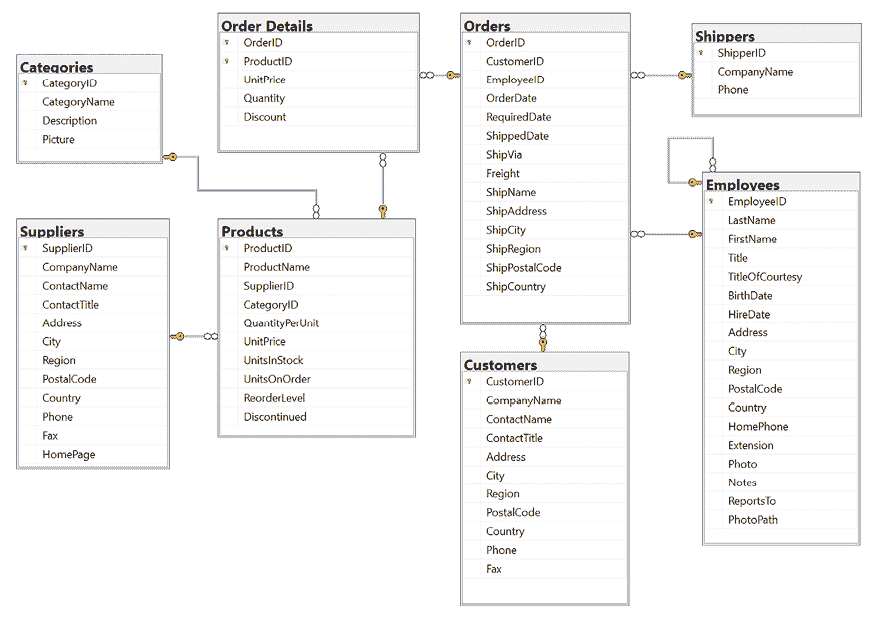
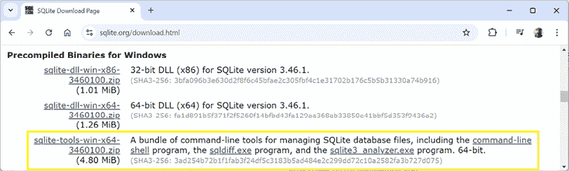
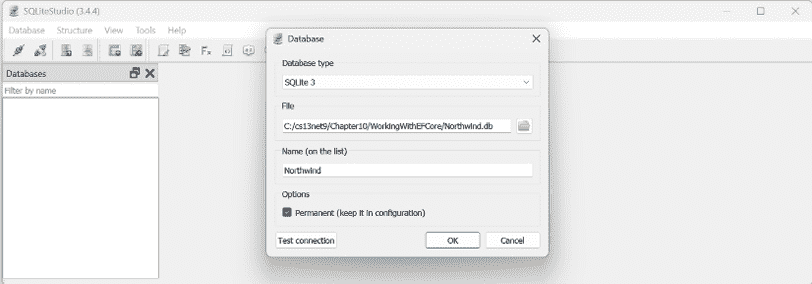
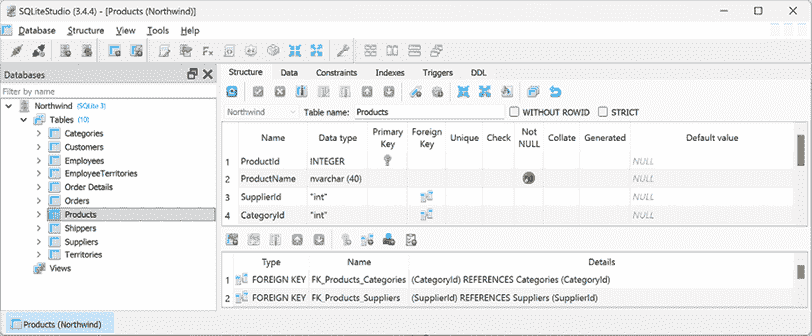
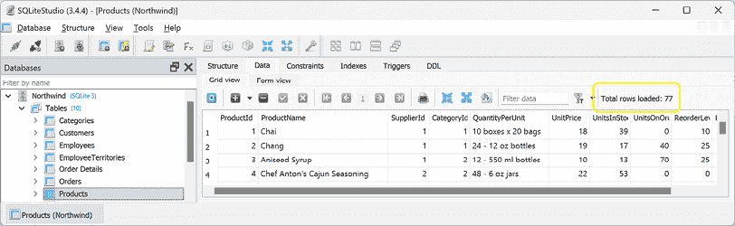
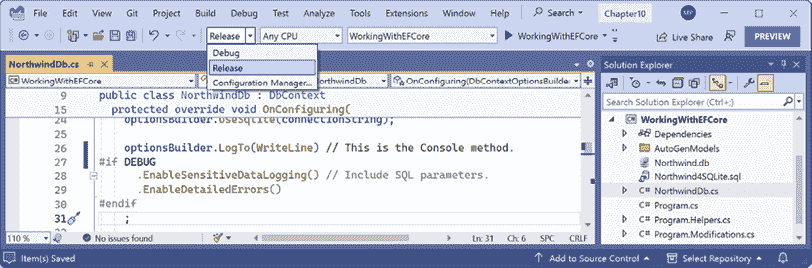

# 10

# 使用 Entity Framework Core 处理数据

本章介绍了如何通过使用名为**Entity Framework Core**（**EF Core**）的对象到数据存储映射技术，从关系型数据存储（如 SQLite 和 SQL Server）中读取和写入数据。

本章将涵盖以下主题：

+   理解现代数据库

+   在.NET 项目中设置 EF Core

+   定义 EF Core 模型

+   查询 EF Core 模型

# 理解现代数据库

存储数据最常见的两个地方是在**关系型数据库管理系统**（**RDBMS**）中，例如 SQL Server、PostgreSQL、MySQL 和 SQLite，或者是在**NoSQL**数据库中，例如 Azure Cosmos DB、Redis、MongoDB 和 Apache Cassandra。

关系型数据库是在 20 世纪 70 年代发明的。它们使用**结构化查询语言**（**SQL**）进行查询。当时，数据存储成本很高，因此它们尽可能地减少了数据冗余。数据存储在具有行和列的表格结构中，一旦在生产中重构，这些行和列就变得难以重构。它们可能难以扩展且成本高昂。

NoSQL 数据库不仅仅意味着“没有 SQL”；它们也可以意味着“不仅限于 SQL”。它们是在 21 世纪初互联网和万维网变得流行之后发明的，并采纳了那个软件时代的许多经验教训。它们被设计用于大规模可扩展性、高性能，并通过提供最大灵活性和允许随时更改模式来简化编程，因为它们不强制执行结构。

如果你对关系型数据库一无所知，那么你应该阅读我以下链接中写的数据库入门指南：

[`github.com/markjprice/cs13net9/blob/main/docs/ch10-database-primer.md`](https://github.com/markjprice/cs13net9/blob/main/docs/ch10-database-primer.md)

## 理解遗留的 Entity Framework

**Entity Framework**（**EF**）最初于 2008 年底作为.NET Framework 3.5 Service Pack 1 的一部分发布。从那时起，随着微软观察到程序员在实际世界中如何使用**对象关系映射**（**ORM**）工具，EF 已经发展演变。

ORMs 使用映射定义将表中的列与类中的属性关联起来。然后，程序员可以以他们熟悉的方式与不同类型的对象进行交互，而无需知道如何将值存储在关系型表或其他 NoSQL 数据存储提供的数据结构中。

随.NET Framework 一起提供的 EF 版本是**Entity Framework 6**（**EF6**）。它成熟稳定，支持使用 EDMX（XML 文件）定义模型的方式，以及复杂的继承模型和其他一些高级功能。

EF 6.3 及更高版本已从 .NET Framework 中提取为单独的包，因此可以在 .NET Core 3 及更高版本上支持。这使得像 Web 应用程序和服务这样的现有项目可以移植并在跨平台上运行。然而，EF6 应被视为旧技术，因为它在跨平台运行时有一些限制，并且不会为其添加新功能。

## 使用旧版 Entity Framework 6.3 或更高版本

要在 .NET Core 3 或更高版本的项目中使用旧版 Entity Framework，你必须在你项目文件中添加对其的包引用，如下所示标记：

```cs
<PackageReference Include="EntityFramework" Version="6.5.1" /> 
```

**最佳实践**：只有在你必须使用旧版 EF6 的情况下才使用它；例如，你可能使用它将使用 EF6 在 .NET Framework 上运行的 **Windows Presentation Foundation**（WPF）应用程序迁移到现代 .NET。这本书是关于现代跨平台开发的，因此在本章的其余部分，我将只介绍现代 EF Core。你不需要在项目文件中引用上述所示的旧版 EF6 包。

## 理解 Entity Framework Core

真正的跨平台版本，**EF Core**，与旧版 Entity Framework 不同。尽管 EF Core 有一个类似的名字，但你应该意识到它与 EF6 的不同之处。最新的 EF Core 版本是 9，以匹配 .NET 9。

EF Core 9 面向 .NET 8 或更高版本，因为 EF Core 团队希望尽可能多的开发者能够从未来版本的新功能中受益，即使你只需要针对 .NET 的长期支持版本。这意味着你可以使用 .NET 8 或 .NET 9 中的所有 EF Core 9 的新功能。但是，当 2025 年 11 月发布 EF Core 10 时，你的项目将需要针对 .NET 10 才能使用它。

EF Core 3 及更高版本仅与支持 .NET Standard 2.1 的平台一起工作，这意味着 .NET Core 3 及更高版本。EF Core 3 及更高版本不支持 .NET Standard 2.0 平台，如 .NET Framework 4.8。

除了传统的 RDBMS 外，EF Core 还支持现代基于云的、非关系型、无模式的数据库存储，如 Azure Cosmos DB 和 MongoDB，有时需要第三方提供程序。

EF Core 在每个版本中都进行了许多改进，以至于本章无法涵盖所有内容。在本章中，我将重点介绍所有 .NET 开发者都应该了解的基本知识以及一些最有用的新功能。你可以在我的配套书籍《.NET 8 应用和服务》中了解更多关于 EF Core 的信息以及如何使用 SQL Server，或者通过阅读以下链接中的官方文档：

[`learn.microsoft.com/en-us/ef/core/`](https://learn.microsoft.com/en-us/ef/core/)

你可以通过以下链接了解最新的 EF Core 新闻：

[`aka.ms/efnews`](https://aka.ms/efnews)

## 理解数据库优先和代码优先

与 EF Core 一起工作的有两种方法：

+   **数据库优先**：已经存在一个数据库，因此你将构建一个与其结构和功能相匹配的模型。这在现实生活中是最常见的场景。你将在本章中看到这个示例。

+   **代码优先**：不存在数据库，因此你构建一个模型，然后使用 EF Core 创建一个与其结构和功能相匹配的数据库。如果你完成了本章末尾练习中链接的在线部分，你将看到这个示例。

## EF Core 的性能改进

EF Core 团队继续努力提高 EF Core 的性能。例如，如果 EF Core 在调用`SaveChanges`时确定数据库将只执行一条语句，那么它就不会像早期版本那样创建显式事务。这为常见场景提供了 25%的性能提升。

本章中关于所有最近性能改进的信息太多，无法涵盖，而且你无需了解它们是如何工作的就可以获得所有好处。如果你感兴趣（而且他们研究的内容以及如何特别利用一些酷的 SQL Server 功能是非常迷人的），那么我建议你阅读 EF Core 团队发布的以下帖子：

+   宣布 Entity Framework Core 7 预览版 6：性能优化版：[`devblogs.microsoft.com/dotnet/announcing-ef-core-7-preview6-performance-optimizations/`](https://devblogs.microsoft.com/dotnet/announcing-ef-core-7-preview6-performance-optimizations/)

+   宣布 Entity Framework Core 6.0 预览版 4：性能版：[`devblogs.microsoft.com/dotnet/announcing-entity-framework-core-6-0-preview-4-performance-edition/`](https://devblogs.microsoft.com/dotnet/announcing-entity-framework-core-6-0-preview-4-performance-edition/)

## 使用示例关系型数据库

要学习如何使用.NET 管理 RDBMS，拥有一个示例数据库会很有用，这样你就可以在一个具有中等复杂度和相当数量的示例记录的数据库上练习。微软提供了几个示例数据库，其中大多数对于我们来说过于复杂，因此，我们将使用一个最初在 20 世纪 90 年代初创建的数据库，称为`Northwind`。

让我们花一分钟时间看看`Northwind`数据库的图示。你可以使用*图 10.1*中的图示来参考我们在本书编写代码和查询时的内容：



图 10.1：`Northwind`数据库表和关系

你将在本章后面编写与`Categories`和`Products`表交互的代码，以及后续章节中的其他表。但在我们这样做之前，请注意以下内容：

+   每个类别都有一个唯一的标识符、名称、描述和图片。

+   每个产品都有一个唯一的标识符、名称、单价、库存单位和其他字段。

+   每个产品都与一个类别相关联，通过存储该类别的唯一标识符。

+   `Categories`和`Products`之间的关系是一对多，这意味着每个类别可以有零个或多个产品。这在*图 10.1*中通过一端的一个无穷符号（表示多个）和另一端的一个黄色钥匙（表示一个）来表示。

## 使用 SQLite

SQLite 是一个小型、快速、跨平台、自包含的关系型数据库管理系统，可在公共领域获得。它是 iOS（iPhone 和 iPad）和 Android 等移动平台最常见的 RDBMS。SQLite 是世界上使用最广泛的数据库引擎，有超过一千亿个 SQLite 数据库正在使用中。您可以在[`www.sqlite.org/mostdeployed.html`](https://www.sqlite.org/mostdeployed.html)了解更多信息。

我决定在这本书中使用 SQLite 来演示数据库，因为其重要主题是跨平台开发和只需要基本数据库功能的基本技能。我建议您最初使用 SQLite 完成本书的代码任务。如果您也想尝试使用 SQL Server 的代码任务，那么我在 GitHub 存储库的在线部分提供了相应的文档。

## 使用 SQL Server 或其他 SQL 系统

习惯于使用 Windows 的企业通常也会使用 SQL Server 作为其数据库。如果您希望使用 SQL Server，请参阅以下链接中的在线说明：

[`github.com/markjprice/cs13net9/blob/main/docs/sql-server/README.md`](https://github.com/markjprice/cs13net9/blob/main/docs/sql-server/README.md)

如果您希望使用不同的 SQL 系统，那么我提供的 SQL 脚本应该适用于大多数 SQL 系统，例如 PostgreSQL 或 MySQL。然而，我并没有为它们编写逐步说明，也不保证它们会工作。

我的建议是使用 SQLite 完成这本书，这样您可以专注于学习书中关于 EF Core 的内容，而不是尝试使用不同的数据库系统带来的复杂性。学习本身就很难；不要贪多，也不要给自己增加不必要的难度。一旦您学到了书中的内容，您总是可以用不同的数据库系统重复学习。

## 设置 Windows 的 SQLite CLI 工具

在 Windows 上，我们需要下载 SQLite CLI 工具并将 SQLite 文件夹添加到系统路径中，这样在命令提示符或终端中输入命令时就可以找到它：

1.  打开您喜欢的浏览器并导航到[`www.sqlite.org/download.html`](https://www.sqlite.org/download.html)。

1.  将页面向下滚动到**Windows 的预编译二进制文件**部分。

1.  点击**sqlite-tools-win32-x86-3460100.zip**（文件可能具有更高的版本号），如下面的截图所示：



图 10.2：下载 Windows 版的 SQLite

1.  将 ZIP 文件解压到名为`C:\Sqlite\`的文件夹中。请确保包括`sqlite3.exe`在内的三个解压文件直接位于`C:\SQLite`文件夹内，否则在您尝试使用它时可能会找不到可执行文件。

1.  在 Windows 的**开始**菜单中，导航到**设置**。

1.  在搜索框中搜索`环境`并选择**编辑系统环境变量**。在非英文版本的 Windows 中，请搜索您当地语言中的等效词汇以找到设置。

1.  点击 **环境变量** 按钮。

1.  在 **系统变量** 中，从列表中选择 **Path**，然后点击 **编辑…**。

1.  如果 `C:\SQLite` 还未在路径中，则点击 **新建**，输入 `C:\Sqlite`，然后按 *Enter*。

1.  点击 **确定**，然后 **确定**，再次点击 **确定**，最后关闭 **设置**。

1.  要确认 SQLite 的路径已正确配置，在任何命令提示符或终端中，输入以下命令以启动 SQLite：

    ```cs
    sqlite3 
    ```

1.  注意结果，如下所示：

    ```cs
    SQLite version 3.42.0 2023-05-16 12:36:15
    Enter ".help" for usage hints.
    Connected to a transient in-memory database.
    Use ".open FILENAME" to reopen on a persistent database.
    sqlite> 
    ```

1.  要退出 SQLite 命令提示符，请执行以下操作：

    +   在 Windows 上，按 *Ctrl* + *C* 两次。

    +   在 macOS 上，按 *Ctrl* + *D*。

## 为 macOS 和 Linux 设置 SQLite

在 macOS 上，SQLite 包含在 `/usr/bin/` 目录中，作为名为 `sqlite3` 的命令行应用程序。

在 Linux 上，您可以使用以下命令设置 SQLite：

```cs
sudo apt-get install sqlite3 
```

SQLite 可以从以下链接下载和安装到其他操作系统：

[`www.sqlite.org/download.html`](https://www.sqlite.org/download.html)

# 在 .NET 项目中设置 EF Core

现在我们已经设置了一个数据库系统，我们可以创建一个使用它的数据库和 .NET 项目。

## 创建用于处理 EF Core 的控制台应用程序

首先，我们将为本章创建一个控制台应用程序项目。

使用您首选的代码编辑器创建一个新项目，如下列所示：

+   项目模板：**控制台应用程序** / `console`

+   项目文件和文件夹：`WorkingWithEFCore`

+   解决方案文件和文件夹：`Chapter10`

## 为 SQLite 创建 Northwind 示例数据库

现在，我们可以使用 SQL 脚本创建 SQLite 的 `Northwind` 示例数据库：

1.  如果您之前尚未克隆或下载此书的 GitHub 仓库的 ZIP 文件，请现在使用以下链接进行操作：[`github.com/markjprice/cs13net9`](https://github.com/markjprice/cs13net9)。

1.  将创建 `Northwind` 数据库的脚本从您本地 Git 仓库或解压 ZIP 文件的位置复制到 `WorkingWithEFCore` 文件夹中：`/scripts/sql-scripts/Northwind4SQLite.sql`。

1.  在 `WorkingWithEFCore` 项目文件夹中启动一个命令提示符或终端：

    +   在 Windows 上，启动 **文件资源管理器**，右键单击 `WorkingWithEFCore` 文件夹，然后选择 **在此文件夹中新建命令提示符** 或 **在 Windows 终端中打开**。

    +   在 macOS 上，启动 **Finder**，右键单击 `WorkingWithEFCore` 文件夹，然后选择 **在此文件夹中新建终端**。

1.  输入命令以使用 SQLite 执行 SQL 脚本并创建 `Northwind.db` 数据库，如下所示：

    ```cs
    sqlite3 Northwind.db -init Northwind4SQLite.sql 
    ```

1.  请耐心等待，因为此命令可能需要一段时间来创建数据库结构。最终，您将看到 SQLite 命令提示符，如下所示：

    ```cs
    -- Loading resources from Northwind4SQLite.sql
    SQLite version 3.42.0 2023-05-16 12:36:15
    Enter ".help" for usage hints.
    sqlite> 
    ```

1.  要退出 SQLite 命令提示符，请执行以下操作：

    +   在 Windows 上，按 *Ctrl* + *C* 两次。

    +   在 macOS 或 Linux 上，按 *Ctrl* + *D*。

1.  您可以保持命令提示符或终端窗口打开，因为您很快还会再次使用它。

## 如果您正在使用 Visual Studio

如果你使用 VS Code 和 `dotnet run` 命令，编译的应用程序将在 `WorkingWithEFCore` 文件夹中执行，允许它找到存储在该文件夹中的数据库文件。但如果你使用 Visual Studio 或 Rider，则编译的应用程序将在 `WorkingWithEFCore\bin\Debug\net9.0` 文件夹中执行，因此它将找不到数据库文件，因为它不在该目录中。

让我们告诉 Visual Studio 将数据库文件复制到它运行代码的目录中，以便它可以找到该文件，但只有当数据库文件较新或缺失时，它才不会覆盖我们在运行时所做的任何数据库更改：

1.  在 **解决方案资源管理器** 中，右键单击 `Northwind.db` 文件并选择 **属性**。

1.  在 **属性** 中，将 **复制到输出目录** 设置为 **如果较新则复制**。

1.  在 `WorkingWithEFCore.csproj` 中，注意以下标记中的新元素：

    ```cs
    <ItemGroup>
      <None Update="Northwind.db">
        <CopyToOutputDirectory>PreserveNewest</CopyToOutputDirectory>
      </None>
    </ItemGroup> 
    ```

如果你更喜欢每次启动项目时覆盖数据更改，则将 **CopyToOutputDirectory** 设置为 **始终**。

你可以手动修改项目文件，而不是使用 **属性** 窗口进行上述更改。实际上，任何工具对项目文件所做的更改都可以通过编辑 XML 来手动完成。像 **属性** 窗口这样的工具只是读取项目中的文件并显示一个替代视图。这就是为什么在 *第一章* 中，我强调在学习 .NET 时使用多个代码编辑器。危险在于，如果你只使用 Visual Studio，那么你可能会开始认为 Visual Studio *就是* .NET 开发。事实并非如此。

真正的 .NET 开发是源代码文件的内容，如 `.cs` 文件和项目文件 `.csproj`，然后通过命令行界面 `dotnet` 进行编译。你使用的任何其他工具都只是在这个基础上添加的一个额外层。

有趣的是，.NET 的一个未来特性，微软正在积极考虑的是“隐式项目文件”。这意味着有一个只包含一个或多个 `.cs` 文件和 `.csproj` 文件的文件夹，而 `.csproj` 文件不需要存在，因为其内容可以通过默认值隐式表示。例如，它可能默认为当前的 SDK 和目标 .NET 版本等。但这很复杂，所以我们将不得不等待并看看这是否会真的发生。

## 使用 SQLiteStudio 管理 Northwind 示例数据库

你可以使用一个名为 **SQLiteStudio** 的跨平台图形数据库管理器轻松管理 SQLite 数据库：

1.  导航到 [`sqlitestudio.pl`](https://sqlitestudio.pl)，然后下载并安装应用程序。

1.  启动 **SQLiteStudio**。

1.  导航到 **数据库** | **添加数据库**。

1.  在 **数据库** 对话框中，在 **文件** 部分，单击黄色文件夹按钮以在本地计算机上浏览现有的数据库文件，在 `WorkingWithEFCore` 项目文件夹中选择 `Northwind.db` 文件，然后单击 **确定**，如图 10.3 所示：



图 10.3：将 Northwind.db 数据库文件添加到 SQLiteStudio

1.  如果您看不到数据库，请转到**视图** | **数据库**。

1.  在**数据库**窗口中，右键单击`Northwind`数据库并选择**连接到数据库**（或直接双击`Northwind`）。您将看到由脚本创建的 10 个表。（SQLite 的脚本比 SQL Server 的简单；它不会创建那么多表或其他数据库对象。）

1.  右键单击**产品**表并选择**编辑表**，或直接双击表。

1.  在表编辑器窗口中，注意`Products`表的结构，包括列名、数据类型、键和约束，如图 10.4 所示：



图 10.4：SQLiteStudio 中的表编辑器显示产品表的结构

1.  在表编辑器窗口中，单击**数据**标签，您将看到 77 个产品，如图 10.5 所示：



图 10.5：显示产品表中 77 行的数据标签

1.  在**数据库**窗口中，右键单击`Northwind`并选择**从数据库断开连接**。

1.  退出 SQLiteStudio。

## 使用轻量级 ADO.NET 数据库提供程序

在 Entity Framework 之前，有**ADO.NET**。与 EF 相比，这是一个更简单、更高效的数据库操作 API。它提供了如`DbConnection`、`DbCommand`和`DbReader`之类的抽象类，以及特定提供程序的实现，如`SqlConnection`和`SqlCommand`。

在本章中，如果您选择使用 SQL Server，那么您应该使用`SqlConnectionStringBuilder`类来帮助编写有效的连接字符串。这是因为它具有所有可能数据库连接字符串部分的属性，您可以单独设置它们，然后它返回完整的字符串。您还应该从环境变量或秘密管理系统获取敏感信息，如密码，而不是将它们写入源代码。

对于 SQLite，连接字符串非常简单，您不需要使用`SqliteConnectionStringBuilder`类。

EF Core 的 SQLite 和 SQL Server 数据库提供程序建立在 ADO.NET 库之上，因此 EF Core 始终比 ADO.NET 本身慢。

如果您想使用原生的**提前编译**（**AOT**）发布，请注意 EF Core 目前还不支持它。这意味着如果您计划编译为原生代码，则只能使用 ADO.NET 库。EF Core 团队正在调查他们如何支持原生 AOT，但这很具挑战性，因此今年 EF Core 9 没有实现。希望它将在 2025 年的 EF Core 10 中实现。

除了`SqlConnectionStringBuilder`之外，本书不涵盖使用 ADO.NET 库，但在配套书籍《.NET 8 中的应用程序和服务》中，我涵盖了如何使用 ADO.NET for SQL Server 库发布原生 AOT 最小 API Web 服务的示例。

您可以在以下链接中了解更多关于 ADO.NET for SQLite 库的信息：

[`learn.microsoft.com/en-us/dotnet/standard/data/sqlite/`](https://learn.microsoft.com/en-us/dotnet/standard/data/sqlite/)

您可以在以下链接中了解更多关于 SQL Server 的 ADO.NET 库信息：

[`learn.microsoft.com/en-us/sql/connect/ado-net/microsoft-ado-net-sql-server`](https://learn.microsoft.com/en-us/sql/connect/ado-net/microsoft-ado-net-sql-server)

**警告！** 所有 `System.Data.SqlClient` 用户都鼓励过渡到 `Microsoft.Data.SqlClient`。您可以在以下链接中阅读有关 `System.Data.SqlClient` 包现在已弃用的公告：

[`techcommunity.microsoft.com/t5/sql-server-blog/announcement-system-data-sqlclient-package-is-now-deprecated/ba-p/4227205`](https://techcommunity.microsoft.com/t5/sql-server-blog/announcement-system-data-sqlclient-package-is-now-deprecated/ba-p/4227205)

## 选择 EF Core 数据库提供者

在我们深入探讨使用 EF Core 管理数据的实际操作之前，让我们简要地谈谈选择 EF Core 数据库提供者。为了管理特定数据库中的数据，我们需要知道如何高效地与该数据库通信的类。

EF Core 数据库提供者是一组针对特定数据存储进行优化的类。甚至还有一个提供者可以将数据存储在当前进程的内存中，这对于高性能单元测试非常有用，因为它避免了访问外部系统。

它们作为 NuGet 包分发，如 *表 10.1* 所示：

| **管理此数据存储** | **参考此 NuGet 包** |
| --- | --- |
| SQL Server 2012 或更高版本 | `Microsoft.EntityFrameworkCore.SqlServer` |
| SQLite 3.7 或更高版本 | `Microsoft.EntityFrameworkCore.SQLite` |
| 内存中存储 | `Microsoft.EntityFrameworkCore.InMemory` |
| Azure Cosmos DB SQL API | `Microsoft.EntityFrameworkCore.Cosmos` |
| MySQL | `MySQL.EntityFrameworkCore` |
| Oracle 数据库 11.2 | `Oracle.EntityFrameworkCore` |
| PostgreSQL | `Npgsql.EntityFrameworkCore.PostgreSQL` |

表 10.1：常见 EF Core 数据库提供者的 NuGet 包

您可以在同一个项目中引用您需要的任何 EF Core 数据库提供者。每个包都包括常见的共享类型，以及特定提供者的类型。

## 连接到命名的 SQLite 数据库

要连接到 SQLite 数据库，我们只需要知道数据库路径和文件名，可以使用传统的参数 `Filename` 或现代的等效参数 `Data Source` 来设置。路径可以是相对于当前目录的相对路径或绝对路径。我们将在 **连接字符串** 中指定这些信息。

## 定义 Northwind 数据库上下文类

将使用名为 `Northwind` 的类来表示数据库。要使用 EF Core，该类必须从 `DbContext` 继承。`DbContext` 类了解如何与数据库通信并动态生成 SQL 语句以查询和操作数据。

您的 `DbContext` 派生类应该有一个重写的方法名为 `OnConfiguring`，该方法将设置数据库连接字符串。

我们将创建一个使用 SQLite 的项目，但如果你更熟悉 SQL Server 或其他数据库系统，也可以使用：

1.  在 `WorkingWithEFCore` 项目中，添加对 SQLite EF Core 提供程序的包引用，并在所有 C# 文件中全局和静态导入 `System.Console` 类，如下面的标记所示：

    ```cs
    <ItemGroup>
      <Using Include="System.Console" Static="true" />
    </ItemGroup>
    <ItemGroup>
      <PackageReference Version="9.0.0"
        Include="Microsoft.EntityFrameworkCore.Sqlite" />
    </ItemGroup> 
    ```

1.  构建 `WorkingWithEFCore` 项目以恢复包。

    在 2025 年 2 月之后，你可以通过指定版本 `10.0-*` 来尝试 EF Core 10 的预览版，因此你也必须安装 .NET 10 SDK 的预览版。你的项目目标框架必须是 `net10.0`。通过使用通配符，当你恢复项目的包时，将自动下载最新的月度预览版。一旦 2025 年 11 月发布 EF Core 10 GA 版本，将包版本更改为 `10.0.0`。在 2026 年 2 月之后，你将能够以相同的方式使用 EF Core 11，并且这将继续需要以 `net10.0` 为目标的项目。

1.  在项目文件夹中，添加一个名为 `NorthwindDb.cs` 的新类文件。

1.  在 `NorthwindDb.cs` 文件中，导入 EF Core 的主命名空间，定义一个名为 `NorthwindDb` 的类，并使该类继承自 `DbContext`。然后，在 `OnConfiguring` 方法中，配置选项构建器以使用 SQLite 和适当的数据库连接字符串，如下面的代码所示：

    ```cs
    using Microsoft.EntityFrameworkCore; // To use DbContext and so on.
    namespace Northwind.EntityModels;
    // This manages interactions with the Northwind database.
    public class NorthwindDb : DbContext
    {
      protected override void OnConfiguring(
        DbContextOptionsBuilder optionsBuilder)
      {
        string databaseFile = "Northwind.db";
        string path = Path.Combine(
          Environment.CurrentDirectory, databaseFile);
        string connectionString = $"Data Source={path}";
        WriteLine($"Connection: {connectionString}");
        optionsBuilder.UseSqlite(connectionString);
      }
    } 
    ```

    **良好实践**：一些代码编辑器，如 Visual Studio，会在你重写成员时自动添加对基类成员的调用。尽管这通常是良好实践，但在这种情况下是不必要的，因为基实现没有任何作用。要决定是否需要保留调用，请查看成员的提示或定义。如果你将鼠标悬停在 `OnConfiguring` 方法名称上，其提示会告诉你“基实现没有任何作用。”如果你 **转到定义** (*F12*) 该方法，你会看到它没有任何作用，如下面的代码所示：

    ```cs
    protected internal virtual void OnConfiguring(
    DbContextOptionsBuilder optionsBuilder)
    {
    } 
    ```

    该方法仅存在于基类中，以便子类可以重写它，然后 EF Core 在需要配置数据上下文时调用你的代码。如果你的重写方法实现调用了基实现，那将是一种浪费。如果你的代码编辑器自动添加了对基类的调用，那么你应该删除该语句以使你的代码与书中的代码匹配。在书中稍后重写 `OnModelCreating` 方法时，这也适用。

1.  在 `Program.cs` 文件中，删除现有的语句。然后，导入 `Northwind.EntityModels` 命名空间，并输出数据库提供程序，如下面的代码所示：

    ```cs
    using Northwind.EntityModels; // To use Northwind.
    using NorthwindDb db = new();
    WriteLine($"Provider: {db.Database.ProviderName}");
    // Disposes the database context. 
    ```

1.  运行控制台应用程序，并注意显示数据库连接字符串和所使用的数据库提供程序的输出，如下面的输出所示：

    ```cs
    Connection: Data Source=C:\cs13net9\Chapter10\WorkingWithEFCore\bin\Debug\net9.0\Northwind.db
    Provider: Microsoft.EntityFrameworkCore.Sqlite 
    ```

现在，你已经知道了如何通过定义 EF Core 数据上下文来连接数据库。接下来，我们需要定义一个表示数据库中表的模型。

# 定义 EF Core 模型

EF Core 使用 **约定**、**注解属性** 和 **Fluent API** 语句的组合在运行时构建 **实体模型**，这使得对类执行的操作可以自动转换为对实际数据库执行的操作。一个 **实体类** 代表表的结构，该类的实例代表表中的一行。

首先，我们将回顾定义模型的三种方法，并附上代码示例，然后我们将创建一些实现这些技术的类。

## 使用 EF Core 约定定义模型

我们将要编写的代码将使用以下约定：

+   表的名称假定与 `DbContext` 类中 `DbSet<T>` 属性的名称匹配，例如，`Products`。

+   列的名称假定与实体模型类中的属性名称匹配，例如，`ProductId`。

+   `.NET` 中的 `string` 类型在数据库中假定是 `nvarchar` 类型。

+   `.NET` 中的 `int` 类型在数据库中假定是 `int` 类型。

+   主键假定是一个名为 `Id` 或 `ID` 的属性，或者当实体模型类名为 `Product` 时，该属性可以命名为 `ProductId` 或 `ProductID`。如果此属性是整数类型或 `Guid` 类型，则它也被假定为 `IDENTITY` 列（一种在插入时自动分配值的列类型）。

**良好实践**：还有许多其他约定您应该了解，您甚至可以定义自己的约定，但这超出了本书的范围。您可以在以下链接中了解它们：

[`learn.microsoft.com/en-us/ef/core/modeling/`](https://learn.microsoft.com/en-us/ef/core/modeling/)

## 使用 EF Core 注解属性定义模型

约定通常不足以完全将类映射到数据库对象。使您的模型更智能的一种简单方法是应用注解属性。EF Core 识别的一些常见属性在 *表 10.2* 中显示：

| **属性** | **描述** |
| --- | --- |
| `[Required]` | 这确保值不是 null。在 .NET 8 中，它有一个 `DisallowAllDefaultValues` 参数，以防止值类型具有其默认值。例如，`int` 不能是 `0`。 |
| `[StringLength(50)]` | 这确保值长度不超过 50 个字符。 |
| `[Column(TypeName = "money", Name = "UnitPrice")]` | 这指定了表中使用的列类型和列名。 |

表 10.2：常见的 EF Core 注解属性

**警告！** `[StringLength]` 并不是所有 EF Core 数据提供程序都支持的。例如，虽然 SQL Server 支持，但 SQLite 不支持。对于 SQLite，请使用 `[Column(TypeName = "text(50)")]` 代替。

一些可以用于验证实体并受 ASP.NET Core 和 Blazor 等平台认可的附加属性在 *表 10.3* 中显示：

| **属性** | **描述** |
| --- | --- |
| `[RegularExpression(expression)]` | 这确保值与指定的正则表达式匹配。 |
| `[EmailAddress]` | 这确保值包含一个`@`符号，但不能作为第一个或最后一个字符。它不使用正则表达式。 |
| `[Range(1, 10)]` | 这确保`double`、`int`或`string`值在指定的范围内。在.NET 8 中新增了`MinimumIsExclusive`和`MaximumIsExclusive`参数。 |
| `[Length(10, 20)]` | 这确保字符串或集合在指定的长度范围内，例如，至少 10 个字符或项目，最多 20 个字符或项目。 |
| `[Base64String]` | 这确保值是一个格式良好的 Base64 字符串。 |
| `[AllowedValues]` | 这确保值是对象`params`数组中的其中一个项。例如，`"alpha"`、`"beta"`、`"gamma"`或`1`、`2`、`3`。 |
| `[DeniedValues]` | 确保值不是对象`params`数组中的任何一个项。例如，`"alpha"`、`"beta"`、`"gamma"`或`1`、`2`、`3`。 |

表 10.3：验证注解属性

为什么`EmailAddress`属性看起来如此基础？根据 ajcvickers 的评论，他也是 GitHub 问题的关闭者，“*检查是有意为之的简单，因为做到无误是非常困难的。电子邮件实际上应该通过其他方式验证，例如通过发送电子邮件的确认流程。验证属性仅设计用于捕获像 U.I.这样的明显错误值。*”您可以在以下链接中阅读辩论：

[`github.com/dotnet/runtime/issues/27592`](https://github.com/dotnet/runtime/issues/27592)

例如，在数据库中，产品名称的最大长度为 40，且值不能为空，如下面从`Northwind4SQLite.sql`脚本文件中高亮显示的**数据定义语言**（**DDL**）代码所示，该代码定义了如何创建名为`Products`的表及其列、数据类型、键和其他约束：

```cs
CREATE TABLE Products (
    ProductId       INTEGER       PRIMARY KEY,
 **ProductName     NVARCHAR (****40****)** **NOT****NULL****,**
    SupplierId      "INT",
    CategoryId      "INT",
    QuantityPerUnit NVARCHAR (20),
    UnitPrice       "MONEY"       CONSTRAINT DF_Products_UnitPrice DEFAULT (0),
    UnitsInStock    "SMALLINT"    CONSTRAINT DF_Products_UnitsInStock DEFAULT (0),
    UnitsOnOrder    "SMALLINT"    CONSTRAINT DF_Products_UnitsOnOrder DEFAULT (0),
    ReorderLevel    "SMALLINT"    CONSTRAINT DF_Products_ReorderLevel DEFAULT (0),
    Discontinued    "BIT"         NOT NULL
                                  CONSTRAINT DF_Products_Discontinued DEFAULT (0),
    CONSTRAINT FK_Products_Categories FOREIGN KEY (
        CategoryId
    )
    REFERENCES Categories (CategoryId),
    CONSTRAINT FK_Products_Suppliers FOREIGN KEY (
        SupplierId
    )
    REFERENCES Suppliers (SupplierId),
    CONSTRAINT CK_Products_UnitPrice CHECK (UnitPrice >= 0),
    CONSTRAINT CK_ReorderLevel CHECK (ReorderLevel >= 0),
    CONSTRAINT CK_UnitsInStock CHECK (UnitsInStock >= 0),
    CONSTRAINT CK_UnitsOnOrder CHECK (UnitsOnOrder >= 0)
); 
```

在一个`Product`类中，我们可以通过属性来指定这一点，如下面的代码所示：

```cs
[Required]
[StringLength(40)]
public string ProductName { get; set; } 
```

当.NET 类型和数据库类型之间没有明显的映射时，可以使用属性。

例如，在数据库中，`Products`表的`UnitPrice`列的类型是`money`。.NET 没有`money`类型，因此应使用`decimal`代替，如下面的代码所示：

```cs
[Column(TypeName = "money")]
public decimal? UnitPrice { get; set; } 
```

## 使用 EF Core Fluent API 定义模型

模型可以定义的最后一种方式是使用 Fluent API。此 API 可以用作属性替代，也可以与属性一起使用。例如，要定义`ProductName`属性，而不是用两个属性装饰该属性，可以在数据库上下文类的`OnModelCreating`方法中编写等效的 Fluent API 语句，如下面的代码所示：

```cs
modelBuilder.Entity<Product>()
  .Property(product => product.ProductName)
  .IsRequired()
  .HasMaxLength(40); 
```

这使得实体模型类更加简单。

## 使用 Fluent API 理解数据初始化

Fluent API 的另一个好处是提供初始数据以填充数据库。EF Core 会自动确定必须执行哪些插入、更新或删除操作。

例如，如果我们想确保新数据库在 `Products` 表中至少有一行，那么我们会调用 `HasData` 方法，如下面的代码所示：

```cs
modelBuilder.Entity<Product>()
  .HasData(new Product
  {
    ProductId = 1,
    ProductName = "Chai",
    UnitPrice = 8.99M
  }); 
```

`HasData` 方法的调用在执行 `dotnet ef database update` 命令进行的数据迁移期间生效，或者当您调用 `Database.EnsureCreated` 方法时。

我们的模式将映射到一个已经填充了数据的现有数据库，因此我们不需要在我们的代码中使用此技术。

## 构建 Northwind 表的 EF Core 模型

现在您已经了解了定义 EF Core 模型的方法，让我们构建模型来表示 `Northwind` 数据库中的两个表。为了重用，我们将在一个单独的类库项目中完成此操作。

这两个实体类将相互引用，为了避免编译错误，我们首先创建没有任何成员的类：

1.  使用您首选的代码编辑器创建一个新项目，如下面的列表所示：

    +   **项目模板**：**类库** / `classlib`

    +   **项目文件和文件夹**：`Northwind.EntityModels`

    +   **解决方案文件和文件夹**：`Chapter10`

1.  在 `Northwind.EntityModels` 项目中，删除名为 `Class1.cs` 的文件，然后添加两个名为 `Category.cs` 和 `Product.cs` 的类文件。

1.  在 `Category.cs` 文件中，定义一个名为 `Category` 的类，如下面的代码所示：

    ```cs
    namespace Northwind.EntityModels;
    public class Category
    {
    } 
    ```

1.  在 `Product.cs` 文件中，定义一个名为 `Product` 的类，如下面的代码所示：

    ```cs
    namespace Northwind.EntityModels;
    public class Product
    {
    } 
    ```

1.  在 `WorkingWithEFCore` 项目中，将 `Northwind.EntityModels` 项目添加为项目引用，如下面的标记所示：

    ```cs
    <ItemGroup>
      <ProjectReference Include="..\Northwind.EntityModels\
    Northwind.EntityModels.csproj" />
    </ItemGroup> 
    ```

项目引用路径和文件名必须都在一行上。

1.  构建名为 `WorkingWithEFCore` 的项目。

## 定义类别和产品实体类

`Category` 类，也称为实体模型，将用于表示 `Categories` 表中的一行。该表有四个列，如下面的 DDL 所示，该 DDL 来自 `Northwind4SQLite.sql` 脚本文件：

```cs
CREATE TABLE Categories (
  CategoryId   INTEGER       PRIMARY KEY,
  CategoryName NVARCHAR (15) NOT NULL,
  Description  "NTEXT",
  Picture      "IMAGE"
); 
```

我们将使用约定来定义以下内容：

+   四个属性中的三个（我们不会映射 `Picture` 列）

+   主键

+   与 `Products` 表的一对多关系

为了将 `Description` 列映射到正确的数据库类型，我们需要用 `Column` 属性装饰 `string` 属性。

在本章的后面部分，我们将使用 Fluent API 定义 `CategoryName` 不能为空且最多为 15 个字符的限制。

让我们开始吧：

1.  在 `Northwind.EntityModels` 项目中，修改 `Category` 实体模型类，如下面的代码所示（已突出显示）：

    ```cs
    **using** **System.ComponentModel.DataAnnotations.Schema;** **// To use [Column].**
    namespace Northwind.EntityModels;
    public class Category
    {
    **// These properties map to columns in the database.**
    **public****int** **CategoryId {** **get****;** **set****; }** **// The primary key.**
    **public****string** **CategoryName {** **get****;** **set****; } =** **null****!;**
     **[****Column(TypeName =** **"ntext"****)****]**
    **public****string****? Description {** **get****;** **set****; }**
    **// Defines a navigation property for related rows.**
    **public****virtual** **ICollection<Product> Products {** **get****;** **set****; }**
    **// To enable developers to add products to a Category, we must**
    **// initialize the navigation property to an empty collection.**
    **// This also avoids an exception if we get a member like Count.**
     **=** **new** **HashSet<Product>();**
    } 
    ```

注意以下内容：

+   `Category` 类将位于 `Northwind.EntityModels` 命名空间中。

+   `CategoryId` 属性遵循主键命名约定，因此它将被映射到一个标记为主键并带有索引的列。

+   `CategoryName` 属性映射到一个不允许数据库 NULL 值的列，因此它是一个不可为空的字符串。为了禁用可空性警告，我们已分配了 null-forgiving 操作符。

+   `Description`属性映射到一个具有`ntext`数据类型的列，而不是默认将`string`值映射到`nvarchar`。

+   我们将`Product`对象集合初始化为一个新的空`HashSet`。哈希集比列表更有效，因为它是无序的。如果你不初始化`Products`，那么它将是 null，如果你尝试获取它的`Count`，那么你会得到一个异常。

1.  修改`Product`类，如下所示：

    ```cs
    **using** **System.ComponentModel.DataAnnotations;** **// To use [Required].**
    **using** **System.ComponentModel.DataAnnotations.Schema;** **// To use [Column].**
    namespace Northwind.EntityModels;
    public class Product
    {
    **public****int** **ProductId {** **get****;** **set****; }** **// The primary key.**
     **[****Required****]**
     **[****StringLength(40)****]**
    **public****string** **ProductName {** **get****;** **set****; } =** **null****!;**
    **// Property name is different from the column name.**
     **[****Column(****"UnitPrice"****, TypeName =** **"money"****)****]**
    **public****decimal****? Cost {** **get****;** **set****; }**
     **[****Column(****"UnitsInStock"****)****]**
    **public****short****? Stock {** **get****;** **set****; }**
    **public****bool** **Discontinued {** **get****;** **set****; }**
    **// These two properties define the foreign key relationship**
    **// to the Categories table.**
    **public****int** **CategoryId {** **get****;** **set****; }**
    **public****virtual** **Category Category {** **get****;** **set****; } =** **null****!;**
    } 
    ```

注意以下内容：

+   `Product`类将用于表示`Products`表中的一行，该表有 10 列。

+   你不需要将表中的所有列都作为类的属性。我们将只映射六个属性：`ProductId`、`ProductName`、`UnitPrice`、`UnitsInStock`、`Discontinued`和`CategoryId`。

+   没有映射到属性的列无法使用类实例进行读取或设置。如果你使用该类创建一个新对象，那么表中的新行将为未映射的列值设置`NULL`或其他默认值。你必须确保那些缺失的列是可选的或者数据库已经设置了默认值，否则在运行时将抛出异常。在这种情况下，行已经存在数据值，我决定在这个应用程序中不需要读取这些值。

+   我们可以通过定义一个具有不同名称的属性来重命名一个列，例如`Cost`，然后使用`[Column]`属性装饰该属性并指定其列名，例如`UnitPrice`。

+   最后一个属性`CategoryId`与一个`Category`属性相关联，该属性将用于将每个产品映射到其父类别。

与两个实体相关的两个属性，`Category.Products`和`Product.Category`，都被标记为`virtual`。这允许 EF Core 继承并重写属性以提供额外功能，例如懒加载。

## 向 Northwind 数据库上下文类添加表

在你的`DbContext`派生类中，你必须定义至少一个`DbSet<T>`类型的属性。这些属性代表表。为了告诉 EF Core 每个表有哪些列，`DbSet<T>`属性使用泛型来指定一个代表表中行的类。这个实体模型类具有代表其列的属性。

从`DbContext`派生的类可以有一个可选的名为`OnModelCreating`的重写方法。在这里，你可以编写 Fluent API 语句，作为用属性装饰你的实体类的替代方案。

让我们编写代码：

1.  在`WorkingWithEFCore`项目中，修改`NorthwindDb`类以添加定义两个表属性和一个`OnModelCreating`方法的语句，如下所示：

    ```cs
    public class NorthwindDb : DbContext
    {
    **// These two properties map to tables in the database.**
    **public****DbSet****<****Category****>? Categories** **{** **get****;** **set****; }**
    **public****DbSet****<****Product****>? Products** **{** **get****;** **set****; }**
      protected override void OnConfiguring(
        DbContextOptionsBuilder optionsBuilder)
      {
        ...
      }
    **protected****override****void****OnModelCreating****(**
     **ModelBuilder modelBuilder****)**
     **{**
    **// Example of using Fluent API instead of attributes**
    **// to limit the length of a category name to 15.**
     **modelBuilder.Entity<Category>()**
     **.Property(category => category.CategoryName)**
     **.IsRequired()** **// NOT NULL**
     **.HasMaxLength(****15****);**
    **// Some SQLite-specific configuration.**
    **if** **(Database.ProviderName?.Contains(****"Sqlite"****) ??** **false****)**
     **{**
    **// To "fix" the lack of decimal support in SQLite.**
     **modelBuilder.Entity<Product>()**
     **.Property(product => product.Cost)**
     **.HasConversion<****double****>();**
     **}**
     **}**
    } 
    ```

`decimal`类型不支持 SQLite 数据库提供程序进行排序和其他操作。我们可以通过告诉模型在使用 SQLite 数据库提供程序时可以将`decimal`值视为`double`值来修复这个问题。这实际上在运行时不会执行任何转换。

现在你已经看到了一些手动定义实体模型的示例，让我们看看一个可以为你做些工作的工具。

## 设置 dotnet-ef 工具

命名为`dotnet`的.NET CLI 工具可以扩展用于与 EF Core 一起使用的功能。它可以执行设计时任务，如从旧模型创建并应用迁移到新模型，以及从现有数据库生成模型代码。

`dotnet-ef`命令行工具不是自动安装的。你必须将其作为**全局**或**本地**工具安装。如果你已经安装了该工具的旧版本，那么你应该将其更新到最新版本：

1.  在命令提示符或终端中，检查你是否已经安装了`dotnet-ef`作为全局工具，如下所示命令：

    ```cs
    dotnet tool list --global 
    ```

1.  在列表中检查是否已安装该工具的旧版本，例如.NET 7 的版本，如下所示输出：

    ```cs
    Package Id      Version     Commands
    -------------------------------------
    dotnet-ef       7.0.0       dotnet-ef 
    ```

1.  如果已经安装了旧版本，请按照以下命令更新工具：

    ```cs
    dotnet tool update --global dotnet-ef 
    ```

1.  如果尚未安装，请按照以下命令安装最新版本：

    ```cs
    dotnet tool install --global dotnet-ef 
    ```

如果需要，遵循任何特定于操作系统的说明将`dotnet tools`目录添加到你的`PATH`环境变量中，如安装`dotnet-ef`工具的输出所述。

默认情况下，将使用最新的 GA 版本安装工具。要显式设置版本，例如，使用预览版，请添加`--version`开关。作为另一个例子，要更新到 2024 年 2 月至 10 月可用的最新.NET 9 预览版本，请使用以下带有版本通配符的命令：

```cs
dotnet tool update --global dotnet-ef --version 9.0-* 
```

一旦在 2024 年 11 月.NET 9 GA 版本发布，你只需使用不带`--version`开关的命令即可升级。

你也可以按照以下命令删除工具：

```cs
dotnet tool uninstall --global dotnet-ef 
```

## 使用现有数据库构建模型框架

框架是使用工具通过逆向工程创建表示现有数据库模型的类的过程。一个好的框架工具允许你扩展自动生成的类，因为它们是`partial`的，然后在不丢失你的`partial`类的情况下重新生成这些类。

如果你确定永远不会使用该工具重新生成类，那么你可以随意修改自动生成的类的代码，想改多少就改多少。工具生成的代码只是最佳近似。

**良好实践**：当你知道得更多时，不要害怕推翻工具。

本节中的说明适用于任何数据提供者，而不仅仅是 SQLite。无论您使用哪种数据提供者，您都需要添加对 `Microsoft.EntityFrameworkCore.Design` 包的引用。

让我们看看工具生成的模型是否与我们手动生成的相同：

1.  将 `Microsoft.EntityFrameworkCore.Design` 包的最新版本添加到 `WorkingWithEFCore` 项目中，如下所示高亮显示的标记：

    ```cs
    <ItemGroup>
     **<PackageReference Version=****"9.0.0"**
     **Include=****"Microsoft.EntityFrameworkCore.Design"****>**
     **<PrivateAssets>all</PrivateAssets>**
     **<IncludeAssets>runtime; build; native; contentfiles; analyzers; buildtransitive</IncludeAssets>**
     **</PackageReference>**
      <PackageReference Version="9.0.0"
                        Include="Microsoft.EntityFrameworkCore.Sqlite" />
    </ItemGroup> 
    ```

**更多信息**：如果您不熟悉像 `Microsoft.EntityFrameworkCore.Design` 这样的包如何管理其资产，您可以在以下链接中了解更多信息：

[`learn.microsoft.com/en-us/nuget/consume-packages/package-references-in-project-files#controlling-dependency-assets`](https://learn.microsoft.com/en-us/nuget/consume-packages/package-references-in-project-files#controlling-dependency-assets)

1.  构建 `WorkingWithEFCore` 项目以还原包。

1.  在 `WorkingWithEFCore` 项目文件夹中启动命令提示符或终端。以下是一个示例：

    +   如果您使用的是 Visual Studio，在 **解决方案资源管理器** 中，右键单击 `WorkingWithEFCore` 项目，然后选择 **在终端中打开**。

    +   在 Windows 上，启动 **文件资源管理器**，右键单击 `WorkingWithEFCore` 文件夹，然后选择 **在此文件夹中新建命令提示符** 或 **在 Windows 终端中打开**。

    +   在 macOS 上，启动 **Finder**，右键单击 `WorkingWithEFCore` 文件夹，然后选择 **在文件夹中新建终端**。

    +   如果您使用的是 Rider，在 **解决方案资源管理器** 中，右键单击 `WorkingWithEFCore` 项目，然后选择 **在** | **终端** 中打开。

**警告！** 当我说 `WorkingWithEFCore` 项目文件夹时，我指的是包含 `WorkingWithEFCore.csproj` 项目文件的文件夹。如果您在不含项目文件的文件夹中输入命令，则会看到以下错误：`未找到项目。更改当前工作目录或使用 --project 选项`。

**良好实践**：您即将输入一个长命令。我建议您从打印书籍中输入，或者从电子书复制并粘贴此类长命令到纯文本编辑器（如记事本）。然后确保整个命令作为一个单行正确格式化，并具有正确的间距。只有在这种情况下，您才应该将其复制并粘贴到命令提示符或终端。如果直接从电子书复制粘贴，很可能会包含换行符和缺失的空格，这可能会破坏命令，如果您不小心的话。另外，请记住，所有命令都可以在 [`github.com/markjprice/cs13net9/blob/main/docs/command-lines.md`](https://github.com/markjprice/cs13net9/blob/main/docs/command-lines.md) 复制。**警告！** 如果您从 PDF 中复制，命令链接中的双短横线有时会丢失，所以请小心！

1.  在命令提示符或终端中，使用 `dotnet-ef` 工具在名为 `AutoGenModels` 的新文件夹中为 `Categories` 和 `Products` 表生成模型，如下所示命令：

    ```cs
    dotnet ef dbcontext scaffold "Data Source=Northwind.db" Microsoft.EntityFrameworkCore.Sqlite --table Categories --table Products --output-dir AutoGenModels --namespace WorkingWithEFCore.AutoGen --data-annotations --context NorthwindDb 
    ```

注意以下事项：

+   命令操作：`dbcontext scaffold`

+   连接字符串："Data Source=Northwind.db"

+   数据库提供程序：`Microsoft.EntityFrameworkCore.Sqlite`

+   要生成模型表的：`--table Categories --table Products`

+   输出文件夹：`--output-dir AutoGenModels`

+   命名空间：`--namespace WorkingWithEFCore.AutoGen`

+   要使用数据注释以及 Fluent API：`--data-annotations`

+   要重命名上下文从`[database_name]Context`：`--context NorthwindDb`

    如果您更喜欢使用 SQL Server，则等效命令可在以下链接中找到：

    [`github.com/markjprice/cs13net9/blob/main/docs/sql-server/README.md#scaffolding-models-using-an-existing-database`](https://github.com/markjprice/cs13net9/blob/main/docs/sql-server/README.md#scaffolding-models-using-an-existing-database)

1.  注意以下构建信息和警告，如下面的输出所示：

    ```cs
    Build started...
    Build succeeded.
    To protect potentially sensitive information in your connection string, you should move it out of source code. You can avoid scaffolding the connection string by using the Name= syntax to read it from configuration - see https://go.microsoft.com/fwlink/?linkid=2131148\. For more guidance on storing connection strings, see http://go.microsoft.com/fwlink/?LinkId=723263.
    Skipping foreign key with identity '0' on table 'Products' since principal table 'Suppliers' was not found in the model. This usually happens when the principal table was not included in the selection set. 
    ```

## 检查生成的代码

现在让我们来检查生成的代码：

1.  在`AutoGenModels`文件夹中，注意自动生成的三个类文件：`Category.cs`、`NorthwindDb.cs`和`Product.cs`。

1.  在`AutoGenModels`文件夹中，在`Category.cs`中，注意与您手动创建的版本之间的差异。我没有包含命名空间导入以节省空间，如下面的代码所示：

    ```cs
    namespace WorkingWithEFCore.AutoGen;
    [Index("CategoryName", Name = "CategoryName")]
    public partial class Category
    {
      [Key]
      public int CategoryId { get; set; }
      [Column(TypeName = "nvarchar (15)")]
      public string CategoryName { get; set; } = null!;
      [Column(TypeName = "ntext")]
      public string? Description { get; set; }
      [Column(TypeName = "image")]
      public byte[]? Picture { get; set; }
      [InverseProperty("Category")]
      public virtual ICollection<Product> Products { get; set; }
        = new List<Product>();
    } 
    ```

注意以下：

+   它使用在 EF Core 5 中引入的`[Index]`属性装饰实体类，这表示在运行时使用 Code First 方法生成数据库时应具有索引的属性。由于我们使用的是具有现有数据库的 Database First，因此这不需要。但如果我们要从我们的代码中重新创建一个新的空数据库，则需要这些信息。

+   数据库中的表名为`Categories`，但`dotnet-ef`工具使用**Humanizer**第三方库自动将类名单数化到`Category`，这在创建表示表中行的单个实体时是一个更自然的名称。

+   实体类使用`partial`关键字声明，这样您就可以创建一个匹配的`partial`类来添加额外的代码。这允许您重新运行工具并重新生成实体类，而不会丢失那些额外的代码。

+   `CategoryId`属性被`[Key]`属性装饰，以指示它是此实体的主键。此属性的数据库类型对于 SQLite 是`int`，对于 SQL Server 是`long`。我们不需要在我们的代码中装饰属性，因为我们遵循了命名主键约定。

+   `CategoryName`属性被`[Column(TypeName = "nvarchar (15)")]`属性装饰，这只有在您想从模型生成数据库时才需要。

+   我们选择不包含`Picture`列作为属性，因为这是一个二进制对象，我们不会在我们的控制台应用程序中使用。

+   `Products` 属性使用 `[InverseProperty]` 属性来定义与 `Product` 实体类上的 `Category` 属性的外键关系，并将其初始化为一个新的空列表。

1.  在 `AutoGenModels` 文件夹中，在 `Product.cs` 中，注意与你自己手动创建的版本相比的不同之处。

1.  在 `AutoGenModels` 文件夹中，在 `NorthwindDb.cs` 中，注意与你自己手动创建的版本相比的不同之处，如下面的编辑后的代码所示：

    ```cs
    using Microsoft.EntityFrameworkCore;
    namespace WorkingWithEFCore.AutoGen;
    public partial class NorthwindDb : DbContext
    {
      public NorthwindDb()
      {
      }
      public NorthwindDb(DbContextOptions<NorthwindDb> options)
          : base(options)
      {
      }
      public virtual DbSet<Category> Categories { get; set; }
      public virtual DbSet<Product> Products { get; set; }
      protected override void OnConfiguring(DbContextOptionsBuilder optionsBuilder)
    #warning To protect potentially sensitive information in your connection string, you should move it out of source code. You can avoid scaffolding the connection string by using the Name= syntax to read it from configuration - see https://go.microsoft.com/fwlink/?linkid=2131148\. For more guidance on storing connection strings, see http://go.microsoft.com/fwlink/?LinkId=723263.
          => optionsBuilder.UseSqlite("Data Source=Northwind.db");
      protected override void OnModelCreating(ModelBuilder modelBuilder)
      {
        modelBuilder.Entity<Category>(entity =>
        {
          entity.Property(e => e.CategoryId).ValueGeneratedNever();
        });
        modelBuilder.Entity<Product>(entity =>
        {
          entity.Property(e => e.ProductId).ValueGeneratedNever();
          entity.Property(e => e.Discontinued).HasDefaultValueSql("0");
          entity.Property(e => e.ReorderLevel).HasDefaultValueSql("0");
          entity.Property(e => e.UnitPrice).HasDefaultValueSql("0");
          entity.Property(e => e.UnitsInStock).HasDefaultValueSql("0");
          entity.Property(e => e.UnitsOnOrder).HasDefaultValueSql("0");
        });
        OnModelCreatingPartial(modelBuilder);
      }
      partial void OnModelCreatingPartial(ModelBuilder modelBuilder);
    } 
    ```

注意以下内容：

+   `NorthwindDb` 数据上下文类是 `partial` 的，以便你可以扩展它并在将来重新生成它。

+   它有两个构造函数：一个默认的无参数构造函数和一个允许传递选项的构造函数。这在需要运行时指定连接字符串的应用程序中很有用。

+   在 `OnConfiguring` 方法中，如果构造函数中没有指定选项，则默认使用一个连接字符串，该字符串在当前文件夹中查找数据库文件。它有一个编译器警告来提醒你，你不应该在连接字符串中硬编码安全信息。

+   在 `OnModelCreating` 方法中，使用 Fluent API 配置两个实体类，然后调用一个名为 `OnModelCreatingPartial` 的 `partial` 方法。这允许你在自己的 `partial` `Northwind` 类中实现该 `partial` 方法，以便添加你自己的 Fluent API 配置，这样在重新生成模型类时就不会丢失。

1.  关闭自动生成的类文件。

## 定制反向工程模板

EF Core 7 引入的一个特性是能够自定义由 `dotnet-ef` 框架工具自动生成的代码。这是一个高级技术，所以我在这本书中没有涵盖它。通常，直接修改默认生成的代码会更简单。

如果你想要了解如何修改 `dotnet-ef` 框架工具使用的 T4 模板，那么你可以在此链接中找到相关信息：

[`learn.microsoft.com/en-us/ef/core/managing-schemas/scaffolding/templates`](https://learn.microsoft.com/en-us/ef/core/managing-schemas/scaffolding/templates)

## 配置预约定模型

除了支持与 SQLite 数据库提供程序一起使用的 `DateOnly` 和 `TimeOnly` 类型外，EF Core 6 引入的一个特性是配置预约定模型。

随着模型变得更加复杂，依赖于约定来发现实体类型及其属性并将它们成功映射到表和列变得更加困难。如果在它们被用于分析和构建模型之前配置这些约定，将会很有用。

例如，你可能想定义一个约定，即所有 `string` 属性默认最大长度为 50 个字符，或者任何实现自定义接口的属性类型不应进行映射，如下面的代码所示：

```cs
protected override void ConfigureConventions(
  ModelConfigurationBuilder configurationBuilder)
{
  configurationBuilder.Properties<string>().HaveMaxLength(50);
  configurationBuilder.IgnoreAny<IDoNotMap>();
} 
```

在本章的其余部分，我们将使用你手动创建的类。

# 查询 EF Core 模型

现在我们有一个映射到 `Northwind` 数据库及其两个表的模型，我们可以编写一些简单的 **语言集成查询**（**LINQ**）查询来获取数据。你将在 *第十一章*，*使用 LINQ 查询和操作数据* 中学习更多关于编写 LINQ 查询的内容。

**LINQ to Entities**（即 **LINQ to EF Core**）是一个 LINQ 提供程序，它将 LINQ 查询转换为 SQL 以在数据库上执行。你可以编写一个由多个 C# 语句构建的 LINQ 查询。

你可以通过调用 `ToQueryString` 来发现等效的 SQL 语句，而无需在数据库上执行查询。这被称为延迟执行。只有当使用 `foreach` 枚举查询，或者当你在 LINQ 查询上调用 `ToArray` 或 `ToList` 等方法时，才会触发对数据库的查询执行，并将结果返回到你的代码中。这被称为 **实体化**。

现在，只需编写代码并查看结果：

1.  在 `WorkingWithEFCore` 项目中，添加一个名为 `Program.Helpers.cs` 的新类文件。

1.  在 `Program.Helpers.cs` 中，添加一个部分 `Program` 类和一些方法，如下面的代码所示：

    ```cs
    partial class Program
    {
      private static void ConfigureConsole(string culture = "en-US",
        bool useComputerCulture = false)
      {
        // To enable Unicode characters like Euro symbol in the console.
        OutputEncoding = System.Text.Encoding.UTF8;
        if (!useComputerCulture)
        {
          CultureInfo.CurrentCulture = CultureInfo.GetCultureInfo(culture);
        }
        WriteLine($"CurrentCulture: {CultureInfo.CurrentCulture.DisplayName}");
      }
      private static void WriteLineInColor(string text, ConsoleColor color)
      {
        ConsoleColor previousColor = ForegroundColor;
        ForegroundColor = color;
        WriteLine(text);
        ForegroundColor = previousColor;
      }
      private static void SectionTitle(string title)
      {
        WriteLineInColor($"*** {title} ***", ConsoleColor.DarkYellow);
      }
      private static void Fail(string message)
      {
        WriteLineInColor($"Fail > {message}", ConsoleColor.Red);
      }
      private static void Info(string message)
      {
        WriteLineInColor($"Info > {message}", ConsoleColor.Cyan);
      }
    } 
    ```

1.  添加一个名为 `Program.Queries.cs` 的新类文件。

1.  在 `Program.Queries.cs` 中，定义一个部分 `Program` 类和一个 `QueryingCategories` 方法，并添加执行这些任务的语句，如下面的代码所示：

    +   创建一个 `Northwind` 类的实例来管理数据库。数据库上下文实例是为工作单元中的短生命周期设计的。它们应该尽快被销毁。因此，我们将我们的实例包裹在一个 `using` 语句中。在 *第十三章*，*使用 ASP.NET Core 构建网站* 中，你将学习如何使用依赖注入获取数据库上下文。

    +   创建一个查询，包括所有相关产品的所有类别。`Include` 是一个扩展方法，需要你导入 `Microsoft.EntityFrameworkCore` 命名空间。

    +   遍历类别，输出每个类别的名称和产品数量：

        ```cs
        using Microsoft.EntityFrameworkCore; // To use Include method.
        using Northwind.EntityModels; // To use Northwind, Category, Product.
        partial class Program
        {
          private static void QueryingCategories()
          {
            using NorthwindDb db = new();
            SectionTitle("Categories and how many products they have");
            // A query to get all categories and their related products.
            // This is a query definition. Nothing has executed against the database.
            IQueryable<Category>? categories = db.Categories?
              .Include(c => c.Products);
            // You could call any of the following LINQ methods and nothing will be executed against the database:
            // Where, GroupBy, Select, SelectMany, OfType, OrderBy, ThenBy, Join, GroupJoin, Take, Skip, Reverse.
            // Usually, methods that return IEnumerable or IQueryable support deferred execution.
            // Usually, methods that return a single value do not support deferred execution.
            if (categories is null || !categories.Any())
            {
              Fail("No categories found.");
              return;
            }
            // Enumerating the query converts it to SQL and executes it against the database.
            // Execute query and enumerate results.
            foreach (Category c in categories)
            {
              WriteLine($"{c.CategoryName} has {c.Products.Count} products.");
            }
          }
        } 
        ```

注意 `if` 语句中子句的顺序很重要。我们必须首先检查 `categories` 是否为 `null`。如果是 `true`，则代码将永远不会执行第二个子句，因此，在访问 `Any()` 成员时不会抛出 `NullReferenceException`。

1.  在 `Program.cs` 中，注释掉创建 `Northwind` 实例并输出数据库提供程序名称的两个语句，然后调用 `ConfigureConsole` 和 `QueryingCategories` 方法，如下面的代码所示：

    ```cs
    ConfigureConsole();
    QueryingCategories(); 
    ```

1.  运行代码并查看结果，如下面的部分输出所示：

    ```cs
    Beverages has 12 products.
    Condiments has 12 products.
    Confections has 13 products.
    Dairy Products has 10 products.
    Grains/Cereals has 7 products.
    Meat/Poultry has 6 products.
    Produce has 5 products.
    Seafood has 12 products. 
    ```

**警告！**如果你看到以下异常，最可能的问题是`Northwind.db`文件没有被复制到输出目录：`未处理的异常。Microsoft.Data.Sqlite.SqliteException (0x80004005)：SQLite 错误 1：'没有这样的表：Categories'`。请确保已设置**复制到输出目录**，即使如此，一些代码编辑器也不总是应该在复制文件时复制文件。你可能需要手动将`Northwind.db`文件复制到适当的目录。

## 过滤包含的实体

EF Core 5 引入了**过滤包含**，这意味着你可以在`Include`方法调用中指定一个 lambda 表达式，以过滤返回结果中的哪些实体：

1.  在`Program.Queries.cs`中定义一个`FilteredIncludes`方法，并添加执行以下任务的语句，如下所示代码：

    +   创建一个`Northwind`类的实例，该实例将管理数据库。

    +   提示用户输入库存单位的最小值。

    +   创建一个查询，用于查找具有该最小库存单位数量的产品的类别。

    +   遍历类别和产品，输出每个产品的名称和库存单位：

        ```cs
        private static void FilteredIncludes()
        {
          using NorthwindDb db = new();
          SectionTitle("Products with a minimum number of units in stock");
          string? input;
          int stock;
          do
          {
            Write("Enter a minimum for units in stock: ");
            input = ReadLine();
          } while (!int.TryParse(input, out stock));
          IQueryable<Category>? categories = db.Categories?
            .Include(c => c.Products.Where(p => p.Stock >= stock));
          if (categories is null || !categories.Any())
          {
            Fail("No categories found.");
            return;
          }
          foreach (Category c in categories)
          {
            WriteLine(
              "{0} has {1} products with a minimum {2} units in stock.",
              arg0: c.CategoryName, arg1: c.Products.Count, arg2: stock);
            foreach(Product p in c.Products)
            {
              WriteLine($"  {p.ProductName} has {p.Stock} units in stock.");
            }
          }
        } 
        ```

1.  在`Program.cs`中调用`FilteredIncludes`方法，如下所示代码：

    ```cs
    FilteredIncludes(); 
    ```

1.  运行代码，输入库存单位的最小值，例如`100`，并查看以下部分输出结果：

    ```cs
    Enter a minimum for units in stock: 100
    Beverages has 2 products with a minimum of 100 units in stock.
      Sasquatch Ale has 111 units in stock.
      Rhönbräu Klosterbier has 125 units in stock.
    Condiments has 2 products with a minimum of 100 units in stock.
      Grandma's Boysenberry Spread has 120 units in stock.
      Sirop d'érable has 113 units in stock.
    Confections has 0 products with a minimum of 100 units in stock.
    Dairy Products has 1 products with a minimum of 100 units in stock.
      Geitost has 112 units in stock.
    Grains/Cereals has 1 products with a minimum of 100 units in stock.
      Gustaf's Knäckebröd has 104 units in stock.
    Meat/Poultry has 1 products with a minimum of 100 units in stock.
      Pâté chinois has 115 units in stock.
    Produce has 0 products with a minimum of 100 units in stock.
    Seafood has 3 products with a minimum of 100 units in stock.
      Inlagd Sill has 112 units in stock.
      Boston Crab Meat has 123 units in stock.
      Röd Kaviar has 101 units in stock. 
    ```

**Windows 控制台中的 Unicode 字符**：在 Windows 10 Fall Creators Update 之前的 Windows 版本中，Microsoft 提供的控制台存在一个限制。默认情况下，控制台无法显示 Unicode 字符，例如在名称 Rhönbräu 中的字符。

如果你有这个问题，那么你可以在运行应用程序之前，在提示符下输入以下命令临时更改代码页（也称为字符集）为 Unicode UTF-8：

```cs
chcp 65001 
```

## 过滤和排序产品

让我们探索一个更复杂的查询，该查询将过滤和排序数据：

1.  在`Program.Queries.cs`中定义一个`QueryingProducts`方法，并添加执行以下任务的语句，如下所示代码：

    +   创建一个`Northwind`类的实例，该实例将管理数据库。

    +   提示用户输入产品的价格。

    +   使用 LINQ 创建一个查询，以查找价格高于指定价格的产品。

    +   遍历结果，输出 ID、名称、成本（以美元格式化）和库存单位数量：

        ```cs
        private static void QueryingProducts()
        {
          using NorthwindDb db = new();
          SectionTitle("Products that cost more than a price, highest at top");
          string? input;
          decimal price;
          do
          {
            Write("Enter a product price: ");
            input = ReadLine();
          } while (!decimal.TryParse(input, out price));
          IQueryable<Product>? products = db.Products?
            .Where(product => product.Cost > price)
            .OrderByDescending(product => product.Cost);
          if (products is null || !products.Any())
          {
            Fail("No products found.");
            return;
          }
          foreach (Product p in products)
          {
            WriteLine(
              "{0}: {1} costs {2:$#,##0.00} and has {3} in stock.",
              p.ProductId, p.ProductName, p.Cost, p.Stock);
          }
        } 
        ```

1.  在`Program.cs`中调用`QueryingProducts`方法。

1.  运行代码，当提示输入产品价格时，输入`50`，查看结果，并注意成本的降序排列，如下所示部分输出结果：

    ```cs
    Enter a product price: 50
    38: Côte de Blaye costs $263.50 and has 17 in stock.
    29: Thüringer Rostbratwurst costs $123.79 and has 0 in stock.
    9: Mishi Kobe Niku costs $97.00 and has 29 in stock.
    20: Sir Rodney's Marmalade costs $81.00 and has 40 in stock.
    18: Carnarvon Tigers costs $62.50 and has 42 in stock.
    59: Raclette Courdavault costs $55.00 and has 79 in stock.
    51: Manjimup Dried Apples costs $53.00 and has 20 in stock. 
    ```

1.  运行代码，当提示输入产品价格时，输入`500`，并查看以下输出结果：

    ```cs
    Fail > No products found. 
    ```

## 获取生成的 SQL

你可能想知道我们编写的 C#查询生成的 SQL 语句编写得如何。EF Core 5 引入了一种快速简单的方法来查看生成的 SQL：

1.  在`QueryingProducts`方法中，在使用`foreach`语句枚举查询之前，添加一个输出生成的 SQL 的语句，如下面的代码所示：

    ```cs
    // Calling ToQueryString does not execute against the database.
    // LINQ to Entities just converts the LINQ query to an SQL statement.
    Info($"ToQueryString: {products.ToQueryString()}"); 
    ```

**警告！** `ToQueryString`方法只能用于实现`IQueryable`的对象。这意味着如果您使用`Where`、`GroupBy`、`Select`、`OrderBy`、`Join`、`Take`、`Skip`、`Reverse`等延迟方法编写 LINQ 查询，那么`ToQueryString`可以在您运行查询之前显示 SQL。但是，返回非`IQueryable`值并立即执行查询的方法，如单个标量结果`Count()`或`First()`，不支持`ToQueryString`。

1.  运行代码，输入库存单位的最低值，例如`95`，并查看结果，如下面的部分输出所示：

    ```cs
    Enter a minimum for units in stock: 95
    Connection: Data Source=C:\cs13net9\Chapter10\WorkingWithEFCore\bin\Debug\net9.0\Northwind.db
    Info > ToQueryString: .param set @__stock_0 95
    SELECT "c"."CategoryId", "c"."CategoryName", "c"."Description", "t"."ProductId", "t"."CategoryId", "t"."UnitPrice", "t"."Discontinued", "t"."ProductName", "t"."UnitsInStock"
    FROM "Categories" AS "c"
    LEFT JOIN (
        SELECT "p"."ProductId", "p"."CategoryId", "p"."UnitPrice", "p"."Discontinued", "p"."ProductName", "p"."UnitsInStock"
        FROM "Products" AS "p"
        WHERE "p"."UnitsInStock" >= @__stock_0
    ) AS "t" ON "c"."CategoryId" = "t"."CategoryId"
    ORDER BY "c"."CategoryId"
    Beverages has 2 products with a minimum of 95 units in stock.
      Sasquatch Ale has 111 units in stock.
      Rhönbräu Klosterbier has 125 units in stock.
    ... 
    ```

注意，SQL 参数`@__stock_0`已被设置为最低库存值`95`。

如果您使用 SQL Server，生成的 SQL 将略有不同。例如，它使用方括号而不是双引号来包围对象名称，如下面的输出所示：

```cs
Info > ToQueryString: DECLARE @__stock_0 smallint = CAST(95 AS smallint);
SELECT [c].[CategoryId], [c].[CategoryName], [c].[Description], [t].[ProductId], [t].[CategoryId], [t].[UnitPrice], [t].[Discontinued], [t].[ProductName], [t].[UnitsInStock]
FROM [Categories] AS [c]
LEFT JOIN (
    SELECT [p].[ProductId], [p].[CategoryId], [p].[UnitPrice], [p].[Discontinued], [p].[ProductName], [p].[UnitsInStock]
    FROM [Products] AS [p]
    WHERE [p].[UnitsInStock] >= @__stock_0
) AS [t] ON [c].[CategoryId] = [t].[CategoryId]
ORDER BY [c].[CategoryId] 
```

## 记录 EF Core

要监控 EF Core 与数据库之间的交互，我们可以启用日志记录。日志记录可以是到控制台、到`Debug`或`Trace`，或到文件。启用 EF Core 的日志记录将显示实际针对数据库执行的 SQL 命令。`ToQueryString`不会针对数据库执行。

**良好实践**：默认情况下，EF Core 日志将排除任何敏感数据。您可以通过调用`EnableSensitiveDataLogging`方法包括此数据，尤其是在开发期间。您应该在部署到生产之前禁用它。您还可以调用`EnableDetailedErrors`。

让我们看看这个动作的例子：

1.  在`NorthwindDb.cs`中，在`OnConfiguring`方法的底部添加语句以记录到控制台，并在编译调试配置时包括敏感数据，如发送到数据库的命令的参数值，如下面的代码所示：

    ```cs
    optionsBuilder.LogTo(WriteLine) // This is the Console method.
    #if DEBUG
      .EnableSensitiveDataLogging() // Include SQL parameters.
      .EnableDetailedErrors()
    #endif
    ; 
    ```

    `LogTo`需要一个`Action<string>`委托。EF Core 将调用此委托，为每个日志消息传递一个`string`值。因此，传递`Console`类的`WriteLine`方法，因此，告诉记录器将每个方法写入控制台。

1.  注意，当解决方案配置为**调试**时，对`EnableSensitiveDataLogging`和`EnableDetailedErrors`方法的调用包含在编译中，但如果将解决方案配置更改为**发布**，则方法调用将以灰色显示，表示它们未编译，如图*图 10.6*所示：



图 10.6：在调试配置中记录日志时包括 SQL 参数

1.  运行代码并查看日志消息，如下面的部分输出所示：

    ```cs
    warn: 7/16/2023 14:03:40.255 CoreEventId.SensitiveDataLoggingEnabledWarning[10400] (Microsoft.EntityFrameworkCore.Infrastructure)
          Sensitive data logging is enabled. Log entries and exception messages may include sensitive application data; this mode should only be enabled during development.
    ...
    dbug: 05/03/2023 12:36:11.702 RelationalEventId.ConnectionOpening[20000] (Microsoft.EntityFrameworkCore.Database.Connection)
          Opening connection to database 'main' on server 'C:\cs13net9\Chapter10\WorkingWithEFCore\bin\Debug\net9.0\Northwind.db'.
    dbug: 05/03/2023 12:36:11.718 RelationalEventId.ConnectionOpened[20001] (Microsoft.EntityFrameworkCore.Database.Connection)
          Opened connection to database 'main' on server 'C:\cs13net9\Chapter10\WorkingWithEFCore\bin\Debug\net9.0\Northwind.db'.
    dbug: 05/03/2023 12:36:11.721 RelationalEventId.CommandExecuting[20100] (Microsoft.EntityFrameworkCore.Database.Command)
          Executing DbCommand [Parameters=[], CommandType='Text', CommandTimeout='30']
          SELECT "c"."CategoryId", "c"."CategoryName", "c"."Description", "p"."ProductId", "p"."CategoryId", "p"."UnitPrice", "p"."Discontinued", "p"."ProductName", "p"."UnitsInStock"
          FROM "Categories" AS "c"
          LEFT JOIN "Products" AS "p" ON "c"."CategoryId" = "p"."CategoryId"
          ORDER BY "c"."CategoryId"
    ... 
    ```

你的日志可能与上面显示的日志不同，这取决于你选择的数据库提供程序和代码编辑器，以及 EF Core 的未来改进。目前请注意，不同的事件，如打开连接或执行命令，有不同的事件 ID，如下面的列表所示：

+   `20000` `RelationalEventId.ConnectionOpening`：包括数据库文件路径

+   `20001` `RelationalEventId.ConnectionOpened`：包括数据库文件路径

+   `20100` `RelationalEventId.CommandExecuting`：包括 SQL 语句

## 通过提供程序特定的值过滤日志

事件 ID 值及其含义将特定于 EF Core 提供程序。如果我们想了解 LINQ 查询是如何被转换为 SQL 语句并执行的，那么输出的事件 ID 应具有 `Id` 值为 `20100`：

1.  在 `NorthwindDb.cs` 的顶部，导入用于 EF Core 诊断工作的命名空间，如下面的代码所示：

    ```cs
    // To use RelationalEventId.
    using Microsoft.EntityFrameworkCore.Diagnostics; 
    ```

1.  将 `LogTo` 方法调用修改为仅输出具有 `Id` 为 `20100` 的事件，如下面的代码中突出显示所示：

    ```cs
    optionsBuilder.LogTo(WriteLine**,** // This is the Console method.
    **new****[] { RelationalEventId.CommandExecuting }**)
    #if DEBUG
      .EnableSensitiveDataLogging()
      .EnableDetailedErrors()
    #endif
    ; 
    ```

1.  运行代码并注意以下已记录的 SQL 语句，如下面的输出所示，其中已编辑以节省空间：

    ```cs
    dbug: 05/03/2022 12:48:43.153 RelationalEventId.CommandExecuting[20100] (Microsoft.EntityFrameworkCore.Database.Command)
          Executing DbCommand [Parameters=[], CommandType='Text', CommandTimeout='30']
          SELECT "c"."CategoryId", "c"."CategoryName", "c"."Description", "p"."ProductId", "p"."CategoryId", "p"."UnitPrice", "p"."Discontinued", "p"."ProductName", "p"."UnitsInStock"
          FROM "Categories" AS "c"
          LEFT JOIN "Products" AS "p" ON "c"."CategoryId" = "p"."CategoryId"
          ORDER BY "c"."CategoryId"
    Beverages has 12 products.
    Condiments has 12 products.
    Confections has 13 products.
    Dairy Products has 10 products.
    Grains/Cereals has 7 products.
    Meat/Poultry has 6 products.
    Produce has 5 products.
    Seafood has 12 products. 
    ```

## 使用查询标签进行日志记录

当记录 LINQ 查询时，在复杂场景中关联日志消息可能会很棘手。EF Core 2.2 引入了查询标签功能，通过允许你向日志添加 SQL 注释来提供帮助。

你可以使用 `TagWith` 方法对 LINQ 查询进行注释，如下面的代码所示：

```cs
IQueryable<Product>? products = db.Products?
  .TagWith("Products filtered by price and sorted.")
  .Where(product => product.Cost > price)
  .OrderByDescending(product => product.Cost); 
```

这将在日志中添加一个 SQL 注释，如下面的输出所示：

```cs
-- Products filtered by price and sorted. 
```

## 获取单个实体

有两种 LINQ 方法可以获取单个实体：`First` 和 `Single`。在使用 EF Core 数据库提供程序时，理解它们之间的区别非常重要。让我们看一个例子：

1.  在 `Program.Queries.cs` 中定义一个 `GettingOneProduct` 方法，并添加以下语句，如下面的代码所示：

    +   创建一个 `Northwind` 类的实例，该实例将管理数据库。

    +   提示用户输入产品 ID。

    +   使用 `First` 和 `Single` 方法创建一个具有该产品 ID 的产品查询。

    +   为每个查询向控制台编写一个 SQL 语句：

        ```cs
        private static void GettingOneProduct()
        {
          using NorthwindDb db = new();
          SectionTitle("Getting a single product");
          string? input;
          int id;
          do
          {
            Write("Enter a product ID: ");
            input = ReadLine();
          } while (!int.TryParse(input, out id));
          // This query is not deferred because the First method does not return IEnumerable or IQueryable.
          // The LINQ query is immediately converted to SQL and executed to fetch the first product.
          Product? product = db.Products?
            .First(product => product.ProductId == id);
          Info($"First: {product?.ProductName}");
          if (product is null) Fail("No product found using First.");
          product = db.Products?
            .Single(product => product.ProductId == id);
          Info($"Single: {product?.ProductName}");
          if (product is null) Fail("No product found using Single.");
        } 
        ```

获取单个实体（`First`、`FirstOrDefault`、`Single`、`SingleOrDefault`、`ElementAt` 和 `ElementAtOrDefault`）或返回单个标量值或实体的 LINQ 方法（如聚合方法 `Count`、`Sum`、`Max`、`Min`、`Average`、`All`、`Any` 等）不是延迟执行的。当使用 LINQ to Entities 提供程序时，任何以调用这些方法之一结束的 LINQ 查询将立即转换为 SQL 语句并在数据库上执行。

1.  在 `Program.cs` 中调用 `GettingOneProduct` 方法。

1.  运行代码，当提示输入产品 ID 时输入 `1`，查看结果，并注意 `First` 和 `Single` 使用的 SQL 语句，如下面的输出所示：

    ```cs
    Enter a product ID: 1
    Connection: Data Source=C:\cs13net9\Chapter10\WorkingWithEFCore\bin\Debug\net9.0\Northwind.db
    dbug: 9/17/2023 18:04:14.210 RelationalEventId.CommandExecuting[20100] (Microsoft.EntityFrameworkCore.Database.Command)
          Executing DbCommand [Parameters=[@__id_0='1'], CommandType='Text', CommandTimeout='30']
          SELECT "p"."ProductId", "p"."CategoryId", "p"."UnitPrice", "p"."Discontinued", "p"."ProductName", "p"."UnitsInStock"
          FROM "Products" AS "p"
          WHERE "p"."ProductId" > @__id_0
          **LIMIT 1**
    Info > First: Chang
    dbug: 9/17/2023 18:04:14.286 RelationalEventId.CommandExecuting[20100] (Microsoft.EntityFrameworkCore.Database.Command)
          Executing DbCommand [Parameters=[@__id_0='1'], CommandType='Text', CommandTimeout='30']
          SELECT "p"."ProductId", "p"."CategoryId", "p"."UnitPrice", "p"."Discontinued", "p"."ProductName", "p"."UnitsInStock"
          FROM "Products" AS "p"
          WHERE "p"."ProductId" > @__id_0
          **LIMIT 2**
    Info > Single: Chang 
    ```

注意，这两种方法执行相同的 SQL 语句，除了前面代码中突出显示的 `LIMIT` 子句。对于 `First`，它设置 `LIMIT 1`，而对于 `Single`，它设置 `LIMIT 2`。为什么？

对于 `First`，查询可以匹配一个或多个实体，并且只返回第一个。如果没有匹配项，将抛出异常，但你可以在没有匹配项时调用 `FirstOrDefault` 返回 `null`。

对于 `Single`，查询必须仅匹配一个实体，并将返回。如果有多个匹配项，必须抛出异常。但 EF Core 知道是否有多个匹配项的唯一方法就是请求多个并检查。因此，它必须设置 `LIMIT 2` 并检查是否有第二个实体匹配。

**良好实践**：如果你不需要确保只有一个实体匹配，请使用 `First` 而不是 `Single`，以避免检索两个记录。

## 使用 `Like` 进行模式匹配

EF Core 支持常见的 SQL 语句，包括用于模式匹配的 `Like`。

1.  在 `Program.Queries.cs` 中添加一个名为 `QueryingWithLike` 的方法，如下面的代码所示，并注意以下内容：

    +   我们已启用日志记录。

    +   我们提示用户输入产品名称的一部分，然后使用 `EF.Functions.Like` 方法在 `ProductName` 属性中的任何位置进行搜索。

    +   对于每个匹配的产品，我们输出其名称、库存以及是否已停售：

        ```cs
        private static void QueryingWithLike()
        {
          using NorthwindDb db = new();
          SectionTitle("Pattern matching with LIKE");
          Write("Enter part of a product name: ");
          string? input = ReadLine();
          if (string.IsNullOrWhiteSpace(input))
          {
            Fail("You did not enter part of a product name.");
            return;
          }
          IQueryable<Product>? products = db.Products?
            .Where(p => EF.Functions.Like(p.ProductName, $"%{input}%"));
          if (products is null || !products.Any())
          {
            Fail("No products found.");
            return;
          }
          foreach (Product p in products)
          {
            WriteLine("{0} has {1} units in stock. Discontinued: {2}",
              p.ProductName, p.Stock, p.Discontinued);
          }
        } 
        ```

1.  在 `Program.cs` 中，注释掉现有的方法并调用 `QueryingWithLike`。

1.  运行代码，输入部分产品名称，例如 `che`，查看结果，如下面的编辑输出所示：

    ```cs
    Enter part of a product name: che
    dbug: 07/16/2023 13:03:42.793 RelationalEventId.CommandExecuting[20100] (Microsoft.EntityFrameworkCore.Database.Command)
          Executing DbCommand [Parameters=[@__Format_1='%che%' (Size = 5)], CommandType='Text', CommandTimeout='30']
          SELECT "p"."ProductId", "p"."CategoryId", "p"."UnitPrice", "p"."Discontinued", "p"."ProductName", "p"."UnitsInStock"
          FROM "Products" AS "p"
          WHERE "p"."ProductName" LIKE @__Format_1
    Chef Anton's Cajun Seasoning has 53 units in stock. Discontinued: False
    Chef Anton's Gumbo Mix has 0 units in stock. Discontinued: True
    Queso Manchego La Pastora has 86 units in stock. Discontinued: False 
    ```

**更多信息**：你可以在 [`learn.microsoft.com/en-us/dotnet/framework/data/adonet/ef/language-reference/like-entity-sql`](https://learn.microsoft.com/en-us/dotnet/framework/data/adonet/ef/language-reference/like-entity-sql) 了解有关 `Like` 通配符的更多信息。

## 在查询中生成随机数

EF Core 6 引入了一个有用的函数，`EF.Functions.Random`，它映射到返回介于 `0.0` 和 `1.0` 之间（不包括 `1.0`）的伪随机实数的数据库函数。

例如，假设你正在开发一个需要每次用户参与时显示随机顺序问题的测验或调查应用。你可以使用 `EF.Functions.Random()` 直接从数据库中获取随机选择的问题，如下面的代码所示：

```cs
var randomQuestions = await db.Questions
  .OrderBy(q => EF.Functions.Random())
  .Take(10); // Select 10 random questions. 
```

在开发和测试阶段，生成随机数据可以用于模拟各种场景。例如，创建用于性能测试的随机数据集或通过随机选择大约一半的产品来生成用于单元测试的随机行集，如下面的代码所示：

```cs
var randomDataSample = await db.Products
  .Where(d => EF.Functions.Random() > 0.5); 
```

## 定义全局过滤器

`Northwind` 产品可能会停售，因此确保停售的产品永远不会在结果中返回，即使程序员在查询中未使用 `Where` 过滤它们，可能也是有用的：

1.  在 `NorthwindDb.cs` 文件中，在 `OnModelCreating` 方法的底部，添加一个全局过滤器以移除已停售的产品，如下面的代码所示：

    ```cs
    // A global filter to remove discontinued products.
    modelBuilder.Entity<Product>()
      .HasQueryFilter(p => !p.Discontinued); 
    ```

1.  在 `Program.cs` 文件中，取消注释对 `QueryingWithLike` 的调用，并注释掉所有其他方法调用。

1.  运行代码，输入部分产品名称 `che`，查看结果，并注意 `Chef Anton's Gumbo Mix` 现在已缺失。这是因为生成的 SQL 语句包含一个针对 `Discontinued` 列的过滤器，如下面的输出所示（已突出显示）：

    ```cs
    Enter part of a product name: che
    dbug: 05/03/2022 13:34:27.290 RelationalEventId.CommandExecuting[20100] (Microsoft.EntityFrameworkCore.Database.Command)
          Executing DbCommand [Parameters=[@__Format_1='%che%' (Size = 5)], CommandType='Text', CommandTimeout='30']
          SELECT "p"."ProductId", "p"."CategoryId", "p"."UnitPrice", "p"."Discontinued", "p"."ProductName", "p"."UnitsInStock"
          FROM "Products" AS "p"
          WHERE **NOT ("p"."Discontinued") AND** ("p"."ProductName" LIKE @__Format_1)
    Chef Anton's Cajun Seasoning has 53 units in stock. Discontinued? False
    Queso Manchego La Pastora has 86 units in stock. Discontinued? False
    Gumbär Gummibärchen has 15 units in stock. Discontinued? False 
    ```

## SQL SELECT 查询

通常，你可以使用 LINQ 表达所有需要的查询。但在无法使用 LINQ 的情况下，你可以使用 `FromSql` 及其相关方法。

`FromSql` 方法是在 EF Core 7 中引入的。如果你需要使用 EF Core 6 或更早版本执行原始 SQL，则必须使用 `FromSqlInterpolated` 方法。

`FromSql` 方法允许你在数据库上执行原始 SQL 查询并将结果映射到你的实体类。`FromSql` 可以用于执行返回实体类型或不是 EF Core 模型一部分的类型的选择查询。

`FromSql` 方法在以下情况下特别有用：

+   它允许你运行可能无法使用 LINQ 实现的复杂 SQL 查询。

+   有时，对于某些类型的查询，原始 SQL 可能比 LINQ 更高效。

+   如果你正在使用需要执行特定 SQL 查询的遗留系统。

+   你可以执行返回实体的存储过程。

`FromSql` 的参数必须是 `FormattableString`，而不仅仅是普通的 `string` 值。这是为了强制执行安全的参数化。使用插值 `string` 格式传递参数值。

让我们看看一些示例：

1.  在 `Program.Queries.cs` 文件中，添加一个名为 `GetProductUsingSql` 的方法，如下面的代码所示：

    ```cs
    private static void GetProductUsingSql()
    {
      using NorthwindDb db = new();
      SectionTitle("Get product using SQL");
      int? rowCount = db.Products?.Count();
      if (rowCount is null)
      {
        Fail("Products table is empty.");
        return;
      }
      int productId = 1;
      Product? p = db.Products?.FromSql(
        $"SELECT * FROM Products WHERE ProductId = {
        productId}").FirstOrDefault();
      if (p is null)
      {
        Fail("Product not found.");
        return;
      }
      WriteLine($"Product: {p.ProductId} - {p.ProductName}");
    } 
    ```

1.  在 `Program.cs` 文件中，添加对 `GetProductUsingSql` 的调用。

1.  运行代码并查看输出，如下所示：

    ```cs
    dbug: 7/27/2024 14:47:07.515 RelationalEventId.CommandExecuting[20100] (Microsoft.EntityFrameworkCore.Database.Command)
          Executing DbCommand [Parameters=[], CommandType='Text', CommandTimeout='30']
          SELECT COUNT(*)
          FROM "Products" AS "p"
          WHERE NOT ("p"."Discontinued")
    dbug: 7/27/2024 14:47:07.582 RelationalEventId.CommandExecuting[20100] (Microsoft.EntityFrameworkCore.Database.Command)
          Executing DbCommand [Parameters=[p0='1'], CommandType='Text', CommandTimeout='30']
          SELECT "n"."ProductId", "n"."CategoryId", "n"."UnitPrice", "n"."Discontinued", "n"."ProductName", "n"."UnitsInStock"
          FROM (
              SELECT * FROM Products WHERE ProductId = @p0
          ) AS "n"
          WHERE NOT ("n"."Discontinued")
          LIMIT 1
    Product: 1 – Chai 
    ```

`FromSql` 只能在 `DbSet<T>` 上调用，不能在 LINQ 查询上调用。

你可以使 SQL 更加动态，以满足需要这种情况。例如，如果列的名称可能会改变，以及值，那么你可以使用 `FromSqlRaw`。但请注意！你必须确保这个 `string` 值是安全的，特别是如果它来自不受信任的来源。这涉及到识别特殊字符，如分号、注释和其他 SQL 构造，然后正确地转义或拒绝这些输入，以防止潜在的安全风险。

**更多信息**：你可以在 [`learn.microsoft.com/en-us/ef/core/querying/sql-queries#dynamic-sql-and-parameters`](https://learn.microsoft.com/en-us/ef/core/querying/sql-queries#dynamic-sql-and-parameters) 了解更多关于动态 SQL 和参数的信息。

你现在已经看到了使用 EF Core 查询数据的许多常见方法。在某些在线部分，你可以查看数据是如何加载和跟踪的，以及为什么你可能想要控制 EF Core 如何执行这些操作。

# 练习和探索

通过回答一些问题、进行一些动手实践以及更深入地研究本章主题来测试你的知识和理解。

## 练习 10.1 – 在线材料

在线材料可以是专为这本书编写的额外内容，也可以是引用 Microsoft 或第三方创建的内容。

### 使用 EF Core 加载和跟踪模式

在以下链接中了解如何使用 EF Core 加载数据和跟踪：

[`github.com/markjprice/cs13net9/blob/main/docs/ch10-loading-tracking.md`](https://github.com/markjprice/cs13net9/blob/main/docs/ch10-loading-tracking.md)

### 使用 EF Core 修改数据

在以下链接中了解如何使用 EF Core 修改数据：

[`github.com/markjprice/cs13net9/blob/main/docs/ch10-modifying.md`](https://github.com/markjprice/cs13net9/blob/main/docs/ch10-modifying.md)

### 使用事务

在修改代码中添加事务：

[`github.com/markjprice/cs13net9/blob/main/docs/ch10-transactions.md`](https://github.com/markjprice/cs13net9/blob/main/docs/ch10-transactions.md)

### 探索 Code First EF Core 模型

通过一个示例 Code First 模型来操作，该模型生成一个空数据库，用示例数据填充它，然后查询数据：

[`github.com/markjprice/cs13net9/blob/main/docs/ch10-code-first.md`](https://github.com/markjprice/cs13net9/blob/main/docs/ch10-code-first.md)

### 探索应用程序密钥

当连接到数据库时，你通常需要包括敏感的密钥值，如用户名或密码。这些值绝不应该存储在源代码中，甚至不应该存储在可能被添加到代码库的单独文件中。

在开发期间，密钥应存储在本地，在生产环境中存储在安全系统中。在本地开发期间，你可以使用 **Secret Manager**，而在云生产系统中使用 **Azure Key Vault**。有关应用程序密钥的更多信息，我已编写了一个仅在以下链接中可读的在线部分：

[`github.com/markjprice/cs13net9/blob/main/docs/ch10-app-secrets.md`](https://github.com/markjprice/cs13net9/blob/main/docs/ch10-app-secrets.md)

### NoSQL 数据库

本章重点介绍了如 SQL Server 和 SQLite 之类的 RDBMS。如果你希望了解更多关于 NoSQL 数据库（如 Cosmos DB 和 MongoDB）以及如何使用 EF Core 与它们一起使用的信息，那么我推荐以下链接：

+   **欢迎使用 Azure Cosmos DB**：[`learn.microsoft.com/en-us/azure/cosmos-db/introduction`](https://learn.microsoft.com/en-us/azure/cosmos-db/introduction)

+   **将 NoSQL 数据库用作持久化基础设施**：[`learn.microsoft.com/en-us/dotnet/standard/microservices-architecture/microservice-ddd-cqrs-patterns/nosql-database-persistence-infrastructure`](https://learn.microsoft.com/en-us/dotnet/standard/microservices-architecture/microservice-ddd-cqrs-patterns/nosql-database-persistence-infrastructure)

+   **Entity Framework Core 数据库提供程序文档**：[`github.com/BlueshiftSoftware/EntityFrameworkCore`](https://github.com/BlueshiftSoftware/EntityFrameworkCore)

## 练习 10.2 – 实践练习

实践练习深入探讨了本章的主题。

### 使用不同的序列化格式导出数据

在 `Chapter10` 解决方案中，创建一个名为 `Exercise_DataSerialization` 的控制台应用程序，查询 `Northwind` 数据库中的所有类别和产品，然后使用至少三种 .NET 可用的序列化格式进行数据序列化。哪种序列化格式使用的字节数最少？

## 练习 10.3 – 测试你的知识

回答以下问题：

1.  用于表示表的属性的类型是什么，例如数据库上下文的 `Products` 属性？

1.  用于表示一对一关系的属性的类型是什么，例如 `Category` 实体的 `Products` 属性？

1.  EF Core 的主键约定是什么？

1.  在实体类中何时可能使用注解属性？

1.  为什么你可能会选择 Fluent API 而不是注解属性？

1.  `Serializable` 事务隔离级别意味着什么？

1.  `DbContext.SaveChanges()` 方法返回什么？

1.  预加载和显式加载之间有什么区别？

1.  如何定义一个 EF Core 实体类以匹配以下表？

    ```cs
    CREATE TABLE Employees(
      EmpId INT IDENTITY,
      FirstName NVARCHAR(40) NOT NULL,
      Salary MONEY
    ) 
    ```

1.  声明实体导航属性为 `virtual` 有什么好处？

## 练习 10.4 – 探索主题

使用此链接了解本章涵盖的主题：

[`github.com/markjprice/cs13net9/blob/main/docs/book-links.md#chapter-10---working-with-data-using-entity-framework-core`](https://github.com/markjprice/cs13net9/blob/main/docs/book-links.md#chapter-10---working-with-data-using-entity-framework-core)

# 摘要

在本章中，你学习了以下内容：

+   连接到现有数据库并构建实体数据模型。

+   执行一个简单的 LINQ 查询并处理结果。

+   使用过滤的包含。

+   直接执行 SQL 查询。

在下一章中，你将学习如何编写更高级的 LINQ 查询以选择、过滤、排序、连接和分组。
