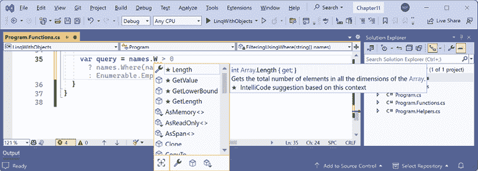
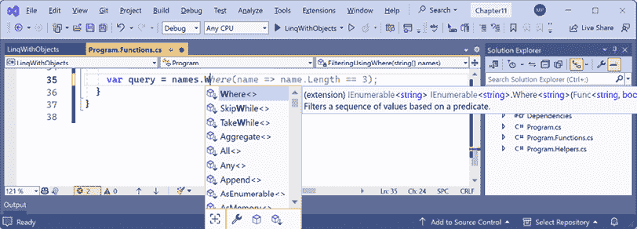
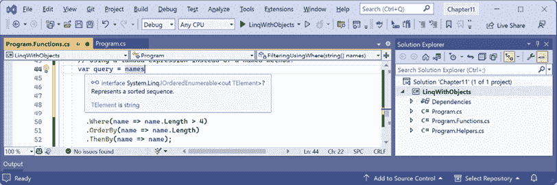
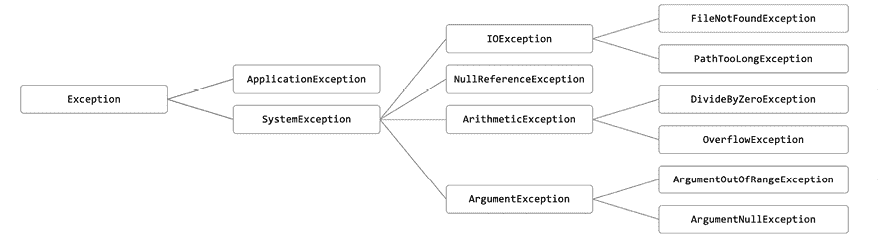
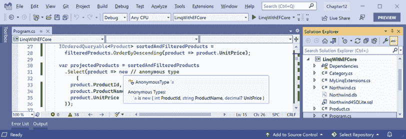

# 11

# 使用 LINQ 查询和操作数据

本章是关于**语言集成查询**（**LINQ**）表达式。LINQ 是一组语言扩展，使您能够处理数据序列，然后过滤、排序并将它们投影到不同的输出中。

本章将涵盖以下主题：

+   编写 LINQ 表达式

+   LINQ 实践

+   排序等更多功能

+   使用 LINQ 与 EF Core

+   连接、分组和查找

# 编写 LINQ 表达式

我们需要回答的第一个基本问题是：*为什么 LINQ 存在？*

## 比较命令式和声明式语言特性

LINQ 于 2008 年随 C# 3 和.NET Framework 3.0 一起推出。在此之前，如果 C#和.NET 程序员想要处理一系列项目，他们必须使用过程式，即命令式的代码语句。例如，一个循环：

1.  将当前位置设置为第一个项目。

1.  通过将一个或多个属性与指定的值进行比较来检查项目是否应该被处理。例如，单价是否大于 50，或者国家是否等于比利时？

1.  如果有匹配项，处理该项目。例如，将一个或多个属性输出给用户，将一个或多个属性更新为新值，删除项目，或执行聚合计算，如计数或求和值。

1.  移动到下一个项目。重复，直到所有项目都已处理。

过程式代码告诉编译器*如何*实现目标。这样做，然后那样做。由于编译器不知道你试图实现什么，因此它无法提供太多帮助。你必须 100%负责确保每个*如何做*步骤都是正确的。

LINQ 使这些常见任务变得更加容易，减少了引入微妙错误的可能。不再需要明确地声明每个单独的操作，如移动、读取、更新等，LINQ 使程序员能够使用声明性即函数式风格的语句编写。

声明性，即函数式，代码告诉编译器*要实现什么*目标。编译器会找出实现它的最佳方式。这些语句通常也更简洁。

**良好实践**：如果你不完全理解 LINQ 的工作原理，那么你编写的语句可能会引入自己的微妙错误！2022 年流传的一个代码谜题涉及一系列任务和了解它们何时执行([`twitter.com/amantinband/status/1559187912218099714`](https://twitter.com/amantinband/status/1559187912218099714))。大多数经验丰富的开发者都答错了！公平地说，是 LINQ 行为与多线程行为的组合让大多数人感到困惑。但到本章结束时，你将更好地了解为什么代码因为 LINQ 行为而危险。

尽管我们在第十章*使用 Entity Framework Core 处理数据*中编写了一些 LINQ 表达式，但它们并不是重点，因此我没有正确解释 LINQ 是如何工作的。现在让我们花时间正确理解它们。

## LINQ 组件

LINQ 有几个部分；一些是必需的，一些是可选的：

+   **扩展方法**（**必需**）：这些包括 `Where`、`OrderBy` 和 `Select` 等示例。这些提供了 LINQ 的功能。

+   **LINQ 提供程序**（**必需**）：这些包括用于处理内存中对象的 **LINQ to Objects**，用于处理存储在外部数据库中并由 EF Core 模型的 **LINQ to Entities**，以及用于处理存储为 XML 的数据的 **LINQ to XML**。这些提供程序是 LINQ 的组成部分，以针对不同类型数据的方式执行 LINQ 表达式。

+   **Lambda 表达式**（**可选**）：这些可以用作替代命名方法来简化 LINQ 查询，例如，用于 `Where` 方法的条件逻辑进行过滤。

+   **LINQ 查询理解语法**（**可选**）：这些包括 `from`、`in`、`where`、`orderby`、`descending` 和 `select` 等 C# 关键字。这些是某些 LINQ 扩展方法的别名，它们的使用可以简化你编写的查询，特别是如果你已经熟悉其他查询语言，如 **结构化查询语言**（**SQL**）。

当程序员第一次接触 LINQ 时，他们常常认为 LINQ 查询理解语法就是 LINQ，但讽刺的是，这正是 LINQ 中可选的部分之一！

## 使用 `Enumerable` 类构建 LINQ 表达式

LINQ 扩展方法，如 `Where` 和 `Select`，由 `Enumerable` 静态类附加到任何实现 `IEnumerable<T>` 的类型上，称为 **序列**。一个序列包含零个、一个或多个项。

例如，任何类型的数组都实现了 `IEnumerable<T>` 类，其中 `T` 是数组中项的类型。这意味着所有数组都支持 LINQ 进行查询和操作。

所有泛型集合，如 `List<T>`、`Dictionary<TKey, TValue>`、`Stack<T>` 和 `Queue<T>`，都实现了 `IEnumerable<T>`，因此它们也可以使用 LINQ 进行查询和操作。

`Enumerable` 定义了 50 多个扩展方法，总结在 *表 11.1* 和 *表 11.2* 中。

这些表格将对你未来的参考很有用，但就目前而言，你可能想简要地浏览它们，以了解存在哪些扩展方法，稍后再回来仔细审查。这些表格的在线版本可在以下链接找到：[`github.com/markjprice/cs13net9/blob/main/docs/ch11-linq-methods.md`](https://github.com/markjprice/cs13net9/blob/main/docs/ch11-linq-methods.md)。

首先，这里有一些返回新的 `IEnumerable<T>` 项序列的延迟方法：

| **方法** | **描述** |
| --- | --- |
| `Where` | 返回与指定过滤器匹配的项的序列。 |
| `索引` | 返回一个包含项及其索引的序列。从 .NET 9 开始引入。 |
| `Select` 和 `SelectMany` | 将项投影到不同的形状，即不同的类型，并扁平化项的嵌套层次结构。 |
| `Skip` | 跳过一定数量的项。 |
| `SkipWhile` | 在表达式为 `true` 时跳过项目。 |
| `SkipLast` | 返回一个新的可枚举集合，包含从源中获取的元素，但省略了源集合的最后 `count` 个元素。 |
| `Take` | 获取一定数量的项目。.NET 6 引入了一个可以传递 `Range` 的重载，例如，`Take(range: 3..⁵)`，意味着从开始处取三个项目，并在结束处取五个项目，或者而不是 `Skip(4)`，你可以使用 `Take(4..)`。 |
| `TakeWhile` | 在表达式为 `true` 时获取项目。 |
| `TakeLast` | 返回一个新的可枚举集合，包含从源中获取的最后一个 `count` 个元素。 |
| `OrderBy`, `OrderByDescending`, `ThenBy`, 和 `ThenByDescending` | 根据指定的字段或属性对项目进行排序。 |
| `Order` 和 `OrderDescending` | 根据项目本身进行排序。 |
| `Reverse` | 反转项目的顺序。 |
| `GroupBy`, `GroupJoin`, 和 `Join` | 对两个序列进行分组和/或连接。 |
| `AggregateBy`, `CountBy`, `DistinctBy`, `ExceptBy`, `IntersectBy`, `UnionBy`, `MinBy`, 和 `MaxBy` | 允许在项目的一个子集上而不是所有项目上执行比较。例如，而不是通过比较整个 `Person` 对象来使用 `Distinct` 移除重复项，你可以使用 `DistinctBy` 通过比较它们的 `LastName` 和 `DateOfBirth` 属性来移除重复项。`CountBy` 和 `AggregateBy` 扩展方法是在 .NET 9 中引入的。 |
| `AsEnumerable` | 返回输入序列作为 `IEnumerable<T>` 类型。这在类型有自己的 `Where` 等 LINQ 扩展方法实现时很有用，而你想要调用标准的 LINQ `Where` 方法。 |
| `DefaultIfEmpty` | 返回 `IEnumerable<T>` 的元素，如果序列为空，则返回默认值的单例集合。例如，如果序列是一个空的 `IEnumerable<int>`，它将返回一个包含单个项目 `0` 的 `IEnumerable<int>`。 |
| `Cast<T>` | 将项目转换为指定的类型。在编译器会报错的情况下，将非泛型对象转换为泛型类型很有用。 |
| `OfType<T>` | 移除不匹配指定类型的项。 |
| `Distinct` | 移除重复项。 |
| `Except`, `Intersect`, 和 `Union` | 执行返回集合的操作。集合不能有重复的项目。尽管输入可以是任何序列，因此输入可以有重复，但结果始终是集合。 |
| `Chunk` | 将序列分割成固定大小的批次。`size` 参数指定每个批次中的项目数量。最后一个批次将包含剩余的项目，并且可能小于 `size`。 |
| `Append`, `Concat`, 和 `Prepend` | 执行序列组合操作。 |
| `Zip` | 根据项目位置在两个或三个序列上执行匹配操作；例如，第一个序列位置 1 的项目与第二个序列位置 1 的项目匹配。 |

表 11.1：延迟的 LINQ 扩展方法

接下来，这里是一些返回单个标量值的非延迟方法，例如单个 `TSource` 项目、一个数字或一个 `bool`：

| `First`, `FirstOrDefault`, `Last`, 和 `LastOrDefault` | 获取序列中的第一个或最后一个项目，如果没有则抛出异常，或返回该类型的默认值，例如对于 `int` 类型是 `0`，对于引用类型是 `null`。 |
| --- | --- |
| `Single` 和 `SingleOrDefault` | 返回匹配特定过滤器的项目，如果没有则抛出异常，或返回该类型的默认值。 |
| `ElementAt` 和 `ElementAtOrDefault` | 返回指定索引位置的项目，如果没有则抛出异常，或返回该类型的默认值。.NET 6 引入了可以传递 `Index` 而不是 `int` 的重载，这在处理 `Span<T>` 序列时更有效。 |
| `Aggregate`, `Average`, `Count`, `LongCount`, `Max`, `Min`, 和 `Sum` | 计算聚合值。 |
| `TryGetNonEnumeratedCount` | `Count()` 检查序列是否实现了 `Count` 属性并返回其值，或者枚举整个序列以计数其项目。在 .NET 6 中引入，此方法仅检查 `Count`；如果它不存在，则返回 `false` 并将 `out` 参数设置为 `0` 以避免潜在的较差性能操作。 |
| `SequenceEqual` | 根据相等比较器判断两个序列是否相等，返回 `true` 或 `false`。 |
| `All`, `Any`, 和 `Contains` | 如果所有或任何项目匹配过滤器，或者序列包含指定的项目，则返回 `true`。如果序列是 `List<T>`，则它们使用其本地的 `TrueForAll` 方法而不是 LINQ 的 `All` 方法。 |
| `ToArray`, `ToList`, `ToDictionary`, `ToHashSet`, 和 `ToLookup` | 将序列转换为数组或集合。这些是唯一强制立即执行 LINQ 表达式而不是延迟执行的扩展方法，你将在稍后了解。 |

表 11.2：非延迟 LINQ 扩展方法

**良好实践**：确保你理解并记住以 `As` 和 `To` 开头的 LINQ 扩展方法之间的区别。`AsEnumerable` 方法将序列转换为不同的类型但不分配内存，因此该方法很快。以 `To` 开头的方法，如 `ToList`，为新的项目序列分配内存，因此它们可能较慢，并且总是使用更多的内存资源。

`Enumerable` 类还有一些不是扩展方法的方法，如表 11.3 所示：

| **方法** | **描述** |
| --- | --- |
| `Empty<T>` | 返回指定类型 `T` 的空序列。当需要传递空序列给需要 `IEnumerable<T>` 的方法时很有用。 |
| `Range` | 返回从 `start` 值开始的整数序列，包含 `count` 个项目。例如，`Enumerable.Range(start: 5, count: 3)` 将包含整数 5、6 和 7。 |
| `Repeat` | 返回一个包含重复 `count` 次相同元素的序列。例如，`Enumerable.Repeat(element: "5", count: 3)` 将包含 `string` 值 `"5"`、`"5"` 和 `"5"`。 |

表 11.3：Enumerable 非扩展方法

# 实践中的 LINQ

现在，我们可以构建一个控制台应用程序来探索使用 LINQ 的实际示例。

## 理解延迟执行

LINQ 使用**延迟执行**。重要的是要理解，调用上述大多数扩展方法并不会执行查询并获取结果。这些扩展方法中的大多数返回一个表示**问题**而不是**答案**的 LINQ 表达式。让我们来探索：

1.  使用您喜欢的代码编辑器创建一个新项目，如下列列表中定义：

    +   项目模板：**控制台应用程序** / `console`

    +   项目文件和文件夹：`LinqWithObjects`

    +   解决方案文件和文件夹：`Chapter11`

1.  在项目文件中，全局和静态导入 `System.Console` 类。

1.  添加一个名为 `Program.Helpers.cs` 的新类文件。

1.  在 `Program.Helpers.cs` 中，删除任何现有语句，然后定义一个部分 `Program` 类，其中包含一个用于输出部分标题的方法，如下面的代码所示：

    ```cs
    partial class Program
    {
      private static void SectionTitle(string title)
      {
        ConsoleColor previousColor = ForegroundColor;
        ForegroundColor = ConsoleColor.DarkYellow;
        WriteLine($"*** {title} ***");
        ForegroundColor = previousColor;
      }
    } 
    ```

1.  添加一个名为 `Program.Functions.cs` 的新类文件。

1.  在 `Program.Functions.cs` 中，删除任何现有语句，定义一个部分 `Program` 类，其中包含一个名为 `DeferredExecution` 的方法，该方法接受一个 `string` 值数组作为参数，然后定义两个查询，如下面的代码所示：

    ```cs
    partial class Program
    {
      private static void DeferredExecution(string[] names)
      {
        SectionTitle("Deferred execution");
        // Question: Which names end with an M?
        // (using a LINQ extension method)
        var query1 = names.Where(name => name.EndsWith("m"));
        // Question: Which names end with an M?
        // (using LINQ query comprehension syntax)
        var query2 = from name in names where name.EndsWith("m") select name;
      }
    } 
    ```

1.  在 `Program.cs` 中，删除现有语句，添加定义一个包含在办公室工作的人的 `string` 值序列的语句，然后将它作为参数传递给 `DeferredExecution` 方法，如下面的代码所示：

    ```cs
    // A string array is a sequence that implements IEnumerable<string>.
    string[] names = { "Michael", "Pam", "Jim", "Dwight",
      "Angela", "Kevin", "Toby", "Creed" };
    DeferredExecution(names); 
    ```

1.  在 `Program.Functions.cs` 的 `DeferredExecution` 方法中，要获取答案（换句话说，要执行查询），您必须通过调用 `To` 方法之一，如 `ToArray`、`ToDictionary` 或 `ToLookup`，或通过枚举查询来**实现**它。添加执行此操作的语句，如下面的代码所示：

    ```cs
    // Answer returned as an array of strings containing Pam and Jim.
    string[] result1 = query1.ToArray();
    // Answer returned as a list of strings containing Pam and Jim.
    List<string> result2 = query2.ToList();
    // Answer returned as we enumerate over the results.
    foreach (string name in query1)
    {
      WriteLine(name); // outputs Pam
      names[2] = "Jimmy"; // Change Jim to Jimmy.
      // On the second iteration Jimmy does not
      // end with an "m" so it does not get output.
    } 
    ```

1.  运行控制台应用程序并注意结果，如下面的输出所示：

    ```cs
    *** Deferred execution ***
    Pam 
    ```

由于延迟执行，在输出第一个结果 `Pam` 后，如果原始数组值发生变化，那么当我们循环回来时，将没有更多匹配项，因为 `Jim` 变成了 `Jimmy` 并且不以 `m` 结尾，所以只有 `Pam` 被输出。

在我们深入探讨之前，让我们放慢速度，看看一些常见的 LINQ 扩展方法和如何逐个使用它们。

## 使用 Where 过滤实体

使用 LINQ 最常见的原因是使用 `Where` 扩展方法来过滤序列中的项目。让我们通过定义一个名称序列并对其应用 LINQ 操作来探索过滤：

1.  在项目文件中，添加一个元素以防止 `System.Linq` 命名空间自动全局导入，如下面高亮显示的标记所示：

    ```cs
    <ItemGroup>
      <Using Include="System.Console" Static="true" />
     **<Using Remove=****"****System.Linq"** **/>**
    </ItemGroup> 
    ```

1.  在 `Program.Functions.cs` 中，添加一个名为 `FilteringUsingWhere` 的新方法，如下面的代码所示：

    ```cs
    private static void FilteringUsingWhere(string[] names)
    {
    } 
    ```

1.  如果你正在使用 Visual Studio，导航到 **工具** | **选项**。在 **选项** 对话框中，导航到 **文本编辑器** | **C#** | **IntelliSense**，清除 **显示未导入命名空间中的项** 复选框，然后点击 **确定**。

1.  在 `FilteringUsingWhere` 中，尝试在名称数组上调用 `Where` 扩展方法，如下面的代码所示：

    ```cs
    SectionTitle("Filtering entities using Where");
    var query = names.W 
    ```

1.  当你输入 `W` 时，注意在较老的代码编辑器（或者禁用了显示未导入命名空间项的选项的代码编辑器）中，`Where` 方法在 `string` 数组的 IntelliSense 成员列表中缺失，如图 *11.1* 所示：



图 11.1：缺少 Where 扩展方法的 IntelliSense

这是因为 `Where` 是一个扩展方法。它不存在于数组类型上。为了使 `Where` 扩展方法可用，我们必须导入 `System.Linq` 命名空间。在新的 .NET 6 及以后的项目中，它默认隐式导入，但我们移除了它以说明这一点。代码编辑器的最新版本足够智能，会建议使用 `Where` 方法，并指示它们将自动为你导入 `System.Linq` 命名空间。

1.  如果你正在使用 Visual Studio，导航到 **工具** | **选项**。在 **选项** 对话框中，导航到 **文本编辑器** | **C#** | **IntelliSense**，选择 **显示未导入命名空间中的项** 复选框，然后点击 **确定**。

1.  在项目文件中，注释掉移除 `System.Linq` 的元素，如下面的代码所示：

    ```cs
    <!--<Using Remove="System.Linq" />--> 
    ```

1.  保存更改并构建项目。

1.  重新输入 `Where` 方法的 `W`，注意 IntelliSense 列表现在包括由 `Enumerable` 类添加的扩展方法，如图 *11.2* 所示：



图 11.2：导入 System.Linq 时 IntelliSense 显示 LINQ 扩展方法

有趣的是，正如你在我的计算机上 Visual Studio 的截图中所见，GitHub Copilot 甚至建议使用 lambda 表达式自动完成，这与我们最终将编写的表达式非常相似。但在我们到达那里之前，有一些重要的中间步骤你需要看到，所以如果你启用了该功能，请不要插入任何 GitHub Copilot 建议。

1.  当你输入 `Where` 方法的括号时，IntelliSense 告诉我们，要调用 `Where`，我们必须传递一个 `Func<string, bool>` 委托实例。

1.  输入一个表达式来创建一个 `Func<string, bool>` 委托的新实例，目前请注意，我们尚未提供方法名，因为我们将在下一步定义它，如下面的代码所示：

    ```cs
    var query = names.Where(new Func<string, bool>( )) 
    ```

1.  目前先不要完成该语句。

`Func<string, bool>` 委托告诉我们，对于传递给方法的每个 `string` 变量，方法必须返回一个 `bool` 值。如果方法返回 `true`，则表示我们应该将 `string` 包含在结果中，如果方法返回 `false`，则表示我们应该排除它。

## 针对命名方法的定位

让我们定义一个只包含长度超过四个字符的名称的方法：

1.  在 `Program.Functions.cs` 中，添加一个方法，该方法仅对长度超过四个字符的名称返回 `true`，如下面的代码所示：

    ```cs
    static bool NameLongerThanFour(string name)
    {
      // Returns true for a name longer than four characters.
      return name.Length > 4;
    } 
    ```

1.  在 `FilteringUsingWhere` 方法中，将方法名称传递给 `Func<string, bool>` 委托，如下面的代码所示（高亮显示）：

    ```cs
    var query = names.Where(
      new Func<string, bool>(**NameLongerThanFour**)); 
    ```

1.  在 `FilteringUsingWhere` 方法中，添加使用 `foreach` 遍历 `names` 数组的语句，如下面的代码所示：

    ```cs
    foreach (string item in query)
    {
      WriteLine(item);
    } 
    ```

1.  在 `Program.cs` 中，注释掉对 `DeferredExecution` 的调用，然后将 `names` 作为参数传递给 `FilteringUsingWhere` 方法，如下面的代码所示：

    ```cs
    // DeferredExecution(names);
    FilteringUsingWhere(names); 
    ```

1.  运行代码并查看结果，注意只列出了长度超过四个字母的名称，如下面的输出所示：

    ```cs
    Michael
    Dwight
    Angela
    Kevin
    Creed 
    ```

## 通过移除显式委托实例化简化代码

我们可以通过删除 `Func<string, bool>` 委托的显式实例化来简化代码，因为 C# 编译器可以为我们实例化委托：

1.  为了帮助你通过查看逐步改进的代码来学习，在 `FilteringUsingWhere` 方法中，注释掉查询并添加关于其工作方式的注释，如下面的代码所示：

    ```cs
    // Explicitly creating the required delegate.
    // var query = names.Where(
    //   new Func<string, bool>(NameLongerThanFour)); 
    ```

1.  再次输入查询，但这次，不要显式实例化委托，如下面的代码所示：

    ```cs
    // The compiler creates the delegate automatically.
    var query = names.Where(NameLongerThanFour); 
    ```

1.  运行代码，并注意它具有相同的行为。

## 针对 lambda 表达式

我们可以使用 **lambda 表达式** 代替命名方法来进一步简化我们的代码。

虽然一开始看起来可能很复杂，但 lambda 表达式实际上是一个无名的函数。它使用 `=>`（读作“走向”）符号来表示返回值：

1.  将第二个查询注释掉，然后添加一个使用 lambda 表达式的查询的第三个版本，如下面的代码所示：

    ```cs
    // Using a lambda expression instead of a named method.
    var query = names.Where(name => name.Length > 4); 
    ```

注意，lambda 表达式的语法包括了 `NameLongerThanFour` 方法的重要部分，没有更多。lambda 表达式只需要定义以下内容：

+   输入参数的名称：`name`

+   返回值表达式：`name.Length > 4`

`name` 输入参数的类型是根据序列包含 `string` 值这一事实推断出来的，并且返回类型必须是委托定义的 `bool` 值，以便 `Where` 方法能够工作；因此，`=>` 符号后面的表达式必须返回一个 `bool` 值。编译器为我们做了大部分工作，所以我们的代码可以尽可能简洁。

1.  运行代码，并注意它具有相同的行为。

## 带有默认参数值的 lambda 表达式

从 C# 12 开始引入，你现在可以为 lambda 表达式中的参数提供默认值，如下面的代码所示：

```cs
var query = names.Where((string name = "Bob") => name.Length > 4); 
```

使用此 lambda 表达式的目的是，设置默认值不是必要的，但稍后你将看到更多有用的示例。

# 排序及其他

其他常用扩展方法有 `OrderBy` 和 `ThenBy`，用于对序列进行排序。

## 使用 OrderBy 按单个属性排序

如果前一个方法返回另一个序列，即实现 `IEnumerable<T>` 接口的类型，则可以链式调用扩展方法。

让我们继续使用当前项目来探索排序：

1.  在 `FilteringUsingWhere` 方法中，将 `OrderBy` 方法的调用附加到现有查询的末尾，如下所示代码：

    ```cs
    var query = names
      .Where(name => name.Length > 4)
      .OrderBy(name => name.Length); 
    ```

**良好实践**：格式化 LINQ 语句，使每个扩展方法调用都单独一行，这样更容易阅读。

1.  运行代码，并注意现在名字是按最短的先排序，如下所示输出：

    ```cs
    Kevin
    Creed
    Dwight
    Angela
    Michael 
    ```

要将最长的名字放在第一位，可以使用 `OrderByDescending`。

## 使用 ThenBy 按后续属性排序

我们可能想要按多个属性排序，例如，按相同长度的名字按字母顺序排序：

1.  在 `FilteringUsingWhere` 方法中，将 `ThenBy` 方法的调用附加到现有查询的末尾，如下所示代码高亮显示：

    ```cs
    var query = names
      .Where(name => name.Length > 4)
      .OrderBy(name => name.Length)
      **.ThenBy(name => name)**; 
    ```

1.  运行代码，注意以下排序顺序中的细微差别。在相同长度的名字组中，名字按字符串的完整值进行字母排序，因此`Creed`排在`Kevin`之前，而`Angela`排在`Dwight`之前，如下所示输出：

    ```cs
    Creed
    Kevin
    Angela
    Dwight
    Michael 
    ```

## 按项目本身排序

.NET 7 引入了 `Order` 和 `OrderDescending` 扩展方法。这些简化了按项目本身的排序。例如，如果您有一个 `string` 值的序列，那么在 .NET 7 之前，您必须调用 `OrderBy` 方法并传递一个选择项目的 lambda 表达式，如下所示代码：

```cs
var query = names.OrderBy(name => name); 
```

在 .NET 7 或更高版本中，我们可以简化语句，如下所示代码：

```cs
var query = names.Order(); 
```

`OrderDescending` 做类似的事情，但按降序排列。

记住 `names` 数组包含 `string` 类型的实例，该类型实现了 `IComparable` 接口。这就是为什么它们可以被排序，也就是排序。如果数组包含 `Person` 或 `Product` 等复杂类型的实例，那么这些类型必须实现 `IComparable` 接口，以便它们也可以被排序。

## 使用 var 或指定类型声明查询

在编写 LINQ 表达式时，使用 `var` 声明查询对象很方便。这是因为返回类型在编写 LINQ 表达式时经常变化。例如，我们的查询最初是 `IEnumerable<string>`，现在是 `IOrderedEnumerable<string>`：

1.  将鼠标悬停在 `var` 关键字上，并注意其类型为 `IOrderedEnumerable<string>`，如图 *11.3* 所示：



图 11.3：将鼠标悬停在 var 上，查看查询表达式的实际隐含类型

在 *图 11.3* 中，我在 `names` 和 `.Where` 之间添加了额外的垂直空间，这样工具提示就不会覆盖查询。

1.  将 `var` 替换为实际类型，如下所示代码高亮显示：

    ```cs
    **IOrderedEnumerable<****string****>** query = names
      .Where(name => name.Length > 4)
      .OrderBy(name => name.Length)
      .ThenBy(name => name); 
    ```

**良好实践**：一旦你完成对一个查询的工作，你可以将声明的类型从 `var` 改为实际类型，以使类型更清晰。这很容易，因为你的代码编辑器可以告诉你它是什么。这样做只是为了清晰。它对性能没有影响，因为 C# 在编译时会将所有 `var` 声明转换为实际类型。

1.  运行代码，注意它具有相同的行为。

## 按类型过滤

`Where` 扩展方法非常适合按值过滤，例如文本和数字。但如果序列包含多个类型，并且你想按特定类型过滤，同时尊重任何继承层次结构，该怎么办呢？

假设你有一个异常序列。有数百种异常类型构成了一个复杂的继承层次结构，部分如图 11.4 所示：



图 11.4：部分异常继承层次结构

让我们探索按类型过滤：

1.  在 `Program.Functions.cs` 中，定义一个新的方法来列出，然后使用 `OfType<T>` 扩展方法过滤异常派生对象，以移除非算术异常的异常，只将算术异常写入控制台，如下面的代码所示：

    ```cs
    static void FilteringByType()
    {
      SectionTitle("Filtering by type");
      List<Exception> exceptions = new()
      {
        new ArgumentException(), new SystemException(),
        new IndexOutOfRangeException(), new InvalidOperationException(),
        new NullReferenceException(), new InvalidCastException(),
        new OverflowException(), new DivideByZeroException(),
        new ApplicationException()
      };
      IEnumerable<ArithmeticException> arithmeticExceptionsQuery =
        exceptions.OfType<ArithmeticException>();
      foreach (ArithmeticException exception in arithmeticExceptionsQuery)
      {
        WriteLine(exception);
      }
    } 
    ```

1.  在 `Program.cs` 中，注释掉对 `FilteringUsingWhere` 的调用，然后添加对 `FilteringByType` 方法的调用，如下面的代码所示：

    ```cs
    // FilteringUsingWhere(names);
    FilteringByType(); 
    ```

1.  运行代码，注意结果只包括 `ArithmeticException` 类型或 `ArithmeticException` 派生类型的异常，如下面的输出所示：

    ```cs
    System.OverflowException: Arithmetic operation resulted in an overflow.
    System.DivideByZeroException: Attempted to divide by zero. 
    ```

## 使用集合和包

集合是数学中最基本的概念之一。**集合**是一组一个或多个独特的对象。**多集**，也称为**包**，是一组一个或多个可以重复的对象。

你可能记得在学校学过关于文氏图的内容。常见的集合操作包括集合之间的**交集**或**并集**。

让我们编写一些代码来定义三个代表学徒群体的 `string` 值数组，然后我们将对它们执行一些常见的集合和多集操作：

1.  在 `Program.Functions.cs` 中，添加一个方法，该方法将任何 `string` 变量的序列输出为逗号分隔的单个 `string` 到控制台输出，并可选地包含一个描述，如下面的代码所示：

    ```cs
    static void Output(IEnumerable<string> cohort,
      string description = "")
    {
      if (!string.IsNullOrEmpty(description))
      {
        WriteLine(description);
      }
      Write(" ");
      WriteLine(string.Join(", ", cohort.ToArray()));
      WriteLine();
    } 
    ```

1.  在 `Program.Functions.cs` 中，添加一个方法，该方法定义三个名称数组，输出它们，然后对它们执行各种集合操作，如下面的代码所示：

    ```cs
    static void WorkingWithSets()
    {
      string[] cohort1 =
        { "Rachel", "Gareth", "Jonathan", "George" };
      string[] cohort2 =
        { "Jack", "Stephen", "Daniel", "Jack", "Jared" };
      string[] cohort3 =
        { "Declan", "Jack", "Jack", "Jasmine", "Conor" };
      SectionTitle("The cohorts");
      Output(cohort1, "Cohort 1");
      Output(cohort2, "Cohort 2");
      Output(cohort3, "Cohort 3");
      SectionTitle("Set operations");
      Output(cohort2.Distinct(), "cohort2.Distinct()");
      Output(cohort2.DistinctBy(name => name.Substring(0, 2)),
        "cohort2.DistinctBy(name => name.Substring(0, 2)):");
      Output(cohort2.Union(cohort3), "cohort2.Union(cohort3)");
      Output(cohort2.Concat(cohort3), "cohort2.Concat(cohort3)");
      Output(cohort2.Intersect(cohort3), "cohort2.Intersect(cohort3)");
      Output(cohort2.Except(cohort3), "cohort2.Except(cohort3)");
      Output(cohort1.Zip(cohort2,(c1, c2) => $"{c1} matched with {c2}"),
        "cohort1.Zip(cohort2)");
    } 
    ```

1.  在 `Program.cs` 中，注释掉对 `FilteringByType` 的调用，然后添加对 `WorkingWithSets` 方法的调用，如下面的代码所示：

    ```cs
    // FilteringByType();
    WorkingWithSets(); 
    ```

1.  运行代码并查看结果，如下面的输出所示：

    ```cs
    Cohort 1
      Rachel, Gareth, Jonathan, George
    Cohort 2
      Jack, Stephen, Daniel, Jack, Jared
    Cohort 3
      Declan, Jack, Jack, Jasmine, Conor
    cohort2.Distinct()
      Jack, Stephen, Daniel, Jared
    cohort2.DistinctBy(name => name.Substring(0, 2)):
      Jack, Stephen, Daniel
    cohort2.Union(cohort3)
      Jack, Stephen, Daniel, Jared, Declan, Jasmine, Conor
    cohort2.Concat(cohort3)
      Jack, Stephen, Daniel, Jack, Jared, Declan, Jack, Jack, Jasmine, Conor
    cohort2.Intersect(cohort3)
      Jack
    cohort2.Except(cohort3)
      Stephen, Daniel, Jared
    cohort1.Zip(cohort2)
      Rachel matched with Jack, Gareth matched with Stephen, Jonathan matched with Daniel, George matched with Jack 
    ```

使用 `Zip`，如果两个序列中的项目数量不相等，则某些项目将没有匹配的伙伴。那些没有伙伴的，比如 `Jared`，将不会包含在结果中。

对于 `DistinctBy` 示例，我们不是通过比较整个名称来移除重复项，而是定义了一个 lambda 键选择器，通过比较前两个字符来移除重复项，因此 `Jared` 被移除，因为 `Jack` 已经是一个以 `Ja` 开头的名字。

## 获取索引以及项目。

.NET 9 引入了 `Index` LINQ 扩展方法。在 .NET 的早期版本中，如果你想获取每个项目的索引位置以及项目本身，你可以使用 `Select` 方法，但这有点混乱。

让我们看看旧方法和新方法的示例：

1.  在 `Program.Functions.cs` 中，添加一个方法，定义一个包含名称的数组，并使用旧方法（`Select` 方法）和新技术（`Index` 方法）输出它们及其索引位置，如下所示：

    ```cs
    static void WorkingWithIndices()
    {
      string[] theSeven = { "Homelander",
        "Black Noir", "The Deep", "A-Train",
        "Queen Maeve", "Starlight", "Stormfront" };
      SectionTitle("Working With Indices (old)");
      foreach (var (item, index) in
        theSeven.Select((item, index) => (item, index)))
      {
        WriteLine($"{index}: {item}");
      }
      SectionTitle("Working With Indices (new)");
      foreach (var (index, item) in theSeven.Index())
      {
        WriteLine($"{index}: {item}");
      }
    } 
    ```

**警告！** 注意两个声明变量的顺序，这两个变量将保存索引和项目。当使用 `Select` 方法时，你必须先声明 `item`，然后是 `index`。当使用 `Index` 方法时，你必须先声明 `index`，然后是 `item`。

1.  在 `Program.cs` 中，注释掉对 `WorkingWithSets` 的调用，然后添加对 `WorkingWithIndices` 方法的调用，如下所示：

    ```cs
    // WorkingWithSets();
    WorkingWithIndices(); 
    ```

1.  运行代码并查看结果，如下所示：

    ```cs
    *** Working With Indices (old) ***
    0: Homelander
    1: Black Noir
    2: The Deep
    3: A-Train
    4: Queen Maeve
    5: Starlight
    6: Stormfront
    *** Working With Indices (new) ***
    0: Homelander
    1: Black Noir
    2: The Deep
    3: A-Train
    4: Queen Maeve
    5: Starlight
    6: Stormfront 
    ```

到目前为止，我们已经使用了 LINQ to Objects 提供程序来处理内存中的对象。接下来，我们将使用 LINQ to Entities 提供程序来处理存储在数据库中的实体。

# 使用 EF Core 中的 LINQ。

我们已经看到了过滤和排序的 LINQ 查询，但没有改变序列中项目形状的查询。这种操作称为 **投影**，因为它涉及到将一个形状的项目投影到另一个形状。要了解投影，最好有一些更复杂的数据类型来处理，因此，在下一个项目中，我们不会使用 `string` 序列，而是使用你在 *第十章* 中介绍的 Northwind 示例数据库中的实体序列。

我将给出使用 SQLite 的说明，因为它跨平台，但如果你更喜欢使用 SQL Server，那么请随意这样做。如果你选择使用 SQL Server，我已经包含了一些注释代码来启用 SQL Server。

## 创建用于探索 LINQ to Entities 的控制台应用程序。

首先，我们必须创建一个控制台应用程序和 Northwind 数据库来工作：

1.  使用你喜欢的代码编辑器添加一个新的 **Console App** / `console` 项目，命名为 `LinqWithEFCore`，到 `Chapter11` 解决方案中。

1.  在项目文件中，全局和静态导入 `System.Console` 类。

1.  在 `LinqWithEFCore` 项目中，添加对 SQLite 和/或 SQL Server 的 EF Core 提供程序的包引用，如下所示：

    ```cs
    <ItemGroup>
      <!--To use SQLite-->
      <PackageReference Version="9.0.0"
        Include="Microsoft.EntityFrameworkCore.Sqlite" />
      <!--To use SQL Server-->
      <PackageReference Version="9.0.0"
        Include="Microsoft.EntityFrameworkCore.SqlServer" />
    </ItemGroup> 
    ```

1.  构建用于恢复包的 `LinqWithEFCore` 项目。

1.  将 `Northwind4Sqlite.sql` 文件复制到 `LinqWithEFCore` 文件夹。

1.  在 `LinqWithEFCore` 文件夹的命令提示符或终端中，通过执行以下命令创建 Northwind 数据库：

    ```cs
    sqlite3 Northwind.db -init Northwind4Sqlite.sql 
    ```

1.  请耐心等待，因为这个命令可能需要一段时间来创建数据库结构。最终，您将看到如下所示的 SQLite 命令提示符：

    ```cs
     -- Loading resources from Northwind4Sqlite.sql
    SQLite version 3.38.0 2022-02-22 15:20:15
    Enter ".help" for usage hints.
    sqlite> 
    ```

1.  要退出 SQLite 命令模式，在 Windows 上按 *Ctrl* + *C* 两次，在 macOS 或 Linux 上按 *Cmd* + *D*。

1.  如果您更喜欢使用 SQL Server，那么您应该已经从上一章创建了 SQL Server 中的 Northwind 数据库。

## 构建 EF Core 模型

我们必须定义一个 EF Core 模型来表示我们将要工作的数据库和表。我们将手动定义模型以完全控制，并防止在 `Categories` 和 `Products` 表之间自动定义关系。稍后，您将使用 LINQ 来连接这两个实体集：

1.  在 `LinqWithEFCore` 项目中，添加一个名为 `EntityModels` 的新文件夹。

1.  在 `EntityModels` 文件夹中，向项目添加三个类文件，分别命名为 `NorthwindDb.cs`、`Category.cs` 和 `Product.cs`。

1.  修改名为 `Category.cs` 的类文件，如下所示：

    ```cs
    // To use [Required] and [StringLength].
    using System.ComponentModel.DataAnnotations;
    namespace Northwind.EntityModels;
    public class Category
    {
      public int CategoryId { get; set; }
      [Required]
      [StringLength(15)]
      public string CategoryName { get; set; } = null!;
      public string? Description { get; set; }
    } 
    ```

1.  修改名为 `Product.cs` 的类文件，如下所示：

    ```cs
    // To use [Required] and [StringLength].
    using System.ComponentModel.DataAnnotations;
    // To use [Column].
    using System.ComponentModel.DataAnnotations.Schema;
    namespace Northwind.EntityModels;
    public class Product
    {
      public int ProductId { get; set; }
      [Required]
      [StringLength(40)]
      public string ProductName { get; set; } = null!;
      public int? SupplierId { get; set; }
      public int? CategoryId { get; set; }
      [StringLength(20)]
      public string? QuantityPerUnit { get; set; }
      // Required for SQL Server provider.
      [Column(TypeName = "money")]
      public decimal? UnitPrice { get; set; }
      public short? UnitsInStock { get; set; }
      public short? UnitsOnOrder { get; set; }
      public short? ReorderLevel { get; set; }
      public bool Discontinued { get; set; }
    } 
    ```

我们故意没有定义 `Category` 和 `Product` 之间的任何关系，以便我们可以在稍后使用 LINQ 手动将它们关联起来。

1.  修改名为 `NorthwindDb.cs` 的类文件，如下所示：

    ```cs
    using Microsoft.Data.SqlClient; // To use SqlConnectionStringBuilder.
    using Microsoft.EntityFrameworkCore; // To use DbContext, DbSet<T>.
    namespace Northwind.EntityModels;
    public class NorthwindDb : DbContext
    {
      public DbSet<Category> Categories { get; set; } = null!;
      public DbSet<Product> Products { get; set; } = null!;
      protected override void OnConfiguring(
        DbContextOptionsBuilder optionsBuilder)
      {
        #region To use SQLite
        string database = "Northwind.db";
        string dir = Environment.CurrentDirectory;
        string path = string.Empty;
        // The database file will stay in the project folder.
        // We will automatically adjust the relative path to
        // account for running in Visual Studio or CLI.
        if (dir.EndsWith("net9.0"))
        {
          // Running in the <project>\bin\<Debug|Release>\net9.0 directory.
          path = Path.Combine("..", "..", "..", database);
        }
        else
        {
          // Running in the <project> directory.
          path = database;
        }
        path = Path.GetFullPath(path); // Convert to absolute path.
        WriteLine($"SQLite database path: {path}");
        if (!File.Exists(path))
        {
          throw new FileNotFoundException(
            message: $"{path} not found.", fileName: path);
        }
        // To use SQLite.
        optionsBuilder.UseSqlite($"Data Source={path}");
        #endregion
        #region To use SQL Server
        SqlConnectionStringBuilder builder = new();
        builder.DataSource = ".";
        builder.InitialCatalog = "Northwind";
        builder.IntegratedSecurity = true;
        builder.Encrypt = true;
        builder.TrustServerCertificate = true;
        builder.MultipleActiveResultSets = true;
        string connection = builder.ConnectionString;
        // WriteLine($"SQL Server connection: {connection}");
        // To use SQL Server.
        // optionsBuilder.UseSqlServer(connection);
        #endregion
      }
      protected override void OnModelCreating(
        ModelBuilder modelBuilder)
      {
        if (Database.ProviderName is not null &&
          Database.ProviderName.Contains("Sqlite"))
        {
          // SQLite data provider does not directly support the
          // decimal type so we can convert to double instead.
          modelBuilder.Entity<Product>()
            .Property(product => product.UnitPrice)
            .HasConversion<double>();
        }
      }
    } 
    ```

如果您想使用 SQL Server，那么请注释掉调用 `UseSqlite` 的语句，并取消注释调用 `UseSqlServer` 的语句。

1.  构建项目并修复任何编译错误。

## 过滤和排序序列

现在，让我们编写语句来过滤和排序来自表的行序列：

1.  在 `LinqWithEFCore` 项目中，添加一个名为 `Program.Helpers.cs` 的新类文件。

1.  在 `Program.Helpers.cs` 中，定义一个部分 `Program` 类，其中包含一个配置控制台以支持特殊字符（如欧元货币符号）、控制当前区域设置以及输出部分标题的函数，如下所示：

    ```cs
    using System.Globalization; // To use CultureInfo.
    partial class Program
    {
      private static void ConfigureConsole(string culture = "en-US",
        bool useComputerCulture = false)
      {
        // To enable Unicode characters like Euro symbol in the console.
        OutputEncoding = System.Text.Encoding.UTF8;
        if (!useComputerCulture)
        {
          CultureInfo.CurrentCulture = CultureInfo.GetCultureInfo(culture);
        }
        WriteLine($"CurrentCulture: {CultureInfo.CurrentCulture.DisplayName}");
      }
      private static void SectionTitle(string title)
      {
        ConsoleColor previousColor = ForegroundColor;
        ForegroundColor = ConsoleColor.DarkYellow;
        WriteLine($"*** {title} ***");
        ForegroundColor = previousColor;
      }
    } 
    ```

1.  在 `LinqWithEFCore` 项目中，添加一个名为 `Program.Functions.cs` 的新类文件。

1.  在 `Program.Functions.cs` 中定义一个部分 `Program` 类，并添加一个过滤和排序产品的函数，如下所示：

    ```cs
    using Northwind.EntityModels; // To use NorthwindDb, Category, Product.
    using Microsoft.EntityFrameworkCore; // To use DbSet<T>.
    partial class Program
    {
      private static void FilterAndSort()
      {
        SectionTitle("Filter and sort");
        using NorthwindDb db = new();
        DbSet<Product> allProducts = db.Products;
        IQueryable<Product> filteredProducts =
          allProducts.Where(product => product.UnitPrice < 10M);
        IOrderedQueryable<Product> sortedAndFilteredProducts =
          filteredProducts.OrderByDescending(product => product.UnitPrice);
        WriteLine("Products that cost less than $10:");
        foreach (Product p in sortedAndFilteredProducts)
        {
          WriteLine("{0}: {1} costs {2:$#,##0.00}",
            p.ProductId, p.ProductName, p.UnitPrice);
        }
        WriteLine();
      }
    } 
    ```

注意以下关于前面代码的内容：

+   `DbSet<T>` 实现 `IEnumerable<T>`，因此 LINQ 可以用于查询和操作为 EF Core 构建的模型中的实体序列。（实际上，我应该说是 `TEntity` 而不是 `T`，但这个泛型类型的名称没有功能上的影响。唯一的要求是这个类型是一个 `class`。这个名称只是表明这个类预期是一个实体模型。）

+   序列实现 `IQueryable<T>`（或调用排序 LINQ 方法后的 `IOrderedQueryable<T>`），而不是 `IEnumerable<T>` 或 `IOrderedEnumerable<T>`。这表明我们正在使用一个 LINQ 提供程序，该提供程序使用表达式树构建查询。它们代表以树状数据结构中的代码，并允许创建动态查询，这对于构建针对外部数据提供程序（如 SQLite）的 LINQ 查询非常有用。

+   LINQ 表达式将被转换为另一种查询语言，例如 SQL。使用 `foreach` 遍历查询或调用 `ToArray` 等方法将强制执行查询并使结果具体化。

1.  在 `Program.cs` 中，删除任何现有语句，然后调用 `ConfigureConsole` 和 `FilterAndSort` 方法，如下所示代码：

    ```cs
    ConfigureConsole(); // Sets US English by default.
    FilterAndSort(); 
    ```

1.  运行项目并查看结果，如下所示输出：

    ```cs
    CurrentCulture: English (United States)
    *** Filter and sort ***
    SQLite database path: C:\cs13net9\Chapter11\LinqWithEFCore\Northwind.db
    Products that cost less than $10:
    41: Jack's New England Clam Chowder costs $9.65
    45: Rogede sild costs $9.50
    47: Zaanse koeken costs $9.50
    19: Teatime Chocolate Biscuits costs $9.20
    23: Tunnbröd costs $9.00
    75: Rhönbräu Klosterbier costs $7.75
    54: Tourtière costs $7.45
    52: Filo Mix costs $7.00
    13: Konbu costs $6.00
    24: Guaraná Fantástica costs $4.50
    33: Geitost costs $2.50 
    ```

虽然此查询输出了我们想要的信息，但它效率低下，因为它从 `Products` 表中获取所有列，而不是我们需要的三个列。让我们记录生成的 SQL。

1.  在 `FilterAndSort` 方法中，在用 `foreach` 遍历结果之前，添加一个输出 SQL 的语句，如下所示的高亮代码：

    ```cs
    WriteLine("Products that cost less than $10:");
    **WriteLine(sortedAndFilteredProducts.ToQueryString());** 
    ```

1.  运行代码，查看显示在产品详情之前执行的 SQL 的结果，如下所示的部分输出：

    ```cs
    Products that cost less than $10:
    SELECT "p"."ProductId", "p"."CategoryId", "p"."Discontinued", "p"."ProductName", "p"."QuantityPerUnit", "p"."ReorderLevel", "p"."SupplierId", "p"."UnitPrice", "p"."UnitsInStock", "p"."UnitsOnOrder"
    FROM "Products" AS "p"
    WHERE "p"."UnitPrice" < 10.0
    ORDER BY "p"."UnitPrice" DESC
    41: Jack's New England Clam Chowder costs $9.65
    ... 
    ```

## 将序列投影到新类型

在我们查看**投影**之前，我们应该回顾对象初始化语法。如果您有一个类定义，则可以使用类名、`new()` 和花括号来设置字段和属性的初始值，如下所示代码：

```cs
// Person.cs
public class Person
{
  public string Name { get; set; }
  public DateTime DateOfBirth { get; set; }
}
// Program.cs
Person knownTypeObject = new()
{
  Name = "Boris Johnson",
  DateOfBirth = new(year: 1964, month: 6, day: 19)
}; 
```

C# 3 及以后的版本允许使用 `var` 关键字实例化匿名类型实例，如下所示代码：

```cs
var anonymouslyTypedObject = new
{
  Name = "Boris Johnson",
  DateOfBirth = new DateTime(year: 1964, month: 6, day: 19)
}; 
```

虽然我们没有指定类型，但编译器可以从两个属性的设置中推断出匿名类型，这两个属性分别命名为 `Name` 和 `DateOfBirth`。编译器可以从分配的值推断出两个属性的类型：一个字面量 `string` 和一个日期/时间值的新实例。

当编写 LINQ 查询将现有类型投影到新类型时，此功能特别有用，无需显式定义新类型。由于类型是匿名的，这只能与 `var` 声明的局部变量一起工作。

通过添加对 `Select` 方法的调用，使针对数据库表的 SQL 命令更高效，将 `Product` 类的实例投影到仅具有三个属性的新匿名类型实例：

1.  在 `Program.Functions.cs` 文件中，在 `FilterAndSort` 方法中，添加一条语句以扩展 LINQ 查询，使用 `Select` 方法仅返回我们需要的三个属性（即表列），修改对 `ToQueryString` 的调用以使用新的 `projectedProducts` 查询，并修改 `foreach` 语句以使用 `var` 关键字和新的 `projectedProducts` 查询，如下所示（代码高亮）：

    ```cs
    IOrderedQueryable<Product> sortedAndFilteredProducts =
      filteredProducts.OrderByDescending(product => product.UnitPrice);
    **var** **projectedProducts = sortedAndFilteredProducts**
     **.Select(product =>** **new****// Anonymous type.**
     **{**
     **product.ProductId,**
     **product.ProductName,**
     **product.UnitPrice**
     **});**
    WriteLine("Products that cost less than $10:");
    WriteLine(**projectedProducts**.ToQueryString());
    foreach (**var** p in **projectedProducts**)
    { 
    ```

1.  将鼠标悬停在 `Select` 方法调用中的 `new` 关键字或 `foreach` 语句中的 `var` 关键字上，并注意它是一个匿名类型，如图 *图 11.5* 所示：



图 11.5：在 LINQ 投影期间使用的匿名类型

1.  运行项目，并确认输出与之前相同，生成的 SQL 更高效，如下所示（输出）：

    ```cs
    SELECT "p"."ProductId", "p"."ProductName", "p"."UnitPrice"
    FROM "Products" AS "p"
    WHERE "p"."UnitPrice" < 10.0
    ORDER BY "p"."UnitPrice" DESC 
    ```

**更多信息**：您可以在以下链接中了解更多关于使用 `Select` 方法进行投影的信息：[`learn.microsoft.com/en-us/dotnet/csharp/programming-guide/concepts/linq/projection-operations`](https://learn.microsoft.com/en-us/dotnet/csharp/programming-guide/concepts/linq/projection-operations)。

让我们继续通过学习如何连接、分组和执行查找来查看常见的 LINQ 查询。

# 加入、分组和查找

有三个用于连接、分组和创建分组查找的扩展方法：

+   `Join`：此方法有四个参数：您想要与之连接的序列、在 *左侧* 序列上匹配的属性或属性、在 *右侧* 序列上匹配的属性或属性，以及一个投影。

+   `GroupJoin`：此方法具有相同的参数，但它将匹配项组合成一个具有 `Key` 属性的组对象，该属性用于匹配值，以及用于多个匹配项的 `IEnumerable<T>` 类型。

+   `ToLookup`：此方法创建一个新的数据结构，该结构按键对序列进行分组。

## 连接序列

让我们探索在处理两个表 `Categories` 和 `Products` 时这些方法：

1.  在 `Program.Functions.cs` 中，添加一个选择类别和产品、将它们连接并输出的方法，如下所示（代码）：

    ```cs
    private static void JoinCategoriesAndProducts()
    {
      SectionTitle("Join categories and products");
      using NorthwindDb db = new();
      // Join every product to its category to return 77 matches.
      var queryJoin = db.Categories.Join(
        inner: db.Products,
        outerKeySelector: category => category.CategoryId,
        innerKeySelector: product => product.CategoryId,
        resultSelector: (c, p) =>
          new { c.CategoryName, p.ProductName, p.ProductId });
      foreach (var p in queryJoin)
      {
        WriteLine($"{p.ProductId}: {p.ProductName} in {p.CategoryName}.");
      }
    } 
    ```

在连接中，有两个序列，`outer` 和 `inner`。在上面的示例中，`categories` 是外部序列，`products` 是内部序列。

1.  在 `Program.cs` 中，注释掉对 `FilterAndSort` 的调用，然后调用 `JoinCategoriesAndProducts` 方法，如下所示（代码高亮）：

    ```cs
    ConfigureConsole(); // Sets US English by default.
    **//** FilterAndSort();
    **JoinCategoriesAndProducts();** 
    ```

1.  运行代码并查看结果。注意，对于每个 77 个产品，都有一行输出，如下所示（输出，仅包括前四项）：

    ```cs
    1: Chai in Beverages.
    2: Chang in Beverages.
    3: Aniseed Syrup in Condiments.
    4: Chef Anton's Cajun Seasoning in Condiments.
    ... 
    ```

1.  在 `Program.Functions.cs` 中，在 `JoinCategoriesAndProducts` 方法中，在现有查询的末尾调用 `OrderBy` 方法按 `CategoryName` 排序，如下所示（代码高亮）：

    ```cs
    var queryJoin = db.Categories.Join(
      inner: db.Products,
      outerKeySelector: category => category.CategoryId,
      innerKeySelector: product => product.CategoryId,
      resultSelector: (c, p) =>
        new { c.CategoryName, p.ProductName, p.ProductId })
      **.OrderBy(cp => cp.CategoryName)**; 
    ```

1.  运行代码并查看结果。请注意，每个 77 个产品都有一行输出，结果首先显示 `Beverages` 类别中的所有产品，然后是 `Condiments` 类别，依此类推，如下面的部分输出所示：

    ```cs
    1: Chai in Beverages.
    2: Chang in Beverages.
    24: Guaraná Fantástica in Beverages.
    34: Sasquatch Ale in Beverages.
    ... 
    ```

## 分组连接序列

让我们探索使用与探索连接时相同的两个表（`Categories` 和 `Products`），以便我们可以比较细微的差异：

1.  在 `Program.Functions.cs` 中，添加一个分组和连接的方法，显示组名，然后显示每个组中的所有项目，如下面的代码所示：

    ```cs
    private static void GroupJoinCategoriesAndProducts()
    {
      SectionTitle("Group join categories and products");
      using NorthwindDb db = new();
      // Group all products by their category to return 8 matches.
      var queryGroup = db.Categories.AsEnumerable().GroupJoin(
        inner: db.Products,
        outerKeySelector: category => category.CategoryId,
        innerKeySelector: product => product.CategoryId,
        resultSelector: (c, matchingProducts) => new
        {
          c.CategoryName,
          Products = matchingProducts.OrderBy(p => p.ProductName)
        });
      foreach (var c in queryGroup)
      {
        WriteLine($"{c.CategoryName} has {c.Products.Count()} products.");
        foreach (var product in c.Products)
        {
          WriteLine($"  {product.ProductName}");
        }
      }
    } 
    ```

如果我们没有调用 `AsEnumerable` 方法，那么将抛出一个运行时异常，如下面的输出所示：

```cs
Unhandled exception. System.ArgumentException:  Argument type 'System.Linq.IOrderedQueryable`1[Packt.Shared.Product]' does not match the corresponding member type 'System.Linq.IOrderedEnumerable`1[Packt.Shared.Product]' (Parameter 'arguments[1]') 
```

这是因为并非所有 LINQ 扩展方法都可以从表达式树转换为其他查询语法，如 SQL。在这些情况下，我们可以通过调用 `AsEnumerable` 方法将 `IQueryable<T>` 转换为 `IEnumerable<T>`，这强制查询处理仅使用 LINQ to EF Core 将数据带入应用程序，然后使用 LINQ to Objects 在内存中执行更复杂的处理。但是，这通常效率较低。

1.  在 `Program.cs` 中，调用 `GroupJoinCategoriesAndProducts` 方法。

1.  运行代码，查看结果，并注意每个类别内的产品已按查询中定义的名称排序，如下面的部分输出所示：

    ```cs
    Beverages has 12 products.
      Chai
      Chang
      ...
    Condiments has 12 products.
      Aniseed Syrup
      Chef Anton's Cajun Seasoning
      ... 
    ```

## 查询分组

而不是编写一个 LINQ 查询表达式来连接和分组，然后运行一次，您可能希望使用 LINQ 扩展方法来创建，然后存储一个可重用的内存集合，该集合包含已分组的实体。

在 Northwind 数据库中有一个名为 `Products` 的表，其中包含一个列，表示它们所在的类别，部分如下所示 *表 11.4*：

| **产品名称** | **分类 ID** |
| --- | --- |
| 奶茶 | 1 |
| 长颈瓶 | 1 |
| 八角糖浆 | 2 |
| 安东大厨的卡真调味料 | 2 |
| 安东大厨的 gumbo 混合料 | 2 |
| ... | ... |

表 11.4：产品表的前五行

您可能希望在内存中创建一个数据结构，可以按类别对 `Product` 实体进行分组，然后提供一个快速的方法来查找特定类别中的所有产品。

您可以使用 `ToLookup` LINQ 方法创建此内容，如下面的代码所示：

```cs
ILookup<int, Product>? productsByCategoryId =
  db.Products.ToLookup(keySelector: category => category.CategoryId); 
```

当您调用 `ToLookup` 方法时，您必须指定一个 **键选择器** 来选择您想要按什么值分组。然后，此值可以稍后用于查找组和其项目。

`ToLookup` 方法在内存中创建一个类似于字典的数据结构，其中包含键值对，键是唯一的类别 ID，值是 `Product` 对象的集合，部分如下所示 *表 11.5*：

| **键** | **值（每个都是一个 Product 对象的集合）** |
| --- | --- |
| 1 | [奶茶], [长颈瓶]，等等 |
| 2 | [八角糖浆], [安东大厨的卡真调味料], [安东大厨的 gumbo 混合料]，等等 |
| ... | ... |

表 11.5：查找的前两行

注意，方括号中的产品名称，如 `[Chai]`，代表一个完整的 `Product` 对象。

我们可以使用相关类别表中的类别名称，而不是使用 `CategoryId` 值作为查找的关键。

让我们在代码示例中这样做：

1.  在 `Program.Functions.cs` 中添加一个方法，将产品与类别名称连接起来，然后将其转换为查找，使用 `IGrouping<string, Product>` 枚举整个查找，以表示查找字典中的每一行，并查找特定类别的单个产品集合，如下面的代码所示：

    ```cs
    private static void ProductsLookup()
    {
      SectionTitle("Products lookup");
      using NorthwindDb db = new();
      // Join all products to their category to return 77 matches.
      var productQuery = db.Categories.Join(
        inner: db.Products,
        outerKeySelector: category => category.CategoryId,
        innerKeySelector: product => product.CategoryId,
        resultSelector: (c, p) => new { c.CategoryName, Product = p });
      ILookup<string, Product> productLookup = productQuery.ToLookup(
        keySelector: cp => cp.CategoryName,
        elementSelector: cp => cp.Product);
      foreach (IGrouping<string, Product> group in productLookup)
      {
        // Key is Beverages, Condiments, and so on.
        WriteLine($"{group.Key} has {group.Count()} products.");
        foreach (Product product in group)
        {
          WriteLine($" {product.ProductName}");
        }
      }
      // We can look up the products by a category name.
      Write("Enter a category name: ");
      string categoryName = ReadLine()!;
      WriteLine();
      WriteLine($"Products in {categoryName}:");
      IEnumerable<Product> productsInCategory = productLookup[categoryName];
      foreach (Product product in productsInCategory)
      {
        WriteLine($"  {product.ProductName}");
      }
    } 
    ```

**选择器**参数是用于选择不同目的的 lambda 表达式。例如，`ToLookup` 有一个 `keySelector` 用于选择每个项的部分，该部分将成为键，还有一个 `elementSelector` 用于选择每个项的部分，该部分将成为值。你可以在以下链接中了解更多信息：[`learn.microsoft.com/en-us/dotnet/api/system.linq.enumerable.tolookup`](https://learn.microsoft.com/en-us/dotnet/api/system.linq.enumerable.tolookup)。

1.  在 `Program.cs` 中调用 `ProductsLookup` 方法。

1.  运行代码，查看结果，输入一个类别名称，例如 `Seafoods`，并注意该类别下的产品已经被查找并列出，如下面的部分输出所示：

    ```cs
    Beverages has 12 products.
      Chai
      Chang
      ...
    Condiments has 12 products.
      Aniseed Syrup
      Chef Anton's Cajun Seasoning
      ...
    Enter a category name: Seafood
    Products in Seafood:
      Ikura
      Konbu
      Carnarvon Tigers
      Nord-Ost Matjeshering
      Inlagd Sill
      Gravad lax
      Boston Crab Meat
      Jack's New England Clam Chowder
      Rogede sild
      Spegesild
      Escargots de Bourgogne
      Röd Kaviar 
    ```

LINQ 有很多内容，在最后一节中，你将有机会通过一些在线材料进一步探索。

# 练习和探索

通过回答一些问题、进行一些动手实践，并深入探索本章涵盖的主题来测试你的知识和理解。

## 练习 11.1 – 在线材料

在线材料可以是为我这本书写的额外内容，也可以是引用 Microsoft 或第三方创建的内容。

### 聚合和分页序列

你可以在以下链接中学习如何使用 LINQ 聚合方法和实现数据分页：

[`github.com/markjprice/cs13net9/blob/main/docs/ch11-aggregating.md`](https://github.com/markjprice/cs13net9/blob/main/docs/ch11-aggregating.md)

### 使用并行 LINQ 进行多线程操作

你可以通过使用多线程运行 LINQ 查询来提高性能和可伸缩性。通过完成以下链接中找到的仅在线部分来学习如何操作：

[`github.com/markjprice/cs13net9/blob/main/docs/ch11-plinq.md`](https://github.com/markjprice/cs13net9/blob/main/docs/ch11-plinq.md)

### 使用 LINQ to XML 进行操作

如果你想要使用 LINQ 处理或生成 XML，那么你可以通过完成以下链接中找到的在线部分来学习其基础知识：

[`github.com/markjprice/cs13net9/blob/main/docs/ch11-linq-to-xml.md`](https://github.com/markjprice/cs13net9/blob/main/docs/ch11-linq-to-xml.md)

### 创建自己的 LINQ 扩展方法

如果您想创建自己的 LINQ 扩展方法，那么您可以通过完成以下链接中仅在线部分来学习基础知识：

[`github.com/markjprice/cs13net9/blob/main/docs/ch11-custom-linq-methods.md`](https://github.com/markjprice/cs13net9/blob/main/docs/ch11-custom-linq-methods.md)

### .NET 9 中新 LINQ 方法的设计

您可以在以下链接中阅读有关 .NET 9 中引入的新 LINQ 扩展方法的设计：

+   `AggregateBy`: [`github.com/dotnet/runtime/issues/91533`](https://github.com/dotnet/runtime/issues/91533).

+   `CountBy`: [`github.com/dotnet/runtime/issues/77716`](https://github.com/dotnet/runtime/issues/77716).

+   `Index`: [`github.com/dotnet/runtime/issues/95563`](https://github.com/dotnet/runtime/issues/95563).

## 练习 11.2 – 使用 LINQ 进行查询练习

在 `Chapter11` 解决方案中，创建一个名为 `Exercise_LinqQueries` 的控制台应用程序，提示用户输入一个城市，然后列出在该城市中 Northwind 客户的公司名称，如下面的输出所示：

```cs
Enter the name of a city: London
There are 6 customers in London:
  Around the Horn
  B's Beverages
  Consolidated Holdings
  Eastern Connection
  North/South
  Seven Seas Imports 
```

然后，通过在用户输入首选城市之前显示所有已居住的独特城市列表来增强应用程序，如下面的输出所示：

```cs
Aachen, Albuquerque, Anchorage, Århus, Barcelona, Barquisimeto, Bergamo, Berlin, Bern, Boise, Bräcke, Brandenburg, Bruxelles, Buenos Aires, Butte, Campinas, Caracas, Charleroi, Cork, Cowes, Cunewalde, Elgin, Eugene, Frankfurt a.M., Genève, Graz, Helsinki, I. de Margarita, Kirkland, Kobenhavn, Köln, Lander, Leipzig, Lille, Lisboa, London, Luleå, Lyon, Madrid, Mannheim, Marseille, México D.F., Montréal, München, Münster, Nantes, Oulu, Paris, Portland, Reggio Emilia, Reims, Resende, Rio de Janeiro, Salzburg, San Cristóbal, San Francisco, Sao Paulo, Seattle, Sevilla, Stavern, Strasbourg, Stuttgart, Torino, Toulouse, Tsawassen, Vancouver, Versailles, Walla Walla, Warszawa 
```

## 练习 11.3 – 测试您的知识

回答以下问题：

1.  LINQ 的两个必需部分是什么？

1.  您会使用哪个 LINQ 扩展方法来返回类型的一个子集属性？

1.  您会使用哪个 LINQ 扩展方法来过滤序列？

1.  列出五个执行聚合操作的 LINQ 扩展方法。

1.  `Select` 和 `SelectMany` 扩展方法之间的区别是什么？

1.  `IEnumerable<T>` 和 `IQueryable<T>` 之间的区别是什么？您如何在这两者之间切换？

1.  泛型 `Func` 委托（如 `Func<T1, T2, T>`）中的最后一个类型参数 `T` 代表什么？

1.  以 `OrDefault` 结尾的 LINQ 扩展方法有什么好处？

1.  为什么查询理解语法是可选的？

1.  您如何创建自己的 LINQ 扩展方法？

## 练习 11.4 – 探索主题

使用以下页面上的链接了解本章涵盖主题的更多详细信息：

[`github.com/markjprice/cs13net9/blob/main/docs/book-links.md#chapter-11---querying-and-manipulating-data-using-linq`](https://github.com/markjprice/cs13net9/blob/main/docs/book-links.md#chapter-11---querying-and-manipulating-data-using-linq)

# 摘要

在本章中，您学习了如何编写 LINQ 查询以执行常见任务，如：

+   仅选择您需要的项目属性。

+   根据条件过滤项目。

+   排序项目。

+   将项目投影到不同的类型中。

+   连接和分组项目。

在下一章中，您将了解如何使用 ASP.NET Core 进行 Web 开发。在剩余的章节中，您将学习如何实现 ASP.NET Core 的现代功能，如 Blazor 和 Minimal APIs。
