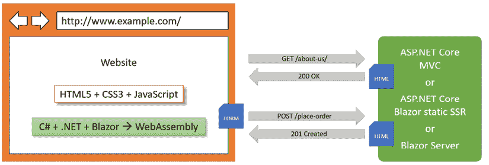
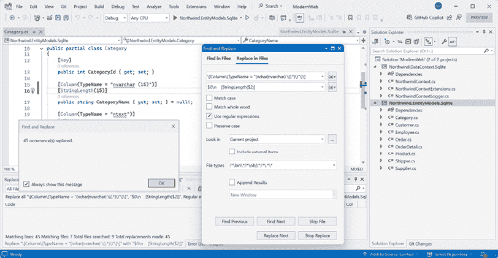
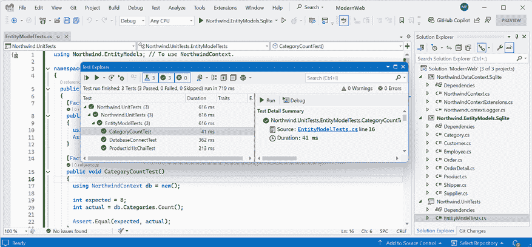
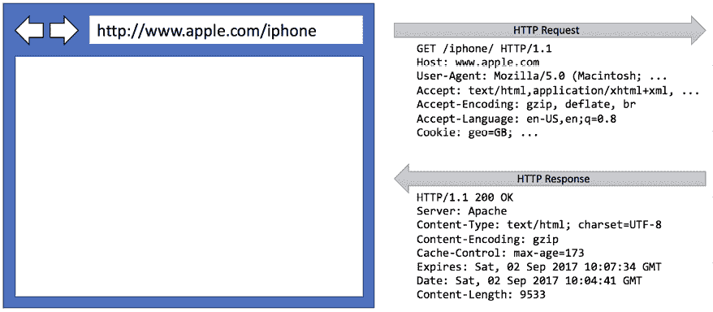
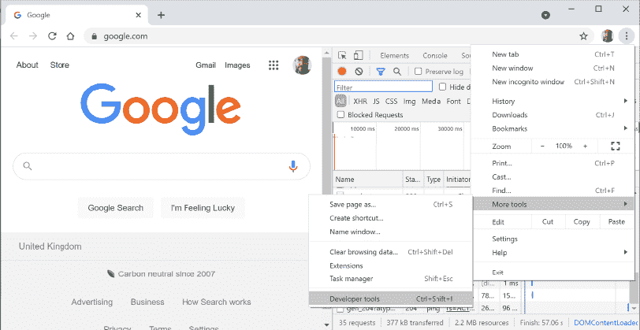
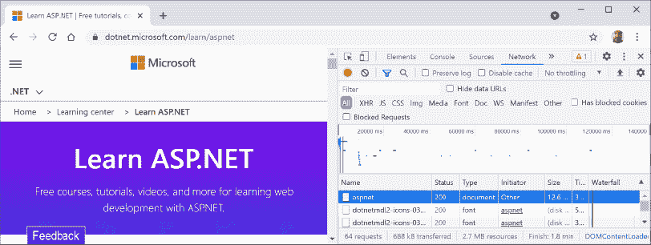
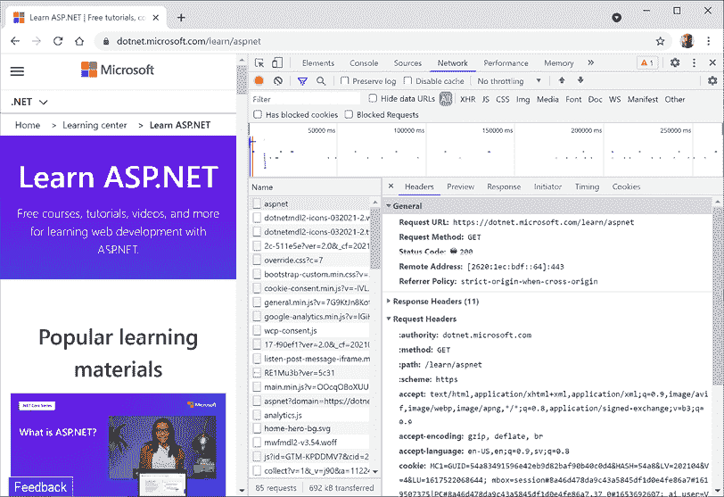

# 第十二章：使用 .NET 引入现代 Web 开发

本书第三部分和最后一部分是关于使用 .NET 进行现代 Web 开发，这意味着 ASP.NET Core、Blazor 和 Minimal APIs。您将学习如何构建跨平台的项目，例如网站和 Web 服务。

微软将用于构建应用程序的平台称为 **app models** 或 **workloads**。

我建议您按顺序阅读本章和后续章节，因为后续章节将引用早期章节中的项目，并且您将积累足够的知识和技能来应对后续章节中更复杂的问题。

在本章中，我们将涵盖以下主题：

+   理解 ASP.NET Core

+   ASP.NET Core 的新功能

+   项目结构

+   为本书其余部分构建实体模型

+   理解 Web 开发

# 理解 ASP.NET Core

由于本书是关于 C# 和 .NET 的，我们将学习用于构建本书剩余章节中我们将遇到的实际应用程序的应用程序模型。

**更多信息**：微软在其 *.NET 架构指南* 文档中提供了广泛的关于实现应用程序模型的指导，您可以通过以下链接阅读：[`dotnet.microsoft.com/en-us/learn/dotnet/architecture-guides`](https://dotnet.microsoft.com/en-us/learn/dotnet/architecture-guides)。

ASP.NET Core 是微软用于构建与数据交互的网站和服务的演变技术历史的一部分：

+   **ActiveX 数据对象 (ADO)** 于 1996 年发布，是微软尝试提供一套单一的 **组件对象模型 (COM**) 组件以处理数据。随着 .NET 的发布，创建了一个名为 **ADO.NET** 的等效产品，它仍然是 .NET 中处理数据更快的方法，其核心类包括 `DbConnection`、`DbCommand` 和 `DbDataReader`。像 EF Core 这样的 **ORM（对象关系映射器）** 在内部使用 ADO.NET。

+   **Active Server Pages** (**ASP**) 于 1996 年发布，是微软首次尝试的平台，用于在服务器端动态执行网站代码。ASP 文件包含 HTML 和代码的混合体，这些代码在服务器上执行，使用 VBScript 语言编写。

+   **ASP.NET Web Forms** 于 2002 年与 .NET Framework 一起发布，旨在使熟悉 Visual Basic 等非 Web 开发者能够通过拖放视觉组件和在 Visual Basic 或 C# 中编写事件驱动代码来快速创建网站。在新的 .NET Framework Web 项目中应避免使用 Web Forms，而应使用 ASP.NET MVC。

+   **Windows Communication Foundation** (**WCF**) 于 2006 年发布，使开发者能够构建 SOAP 和 REST 服务。SOAP 功能强大但复杂，因此除非您需要高级功能，例如分布式事务和复杂消息拓扑，否则应避免使用。

+   **ASP.NET MVC** 于 2009 年发布，旨在在 Web 开发者之间清晰分离 **模型**（临时存储数据）、**视图**（在 UI 中使用各种格式展示数据）和 **控制器**（获取模型并将其传递给视图）的职责。这种分离使得重用和单元测试得到改进。

+   **ASP.NET Web API** 于 2012 年发布，使开发者能够创建比 SOAP 服务更简单、更可扩展的 HTTP 服务（也称为 REST 服务）。

+   **ASP.NET SignalR** 于 2013 年发布，通过抽象底层技术和技术，如 WebSockets 和长轮询，为网站提供实时通信功能。这使得网站功能，如实时聊天，以及更新对时间敏感的数据，如股票价格，在广泛的 Web 浏览器中成为可能，即使它们不支持底层技术，如 WebSockets。

+   **ASP.NET Core** 于 2016 年发布，结合了 .NET Framework 技术的现代实现，如 MVC、Web API 和 SignalR，以及替代技术，如 Razor Pages、gRPC 和 Blazor，所有这些都在现代 .NET 上运行。因此，ASP.NET Core 可以跨平台执行。ASP.NET Core 提供了许多项目模板，以帮助您开始使用其支持的技术。

    **良好实践**：选择 ASP.NET Core 开发网站和 Web 服务，因为它包括现代且跨平台的 Web 相关技术。

## 经典 ASP.NET 与现代 ASP.NET Core 对比

直到现代 .NET，ASP.NET 都是基于 .NET Framework 中的一个大型程序集构建的，名为 `System.Web.dll`，并且它与微软仅适用于 Windows 的 Web 服务器 **Internet Information Services**（**IIS**）紧密耦合。多年来，这个程序集积累了大量功能，其中许多不适合现代跨平台开发。

ASP.NET Core 是 ASP.NET 的重大重构。它移除了对 `System.Web.dll` 程序集和 IIS 的依赖，并由模块化轻量级包组成，就像现代 .NET 的其余部分一样。ASP.NET Core 仍然支持使用 IIS 作为 Web 服务器，但有一个更好的选择。

您可以在 Windows、macOS 和 Linux 等平台上开发和运行 ASP.NET Core 应用程序。微软甚至创建了一个跨平台、高性能的 Web 服务器，名为 **Kestrel**，整个堆栈都是开源的。

ASP.NET Core 2.2 或更高版本的项目默认使用新的进程内托管模型。当在 Microsoft IIS 中托管时，这提供了 400% 的性能提升，但微软仍然推荐使用 Kestrel 以获得更好的性能。

## 使用 ASP.NET Core 构建网站

网站由多个网页组成，这些网页可以从文件系统静态加载，或由服务器端技术（如 ASP.NET Core）动态生成。Web 浏览器使用 **唯一资源定位符**（**URLs**）进行 `GET` 请求，以标识每个页面，并可以使用 `POST`、`PUT` 和 `DELETE` 请求操作服务器上存储的数据。

在许多网站上，网页浏览器被视为一个表示层，几乎所有处理都在服务器端完成。客户端可能会使用一些 JavaScript 来实现表单验证警告和一些展示功能，例如轮播图。

ASP.NET Core 提供了多种技术来构建网站的用户界面：

+   **ASP.NET Core Razor Pages** 是一种简单的方法，可以动态生成简单网站的 HTML。我建议将其视为一种遗留技术，并使用 Blazor 代替。

+   **ASP.NET Core MVC** 是一种流行的 **模型-视图-控制器**（**MVC**）设计模式的实现，适用于开发复杂的网站。

+   **Blazor** 允许您使用 C#和.NET 构建用户界面组件，而不是像 Angular、React 和 Vue 这样的基于 JavaScript 的 UI 框架。Blazor 的早期版本要求开发者选择一个 **托管模型**。**Blazor WebAssembly** 托管模型像基于 JavaScript 的框架一样在浏览器中运行您的代码。**Blazor Server** 托管模型在服务器上运行您的代码，并动态更新网页。.NET 8 引入了一个统一的、全栈的托管模型，允许单个组件在服务器或客户端上执行，甚至可以在运行时动态适应。您将在第十四章“使用 Blazor 构建交互式 Web 组件”中详细了解 Blazor。

那么，您应该选择哪一个？

> “Blazor 现在是我们的推荐方法，用于使用 ASP.NET Core 构建 Web UI，但 MVC 和 Razor Pages 现在并没有过时。MVC 和 Razor Pages 都是成熟、全面支持且广泛使用的框架，我们计划在未来一段时间内继续支持它们。也没有要求或指导将现有的 MVC 或 Razor Pages 应用程序迁移到 Blazor。对于基于 MVC 的现有、成熟的项目，继续使用 MVC 进行开发是一个完全合理且可行的方法。”
> 
> – 丹·罗斯

您可以在以下链接中查看丹的原始评论帖子：[`github.com/dotnet/aspnetcore/issues/51834#issuecomment-1913282747`](https://github.com/dotnet/aspnetcore/issues/51834#issuecomment-1913282747)。

丹·罗斯是 ASP.NET 的首席产品经理，因此他对 ASP.NET Core 的未来比任何人都了解：[`devblogs.microsoft.com/dotnet/author/danroth27/`](https://devblogs.microsoft.com/dotnet/author/danroth27/)。

我同意丹·罗斯的引言。对我来说，在 Web 开发中有两个主要选择：

+   对于使用现代 Web 开发的网站或 Web 服务：选择 Blazor 作为 Web 用户界面，并使用 Minimal APIs 作为 Web 服务。这些技术在本书中及其配套书籍《使用.NET 8 构建应用程序和服务》中有详细说明。

+   对于使用成熟和经过验证的 Web 开发的网站或 Web 服务：选择基于控制器的 ASP.NET Core MVC 用于 Web 用户界面，Web API 用于 Web 服务。为了获得更高的生产力，你可以在这些之上添加第三方平台，例如，一个像 Umbraco 这样的 .NET CMS。这些技术在我的新书 *Real-World Web Development with .NET 9* 中有所介绍。

在这些选择中，ASP.NET Core 的许多部分都是共享的，所以你只需要学习这些共享组件一次，如图 12.1 所示：


图 12.1：基于现代或控制器和共享的 ASP.NET Core 组件

## ASP.NET Core 中使用的文件类型比较

总结这些技术使用的文件类型是有用的，因为它们相似但不同。如果你不理解一些微妙但重要的差异，在尝试实现自己的项目时可能会造成很多困惑。请注意 *表 12.1* 中的差异：

| **技术** | **特殊文件名** | **文件扩展名** | **指令** |
| --- | --- | --- | --- |
| Razor 组件（Blazor） |  | `.razor` |  |
| Razor 组件（Blazor 与页面路由） |  | `.razor` | `@page "<path>"` |
| Razor 组件导入（Blazor） | `_Imports` | `.razor` |  |
| Razor 页面 |  | `.cshtml` | `@page` |
| Razor 视图（MVC） |  | `.cshtml` |  |
| Razor 布局 |  | `.cshtml` |  |
| Razor 视图启动 | `_ViewStart` | `.cshtml` |  |
| Razor 视图导入 | `_ViewImports` | `.cshtml` |  |

表 12.1：ASP.NET Core 中使用的文件类型比较

指令如 `@page` 被添加到文件内容的顶部。

如果一个文件没有特殊文件名，那么它可以被命名为任何东西。例如，你可能会为 Blazor 项目创建一个名为 `Customer.razor` 的 Razor 组件，或者你可能会为 MVC 或 Razor Pages 项目创建一个名为 `_MobileLayout.cshtml` 的 Razor 布局。

共享 Razor 文件的命名约定，例如布局和部分视图，是在文件名前加上下划线 `_`。例如，`_ViewStart.cshtml`、`_Layout.cshtml` 或 `_Product.cshtml`（这可能是一个用于渲染产品的部分视图）。

一个像 `_MyCustomLayout.cshtml` 这样的 Razor 布局文件与一个 Razor 视图相同。使文件成为布局的是将其设置为另一个 Razor 文件的 `Layout` 属性，如下面的代码所示：

```cs
@{
  Layout = "_MyCustomLayout"; // File extension is not needed.
} 
```

**警告！** 请注意在文件顶部使用正确的文件扩展名和指令；否则，你将得到意外的行为。

## 使用内容管理系统构建网站

大多数网站都有大量的内容，如果每次需要更改某些内容时都需要开发者介入，那么这不会很好地扩展。

**内容管理系统**（**CMS**）使开发者能够定义内容结构和模板，以提供一致性和良好的设计，同时使非技术内容所有者轻松管理实际内容。他们可以创建新页面或内容块，并更新现有内容，知道它将为访客提供极小的努力。

所有 Web 平台都提供了多种 CMS，如用于 PHP 的 WordPress 或用于 Python 的 Django。支持现代.NET 的 CMS 包括 Optimizely Content Cloud、Umbraco、Piranha 和 Orchard Core。

使用 CMS 的关键好处是它提供了一个友好的内容管理用户界面。内容所有者登录到网站并自行管理内容。然后使用 ASP.NET Core MVC 控制器和视图，或通过称为**无头 CMS**的 Web 服务端点，将内容渲染并返回给访客，以将内容提供给作为移动或桌面应用程序、店内触摸点或使用 JavaScript 框架或 Blazor 构建的客户端。

本书不涵盖.NET CMS，因此我在 GitHub 存储库中包含了链接，您可以在其中了解更多关于它们的信息：[`github.com/markjprice/cs13net9/blob/main/docs/book-links.md#net-content-management-systems`](https://github.com/markjprice/cs13net9/blob/main/docs/book-links.md#net-content-management-systems)。我还在我新书《Real-World Web Development with .NET 9》中涵盖了 Umbraco CMS。

## 使用 SPA 框架构建 Web 应用程序

Web 应用程序通常使用被称为**单页应用程序**（**SPA**）框架的技术构建，例如 Blazor、Angular、React、Vue 或专有的 JavaScript 库。

当需要更多数据时，它们可以向后端 Web 服务发出请求，并使用常见的序列化格式，如 XML 和 JSON，发布更新后的数据。典型的例子是 Google 的 Web 应用程序，如 Gmail、地图和文档。

在 Web 应用程序中，客户端使用 JavaScript 框架或 Blazor 来实现复杂的用户交互，但大多数重要的处理和数据访问仍然在服务器端进行，因为 Web 浏览器对本地系统资源的访问有限。

JavaScript 是弱类型且不是为复杂项目设计的，因此如今大多数 JavaScript 库都使用 TypeScript，它为 JavaScript 添加了强类型，并设计了许多现代语言特性来处理复杂实现。

.NET SDK 为基于 JavaScript 和 TypeScript 的 SPA 提供了项目模板，但我们在本书中不会花费时间学习如何构建基于 JavaScript 和 TypeScript 的 SPA。尽管这些 SPA 通常与 ASP.NET Core 作为后端一起使用，但本书的重点是 C#而不是其他语言。

总结来说，C#和.NET 可以在服务器端和客户端上使用来构建网站，如图*12.2*所示：



图 12.2：使用 C# 和 .NET 在服务器端和客户端构建网站

## 构建网页和其他服务

尽管我们不会学习基于 JavaScript 和 TypeScript 的 SPA，但我们将学习如何使用 **ASP.NET Core Minimal API** 构建一个网络服务，然后从 Blazor 组件中调用该网络服务。

尽管没有正式的定义，但服务有时会根据其复杂性来描述：

+   **服务**: 一个统一的服务中包含客户端应用所需的所有功能。

+   **微服务**: 多个服务，每个服务专注于更小的功能集。

+   **纳米服务**: 作为服务提供的一个单一功能。与 24/7/365 运行的服务和微服务不同，纳米服务通常在需要时才激活，以减少资源和成本。

在本书第一部分的开头，我们简要回顾了 C# 语言特性及其引入的版本。在本书第二部分的开头，我们简要回顾了 .NET 库特性及其引入的版本。现在，在本书的第三和最后一部分，我们将简要回顾 ASP.NET Core 特性及其引入的版本。

您可以在以下链接的 GitHub 仓库中阅读此信息：[`github.com/markjprice/cs13net9/blob/main/docs/ch12-features.md`](https://github.com/markjprice/cs13net9/blob/main/docs/ch12-features.md)。

为了总结 ASP.NET Core 9 的新特性，让我们以 Dan Roth 的另一段话结束本节：

> “我们正在优化 WebAssembly 上的 .NET 运行时初始化方式，以便您启动更快；我们通过利用源生成进行 JSON 序列化来提高 Blazor 初始化逻辑的效率。我们还优化了处理所有 ASP.NET Core 应用中的静态网页资源的方式，以便您的文件在发布应用时作为预压缩文件。对于 API 开发者，我们提供了内置的 OpenAPI 文档生成支持。”
> 
> – Dan Roth

## 构建桌面和移动应用

由于本书是关于使用 C# 和 .NET 进行现代跨平台开发的，因此它不包括使用 **Windows Forms**、**Windows Presentation Foundation (WPF**) 或 **WinUI 3** 应用构建桌面应用的内容，因为它们仅适用于 Windows。

如果您需要为 Windows 构建应用，以下链接将很有帮助：

+   开始为 Windows 构建应用的官方文档：[`learn.microsoft.com/en-us/windows/apps/get-started/`](https://learn.microsoft.com/en-us/windows/apps/get-started/)

+   WPF 是否已死？：[`avaloniaui.net/Blog/is-wpf-dead`](https://avaloniaui.net/Blog/is-wpf-dead)

+   2024 年 WPF 相比 WinUI 和 MAUI 的流行程度如何？：[`twitter.com/DrAndrewBT/status/1759557538805108860`](https://twitter.com/DrAndrewBT/status/1759557538805108860)

+   在 64 位世界中的 WinForms – 我们未来的策略：[`devblogs.microsoft.com/dotnet/winforms-designer-64-bit-path-forward/`](https://devblogs.microsoft.com/dotnet/winforms-designer-64-bit-path-forward/)

### 移动应用程序平台

有两个主要的移动平台，苹果的 iOS 和谷歌的 Android，每个平台都有自己的编程语言和平台 API。还有两个主要的桌面平台，苹果的 macOS 和微软的 Windows，每个平台都有自己的编程语言和平台 API，如下表所示：

+   **iOS**：Objective C 或 Swift 和 UIKit

+   **Android**：Java 或 Kotlin 和 Android API

+   **macOS**：Objective C 或 Swift 和 AppKit 或 Catalyst

+   **Windows**：C、C++ 或许多其他语言，以及 Win32 API 或 Windows App SDK

由于学习进行原生移动开发有许多组合，如果有一个单一的技术可以针对所有这些移动平台，那将非常有用。

### .NET MAUI

可以为 **.NET Multi-platform App User Interfaces (MAUI)** 平台一次性构建跨平台移动和桌面应用程序，然后它们可以在许多移动和桌面平台上运行。

.NET MAUI 通过共享用户界面组件以及业务逻辑，使开发这些应用程序变得容易。它们可以针对与控制台应用程序、网站和 Web 服务相同的 .NET API。这些应用程序将在移动设备上的 Mono 运行时和桌面设备上的 CoreCLR 运行时上执行。与正常的 .NET CoreCLR 运行时相比，Mono 运行时在移动设备上进行了更好的优化。Blazor WebAssembly 也使用 Mono 运行时，因为它像移动应用程序一样，资源受限。

这些应用程序可以独立存在，但它们通常调用服务以提供跨越所有计算设备（从服务器和笔记本电脑到手机和游戏系统）的体验。

我在我的配套书籍《使用 .NET 8 开发应用程序和服务》中介绍了 .NET MAUI，Packt 还有许多其他深入探讨 .NET MAUI 的书籍，所以如果你对学习 MAUI 严肃认真，请查看以下 Packt 书籍：

+   *.NET MAUI 跨平台应用程序开发*：[`www.packtpub.com/en-us/product/net-maui-cross-platform-application-development-9781835080597`](https://www.packtpub.com/en-us/product/net-maui-cross-platform-application-development-9781835080597)

+   *《.NET MAUI 中的 MVVM 模式》*：[`www.packtpub.com/en-us/product/the-mvvm-pattern-in-net-maui-9781805125006`](https://www.packtpub.com/en-us/product/the-mvvm-pattern-in-net-maui-9781805125006)

+   *.NET MAUI 项目*：[`www.packtpub.com/en-us/product/net-maui-projects-9781837634910`](https://www.packtpub.com/en-us/product/net-maui-projects-9781837634910)

在微软创建 .NET MAUI 之前，第三方创建了开源项目，以使 .NET 开发者能够使用 XAML 构建跨平台应用程序，这些项目被称为 **Uno** 和 **Avalonia**。

**警告！** 我自己没有尝试过任何真实世界的项目使用 Uno 或 Avalonia，因此我无法为它们中的任何一个提供基于证据的建议。我在这本书中提到它们只是为了让你了解它们。

### Uno 平台

如其在网站[`platform.uno/`](https://platform.uno/)上所述，Uno 是一个*“快速构建单一代码库原生移动、Web、桌面和嵌入式应用程序的开源平台”*。

开发者可以在原生移动、Web 和桌面应用程序之间重用 99%的业务逻辑和 UI 层。

Uno 平台使用 Xamarin 原生平台，但不使用 Xamarin.Forms。对于 WebAssembly，Uno 使用 Mono-WASM 运行时。对于 Linux，Uno 使用 Skia 在画布上绘制用户界面。

### Avalonia

如其在网站[`avaloniaui.net/`](https://avaloniaui.net/)上所述，Avalonia 是一个*“从单个.NET 代码库构建美丽、跨平台应用程序的开源框架”*。

你可以将 Avalonia 视为 WPF 的精神继承者。熟悉 WPF 的 WPF、Silverlight 和 UWP 开发者可以继续从他们多年的现有知识和技能中受益。

它被 JetBrains 用来现代化他们的基于 WPF 的工具，并使它们跨平台。

Avalonia 的 Visual Studio 扩展和与 Rider 的深度集成使开发更加容易和高效。

# 构建项目

你应该如何构建你的项目？到目前为止，我们主要构建了小型个体控制台应用程序来展示语言或库功能，偶尔会有类库和单元测试项目来支持它们。在这本书的其余部分，我们将使用不同的技术构建多个项目，这些技术协同工作以提供单一解决方案。

对于大型、复杂的项目，导航所有代码可能很困难。因此，构建项目的首要原因是为了更容易地找到组件。有一个反映应用程序或解决方案的解决方案整体名称是好的。

我们将为一家名为**Northwind**的虚构公司构建多个项目。我们将解决方案命名为`ModernWeb`，并将`Northwind`用作所有项目名称的前缀。

有许多方法可以构建和命名项目和解决方案，例如，使用文件夹层次结构和命名约定。如果你在一个团队中工作，确保你知道你的团队是如何做的。

## 在解决方案中构建项目结构

在解决方案中为你的项目有一个命名约定是好的，这样任何开发者都可以立即知道每个项目做什么。一个常见的做法是使用项目类型，例如，类库、控制台应用程序、网站等。

由于你可能需要同时运行多个网络项目，并且它们将托管在本地网络服务器上，我们需要通过为它们的端点分配不同的端口号来区分每个项目，无论是 HTTP 还是 HTTPS。

常用的本地端口号码为 HTTP 的 `5000` 和 HTTPS 的 `5001`。我们将使用 `5<chapter>0` 作为 HTTP 的编号约定，`5<chapter>1` 作为 HTTPS 的编号约定。例如，对于我们在 *第十三章* 中创建的网站项目，我们将分配 `5130` 给 HTTP，`5131` 给 HTTPS。

因此，我们将使用以下项目名称和端口号，如表 *12.2* 所示：

| **名称** | **端口** | **描述** |
| --- | --- | --- |
| `Northwind.Common` | N/A | 用于跨多个项目的常见类型（如接口、枚举、类、记录和结构体）的类库项目。 |
| `Northwind.EntityModels` | N/A | 用于常见 EF Core 实体模型的类库项目。实体模型通常在服务器端和客户端都使用，因此最好将特定数据库提供程序的依赖项分开。 |
| `Northwind.DataContext` | N/A | 用于 EF Core 数据库上下文的类库项目，具有对特定数据库提供程序的依赖。 |
| `Northwind.UnitTests` | N/A | 用于解决方案的 xUnit 测试项目。 |
| `Northwind.Web` | `http` `5130` 和 `https` `5131` | 一个用于简单网站（混合使用静态 HTML 文件和 Blazor 静态 **服务器端渲染**（**SSR**））的 ASP.NET Core 项目。 |
| `Northwind.Blazor` | `http` `5140` 和 `https` `5141` | 一个 ASP.NET Core Blazor 项目。 |
| `Northwind.WebApi` | `http` `5150` 和 `https` `5151` | 一个用于 Web API（即 HTTP 服务）的 ASP.NET Core 项目。它是与网站集成的良好选择，因为它可以使用任何 JavaScript 库或 Blazor 与服务交互。 |

表 12.2：各种项目类型的示例项目名称

## 中央包管理

在本书的所有先前项目中，如果我们需要引用 NuGet 包，我们直接在项目文件中包含对包名称和版本的引用。

**中央包管理（CPM**）是一个简化解决方案内多个项目之间 NuGet 包版本管理的功能。这对于包含许多项目的大型解决方案尤其有用，在这些解决方案中，单独管理包版本可能会变得繁琐且容易出错。

CPM 的关键功能和优势包括：

+   **集中控制**：CPM 允许您在单个文件中定义包版本，通常是 `Directory.Packages.props` 文件，该文件位于您解决方案的根目录中。此文件集中了您解决方案中所有项目使用的所有 NuGet 包的版本信息。

+   **一致性**：它确保多个项目之间包版本的一致性。通过拥有包版本的单一真实来源，CPM 消除了不同项目指定相同包的不同版本时可能出现的差异。

+   **简化更新**：在大型解决方案中更新包版本变得简单直接。您只需在中央文件中更新版本，所有引用该包的项目将自动使用更新后的版本。这显著降低了维护开销。

+   **减少冗余**：它消除了在单个项目文件（`.csproj`）中指定包版本的需求。这使得项目文件更干净，更容易管理，因为它们不再包含重复的版本信息。

让我们为本书其余章节中将要使用的一个解决方案设置 CPM：

1.  在 `cs13net9` 文件夹中，创建一个名为 `ModernWeb` 的新文件夹。

1.  在 `ModernWeb` 文件夹中，创建一个名为 `Directory.Packages.props` 的新文件。

1.  在 `Directory.Packages.props` 中，修改其内容，如下面的标记所示：

    ```cs
    <Project>
      <PropertyGroup>
        <ManagePackageVersionsCentrally>true</Man
    agePackageVersionsCentrally>
      </PropertyGroup>
      <ItemGroup Label="For EF Core 9." >
        <PackageVersion
          Include="Microsoft.EntityFrameworkCore.Sqlite"
          Version="9.0.0" />
        <PackageVersion
          Include="Microsoft.EntityFrameworkCore.Design"
          Version="9.0.0" />
      </ItemGroup>
      <ItemGroup Label="For unit testing.">
        <PackageVersion Include="coverlet.collector"
          Version="6.0.2" />
        <PackageVersion Include="Microsoft.NET.Test.Sdk"
          Version="17.12.0" />
        <PackageVersion Include="xunit"
          Version="2.9.0" />
        <PackageVersion
          Include="xunit.runner.visualstudio"
          Version="3.0.0" />
      </ItemGroup>
      <ItemGroup Label="For Blazor.">
        <PackageVersion Include=
          "Microsoft.AspNetCore.Components.WebAssembly.Server"
          Version="9.0.0" />
        <PackageVersion Include=
          "Microsoft.AspNetCore.Components.WebAssembly"
          Version="9.0.0" />
        <PackageVersion Include=
    "Microsoft.AspNetCore.Components.WebAssembly.DevServer"
          Version="9.0.0" />
      </ItemGroup>
      <ItemGroup Label="For web services.">
        <PackageVersion
          Include="Microsoft.AspNetCore.OpenApi"
          Version="9.0.0" />
        <PackageVersion
          Include="Microsoft.Extensions.Caching.Hybrid"
          Version="9.0.0" />
      </ItemGroup>
    </Project> 
    ```

**警告！** `<ManagePackageVersionsCentrally>` 元素及其 `true` 值必须全部位于一行上。此外，您不能使用在单个项目中可以使用的浮点通配符版本号，如 `10.0-*`，以在预览期间自动获取 EF Core 10 的最新补丁版本。

对于我们添加到包含此文件的文件夹下的任何项目，我们可以引用这些包，而无需明确指定版本，如下面的标记所示：

```cs
<ItemGroup>
  <PackageReference Include="Microsoft.EntityFrameworkCore.Sqlite" />
  <PackageReference Include="Microsoft.EntityFrameworkCore.Design" />
</ItemGroup> 
```

您应该定期审查和更新 `Directory.Packages.props` 文件中的包版本，以确保您使用的是最新的稳定版本，其中包含重要的错误修复和性能改进。

我建议你在日历中为每个月的第二个星期三设置一个事件。这将在每个月第二个星期二之后发生，即补丁星期二，届时微软会发布 .NET 和相关包的错误修复和补丁。

例如，在 2024 年中旬，可能会有新版本，因此你可以访问所有包的 NuGet 页面，并在必要时更新版本，如下面的标记所示：

```cs
<ItemGroup>
  <PackageVersion
    Include="Microsoft.EntityFrameworkCore.Sqlite"
    Version="9.0.1" />
  <PackageVersion
    Include="Microsoft.EntityFrameworkCore.Design"
    Version="9.0.1" />
</ItemGroup> 
```

在更新包版本之前，检查包的发布说明中是否有任何破坏性更改。更新后彻底测试您的解决方案以确保兼容性。

教育您的团队，并记录 `Directory.Packages.props` 文件的目的和用法，以确保每个人都了解如何集中管理包版本。

您可以通过在 `<PackageReference />` 元素上使用 `VersionOverride` 属性来覆盖单个包版本，如下面的标记所示：

```cs
<ItemGroup>
  <PackageReference Include="Microsoft.EntityFrameworkCore.Sqlite" />
  <PackageReference Include="Microsoft.EntityFrameworkCore.Design"
    VersionOverride="9.0.0" />
</ItemGroup> 
```

这在引入回归错误的新版本中可能很有用。

**更多信息**：您可以在以下链接中了解更多关于 CPM 的信息：[`learn.microsoft.com/en-us/nuget/consume-packages/central-package-management`](https://learn.microsoft.com/en-us/nuget/consume-packages/central-package-management)。

# 为本书其余部分构建实体模型

网站和 Web 服务通常需要与关系数据库或其他数据存储中的数据进行交互。在本节中，我们将为存储在 SQL Server 或 SQLite 中的 Northwind 数据库定义一个实体数据模型。它将用于我们在后续章节中创建的大多数应用程序。

## 创建 Northwind 数据库

创建 Northwind 数据库用于 SQLite 和 SQL Server 的脚本文件不同。SQL Server 的脚本创建 13 个表以及相关的视图和存储过程。SQLite 的脚本是一个简化版本，仅创建 10 个表，因为 SQLite 不支持那么多功能。本书中的主要项目只需要这 10 个表，因此你可以使用任一数据库完成本书中的所有任务。

SQL 脚本可以在以下链接找到：[`github.com/markjprice/cs13net9/tree/main/scripts/sql-scripts`](https://github.com/markjprice/cs13net9/tree/main/scripts/sql-scripts)。

如下列表所述，有多种 SQL 脚本可供选择：

+   `Northwind4Sqlite.sql` 脚本：在本地 Windows、macOS 或 Linux 计算机上使用 SQLite。这个脚本可能也可以用于其他 SQL 系统，如 PostgreSQL 或 MySQL，但尚未测试过这些系统的使用！

+   `Northwind4SqlServer.sql` 脚本：在本地 Windows 计算机上使用 SQL Server。该脚本检查 Northwind 数据库是否已存在，如果数据库已存在，则在重新创建之前将其删除（即删除）。

+   `Northwind4AzureSqlDatabaseCloud.sql` 脚本：在 Azure 云中创建的 Azure SQL 数据库资源上使用 SQL Server。只要这些资源存在，就会产生费用！该脚本不会删除或创建 Northwind 数据库，因为您应该使用 Azure 门户用户界面手动创建 Northwind 数据库。

+   `Northwind4AzureSqlEdgeDocker.sql` 脚本：在 Docker 中的本地计算机上使用 SQL Server。该脚本创建 Northwind 数据库。如果数据库已存在，则不会删除它，因为 Docker 容器应该始终为空，因为每次都会启动一个新的容器。

在 *第十章*，*使用 Entity Framework Core 处理数据* 中可以找到安装 SQLite 的说明。在该章中，你还可以找到安装 `dotnet-ef` 工具的说明，你将使用它从现有数据库生成实体模型。

在本地 Windows 计算机上安装 SQL Server Developer Edition（免费版）的说明可以在本书的 GitHub 仓库中找到，链接如下：[`github.com/markjprice/cs13net9/blob/main/docs/sql-server/README.md`](https://github.com/markjprice/cs13net9/blob/main/docs/sql-server/README.md)。

在 Docker for Windows、macOS 或 Linux 上设置 Azure SQL Edge 的说明可以在本书的 GitHub 仓库中找到，链接如下：[`github.com/markjprice/cs13net9/blob/main/docs/sql-server/sql-edge.md`](https://github.com/markjprice/cs13net9/blob/main/docs/sql-server/sql-edge.md)。

## 使用 SQLite 创建实体模型类库

你现在将在类库中定义实体数据模型，以便它们可以在其他类型的项目中重用，包括客户端应用程序模型。

**良好实践**：您应该为您的实体数据模型从数据上下文类库中创建一个单独的类库项目。这允许在后台 Web 服务器和前端桌面、移动和 Blazor 客户端之间更容易地共享实体模型，并且只有后台需要引用数据上下文类库。

我们将使用 EF Core 命令行工具自动生成一些实体模型：

1.  使用您首选的代码编辑器创建一个新的项目和解决方案，如下面的列表所示：

    +   项目模板：**类库** / `classlib`

    +   项目文件和文件夹：`Northwind.EntityModels.Sqlite`

    +   解决方案文件和文件夹：`ModernWeb`

1.  在`Northwind.EntityModels.Sqlite`项目中，添加对 SQLite 数据库提供程序和 EF Core 设计时支持的包引用，如下面的标记所示：

    ```cs
    <ItemGroup>
      <PackageReference
        Include="Microsoft.EntityFrameworkCore.Sqlite" />
      <PackageReference
        Include="Microsoft.EntityFrameworkCore.Design">
        <PrivateAssets>all</PrivateAssets>
        <IncludeAssets>runtime; build; native; contentfiles; analyzers; buildtransitive</IncludeAssets>
      </PackageReference>
    </ItemGroup> 
    ```

1.  删除`Class1.cs`文件。

1.  构建项目`Northwind.EntityModels.Sqlite`以恢复包。

1.  将`Northwind4Sqlite.sql`文件复制到`ModernWeb`解决方案文件夹中（不是项目文件夹！）。

1.  在`ModernWeb`文件夹中的命令提示符或终端中，输入一个命令来创建 SQLite 的`Northwind.db`文件，如下面的命令所示：

    ```cs
    sqlite3 Northwind.db -init Northwind4SQLite.sql 
    ```

请耐心等待，因为这个命令可能需要一段时间来创建数据库结构。

1.  要退出 SQLite 命令模式，在 Windows 上请按两次*Ctrl* + *C*，在 macOS 或 Linux 上请按*Cmd* + *D*。

1.  在`ModernWeb`文件夹中的命令提示符或终端中，输入一个命令来列出当前目录中的文件，如下面的命令所示：

    ```cs
    dir 
    ```

1.  您应该看到已创建一个名为`Northwind.db`的新文件，如下面的输出所示：

    ```cs
     Directory: C:\cs13net9\ModernWeb
    Length Name
    ------ ----
           Northwind.EntityModels.Sqlite
       382 Directory.Packages.props
      1193 ModernWeb.sln
    557056 Northwind.db
    480790 Northwind4SQLite.sql 
    ```

1.  切换到项目文件夹：

    ```cs
    cd Northwind.EntityModels.Sqlite 
    ```

1.  在`Northwind.EntityModels.Sqlite`项目文件夹中（包含`.csproj`项目文件的文件夹），为所有表生成实体类模型，如下面的命令所示：

    ```cs
    dotnet ef dbcontext scaffold "Data Source=../Northwind.db" Microsoft.EntityFrameworkCore.Sqlite --namespace Northwind.EntityModels --data-annotations 
    ```

注意以下事项：

+   执行的命令：`dbcontext scaffold`

+   连接字符串指的是解决方案文件夹中的数据库文件，位于当前项目文件夹的上一个文件夹中："数据源=../Northwind.db"

+   数据库提供程序：`Microsoft.EntityFrameworkCore.Sqlite`

+   命名空间：`--namespace Northwind.EntityModels`

+   要使用数据注释以及 Fluent API：`--data-annotations`

    **警告！** `dotnet-ef`命令必须在一行中输入，并且在一个包含项目的文件夹中；否则，您将看到以下错误："未找到项目。更改当前工作目录或使用--project 选项。"请记住，所有命令行都可以在以下链接中找到并复制：[`github.com/markjprice/cs13net9/blob/main/docs/command-lines.md`](https://github.com/markjprice/cs13net9/blob/main/docs/command-lines.md)。

    如果您使用 SQLite，您将看到有关实体类模型中的表列和属性之间不兼容类型映射的警告。例如，`Employees` 表上的列 'BirthDate' 应映射到类型为 'DateOnly' 的属性，但其值处于不兼容的格式。使用不同的类型`。这是由于 SQLite 使用动态类型。我们将在下一节中修复这些问题。

## 使用 SQLite 创建数据库上下文类库

您现在将定义一个数据库上下文类库：

1.  根据以下列表添加一个新的项目到解决方案中：

    +   项目模板：**类库** / `classlib`

    +   项目文件和文件夹：`Northwind.DataContext.Sqlite`

    +   解决方案文件和文件夹：`ModernWeb`

1.  在 `Northwind.DataContext.Sqlite` 项目中，静态和全局导入 `Console` 类，添加对 SQLite EF Core 数据提供程序的包引用，并添加对 `Northwind.EntityModels.Sqlite` 项目的项目引用，如下所示：

    ```cs
    <ItemGroup Label="To simplify use of WriteLine.">
      <Using Include="System.Console" Static="true" />
    </ItemGroup>
    <ItemGroup Label="Versions are set at solution-level.">
      <PackageReference
        Include="Microsoft.EntityFrameworkCore.Sqlite" />
    </ItemGroup>
    <ItemGroup>
      <ProjectReference Include=
        "..\Northwind.EntityModels.Sqlite
    \Northwind.EntityModels.Sqlite.csproj" />
    </ItemGroup> 
    ```

**警告！**项目引用的路径在项目文件中不应有换行符。

1.  在 `Northwind.DataContext.Sqlite` 项目中，删除 `Class1.cs` 文件。

1.  构建北 `wind.DataContext.Sqlite` 项目以还原包。

1.  在 `Northwind.DataContext.Sqlite` 项目中，添加一个名为 `NorthwindContextLogger.cs` 的类。

1.  修改其内容以定义一个名为 `WriteLine` 的静态方法，该方法将字符串追加到桌面上的 `book-logs` 文件夹中名为 `northwindlog-<date_time>.txt` 的文本文件的末尾，如下所示：

    ```cs
    using static System.Environment;
    namespace Northwind.EntityModels;
    public class NorthwindContextLogger
    {
      public static void WriteLine(string message)
      {
        string folder = Path.Combine(GetFolderPath(
          SpecialFolder.DesktopDirectory), "book-logs");
        if (!Directory.Exists(folder))
          Directory.CreateDirectory(folder);
        string dateTimeStamp = DateTime.Now.ToString(
          "yyyyMMdd_HHmmss");
        string path = Path.Combine(folder,
          $"northwindlog-{dateTimeStamp}.txt");
        StreamWriter textFile = File.AppendText(path);
        textFile.WriteLine(message);
        textFile.Close();
      }
    } 
    ```

1.  将 `NorthwindContext.cs` 文件从 `Northwind.EntityModels.Sqlite` 项目/文件夹移动到 `Northwind.DataContext.Sqlite` 项目/文件夹。

在 Visual Studio **解决方案资源管理器**中，如果您在项目之间拖放文件，它将被复制。如果您在拖放时按住 *Shift* 键，它将被移动。在 VS Code **资源管理器**中，如果您在项目之间拖放文件，它将被移动。如果您在拖放时按住 *Ctrl* 键，它将被复制。

1.  在 `NorthwindContext.cs` 文件中，注意第二个构造函数可以接受 `options` 作为参数，这允许我们在任何项目中覆盖默认的数据库连接字符串，例如需要与 Northwind 数据库一起工作的网站，如下所示：

    ```cs
    public NorthwindContext(DbContextOptions<NorthwindContext> options)
      : base(options)
    {
    } 
    ```

1.  在 `NorthwindContext.cs` 文件中的 `OnConfiguring` 方法中，移除关于连接字符串的编译器 #warning，然后添加语句以检查当前目录的末尾，以便在 Visual Studio 中运行时与使用 VS Code 的命令提示符相比，如下所示：

    ```cs
    protected override void OnConfiguring(
      DbContextOptionsBuilder optionsBuilder)
    {
      if (!optionsBuilder.IsConfigured)
      {
        string database = "Northwind.db";
        string dir = Environment.CurrentDirectory;
        string path = string.Empty;
        if (dir.EndsWith("net9.0"))
        {
          // In the <project>\bin\<Debug|Release>\net9.0 directory.
          path = Path.Combine("..", "..", "..", "..", database);
        }
        else
        {
          // In the <project> directory.
          path = Path.Combine("..", database);
        }
        path = Path.GetFullPath(path); // Convert to absolute path.
        try
        {
          NorthwindContextLogger.WriteLine($"Database path: {path}");
        }
        catch (Exception ex)
        {
          WriteLine(ex.Message);
        }
        if (!File.Exists(path))
        {
          throw new FileNotFoundException(
            message: $"{path} not found.", fileName: path);
        }
        optionsBuilder.UseSqlite($"Data Source={path}");
        optionsBuilder.LogTo(NorthwindContextLogger.WriteLine,
          new[] { Microsoft.EntityFrameworkCore
            .Diagnostics.RelationalEventId.CommandExecuting });
      }
    } 
    ```

抛出异常是很重要的，因为如果数据库文件缺失，那么 SQLite 数据库提供者将创建一个空数据库文件，因此如果你测试连接到它，它将正常工作。但是如果你查询它，你将看到与缺失表相关的异常，因为它没有任何表！在将相对路径转换为绝对路径后，你可以在调试时设置断点，以便更容易地看到数据库文件预期所在的位置，或者添加一条记录该路径的语句。

## 自定义模型和定义扩展方法

现在，我们将简化 `OnModelCreating` 方法。我将简要解释各个步骤，然后展示完整的最终方法。你可以尝试执行各个步骤，或者直接使用最终方法代码：

1.  在 `OnModelCreating` 方法中，删除所有调用 `ValueGeneratedNever` 方法的 Fluent API 语句，如下代码所示。这将配置主键属性，如 `CategoryId`，以从不自动生成值：

    ```cs
    modelBuilder.Entity<Category>(entity =>
    {
      entity.Property(e => e. CategoryId).ValueGeneratedNever();
    }); 
    ```

如果我们不删除上述类似配置的语句，那么当我们添加新的供应商时，`CategoryId` 的值将始终是 `0`，我们只能添加一个具有该值的供应商；所有其他尝试都将抛出异常。你可以将你的 `NorthwindContext.cs` 与以下链接中的 GitHub 仓库中的版本进行比较：[`github.com/markjprice/cs13net9/blob/main/code/ModernWeb/Northwind.DataContext.Sqlite/NorthwindContext.cs`](https://github.com/markjprice/cs13net9/blob/main/code/ModernWeb/Northwind.DataContext.Sqlite/NorthwindContext.cs)。

1.  在 `OnModelCreating` 方法中，对于 `Product` 实体，告诉 SQLite 将 `UnitPrice` 从 `decimal` 转换为 `double`，如下代码所示：

    ```cs
    entity.Property(product => product.UnitPrice)
      .HasConversion<double>(); 
    ```

1.  在 `OnModelCreating` 方法中，对于 `Order` 实体，将十进制值 `0.0M` 传递给 `HasDefaultValue` 方法，如下代码所示：

    ```cs
    modelBuilder.Entity<Order>(entity =>
    {
      entity.Property(e => e.Freight).HasDefaultValue(0.0M);
    }); 
    ```

1.  在 `OnModelCreating` 方法中，对于 `Product` 实体，将十进制值 `0.0M` 传递给 `HasDefaultValue` 方法，如下代码所示：

    ```cs
    modelBuilder.Entity<Product>(entity =>
    {
      ...
      entity.Property(e => e.UnitPrice).HasDefaultValue(0.0M); 
    ```

1.  如下代码所示，`OnModelCreating` 方法现在应该更简单：

    ```cs
    protected override void OnModelCreating(
      ModelBuilder modelBuilder)
    {
      modelBuilder.Entity<Order>(entity =>
      {
        entity.Property(e => e.Freight).HasDefaultValue(0.0M);
      });
      modelBuilder.Entity<OrderDetail>(entity =>
      {
        entity.Property(e =>
          e.Quantity).HasDefaultValue((short)1);
        entity.HasOne(d => d.Order)
          .WithMany(p => p.OrderDetails)
          .OnDelete(DeleteBehavior.ClientSetNull);
        entity.HasOne(d => d.Product)
          .WithMany(p => p.OrderDetails)
          .OnDelete(DeleteBehavior.ClientSetNull);
      });
      modelBuilder.Entity<Product>(entity =>
      {
        entity.Property(e => e.Discontinued)
          .HasDefaultValue((short)0);
        entity.Property(e => e.ReorderLevel)
          .HasDefaultValue((short)0);
        entity.Property(e => e.UnitPrice)
          .HasDefaultValue(0.0M);
        entity.Property(e => e.UnitsInStock)
          .HasDefaultValue((short)0);
        entity.Property(e => e.UnitsOnOrder)
          .HasDefaultValue((short)0);
        entity.Property(product => product.UnitPrice)
          .HasConversion<double>();
      });
      OnModelCreatingPartial(modelBuilder);
    } 
    ```

1.  在 `Northwind.DataContext.Sqlite` 项目中，添加一个名为 `NorthwindContextExtensions.cs` 的类。修改其内容以定义一个扩展方法，将 Northwind 数据库上下文添加到依赖服务集合中，如下代码所示：

    ```cs
    using Microsoft.EntityFrameworkCore; // To use UseSqlite.
    using Microsoft.Extensions.DependencyInjection; // To use IServiceCollection.
    namespace Northwind.EntityModels;
    public static class NorthwindContextExtensions
    {
      /// <summary>
      /// Adds NorthwindContext to the specified IServiceCollection. Uses the Sqlite database provider.
      /// </summary>
      /// <param name="services">The service collection.</param>
      /// <param name="relativePath">Default is ".."</param>
      /// <param name="databaseName">Default is "Northwind.db"</param>
      /// <returns>An IServiceCollection that can be used to add more services.</returns>
      public static IServiceCollection AddNorthwindContext(
        this IServiceCollection services, // The type to extend.
        string relativePath = "..",
        string databaseName = "Northwind.db")
      {
        string path = Path.Combine(relativePath, databaseName);
        path = Path.GetFullPath(path);
        NorthwindContextLogger.WriteLine($"Database path: {path}");
        if (!File.Exists(path))
        {
          throw new FileNotFoundException(
            message: $"{path} not found.", fileName: path);
        }
        services.AddDbContext<NorthwindContext>(options =>
        {
          // Data Source is the modern equivalent of Filename.
          options.UseSqlite($"Data Source={path}");
          options.LogTo(NorthwindContextLogger.WriteLine,
            new[] { Microsoft.EntityFrameworkCore
              .Diagnostics.RelationalEventId.CommandExecuting });
        },
        // Register with a transient lifetime to avoid concurrency
        // issues in Blazor server-side projects.
        contextLifetime: ServiceLifetime.Transient,
        optionsLifetime: ServiceLifetime.Transient);
        return services;
      }
    } 
    ```

1.  构建这两个类库，并修复任何编译器错误。

## `HasDefaultValue` 和 `HasDefaultValueSql`

这两个方法的区别是什么？

当你需要一个作为列默认值的常量、静态值，并且该值不依赖于任何条件或不需要在插入时动态计算时，你应该使用 `HasDefaultValue()`。此常量值在模型级别设置，并由 EF Core 在没有提供其他值时用于向数据库插入。

对于前面示例的等效操作，你会使用`entity.Property(e => e.Freight).HasDefaultValue(0M);`，因为`0M`使用了十进制后缀`M`。将其视为在客户端设置默认值。

当默认值应该在插入时由数据库计算，特别是如果它涉及到数据库应该评估的 SQL 函数或动态数据时，你应该使用`HasDefaultValueSql()`。默认值是一个字符串`"0"`，因为它将被连接到 SQL 语句中，如下面的代码所示：

```cs
`CREATE TABLE "Orders" ( ... "Freight" "money" NULL CONSTRAINT "DF_Orders_Freight" DEFAULT (0), ... );` 
```

将其视为配置数据库以在服务器端设置默认值。

EF Core 8 及更早版本的 SQLite 数据库反向工程使用`HasDefaultValueSql`。EF Core 9 数据库反向工程使用`HasDefaultValue`。

## 注册依赖服务的作用域

默认情况下，使用`Scope`生命周期注册`DbContext`类，这意味着多个线程可以共享同一个实例。但是`DbContext`不支持多线程。如果有多个线程同时尝试使用同一个`NorthwindContext`类实例，那么你将看到以下运行时异常被抛出：`在完成之前的操作之前，在此上下文中启动了第二个操作。这通常是由不同的线程使用同一个 DbContext 实例引起的，然而实例成员不一定保证是线程安全的`。

这种情况发生在 Blazor 项目中，当组件被设置为在服务器端运行时，因为每当客户端发生交互时，都会向服务器发起一个 SignalR 调用，在服务器端，多个客户端之间共享单个数据库上下文实例。如果组件被设置为在客户端运行，则不会出现此问题。

## 使用 SQL Server 创建实体模型的类库

如果你想使用 SQL Server 而不是 SQLite，那么以下链接中有相应的说明：

[`github.com/markjprice/cs13net9/blob/main/docs/sql-server/README.md#chapter-12---introducing-web-development-using-aspnet-core`](https://github.com/markjprice/cs13net9/blob/main/docs/sql-server/README.md#chapter-12---introducing-web-development-using-aspnet-core)

## 改进类到表的映射

`dotnet-ef`命令行工具为 SQL Server 和 SQLite 生成不同的代码，因为它们支持不同的功能级别，并且 SQLite 使用动态类型。例如，在 EF Core 7 中，SQLite 中的所有整数列都被映射为可空的`long`属性，以实现最大的灵活性。

使用 EF Core 8 及更高版本时，会检查实际存储的值，如果它们都可以存储在`int`中，那么 EF Core 8 及更高版本会将映射属性声明为`int`。如果存储的值都可以存储在`short`中，那么 EF Core 8 及更高版本会将映射属性声明为`short`。

在这一版中，我们需要做更少的工作来改进映射。太好了！

作为另一个例子，SQL Server 的文本列可以限制字符数。SQLite 不支持这一点。因此，`dotnet-ef`将为 SQL Server 生成验证属性以确保`string`属性限制在指定的字符数内，但不适用于 SQLite，如下面的代码所示：

```cs
// SQLite database provider-generated code.
[Column(TypeName = "nvarchar (15)")]
public string CategoryName { get; set; } = null!;
// SQL Server database provider-generated code.
[StringLength(15)]
public string CategoryName { get; set; } = null!; 
```

我们将对 SQLite 的实体模型映射和验证规则进行一些小的修改。SQL Server 的类似修改可在在线说明中找到。

请记住，所有代码都可在本书的 GitHub 仓库中找到。虽然您通过亲自输入代码会学到更多，但您不必这样做。访问以下链接并按*.*以在浏览器中获得实时代码编辑器：[`github.com/markjprice/cs13net9`](https://github.com/markjprice/cs13net9)。

首先，我们将添加一个正则表达式来验证`CustomerId`值正好是五个大写字母。其次，我们将添加字符串长度要求来验证实体模型中的多个属性知道其文本值允许的最大长度：

1.  激活您的代码编辑器的**查找和替换**功能：

    +   在 Visual Studio 中，导航到**编辑** | **查找和替换** | **快速替换**，然后切换**使用正则表达式**。

1.  在**查找**框中输入正则表达式，如*图 12.3*和以下表达式所示：

    ```cs
    \[Column\(TypeName = "(nchar|nvarchar) \((.*)\)"\)\] 
    ```

1.  在**替换**框中，输入替换正则表达式，如下面的表达式所示：

    ```cs
    $0\n    [StringLength($2)] 
    ```

在换行符`\n`之后，我包含了四个空格字符，以便在我的系统中正确缩进，每级缩进使用两个空格字符。您可以插入任意多个。

1.  将**查找和替换**设置为在**当前项目**中搜索文件。

1.  执行**查找和替换**以替换所有文件，如*图 12.3*所示：



图 12.3：在 Visual Studio 中使用正则表达式查找和替换所有匹配项

1.  将任何日期/时间列，例如在`Employee.cs`中，更改为使用可空的`DateTime`而不是字符串，如下面的代码所示：

    ```cs
    // Before:
    [Column(TypeName = "datetime")]
    public string? BirthDate { get; set; }
    // After:
    [Column(TypeName = "datetime")]
    public DateTime? BirthDate { get; set; } 
    ```

    使用您的代码编辑器的**查找**功能搜索`"datetime"`以查找所有需要更改的属性。在`Employee.cs`中应有两个，在`Order.cs`中应有三个。

1.  将任何`money`列，例如在`Order.cs`中，更改为使用可空的`decimal`而不是`double`，如下面的代码所示：

    ```cs
    // Before:
    [Column(TypeName =  "money")]
    public double? Freight { get; set; }
    // After:
    [Column(TypeName = "money")]
    public decimal? Freight { get; set; } 
    ```

使用您的代码编辑器的**查找**功能搜索`"money"`以查找所有需要更改的属性。在`Order.cs`中应有一个，在`Orderdetail.cs`中应有一个，在`Product.cs`中应有一个。

1.  在`Category.cs`中，使`CategoryName`属性成为必填项，如下所示，代码中已高亮显示：

    ```cs
    **[****Required****]**
    [Column(TypeName = "nvarchar (15)")]
    [StringLength(15)]
    public string CategoryName { get; set; } 
    ```

1.  在`Customer.cs`中，添加一个正则表达式来验证其主键`CustomerId`，只允许大写西文字符，并使`CompanyName`属性成为必填项，如下所示，代码中已高亮显示：

    ```cs
    [Key]
    [Column(TypeName = "nchar (5)")]
    [StringLength(5)]
    **[****RegularExpression(****"[A-Z]{5}"****)****]**
    public string CustomerId { get; set; } = null!;
    **[****Required****]**
    [Column(TypeName = "nvarchar (40)")]
    [StringLength(40)]
    public string CompanyName { get; set; } 
    ```

1.  在`Order.cs`中，用正则表达式装饰`CustomerId`属性以强制五个大写字母。

1.  在`Employee.cs`中，将`FirstName`和`LastName`属性设置为必需。

1.  在`Product.cs`中，将`ProductName`属性设置为必需。

1.  在`Shipper.cs`中，将`CompanyName`属性设置为必需。

1.  在`Supplier.cs`中，将`CompanyName`属性设置为必需。

## 测试类库

现在，让我们构建一些单元测试以确保类库正常工作。

**警告！**如果你使用 SQLite 数据库提供程序，那么当你使用错误或缺失的数据库文件调用`CanConnect`方法时，提供程序会创建一个 0 字节的`Northwind.db`！这就是为什么在我们的`NorthwindContext`类中，我们明确检查数据库文件是否存在，并在不存在时抛出异常，以防止这种行为。

让我们编写测试：

1.  使用你喜欢的编码工具将新的**xUnit 测试项目 [C#]** / `xunit`项目，命名为`Northwind.UnitTests`，添加到`ModernWeb`解决方案中。

1.  在`Northwind.UnitTests`项目中，为 SQLite 或 SQL Server 添加对`Northwind.DataContext`项目的项目引用，如下面配置中突出显示：

    ```cs
    <ItemGroup>
     **<!-- change Sqlite to SqlServer** **if** **you prefer -->**
     **<ProjectReference Include=****"..\Northwind.DataContext**
    **.Sqlite\Northwind.DataContext.Sqlite.csproj"** **/>**
    </ItemGroup> 
    ```

**警告！**项目引用必须全部在一行中，不能有换行符。

1.  如有必要，删除项目文件中指定的测试包版本号。（如果你有应该使用 CPM 的项目但指定了它们自己的包版本，而没有使用`VersionOverride`属性，Visual Studio 和其他代码编辑器将给出错误。）

1.  构建项目`Northwind.UnitTests`以构建引用的项目。

1.  将`UnitTest1.cs`重命名为`EntityModelTests.cs`。

1.  修改文件内容以定义两个测试，第一个测试连接到数据库，第二个测试确认数据库中有八个类别，如下面的代码所示：

    ```cs
    using Northwind.EntityModels; // To use NorthwindContext.
    namespace Northwind.UnitTests
    {
      public class EntityModelTests
      {
        [Fact]
        public void DatabaseConnectTest()
        {
          using NorthwindContext db = new();
          Assert.True(db.Database.CanConnect());
        }
        [Fact]
        public void CategoryCountTest()
        {
          using NorthwindContext db = new();
          int expected = 8;
          int actual = db.Categories.Count();
          Assert.Equal(expected, actual);
        }
        [Fact]
        public void ProductId1IsChaiTest()
        {
          using NorthwindContext db = new();
          string expected = "Chai";
          Product? product = db.Products.Find(keyValues: 1);
          string actual = product?.ProductName ?? string.Empty;
          Assert.Equal(expected, actual);
        }
      }
    } 
    ```

1.  运行单元测试：

    +   如果你使用 Visual Studio，请导航到**测试** | **运行所有测试**，然后在**测试资源管理器**中查看结果。

    +   如果你使用 VS Code，在`Northwind.UnitTests`项目的**终端**窗口中，使用以下命令运行测试：`dotnet test`。或者，如果你已安装 C#开发工具包，可以使用**测试**窗口。

1.  注意，结果应显示三个测试已运行且全部通过，如图*12.4*所示：



图 12.4：运行了三个成功的单元测试

如果任何测试失败，请修复问题。例如，如果你使用 SQLite，那么请检查`Northwind.db`文件是否位于解决方案目录中（位于项目目录之上）。检查你桌面上的`book-logs`文件夹中的`northwindlog-<date_time>.txt`文件中的数据库路径，它应该为三个测试输出三次使用的数据库路径，如下面的日志所示：

```cs
Database path: C:\cs13net9\ModernWeb\Northwind.db
Database path: C:\cs13net9\ModernWeb\Northwind.db
dbug: 18/09/2024 14:20:16.712 RelationalEventId.CommandExecuting[20100] (Microsoft.EntityFrameworkCore.Database.Command)
      Executing DbCommand [Parameters=[@__p_0='?' (DbType = Int32)], CommandType='Text', CommandTimeout='30']
      SELECT "p"."ProductId", "p"."CategoryId", "p"."Discontinued", "p"."ProductName", "p"."QuantityPerUnit", "p"."ReorderLevel", "p"."SupplierId", "p"."UnitPrice", "p"."UnitsInStock", "p"."UnitsOnOrder"
      FROM "Products" AS "p"
      WHERE "p"."ProductId" = @__p_0
      LIMIT 1
Database path: C:\cs13net9\ModernWeb\Northwind.db
dbug: 18/09/2024 14:20:16.832 RelationalEventId.CommandExecuting[20100] (Microsoft.EntityFrameworkCore.Database.Command)
      Executing DbCommand [Parameters=[], CommandType='Text', CommandTimeout='30']
      SELECT COUNT(*)
      FROM "Categories" AS "c" 
```

最后，在本章中，让我们回顾一些关于 Web 开发的关键概念，以便我们为下一章深入探讨 ASP.NET Core Razor Pages 做好更好的准备。

# 理解 Web 开发

为 Web 开发意味着使用 **超文本传输协议**（**HTTP**）进行开发，因此我们将从回顾这项重要的基础技术开始。

## 理解超文本传输协议

为了与 Web 服务器通信，客户端（也称为**用户代理**）通过网络使用 HTTP 进行调用。因此，HTTP 是 Web 的技术基础。所以当我们谈论网站和 Web 服务时，我们是指它们使用 HTTP 在客户端（通常是 Web 浏览器）和服务器之间进行通信。

客户端向由 URL 唯一标识的资源（如页面）发出 HTTP 请求，服务器随后返回 HTTP 响应，如图 *12.5* 所示：



图 12.5：HTTP 请求和响应

您可以使用 Google Chrome 和其他浏览器来记录请求和响应。

**良好实践**：目前全球大约三分之二的网站访客使用的是 Google Chrome，它拥有强大的内置开发者工具，因此它是尝试您的网站时的一个很好的首选。请使用 Chrome 和至少另外两种浏览器来测试您的网站，例如，对于 macOS 和 iPhone，分别是 Firefox 和 Safari。Microsoft Edge 在 2019 年从使用微软自己的渲染引擎切换到使用 Chromium，因此使用它进行测试的重要性较低，尽管有些人认为 Edge 拥有最好的开发者工具。如果使用 Microsoft 的 Internet Explorer，则通常是在组织内部用于内联网。

## 理解 URL 的组件

**URL** 由几个组件组成：

+   **方案**：`http`（明文）或 `https`（加密）。

+   **域名**：对于生产网站或服务，**顶级域名**（**TLD**）可能是 `example.com`。您可能有子域名，如 `www`、`jobs` 或 `extranet`。在开发过程中，您通常使用 `localhost` 来表示所有网站和服务。

+   **端口号**：对于生产网站或服务，使用 `80` 作为 `http` 的端口号，以及 `443` 作为 `https` 的端口号。这些端口号通常从方案中推断出来。在开发过程中，通常使用其他端口号，例如 `5000`、`5001` 等，以区分使用共享域名 `localhost` 的网站和服务。

+   **路径**：到资源的相对路径，例如，`/customers/germany`。

+   **查询字符串**：传递参数值的一种方式，例如，`?country=Germany&searchtext=shoes`。

+   **片段**：使用其 `id` 对网页上的元素进行引用，例如，`#toc`。

URL 是 **统一资源标识符**（**URI**）的一个子集。URL 指定了资源的位置以及如何获取它。URI 通过 URL 或 **URN**（**统一资源名称**）来标识资源。

## 使用 Google Chrome 进行 HTTP 请求

让我们探索如何使用 Google Chrome 来进行 HTTP 请求：

1.  启动 Google Chrome。

1.  导航到 **更多工具** | **开发者工具**。

1.  点击 **网络** 选项卡，Chrome 应立即开始记录浏览器与任何 Web 服务器之间的网络流量（注意红色圆圈），如图 *图 12.6* 所示：



图 12.6：Chrome 开发者工具记录网络流量

1.  在 Chrome 的地址框中，输入 Microsoft 学习 ASP.NET 网站的地址，该地址如下：

[`dotnet.microsoft.com/en-us/learn/aspnet`](https://dotnet.microsoft.com/en-us/learn/aspnet)

1.  在 **开发者工具** 中，在记录的请求列表中滚动到顶部并点击第一个条目，即 **类型** 为 **document** 的那一行，如图 *图 12.7* 所示：



图 12.7：开发者工具中记录的请求

1.  在右侧，点击 **头** 选项卡，你将看到 **请求头** 和 **响应头** 的详细信息，如图 *图 12.8* 所示：



图 12.8：请求和响应头

注意以下方面：

+   **请求方法**是 `GET`。你在这里可能看到的其他 HTTP 方法包括 `POST`、`PUT`、`DELETE`、`HEAD` 和 `PATCH`。

+   **状态码** 是 `200` OK。这意味着服务器找到了浏览器请求的资源，并将其返回在响应体中。对 `GET` 请求的响应中可能看到的其他状态码包括 `301 永久移动`、`400 错误请求`、`401 未授权` 和 `404 未找到`。

+   浏览器发送给 Web 服务器的 **请求头** 包括：

    +   `accept`，列出了浏览器接受的格式。在这种情况下，浏览器表示它理解 HTML、XHTML、XML 和一些图像格式，但它将接受所有其他文件 (`*/*`)。默认权重，也称为质量值，是 `1.0`。XML 使用质量值 `0.9` 指定，因此不如 HTML 或 XHTML 更受欢迎。所有其他文件类型都赋予质量值 `0.8`，因此最不受欢迎。

    +   `accept-encoding`，列出了浏览器理解的压缩算法 – 在这种情况下，GZIP、DEFLATE 和 Brotli。

    +   `accept-language`，列出了它希望内容使用的人类语言 – 在这种情况下，美国英语，其默认质量值为 `1.0`；任何英语方言，其明确指定的质量值为 `0.9`；然后是任何瑞典方言，其明确指定的质量值为 `0.8`。

+   **响应头** (`content-encoding`) 告诉我，服务器已使用 `gzip` 算法压缩发送回的 HTML 网页响应，因为它知道客户端可以解压缩该格式。（这在 *图 12.8* 中不可见，因为空间不足以展开 **响应头** 部分。）

1.  关闭 Chrome。

## 理解客户端 Web 开发技术

在构建网站时，开发者需要了解的不仅仅是 C#和.NET。在客户端（即在网页浏览器中），你将使用以下技术的组合：

+   **HTML5**：用于网页的内容和结构。

+   **CSS3**：用于网页上元素的样式。

+   **JavaScript**：用于在网页上编写任何需要的业务逻辑，例如验证表单输入或调用网络服务以获取网页所需的数据。

虽然 HTML5、CSS3 和 JavaScript 是前端网站开发的基本组件，但还有许多其他技术可以使前端网站开发更加高效，包括：

+   **Bootstrap**，世界上最受欢迎的前端开源工具包

+   **SASS**和**LESS**，用于样式的 CSS 预处理器

+   用于编写更健壮代码的 Microsoft 的**TypeScript**语言

+   如**Angular**、**jQuery**、**React**和**Vue**等 JavaScript 库

所有这些高级技术最终都会转换或编译为底层三个核心技术，因此它们可以在所有现代浏览器中工作。

作为构建和部署过程的一部分，你可能会使用以下技术：

+   **Node.js**，一个用于服务器端开发的 JavaScript 框架

+   **Node Package Manager**（**npm**）和**Yarn**，都是客户端包管理器

+   **webpack**，一个流行的模块打包器，也是用于编译、转换和打包网站源文件的工具

# 练习和探索

通过回答一些问题并深入探讨本章的主题来测试你的知识和理解。

## 练习 12.1 – 在线材料

在线材料可以是我为这本书写的额外内容，也可以是 Microsoft 或第三方创建的内容的引用。

W3Schools 是学习客户端网站开发的最佳网站之一，链接如下：[`www.w3schools.com/`](https://www.w3schools.com/)

可以在以下链接中找到关于 ASP.NET Core 9 的新功能的总结：

[`learn.microsoft.com/en-us/aspnet/core/release-notes/aspnetcore-9.0`](https://learn.microsoft.com/en-us/aspnet/core/release-notes/aspnetcore-9.0)

可以在这里找到 Microsoft 官方推荐的如何选择 ASP.NET Core Web UI 的建议：

[`learn.microsoft.com/en-us/aspnet/core/tutorials/choose-web-ui`](https://learn.microsoft.com/en-us/aspnet/core/tutorials/choose-web-ui)

可以在这里找到 Microsoft 官方推荐的 ASP.NET Core 最佳实践的指南：

[`learn.microsoft.com/en-us/aspnet/core/fundamentals/best-practices`](https://learn.microsoft.com/en-us/aspnet/core/fundamentals/best-practices)

## 练习 12.2 – 实践练习

实践练习将深入探讨本章的主题。

### 网站开发故障排除

由于网站开发中有许多动态部分，因此出现临时问题是很常见的。有时，经典的“关闭再打开”方法可以解决这些问题！

1.  删除项目的 `bin` 和 `release` 文件夹。

1.  重新启动 Web 服务器以清除其缓存。

1.  重新启动计算机。

## 练习 12.3 – 测试你的知识

回答以下问题：

1.  微软的第一个动态服务器端执行网页技术叫什么名字，为什么今天仍然需要了解这段历史？

1.  两个 Microsoft 网络服务器的名字是什么？

1.  微服务和纳米服务之间有哪些区别？

1.  什么是 Blazor？

1.  第一个不能在 .NET Framework 上托管的 ASP.NET Core 版本是什么？

1.  用户代理是什么？

1.  HTTP 请求-响应通信模型对 Web 开发者有什么影响？

1.  描述 URL 的四个组成部分。

1.  开发者工具提供了哪些功能？

1.  三种主要的客户端 Web 开发技术是什么，它们做什么？

### 了解你的网络缩写

以下网络缩写代表什么，它们做什么？

1.  URI

1.  URL

1.  WCF

1.  TLD

1.  API

1.  SPA

1.  CMS

1.  Wasm

1.  SASS

1.  REST

## 练习 12.4 – 探索主题

使用下一页上的链接了解本章涵盖主题的更多详细信息：

[`github.com/markjprice/cs13net9/blob/main/docs/book-links.md#chapter-12---introducing-web-development-using-aspnet-core`](https://github.com/markjprice/cs13net9/blob/main/docs/book-links.md#chapter-12---introducing-web-development-using-aspnet-core)

# 摘要

在本章中，您已经：

+   已介绍了一些可用于使用 C# 和 .NET 构建网站和 Web 服务的应用程序模型

+   创建类库以定义用于与 Northwind 数据库一起工作的实体数据模型，使用 SQLite、SQL Server 或两者兼用

在以下章节中，您将学习如何构建以下内容的详细信息：

+   使用静态 HTML 页面和动态生成的 Blazor 静态 SSR 页面的简单网站

+   可以托管在 Web 服务器上、浏览器中或混合 Web 原生移动和桌面应用程序上的 Blazor 用户界面组件

+   可以由任何可以发出 HTTP 请求的平台调用的 Web 服务，以及调用这些 Web 服务的客户端网站

# 在 Discord 上了解更多

要加入这本书的 Discord 社区——在那里您可以分享反馈、向作者提问，并了解新版本发布——请扫描下面的二维码：

[`packt.link/csharp13dotnet9`](https://packt.link/csharp13dotnet9)


# 留下评论！

感谢您从 Packt Publishing 购买这本书——我们希望您喜欢它！您的反馈对我们来说是无价的，它帮助我们改进和成长。一旦您阅读完毕，请花一点时间在亚马逊上留下评论；这只需一分钟，但对像您这样的读者来说意义重大。

扫描二维码或访问链接以获得您选择的免费电子书。

[`packt.link/NzOWQ`](https://packt.link/NzOWQ)


