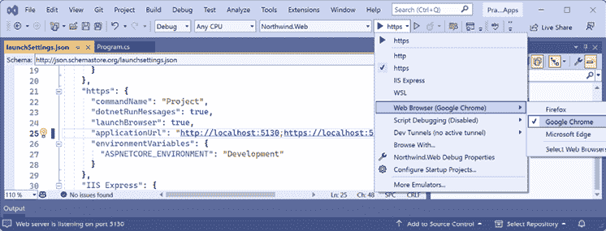
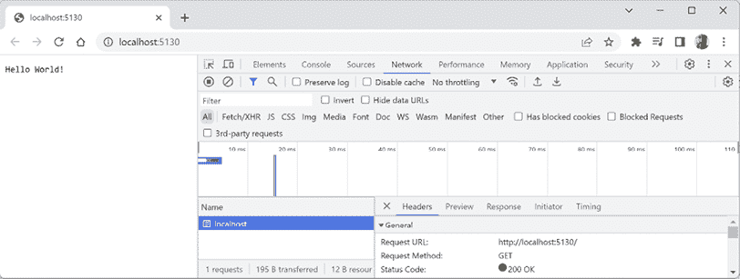
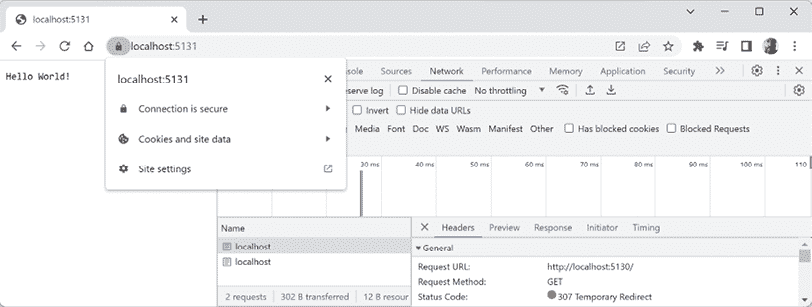
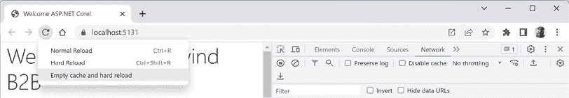
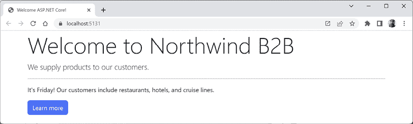
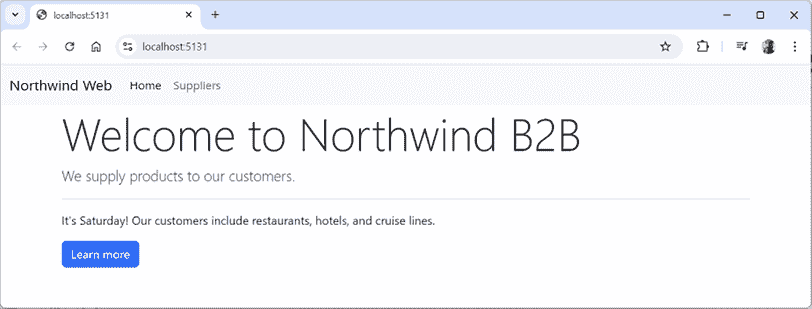
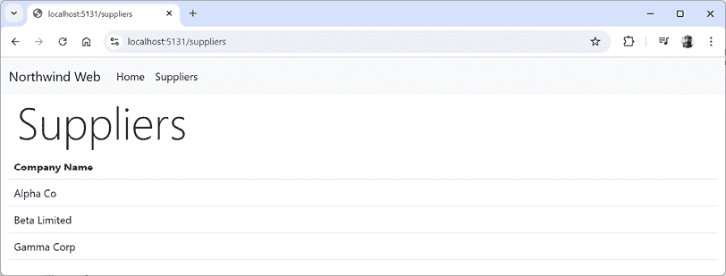
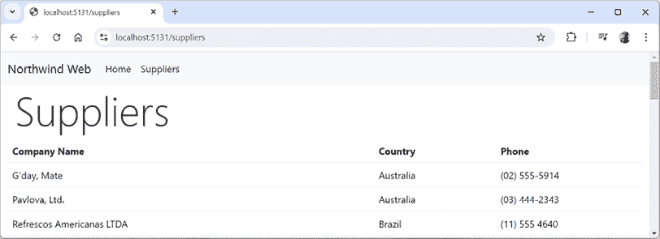

# 使用 ASP.NET Core 构建网站

本章是关于在服务器端使用现代 HTTP 架构构建网站。

ASP.NET Core 是一个由微软开发的免费、开源和跨平台的 Web 框架，用于构建现代、基于云和互联网连接的应用程序。它是先前 ASP.NET 框架的重大重构，侧重于灵活性、模块化和性能。

ASP.NET Core 提供了一个统一的编程模型，用于构建 Web **用户界面**（**UI**）和 Web API，这意味着您可以使用相同的框架进行服务器端和客户端逻辑。

ASP.NET Core 是一个由微软开发的免费、开源和跨平台的 Web 框架，用于构建现代、基于云和互联网连接的应用程序。它是先前 ASP.NET 框架的重大重构，侧重于灵活性、模块化和性能。

您将了解如何使用 ASP.NET Core 8 中引入的 Blazor 静态 **服务器端渲染**（**SSR**）功能构建简单的网站。

本章涵盖了以下主题：

+   探索 ASP.NET Core

+   Blazor 的历史

+   探索 Blazor 静态 SSR

+   使用 Entity Framework Core 与 ASP.NET Core

# 探索 ASP.NET Core

在我们探索示例 ASP.NET Core 项目之前，让我们回顾其架构。

## ASP.NET Core 的架构

ASP.NET Core 的架构由几个关键组件组成：

+   **中间件**：中间件组件用于处理请求和响应。它们在管道中串联在一起，其中每个中间件处理请求并将其传递给链中的下一个组件。在本章的可选在线部分，您可以学习如何自定义此管道。

+   **路由**：路由组件负责将传入的请求映射到适当的端点和 Blazor 组件。

+   **依赖注入（DI）容器**：这是一个内置的容器，用于管理服务对象的生命周期和依赖关系。

+   **配置**：ASP.NET Core 使用一个灵活的配置系统，支持各种来源，如 JSON 文件、环境变量和命令行参数。

+   **日志记录**：框架有一个日志 API，支持各种日志提供程序，允许您以一致的方式捕获和存储日志数据。

现在我们将创建一个空的 ASP.NET Core 项目，并探索如何使其能够服务简单的网页。

## 创建一个空的 ASP.NET Core 项目

我们将创建一个 ASP.NET Core 项目，该项目将展示来自 `Northwind` 数据库的供应商列表。

`dotnet` 工具提供了许多项目模板，这些模板为您做了很多工作，但可能很难知道哪个最适合特定情况，因此我们将从空网站项目模板开始，然后逐步添加功能，以便您了解所有组件：

1.  使用您首选的代码编辑器打开 `ModernWeb` 解决方案，然后添加一个新项目，如下列所示：

    +   **项目模板**：**ASP.NET Core Empty [C#]** / `web`。对于 Rider，选择名为**ASP.NET Core Web Application**的项目模板，然后将**类型**设置为**Empty**。

    +   **项目文件和文件夹**：`Northwind.Web`。

    +   **解决方案文件和文件夹**：`ModernWeb`。

    +   对于 Visual Studio，保留所有其他选项的默认设置。

    例如：

    +   **框架**：.NET 9.0 **(**标准术语支持**)

    +   **配置 HTTPS**：已选择

    +   **启用 Docker**：已清除

    +   **不使用顶层语句**：已清除

    +   对于 VS Code 和 `dotnet new web` 命令，默认选项是我们想要的选项。在未来的项目中，如果您想从顶层语句更改为旧的 `Program` 类样式，请指定开关 `--use-program-main`。

创建新项目时，Visual Studio 和 `dotnet new` 选项的摘要可以在以下 GitHub 仓库链接中找到：[`github.com/markjprice/cs13net9/blob/main/docs/ch01-project-options.md`](https://github.com/markjprice/cs13net9/blob/main/docs/ch01-project-options.md)。

1.  构建 `Northwind.Web` 项目。

1.  在 `Northwind.Web.csproj` 中，注意项目类似于类库，除了 SDK 是 `Microsoft.NET.Sdk.Web`，如下所示，高亮显示的标记：

    ```cs
    <Project **Sdk=****"Microsoft.NET.Sdk.Web"**>
      <PropertyGroup>
        <TargetFramework>net9.0</TargetFramework>
        <Nullable>enable</Nullable>
        <ImplicitUsings>enable</ImplicitUsings>
      </PropertyGroup>
    </Project> 
    ```

1.  添加一个元素以全局和静态地导入 `System.Console` 类，如下所示，高亮显示的标记：

    ```cs
    <ItemGroup Label="To simplify use of WriteLine.">
      <Using Include="System.Console" Static="true" />
    </ItemGroup> 
    ```

1.  如果您正在使用 Visual Studio，在 **解决方案资源管理器** 中，切换 **显示所有文件**。如果您正在使用 Rider，则将光标移至 **解决方案** 窗格，然后单击“眼睛”图标。

1.  展开文件夹 `obj`，展开文件夹 `Debug`，展开文件夹 `net9.0`，并选择文件 `Northwind.Web.GlobalUsings.g.cs`。注意隐式导入的命名空间包括控制台应用程序或类库的所有命名空间，以及一些 ASP.NET Core 命名空间，例如 `Microsoft.AspNetCore.Builder`，如下所示，代码如下：

    ```cs
    // <autogenerated />
    global using global::Microsoft.AspNetCore.Builder;
    global using global::Microsoft.AspNetCore.Hosting;
    global using global::Microsoft.AspNetCore.Http;
    global using global::Microsoft.AspNetCore.Routing;
    global using global::Microsoft.Extensions.Configuration;
    global using global::Microsoft.Extensions.DependencyInjection;
    global using global::Microsoft.Extensions.Hosting;
    global using global::Microsoft.Extensions.Logging;
    global using global::System;
    global using global::System.Collections.Generic;
    global using global::System.IO;
    global using global::System.Linq;
    global using global::System.Net.Http;
    global using global::System.Net.Http.Json;
    global using global::System.Threading;
    global using global::System.Threading.Tasks;
    global using static global::System.Console; 
    ```

1.  关闭文件并折叠 `obj` 文件夹。

1.  在 `Northwind.Web` 项目/文件夹中，展开名为 `Properties` 的文件夹，打开名为 `launchSettings.json` 的文件，并注意名为 `http` 和 `https` 的配置文件。它们具有随机分配的端口号，您将在下一步中更改，因此现在只需注意它们的位置，如下所示，高亮显示的配置：

    ```cs
    {
      "$schema": "http://json.schemastore.org/launchsettings.json",
      "iisSettings": {
        "windowsAuthentication": false,
        "anonymousAuthentication": true,
        "iisExpress": {
          "applicationUrl": "http://localhost:14842",
          "sslPort": 44352
        }
      },
      "profiles": {
        "**http**": {
          "commandName": "Project",
          "dotnetRunMessages": true,
          "launchBrowser": true,
          **"applicationUrl"****:** **"http://localhost:5122"**,
          "environmentVariables": {
            "ASPNETCORE_ENVIRONMENT": "Development"
          }
        },
        "**https**": {
          "commandName": "Project",
          "dotnetRunMessages": true,
          "launchBrowser": true,
          **"applicationUrl"****:** **"https://localhost:7155;http://localhost:5122"**,
          "environmentVariables": {
            "ASPNETCORE_ENVIRONMENT": "Development"
          }
        },
        "IIS Express": {
          "commandName": "IISExpress",
          "launchBrowser": true,
          "environmentVariables": {
            "ASPNETCORE_ENVIRONMENT": "Development"
          }
        }
      }
    } 
    ```

`launchSettings.json` 文件仅在开发期间使用。它对构建过程没有影响。它不会与编译的网站项目一起部署，因此对生产运行时没有影响。它仅由代码编辑器（如 Visual Studio 和 Rider）处理，以设置环境变量并定义当项目由代码编辑器启动时，网络服务器要监听的 URL。

1.  对于 `https` 配置文件，将其 `applicationUrl` 中分配的 `http` 端口号更改为 `5130`，`https` 端口号更改为 `5131`，并交换顺序，使 `http` 在列表中排在第一位，默认使用，如下所示，高亮显示的标记：

    ```cs
    "applicationUrl": "**http://localhost:5130;https://localhost:5131**", 
    ```

`http` 和 `https` 启动配置文件具有 `commandName` 为 `Project`，这意味着它们使用项目中配置的 web 服务器来托管网站，默认情况下是 Kestrel。还有一个针对 **IIS** 的配置文件和设置，这是一个仅适用于 Windows 的 web 服务器。在这本书中，我们将只使用 Kestrel 作为 web 服务器，因为它支持跨平台。为了清理你的 `launchSettings.json` 文件，你甚至可以删除 `iisSettings` 和 `IIS Express` 部分。

1.  将更改保存到 `launchSettings.json` 并关闭文件。

1.  在 `Program.cs` 中，请注意以下内容：

    +   一个 ASP.NET Core 项目就像一个顶级控制台应用程序，它有一个隐藏的 `<Main>$` 方法作为其入口点，该入口点通过名称 `args` 传递参数。

    +   它调用 `WebApplication.CreateBuilder`，这使用默认的 web 服务器创建网站宿主，然后构建。

    +   网站将对所有指向网站根路径的 HTTP `GET` 请求做出响应，显示以下纯文本：`Hello World!`。

    +   对 `Run` 方法的调用是一个阻塞调用，因此隐藏的 `<Main>$` 方法不会在 web 服务器停止运行之前返回。

`Program.cs` 的内容如下所示：

```cs
var builder = WebApplication.CreateBuilder(args);
var app = builder.Build();
app.MapGet("/", () => "Hello World!");
app.Run(); 
```

1.  在现有的 `MapGet` 调用之后，添加两个调用以定义一个返回匿名 C# 对象的 JSON 的端点，以及一个返回网页的端点，如下面的代码所示：

    ```cs
    app.MapGet("/data", () => Results.Json(new
    {
      firstName = "John",
      lastName = "Doe",
      age = 30
    }));
    app.MapGet("/welcome", () => Results.Content(
      content: $"""
      <!doctype html>
      <html lang="en">
      <head>
        <title>Welcome to Northwind Web!</title>
      </head>
      <body>
        <h1>Welcome to Northwind Web!</h1>
      </body>
      </html>
      """,
      contentType: "text/html")); 
    ```

除了 `Json` 和 `Content`，`Results` 类还有许多其他方法，如 `BadRequest`、`Bytes`、`Created`、`File`、`NoContent`、`NotFound`、`Ok`、`Problem`、`Redirect` 等。你可以在以下链接中了解更多信息：[`learn.microsoft.com/en-us/dotnet/api/microsoft.aspnetcore.http.results`](https://learn.microsoft.com/en-us/dotnet/api/microsoft.aspnetcore.http.results)。

1.  在 `Program.cs` 的底部，添加一个注释来解释 `Run` 方法，并在 `Run` 之后、因此是在 web 服务器停止后，向控制台写入一条消息，如下面的代码所示（高亮显示）：

    ```cs
    **// Start the web server, host the website, and wait for requests.**
    app.Run(); **// This is a thread-blocking call.**
    **WriteLine(****"This executes after the web server has stopped!"****);** 
    ```

## 测试和保障网站安全

我们现在将测试 ASP.NET Core 空项目网站的功能。我们还将通过从 HTTP 切换到 HTTPS 来启用浏览器和 web 服务器之间所有流量的加密，以保障隐私。HTTPS 是 HTTP 的安全加密版本。

+   对于 Visual Studio：

    1.  在工具栏中，确保选择了 **https** 配置文件（而不是 **http**、**IIS Express** 或 **WSL**），然后将 **Web Browser** 更改为 **Google Chrome**，如图 *13.1* 所示：

    图 13.1：在 Visual Studio 中选择具有 Kestrel web 服务器的 https 配置文件

1.  导航到 **调试** | **不调试启动…**。

1.  在 Windows 中，如果你看到一个 **Windows 安全警报**，显示 **Windows Defender 防火墙已阻止此应用程序的一些功能**，那么请点击 **允许访问** 按钮。

1.  第一次启动安全网站时，您可能会收到通知，表示您的项目配置为使用 SSL，为了避免浏览器中的警告，您可以选择信任 ASP.NET Core 生成的自签名证书。点击 **是**。当您看到 **安全警告** 对话框时，再次点击 **是**。

+   对于 VS Code，输入启动具有 `https` 配置文件的项目命令，如下所示：`dotnet run --launch-profile https`。然后启动 Chrome。

+   对于 Rider：

    1.  导航到 **运行** | **编辑配置…**。

    1.  在 **运行/调试配置** 对话框中，选择 **Northwind.Web: https**。

    1.  在对话框底部，**启动后** 复选框的右侧，选择 **Chrome** 然后点击 **确定**。

    1.  导航到 **运行** | **运行‘Northwind.Web: https’**。

1.  在 Visual Studio 的命令提示符窗口或 VS Code 的终端中，注意以下内容，如图所示输出：

    +   网络服务器已经开始监听我们分配的 HTTP 和 HTTPS 端口。

    +   您可以按 *Ctrl* + *C* 关闭 Kestrel 网络服务器。

    +   托管环境是 `开发`。

    ```cs
    info: Microsoft.Hosting.Lifetime[14]
      Now listening on: http://localhost:5130
    info: Microsoft.Hosting.Lifetime[14]
      Now listening on: https://localhost:5131
    info: Microsoft.Hosting.Lifetime[0]
      Application started. Press Ctrl+C to shut down.
    info: Microsoft.Hosting.Lifetime[0]
      Hosting environment: Development
    info: Microsoft.Hosting.Lifetime[0]
      Content root path: C:\cs13net9\ModernWeb\Northwind.Web 
    ```

Visual Studio 还会自动启动您选择的浏览器并导航到第一个 URL。如果您使用 VS Code，您将需要手动启动 Chrome。

1.  在命令提示符或终端中保持 Kestrel 网络服务器运行。

1.  在 Chrome 中，显示 **开发者工具**，并点击 **网络** 选项卡。

1.  请求网站项目的首页：

    +   如果您使用 Visual Studio 并且 Chrome 自动启动并为您输入了 URL，那么请点击 **重新加载此页面** 按钮或按 *F5*。

    +   如果您正在使用 VS Code 和命令提示符或终端，那么在 Chrome 地址栏中，手动输入地址 `http://localhost:5130/`。

1.  在 **网络** 选项卡中，点击 **localhost**，并注意来自跨平台 Kestrel 网络服务器的响应是纯文本中的 **Hello World!**，如图 *13.2* 所示：



图 13.2：网站项目的纯文本响应

像 Chrome 这样的浏览器可能还会请求一个 `favicon.ico` 文件以在浏览器窗口或标签页中显示，但这个文件在我们的项目中不存在，因此显示为 `404 Not Found` 错误。如果您觉得这很烦人，那么您可以在以下链接免费生成一个 `favicon.ico` 文件并将其放入项目文件夹：[`favicon.io/`](https://favicon.io/)。在网页中，您也可以在元标签中指定一个，例如，使用 Base64 编码的一个空白标签，如下所示：

`<link rel="icon" href="data:;base64,iVBORw0KGgo=">`

1.  输入地址 `https://localhost:5131/` 并注意，如果你没有使用 Visual Studio 或者当被提示信任 SSL 证书时点击了 **否**，那么响应将是一个隐私错误。当你没有配置浏览器可以信任的证书来加密和解密 HTTPS 流量时，你会看到这个错误（如果你没有看到这个错误，那是因为你已经配置了证书）。在生产环境中，你可能希望支付像 Verisign 这样的公司以获取 SSL 证书，因为它们提供责任保护和技术支持。在开发过程中，你可以告诉你的操作系统信任 ASP.NET Core 提供的临时开发证书。

Visual Studio 也会自动启动你选择的浏览器并导航到第一个 URL。如果你使用 VS Code，你必须手动启动 Chrome。

1.  输入地址 `https://localhost:5131/data` 并注意返回了一些 JSON。

1.  输入地址 `https://localhost:5131/welcome` 并注意返回了一个网页。

1.  在命令提示符或终端中，按 *Ctrl*+ *C* 关闭 web 服务器，并注意输出的消息，如下所示：

    ```cs
    info: Microsoft.Hosting.Lifetime[0]
          Application is shutting down...
    **This executes after the web server has stopped!**
    C:\cs13net9\ModernWeb\Northwind.Web\bin\Debug\net9.0\Northwind.Web.exe (process 19888) exited with code 0. 
    ```

1.  如果你需要信任一个本地自签名 SSL 证书，那么在命令行或终端中，输入以下命令：`dotnet dev-certs https --trust`。

1.  注意消息 **请求信任 HTTPS 开发证书**。你可能需要输入密码，并且可能已经存在一个有效的 HTTPS 证书。

## 启用更强的安全性和重定向到安全连接

启用更严格的安全性和自动将 HTTP 请求重定向到 HTTPS 是一种良好的实践。

**良好实践**：一个可选但推荐的安全增强是 **HTTP 严格传输安全**（**HSTS**），你应该始终启用。如果一个网站指定了它并且浏览器支持它，那么它将强制所有通信都通过 HTTPS，并防止访问者使用不受信任或无效的证书。

让我们立即这样做：

1.  在 `Program.cs` 中，在构建 `app` 的语句之后，添加一个区域和一个 `if` 语句，以在 **非开发** 时启用 HSTS，并将 HTTP 请求重定向到 HTTPS，如下所示：

    ```cs
    var builder = WebApplication.CreateBuilder(args);
    var app = builder.Build();
    **#****region** **Configure the HTTP pipeline and routes**
    **if** **(!app.Environment.IsDevelopment())**
    **{**
     **app.UseHsts();**
    **}**
    **app.UseHttpsRedirection();**
    app.MapGet("/", () => "Hello World!");
    // Other MapGet calls.
    **#****endregion**
    // Start the web server, host the website, and wait for requests.
    app.Run(); // This is a thread-blocking call.
    WriteLine("This executes after the web server has stopped!"); 
    ```

1.  使用 `https` 启动配置文件，不进行调试启动 `Northwind.Web` 网站项目。

1.  如果 Chrome 仍在运行，请关闭并重新启动它。

1.  在 Chrome 中，显示 **开发者工具**，并点击 **网络** 选项卡。

1.  输入地址 `http://localhost:5130/`，注意服务器如何响应一个 **307 临时重定向** 到 `https://localhost:5131/`，以及证书是有效且受信任的，如 *图 13.3* 所示：



图 13.3：现在使用有效的证书和 307 重定向来确保连接安全

1.  关闭 Chrome 并关闭 web 服务器。

**良好实践**：记住，每次完成网站测试后，通过切换到命令提示符或终端并按*Ctrl* + *C*来关闭 Kestrel web 服务器。

## 控制托管环境

在 ASP.NET Core 5 及更早版本中，项目模板设置了一个规则，即在开发模式下，任何未处理的异常都会在浏览器窗口中显示，以便开发者可以看到异常的详细信息，如下面的代码所示：

```cs
if (app.Environment.IsDevelopment())
{
  app.UseDeveloperExceptionPage();
} 
```

在 ASP.NET Core 6 及更高版本中，此代码默认由`WebApplication`构建器配置，因此会自动执行，因此不再需要在项目模板`Program.cs`源代码中包含它。

ASP.NET Core 是如何知道我们在开发模式下运行的，以便`IsDevelopment`方法返回`true`，并且执行额外的代码来设置开发者异常页面？让我们来了解一下。

ASP.NET Core 可以从设置文件和环境变量中读取，以确定要使用哪种托管环境，例如`DOTNET_ENVIRONMENT`或`ASPNETCORE_ENVIRONMENT`。

你可以在本地开发期间覆盖这些设置：

1.  在`Northwind.Web`文件夹中，展开名为`Properties`的文件夹，并打开名为`launchSettings.json`的文件。请注意，`https`启动配置文件将托管环境的环境变量设置为`Development`，如下面的配置中突出显示所示：

    ```cs
    "https": {
      "commandName": "Project",
      "dotnetRunMessages": true,
      "launchBrowser": true,
      "applicationUrl": "https://localhost:5131;http://localhost:5130",
    **"environmentVariables"****: {**
    **"ASPNETCORE_ENVIRONMENT"****:** **"Development"**
     **}**
    }, 
    ```

1.  将`ASPNETCORE_ENVIRONMENT`环境变量从`Development`更改为`Production`。

1.  如果你正在使用 Visual Studio，可选地，将`launchBrowser`更改为`false`以防止 Visual Studio 自动启动浏览器。当你使用`dotnet run`或 Rider 启动网站项目时，此设置将被忽略。

1.  在`Program.cs`中，修改第一个`MapGet`语句，使其返回环境名称而不是`Hello World`，如下面的代码中突出显示所示：

    ```cs
    app.MapGet("/", () =>
      **$"Environment is** **{app.Environment.EnvironmentName}****"**); 
    ```

1.  使用`https`启动配置文件启动网站项目，并注意托管环境是`Production`，如下面的输出所示：

    ```cs
    info: Microsoft.Hosting.Lifetime[0]
      Hosting environment: Production 
    ```

1.  在 Chrome 中，请注意纯文本是`Environment is Production`。

1.  关闭 web 服务器。

1.  在`launchSettings.json`中，将环境变量改回`Development`，并保存更改到文件。

**更多信息**：您可以在以下链接中了解更多关于环境的信息：[`learn.microsoft.com/en-us/aspnet/core/fundamentals/environments`](https://learn.microsoft.com/en-us/aspnet/core/fundamentals/environments)。

## 启用网站以服务静态内容

只返回单个纯文本消息的网站并不很有用！

至少，它应该返回静态 HTML 页面、网页将用于样式的 CSS 以及任何其他静态资源，例如图片和视频。

按照惯例，这些文件应该存储在名为`wwwroot`的目录中，以将它们与网站项目的动态执行部分分开。

## 创建静态文件和网页的文件夹

您现在将创建一个用于您的静态网站资源的文件夹和一个使用 Bootstrap 进行样式的基本索引页面：

1.  在`Northwind.Web`项目/文件夹中，创建一个名为`wwwroot`的文件夹。请注意，Visual Studio 通过为其提供一个地球图标来识别它作为一个特殊类型的文件夹，。

1.  在`wwwroot`文件夹中，添加一个名为`index.html`的新文件。（在 Visual Studio 中，项目项模板的名称为**HTML 页面**。）

1.  在`index.html`中，修改其标记以链接到 CDN 托管的 Bootstrap 进行样式设置，并使用现代的良好实践，例如设置视口，如下面的标记所示：

    ```cs
    <!doctype html>
    <html lang="en">
    <head>
      <!-- Required meta tags -->
      <meta charset="utf-8" />
      <meta name="viewport" content=
        "width=device-width, initial-scale=1, shrink-to-fit=no" />
      <!-- Bootstrap CSS -->
      <link href="https://cdn.jsdelivr.net/npm/bootstrap@5.3.3/dist/css/bootstrap.min.css" rel="stylesheet" integrity="sha384-QWTKZyjpPEjISv5WaRU9OFeRpok6YctnYmDr5pNlyT2bRjXh0JMhjY6hW+ALEwIH" crossorigin="anonymous">
      <title>Welcome ASP.NET Core!</title>
    </head>
    <body>
      <div class="container">
        <div class="jumbotron">
          <h1 class="display-3">Welcome to Northwind B2B</h1>
          <p class="lead">We supply products to our customers.</p>
          <hr />
          <h2>This is a static HTML page.</h2>
          <p>Our customers include restaurants, hotels, and cruise lines.</p>
          <p>
            <a class="btn btn-primary"
              href="https://www.asp.net/">Learn more</a>
          </p>
        </div>
      </div>
    </body>
    </html> 
    ```

    **良好实践**：查看最新版本，请访问以下链接：[`getbootstrap.com/docs/versions/`](https://getbootstrap.com/docs/versions/)。点击最新版本进入其**Bootstrap 入门**页面。滚动到页面底部找到第 2 步，找到最新的`<link>`元素（以及在本章后面的`<script>`元素），然后您可以复制并粘贴。

Bootstrap 是构建响应式、移动优先网站的全球最受欢迎的框架。您可以在以下链接中阅读一个仅在线部分，介绍 Bootstrap 的一些最重要的功能：[`github.com/markjprice/cs13net9/blob/main/docs/ch13-bootstrap.md`](https://github.com/markjprice/cs13net9/blob/main/docs/ch13-bootstrap.md)。

1.  在`wwwroot`文件夹中，添加一个名为`site.css`的文件，并修改其内容，如下面的标记所示：

    ```cs
    h1 {
       color: darkcyan;
       font-style: italic;
    } 
    ```

1.  在`wwwroot`文件夹中，添加一个名为`categories.jpeg`的文件。您可以从以下链接下载它：[`github.com/markjprice/cs13net9/blob/main/code/images/Categories/categories.jpeg`](https://github.com/markjprice/cs13net9/blob/main/code/images/Categories/categories.jpeg)。

1.  在`wwwroot`文件夹中，添加一个名为`about.html`的文件，并修改其内容，如下面的标记所示：

    ```cs
    <!doctype html>
    <html lang="en">
    <head>
      <meta charset="utf-8" />
      <meta name="viewport" content="width=device-width, initial-scale=1, shrink-to-fit=no" />
      <link href="https://cdn.jsdelivr.net/npm/bootstrap@5.3.3/dist/css/bootstrap.min.css" rel="stylesheet" integrity="sha384-QWTKZyjpPEjISv5WaRU9OFeRpok6YctnYmDr5pNlyT2bRjXh0JMhjY6hW+ALEwIH" crossorigin="anonymous">
      <link href="site.css" rel="stylesheet" />
      <title>About Northwind Web</title>
    </head>
    <body>
      <div class="container">
        <div class="jumbotron">
          <h1 class="display-3">About Northwind Web</h1>
          <p class="lead">We supply products to our customers.</p>
          
        </div>
      </div>
    </body>
    </html> 
    ```

## 启用静态和默认文件

如果您现在启动网站并在地址框中输入`http://localhost:5130/index.html`或`https://localhost:5131/index.html`，网站将返回一个`404 Not Found`错误，表示未找到网页。为了使网站能够返回静态文件，例如`index.html`，我们必须明确配置该功能。

即使您启用了存储在`wwwroot`中的静态文件，如果您现在启动网站并在地址框中输入`http://localhost:5130/`或`https://localhost:5131/`，网站仍然会返回一个`404 Not Found`错误，因为如果未请求任何命名文件，则默认情况下，Web 服务器不知道要返回什么。

您现在将启用静态文件，明确配置默认文件如`index.html`，并更改返回纯文本响应的注册 URL 路径：

1.  在 `Program.cs` 中，在启用 HTTPS 重定向后添加语句以启用静态文件和默认文件。同时，修改将 `GET` 请求映射到包含环境名称的纯文本响应的语句，使其仅对 URL 路径 `/env` 响应，如下面代码中突出显示所示：

    ```cs
    **app.UseDefaultFiles();** **// index.html, default.html, and so on.**
    **app.MapStaticAssets();** **// .NET 9 or later.**
    **// app.UseStaticFiles();****// .NET 8 or earlier.**
    app.MapGet("/**env**", () =>
      $"Environment is {app.Environment.EnvironmentName}"); 
    ```

    ASP.NET Core 9 引入了自动压缩静态文件的 `MapStaticAssets` 方法，这减少了带宽需求。对于 ASP.NET Core 8 及更早版本，你必须调用 `UseStaticFiles` 方法。你可以在以下链接中了解更多信息：[`learn.microsoft.com/en-us/aspnet/core/release-notes/aspnetcore-9.0#optimizing-static-web-asset-delivery`](https://learn.microsoft.com/en-us/aspnet/core/release-notes/aspnetcore-9.0#optimizing-static-web-asset-delivery)。

**警告！** 在调用 `MapStaticAssets` 或 `UseStaticFiles` 之前，必须先调用 `UseDefaultFiles`，否则将不会生效！你可以在本章末尾链接的在线部分了解更多关于中间件和端点路由的顺序。

1.  启动网站。

1.  启动 Chrome 并显示 **开发者工具**。

1.  在 Chrome 中输入 `http://localhost:5130/`。注意你被重定向到端口 `5131` 上的 HTTPS 地址，并且 `index.html` 文件现在通过该安全连接返回，因为它是此网站的可能默认文件之一，并且是在 `wwwroot` 文件夹中找到的第一个匹配项。

**警告！** 如果你仍然看到环境名称为纯文本，请确保你将相对路径 `/env` 映射到该端点，而不是仅仅映射到 `/`，否则这将覆盖对 `index.html` 文件的默认请求。

1.  在 Chrome 中输入 `http://localhost:5131/about.html` 并注意网页被返回，并且它请求 `site.css` 文件，该文件应用了额外的样式。

1.  在 **开发者工具** 中，注意对 Bootstrap 样式表的请求。

1.  在 Chrome 中输入 `http://localhost:5130/env` 并注意它返回与之前相同的纯文本环境名称。

1.  关闭 Chrome 并关闭 web 服务器。

## 理解 MapStaticAssets

在 .NET 9 中引入的 `MapStaticAssets` 通过整合构建和发布时过程来收集应用程序中所有静态资源的数据。然后，运行时库使用这些数据高效地向浏览器提供这些文件。

虽然 `MapStaticAssets` 通常可以直接替换 `UseStaticFiles`，但它专门针对在构建和发布时已知的应用程序资源进行优化。对于从其他位置（如磁盘或嵌入式资源）提供的资源，仍然应使用 `UseStaticFiles`。

与 `UseStaticFiles` 相比，`MapStaticAssets` 提供以下好处：

+   对应用中所有资源进行构建时压缩：

    +   在开发期间使用 `gzip`，在发布期间使用 `gzip` + `brotli`。

    +   所有资源都经过压缩，目的是将资源的大小减少到最小。

+   每个资源的 ETags 是内容 SHA-256 哈希的 Base64 编码字符串。这确保了浏览器只有在文件内容发生变化时才会重新下载文件。

例如，*表 13.1*展示了使用 Fluent UI Blazor 组件库的原始和压缩大小，总共 478 KB 未压缩到 84 KB 压缩。

| **文件** | **原始** | **压缩** | **% 减少** |
| --- | --- | --- | --- |
| `fluent.js` | 384 | 73 | 80.99% |
| `fluent.css` | 94 | 11 | 88.30% |
| 总计 | 478 | 84 | 82.43% |

表 13.1：MapStaticAssets 如何压缩 Fluent UI Blazor 组件

如果所有网页都是静态的（即，它们只能通过网页编辑器手动更改），那么我们的网站编程工作就完成了。但几乎所有的网站都需要动态内容，这意味着网页是在运行时通过执行代码生成的。

做这件事的最简单方法是使用 ASP.NET Core 的一个名为 Blazor staticSSR 的功能。但在那之前，让我们了解一下为什么您可能会在**开发者工具**等工具中看到额外的请求，而这些请求并不是您预期的。

## 开发期间理解浏览器请求

在**开发者工具**中，我们可以看到浏览器发出的所有请求。其中一些将是您预期的请求，例如：

+   `localhost`: 这是网站项目中主页的请求。对于我们的当前项目，地址将是`http://localhost:5130/`或`https://localhost:5131/`。

+   `bootstrap.min.css`: 这是 Bootstrap 样式的请求。我们在主页上添加了对这个的引用，因此浏览器随后请求了这个样式表。

一些请求仅在开发期间进行，并由您使用的代码编辑器决定。如果您在**开发者工具**中看到它们，通常可以忽略它们。例如：

+   `browserLink`和`aspnetcore-browser-refresh.js`：这些是 Visual Studio 为连接浏览器进行调试和热重载而发出的请求。例如，`https://localhost:5131/_vs/browserLink`和`https://localhost:5131/_framework/aspnetcore-browser-refresh.js`。

+   `negotiate?requestUrl`、`connect?transport`、`abort?Transport`等：这些都是用于将 Visual Studio 与浏览器连接的额外请求。

+   `Northwind.Web/`: 这是一个与 SignalR 相关的安全 WebSockets 请求，用于将 Visual Studio 与浏览器连接：`wss://localhost:44396/Northwind.Web/`。

现在您已经看到了如何设置一个支持静态文件（如 HTML 网页和 CSS）的基本网站，让我们通过添加对动态生成静态网页的支持（一旦网页到达浏览器客户端，它就是静态的）来让它更有趣。

ASP.NET Core 有多个技术用于动态生成静态网页，包括 Razor Pages 和**模型-视图-控制器**（**MVC**）Razor 视图。最现代的动态网页技术是 Blazor 静态 SSR 页面。但让我们首先回顾 Blazor 及其创建的原因。

# Blazor 的历史

Blazor 允许您使用 C# 而不是 JavaScript 来构建交互式 Web UI 组件。Blazor 支持所有现代浏览器。

## JavaScript 及相关技术

传统上，任何需要在网络浏览器中执行的字节码都必须使用 JavaScript 编程语言或更高层次的技术编写，这些技术可以将代码**转换**（转换或编译）为 JavaScript。这是因为所有浏览器都支持 JavaScript 超过二十年，因此它是实现客户端业务逻辑的最低共同标准。

虽然 JavaScript 与 C# 和 Java 等类似 C 风格的语言在表面上有些相似，但一旦深入挖掘，它实际上非常不同。它是一种动态类型伪函数式语言，使用原型而不是类继承来实现对象重用。它可能看起来很人性化，但当你发现它其实是一个 Skrull 时，你可能会感到惊讶。

如果我们能在浏览器中使用与服务器上相同的语言和库，那就太好了。

即使 Blazor 也无法完全取代 JavaScript。例如，浏览器的一些部分只能通过 JavaScript 访问。Blazor 提供了一个互操作服务，以便您的 C# 代码可以调用 JavaScript 代码，反之亦然。您将在第十四章“使用 Blazor 构建交互式 Web 组件”的在线仅有的 *与 JavaScript 互操作* 部分中看到这一点。

## Silverlight – 使用插件进行 C# 和 .NET 开发

微软曾尝试通过名为 Silverlight 的技术来实现这一目标。当 2008 年发布 Silverlight 2 时，C# 和 .NET 开发者可以使用他们的技能来构建由 Silverlight 插件在 Web 浏览器中执行的库和可视化组件。

到 2011 年和 Silverlight 5 时，苹果在 iPhone 上的成功以及史蒂夫·乔布斯对像 Flash 这样的浏览器插件的反感最终导致微软放弃了 Silverlight，因为像 Flash 一样，Silverlight 被禁止在 iPhone 和 iPad 上运行。

## WebAssembly – Blazor 的目标

网络浏览器的发展又给了微软一次尝试的机会。2017 年，**WebAssembly 协议**完成，现在所有主流浏览器都支持它：Chromium（Chrome、Edge、Opera 和 Brave）、Firefox 以及 WebKit（Safari）。

**WebAssembly**（**Wasm**）是一种虚拟机的二进制指令格式，它提供了一种在网络上以接近原生速度运行多种语言编写代码的方式。Wasm 被设计为 C# 等高级语言的编译目标。

## .NET 7 及更早版本中的 Blazor 托管模型

Blazor 是一个单一的编程或应用模型。对于 .NET 7 及更早版本，开发者必须为每个项目选择一个托管模型：

+   **Blazor Server** 项目在服务器端运行，因此 C# 代码可以完全访问业务逻辑可能需要的所有资源，而无需提供凭证进行身份验证。它使用 SignalR 与客户端通信 UI 更新。服务器必须保持与每个客户端的实时 SignalR 连接，并跟踪每个客户端的当前状态。这意味着如果需要支持大量客户端，Blazor Server 的扩展性不佳。它首次作为 ASP.NET Core 3 的一部分于 2019 年 9 月发布。

+   **Blazor Wasm** 项目在客户端运行，因此 C# 代码只能访问浏览器中的资源。在它能够访问服务器上的资源之前，它必须进行 HTTP 调用（可能需要身份验证）。它首次作为 ASP.NET Core 3.1 的扩展于 2020 年 5 月发布，并标记为 3.2，因为它是一个当前版本，因此不受 ASP.NET Core 3.1 长期支持的影响。Blazor Wasm 3.2 版本使用了 Mono 运行时和 Mono 库。.NET 5 及以后的版本使用 Mono 运行时和 .NET 库。

+   **.NET MAUI Blazor 应用**，也称为 **Blazor 混合应用**，项目使用本地互操作通道将其 Web UI 渲染到 Web 视图控件，并在 .NET MAUI 应用中托管。从概念上讲，它类似于 Electron 应用。

## .NET 8 中 Blazor 托管模型的统一

在 .NET 8 中，Blazor 团队创建了一个统一的托管模型，其中每个组件都可以设置为使用不同的渲染模型：

+   **SSR（服务器端渲染）**：像 Razor Pages 和 MVC 一样在服务器端执行代码。然后将完整的响应发送到浏览器以显示给访客，直到浏览器发起新的 HTTP 请求之前，服务器和客户端之间没有进一步的交互。从浏览器的角度来看，网页就像任何其他 HTML 文件一样是静态的。

+   **流式渲染**：在服务器端执行代码。HTML 标记可以返回并在浏览器中显示，并且在连接仍然打开的情况下，任何异步操作都可以继续执行。当所有异步操作完成后，服务器通过发送最终标记来更新页面内容。这改善了访客的体验，因为他们可以在等待其余内容时看到一些内容，如“正在加载...”消息。

+   **交互式服务器渲染**：在实时交互期间在服务器端执行代码，这意味着代码可以完全且容易地访问服务器端资源，如数据库。这可以简化功能的实现。交互式请求使用 SignalR 进行，比完整请求更高效。浏览器和服务器之间需要一个永久连接，这限制了可扩展性。这对于客户端数量有限且网络带宽高的内网网站来说是一个不错的选择。

+   **交互式 Wasm 渲染**：在客户端执行代码，这意味着代码只能访问浏览器内的资源。这可能会使实现复杂化，因为每当需要新数据时，必须对服务器进行回调。对于可能存在大量客户端且部分客户端带宽较低的公共网站来说，这是一个不错的选择。

+   **交互式自动渲染**：首先在服务器上渲染以实现更快的初始显示，然后在后台下载 Wasm 组件，然后切换到 Wasm 以实现后续的交互性。

这种统一模型意味着，经过仔细规划，开发者可以编写一次 Blazor 组件，然后选择在 web 服务器端、web 客户端或动态切换上运行。这提供了所有最佳方案。

## 理解 Blazor 组件

重要的是要理解 Blazor 用于创建 **UI 组件**。组件定义了如何渲染 UI 以及如何响应用户事件，并且可以组合、嵌套并编译成一个 Razor 类库以进行打包和分发。

例如，为了在电子商务网站上提供产品星级评级的用户界面，您可能创建一个名为 `Rating.razor` 的组件，如下面的标记所示：

```cs
<div>
@for (int i = 0; i < Maximum; i++)
{
  if (i < Value)
  {
    <span class="oi oi-star-filled" />
  }
  else
  {
    <span class="oi oi-star-empty" />
  }
}
</div>
@code {
  [Parameter]
  public byte Maximum { get; set; }
  [Parameter]
  public byte Value { get; set; }
} 
```

然后，您可以在网页上使用该组件，如下面的标记所示：

```cs
<h1>Review</h1>
<Rating id="rating" Maximum="5" Value="3" />
<textarea id="comment" /> 
```

创建组件实例的标记看起来像 HTML 标签，其中标签的名称是组件类型。组件可以通过元素嵌入到网页中，例如 `<Rating Value="5" />`，或者它们可以被路由到，就像一个映射的端点。

与包含标记和 `@code` 块的单个文件不同，代码可以存储在名为 `Rating.razor.cs` 的单独的后台代码文件中。该文件中的类必须是 `partial` 的，并且与组件具有相同的名称。

有许多内置的 Blazor 组件，包括用于设置网页 `<head>` 部分中的 `<title>` 等元素的组件，以及许多第三方供应商会出售用于常见目的的组件。

## Blazor 和 Razor 之间的区别是什么？

您可能会想知道为什么 Blazor 组件使用 `.razor` 作为它们的文件扩展名。Razor 是一种模板标记语法，允许混合 HTML 和 C#。支持 Razor 语法的旧技术使用 `.cshtml` 文件扩展名来表示 C# 和 HTML 的混合。

Razor 语法用于：

+   ASP.NET Core MVC **视图**和**部分视图**使用 `.cshtml` 文件扩展名。业务逻辑被分离到一个控制器类中，该类将视图作为模板来推送视图模型，然后将其输出到网页。

+   使用 `.cshtml` 文件扩展名的 **Razor Pages**。业务逻辑可以嵌入或分离到一个使用 `.cshtml.cs` 文件扩展名的文件中。输出是一个网页。

+   **Blazor 组件** 使用 `.razor` 文件扩展名。输出作为网页的一部分渲染，尽管可以使用布局将组件包装起来，使其输出为网页，并且可以使用 `@page` 指令来分配一个路线，该路线定义了检索组件的 URL 路径。

现在您已经了解了 Blazor 的背景知识，让我们看看一些更实用的内容：如何将 Blazor 支持添加到现有的 ASP.NET Core 项目中。

# 探索 Blazor 静态 SSR

ASP.NET Core Blazor 静态 SSR 允许开发人员轻松地将 C# 代码语句与 HTML 标记混合，以使生成的网页动态化。

## 启用 Blazor 静态 SSR

这里是您必须完成的任务摘要，以在现有的 ASP.NET Core 项目中启用 Blazor 和其静态 SSR 功能：

1.  创建一个 `Components` 文件夹来存放您的 Blazor 组件。

1.  创建一个 `Components\Pages` 文件夹来存放您的 Blazor 页面组件。

1.  在 `Components` 文件夹中创建三个 `.razor` 文件：

    +   `_Imports.razor`：此文件导入所有 `.razor` 文件所需的命名空间，这样您就不需要在每个 `.razor` 文件的顶部导入它们。至少，您将想要导入 Blazor 路由和您本地项目的 Blazor 组件的命名空间。

    +   `App.razor`：此文件包含网页的 HTML，其中将包含所有您的 Blazor 组件。它还需要在网页的 `<body>` 中某处引用您的 Blazor `Routes` 组件。

    +   `Routes.razor`：此文件定义了一个 `<Router>` 组件，该组件扫描当前程序集以查找页面组件及其注册的路线。

1.  在 `Components\Pages` 目录下创建一个 `Index.razor` 文件，这是一个 Blazor 页面组件，它将由 Blazor 路由器默认显示为您的首页。它需要在文件顶部添加一个指令来定义根路径的路线：`@page "/"`。

1.  在 `Program.cs` 中，您必须调用 `AddRazorComponents()` 来将 Blazor（即 Razor 组件，`*.razor`）文件注册到 ASP.NET Core 的依赖项服务集合中，然后调用 `MapRazorComponents<App>()` 来映射所有找到的 Blazor 路由的端点。您还必须调用 `UseAntiforgery()`，因为 Blazor 组件会自动检查反伪造令牌；因此，HTTP 管道必须启用中间件以支持它们。

您现在将添加并启用 Blazor 静态 SSR 服务，然后复制并更改静态 HTML 页面为 Blazor 静态 SSR 文件：

1.  在 `Northwind.Web` 项目文件夹中创建一个名为 `Components` 的文件夹。

1.  在 `Components` 文件夹中创建一个名为 `Pages` 的文件夹。

1.  在 `Components` 文件夹中创建一个名为 `_Imports.razor` 的文件。

1.  在 `_Imports.razor` 中添加语句以导入 Blazor 组件路由的命名空间，以及您的 `Northwind.Web` 项目及其组件，如下面的标记所示：

    ```cs
    @using Microsoft.AspNetCore.Components.Routing
    @using Northwind.Web
    @using Northwind.Web.Components 
    ```

1.  在 `Components` 文件夹中创建一个名为 `Routes.razor` 的文件。

1.  在 `Routes.razor` 中，添加定义路由器的语句，该路由器扫描当前程序集以查找已注册路由的 Blazor 页面组件，如下面的标记所示：

    ```cs
    <Router AppAssembly="typeof(Program).Assembly">
      <Found Context="routeData">
        <RouteView RouteData="routeData" />
      </Found>
    </Router> 
    ```

1.  将 `index.html` 文件复制到 `Components\Pages` 文件夹中。（在 Visual Studio 或 Rider 中，按住 *Ctrl* 键同时拖放。）

1.  对于 `Components\Pages` 文件夹中的文件（不是原始文件），将文件扩展名从 `index.html` 更改为 `Index.razor`。确保“I”是大写的。（Blazor 组件必须以大写字母开头，否则你会得到编译器错误！）

1.  在 `Components` 文件夹中，创建一个名为 `App.razor` 的文件。

1.  在 `App.razor` 中，剪切并粘贴来自 `Index.razor` 的根标记，包括 head 和 body 元素，然后添加使用 `<HeadOutlet />` 插入页面标题的元素，以及为你的 `<Routes>` 组件添加元素，如下面的标记所示：

    ```cs
    <!doctype html>
    <html lang="en">
    <head>
      <!-- Required meta tags -->
      <meta charset="utf-8" />
      <meta name="viewport" content="width=device-width, initial-scale=1, shrink-to-fit=no" />
      <!-- Bootstrap CSS -->
      <link href="https://cdn.jsdelivr.net/npm/bootstrap@5.3.3/dist/css/bootstrap.min.css" rel="stylesheet" integrity="sha384-QWTKZyjpPEjISv5WaRU9OFeRpok6YctnYmDr5pNlyT2bRjXh0JMhjY6hW+ALEwIH" crossorigin="anonymous">
      **<****HeadOutlet** **/>**
    </head>
    <body>
    **<****Routes** **/>**
    </body>
    </html> 
    ```

1.  在 `Index.razor` 中，将 `@page` 指令添加到文件顶部，并将其路由设置为 `/`，添加一个 `<PageTitle>` 组件来设置网页 `<title>`，删除说这是一个静态 HTML 页面的 `<h2>` 元素，并注意结果，如下面的标记所示：

    ```cs
    **@page "/"**
    <PageTitle>Welcome to Northwind B2B</PageTitle>
    <div class="container">
      <div class="jumbotron">
        <h1 class="display-3">Welcome to Northwind B2B</h1>
        <p class="lead">We supply products to our customers.</p>
        <hr />
        <p>Our customers include restaurants, hotels, and cruise lines.</p>
        <p>
          <a class="btn btn-primary"
             href="https://www.asp.net/">Learn more</a>
        </p>
      </div>
    </div> 
    ```

**警告！** 如果你为 Visual Studio 安装了 ReSharper，或者你使用 Rider，那么它们可能会在你的 Razor 页面、Razor 视图和 Blazor 组件中给出类似“无法解析符号”的警告。这并不总是意味着存在实际的问题。如果文件可以编译，那么你可以忽略它们的错误。有时这些工具会困惑并无谓地让开发者担忧。

1.  在 `Program.cs` 中，在创建 `builder` 的语句之后，添加一个添加 ASP.NET Core Blazor 组件及其相关服务的语句，并可选地定义一个 `#region`，如下面的代码所示：

    ```cs
    **#****region** **Configure the web server host and services.**
    var builder = WebApplication.CreateBuilder(args);
    **builder.Services.AddRazorComponents();**
    var app = builder.Build();
    **#****endregion** 
    ```

1.  在 `Program.cs` 中，在调用使用 HTTPS 重定向的方法之后，添加一个使用反伪造中间件的语句，如下面的代码所示：

    ```cs
    app.UseHttpsRedirection();
    **app.UseAntiforgery()****;** 
    ```

1.  在 `Program.cs` 文件的顶部，添加一个导入你的项目组件的语句，如下面的代码所示：

    ```cs
    **using Northwind.Web.Components; // To use App.** 
    ```

1.  在 `Program.cs` 中，在映射路径 `/env` 的 HTTP `GET` 请求的语句之前，添加一个调用 `MapRazorComponents` 方法的语句，如下面的代码所示：

    ```cs
    **app.MapRazorComponents<App>();**
    app.MapGet("/env", () =>
      $"Environment is {app.Environment.EnvironmentName}"); 
    ```

1.  使用 `https` 启动配置文件启动网站项目。

1.  在 Chrome 中，输入 `https://localhost:5131/` 并注意说这是一个静态 HTML 页面的元素已经消失。如果它仍然存在，那么你可能需要清空浏览器缓存。查看 **开发者工具**，点击并按住 **重新加载此页面** 按钮，然后选择 **清空缓存并强制重新加载**，如图 13.4 所示：



图 13.4：查看开发者工具，然后点击并按住重新加载此页面按钮以查看更多命令

## 向 Blazor 静态 SSR 页面添加代码

在网页的 HTML 标记中，Razor 语法由 `@` 符号表示。Blazor 静态 SSR 页面可以描述如下：

+   Blazor 静态 SSR 页面需要在文件顶部使用 `@page` 指令并指定一个字符串值作为路由，例如 `"/"` 或 `"/customers"`。

**警告！** *Blazor 静态 SSR 页面* 与 *Razor Pages* 和 *Razor 视图*（用于 ASP.NET Core MVC）不同，但它们共享相同的 Razor 语法。Blazor 组件具有 `.razor` 文件扩展名。*Razor Pages* 必须有 `@page` 指令。*Razor 视图* 必须**不**使用 `@page` 指令。

+   Blazor 静态 SSR 页面可以可选地包含一个 `@code` 部分，用于定义存储数据值的属性，就像在类定义中一样。然后你可以在 HTML 中获取属性值。

+   Blazor 静态 SSR 页面的标记可以使用 `@*` 和 `*@` 进行注释，如下面的代码所示：`@* 这是一个注释。 *@`。

现在我们使用 `@code` 块向 Blazor 静态 SSR 页面添加一些动态内容：

1.  在 `Components/Pages` 文件夹中的 `Index.cshtml` 文件中，在 `@page` 指令之后，添加一个 `@code` 语句块来定义一个属性，用于存储当前日期的 `string` 值，如下面的代码所示：

    ```cs
    @page "/"
    @code
    {
      public string? DayName { get; set; }
        = DateTime.Now.ToString("dddd");
    } 
    ```

1.  在第二个 HTML 段落 `<p>` 中，渲染日期名称，如下面的标记所示：

    ```cs
    <p>**It's @DayName!** Our customers include restaurants, hotels, and cruise lines.</p> 
    ```

1.  使用 `https` 配置文件启动网站项目。

1.  在 Chrome 中，如果需要，输入 `https://localhost:5131/`，并注意页面输出了当前日期名称，如图 *13.5* 所示：



图 13.5：欢迎来到 Northwind 页面，显示当前日期

1.  在 Chrome 中，输入 `https://localhost:5131/index.html`，这正好匹配静态文件名，并注意它返回了之前的静态 HTML 页面。

1.  在 Chrome 中，输入 `https://localhost:5131/env`，这正好匹配返回纯文本的端点路由，并注意它返回了之前的纯文本。

1.  关闭 Chrome 并关闭 web 服务器。

## 使用 Blazor 静态 SSR 页面与共享布局

大多数网站都有多个页面。当前在 `Index.razor` 中网页主体的样板标记是最小的。通常，在主体中会有一些常见的标记需要在每个页面上可见。如果每个页面都需要重复这些标记，那么管理起来就会变得很麻烦。因此，ASP.NET Core 有一个名为 **布局** 的功能。

要使用布局，我们必须创建一个 Razor 文件来定义所有 Blazor 组件的默认布局，并在 `Routes` 组件中指定它。按照惯例，我们将其存储在 `Layout` 文件夹中。这个文件的名称可以是任何东西，因为我们将会指定它，但 `MainLayout.razor` 是一个好习惯。

通常，你的主要布局将包括一个导航菜单，其中包含链接到所有其他 Blazor 页面组件。这个文件的命名惯例是 `NavMenu.razor`。

让我们看看布局的实际应用：

1.  在 `Components` 文件夹中，添加一个名为 `Layout` 的新文件夹。

1.  在 `Layout` 文件夹中，添加一个名为 `NavMenu.razor` 的文件。

1.  在 `NavMenu.razor` 中修改内容，如下面的标记所示：

    ```cs
    <nav class="navbar navbar-expand-lg bg-body-tertiary">
      <div class="container-fluid">
        <a class="navbar-brand" href="#">Northwind Web</a>
        <button class="navbar-toggler" type="button"
                data-bs-toggle="collapse"
                data-bs-target="#navbarNavAltMarkup"
                aria-controls="navbarNavAltMarkup"
                aria-expanded="false"
                aria-label="Toggle navigation">
          <span class="navbar-toggler-icon"></span>
        </button>
        <div class="collapse navbar-collapse"
             id="navbarNavAltMarkup">
          <div class="navbar-nav">
            <NavLink class="nav-link" href="/">
              Home
            </NavLink>
            <NavLink class="nav-link" href="suppliers">
              Suppliers
            </NavLink>
          </div>
        </div>
      </div>
    </nav> 
    ```

**更多信息**：此标记使用 Bootstrap 的 `navbar` 功能，您可以在以下链接中了解更多信息：[`getbootstrap.com/docs/5.3/components/navbar/`](https://getbootstrap.com/docs/5.3/components/navbar/)。

1.  在 `Layout` 文件夹中，添加一个名为 `MainLayout.razor` 的文件。

1.  在 `MainLayout.razor` 中修改内容，如下所示：

    ```cs
    @inherits LayoutComponentBase
    <div class="page">
      <div class="sidebar">
        <NavMenu />
      </div>
      <main>
        <article class="content px-4">
          @Body
        </article>
      </main>
      <!-- JavaScript to enable features like carousel -->
      <script src="img/bootstrap.bundle.min.js" integrity="sha384-geWF76RCwLtnZ8qwWowPQNguL3RmwHVBC9FhGdlKrxdiJJigb/j/68SIy3Te4Bkz" crossorigin="anonymous"></script>
    </div> 
    ```

在审查前面的标记时，请注意以下内容：

+   `@Body` 标记了请求的 Blazor 页面组件的插入点。

+   在布局的底部有一个脚本，用于实现一些我们以后可以使用的 Bootstrap 的酷炫功能，例如图片轮播。

1.  在 `Routes.razor` 中，添加一个属性来设置默认布局的类名，如下所示：

    ```cs
    <Router AppAssembly="typeof(Program).Assembly">
      <Found Context="routeData">
        <RouteView RouteData="routeData"
          **DefaultLayout****=****"typeof(Layout.MainLayout)"** />
      </Found>
    </Router> 
    ```

1.  使用 `https` 启动配置文件启动网站。

1.  使用 Chrome 访问它，并注意现在每个页面的顶部都有一个导航菜单，如图 *图 13.6* 所示：



图 13.6：共享布局组件中的导航菜单

**警告！** 点击供应商的导航菜单将导致 `404 Not Found` 错误，因为我们还没有创建那个 Blazor 页面组件。

1.  关闭 Chrome 并关闭 web 服务器。

## 创建供应商页面

现在将创建一个显示供应商列表的 Blazor 静态 SSR 页面组件。在下一个主题中，我们将从数据库中加载供应商列表，但现在是使用硬编码的 `string` 值数组来模拟：

1.  在 `Pages` 文件夹中，添加一个名为 `Suppliers.razor` 的新 Blazor 页面组件。如果您使用 Visual Studio 或 Rider，则项目项模板名为 **Razor Component**。

1.  在 `Suppliers.razor` 中，用以下标记替换现有内容以渲染包含供应商公司名称的 HTML 表格：

    ```cs
    @page "/suppliers"
    @code {
      public IEnumerable<string>? Companies { get; set; }
        = new[] { "Alpha Co", "Beta Limited", "Gamma Corp" };
    }
    <div class="row">
      <h1 class="display-2">Suppliers</h1>
      <table class="table">
        <thead class="thead-inverse">
          <tr>
            <th>Company Name</th>
          </tr>
        </thead>
        <tbody>
        @if (Companies is not null)
        {
          @foreach(string name in Companies)
          {
            <tr>
              <td>@name</td>
            </tr>
          }
        }
        </tbody>
      </table>
    </div> 
    ```

在审查前面的标记时，请注意以下内容：

+   `Suppliers` 属性使用从 `string` 值数组中的一些示例供应商公司名称填充。稍后，我们将从 `Northwind` 数据库中填充它。

+   页面输出一个具有 Bootstrap 样式的 HTML 表格。

+   页面使用 Razor 语法 `@if` 和 `@for` 语句将 C# 代码嵌入到 HTML 中。

+   如果 `Suppliers` 属性不是 `null`，则表中的数据行是通过遍历该属性生成的。

1.  使用 `https` 启动配置文件启动网站，并使用 Chrome 访问它。

1.  点击按钮了解更多关于供应商的信息，并注意供应商表，如图 *图 13.7* 所示：



图 13.7：从字符串数组加载的供应商表

## 配置 ASP.NET Core 项目中包含的文件

到目前为止，我们的大多数项目都是简单的控制台应用程序和具有几个 C# 类文件的类库。默认情况下，当我们编译这些项目时，项目文件夹或子文件夹中的所有 `.cs` 文件都会在编译时自动包含在构建中。

ASP.NET Core 项目变得更加复杂。有更多文件类型；其中一些可以在运行时而不是在编译时编译，还有一些只是内容，不需要编译但需要与编译后的程序集一起部署。

你可以通过在项目文件中放置元素来控制文件在构建过程中的处理方式，以及哪些文件被包含或排除在部署之外。这些在构建和部署期间由**MS Build**和其他工具处理。

你在项目文件中将项目项声明为`<ItemGroup>`元素的子元素。例如：

```cs
<--Include the greet.proto file in the build process.-->
<ItemGroup>
  <Protobuf Include="Protos\greet.proto" GrpcServices="Server" />
</ItemGroup>
<--Remove the stylecop.json file from the build process.-->
<ItemGroup>
  <None Remove="stylecop.json" />
</ItemGroup>
<--Include the stylecop.json file in the deployment.-->
<ItemGroup>
  <AdditionalFiles Include="stylecop.json" />
</ItemGroup> 
```

你可以拥有任意多的`<ItemGroup>`元素，因此使用它们按类型逻辑划分元素是良好的实践。它们会被构建工具自动合并。

通常，当你知道你需要使用它们时，你会手动添加这些元素，但不幸的是，Visual Studio 和其他代码编辑器有时会试图提供帮助，结果却弄糟了事情。

在一种场景中，你可能在`Components\Pages`文件夹中添加了一个名为`Customers.razor`的新 Blazor 组件。你启动了 Web 服务器，但页面没有出现。或者，你正在处理一个 GraphQL 服务，并添加了一个名为`seafoodProducts.graphql`的文件，但当你运行 GraphQL 工具来自动生成客户端代理时，它失败了。

这都是你的代码编辑器决定新文件不应成为项目一部分的常见迹象。它已自动向项目文件添加了一个元素，以在不通知你的情况下从构建过程中删除该文件。

要解决此类问题，请检查项目文件中如下的意外条目，并删除它们：

```cs
<ItemGroup>
  <Content Remove="Components\Pages\Customers.razor" />
</ItemGroup>
<ItemGroup>
  <GraphQL Remove="seafoodProducts.graphql" />
</ItemGroup> 
```

**良好实践**：当使用自动“修复”问题而不通知你的工具时，当出现意外结果时，请检查你的项目文件以查找意外元素。

**更多信息**：你可以在以下链接中了解更多关于管理 MS Build 项目项的信息：[`learn.microsoft.com/en-us/visualstudio/msbuild/msbuild-items`](https://learn.microsoft.com/en-us/visualstudio/msbuild/msbuild-items)。

## 项目文件构建操作

正如我们刚才看到的，对于 ASP.NET Core 开发者来说，了解项目构建操作如何影响编译非常重要。

.NET SDK 项目中的所有文件都有一个构建操作。大多数都是基于它们的文件扩展名隐式设置的。你可以通过显式设置构建操作来覆盖默认行为。你可以直接编辑`.csproj`项目文件或使用你的代码编辑器的**属性**窗口来完成此操作。

ASP.NET Core 项目文件的常见构建操作如*表 13.2*所示：

| **构建操作** | **描述** |
| --- | --- |
| **编译**或**C#编译器** | 作为源文件传递给编译器。 |
| **内容** | 在部署网站时作为网站的一部分包含。 |
| **嵌入式资源** | 作为资源传递给编译器以嵌入到程序集。 |
| **None** | 不属于构建的一部分。此值可用于文档和其他不应与网站一起部署的文件。 |

表 13.2：ASP.NET Core 项目文件的常见构建操作

**更多信息**：你可以在以下链接中了解更多关于**构建操作**和`.csproj`条目的信息：[`learn.microsoft.com/en-us/visualstudio/ide/build-actions`](https://learn.microsoft.com/en-us/visualstudio/ide/build-actions)。

# 使用 Entity Framework Core 与 ASP.NET Core

Entity Framework Core 是将真实数据引入网站的一种自然方式。在*第十二章*中，使用.NET 进行现代 Web 开发的介绍中，你创建了一对类库（一个用于实体模型，一个用于`Northwind`数据库上下文）使用 SQLite 作为数据提供程序（或 SQL Server）。你现在将在你的网站项目中使用它们。

## 配置 Entity Framework Core 作为服务

ASP.NET Core 项目需要的功能，例如 Entity Framework Core 数据库上下文，应在网站启动时注册为依赖服务。GitHub 仓库解决方案中的代码使用 SQLite，但如果你更喜欢，可以轻松地使用 SQL Server。

让我们看看如何：

1.  在`Northwind.Web`项目中，添加对`Northwind.DataContext`项目的项目引用，无论是 SQLite 还是 SQL Server，如下面的标记所示：

    ```cs
    <!-- Change Sqlite to SqlServer if you prefer. -->
    <ItemGroup>
      <ProjectReference Include="..\Northwind.DataContext.Sqlite\
    Northwind.DataContext.Sqlite.csproj" />
    </ItemGroup> 
    ```

**警告！**项目引用必须全部在一行中，不能有换行。

1.  构建`Northwind.Web`项目。

1.  在`Program.cs`中，导入用于处理你的实体模型类型的命名空间，如下面的代码所示：

    ```cs
    using Northwind.EntityModels; // To use AddNorthwindContext method. 
    ```

1.  在`Program.cs`中，在添加 Razor 组件到已注册服务的语句之后，添加一个语句来注册`Northwind`数据库上下文类，如下面的代码所示：

    ```cs
    builder.Services.AddNorthwindContext(); 
    ```

1.  在`Components`文件夹中，在`_Imports.razor`中导入数据库上下文的命名空间，如下面的代码所示：

    ```cs
    @using Northwind.EntityModels @* To use NorthwindContext. *@ 
    ```

1.  在`Components\Pages`文件夹中，在`Suppliers.razor`中注入 Northwind 上下文服务的实例，如下面的代码所示：

    ```cs
    @inject NorthwindContext _db 
    ```

1.  将`Companies`属性改为声明为`Supplier`对象的序列，而不是`string`值，如下面的代码高亮所示：

    ```cs
    public IEnumerable<**Supplier**>? Companies { get; set; } 
    ```

1.  定义一个`OnInitialized`方法，使用来自 Northwind `供应商`表的数据设置`Companies`属性，如下面的代码所示：

    ```cs
    protected override void OnInitialized()
    {
      Companies = _db.Suppliers
        .OrderBy(c => c.Country)
        .ThenBy(c => c.CompanyName);
    } 
    ```

1.  修改标记以渲染每个供应商的多个列，如下面的代码高亮所示：

    ```cs
     <table class="table">
        <thead class="thead-inverse">
          <tr>
            <th>Company Name</th>
     **<th>Country</th>**
     **<th>Phone</th>**
          </tr>
        </thead>
        <tbody>
        @if (Model.Suppliers is not null)
        {
     **@foreach(Supplier s** **in** **Companies)**
     **{**
            <tr>
              <td>**@s.CompanyName**</td>
     **<td>@s.Country</td>**
     **<td>@s.Phone</td>**
            </tr>
     **}**
        }
        </tbody>
      </table>
    </div> 
    ```

1.  使用`https`启动配置文件启动网站并转到网站主页。

1.  点击**了解更多关于我们的供应商**，并注意现在`供应商`表是从数据库加载的，并且数据首先按国家排序，然后按公司名称排序，如图*13.8*所示：



图 13.8：从 Northwind 数据库加载的供应商表

在下一章中，我们将实现一个具有交互性的 Blazor 网站，这样我们就可以轻松地修改数据以及显示它。

# 练习和探索

通过回答一些问题、进行一些动手实践和深入探索本章主题来测试您的知识和理解。

## 练习 13.1 – 在线材料

在线材料可以是微软或第三方创建的材料，或者本书的额外内容。

### 配置服务和 HTTP 请求管道

本在线章节详细介绍了服务和 HTTP 请求管道的工作原理：

[`github.com/markjprice/cs13net9/blob/main/docs/ch13-http-pipeline.md`](https://github.com/markjprice/cs13net9/blob/main/docs/ch13-http-pipeline.md)

### 启用 HTTP/3 和请求解压缩支持

HTTP/3 为所有互联网连接的应用程序带来了好处，尤其是移动应用。我编写了一个仅在线的章节，介绍了 HTTP/3 并展示了如何在针对 .NET 7 或更高版本的 `Northwind.Web` ASP.NET Core 项目中启用它。

在 .NET 8 的预览版中，HTTP/3 默认启用，但微软团队决定恢复默认禁用 HTTP/3。他们这样做是因为一些杀毒软件带来的不良体验。希望在未来 ASP.NET Core 9 中，他们能够解决这个问题并默认重新启用 HTTP/3。您可以在以下链接中了解更多关于他们决定的信息：

[`devblogs.microsoft.com/dotnet/asp-net-core-updates-in-dotnet-8-rc-1/#http-3-disabled-by-default`](https://devblogs.microsoft.com/dotnet/asp-net-core-updates-in-dotnet-8-rc-1/#http-3-disabled-by-default)

页面还包括一个关于启用请求解压缩支持的章节。您可以通过以下链接阅读页面：

[`github.com/markjprice/cs13net9/blob/main/docs/ch13-enabling-http3.md`](https://github.com/markjprice/cs13net9/blob/main/docs/ch13-enabling-http3.md)

## 介绍 Bootstrap

Bootstrap 是构建响应式、移动优先网站的世界最流行框架。您可以在以下链接中阅读一个仅在线的章节，介绍 Bootstrap 的一些最重要的功能：

[`github.com/markjprice/cs13net9/blob/main/docs/ch13-bootstrap.md`](https://github.com/markjprice/cs13net9/blob/main/docs/ch13-bootstrap.md)

## 练习 13.2 – 实践练习

实践练习深入探讨了本章的主题。

### 构建数据驱动的网页

向 `Northwind.Web` 网站添加一个 Razor 页面，使用户能够查看按国家分组的客户列表。当用户点击客户记录时，他们应该看到显示该客户完整联系信息和订单列表的页面。

我建议的解决方案可以在以下链接中找到：

+   [`github.com/markjprice/cs13net9/blob/main/code/ModernWeb/Northwind.Web/Components/Pages/Customers.razor`](https://github.com/markjprice/cs13net9/blob/main/code/ModernWeb/Northwind.Web/Components/Pages/Customers.razor)

+   [`github.com/markjprice/cs13net9/blob/main/code/ModernWeb/Northwind.Web/Components/Pages/CustomerOrders.razor`](https://github.com/markjprice/cs13net9/blob/main/code/ModernWeb/Northwind.Web/Components/Pages/CustomerOrders.razor)

### 为函数构建网页

将前面章节中的一些控制台应用程序作为 Razor Pages 重新实现；例如，从 *第四章*，编写、调试和测试函数，提供一个输出乘法表、计算税费和生成阶乘与斐波那契序列的 Web UI。

我的建议解决方案可以在以下链接中找到：

+   [`github.com/markjprice/cs13net9/blob/main/code/ModernWeb/Northwind.Web/Components/Pages/Functions.razor`](https://github.com/markjprice/cs13net9/blob/main/code/ModernWeb/Northwind.Web/Components/Pages/Functions.razor)

## 练习 13.3 – 测试你的知识

回答以下问题：

1.  列出六个可以在 HTTP 请求中指定的方法名。

1.  列出六个可以在 HTTP 响应中返回的状态码及其描述。

1.  在 ASP.NET Core 中，`Program` 类有什么用途？

1.  HSTS 这个缩写代表什么？它有什么作用？

1.  如何为网站启用静态 HTML 页面？

1.  你如何将 C# 代码混合到 HTML 中以创建动态页面？

1.  你如何为 Blazor 组件定义共享布局？

1.  在 Blazor 项目中，你通常在 `Components` 文件夹中创建哪三个文件，它们分别做什么？

1.  你如何配置 Entity Framework Core 数据上下文以用于 ASP.NET Core 网站？

1.  你必须完成哪些任务才能在现有的 ASP.NET Core Empty 项目中启用 Blazor 及其静态 SSR 功能？

## 练习 13.4 – 探索主题

使用以下页面上的链接了解更多关于本章涵盖的主题：

[`github.com/markjprice/cs13net9/blob/main/docs/book-links.md#chapter-13---building-websites-using-aspnet-core`](https://github.com/markjprice/cs13net9/blob/main/docs/book-links.md#chapter-13---building-websites-using-aspnet-core)

# 摘要

在本章中，你学习了：

+   关于使用 HTTP 进行 Web 开发的基础

+   如何构建一个返回静态文件的简单网站？

+   如何使用 Entity Framework Core 与 ASP.NET Core 结合来创建从数据库信息动态生成的网页

在下一章中，你将学习如何使用 Blazor 构建交互式 UI。
