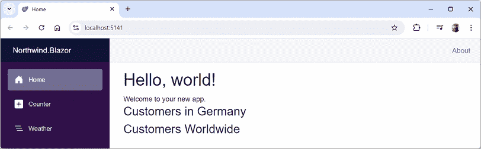

# 14

# 使用 Blazor 构建 Interactive Web 组件

本章是关于使用 Blazor 构建交互式 Web 用户界面组件。你将学习如何构建可以在 Web 服务器或 Web 浏览器中执行其 C# 和 .NET 代码的 Blazor 组件。

当组件在服务器上执行时，Blazor 使用 SignalR 与浏览器中的用户界面进行必要的更新通信。

当组件在浏览器中使用 WebAssembly 执行时，它们必须进行 HTTP 调用来与服务器上的数据进行交互。你将在第十五章“构建和消费 Web 服务”中了解更多关于此内容。

在本章中，我们将涵盖以下主题：

+   检查 Blazor Web App 项目模板

+   使用 Blazor 构建组件

+   使用 EditForm 组件定义表单

# 检查 Blazor Web App 项目模板

在 .NET 8 之前，对于不同的托管模型有单独的项目模板，例如，**Blazor 服务器应用**、**Blazor WebAssembly 应用**和**Blazor WebAssembly 应用（空）**。.NET 8 引入了一个统一的项目模板，命名为**Blazor Web App**，以及一个仅客户端的项目模板，重命名为**Blazor WebAssembly 独立应用**。除非你必须使用较旧的 .NET SDK，否则请避免使用其他遗留项目模板。

## 创建 Blazor Web App 项目

让我们看看 Blazor Web App 项目的默认模板。大多数情况下，你会发现它与 ASP.NET Core Empty 模板相同，只是增加了一些关键功能：

1.  使用你喜欢的代码编辑器打开 `ModernWeb` 解决方案，然后添加一个新项目，如下所示：

    +   项目模板：**Blazor Web App**/ `blazor --interactivity Auto`

    +   解决方案文件和文件夹：`ModernWeb`

    +   项目文件和文件夹：`Northwind.Blazor`

    +   **身份验证类型**：无

    +   **配置 HTTPS**：已选择

    +   **交互式渲染模式**：自动（服务器和 WebAssembly）

    +   **交互性位置**：按页面/组件

    +   **包含示例页面**：已选择

    +   **不要使用顶级语句**：已清除

如果你正在使用 VS Code 或 Rider，请在命令提示符或终端中输入以下命令：`dotnet new blazor --interactivity Auto -o Northwind.Blazor`

**良好实践**：默认的交互式渲染模式是**服务器**。我们明确选择了**自动**，以便在这个项目中可以看到两种渲染模式。我们还选择了包含示例页面，但你可能不会在真实世界的项目中想要这些页面。

1.  注意创建了两个项目：

    +   `Northwind.Blazor`：这是主要的 ASP.NET Core 项目，它定义并运行静态 SSR、流式传输和服务器端 Blazor 组件。它还引用并托管你的客户端 WebAssembly Blazor 组件。

    +   `Northwind.Blazor.Client`：这是一个用于你定义的任何客户端组件的 Blazor WebAssembly 项目。在未来，它可能不需要在单独的项目中，但对于 .NET 8 和 .NET 9，它仍然需要。

1.  在 `ModernWeb` 文件夹中，在 `Directory.Packages.props` 中，添加一个 `<ItemGroup>` 以设置服务器端托管和定义 Blazor WebAssembly 包的版本号，如下所示：

    ```cs
    <ItemGroup Label="For Blazor.">
      <PackageVersion Include=
        "Microsoft.AspNetCore.Components.WebAssembly.Server"
        Version="9.0.0" />
      <PackageVersion Include=
        "Microsoft.AspNetCore.Components.WebAssembly"
        Version="9.0.0" />
    </ItemGroup> 
    ```

1.  在 `Northwind.Blazor.csproj` 中，请注意它与使用 Web SDK 并针对 .NET 9 的 ASP.NET Core 项目相同。注意，它还引用了客户端项目。

1.  在 `Northwind.Blazor.csproj` 中，删除允许此项目托管 WebAssembly 组件的 `Microsoft.AspNetCore.Components.WebAssembly.Server` 包的版本号，如下所示：

    ```cs
    <Project Sdk="Microsoft.NET.Sdk.Web">
      <PropertyGroup>
        <TargetFramework>net9.0</TargetFramework>
        <Nullable>enable</Nullable>
        <ImplicitUsings>enable</ImplicitUsings>
      </PropertyGroup>
      <ItemGroup>
        <ProjectReference Include="..\Northwind.Blazor.Client\Northwind.Blazor.Client.csproj" />
        <PackageReference Include="Microsoft.AspNetCore.Components.WebAssembly.Server" />
      </ItemGroup>
    </Project> 
    ```

1.  在 `Northwind.Blazor.Client.csproj` 中，请注意它与 ASP.NET Core 项目类似，但使用的是 Blazor WebAssembly SDK。

1.  在 `Northwind.Blazor.Client.csproj` 中，删除允许此项目定义 WebAssembly 组件的 `Microsoft.AspNetCore.Components.WebAssembly` 包的版本号，如下所示：

    ```cs
    <Project Sdk="Microsoft.NET.Sdk.BlazorWebAssembly">
      <PropertyGroup>
        <TargetFramework>net9.0</TargetFramework>
        <ImplicitUsings>enable</ImplicitUsings>
        <Nullable>enable</Nullable>
        <NoDefaultLaunchSettingsFile>true</NoDefaultLaunchSettingsFile>
        <StaticWebAssetProjectMode>Default</StaticWebAssetProjectMode>
      </PropertyGroup>
      <ItemGroup>
        <PackageReference Include="Microsoft.AspNetCore.Components.WebAssembly" />
      </ItemGroup>
    </Project> 
    ```

1.  构建 `Northwind.Blazor` 和 `Northwind.Blazor.Client` 项目。

1.  在 `Northwind.Blazor` 中，请注意 `Program.cs` 几乎与 ASP.NET Core 项目相同。一个区别是配置服务的部分，其中调用了 `AddRazorComponents` 方法，这是我们 `Northwind.Web` 项目中有的。此部分还调用以在服务器和客户端上启用交互性，如下所示（代码中高亮显示）：

    ```cs
    using Northwind.Blazor.Client.Pages;
    using Northwind.Blazor.Components;
    var builder = WebApplication.CreateBuilder(args);
    // Add services to the container.
    **builder.Services.AddRazorComponents()**
     **.AddInteractiveServerComponents()**
     **.AddInteractiveWebAssemblyComponents();**
    var app = builder.Build(); 
    ```

1.  还请注意配置 HTTP 管道的部分，它调用 `MapRazorComponents<App>` 方法。这配置了一个名为 `App.razor` 的根应用程序组件，如下所示（代码中高亮显示）：

    ```cs
    // Configure the HTTP request pipeline.
    if (app.Environment.IsDevelopment())
    {
      app.UseWebAssemblyDebugging();
    }
    else
    {
      app.UseExceptionHandler(
        "/Error", createScopeForErrors: true);
      // The default HSTS value is 30 days. You may want to change this for production scenarios, see https://aka.ms/aspnetcore-hsts.
      app.UseHsts();
    }
    app.UseHttpsRedirection();
    app.UseAntiforgery();
    app.MapStaticAssets();
    **app.MapRazorComponents<App>()**
     **.AddInteractiveServerRenderMode()**
     **.AddInteractiveWebAssemblyRenderMode()**
     **.AddAdditionalAssemblies(**
     **typeof(Northwind.Blazor.Client._Imports).Assembly);**
    app.Run(); 
    ```

1.  在 `Northwind.Blazor` 中，请注意 `Components` 文件夹及其子文件夹，如 `Layout` 和 `Pages`，使用与您在启用 Blazor 组件时在 `Northwind.Web` 项目中使用的相同命名约定。

1.  在 `Northwind.Blazor.Client` 的 `Program.cs` 中，请注意它创建了一个 `WebAssemblyHostBuilder` 而不是正常的 `WebApplication` 构建器，如下所示（代码中高亮显示）：

    ```cs
    using Microsoft.AspNetCore.Components.WebAssembly.Hosting;
    var builder = WebAssemblyHostBuilder.CreateDefault(args);
    await builder.Build().RunAsync(); 
    ```

1.  在 `Northwind.Blazor.Client` 中，在 `Pages` 文件夹中，请注意有一个名为 `Counter.razor` 的 Blazor 组件。

## 检查 Blazor 路由、布局和导航

让我们回顾一下这个 Blazor 项目的路由配置、布局和导航菜单：

1.  在 `Northwind.Blazor` 项目的文件夹中，在 `Components` 文件夹中，在 `App.razor` 中，请注意它定义了基本的 HTML 页面标记，引用了本地 Bootstrap 版本进行样式设置，以及一些 Blazor 特定的元素，如下所示（代码中高亮显示）并在标记后的列表中注明：

    ```cs
    <!DOCTYPE html>
    <html lang="en">
    <head>
      <meta charset="utf-8" />
      <meta name="viewport"
            content="width=device-width, initial-scale=1.0 " />
      <base href="/" />
      <link rel="stylesheet"
            href="@Assets["bootstrap/bootstrap.min.css"]" />
      <link rel="stylesheet" href="@Assets["app.css"]" />
      <link rel="stylesheet"
            href="@Assets["Northwind.Blazor.styles.css"]" />
      **<ImportMap />**
      <link rel="icon" type="image/png" href="favicon.png" />
      **<****HeadOutlet** **/>**
    </head>
    <body>
      **<****Routes** **/>**
      **<****script****src****=****"****_framework/blazor.web.js"****></****script****>**
    </body>
    </html> 
    ```

在检查前面的标记时，请注意以下内容：

+   使用 `ComponentBase.Assets` 属性引用资产，该属性解析给定资产的指纹 URL。当您在 `Program.cs` 中使用 `MapStaticAssets` 中间件时，应使用此属性。

+   一个用于表示导入映射元素（`<script type="importmap"></script>`）的`<ImportMap />` Blazor 组件，该元素定义了模块脚本的导入映射。您可以在以下链接中了解导入映射：[`developer.mozilla.org/en-US/docs/Web/HTML/Element/script/type/importmap`](https://developer.mozilla.org/en-US/docs/Web/HTML/Element/script/type/importmap)。

+   一个用于向`<head>`部分注入额外内容的`<HeadOutlet />` Blazor 组件。这是所有 Blazor 项目中可用的一些内置组件之一。例如，在一个 Blazor 页面组件中，使用`<PageTitle>`组件来设置网页的`<title>`。

+   一个用于定义本项目自定义路由的`<Routes />` Blazor 组件。由于该组件是当前项目的一部分，因此它可以被开发者完全自定义，其文件名为`Routes.razor`。

+   一个用于管理 Blazor 动态功能（如后台下载 WebAssembly 组件并在之后从服务器端到客户端组件执行切换）与服务器通信的`blazor.web.js`脚本块。

1.  在`Components`文件夹中的`Routes.razor`文件中，请注意一个`<Router>`组件可以启用当前项目 assembly 或`Northwind.Blazor.Client`项目 assembly（对于 WebAssembly 组件）中找到的所有 Blazor 组件的路由。如果找到匹配的路由，则执行`RouteView`，这将设置组件的默认布局为`MainLayout`并将任何路由数据参数传递给组件。对于该组件，第一个`<h1>`元素将被聚焦，如下面的代码所示：

    ```cs
    <Router AppAssembly="@typeof(Program).Assembly"
      AdditionalAssemblies="new[] {
        typeof(Client._Imports).Assembly }">
      <Found Context="routeData">
        <RouteView RouteData="@routeData"
                   DefaultLayout="@typeof(Layout.MainLayout)" />
        <FocusOnNavigate RouteData="@routeData" Selector="h1" />
      </Found>
    </Router> 
    ```

1.  在`Components`文件夹中的`_Imports.razor`文件中，请注意该文件导入了一些在所有自定义 Blazor 组件中使用的有用命名空间，如下面的代码所示：

    ```cs
    @using System.Net.Http
    @using System.Net.Http.Json
    @using Microsoft.AspNetCore.Components.Forms
    @using Microsoft.AspNetCore.Components.Routing
    @using Microsoft.AspNetCore.Components.Web
    @using static Microsoft.AspNetCore.Components.Web.RenderMode
    @using Microsoft.AspNetCore.Components.Web.Virtualization
    @using Microsoft.JSInterop
    @using Northwind.Blazor
    @using Northwind.Blazor.Client
    @using Northwind.Blazor.Components 
    ```

1.  在`Components\Layout`文件夹中的`MainLayout.razor`文件中，请注意它定义了包含由本项目中的`NavMenu.razor`组件文件实现的导航菜单的侧边栏`<div>`，以及用于内容的 HTML5 元素如`<main>`和`<article>`，还有一个`<div>`用于显示未处理的错误，如下面的代码所示：

    ```cs
    @inherits LayoutComponentBase
    <div class="page">
      <div class="sidebar">
        <NavMenu />
      </div>
      <main>
        <div class="top-row px-4">
          <a href="https://learn.microsoft.com/aspnet/core/"
             target="_blank">About</a>
        </div>
        <article class="content px-4">
          @Body
        </article>
      </main>
    </div>
    <div id="blazor-error-ui" data-nosnippet>
        An unhandled error has occurred.
        <a href="." class="reload">Reload</a>
        <span class="dismiss"></span>
    </div> 
    ```

1.  在`Components\Layout`文件夹中的`MainLayout.razor.css`文件中，请注意它包含针对组件的独立 CSS 样式。由于命名约定，在此文件中定义的样式优先于其他可能影响组件的样式。

Blazor 组件通常需要提供自己的 CSS 以应用样式或 JavaScript 以执行纯 C#无法执行的活动，如访问浏览器 API。为了确保这不会与站点级别的 CSS 和 JavaScript 冲突，Blazor 支持 CSS 和 JavaScript 隔离。如果您有一个名为`Home.razor`的组件，只需创建一个名为`Home.razor.css`的 CSS 文件。在此文件中定义的样式将覆盖项目中定义的任何其他样式。

1.  在 `Components\Layout` 文件夹中，在 `NavMenu.razor` 文件中，请注意，它有三个菜单项，**首页**、**计数器**和**天气**。这些菜单链接是通过使用名为 `NavLink` 的组件创建的，如下面的标记所示：

    ```cs
    <div class="top-row ps-3 navbar navbar-dark">
      <div class="container-fluid">
        <a class="navbar-brand" href="">Northwind.Blazor</a>
      </div>
    </div>
    <input type="checkbox" title="Navigation menu"
           class="navbar-toggler" />
    <div class="nav-scrollable" onclick=
         "document.querySelector('.navbar-toggler').click()">
      <nav class="flex-column">
        <div class="nav-item px-3">
          <NavLink class="nav-link" href=""
                   Match="NavLinkMatch.All">
            <span class="bi bi-house-door-fill-nav-menu"
                  aria-hidden="true"></span> Home
          </NavLink>
        </div>
        <div class="nav-item px-3">
          <NavLink class="nav-link" href="counter">
            <span class="bi bi-plus-square-fill-nav-menu"
                  aria-hidden="true"></span> Counter
          </NavLink>
        </div>
        <div class="nav-item px-3">
          <NavLink class="nav-link" href="weather">
            <span class="bi bi-list-nested-nav-menu"
                  aria-hidden="true"></span> Weather
          </NavLink>
        </div>
      </nav>
    </div> 
    ```

1.  注意，`NavMenu.razor` 有它自己的独立样式表，名为 `NavMenu.razor.css`。

1.  在 `Components\Pages` 文件夹中，在 `Home.razor` 文件中，请注意，它定义了一个设置页面标题的组件，然后渲染一个标题和一个欢迎信息，如下面的代码所示：

    ```cs
    @page "/"
    <PageTitle>Home</PageTitle>
    <h1>Hello, world!</h1>
    Welcome to your new app. 
    ```

1.  在 `Components\Pages` 文件夹中，在 `Weather.razor` 文件中，请注意，它定义了一个组件，该组件从注入的依赖项天气服务获取天气预报，然后在一个表格中渲染它们，如下面的代码所示：

    ```cs
    @page "/weather"
    @attribute [StreamRendering]
    <PageTitle>Weather</PageTitle>

    <h1>Weather</h1>
    <p>This component demonstrates showing data.</p>
    @if (forecasts == null)
    {
      <p><em>Loading...</em></p>
    }
    else
    {
      <table class="table">
        <thead>
          <tr>
            <th>Date</th>
            <th>Temp. (C)</th>
            <th>Temp. (F)</th>
            <th>Summary</th>
          </tr>
        </thead>
        <tbody>
        @foreach (var forecast in forecasts)
        {
          <tr>
            <td>@forecast.Date.ToShortDateString()</td>
            <td>@forecast.TemperatureC</td>
            <td>@forecast.TemperatureF</td>
            <td>@forecast.Summary</td>
           </tr>
        }
        </tbody>
      </table>
    }
    @code {
      private WeatherForecast[]? forecasts;
      protected override async Task OnInitializedAsync()
      {
        // Simulate asynchronous loading to demonstrate streaming rendering
        await Task.Delay(500);
        var startDate = DateOnly.FromDateTime(DateTime.Now);
        var summaries = new[] { "Freezing", "Bracing", "Chilly", "Cool",
          "Mild", "Warm", "Balmy", "Hot", "Sweltering", "Scorching" };
        forecasts = Enumerable.Range(1, 5).Select(index =>
          new WeatherForecast
          {
            Date = startDate.AddDays(index),
            TemperatureC = Random.Shared.Next(-20, 55),
            Summary = summaries[Random.Shared.Next(summaries.Length)]
          }).ToArray();
      }
      private class WeatherForecast
      {
        public DateOnly Date { get; set; }
        public int TemperatureC { get; set; }
        public string? Summary { get; set; }
        public int TemperatureF => 32 + (int)(TemperatureC / 0.5556);
      }
    } 
    ```

1.  在 `Northwind.Blazor.Client` 项目中，在 `Pages` 文件夹下，在 `Counter.razor` 文件中，请注意，一个 Blazor 页面组件被定义为具有 `/counter` 路由，一个会在服务器和 WebAssembly 之间自动切换的渲染模式，它有一个名为 `currentCount` 的私有字段，每次按钮点击时都会增加，如下面的标记所示：

    ```cs
    @page "/counter"
    @rendermode InteractiveAuto
    <PageTitle>Counter</PageTitle>
    <h1>Counter</h1>
    <p role="status">Current count: @currentCount</p>
    <button class="btn btn-primary"
      @onclick="IncrementCount">Click me</button>
    @code {
      private int currentCount = 0;
      private void IncrementCount()
      {
        currentCount++;
      }
    } 
    ```

## 如何定义一个可路由的页面组件

要创建一个可路由的页面组件，将 `@page` 指令添加到组件的 `.razor` 文件顶部，如下面的标记所示：

```cs
@page "/customers" 
```

前面的代码相当于 `Program.cs` 中的映射端点，如下面的代码所示：

```cs
app.MapGet("/customers", () => ...); 
```

页面组件可以有多个 `@page` 指令来注册多个路由，如下面的代码所示：

```cs
@page "/weather"
@page "/forecast" 
```

`Router` 组件在其 `AppAssembly` 参数中特别扫描程序集，以查找带有 `@page` 指令的 Blazor 组件，并将它们的 URL 路径注册为端点。

在运行时，页面组件与您在 `Routes.razor` 文件 `<RouteView>` 组件中指定的任何特定布局合并。默认情况下，Blazor Web App 项目模板将 `MainLayout.razor` 定义为页面组件的布局。

**良好实践**：按照惯例，将可路由页面 Blazor 组件放在 `Components\Pages` 文件夹中。

## 如何导航路由并传递路由参数

微软提供了一个名为 `NavigationManager` 的依赖服务，它理解 Blazor 路由和 `NavLink` 组件。`NavigateTo` 方法用于跳转到指定的 URL。

Blazor 路由可以包括不区分大小写的命名参数，并且您可以通过将参数绑定到代码块中的属性来最轻松地访问传递的值，使用 `[Parameter]` 属性，如下面的标记所示：

```cs
@page "/customers/{country}"
<div>Country parameter as the value: @Country</div>
@code {
  [Parameter]
  public string Country { get; set; }
} 
```

处理缺失时应具有默认值的参数的推荐方法是给参数后缀添加 `?` 并在 `OnParametersSet` 方法中使用空合并运算符，如下面的标记所示：

```cs
@page "/customers/{country?}"
<div>Country parameter as the value: @Country</div>
@code {
  [Parameter]
  public string Country { get; set; }
  protected override void OnParametersSet()
  {
    // If the automatically set property is null, then
    // set its value to USA.
    Country = Country ?? "USA";
  }
} 
```

## 如何使用带有路由的导航链接组件

在 HTML 中，您使用 `<a>` 元素来定义导航链接，如下面的标记所示：

```cs
<a href="/customers">Customers</a> 
```

在 Blazor 中，使用 `<NavLink>` 组件，如下面的标记所示：

```cs
<NavLink href="/customers">Customers</NavLink> 
```

`NavLink`组件比锚点元素更好，因为它会自动将其类设置为`active`，如果其`href`与当前位置 URL 匹配。如果您的 CSS 使用不同的类名，则可以在`NavLink.ActiveClass`属性中设置该类名。

默认情况下，在匹配算法中，`href`是一个路径*前缀*，因此如果`NavLink`的`href`为`/customers`，如前面的代码示例所示，那么它会匹配以下所有路径并将它们都设置为具有`active`类样式：

```cs
/customers
/customers/USA
/customers/Germany/Berlin 
```

为了确保匹配算法只对路径中的*所有*文本执行匹配（换句话说，只有当整个完整文本匹配时才进行匹配，而不是路径的一部分匹配），请将`Match`参数设置为`NavLinkMatch.All`，如下面的代码所示：

```cs
<NavLink href="/customers" Match="NavLinkMatch.All">Customers</NavLink> 
```

如果您设置了其他属性，例如`target`，它们将被传递到生成的底层`<a>`元素。

## 理解基组件类

`OnParametersSet`方法是由默认继承自组件的基类`ComponentBase`定义的，如下面的代码所示：

```cs
using Microsoft.AspNetCore.Components;
public abstract class ComponentBase
  : IComponent, IHandleAfterRender, IHandleEvent
{
  // Members not shown.
} 
```

`ComponentBase`有一些有用的方法，您可以在其中调用并覆盖，如下表*14.1*所示：

| **方法** | **描述** |
| --- | --- |
| `InvokeAsync` | 调用此方法以在关联渲染器的同步上下文中执行函数。 |
| `OnAfterRender`,`OnAfterRenderAsync` | 覆盖这些方法以在每次组件被渲染后调用代码。 |
| `OnInitialized`,`OnInitializedAsync` | 覆盖这些方法以在组件从其渲染树中的父组件接收初始参数后调用代码。 |
| `OnParametersSet`,`OnParametersSetAsync` | 覆盖这些方法以在组件接收参数并将值分配给属性后调用代码。 |
| `ShouldRender` | 覆盖此方法以指示组件是否应该渲染。 |
| `StateHasChanged` | 调用此方法以使组件重新渲染。 |

表 14.1：在 ComponentBase 中覆盖的有用方法

正如你在*第十三章*中看到的，*使用 ASP.NET Core 构建网站*，Blazor 组件可以有共享布局。您将创建一个`.razor`组件文件，并使其显式继承自`LayoutComponentBase`，如下面的标记所示：

```cs
@inherits LayoutComponentBase
<div>
  ...
  @Body
  ...
</div> 
```

基类有一个名为`Body`的属性，您可以在布局的适当位置在标记中渲染。

您可以在`App.razor`文件及其`Router`组件中为组件设置默认布局。要为组件显式设置布局，请使用`@layout`指令，如下面的标记所示：

```cs
@page "/customers"
@layout AlternativeLayout
<div>
  ...
</div> 
```

## 运行 Blazor Web App 项目模板

现在我们已经审查了项目模板以及特定于 Blazor 服务器的关键部分，我们可以启动网站并审查其行为：

1.  在 `Northwind.Blazor` 项目中，在 `Properties` 文件夹中，在 `launchSettings.json` 文件中，对于 `https` 配置文件，修改 `applicationUrl` 以使用端口 `5141` 进行 HTTPS 和端口 `5140` 进行 HTTP，如下所示，高亮显示的以下标记：

    ```cs
    "applicationUrl": "https://localhost:**5141**;http://localhost:**5140**", 
    ```

1.  使用 `https` 启动配置启动 `Northwind.Blazor` 项目。

1.  启动 Chrome 并导航到 `https://localhost:5141/`。

1.  在左侧导航菜单中，点击 **Weather**，然后点击 **Click me** 按钮 three 次，并注意标签显示 **3**，如图 *图 14.1* 所示：


图 14.1：使用 WebAssembly 的 Blazor 计数器组件

1.  在左侧导航菜单中，点击 **Weather**，并注意在半秒钟内，出现一个 **Loading…** 消息，然后它被一个包含五个随机天气预报的表格所取代，如图 *图 14.2* 所示：


图 14.2：使用流将天气数据提取到 Blazor Web App 中

1.  关闭 Chrome 并关闭 web 服务器。

现在，您已经审查了 Blazor Web App 项目模板中的示例 Blazor 组件，让我们深入挖掘并构建我们自己的组件。

# 使用 Blazor 构建组件

在本节中，我们将构建一个组件来列出、创建和编辑 Northwind 数据库中的客户。

我们将分几个步骤来完成它：

1.  创建一个 Blazor 组件，用于渲染设置为参数的国家名称。

1.  使其既能作为可路由页面，也能作为组件工作。

1.  在数据库中实现执行 **CRUD**（**创建**、**读取**、**更新** 和 **删除**）操作的功能。

## 定义和测试一个简单的 Blazor 组件

我们将添加新的组件到现有的 Blazor Web App 项目中：

1.  在 `Northwind.Blazor` 项目中，在 `Components\Pages` 文件夹中，添加一个名为 `Customers.razor` 的新文件。在 Visual Studio 中，项目项模板命名为 **Razor Component**。在 Rider 中，项目项模板命名为 **Blazor Component**。

**良好实践**：请记住，Blazor 组件文件名必须以大写字母开头；否则，您将遇到编译错误！

1.  添加语句以输出 `Customers` 组件的标题，并定义一个代码块来存储国家名称，如下所示，高亮显示的以下标记：

    ```cs
    <h3>
      Customers **@(string.IsNullOrWhiteSpace(Country)**
     **? "Worldwide" : "in " + Country)**
    </h3>
    @code {
     **[Parameter]**
     **public string? Country { get; set; }**
    } 
    ```

`@code` 块可以放在文件的任何位置。一些开发者喜欢将其放在顶部，这样在编写下面的标记时，其中定义的任何属性都可用，并且可以更容易地引用它们。

1.  在 `Components\Pages` 文件夹中的 `Home.razor` 文件中，将语句添加到文件底部以实例化 `Customers` 组件两次，一次将 `Germany` 设置为 `Country` 参数，一次不设置国家，如下所示，以下标记：

    ```cs
    <Customers Country="Germany" />
    <Customers /> 
    ```

1.  使用 `https` 启动配置启动 `Northwind.Blazor` 项目。

1.  启动 Chrome，导航到 `https://localhost:5141/`，并注意 `Customers` 组件，如图 *图 14.3* 所示：



图 14.3：设置国家参数为德国和不设置的客户组件

1.  关闭 Chrome 并关闭 Web 服务器。

## 使用 Bootstrap 图标

在较旧的.NET 7 及更早版本的 Blazor 项目模板中，它们包含了所有 Bootstrap 图标。在.NET 8 及更高版本的新的项目模板中，只定义了三个使用 SVG 的图标。让我们看看 Blazor 团队是如何定义这些图标的，然后我们将添加一些供我们使用的图标：

1.  在`Components\Layout`文件夹中，在`NavMenu.razor.css`文件中，找到文本`bi-house`，并注意使用 SVG 定义的三个图标，部分如下面的代码所示：

    ```cs
    .bi-house-door-fill-nav-menu {
        background-image: url("data:image/svg+xml,...");
    }
    .bi-plus-square-fill-nav-menu {
        background-image: url("data:image/svg+xml,...");
    }
    .bi-list-nested-nav-menu {
        background-image: url("data:image/svg+xml,...");
    } 
    ```

1.  在您喜欢的浏览器中，导航到[`icon-sets.iconify.design/bi/`](https://icon-sets.iconify.design/bi/)，并注意**Bootstrap Icons**拥有 MIT 许可证，包含超过 2,000 个图标。

1.  在网页上有两个输入框，一个标记为**搜索图标**，另一个标记为**过滤图标**。在**过滤图标**框中输入`globe`，并注意找到了六个地球仪图标。

1.  点击第一个地球仪，在**CSS**部分，点击**CSS**按钮，并注意您可以通过点击**复制到剪贴板**按钮来复制并粘贴此图标的定义以用于 CSS 样式表；然而，您不需要这样做，因为我已经为您创建了一个 CSS 文件，其中定义了五个图标，您可以在 Blazor 项目中使用。

1.  在您喜欢的浏览器中，导航到[`github.com/markjprice/cs13net9/blob/main/code/ModernWeb/Northwind.Blazor/Northwind.Blazor/wwwroot/icons.css`](https://github.com/markjprice/cs13net9/blob/main/code/ModernWeb/Northwind.Blazor/Northwind.Blazor/wwwroot/icons.css)，下载文件，并将其保存在您自己的项目的`wwwroot`文件夹中。

1.  在`Components`文件夹中，在`App.razor`组件中，在`<head>`部分，添加一个`<link>`元素来引用`icons.css`样式表，如下面的标记所示：

    ```cs
    <link rel="stylesheet" href="@Assets["icons.css"]" /> 
    ```

1.  保存并关闭文件。

## 将组件转换为可路由页面组件

将此组件转换为具有国家路由参数的可路由页面组件很简单：

1.  在`Components\Pages`文件夹中，在`Customers.razor`组件中，在文件顶部添加一个语句将`/customers`注册为其路由，并带有可选的`country`路由参数，如下面的标记所示：

    ```cs
    @page "/customers/{country?}" 
    ```

1.  在`Components\Layout`文件夹中，在`NavMenu.razor`文件中，在现有列表项元素底部，添加两个列表项元素用于我们的可路由页面组件，显示全球和德国的客户，两者都使用人的图标，如下面的标记所示：

    ```cs
    <div class="nav-item px-3">
      <NavLink class="nav-link" href="customers"
               Match="NavLinkMatch.All">
        <span class="bi bi-globe" aria-hidden="true"></span>
        Customers Worldwide
      </NavLink>
    </div>
    <div class="nav-item px-3">
      <NavLink class="nav-link" href="customers/Germany">
        <span class="bi bi-globe-europe-africa"
              aria-hidden="true"></span>
        Customers in Germany
      </NavLink>
    </div> 
    ```

1.  在`Components\Pages`文件夹中，在`Home.razor`文件中，删除两个`<Customers>`组件，因为我们现在可以使用它们的导航菜单项来测试它们，并且我们希望将主页保持尽可能简单。

1.  使用`https`启动配置文件启动`Northwind.Blazor`项目。

1.  启动 Chrome 并导航到`https://localhost:5141/`。

1.  在左侧导航菜单中，点击 **德国的客户**。注意国家名称已正确传递到页面组件，并且该组件使用与其他页面组件相同的布局，如 `Home.razor`。还要注意 URL，[`localhost:5141/customers/Germany`](https://localhost:5141/customers/Germany)，如图 14.4 所示：


图 14.4：德国的客户

1.  关闭 Chrome 并关闭 web 服务器。

## 将实体引入 Blazor 组件

现在您已经看到了 Blazor 页面组件的最小实现，我们可以向其中添加一些有用的功能。在这种情况下，我们将使用 Northwind 数据库上下文从数据库中获取客户：

1.  在 `Northwind.Blazor.csproj` 中，添加对 SQL Server 或 SQLite 的 Northwind 数据库上下文项目的引用，并全局导入命名空间以处理 Northwind 实体，如下面标记所示：

    ```cs
    <ItemGroup>
      <!-- change Sqlite to SqlServer if you prefer -->
      <ProjectReference Include="..\..\Northwind.DataContext.Sqlite
    \Northwind.DataContext.Sqlite.csproj" />
    </ItemGroup>
    <ItemGroup>
      <Using Include="Northwind.EntityModels" />
    </ItemGroup> 
    ```

    **警告！** 数据上下文项目相对于当前项目向上两个目录，因此我们必须使用 `..\..\`。

1.  构建 `Northwind.Blazor` 项目。

1.  在 `Program.cs` 文件中，在调用 `Build` 之前，向依赖服务集合中添加一个语句以注册 Northwind 数据库上下文，如下面的代码所示：

    ```cs
    builder.Services.AddNorthwindContext(
      relativePath: @"..\.."); 
    ```

我们需要显式设置 `relativePath`，因为 `Northwind.db` 文件位于 `ModernWeb` 文件夹中，而项目运行在 `ModernWeb\Northwind.Blazor\Northwind.Blazor` 文件夹中。

## 为 Blazor 组件抽象服务

我们可以实现 Blazor 组件，使其直接调用 Northwind 数据库上下文以使用实体模型获取客户。如果 Blazor 组件在服务器上执行，这将有效。然而，如果组件在浏览器中使用 WebAssembly 运行，则不会有效。

现在我们将创建一个本地依赖服务，以实现组件的更好重用：

1.  使用您首选的编码工具添加一个新项目，如下面列表中定义的：

    +   项目模板：**类库** / `classlib`

    +   项目文件和文件夹：`Northwind.Blazor.Services`

    +   解决方案文件和文件夹：`ModernWeb`

1.  在 `Northwind.Blazor.Services.csproj` 项目文件中，添加对 Northwind 实体模型库的项目引用，如下面标记所示：

    ```cs
    <ItemGroup>
      <!-- change Sqlite to SqlServer if you prefer -->
      <ProjectReference Include="..\Northwind.EntityModels.Sqlite\
    Northwind.EntityModels.Sqlite.csproj" />
    </ItemGroup> 
    ```

1.  构建 `Northwind.Blazor.Services` 项目。

1.  在 `Northwind.Blazor.Services` 项目中，将 `Class1.cs` 重命名为 `INorthwindService.cs`。

1.  在 `INorthwindService.cs` 文件中，定义一个本地服务的契约，该服务抽象了 CRUD 操作，如下面的代码所示：

    ```cs
    using Northwind.EntityModels; // To use Customer.
    namespace Northwind.Blazor.Services;
    public interface INorthwindService
    {
      Task<List<Customer>> GetCustomersAsync();
      Task<List<Customer>> GetCustomersAsync(string country);
      Task<Customer?> GetCustomerAsync(string id);
      Task<Customer> CreateCustomerAsync(Customer c);
      Task<Customer> UpdateCustomerAsync(Customer c);
      Task DeleteCustomerAsync(string id);
    } 
    ```

1.  在 `Northwind.Blazor.csproj` 项目文件中，添加对服务类库的项目引用，如下面高亮显示的标记所示：

    ```cs
    <ItemGroup>
      <!-- change Sqlite to SqlServer if you prefer -->
      <ProjectReference Include="..\Northwind.DataContext.Sqlite
    \Northwind.DataContext.Sqlite.csproj" />
    **<****ProjectReference****Include****=****"****..\..\Northwind.Blazor.Services\**
    **Northwind.Blazor.Services.csproj"** **/>**
    </ItemGroup> 
    ```

1.  构建 `Northwind.Blazor` 项目。

1.  在 `Northwind.Blazor` 项目中，添加一个名为 `Services` 的新文件夹。

1.  在 `Services` 文件夹中，添加一个名为 `NorthwindServiceServerSide.cs` 的新文件，并修改其内容以使用 Northwind 数据库上下文实现 `INorthwindService` 接口，如下面的代码所示：

    ```cs
    using Microsoft.EntityFrameworkCore; // To use ToListAsync<T>.
    namespace Northwind.Blazor.Services;
    public class NorthwindServiceServerSide : INorthwindService
    {
      private readonly NorthwindContext _db;
      public NorthwindServiceServerSide(NorthwindContext db)
      {
        _db = db;
      }
      public Task<List<Customer>> GetCustomersAsync()
      {
        return _db.Customers.ToListAsync();
      }
      public Task<List<Customer>> GetCustomersAsync(string country)
      {
        return _db.Customers.Where(c => c.Country == country).ToListAsync();
      }
      public Task<Customer?> GetCustomerAsync(string id)
      {
        return _db.Customers.FirstOrDefaultAsync
          (c => c.CustomerId == id);
      }
      public Task<Customer> CreateCustomerAsync(Customer c)
      {
        _db.Customers.Add(c);
        _db.SaveChangesAsync();
        return Task.FromResult(c);
      }
      public Task<Customer> UpdateCustomerAsync(Customer c)
      {
        _db.Entry(c).State = EntityState.Modified;
        _db.SaveChangesAsync();
        return Task.FromResult(c);
      }
      public Task DeleteCustomerAsync(string id)
      {
        Customer? customer = _db.Customers.FirstOrDefaultAsync
          (c => c.CustomerId == id).Result;
        if (customer == null)
        {
          return Task.CompletedTask;
        }
        else
        {
          _db.Customers.Remove(customer);
          return _db.SaveChangesAsync();
        }
      }
    } 
    ```

1.  在 `Program.cs` 中，导入我们服务的命名空间，如下面的代码所示：

    ```cs
    using Northwind.Blazor.Services; // To use INorthwindService. 
    ```

1.  在 `Program.cs` 文件中，在调用 `Build` 之前，添加一条语句将 `NorthwindServiceServerSide` 注册为实现 `INorthwindService` 接口的一个瞬态服务，如下面的代码所示：

    ```cs
    builder.Services.AddTransient<INorthwindService,
      NorthwindServiceServerSide>(); 
    ```

瞬态服务是指为每个请求创建一个新实例的服务。您可以在以下链接中了解更多关于服务不同生命周期的信息：[`learn.microsoft.com/en-us/dotnet/core/extensions/dependency-injection#service-lifetimes`](https://learn.microsoft.com/en-us/dotnet/core/extensions/dependency-injection#service-lifetimes)。

1.  在 `Components` 文件夹中的 `_Imports.razor` 文件中，导入用于处理 Northwind 实体和我们的服务的命名空间，以便我们构建的 Blazor 组件不需要单独导入命名空间，如下面的标记所示：

    ```cs
    @using Northwind.Blazor.Services @* To use INorthwindService. *@
    @using Northwind.EntityModels @* To use Northwind entities. *@ 
    ```

`_Imports.razor` 文件仅适用于 `.razor` 文件。如果您使用代码背后的 `.cs` 文件来实现组件代码，那么它们必须单独导入命名空间或使用全局 `using` 语句隐式导入命名空间。

1.  在 `Components\Pages` 文件夹中的 `Customers.razor` 文件中，添加注入服务的语句，然后使用它通过同步数据库操作输出所有客户的表格，如下面高亮显示的代码所示：

    ```cs
    @page "/customers/{country?}"
    **@inject INorthwindService _service**
    <h3>
      Customers @(string.IsNullOrWhiteSpace(Country)
        ? "Worldwide" : "in " + Country)
    </h3>
    **@if (customers is null)**
    **{**
    **<****p****><****em****>****Loading...****</****em****></****p****>**
    **}**
    **else**
    **{**
    **<****table****class****=****"table"****>**
    **<****thead****>**
    **<****tr****>**
    **<****th****>****Id****</****th****>**
    **<****th****>****Company Name****</****th****>**
    **<****th****>****Address****</****th****>**
    **<****th****>****Phone****</****th****>**
    **<****th****></****th****>**
    **</****tr****>**
    **</****thead****>**
    **<****tbody****>**
     **@foreach (Customer c in customers)**
     **{**
    **<****tr****>**
    **<****td****>****@c.CustomerId****</****td****>**
    **<****td****>****@c.CompanyName****</****td****>**
    **<****td****>**
     **@c.Address****<****br****/>**
     **@c.City****<****br****/>**
     **@c.PostalCode****<****br****/>**
     **@c.Country**
    **</****td****>**
    **<****td****>****@c.Phone****</****td****>**
    **<****td****>**
    **<****a****class****=****"btn btn-info"****href****=****"editcustomer/@c.CustomerId"****>**
    **<****i****class****=****"****bi bi-pencil"****></****i****></****a****>**
    **<****a****class****=****"btn btn-danger"**
    **href****=****"deletecustomer/@c.CustomerId"****>**
    **<****i****class****=****"bi bi-trash"****></****i****></****a****>**
    **</****td****>**
    **</****tr****>**
     **}**
    **</****tbody****>**
    **</****table****>**
    **}**
    @code {
      [Parameter]
      public string? Country { get; set; }
     **private IEnumerable****<****Customer****>****? customers;**
     **protected override async Task OnParametersSetAsync()**
     **{**
     **if (string.IsNullOrWhiteSpace(Country))**
     **{**
     **customers = await _service.GetCustomersAsync();**
     **}**
     **else**
     **{**
     **customers = await _service.GetCustomersAsync(Country);**
     **}**
     **}**
    } 
    ```

1.  使用 `https` 启动配置启动 `Northwind.Blazor` 项目。

1.  启动 Chrome 并导航到 `https://localhost:5141/`。

1.  在左侧导航菜单中，点击 **Customers in Germany**，并注意客户表从数据库加载并在网页中渲染，如图 *14.5* 所示：

![图片 B22322_14_05.png]

图 14.5：德国客户列表

1.  在浏览器地址栏中，将 `Germany` 改为 `UK`，并注意客户表已筛选，仅显示 UK 客户。

1.  在左侧导航菜单中，点击 **Customers Worldwide**，注意客户表未按国家进行筛选。

1.  点击任何编辑或删除按钮，并注意它们返回一个消息说 **错误：404**，因为我们还没有实现该功能。同时，注意编辑由五位字符标识符 `ALFKI` 确定的客户链接，如下面的链接所示：`https://localhost:5141/editcustomer/ALFKI`。

1.  关闭 Chrome 并关闭 web 服务器。

## 启用流式渲染

现在，让我们通过在页面向访客显示后改进客户表的渲染。我们已经在使用异步操作来获取数据，但这个操作必须在将网页响应发送回浏览器之前完成。这就是为什么我们从未在页面上看到**加载中…**消息。要看到它，我们必须启用流式渲染。但是，如果您从本地数据库获取数据，它可能仍然发生得太快。因此，为了确保我们能看到它，我们还将通过添加延迟来减慢数据的获取：

1.  在`Components\Pages`文件夹中，在`Customers.razor`的顶部添加一个属性以启用流式渲染，如下面的代码所示：

    ```cs
    @attribute [StreamRendering] 
    ```

1.  在`Customers.razor`中，在`OnParametersSetAsync`方法中添加一个语句以异步延迟一秒，如下面的代码所示：

    ```cs
    protected override async Task OnParametersSetAsync()
    {
      **await** **Task.Delay(****1000****);** **// Delay for one second.**
      ...
    } 
    ```

1.  使用`https`启动配置启动`Northwind.Blazor`项目。

1.  启动 Chrome 并导航到`https://localhost:5141/`。

1.  在左侧导航菜单中，点击**德国的客户**，并注意**加载中…**消息出现一秒后，然后被客户表替换。

到目前为止，该组件只提供了一个只读的客户表。现在，我们将通过添加完整的 CRUD 操作来扩展它。

# 使用 EditForm 组件定义表单

微软提供了现成的组件来构建表单。我们将使用它们为客户提供创建、编辑和删除功能。

微软提供了`EditForm`组件以及几个表单元素，例如`InputText`，以简化使用 Blazor 表单的过程。

`EditForm`可以设置一个模型以将其绑定到一个具有属性和自定义验证事件处理器的对象，以及识别模型类上的标准 Microsoft 验证属性，如下面的代码所示：

```cs
<EditForm Model="@customer" OnSubmit="ExtraValidation">
  <DataAnnotationsValidator />
  <ValidationSummary />
  <InputText id="name" @bind-Value="customer.CompanyName" />
  <button type="submit">Submit</button>
</EditForm>
@code {
  private Customer customer = new();
  private void ExtraValidation()
  {
    // Perform any extra validation you want.
  }
} 
```

作为`ValidationSummary`组件的替代方案，您可以使用`ValidationMessage`组件在单个表单元素旁边显示消息。要将验证消息绑定到一个属性，您使用 lambda 表达式来选择该属性，如下面的代码所示：

```cs
<ValidationMessage For="@(() => Customer.CompanyName)" /> 
```

## 构建客户详情组件

我们将创建一个组件来显示客户的详细信息。这只是一个组件，而不是页面，因此它不会有`@page`指令：

1.  在`Northwind.Blazor`项目中，在`Components`文件夹中创建一个名为`CustomerDetail.razor`的新文件。（Visual Studio 项目项模板命名为**Razor 组件**；Rider 项目项模板命名为**Blazor 组件**。）

1.  修改其内容以定义一个用于编辑客户属性的表单，如下面的标记所示：

    ```cs
    <EditForm Model="@Customer" OnValidSubmit="@OnValidSubmit">
      <DataAnnotationsValidator />
      <div>
        <label class="form-label">Customer Id</label>
        <div>
          <InputText class="form-control"
                     @bind-Value="@Customer.CustomerId" />
          <ValidationMessage For="@(() => Customer.CustomerId)" />
        </div>
      </div>
      <div>
        <label class="form-label">Company Name</label>
        <div>
          <InputText class="form-control"
                     @bind-Value="@Customer.CompanyName" />
          <ValidationMessage For="@(() => Customer.CompanyName)" />
        </div>
      </div>
      <div>
        <label class="form-label">Address</label>
        <div>
          <InputText class="form-control"
                     @bind-Value="@Customer.Address" />
          <ValidationMessage For="@(() => Customer.Address)" />
        </div>
      </div>
      <div>
        <label class="form-label">Country</label>
        <div>
          <InputText class="form-control"
                     @bind-Value="@Customer.Country" />
          <ValidationMessage For="@(() => Customer.Country)" />
        </div>
      </div>
      <button type="submit" class="btn btn-@ButtonStyle">
        @ButtonText
      </button>
    </EditForm>
    @code {
      [Parameter]
      public Customer Customer { get; set; } = null!;
      [Parameter]
      public string ButtonText { get; set; } = "Save Changes";
      [Parameter]
      public string ButtonStyle { get; set; } = "info";
      [Parameter]
      public EventCallback OnValidSubmit { get; set; }
    } 
    ```

## 构建客户创建、编辑和删除组件

现在，我们可以创建三个可路由的页面组件，它们使用该组件：

1.  在`Components\Pages`文件夹中创建一个名为`CreateCustomer.razor`的新文件。

1.  在`CreateCustomer.razor`中，修改其内容以使用客户详情组件来创建新客户，如下面的代码所示：

    ```cs
    @rendermode RenderMode.InteractiveServer
    @page "/createcustomer"
    @inject INorthwindService _service
    @inject NavigationManager _navigation
    <h3>Create Customer</h3>
    <CustomerDetail ButtonText="Create Customer"
                    Customer="@customer"
                    OnValidSubmit="@Create" />
    @code {
      private Customer customer = new();
      private async Task Create()
      {
        await _service.CreateCustomerAsync(customer);
        _navigation.NavigateTo("customers");
      }
    } 
    ```

1.  在`Components\Pages`文件夹中，在`Customers.razor`中，在`<h3>`元素之后添加一个包含按钮的`<div>`元素，用于导航到创建客户页面组件，如下面的标记所示：

    ```cs
    <div>
      <a class="btn btn-info" href="createcustomer">
      <i class="bi bi-plus-square"></i> Create New</a>
    </div> 
    ```

1.  在`Components\Pages`文件夹中，创建一个名为`EditCustomer.razor`的新文件，并修改其内容以使用客户详情组件来编辑并保存现有客户的更改，如下面的代码所示：

    ```cs
    @rendermode RenderMode.InteractiveServer
    @page "/editcustomer/{customerid}"
    @inject INorthwindService _service
    @inject NavigationManager _navigation
    <h3>Edit Customer</h3>
    <CustomerDetail ButtonText="Update"
                    Customer="@customer"
                    OnValidSubmit="@Update" />
    @code {
      [Parameter]
      public string CustomerId { get; set; } = null!;
      private Customer? customer = new();
      protected override async Task OnParametersSetAsync()
      {
        customer = await _service.GetCustomerAsync(CustomerId);
      }
      private async Task Update()
      {
        if (customer is not null)
        {
          await _service.UpdateCustomerAsync(customer);
        }
        _navigation.NavigateTo("customers");
      }
    } 
    ```

1.  在`Components\Pages`文件夹中，创建一个名为`DeleteCustomer.razor`的新文件，并修改其内容以使用客户详情组件来显示即将被删除的客户，如下面的代码所示：

    ```cs
    @rendermode RenderMode.InteractiveServer
    @page "/deletecustomer/{customerid}"
    @inject INorthwindService _service
    @inject NavigationManager _navigation
    <h3>Delete Customer</h3>
    <div class="alert alert-danger">
      Warning! This action cannot be undone!
    </div>
    <CustomerDetail ButtonText="Delete Customer"
                    ButtonStyle="danger"
                    Customer="@customer"
                    OnValidSubmit="@Delete" />
    @code {
      [Parameter]
      public string CustomerId { get; set; } = null!;
      private Customer? customer = new();
      protected override async Task OnParametersSetAsync()
      {
        customer = await _service.GetCustomerAsync(CustomerId);
      }
      private async Task Delete()
      {
        if (customer is not null)
        {
          await _service.DeleteCustomerAsync(CustomerId);
        }
        _navigation.NavigateTo("customers");
      }
    } 
    ```

## 测试客户组件

现在，我们可以测试客户组件以及如何使用它们来创建、编辑和删除客户：

1.  使用`https`启动配置启动`Northwind.Blazor`项目。

1.  启动 Chrome 并导航到`https://localhost:5141/`。

1.  导航到**全球客户**或**德国客户**，然后点击**+ 创建新**按钮。

1.  输入无效的**客户 ID**如`ABCDEF`，离开文本框，并注意验证信息，如图 14.6 所示：


图 14.6：创建新客户并输入无效的客户 ID

1.  将**客户 ID**更改为`ABCDE`，为其他文本框如`Alpha Corp`、`Main Street`和`Germany`输入值，然后点击**创建客户**按钮。

1.  当客户列表出现时，点击**德国客户**，然后滚动到页面底部以查看新客户。

1.  在**ABCDE**客户行上，点击**编辑**图标按钮，将地址更改为类似`Upper Avenue`的内容，点击**更新**按钮，并注意客户记录已被更新。

1.  在**ABCDE**客户行上，点击**删除**图标按钮，注意警告，点击**删除客户**按钮，并注意客户记录已被删除。

1.  关闭 Chrome 并关闭 Web 服务器。

# 练习和探索

通过回答一些问题、进行一些实际操作练习，并深入研究本章主题来测试你的知识和理解。

## 练习 14.1 – 在线材料

在线材料可以由 Microsoft 或第三方创建，或者可以在本书的额外内容中找到。

### 提升 Blazor 应用程序

要了解如何使用 AOT 原生发布和与 JavaScript 的互操作以及处理位置更改事件来增强 Blazor 应用程序，你可以阅读一个可选的在线部分，链接如下：[`github.com/markjprice/cs13net9/blob/main/docs/ch14-enhanced-blazor.md`](https://github.com/markjprice/cs13net9/blob/main/docs/ch14-enhanced-blazor.md)。

### 利用开源 Blazor 组件库

为了学习如何使用一些常见的 Blazor 开源组件，我为我的 *Apps and Services with .NET 8* 伴侣书籍编写了一个仅在网络上可用的部分，可在以下链接找到：[`github.com/markjprice/apps-services-net8/blob/main/docs/ch15-blazor-libraries.md`](https://github.com/markjprice/apps-services-net8/blob/main/docs/ch15-blazor-libraries.md)。

## 练习 14.2 – 练习

练习深入探讨了本章的主题。首先，你将创建一个乘法表组件，然后你将创建一个国家导航组件。

### 创建乘法表组件

在 `Northwind.Blazor` 项目中，创建一个可路由的页面组件，该组件根据名为 `Number` 的参数渲染一个乘法表，然后以两种方式测试你的组件。

首先，通过将组件实例添加到 `Home.razor` 文件中，如下所示，以生成默认大小为 12 行的 6 乘法表，或大小为 10 行的 7 乘法表：

```cs
<TimesTable Number="6" />
<TimesTable Number="7" Size="10" /> 
```

其次，通过在浏览器地址栏中输入路径来实现，如下所示：

+   `https://localhost:5141/timestable/6`

+   [`localhost:5141/timestable/7/10`](https://localhost:5141/timestable/7/10)

### 创建国家导航项

在 `Northwind.Blazor` 项目中，在 `NavMenu` 组件中，调用客户的 Web 服务以获取国家名称列表，并对它们进行循环，为每个国家创建一个菜单项。

这里有一个例子：

1.  在 `Northwind.Blazor` 项目中，在 `INorthwindService.cs` 文件中，添加以下代码：

    ```cs
    List<string?> GetCountries(); 
    ```

1.  在 `NorthwindServiceServerSide.cs` 中添加以下代码：

    ```cs
    public List<string?> GetCountries()
    {
      return _db.Customers.Select(c => c.Country)
        .Distinct().OrderBy(country => country).ToList();
    } 
    ```

1.  在 `NavMenu.razor` 中添加以下标记：

    ```cs
    @inject INorthwindService _service
    ...
    @foreach(string? country in _service.GetCountries())
    {
        string countryLink = "customers/" + country;
        <div class="nav-item px-3">
            <NavLink class="nav-link" href="@countryLink">
            <span class="oi oi-people" aria-hidden="true"></span>
            Customers in @country
            </NavLink>
        </div>
    } 
    ```

你不能使用 `<NavLink class="nav-link" href="customers/@c">`，因为 Blazor 不允许在组件中组合文本和 `@` Razor 表达式。这就是为什么上面的代码创建了一个局部变量来组合文本以生成国家 URL 的原因。

## 练习 14.3 – 测试你的知识

回答以下问题：

1.  四种 Blazor 渲染模式是什么，它们有何不同？

1.  在一个 Blazor Web App 项目中，与 ASP.NET Core MVC 项目相比，需要哪些额外的配置？

1.  为什么你应该避免使用 Blazor Server 和 Blazor Server Empty 项目模板？

1.  在一个 Blazor Web App 项目中，`App.razor` 文件的作用是什么？

1.  使用 `<NavLink>` 组件的主要好处是什么？

1.  如何将值传递到组件中？

1.  使用 `<EditForm>` 组件的主要好处是什么？

1.  当设置参数时，如何执行一些语句？

1.  当组件出现时，如何执行一些语句？

1.  Blazor 的一个好处是能够使用 C# 和 .NET 来实现客户端组件，而不是使用 JavaScript。Blazor 组件需要任何 JavaScript 吗？

## 练习 14.4 – 探索主题

使用以下页面上的链接了解更多关于本章涵盖主题的详细信息：

[`github.com/markjprice/cs13net9/blob/main/docs/book-links.md#chapter-15---building-interactive-web-components-using-blazor`](https://github.com/markjprice/cs13net9/blob/main/docs/book-links.md#chapter-15---building-interactive-web-components-using-blazor)

# 摘要

在本章中，你学习了：

+   关于 Blazor 组件的概念。

+   如何构建在服务器端执行的 Blazor 组件，使用 SignalR 在交互过程中更新用户界面。

在下一章中，你将学习如何构建和消费使用 HTTP 作为通信层的服务，即 Web 服务。你还将学习如何构建在客户端执行的 Blazor 组件，使用 WebAssembly。
