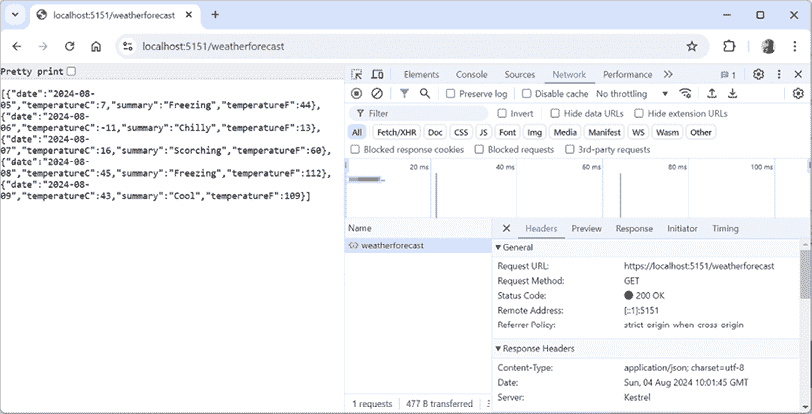
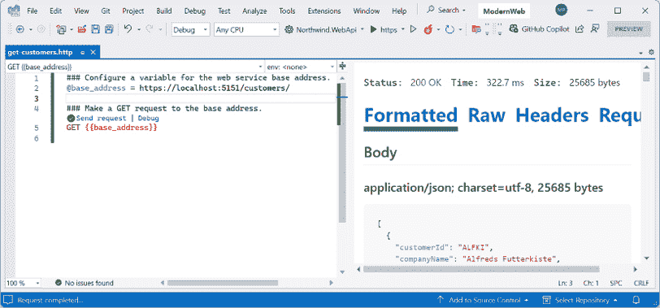
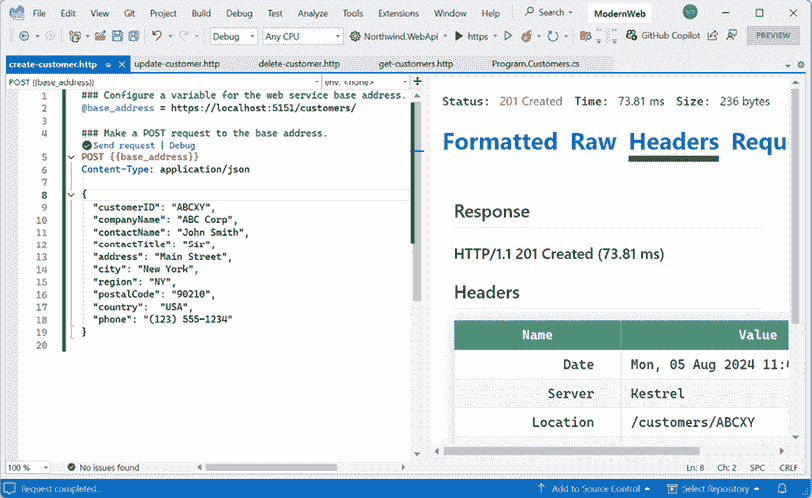
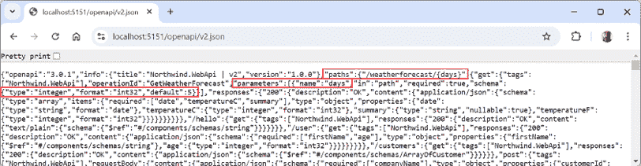
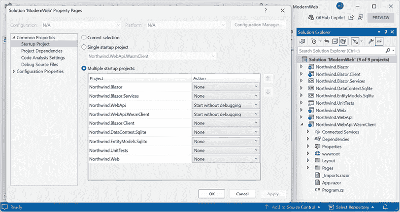
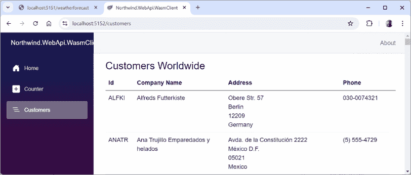

# 构建和消费 Web 服务

本章是关于学习如何使用 ASP.NET Core Minimal APIs 构建 Web 服务（也称为 HTTP 或**表示状态转移**（**REST**）服务）。然后，你将学习如何使用 HTTP 客户端消费 Web 服务，这可以是任何其他类型的.NET 应用程序，包括网站或移动或桌面应用程序。我们将创建一个 Blazor WebAssembly 客户端。

本章需要你在*第十章*，*使用 Entity Framework Core 处理数据*，以及*第十二章*到*第十四章*中获得的关于使用 ASP.NET Core 和 Blazor 构建网站的知识和技能。

在本章中，我们将涵盖以下主题：

+   使用 ASP.NET Core 构建 Web 服务

+   为 Northwind 数据库创建 Web 服务

+   记录和尝试 Web 服务

+   使用 HTTP 客户端消费 Web 服务

# 使用 ASP.NET Core 构建 Web 服务

在我们构建现代 Web 服务之前，我们需要了解一些背景知识，为本章的内容奠定基础。

## 理解 Web 服务缩写

虽然 HTTP 最初是为了请求和响应 HTML 和其他资源供人类查看而设计的，但它也适合构建服务。

Roy Fielding 在他的博士论文中，描述了**REST**架构风格，指出 HTTP 标准对于构建服务来说很好，因为它定义了以下内容：

+   使用 URI（统一资源标识符）来唯一标识资源，例如`https://localhost:5151/products/23`。

+   在这些资源上执行常见任务的方法，如`GET`、`POST`、`PUT`和`DELETE`。

+   能够协商请求和响应中交换的内容的媒体类型，例如 XML 和 JSON。当客户端指定一个请求头，如`Accept: application/xml,*/*;q=0.8`时，就会发生内容协商。ASP.NET Core Web 服务使用的默认响应格式是 JSON，这意味着其中一个响应头会是`Content-Type: application/json; charset=utf-8`。

**Web 服务**使用 HTTP 通信标准，因此有时被称为**HTTP 服务**或**RESTful 服务**。

## 理解 HTTP 请求和响应

HTTP 定义了标准类型的请求和标准代码来指示响应类型。其中大部分可以用来实现 Web 服务。

最常见的请求类型是`GET`，用于检索由唯一路径标识的资源，还可以设置额外的选项，如请求头中可接受的媒体类型，例如`Accept`，如下面的示例所示：

```cs
GET /path/to/resource
Accept: application/json 
```

常见的响应包括成功和多种类型的失败，如*表 15.1*所示：

| **状态码** | **描述** |
| --- | --- |
| `101 Switching Protocols` | 请求者已要求服务器切换协议，并且服务器已同意这样做。例如，从 HTTP 切换到**WebSockets**（**WS**）进行更有效的通信是常见的。 |

| `103 Early Hints` | 用于传达帮助客户端准备处理最终响应的提示。例如，服务器可能会在发送一个使用样式表和 JavaScript 文件的网页的正常 `200 OK` 响应之前发送以下响应：|

```cs
HTTP/1.1 103 Early Hints
Link: </style.css>; rel=preload; as=style
Link: </script.js>; rel=preload; as=script 
```

|

| `200 OK` | 路径正确形成，资源成功找到，序列化为可接受的媒体类型，然后返回在响应体中。响应头指定了 `Content-Type`、`Content-Length` 和 `Content-Encoding`，例如，`GZIP`。 |
| --- | --- |
| `301 Moved Permanently` | 随着时间的推移，网络服务可能会更改其资源模型，包括用于标识现有资源的路径。网络服务可以通过返回此状态码和一个名为 `Location` 的响应头，其中包含新路径，来指示新路径。 |
| `302 Found` | 这与 `301` 相同。 |
| `304 Not Modified` | 如果请求包含 `If-Modified-Since` 头部，则网络服务可以响应此状态码。响应体为空，因为客户端应使用其缓存的资源副本。 |
| `307 Temporary Redirect` | 请求的资源已临时移动到 `Location` 头部中的 URL。浏览器应使用该 URL 发起新的请求。例如，如果你启用了 `UseHttpsRedirection` 并客户端发起了一个 HTTP 请求，就会发生这种情况。 |
| `400 Bad Request` | 请求无效，例如，它使用了一个整数 ID 的产品路径，但缺少 ID 值。 |
| `401 Unauthorized` | 请求有效且资源已找到，但客户端未提供凭据或无权访问该资源。重新认证可能允许访问，例如，通过添加或更改 `Authorization` 请求头部。 |
| `403 Forbidden` | 请求有效且资源已找到，但客户端无权访问该资源。重新认证不会解决问题。 |
| `404 Not Found` | 请求有效，但资源未找到。资源可能在稍后重复请求时找到。要指示资源永远不会找到，返回 `410 Gone`。 |
| `406 Not Acceptable` | 如果请求有一个 `Accept` 头部，只列出了网络服务不支持媒体类型。例如，如果客户端请求 JSON，但网络服务只能返回 XML。 |
| `451 Unavailable for Legal Reasons` | 美国托管的一个网站可能会对来自欧洲的请求返回此状态，以避免必须遵守**通用数据保护条例**（**GDPR**）。这个数字是作为对小说《 Fahrenheit 451》的参考，在那本书中，书籍被禁止并焚毁。 |
| `500 Server Error` | 请求有效，但在服务器端处理请求时出了问题。稍后再试可能有效。 |
| `503 Service Unavailable` | 网络服务正忙，无法处理请求。稍后再试可能有效。 |

表 15.1：对 GET 方法的常见 HTTP 状态码响应

其他常见的 HTTP 请求类型包括`POST`、`PUT`、`PATCH`或`DELETE`，它们用于创建、修改或删除资源。

要创建一个新资源，你可能需要发送一个包含新资源的`POST`请求，如下面的代码所示：

```cs
POST /path/to/resource
Content-Length: 123
Content-Type: application/json 
```

要创建一个新资源或更新现有资源，你可能需要发送一个包含现有资源全新版本的`PUT`请求，如果资源不存在，则创建它；如果它已存在，则替换它（有时称为**upsert**操作），如下面的代码所示：

```cs
PUT /path/to/resource
Content-Length: 123
Content-Type: application/json 
```

为了更有效地更新现有资源，你可能需要发送一个包含仅包含需要更改的属性的对象的`PATCH`请求，如下面的代码所示：

```cs
PATCH /path/to/resource
Content-Length: 123
Content-Type: application/json 
```

要删除现有资源，你可能需要发送一个`DELETE`请求，如下面的代码所示：

```cs
DELETE /path/to/resource 
```

除了上表中针对`GET`请求的响应外，所有创建、修改或删除资源的请求类型都有额外的可能常见响应，如下所示*表 15.2*：

| **状态码** | **描述** |
| --- | --- |
| `201 已创建` | 新资源已成功创建，响应头中名为`Location`的头部包含其路径，响应体包含新创建的资源。立即`GET`该资源应返回`200`。 |
| `202 已接受` | 新资源不能立即创建，因此请求被排队等待后续处理，立即`GET`该资源可能会返回`404`。响应体可以包含指向某种状态检查器或资源何时可用的估计的资源。 |
| `204 无内容` | 通常用于对`DELETE`请求的响应，因为删除后返回资源在请求体中通常没有意义！有时用于对`POST`、`PUT`或`PATCH`请求的响应，如果客户端不需要确认请求是否正确处理。 |
| `405 方法不允许` | 当请求使用了不支持的方法时返回。例如，一个设计为只读的 Web 服务可能会明确禁止`PUT`、`DELETE`等操作。 |
| `415 不支持的媒体类型` | 返回时，请求体中的资源使用的是该网络服务无法处理的媒体类型。例如，如果请求体包含 XML 格式的资源，但该网络服务只能处理 JSON。 |

表 15.2：对其他方法如 POST 和 PUT 的常见 HTTP 状态码响应

## ASP.NET Core 最小 API 项目

我们将构建一个 Web 服务，该服务使用 ASP.NET Core 提供一种方式来处理 Northwind 数据库中的数据，以便任何可以发送 HTTP 请求并接收 HTTP 响应的平台上的客户端应用程序都可以使用这些数据。

传统上，你使用 **ASP.NET Core Web API** / `dotnet new webapi` 项目模板。这允许创建使用控制器或较新的最小化 API 实现的 Web 服务。

**警告！** 在 .NET 6 和 .NET 7 中，`dotnet new webapi` 命令创建的是使用控制器实现的服务。在 .NET 6 和 .NET 7 中，要使用最小化 API 实现服务，需要将 `--use-minimal-apis` 开关添加到命令中。使用 .NET 8 或更高版本，`dotnet new webapi` 命令创建的是使用最小化 API 实现的服务。要使用控制器实现服务，需要添加 `--use-controllers` 开关。

### 最小化 API 网络服务和原生 AOT 编译

.NET 8 引入了 **ASP.NET Core Web API (native AOT)** / `dotnet new webapiaot` 项目模板，它仅使用最小化 API 并支持原生 AOT 发布。随着时间的推移，.NET 的更多组件将支持 AOT，正如你可以在以下引语中读到的那样：

> “我们预计将在 .NET 9 时间范围内取得调查原生 AOT 支持对于 MVC 和 Blazor 的进展，但我们不期望在 .NET 9 中提供生产就绪的原生 AOT 支持，因为涉及的工作量很大。” – 丹·罗斯

[`github.com/dotnet/aspnetcore/issues/51834#issuecomment-1913300365`](https://github.com/dotnet/aspnetcore/issues/51834#issuecomment-1913300365)

**最佳实践**：最小化 API 与垂直切片架构（VSA）配合得非常好。与基于控制器的 Web API 相比，最小化 API 的一个主要优点是每个最小化 API 端点只需要实例化它需要的依赖注入（DI）服务。在使用控制器的情况下，为了执行控制器中的任何操作方法，必须在每次调用中实例化任何操作方法中使用的所有 DI 服务。这是时间和资源的浪费！

### 创建 ASP.NET Core 最小化 API 项目

让我们开始吧：

1.  使用你喜欢的代码编辑器打开 `ModernWeb` 解决方案，然后添加一个新项目，如下所示：

    +   项目模板：**ASP.NET Core Web API** / `webapi`

    +   解决方案文件和文件夹：`ModernWeb`

    +   项目文件和文件夹：`Northwind.WebApi`

1.  如果你使用的是 Visual Studio，那么请确认以下默认值已被选择：

    +   **身份验证类型**：无

    +   **配置 HTTPS**：已选择

    +   **启用容器支持**：已清除

    +   **启用 OpenAPI 支持**：已选择

    +   **不要使用顶级语句**：已清除

    +   **使用控制器**：已清除

确保清除 **使用控制器** 复选框，否则你的代码将与你在这本书中看到的非常不同！

1.  如果你使用 VS Code 或 Rider，那么在 `ModernWeb` 目录中，在命令提示符或终端中输入以下命令：

    ```cs
    dotnet new webapi -o Northwind.WebApi 
    ```

1.  构建 `Northwind.WebApi` 项目。

1.  在项目文件中，删除实现 OpenAPI 网络服务文档的包的版本号，因为我们正在使用 CPM，如下所示：

    ```cs
    <PackageReference Include="Microsoft.AspNetCore.OpenApi" /> 
    ```

1.  在 `Program.cs` 中，查看以下代码：

    ```cs
    var builder = WebApplication.CreateBuilder(args);
    // Add services to the container.
    // Learn more about configuring OpenAPI at https://aka.ms/aspnet/openapi
    builder.Services.AddOpenApi();
    var app = builder.Build();
    // Configure the HTTP request pipeline.
    if (app.Environment.IsDevelopment())
    {
      app.MapOpenApi();
    }
    app.UseHttpsRedirection();
    var summaries = new[]
    {
        "Freezing", "Bracing", "Chilly", "Cool", "Mild", "Warm", "Balmy", "Hot", "Sweltering", "Scorching"
    };
    app.MapGet("/weatherforecast", () =>
    {
      var forecast = Enumerable.Range(1, 5).Select(index =>
        new WeatherForecast
        (
          DateOnly.FromDateTime(DateTime.Now.AddDays(index)),
          Random.Shared.Next(-20, 55),
          summaries[Random.Shared.Next(summaries.Length)]
        ))
        .ToArray();
      return forecast;
    })
    .WithName("GetWeatherForecast");
    app.Run();
    internal record WeatherForecast(DateOnly Date,
      int TemperatureC, string? Summary)
    {
      public int TemperatureF => 32 +
        (int)(TemperatureC / 0.5556);
    } 
    ```

在审查前面的代码时，请注意以下内容：

+   程序以与其他任何 ASP.NET Core 项目类似的配置开始，通过调用 `WebApplication.CreateBuilder`。

+   服务集合中添加了一个 OpenAPI 服务。这用于记录网络服务。在 .NET 8 及更早版本中，使用了第三方 Swashbuckle 包来完成此操作，但自 .NET 9 及以后版本，Microsoft 已经编写了自己的实现。您可以在以下链接中了解更多信息：[`github.com/dotnet/aspnetcore/issues/54599`](https://github.com/dotnet/aspnetcore/issues/54599)。默认情况下，OpenAPI 文档生成创建一个符合 OpenAPI 规范 v3.0 的文档：[`spec.openapis.org/oas/v3.0.0`](https://spec.openapis.org/oas/v3.0.0)。

+   在开发期间，OpenAPI 文档被映射为端点，以便其他开发者可以使用它轻松地创建客户端。默认情况下，通过调用 MapOpenApi 注册的 OpenAPI 端点将文档暴露在 [/openapi/{documentName}.json](https://openapi/%7BdocumentName%7D.json) 端点。默认情况下，`documentName` 是 `v1`。在生产环境中，这些端点不会被映射，因为它们不再必要。

+   `MapGet` 调用注册了一个相对路径 `/weatherforecast` 以响应 HTTP `GET` 请求，并且其实现使用共享的 `Random` 对象返回一个包含随机温度和总结（如 `Bracing` 或 `Balmy`）的 `WeatherForecast` 对象数组，这些总结对应于未来五天的天气。

现在让我们允许 HTTP 请求指定预报应提前多少天。同时，我们将通过将天气端点实现放入其自己的代码文件中，来实施良好的实践：

1.  添加一个名为 `Program.Weather.cs` 的新类文件。

1.  在 `Program.Weather.cs` 中，添加语句以通过移动（剪切和粘贴语句）从 `Program.cs` 中的天气相关语句来扩展自动生成的 `partial` `Program` 类，并进行一些小的调整，例如定义一个带有 `days` 参数的 `GetWeather` 方法来控制要生成的天气预报数量，如下所示，代码如下：

    ```cs
    public partial class Program
    {
      static string[] summaries = { "Freezing", "Bracing",
        "Chilly", "Cool", "Mild", "Warm", "Balmy", "Hot",
        "Sweltering", "Scorching" };
      internal static WeatherForecast[]? GetWeather(int days)
      {
        WeatherForecast[]? forecast = Enumerable.Range(1, days)
          .Select(index => new WeatherForecast
          (
            DateOnly.FromDateTime(DateTime.Now.AddDays(index)),
            Random.Shared.Next(-20, 55),
            summaries[Random.Shared.Next(summaries.Length)]
          ))
          .ToArray();
        return forecast;
      }
      internal record WeatherForecast(DateOnly Date,
        int TemperatureC, string? Summary)
      {
        public int TemperatureF => 32 +
          (int)(TemperatureC / 0.5556);
      }
    } 
    ```

1.  在 `Program.cs` 中，修改 `MapGet` 调用，如下所示，高亮显示的代码：

    ```cs
    app.UseHttpsRedirection();
    **app****.MapGet(****"/weatherforecast/{days:int?}"****,**
     **(int days = 5) => GetWeather(days))**
     **.WithName(****"GetWeatherForecast"****);**
    app.Run(); 
    ```

在 `MapGet` 调用中，请注意路由模板模式 `{days:int?}` 将 `days` 参数限制为 `int` 值。`?` 使得 `days` 参数是可选的，如果缺失，则默认为 `5`。

## 审查网络服务的功能

现在，我们将测试网络服务的功能：

1.  在 `Properties` 文件夹中，在 `launchSettings.json` 中，请注意，默认情况下，如果您使用 Visual Studio，则 `https` 配置文件将启动浏览器并导航到 `/weatherforecast` 相对 URL 路径，如下所示，高亮显示的标记：

    ```cs
    "https": {
      "commandName": "Project",
      "dotnetRunMessages": true,
    **"launchBrowser"****:****true****,**
    **"launchUrl"****:****"weatherforecast"**, 
    ```

1.  对于 `https` 配置文件，对于其 `applicationUrl`，将 HTTPS 的随机端口号更改为 `5151`，对于 HTTP 更改为 `5150`，如下所示，高亮显示的标记：

    ```cs
    "applicationUrl": "https://localhost:**5151**;http://localhost:**5150**", 
    ```

1.  保存所有修改文件的更改。

1.  使用 `https` 启动配置文件启动 `Northwind.WebApi` 网络服务项目。

1.  在 Windows 上，如果你看到一个 **Windows 安全警报** 对话框，显示 **Windows Defender 防火墙已阻止此应用的一些功能**，那么请点击 **允许访问** 按钮。

1.  启动 Chrome，导航到 `https://localhost:5151/`，并注意你会得到一个 `404` 状态码响应，因为我们尚未启用静态文件，且没有 `index.html`。记住，这个项目不是为人类查看和交互而设计的，所以这是网络服务的预期行为。

1.  在 Chrome 中，显示 **开发者工具**。

1.  导航到 `https://localhost:5151/weatherforecast` 并注意网络服务应该返回一个包含五个随机天气预报对象的 JSON 文档数组，如图 *图 15.1* 所示：



图 15.1：来自天气预报网络服务的一个请求和响应

1.  关闭 **开发者工具**。

1.  导航到 `https://localhost:5151/weatherforecast/14` 并注意请求两周天气预报时，响应包含 14 个预报。

1.  选择 *美化打印* 复选框，如图 *图 15.1* 所示，并注意 Chrome 的最新版本现在可以更好地格式化 JSON 响应，以便人类阅读。

1.  关闭 Chrome 并关闭网络服务器。

## 路由约束

要注册 `/weatherforecast` 路由端点，我们使用路由约束来限制 `days` 参数的可接受值为整数，如下代码中突出显示所示：

```cs
app.MapGet("/weatherforecast/{days:int?}", ... 
```

路由约束允许我们根据数据类型和其他验证来控制匹配。它们总结在 *表 15.3* 中：

| **约束** | **示例** | **描述** |
| --- | --- | --- |
| `required` | `{id:required}` | 参数已被提供。 |
| `int` 和 `long` | `{id:int}` | 任何正确大小的整数。 |
| `decimal`、`double` 和 `float` | `{unitprice:decimal}` | 任何正确大小的实数。 |
| `bool` | `{discontinued:bool}` | 在 `true` 或 `false` 上的不区分大小写的匹配。 |
| `datetime` | `{hired:datetime}` | 不变文化的日期/时间。 |
| `guid` | `{id:guid}` | 一个 GUID 值。 |
| `minlength(n)`、`maxlength(n)`、`length(n)` 和 `length(n, m)` | `{title:minlength(5)}`、`{title:length(5, 25)}` | 文本必须具有定义的最小和/或最大长度。 |
| `min(n)`、`max(n)` 和 `range(n, m)` | `{age:range(18, 65)}` | 整数必须在定义的最小和/或最大范围内。 |
| `alpha`、`regex` | `{firstname:alpha}`、`{id:regex(^[A-Z]{{5}}$)}` | 参数必须匹配一个或多个字母字符或正则表达式。 |

表 15.3：带有示例和描述的路由约束

使用冒号分隔多个约束，如下例所示：

```cs
**app****.MapGet****("/weatherforecast/{days:int:****min****(****5****)}", ...** 
```

对于正则表达式，自动添加了 `RegexOptions.IgnoreCase | RegexOptions.Compiled | RegexOptions.CultureInvariant`。正则表达式标记必须转义（将 `\` 替换为 `\\`，将 `{` 替换为 `{{`，将 `}` 替换为 `}}`）或使用文本字符串字面量。

**更多信息**：您可以通过定义一个实现 `IRouteConstraint` 的类来创建自定义路由约束。这超出了本书的范围，但您可以在以下链接中了解相关信息：[`learn.microsoft.com/en-us/aspnet/core/fundamentals/routing#custom-route-constraints`](https://learn.microsoft.com/en-us/aspnet/core/fundamentals/routing#custom-route-constraints)。

## 短路路由

当路由匹配到端点请求时，它允许中间件管道的其他部分在调用端点逻辑之前运行。这需要时间，因此在 ASP.NET Core 8 及以后版本中，您可以立即调用端点并返回响应。

您可以通过在映射的端点路由上调用 `ShortCircuit` 方法来完成此操作，如下面的代码所示：

```cs
app.MapGet("/", () => "Hello World").ShortCircuit(); 
```

或者，您可以通过调用 `MapShortCircuit` 方法来响应 `404 资源未找到` 或其他状态码，对于不需要进一步处理的资源，如下面的代码所示：

```cs
app.MapShortCircuit(404, "robots.txt", "favicon.ico"); 
```

## ASP.NET Core 8 及以后版本的改进路由工具

微软已经改进了用于处理所有 ASP.NET Core 8 及以后技术（包括 Web API 和 Blazor）的路由工具。这些功能包括以下内容：

+   **路由语法高亮**：现在在您的代码编辑器中突出显示路由的不同部分。

+   **自动完成**：参数和路由名称以及路由约束将自动完成。

+   **路由分析器和修复工具**：这些工具解决了开发者在实现路由时遇到的常见问题。

您可以在以下链接找到的博客文章 *ASP.NET Core 在 .NET 8 中的路由工具增强功能* 中了解它们：[`devblogs.microsoft.com/dotnet/aspnet-core-route-tooling-dotnet-8/`](https://devblogs.microsoft.com/dotnet/aspnet-core-route-tooling-dotnet-8/)。

## 理解端点路由处理程序返回类型

端点 lambda 表达式可以返回 .NET 类型，如单个 `string` 值；由 `class`、`record` 或 `struct` 定义的复杂对象；或复杂对象的集合。ASP.NET Core 最小 API 将它们序列化为 JSON 或纯文本。

考虑以下端点路由处理程序，它返回一个 `string` 值，如下面的代码所示：

```cs
app.MapGet("/hello", () => "Hello World"); 
```

ASP.NET Core 最小 API 将返回带有 `Content-Type: text/plain; charset=utf-8` 头的 `200` 状态码，并在正文中包含以下内容：`Hello World`。

现在考虑以下端点路由处理程序，它返回一个匿名类型，如下面的代码所示：

```cs
app.MapGet("/user", () => new {
  FirstName = "Bob",
  Age = 45 }); 
```

ASP.NET Core 最小 API 将返回带有 `Content-Type: application/json; charset=utf-8` 头的 `200` 状态码，并在正文中包含以下内容：

```cs
{"firstName":"Bob","age":45} 
```

为了更好地控制响应，存在返回 `IResult` 的辅助方法，它定义了一个表示 HTTP 端点结果的合同。静态 `Results` 和 `TypedResults` 类可以用来创建代表不同类型响应的各种 `IResult` 对象。

相比于返回 `Results`，返回 `TypedResults` 具有以下优点：

+   `TypedResults` 辅助函数返回强类型对象，这可以提高代码可读性和单元测试，并减少运行时错误的可能性。

+   实现类型自动为 OpenAPI 提供响应类型元数据，以描述端点。

`TypedResults` 类有一个名为 `Empty` 的属性，它产生一个空的结果响应，当执行时将不会做任何事情。

`TypedResults` 类有方法使其能够轻松返回不同的响应，如 *表 15.4* 所示：

| **方法** | **描述** |
| --- | --- |
| `Bytes` | 返回 `200` 状态码并将字节数组内容写入响应。 |
| `Content` | 返回 `200` 状态码并将内容字符串写入 HTTP 响应。有一个可选参数可以指定媒体类型头。 |
| `File` | 返回 `200` 状态码并将指定的 `Stream` 写入响应。 |
| `Json` | 返回 `200` 状态码并将指定的数据对象序列化为 JSON 格式发送到响应。 |
| `Ok` | 返回 `200` 状态码并将资源转换为客户端首选的格式，如 JSON 或 XML。通常用于响应 `GET` 请求。 |
| `Created`, `CreatedAtRoute` | 返回 `201` 状态码和新的资源路径。通常用于响应创建资源快速创建的 `POST` 请求。 |
| `Accepted`, `AcceptedAtRoute` | 返回 `202` 状态码以指示请求正在处理但尚未完成。通常用于响应 `POST`、`PUT`、`PATCH` 或 `DELETE` 请求，这些请求触发一个需要很长时间才能完成的后台进程。 |
| `Redirect`, `RedirectToRoute` | 根据临时或永久重定向的 `bool` 参数返回 `301`、`307` 或 `308` 状态码，并带有要重定向到的 `url`。 |
| `Problem` | 生成 `ProblemDetails` 响应。 |
| `NoContent` | 返回 `204` 状态码和空响应体。通常用于响应不需要包含受影响资源的 `PUT`、`PATCH` 或 `DELETE` 请求。 |
| `BadRequest` | 返回 `400` 状态码和包含更多详细信息的可选消息字符串。 |
| `NotFound` | 返回 `404` 状态码并自动填充 `ProblemDetails` 主体（需要 2.2 或更高版本的兼容性版本）。 |

表 15.4：返回响应的 `TypedResults` 辅助方法

**更多信息**：您可以在以下链接中了解更多关于如何在 Minimal APIs 网络服务中创建响应的信息：[`learn.microsoft.com/en-us/aspnet/core/fundamentals/minimal-apis/responses?view=aspnetcore-9.0`](https://learn.microsoft.com/en-us/aspnet/core/fundamentals/minimal-apis/responses?view=aspnetcore-9.0)。

# 为 Northwind 数据库创建网络服务

我们将引用您在 *第十二章*，*使用 .NET 引入现代网络开发* 中创建的 Northwind 数据库的 Entity Framework Core 实体数据模型：

1.  在 `Northwind.WebApi` 项目中，全局和静态导入 `System.Console` 类，并为 SQLite 或 SQL Server 添加对 Northwind 数据上下文类库的项目引用，如下所示：

    ```cs
    <ItemGroup Label="To simplify use of WriteLine.">
      <Using Include="System.Console" Static="true" />
    </ItemGroup>
    <ItemGroup>
      <!-- change Sqlite to SqlServer if you prefer -->
      <ProjectReference Include=
    "..\Northwind.DataContext.Sqlite\Northwind.DataContext.Sqlite.csproj" />
    </ItemGroup> 
    ```

1.  构建 `Northwind.WebApi` 项目并修复代码中的任何编译错误。

1.  在 `Program.cs` 中，导入用于处理 Northwind 实体模型的命名空间，如下所示：

    ```cs
    using Northwind.EntityModels; // To use AddNorthwindContext method. 
    ```

1.  在 `Program.cs` 中，在调用 `Build` 之前添加一个语句来注册 `Northwind` 数据库上下文类（它将使用 SQLite 或 SQL Server，具体取决于在项目文件中引用的数据库提供程序），如下所示：

    ```cs
    builder.Services.AddNorthwindContext(); 
    ```

## 注册依赖服务

您可以使用不同的生命周期注册依赖服务，如下列所示：

+   **瞬态**：每次请求时都会创建这些服务。瞬态服务应该是轻量级和无状态的。

+   **作用域内**：这些服务在每个客户端请求时创建一次，然后被销毁。然后，将响应返回给客户端。

+   **单例**：这些服务通常在第一次请求时创建，然后被共享，尽管您也可以在注册时提供实例。

.NET 8 中引入了为依赖服务设置键的能力。这允许使用不同的键注册多个服务，然后使用该键稍后检索。

```cs
builder.Services.AddKeyedsingleton<IMemoryCache, BigCache>("big");
builder.Services.AddKeyedSingleton<IMemoryCache, SmallCache>("small");
class BigCacheConsumer([FromKeyedServices("big")] IMemoryCache cache)
{
  public object? GetData() => cache.Get("data");
}
class SmallCacheConsumer(IKeyedServiceProvider keyedServiceProvider)
{
  public object? GetData() => keyedServiceProvider
    .GetRequiredKeyedService<IMemoryCache>("small");
} 
```

在这本书中，您将使用所有三种生命周期，但我们不需要使用带键的服务。

## 内存、分布式和混合缓存

现在我们来概述一下内存、分布式和混合缓存。

### 内存缓存

内存缓存将数据存储在运行应用程序的 Web 服务器内存中。这对于需要不太广泛的缓存需求的小型到中型应用程序很有用，并且可以由单个服务器的内存处理。

内存缓存的要点如下所示：

+   **性能**：由于数据存储在本地 RAM 中，因此检索速度快。

+   **简单性**：易于在应用程序中实现和配置。

+   **易变性**：如果应用程序重新启动或服务器关闭，数据将丢失。

+   **可伸缩性**：限于单个服务器的内存；不适合需要分布式缓存的大规模应用程序。

要实现内存缓存，请在 `Program.cs` 中的服务集合中添加内存缓存服务，如下面的代码所示：

```cs
services.AddMemoryCache(); 
```

在端点中检索服务，如下面的代码所示：

```cs
private readonly IMemoryCache _cache; 
```

在缓存中设置数据，如下面的代码所示：

```cs
_cache.Set(key, data); 
```

从缓存中获取数据，如下面的代码所示：

```cs
return _cache.TryGetValue(key, out var data) ? data : null; 
```

现在我们来比较内存缓存和分布式缓存。

### 分布式缓存

分布式缓存允许跨多个服务器缓存数据，这使得它适用于大规模、分布式应用程序。这确保了在 Web 农场中不同节点之间的数据可用性和一致性。

内存缓存的关键点如下所示：

+   **可扩展性**：可以处理大量数据集，并在多个服务器之间提供缓存。

+   **持久性**：根据提供者，数据可以在应用程序重启后持久化。

+   **延迟**：与内存缓存相比，可能具有更高的延迟，因为需要网络调用。

+   **提供者**：常见的提供者包括 Redis、SQL Server 和 NCache。

要实现内存缓存，请在 `Program.cs` 中的服务集合中添加它，如下面的代码所示：

```cs
services.AddStackExchangeRedisCache(options =>
  options.Configuration = "localhost:6379";
  options.InstanceName = "SampleInstance";
}); 
```

在端点中检索服务，如下面的代码所示：

```cs
private readonly IDistributedCache _cache; 
```

在缓存中设置数据，如下面的代码所示：

```cs
await _cache.SetStringAsync(key, value); 
```

从缓存中获取数据，如下面的代码所示：

```cs
return await _cache.GetStringAsync(key); 
```

因此，内存缓存快速简单，但仅限于服务器的内存，并在重启时丢失数据。分布式缓存可扩展且持久，适用于大型应用程序，有各种提供者，如 Redis 和 SQL Server。

这两种方法都有助于通过减少重复获取或计算数据的需求来提高应用程序性能。选择它们取决于应用程序的规模、性能需求和架构。

但如果我们能够兼得两者之长呢？

让我们看看一个新的选项，称为混合缓存。

### 混合缓存

ASP.NET Core 9 中引入的 HybridCache API 解决了在 `IDistributedCache` 和 `IMemoryCache` API 中发现的一些限制。作为一个具有默认实现的抽象类，`HybridCache` 高效地管理了与从缓存中存储和检索数据相关的多数任务。

混合缓存的关键点如下所示：

+   **统一 API**：为进程内和进程外缓存提供单个接口。`HybridCache` 可以无缝替换任何现有的 `IDistributedCache` 和 `IMemoryCache` 使用。它最初始终使用内存缓存，当有 `IDistributedCache` 实现可用时，`HybridCache` 会利用它进行二级缓存。这种双级缓存方法结合了内存缓存的快速性和分布式或持久缓存的持久性。

+   **拥挤保护**：`HybridCache` 防止缓存拥挤，这发生在频繁使用的缓存条目被失效时，导致多个请求同时尝试重新填充它。`HybridCache` 合并并发操作，确保所有相同响应的请求都等待第一个请求完成。

+   **可配置序列化**：`HybridCache` 允许在服务注册期间进行可配置的序列化，通过 `WithSerializer` 和 `WithSerializerFactory` 方法支持类型特定的和通用的序列化器，这些方法是从 `AddHybridCache` 调用链式调用的。默认情况下，它内部管理 `string` 和 `byte[]`，并使用 `System.Text.Json` 处理其他类型。它可以配置为使用其他序列化器，例如 Protobuf 或 XML。

虽然混合缓存是在 .NET 9 中引入的，但其包针对 .NET Standard 2.0，因此它可以与较老的 .NET 版本一起使用，甚至包括 .NET Framework 4.6.2 或更高版本。

现在你已经了解了缓存的原理和基本实现选项，让我们为我们的 Web 服务创建一个数据仓库，该仓库缓存实体以提高性能和可伸缩性。

## 创建具有缓存实体的数据仓库

定义和实现数据仓库以提供 CRUD 操作是良好的实践。我们将为 Northwind 中的 `Customers` 表创建一个数据仓库。这个表中只有 91 个客户，因此我们将整个表的副本缓存在内存中，以提高读取客户记录时的可伸缩性和性能。

**良好实践**：在实际的 Web 服务中，你应该使用分布式缓存，如 Redis，这是一个开源的数据结构存储，可以用作高性能、高可用数据库、缓存或消息代理。你可以在以下链接中了解更多信息：[`learn.microsoft.com/en-us/aspnet/core/performance/caching/distributed`](https://learn.microsoft.com/en-us/aspnet/core/performance/caching/distributed)。

在 .NET 9 中，引入了 `HybridCache`，它可以在内存和分布式缓存类型之间自动切换。

**更多信息**：你可以在以下链接中了解更多关于 `HybridCache` 的信息：[`learn.microsoft.com/en-us/aspnet/core/performance/caching/hybrid?view=aspnetcore-9.0`](https://learn.microsoft.com/en-us/aspnet/core/performance/caching/hybrid?view=aspnetcore-9.0)。

我们将遵循现代的良好实践，使仓库 API 异步。它将通过使用参数注入的端点实例化，因此为每个 HTTP 请求创建一个新的实例。它将使用 `HybridCache` 的单例实例。让我们开始吧：

1.  在 `Northwind.WebApi.csproj` 项目文件中，添加对混合缓存的包引用，如下所示：

    ```cs
    <PackageReference Include=
      "Microsoft.Extensions.Caching.Hybrid" /> 
    ```

1.  在 `Program.cs` 中，导入用于处理混合缓存的命名空间，如下所示：

    ```cs
    using Microsoft.Extensions.Caching.Hybrid; // To use HybridCacheEntryOptions. 
    ```

1.  在`Program.cs`中，在调用`Build`之前，在配置服务的部分，使用默认的缓存条目持续时间为 60 秒以及本地内存缓存为 30 秒，注册混合缓存服务，如下面的代码所示：

    ```cs
    builder.Services.AddHybridCache(options =>
    {
      options.DefaultEntryOptions = new HybridCacheEntryOptions
      {
        Expiration = TimeSpan.FromSeconds(60),
        LocalCacheExpiration = TimeSpan.FromSeconds(30)
      };
    }); 
    ```

1.  在`Northwind.WebApi`项目中，创建一个名为`Repositories`的文件夹。

1.  将一个新接口文件和一个类文件添加到`Repositories`文件夹中，分别命名为`ICustomerRepository.cs`和`CustomerRepository.cs`。

1.  在`ICustomerRepository.cs`中，定义一个具有五个 CRUD 方法（创建、读取、更新、删除）的接口，如下面的代码所示：

    ```cs
    using Northwind.EntityModels; // To use Customer.
    namespace Northwind.WebApi.Repositories;
    public interface ICustomerRepository
    {
      Task<Customer?> CreateAsync(Customer c);
      Task<Customer[]> RetrieveAllAsync();
      Task<Customer?> RetrieveAsync(string id,
        CancellationToken token);
      Task<Customer?> UpdateAsync(Customer c);
      Task<bool?> DeleteAsync(string id);
    } 
    ```

1.  在`CustomerRepository.cs`中，定义一个将实现该接口并使用混合缓存（其方法将在接下来的几个步骤中实现，所以现在忽略你将看到的错误），如下面的代码所示：

    ```cs
    using Microsoft.EntityFrameworkCore.ChangeTracking; // To use EntityEntry<T>.
    using Northwind.EntityModels; // To use Customer.
    using Microsoft.EntityFrameworkCore; // To use ToArrayAsync.
    using Microsoft.Extensions.Caching.Hybrid; // To use HybridCache.
    namespace Northwind.WebApi.Repositories;
    public class CustomerRepository : ICustomerRepository
    {
      private readonly HybridCache _cache;
      // Use an instance data context field because it should not be
      // cached due to the data context having internal caching.
      private NorthwindContext _db;
      public CustomerRepository(NorthwindContext db,
        HybridCache hybridCache)
      {
        _db = db;
        _cache = hybridCache;
      }
    } 
    ```

1.  实现一个检索所有客户的方法，始终从数据库中读取最新的客户，如下面的代码所示：

    ```cs
    public Task<Customer[]> RetrieveAllAsync()
    {
      return _db.Customers.ToArrayAsync();
    } 
    ```

1.  实现用于检索的`Retrieve`方法，如果可能的话，从缓存中获取客户，或从数据模型中获取，并将其设置在缓存中以便下次使用，如下面的代码所示：

    ```cs
    public async Task<Customer?> RetrieveAsync(string id,
      CancellationToken token = default)
    {
      id = id.ToUpper(); // Normalize to uppercase.
      return await _cache.GetOrCreateAsync(
        key: id, // Unique key to the cache entry.
        factory: async cancel => await _db.Customers
          .FirstOrDefaultAsync(c => c.CustomerId == id, token),
        cancellationToken: token);
    } 
    ```

1.  实现用于创建的`Create`方法，如下面的代码所示：

    ```cs
    public async Task<Customer?> CreateAsync(Customer c)
    {
      c.CustomerId = c.CustomerId.ToUpper(); // Normalize to uppercase.
      // Add to database using EF Core.
      EntityEntry<Customer> added =
        await _db.Customers.AddAsync(c);
      int affected = await _db.SaveChangesAsync();
      if (affected == 1)
      {
        // If saved to database then store in cache.
        await _cache.SetAsync(c.CustomerId, c);
        return c;
      }
      return null;
    } 
    ```

1.  实现用于更新数据库的`Update`方法，如果成功，同时更新缓存的客户，如下面的代码所示：

    ```cs
    public async Task<Customer?> UpdateAsync(Customer c)
    {
      c.CustomerId = c.CustomerId.ToUpper();
      _db.Customers.Update(c);
      int affected = await _db.SaveChangesAsync();
      if (affected == 1)
      {
        await _cache.SetAsync(c.CustomerId, c);
        return c;
      }
      return null;
    } 
    ```

1.  实现用于删除的`Delete`方法，从数据库中删除客户，如果成功，同时删除缓存的客户，如下面的代码所示：

    ```cs
    public async Task<bool?> DeleteAsync(string id)
    {
      id = id.ToUpper();
      Customer? c = await _db.Customers.FindAsync(id);
      if (c is null) return null;
      _db.Customers.Remove(c);
      int affected = await _db.SaveChangesAsync();
      if (affected == 1)
      {
        await _cache.RemoveAsync(c.CustomerId);
        return true;
      }
      return null;
    } 
    ```

## 配置客户仓库

现在你已经学到了理论，你将把它应用到实践中，以配置仓库，使其可以从 Minimal API 端点内部调用。

当网络服务启动时，你将为仓库注册一个作用域依赖项服务实现，然后在定义新的用于处理客户的 Minimal API 端点时使用构造函数参数注入来获取它。

它将包含五个操作方法来对客户执行 CRUD 操作——两个`GET`方法（用于所有客户或单个客户）、`POST`（创建）、`PUT`（更新）和`DELETE`：

1.  在`Program.cs`中，导入用于处理我们的客户仓库的命名空间，如下面的代码所示：

    ```cs
    using Northwind.WebApi.Repositories; // To use ICustomerRepository. 
    ```

1.  在`Program.cs`中，在调用`Build`方法之前添加一个语句，该语句将注册`CustomerRepository`以在运行时作为作用域依赖项使用，如下面的代码所示：

    ```cs
    builder.Services.AddScoped<ICustomerRepository,
      CustomerRepository>(); 
    ```

**良好实践**：我们的仓库使用一个注册为作用域依赖项的数据库上下文。你只能在其他作用域依赖项内部使用作用域依赖项，因此我们不能将仓库注册为单例。你可以在以下链接中了解更多信息：[`learn.microsoft.com/en-us/dotnet/core/extensions/dependency-injection#scoped`](https://learn.microsoft.com/en-us/dotnet/core/extensions/dependency-injection#scoped)。

1.  在`Northwind.WebApi`项目中，添加一个名为`Program.Customers.cs`的新类。

1.  在 `Program.Customers.cs` 中添加语句以定义两个响应 HTTP `GET` 请求的所有客户或指定国家内客户的最低 API 端点路由处理程序，如下所示：

    ```cs
    using Microsoft.AspNetCore.Mvc; // To use ProblemDetails.
    using Northwind.EntityModels; // To use Customer.
    using Northwind.WebApi.Repositories; // To use ICustomerRepository.
    static partial class Program
    {
      internal static void MapCustomers(this WebApplication app)
      {
        // GET: /customers
        app.MapGet(pattern: "/customers", handler:
          async (ICustomerRepository repo) =>
        {
          return await repo.RetrieveAllAsync();
        });
        // GET: customers/in/[country]
        app.MapGet(pattern: "/customers/in/{country}", handler:
          async (string country, ICustomerRepository repo) =>
        {
          return (await repo.RetrieveAllAsync())
            .Where(customer => customer.Country == country);
        });
      }
    } 
    ```

1.  在 `Program.Customers.cs` 中，在 `MapCustomers` 方法中添加语句以映射响应单个客户 HTTP `GET` 请求的端点路由处理程序，如下所示：

    ```cs
    // GET: customers/[id]
    app.MapGet("/customers/{id:regex(^[A-Z]{{5}}$)}",
      async Task<IResult> (string id, ICustomerRepository repo,
        CancellationToken token = default) =>
    {
      Customer? c = await repo.RetrieveAsync(id, token);
      if (c is null)
      {
        return TypedResults.NotFound(); // 404 Resource not found.
      }
      return TypedResults.Ok(c); // 200 OK with customer in body.
    }); 
    ```

1.  在 `Program.Customers.cs` 中添加语句以映射响应 HTTP `POST` 请求以插入新的客户实体，如下所示：

    ```cs
    // POST: /customers
    // BODY: Customer (JSON)
    app.MapPost(pattern: "/customers", handler:
      async Task<IResult> (Customer c,
        ICustomerRepository repo) =>
    {
      if (c is null)
      {
        return TypedResults.BadRequest(); // 400 Bad request.
      }
      Customer? addedCustomer = await repo.CreateAsync(c);
      if (addedCustomer is null)
      {
        return TypedResults.BadRequest("Repository failed to create customer.");
      }
      else
      {
        return TypedResults.CreatedAtRoute( // 201 Created.
          routeName: "GetCustomer",
          routeValues: new { id = addedCustomer
            .CustomerId.ToLower() },
          value: addedCustomer);
      }
    }); 
    ```

1.  在 `Program.Customers.cs` 中添加语句以映射响应 HTTP `PUT` 请求的端点路由处理程序，如下所示：

    ```cs
    // PUT: /customers/[id]
    // BODY: Customer (JSON)
    app.MapPut(pattern: "/customers/{id}", handler:
      async Task<IResult> (Customer c,
        string id, ICustomerRepository repo,
        CancellationToken token = default) =>
    {
      id = id.ToUpper();
      c.CustomerId = c.CustomerId.ToUpper();
      if (c is null || c.CustomerId != id)
      {
        return TypedResults.BadRequest(); // 400 Bad request.
      }
      Customer? existing = await repo.RetrieveAsync(id, token);
      if (existing is null)
      {
        return TypedResults.NotFound(); // 404 Resource not found.
      }
      await repo.UpdateAsync(c);
      return new TypedResults.NoContent(); // 204 No content.
    }); 
    ```

1.  在 `Program.Customers.cs` 中添加语句以映射响应 HTTP `DELETE` 请求的端点路由处理程序，如下所示：

    ```cs
    // DELETE: /customers/[id]
    app.MapDelete(pattern: "/customers/{id}", handler:
      async Task<IResult> (string id, ICustomerRepository repo,
        CancellationToken token = default) =>
    {
      Customer? existing = await repo.RetrieveAsync(id, token);
      if (existing is null)
      {
        return TypedResults.NotFound(); // 404 Resource not found.
      }
      bool? deleted = await repo.DeleteAsync(id);
      if (deleted.HasValue && deleted.Value) // Short circuit AND.
      {
        return TypedResults.NoContent(); // 204 No content.
      }
      else
      {
        return TypedResults.BadRequest( // 400 Bad request.
          $"Customer {id} was found but failed to delete.");
      }
    }); 
    ```

1.  在 `Program.cs` 中，在调用 `Run` 之前，调用扩展方法以映射所有客户端点路由处理程序，如下所示：

    ```cs
    **app****.MapCustomers();**
    app.Run(); 
    ```

1.  保存所有更改。

当服务接收到 HTTP 请求时，它将创建 `Controller` 类的实例，调用适当的行为方法，以客户端偏好的格式返回响应，并释放控制器使用的资源，包括存储库及其数据上下文。

## 指定问题详情

ASP.NET Core 2.1 及更高版本中添加的一个功能是实现一个用于指定问题详情的 web 标准。如果您想掌握控制权，则可以自己创建一个 `ProblemDetails` 实例并包含附加信息。

让我们模拟一个需要返回自定义数据的错误请求。

在 `Delete` 端点路由处理程序的实现顶部，添加语句以检查 `id` 是否与字面字符串值 `"bad"` 匹配，如果是，则返回一个自定义的 `ProblemDetails` 对象，如下所示：

```cs
// Take control of problem details.
if (id == "bad")
{
  ProblemDetails problemDetails = new()
  {
    Status = StatusCodes.Status400BadRequest,
    Type = "https://localhost:5151/customers/failed-to-delete",
    Title = $"Customer ID {id} found but failed to delete.",
    Detail = "More details like Company Name, Country and so on."
  };
  return TypedResults.BadRequest(problemDetails); // 400 Bad Request
} 
```

您将在稍后尝试此功能。

# 记录和尝试 web 服务

您可以通过在浏览器中使用 HTTP `GET` 请求轻松尝试 web 服务。要尝试其他 HTTP 方法，我们需要一个更高级的工具。

## 使用浏览器尝试 GET 请求

您将使用 Chrome 尝试三种 `GET` 请求的实现——对所有客户、对指定国家的客户以及使用其唯一的客户 ID 对单个客户的请求：

1.  使用 `https` 启动配置启动 `Northwind.WebApi` web 服务项目。

1.  启动 Chrome，导航到 `https://localhost:5151/customers` 并注意返回的 JSON 文档，其中包含 Northwind 数据库中的所有 91 个客户（未排序），如图 15.2 所示：

![img/B22322_15_02.png]

图 15.2：Northwind 数据库中的客户作为 JSON 文档

1.  导航到 `https://localhost:5151/customers/in/Germany` 并注意返回的 JSON 文档，其中只包含德国的客户。

如果您返回的是一个空数组`[]`，那么请确保您已使用正确的大小写输入国家名称，因为数据库查询是区分大小写的。例如，比较`uk`和`UK`的结果。

1.  导航到 `https://localhost:5151/customers/alfki` 并注意返回的仅包含名为**Alfreds Futterkiste**的客户的 JSON 文档。

与国家名称不同，我们不需要担心客户`id`值的大小写问题，因为在客户存储库实现中，我们将`string`值规范化为 uppercase。

但我们如何尝试其他 HTTP 方法，例如`POST`、`PUT`和`DELETE`？以及我们如何记录我们的网络服务，使其易于任何人理解如何与之交互？

有许多用于测试网络服务的工具，例如**Postman**。尽管 Postman 很受欢迎，但我更喜欢 Visual Studio 中的**HTTP 编辑器**或 VS Code 中的**REST 客户端**这样的工具，因为它们不会隐藏正在发生的事情。我觉得 Postman 太图形化了。但我鼓励您探索不同的工具，找到适合您风格的工具。您可以在以下链接了解更多关于 Postman 的信息：[`www.postman.com/`](https://www.postman.com/)。

为了解决第一个问题，我们可以使用 Visual Studio 中内置的**HTTP 编辑器**工具，并安装一个名为**REST 客户端**的 VS Code 扩展。Rider 有自己的等效工具。这些工具允许您发送任何类型的 HTTP 请求并在代码编辑器中查看响应。

为了解决第二个问题，我们可以使用**OpenAPI**，也称为**Swagger**，这是世界上用于记录 HTTP API 的最流行技术。但首先，让我们看看代码编辑器 HTTP/REST 工具能做什么。

## 使用 HTTP/REST 工具发送 GET 请求

我们将首先创建一个用于发送`GET`请求的文件：

1.  如果您尚未安装 Huachao Mao 的**REST 客户端**（`humao.rest-client`），那么现在就为 VS Code 安装它。

1.  在您喜欢的代码编辑器中打开`ModernWeb`解决方案，然后启动`Northwind.WebApi`项目网络服务。

1.  在**文件资源管理器**、**Finder**或您喜欢的 Linux 文件工具中，在`ModernWeb`文件夹中创建一个`HttpRequests`文件夹。

1.  在`HttpRequests`文件夹中，创建一个名为`get-customers.http`的文件，并在您喜欢的代码编辑器中打开它。

1.  在`get-customers.http`中，修改其内容以包含一个用于检索所有客户的 HTTP `GET`请求，如下面的代码所示：

    ```cs
    ### Configure a variable for the web service base address.
    @base_address = https://localhost:5151/customers/
    ### Make a GET request to the base address.
    GET {{base_address}} 
    ```

1.  在 HTTP `GET`请求上方，点击**发送请求**，如图*15.3*所示。

注意响应在新的选项卡窗口中显示。

1.  如果您使用的是 Visual Studio，请点击**原始**选项卡，并注意返回的 JSON，如图*15.3*所示：



图 15.3：使用 Visual Studio 发送 HTTP GET 请求

Visual Studio 版本 17.8 及以后的 HTTP 编辑器是一个旨在添加类似 REST 客户端功能的功能，其用户界面可能会迅速发展，以跟上进度。您可以在以下链接中阅读其官方文档：[`learn.microsoft.com/en-us/aspnet/core/test/http-files`](https://learn.microsoft.com/en-us/aspnet/core/test/http-files)。

1.  在`get-customers.http`中添加更多的`GET`请求，每个请求之间用三个井号分隔，以测试获取不同国家的客户以及使用 ID 获取单个客户，如下所示：

    ```cs
    ### Get customers in Germany
    GET {{base_address}}in/Germany
    ### Get customers in USA
    GET {{base_address}}in/USA
    ### Get Alfreds Futterkiste
    GET {{base_address}}ALFKI
    ### Get a non-existent customer
    GET {{base_address}}abcxy 
    ```

1.  点击每个请求上方的**发送请求**链接来发送请求，并确认您获得了预期的响应，例如对于不存在的客户返回 404。

## 使用 HTTP/REST 工具制作其他请求

接下来，我们将创建一个用于制作其他请求（如`POST`）的文件：

1.  在`HttpRequests`文件夹中，创建一个名为`create-customer.http`的文件，并修改其内容以定义创建新客户的`POST`请求，如下所示：

    ```cs
    ### Configure a variable for the web service base address.
    @base_address = https://localhost:5151/customers/
    ### Make a POST request to the base address.
    POST {{base_address}}
    Content-Type: application/json
    {
      "customerID": "ABCXY",
      "companyName": "ABC Corp",
      "contactName": "John Smith",
      "contactTitle": "Sir",
      "address": "Main Street",
      "city": "New York",
      "region": "NY",
      "postalCode": "90210",
      "country":  "USA",
      "phone": "(123) 555-1234"
    } 
    ```

1.  发送请求并注意响应为`201 Created`。同时注意在**头部**部分，新创建客户的**位置**（即 URL）为`/customers/ABCXY`，如图*15.4*所示，并且响应体中包含了新创建的客户（截图未显示，但您可以在**格式化**和**原始**部分中看到）：



图 15.4：通过向 Web 服务 POST 添加新客户

我将给您一个可选的挑战，创建`.http`文件尝试更新客户（使用`PUT`）和删除客户（使用`DELETE`）。尝试在确实存在的客户以及不存在的客户上操作。解决方案可以在本书的 GitHub 仓库中的以下链接找到：

[`github.com/markjprice/cs13net9/tree/main/code/ModernWeb/HttpRequests`](https://github.com/markjprice/cs13net9/tree/main/code/ModernWeb/HttpRequests)

## 传递环境变量

要在`.http`脚本中获取环境变量，使用`$processenv`，如下所示：

```cs
{{$processEnv [%]envVarName}} 
```

例如，如果您已设置环境变量来存储密码等秘密值以连接到必须从提交到 GitHub 仓库的任何文件中排除的 SQL Server 数据库，您可以使用以下命令：

```cs
{{$processEnv MY_SQL_PWD}} 
```

**更多信息**：您可以在以下链接中了解更多关于使用 REST 客户端环境变量的信息：[`marketplace.visualstudio.com/items?itemName=humao.rest-client#environments`](https://marketplace.visualstudio.com/items?itemName=humao.rest-client#environments)。您可以在以下链接中了解更多关于使用环境变量和 Secret Manager 与 HTTP 编辑器的信息：[`devblogs.microsoft.com/visualstudio/safely-use-secrets-in-http-requests-in-visual-studio-2022/`](https://devblogs.microsoft.com/visualstudio/safely-use-secrets-in-http-requests-in-visual-studio-2022/).

现在我们已经看到了测试我们的服务的一种快速简单的方法，这同时也是学习 HTTP 的好方法，那么对于外部开发者来说呢？我们希望他们学习并调用我们的服务尽可能简单。为此，我们将使用 Swagger。

## 理解 OpenAPI 规范

**OpenAPI 规范**定义了您的 API 的 REST 风格合约，详细说明了所有资源及其操作，以人类和机器可读的格式，便于开发、发现和集成。

开发者可以使用网络服务的 OpenAPI 规范来自动生成他们首选语言或库中的强类型客户端代码。

让我们回顾一下如何为我们的网络服务启用 OpenAPI：

1.  如果网络服务正在运行，请关闭网络服务器。

1.  在 `Northwind.WebApi.csproj` 中，注意项目模板添加的用于实现 OpenAPI 文档的 Microsoft 包引用，如下面的标记所示：

    ```cs
    <PackageReference Include="Microsoft.AspNetCore.OpenApi" /> 
    ```

1.  在 `Program.cs` 中，在添加服务到容器的部分，注意项目模板注册的用于使用 OpenAPI 的服务，如下面的代码所示：

    ```cs
    // Learn more about configuring OpenAPI at https://aka.ms/aspnet/openapi
    builder.Services.AddOpenApi(); 
    ```

1.  默认情况下，文档名称是 `v1`。将文档名称参数设置为 `v2`，如下面的代码所示：

    ```cs
    builder.Services.AddOpenApi(documentName: "v2"); 
    ```

1.  在配置 HTTP 请求管道的章节中，注意使用 OpenAPI 在开发模式下的语句，如下面的代码所示：

    ```cs
    // Configure the HTTP request pipeline.
    if (builder.Environment.IsDevelopment())
    {
      **app****.MapOpenApi****();**
    } 
    ```

1.  使用 `https` 启动配置启动 `Northwind.WebApi` 网络服务项目。

1.  启动 Chrome，导航到 `https://localhost:5151/openapi/v2.json`，并注意返回的 JSON 文档，如图 15.5 所示：



图 15.5：Northwind 网络服务的 OpenAPI JSON 文档

关于 OpenAPI JSON 文档的以下注意事项：

+   它指定了服务的所有相对路径，例如：`/weatherforecast/{days}`。

+   对于像 `days` 这样的参数，它指定了它们的类型和默认值，例如：`"parameters":[{"name":"days","in":"path","required":true,"schema":{"type":"integer","format":"int32","default":5}}]`。

你可以使用两种技术来向生成的文档添加额外信息，`WithSummary` 和 `WithDescription`。这些技术可以通过在映射端点后调用扩展方法或通过用属性装饰 lambda 表达式来实现，如下面的代码所示：

```cs
app.MapGet("/helloUsingMethods", () => "Hello world!")
  .WithSummary("This is a summary.")
  .WithDescription("This is a description.");
app.MapGet("/helloUsingAttributes",
  [EndpointSummary("This is a summary.")]
  [EndpointDescription("This is a description.")]
  () => "Hello world!"); 
```

**更多信息**：您可以在以下链接中了解更多信息：[`learn.microsoft.com/en-us/aspnet/core/fundamentals/minimal-apis/openapi?view=aspnetcore-9.0#describe-endpoints`](https://learn.microsoft.com/en-us/aspnet/core/fundamentals/minimal-apis/openapi?view=aspnetcore-9.0#describe-endpoints)。

## 启用 HTTP 记录

HTTP 记录是一个可选的中间件组件，在测试网络服务时非常有用。它记录有关 HTTP 请求和 HTTP 响应的信息，包括以下内容：

+   关于 HTTP 请求的信息

+   头部

+   主体

+   关于 HTTP 响应的信息

这在 Web 服务的审计和调试场景中非常有用，但请注意，它可能会对性能产生负面影响。你也可能会记录 **个人身份信息**（**PII**），这可能会在某些司法管辖区引起合规性问题。

日志级别可以设置为以下：

+   `错误`: 只有 `错误` 级别的日志

+   `警告`: `错误` 和 `警告` 级别的日志

+   `信息`: `错误`, `警告`, 和 `信息` 级别的日志

+   `详细`: 所有级别的日志

可以为定义功能性的命名空间设置日志级别。嵌套的命名空间允许我们控制哪些功能启用了日志记录：

+   `Microsoft`: 在 `Microsoft` 命名空间中包含所有日志类型

+   `Microsoft.AspNetCore`: 在 `Microsoft.AspNetCore` 命名空间中包含所有日志类型

+   `Microsoft.AspNetCore.HttpLogging`: 在 `Microsoft.AspNetCore.HttpLogging` 命名空间中包含所有日志类型

让我们看看 HTTP 日志的实际应用：

1.  在 `Northwind.WebApi` 项目中，`appsettings.Development.json` 文件中添加一个条目来设置 HTTP 日志中间件为 `信息` 级别，如下面高亮显示的代码所示：

    ```cs
    {
      "Logging": {
        "LogLevel": {
          "Default": "Information",
          "Microsoft.AspNetCore": "Warning"**,**
    **"Microsoft.AspNetCore.HttpLogging.HttpLoggingMiddleware"****:****"Information"**
        }
      }
    } 
    ```

    尽管默认的日志级别可能被设置为 `信息`，但更具体的配置具有优先级。例如，`Microsoft.AspNetCore` 命名空间中的任何日志系统都将使用 `警告` 级别。通过我们所做的更改，`Microsoft.AspNetCore.` `HttpLogging.HttpLoggingMiddleware` 命名空间中的任何日志系统现在将使用 `信息` 级别。

1.  在 `Program.cs` 中，导入用于处理 HTTP 日志的命名空间，如下面的代码所示：

    ```cs
    using Microsoft.AspNetCore.HttpLogging; // To use HttpLoggingFields. 
    ```

1.  在服务配置部分，在调用 `Build` 之前，添加一个语句来配置 HTTP 日志，如下面的代码所示：

    ```cs
    builder.Services.AddHttpLogging(options =>
    {
      options.LoggingFields = HttpLoggingFields.All;
      options.RequestBodyLogLimit = 4096; // Default is 32k.
      options.ResponseBodyLogLimit = 4096; // Default is 32k.
    }); 
    ```

1.  在 HTTP 管道配置部分，在调用 `app.UseHttpsRedirection` 之前，添加一个语句来添加 HTTP 日志，如下面的代码所示：

    ```cs
    app.UseHttpLogging(); 
    ```

1.  使用 `https` 启动配置启动 `Northwind.WebApi` 网络服务。

1.  启动 Chrome 并导航到 `https://localhost:5151/customers`。

1.  在显示来自网络服务主机输出的命令提示符或终端中，注意请求和响应已经被记录，如下面的部分输出所示：

    ```cs
    info: Microsoft.AspNetCore.HttpLogging.HttpLoggingMiddleware[1]
          Request:
          Protocol: HTTP/2
          Method: GET
          Scheme: https
          PathBase:
          Path: /weatherforecast
          Accept: text/html,application/xhtml+xml,application/xml;q=0.9,image/avif,image/webp,image/apng,*/*;q=0.8,application/signed-exchange;v=b3;q=0.7
          Host: localhost:5151
          User-Agent: Mozilla/5.0 (Windows NT 10.0; Win64; x64) AppleWebKit/537.36 (KHTML, like Gecko) Chrome/115.0.0.0 Safari/537.36
          Accept-Encoding: gzip, deflate, br
          Accept-Language: en-US,en-GB;q=0.9,en;q=0.8,fr-FR;q=0.7,fr;q=0.6
          Upgrade-Insecure-Requests: [Redacted]
    ...
    info: Microsoft.AspNetCore.HttpLogging.HttpLoggingMiddleware[2]
          Response:
          StatusCode: 200
          Content-Type: application/json; charset=utf-8
    info: Microsoft.AspNetCore.HttpLogging.HttpLoggingMiddleware[4]
          ResponseBody: [{"date":"2024-08-06","temperatureC":50,"summary":"Freezing","temperatureF":121},{"date":"2024-08-07","temperatureC":53,"summary":"Scorching","temperatureF":127},{"date":"2024-08-08","temperatureC":40,"summary":"Mild","temperatureF":103},{"date":"2024-08-09","temperatureC":8,"summary":"Bracing","temperatureF":46},{"date":"2024-08-10","temperatureC":-10,"summary":"Freezing","temperatureF":15}]
    info: Microsoft.AspNetCore.HttpLogging.HttpLoggingMiddleware[8]
          Duration: 6.8678ms 
    ```

1.  关闭 Chrome 并关闭网络服务器。

## 仅记录 Windows 的事件日志

当配置日志时，你可能想要启用将日志记录到 Windows 事件日志，如下面的代码所示：

```cs
var builder = Host.CreateApplicationBuilder();
// Option 1
builder.Services.AddLogging(logging =>
{
  logging.AddEventLog();
});
// Option 2
builder.Host.ConfigureLogging(logging =>
{
  logging.AddEventLog();
});
// Option 3: .NET 6 or later. Concise and recommended by Microsoft.
builder.Logging.AddEventLog(); 
```

你将看到一个代码分析器警告，`CA1416`，因为仅启用事件日志在 Windows 上有效。如果你在其他操作系统上运行此代码，则会抛出运行时异常。为了避免警告（以及运行时错误），你应该使用 OS 检查来包裹对 `AddEventLog` 的调用。

首先，导入一个命名空间，如下面的代码所示：

```cs
using System.Runtime.InteropServices; // To use RuntimeInformation. 
```

然后，将任何对 `AddEventLog` 的调用包裹起来，如下面的代码所示：

```cs
if (RuntimeInformation.IsOSPlatform(OSPlatform.Windows))
{
  // Call the AddEventLog method.
} 
```

## W3CLogger 支持记录额外的请求头

W3CLogger 是一个中间件，它以 W3C 标准格式写入日志。你可以：

+   记录 HTTP 请求和响应的详细信息。

+   过滤记录哪些头信息和请求/响应消息的部分。

**警告！** W3CLogger 可能会降低应用程序的性能。

W3CLogger 类似于 HTTP 日志记录，因此在这本书中我不会详细说明如何使用它。您可以在以下链接中了解更多关于 W3CLogger 的信息：[`learn.microsoft.com/en-us/aspnet/core/fundamentals/w3c-logger/`](https://learn.microsoft.com/en-us/aspnet/core/fundamentals/w3c-logger/).

在 ASP.NET Core 7 或更高版本中，您可以在使用 W3CLogger 时指定要记录额外的请求头。调用 `AdditionalRequestHeaders` 方法并传递您想要记录的头名称，如下面的代码所示：

```cs
services.AddW3CLogging(options =>
{
  options.AdditionalRequestHeaders.Add("x-forwarded-for");
  options.AdditionalRequestHeaders.Add("x-client-ssl-protocol");
}); 
```

您现在可以构建并运行使用您的 Web 服务的应用程序。

# 使用 HTTP 客户端消费 Web 服务

现在我们已经构建并测试了我们的 Northwind 服务，我们将学习如何使用 `HttpClient` 类及其工厂从任何 .NET 应用程序中调用它。

## 理解 HttpClient

消费 Web 服务最简单的方法是使用 `HttpClient` 类。然而，许多人错误地使用它，因为它实现了 `IDisposable` 接口，并且微软自己的文档显示了其不良的使用方式。请参阅 GitHub 仓库中的书籍链接，以获取更多关于此问题的讨论文章。

通常，当一个类型实现了 `IDisposable` 接口时，您应该在其内部创建它，以确保它能够尽快被销毁。`HttpClient` 是不同的，因为它是可以共享的、可重入的，并且部分线程安全。

问题与如何管理底层网络套接字有关。底线是，您应该在应用程序的生命周期内为每个您消费的 HTTP 端点使用单个实例。这将允许每个 `HttpClient` 实例具有适合其工作的默认设置，同时有效地管理底层网络套接字。

## 配置 HTTP 客户端

微软已经意识到 .NET 开发者误用 `HttpClient` 的问题，并在 ASP.NET Core 2.1 中引入了 `HttpClientFactory` 以鼓励最佳实践；这正是我们将要使用的技术。

在以下示例中，我们将创建一个 Northwind Blazor WebAssembly 独立项目作为 Northwind Web API 服务的客户端。让我们配置一个 HTTP 客户端：

1.  使用您首选的代码编辑器打开 `ModernWeb` 解决方案，然后添加一个新项目，如下所示：

    +   项目模板：**Blazor WebAssembly 独立应用程序**/ `blazorwasm`

    +   解决方案文件和文件夹：`ModernWeb`

    +   项目文件和文件夹：`Northwind.WebApi.WasmClient`

    +   **认证类型**：无

    +   **配置为 HTTPS**：已选择

    +   **渐进式 Web 应用程序**：已清除

    +   **包含示例页面**：已选择

    +   **不使用顶层语句**：已清除

1.  在 `Northwind.WebApi.WasmClient.csproj` 项目文件中，在包引用中删除版本属性。

1.  在 `Properties` 文件夹中，在 `launchSettings.json` 文件中，对于 `https` 配置文件，对于其 `applicationUrl`，将 HTTPS 的随机端口号更改为 `5152`，对于 HTTP 更改为 `5153`，如下所示（高亮显示）：

    ```cs
    "applicationUrl": "https://localhost:**5152**;http://localhost:**5153**", 
    ```

1.  保存所有修改过的文件。

1.  在 `Program.cs` 文件中，在调用 `AddScoped` 方法的地方，添加一条语句以启用 `HttpClientFactory` 的命名客户端，通过 HTTPS 在端口 `5151` 上调用 Northwind Web API 服务，并将 JSON 作为默认的响应格式，如下所示：

    ```cs
    builder.Services.AddScoped(sp => new HttpClient {
      BaseAddress = new Uri("https://localhost:5151/") }); 
    ```

1.  在 `Northwind.WebApi` 项目中，在 `Program.cs` 文件中，在命名空间导入之后，声明一个字符串常量用于 CORS 策略的名称，如下所示：

    ```cs
    const string corsPolicyName = "allowWasmClient"; 
    ```

1.  在 `Program.cs` 文件中，在调用 `Build` 之前，添加 CORS 并配置策略以允许来自与 Web 服务自身不同端口号的客户端的 HTTP 调用，如下所示：

    ```cs
    builder.Services.AddCors(options =>
    {
      options.AddPolicy(name: corsPolicyName,
        policy =>
        {
          policy.WithOrigins("https://localhost:5152",
            "http://localhost:5153");
        });
    }); 
    ```

1.  在 `Program.cs` 文件中，在调用 `UseHttpsRedirection` 之后，使用命名策略启用 CORS，如下所示：

    ```cs
    app.UseCors(corsPolicyName); 
    ```

## 在 Blazor 组件中以 JSON 格式获取客户

我们现在可以创建一个客户端页面：

+   对客户进行 `GET` 请求。

+   使用 .NET 5 中引入的方便的扩展方法，在 `System.Net.Http.Json` 程序集和命名空间中反序列化 JSON 响应。

让我们开始吧：

1.  在 `Northwind.WebApi.WasmClient.csproj` 项目文件中，添加对实体模型项目的引用，如下所示：

    ```cs
    <ItemGroup>
      <ProjectReference Include=
    "..\Northwind.EntityModels.Sqlite\Northwind.EntityModels.Sqlite.csproj" />
    </ItemGroup> 
    ```

1.  在 `Northwind.WebApi.WasmClient` 项目中，在 `_Imports.razor` 文件中，导入用于处理实体模型的命名空间，如下所示：

    ```cs
    @using Northwind.EntityModels @* To use Customer. *@ 
    ```

1.  在 `Northwind.WebApi.WasmClient` 项目中，在 `Pages` 文件夹中，添加一个名为 `Customers.razor` 的新文件。

1.  在 `Customers.razor` 文件中，注入 HTTP 客户端服务，并使用它调用 Northwind Web API 服务，获取所有客户，并将它们传递到一个表格中，如下所示：

    ```cs
    @attribute [StreamRendering]
    @page "/customers/{country?}"
    @inject HttpClient Http
    <h3>
      Customers @(string.IsNullOrWhiteSpace(Country)
        ? "Worldwide" : "in " + Country)
    </h3>
    @if (customers is null)
    {
      <p><em>Loading...</em></p>
    }
    else
    {
      <table class="table">
        <thead>
          <tr>
            <th>Id</th>
            <th>Company Name</th>
            <th>Address</th>
            <th>Phone</th>
            <th></th>
          </tr>
        </thead>
        <tbody>
          @foreach (Customer c in customers)
          {
            <tr>
              <td>@c.CustomerId</td>
              <td>@c.CompanyName</td>
              <td>
                @c.Address<br />
                @c.City<br />
                @c.PostalCode<br />
                @c.Country
              </td>
              <td>@c.Phone</td>
            </tr>
          }
        </tbody>
      </table>
    }
    @code {
      [Parameter]
      public string? Country { get; set; }
      private IEnumerable<Customer>? customers;
      protected override async Task OnParametersSetAsync()
      {
        if (string.IsNullOrWhiteSpace(Country))
        {
          customers = await Http.GetFromJsonAsync
            <Customer[]>("/customers");
        }
        else
        {
          customers = await Http.GetFromJsonAsync
            <Customer[]>($"/customers/in/{Country}");
        }
      }
    } 
    ```

1.  在 `Layout` 文件夹中，在 `NavMenu.razor` 文件中，将 **天气** 菜单项更改为显示客户，如下所示：

    ```cs
    <NavLink class="nav-link" href="customers">
      <span class="bi bi-list-nested-nav-menu" aria-hidden="true"></span> Customers
    </NavLink> 
    ```

## 启动多个项目

到目前为止，我们一次只启动了一个项目。现在我们有两个项目需要启动，一个是 Web 服务，另一个是 Blazor 客户端网站。在逐步说明中，我将只告诉您逐个启动单个项目，但您应该使用您喜欢的任何技术来启动它们。

### 如果您正在使用 Visual Studio

Visual Studio 可以在不附加调试器的情况下手动逐个启动多个项目，具体步骤如下：

1.  在 **解决方案资源管理器** 中，右键单击解决方案或任何项目，然后选择 **配置启动项目…**，或者选择解决方案并导航到 **项目** | **配置启动项目…**。

1.  在 **解决方案属性页** 对话框中，选择 **当前选择**。

1.  点击 **确定**。

1.  在 **解决方案资源管理器** 中选择一个项目，使其名称变为粗体。

1.  导航到**调试** | **启动而不调试**或按 *Ctrl* + *F5*。

1.  重复**步骤 2**和**步骤 3**，直到你需要的项目数量。

如果你需要调试项目，那么你必须启动多个 Visual Studio 实例。每个实例可以启动一个带调试的单个项目。

你也可以按照以下步骤配置多个项目同时启动：

1.  在**解决方案资源管理器**中，右键单击解决方案或任何项目，然后选择**配置启动项目…**，或者选择解决方案并导航到**项目** | **配置启动项目…**。

1.  在**“解决方案 '<name>' 属性页”**对话框中，选择**多个启动项目**，对于你想要启动的任何项目，选择**启动**或**启动而不调试**，如图*15.6*所示：



图 15.6：在 Visual Studio 中选择要启动的多个项目

1.  点击**确定**。

1.  导航到**调试** | **开始调试**或**调试** | **启动而不调试**，或者在工具栏中点击等效按钮以启动你选择的所有项目。

你可以在以下链接中了解更多关于使用 Visual Studio 进行多项目启动的信息：[`learn.microsoft.com/en-us/visualstudio/ide/how-to-set-multiple-startup-projects`](https://learn.microsoft.com/en-us/visualstudio/ide/how-to-set-multiple-startup-projects).

### 如果你正在使用 VS Code

如果你需要使用 `dotnet` 在命令行中启动多个项目，那么请编写一个脚本来执行多个 `dotnet run` 命令，或者打开多个命令提示符或终端窗口。

如果你需要使用 VS Code 调试多个项目，那么在你启动第一个调试会话后，你可以启动另一个会话。一旦第二个会话开始运行，用户界面将切换到多目标模式。例如，在**调用栈**中，你会看到带有自己线程的命名项目，然后调试工具栏显示一个包含活动会话的下拉列表。或者，你可以在 `launch.json` 中定义复合启动配置。

你可以在以下链接中了解更多关于使用 VS Code 进行多目标调试的信息：[`code.visualstudio.com/Docs/editor/debugging#_multitarget-debugging`](https://code.visualstudio.com/Docs/editor/debugging#_multitarget-debugging).

## 启动 Web 服务和 Blazor 客户端项目

现在我们可以尝试使用 Blazor 客户端调用 Web 服务：

1.  启动 `Northwind.WebApi` 项目，并确认 Web 服务正在监听端口 `5151` 和 `5150`，如下所示输出：

    ```cs
    info: Microsoft.Hosting.Lifetime[14]
      Now listening on: https://localhost:5151
    info: Microsoft.Hosting.Lifetime[14]
      Now listening on: http://localhost:5150 
    ```

1.  启动 `Northwind.WebApi.WasmClient` 项目，并确认网站正在监听端口 `5152` 和 `5153`，如下所示输出：

    ```cs
    info: Microsoft.Hosting.Lifetime[14]
      Now listening on: https://localhost:5152
    info: Microsoft.Hosting.Lifetime[14]
      Now listening on: http://localhost:5153 
    ```

1.  启动 Chrome 并导航到 `https://localhost:5152/`。

1.  在主页上，在左侧导航菜单中，点击**客户**，并注意客户列表，如图*15.7*所示：



图 15.7：从 Web 服务获取的全球客户

1.  在 Web 服务的命令提示符或终端中，注意 HTTP 日志显示已成功请求客户，如下所示：

    ```cs
    info: Microsoft.EntityFrameworkCore.Database.Command[20101]
          Executed DbCommand (20ms) [Parameters=[], CommandType='Text', CommandTimeout='30']
          SELECT "c"."CustomerId", "c"."Address", "c"."City", "c"."CompanyName", "c"."ContactName", "c"."ContactTitle", "c"."Country", "c"."Fax", "c"."Phone", "c"."PostalCode", "c"."Region"
          FROM "Customers" AS "c"
    info: Microsoft.AspNetCore.HttpLogging.HttpLoggingMiddleware[2]
          Response:
          StatusCode: 200
          Content-Type: application/json; charset=utf-8
    info: Microsoft.AspNetCore.HttpLogging.HttpLoggingMiddleware[4]
          ResponseBody: [{"customerId":"ALFKI","companyName":"Alfreds Futterkiste","contactName":"Maria Anders","contactTitle":"Sales Representative","address":"Obere Str. 57","city":"Berlin","region":null,"postalCode":"12209","country":"Germany","phone":"030-0074321","fax":"030-0076545","orders":[]},...
    info: Microsoft.AspNetCore.HttpLogging.HttpLoggingMiddleware[8]
          Duration: 1039.4409ms 
    ```

1.  在地址栏中，将路径更改为指定国家，例如 `Germany`、`UK` 或 `USA`，例如：`customers/UK`。按 *Enter* 并注意表格更新，只显示 UK 客户。

1.  关闭 Chrome 并关闭两个 Web 服务器。

# 练习和探索

通过回答一些问题、进行一些动手实践以及更深入地研究本章的主题来测试你的知识和理解。

## 练习 15.1 – 在线材料

网络材料可以由微软或第三方创建，或为本书提供额外内容。

### 实现 Web 服务的高级功能

如果你想要了解有关 Web 服务健康检查、OpenAPI 分析器、添加安全 HTTP 标头以及为 `HttpClient` 启用 HTTP/3 支持的信息，那么你可以阅读以下链接中的可选在线部分：

[`github.com/markjprice/cs13net9/blob/main/docs/ch15-advanced.md`](https://github.com/markjprice/cs13net9/blob/main/docs/ch15-advanced.md)

### Minimal APIs 参数绑定

你可以在以下链接中了解更多关于如何将 HTTP 请求数据转换为用于 Minimal APIs 端点的强类型参数的信息：

[`learn.microsoft.com/en-us/aspnet/core/fundamentals/minimal-apis/parameter-binding`](https://learn.microsoft.com/en-us/aspnet/core/fundamentals/minimal-apis/parameter-binding)

### Refit 客户端

Refit 是一个自动的、类型安全的 .NET REST 库。它受到了 Square 的 Retrofit 库的启发，并将你的 REST 服务转换为一个实时接口。

[`github.com/reactiveui/refit`](https://github.com/reactiveui/refit)

### 使用 Microsoft Identity 的 Web 服务安全

你可以在以下链接中了解有关 Microsoft Identity 用于身份验证和授权的新功能：

[`devblogs.microsoft.com/dotnet/whats-new-with-identity-in-dotnet-8/`](https://devblogs.microsoft.com/dotnet/whats-new-with-identity-in-dotnet-8/)

## 练习 15.2 – 实践练习

实践练习深入探讨了本章的主题。

### 使用 HttpClient 创建和删除客户

将 `Northwind.WebApi.ClientWasm` 项目扩展，使其包含访客可以填写表单以创建新客户或搜索客户然后删除他们的页面。Blazor 组件应调用 Northwind Web API Web 服务以创建和删除客户。

## 练习 15.3 – 测试你的知识

回答以下问题：

1.  ASP.NET Core 提供了多个项目模板用于构建 Web 服务。它们是什么，以及如何使用 CLI 创建它们？

1.  当配置 HTTP 客户端时，你如何指定你希望从 Web 服务响应中获取的数据格式？

1.  为什么 ASP.NET Core 团队用他们自己的 OpenAPI 支持实现替换了 Swashbuckle 包？

1.  在调用`MapGet`或类似方法时，你应该如何指定期望得到的响应？

1.  列出三种可以调用以返回不同状态码的响应的方法。

1.  列出四种你可以测试 Web 服务的方法。

1.  尽管`HttpClient`实现了`IDisposable`接口，但你为什么不应该在完成使用后用`using`语句来释放它，而应该使用什么代替？

1.  与 HTTP/1.1 相比，HTTP/2 和 HTTP/3 有哪些好处？

1.  你如何使用 ASP.NET Core 2.2 及更高版本使客户端能够检测你的 Web 服务是否健康？

1.  对象缓存的主要类型有哪些，为什么.NET 9 中引入的`HybridCache`是最好的？

## 练习 15.4 – 探索主题

使用以下 GitHub 仓库中的链接了解更多关于本章涵盖主题的详细信息：

[`github.com/markjprice/cs13net9/blob/main/docs/book-links.md#chapter-15---building-and-consuming-web-services`](https://github.com/markjprice/cs13net9/blob/main/docs/book-links.md#chapter-15---building-and-consuming-web-services)

# 摘要

在本章中，你学习了：

+   如何使用 Minimal APIs 构建 ASP.NET Core Web 服务，这样任何可以发起 HTTP 请求并处理 HTTP 响应的平台上的应用程序都可以调用它

+   如何使用 OpenAPI 记录 Web 服务 API

+   如何使用浏览器、HTTP 编辑器或 REST 客户端测试 Web 服务？

+   如何高效地消费服务

在**结语**中，我将提出一些建议，帮助你更深入地了解 C#和.NET。
