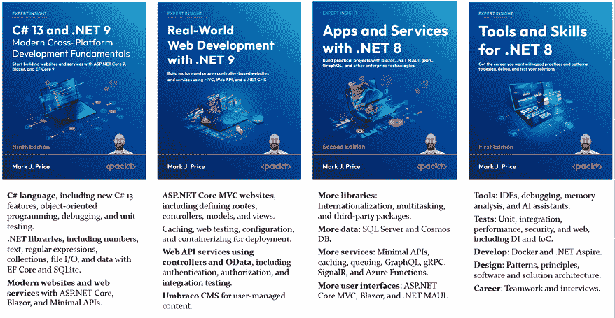
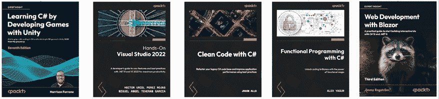

# 结语

我希望这本书与市场上的其他书籍有所不同。我希望您发现它读起来轻松愉快，内容丰富，包含了每个主题的实用、动手实践指南。

这篇结语包含以下简短部分：

+   C# 和 .NET 学习之旅的下一步

+   .NET 10 的第十版

+   祝好运！

# C# 和 .NET 学习之旅的下一步

对于我在本书中没有空间涵盖但您可能想了解更多内容的主题，我希望 GitHub 仓库中的笔记、良好实践技巧和链接能为您指明正确的方向：

[`github.com/markjprice/cs13net9/blob/main/docs/book-links.md`](https://github.com/markjprice/cs13net9/blob/main/docs/book-links.md)

## 使用设计指南来磨练你的技能

现在您已经学会了使用 C# 和 .NET 进行开发的基础知识，您可以通过学习更详细的设计指南来提高您代码的质量。

在早期 .NET Framework 时代，微软出版了一本涵盖 .NET 开发所有领域的良好实践的书。这些推荐对现代 .NET 开发仍然非常适用。

以下主题将得到涵盖：

+   命名指南

+   类型设计指南

+   成员设计指南

+   为可扩展性设计

+   异常设计指南

+   使用指南

+   常见设计模式

为了使指南尽可能易于遵循，推荐被简单地标记为 **Do**（做）、**Consider**（考虑）、**Avoid**（避免）和 **Do not**（不要）。

微软已将本书的摘录发布在以下链接：

[`learn.microsoft.com/en-us/dotnet/standard/design-guidelines/`](https://learn.microsoft.com/en-us/dotnet/standard/design-guidelines/)

我强烈建议您回顾所有指南并将其应用于您的代码。

## 继续你的学习之旅的伴侣书籍

我已经写了三本新书，以继续使用 .NET 8 和 .NET 9 的学习之旅，这些学习之旅是从这本基础知识书籍开始的。

*图 16.1* 展示了 .NET 8 和 .NET 9 四本书的总结及其最重要的主题：

图 16.1：学习 C# 和 .NET 的伴侣书籍

其他书籍作为本书的伴侣，共同构成了一个 .NET 8 和 .NET 9 四本书系列：

1.  第一本书（您现在正在阅读的）涵盖了现代网络开发中 C#、.NET 和 ASP.NET Core 的基础知识。.NET 9 的第九版是对第 8 版的小幅更新，因为 .NET 9 是一个标准术语支持版本（只有 18 个月）。它包括了自第 8 版出版以来列出的勘误和改进，可以在以下链接中找到：[`github.com/markjprice/cs12dotnet8/blob/main/docs/errata/README.md`](https://github.com/markjprice/cs12dotnet8/blob/main/docs/errata/README.md)。

1.  第二本书涵盖了使用.NET 9 的实战网络开发。这意味着它涵盖了成熟且经过验证的技术，并基于控制器架构。这包括 ASP.NET Core MVC、使用控制器的 Web API、OData 以及最受欢迎的.NET CMS，Umbraco。

1.  第三本书涵盖了你应该学习的重要工具和技能，以成为一名全面的专业.NET 开发者。这些包括设计模式和解构架构、调试、内存分析、从单元和集成到性能和 Web UI 测试的所有重要测试类型，以及像 Docker 和.NET Aspire 这样的主题。最后，它探讨了如何准备面试以获得你想要的.NET 开发者职业生涯。这本书将不会更新为.NET 9。

1.  第四本书涵盖了更多专业化的主题，如国际化以及包括 Serilog 和 Noda Time 在内的流行第三方包。它展示了如何使用 ASP.NET Core Minimal APIs 构建原生的 AOT 编译服务，以及如何通过缓存、队列和后台服务来提高性能、可扩展性和可靠性。它涵盖了使用 GraphQL、gRPC、SignalR 和 Azure Functions 实现更多服务。最后，它展示了如何使用 Blazor 和.NET MAUI 为网站、桌面和移动应用构建图形用户界面。这本书将不会更新为.NET 9。

要查看我通过 Packt 出版的所有书籍的列表，你可以使用以下链接：

[`subscription.packtpub.com/search?query=mark+j.+price`](https://subscription.packtpub.com/search?query=mark+j.+price)

## 其他书籍以进一步深化你的学习

如果你正在寻找我的出版商出版的其他相关主题的书籍，有很多可供选择，如图*图 16.2*所示：

图 16.2：Packt 书籍以进一步深化你的 C#和.NET 学习

你还可以在以下链接的 GitHub 仓库中找到 Packt 书籍列表：

[`github.com/markjprice/cs13dotn`](https://github.com/markjprice/cs13dotn)et9/blob/main/docs/book-links.md#learn-from-other-packt-books)

# .NET 10 的第十版

我已经开始着手确定第十版的改进领域，我们计划在更新我的.NET 书籍四部曲的其他成员的同时发布。我预计.NET 10 将对.NET 的所有方面做出有价值的改进，并且作为一个**长期支持**（**LTS**）版本，它将得到支持直到 2028 年 11 月。

你可以通过这本书学习如何使用.NET 10，包括从 2025 年 2 月开始提供的.NET 10 预览版，以下链接：

[`github.com/markjprice/cs13net9/blob/main/docs/dotnet10.md`](https://github.com/markjprice/cs13net9/blob/main/docs/dotnet10.md)

如果您有希望看到涵盖或扩展的话题建议，或者您在文本或代码中发现了需要修复的错误，请通过 Discord 频道或本书的 GitHub 仓库的聊天告诉我详细信息，该仓库的链接如下：

[`github.com/markjprice/cs13net9`](https://github.com/markjprice/cs13net9)

# 祝您好运！

我祝您在所有 C# 和 .NET 项目中一切顺利！

# 在 Discord 上了解更多信息

要加入这本书的 Discord 社区——在那里您可以分享反馈、向作者提问，并了解新书发布——请扫描下面的二维码：

[`packt.link/csharp13dotnet9`](https://packt.link/csharp13dotnet9)

# 留下评论！

感谢您从 Packt Publishing 购买这本书——我们希望您喜欢它！您的反馈对我们来说无价，它帮助我们改进和成长。请花一点时间留下一个 [Amazon 评论](https://packt.link/r/1835881238)；这只需一分钟，但对像您这样的读者来说意义重大。

扫描下面的二维码以获得您选择的免费电子书。

https://packt.link/NzOWQ
