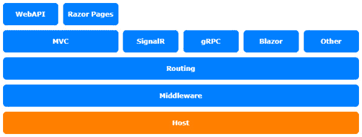
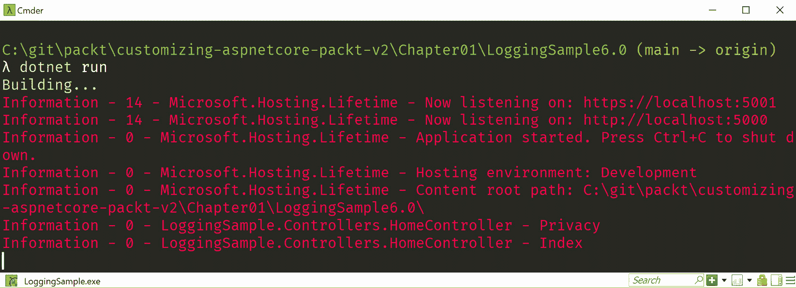

# *第一章*：自定义日志记录

在本书关于自定义 **ASP.NET** **Core** 的第一章节中，您将了解如何自定义 **日志记录**。默认的日志记录仅写入控制台或调试窗口。这对于大多数情况来说相当不错，但有时您需要将日志记录到其他位置，例如文件或数据库。或者，也许您想通过附加额外信息来扩展日志记录器。在这些情况下，您需要了解如何更改默认的日志记录。

在本章中，我们将涵盖以下主题：

+   配置日志记录

+   创建自定义日志记录器

+   插入现有的第三方日志记录提供程序

本章中的主题涉及 ASP.NET Core 架构的托管层：



图 1.1 – ASP.NET Core 架构

# 技术要求

要遵循本章中的描述，您需要创建一个 ASP.NET Core MVC 应用程序。为此，打开您的控制台、shell 或 Bash 终端，并切换到您的当前工作目录。然后，使用以下命令创建一个新的 MVC 应用程序：

```cs
dotnet new mvc -n LoggingSample -o LoggingSample
```

现在，通过双击项目文件或在 Visual Studio Code 中在已打开的控制台中输入以下命令来打开项目在 **Microsoft** **Visual Studio** 中的项目：

```cs
cd LoggingSample
code .
```

本章中的所有代码示例都可以在本书的 **GitHub** 仓库中找到，网址为 [`github.com/PacktPublishing/Customizing-ASP.NET-Core-6.0-Second-Edition/tree/main/Chapter01`](https://github.com/PacktPublishing/Customizing-ASP.NET-Core-6.0-Second-Edition/tree/main/Chapter01)。

# 配置日志记录

在 ASP.NET Core 的早期版本（即 2.0 版本之前），日志记录是在 `Startup.cs` 中配置的。提醒一下，自 2.0 版本以来，`Startup.cs` 文件已被简化，许多配置已移动到默认的 `WebHostBuilder`，该 `WebHostBuilder` 在 `Program.cs` 中被调用。此外，日志记录也已移动到默认的 `WebHostBuilder`。

在 ASP.NET Core 3.1 及更高版本中，`Program.cs` 文件变得更加通用，首先会创建 `IHostBuilder`。`IHostBuilder` 对于无需所有 ASP.NET 网络功能即可启动应用程序非常有用。我们将在本书的后面部分了解更多关于 `IHostBuilder` 的内容。使用这个 `IHostBuilder`，我们创建 `IWebHostBuilder` 来配置 ASP.NET Core。在 ASP.NET Core 3.1 及更高版本中，我们通过 `webBuilder` 变量获得 `IWebHostBuilder`：

```cs
public class Program
{
    public static void Main(string[] args)
    {
        CreateHostBuilder(args).Build().Run();
    }
    public static IHostBuilder CreateHostBuilder(
      string[]args) =>
        Host.CreateDefaultBuilder(args)
            .ConfigureWebHostDefaults(webBuilder =>
            {
                webBuilder.UseStartup<Startup>();
            });
}
```

在 ASP.NET Core 6.0 中，Microsoft 引入了 `Startup` 文件，并将所有配置添加到 `Program.cs` 文件中。让我们看看它是什么样子：

```cs
var builder = WebApplication.CreateBuilder(args);
// Add services to the container.
builder.Services.AddControllersWithViews();
var app = builder.Build();
// The rest of the file isn't relevant for this chapter
```

在 ASP.NET Core 中，你可以几乎覆盖和自定义几乎所有内容。这包括日志记录。`IWebHostBuilder` 有许多扩展方法，允许我们覆盖不同功能的默认行为。要覆盖日志记录的默认设置，我们需要使用 `ConfigureLogging` 方法。下面的代码片段显示了几乎与 `ConfigureWebHostDefaults()` 方法内部配置的相同日志记录：

```cs
Host.CreateDefaultBuilder(args)
    .ConfigureWebHostDefaults(webBuilder =>
    {
        webBuilder
            .ConfigureLogging((hostingContext, logging) =>
            {
                logging.AddConfiguration(
                  hostingContext.Configuration.GetSection(
                    "Logging"));
                logging.AddConsole();
                logging.AddDebug();
            })
            .UseStartup<Startup>();
```

使用最小 API 方法，我们不再需要 `ConfigureLogging` 方法，可以直接使用 `WebApplicationBuilder` 的 `Logging` 属性：

```cs
builder.Logging.AddConfiguration(builder.Configuration.GetSection("Logging"));
builder.Logging.AddConsole();
builder.Logging.AddDebug();
```

现在我们已经看到了如何配置日志记录，让我们来看看如何构建自定义日志记录器。

# 创建自定义日志记录器

为了演示自定义日志记录器，让我们使用一个小巧简单的日志记录器，它能够将特定日志级别的日志条目着色到控制台。这个日志记录器被称为 `ColoredConsoleLogger`，它将通过 `LoggerProvider` 创建并添加，我们还需要为自己编写它。为了指定要着色的颜色和日志级别，我们需要添加一个配置类。

在接下来的代码片段中，展示了三个部分（`Logger`、`LoggerProvider` 和 `Configuration`）：

1.  让我们在与 `Program.cs` 文件相同的文件夹中创建一个新的文件 `CustomLogger.cs`，作为我们日志记录器的配置类。在文件的顶部添加以下 `using` 语句：

    ```cs
    namespace LoggingSample;
    ```

    我们将其命名为 `ColoredConsoleLoggerConfiguration`。这个类包含三个属性来定义 – `LogLevel`、`EventId` 和 `Color` – 这些都可以设置：

    ```cs
    public class ColoredConsoleLoggerConfiguration
    {
        public LogLevel LogLevel { get; set; } = 
          LogLevel.Warning;
        public int EventId { get; set; } = 0;
        public ConsoleColor Color { get; set; } = 
          ConsoleColor.Yellow;
    }
    ```

1.  接下来，我们需要一个提供者来检索配置并创建实际的日志记录器实例：

    ```cs
    public class ColoredConsoleLoggerProvider : ILoggerProvider
    {
        private readonly ColoredConsoleLoggerConfiguration
          _config;
        private readonly ConcurrentDictionary<string,
          ColoredConsoleLogger> _loggers =
            new ConcurrentDictionary<string,
               ColoredConsoleLogger>();
        public ColoredConsoleLoggerProvider
          (ColoredConsoleLoggerConfiguration config)
        {
            _config = config;
        }
        public ILogger CreateLogger(string categoryName)
        {
            return _loggers.GetOrAdd(categoryName, name =>
                new ColoredConsoleLogger(name, _config));
        }
        public void Dispose()
        {
            _loggers.Clear();
        }
    }
    ```

    不要忘记添加 `System.Collections.Concurrent` 的 `using` 语句。

1.  第三个类是我们想要使用的实际日志记录器：

    ```cs
    public class ColoredConsoleLogger : ILogger
    {
        private static object _lock = new Object();
        private readonly string _name;
        private readonly ColoredConsoleLoggerConfiguration 
          _config;
        public ColoredConsoleLogger(
            string name,
            ColoredConsoleLoggerConfiguration config)
        {
            _name = name;
            _config = config;
        }
        public IDisposable BeginScope<TState>(TState 
          state)
        {
            return null;
        }
        public bool IsEnabled(LogLevel logLevel)
        {
            return logLevel == _config.LogLevel;
        }
        public void Log<TState>(
            LogLevel logLevel,
            EventId eventId,
            TState state,
            Exception exception,
            Func<TState, Exception, string> formatter)
        {
            if (!IsEnabled(logLevel))
            {
                return;
            }
            lock (_lock)
            {
                if (_config.EventId == 0 ||
                    _config.EventId == eventId.Id)
                {
                    var color = Console.ForegroundColor;
                    Console.ForegroundColor = 
                      _config.Color;
                    Console.Write($"{logLevel} - ");
                    Console.Write($"{eventId.Id} - {_name}
                                  - ");
                    Console.Write($"{formatter(state,
                                     exception)}\n");
                    Console.ForegroundColor = color;
                }
            }
        }
    }
    ```

    我们现在需要锁定实际的控制台输出 – 这是因为我们将遇到一些竞争条件，其中错误的日志条目会以错误的颜色着色，因为控制台本身并不是真正的线程安全的。

1.  完成此操作后，我们可以开始将新的日志记录器插入到 `Program.cs` 中的配置中：

    ```cs
    builder.Logging.ClearProviders();
    var config = new ColoredConsoleLoggerConfiguration
    {
        LogLevel = LogLevel.Information,
        Color = ConsoleColor.Red
    };
    builder.Logging.AddProvider(new 
        ColoredConsoleLoggerProvider(config));
    ```

你可能需要在 `LoggerSample` 命名空间中添加一个 `using` 语句。

如果你不想使用现有的日志记录器，你可以清除之前添加的所有日志记录器提供者。然后，我们调用 `AddProvider` 来添加我们 `ColoredConsoleLoggerProvider` 类的一个新实例，并带有特定的设置。我们也可以添加一些具有不同设置的提供者实例。

这显示了如何以不同的方式处理日志级别。你可以使用这种方法来发送有关严重错误的电子邮件，或将调试消息记录到与常规信息消息不同的日志接收器，等等。

*图 1.2* 展示了之前创建的自定义日志记录器的彩色输出：



图 1.2 – 自定义日志记录器的截图

在许多情况下，编写自定义日志记录器是没有意义的，因为已经有许多优秀的第三方日志记录器可用，例如`ELMAH`、`log4net`和`NLog`。在下一节中，我们将看到如何在 ASP.NET Core 中使用`NLog`。

# 插入现有的第三方日志记录器提供程序

`NLog`是首批可用的日志记录器之一，因为`NLog`也提供了一个日志提供程序，可以轻松地将其插入到 ASP.NET Core 中。

你可以通过`NLog`找到它尚未明确支持 ASP.NET Core 6.0，但它仍然可以与版本 6.0 一起工作：

1.  我们需要添加一个`NLog.Config`文件，该文件定义了两个不同的接收器，将所有标准消息记录在单个日志文件中，并将自定义消息仅记录在另一个文件中。由于此文件过长，无法打印，你可以直接从 GitHub 查看或下载：[`github.com/PacktPublishing/Customizing-ASP.NET-Core-6.0-Second-Edition/blob/main/Chapter01/LoggingSample6.0/NLog.Config`](https://github.com/PacktPublishing/Customizing-ASP.NET-Core-6.0-Second-Edition/blob/main/Chapter01/LoggingSample6.0/NLog.Config)

1.  然后，我们需要从 NuGet 添加`NLog` ASP.NET Core 包：

    ```cs
    dotnet add package NLog.Web.AspNetCore
    ```

    重要提示

    在执行前面的命令之前，请确保你处于项目目录中！

1.  现在，你只需要在`Program.cs`中的`ConfigureLogging`方法中清除所有其他提供程序，并使用`IWebHostBuilder`的`UseNLog()`方法来使用`NLog`：

    ```cs
    Host.CreateDefaultBuilder(args)
        .ConfigureWebHostDefaults(webBuilder =>
        {
            webBuilder
                .ConfigureLogging((hostingContext,
                  logging) =>
                {
                    logging.ClearProviders();
                    logging.SetMinimumLevel(
                      LogLevel.Trace);
                })
                .UseNLog()
                .UseStartup<Startup>();
        });
    ```

    使用最小 API，它看起来要简单得多：

    ```cs
    using NLog.Web;
    var builder = WebApplication.CreateBuilder(args);
    builder.Logging.ClearProviders();
    builder.Logging.SetMinimumLevel(LogLevel.Trace);
    builder.WebHost.UseNLog();
    ```

    在这里，你可以添加你需要的任意数量的日志提供程序。

这就涵盖了使用现有的第三方日志记录器。现在，让我们回顾一下本章所涵盖的内容。

# 摘要

隐藏应用程序的基本配置的好处在于，它允许你清理新搭建的项目，并尽可能简化实际的启动过程。开发者能够专注于实际的功能。然而，随着应用程序的增长，日志记录变得越来越重要。默认的日志配置既简单又有效，但在生产环境中，你需要一个持久的日志来查看过去的错误。因此，你需要添加自定义的日志配置或更灵活的第三方日志记录器，例如`NLog`或`log4net`。

你将在下一章中了解更多关于如何配置 ASP.NET Core 6.0 的信息。
