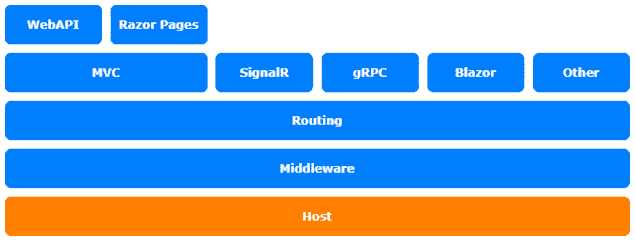

# *第二章*：自定义应用程序配置

本章的第二个部分是关于应用程序配置，如何使用它，以及如何自定义 ASP.NET 配置以采用不同的方式配置你的应用程序。也许你已经有了一个现有的 **可扩展标记语言** (**XML**) 配置，或者想要在不同类型的应用程序之间共享一个 **YAML 不是标记语言** (**YAML**) 配置文件。有时，从数据库中读取配置值也是有意义的。

本章将涵盖以下主题：

+   配置配置

+   使用类型化配置

+   使用 **初始化** (**INI**) 文件进行配置

+   配置提供程序

本章讨论的主题涉及 ASP.NET Core 架构的托管层：



图 2.1 – ASP.NET Core 架构

# 技术要求

为了遵循本章的描述，你需要创建一个 ASP.NET Core **模型-视图-控制器** (**MVC**) 应用程序。打开你的控制台、shell 或 Bash 终端，并切换到你的工作目录。使用以下命令创建一个新的 MVC 应用程序：

```cs
dotnet new mvc -n ConfigureSample -o ConfigureSample
```

现在，通过双击项目文件或在 **Visual Studio Code** (**VS Code**) 中在已打开的控制台中输入以下命令来在 Visual Studio 中打开项目：

```cs
cd ConfigureSample
code .
```

本章中的所有代码示例都可以在本书的 GitHub 仓库中找到，网址为 [`github.com/PacktPublishing/Customizing-ASP.NET-Core-6.0-Second-Edition/tree/main/Chapter02`](https://github.com/PacktPublishing/Customizing-ASP.NET-Core-6.0-Second-Edition/tree/main/Chapter02)。

# 配置配置

让我们先看看如何配置你的各种配置选项。

自从 ASP.NET Core 2.0 以来，配置被隐藏在 `WebHostBuilder` 的默认配置中，不再是 `Startup.cs` 的一部分。这有助于保持启动过程的简洁和简单。

在 ASP.NET Core 3.1 到 ASP.NET Core 5.0 中，代码看起来是这样的：

```cs
// ASP.NET Core 3.0 and later
public class Program
{
    public static void Main(string[] args)
    {
        CreateWebHostBuilder(args).Build().Run();
    }
    public static IHostBuilder CreateHostBuilder(string[] 
      args) =>
        Host.CreateDefaultBuilder(args)
            .ConfigureWebHostDefaults(webBuilder =>
            {
                webBuilder.UseStartup<Startup>();
            }
}
```

在 ASP.NET Core 6.0 中，Microsoft 引入了最小的 `Startup` 并将所有配置添加到 `Program.cs` 文件中。让我们看看它的样子：

```cs
Var builder = WebApplication.CreateBuilder(args);
// Add services to the container.
builder.Services.AddControllersWithViews();
var app = builder.Build();
// The rest of the file isn't relevant for this chapter
```

幸运的是，在两个版本中，你也能够覆盖默认设置以根据需要自定义配置。在两个版本中，我们通过 `ConfigureAppConfiguration()` 方法扩展了 `IWebHostBuilder`，这里的魔法就会发生。

这就是 ASP.NET Core 3.1 和 ASP.NET Core 5.0 中的配置样子。

```cs
Host.CreateDefaultBuilder(args)
    .ConfigureWebHostDefaults(webBuilder =>
    {
        webBuilder
          .ConfigureAppConfiguration((builderContext,
            config) =>
        {
            // configure configuration here
        })
        .UseStartup<Startup>();
    });
```

这就是使用最小 API 方法时的代码样子。你也可以使用 `ConfigureAppConfiguration` 来配置应用程序配置：

```cs
builder.WebHost.ConfigureAppConfiguration((builderContext, config) =>
{
    // configure configuration here
});
```

但有一个更简单的方法，通过访问构建器的 `Configuration` 属性：

```cs
builder.Configuration.AddJsonFile(
     "appsettings.json",
     optional: false,
     reloadOnChange: true);
```

当你创建一个新的 ASP.NET Core 项目时，你将已经配置了`appsettings.json`和`appsettings.Development.json`。你可以，并且应该使用这些配置文件来配置你的应用程序；这是预配置的方式，大多数 ASP.NET Core 开发者都会寻找一个`appsettings.json`文件来配置应用程序。这是绝对可以接受的，并且工作得很好。

以下代码片段展示了封装的默认配置，用于读取`appsettings.json`文件：

```cs
var env = builder.Environment;
builder.Configuration.SetBasePath(env.ContentRootPath);
builder.Configuration.AddJsonFile(
    "appsettings.json", 
    optional: false, 
    reloadOnChange: true);
builder.Configuration.AddJsonFile(
    $"appsettings.{env.EnvironmentName}.json", 
    optional: true, 
    reloadOnChange: true);
builder.Configuration.AddEnvironmentVariables();
```

此配置还设置了应用程序的基本路径，并通过环境变量添加了配置。

无论何时自定义应用程序配置，你都应该通过使用`AddEnvironmentVariables()`方法将配置作为最终步骤添加到环境变量中。配置的顺序很重要，你稍后添加的配置提供程序将覆盖之前添加的配置。确保环境变量始终覆盖通过文件设置的配置。这样，你也可以确保在 Azure App Service 上配置的应用程序配置将以环境变量的形式传递给应用程序。

`IConfigurationBuilder`有很多扩展方法来添加更多配置，例如 XML 或 INI 配置文件和内存中的配置。你可以找到社区构建的附加配置提供程序，用于读取 YAML 文件、数据库值以及更多。在接下来的部分中，我们将看到如何读取 INI 文件。首先，我们将探讨使用类型化配置。

# 使用类型化配置

在尝试读取 INI 文件之前，先看看如何使用类型化配置而不是通过`IConfiguration`逐个读取配置。

要读取类型化配置，你需要定义要配置的类型。我通常创建一个名为`AppSettings`的类，如下所示：

```cs
namespace ConfigureSample;
public class AppSettings
{
    public int Foo { get; set; }
    public string Bar { get; set; }
}
```

这是在 ASP.NET Core 5.0 之前的`Startup.cs`中的简单`ConfigureServices`方法：

```cs
services.Configure<AppSettings>
   (Configuration.GetSection("AppSettings"));
```

使用最小 API 方法，你需要像这样配置`AppSettings`类：

```cs
builder.Services.Configure<AppSettings>(
    builder.Configuration.GetSection("AppSettings"));
```

这样，类型化配置也注册为依赖注入（**DI**）容器中的服务，可以在应用程序的任何地方使用。你可以为每个配置部分创建不同的配置类型。在大多数情况下，一个部分就足够了，但有时将设置分成不同的部分是有意义的。下一个片段展示了如何在 MVC 控制器中使用配置：

```cs
using Microsoft.Extensions.Options;
// ...
public class HomeController : Controller
{
    private readonly AppSettings _options;
    public HomeController(IOptions<AppSettings> options)
    {
        _options = options.Value;
    }
    public IActionResult Index()
    {
        ViewData["Message"] = _options.Bar;
        return View();
    }
```

`IOptions<AppSettings>`是我们`AppSettings`类型的包装器，`Value`属性包含实际的`AppSettings`实例，包括来自配置文件的值。

要尝试读取设置，`appsettings.json`文件需要配置`AppSettings`部分，否则值将为 null 或未设置。现在让我们将部分添加到`appsettings.json`文件中，如下所示：

```cs
{
    "Logging": {
        "LogLevel": {
            "Default": "Warning"
        }
    },
    "AllowedHosts": "*",
    "AppSettings": {
        "Foo": 123,
        "Bar": "Bar"
    }
}
```

接下来，我们将检查 INI 文件如何用于配置。

# 使用 INI 文件进行配置

要使用 INI 文件配置应用程序，您需要在 `Program.cs` 中的 `ConfigureAppConfiguration()` 方法内添加 INI 配置，如下所示：

```cs
builder.Configuration.AddIniFile(
    "appsettings.ini", 
    optional: false, 
    reloadOnChange: true);
builder.Configuration.AddJsonFile(
    $"appsettings.{env.EnvironmentName}.ini", 
    optional: true, 
    reloadOnChange: true);
```

此代码以与 **JavaScript 对象表示法**（**JSON**）配置文件相同的方式加载 INI 文件。第一行是必需的配置，第二行是可选配置，取决于当前运行时环境。

INI 文件可能看起来像这样：

```cs
[AppSettings]
Bar="FooBar"
```

如您所见，此文件包含一个名为 `AppSettings` 的部分和一个名为 `Bar` 的属性。

之前我们说过配置的顺序很重要。如果您在配置 JSON 文件之后添加配置 INI 文件的两个行，INI 文件将覆盖 JSON 文件的设置。`Bar` 属性被覆盖为 `"FooBar"`，而 `Foo` 属性保持不变，因为它不会被覆盖。此外，INI 文件外的值将通过之前创建的类型化配置提供。

每个其他配置提供程序都将以相同的方式工作。现在让我们看看配置提供程序将是什么样子。

# 配置提供程序

配置提供程序是 `IConfigurationProvider` 的实现，由配置源创建，配置源是 `IConfigurationSource` 的实现。然后配置提供程序从某处读取数据，并通过 `Dictionary` 提供它。

要将自定义或第三方配置提供程序添加到 ASP.NET Core，您需要在 `ConfigurationBuilder` 上调用 `Add` 方法并插入配置源。这是一个示例：

```cs
// add new configuration source
builder.Configuration.Add(new MyCustomConfigurationSource
{
    SourceConfig = //configure whatever source
    Optional = false,
    ReloadOnChange = true
});
```

通常，您会创建一个扩展方法来更轻松地添加配置源，如下所示：

```cs
builder.Configuration.AddMyCustomSource("source", optional: false, reloadOnChange: true);
```

关于如何创建自定义配置提供程序的详细具体示例是由 Andrew Lock 编写的。您可以在本章的 *进一步阅读* 部分找到它。

# 摘要

在大多数情况下，您不需要添加不同的配置提供程序或创建自己的配置提供程序，但了解如何更改它是很好的，以防万一。此外，使用类型化配置是读取和提供设置的不错方式。在经典 ASP.NET 中，我们使用手动创建的界面以类型化方式读取应用程序设置。现在，只需提供类型即可自动完成此操作。此类型将被自动实例化、填充并提供，通过依赖注入。

要了解有关在 ASP.NET Core 6.0 中自定义依赖注入的更多信息，让我们看看下一章。

# 进一步阅读

您可以参考以下来源获取更多信息：

+   *在 ASP.NET Core 中创建自定义 ConfigurationProvider 以解析 YAML*，作者：Andrew Lock：[`andrewlock.net/creating-a-custom-iconfigurationprovider-in-asp-net-core-to-parse-yaml/`](https://andrewlock.net/creating-a-custom-iconfigurationprovider-in-asp-net-core-to-parse-yaml/)
