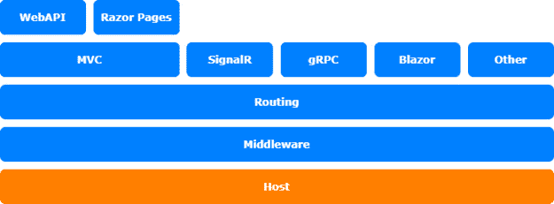
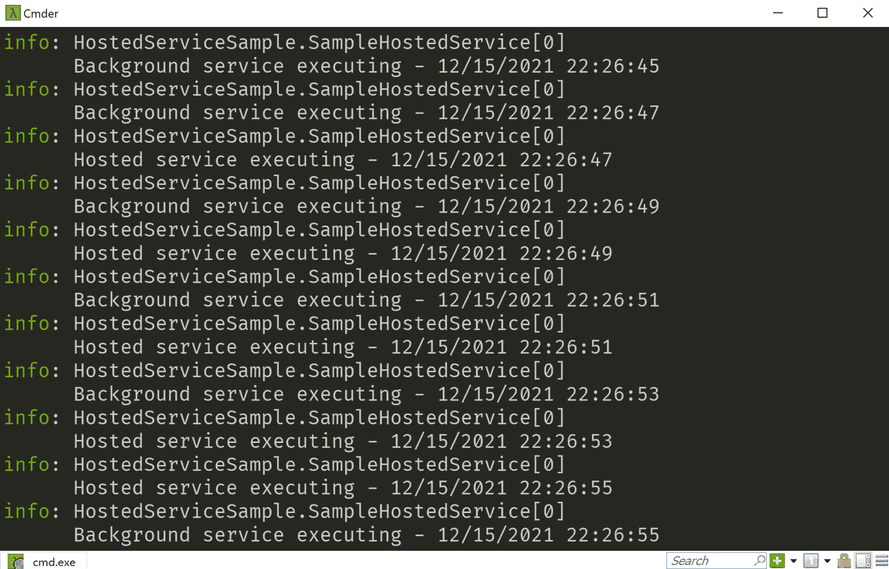

# *第七章*：使用 IHostedService 和 BackgroundService

这第七章并不是真的关于定制；它更多的是关于你可以用来创建后台服务以在应用程序内部异步运行任务的特性。我在一个小型的 ASP.NET Core 应用程序中定期从远程服务获取数据时使用了这个特性。

我们将探讨以下主题：

+   介绍 `IHostedService`

+   介绍 `BackgroundService`

+   实现新的 Worker Service 项目

本章的主题涉及 ASP.NET Core 架构的宿主层：



图 7.1 – ASP.NET Core 架构

# 技术要求

要遵循本章的描述，你需要创建一个 ASP.NET Core 应用程序。打开你的控制台、shell 或 Bash 终端，切换到你的工作目录。使用以下命令创建一个新的 MVC 应用程序：

```cs
dotnet new mvc -n HostedServiceSample -o HostedServiceSample
```

现在通过双击项目文件或在 VS Code 中更改文件夹到项目，并在已经打开的控制台中输入以下命令来在 Visual Studio 中打开项目：

```cs
cd HostedServiceSample
code .
```

本章中所有的代码示例都可以在本书的 GitHub 仓库中找到：[`github.com/PacktPublishing/Customizing-ASP.NET-Core-6.0-Second-Edition/tree/main/Chapter07`](https://github.com/PacktPublishing/Customizing-ASP.NET-Core-6.0-Second-Edition/tree/main/Chapter07).

# 介绍 IHostedService

自从 ASP.NET Core 2.0 以来，托管服务一直是一个东西，可以用来在应用程序的后台异步运行任务。它们可以用来定期获取数据，后台进行一些计算，或者进行一些清理。你还可以使用它们来发送预配置的电子邮件——或者你需要在后台做的任何事情。

托管服务基本上是实现了 `IHostedService` 接口的简单类。你可以用以下代码调用它们：

```cs
public class SampleHostedService : IHostedService
{
    public Task StartAsync(CancellationToken 
      cancellationToken)
    {
    }
    public Task StopAsync(CancellationToken 
     cancellationToken)
    {
    }
}
```

`IHostedService` 需要实现一个 `StartAsync()` 方法和一个 `StopAsync()` 方法。`StartAsync()` 方法是执行逻辑的地方。该方法在应用程序启动后立即执行一次。另一方面，`StopAsync()` 方法在应用程序停止前执行。这也意味着要启动一个计划中的服务，你需要自己实现它。你需要实现一个循环，定期执行代码。

要执行一个 `IHostedService`，你需要将其注册到 ASP.NET Core 依赖注入容器中作为一个单例实例：

```cs
builder.Services.AddSingleton<IHostedService, SampleHostedService>();
```

下一个示例展示了托管服务的工作原理。它在启动时、停止时以及每 2 秒向控制台写入一条日志消息：

1.  首先，编写一个通过 `DependencyInjection` 获取 `ILogger` 的类骨架：

    ```cs
    namespace HostedServiceSample;
    public class SampleHostedService : IHostedService
    {
        private readonly ILogger<SampleHostedService> 
          logger;
        // inject a logger
        public 
          SampleHostedService(ILogger<SampleHostedService> 
            logger)
        {
            this.logger = logger;
        }
        public Task StartAsync(CancellationToken 
          cancellationToken)
        {
        }
        public Task StopAsync(CancellationToken 
          cancellationToken)
        {
        }
    }
    ```

1.  下一步是实现 `StopAsync` 方法。该方法用于清理，以防你需要关闭连接、流等：

    ```cs
    public Task StopAsync(CancellationToken 
      cancellationToken)
    {
        logger.LogInformation("Hosted service stopping");
        return Task.CompletedTask;
    }
    ```

1.  实际工作将在 `StartAsync` 方法中完成：

    ```cs
    public Task StartAsync(CancellationToken 
      cancellationToken)
    {
        logger.LogInformation("Hosted service starting");
        return Task.Factory.StartNew(async () =>
        {
            // loop until a cancelation is requested
            while 
             (!cancellationToken.IsCancellationRequested)
            {
                logger.LogInformation($"Hosted service 
                  executing - {DateTime.Now}");
                try
                {
                    // wait for 2 seconds
                    await 
                     Task.Delay(TimeSpan.FromSeconds(2), 
                       cancellationToken);
                }
                catch (OperationCanceledException) { }
            }
        }, cancellationToken);
    }
    ```

1.  为了测试这一点，请在控制台中调用以下命令来启动应用程序：

    ```cs
    dotnet run
    ```

    或者，在 Visual Studio 或 VS Code 中按*F5*。这将产生以下控制台输出：



图 7.2 – dotnet run 输出的截图

如您所见，日志输出每 2 秒写入控制台。

在下一节中，我们将探讨`BackgroundService`。

# 介绍 BackgroundService

`BackgroundService`类是在 ASP.NET Core 3.0 中引入的，它基本上是一个实现`IHostedService`接口的抽象类。它还提供了一个名为`ExecuteAsync()`的抽象方法，该方法返回一个`Task`。

如果您想重用上一节中的托管服务，则需要重写代码。按照以下步骤学习如何操作：

1.  首先，编写通过`DependencyInjection`检索`ILogger`的类骨架：

    ```cs
    namespace HostedServiceSample;
    public class SampleBackgroundService : 
      BackgroundService
    {
        private readonly ILogger<SampleHostedService> 
          logger;
        // inject a logger
        public SampleBackgroundService(
            ILogger<SampleHostedService> logger)
        {
            this.logger = logger;
        }
    }
    ```

1.  下一步将是重写`StopAsync`方法：

    ```cs
    public override async Task StopAsync(CancellationToken 
      cancellationToken)
    {
        logger.LogInformation("Background service 
          stopping");
        await Task.CompletedTask;
    }
    ```

1.  在最后一步，我们将重写`ExecuteAsync`方法，该方法执行所有工作：

    ```cs
    protected override async Task 
      ExecuteAsync(CancellationToken cancellationToken)
    {
        logger.LogInformation("Background service 
          starting");
        await Task.Factory.StartNew(async () =>
        {
            while 
              (!cancellationToken.IsCancellationRequested)
            {
                logger.LogInformation($"Background service 
                  executing - {DateTime.Now}");
                try
                {
                    await 
                      Task.Delay(TimeSpan.FromSeconds(2), 
                        cancellationToken);
                }
                catch (OperationCanceledException) {}
            }
        }, cancellationToken);
    }
    ```

    甚至注册也是新的。

此外，在 ASP.NET Core 3.0 及以后版本中，`ServiceCollection`有一个新的扩展方法来注册托管服务或后台工作线程：

```cs
builder.Services.AddHostedService<SampleBackgroundService>();
```

为了测试这一点，请在控制台中调用以下命令来启动应用程序：

```cs
dotnet run
```

或者，在 Visual Studio 或 VS Code 中按*F5*。它应该显示与您在上一节中创建的`SampleHostedService`几乎相同的输出。

接下来，让我们看看 Worker Service 项目。

# 实现新的 Worker Service 项目

在 ASP.NET Core 3.0 及以后版本中，**工作服务**和通用托管使得创建简单的服务类应用程序变得非常容易，这些应用程序可以做一些事情，而不需要完整的 ASP.NET 堆栈 – 以及不需要 Web 服务器。

您可以使用以下命令创建此项目：

```cs
dotnet new worker -n BackgroundServiceSample -o BackgroundServiceSample
```

基本上，这会创建一个包含`Program.cs`和`Worker.cs`文件的控制台应用程序。`Worker.cs`文件包含继承自`BackgroundService`类的`Worker`类。在 ASP.NET 5.0 及更早版本中，`Program.cs`文件看起来与我们在 ASP.NET Core 的早期版本中看到的样子非常相似，但没有`WebHostBuilder`：

```cs
public class Program
{
    public static void Main(string[] args)
    {
        CreateHostBuilder(args).Build().Run();
    }
    public static IHostBuilder CreateHostBuilder(string[] 
      args) =>
        Host.CreateDefaultBuilder(args)
            .ConfigureServices((hostContext, services) =>
            {
                services.AddHostedService<Worker>();
            });
}
```

在 ASP.NET Core 6.0 中，`Program.cs`与最小 API 一样简化了。它看起来像这样：

```cs
using BackgroundServiceSample;
IHost host = Host.CreateDefaultBuilder(args)
    .ConfigureServices(services =>
    {
        services.AddHostedService<Worker>();
    })
    .Build();
await host.RunAsync();
```

这创建了一个启用依赖注入的`IHost`。这意味着我们可以在任何类型的.NET Core 应用程序中使用依赖注入，而不仅仅是 ASP.NET Core 应用程序。

然后将工作线程添加到服务集合中。

这有什么用？您可以将此应用程序作为 Windows 服务运行，或者作为 Docker 容器中的后台应用程序运行，该容器不需要 HTTP 端点。

# 摘要

您现在可以使用`IHostedService`和`BackgroundService`开始做一些更复杂的事情。请注意，后台服务因为它们都在同一个应用程序中运行；如果您使用过多的 CPU 或内存，这可能会减慢您的应用程序。

对于更大的应用程序，我建议在一个专门用于执行后台任务的应用程序中运行此类任务：一个单独的 Docker 容器、Azure 上的`BackgroundWorker`、Azure Functions 或类似的东西。然而，在这种情况下，它应该与主应用程序分开。

在下一章中，我们将学习中间件，以及如何使用它们在请求管道上实现特殊逻辑或在不同的路径上提供特定逻辑。
