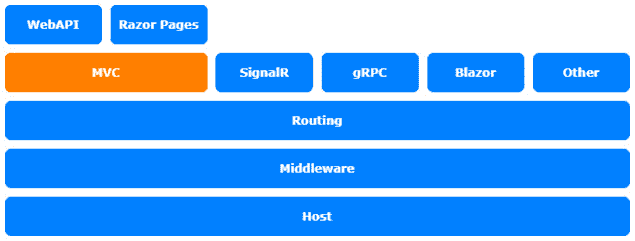
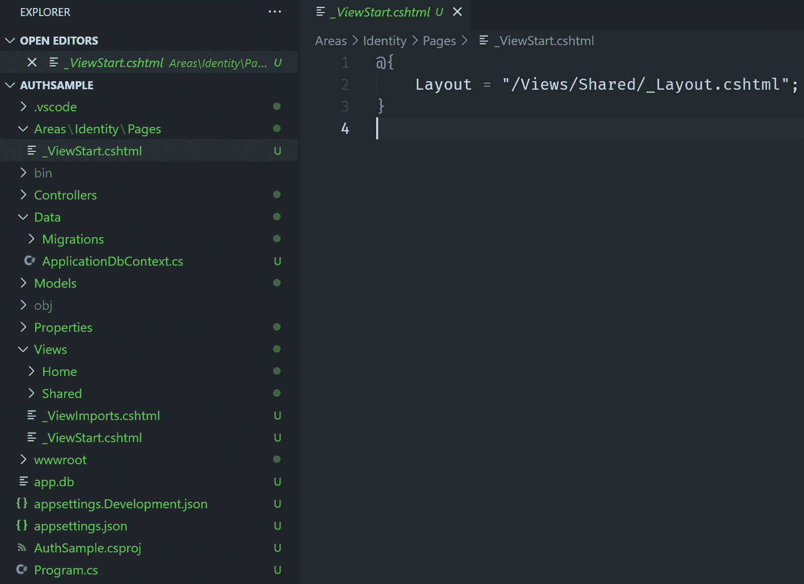
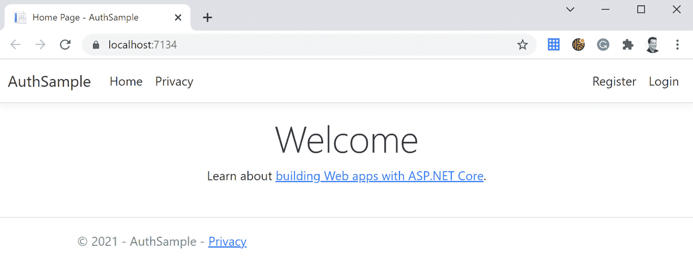
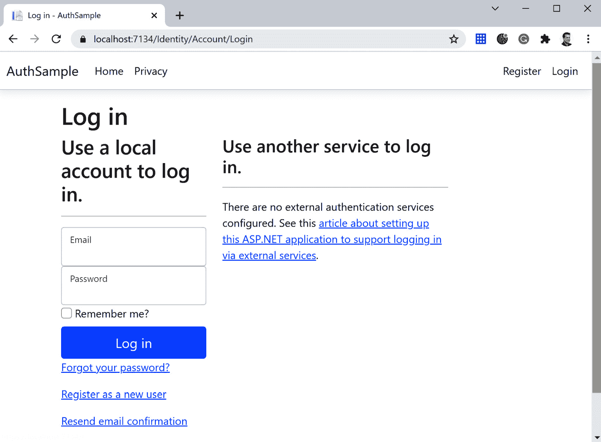
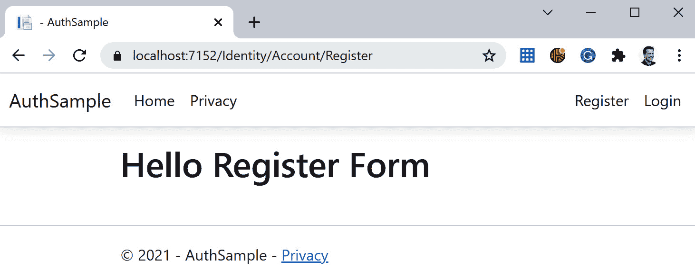
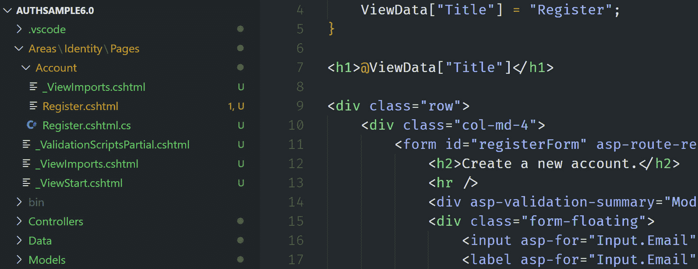
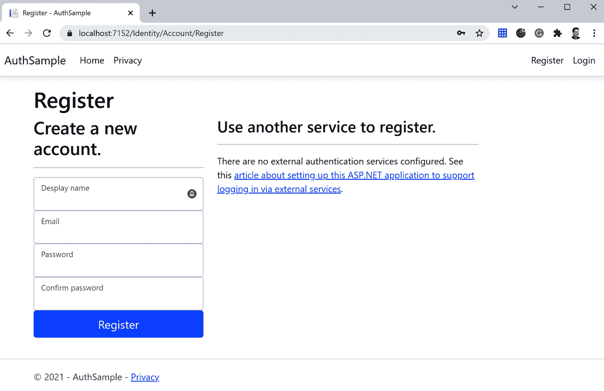
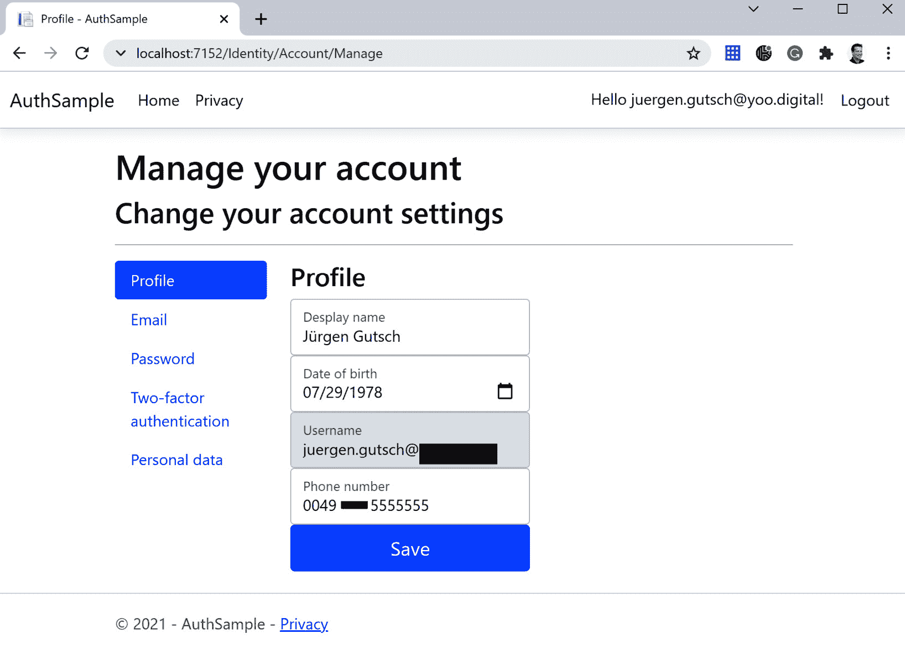
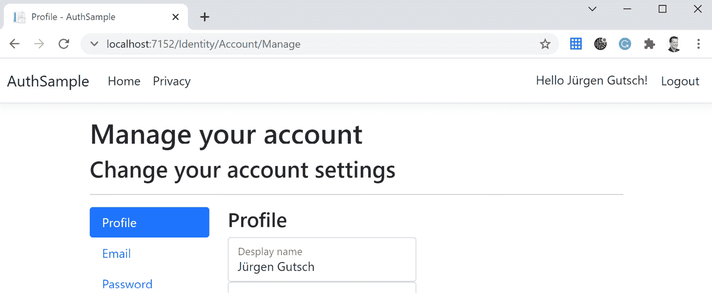

# 第十章：*第十章*: 自定义 ASP.NET Core Identity

在本章中，我们将学习如何自定义 ASP.NET Core Identity。安全性是应用程序最重要的方面之一。Microsoft 将 ASP.NET Core Identity 作为 ASP.NET Core 框架的一部分提供，以向 ASP.NET Core 应用程序添加身份验证和用户管理。

在本章中，您将学习如何自定义 ASP.NET Core Identity 的基本实现，以及如何向 **IdentityUser** 添加自定义信息。我们将涵盖以下内容：

+   介绍 ASP.Net Core Identity

+   自定义 IdentityUser

+   自定义身份视图

本章的主题与 ASP.NET Core 架构的 MVC 层相关：



图 10.1 – ASP.NET Core 架构

# 技术要求

要跟随本章的练习，您需要创建一个 ASP.NET Core MVC 应用程序。打开您的控制台、shell 或 Bash 终端，切换到您的工作目录。使用以下命令创建一个新的 MVC 应用程序：

```cs
dotnet new mvc -n AuthSample -o AuthSample --auth Individual
```

现在，通过双击项目文件在 Visual Studio 中打开项目，或者通过在已打开的控制台中输入以下命令在 Visual Studio Code 中打开它：

```cs
cd AuthSample
code .
```

本章的所有代码示例都可以在本书的 GitHub 仓库中找到：[`github.com/PacktPublishing/Customizing-ASP.NET-Core-6.0-Second-Edition/tree/main/Chapter10`](https://github.com/PacktPublishing/Customizing-ASP.NET-Core-6.0-Second-Edition/tree/main/Chapter10)。

# 介绍 ASP.NET Core Identity

一个 `writer` 告诉应用程序身份允许写入某些内容。身份也可以嵌套。用户可以是某个组的成员，而组也可以是另一个组的成员，依此类推。

ASP.NET Core Identity 是一个框架，它将此概念结构化为 .NET 对象，以帮助您存储和读取用户信息。该框架还提供了一个机制来添加登录表单、注册表单、会话处理等。它还帮助您以加密和安全的方式存储凭据。

ASP.NET Core Identity 提供了多种方式来验证您的用户：

+   **个人**: 应用程序自行管理身份。它有一个数据库，其中存储用户信息，并自行管理登录、注销、注册等。

+   **个人 B2C**: 自行管理用户数据，但从中获取 Azure B2C 的数据。

+   **单组织**: 身份由 Azure **活动目录**（**AD**）管理；登录、注销等由 Azure AD 完成。应用程序只需从网络服务器获取一个现成的身份。

+   **多组织**: 与之前相同，但支持多个 Azure AD 组织。

+   **Windows**: 这意味着传统的 Windows 身份验证，仅在应用程序与 IIS 一起托管时才可用。用户还可以从网络服务器获得一个现成的身份。

本章不是关于不同身份验证方式的内容，因为这个主题可以填满整本书。

让我们探索一个启用了**个人**身份验证的应用程序。

如您可能从技术要求中记得的那样，`--auth` 标志用于创建应用程序。它设置为 `Individual` 以创建一个启用了个人身份验证的 ASP.NET Core MVC 应用程序。这意味着它附带一个用于存储用户的数据库。`--auth` 标志将添加所有相关代码和依赖项，以启用您新创建的应用程序中的身份验证。



图 10.2 – ASP.NET Identity UI 布局参考

`--auth` 标志创建一个名为 `Identity` 的区域，其中包含一个 `_ViewStart.cshtml` 文件，该文件引用了新项目的 `_Layout.cshtml` 文件。实际的登录或注册屏幕由一个引用到此项目的编译库提供。

AUTHSAMPLE 包含一个 `Data` 文件夹，其中包含一个 Entity Framework Core DbContext，以及用于创建和更新此处使用的数据库的数据库迁移。

除了 `Program.cs` 之外的所有其他部分都与常规 MVC 应用程序完全相同。

如果您使用技术要求中所示的方式使用 .NET CLI 创建了应用程序，则使用 **SQLite** 数据库。如果您使用 Visual Studio 创建此应用程序，则使用 SQL Server 来存储用户数据。

在启动应用程序之前，在终端中调用以下命令：

```cs
dotnet ef database update
```

这将创建和更新数据库。

如果不起作用，你可能需要首先在 .NET CLI 中安装 Entity Framework 工具：

```cs
dotnet tool install -g dotnet-ef
```

然后，调用以下命令：

```cs
dotnet watch
```

应用程序现在将以监视模式启动，并启用热重载。它还会打开一个浏览器窗口并调用应用程序：



图 10.3 – AuthSample 主页

如您所见，在右上角有一个菜单，其中包含此应用程序的 **注册** 和 **登录** 选项。点击 **登录** 链接将带您到以下登录界面：



图 10.4 – 登录界面

如前所述，此视图来自一个编译的 Razor 库，它为 Identity 区域提供必要的视图。我们从框架中自动获取此 UI。

在本节的最后，我们应该快速查看 `Program.cs` 文件，它也与我们之前章节中看到的文件不同。

在服务注册的上部区域，有注册 `DbContext` 以及数据库异常页面的代码行：

```cs
var connectionString = builder.Configuration
    .GetConnectionString("DefaultConnection");
builder.Services.AddDbContext<ApplicationDbContext>(
    options => options.UseSqlite(connectionString));
builder.Services.AddDatabaseDeveloperPageExceptionFilter();
builder.Services.AddDefaultIdentity<IdentityUser>(
    options => options.SignIn.RequireConfirmedAccount = 
        true)
    .AddEntityFrameworkStores<ApplicationDbContext>();
```

还有一个用于默认身份的注册，它添加了 `EntityFramework` 存储。它还配置为仅允许已确认的账户，这意味着您作为用户需要在登录之前确认您的电子邮件地址。

在使用中间件的较低部分，我们看到身份验证和授权被使用：

```cs
app.UseAuthentication();
app.UseAuthorization();
```

这两个中间件启用身份验证和授权。第一个通过读取身份验证 cookie 来尝试识别用户。它还将所有相关信息添加到 Identity 对象中。

你可能需要通过向用户添加更多属性来扩展用户配置文件。让我们看看如何在下一节中这样做。

# 自定义 IdentityUser

`IdentityUser` 有以下字段：`Id`、`Username`、`Password`、`Email` 和 `Phonenumber`。

由于显示名称可能与用户名不同，我们应该添加一个 `Name` 属性。比如说，如果我们想向用户发送生日祝福，我们就想了解他们的出生日期。

要做到这一点，需要在 `Data` 文件夹中添加一个名为 `WebAppUser.cs` 的文件，其中包含以下行：

```cs
using Microsoft.AspNetCore.Identity;
namespace AuthSample.Data;
public class WebAppUser : IdentityUser
{
    [PersonalData]
    public string? Name { get; set; }
    [PersonalData]
    public DateTime DOB { get; set; }
}
```

如此所示，`WebAppUser` 从 `IdentityUser` 继承并扩展了前面提到的两个属性。

在 `Program.cs` 中，我们需要修改服务注册以使用新的 `WebAppUser`：

```cs
builder.Services.AddDefaultIdentity<WebAppUser>
```

我们还需要以更改基类的方式更改 `DbContext` 以使用此 `WebAppUser`。

```cs
public class ApplicationDbContext : 
     IdentityDbContext<WebAppUser, IdentityRole, string>
```

你可能需要向 `Microsoft.AspNetCore.Identity` 添加一个 `using` 语句。

第一步就到这里。我们现在需要更新数据库：

```cs
dotnet ef migrations add CustomUserData
dotnet ef database update
```

一旦你将 `IdentityUser` 扩展了自定义属性，你就可以开始在用户配置文件中使用它。这需要在 ASP.NET Core Identity UI 中进行一些自定义。

# 自定义 Identity 视图

即使 ASP.NET Core Identity 视图来自编译的 Razor 库，你也可以自定义这些视图以添加更多字段或更改布局。为此，你只需在预定义的文件夹结构中的区域内用自定义视图覆盖给定的视图即可。

如前所述，项目中已经有一个名为 `Identity` 的区域。在这个区域内部，有一个 `Pages` 文件夹。在这里，需要创建一个新的名为 `Account` 的文件夹，以匹配 **Register** 页面的路由。

如果已经完成，请在这个文件夹内放置一个新的 Razor 页面，命名为 `Register.cshtml`，并将以下内容放入其中，以查看视图覆盖是否生效：

```cs
@page
@{
}
<h1>Hello Register Form</h1> 
```

如果你现在运行应用程序并点击左上角的 **Register**，你会看到以下页面：



图 10.5 – 注册页面

它正在工作。

实际上，你不需要自己覆盖视图。有一个代码生成器可用于构建你想要覆盖的视图。

通过调用以下命令安装代码生成器：

```cs
dotnet tool install -g dotnet-aspnet-codegenerator
```

如果还没有完成，你还需要在你的项目中安装以下包：

```cs
dotnet add package Microsoft.VisualStudio.Web.CodeGeneration.Design
dotnet add package Microsoft.EntityFrameworkCore.Design
dotnet add package Microsoft.AspNetCore.Identity.EntityFrameworkCore
dotnet add package Microsoft.AspNetCore.Identity.UI
dotnet add package Microsoft.EntityFrameworkCore.SqlServer
dotnet add package Microsoft.EntityFrameworkCore.Tools
```

要了解代码生成器能做什么，请运行以下命令：

```cs
dotnet aspnet-codegenerator identity -h
```

你可以构建整个身份 UI 以及特定的页面。如果你没有指定默认 UI 的页面，所有页面都将生成到你的项目中。要查看你可以生成的页面，请输入以下命令：

```cs
dotnet aspnet-codegenerator identity -lf
```

第一次更改的想法是让用户在注册页面上填写名称属性。

因此，让我们生成**注册**页面：

```cs
dotnet aspnet-codegenerator identity -dc AuthSample.Data.ApplicationDbContext --files "Account.Register" -sqlite
```

此命令告诉代码生成器使用已存在的`ApplicationDbContext`和`Sqlite`。如果你没有指定，它将创建一个新的`DbContext`或注册现有的`DbContext`以使用 SQL Server 而不是 SQLite。

如果一切设置正确，代码生成器应该只添加`Register.cshtml`页面以及一些基础设施文件：



图 10.6 – 代码生成器添加的文件

代码生成器也知道项目正在使用自定义的`WebAppUser`而不是`IdentityUser`，这意味着`WebAppUser`在生成的代码中使用。

现在，你应该将`Register.cshtml`更改为添加显示名称到表单中。在 15 行电子邮件字段之前的表单元素中添加以下行：

```cs
<div class="form-floating">
    <input asp-for="Input.Name" class="form-control" 
        autocomplete="name" aria-required="true" />
    <label asp-for="Input.Name"></label>
    <span asp-validation-for="Input.Name"
        class="text-danger"></span>
</div>
```

此外，`Regiser.cshtml.cs`也需要更改。`ImportModel`类需要`Name`属性：

```cs
public class InputModel
{
    [Required]
    [Display(Name = "Display name")]
    public string Name { get; set; }
```

在`PostAsync`方法中，将`Name`属性分配给新创建的用户：

```cs
var user = CreateUser();
user.Name = Input.Name;
```

就这样。

启动应用程序后，你会看到以下注册表单：



图 10.7 – 注册表单

尝试一下，你就会看到它正在工作。

由于用户可能需要更新名称，我们还需要更改个人资料页面的视图。在这里，还需要添加出生日期：

```cs
dotnet aspnet-codegenerator identity -dc AuthSample.Data.ApplicationDbContext --files "Account.Manage.Index" -sqlite
```

打开位于`/Areas/Identity/Pages/Account/Manage/`文件夹中的新创建的`Index.cshtml.cs`，并在`InputModel`类中放置以下属性：

```cs
public class InputModel
{
    [Required]
    [Display(Name = "Display name")]
    public string Name { get; set; }
    [Display(Name = "Date of birth")]
    public DateTime DOB { get; set; }
```

你现在可以在相应的`Index.cshtml`中使用这些属性。下一个代码片段需要放置在验证摘要和用户名之间：

```cs
<div class="form-floating">
    <input asp-for="Input.Name" class="form-control" 
        autocomplete="name" aria-required="true" />
    <label asp-for="Input.Name"></label>
    <span asp-validation-for="Input.Name" 
        class="text-danger"></span>
</div>
<div class="form-floating">
    <input asp-for="Input.DOB" class="form-control" 
         type="date"/>
    <label asp-for="Input.DOB" class="form-label"></label>
</div>
```

这足以显示字段，但还需要进行一些更改来填充保存的数据。在`LoadAsync`方法中，`InputModel`的实例化需要扩展到新属性：

```cs
Input = new InputModel
{
    PhoneNumber = phoneNumber,
    Name = user.Name,
    DOB = user.DOB
};
```

当用户保存表单时，更改的值也需要保存。在`OnPostAsync`方法的倒数第三行之前放置以下代码片段：

```cs
user.Name = Input.Name;
user.DOB = Input.DOB;
await _userManager.UpdateAsync(user);
```

这将`InputModel`的值设置为`WebAppUser`属性，并在数据库中保存更改。

让我们在终端中调用`dotnet watch`来试一下。

现在个人资料页面将看起来类似于这个：



图 10.8 – 管理账户页面

你现在可以更改显示名称并添加你的出生日期。

如果用户提供了显示名称，他们可能会在登录后左上角显示它。

打开位于`Views/Shared`文件夹中的`_LoginPartial.cshtml`，并将前四行替换为以下代码片段：

```cs
@using Microsoft.AspNetCore.Identity
@using AuthSample.Data
@inject SignInManager<WebAppUser> SignInManager
@inject UserManager<WebAppUser> UserManager
@{
 var user = await @UserManager.GetUserAsync(User);
}
```

这将 `SignInManager` 和 `UserManager` 的泛型类型参数从 `IdentityUser` 类型更改为 `WebAppUser` 类型。在代码块内部，通过传递当前用户，使用 `UserManager` 加载当前的 `WebAppUser`。

现在，需要将第 12 行上用户名的输出更改为写入显示名称：

```cs
Hello @user?.Name!
```

当 `dotnet watch` 仍在运行时，浏览器中运行的应用程序应该已经更新。可能你需要重新登录。现在你应该在右上角看到显示名称：



图 10.9 – 显示名称

就这样。

# 摘要

在本章中，你学习了如何通过添加额外的属性来扩展 ASP.NET Core Identity，以增强用户对象。你还学习了如何增强 Identity UI 以加载、保存和更新新用户属性的值。

但你将如何管理你应用程序的用户角色？

这将是下一章你要学习的内容，关于配置身份管理。
