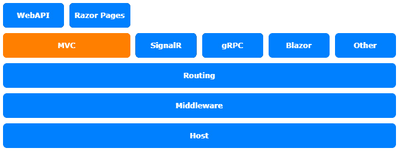

# *第十四章*：创建自定义操作过滤器

在本章中，我们将继续在控制器级别进行自定义。我们将探讨操作过滤器以及如何创建自己的 `ActionFilter` 类以保持操作小而可读。

本章将涵盖以下主题：

+   介绍 `ActionFilter`

+   使用 `ActionFilter`

本章的主题属于 ASP.NET Core 架构的 **模型-视图-控制器**（**MVC**）层，如图所示：



图 14.1 – ASP.NET Core 架构

# 技术要求

要跟随本章的练习，您需要创建一个 ASP.NET Core MVC 应用程序。打开您的控制台、shell 或 Bash 终端，切换到您的工作目录。使用以下命令创建一个新的 MVC 应用程序：

```cs
dotnet new web -n ActionFilterSample -o ActionFilterSample
```

现在，通过双击项目文件或在**Visual Studio Code**（**VS Code**）中在已打开的控制台中输入以下命令来在 Visual Studio 中打开项目：

```cs
cd ActionFilterSample
code .
```

本章中的所有代码示例都可以在本书的 GitHub 仓库中找到：[`github.com/PacktPublishing/Customizing-ASP.NET-Core-6.0-Second-Edition/tree/main/Chapter14`](https://github.com/PacktPublishing/Customizing-ASP.NET-Core-6.0-Second-Edition/tree/main/Chapter14)。

# 介绍 `ActionFilter`

操作过滤器有点像中间件，因为它们可以操作输入和输出，但它们会在 MVC 层上的特定操作或特定控制器上的所有操作上立即执行。中间件直接在托管层上的请求对象上工作。创建 `ActionFilter` 类是为了在操作执行之前或之后执行代码。它们被引入来执行不属于实际操作逻辑的方面：`AuthorizeAttribute` 用于允许用户或组访问特定的操作或控制器。`AuthorizeAttribute` 是一个 `ActionFilter`。它检查登录用户是否有权限。如果没有，则重定向到登录页面。

注意

如果您全局应用 `ActionFilter`，它将在您的应用程序中的所有操作上执行。

下一个代码示例显示了普通操作过滤器和异步 `ActionFilter` 的骨架：

```cs
using Microsoft.AspNetCore.Mvc.Filters;

namespace ActionFilterSample;
public class SampleActionFilter : IActionFilter
{
    public void OnActionExecuting(
        ActionExecutingContext context)
    {
        // do something before the action executes
    }
    public void OnActionExecuted(
        ActionExecutedContext context)
    {
        // do something after the action executes
    }
}
public class SampleAsyncActionFilter : IAsyncActionFilter
{
    public async Task OnActionExecutionAsync(
        ActionExecutingContext context,
        ActionExecutionDelegate next)
    {
        // do something before the action executes
        var resultContext = await next();
        // do something after the action executes; 
        // resultContext.Result will be set
    }
}
```

如您所见，始终有两种方法可以将代码放置在目标操作执行之前和之后。这些操作过滤器不能用作属性。如果您想在控制器中使用操作过滤器作为属性，您需要从 `Attribute` 或从 `ActionFilterAttribute` 派生它们，如下面的代码片段所示：

```cs
using Microsoft.AspNetCore.Mvc;
using Microsoft.AspNetCore.Mvc.Filters;

namespace ActionFilterSample;
public class ValidateModelAttribute : ActionFilterAttribute
{
    public override void OnActionExecuting(
        ActionExecutingContext context)
    {
        if (!context.ModelState.IsValid)
        {
            context.Result = new BadRequestObjectResult(
                context.ModelState);
        }
    }
}
```

上述代码片段显示了一个简单的 `ActionFilter`，如果 `ModelState` 无效，则始终返回 `BadRequestObjectResult`。这在 Web 的 `POST`、`PUT` 和 `PATCH` 请求中可能很有用。这可以通过更多的验证逻辑进行扩展。我们将在稍后看到如何使用它。

`ActionFilter` 的另一个可能的用途是记录日志。你不需要直接在控制器操作中记录日志。你可以在动作过滤器中这样做，以保持你的操作可读性并包含相关代码，如下面的代码片段所示：

```cs
using Microsoft.AspNetCore.Mvc.Filters;

namespace ActionFilterSample;
public class LoggingActionFilter : IActionFilter
{
    ILogger _logger;
    public LoggingActionFilter(ILoggerFactory 
      loggerFactory)
    {
        _logger =
         loggerFactory.CreateLogger<LoggingActionFilter>();
    }
    public void OnActionExecuting(
        ActionExecutingContext context)
    {
        _logger.LogInformation(
          $"Action '{context.ActionDescriptor.DisplayName}'
            executing");
    }
    public void OnActionExecuted(
        ActionExecutedContext context)
    {
        _logger.LogInformation(
          $"Action '{context.ActionDescriptor.DisplayName}'
            executed");
    }
}
```

这会在控制台输出一条信息性消息。你可以从 `ActionExecutingContext` 或 `ActionExecutedContext` 中获取更多关于当前操作的信息——例如，参数、参数值等。这使得动作过滤器非常有用。

让我们看看动作过滤器在实际中是如何工作的。

# 使用 ActionFilter

实际上是属性的过滤器可以注册为操作或控制器的一个属性，如下面的代码片段所示：

```cs
[HttpPost]
[ValidateModel] // ActionFilter as attribute
public ActionResult<Person> Post([FromBody] Person model)
{
    // save the person
    return model; //just to test the action
}
```

在这里，我们使用 `ValidateModel` 属性来检查 `ModelState`，如果 `ModelState` 无效则返回 `BadRequestObjectResult`；我们不需要在实际操作中检查 `ModelState`。

要全局注册动作过滤器，你需要扩展 `Startup.cs` 文件中的 `ConfigureServices` 方法中的 MVC 注册，如下所示：

```cs
builder.Services.AddControllersWithViews()
    .AddMvcOptions(options =>
    {
        options.Filters.Add(new SampleActionFilter());
        options.Filters.Add(new SampleAsyncActionFilter());
    });
```

以这种方式注册的动作过滤器将在每个操作上执行。这样，你就可以使用不继承自属性的过滤器。

我们之前创建的 `LoggingActionFilter` 稍微特殊一些。它依赖于 `ILoggerFactory` 的一个实例，这个实例需要传递给构造函数。因为它作为属性使用时不会很好地工作，因为 `Attributes` 不支持 `ILoggerFactory` 在 ASP.NET Core 依赖注入容器中注册，并且需要将其注入到 `LoggingActionFilter` 中。

由于这个原因，还有更多注册动作过滤器的方法。全局上，我们能够将它们注册为依赖注入容器实例化的类型，并且依赖关系可以由容器解决，如下面的代码片段所示：

```cs
builder.Services.AddControllersWithViews()
    .AddMvcOptions(options =>
    {
        options.Filters.Add<LoggingActionFilter>();
    })
```

这工作得很好。我们现在在过滤器中有 `ILoggerFactory`。

为了支持在 `Attributes` 中的自动解析，你需要在控制器或操作级别使用 `ServiceFilter` 属性，如下所示：

```cs
[ServiceFilter(typeof(LoggingActionFilter))]
public class HomeController : Controller
{
```

除了全局过滤器注册之外，`ActionFilter` 需要在使用 `ServiceFilter` 属性之前在 `ServiceCollection` 中注册，如下所示：

```cs
builder.Services.AddSingleton<LoggingActionFilter>();
```

为了完整，还有另一种使用动作过滤器的方法，它需要将参数传递给构造函数。你可以使用 `TypeFilter` 属性来自动实例化过滤器。但是，使用这个属性，过滤器**不是**由依赖注入容器实例化的；参数需要作为 `TypeFilter` 属性的参数指定。

请参阅官方文档中的下一个代码片段：

```cs
[TypeFilter(typeof(AddHeaderAttribute),
    Arguments = new object[] { "Author", "Juergen Gutsch 
      (@sharpcms)" })]
public IActionResult Hi(string name)
{
    return Content($"Hi {name}");
}
```

过滤器的类型和参数通过 `TypeFilter` 属性指定。

# 摘要

动作过滤器为我们提供了一个简单的方式来保持动作的整洁。如果我们发现动作内部有重复的任务，而这些任务实际上并不与动作的实际责任相关，我们可以将这些任务移动到 `ActionFilter` 中，或者可能是一个 `ModelBinder` 或某些 MiddleWare，具体取决于它需要如何全局工作。它与动作的相关性越强，使用 `ActionFilter` 就越合适。

有更多种类的过滤器，它们都以类似的方式工作。要了解更多关于不同种类的过滤器，阅读文档绝对是推荐的。

在下一章中，我们将通过使用缓存来加速您的 Web 应用程序。

# 进一步阅读

+   微软 ASP.NET Core 过滤器：[`docs.microsoft.com/en-us/aspnet/core/mvc/controllers/filters`](https://docs.microsoft.com/en-us/aspnet/core/mvc/controllers/filters)
