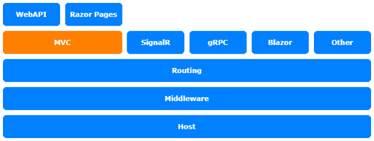
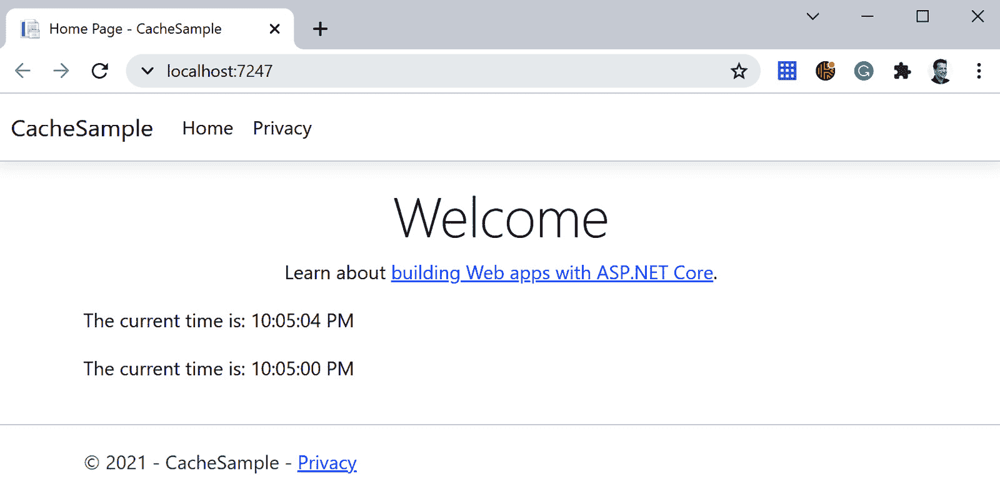
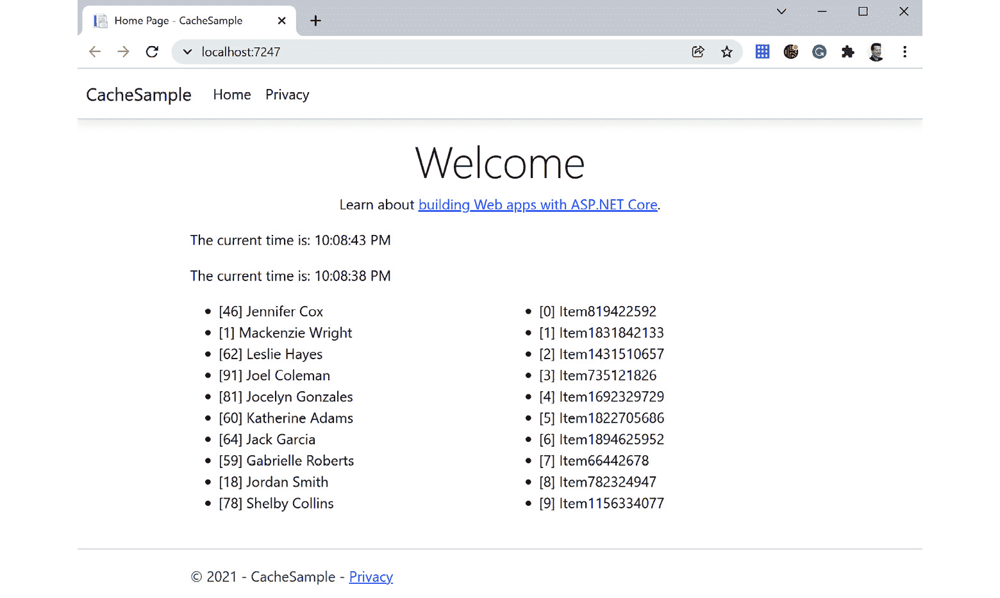

# 第十五章：*第十五章*：使用缓存

在本章中，我们将探讨缓存技术。ASP.NET Core 提供了多种缓存方式，我们将学习如何使用和自定义它们。

在本章中，我们将涵盖以下主题：

+   缓存的必要性

+   基于 HTTP 的缓存

+   使用 ResponseCachingMiddleware 进行缓存

+   使用缓存配置文件预定义缓存策略

+   使用 CacheTagHelper 缓存特定区域

+   手动缓存

本章中的主题涉及 ASP.NET Core 架构的 MVC 层：



图 15.1 – ASP.NET Core 架构

# 技术要求

要遵循本章的描述，你需要创建一个 ASP.NET Core MVC 应用程序。打开你的控制台、shell 或 Bash 终端，切换到你的工作目录。使用以下命令创建一个新的 MVC 应用程序：

```cs
dotnet new mvc -n CacheSample -o CacheSample
```

现在，通过双击项目文件或在 VS Code 中输入以下命令来在 Visual Studio 中打开项目：

```cs
cd CacheSample
code .
```

本章中的所有代码示例都可以在本书的 GitHub 仓库[`github.com/PacktPublishing/Customizing-ASP.NET-Core-6.0-Second-Edition/tree/main/Chapter15`](https://github.com/PacktPublishing/Customizing-ASP.NET-Core-6.0-Second-Edition/tree/main/Chapter15)中找到。

# 我们为什么需要缓存？

缓存通过在内存或像快速 Redis 数据库这样的分布式缓存中存储结果来加速性能，如果合理的话，你还可以将缓存数据存储在文件中。

当你运行多个应用程序实例以扩展应用程序的可用性时，需要分布式缓存。这些实例将在多个 Docker 容器、Kubernetes 集群或多个 Azure App Services 上运行。在这种情况下，实例应该共享缓存。

大多数应用程序缓存都是内存缓存，存储数据的时间较短。这对于大多数场景来说都是好的。

此外，浏览器也会缓存网站或 Web 应用程序的输出。浏览器通常将整个结果存储在文件中。作为一名 ASP.NET 开发者，你可以通过添加指定浏览器是否应该缓存以及缓存项应该有效多长时间的 HTTP 头来自定义浏览器缓存。

浏览器缓存可以减少对服务器的请求次数。在你的代码中处理缓存可以减少数据库访问次数或减少对其他耗时操作的访问。

客户端缓存和服务器端缓存都对提高应用程序性能很有用。让我们详细了解一下客户端缓存。

# 基于 HTTP 的缓存

要控制浏览器缓存，你可以设置一个`Cache-Control` HTTP 头。通常，`StaticFileMiddleware`不会设置 Cache-Control 头。这意味着客户端可以自由地按照他们喜欢的任何方式缓存。如果你希望将缓存时间限制为仅一天，你可以通过将`StaticFileOptions`传递给中间件来实现这一点：

```cs
const string cacheMaxAge = "86400";
app.UseStaticFiles(new StaticFileOptions()
{
    OnPrepareResponse = ctx =>
    {
        ctx.Context.Response.Headers.TryAdd(
            "Cache-Control", 
            $"public, max-age={cacheMaxAge}");
    }
});
```

这将 `Cache-Control` 头部设置为在发送到客户端之前请求的每个静态文件。`Cache-Control` 被设置为公共，这意味着它可以在每个客户端上公开缓存。缓存项的最大年龄不应超过 86,400 秒，即一天。

将头部设置为静态文件只是一个示例。您可以将头部设置为需要缓存控制的每个响应。您还可以通过将 `Cache-Control` 头部设置为 no-cache 来禁用缓存。

要了解更多关于 `Cache-Control` 头部的信息，请参阅以下 URL：https://datatracker.ietf.org/doc/html/rfc7234#section-5.2

此外，`Expires` 头部可能也很有用，用于指定响应内容何时失效并应从服务器刷新。请参阅 https://datatracker.ietf.org/doc/html/rfc7234#section-5.3

`Vary` 头部指定了一个标准，告诉客户端关于缓存变化的信息。它检查特定头部是否存在。请参阅 https://datatracker.ietf.org/doc/html/rfc7231#section-7.1.4

这通过响应对象直接控制客户端。

# 使用 `ResponseCachingMiddleware` 进行缓存

`ResponseCachingMiddleware` 在服务器端缓存响应并基于缓存的响应创建响应。该中间件像客户端一样尊重 `Cache-Control` 头部。这意味着您可以通过设置预览部分中描述的特定头部来控制中间件。

要使其工作，您需要将 `ResponseCachingMiddleware` 添加到依赖注入容器中：

```cs
builder.Services.AddResponseCaching();
```

并且您应该在静态文件和路由添加之后使用该中间件：

```cs
app.UseResponseCaching();
```

如果您添加了 CORS 配置，则应先调用 `UseCors` 方法。

`ResponseCachingMiddleware` 受特定 HTTP 头部的影响。例如，如果设置了 `Authentication` 头部，则响应不会缓存，与 `Set-Cookie` 头部相同。它也仅缓存导致 200 OK 结果的响应。错误页面和其他状态代码不会缓存。

您可以在以下 URL 中找到完整的标准列表：https://docs.microsoft.com/en-us/aspnet/core/performance/caching/middleware?view=aspnetcore-6.0#http-headers-used-by-response-caching-middleware。

在控制器级别、操作级别或页面级别使用 `ResponseCacheAttribute`，您可以通过使用 `ResponseCacheAttribute` 设置正确的头部来控制 `ResponseCachingMiddleware`：

```cs
[ResponseCache(Duration = 86400)]
public IActionResult Index()
{
    return View();
}
```

此代码片段将 `Cache-Control` 设置为公共，最大年龄为一天，就像预览部分中的示例一样。

此属性非常强大，您还可以以不同的方式设置 `Vary` 头部，以及指示完全不缓存输出的指示器。甚至可以设置 `CacheProfileName`。我们将在下一节中查看缓存配置文件。

这些是可以设置的属性：

+   `Duration`：秒数时间范围

+   `Location`：存储缓存的地点：客户端、任何或无

+   `NoStore`：如果设置为 true，则禁用缓存

+   `VaryByHeader`：一个改变缓存的头值

+   `VaryByQueryKeys`：一个查询键名称数组，它改变了缓存

## 使用缓存配置文件预定义缓存策略

你可以在所谓的缓存配置文件中预定义缓存策略，以便在需要的地方重复使用。`CacheProfile` 类型具有与 `ResponseCache` 属性相同的属性。要定义缓存配置文件，你需要将选项设置到 MVC 服务中。

在 `Program.cs` 文件中，`AddControllersWithViews` 方法有一个重载，可以配置 `MvcOptions`。在这里，你还可以添加缓存配置文件：

```cs
builder.Services.AddControllersWithViews(options =>
{
    options.CacheProfiles.TryAdd("Duration30",
        new CacheProfile
        {
            Duration = 30, 
            VaryByHeader = "User-Agent", 
            Location = ResponseCacheLocation.Client
        });
    options.CacheProfiles.TryAdd("Duration60",
        new CacheProfile
        {
            Duration = 60, 
            VaryByHeader = "User-Agent", 
            Location = ResponseCacheLocation.Client
        });
});
```

你可能需要添加一个 `using` 语句到 `Microsoft.AspNetCore.Mvc`。

这个片段添加了两个不同的缓存配置文件，第一个配置文件有 30 秒的缓存时间，第二个配置文件有 60 秒的缓存时间。这两个配置文件都告诉缓存根据 `"User-Agent"` 头来变化。

要使用配置文件，你可以在响应缓存属性中使用配置文件名称：

```cs
[ResponseCache(CacheProfileName = "Duration30")]
public IActionResult Index()
{
```

你不必设置 `ResponseCacheAttribute` 的所有属性，只需设置 `CacheProfileName`。让我们看看如何使用声明性方式使用缓存。

# 使用 CacheTagHelper 缓存特定区域

你还可以缓存视图的特定区域。在一个无法缓存整个视图的场景中，你可以通过使用 `CacheTagHelper` 来只缓存特定的区域。

为了测试这一点，将以下片段添加到 `index.cshtml` 文件中，该文件位于 `/Views/Home/` 文件夹中：

```cs
<div>
    <p>
       The current time is: @DateTime.Now.ToLongTimeString()
   </p>
</div>
<cache expires-sliding="@TimeSpan.FromSeconds(7)">
<div>
    <p>
       The current time is: @DateTime.Now.ToLongTimeString()
    </p>
</div>
</cache>
```

这个片段包含两个相同的 p 标签，用于输出当前时间。

第二个被包裹在一个具有 7 秒滑动过期时间的 `CacheTagHelper` 中。

启动应用程序并查看发生了什么。导航到 `Index` 页面并多次刷新浏览器。你将看到只有第一次刷新时内容会改变，第二个是缓存的，在 7 秒内保持不变。



图 15.2 - 缓存和未缓存值

让我们看看如果我们需要更具体地缓存应该做什么

# 手动缓存

有时候在 C# 代码内部进行特定缓存是有意义的。例如，如果你需要从外部源或数据库获取数据，缓存结果并每次不访问结果可以节省时间和流量。

让我们通过使用两种不同的方式来创建和访问缓存项来试一试：

1.  为了试一试，我们将稍微扩展一下 `HomeController`。首先，将 `IMemoryCache` 的一个实例注入到控制器中，并将其存储在一个字段中：

    ```cs
    using Microsoft.Extensions.Caching.Memory;
    public class HomeController : Controller
    {
        private readonly ILogger<HomeController> _logger;
        private readonly IMemoryCache _cache;
        public HomeController(
            ILogger<HomeController> logger,
            IMemoryCache cache
            )
        {
            _logger = logger;
            _cache = cache;
        }
    ```

1.  在 `Models` 文件夹中，创建一个名为 `Person.cs` 的文件，并在其中放置以下行：

    ```cs
    namespace CacheSample.Models;
    internal class Person
    {
        public int Id { get; set; }
        public string? Firstname { get; set; }
        public string? Lastname { get; set; }
        public string? Address { get; set; }
        public string? City { get; set; }
    }
    ```

1.  现在我们需要添加两个非常复杂的方法，这些方法为我们做一些神奇的事情。实际上，这些方法只是创建一些假数据，并不真正复杂：

    ```cs
    private IEnumerable<Person>
      LoadDataFromExternalSource()
    {
        return A.ListOf<Person>(10);
    }
    private IDictionary<int, string>
      LoadSuperComplexCalculatedData()
    {
        return Enumerable.Range(0, 10)
            .ToDictionary(
                x => x, 
                x => $"Item{Random.Shared.Next()}");
    }
    ```

    第一种方法使用`GenFu`，这在之前的章节中也已使用，用于创建`Person`列表并填充随机但有效的数据。第二种方法创建了一个包含随机数据的 10 项`Dictionary`。随机数据有助于展示数据实际上已被缓存。如果用户界面上的数据没有变化，那么数据是从缓存中获取的。

1.  在项目文件夹中输入以下命令以安装`GenFu`：

    ```cs
    dotnet add package GenFu
    ```

1.  在索引操作的开始处添加以下行，将第一种方法的数据存储在缓存中或从缓存中加载数据：

    ```cs
    if (!_cache.TryGetValue<IEnumerable<Person>>(
        "ExternalSource", out var externalPersons))
    {
        externalPersons = LoadDataFromExternalSource();
        _cache.Set(
            "ExternalSource",
            externalPersons,
            new MemoryCacheEntryOptions
            {
                AbsoluteExpiration = 
                  DateTime.Now.AddSeconds(30)
            });
    }
    ```

    这将首先尝试使用`ExternalSource`缓存键从缓存中加载数据。如果缓存中的数据不存在，你需要从原始源加载数据，并使用`Set`方法将它们存储在缓存中。

创建和加载数据的另一种方式是使用`GetOrCreate`方法：

```cs
var calculatedValues = _cache.GetOrCreate(
    "ComplexCalculate", entry =>
{
    entry.AbsoluteExpiration = DateTime.Now.AddSeconds(30);
    return LoadSuperComplexCalculatedData();
});
```

它的工作方式相同，但使用起来相当简单。需要缓存的值将直接在 lambda 表达式中返回，同时 lambda 表达式检索可以配置的缓存条目。

一旦数据存在，你就可以将它们返回到视图中：

```cs
return View(new IndexViewModel
        {
            Persons = externalPersons,
            Data = calculatedValues
        });
```

返回的模型看起来像这样：

```cs
internal class IndexViewModel
{
    public IEnumerable<Person>? Persons { get; set; }
    public IDictionary<int, string>? Data { get; set; }
}
```

将以下片段添加到`Index.cshtml`文件中，紧接在`CacheTagHelper`之后，以可视化数据：

```cs
<div class="row">
    <div class="col-md-6">
        <ul>
            @foreach (var person in Model.Persons)
            {
            <li>
            [@person.Id] @person.Firstname @person.Lastname
            </li>
            }
        </ul>
    </div>
    <div class="col-md-6">
        <ul>
            @foreach (var data in Model.Data)
            {
                <li>[@data.Key] @data.Value</li>
            }
        </ul>
    </div>
</div>
```

这在两个并排的列中创建了两个列表。现在运行应用程序，在浏览器中调用它，并尝试刷新页面。即使数据完全随机，显示的数据也不应该改变。如果没有缓存，每次重新加载时数据都会改变：



图 5.3 - 数据变化

就这样。缓存每 30 秒过期，如配置所示。

# 摘要

缓存帮助我们通过减少对性能较差的资源（如数据库、外部 API 或复杂计算）的调用，来创建高性能的应用程序。在本章中，你学习了如何使用`ResponseCachingMiddleware`和`ResponseCacheAttribute`来使用响应缓存，以及如何使用`CacheTagHelper`和手动在 C#代码中使用`IMemoryCache`来使用内存缓存。

在下一章中，你将学习如何创建自定义`TagHelper`。

# 进一步阅读

更多关于 ASP.NET Core 文档中的缓存信息：[`docs.microsoft.com/en-us/aspnet/core/performance/caching/response?view=aspnetcore-6.0`](https://docs.microsoft.com/en-us/aspnet/core/performance/caching/response?view=aspnetcore-6.0)。
