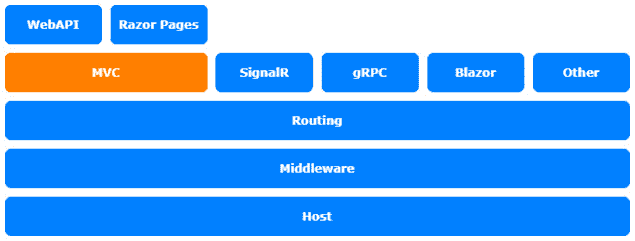
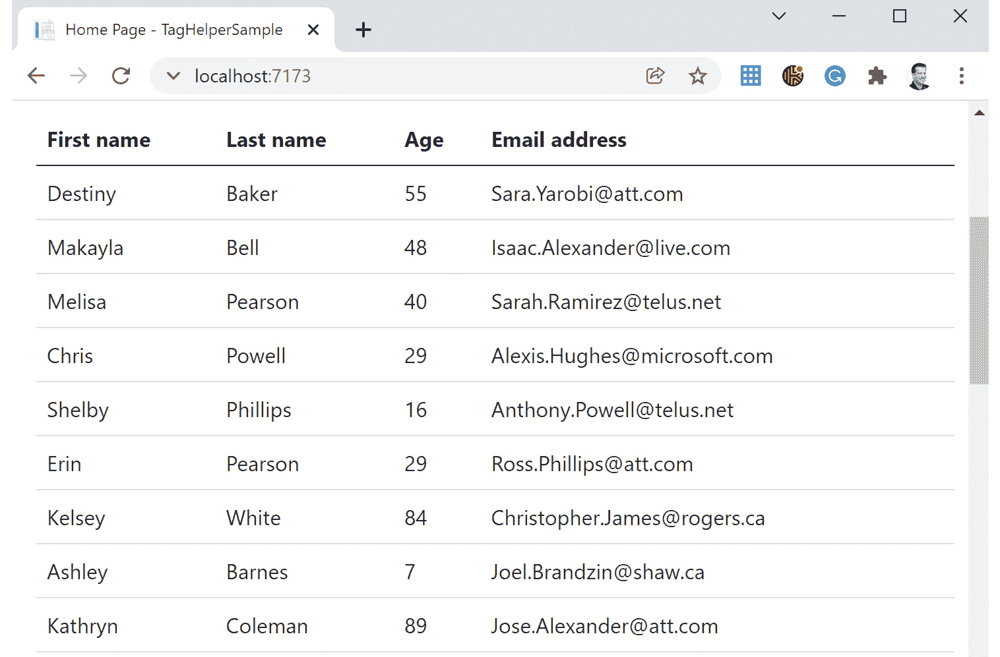

# *第十六章*：创建自定义 TagHelper

在本章中，我们将讨论`TagHelper`非常有用，可以使 Razor 更加美观和易于阅读。创建自定义`TagHelper`将使您的生活更加轻松。

在本章中，我们将涵盖以下主题：

+   介绍`TagHelper`

+   创建自定义`TagHelper`

本章讨论的主题涉及 ASP.NET Core 架构的 MVC 层：



图 16.1 – ASP.NET Core 架构

# 技术要求

要跟随本章的示例，您需要创建一个 ASP.NET Core MVC 应用程序。打开您的控制台、shell 或 Bash 终端，切换到您的工作目录。使用以下命令创建一个新的 MVC 应用程序：

```cs
dotnet new mvc -n TagHelperSample -o TagHelperSample
```

现在，通过双击项目文件在 Visual Studio 中打开项目，或在 Visual Studio Code 中，在已打开的控制台中输入以下命令：

```cs
cd TagHelperSample
code .
```

本章中的所有代码示例都可以在本书的 GitHub 存储库中找到：[`github.com/PacktPublishing/Customizing-ASP.NET-Core-6.0-Second-Edition/tree/main/Chapter16`](https://github.com/PacktPublishing/Customizing-ASP.NET-Core-6.0-Second-Edition/tree/main/Chapter16)。

# 介绍 TagHelper

使用`TagHelper`是一种在服务器端编写更简单（更少）的 HTML 或 Razor 代码的快捷方式。`TagHelper`将在服务器上被解释，并为浏览器生成“真实”的 HTML 代码。

`TagHelper`不是 ASP.NET Core 中的新事物。它们自从框架的第一个版本起就存在了。大多数现有的和内置的`TagHelper`是旧式 HTML 辅助工具的替代品，这些辅助工具仍然存在于 ASP.NET Core 中，以保持 Razor 视图与 ASP.NET Core 兼容。

扩展 HTML 标签的一个非常基础的例子是内置的`AnchorTagHelper`：

```cs
<!-- old fashioned HtmlHelper -->
@Html.ActionLink("Home", "Index", "Home")
<!-- new TagHelper -->
<a asp-controller="Home" asp-action="Index">Home</a>
```

许多 HTML 开发者觉得在 HTML 标签之间有`HtmlHelper`有点奇怪。它难以阅读，在阅读代码时有些破坏性。也许对于习惯于阅读这种代码的 ASP.NET Core 开发者来说不是这样，但与`TagHelper`相比，它真的很丑。`TagHelper`感觉更自然，更像是 HTML，即使它们不是，即使它们在服务器上被渲染。

许多 HTML 辅助工具可以用`TagHelper`替代。

还有一些使用`TagHelper`构建的新标签，这些标签不是 HTML 标签，但看起来像 HTML。一个例子是`EnvironmentTagHelper`：

```cs
<environment include="Development">
    <link rel="stylesheet" 
        href="~/lib/bootstrap/dist/css/bootstrap.css" />
    <link rel="stylesheet" href="~/css/site.css" />
</environment>
<environment exclude="Development">
    <link rel="stylesheet" 
        href="https://ajax.aspnetcdn.com/ajax/bootstrap/
              3.3.7/css/bootstrap.min.css"
            asp-fallback-href=
              "~/lib/bootstrap/dist/css/bootstrap.min.css"
            asp-fallback-test-class="sr-only" 
            asp-fallback-test-property="position" 
            asp-fallback-test-value="absolute" />
    <link rel="stylesheet" 
        href="~/css/site.min.css" 
        asp-append-version="true" />
</environment>
```

这个`TagHelper`根据当前的运行时环境渲染（或不渲染）内容。在这种情况下，目标环境是开发模式。第一个环境标签如果当前运行时环境设置为`Development`，则渲染内容；第二个标签如果它`不是`设置为`Development`，则渲染内容。这使得它在`Development`模式下渲染可调试的脚本或样式以及在任何其他运行时环境中渲染最小化和优化代码时非常有用。

现在我们来看看我们如何创建自己的自定义 `TagHelper`。

# 创建自定义 Tag Helper

要使用本章中创建的所有自定义 `TagHelper`，你需要引用当前程序集，告诉框架在哪里找到 `TagHelper`。打开 `View/` 文件夹中的 `_ViewImports.cshtml` 文件，并在文件末尾添加以下行：

```cs
@addTagHelper *, TagHelperSample
```

这里有一个快速示例，展示了如何使用 `TagHelper` 扩展现有的标签：

1.  假设我们需要一个配置为粗体并具有特定颜色的标签：

    ```cs
    <p strong color="red">Use this area to provide 
      additional information.</p>
    ```

    这看起来像是 90 年代的过时 HTML，但这只是为了演示一个简单的 `TagHelper`。

1.  当前执行此任务的方法是使用 `TagHelper` 扩展任何具有名为 `strong` 的属性的标签，如下面的代码片段所示：

    ```cs
    using Microsoft.AspNetCore.Razor.TagHelpers;

    namespace TagHelperSample.TagHelpers;
    [HtmlTargetElement(Attributes = "strong")]
    public class StrongTagHelper : TagHelper
    {
        public string Color { get; set; }
        public override void Process(
            TagHelperContext context, 
            TagHelperOutput output)
        {
            output.Attributes.RemoveAll("strong");
            output.Attributes.Add("style", 
                "font-weight:bold;");
            if (!String.IsNullOrWhiteSpace(Color))
            {
                output.Attributes.RemoveAll("style");
                output.Attributes.Add("style", 
                    $"font-weight:bold;color:{Color};");
            }
        }
    }
    ```

    第一行告诉标签助手处理具有 `strong` 目标属性的标签。这个 `TagHelper` 没有定义自己的标签，但它确实提供了一个额外的属性来指定颜色。

    `Process` 方法定义了如何将 HTML 渲染到输出流中。在这种情况下，它会给当前标签添加一些内联 CSS 样式。它还会从当前标签中移除目标属性。`color` 属性将不会显示。

    这将显示如下：

    ```cs
    <p style="font-weight:bold;color:red;">Use this area 
      to provide additional information.</p>
    ```

下一个示例展示了如何使用 `TagHelper` 定义一个自定义标签：

1.  让我们创建这个名为 `GreeterTagHelper` 的类：

    ```cs
    using Microsoft.AspNetCore.Razor.TagHelpers;

    namespace TagHelperSample.TagHelpers;
    public class GreeterTagHelper : TagHelper
    {
        [HtmlAttributeName("name")]
        public string Name { get; set; }
        public override void Process(
            TagHelperContext context, 
            TagHelperOutput output)
        {
            output.TagName = "p";
            output.Content.SetContent($"Hello {Name}");
        }
    2
    ```

1.  这个 `TagHelper` 处理一个具有属性名称的 `greeter` 标签。在 `Process` 方法中，当前标签将被更改为 `p` 标签，并将新内容设置为当前输出：

    ```cs
    <greeter name="Readers"></greeter>
    ```

    结果看起来像这样：

    ```cs
    <p>Hello Readers</p>
    ```

但如果你需要做点更复杂的事情呢？让我们进一步探索。

## 检查更复杂的情况

最后一个部分的 `TagHelper` 非常基础，简单设计用来展示 `TagHelper` 的工作方式。下一个示例稍微复杂一些，展示了真实场景。这个 `TagHelper` 渲染了一个包含项目列表的表格。这是一个通用的 `TagHelper`，展示了创建自定义 `TagHelper` 的真实原因。有了这个，你可以重用独立的视图代码片段。例如，你可以包裹 `div` 标签。或者，你也可以简化你的 Razor 视图：

1.  让我们首先创建 `DataGridTagHelper` 类。接下来的代码片段并不完整，但我们将按以下步骤完成 `DataGridTagHelper` 类：

    ```cs
    using Microsoft.AspNetCore.Razor.TagHelpers;

    namespace TagHelperSample.TagHelpers;
    public class DataGridTagHelper : TagHelper
    {
        [HtmlAttributeName("Items")]
        public IEnumerable<object> Items { get; set; }
        public override void Process(
            TagHelperContext context, 
            TagHelperOutput output)
        {
            output.TagName = "table";
            output.Attributes.Add("class", "table");
            var props = GetItemProperties();
            TableHeader(output, props);
            TableBody(output, props);
        }
    }
    ```

    在 `Process` 方法中，我们调用私有子方法来完成实际工作，使类更易于阅读。

    你可能需要在文件开头添加以下 `using` 语句：

    ```cs
    using System.Reflection;
    using System.ComponentModel;
    ```

1.  因为这是一个通用的 `TagHelper`，传入的对象需要进行分析。`GetItemProperties` 方法获取属性项的类型，并从类型中加载 `PropertyInfo`。`PropertyInfo` 将用于获取表头和值：

    ```cs
    private PropertyInfo[] GetItemProperties()
    {
        var listType = Items.GetType();
        Type itemType;
        if (listType.IsGenericType)
        {
            itemType = listType.GetGenericArguments()
                .First();
            return itemType.GetProperties(
                BindingFlags.Public | 
                BindingFlags.Instance);
        }
        return new PropertyInfo[] { };
    }
    ```

1.  以下代码片段展示了表头的生成。`TableHeader`方法直接将必要的 HTML 标签写入`TagHelperOutput`。它还使用`PropertyInfo`列表来获取将用作表头名称的属性名：

    ```cs
    private void TableHeader(
        TagHelperOutput output, 
        PropertyInfo[] props)
    {
        output.Content.AppendHtml("<thead>");
        output.Content.AppendHtml("<tr>");
        foreach (var prop in props)
        {
            var name = GetPropertyName(prop);
            output.Content.AppendHtml($"<th>{name}</th>");
        }
        output.Content.AppendHtml("</tr>");
        output.Content.AppendHtml("</thead>");
    }
    ```

1.  使用属性名作为表头名称并不总是有用的。这就是为什么`GetPropertyName`方法还尝试从`DisplayNameAttribute`中读取值，这是`DataAnnotation`的一部分，在 MVC 用户界面中广泛使用的数据模型。因此，支持这个属性是有意义的：

    ```cs
    private string GetPropertyName(
        PropertyInfo property)
    {
        var attribute = property
            .GetCustomAttribute<DisplayNameAttribute>();
        if (attribute != null)
        {
            return attribute.DisplayName;
        }
        return property.Name;
    }
    ```

1.  此外，还需要显示值。`TableBody`方法执行这项工作：

    ```cs
    private void TableBody(
        TagHelperOutput output, 
        PropertyInfo[] props)
    {
        output.Content.AppendHtml("<tbody>");
        foreach (var item in Items)
        {
            output.Content.AppendHtml("<tr>");
            foreach (var prop in props)
            {
                var value = GetPropertyValue(prop, item);
                output.Content.AppendHtml(
                    $"<td>{value}</td>");
            }
            output.Content.AppendHtml("</tr>");
        }
        output.Content.AppendHtml("</tbody>");
    }
    ```

1.  要从实际对象中获取值，使用`GetPropertyValue`方法：

    ```cs
    private object GetPropertyValue(
        PropertyInfo property, 
        object instance)
    {
        return property.GetValue(instance);
    }
    ```

1.  要使用这个`TagHelper`，您只需将项目列表分配给这个标签：

    ```cs
    <data-grid items="Model.Persons"></data-grid>
    ```

    在这种情况下，它是一个人员列表，我们通过当前模型中的`Persons`属性获取它。

1.  我们在这里使用的`Person`类看起来是这样的：

    ```cs
    using System.ComponentModel;

    namespace TagHelperSample.Models;
    public class Person
    {
        [DisplayName("First name")]
        public string FirstName { get; set; }
        [DisplayName("Last name")]
        public string LastName { get; set; }
        public int Age { get; set; }
        [DisplayName("Email address")]
        public string EmailAddress { get; set; }
    }
    ```

    并非所有属性都有`DisplayNameAttribute`，因此`GetPropertyName`方法中的回退是必要的，以获取实际的属性名而不是`DisplayName`值。

    将`Person`类放入`Models`文件夹中的`Person.cs`文件。

1.  您还需要一个服务来将数据加载到`HomeController`的`Index`动作中。创建一个`Services`文件夹，并将一个名为`PersonService.cs`的文件放入其中。将以下代码片段放入该文件中：

    ```cs
    using TagHelperSample.Models;
    using GenFu;

    namespace TagHelperSample.Services;

    public interface IService
    {
        IEnumerable<Person> AllPersons();
    }
    internal class PersonService : IService
    {
        public IEnumerable<Person> AllPersons()
        {
            return A.ListOf<Person>(25);
        }
    }
    ```

    在这里，我们再次使用`GenFu`来自动生成人员列表。如果您还没有安装它，您需要执行以下命令来加载 NuGet 包：

    ```cs
    dotnet add package GenFu
    ```

    如果这样做，您应该在`Program.cs`文件中将`PersonService`添加到`ServiceCollection`中：

    ```cs
    builder.Services.AddTransient<IService, PersonService>();
    ```

    最后但同样重要的是，应在`HomeController`中使用`PersonService`：

    ```cs
    using Microsoft.AspNetCore.Mvc;
    using TagHelperSample.Models;
    using TagHelperSample.Services;

    namespace TagHelperSample.Controllers;

    public class HomeController : Controller
    {
        private readonly IService _service;

        public HomeController(
            IService service)
        {
            _service = service;
        }

        public IActionResult Index()
        {
            ViewData["Message"] = "Your application           description page.";

            var persons = _service.AllPersons();
            return View(new IndexViewModel
            {
                Persons = persons
            });
        }
    ```

1.  这个`TagHelper`在使用前需要更多的检查和验证，但它是可以工作的。它显示了一个使用`GenFu`生成的假数据列表（见*第十二章*，*使用自定义输出格式化程序进行内容协商*，了解`GenFu`）：



图 16.2 – TagHelper 示例在行动

现在，您能够扩展这个`TagHelper`以包含更多的功能，包括排序、过滤和分页。请随意在多种环境中尝试它。

# 摘要

当涉及到重用视图的某些部分并简化、清理您的视图时，标签助手非常有用，就像在`DataGridTagHelper`的例子中一样。您还可以提供一个包含有用视图元素的库。在*进一步阅读*部分有一些现有的`TagHelper`库和示例，您可以尝试使用。

这是《定制 ASP.NET Core》第二版的最后一章。很高兴您阅读了所有章节。我们希望您觉得这些章节有用，并且它们能帮助您优化您的应用程序。

# 进一步阅读

+   戴米安·爱德华兹，*TagHelperPack*: [`github.com/DamianEdwards/TagHelperPack`](https://github.com/DamianEdwards/TagHelperPack)

+   大卫·帕奎特，*TagHelperSamples*: [`github.com/dpaquette/TagHelperSamples`](https://github.com/dpaquette/TagHelperSamples)

+   *Teleric 开发的 Bootstrap TagHelper*: [`www.red-gate.com/simple-talk/dotnet/asp-net/asp-net-core-tag-helpers-bootstrap/`](https://www.red-gate.com/simple-talk/dotnet/asp-net/asp-net-core-tag-helpers-bootstrap/)

+   *jQuery TagHelper*: [`www.jqwidgets.com/asp.net-core-mvc-tag-helpers/`](https://www.jqwidgets.com/asp.net-core-mvc-tag-helpers/)
