# 第一章：软件设计 SOLID 原则

本书专注于与依赖注入相关的技术，以及这些技术在.NET Core 中的默认实现方式，以及程序员如何扩展这些技术——这是.NET 的第一个可以在每个平台上运行的版本。

它在桌面上的 Windows、macOS 和 Linux 发行版上运行，这个想法甚至可以扩展到移动世界，覆盖苹果、安卓和 Tizen（三星）操作系统。

这无疑是微软在寻求对编程技术和工具实现通用覆盖的最雄心勃勃的项目，并且可以被视为在最初的**UWP**（**通用 Windows 平台**）项目之后的自然一步，该项目允许为支持 Windows 的任何设备构建应用程序，从物联网设备到桌面、XBOX 或 HoloLens。

因此，在本章中，我们将从.NET Core 及其衍生框架（如 ASP.NET Core）的主要架构组件的快速回顾开始，随后将介绍依赖注入技术的基础，这是 SOLID 原则的一部分，由 Robert C. Martin（*Uncle Bob*）在 2000 年提出。（参见维基百科：[`en.wikipedia.org/wiki/SOLID_(object-oriented_design)`](https://en.wikipedia.org/wiki/SOLID_(object-oriented_design))).）

因此，我们将回顾这五个 SOLID 原则，解释它们的目的和优势，以及使用.NET Core 编写的控制台应用程序中每个原则的基本实现。我们将看到每个原则及其覆盖范围的解释：

+   关注点分离（在.NET Core 的核心基础设施中明确实现，并在 ASP.NET Core 的初始管道和中间件配置中实现）

+   开放/封闭原则（自.NET Framework 3.0 版本以来已实现，此处也有体现）

+   李斯克夫替换原则（有两种实现方式——通过类型转换的经典方式，以及通过泛型使用）

+   接口分离：解释接口分离及其优势

+   依赖倒置：解释原则、其衍生品以及 IoC 容器概念

# 在开始时

编程技术的演变，某种程度上，与语言演变有关。一旦最初的（在某些方面，是混乱的）时期过去，计算的通用性变得清晰，对良好的模式和能够承担大型项目的语言的需求变得明显。

20 世纪 70 年代标志着采用其他范式的开始，例如过程式编程，后来，由 Ole-Johan Dahl 和 Kristen Nygaard 在挪威计算中心工作时提出的**面向对象编程**（**OOP**），通过 Simula 语言，他们两人都提出了这一概念。他们因这些成就获得了图灵奖以及其他认可。

几年后（大约在 1979 年），比约恩·斯特劳斯特鲁普在 Simula 语言中发现了一些有价值的方面，因此创建了具有类的 C 语言，这是今天 C++ 的原型，因为他认为它对于实际用途来说太慢了，这是第一个被普遍采用的面向对象语言。

C++ 最初具有命令式特性、面向对象和泛型特性，同时还能提供用于低级内存操作编程的能力。虽然它确实已经成为构建关键系统和应用的既定标准，但对于许多人来说，它并不足以满足 **LOB** (**业务线**) 应用程序的需求。

几年后，Java 和 .NET 平台为许多程序员提供了一个更简单、更经济的解决方案，同时仍然在面向对象编程语言所倡导的有序空间内发展。

因此，面向对象编程（OOP）被采纳，到目前为止，没有其他重要的编程范式取代这些思想。当然，还有其他方法，比如函数式编程，但即使是这一趋势的最显著代表 JavaScript，在最新版本（ECMAScript 2015）中也变得更加面向对象。

# .NET 和 .NET Core

.NET 最近经过重新设计，以实现自萨蒂亚·纳德拉加入公司以来微软一直追求的目标--"<q>*任何开发者，任何应用，任何平台。</q>"。

根据首席经理斯科特·亨特的说法，公司现在提供了一套统一的应用程序模型，以下截图可以概括：

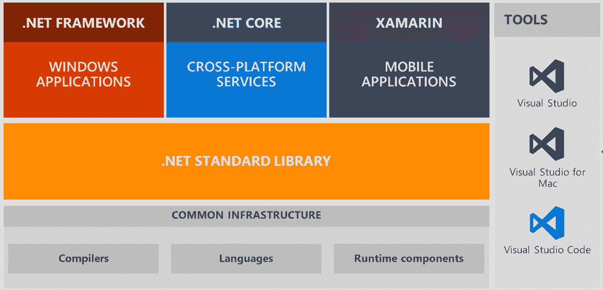

来源：[`www.hanselman.com/blog/AnUpdateOnASPNETCore10RC2.aspx`](http://www.hanselman.com/blog/AnUpdateOnASPNETCore10RC2.aspx)

如你所见，目前对于 .NET 开发者来说情况非常乐观。截图显示了一个 **通用基础设施**（编译器、语言和运行时组件），由 Roselyn 服务和其他功能提供支持。所有这些都与支持这些项目的 IDE 集成，现在包括 Visual Studio for Mac。

在其之上是 **.NET 标准库**，它具有共同点，使我们能够在三个不同的框架之间共享代码--经典的 **.NET Framework**（在撰写本文时为 4.6.2 版），**.NET Core**（现在为 2.0 版），以及 **Xamarin**，它允许为任何类型的移动目标--Android、iOS、Windows Phone 和 Tizen（三星）--构建应用程序。

# 关于 .NET Core

.NET Core 是 .NET 的新版本，于 2016 年夏季正式推出，并在同年 11 月的 Connect() 事件中更新到 1.1 版本。它被定义为 *跨平台、开源、云就绪且模块化的 .NET 平台，用于创建可在任何地方运行（Windows、Linux 和 MacOS）的现代 Web 应用、微服务、库和控制台应用程序*。

它可以与应用程序本身一起部署，从而最小化安装问题。

在发布之前，微软决定重新开始编号，强化了这是一个与经典版本完全不同的新概念的想法，作为避免歧义的一种更好的方式。

MSDN 架构师塞萨尔·德拉·托雷在他的博客中非常精确地定义了 .NET Core 的目标和结构——与传统的 .NET 框架不同，.NET 框架是一个全局安装的单个软件包，仅限于 Windows 的运行时环境，.NET Core 是将 .NET 从 Windows 解耦，允许它在非 Windows 环境中运行，无需安装一个巨大的 400 Mb 的二进制文件集（与仅从 .NET Core 需要的组件的足迹相比），以及能够部署与框架本身一起的应用程序，支持框架不同版本的并行执行。

正如同一来源中提到的，其架构和部署基础设施的一个非常有趣的部分是，.NET Core 不是操作系统的一部分，而是由 NuGet 软件包组成，可以直接编译到应用程序中，或者放入应用程序内部的文件夹中。这意味着应用程序可以携带 .NET Core，因此可以在机器上完全并行运行。

我个人认为这对项目的成功至关重要。没有副作用，目标机器上无需安装组件，也没有依赖。（正如你将在本书中看到的，避免依赖性在构建遵循良好实践的软件时是基础性的。）

NET Core 2.0 - 支持的操作系统版本建议：

| **操作系统** | **版本** | **架构** | **备注** |
| --- | --- | --- | --- |
| Windows 客户端 | 7 SP1+ | x64, x86 |  |
| Windows Server | 2008 R2 SP1+ | x64, x86 | 配置：完整版、Server Core、Nano |
| Windows IoT | 10+ | [C] arm32 | IoT Core - 请参阅[Raspberry Pi 指令](https://github.com/dotnet/core/blob/master/samples/RaspberryPiInstructions.md) |
| 红帽企业 Linux | 7.3+ | x64 | 这包括 CentOS 和 Oracle Linux |
| Fedora | 25+ | x64 |  |
| Debian | 8.7+ | x64 | [Debian 9 (Stretch) 工作区](https://github.com/dotnet/corefx/issues/8951#issuecomment-299927277) |
| Ubuntu | 14.04+ | x64, [C] arm32 | 这包括 x64 的 Linux Mint 17。对于 arm32，请参阅[Raspberry Pi 指令](https://github.com/dotnet/core/blob/master/samples/RaspberryPiInstructions.md) |
| openSUSE | 42.2+ | x64 |  |
| Tizen | 4+ | [S] arm32 | [Tizen .NET 开发者预览](https://developer.tizen.org/development/tizen-.net-preview/introduction) |
| Mac OS X | 10.12+ | x64 |  |
| **进行中的操作系统** |  |  |  |
| Arch Linux | [C] 待定 | 待定 | 由于在发行版中缺少[OpenSSL 1.0 软件包](https://github.com/dotnet/corefx/issues/9855#issuecomment-298982251)而受阻。Arch Linux 社区努力情况可追踪[此处](https://bbs.archlinux.org/viewtopic.php?pid=1708479)。 |
| FreeBSD & NetBSD | [C] TBD | TBD | 跟踪 [主要问题](https://github.com/dotnet/coreclr/issues/6115) 和 [标签](https://github.com/dotnet/coreclr/labels/os-freebsd). NetBSD 的 [.NET Core 1.0.0](https://github.com/dotnet/coreclr/issues/6115#issuecomment-233151220) 软件包 |

关于上述任何 IDE 可用的可编程项目类型，.NET Core 可以支持其自己的应用程序模型，也可以支持通用 Windows 平台模型，并且可以选择编译为 .NET Native（见以下截图）：

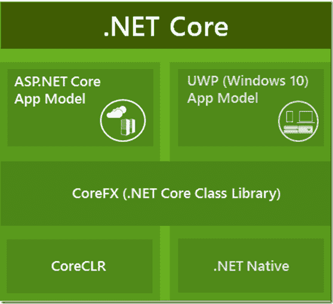

来源：[`www.hanselman.com/blog/AnUpdateOnASPNETCore10RC2.aspx`](http://www.hanselman.com/blog/AnUpdateOnASPNETCore10RC2.aspx)

我们以之前提到的同一页面上关于此框架的总结来结束对 .NET Core 的介绍：

+   **跨平台**：.NET Core 目前支持三个主要操作系统——Linux、Windows 和 OS X。还有其他操作系统移植正在进行中，例如 FreeBSD、NetBSD 和 Arch Linux。.NET Core 库可以在支持的操作系统上无修改地运行。由于应用程序使用本地宿主，因此必须针对每个环境重新编译应用程序。用户选择最适合其情况的 .NET Core 支持的环境。

+   **开源**：.NET Core 可在 GitHub 上找到，地址为 [`github.com/dotnet/core/blob/master/release-notes/2.0/2.0.0-preview1.md`](https://github.com/dotnet/core/blob/master/release-notes/2.0/2.0.0-preview1.md)，采用 MIT 和 Apache 2 许可证（许可按组件划分）。它还使用了一组重要的开源行业依赖项（见发布说明）。作为开源软件对于拥有繁荣的社区以及对于许多将开源软件作为其开发策略一部分的组织来说至关重要。

+   **自然获取**：.NET Core 以一系列 NuGet 软件包的形式分发，开发者可以从中选择所需的内容。运行时和基础框架可以从 NuGet 和特定于操作系统的软件包管理器（如 APT、Homebrew 和 Yum）获取。Docker 镜像可在 Docker Hub 上找到。高级框架库和更大的 .NET 库生态系统可在 NuGet 上找到。

+   **模块化框架**：.NET Core 采用模块化设计，使应用程序仅包含所需的 .NET Core 库和依赖项。每个应用程序都做出自己的 .NET Core 版本选择，避免与共享组件冲突。这种方法与使用 Docker 等容器技术开发软件的趋势相一致。

+   **更小的部署占用空间**：即使在 v1.0/1.1 版本中，.NET Core 的大小也比 .NET Framework 小得多；请注意，.NET Core 的整体大小并不旨在随着时间的推移而小于 .NET Framework，但由于它是按需付费的，因此大多数仅利用 CoreFX 部分的应用程序将具有更小的部署占用空间。

+   **.NET Core 的快速发布周期**：.NET Core 的模块化架构加上其开源特性提供了比大型单体框架慢速发布周期（甚至每个 NuGet 包）更现代、更快的发布周期。这种方法使得微软和开源.NET 社区能够以比传统使用.NET Framework 时更快的速度进行创新。

因此，在.NET Core 之上构建了多个应用模型堆栈，允许开发者构建从控制台应用程序，跨越 UWP Windows 10 应用程序（PC、平板电脑和手机）到可扩展的 Web 应用程序和 ASP.NET Core 微服务的应用程序。

# ASP.NET Core

使用.NET Core 的 ASP.NET 应用程序推广基于先前 MVC 模型的模式，尽管是从头开始构建的，旨在跨平台执行，消除了某些不必要的功能，并将先前的 MVC 与 Web API 变体统一；因此，它们使用相同的控制器类型。

此外，在开发过程中，代码不需要在执行前进行编译。BrowserSync 技术允许你即时更改代码，而 Roselyn 服务负责更新；因此，你只需刷新页面即可看到更改。

ASP.NET Core 还使用了一种新的托管模型，完全与托管应用程序的 Web 服务器环境解耦。它支持 IIS 版本，也支持通过 Kestrel（跨平台、极端优化、基于 LibUv，这是 Node.js 使用的相同组件）和 WebListener HTTP（仅限 Windows）服务器进行自托管上下文。

作为其架构的一部分，它提出了一代新的中间件，这些中间件是异步的、非常模块化的、轻量级的，并且完全可配置的，其中我们定义了诸如路由、认证、静态文件、诊断、错误处理、会话、CORS、本地化等；甚至可以由用户自定义。

注意，ASP.NET Core 同样可以在经典.NET Framework 中运行，并访问那些库暴露的功能。以下截图显示了架构：

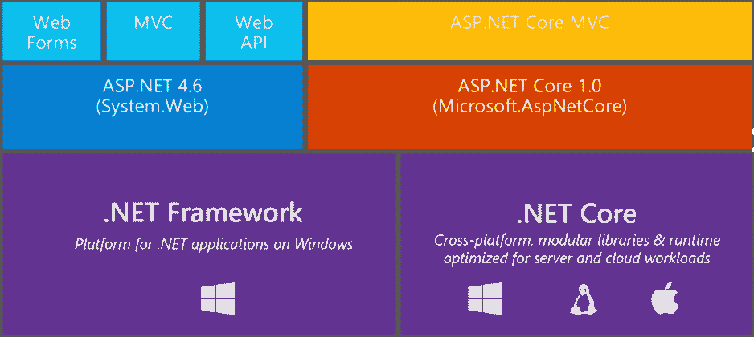

ASP.NET Core 将许多在先前版本中分离的事物结合在一起。因此，MVC 和 Web API 之间没有区别，如果你针对.NET Core 或者如果你更喜欢针对.NET 的任何其他版本，可以使用这个重构的架构模型来构建 MVC。

此外，一个新的内置 IoC 容器负责依赖注入的启动，以及一个新的配置协议，我们将在接下来的章节中实际看到。

# 关于本书中使用的 IDE

由于本书涉及 .NET Core 和 ASP.NET Core 以及它们内置的功能，涵盖了 SOLID 原则以及特定的依赖注入（DI），我们使用最新可用的 Visual Studio 版本（Visual Studio 2017 Enterprise），它包括对这些平台的全支持，以及一系列方便的扩展和模板。

你也可以使用免费的 Visual Studio 2017 Community Edition，或者任何更高版本，只要代码示例没有实质性的变化。

如果你是一名 Mac 用户，你也可以使用自 2016 年 11 月以来可用的 Visual Studio for Mac ([`www.visualstudio.com/vs/visual-studio-mac/`](https://www.visualstudio.com/vs/visual-studio-mac/))，如果你更喜欢任何平台（Linux、Mac 或 Windows）上的轻量级、全功能的免费 IDE，可以选择 Visual Studio Code ([`code.visualstudio.com/download`](https://code.visualstudio.com/download))，它也具有出色的编辑和调试功能。所有这些都对 .NET Core/ASP.NET Core 提供了全面支持（见以下截图）：


在本章节和其他章节中，我将根据是否需要更复杂的用户界面，无差别地使用 .NET Core 或 ASP.NET Core 进行演示。注意，目前 .NET Core 不提供任何超出控制台应用程序的视觉 UI。

实际上，当我们选择 *新建项目* 并点击 .NET Core 时，默认显示的当前可用的模板就是你在以下截图中所看到的：

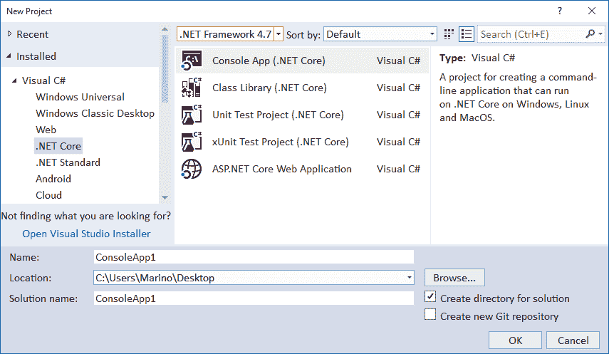

如你所见，选择基本上有三类（除了测试）：控制台应用程序、类库和基于 .NET Core 的 ASP.NET Core 网络应用程序。在这三种情况下，生成的应用程序可以在任何平台上运行。

# .NET Core 的其他基础变更

需要记住的是，在 .NET Core 中，你不再依赖于 .NET Framework 库（BCL 库），无论是操作系统安装的还是手动安装在 GAC（全局程序集缓存）中的。

所有库都可通过 NuGet 获取并相应下载。但是，如果你在 Visual Studio 2017 之前尝试过 .NET Core，你可能会错过包含所有依赖项的 `project.json` 文件。

官方文档指出，当使用 Visual Studio 2017 时：

+   MSBuild 支持 .NET Core 项目，使用简化的 `csproj` 项目格式，这使得手动编辑更加容易，无需卸载项目

+   项目文件支持文件通配符，使得基于文件夹的项目不需要包含单个文件

+   NuGet 包引用现在是 `csproj` 格式的一部分，将所有项目引用合并到一个文件中

因此，如果你尝试使用此工具创建新的 .NET Core 项目，项目的依赖现在已在 `csproj` 文件（XML 格式）中引用，正如你在任何文本编辑器中打开它时所见：

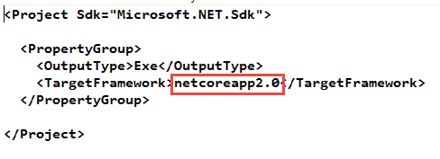

同时，Visual Studio 读取该文件，在解决方案资源管理器中创建一个`Dependencies`条目，并开始寻找该信息（在 PC 的缓存中或在 NuGet 中）。

注意，它们不是真正的、经典的 DLL，而是在编译时组装在一起的代码片段，以最小化大小和启动时间。如果你查看那个条目，你可以看到依赖项的依赖项，等等：

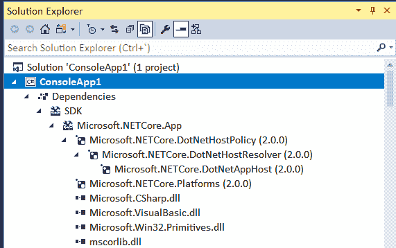

另一个需要强调的关键点与编译过程之后产生的可交付成果有关。如果你打开包含的 ConsoleApp1（或创建你自己的基本版本），并仅编译它，你会看到 bin 目录中不包含任何可执行文件。你会看到一个名为该名称的 DLL 文件（ConsoleApp1.dll）。

当你启动应用程序（在添加`Console.Read()`语句以停止执行之后），你会发现可执行文件确实是`dotnet.exe`。同样，当你打开诊断工具并捕获可执行文件的快照以查看那一刻的情况时也是如此。以下截图显示了这种情况：

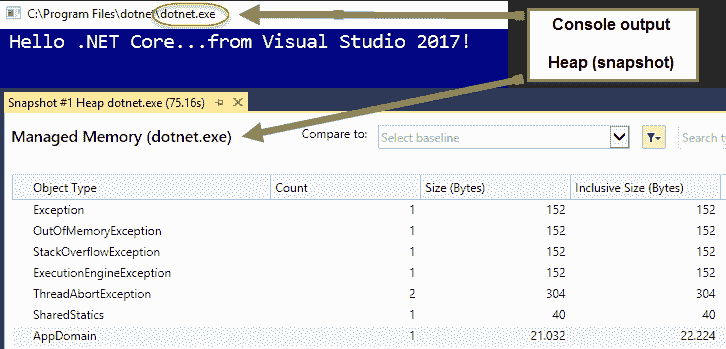

这直接与该模型复杂性相关。该应用程序被认为将在不同的平台上执行。默认选项允许部署架构根据目标确定配置 JIT 编译器的最佳方式。这就是为什么执行由 dotnet 运行时（命名为 dotnet.exe）承担。

从部署的角度来看，在.NET Core 中定义了两种应用程序类型：可移植和自包含。

在.NET Core 中，可移植应用程序是默认的。当然，这意味着（作为开发者）我们可以确信它们在不同.NET Core 安装中的可移植性。然而，独立应用程序不依赖于任何之前的安装来运行。也就是说，它包含所有必要的组件和依赖项，包括与应用程序打包的运行时。当然，这会构建一个更大的应用程序，但同时也使应用程序能够在任何.NET Core 平台上执行，无论目标是否安装了.NET Core。

对于本书的主要目的来说，我们选择哪种运行时模式并不重要。无论如何，这个简短的介绍可以给你一个关于新框架如何在 Visual Studio 2017 内部行为和管理的想法。

并且，记住，我使用 Visual Studio 2017 所做的任何事情，你都可以使用 Visual Studio Code 来做。

# SOLID 原则

一些编程指南具有全面、通用的目的，而另一些则主要是为了解决某些特定问题。因此，在我们专注于特定问题之前，回顾那些可以在不同场景和解决方案中应用的特征是很重要的。我的意思是那些你应考虑的原则，而不仅仅是针对解决方案类型或特定平台进行编程。

这就是 SOLID 原则（以及其他相关问题）发挥作用的地方。在 2001 年，罗伯特·马丁发表了一篇关于该主题的基础性文章([`butunclebob.com/ArticleS.UncleBob.PrinciplesOfOod`](http://butunclebob.com/ArticleS.UncleBob.PrinciplesOfOod))，在其中他列举了一套原则和指南，用他自己的话说，这些原则非常紧密地关注依赖管理、其潜在问题以及如何避免这些问题。

为了进一步解释这一点，用他的话说，*糟糕的依赖管理会导致难以更改、脆弱且不可重用的代码*。因此，这个原则与两个面向对象的原则直接相关——可重用性和可维护性（随着项目的发展而改变的能力，继承的主要目标之一）。

总体而言，马丁提出了 11 条应考虑的戒律，但它们可以分为三个领域：

+   处理类设计的五个 SOLID 原则

+   其他六个原则主要关注包——其中三个是关于包的凝聚性，另外三个解释了包耦合的危险以及如何评估包结构

我们将从 SOLID 原则开始，这些原则不仅影响类设计，还影响软件架构的其他方面。

这些想法的应用，例如，在 HTML5 标准的重大修改中起到了决定性作用。具体来说，**SRP**（单一职责原则）的应用仅强调了完全将表示（CSS）与内容（HTML）分离的需要，以及随后一些标签（`<cite>`、`<small>`、`<font>`）的弃用。

这也适用于其他流行的框架，例如 AngularJS（在 Angular 2 中更是如此），这两个框架不仅考虑了单一职责原则，而且基于**依赖倒置**原则（SOLID 中的**D**）。

以下图表概述了五个原则的首字母及其对应关系：

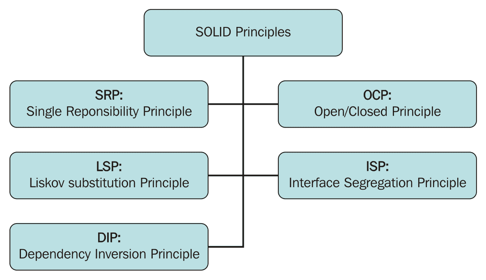

维基百科中关于该缩写每个字母的解释如下：

+   **S - 单一职责原则**：一个类应该只有一个职责（也就是说，只有软件规范的一个潜在变化应该能够影响类的规范）。马丁指出，这个原则基于凝聚性原则，该原则由汤姆·德马尔科在其名为《结构化分析和系统规范》的书中以及梅利尔·佩奇-琼斯在其著作《结构化系统设计实用指南》中定义。

+   **O - 开放/封闭原则**：软件实体应该对扩展开放，但对修改封闭。伯特兰·迈耶是第一个提出这一原则的人。马丁在[`www.butunclebob.com/ArticleS.UncleBob.PrinciplesOfOod`](http://www.butunclebob.com/ArticleS.UncleBob.PrinciplesOfOod)中以另一种方式表达了这个观点，说**你应该能够扩展类的行为，而不需要修改它**。

+   **L - Liskov 替换原则**：程序中的对象应该可以用其子类型实例替换，而不会改变该程序的正确性。芭芭拉·利斯科夫首先提出了这一观点，马丁以这种方式重新表述了原则--*派生类必须可替换为其基类*。

+   **I - 接口隔离原则**：*许多针对特定客户端的接口比一个通用接口更好*。罗伯特·C·马丁是第一个使用和制定这一原则的人，他在上述文章中将它重新表述为--*创建细粒度且针对特定客户端的接口*。

+   **D - 依赖倒置原则**：*我们应该'依赖抽象'。不要依赖于具体实现*。这也是罗伯特·C·马丁提出的一个想法。

# 单一职责原则（SRP）

**单一职责原则**（**SRP**）关注的是，一个类不应该有超过一个改变的理由。在这种情况下，职责被定义为改变的理由。如果在任何情况下，出现多个理由来改变类，那么类的职责是多个的，应该被重新定义。

这确实是最难正确应用的原则之一，因为正如马丁所说，*合并职责是我们自然而然做的事情*。在他的书《敏捷原则、模式和 C#实践》中，马丁提出了一个典型的例子来展示差异，如下所示：

```cs
    interface Modem 
    { 
      public void dial(String phoneNumber); 
      public void hangup(); 
      public void send(char c); 
      public char recv(); 
   } 
```

根据前面的接口，任何实现它的类都有两个职责：连接管理和通信本身。这些职责可以从应用程序的不同部分使用，而这些部分也可能随之改变。

我们将使用 Visual Studio 2017 类设计器来展示马丁提出的我们如何表达这种类设计的方式：

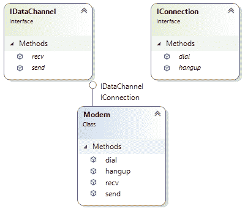

如我们所见，在马丁的解决方案中，类依赖于两个接口，每个接口负责一个职责--连接和通道传输（实际上两个抽象：记住接口不是编译的，它只作为编译器检查的合约）。

然而，有人会想，这两个职责应该分开吗？这取决于应用程序的变化。更准确地说，关键在于知道应用程序的变化是否会影响连接函数的签名。如果会，我们应该将两者分开；否则，没有必要分开，因为那样会创建不必要的复杂性。

因此，总的来说，改变的原因是关键，但请记住，只有在发生变化时，改变的原因才是适用的。

在其他情况下，只要它们与业务定义紧密相关或与操作系统的硬件要求有关，就有理由将不同的职责保持在一起。

# 关注点分离（SoC）的背景

正如通常发生的那样，软件分离问题之前有先前的解决方案。迪杰斯特拉在“*关于科学思维的作用*”（[`www.cs.utexas.edu/users/EWD/transcriptions/EWD04xx/EWD447.html`](https://www.cs.utexas.edu/users/EWD/transcriptions/EWD04xx/EWD447.html)）中提到：“这就是我有时所说的‘关注点分离’，即使不是完美可行的，但据我所知，是唯一有效的思维排序技术。”

另一项进步是信息隐藏，维基百科将其定义为*“在计算机程序中分离最可能改变的设计决策的原则，从而在设计决策改变时保护程序的其他部分免受大量修改。”*这是后来成为面向对象编程（OOP）基本支柱之一的封装的种子。

即使是提到替换原则时我们提到的芭芭拉·利斯科夫，也同时发表了《**使用抽象数据类型编程**》([`dl.acm.org/citation.cfm?id=807045`](http://dl.acm.org/citation.cfm?id=807045))，她将其描述为一种计算机表示抽象的方法。ADT 作为一类对象，其逻辑行为由一组值和一组操作定义，将数据和功能联系起来。

后来的方法改进了这些想法。代码契约的提议，最初由伯特兰·梅耶在他的 Eiffel 语言中引入，并通过 C#中的代码契约实现（[`msdn.microsoft.com/es-es/library/dd264808(v=vs.110).aspx`](https://msdn.microsoft.com/es-es/library/dd264808(v=vs.110).aspx)），鼓励使用软件必须完成的预条件和后条件。

最后，我们可以将海姆·马卡比（[`effectivesoftwaredesign.com/2012/02/05/separation-of-concerns/`](https://effectivesoftwaredesign.com/2012/02/05/separation-of-concerns/））所报告的跨切面关注点的分离视为——可能影响软件的不同部分，甚至在应用的不同层中，应该以类似方式管理的方面（授权或仪表问题等）。在.NET 中，我们依赖于属性，这些属性可以应用于类及其成员，以修改和调整此类行为。

在同一篇文章的稍后部分，Makabee 明确提出了这些技术的主要目的。如果我们把耦合度理解为两个模块之间依赖的程度，那么目标是获得低耦合度。另一个术语是内聚度，即一个模块执行的功能集合的紧密程度。显然，高内聚度更好。

他最后总结了使用这些技术获得的好处：

模式和方法总是旨在减少耦合度，同时增加一致性。通过隐藏信息，我们减少了耦合度，因为我们隔离了实现细节。因此，ADT（抽象数据类型）通过使用清晰和抽象的接口来减少耦合度。我们有一个 ADT，它指定了可以在类型上执行的一组函数，这比由外部函数修改的全局数据结构更具有内聚度。面向对象编程（OOP）达到这种内聚度的方法是实现其两个基本原则——封装和多态，以及动态绑定。此外，继承通过基于泛化和特殊化的层次结构来加强内聚度，这允许从超类所属的功能与其子类之间进行适当的分离。另一方面，AOP（面向切面编程）为跨切面关注点提供了解决方案，这样两个方面和功能都可能变得更加内聚。

可维护性、可重用性和可扩展性只是通过其实施获得的主要优势中的三个。

# 分离关注点的知名例子

我们都经历过一些案例和场景，其中关注点的分离是实施该系统或技术的核心。其中之一就是 HTML（尤其是 HTML5）。

自从其诞生以来，标准 HTML5 被认为可以清楚地分离内容和表现。移动设备的普及使得这一要求更加明显。今天可用的各种形式因素需要一种能够适应这些尺寸的技术，这样内容就可以由 HTML 标签持有，而最终的表现形式则由设备在运行时根据设备决定。

因此，一些标签被宣布为已弃用，例如 `<font>`、`<big>`、`<center>` 以及其他一些标签，同样，一些属性，如 `background`、`align`、`bgcolor` 或 `border` 也发生了同样的情况，因为它们在这个新系统中没有意义。甚至一些仍然保持不变并且对输出有视觉效果的标签（如 `<b>`、`<i>` 或 `<small>`）也保留了下来，这是由于它们的语义意义，而不是它们的表现效果，这种角色完全依赖于 CSS3。

因此，主要目标之一是避免功能重叠，尽管这并非唯一的好处。如果我们把关注点理解为软件功能的不同方面，那么软件的业务逻辑是一个关注点，而一个人使用该逻辑的接口是另一个关注点。

实际上，这意味着将每个这些关注点的代码保持独立。这意味着，更改接口不需要更改业务逻辑代码，反之亦然。封装的底层原则在面向对象（OOP）范式中强化了这些想法，而**模型-视图-控制器**（**MVC**）设计模式是分离这些关注点以实现更好的软件可维护性的一个很好的例子。

# 分离关注点的一个基本示例

让我们用一个非常基础的示例来编写这段代码，并检查耦合和去耦合实现之间的差异。想象一下，一个.NET Core 控制台应用程序必须向用户显示控制台颜色的初始配置，更改一个值，并展示这些更改。

如果你创建一个基本的项目`ConsoleApp1`，以下代码可能是第一种方法：

```cs
    using System; 

    class Program 
    { 
      static void Main(string[] args) 
      { 
        Console.ResetColor(); 
        Console.WriteLine("This is the default configuration for Console"); 
        Console.ForegroundColor = ConsoleColor.Cyan; 
        Console.WriteLine("Color changed..."); 
        Console.Read(); 
      } 
    } 
```

这会产生预期的结果（以下屏幕截图显示了输出）：


这段代码中我们可以发现哪些问题？首先，主要职责是负责一切：重置控制台之前的初始配置，更改前景，并打印结果。

分离的第一个尝试可能是意识到进一步的需求可能需要其他代码片段使用相同的功能。更进一步，这种功能最好位于另一个差异中——例如，一个库这样的软件。因此，我们应该通过一个新的项目来增强我们的解决方案，这个项目包含一个库项目，它将被任何其他项目以及解决方案引用。

此外，手动更改到青色颜色隐含地提醒我们需要一个允许更改到任何有效颜色的函数。

因此，我们可能会得到另一段像这样的代码：

```cs
    namespace Utilities 
    { 
      public class ConsoleService 
      { 
        public void ChangeForegroundColor(ConsoleColor newColor) 
        { 
            Console.ForegroundColor = newColor; 
        } 
        public void ResetConsoleValues() 
        { 
            Console.ResetColor(); 
        } 
      } 
    } 
```

现在，在主入口点，我们可以编写：

```cs
    /* This is version 2 (with utilities) */ 
    ConsoleService cs = new ConsoleService(); 
    cs.ResetConsoleValues(); 
    Console.WriteLine("This is the default configuration for Console"); 
    cs.ChangeForegroundColor(ConsoleColor.Cyan); 
    Console.WriteLine("Color changed..."); 
    Console.Read(); 
```

结果完全相同（我省略了输出，因为没有变化）。因此，我们实现了物理分离和逻辑分离，因为现在对`Console`的任何更改都应该由`Utilities`库来管理，这增加了它们的可重用性，因此提高了可维护性和可测试性。

注意，我们还可以选择创建一个静态库，以避免实例化。

与.NET 的先前版本相比，唯一的改变是，正如我们在之前的屏幕截图中所展示的，现在对库的引用方式略有不同，它在解决方案资源管理器的依赖项部分中显示。一旦项目编译完成，我们也可以在编译产生的`bin`目录中看到这个引用：

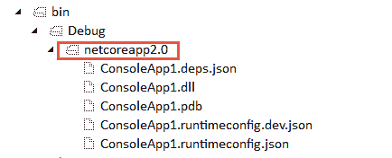

# 另一个示例

让我们用一个更常见的示例来采取更实际的方法：简单的东西，比如从磁盘上的 JSON 文件中读取并展示结果。所以，我创建了一个包含来自 PACKT 的五本书的 JSON 文件的.NET Core 控制台应用程序。

一种可能的方法可能是以下代码：

```cs
    using System; 
    using System.IO; 
    using Newtonsoft.Json; 

    class Program 
    { 
      static void Main(string[] args) 
      { 
        Console.WriteLine(" List of Books by PACKT"); 
        Console.WriteLine(" ----------------------"); 
        var cadJSON = ReadFile("Data/BookStore.json"); 
        var bookList = JsonConvert.DeserializeObject<Book[]>(cadJSON); 
        foreach (var item in bookList) 
        { 
            Console.WriteLine($" {item.Title.PadRight(39,' ')} " +  
                $"{item.Author.PadRight(15,' ')} {item.Price}");  
        } 
        Console.Read(); 
      } 

      static string ReadFile(string filename) 
      { 
        return File.ReadAllText(filename); 
      } 
    } 
```

如我们所见，代码使用了一个实现 `IBook` 接口的 `Book` 类，该接口以非常简单的方式定义：

```cs
    interface IBook 
    { 
      string Title { get; set; } 
      string Author { get; set; } 
      double Price { get; set; } 
    } 
    class Book : IBook 
    { 
      public string Author { get; set; } 
      public double Price { get; set; } 
      public string Title { get; set; } 
    } 
```

这一切正常，并生成以下输出：


注意，我们正在使用流行的 Newtonsoft JSON 库，以便轻松地将字符串转换为 `Book` 对象数组。

如果我们分析代码，我们可以识别出几个存在 SoC 原理的地方：

+   首先，由于要管理的实体是 `Book`（具有三个属性），我创建了一个 `Model` 文件夹来保存 `Book` 接口（`IBook`）的定义，以及实现该接口的 `Book` 类

+   其次，使用 `Newtonsoft` 库是另一种分离，因为它是负责将字符串转换为 `Books` 数组的库。

+   最后，文件读取发生在接收文件名的 `ReadFile()` 方法中。

是否还需要其他分离？正如我们提到的，改变的原因在决定时是关键的。例如，应用程序是否读取另一种类型的信息（除了 `Books` 之外）？或者，我们的用户界面是否真的需要包含 `ReadFile()` 方法？还有，直接在用户界面中引用 `Newtonsoft` 库呢？

如果不是这样，可能更好的方法是将该方法分离到一个 `Utilities` 类中，就像在第一个示例中一样，从而确保架构有三个单独的文件夹来保存应用程序的不同方面：数据模型、实用工具区域和主要用户界面。

以这种方式，我们最终会得到一个如下所示的 `Utilities` 类：

```cs
    using Newtonsoft.Json; 
    using System.IO; 

    internal class Utilities 
    { 
      internal static Book[] ReadData() 
      { 
        var cadJSON = ReadFile("Data/BookStore.json"); 
        return JsonConvert.DeserializeObject<Book[]>(cadJSON); 
      } 

      static string ReadFile(string filename) 
      { 
        return File.ReadAllText(filename); 
      } 
    } 
```

结果的 `Program` 类简化为以下内容：

```cs
    using System; 

    class Program 
    { 
      static void Main(string[] args) 
      { 
        var bookList = Utilities.ReadData(); 
        PrintBooks(bookList); 
      } 

      static void PrintBooks(Book[] books) 
      { 
        Console.WriteLine(" List of Books by PACKT"); 
        Console.WriteLine(" ----------------------"); 
        foreach (var item in books) 
        { 
          Console.WriteLine($" {item.Title.PadRight(39, ' ')} "  + 
             $"{item.Author.PadRight(15, ' ')} {item.Price}"); 
        } 
        Console.Read(); 
      } 
    }  
```

当然，我们得到相同的结果，但现在我们有一个初始的关注点分离。在用户界面中不需要引用外部库，这有助于维护性和可扩展性。

现在我们来探索第二个原则：开放/封闭。

# **开放/封闭原则**

当模块的变更导致一系列影响依赖模块的连锁反应时，我们可以检测到需要使用这个原则。我们说设计过于不灵活。

**开放/封闭原则**（**OCP**）原则建议我们应以这种方式重构应用程序，以便未来的更改不会引发进一步的修改。

正确应用此原则的形式是通过扩展新代码（例如，使用多态）来扩展功能，而不会更改已经工作的旧代码。我们可以找到几种实现这一目标的方法。

注意，对于修改封闭性特别有意义，当你有独立的、分开的模块（DLLs、EXEs 等）依赖于必须更改的模块时。

另一方面，使用扩展方法或多态技术允许我们在不影响其余部分的情况下进行代码更改。例如，考虑自 C# 3.0 版本以来在 C# 语言中可用的扩展方法。

你可以将扩展方法视为一种特殊的静态方法，区别在于它们被调用时就像它们是扩展类型的实例方法一样。你可以在 LINQ 标准查询操作符中找到一个典型的例子，因为它们为现有类型添加了查询功能，例如`System.Collections.IEnumerable`或`System.Collections.Generic.IEnumerable<T>`。

这种模式的经典和最简单的例子是客户端/服务器耦合，这在多年的开发中已经大量出现。最好是客户端依赖于服务器抽象，而不是它们的具体实现。

这可以通过接口来实现。服务器可以实现客户端接口，客户端将使用它来连接到服务器。以这种方式，服务器可以改变，而不会影响客户端使用它们的方式（参见图表）：

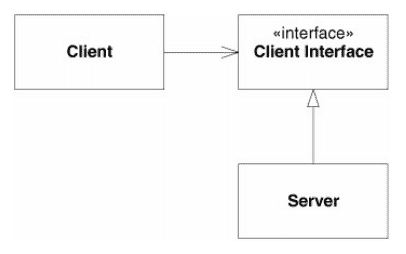

任何客户端接口的子类型都可以自由地以它认为更合适的方式实现接口，只要它不影响其他客户端的访问。

# 回到我们的示例

让我们想象一个简单的案例，其中应用程序必须覆盖一个新的方面。例如，现在应用程序必须允许用户列出额外的书籍文件以添加到之前的列表中。

对于这个新要求，我们可以创建一个新的重载`ReadData()`方法，它接收一个额外的参数。注意，这里甚至不需要使用参数。只要它声明了另一个签名来调用这种额外情况就足够了。

如果我们在另一个文件中（在我们的示例中是`BookStore2`.`json`）有额外的数据，我们可以创建这个额外版本的方法：

```cs
     internal static List<Book> ReadData(string extra) 
     { 
       List<Book> books = ReadData(); 
       var cadJSON = ReadFile("Data/BookStore2.json"); 
       books.AddRange(JsonConvert.DeserializeObject<List<Book>>(cadJSON)); 
       return books; 
     } 
```

注意，我们甚至没有在这个实现中使用方法参数（当然，还有其他方法可以做到这一点，但为了演示的目的，我们就这样做）。

我们现在有两个版本的`ReadData()`方法，根据用户的选择在用户界面中调用（我也将`Book[]`定义改为`List<Book>`以简化，但您也可以在源代码中看到旧版本）：

```cs
    static List<Book> bookList; 
    static void Main(string[] args) 
    { 
      Console.WriteLine("Please, press 'yes' to read an extra file, "); 
      Console.WriteLine("or any other key for a single file"); 
      var ans = Console.ReadLine(); 
      bookList = (ans != "yes") ? Utilities.ReadData() : Utilities.ReadData(ans); 
      PrintBooks(bookList); 
    } 
```

现在如果用户的答案是*是*，你将有一组额外的书籍添加到列表中，正如你在输出中可以看到的：


除了所有这些原因之外，你可以考虑像将`Utilities`代码分离到独立的库中这样的情况，这个库也可以被应用程序的其他部分使用。这里 Open/Closed 原则的实现允许更稳定和可扩展的方法。

# Liskov 替换原则

让我们记住这个定义——子类型必须可替换为其基类型。这意味着这应该在不破坏执行或丢失任何其他类型的功能的情况下发生。

你会注意到这个想法是面向对象编程范式继承的基本原则背后的。

如果你有一个需要`Person`类型参数的方法（让我们这样表达），你可以传递另一个类的实例（`Employee`、`Provider`等）作为参数，只要这些实例继承自`Person`。

这就是设计良好的面向对象语言的主要优势之一，并且大多数流行和接受的语言都支持这一特性。

# 再次回到代码

让我们看看我们的示例中的支持，其中出现了一个新的需求。实际上，我们的演示只是调用`PrintBooks`方法，并期望接收一个`List<Book>`对象作为参数。

然而，当出现新的书籍列表，并且这些列表包含一些新字段，如每本书所属的主题（.NET、Node、Angular 等）时，可能还会出现改变的原因。

例如，出现了一个包含第四个字段`Topic`的新列表：

```cs
    { 
      "Title": "AngularJS Services", 
      "Author": "Jim Lavin", 
      "Price": 30.99, 
      "Topic": "Angular" 
    } 
```

类`Book`不应该被修改，因为它已经被使用。因此，我们可以从`Book`继承并创建一个`TopicBook`类，只需添加新的字段（我尽量保持事情尽可能简单，以便专注于我们正在处理的架构）：

```cs
    public class TopicBook : Book 
    { 
      public string Topic { get; set; } 
    }
```

为了涵盖这个新方面，我们可以更改用户界面，允许用户选择一个新选项（`topic`），该选项包括新的书籍类型：

```cs
    static void Main(string[] args) 
    { 
      Console.WriteLine("Please, press 'yes' to read an extra file, "); 
      Console.WriteLine("'topic' to include topic books or any
          other key for a single file"); 
      var ans = Console.ReadLine(); 
      bookList = ((ans != "yes") && (ans != "topic")) ?  
        Utilities.ReadData() : Utilities.ReadData(ans); 
      PrintBooks(bookList); 
    }   
```

注意，我们只是在包括一个新条件，并在新条件被选中时调用重载方法。

至于`ReadData()`重载方法，我们可以进行一些最小程度的修改（基本上，添加一个`if`条件以包含额外的数据），就像你可以在以下代码中看到的那样：

```cs
    internal static List<Book> ReadData(string extra) 
    { 
      List<Book> books = ReadData(); 
      var filename = "Data/BookStore2.json"; 
      var cadJSON = ReadFile(filename); 
         books.AddRange(JsonConvert.DeserializeObject<List<Book>>(cadJSON)); 
      if (extra == "topic") 
      { 
         filename = "Data/BookStore3.json"; 
         cadJSON = ReadFile(filename); 
         books.AddRange(JsonConvert.DeserializeObject<List<TopicBook>>(cadJSON)); 
      } 
      return books; 
    } 

```

注意到方法的变化很小，特别是我们在添加到书籍列表中的是反序列化不同类（`TopicBook`）的结果，没有任何编译或执行问题。

因此，.NET（以及在这种情况下.NET Core）中泛型的实现正确地实现了 Liskov 替换原则，我们不需要对我们的逻辑进行修改。

我们可以在`ReadData`函数的`return`语句之前使用断点在自动窗口中检查结果，看看`List<Book>`现在是否包含五个类型的`TopicBook`元素，没有任何错误：

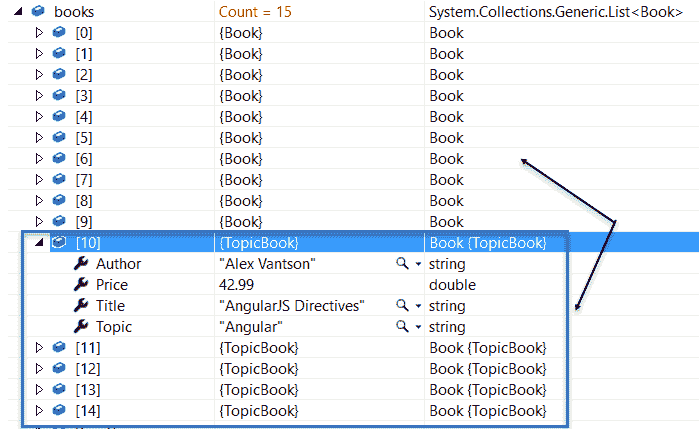

那么，关于另一边（用户界面逻辑）以及我们的`PrintBooks`方法，它期望一个`List<Book>`对象作为参数呢？好吧，只要我们不尝试打印一个不存在的字段，就没有区别。

你可以在以下屏幕截图中检查输出：

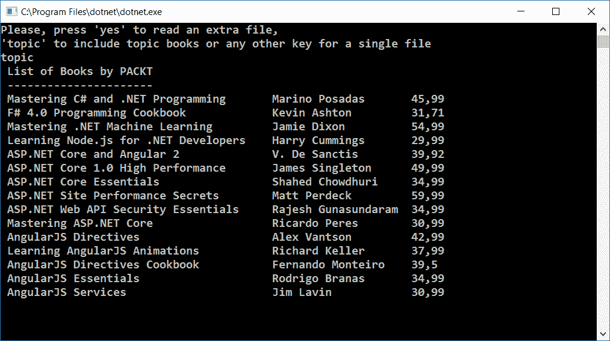

多亏了 Liskov 替换原则的支持，我们能够以最小的努力添加行为和信息，从而强制执行面向对象编程的代码重用原则。

# .NET 中 LSP 的其他实现

到目前为止我们所看到的是.NET 中 LSP 原则实现的唯一方法之一，因为框架的不同区域已经使用这种概念进行扩展。

事件足够灵活，可以以允许我们通过经典定义传递我们自己的信息的方式定义，或者通过泛型的参与，我们可以简单地定义一个通用的事件处理器，它可以持有任何类型的信息。所有这些技术都促进了良好实践的实现，而不仅仅是 SOLID 原则。

# 接口隔离原则

正如马丁所说，这个原则处理了*胖*接口的不便。问题出现在类的接口可以逻辑上分解成不同的组或方法时。

在这种情况下，如果我们的应用程序有多个客户端，那么有些客户端可能连接到他们从未使用过的功能。正如马丁在他的《敏捷原则、模式与实践》一书中所说，

当客户端分离时，接口也应该保持分离。为什么？因为客户端对其服务器接口施加力量。当我们想到导致软件变化的力时，我们通常考虑接口的变化将如何影响其用户。

最后，他总结说，

当客户端被迫依赖他们不使用的方法时，这些客户端会受到那些方法变化的影响。这导致所有客户端之间出现意外的耦合。换句话说，当一个客户端依赖于包含它不使用但其他客户端使用的方方法的类时，该客户端将受到那些其他客户端对类施加的变化的影响。我们希望尽可能避免这种耦合，因此我们想要分离接口。

# 另一个示例

让我们通过另一个从新场景开始的例子来看这种情况。让我们想象另一个应用程序，其中我们不仅要覆盖目前可用的两种书籍类型，还要覆盖一种新的视频格式出版物，该出版物有一个名为`Duration`的字段。

该文件的单一记录看起来像这样：

```cs
     { 
       "Title": "HTML 5 Game Development", 
       "Author": "Daniel Albu", 
       "Price": 5.68, 
       "Topic": "HTML5 Games", 
       "Duration": "2h20m" 
     }  
```

但是应用程序仍然保留了其他两种之前的格式，因此我们有可能根据用户选择的初始选项列出具有三个、四个或五个字段的文件。

第一种方法可能会引导我们到一个这样的接口：

```cs
    interface IProduct 
    { 
      string Title {get; set;} 
      string Author {get; set;} 
      double Price {get; set;} 
      string Topic { get; set; } 
      string Duration { get; set; } 
    } 
```

基于这个界面，我们可以创建`Product`类（新的名字意味着它应该位于书籍或视频之上，因为两者都有四个共同的字段）：

```cs
    public class Product : IProduct 
    { 
      public string Title { get; set; } 
      public string Author { get; set; } 
      public double Price { get; set; } 
      public string Topic { get; set; } 
      public string Duration { get; set; } 
    } 
```

现在，等效的`Utilities`类可以根据用户的输入选择一个文件，读取它，反序列化它，并将信息发送回负责控制台输出的`PrintProducts`方法。

我们新的用户界面看起来像这样：

```cs
    using System;
    using System.Collections.Generic;

    class Program
    {
      static List<Product> productList;
      static void Main(string[] args)
      {
        string id = string.Empty;
        do
        {
            Console.WriteLine("File no. to read: 1/2/3-Enter(exit): ");
            id = Console.ReadLine();
            if ("123".Contains(id) && !String.IsNullOrEmpty(id))
            {
                productList = Utilities.ReadData(id);
                PrintBooks(productList);
            }
        } while (!String.IsNullOrWhiteSpace(id));
      }

      static void PrintBooks(List<Product> products)
      {
        Console.WriteLine(" List of Products by PACKT");
        Console.WriteLine(" ----------------------");
        foreach (var item in products)
        {
            Console.WriteLine($" {item.Title.PadRight(36, ' ')} " +
            $"{item.Author.PadRight(20, ' ')} {item.Price}" + " " +
            $"{item.Topic?.PadRight(12, ' ') } " +]
            $"{item.Duration ?? ""}");
        }
        Console.WriteLine();
      }
    }
```

注意，我们必须处理两种情况，即某些字段可能为空，因此我们使用字符串插值，结合空合并运算符（`??`）和空条件运算符（`?`），以防止在这些情况下失败。

`Utilities`类简化为更简单的代码：

```cs
    using System.Collections.Generic;
    using System.IO;

    internal class Utilities
    {
      internal static List<Product> ReadData(string fileId)
      {
        var filename = "Data/ProductStore" + fileId + ".json";
        var cadJSON = ReadFile(filename);
        return JsonConvert.DeserializeObject<List<Product>>(cadJSON);
      }
      static string ReadFile(string filename)
      {
        return File.ReadAllText(filename);
      }
    }
```

输出允许用户选择一个数字，并以与我们之前在演示中所做的方式打印文件内容，只是这次是单独选择每个文件：

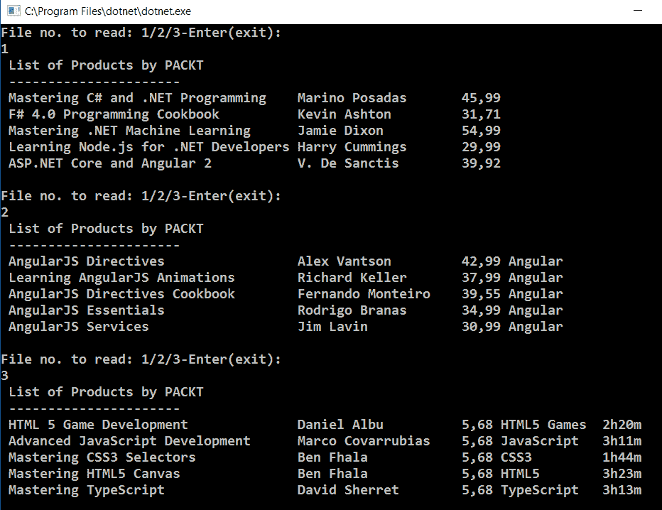

如果我们的应用程序现在需要更多的更改，比如添加统计信息，例如，使用单个类来持有所有这些（这里的`Product`类）表示违反了接口分离原则。

这是因为我们应该分离接口，并使用复合方法来防止一个类处理不想要的或不必要的功能。

可行的和适当的分离可能是创建以下（不同的）接口：

```cs
    interface IProduct
    {
      string Title { get; set; }
      string Author { get; set; }
      double Price { get; set; }
    }

    interface ITopic
    {
      string Topic { get; set; }
    }

    interface IDuration
    {
      string Duration { get; set; }
    }
```

现在我们应该有三个类，因为可以区分出三个实体，但可以保持三个共同的字段。这三个类的定义可以表达如下：

```cs
    class Book : IProduct
    {
      public string Author { get; set; }
      public double Price { get; set; }
      public string Title { get; set; }
    }
    class TopicBook: IProduct, ITopic
    {
      public string Author { get; set; }
      public double Price { get; set; }
      public string Title { get; set; }
      public string Topic { get; set; }
    }
    class Video: IProduct, ITopic, IDuration
    {
      public string Author { get; set; }
      public double Price { get; set; }
      public string Title { get; set; }
      public string Topic { get; set; }
      public string Duration { get; set; }
    }
```

由于这种划分，每个实体都保持了自己的个性，我们后来可以创建使用泛型的方法，或者应用 Liskov 替换原则来处理生命周期中可能出现的不同需求。

# 依赖倒置原则

SOLID 原则中的最后一条基于两个声明，维基百科（[`en.wikipedia.org/wiki/Dependency_inversion_principle`](https://en.wikipedia.org/wiki/Dependency_inversion_principle)）以这种形式定义了这两个声明：

+   *高层模块不应当依赖于低层模块。两者都应当依赖于抽象*

+   *抽象不应当依赖于细节。细节应当依赖于抽象*

关于第一个声明，我们应该明确我们理解的高层模块和低层模块是什么。这个术语与模块执行的动作相对于整个应用程序的重要性相关。

让我们简单地说：如果一个模块持有`Customers`类的业务逻辑，而另一个模块`PrinterService`包含`Customers`类在报告中使用的格式，那么第一个模块将是高层模块，第二个模块将是低层模块（第二个模块存在的原因是为第一个模块提供一些功能）。

第二个声明不言自明。如果一个抽象依赖于细节，那么作为定义合同的用法就会受到损害（细节的变化可能迫使重新定义）。

# （更多或更少的）典型示例

依赖注入技术只是实现这一原则的一种方式，我们将在本书的许多形式和场景中看到它们的示例。

因此，我将在这里使用（几乎）互联网上关于这个主题的规范代码。我在这里向您展示了一个由 Munir Hassan（[`www.codeproject.com/Articles/495019/Dependency-Inversion-Principle-and-the-Dependency`](https://www.codeproject.com/Articles/495019/Dependency-Inversion-Principle-and-the-Dependency)）在 CodeProject 上制作的改编，他用一个通知场景来说明这种情况，我认为这特别有趣。他从一个初始代码开始，如下所示：

```cs
    public class Email
    {
      public void SendEmail()
      {
        // code
      }
    }
    public class Notification
    {
      private Email _email;
      public Notification()
      {
        _email = new Email();
      }
      public void PromotionalNotification()
      {
        _email.SendEmail();
      }
    }
```

通知依赖于 `Email`，在其构造函数中创建一个实例。这种交互被称为紧密耦合。如果我们还想发送其他类型的通知，我们必须修改 `Notification` 类的实现方式。

实现这一点的途径之一是引入一个接口（一个新的抽象级别）来定义发送消息的概念，并强制 `Email` 类实现该接口：

```cs
    public interface IMessageService
    {
      void SendMessage();
    }
    public class Email : IMessageService
    {
      public void SendMessage()
      {
        // code
      }
    }
    public class Notification
    {
      private IMessageService _iMessageService;
      public Notification()
      {
        _iMessageService = new Email();
      }
      public void PromotionalNotification()
      {
        _iMessageService.SendMessage();
      }
    }
```

现在，类调用一个名为 `_iMessageService` 的东西，其实现可能会有所不同。正如 Hamir 提到的，有三种方法来实现这种模式：

依赖注入（DI）是指为服务提供所有所需类，而不是将获取依赖类的责任留给服务。依赖注入通常有三种形式：构造函数注入、属性注入、方法注入

在第一种形式中（构造函数注入），Hamir 提出了以下建议：

```cs
    public class Notification
    {
      private IMessageService _iMessageService;
      public Notification(IMessageService _messageService)
      {
        this._iMessageService = _messageService;
      }
      public void PromotionalNotification()
      {
        _iMessageService.SendMessage();
      }
    }
```

这使我们想起了在下一章中我们将要看到的 ASP.NET Core 中依赖注入的实现。这里没有提到 `Emails`：只隐含了一个 `IMessageService`。

您可以访问上述页面以获取有关其他实现注入方式的更多详细信息，但正如我提到的，我们将在接下来的章节中详细介绍所有这些。

# 实现依赖倒置的其他方法

一般而言，有许多方式可以实现 DIP 原则，从而得到解决方案。实现这一原则的另一种方法是使用依赖注入技术，这是从另一种看待依赖倒置的方式中衍生出来的，即所谓的**控制反转**（**IoC**）。

根据 Martin Fowler（[`martinfowler.com/articles/injection.html`](https://martinfowler.com/articles/injection.html)）撰写的论文，控制反转（Inversion of Control，IoC）是一种原则，其中程序的流程被反转；不是程序员控制程序的流程，而是外部来源（框架、服务和其他组件）控制它。

其中之一是一个依赖容器，它是一个组件，并在需要时为您提供服务或代码的注入。

一些流行的 C#依赖容器有 Unity 和 Ninject，仅举两个例子。在.NET Core 中，有一个内置的容器，因此不需要使用外部容器，除非我们可能需要它们提供的某些特殊功能。

在代码中，你指导这个组件注册你的应用程序中的某些类；因此，稍后当你需要其中一个类的实例时，你只需声明它（通常在构造函数中），它就会自动提供给你的代码。

其他框架也实现了这一原则，即使它们不是纯粹面向对象的。AngularJS 或 Angular 2 就是这种情况，其中，当你创建一个需要访问服务的控制器时，你会在控制器函数声明中请求该服务，而 Angular 的内部 DI 系统会自动提供一个服务的单例实例，无需客户端代码的干预。

# 摘要

在本章中，我们回顾了罗伯特·C·马丁在 2000 年提出的五个 SOLID 原则。

我们已经探讨了这些原则中的每一个，讨论了它们的优点，并使用.NET Core 控制台应用程序的简单代码来检查它们的实现，以了解它们如何被编码。

在下一章中，我们将讨论依赖注入以及最流行的 IoC 容器，回顾它们如何被使用，并分析它们在日常应用中的优缺点。
