# 依赖注入和 IoC 容器

本章旨在更深入地探讨依赖反转原则。这意味着我们将涵盖它如何在不同语言的流行框架中使用，例如 C#或 JavaScript。我们将看到它的主要优点和缺点，以及对其在全球开发者中为何获得势头和共识的简要分析。

在本章中，我们将涵盖以下主题：

+   总的来说，我们将讨论软件工件（如工厂和服务定位器）的概念和实现，以及它们如何与依赖注入相关。工厂和服务定位器——概念、实现以及它们与依赖注入的关系

+   我们还将涵盖 IoC 容器如何实现这个概念，以及这些 IoC 容器在它们实现的语言之外有哪些共同的主要点

+   然后，我们将简要介绍对象组合、对象生命周期以及不同类型的注入，最后对那些依赖注入不是最佳选择的情况进行一些评论

+   我们将以关于今天使用的流行.NET 框架 IoC 容器的演示和一些关于在 JavaScript 框架（如 AngularJS）中如何使用 DI 的简要介绍结束。

本章我们将涵盖以下主题：

+   工厂和服务定位器——概念、实现以及它们与依赖注入的关系

+   IoC 容器

+   关于今天使用的流行.NET 框架 IoC 容器的演示

+   对象组合、对象生命周期以及不同类型注入的介绍

+   简要介绍 DI 在 JavaScript 框架（如 AngularJS）中的应用

# 更详细的依赖原则

但是，在所有这些之前，让我们记住，我们推迟了本章对原则的更详细解释。在第一章，“软件设计的 SOLID 原则”，我们讨论了五个 SOLID 原则的一般性，所以现在是时候深入探讨依赖原则了。实际上，这并不难。它只需要正确理解罗伯特·马丁强调的两个基本点，并通过一些源代码表达这个想法。回想一下：

“高层模块不应当依赖于低层模块。两者都应当依赖于抽象。”

抽象不应当依赖于细节。细节应当依赖于抽象。”

记住，我们还解释了高层和低层类的直观概念，根据它们对应用程序的功能性。在这方面，你可以将应用程序视为一个组织层次结构，其中不同的级别依赖于他们在公司中的角色。

# 让我们看看一个例子

因此，让我们看看一个违反依赖原则的例子，提出一个解决方案，并看看这个解决方案可能根据应用程序的需求（甚至在许多情况下根据程序员的喜好）有多种不同的风味。

我们将使用一个基本的 .NET 应用程序来设置初始场景。它只是一个经典的控制台应用程序，从特定目录读取包含电影信息的文件，并在控制台中显示内容。

我们将从名为 `MovieDB.xml` 的文件开始（该文件采用 XML 格式，存储在应用程序的数据子目录中）并具有以下数据结构：

```cs
    <Movie>
      <ID>1</ID>
      <Title>Jurassic Park</Title>
      <OscarNominations>3</OscarNominations>
      <OscarWins>3</OscarWins>
    </Movie> 
```

因此，我们可以使用 LINQ to XML 来轻松地从该文件读取数据，并遍历结果以在控制台中显示电影标题列表。作为一个好的实践，我们将定义一个表示要读取的数据的类（模型）。

因此，我们将得到以下：

```cs
    public class Movie
    {
      public string ID { get; set; }
      public string Title { get; set; }
      public string OscarNominations { get; set; }
      public string OscarWins { get; set; }
    } 
```

记住，您可以在 Visual Studio 的编辑菜单中选择粘贴特殊选项，以获取粘贴 XML 作为类和粘贴 JSON 作为类的选项，这将在一个新的编辑页面中构建一个新的类，并根据粘贴的数据插入定义，类名为 `Rootobject`。

解决问题的第一个方法可能得到以下代码（请注意，我这里使用的是最初和最简单的方法，以便同时拥有模型和处理所需的功能）：

```cs
    class Program
    {
      static string url = @"Data";
      static XDocument films = XDocument.Load(url + "MoviesDB.xml");
      static List<Movie> movies = new List<Movie>();
      static void Main(string[] args)
      {
        var movieCollection =
            (from f in films.Descendants("Movie")
        select new Movie
        {
          ID = f.Element("Title").Value,
          Title = f.Element("Title").Value,
          OscarNominations = f.Element("OscarNominations").Value,
             OscarWins = f.Element("OscarWins").Value
        }).ToList();
        Console.WriteLine("Movie Titles");
        Console.WriteLine("------------");
        foreach (var movie in movieCollection.Take(10))
        Console.WriteLine(movie.Title);
        Console.ReadLine();
      }
    } 
```

正如你所看到的，我们最终得到一个 `List<Movie>` 集合，并遍历它，在控制台中显示 `Title` 字段的前十个结果（请参阅以下截图）：

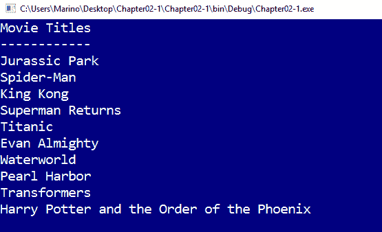

显然，这对于单次使用来说是不错的，但不适用于扩展用途。由于 `Program` 类有多个职责，因此应该相应地解耦。因此，我们可以考虑一个 `MovieReader` 类，该类负责读取数据并应用第一个 SOLID 原则（关注点分离）。

新的 `MovieReader` 类可能看起来像这样：

```cs
    public class XMLMovieReader
    {
      static string url = @"Data";
      static XDocument films = XDocument.Load(url + "MoviesDB.xml");
      static List<Movie> movies = new List<Movie>();
      public List<Movie> ReadMovies()
      {
        var movieCollection =
           (from f in films.Descendants("Movie")
        select new Movie
        {
          ID = f.Element("Title").Value,
          Title = f.Element("Title").Value,
          OscarNominations = f.Element("OscarNominations").Value,
          OscarWins = f.Element("OscarWins").Value
        }).ToList();
        return movieCollection;
      }
    } 
```

因此，我们只需将访问数据所需的声明移动到新类中，并在 `ReadMovies` 方法周围包装读取功能，该方法读取并返回所需的数据。

我们的 `Main` 入口点现在要简单得多。考虑以下代码片段：

```cs
    static void Main(string[] args)
    {
      XMLMovieReader mr = new XMLMovieReader();
      var movieCollection = mr.ReadMovies();
      Console.WriteLine("Movie Titles");
      Console.WriteLine("------------");
      foreach (var movie in movieCollection.Take(10))
      Console.WriteLine(movie.Title);
      Console.ReadLine();
    }
```

这很好，但我们的 `Program` 类仍然依赖于 `XMLMovieReader`。如果我们（或其他人）需要以其他格式读取数据，例如 JSON，会发生什么？

这就是依赖注入发挥作用的地方。如果我们的 `Program` 类能够依赖于一个抽象，而不是一个具体类，那就好多了。它可以是抽象类，也可以是接口。

这意味着还需要另一个类来决定根据文件格式应该提供哪种具体实现。这样，也可以在不更改已工作的代码的情况下添加读取数据的其他方法（如访问 Web 服务或数据库）。

因此，我们可以有另一个专门的读取器，称为 `JSONMovieReader`，具有以下实现：

```cs
    public class JSONMovieReader
    {
      static string file = @"Data\MoviesDB.json";
      static List<Movie> movies = new List<Movie>();
      static string cadMovies;
      public List<Movie> ReadMovies(string file)
      {
        var moviesText = File.ReadAllText(file);
        return JsonConvert.DeserializeObject<List<Movie>>(moviesText);
      }
    } 
```

因此，我们只需根据我们使用的格式实现适当的类。除此之外，鉴于两个文件包含完全相同的数据，两种情况下都会得到相同的结果（出于这个原因，我省略了输出）。

现在，我们应该创建一个接口，定义所有读取器都将具有的共同操作；`ReadMovies()` 方法。

```cs
    interface IMovieReader
    {
      List<Movie> ReadMovies();
    } 
```

这个接口是两个类（以及其他可能的候选者）实现的合同，因此，我们只需更改两个声明，明确指出它们确实实现了 `IMovieReader` 接口。这样，最终的定义将是：

```cs
    public class XMLMovieReader : IMovieReader
    ...
    public class JSONMovieReader : IMovieReader
    ... 
```

最后一步是创建一个新的类，负责决定使用哪个读取器（在这个演示中是 `ReaderFactory`）：

```cs
    public class ReaderFactory
    {
      public IMovieReader _IMovieReader { get; set; }
      public ReaderFactory(string fileType)
      {
        switch (fileType)
        {
          case "XML":
          _IMovieReader = new XMLMovieReader();
          break;
          case "JSON":
          _IMovieReader = new JSONMovieReader();
          break;
          default:
          break;
        }
      }
    }  
```

注意，`ReaderFactory` 构造函数决定了分配给 `_IMovieReader` 属性的读取器类型。这可以根据需要轻松扩展。我们的 `Program` 类有一个新的定义，但它是一个可扩展的，我们可以添加所需的读取方法，而无需或只需少量更改：

```cs
    class Program3
    {
     static IMovieReader _IMovieReader;
     static void Main(string[] args)
      {
       Console.SetWindowSize(60, 15);
       Console.WriteLine("Please, select the file type to read (1)
         XML, (2) JSON: ");
       var ans = Console.ReadLine();
       var fileType = (ans == "1") ? "XML" : "JSON";
       _IMovieReader = new ReaderFactory(fileType)._IMovieReader;
       var typeSelected = _IMovieReader.GetType().Name;
       var movieCollection = _IMovieReader.ReadMovies();
       Console.WriteLine($"Movie Titles ({typeSelected})");
       Console.WriteLine("------------");
       foreach (var movie in movieCollection.Take(10))
       Console.WriteLine(movie.Title);
       Console.ReadLine();
      }
    }
```

在这种情况下，我们提供了一个选项来选择文件格式，并且根据用户的选择，`IMovieReader` 返回的处理会处理该格式的特殊性（你也可以考虑其他格式，例如 Excel 电子表格、纯文本格式、逗号分隔的文件、数据库、网络服务等）。

Visual Studio 从该架构生成的类图采用以下方面（只需右键单击类的名称--在这个演示中为 `Program3`，并选择查看类图），以获得以下图形结构：

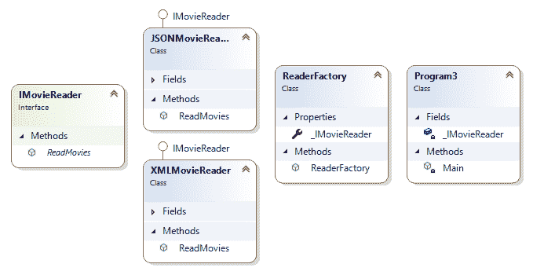

总结来说，`IMovieReader` 接口是两个类都同意的合同。只要任何其他类实现了这个接口，我们就能像上面提到的那样，以新的方式扩展潜在的数据访问机制。

实现的一个重要部分是，从用户界面，我们可以访问 `ReaderFactory` 类内部的一个只读属性 `_IMovieReader`。以这种方式，我们避免了属性一旦分配了值之后的进一步更改。最后，我们获取 `_IMovieReader` 结果类型的 `Name` 属性，以将其包含在最终输出中。

列表与之前类似，但这次用户可以选择格式的类型（XML 或 JSON）：

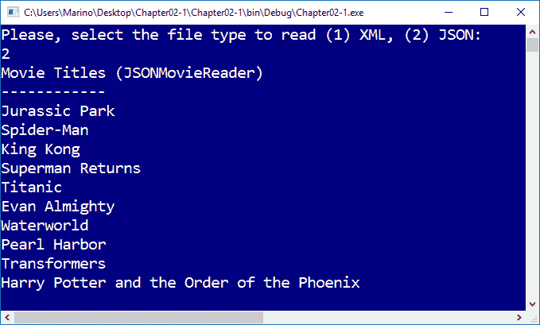

初看之下，你可能会认为在使用 DI 方法时我们需要编写更多的代码，但这种情况只发生在我们处理简单的演示时，就像在这个例子中一样。

在实际应用中，随着数千或数万行代码，所需的代码量通常会减少，并且它极大地简化了生命周期的其他方面，如可维护性、可测试性、可扩展性、并行开发等。

# 依赖注入的方面

然而，在继续探讨依赖注入的各个方面之前，建议回顾一些对形成这一原则有深远影响的基本概念，并在其实施之前考虑它们。具体来说，有三个主要点需要评估--对象组合、对象生命周期和拦截。

由于这三个主题在软件开发中至关重要（而不仅仅是讨论依赖注入时），我们将在第六章对象生命周期、第七章拦截和第八章模式 - 依赖注入中回到它们，但让我们现在先简要介绍，作为对即将到来的内容的提醒。

# 对象组合

依赖注入和其他 SOLID 模式背后的一个重要概念是对象组合，正如维基百科([`en.wikipedia.org/wiki/Object_composition`](https://en.wikipedia.org/wiki/Object_composition))提醒的，“*是一种将简单对象或数据类型组合成更复杂对象的方法。组合是许多基本数据结构的关键构建块，包括标记联合、链表和二叉树，以及面向对象编程中使用的对象。*”

它给出了一个相当清晰的例子；类型通常可以分为复合类型和非复合类型，组合可以被视为类型之间的关系：一个复合类型的对象（例如，一辆车）*拥有*一个更简单类型的对象（例如，一个轮子）。

如你所知，这些关系自面向对象编程的起源以来一直是其核心。这也与聚合有关，不应与继承混淆。

实际上，面向对象编程（OOP）中有一个著名的原则，称为**组合优于继承**，它指出“*类应该通过组合（通过包含实现所需功能的其他类的实例）而不是从基类或父类继承来实现多态行为和代码复用。*”

因此，建议优先考虑对象组合而不是类继承：

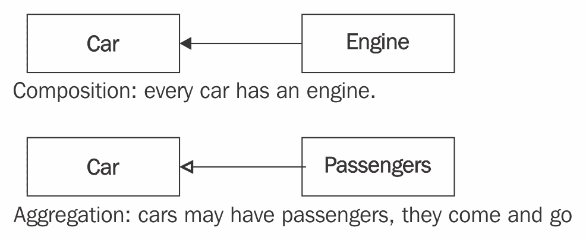

（图片来源：[`atomicobject.com/resources/oo-programming/object-oriented-aggregation`](https://atomicobject.com/resources/oo-programming/object-oriented-aggregation)）

之前的图示显示了两种方法之间的区别：组合和聚合。用于组合汽车的各个元素是汽车的一部分。没有它们，对象无法完成任务。

在第二种情况下，乘客可以来去（或者现在，由于自动驾驶汽车不需要驾驶员，甚至可以不需要），但它们最终可以由汽车的实例来管理。

请记住，维基百科([`en.wikipedia.org/wiki/Composition_over_inheritance`](https://en.wikipedia.org/wiki/Composition_over_inheritance))指出——“*实现已识别接口的类根据需要构建并添加到业务域类中。因此，系统行为是通过不使用继承来实现的。实际上，业务域类可能全部是基类，没有任何继承。系统行为的替代实现是通过提供另一个实现所需行为接口的类来完成的。任何包含接口引用的业务域类都可以轻松支持该接口的任何实现，甚至可以选择在*运行时*进行选择。”*

# 对象生命周期

在之前的演示中，我们看到了通过抽象来消除类依赖的方法，以及我们后来根据需要更改这些抽象的可能性，以及与应用程序的生命周期相关联的可能性。

但是，除了这种基本能力之外，这种做法还允许我们确定抽象的生命周期：它们何时诞生（实例化）以及何时超出作用域（并让垃圾回收器负责完成其有用生命周期的任务）。

你知道，当一个对象没有被其他对象引用时，它就会自动成为可销毁的候选对象，从而释放其关联的内存。

垃圾回收器的工作方式并不简单（尽管对用户来说是透明的），而且有很多事情需要考虑，特别是对象生成和处理以及内存回收的方式，即使在简化模型中也是如此（参见以下图片）：

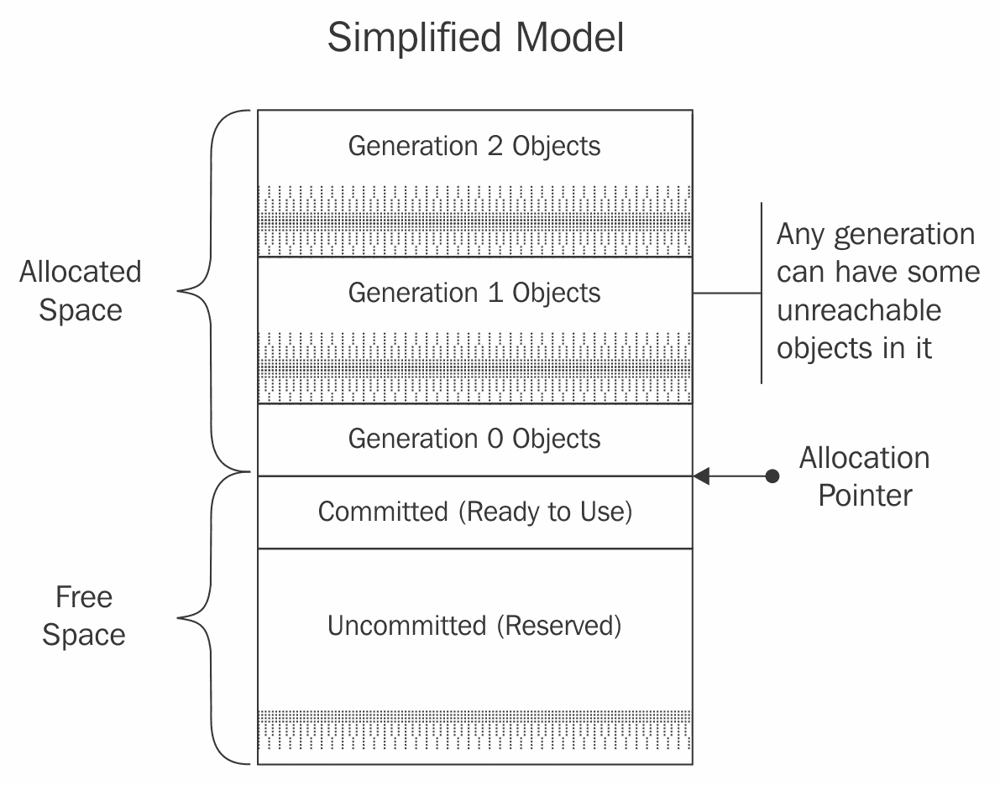

(图片来源：[`msdn.microsoft.com/en-us/library/ms973837.aspx`](https://msdn.microsoft.com/en-us/library/ms973837.aspx))

关于垃圾回收的一些信息来自维基百科([`en.wikipedia.org/wiki/Garbage_collection_(computer_science)`](https://en.wikipedia.org/wiki/Garbage_collection_(computer_science)))——“*在计算机科学中，垃圾回收（GC）是一种自动内存管理形式。垃圾回收器，或简称回收器，试图回收垃圾* *或程序不再使用的对象占用的内存。垃圾回收是由约翰·麦卡锡在 1959 年发明的，目的是简化 Lisp 中的手动内存管理。”*

请记住，当两个对象共享同一接口的实例时，或者当我们向不同的客户端注入两个不同的实例时出现新的场景时，可能会出现问题。

这些对象在内存中的管理方式在很大程度上也取决于我们的代码。因此，我们将在第七章，*拦截*中解释这些复杂性，以便你能详细了解这种行为及其可能对你的代码产生的影响。

# 拦截

我们可以将拦截视为装饰器设计模式的运用。对于一些作者来说，拦截是预先过滤给定调用的过程，这样我们就可以从其标准（原始）行为中包含（或排除）某些信息。

在 IMovieReader 实现的案例中，创建一个能够读取电影的合法对象的过程被重定向到`ReaderFactory`，而不是之前的调用具体构造函数。这是可能的，因为抽象允许我们延迟实例化，并根据参数、系统配置、配置文件等决定创建什么。

拦截的另一种典型用途与仪表化相关：超出应用程序域的应用程序的不同方面，如日志记录、审计、验证等。

最后，当我们使用所谓的子类化技术捕获系统组件的默认行为时，我们可以找到拦截。这种技术允许交织系统调用，并有效地改变系统的行为，用我们自己的行为来替代它。

# 实现 DI 的方法

在这种情况下，依赖注入是通过构造函数实现的，这是今天许多流行的 IoC 容器（对于.NET Framework 以及甚至其他框架，如 Angular）的首选实现方式。

然而，还有其他两种经典的 DI 实现路径：通过属性（也称为 setter 注入）或方法。

在属性注入的口味中，我们处理的是一种场景，在这种情况下，允许用户在程序运行时更改依赖项是有意义的。例如，想象一下，你从一个具体实现开始，后来客户端或某些程序的条件需要改变。

有时，这种改变并不严格地需要一个新的类实例，因此仅仅为了改变一个特定的值而创建它是不可取的。保持 DI 所倡导的独立性水平要好得多，但允许依赖项的客户端在一旦使用后更改该值。

为了实现这个目标，我们必须创建一个可写属性（而不是像之前那样只读属性）。但是，存在一个风险。我们必须避免空值。我们可以通过创建一个默认值轻松地做到这一点，使用 C#的最新技术，这将在演示中看到。因此，依赖项值的更改是确定是否需要在注入中使用属性的关键。

在方法注入中，需要依赖项的代码块通常是一些方法的参数，依赖项参数的目的是提供一个上下文，该上下文决定了方法应该如何行为。

因此，我们可以说这个场景是作用域相关的。当依赖项的作用域是局部的，比如它只在一个具体的方法中使用（它不会影响整个类）时，将依赖项的存在限制在将要使用它的方法中是一种良好的实践。

让我们看看关于这两种实现依赖注入的几个示例。

# 属性注入的实际应用

让我们为这个演示想象一个非常简单的场景。代码展示了当前控制台的颜色值初始配置，以及指示这些值的消息。我们为用户提供更改主题的能力，以避免难以阅读的组合。

我们将这些组合减少到亮色和暗色，除了初始的黑色/白色组合。我们可以定义一个非常简单的`ConsoleDisplayFactory`类，其中包含两个在其实例化时分配的默认值：

```cs
    public class ConsoleDisplayFactory
    {
     // Both properties asume a default (initial) configuration
     public ConsoleColor ForeColor { get; set; } = ConsoleColor.White;
     public ConsoleColor BackColor { get; set; } = ConsoleColor.Black;
     public ConsoleDisplayFactory ConfigureConsole (string theme)
     {
       switch (theme)
       {
         case "light":
         BackColor = ConsoleColor.Yellow;
         ForeColor = ConsoleColor.DarkBlue;
         break;
         case "dark":
         BackColor = ConsoleColor.DarkBlue;
         ForeColor = ConsoleColor.Yellow;
         break;
         default:
         break;
       }
       return this;
     }
    }
```

根据这个定义，每次我们创建一个实例时，两个属性（`ForeColor`和`BackColor`）都会被分配默认的主题配置。我们的`Program`类将依赖于`ConsoleDisplayFactory`，但我们确保这两个值保持一致的颜色配置。

现在，我们的主要入口点，位于`Program4`中，将如下所示：

```cs
    class Program4
    {
      static ConsoleDisplayFactory cdf = new ConsoleDisplayFactory();
      static void Main(string[] args)
      {
        // Initial config
        cdf.ConfigureConsole("default");
        Console.BackgroundColor = cdf.BackColor;
        Console.ForegroundColor = cdf.ForeColor;
        Console.WriteLine("Console Information");
        Console.WriteLine("-------------------");
        Console.WriteLine("Initial configuration: \n");
        Console.WriteLine($"Back Color: { cdf.BackColor}");
        Console.WriteLine($"Fore Color: { cdf.ForeColor }");
        // User's config
        Console.WriteLine("New theme ('light', 'dark',
            'Enter'=>default):");
        var newTheme = Console.ReadLine();
        cdf.ConfigureConsole(newTheme);
        Console.BackgroundColor = cdf.BackColor;
        Console.ForegroundColor = cdf.ForeColor;
        Console.WriteLine("New configuration: \n");
        Console.WriteLine($"Back Color: { cdf.BackColor}");
        Console.WriteLine($"Fore Color: { cdf.ForeColor }");
        Console.ReadLine();
      }      
    }
```

观察通过`ConsoleDisplayFactory`实例执行的控制台配置更改，该实例是`Program4`类的一个属性。对于这个演示的初始版本，我们选择了一个方法（作为设置器）来处理分配的值。

另一种方法可能是以这种方式编写`ConsoleDisplayFactory`类的`ForeColor`和`BackColor`属性，即每个属性的设置器将负责为每个主题分配适当的更改。

虽然很简单，但这段代码展示了属性注入背后的理念。我们不需要整个类被重新实例化，因此我们允许客户端更改所需的属性，但要注意结果应按照业务规则进行注入。

我们使用注入方法或直接编程设置器，这始终取决于代码的架构和您的需求。

（我们省略了输出，因为在这种情况下它相当简单）。

# 方法注入的实际应用

正如我们之前提到的，关键在于注入的资源在客户端类的方法中是有意义的。这主要有两个原因，如下所述：

+   注入的参数会影响方法的行为方式，并且它可以在其生命周期内改变（在不同的方法调用中）。

+   注入参数的功能会影响方法代码块，而不影响其他任何内容。因此，当它仅在该代码块内部使用时，没有必要创建类作用域的依赖项。

当我们编写一个具有动态功能的方法时，会出现这种情况（例如 HTTP 上下文、访问在执行过程中可能发生变化的文件目录、Web Sockets 等）。

众所周知，.NET Framework 已经在各种命名空间的一些类中实现了这个功能。例如，在**基类库**（**BCL**）中，`System.ComponentModel`命名空间允许使用`TypeConverter`类，这在涉及 WPF 的上下文中特别有用，允许在纯 CLR 类型和 XAML 类型或其他业务逻辑类型之间进行转换。

一些此类方法的实现使用`ITypeDescriptorContext`的实例，它携带有关执行上下文的信息。

但有一个更简单、更常见的场景，这种情况一直在发生：.NET 事件系统的结构，我认为理解它是如何工作的对于意识到我们如何在日常情况下找到这种模式的实现非常有用，以及它从一开始就被如何使用。

# .NET 事件架构作为模型注入

让我们思考一下事件模型：在实践中，方法 A 调用方法 B 并传递一些参数（默认为两个）。当你用经典（和现代）.NET 编程一个点击、`SelectedItemChanged`或`FormClosing`事件时，就会发生一个通信过程。

该过程涉及一个负责调用（发送者）和被调用者（接收者）的方法。这可以用我们所有人都从信息论第一本书中知道的任何其他通信过程的经典方案来表示：

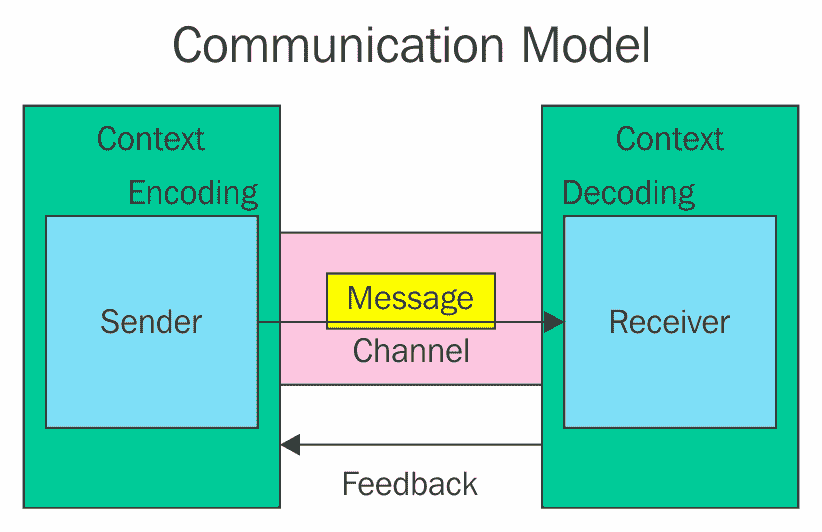

聚合是一个简单的集合，就像一袋弹珠，而组合则意味着内部/功能依赖，就像盒子上的铰链。汽车聚合乘客；乘客上下车而不会破坏汽车的功能，但轮胎是组件；移除一个，汽车就不再正确工作。

如果你不知道这些概念（组合和聚合），PACKT 有一些优秀的书籍可以开始阅读，比如 Gaston C. Hillar 的《面向对象编程》（[`www.packtpub.com/application-development/learning-object-oriented-programming`](https://www.packtpub.com/application-development/learning-object-oriented-programming)）。

在四个隐含元素中，两种方案之间存在对应关系：

+   发起者（发送者）：它是进行调用的方法

+   接收者：它是另一个类（或相同的）在另一个方法中做出响应

+   通道：它是环境，在.NET 中由托管环境替代

+   消息：传递给接收者的值集（.NET 中的`EventArgs`）

让我们思考一个 Windows 应用程序，其中用户界面生成事件，例如，当我们使用按钮关闭窗口时。表示这种场景的代码片段可以用以下代码表示：

```cs
    private void btnClose_Click(object sender, EventArgs e)
    {
      this.Close();
    } 
```

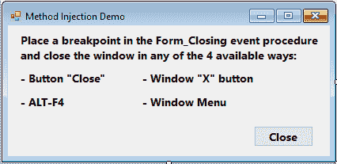

谁启动了这段代码的执行？嗯，当我们在`Form`类的设计器部分编程点击事件时，按钮对象包括以下代码：

```cs
    this.btnClose.Click += new System.EventHandler(this.btnClose_Click);
```

这创建了一个类型为`EventHandler`（默认类型）的代理，它将负责在用户点击时调用目标方法。为了避免可能的问题，该事件只是一个具有一些特性的类：

+   它的签名与要调用的方法相同。以这种方式，避免了可能的类型转换问题。

+   代理在调用之前检查`btnClose_Click`方法的可用性，因此它保证了没有空指针问题。

由于类型转换和空指针是臭名昭著的 BSOD（蓝屏死机）的两个主要原因，因此从.NET 的最初阶段开始，这种架构的实施是至关重要的。

然而，这里还有其他一些东西暗示了方法注入，如果您分析代码，即使在那些情况下，例如在下一个演示中，当代理不是默认时。

要真正理解这一点，让我们编写一个`FormClosing`事件，它将在用户点击关闭按钮或以任何其他可用方式尝试关闭窗口时触发：*Alt* + *F4*，窗口的 x 按钮，或窗口的菜单：

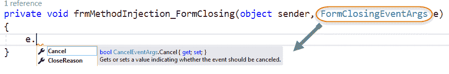

如您所见，这次`FormClosing`事件的第二个参数不是默认的，而是一个继承自`EventArgs`的对象实例，它包含了提供上下文的额外信息，这是我们之前提到的。

实际上，该对象包含两个属性：`Cancel`（可赋值并强制在退出过程中停止），以及`CloseReason`，一个只读属性，表示哪个机制真正触发了关闭过程。

因此，我们不是在编程或实例化这个参数：它是通过注入给我们，每次我们定义一个事件过程时。这个内部注入系统负责提供与执行上下文相关的信息。这是一个方法注入的明显示例。

如果您查看`FormClosingEventArgs`参数的定义，您将看到它确实是一个继承自`CancelEventArgs`（它反过来继承自`EventArgs`）的另一个类：

```cs
    public class FormClosingEventArgs : CancelEventArgs
    {
     //
     // Summary:
     // Initializes a new instance of the 
            System.Windows.Forms.FormClosingEventArgs class.
     //
     // Parameters:
     // closeReason:
     // A System.Windows.Forms.CloseReason value that represents 
         the reason why the form
     // is being closed.
     //
     // cancel:
     // true to cancel the event; otherwise, false.
     public FormClosingEventArgs(CloseReason closeReason, bool cancel);

     //
     // Summary:
     // Gets a value that indicates why the form is being closed.
     //
     // Returns:
     // One of the System.Windows.Forms.CloseReason enumerated values.
     public CloseReason CloseReason { get; }
   }  
```

有趣的是要注意，`ClosingEventArgs`也属于我们之前提到的`System.ComponentModel`命名空间。

因此，即使我们在做像关闭窗口这样简单的事情时，我们也在隐式地使用方法注入，这是.NET 框架的核心。

这种架构可以通过用户以多种方式扩展，甚至可以使用事件链等技术，当我们需要连接依赖于用户选择的过程时，这些过程通常通过事件生成，例如。

对于级联选择，一个典型的例子是当用户从一个组合框（例如选择一个国家）中进行选择时，会生成代码来填充另一个组合框，比如选择一个城市。你首先必须选择一个国家，这样城市组合框才能填充属于该国家的城市。

其中一个例子可能是当一个窗口的关闭过程（类似于前面显示的代码）需要额外的用户干预时。例如，想象一下，你必须询问用户是否想要保存审计（或执行任何其他操作），但仅当先前的询问是肯定的，比如确认用户想要退出应用程序（这反过来可能取决于其他条件，如 FormClosing 事件中表达的前一个代码中的 `CloseReason`）。

一种可能的方法是创建一个我们自己的通用事件，如果满足请求的条件，则可以触发。比如说，只有当 `ClosingReason` 是 `CloseReason.UserClosing` 时，我们应该询问用户是否确认应用程序退出，如果答案是肯定的，再询问他是否想要保存信息。

我们可以编写以下代码：

```cs
    private void frmMethodInjection_FormClosing(object sender,
       FormClosingEventArgs e)
    {
      if(e.CloseReason == CloseReason.UserClosing)
      {
        var res = MessageBox.Show("Confirm application exit?", "Notice",
        MessageBoxButtons.YesNo, MessageBoxIcon.Question);
        if (res == DialogResult.Yes)
        FormClosingExtended?.Invoke(this, DateTime.Now.ToLongTimeString());
        else e.Cancel = true;
      }
    }
    public event EventHandler<string> FormClosingExtended; 
```

因此，我们仅在 if 块评估为真时调用 `FormClosingExtended` 事件。但是，使用新的通用事件处理器，我们可以将登录信息传递给另一个事件，该事件从那里跳转到不同的事件过程：

```cs
    private void FrmMethodInjection_FormClosingExtended(object
       sender, string e)
    {
      var ans = MessageBox.Show($"Save Closing time: ({e})?","Notice",
      MessageBoxButtons.YesNo,MessageBoxIcon.Question);
      if (ans == DialogResult.Yes)
      {
         File.WriteAllText("ClosingTime.txt", e);
      }  
    } 
```

此事件过程接收 e 参数中的数据，并询问用户是否希望将其保存为审计信息。这样，我们就不需要连接两个 `MessageBox` 调用，代码也更加清晰。

此外，由于 e 参数可以是任何类型的通用事件处理器，因此作为事件参数传递的信息类型也可以是任何类型，任何复杂程度。例如，它可以是具有适合验证目的、安全检查等自己方法的对象。

代码中唯一缺少的是定义过程中涉及到的每个事件的处理器，这可以在 `MethodInjection` 构造函数内部完成：

```cs
    public frmMethodInjection()
    {
      InitializeComponent();
      this.FormClosing += frmMethodInjection_FormClosing;
      FormClosingExtended += FrmMethodInjection_FormClosingExtended;
    }
```

因此，在 DI 方面，我们在 .NET Framework 中以两种不同的方式使用内部注入引擎：

+   在第一种情况下，为了获取框架传递给我们的与引发该事件的原因相关的信息（`ClosingReason`）。

+   在第二种情况下，因为我们已经实现了一个自己的事件，该事件在连接到前一个事件后执行，并期望用户批准所需的信息。

注意，如果没有为第二个事件处理器需要业务逻辑参数，我们也可以将其注册为 FormClosing 事件，因为事件在 .NET 中是可多播的。

# DI 容器

在日常实践中，使 DI 工作的部分管道不是通过手动编码完成的，而是使用称为 DI 容器（也称为 IoC 容器）的东西。之前使用 .NET 框架事件系统的演示暗示了存在某些 DI 容器。

基本上，DI 容器是一个软件库，它简化了依赖注入及其基于对象组合、生命周期管理等方法的用法。这对程序员来说非常方便，因为他们不必担心创建、销毁等细节。

许多人对 DI 和 IoC 有一些混淆。您可以参考这个网站来消除任何混淆：[`www.itgo.me/a/8238364259424879474/inversion-of-control-vs-dependency-injection.`](http://www.itgo.me/a/8238364259424879474/inversion-of-control-vs-dependency-injection)

在许多情况下，DI 容器强制执行一些良好的实践，例如通过提供所需组件的单例实例来避免实例的重复，就像 AngularJS 从初始版本开始所做的那样。

在 .NET 中，正如我们提到的，IoC 在几个场景中都存在，以下图像显示了使用此技术的某些主要组件：

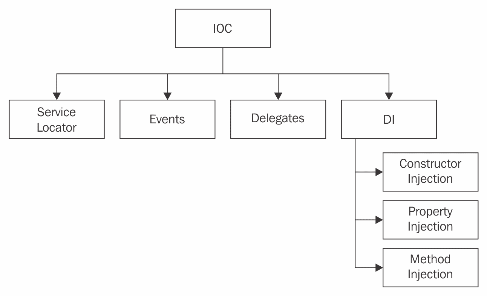

（图片来源：[`hotproton.com/category/dependency-injection/`](https://hotproton.com/category/dependency-injection/))

正如你在图中看到的，.NET（甚至在之前的版本中）包含几个提供控制反转（IoC）的组件，这些组件要么与事件和委托相关联，正如我们在之前的演示中所见，要么作为服务定位器，或者作为 DI 注入机制。

# 服务定位器

基本上，服务定位器只是一个设计模式，它指导实现者如何构建能够通过强大的抽象层获取服务的 DI 容器。

所有服务定位器都需要满足一个条件：服务必须注册，以便可以在代码请求时找到并提供服务。

维基百科 ([`www.itgo.me/a/8238364259424879474/inversion-of-control-vs-dependency-injection`](http://www.itgo.me/a/8238364259424879474/inversion-of-control-vs-dependency-injection)) 总结了服务定位器的三个主要优点：

+   服务定位器可以充当简单的运行时链接器。这允许在运行时添加代码，而无需重新编译应用程序，在某些情况下甚至无需重新启动它。

+   应用程序可以通过从服务定位器中选择性地添加和删除项目来在运行时优化自己。例如，一个应用程序可以检测到它有一个比默认更好的库来读取 JPG 图像，并相应地更改注册表。

+   库或应用程序的大块区域可以完全分离。它们之间的唯一联系就是注册表。

通常，我们可以这样说，依赖倒置原则的应用导致了 IoC 容器的构建，它们在具体的 DI 技术和服务定位器中得到了体现。（见以下图示）：

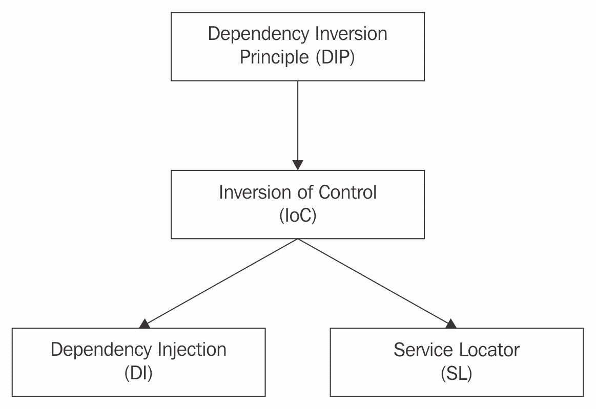

（图片来源：[`www.dotnettricks.com/learn/dependencyinjection/understanding-inversion-of-control-dependency-injection-and-service-locator/`](http://www.dotnettricks.com/learn/dependencyinjection/understanding-inversion-of-control-dependency-injection-and-service-locator/))

当然，这些优势并非没有对应的缺点。可能出现的问题包括注册表像黑盒一样作用于应用程序的其他部分、唯一性、安全漏洞、隐藏类依赖关系、增加一些测试难度等等。

# .NET 的依赖注入容器

除了与.NET 内部 DI 相关的功能外，使用外部容器提供额外或扩展功能给程序员是非常常见的，而且作为非常流行的编程框架的.NET，近年来已经出现了许多这样的容器。

因此，我们的标准将是展示那些在社区中似乎接受度更高的基本实现，如 Unity、Castle Windsor、StructureMap 和 Autofac。

实际上，在过去几年中，可用的选择数量一直在增加，其中一些相当受欢迎，如 Ninject、Simple Injector、Dynamo、LinFu、Spring.NET、Hiro 等等，因此在这种情况下，我们的选择主要是由社区中的实现水平、易用性、API 的一致性以及最新版本的性能测试驱动的。由于我不想对任何这些测试发表意见，你可以查看网络上可用的不同基准测试，你可能会得出与我相同的或类似的结论。

这些依赖注入容器（以及其他容器）有一些共同点：它们都需要之前的配置，并且能够在运行时解析所需的依赖项。以下图示展示了实现这一想法的方法：

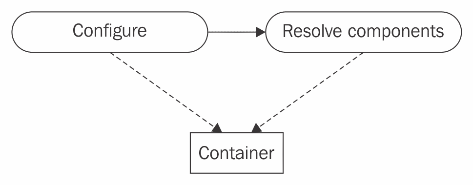

在实践中，这意味着我们将实例化和配置一个容器对象，然后稍后，我们会要求容器在我们的代码中的一个或多个位置解析所需的依赖项。

此外，在大多数情况下，组件都是从我们最初实例化的同一个实例中解析出来的。

我们演示的常见（且非常简单）的上下文：

由于在实际编码真实应用程序时会出现复杂性，我选择了一个非常简单、非常简单的起点，它可以作为一个常见的场景来解决它所提出的 DI 问题。它基于我们之前的`MovieReader`想法，但让我们说在这种情况下，我们甚至没有从磁盘读取任何内容（只显示控制台消息），以关注代码的架构而不是其实施的细节。

示例提出了两个负责从磁盘读取一些书籍信息的类的存在，它们都共享一个公共接口 `IBookReader`，该接口实现了一个独特的方法 `ReadBooks()`。这三个元素构成了数据访问层：

```cs
     // Data Access Layer
     public interface IBookReader
     {
       void ReadBooks();
     }
     public class XMLBookReader : IBookReader
     {
       public void ReadBooks()
       {
         Console.WriteLine("Books read in XML Format");
       }
     }
     public class JSONBookReader : IBookReader
     {
       public void ReadBooks()
       {
         Console.WriteLine("Books read in JSON Format");
       }
     }
```

很简单，对吧？现在，我们构建另一个简洁的业务层，由一个名为 `BookManager` 的类组成，其唯一目的是执行业务逻辑，因此它公开了一个构造函数，接收两个可能读取器之一的实例，并实现了对 `ReadBooks` 方法的调用，该调用将转而引用对应于每个情况的读取方法：

```cs
    public class BookManager
    {
      public IBookReader bookReader;
      public BookManager(IBookReader reader)
      {
        bookReader = reader;
      }
      public void ReadBooks()
      {
        bookReader.ReadBooks();
      }
    }
```

最后，在用户界面中，在这个例子中是控制台，我们要求用户决定读取机制并调用相应的 `BookManager` 版本，以便我们可以调用 `ReadBooks` 方法：

```cs
    static void Main(string[] args)
    {
      UnityContainer uc = new UnityContainer();
      BookManager bm;
      Console.WriteLine("Please, select reading type (XML, JSON)");
      var ans = Console.ReadLine();
      if (ans.ToLower() == "xml")
      {
         bm = new BookManager(new XMLBookReader());
      }
      else { bm = new BookManager(new JSONBookReader()); }
        bm.ReadBooks();
      Console.ReadLine();
    }
```

到目前为止，代码非常简单，已经使用了一些依赖反转，但仍然依赖于用户界面中读取器类型的创建。这正是当我们使用一个外部创建机制来为我们处理这项工作时我们所获得的结果。

现在我们来看看如何使用之前提到的不同 DI 容器来改变这一点。

# 使用 Unity 容器

Unity 容器已经存在了好几年。某种程度上，它曾是官方的 Microsoft 外部容器，并且多年来一直与 *Patterns & Practices* 创新计划相关联。

请注意，Unity 不是一个官方的 Microsoft 产品，也不再属于 Patterns & Practices 团队。该项目已被转交给其他人（Pablo Cibraro 和 Pedro Wood），正如 Immo Landwerth 在 2015 年的 .NET 博客中发布的消息（[`blogs.msdn.microsoft.com/dotnet/2015/08/21/the-future-of-unity/`](https://blogs.msdn.microsoft.com/dotnet/2015/08/21/the-future-of-unity/））中所述，评论道：“*依赖注入容器在 .NET 中已经持续成熟和显著发展。此外，开源组件现在被更广泛地接受。拥有来自 Microsoft 的“官方”容器不再是像以前那样普遍的需求了。*”

话虽如此，Unity 仍然是成千上万个项目中非常常见的功能，并且已经达到了 4.01 版本，你可以在任何项目中使用 `NuGet 包管理器` 安装它，该管理器可通过解决方案资源管理器的上下文菜单或项目菜单访问，无论是在 V. Studio 2017 还是其他版本。

安装完成后，你会发现它实际上引用了两个不同的库：Unity 4.01 和 CommonServiceLocator 1.30 库，如下截图所示：

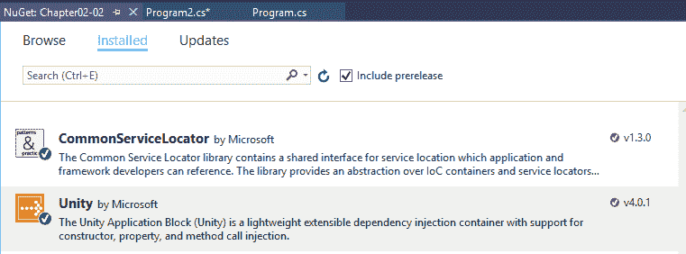

安装完成后，你会在解决方案资源管理器中看到四个新的 DLL 引用：其中三个属于 Unity，第四个属于 `CommonServiceLocator`：

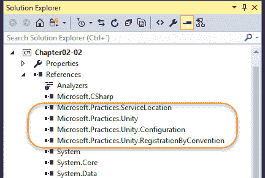

在`Microsoft.Practices.Unity.Configuration`库内部，您有工具允许您在 XML 文件中编写所需的配置，这样它就充当 DI 容器的初始设置。该命名空间中的类将允许您根据该 XML 读取和配置给定的执行上下文。

在另一方面，`Microsoft.Practices.Unity.RegistrationByConvention`库旨在提供一种可编程的配置方式，通过使用一系列规则和约定，自动将多个类型与容器注册，正如官方文档所定义的([`msdn.microsoft.com/en-us/library/dn507479(v=pandp.30).aspx`](https://msdn.microsoft.com/en-us/library/dn507479(v=pandp.30).aspx))。

现在，如果我们只想注册属于我们的业务层和数据访问层的类，那么将所有元素包含在我们的业务模型中并使我们的数据准备就绪的最明显的方法可能如下所示：

```cs
    static void Main(string[] args)
    {
      UnityContainer uc = new UnityContainer();
      uc.RegisterType<BookManager>();
      uc.RegisterType<IBookReader, XMLBookReader>();
      uc.RegisterType<IBookReader, JSONBookReader>();
      BookManager bm = uc.Resolve<BookManager>();
      bm.ReadBooks();
      Console.ReadLine();
   }
```

注意，然而，我们正在定义`BookManager`与`XMLBookReader`和`JSONBookReader`一起。这意味着如果我们运行代码，我们将得到最后一个注册的类的实例（`JSONBookReader`），它成为默认选项。原因是我们没有命名这些注册，因此它们被分配了未命名的标识符。

您可以在`Chapter02_02.Unity`命名空间内的演示中进行测试，并设置断点以证明它。

为了重现用户选择格式的初始情况，我们需要为注册的类型注册不同的别名，以便它们可以在运行时解析，传递我们需要的具体版本。

此外，请注意，Unity 扮演着之前由`BookManager`类扮演的角色。因此，在这种情况下，我们不再需要`BookManager`类：

```cs
    static void Main(string[] args)
    {
      Console.WriteLine("Please, select reading type (XML, JSON)");
      // we asume a predefault value
      var format = (Console.ReadLine() != "xml") ? "json" : "xml";
      UnityContainer uc = new UnityContainer();
      uc.RegisterType<IBookReader, XMLBookReader>("xml");
      uc.RegisterType<IBookReader, JSONBookReader>("json");
      IBookReader ibr = uc.Resolve<IBookReader>(format);
      ibr.ReadBooks();
      Console.ReadLine();
    }
```

现在，Unity 通过我们传递给`Resolve()`方法的参数解决依赖关系，正如我们可以通过在此行设置断点或简单地观察输出所看到的那样。

`UnityContainer`类接受替代注册机制。例如，我们可以使用一个完全致力于 Unity 注册的新业务层类，以下代码（注意我们应在代码的`using`部分中引用`Microsoft.Practices.Unity`）：

```cs
    public class UnityRegistration
    {
      public void Register()
      {
        using (var container = new UnityContainer())
        {
          container.RegisterTypes(
          AllClasses.FromLoadedAssemblies(),
          WithMappings.FromAllInterfaces,
          WithName.Default,
          WithLifetime.ContainerControlled);
        }
      }
    }
```

以这种方式，所有从加载的组件中加载的类都将注册到 Unity 中，所有现有接口及其实现类之间的映射（或对应关系）都得到了定义，使用它们的默认名称，并将它们的生存期分配给容器管理，因此容器本身在运行时决定何时将对象实例留给垃圾回收器。

# 使用 Castle Windsor

在基准测试和可用性测试中获胜的赢家之一，Castle Windsor 已经存在一段时间了，现在它将所有活动都聚集在其专门的 GitHub 项目网站上[`github.com/castleproject/Windsor.`](https://github.com/castleproject/Windsor)

这个项目周围的社区非常活跃，在撰写这些行的时候，已经有超过 500 个星标和 265 次分支，他们正在准备发布 3.4 版本。当然，你可以单独下载并安装它，或者使用`NuGet`以通常的方式为你的项目安装它：

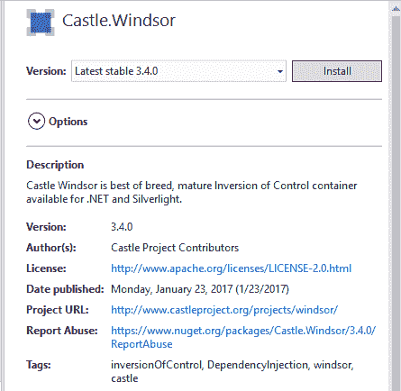

安装过程实际上安装了两个组件：Castle.Core 3.3 和 Castle.Windsor 3.4。它们共同工作，尽管它们包含了几个命名空间，以覆盖我们可能需要依赖注入（以及其他功能）的许多可能的编程场景。

Castle Windsor 的 API 集在可能性上非常丰富，官方网站上的文档让你可以通过一些示例快速开始（见[`github.com/castleproject/Windsor/blob/master/docs/basic-tutorial.md`](https://github.com/castleproject/Windsor/blob/master/docs/basic-tutorial.md)）。

对于我们的演示，我们只需要引用初始化`WindsorContainer`类所需的命名空间，然后进行注册：

```cs
    using Castle.Windsor;
    using Castle.MicroKernel.Registration; 
```

第一个允许创建一个新的`WindsorContainer`类，而另一个定义了注册所需的类。整个过程与我们之前看到的 Unity 类似：

```cs
    static void Main(string[] args)
    {
      Console.WriteLine("Please, select reading type (XML, JSON)");
      // we asume a predefault value
      var format = (Console.ReadLine() != "xml") ? "json" : "xml";
      var container = new WindsorContainer();
      container.Register(Component.For<IBookReader>().
         ImplementedBy<XMLBookReader>().Named("xml"));
      container.Register(Component.For<IBookReader>().
           ImplementedBy<JSONBookReader>().Named("json"));
      IBookReader ibr = container.Resolve<IBookReader>(format);
      ibr.ReadBooks();
      Console.ReadLine();
      // clean up, application exits
      container.Dispose();
    }
```

注意到组件类包含了静态、泛型方法，允许定义任何接口（例如这里的`IBookReader`），并且你可以通过连续调用来表示哪个类实现了什么接口以及我们想要为每个注册分配的名称，这样可以在运行时解决。

注册完成后，在具体实现中解析它的方式接受一个与我们之前使用 Unity 时相同的格式。

代码与上一个演示完全相同。

# 使用 StructureMap

这个 DI 容器的官方网站精确地定义了这种实现背后的差异和精神：

`StructureMap`是.NET 中最早的、持续使用的 IoC/DI 容器，可以追溯到 2004 年 6 月的第一次公开发布和生产使用，当时是.NET 1.1。当前的 4.0 版本代表了 StructureMap 和更大的.NET 社区 12+年的经验教训--同时也摒弃了许多不再有意义的旧设计决策。

因此，我们在这里处理的是一个老手，这意味着稳定性，以及广泛的互联网论坛和开发者网站上的存在，如`StackOverflow`。

在使用和配置背后的哲学与我们已经看到的另外两种非常相似，但它提供了多种配置应用程序的方法。正如官方文档所述：“从 3.0 版本开始，StructureMap 提供了一个简化的流畅接口，称为 Registry DSL，用于配置 StructureMap 容器，包括显式注册和传统自动注册。StructureMap 不再支持 XML 配置或 MEF 风格的属性配置--但有一些工具可以创建自己的基于属性的配置支持。”

主要区别在于它推荐通过 lambda 表达式进行配置的方法，但仍然具有类似的机制，正如你在以下代码中看到的，该代码用于在单个操作中创建和配置 Container 对象：

```cs
    var container1 = new Container(c =>
    {
      c.For<IFoo>().Use<Foo>();
      c.For<IBar>().Use<Bar>();
    });
```

另一个主要的选择是创建一个`Registry`对象，然后根据它来配置容器。类似于以下内容：

```cs
    public class FooBarRegistry : Registry
    {
      public FooBarRegistry()
      {
        For<IFoo>().Use<Foo>();
        For<IBar>().Use<Bar>();
      }
    }
    var container1 = new Container(new FooBarRegistry()); 
```

所有这些都取决于要构建的应用程序的架构和复杂性。为了我们的演示目的，我们首先通过 NuGet 引用库（这次只有一个命名空间），以展示这种安装选项：

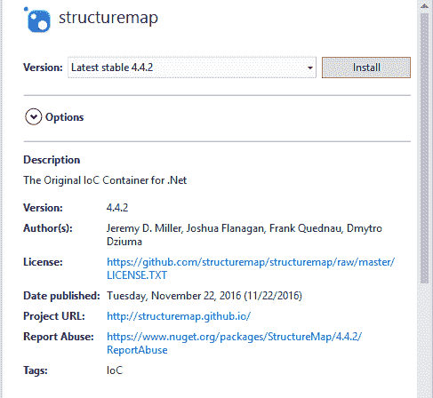

对于基本配置和使用，我们只需要引用基本的`StructureMap`命名空间：

```cs
     using StructureMap;
```

之前演示的源代码等价物将是（在执行中具有相同的结果）：

```cs
    static void Main(string[] args)
    {
      Console.WriteLine("Please, select reading type (XML, JSON)");
      // we asume a predefault value
      var format = (Console.ReadLine() != "xml") ? "json" : "xml";
      var container = new Container();

      // container configuration
      container = new Container(x => {
      x.For<IBookReader>().Add<XMLBookReader>().Named("xml");
      x.For<IBookReader>().Add<JSONBookReader>().Named("json");
    });
      var ibr = container.GetInstance<IBookReader>(format);
      ibr.ReadBooks();
      Console.ReadLine();
      // clean up, application exits
      container.Dispose();
    }
```

注意容器是如何通过传递一个 lambda 表达式到新创建的 Container 实例来配置的，在表达式体内部，我们使用了以下模式：

```cs
container à For <Interface> à Add(Class) à Named("alias")
```

前面的模式允许我们在单个操作中表达我们想要的任意多的注册。

获取`IBookReader`实例的方式略有不同，因为它不使用解析范式。反过来，我们可以找到几种解析实例的方法，如下面的截图所示：

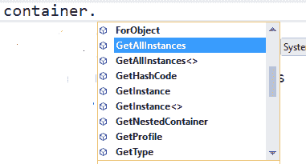

当然，执行与其他情况相同，输出中并没有真正相关的内容，你可以在`Chapter02_02.StructureMap`演示的源代码中找到。

# 使用 Autofac

我们将结束这次对.NET 容器的短暂访问，考察 AutoFac 的基本知识，这是社区中另一个广为人知的 DI 容器，它声称与涵盖.NET Core、ASP.NET Core、通用 Windows 应用和.NET Framework 4.5.1 及更高版本的版本保持最新。它还支持基于 WCF 的应用程序。

它有自己的专用网站([`autofac.org/`](https://autofac.org/))，作为起点，尽管它也可以通过`NuGet`包引用。除此之外，你还可以在这个页面或 NuGet.org 的[`www.nuget.org/packages/Autofac/`](https://www.nuget.org/packages/Autofac/)找到对几个库的引用，其中一些是专业的。

如果你决定继续在 Visual Studio 中使用`NuGet`，你应该在 NuGet 包编辑器中搜索 Autofac 时找到以下参考：

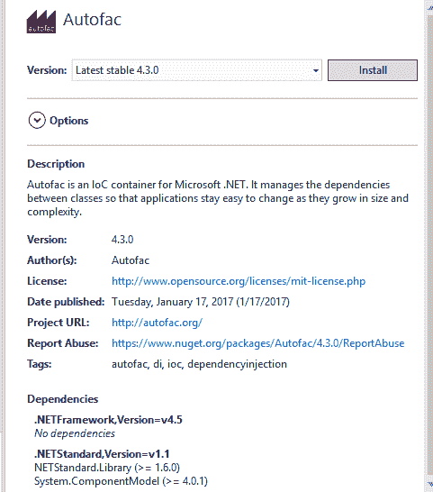

标准架构与我们已经看到的另外三个类似，有一些细微的差别。例如，这里的容器被命名为`ContainerBuilder`。

在实例化之后，我们必须配置所需的类型和接口，最后，我们应该调用`ContainerBuilder`的`Build()`方法，以确保一切准备就绪。

尽管我们可能使用与其他演示类似的方法，但在这个案例中，我们决定只注入用户选择的版本。这可以通过以下代码轻松实现：

```cs
    static void Main(string[] args)
    {
      Console.WriteLine("Please, select reading type
         (XML, JSON)");
      // we asume a predefault value
      var builder = new ContainerBuilder();
      if (Console.ReadLine() != "json")
      {
        builder.RegisterType<XMLBookReader>().As<IBookReader>();
      }
      else
      {
        builder.RegisterType<JSONBookReader>().As<IBookReader>();
      }
      var container = builder.Build();
      var ibr = container.Resolve<IBookReader>();
      ibr.ReadBooks();
      Console.ReadLine();
    }
```

简而言之，我们在 IoC 容器方面有很多选择，并且在配置它们的方式上也有很多选择，但它们都为我们提供了类似的功能：我们可以抽象出在以后时间解决的依赖项。

当然，在这种情况下，我们也可以选择其他形式的配置，比如使用 XML 或 JSON 文件，还可以使用更复杂的配置类来支持我们应用程序所需的任何可能的情况。

虽然这只是一个关于 IoC 容器的介绍，但如果你对这些 API 感兴趣，你会发现可以处理最初讨论的三个方面：对象组合、对象生命周期和拦截。

# 其他框架中的依赖注入

.NET 或 Java 并不是唯一可以找到依赖注入容器的编程环境。许多最流行的 JavaScript 框架也从一开始就支持 DI。AngularJS 就是这种情况。

# Angular 中的 DI

AngularJS (1.x) 和 Angular (2.x, 4.x 等) 可能是当今使用最广泛的 JavaScript 应用程序框架。它们在编程模型和通用目的上相当不同，所以我会区分它们两个：

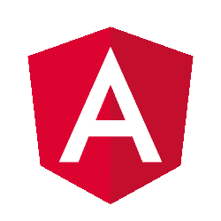

Angular 框架是 Google 团队 Misko Hevery、Igor Minar 和 Brad Green 领导的项目成果，最初于 2010 年出现。该项目已分为两个不同的分支：AngularJS 1.x 用于小型/中型项目，Angular 2（或简称 Angular）旨在满足大型/复杂项目的需求，并由于其强类型特性而使用 TypeScript 作为编程语言。

2016 年 12 月，他们宣布采用语义版本控制方法，并制定了一个持续交付路线图，每六个月发布一个新版本，非常注意避免破坏性变更。最新的版本是 2017 年 3 月出现的 Angular 4，它与 Angular 2 完全向后兼容。

这两个项目也由 Google 维护，尽管它们的编程模型和语言不同，但它们有一些共同之处：它们都推广 **单页应用程序**（SPA）模型，并且使用 **模型-视图-控制器**（MVC）架构来提供从第一刻起的责任分离。

AngularJS 以一系列库的形式呈现，用户可以选择特定目的所需的库，从而实现更好的粒度。所有库都可通过 GitHub、NuGet、NPM、Bower 等方式获取。

# 我们的第一次演示

让我们开始我们的第一次演示，并从这个初始方法中，我们将测试 AngularJS 提供的出色、集成的依赖注入系统，这在很大程度上简化了程序员的开发工作。

顺便说一句，我们可以使用任何 IDE 来与 Angular 一起工作，因为涉及到的三种语言（如果不考虑 CSS 提供的视觉方面，则是两种语言）只是 HTML 和 JavaScript。

然而，我将继续使用 Visual Studio，它对 Angular 编程有非常好的支持，并提供原生 Intellisense 功能，以及对 Angular 指令的相当不错的调试体验。

因此，让我们开始一个新的项目或一个新的网站（我们不需要任何编译的库）。我们可以在 ASP.NET 部分选择一个空项目。这会创建一个只包含 `web.config` 文件的项目，以防我们需要配置 **互联网信息服务**（IIS）。

在项目中，我们将创建一个新的 HTML 文件，一旦项目保存，我们就可以以通常的方式添加 Angular 库，通过 `NuGet 包管理器`。我们应该看到 AngularJS 现在是 1.6.x 或更高版本（我们应该选择 Angular.Core 用于此演示，这是基本模块）。

一旦我们接受安装，我们将看到一个包含 Angular 1.6 的开发（`angular.js`）和部署（`angular.min.js`）版本的 `Scripts` 文件夹，以及用于测试目的的模拟库。

我们只需要包含开发库并创建所需的最小管道，就可以看到 Angular 的实际应用——只需包含库，一些对象和服务就会被加载到内存中并准备就绪。

尤其是存在一个 `$injector` 对象，它会负责检索对象实例、实例化类型、加载模块和调用方法。

此外，Angular 创建了一个初始的基本模型，作为应用程序的根模型（$rootScope），并期望用户将一个 HTML 元素标记为应用程序的作用域。我们将在 `<body>` 标签中这样做，命名为 `app`，并使用以下语法定义一个具有相同名称的模块：

```cs
    <!DOCTYPE html>
    <html>
    <head>
     <meta charset="utf-8" />
     <title>Dependency Injection Demo</title>
     <script src="img/angular.js"></script>
    </head>
    <body ng-app="app">
     <h1>Dependency Injection Demo</h1>
     <h3>Current time: {{ time }}</h3>
     <script>
       var app = angular.module("app", []);
     </script>
    </body>
    </html>
```

注意我们使用 Angular 特定的属性（`ng-app`）来标记应用程序的作用域。这些属性在 Angular 中被称为指令，它们允许我们修改 DOM 以满足我们的需求（所有预定义的指令都以 `ng-` 开头）。

现在，我们希望我们的页面在浏览器加载时显示本地时间。在 Angular 中实现这一点的模式是选择 DOM 的一个目标区域，并将控制器分配给该区域。我们可以通过在相应的标签中包含 `ng-controller` 指令来实现这一点。

如您在代码中所见，在页面标题旁边，我们包含了一个 `<h3>` 标签来包含该信息，在该标签的文本中，一个消息，后面跟着 `{{ time }}`。

双大括号语法是 Angular 使用的一种可能的绑定机制，用于将模型内部的数据与活动视图链接起来，它被称为**胡子语法**。因此，我们以这种方式修改标签：

```cs
    <h3 ng-controller="TimeController">Current time: 
       {{ time }}</h3>
```

现在，我们有一个名为 `TimeController` 的 `ng-controller` 指令，我们需要在脚本中定义它。控制器是通过调用我们之前创建的应用程序主模块来定义的，并将一个函数作为第二个参数传递，该函数将负责与该控制器相关的逻辑。

现在，我们终于来到了 AngularJS 的依赖注入机制。这个函数应该能够访问 Angular 创建的特定模型，以存储控制器管理的信息。我们通过 `$scope` 对象来实现这一点。

每个控制器都有自己的 `$scope`（它就像一个子模型），这允许在内存中进行读写操作，并允许在 DOM 中的胡子表达式和该模型中存储的数据之间进行绑定。

那么，用户代码是如何访问那个（或任何其他）服务的呢？当然是通过依赖注入。最终的代码非常简单：

```cs
    <body ng-app="app">
    <h1>Demo Dependency Injection</h1>
    <h3 ng-controller="TimeController">Current time: 
       {{ time }}</h3>
    <script>
      var app = angular.module("app", []);
      app.controller("TimeController", function ($scope) {
      $scope.time = new Date().toLocaleTimeString();
     });
    </script>
    </body>
```

如您所见，控制器的定义接收一个字符串来标识控制器的名称，以及一个匿名函数，用于包含与该控制器相关的功能。

在那个函数中，我们只声明了 `$scope` 对象：Angular 的注入系统负责其余部分。在下一行代码中，我们可以使用那个对象，并确保其存在。更进一步，Angular 通过单例模式提供服务和此类对象，因此同一时间不会有其他的 `$scope`。

当然，输出是预期的，并且每次我们重新加载页面时，当前时间都会更新：

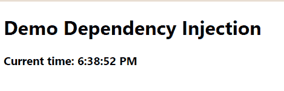

这种理念扩展到任何 AngularJS 对象或服务，甚至扩展到用户可能想要创建的服务。

在 Angular（现代版本）中，架构类似，只是它使用 TypeScript，并且首选的依赖注入方式是我们在其他演示中看到的构造函数注入模型，因为 TypeScript 是一种完全面向对象的编程语言。

在第十章《其他 JavaScript 框架中的依赖注入》中，我们将介绍 JavaScript（ES6，或 ES 2015，更确切地说）和 TypeScript 以及 Angular 2 中的依赖注入，这样您可以对现代 Web 框架中依赖注入的当前实现有更广泛的了解。

# 摘要

在本章中，我们专注于依赖注入的原则和优势，以及如何从一个非常简单的应用程序开始，通过修改它来实现类之间的解耦。

一旦我们了解了 DI 的基础，我们就简要地涵盖了三个影响这些技术应用的编程方面：对象组合、对象生命周期和拦截，这是我们将在后续章节中更详细地探讨的第一个方法。

最后，我们看到了一些流行的 IoC 容器如何实现这些概念，以及对其在其他框架（如 AngularJS）中应用的简要介绍。

在第三章，《.NET Core 2.0 中的依赖注入介绍》中，我们将开始研究.NET Core 中包含的关于依赖注入的最有趣的功能。
