# .NET Core 2.0 中的依赖注入介绍

本章是.NET Core 依赖注入技术在.NET Core 最新版本（2.0）中的首次尝试实现。它的主要功能、功能以及包含支持这些功能的类集的命名空间。

在本章中，我们将讨论以下内容：

+   总的来说，我们将讨论.NET Core 如何包括对 SOLID 原则的支持，特别是与依赖注入相关的原则

+   我们将从.NET Core 的主要特性及其在 Visual Studio 中的安装和使用开始，特别是关注最新版本 Visual Studio 2017，以及这个版本允许的不同类型的部署

+   然后，我们将深入了解.NET Core 中的依赖注入，`ActivatorUtilities`类，以及`Microsoft.Extensions.DependencyInjection`容器

+   之后，我们将看到一些与对象生命周期实现相关的演示，以及如何将接口映射到实例类，以及当应用于服务时对作用域的一些更多方面的简要回顾

+   最后，我们将看到这种依赖注入功能是如何在.NET Core 服务中实现的，特别是与日志记录相关的服务，以及大量演示如何在使用纯.NET Core 时使用它。

# .NET Core 的主要特性

我们已经在第一章《软件设计的 SOLID 原则》中解释了.NET Core 架构提案的基础，以及它如何试图成为一个变革者，因为它提供了在相同语言（C#或 VB.NET）中创建代码的可能性，能够在任何设备或平台上执行。

请注意，VB.NET 对新特性的支持总是落后于 C#语言中的新进展，因此，如果你尝试使用此语言使用某些新特性，请确保它已经实现了我们在这本书中使用的版本。

这种能力也扩展到了移动应用程序，这得益于将 Xamarin 环境（和 IDE）纳入到与.NET Core 开发相关的工具集。

# .NET Core 的主要优势

如果我们从更开发者的角度来审视这个框架，我们可以说，使.NET Core 与其他选择不同的因素可以总结如下：

+   **跨平台：** 这意味着在 Windows、macOS 和 Linux 上执行，以及将其移植到其他操作系统。您可以在各种网站上查看支持的操作系统列表，例如[`github.com/dotnet/core/blob/master/roadmap.md`](https://github.com/dotnet/core/blob/master/roadmap.md)，并且您应该记住，无论是微软还是其他公司提供的，CPU 和应用场景都将持续增长。

+   **兼容性**：.NET Core 不仅与.NET Framework 兼容，还与 Xamarin 和 Mono 兼容，这得益于.NET Standard 库。正如官方文档所述，.NET Standard 库是，

“.NET API 的正式规范，旨在在所有.NET 运行时中可用。标准库背后的动机是在.NET 生态系统中建立更大的统一性。ECMA 335 继续为.NET 运行时行为建立统一性，但对于.NET 库实现没有类似的规范。”

+   **部署**：关于运行时最有趣的特点可能是它可以在应用程序内部部署或以并排方式安装，适用于用户或机器范围

+   **独特的命令行选项**：所有独特的场景都可以在命令行工具中使用（并且这可以扩展到其他平台）

+   **开源**：.NET Core 平台自诞生以来就是开源的。它使用 MIT 和 Apache 2 许可证，文档在 Creative Commons 4.0（CC-BY）许可下发布（见[`creativecommons.org/licenses/by/4.0/`](https://creativecommons.org/licenses/by/4.0/)）。除此之外，.NET Core 是.NET Foundation（[`www.dotnetfoundation.org/`](http://www.dotnetfoundation.org/)）的项目

+   **Microsoft 的支持**：.NET Core 完全由 Microsoft 支持，您将在公司的推广网站上找到大量文档、视频、论坛等内容，这些内容通常在.NET Core 支持（[`www.microsoft.com/net/core/support/`](https://www.microsoft.com/net/core/support/)）中提及

# 在 IDE 中安装.NET Core

在第一章《软件设计的 SOLID 原则》中，我们提到您可以使用.NET Core（和 ASP.NET Core）与您选择的任何 IDE 一起使用。然而，在这本书中，我使用 Visual Studio 2017，因为它集成了工具和设施，并且对.NET Core 项目的优化程度很高。

尽管如此，由于其年轻，Visual Studio 的所有版本都没有一个共同的安装路径，并且根据您使用的版本，您会发现两种不同的方法。

# Visual Studio 2015 中.NET Core 的安装路径

如果您想使用 Visual Studio 2015，您应该安装更新 3.3。它可以从以下链接获取：[`www.visualstudio.com/en-us/news/releasenotes/vs2015-update3-vs`](https://www.visualstudio.com/en-us/news/releasenotes/vs2015-update3-vs)。在这个网站上，您将看到更新如何与.NET Core 1.0.0 和.NET Core 1.0.0 SDK Preview 2 相关。

如果您对此版本不确定，请转到帮助菜单中的“关于 Microsoft Visual Studio”，并确保版本号是 14.0.25424.00 或更高版本，并且包含更新 3。

您还需要：

+   Visual Studio 的 **NuGet 管理器** 扩展（你知道，NuGet 是微软开发的官方包管理器，我们可以确信它包含所有版本的 .NET Core）。你需要 NuGet 3.5.0-beta 或更高版本来构建 .NET Core 应用程序。

+   .**NET Core 工具预览版 2+**，负责 Visual Studio 2015 的项目模板和其他工具，你可以在 [`go.microsoft.com/fwlink/?LinkID=827546`](https://go.microsoft.com/fwlink/?LinkID=827546) 找到它。

# Visual Studio 2017 中的 .NET Core

对于 Visual Studio 2017 来说，情况相当不同，因为它负责安装先决条件，只要你在初始安装过程中选择了 .NET Core 和 Docker 工作负载（记住，在 Visual Studio 2017 中，安装是模块化的，所以默认情况下，它只安装最小功能集）。

就像在之前的例子中发生的那样，如果你想确认已安装的版本，只需在“帮助/关于 Visual Studio”菜单中进行检查，看看你是否拥有版本 15.0.26020.0 或更高版本。

# 部署类型

我们已经提到了 .NET Core 允许为你的应用程序使用两种不同的部署方式--**框架依赖部署（FDD**）和**自包含部署（SCD**）。选择哪一个取决于目标系统和我们对它的知识和管理控制程度。

让我们简要回顾一下这两种部署类型之间的主要区别及其对任何 .NET Core 编译过程产生的程序集管理和结构的影响：

+   框架依赖部署依赖于目标系统上安装的共享 .NET Core 版本。如果这种情况成立，则应用程序可以在 .NET Core 的不同安装之间移植。

+   注意，在这种情况下，该应用程序仅包含其自身的代码以及任何位于 .NET Core 库之外的第三方依赖项。这是因为 FDD 包含可以通过命令行中的 `dotnet` 工具启动的 `.dll` 文件。记住，如果你启动，例如，命令 `dotnet application1.dll`，这就足够运行名为 `application1.dll` 的应用程序了。

+   在另一方面，SCD 应用程序不依赖于目标系统上安装的任何外部代码。也就是说，所有组件（包括 .NET Core 库和 .NET Core 运行时）都包含在最终的、可安装的包中，并且与其他 .NET Core 应用程序隔离。

+   因此，SCD 包含一个可执行文件（例如，在 Windows 平台上名为 `app1.exe` 的应用程序）。这是特定平台 .NET Core 主机的重命名版本，以及一个 DLL 文件（例如 `app.dll`），这是实际的应用程序。

+   因此，你正在将 .NET Core 的具体版本作为可执行文件与你的应用程序一起部署，它将始终以 DLL 的形式存在，并在由可执行文件创建的上下文中运行。

如您所见，这是一个非常不同的方法，也许是我们第一次能够使用.NET 生成完全独立的可执行应用程序。

# 在.NET Core 中检查其他依赖项

在我们继续了解.NET Core 功能之前，明智的做法是记住，依赖项不仅涉及类之间的关系，还涉及构建应用程序所使用的组件，IDE 在定义和可视化分析这些依赖项时可能会帮助我们，即使应用程序已经编译完成。

在这样一个框架中，这些组件总是从 NuGet（或任何其他有效存储库）下载，并在 Visual Studio 2017 项目中以动态方式更新，这一点尤为重要。

不注意这些方面可能会导致许多问题。其中，我想强调以下问题：

+   可维护性问题

+   安全漏洞

+   许可证滥用

+   不需要的依赖项

为了帮助开发者防止依赖项问题，从 Visual Studio 2010 版本开始，IDE 提供了创建层图的能力，自那个版本以来，这些图一直在持续发展。

使用这些图，您可以表达层之间的依赖关系，这些依赖关系不仅通过图例显示，从最新版本（2017）开始，还在代码本身中显示。

当您设计这些图之一时，可以使用设计器提供的符号来表达依赖关系，包括单向和双向依赖、层以及简单的形状，正如您可以在以下屏幕截图中所见：

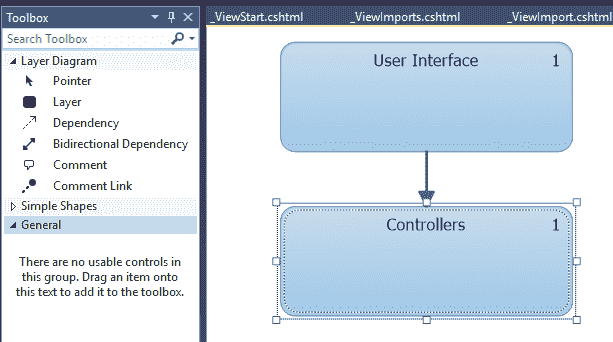

此图是通过 IDE 中与架构菜单相关的新菜单选项创建的，它还展示了与代码分析相关的某些功能，例如代码图生成、创建外部文件（包括文件）的图，以及其他功能。总的来说，该选项提供了以下选项：

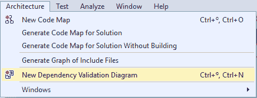

请记住，此架构菜单仅在 V.Studio 2017 Enterprise 中可用。

这份菜单中的一个新选项是依赖项验证图，它将打开一个新的编辑窗口，在这里我们可以从解决方案中拖放元素，包括文件夹、文件（C# 和 VB.NET）甚至程序集。我们可以将这些功能视为 IDE 提供的其他实现，用于研究任何应用程序的依赖项。

这种技术是从头开始使用 Roslyn 重建的（参考 Pack 的《精通 C#和.NET Framework》一书，了解更多关于此功能的信息和演示），它允许编码者以完全定制的方式配置编辑器的行为，编程 IDE 在遇到代码（甚至在其他程序集，因为该工具接受拖放已编译的组件）中的任何这些功能时应如何响应。

一旦你在图中建立了关系和依赖，这个新的 Intellisense 将能够验证现有代码，向程序员建议不同应用域内的冲突区域。

实际上，你可以在配置中激活这些功能，这样一旦发现问题，你将看到一个波浪线突出显示你的违规代码，同时还有一个问题根源的指示。

例如，我们可以确定哪些类可以存在于每个应用程序的命名空间中。如果一个类被移动到依赖关系图中禁止的命名空间，代码编辑器本身将显示提示，同样，在错误列表窗口中也会显示（见以下截图）：

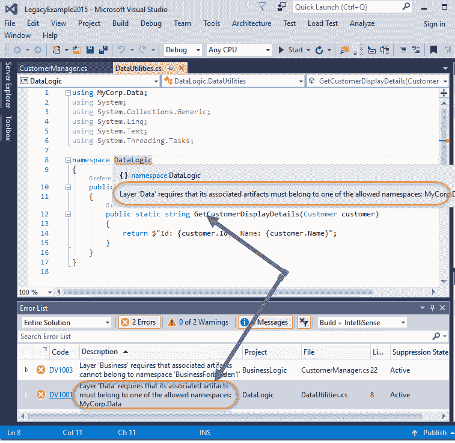

当然，这种行为也是可配置的，这些功能与其他选项无关，我们在分析菜单中找到的选项，如代码度量、性能分析器等。

# .NET Core 中的依赖注入

当处理与.NET Core 相关的依赖注入的正确功能时，有许多先前的方法需要考虑。其中之一是`new`是粘合剂的格言，这是我们经常作为建议听到的。

这意味着每次你创建一个类的新的实例（你使用`new`关键字），在幕后都有一些代码的凝聚力。你是在建立这样一个事实，即定义该实例的类将依赖于实例化的类。

我们已经看到了如何通过工厂或使用专注于 DI 问题的第三方库来解决这个问题，但在这个章节中，我们将依靠框架本身提供的这些功能来实现相同的结果。

理想情况下，这是我们能够定义的，一旦定义注册，每次我们需要任何预定义类的实例时，其他东西应该负责提供这个实例。

换句话说，我们看到的与其他 DI 容器相关的行为（或多或少）也应该在这里存在，并涵盖那些资深容器提供的重要功能，包括对象的生命周期、注册和泛型类和接口的定义等。

# DI 架构和对象的生命周期

考虑到前面提到的点，即使我们知道我们正在处理框架的初始版本，.NET Core 团队设计了基于两个想法的依赖注入功能：

+   在一方面，已经存在的一些功能，可以完美地扩展到.NET Core 内部工作

+   在另一方面，他们认为将其他倡议中最常用的功能包含在内是明智的，无论是微软的还是外部的，比如那些在 Prism Patterns & Practices 或第三方 DI 容器中存在的功能（记得我们在前几章中看到的四个容器）

因此（遵循这些想法），在处理对象的生存周期时，.NET Core 提供了三种类型，这取决于实例的配置和使用方式--单例（Singleton）、作用域（Scoped）和瞬态（Transient）。

+   这些选项不仅影响我们定义它们的方式，还影响我们使用它们的方式，在某些情况下，还需要考虑线程安全预防措施和其他方面。

+   在单例选项中，使用对象的唯一实例（这意味着我们只管理对象的引用）。任何进一步的请求都使用相同的实例，根据单例模式。

+   作用域版本仅限于其使用的上下文，不会超出该上下文。

+   最后，每次请求时，瞬态选项都会创建该类的新实例。

虽然包含在 ASP.NET Core 文档中，但 Microsoft 提供了以下图表，与这些选项相关：

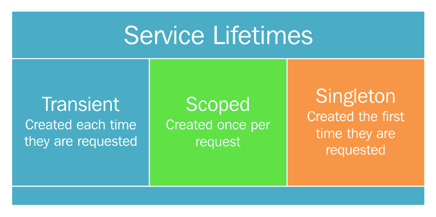

由于在现实世界中，此功能主要与 ASP.NET Core 应用程序、服务和中间件相关联，因此它们会显示有助于任务的函数（这就是为什么那些引用是针对*请求*的）。但实际上，它同样适用于纯.NET Core 应用程序。

正如我们最初提到的，这部分功能与`Microsoft.Extensions.DependencyInjection`命名空间相关，该命名空间包含同名的 DLL，它可以与另一个辅助 DLL（如`Microsoft.Extensions.DependencyInjection.Abstractions`）和其他 DLL 一起工作。

具体来说，`IServiceCollection`接口是一组提供方法的类的基类，这些方法可以通过 DI 使用这三种选项来实例化对象（在这个上下文中通常称为服务）。我们将在下一节中看到这一点，但也会在第四章，*ASP.NET Core 中的依赖注入*中看到，该章节专门介绍 ASP.NET Core。

# `ActivatorUtilities`类和其他辅助类

在我们进入演示之前，请记住，这个命名空间中包含的类数量相当大，因为它试图提供广泛的覆盖范围，同时仍然是多平台的。

其中一个例子是`ActivatorUtilities`类，它也包含在`Microsoft.Extensions.DependencyInjection`库中，该库包含静态方法，有助于配置和实现服务、实例和工厂，从而简化 DI 管理和控制。

因此，如果你发现自己缺少某些功能或功能，请查看[`docs.microsoft.com`](http://docs.microsoft.com)上的文档，但请注意，你会发现它与 ASP.NET Core 相关。

这意味着你将在互联网和其他来源看到的大多数实现都不会链接到.NET Core 应用程序，而是链接到 ASP.NET Core 应用程序，在这些应用程序中，许多此类功能默认为不同场景实现。

显然，这些类中还有更多内容，我们无法在一个章节中全部涵盖。

为了让你了解与这个类相关的可能性，我包括了一个官方文档中呈现的功能摘要，提醒你每个方法和其主要用途：

| **方法摘要** | **描述** |
| --- | --- |
| [CreateFactory(Type, Type[])](https://docs.microsoft.com/en-us/aspnet/core/api/microsoft.extensions.dependencyinjection.activatorutilities#Microsoft_Extensions_DependencyInjection_ActivatorUtilities_CreateFactory_System_Type_System_Type___) | 创建一个委托，该委托将使用直接提供的构造函数参数和/或从 `System.IServiceProvider` 提供的参数实例化一个类型。 |
| [CreateInstance(IServiceProvider, Type, Object[])](https://docs.microsoft.com/en-us/aspnet/core/api/microsoft.extensions.dependencyinjection.activatorutilities#Microsoft_Extensions_DependencyInjection_ActivatorUtilities_CreateInstance_System_IServiceProvider_System_Type_System_Object___) | 使用直接提供的构造函数参数和/或从 `System.IServiceProvider` 提供的参数实例化一个类型。 |
| <p>[CreateInstance<T>(IServiceProvider, Object[])](https://docs.microsoft.com/en-us/aspnet/core/api/microsoft.extensions.dependencyinjection.activatorutilities#Microsoft_Extensions_DependencyInjection_ActivatorUtilities_CreateInstance__1_System_IServiceProvider_System_Object___) | 使用直接提供的构造函数参数和/或从 `System.IServiceProvider` 提供的参数实例化一个类型。 |
| [GetServiceOrCreateInstance(IServiceProvider, Type)](https://docs.microsoft.com/en-us/aspnet/core/api/microsoft.extensions.dependencyinjection.activatorutilities#Microsoft_Extensions_DependencyInjection_ActivatorUtilities_GetServiceOrCreateInstance_System_IServiceProvider_System_Type_) | 从服务提供程序中检索给定类型的实例。如果没有找到，则直接实例化。 |
| [GetServiceOrCreateInstance<T>(IServiceProvider)](https://docs.microsoft.com/en-us/aspnet/core/api/microsoft.extensions.dependencyinjection.activatorutilities#Microsoft_Extensions_DependencyInjection_ActivatorUtilities_GetServiceOrCreateInstance__1_System_IServiceProvider_) | 从服务提供程序中检索给定类型的实例。如果没有找到，则直接实例化。 |

现在是时候开始使用 `**Microsoft.Extensions.DependencyInjection**` 和 `**Microsoft.Extensions.DependencyInjection.Abstractions**` 库中与依赖注入相关的主要类了。

# Microsoft.Extensions.DependencyInjection 容器

你在网上看到的关于依赖注入和 .NET Core 的大多数示例都将引用 ASP.NET Core 应用程序，因为当你使用 Visual Studio 内置的预定义模板时，它默认包含。

然而，如果你想从头开始了解依赖注入的工作原理，使用 ASP.NET Core 应用程序并不是强制性的。也就是说，我们必须手动配置服务的注册。这意味着某些额外的方面，例如严重级别、对象的生存期以及可处置功能，如果想让这种架构无缝工作。

由于 .NET Core 提供了自己的容器，与外部库 `Microsoft.Extensions.DependencyInjection` 链接（现在在 2.0 版本中），我们必须通过 NuGet 包引用它。

对于第一次演示，我们可以创建一个简单的 .NET Core 控制台应用程序，使用 NuGet 包插件引用库，并在网上查找其名称。你会发现，当你过滤该名称时，NuGet 包管理器会显示该库的几个版本（见以下截图）：

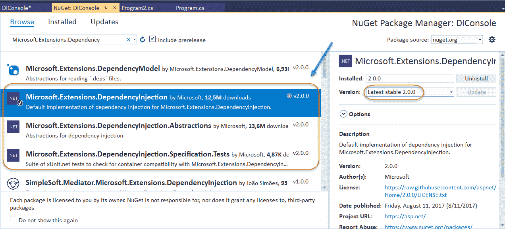

如你所见，其他库也被声明为补充的（`Microsoft.Extensions.DependencyInjection.Abstractions` 和 `Microsoft.Extensions.DependencyInjection.Specification.Tests`）。第一个（`Abstractions`）在安装完成后也应该出现在我们的项目中作为引用。但就目前而言，让我们专注于主要库。

在此刻，不要害怕下面的对话框。它会告诉你将更新一大堆库，并且还将安装另一组新的库。原因可能是双重的——一方面，使用该库的最新版本意味着根据 Visual Studio 2017 使用的内部库依赖管理器更新先前引用的其他库。

另一方面，安装一些新的库，如这个库，可能意味着其他依赖项，因此我们最终有两个不同的更新区域（安装后转到解决方案资源管理器中的依赖项部分）。

Visual Studio 2017 将列出所有正在更新的库，如果你向下滚动一点，还会显示所有依赖库的列表：

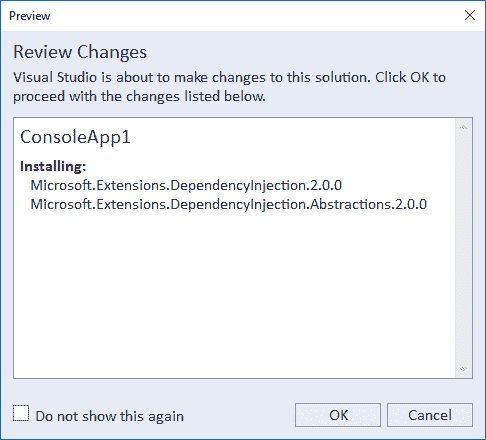

在此对话框之后，你将看到一个包含每个库许可接受的新对话框。完成后，解决方案资源管理器依赖项部分将出现另一个条目，指向 NuGet。那里你可以找到所有新东西。

进一步查看这些新条目将揭示与那个 DependencyInjection 引用链接的所有主要和依赖库，可能有一些。

由于我们最初只想测试这个命名空间的工作方式，我们将以非常简单的方式进行测试（可以说，我受到了 Jurgen Gustch 的博客文章《在 .NET Core 控制台应用程序中使用依赖注入》的启发，因为对于这种初始方法，我发现它特别适合且具有解释性）。

因此，我修改了这些想法来创建几个类，其中一个类恰好依赖于另一个（即，第一个类引用第二个类）。

仅为了完整性，我增加了一个额外的方法来检查调用正确的时间，并且实现了 `IDisposable` 接口，以便能够通过垃圾回收器传达有关销毁的信息（关于这一点稍后讨论）。

因此，我最终得到了以下代码（在默认由模板创建的 `Program` 类之外）：

```cs
    public class DependencyClass1 : IDisposable 
    { 
      private readonly DependencyClass2 _DC2; 
      public DependencyClass1(DependencyClass2 DC2instance) 
      { 
        _DC2 = DC2instance; 
        Console.WriteLine("Constructor of DependencyClass1 finished"); 
      } 
      public void CurrentTime() 
      { 
        string time = DateTime.Now.Hour.ToString() + ":" + 
           DateTime.Now.Minute.ToString() + ":" + 
           DateTime.Now.Second.ToString(); 
        Console.WriteLine($"Current time: {time}"); 
      } 
      public void Dispose() 
      { 
        _DC2.Dispose(); 
        Console.WriteLine("DependencyClass1 disposed"); 
      } 
    } 
    public class DependencyClass2 : IDisposable 
    { 
      public DependencyClass2() 
      { 
        Console.WriteLine("Constructor of DependencyClass2 finished"); 
      } 

      public void Dispose() 
      { 
        Console.WriteLine("DependencyClass2 Disposed"); 
      } 
    } 
```

注意，`DependencyClass1` 会负责在完成使用后销毁 `DependencyClass2`。

现在是当需要 `DependencyInjection` 类的时候。首先，我们在代码顶部引用相应的命名空间（对于这个简单的演示只需要两个命名空间）：

```cs
    using Microsoft.Extensions.DependencyInjection; 
    using System; 
```

然后，在 `Program` 类中，我们需要注册和使用这些类。第一步是使用 `ServiceCollection` 类的新实例来执行。

在这个类中，我们可以找到注册所有所需服务的方法，同时配置了之前提到的对象的生命周期，如下面的截图所示：

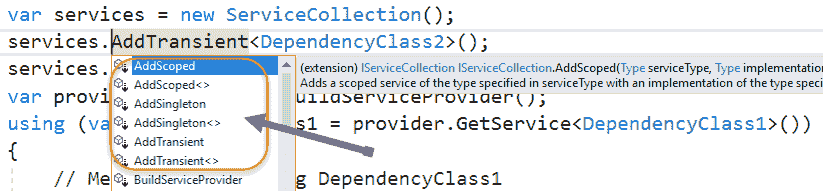

如我们稍后将会看到的，我们提供了每个方法的两个版本--通用和非通用。这为我们提供了更多的灵活性，可以将不同的类和服务集成到我们的依赖注入架构中。

对于这个初始版本，我们使用方法的 `AddTransient` 通用版本，每次我们在代码中创建引用时，它将返回每个类的新的实例。

一旦我们的类注册完毕，就需要根据这个定义构建一个提供者。这是通过在刚刚创建的 `ServicesCollection` 类上调用 `BuildServiceProvider()` 来完成的（我们稍后会回到服务提供者）。但就现在而言，只需说一个 `IServiceProvider` 接口的实例将被创建并配置为管理使用 `Add*` 方法注册的任何先前注册的类的请求即可。

另一点需要指出的是，对象的实例化遵循了您可能已经从其他上下文（如 LINQ）中了解的懒加载模式。这意味着直到请求第一个 DI 对象的实例之前，不会创建任何内容。

因此，即使我们不做任何（有用）的事情，一旦请求 `DependencyClass1`，整个依赖注入机制就会启动。

以下代码在 `Program` 类中被修改以配置此架构：

```cs
    static void Main(string[] args) 
    { 
      Console.WriteLine("Dependency Injection Demo"); 
      Console.WriteLine("Basic use of the Microsoft.Extensions.
          DependencyInjection Library"); 
      Console.WriteLine("--------------------------------------
          ---------------------------"); 
      var services = new ServiceCollection(); 
      services.AddTransient<DependencyClass2>(); 
      services.AddTransient<DependencyClass1>(); 
      var provider = services.BuildServiceProvider(); 
      using (var DC1Instance = provider.GetService<DependencyClass1>()) 
      { 
        // Merely by declaring DC1Instance 
        // everything gets launched, but we also call 
        // CurrentTime() just to check functionality 
        DC1Instance.CurrentTime(); 
        // Notice also how classes are properly disposed 
        // after used. 
      } 
      Console.ReadLine(); 
    } 
```

如您在以下输出中看到的，一切按预期工作：

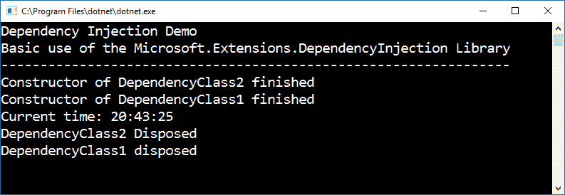

代码展示了每当我们需要一个类的实例时，我们都会调用通用的 `GetService()` 方法，并且我们可以在下一句中开始使用它。

另一个需要注意的方面是，对 `DependencyClass2` 的引用先出现，因此它先进行清理。请记住，`DependencyClass1` 的构造函数接收 `DependencyClass2` 的一个实例，所以它不会完成，直到后者完全创建。

此外，在处置第一个类之前，我们调用第二个类的 `Dispose`，这就是为什么顺序是相反的。

# 检查对象的生命周期

我们应该仔细考虑的此架构的另一个重要方面，是从其生命周期的角度来看我们如何获取实例。让我们看看在这个演示中的差异，添加引用并更改它们在 `IServiceProvider` 类中的注册方式。

如果我们为第一个类创建另一个实例会发生什么？正如预期的那样，当我们将代码中的 `using` 块改为包含 `DependencyClass1` 的另一个实例时，例如以下代码：

```cs
    using (var DC1Instance = provider.
         GetService<DependencyClass1>()) 
    { 
      // Merely by declaring DependencyClass1  
      // everything gets launched, but we also call 
      // CurrentTime() just to check functionality 
      DC1Instance.CurrentTime(); 
      // Notice also how classes are properly disposed 
      // after used. 
      var DC1Instance2 = provider.GetService<DependencyClass1>(); 
      DC1Instance2.CurrentTime(); 
    } 
```

输出发生了明显的变化，因为我们迫使引擎创建一个新的实例，而不是重用之前的实例：

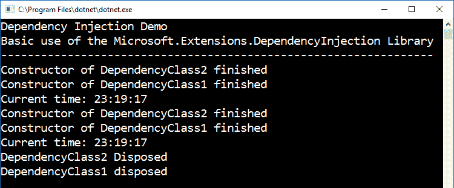

如前一个屏幕截图所示，我们让 DI 引擎调用构造函数两次，因为我们使用了 `services` 配置对象的 `AddTransient()` 版本。

然而，在这种情况下，如果我们更改 `AddSingleton` 的 `AddScoped` 注册方法，我们将重用相同的对象实例，因此可以节省内存和资源。

例如，只需以这种方式更改这两行代码：

```cs
    services.AddScoped<DependencyClass2>(); 
    services.AddScoped<DependencyClass1>(); 
```

我们可以通过简单地查看相应的输出来检查不同的创建行为：

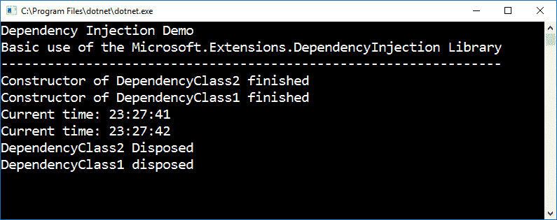

如您所见，`CurrentTime` 函数仍然被调用了两次，但正在使用的实例数量只有一个。

在这种情况下，我们将使用 `AddSingleton<>()` 方法得到完全相同的输出，因为在这种情况下，存在一个巧合，并且不会使用超过一个实例。

此服务提供的功能的另一个有趣方面是，作为一个泛型集合本身，我们可以在运行时添加/删除/清除服务实例，因此我们可以始终完全控制集合中的内容以及定义和实例化的顺序。

为了达到这个目的，我们找到了像 `Clear()`、`Contains()`、`IndexOf()`、`Insert()`、`InsertAt()`、`Remove` 和 `RemoveAt()` 这样的方法，就像我们在任何其他泛型集合中找到的方法一样。

# 将接口映射到实例类

之前的演示足够简单，可以理解 `Microsoft.Extensions.DependencyInjection` 库内部的依赖注入（DI）的基本原理，但在实际应用中，你可能会定义一些接口和一系列实现这些接口的类。

在这种情况下，能够将接口映射到实现它们的类会更方便，因此你只需请求相应接口的实现，思考接口提供的功能（要解决的问题的业务问题），而不是实现它的具体类。

另一个优点是我们能够在运行时更改定义（记住，这是一个我们可以添加/删除项的集合），因此根据我们应用程序的需求，重新定义任何之前的映射到新的映射是完全可能的。

与先前的演示一样，我们使用一个非常简单的方法来展示这一点。我创建了两个接口和两个实现它们的类，每个类都有一个将基本消息写入`Console`的方法。这是初始代码：

```cs
    public interface IXMLWriter 
    { 
      void WriteXML(); 
    } 
    public interface IJSONWriter 
    { 
      void WriteJSON(); 
    } 
    public class XMLWriter : IXMLWriter 
    { 
      public void WriteXML() 
      { 
        Console.WriteLine("<message>Writing in XML Format</message>"); 
      } 
    } 
    public class JSONWriter : IJSONWriter 
    { 
      public void WriteJSON() 
      { 
        Console.WriteLine("{'message': 'Writing in JSON Format'}"); 
      } 
    } 
```

类和接口之间存在对应关系，因此我们现在可以引用接口，让 DI 引擎决定返回给我们哪个类实例。这与我们在上一章使用第三方 DI 容器时看到的演示非常相似。

为了达到这个目的，`ServiceCollection`类支持一种定义引用的替代方式，在调用`GetService<Interface>()`时，你可以传递（泛型签名）一个接口名称和映射该接口的类。

在请求这些实现之一时，我们将请求预定义接口的实例，而不是具体类。

注意，我们还有通过`GetRequiredService<Interface>()`方法请求服务的另一种方式，如果服务类型未注册，它会抛出异常。

假设这个变更，演示的实现相当简单：

```cs
    static void Main(string[] args) 
    { 
      var services = new ServiceCollection(); 
      services.AddTransient<IXMLWriter, XMLWriter>(); 
      services.AddTransient<IJSONWriter, JSONWriter>(); 
      var provider = services.BuildServiceProvider(); 
      Console.WriteLine("Dependency Injection Demo (2)"); 
      Console.WriteLine("Mapping Interfaces to instance classes"); 
      Console.WriteLine("--------------------------------------"); 
      Console.WriteLine("Please, select message format 
          (1):XML // (2):JSON"); 
       var res = Console.ReadLine(); 
      if (res == "1") 
      { 
        var XMLInstance = provider.GetService<IXMLWriter>(); 
        XMLInstance.WriteXML(); 
      } 
      else 
      { 
         var JSONInstance = provider.GetService<IJSONWriter>(); 
         JSONInstance.WriteJSON(); 
      } 
      Console.ReadLine(); 
    } 
```

与前一种情况不同，我们不请求一个特定的类，而是请求实现所需接口的类。

输出再次符合预期（见以下截图）：

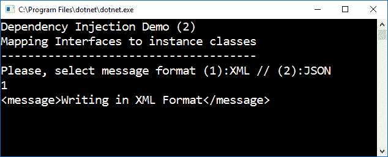

注意，注册的方式与我们之前在其他 DI 容器中看到的方式类似。也就是说，如果我们使用这种语法，最新注册的映射就是返回的映射，尽管这可以动态地改变。

另一个非常有用的功能是`GetServices<Interface>`方法，因为它允许我们恢复所有已注册的服务并随意调用它们。

我们可以通过添加几个实现相同接口的新类并将它们与之前的类一起注册来证明这一点：

```cs
    public class XMLWriter2 : IXMLWriter 
    { 
      public void WriteXML() 
      { 
        Console.WriteLine("<message>Writing in XML Format (2)</message>"); 
      } 
    } 
    public class JSONWriter2 : IJSONWriter 
    { 
      public void WriteJSON() 
      { 
        Console.WriteLine("{'message': 'Writing in JSON Format (2)'}"); 
      } 
   } 
```

在这些定义之后，我们在相同的接口合约下注册这两个类，因此它们可以一起访问：

```cs
    services.AddTransient<IXMLWriter, XMLWriter>(); 
    services.AddTransient<IXMLWriter, XMLWriter2>(); 
    services.AddTransient<IJSONWriter, JSONWriter>(); 
    services.AddTransient<IJSONWriter, JSONWriter2>(); 
    Now we can use a whole collection by asking for it by means of the 
       GetServices<Interface>() method that I mentioned above: 
    var registeredXMLServices = provider.GetServices<IXMLWriter>(); 
    foreach (var svc in registeredXMLServices) 
    { 
      svc.WriteXML(); 
    } 
```

由于我们使用的是定义的接口功能，我们知道它们都将实现`WriteXML()`函数，即使它们实现的方式不同。

你可以在相应的输出中看到不同的调用：

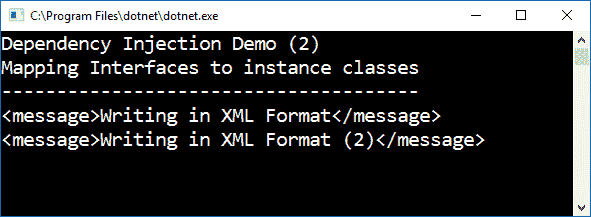

获取整个服务列表的另一种替代方法，当然是从 `services` 集合本身。为此，我们需要另一个由 `Microsoft.Extensions.DependencyInjection` 库提供的辅助类。

在这种情况下，过程是创建一个包含我们 `ServiceCollection` 类中所有服务信息的 `ServiceDescriptor` 集合。我们使用枚举器和 `CopyTo()` 方法（它期望 `ServiceCollection` 作为第一个参数）来创建这样一个集合：

```cs
    var myServiceArray = new ServiceDescriptor[services.Count]; 
    // Copy the services into an array. 
    services.CopyTo(myServiceArray, 0); 
    IEnumerator myEnumerator = myServiceArray.GetEnumerator(); 
    Console.WriteLine("The Implementation Types in the array are"); 
    while (myEnumerator.MoveNext()) 
    { 
      var myService1 = (ServiceDescriptor)myEnumerator.Current; 
      Console.WriteLine(myService1.ImplementationType); 
    } 
```

当集合被复制到 `ServiceDescriptor` 集合时，我们可以看到至少五个可能后来用于确定在特定场景中所需服务的有趣属性：

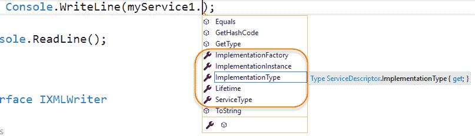

注意，在这里我们请求 `ImplementationType` 属性以获取所有定义的类型：

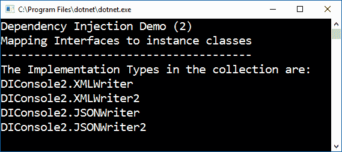

这为我们提供了如何独立于服务在集合中的位置来选择单个服务的线索。与这一功能相关联的另一个辅助方法是简单的 `Contains()` 方法，它要求一个唯一的 `ServiceDescriptor` 对象作为其参数。

要获取我们服务容器中当前注册的组件的信息，另一个简单的方法是直接遍历它，使用一个简单的 `foreach` 循环：

```cs
    //Description of properties in the service collection  
    foreach (var svc in services) 
    { 
      Console.WriteLine($"Type: {svc.ImplementationType} \n" + 
         $"Lifetime: {svc.Lifetime} \n" + 
         $"Service Type: {svc.ServiceType}"); 
    } 
```

注意，根据服务注册的方式和其他编程功能，并非所有属性都将有值（在这种情况下，只请求接口（`ServiceType`）、实现（`Types`）及其生命周期是有意义的）。

这在我们有多个实现相同接口的类时也很有用，因为我们可以根据这些值来决定我们需要哪一个：

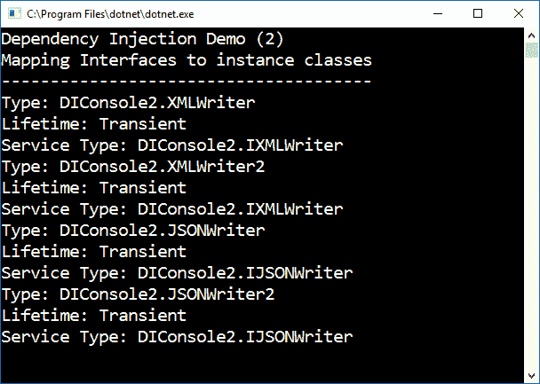

此外，还可以使用一些与这里暗示的命名空间相关联的辅助类来执行 `a posteriori` 注册。例如，`ServiceProviderServiceExtensions` 类包含一个静态方法，能够获取与特定提供者相关联的给定 `ServiceType`。

换句话说，只要你能传递相应的提供者作为参数，你就可以获取一个已注册服务的实例，而无需使用注册它的 `ServiceCollection`。

我已经创建了一个之前演示的变体，这次在每个 `*writer` 类中包含一个只读属性来保存一个唯一的标识符（一个 `GUID`），这样就可以很容易地确定我们是否正在使用相同的或另一个服务实例。

考虑以下代码（前一个演示的变体）：

```cs
    static void Main(string[] args) 
    { 
      var services = new ServiceCollection(); 
      services.AddSingleton<IXMLWriter, XMLWriter>(); 
      var provider = services.BuildServiceProvider(); 
      Console.WriteLine("Dependency Injection Demo (3)"); 
      Console.WriteLine("Choice between implementations"); 
      Console.WriteLine("------------------------------"); 
      // Instance via services class 
      var XMLInstance = provider.GetService<IXMLWriter>(); 
      XMLInstance.WriteXML(); 
      // Instance via ServiceProviderServiceExtensions 
      var XMLInstance2 = ServiceProviderServiceExtensions. 
                       GetService<IXMLWriter>(provider); 
      XMLInstance2.WriteXML();     
      Console.ReadLine(); 
    } 
```

如您所见，我们正在使用两种不同的方法来获取相同的实例（通过其 `GUID` 标识）。我们可以通过比较两个输出（见以下截图）来测试它：

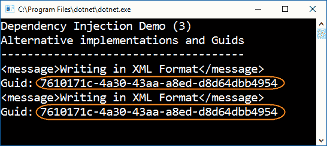

这在某种情况下可能特别有用，在这种情况下，出于某种原因，调用服务可能不适合或不方便。

除了`ServiceCollection`的`BuildServiceProvider`方法之外，还可以通过辅助类获取提供者。为此，我们可以使用`CreateDefaultServiceProvider`类，它也有实例方法来创建提供者或`Builder`。

目前，这两个是该类唯一可用的可能性，但在某些场景中，它也可以非常有用，在这些场景中我们更愿意不使用服务集合：

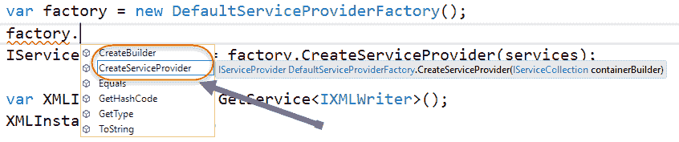

以下代码是通过`DefaultServiceProvider`类创建的提供者：

```cs
    var services = new ServiceCollection(); 
    services.AddSingleton<IXMLWriter, XMLWriter>(); 
    // Provider via DefaultServiceProviderFactory 
    var factory = new DefaultServiceProviderFactory(); 
    IServiceProvider prov = factory.CreateServiceProvider(services); 
    var XMLInstance = prov.GetService<IXMLWriter>(); 
    XMLInstance.WriteXML(); 
```

我在这里省略了输出，因为它与之前的演示完全相同，你可以在本章伴随的代码中自行检查。

这不是我们获取服务提供者的唯一方式。是的，还有另一种方式，与`ServiceCollectionContainerBuilderExtensions`类的静态方法`BuildServiceProvider`相关联。

在这种情况下，编程甚至更简单，因为我们不需要类的任何实例，代码简化为以下代码：

```cs
    var services = new ServiceCollection(); 
    services.AddSingleton<IXMLWriter, XMLWriter>(); 
    // Provider via ServiceCollectionContainerBuilderExtensions 
    IServiceProvider prov = ServiceCollectionContainerBuilderExtensions. 
        BuildServiceProvider(services); 
    var XMLInstance = prov.GetService<IXMLWriter>(); 
    XMLInstance.WriteXML(); 
```

只是为了得到与我们之前相同的结果（再次，我省略了输出）。

# 将作用域概念应用于服务

在处理服务和与 DI 相关的其他功能时，一个重要的问题是定义其范围。DI 文档将服务的范围与其生命周期紧密相关联，因此，与垃圾收集器应该销毁该服务的时刻相关联。

我们之前已经讨论过 Transitory 和 Singleton 的生命周期，但 Scope 生命周期确实有点令人困惑。

具体来说，实现了`IDisposable`接口的`IServiceDispose`接口包含了一个`Disposed of()`方法，该方法在调用时结束作用域生命周期。它包含在`Microsoft.Extensions.DependencyInjection.Abstractions.dll`中。

更详细地说，文档中声明：“*一旦此对象被销毁，从* *M**icrosoft.Extensions.DependencyInjection.IServiceScope.ServiceProvider 解析出的任何作用域服务也将被销毁*”。

它的声明如下：

```cs
    public interface IServiceScope : IDisposable 
```

如果你记得本章的第一个演示，我们的`DependencyClass1`和`DependencyClass2`类实现了`IDisposable`接口，因此我们可以在类的主要操作完成后调用这些方法。

正如我们在第四章，“ASP.NET Core 中的依赖注入”中将会看到的，这个概念特别适合某些互联网应用的场景，在这些场景中，对某些服务的生命周期进行特定控制非常有意义，并且始终可以通过实例类访问执行上下文。

在第四章，“ASP.NET Core 中的依赖注入”中，你会看到这个特性在面对性能问题、服务器资源、可伸缩性问题等时可能非常重要。

# 其他具有 DI 功能的扩展

与 `Microsoft.Extensions` 全局命名空间相关联，我们发现了一些在开发者中越来越受欢迎的相关命名空间，因为它们有助于应用程序生命周期的不同领域。

其中两个最常用的库是 `Microsoft.Extensions.Logging` 和 `Microsoft.Extensions.Logging.Console`，您可以使用我们在本章中看到的依赖注入技术来配置和编写日志服务。它们提供了类似于其他流行框架（如 Serilog、Log4Net 或 NLog）的功能。

我在谈论 `ILoggerFactory` 和 `ILogger<T>`，它们主要用于（尤其是在 ASP.NET Core 应用中）在运行时发出信息，并具有将信息重定向到不同目标（控制台、输出窗口等）的能力。

但它们也可以用于监控和调试 .NET Core 应用程序，尽管它们不提供我们在那些更专业的框架中找到的全部资源，但很多时候它们足以满足我们的需求。

# 对 .NET Core 结构的反思

看到 .NET Core 的创造者如何基于依赖注入原则设计这项技术，非常有趣。这就是为什么，除了它作为开发者工具的价值之外，我们还可以看到在 .NET Core 库中默认实现依赖注入（DI）的额外价值。

这两个类都位于 `Microsoft.Extensions.Logging` 命名空间内，但其他互补的命名空间，如 `Microsoft.Extensions.Logging.Console` 和 `Microsoft.Extensions.Logging.Debug`，也允许我们使用在下一个演示中将要使用的扩展日志功能。它们可以通过 NuGet 包轻松引用，就像我们之前做的那样。

为了使用尽可能简单的代码来演示事物，我将使用之前演示的简化版本，这次只使用一个外部类 `XMLWriter` 及其相应接口，并进行了一些细微的改动。

就像在 `DependencyInjection` 命名空间中一样，当在搜索框中按此标准筛选时，`Microsoft.Extensions.Logging` 会出现在 `Configuration` 和 `Dependency` 库旁边（请注意，我们总共需要四个额外的库，包括 `Logging.Console` 和 `Logging.Debug`）：

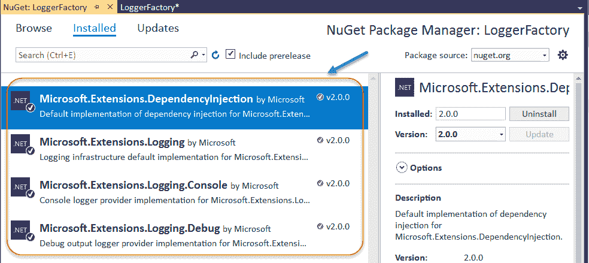

安装了这些库之后，如果您对这些 API 的可能性感到好奇，您还可以检查在 `Solution Explorer` 中出现的引用，它位于 NuGet 引用条目旁边。

这些日志服务提供的功能包括将信息写入 `Console`，使用不同类型的消息（根据输出的性质：调试、信息、警告或错误）以及使用多种颜色和格式来表示这些类别。

Mark Michaelis 在他的 MSDN 文章 *Essential .NET - Dependency Injection with .NET Core* 中清楚地解释了我们发现与 .NET Core 链接的一些 DI 实现的优势。

他指出，当你想要在某个服务的不同实现之间切换，并避免硬编码对任何服务实现的引用时，请求此类实例的工厂会更加可扩展和易于维护，就像我们在其他演示中所做的那样。`ILoggerFactory` 实现了该功能。

他更进一步，强调说：“*你请求一个接口（例如 ILoggerFactory**）的期望是服务提供者（在这种情况下，NLog、Log4Net 或 Serilog）将实现该接口*”。

因此，`ILoggerFactory` 即使与第三方库一起也是可扩展的！他还评论说：“*结果是，虽然客户端将直接引用定义服务接口的抽象程序集（Logging.Abstractions），但不需要引用直接实现*”。

实际上，你可能已经注意到 `ServiceCollection` 本身有一个名为 `AddLogging()` 的方法，这是一个方便的方法，用于激活集合的日志功能。这个调用实际上是将 `ILoggerFactory` 服务作为我们正在配置的服务集合的一部分的内部注册。

考虑到我们也可以连接调用来配置我们的服务集合，让我们看看我们的新 `Main()` 方法的第一部分，包括那个调用：

```cs
    // Enabling logging with the ServiceCollection 
    var services = new ServiceCollection() 
      .AddSingleton<IXMLWriter, XMLWriter>() 
      .AddLogging(); 
   var serviceProvider = services.BuildServiceProvider(); 
```

因此，我们通过 `AddLogging()` 在 `ServiceCollection` 中启用日志记录。那么，发生了什么？让我们通过迭代结果服务对象来检查我们的集合现在具有的新成员，就像在之前的演示中那样：

```cs
    // Test the register of AddLoggin() 
    foreach (var svc in services) 
   { 
      Console.WriteLine($"Type: {svc.ImplementationType} \n" + 
        $"Lifetime: {svc.Lifetime} \n" + 
        $"Service Type: {svc.ServiceType}"); 
   } 
```

我们将获得一个包含三个服务的集合（见下面的输出），因为 `AddLogging()` 方法确实已将 `LoggingFactory` 类注册为 `ILoggingFactory` 接口，以及另一个泛型类，`ILogger<>`。该 `ILogger<>` 类将被配置为提供将日志消息发送到控制台的能力，为任何其他类：

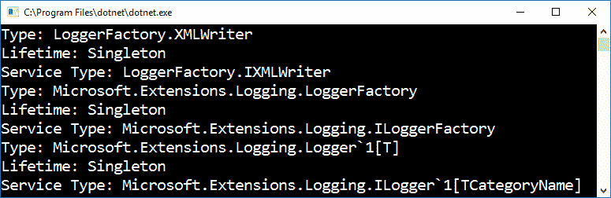

因此，下一步是获取一个 `ILoggerFactory` 对象，并将其与 `Console` 相关联，我们通过以这种方式调用 `AddConsole()` 来执行此操作：

```cs
    //Obtain service and configure logging 
    serviceProvider.GetService<ILoggerFactory>() 
      .AddConsole(LogLevel.Debug); 
```

正如你所见，`AddConsole` 预期一些额外的配置，形式为 `LogLevel` 类型的 `enum` 值，它决定了运行时在向控制台发送消息时将过滤的最小严重程度级别——每当日志系统接收到条目时，如果它低于该级别，它将忽略它。

# 日志级别严重性

`LogLevel` 枚举还建立了消息的优先级（如果我们想区分低级消息和高级消息，甚至将它们重定向到不同的输出窗口，这非常有用）。

根据官方文档，这些级别按以下顺序组织（从最低严重性到最高严重性）：

+   **跟踪 = 0**：对于只有开发人员在调试问题时才有价值的信息。这些消息可能包含敏感的应用程序数据，因此不应在生产环境中启用。默认情况下禁用。例如，凭证：`{"User":"someuser", "Password":"P@ssword"}`

+   **调试 = 1**：对于在开发和调试期间具有短期有用性的信息。例如，使用 fl the g 设置为 true 进入`Configure`方法。

+   **信息 = 2**：用于跟踪应用程序的一般流程。这些日志通常具有一些长期价值。例如，接收到的路径`/api/todo`的请求。

+   **警告 = 3**：对于应用程序流程中的异常或意外事件。这些可能包括不会导致应用程序停止的错误或其他条件，但可能需要调查。处理异常是使用警告日志级别的常见地方。例如，对于文件`quotes.txt`的`FileNotFoundException`。

+   **错误 = 4**：对于无法处理的错误和异常。这些消息表明当前活动或操作（如当前 HTTP 请求）失败，而不是应用程序级别的失败。例如，日志消息：`由于重复键违反无法插入记录`。

+   **关键 = 5**：对于需要立即注意的失败。例如，数据丢失场景，磁盘空间不足。

IDE 还通过 IntelliSense 服务显示这些级别，以及每个目的和功能的说明：

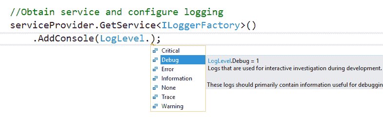

这样，当我们请求引用时返回的`ILoggerFactory`服务将根据调试级别配置将任何输出重定向到控制台，除非有其他指示。

`ILogger`和`ILoggerFactory`接口位于`Microsoft.Extensions.Logging.Abstractions`中，它们的默认实现位于`Microsoft.Extensions.Logging`。

现在，如果我们想让这两个类（`XMLWriter`和`Program`）都使用这些日志服务，我们需要为每个类提供一个`ILogger`实例。我们将开始为`Program`创建一个实例，并在控制台中展示一组初始消息：

```cs
    // Create a logger class from ILoggerFactory 
    // and print an initial set of messages. 
    var ILoggerService = serviceProvider.GetService<ILoggerFactory>(); 
    var logger = ILoggerService.CreateLogger<Program>(); 
```

注意到创建日志类意味着调用`CreateLogger<Program>()`泛型方法。一旦实例化，日志器就有方法来声明不同的作用域（标记每个作用域的开始和结束）以及向控制台发送六种不同类型的消息，每种消息代表不同的严重级别：

```cs
    logger.LogCritical("Critical format message from Program"); 
    logger.LogDebug("Debug format message from Program"); 
    logger.LogError("Error format message from Program"); 
    logger.LogInformation("Information format message from Program"); 
    logger.LogTrace("Trace format message from Program"); 
    logger.LogWarning("Warning format message from Program");  
```

如果我们查看输出，我们可以欣赏到这些消息格式之间的差异：

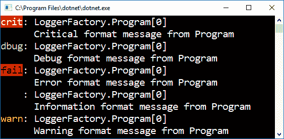

如您所见，不同的消息严重级别在输出中生成不同的格式，使用不同的颜色和前缀来表示其`LogLevel`类别。但是，等等！有一个缺失的（`Trace`消息）。

嗯，还不完全是。发生的事情是，`Trace` `LogLevel`不会输出到控制台，它主要准备用于启用跟踪开关的 Web 应用程序（我们将在第四章，*ASP.NET Core 中的依赖注入*）中。

所以，所有这些都说完了，我们如何使用这个架构和从我们的`XMLWriter`类中使用的日志服务呢？让我们改变实现方式，以便我们使用我们在上一章中看到的一个 DI 模式——构造函数依赖模型。

要使用该模型，我们必须稍微改变我们的`XMLWriter`类，以包括一个只读属性，它持有`ILogger<>`实例，并在类的构造函数中分配其值。因此，这次我们独特的`XMLWriter`类的最终格式将是（接口定义尚未受到影响，所以它和之前的演示相同）：

```cs
    public class XMLWriter : IXMLWriter 
    { 
      private readonly ILogger<XMLWriter> logger; 
      public XMLWriter(ILoggerFactory loggerFactory) 
      { 
        logger = loggerFactory.CreateLogger<XMLWriter>(); 
      } 
      public void WriteXML() 
      { 
        logger.LogInformation("<message>Writing in XML Format
          (via Logger)</message>"); 
      } 
    } 
```

剩下的唯一事情就是使用`logger`代替之前的`Console`调用，并调用一个`Log*`方法来生成预期的输出。就是这样。

我们已经完全用`ILogginFactory`和`ILogger`对象提供的日志服务替换了`Console`类提供的功能，我们还可以配置严重级别以生成不同的输出格式。

所以，考虑到所有这些，我们最终得到了这个实现版本的`Main`方法：

```cs
    static void Main(string[] args) 
    { 
      // Enabling logging in the ServiceCollection 
      // via AddLogging() 
      var services = new ServiceCollection() 
        .AddSingleton<IXMLWriter, XMLWriter>() 
        .AddLogging(); 
      var serviceProvider = services.BuildServiceProvider(); 
      //Obtain service and configure logging 
      serviceProvider.GetService<ILoggerFactory>() 
        .AddConsole(LogLevel.Debug); 

      // Create a logger class from ILoggerFactory 
      // and print all types of messages. 
      var ILoggerService = serviceProvider.GetService<ILoggerFactory>(); 
      var logger = ILoggerService.CreateLogger<Program>(); 
      logger.LogCritical("Critical format message from Program"); 
      logger.LogDebug("Debug format message from Program"); 
      logger.LogError("Error format message from Program"); 
      logger.LogInformation("Information format message from Program"); 
      logger.LogTrace("Trace format message from Program"); 
      logger.LogWarning("Warning format message from Program"); 

      //Instantiation of XMLInstance 
      var XMLInstance = serviceProvider.GetService<IXMLWriter>(); 
      XMLInstance.WriteXML(); 

      logger.LogDebug("Process finished!"); 
      Console.Read(); 
    } 
```

正如我们在最终输出中可以看到的（请参阅以下截图），所有消息都按照它们被调用的顺序在控制台中呈现，使用.NET Core 配置的预定义格式，包括我们的`XMLWriter`消息：

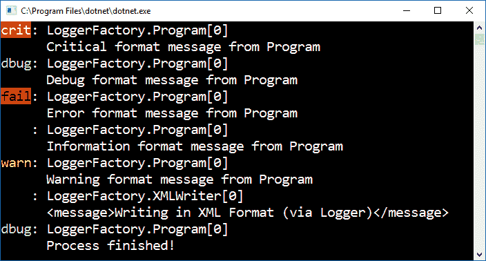

这还不是全部。我们还有其他一些选项可供选择，允许我们分离和过滤输出消息的目的地。这种可能性与`Microsoft.Extensions.Logging.Debug`库相关联，它也应该像我们在这里使用的其他库一样被引用。

该库包含的一个功能是`ILoggerFactory`的`AddDebug()`方法。一旦激活，它允许我们将消息发送到调试窗口，并能够根据消息的严重级别进行条件分离，例如。

为了测试这个功能，我们将在`IXMLWriter`接口的定义中做一些更改，并相应地更新实现。我们的新接口将有一个额外的方法，该方法也会将消息发送到预定义的输出（在这种情况下，将在运行时出现在几个地方）：

```cs
    public interface IXMLWriter 
    { 
        void WriteXML(); 
        void WriteXMLWithSeverityLevel(); 
    } 
```

因此，XMLWriter 的更新代码将是：

```cs
    public class XMLWriter : IXMLWriter 
    { 
      private readonly ILogger<XMLWriter> logger; 
      public XMLWriter(ILoggerFactory loggerFactory) 
      { 
        loggerFactory.AddDebug().AddConsole(LogLevel.Information); 
        logger = loggerFactory.CreateLogger<XMLWriter>(); 
      } 
      public void WriteXML() 
      { 
        logger.LogDebug( 
            "<msg>First Message (LogDebug/SeverityLevel: 
                 Information)</msg>"); 
      } 
      public void WriteXMLWithSeverityLevel() 
      { 
        logger.LogDebug( 
            "<msg>Second Message (LogDebug/SeverityLevel: 
                 Information</msg>"); 
      } 
    } 
```

因此，现在我们有两种不同的方法来写入消息。为了测试这个功能，我们可以在`Main()`方法中配置`ILoggerService`对象（记住，它是`ILoggerFactory`类型）。一旦新的命名空间被加载并可用，我们可以写入：

```cs
    var ILoggerService = serviceProvider.GetService<
          ILoggerFactory>(); 
    ILoggerService.AddDebug(); 
```

以这种方式，我们允许将消息发送到`Debug`或`Output`窗口，无论是控制台还是 Web 应用程序。

测试不同的选项很容易，只需更改调用此方法时使用的严重性级别类型，以及现有的那些。例如，我们可以调用`WriteXMLWithSeverityLevel()`并观察在执行过程中生成的两个输出（现在我们有两个）：

```cs
    //Instantiation of XMLInstance 
    var XMLInstance = serviceProvider.GetService<IXMLWriter>(); 
    XMLInstance.WriteXML(); 
    XMLInstance.WriteXMLWithSeverityLevel(); 
```

一方面，输出现在显示了新的消息（没有意外）：

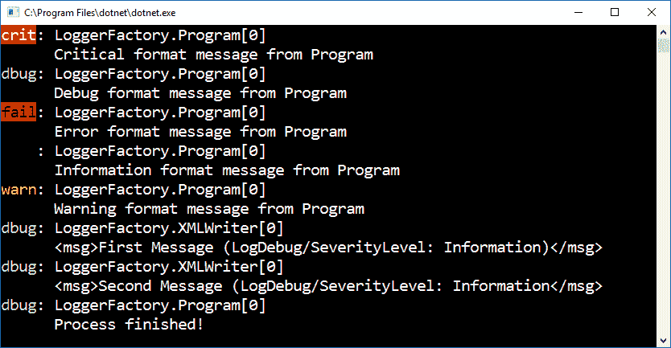

但是，现在我们有了更多的消息。如果我们查看`输出`窗口，我们会看到根据我们配置的`LogLevel`出现的新条目——其中一些将被展示，而其他一些则会被忽略（正如你所见，在这个版本中，只有前四条消息被复制到输出窗口中，所有 XMLWriter 消息都被忽略）：

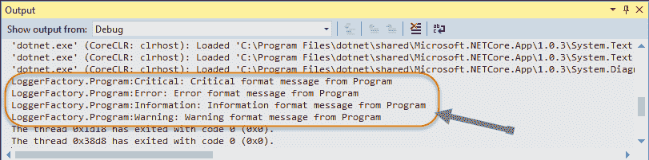

这只是对采用 DI 架构的一些服务以及.NET Core 内部可用的服务的初步了解。当我们处理 ASP.NET Core 编码时，在第四章，“ASP.NET Core 中的依赖注入”中，我们将看到更多关于这些实现的细节。

# 摘要

在本章中，我们初步探讨了如何在当前版本的.NET Core（2.0）中支持和使用依赖注入技术，以及我们如何在 ASP.NET 项目之外使用它们。

总结来说，我们已经看到了.NET Core 的主要特性和从 Visual Studio 安装和使用的步骤，特别是关注最新版本，Visual Studio 2017，以及与这个框架版本相关的不同类型的部署，以及包含在 DI 和相关命名空间中的主要功能和功能。

我们还分析了与此架构相关的类和接口，以及通过一系列示例实现它的方法，最后是一些真实实现，它们已经是.NET Core 2.0 的一部分，例如日志服务，以及如何从任何类中使用它们。

在第四章，“ASP.NET Core 中的依赖注入”，我们的方法将更加真实，因为它涉及到 Web 应用程序以及网站的新架构和配置如何管理这些新概念，例如中间件和服务配置，其中 DI 从一开始就扮演着重要角色。
